# 第三章：自然语言处理与文本嵌入

在深度学习中有许多不同的文本表示方式。尽管我们已经涵盖了基本的**词袋（bag-of-words）**（**BoW**）表示法，但毫不奇怪，还有一种更复杂的文本表示方式，称为嵌入。虽然词袋向量仅作为句子中单词的计数，嵌入则帮助数值化定义了某些单词的实际含义。

在本章中，我们将探讨文本嵌入，并学习如何使用连续词袋模型创建嵌入。然后我们将讨论 n-gram，以及它们如何在模型中使用。我们还将涵盖各种标注、分块和分词方法，以将自然语言处理拆分为其各个组成部分。最后，我们将看看 TF-IDF 语言模型及其在加权模型中对不经常出现的单词的有用性。

本章将涵盖以下主题：

+   词嵌入

+   探索 CBOW

+   探索 n-gram

+   分词

+   词性标注和分块

+   TF-IDF

# 技术要求

GLoVe 向量可以从 [`nlp.stanford.edu/projects/glove/`](https://nlp.stanford.edu/projects/glove/) 下载。建议使用`glove.6B.50d.txt`文件，因为它比其他文件要小得多，并且处理起来更快。后续章节将需要 NLTK。本章的所有代码可以在 [`github.com/PacktPublishing/Hands-On-Natural-Language-Processing-with-PyTorch-1.x`](https://github.com/PacktPublishing/Hands-On-Natural-Language-Processing-with-PyTorch-1.x) 找到。

# NLP 中的嵌入

单词没有自然的方式来表示它们的含义。在图像中，我们已经有了富向量表示（包含图像中每个像素的值），所以显然将单词表示为类似富向量的表示是有益的。当语言部分以高维向量格式表示时，它们被称为**嵌入**。通过对单词语料库的分析，并确定哪些单词经常在一起出现，我们可以为每个单词获取一个*n*长度的向量，这更好地表示了每个单词与所有其他单词的语义关系。我们之前看到，我们可以轻松地将单词表示为单热编码向量：

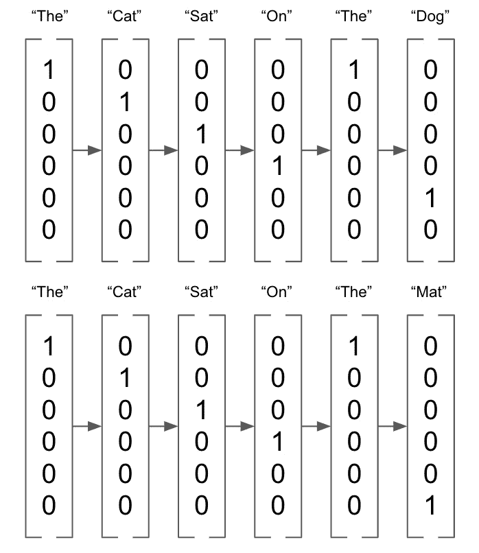

图 3.1 – 单热编码向量

另一方面，嵌入是长度为*n*的向量（在以下示例中，*n*=3），可以取任何值：

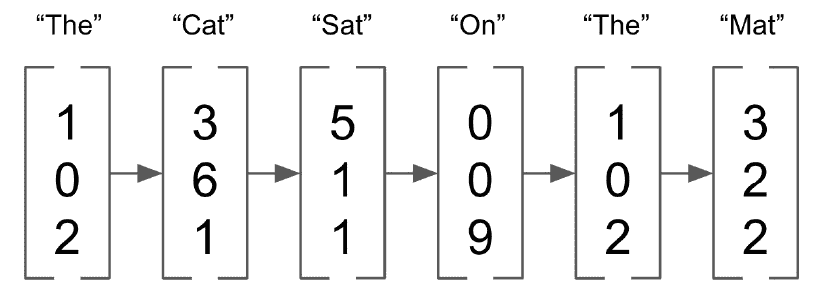

图 3.2 – n=3 的向量

这些嵌入代表了*n*维空间中单词的向量（其中*n*是嵌入向量的长度），在这个空间中具有相似向量的单词被认为在意义上更相似。虽然这些嵌入可以是任何尺寸，但它们通常比 BoW 表示的尺寸要低得多。 BoW 表示需要的向量长度是整个语料库的长度，当考虑整个语言时，可能会非常快速地变得非常大。尽管嵌入足够高维度以表示单词，但它们通常不比几百维大。此外，BoW 向量通常非常稀疏，大部分由零组成，而嵌入富含数据，每个维度都有助于单词的整体表示。低维度和非稀疏性使得在嵌入上执行深度学习比在 BoW 表示上执行更加高效。

## GLoVe

我们可以下载一组预先计算的单词嵌入来演示它们的工作原理。为此，我们将使用**全球词向量表示**（**GLoVe**）嵌入，可以从这里下载：[`nlp.stanford.edu/projects/glove/`](https://nlp.stanford.edu/projects/glove/) 。这些嵌入是在一个非常大的 NLP 数据语料库上计算的，并且是基于单词共现矩阵进行训练的。这是基于这样的概念：一起出现的单词更有可能具有相似的含义。例如，单词*sun*更可能与单词*hot*一起频繁出现，而不是与单词*cold*一起，因此*sun*和*hot*更可能被认为是更相似的。

我们可以通过检查单个 GLoVe 向量来验证这一点：

1.  首先，我们创建一个简单的函数来从文本文件中加载我们的 GLoVe 向量。这只是构建一个字典，其中索引是语料库中的每个单词，值是嵌入向量：

    ```py
    def loadGlove(path):
        file = open(path,'r')
        model = {}
        for l in file:
            line = l.split()
            word = line[0]
            value = np.array([float(val) for val in                           line[1:]])
            model[word] = value
        return model
    glove = loadGlove('glove.6B.50d.txt')
    ```

1.  这意味着我们可以通过从字典中调用来访问单个向量：

    ```py
    glove['python']
    ```

    这导致以下输出：

    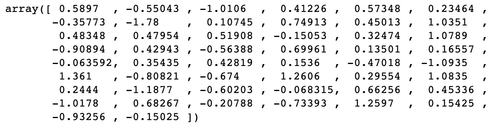

    图 3.3 – 向量输出

    我们可以看到，这返回了 Python 这个词的 50 维向量嵌入。现在我们将介绍余弦相似度的概念，以比较两个向量的相似度。如果*n*维空间中它们之间的角度为 0 度，则向量将具有相似度为 1。具有高余弦相似度的值可以被认为是相似的，即使它们不相等。可以使用以下公式计算这一点，其中 A 和 B 是要比较的两个嵌入向量：

    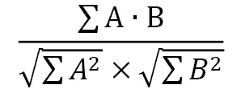

1.  我们可以在 Python 中使用`Sklearn`的`cosine_similarity()`函数轻松计算这个。我们可以看到`cat`和`dog`作为动物具有相似的向量：

    ```py
    cosine_similarity(glove['cat'].reshape(1, -1), glove['dog'].reshape(1, -1))
    ```

    这导致以下输出：

    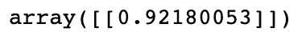

    图 3.4 – cat 和 dog 的余弦相似度输出

1.  然而，`cat`和`piano`是非常不同的，因为它们是两个看似不相关的物品：

    ```py
    cosine_similarity(glove['cat'].reshape(1, -1), glove['piano'].reshape(1, -1))
    ```

    这导致以下输出：

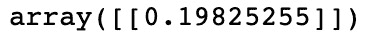

图 3.5 – cat 和 piano 的余弦相似度输出

## 嵌入操作

由于嵌入是向量，我们可以对它们执行操作。例如，假设我们取以下类型的嵌入并计算以下内容：

*Queen-Woman+Man*

通过这个，我们可以近似计算*king*的嵌入。这实质上是将*Queen*的*Woman*向量部分替换为*Man*向量，以获得这个近似。我们可以用图形方式说明如下：

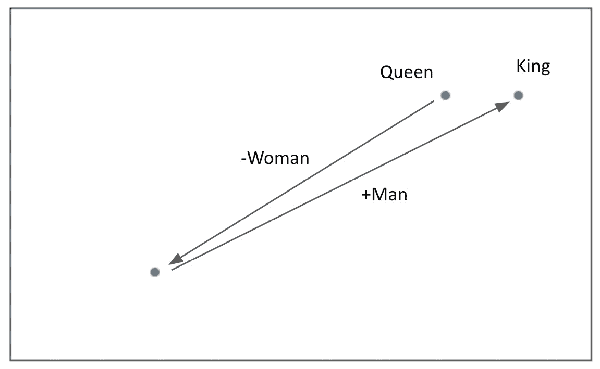

图 3.6 – 示例的图形表示

请注意，在这个例子中，我们以二维图形方式进行了说明。在我们的嵌入中，这发生在一个 50 维空间中。虽然这不是精确的，我们可以验证我们计算的向量确实与**King**的 GLoVe 向量相似：

```py
predicted_king_embedding = glove['queen'] - glove['woman'] + glove['man']
cosine_similarity(predicted_king_embedding.reshape(1, -1), glove['king'].reshape(1, -1))
```

这导致以下输出：

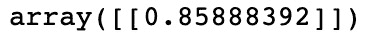

图 3.7 – GLoVe 向量输出

虽然 GLoVe 嵌入非常有用且预先计算的嵌入，但我们实际上可以计算自己的嵌入。当我们分析特别独特的语料库时，这可能非常有用。例如，Twitter 上使用的语言可能与维基百科上使用的语言不同，因此在一个语料库上训练的嵌入可能对另一个语料库无效。我们将展示如何使用连续词袋来计算自己的嵌入。

# 探索 CBOW

**连续词袋模型（CBOW）**：这是 Word2Vec 的一部分，由 Google 创建，用于获取单词的向量表示。通过在非常大的语料库上运行这些模型，我们能够获得详细的单词表示，这些表示代表它们在语义和上下文上的相似性。Word2Vec 模型包含两个主要组成部分：

+   **CBOW**：这个模型试图在文档中预测目标词，给定周围的单词。

+   **跳字模型（Skip-gram）**：这是 CBOW 的相反，这个模型试图根据目标词来预测周围的单词。

由于这些模型执行类似的任务，我们现在只关注其中一个，具体来说是 CBOW 模型。这个模型旨在预测一个词（**目标词**），给定其周围的其他单词（称为**上下文**单词）。一种考虑上下文单词的方法可以简单到只使用目标词前面的单词来预测目标词，而更复杂的模型可以使用目标词前后的几个单词。考虑以下句子：

*PyTorch 是一个深度学习框架*

假设我们想预测*deep*这个词，给定上下文单词：

*PyTorch is a {target_word} learning framework*

我们可以从多个角度来看待这个问题：

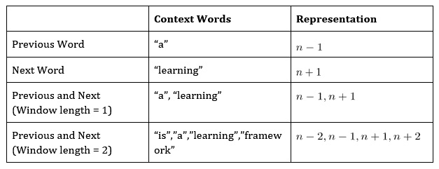

图 3.8 – 上下文和表示表

对于我们的 CBOW 模型，我们将使用长度为 2 的窗口，这意味着对于我们模型的 (*X, y*) 输入/输出对，我们使用 *([n-2, n-1, n+1, n+2, n])*，其中 *n* 是我们要预测的目标单词。

使用这些作为我们模型的输入，我们将训练一个包括嵌入层的模型。这个嵌入层会自动形成我们语料库中单词的 n 维表示。然而，起初，这一层会用随机权重进行初始化。这些参数是我们模型学习的内容，以便在模型训练完成后，这个嵌入层可以被用来将我们的语料库编码成嵌入向量表示。

## CBOW 架构

现在我们将设计我们模型的架构，以便学习我们的嵌入。在这里，我们的模型输入四个单词（目标单词之前两个和之后两个），并将其与输出（我们的目标单词）进行训练。以下是这个过程可能看起来的一个示例：

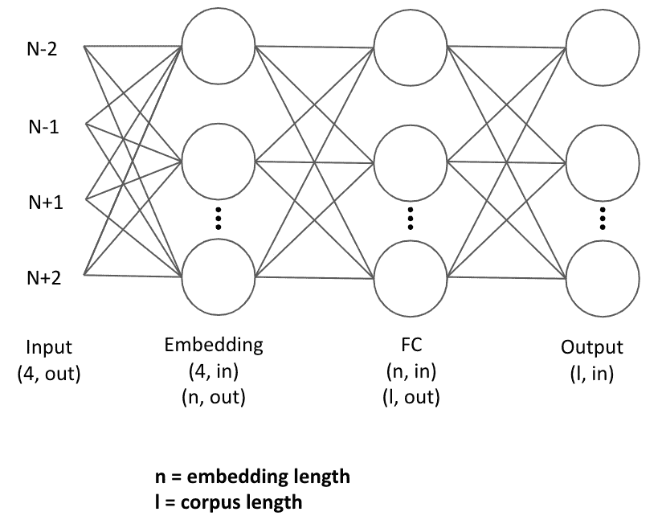

图 3.9 – CBOW 架构

我们的输入单词首先通过一个嵌入层进行处理，表示为大小为 (n,l) 的张量，其中 n 是我们嵌入的指定长度，l 是语料库中的单词数。这是因为语料库中的每个单词都有其独特的张量表示。

使用我们四个上下文单词的组合（求和）嵌入，然后将其馈送到全连接层，以便学习目标单词的最终分类，根据我们上下文单词的嵌入表示。请注意，我们预测的/目标单词被编码为与我们语料库长度相同的向量。这是因为我们的模型有效地预测每个单词成为目标单词的概率，而最终分类是具有最高概率的那个单词。然后，我们计算损失，通过网络反向传播，更新全连接层的参数以及嵌入本身。

这种方法有效的原因是，我们学习到的嵌入表示语义相似性。假设我们在以下内容上训练我们的模型：

*X = ["is", "a", "learning", "framework"]; y = "deep"*

我们的模型本质上学习的是，目标单词的组合嵌入表示在语义上与我们的目标单词相似。如果我们在足够大的单词语料库上重复这个过程，我们会发现我们的单词嵌入开始类似于我们之前见过的 GLoVe 嵌入，即语义相似的单词在嵌入空间中彼此接近。

## 构建 CBOW

现在我们将展示如何从头开始构建一个 CBOW 模型，从而演示如何学习我们的嵌入向量：

1.  我们首先定义一些文本并执行一些基本的文本清理，删除基本的标点并将其全部转换为小写：

    ```py
    text = text.replace(',','').replace('.','').lower().                            split()
    ```

1.  我们首先定义我们的语料库及其长度：

    ```py
    corpus = set(text)
    corpus_length = len(corpus)
    ```

1.  注意，我们使用集合而不是列表，因为我们只关注文本中的唯一单词。然后，我们构建我们的语料库索引和逆语料库索引。我们的语料库索引将允许我们获取给定单词本身时的单词索引，这在将我们的单词编码输入到我们的网络时将会很有用。我们的逆语料库索引允许我们根据索引值获取单词，这将用于将我们的预测转换回单词：

    ```py
    word_dict = {}
    inverse_word_dict = {}
    for i, word in enumerate(corpus):
        word_dict[word] = i
        inverse_word_dict[i] = word
    ```

1.  接下来，我们对数据进行编码。我们遍历我们的语料库，对于每个目标单词，我们捕获上下文单词（前两个单词和后两个单词）。我们将目标单词本身追加到我们的数据集中。请注意，我们从我们的语料库的第三个单词（索引=`2`）开始此过程，并在语料库末尾停止两步。这是因为开头的两个单词不会有两个单词在它们前面，类似地，结尾的两个单词也不会有两个单词在它们后面：

    ```py
    data = []
    for i in range(2, len(text) - 2):
        sentence = [text[i-2], text[i-1],
                    text[i+1], text[i+2]]
        target = text[i]
        data.append((sentence, target))

    print(data[3])
    ```

    这导致以下输出：

    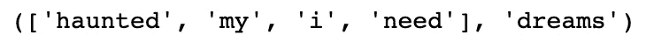

    图 3.10 – 编码数据

1.  然后我们定义我们的嵌入长度。虽然这个长度在技术上可以是任意你想要的数字，但是有一些需要考虑的权衡。虽然更高维度的嵌入可以导致单词更详细的表示，但特征空间也会变得更稀疏，这意味着高维度的嵌入只适用于大型语料库。此外，更大的嵌入意味着更多的参数需要学习，因此增加嵌入大小可能会显著增加训练时间。由于我们只在一个非常小的数据集上进行训练，因此我们选择使用大小为`20`的嵌入：

    ```py
    embedding_length = 20
    ```

    接下来，我们在 PyTorch 中定义我们的`CBOW`模型。我们定义我们的嵌入层，以便它接受一个语料库长度的向量并输出一个单一的嵌入。我们将我们的线性层定义为一个全连接层，它接受一个嵌入并输出一个`64`维的向量。我们将我们的最终层定义为一个与我们的文本语料库长度相同的分类层。

1.  我们通过获取和汇总所有输入上下文单词的嵌入来定义我们的前向传播。然后，这些嵌入通过具有 ReLU 激活函数的全连接层，并最终进入分类层，该层预测在语料库中哪个单词与上下文单词的汇总嵌入最匹配：

    ```py
    class CBOW(torch.nn.Module):
        def __init__(self, corpus_length, embedding_dim):
            super(CBOW, self).__init__()

            self.embeddings = nn.Embedding(corpus_length,                             embedding_dim)
            self.linear1 = nn.Linear(embedding_dim, 64)
            self.linear2 = nn.Linear(64, corpus_length)

            self.activation_function1 = nn.ReLU()
            self.activation_function2 = nn.LogSoftmax                                        (dim = -1)
        def forward(self, inputs):
            embeds = sum(self.embeddings(inputs)).view(1,-1)
            out = self.linear1(embeds)
            out = self.activation_function1(out)
            out = self.linear2(out)
            out = self.activation_function2(out)
            return out
    ```

1.  我们还可以定义一个`get_word_embedding()`函数，这将允许我们在模型训练后提取给定单词的嵌入：

    ```py
    def get_word_emdedding(self, word):
    word = torch.LongTensor([word_dict[word]])
    return self.embeddings(word).view(1,-1)
    ```

1.  现在，我们准备训练我们的模型。我们首先创建我们模型的一个实例，并定义损失函数和优化器：

    ```py
    model = CBOW(corpus_length, embedding_length)
    loss_function = nn.NLLLoss()
    optimizer = torch.optim.SGD(model.parameters(), lr=0.01)
    ```

1.  然后，我们创建一个帮助函数，它接受我们的输入上下文词，并为每个词获取单词索引，并将它们转换为长度为 4 的张量，这将成为我们神经网络的输入：

    ```py
    def make_sentence_vector(sentence, word_dict):
        idxs = [word_dict[w] for w in sentence]
        return torch.tensor(idxs, dtype=torch.long)
    print(make_sentence_vector(['stormy','nights','when','the'], word_dict))
    ```

    这导致以下输出：

    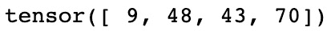

    图 3.11 – 张量值

1.  现在，我们开始训练我们的网络。我们循环执行 100 个 epochs，每次通过所有上下文词（即目标词对）。对于每一个这样的对，我们使用 `make_sentence_vector()` 加载上下文句子，并使用当前模型状态进行预测。我们将这些预测与实际目标进行评估，以获得损失。我们进行反向传播以计算梯度，并通过优化器更新权重。最后，我们将整个 epoch 的所有损失求和并打印出来。在这里，我们可以看到我们的损失正在减少，显示出我们的模型正在学习：

    ```py
    for epoch in range(100):
        epoch_loss = 0
        for sentence, target in data:
            model.zero_grad()
            sentence_vector = make_sentence_vector                               (sentence, word_dict)  
            log_probs = model(sentence_vector)
            loss = loss_function(log_probs, torch.tensor(
            [word_dict[target]], dtype=torch.long))
            loss.backward()
            optimizer.step()
            epoch_loss += loss.data
        print('Epoch: '+str(epoch)+', Loss: ' + str(epoch_loss.item()))
    ```

    这导致以下输出：

    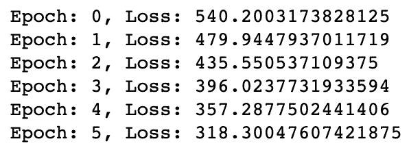

    图 3.12 – 训练我们的网络

    现在我们的模型已经训练好了，我们可以进行预测了。我们定义了几个函数来实现这一点。`get_predicted_result()` 从预测数组中返回预测的单词，而我们的 `predict_sentence()` 函数则基于上下文词进行预测。

1.  我们将我们的句子拆分为单词，并将它们转换为输入向量。然后，通过将其输入模型并使用 `get_predicted_result()` 函数，我们创建我们的预测数组，并通过使用上下文获得我们最终预测的单词。我们还打印预测目标单词前后的两个单词以提供上下文。我们可以运行一些预测来验证我们的模型是否工作正常：

    ```py
    def get_predicted_result(input, inverse_word_dict):
        index = np.argmax(input)
        return inverse_word_dict[index]
    def predict_sentence(sentence):
        sentence_split = sentence.replace('.','').lower().                              split()
        sentence_vector = make_sentence_vector(sentence_                      split, word_dict)
        prediction_array = model(sentence_vector).data.                             numpy()
        print('Preceding Words: {}\n'.format(sentence_           split[:2]))
        print('Predicted Word: {}\n'.format(get_predicted_            result(prediction_array[0], inverse_            word_dict)))
        print('Following Words: {}\n'.format(sentence_           split[2:]))
    predict_sentence('to see leap and')
    ```

    这导致以下输出：

    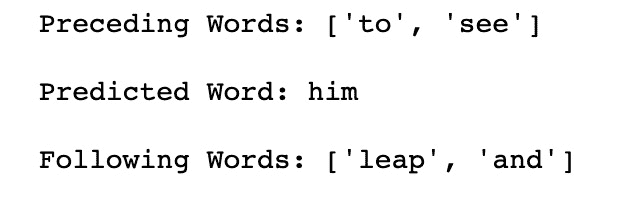

    图 3.13 – 预测值

1.  现在我们有了一个训练好的模型，我们可以使用 `get_word_embedding()` 函数来返回语料库中任何单词的 20 维词嵌入。如果我们需要为另一个 NLP 任务提取嵌入，我们实际上可以从整个嵌入层提取权重，并在我们的新模型中使用它们：

    ```py
    print(model.get_word_emdedding('leap'))
    ```

    这导致以下输出：

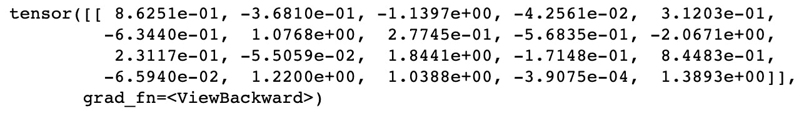

图 3.14 – 编辑模型后的张量值

在这里，我们展示了如何训练 CBOW 模型来创建词嵌入。实际上，要为语料库创建可靠的嵌入，我们需要一个非常大的数据集，才能真正捕捉所有单词之间的语义关系。因此，使用已经在非常大的数据语料库上训练过的预训练嵌入（如 GLoVe）可能更可取，但也可能存在某些情况，例如分析不符合正常自然语言处理的数据语料库时（例如，用户可能使用简短缩写而不是完整句子的 Twitter 数据），最好从头开始训练全新的嵌入。

# 探索 n-gram

在我们的 CBOW 模型中，我们成功地展示了单词的意义与其周围上下文的关系。不仅是上下文单词影响了句子中单词的含义，而且单词的顺序也很重要。考虑以下句子：

*猫坐在狗上*

*狗坐在猫上*

如果你将这两个句子转换成词袋表示法，我们会发现它们是相同的。然而，通过阅读句子，我们知道它们有完全不同的含义（事实上，它们是完全相反的！）。这清楚地表明，一个句子的含义不仅仅是它包含的单词，而是它们出现的顺序。试图捕捉句子中单词顺序的一种简单方法是使用 n-gram。

如果我们对句子进行计数，但不是计算单个单词，而是计算句子内出现的不同的两个词组，这被称为使用**二元组**：

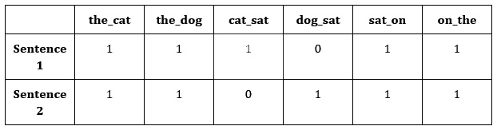

图 3.15 – 二元组的表格表示

我们可以如下表示这一点：

*猫坐在狗上 -> [1,1,1,0,1,1]*

*狗坐在猫上 -> [1,1,0,1,1,1]*

这些单词对试图捕捉单词在句子中出现的顺序，而不仅仅是它们的频率。我们的第一个句子包含二元组*猫坐*，而另一个句子包含*狗坐*。这些二元组显然比仅使用原始词频更能为我们的句子增加更多上下文。

我们不仅限于单词对。我们还可以看不同的三个单词组成的三元组，称为**三元组**，或者任何不同数量的单词组。我们可以将 n-gram 作为深度学习模型的输入，而不仅仅是一个单词，但是当使用 n-gram 模型时，值得注意的是，您的特征空间可能会迅速变得非常大，并且可能会使机器学习变得非常缓慢。如果字典包含英语中所有单词，那么包含所有不同的单词对的字典将大几个数量级！

## n-gram 语言建模

n-gram 帮助我们理解自然语言是如何形成的一件事。如果我们将语言表示为较小单词对（二元组）的部分，而不是单个单词，我们可以开始将语言建模为一个概率模型，其中单词出现在句子中的概率取决于它之前出现的单词。

在**一元模型**中，我们假设所有单词都有出现的有限概率，基于语料库或文档中单词的分布。让我们以一个只包含一句话的文档为例：

*My name is my name*

基于这个句子，我们可以生成单词的分布，其中每个单词出现的概率取决于它在文档中的频率：

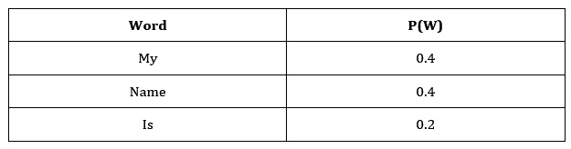

图 3.16 – 一元表达的表现

然后，我们可以从这个分布中随机抽取单词以生成新的句子：

*Name is Name my my*

但是正如我们所见，这个句子毫无意义，说明了使用一元模型的问题。因为每个单词出现的概率独立于句子中所有其他单词，所以对单词出现的顺序或上下文没有考虑。这就是 n-gram 模型有用的地方。

现在我们将考虑使用**二元语言模型**。这种计算考虑到一个单词出现的概率，给定它前面出现的单词：

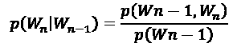

这意味着一个单词出现的概率，给定前一个单词的概率，就是单词 n-gram 出现的概率除以前一个单词出现的概率。假设我们试图预测以下句子中的下一个单词：

*My favourite language is ___*

除此之外，我们还给出了以下 n-gram 和单词概率：

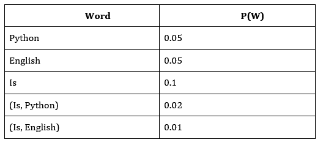

图 3.17 – 概率的表格表示

借此，我们可以计算出 Python 出现的概率，假设前一个单词*is*出现的概率仅为 20%，而*English*出现的概率仅为 10%。我们可以进一步扩展这个模型，使用三元组或任何我们认为适当的 n-gram 单词表示。我们已经证明了 n-gram 语言建模可以用来引入关于单词彼此关系的更多信息到我们的模型中，而不是天真地假设单词是独立分布的。

# 标记化

接下来，我们将学习用于 NLP 的标记化，这是对文本进行预处理以输入到我们的模型中的一种方式。标记化将我们的句子分解成更小的部分。这可能涉及将句子分割成单独的单词，或将整个文档分割成单独的句子。这是 NLP 的一个基本预处理步骤，可以在 Python 中相对简单地完成：

1.  我们首先使用 NLTK 中的**词分词器**将基本句子分割成单独的单词：

    ```py
    text = 'This is a single sentence.'
    tokens = word_tokenize(text)
    print(tokens)
    ```

    这导致以下输出：

    

    图 3.18 – 分割句子

1.  注意句号（`.`）如何被视为一个标记，因为它是自然语言的一部分。根据我们想要对文本进行的处理，我们可能希望保留或丢弃标点符号：

    ```py
    no_punctuation = [word.lower() for word in tokens if word.isalpha()]
    print(no_punctuation)
    ```

    这导致以下输出：

    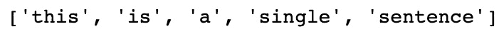

    图 3.19 – 移除标点符号

1.  我们还可以使用**句子分词器**将文档分割成单独的句子：

    ```py
    text = "This is the first sentence. This is the second sentence. A document contains many sentences."
    print(sent_tokenize(text))
    ```

    这导致以下输出：

    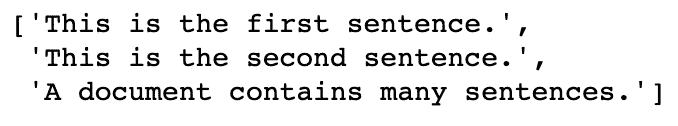

    图 3.20 – 将多个句子分割成单个句子

1.  或者，我们可以将两者结合起来，将其分割成单词的单个句子：

    ```py
    print([word_tokenize(sentence) for sentence in sent_tokenize(text)])
    ```

    这导致以下输出：

    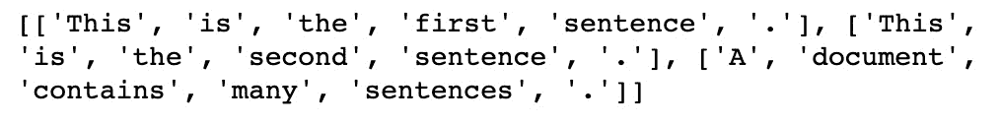

    图 3.21 – 将多个句子分割成单词

1.  在分词过程中的另一个可选步骤是移除停用词。停用词是一些非常常见的词，它们不会对句子的整体含义做出贡献。这些词包括像*a*、`I`和`or`等词。我们可以使用以下代码从 NLTK 中打印出完整的停用词列表：

    ```py
    stop_words = stopwords.words('english')
    print(stop_words[:20])
    ```

    这导致以下输出：

    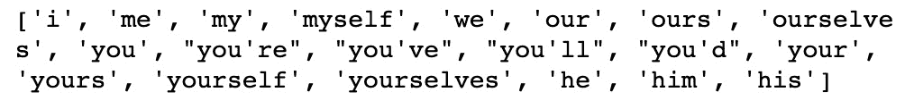

    图 3.22 – 显示停用词

1.  我们可以使用基本的列表推导来轻松地从我们的单词中移除这些停用词：

    ```py
    text = 'This is a single sentence.'
    tokens = [token for token in word_tokenize(text) if token not in stop_words]
    print(tokens)
    ```

    这导致以下输出：

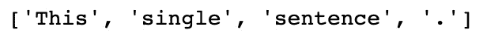

图 3.23 – 移除停用词

虽然某些 NLP 任务（如预测句子中的下一个单词）需要使用停用词，而其他任务（如判断电影评论的情感）则不需要，因为停用词对文档的整体含义贡献不大。在这些情况下，移除停用词可能更为可取，因为这些常见词的频率意味着它们可能会不必要地增加我们的特征空间，这会增加模型训练的时间。

# 词性标注和块句法分析

到目前为止，我们已经涵盖了几种表示单词和句子的方法，包括词袋模型、嵌入和 n-gram。然而，这些表示方法未能捕捉到任何给定句子的结构。在自然语言中，不同的单词在句子中可能具有不同的功能。考虑以下例子：

*大狗正在床上睡觉*

我们可以“标记”文本中的各个单词，具体取决于每个单词在句子中的功能。因此，前述句子变成如下所示：

*The -> big -> dog -> is -> sleeping -> on -> the -> bed*

*限定词 -> 形容词 -> 名词 -> 动词 -> 动词 -> 介词 -> 限定词 -> 名词*

这些**词性**包括但不限于以下内容：

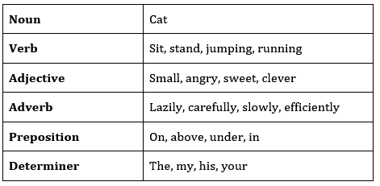

图 3.24 – 词性

这些不同的词性可以帮助我们更好地理解句子的结构。例如，形容词在英语中通常在名词前面。我们可以在模型中使用这些词性及其彼此之间的关系。例如，如果我们正在预测句子中的下一个词，而上下文词是形容词，我们就知道下一个词很可能是名词。

## 标记

词性**标注**是将这些词性标签分配给句子中各个单词的行为。幸运的是，NLTK 具有内置的标注功能，因此我们无需训练自己的分类器即可执行此操作：

```py
sentence = "The big dog is sleeping on the bed"
token = nltk.word_tokenize(sentence)
nltk.pos_tag(token)
```

这将产生以下输出：

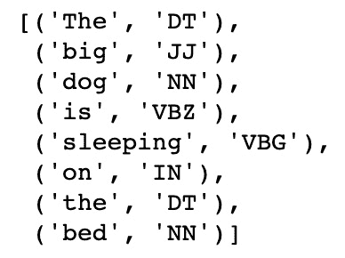

图 3.25 – 词性分类

在这里，我们只需对文本进行分词，并调用`pos_tag()`函数对句子中的每个单词进行标记。这将返回每个单词的标记。我们可以通过在代码中调用`upenn_tagset()`来解码该标记的含义。在这种情况下，我们可以看到"`VBG`"对应于动词：

```py
nltk.help.upenn_tagset("VBG")
```

这将产生以下输出：

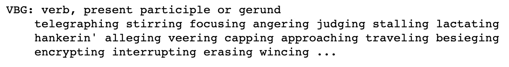

图 3.26 – VBG 的解释

使用预训练的词性标注工具是有益的，因为它们不仅充当查找句子中各个单词的字典，还利用单词在句子中的上下文来确定其含义。考虑以下句子：

*他喝水*

*我会给我们买一些饮料*

在这些句子中，单词*drinks*代表两种不同的词性。在第一个句子中，*drinks*指的是动词；动词*drink*的现在时。在第二个句子中，*drinks*指的是名词；单数*drink*的复数形式。我们的预训练标注器能够确定这些单词的上下文并进行准确的词性标注。

## 切块

**切块**扩展了我们最初的词性标注，旨在将句子结构化成小块，其中每个块代表一个小词性。

我们可能希望将文本分成**实体**，其中每个实体是一个单独的对象或物品。例如，*红色的书*不是指三个单独的实体，而是指由三个单词描述的一个实体。我们可以再次使用 NLTK 轻松实现切块。我们首先必须定义一个使用正则表达式匹配的语法模式。所考虑的模式查找**名词短语**（**NP**），其中名词短语被定义为**限定词**（**DT**），后跟**可选形容词**（**JJ**），再跟一个**名词**（**NN**）：

```py
expression = ('NP: {<DT>?<JJ>*<NN>}')
```

使用`RegexpParser()`函数，我们可以匹配此表达式的出现并将其标记为名词短语。然后，我们能够打印出生成的树，显示标记的短语。在我们的例句中，我们可以看到*大狗*和*床*被标记为两个单独的名词短语。我们能够根据需要使用正则表达式定义任何文本块进行匹配：

```py
tagged = nltk.pos_tag(token)
REchunkParser = nltk.RegexpParser(expression)
tree = REchunkParser.parse(tagged)
print(tree)
```

这导致以下输出：

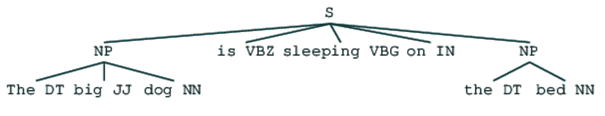

图 3.27 – 树表示

# TF-IDF

**TF-IDF**是另一种我们可以学习的技术，用于更好地表示自然语言。它经常用于文本挖掘和信息检索，以基于搜索术语匹配文档，但也可以与嵌入结合使用，以更好地以嵌入形式表示句子。让我们看看以下短语：

*这是一只小长颈鹿*

假设我们想要一个单一的嵌入来表示这个句子的含义。我们可以做的一件事是简单地平均每个单词的个体嵌入：

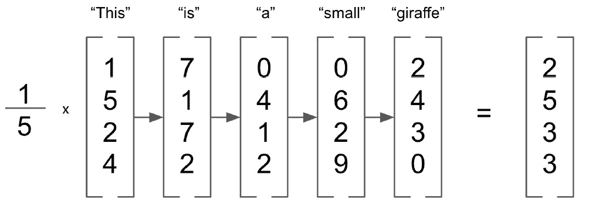

图 3.28 – 词嵌入

然而，这种方法将所有单词分配相等的权重。您认为所有单词对句子的含义贡献相等吗？**This**和**a**是英语中非常常见的词，但**giraffe**非常少见。因此，我们可能希望给较稀有的单词分配更高的权重。这种方法被称为**词频 - 逆文档频率**（**TF-IDF**）。接下来我们将展示如何计算我们文档的 TF-IDF 权重。

## 计算 TF-IDF

正如名称所示，TF-IDF 包括两个单独的部分：词频和逆文档频率。词频是一个文档特定的度量，计算在正在分析的文档中给定单词的频率：

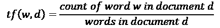

请注意，我们将此度量值除以文档中的总字数，因为长文档更有可能包含任何给定单词。如果一个单词在文档中出现多次，它将获得较高的词频。然而，这与我们希望 TF-IDF 加权的相反，因为我们希望给予文档中稀有单词出现的更高权重。这就是 IDF 发挥作用的地方。

文档频率衡量的是在整个文档语料库中分析的单词出现的文档数量，而逆文档频率计算的是总文档数与文档频率的比率：

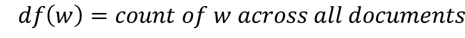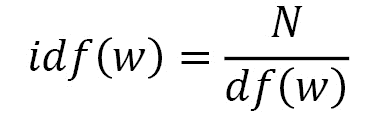

如果我们有一个包含 100 个文档的语料库，并且我们的单词在这些文档中出现了五次，那么我们的逆文档频率将是 20。这意味着对于在所有文档中出现次数较少的单词，给予了更高的权重。现在，考虑一个包含 100,000 个文档的语料库。如果一个单词只出现一次，它的 IDF 将是 100,000，而出现两次的单词的 IDF 将是 50,000。这些非常大且不稳定的 IDF 对于我们的计算不是理想的，因此我们必须首先通过对数对其进行归一化。请注意，在我们的计算中添加 1 是为了防止在我们的语料库中计算 TF-IDF 时出现除以零的情况：

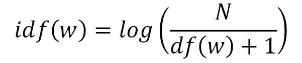

这使得我们最终的 TF-IDF 方程如下所示：

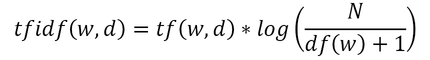

现在我们可以演示如何在 Python 中实现这一点，并将 TF-IDF 权重应用于我们的嵌入向量。

## 实现 TF-IDF

在这里，我们将使用 NLTK 数据集中的 Emma 语料库来实现 TF-IDF。该数据集由简·奥斯汀的书 *Emma* 中的若干句子组成，我们希望为每个句子计算嵌入向量表示：

1.  我们首先导入我们的数据集，并循环遍历每个句子，删除任何标点符号和非字母数字字符（如星号）。我们选择保留数据集中的停用词，以演示 TF-IDF 如何考虑这些词，因为这些词出现在许多文档中，因此其 IDF 非常低。我们创建一个解析后的句子列表和我们语料库中不同单词的集合：

    ```py
    emma = nltk.corpus.gutenberg.sents('austen-emma.txt')
    emma_sentences = []
    emma_word_set = []
    for sentence in emma:
        emma_sentences.append([word.lower() for word in          sentence if word.isalpha()])
        for word in sentence:
            if word.isalpha():
                emma_word_set.append(word.lower())
    emma_word_set = set(emma_word_set)
    ```

1.  接下来，我们创建一个函数，该函数将返回给定文档中给定单词的词频。我们获取文档的长度以获取单词数，并计算文档中该单词的出现次数，然后返回比率。在这里，我们可以看到单词 `ago` 在句子中出现了一次，而该句子共有 41 个单词，因此我们得到了词频为 0.024：

    ```py
    def TermFreq(document, word):
        doc_length = len(document)
        occurances = len([w for w in document if w == word])
        return occurances / doc_length
    TermFreq(emma_sentences[5], 'ago')
    ```

    这导致以下输出：

    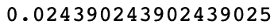

    图 3.29 – TF-IDF 分数

1.  接下来，我们计算我们的文档频率。为了有效地做到这一点，我们首先需要预先计算一个文档频率字典。这会遍历所有数据，并计算我们语料库中每个单词出现在多少个文档中。我们预先计算这个字典，这样我们就不必每次想要计算给定单词的文档频率时都进行循环：

    ```py
    def build_DF_dict():
        output = {}
        for word in emma_word_set:
            output[word] = 0
            for doc in emma_sentences:
                if word in doc:
                    output[word] += 1
        return output

    df_dict = build_DF_dict()
    df_dict['ago']
    ```

1.  在这里，我们可以看到单词 `ago` 在我们的文档中出现了 32 次。利用这个字典，我们可以非常容易地通过将文档总数除以文档频率并取其对数来计算逆文档频率。请注意，在文档频率为零时，我们将文档频率加一以避免除以零错误：

    ```py
    def InverseDocumentFrequency(word):
        N = len(emma_sentences)
        try:
            df = df_dict[word] + 1
        except:
            df = 1
        return np.log(N/df)
    InverseDocumentFrequency('ago')
    ```

1.  最后，我们只需将词频和逆文档频率结合起来，即可获得每个单词/文档对的 TF-IDF 权重：

    ```py
    def TFIDF(doc, word):
        tf = TF(doc, word)
        idf = InverseDocumentFrequency(word)
        return tf*idf
    print('ago - ' + str(TFIDF(emma_sentences[5],'ago')))
    print('indistinct - ' + str(TFIDF(emma_sentences[5],'indistinct')))
    ```

    这导致以下输出：

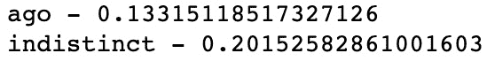

图 3.30 – ago 和 indistinct 的 TF-IDF 分数

在这里，我们可以看到，尽管单词 `ago` 和 `indistinct` 在给定文档中只出现一次，但 `indistinct` 在整个语料库中出现的频率较低，意味着它获得了较高的 TF-IDF 加权。

## 计算 TF-IDF 加权嵌入

接下来，我们可以展示如何将这些 TF-IDF 加权应用到嵌入中：

1.  我们首先加载我们预先计算的 GLoVe 嵌入，为我们语料库中单词提供初始的嵌入表示：

    ```py
    def loadGlove(path):
        file = open(path,'r')
        model = {}
        for l in file:
            line = l.split()
            word = line[0]
            value = np.array([float(val) for val in                           line[1:]])
            model[word] = value
        return model
    glove = loadGlove('glove.6B.50d.txt')
    ```

1.  我们接着计算文档中所有单个嵌入的无权平均值，以得到整个句子的向量表示。我们简单地遍历文档中的所有单词，从 GLoVe 字典中提取嵌入，并计算所有这些向量的平均值：

    ```py
    embeddings = []
    for word in emma_sentences[5]:
        embeddings.append(glove[word])
    mean_embedding = np.mean(embeddings, axis = 0).reshape      (1, -1)
    print(mean_embedding)
    ```

    这导致以下输出：

    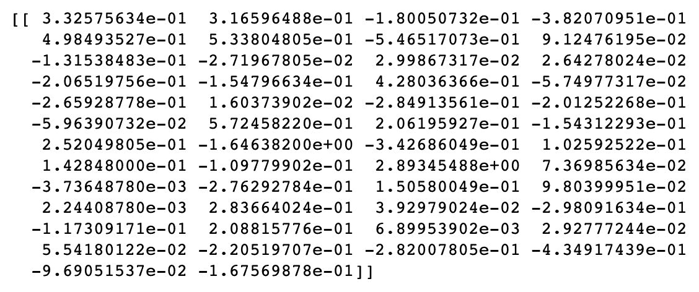

    图 3.31 – 平均嵌入

1.  我们重复这个过程来计算我们的 TF-IDF 加权文档向量，但这次，在我们对它们求平均之前，我们将我们的向量乘以它们的 TF-IDF 加权：

    ```py
    embeddings = []
    for word in emma_sentences[5]:
        tfidf = TFIDF(emma_sentences[5], word)
        embeddings.append(glove[word]* tfidf) 

    tfidf_weighted_embedding = np.mean(embeddings, axis =                               0).reshape(1, -1)
    print(tfidf_weighted_embedding)
    ```

    这导致以下输出：

    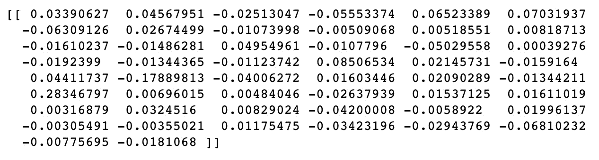

    图 3.32 – TF-IDF 嵌入

1.  然后，我们可以比较 TF-IDF 加权嵌入和我们的平均嵌入，看它们有多相似。我们可以使用余弦相似度来进行此操作，如下所示：

    ```py
    cosine_similarity(mean_embedding, tfidf_weighted_embedding)
    ```

    这导致以下输出：

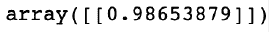

图 3.33 – TF-IDF 和平均嵌入的余弦相似度

在这里，我们可以看到我们的两种不同表示非常相似。因此，虽然使用 TF-IDF 可能不会显著改变我们对给定句子或文档的表示，但它可能会偏向于感兴趣的词语，从而提供更有用的表示。

# 摘要

在本章中，我们深入探讨了词嵌入及其应用。我们展示了如何使用连续词袋模型训练它们，并如何结合 n-gram 语言建模以更好地理解句子中词语之间的关系。然后，我们查看了如何将文档拆分为个别标记以便于处理，以及如何使用标记和块分析来识别词性。最后，我们展示了如何使用 TF-IDF 权重来更好地表示文档的嵌入形式。

在下一章中，我们将看到如何使用 NLP 进行文本预处理、词干化和词形还原。
