# *第四章*：文本预处理，词干化和词形归并

文本数据可以从许多不同的来源收集，并采用许多不同的形式。文本可以整洁可读，也可以原始混乱，还可以以许多不同的样式和格式出现。能够对此数据进行预处理，使其能够在到达我们的 NLP 模型之前转换为标准格式，这是我们将在本章中探讨的内容。

词干化和词形归并，类似于分词，是 NLP 预处理的其他形式。然而，与将文档减少为单个词语的分词不同，词干化和词形归并试图进一步将这些词语减少到它们的词汇根。例如，英语中几乎任何动词都有许多不同的变体，取决于时态：

*他跳跃了*

*他正在跳跃*

*他跳跃*

尽管所有这些单词不同，它们都与相同的词根词 – **jump** 相关。词干化和词形归并都是我们可以使用的技术，用于将单词变体减少到它们的共同词根。

在本章中，我们将解释如何对文本数据进行预处理，以及探索词干化和词形归并，并展示如何在 Python 中实现这些技术。

在本章中，我们将涵盖以下主题：

+   文本预处理

+   词干化

+   词形归并

+   词干化和词形归并的用途

# 技术要求

对于本章中的文本预处理，我们将主要使用 Python 内置函数，但也会使用外部的`BeautifulSoup`包。对于词干化和词形归并，我们将使用 NLTK Python 包。本章的所有代码可以在[`github.com/PacktPublishing/Hands-On-Natural-Language-Processing-with-PyTorch-1.x/tree/master/Chapter4`](https://github.com/PacktPublishing/Hands-On-Natural-Language-Processing-with-PyTorch-1.x/tree/master/Chapter4)找到。

# 文本预处理

文本数据可以以多种格式和样式出现。文本可能以结构化、可读的格式或更原始、非结构化的格式存在。我们的文本可能包含我们不希望在模型中包含的标点符号和符号，或者可能包含 HTML 和其他非文本格式。这在从在线源获取文本时尤为重要。为了准备我们的文本以便能够输入到任何 NLP 模型中，我们必须进行预处理。这将清洁我们的数据，使其处于标准格式。在本节中，我们将详细说明一些这些预处理步骤。

## 移除 HTML

当从在线源中抓取文本时，您可能会发现您的文本包含 HTML 标记和其他非文本性的工件。通常我们不希望将这些内容包含在我们的 NLP 输入中供我们的模型使用，因此默认应删除这些内容。例如，在 HTML 中，`<b>`标签指示其后的文本应为粗体字体。然而，这并未包含有关句子内容的任何文本信息，因此我们应该将其删除。幸运的是，在 Python 中有一个名为`BeautifulSoup`的包，可以让我们用几行代码轻松删除所有 HTML：

```py
input_text = "<b> This text is in bold</br>, <i> This text is in italics </i>"
output_text =  BeautifulSoup(input_text, "html.parser").get_text()
print('Input: ' + input_text)
print('Output: ' + output_text)
```

这将返回以下输出：

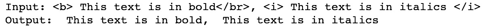

图 4.1 – 删除 HTML

前面的截图显示已成功删除了 HTML。这在原始文本数据中存在 HTML 代码的任何情况下可能很有用，例如在从网页上抓取数据时。

## 将文本转换为小写

在预处理文本时，将所有内容转换为小写是标准做法。这是因为任何两个相同的单词应该被认为在语义上是相同的，无论它们是否大写。 '`Cat`'，'`cat`'和'`CAT`'都是相同的单词，只是元素大小写不同。我们的模型通常会将这三个单词视为不同实体，因为它们并不相同。因此，将所有单词转换为小写是标准做法，这样这些单词在语义上和结构上都是相同的。在 Python 中，可以通过以下几行代码很容易地完成这个过程：

```py
input_text = ['Cat','cat','CAT']
output_text =  [x.lower() for x in input_text]
print('Input: ' + str(input_text))
print('Output: ' + str(output_text))
```

这将返回以下输出：

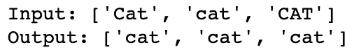

图 4.2 – 将输入转换为小写

这显示输入已全部转换为相同的小写表示。有几个例子，大写实际上可能提供额外的语义信息。例如，*May*（月份）和*may*（表示“可能”）在语义上是不同的，*May*（月份）始终大写。然而，这种情况非常罕见，将所有内容转换为小写比试图考虑这些罕见例子要有效得多。

大写在某些任务中可能很有用，例如词性标注，其中大写字母可能表明单词在句子中的角色，以及命名实体识别，其中大写字母可能表明单词是专有名词而不是非专有名词替代词；例如，*Turkey*（国家）和*turkey*（鸟）。

## 删除标点符号

有时，根据正在构建的模型类型，我们可能希望从输入文本中删除标点符号。这在像词袋表示法这样的模型中特别有用，我们在这些模型中聚合词频。句子中的句号或逗号并不会增加关于句子语义内容的有用信息。然而，在考虑标点符号位置的复杂模型中，实际上可以使用标点符号的位置来推断不同的含义。一个经典的例子如下：

*熊猫吃饭开枪和离开*

*熊猫吃饭，开枪和离开*

在这里，通过添加逗号，将描述熊猫饮食习惯的句子转变为描述熊猫抢劫餐馆的句子！然而，为了保持一致性，能够从句子中删除标点符号仍然很重要。我们可以通过使用 `re` 库来实现这一点，在正则表达式中匹配任何标点符号，并使用 `sub()` 方法将任何匹配的标点符号替换为空字符来完成这一操作：

```py
input_text = "This ,sentence.'' contains-£ no:: punctuation?"
output_text = re.sub(r'[^\w\s]', '', input_text)
print('Input: ' + input_text)
print('Output: ' + output_text)
```

这返回以下输出：

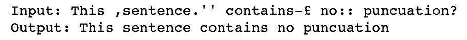

图 4.3 – 从输入中删除标点符号

这表明输入句子中的标点已被移除。

可能存在我们不希望直接删除标点符号的情况。一个很好的例子是使用和符号 (`&`)，几乎在每个实例中都可以与单词 "`and`" 交换使用。因此，与其完全删除和符号，我们可能会选择直接用单词 "`and`" 替换它。我们可以在 Python 中使用 `.replace()` 函数轻松实现这一点：

```py
input_text = "Cats & dogs"
output_text = input_text.replace("&", "and")
print('Input: ' + input_text)
print('Output: ' + output_text)
```

这返回以下输出：

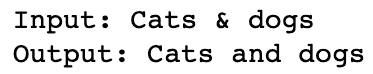

图 4.4 – 删除和替换标点符号

同样值得考虑的是特定情况下标点符号可能对句子的表达至关重要。一个关键的例子是电子邮件地址。从电子邮件地址中删除 `@` 不会使地址更易读：

`name@gmail.com`

删除标点符号返回如下结果：

namegmailcom

因此，在这种情况下，根据您的 NLP 模型的要求和目的，可能更倾向于完全删除整个项目。

## 替换数字

同样地，对于数字，我们也希望标准化我们的输出。数字可以用数字（9、8、7）或实际单词（九、八、七）来表示。值得将这些统一转换为单一的标准表示形式，以便 1 和 one 不被视为不同实体。我们可以使用以下方法在 Python 中实现这一点：

```py
def to_digit(digit):
    i = inflect.engine()
    if digit.isdigit():
        output = i.number_to_words(digit)
    else:
        output = digit
    return output
input_text = ["1","two","3"]
output_text = [to_digit(x) for x in input_text]
print('Input: ' + str(input_text))
print('Output: ' + str(output_text))
```

这返回以下输出：

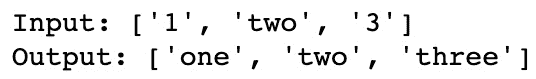

图 4.5 – 用文本替换数字

这表明我们已成功将数字转换为文本。

然而，类似于处理电子邮件地址，处理电话号码可能不需要与常规数字相同的表示形式。以下示例说明了这一点：

```py
input_text = ["0800118118"]
output_text = [to_digit(x) for x in input_text]
print('Input: ' + str(input_text))
print('Output: ' + str(output_text))
```

这返回以下输出：

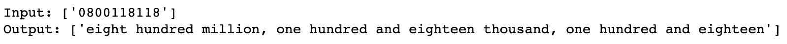

图 4.6 – 将电话号码转换为文本

显然，在上述示例中输入的是电话号码，因此完整的文本表示未必适合特定用途。在这种情况下，可能更倾向于从我们的输入文本中删除任何较长的数字。

# 词干提取和词形还原

在语言中，**屈折变化**是通过修改一个共同的根词来表达不同的语法类别，如时态、语气或性别。这通常涉及改变单词的前缀或后缀，但也可能涉及修改整个单词。例如，我们可以修改动词以改变其时态：

*Run -> Runs（添加 "s" 后缀以使其现在时）*

*Run -> Ran（修改中间字母为 "a" 以使其过去时）*

但在某些情况下，整个单词会发生变化：

*To be -> Is（现在时）*

*To be -> Was（过去时）*

*To be -> Will be（将来时 – 添加情态动词）*

名词也可以存在词汇变化：

*Cat -> Cats（复数）*

*Cat -> Cat's（所有格）*

*Cat -> Cats'（复数所有格）*

所有这些单词都与根词 cat 相关。我们可以计算句子中所有单词的根，以将整个句子简化为其词汇根：

*"他的猫的毛色不同" -> "他 猫 毛色 不同"*

**词干提取**和**词形还原**是通过这些根词来达到这些根词的过程。**词干提取**是一种算法过程，在这种过程中，单词的结尾被切掉以得到一个共同的词根，而词形还原则使用真实的词汇和对单词本身的结构分析，以得到单词的真正词根或**词元**。我们将在接下来的部分详细介绍这两种方法。

## 词干提取

**词干提取**是通过裁剪单词的末尾来到达它们的词汇根或**词干**的算法过程。为此，我们可以使用不同的**词干提取器**，每个都遵循特定的算法以返回单词的词干。在英语中，最常见的词干提取器之一是 Porter Stemmer。

**Porter Stemmer** 是一个具有大量逻辑规则的算法，用于返回单词的词干。我们将首先展示如何使用 NLTK 在 Python 中实现 Porter Stemmer，然后进一步讨论该算法的详细内容：

1.  首先，我们创建一个 Porter Stemmer 的实例：

    ```py
    porter = PorterStemmer()
    ```

1.  然后我们简单地在单词上调用这个词干提取器的实例并打印结果。在这里，我们可以看到 Porter Stemmer 返回的词干示例：

    ```py
    word_list = ["see","saw","cat", "cats", "stem", "stemming","lemma","lemmatization","known","knowing","time", "timing","football", "footballers"]
    for word in word_list:
        print(word + ' -> ' + porter.stem(word))
    ```

    这导致以下输出：

    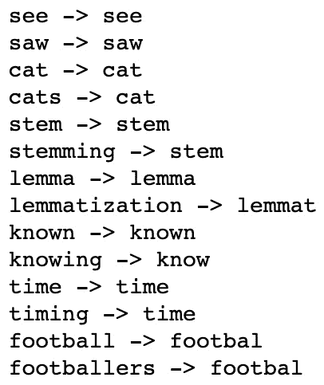

    图 4.7 – 返回单词的词干

1.  我们还可以将词干提取应用于整个句子，首先将句子进行标记化，然后逐个提取每个词项：

    ```py
    def SentenceStemmer(sentence):
        tokens=word_tokenize(sentence)
        stems=[porter.stem(word) for word in tokens]
        return " ".join(stems)
    SentenceStemmer('The cats and dogs are running')
    ```

这将返回以下输出：

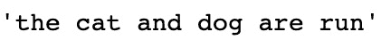

图 4.8 – 将词干提取应用于句子

在这里，我们可以看到如何使用 Porter Stemmer 提取不同的单词。一些单词，如 `stemming` 和 `timing`，会缩减为它们期望的词干 `stem` 和 `time`。然而，一些单词，如 `saw`，并不会缩减为它们的逻辑词干（`see`）。这展示了 Porter Stemmer 的局限性。由于词干提取对单词应用一系列逻辑规则，定义一组可以正确提取所有单词的规则是非常困难的。特别是在英语中，一些词根据时态变化完全不同（is/was/be），因此没有通用的规则可以应用于这些单词，将它们全部转换为相同的根词。

我们可以详细研究一些 Porter Stemmer 应用的规则，以了解转换为词干的确切过程。虽然实际的 Porter 算法有许多详细步骤，但在这里，我们将简化一些规则以便于理解：

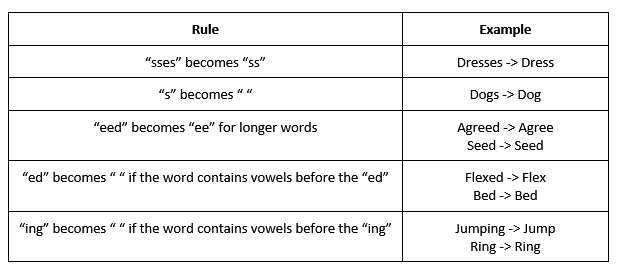

图 4.9 – Porter Stemmer 算法的规则

虽然理解 Porter Stemmer 内的每条规则并非必需，但我们理解其局限性至关重要。尽管 Porter Stemmer 在语料库中表现良好，但总会有些词汇无法正确还原为其真实的词干。由于 Porter Stemmer 的规则集依赖于英语单词结构的惯例，总会有些词汇不符合传统的单词结构，无法通过这些规则正确变换。幸运的是，通过词形还原，我们可以克服其中一些限制。

## 词形还原

`ran` 将仅仅是 *ran*，它的词形还原是这个单词的真实词根，即 `run`。

词形还原过程利用预先计算的词形和相关单词，以及单词在句子中的上下文来确定给定单词的正确词形。在这个例子中，我们将介绍如何在 NLTK 中使用 **WordNet** **Lemmatizer**。WordNet 是一个包含英语单词及其词汇关系的大型数据库。它包含了对英语语言关系的最强大和最全面的映射，特别是单词与它们词形关系的映射。

我们首先创建一个词形还原器的实例，并对一些单词进行调用：

```py
wordnet_lemmatizer = WordNetLemmatizer()
print(wordnet_lemmatizer.lemmatize('horses'))
print(wordnet_lemmatizer.lemmatize('wolves'))
print(wordnet_lemmatizer.lemmatize('mice'))
print(wordnet_lemmatizer.lemmatize('cacti'))
```

这导致以下输出：

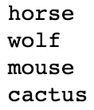

图 4.10 – 词形还原输出

在这里，我们已经可以开始看到使用词形还原法比使用词干提取法的优势。由于 WordNet 词形还原器建立在包含所有英语单词的数据库上，它知道 `mice` 是 `mouse` 的复数形式。使用词干提取法我们无法达到相同的词根。尽管在大多数情况下词形还原法效果更好，因为它依赖于内置的单词索引，但它无法泛化到新的或虚构的单词：

```py
print(wordnet_lemmatizer.lemmatize('madeupwords'))
print(porter.stem('madeupwords'))
```

这导致以下输出：

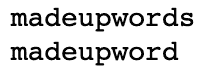

图 4.11 – 虚构单词的词形还原输出

在这里，我们可以看到，在这种情况下，我们的词干提取器能够更好地泛化到以前未见过的单词。因此，在词形还原化不一定与*真实*英语语言相匹配的源语言，例如人们可能经常缩写语言的社交媒体网站上使用词形还原器可能会有问题。

如果我们对两个动词调用我们的词形还原器，我们会发现这并没有将它们减少到预期的共同词形还原形式：

```py
print(wordnet_lemmatizer.lemmatize('run'))
print(wordnet_lemmatizer.lemmatize('ran'))
```

这导致以下输出：

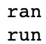

图 4.12 – 对动词进行词形还原

这是因为我们的词形还原器依赖于单词的上下文来返回词形还原形式。回顾我们的词性分析，我们可以轻松地返回句子中单词的上下文，并确定给定单词是名词、动词还是形容词。现在，让我们手动指定我们的单词是动词。我们可以看到，现在它能够正确返回词形还原形式：

```py
print(wordnet_lemmatizer.lemmatize('ran', pos='v'))
print(wordnet_lemmatizer.lemmatize('run', pos='v'))
```

这导致以下输出：

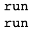

图 4.13 – 在函数中实现词性标注

这意味着为了返回任意给定句子的正确词形还原，我们必须首先执行词性标注以获取句子中单词的上下文，然后通过词形还原器获取句子中每个单词的词形还原形式。我们首先创建一个函数，用于返回句子中每个单词的词性标注：

```py
sentence = 'The cats and dogs are running'
def return_word_pos_tuples(sentence):
    return nltk.pos_tag(nltk.word_tokenize(sentence))
return_word_pos_tuples(sentence)
```

这导致以下输出：

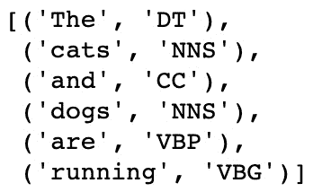

图 4.14 – 句子的词性标注输出

注意这如何返回句子中每个单词的 NLTK 词性标签。我们的 WordNet 词形还原器需要稍微不同的输入以获取词性标签。这意味着我们首先创建一个函数，将 NLTK 词性标签映射到所需的 WordNet 词性标签：

```py
def get_pos_wordnet(pos_tag):
    pos_dict = {"N": wordnet.NOUN,
                "V": wordnet.VERB,
                "J": wordnet.ADJ,
                "R": wordnet.ADV}
    return pos_dict.get(pos_tag[0].upper(), wordnet.NOUN)
get_pos_wordnet('VBG')
```

这导致以下输出：

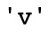

图 4.15 – 将 NLTK 词性标签映射到 WordNet 词性标签

最后，我们将这些函数组合成一个最终函数，将对整个句子进行词形还原：

```py
def lemmatize_with_pos(sentence):
    new_sentence = []
    tuples = return_word_pos_tuples(sentence)
    for tup in tuples:
        pos = get_pos_wordnet(tup[1])
        lemma = wordnet_lemmatizer.lemmatize(tup[0], pos=pos)
        new_sentence.append(lemma)
    return new_sentence
lemmatize_with_pos(sentence)
```

这导致以下输出：

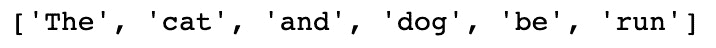

图 4.16 - 最终词形还原函数的输出

在这里，我们可以看到，总体而言，词形还原一般提供了比词干更好的词根表示，但也有一些显著的例外。我们何时决定使用词干化和词形还原取决于手头任务的需求，其中一些我们现在将进行探索。

# 使用词干化和词形还原

词干化和词形还原都是一种可以用于从文本中提取信息的自然语言处理形式。这被称为**文本挖掘**。文本挖掘任务有各种类别，包括文本聚类、分类、文档摘要和情感分析。词干化和词形还原可以与深度学习结合使用来解决其中一些任务，我们将在本书后面看到。

通过使用词干化和词形还原的预处理，再加上去除停用词，我们可以更好地减少句子以理解其核心含义。通过去除对句子含义贡献不大的词汇，并将词汇还原为其词根或词形还原形式，我们可以在深度学习框架内高效分析句子。如果我们能将一个由 10 个词组成的句子缩减为包含多个核心词形还原形式而非多个类似词汇变化的五个词，那么我们需要馈送到神经网络的数据量就大大减少了。如果我们使用词袋表示法，我们的语料库会显著减小，因为多个词都可以还原为相同的词形还原形式，而如果我们计算嵌入表示法，所需的维度则更小，用于表示我们的词汇的真实表示形式。

## 单词的词形还有提取

现在我们已经看到词形还原和词干化的应用，问题仍然是在什么情况下我们应该使用这两种技术。我们看到这两种技术都试图将每个词减少到它的根本。在词干化中，这可能只是目标词的简化形式，而在词形还原中，它则减少到一个真正的英语单词根。

因为词形还原需要在 WordNet 语料库内交叉参考目标词，以及执行词性分析来确定词形还原的形式，如果需要词形还原大量单词，这可能需要大量的处理时间。这与词干化相反，词干化使用了详细但相对快速的算法来词干化单词。最终，就像计算中的许多问题一样，这是一个在速度与详细度之间权衡的问题。在选择这些方法之一来结合我们的深度学习管道时，权衡可能在速度和准确性之间。如果时间紧迫，那么词干化可能是更好的选择。另一方面，如果您需要模型尽可能详细和准确，那么词形还原可能会产生更优越的模型。

# 概述

在本章中，我们详细讨论了词干提取和词形还原，通过探索这两种方法的功能、使用案例以及它们的实施方式。现在，我们已经掌握了深度学习和自然语言处理预处理的所有基础知识，可以开始从头开始训练我们自己的深度学习模型了。

在下一章中，我们将探讨自然语言处理的基础知识，并展示如何在深度自然语言处理领域内构建最常用的模型：循环神经网络。
