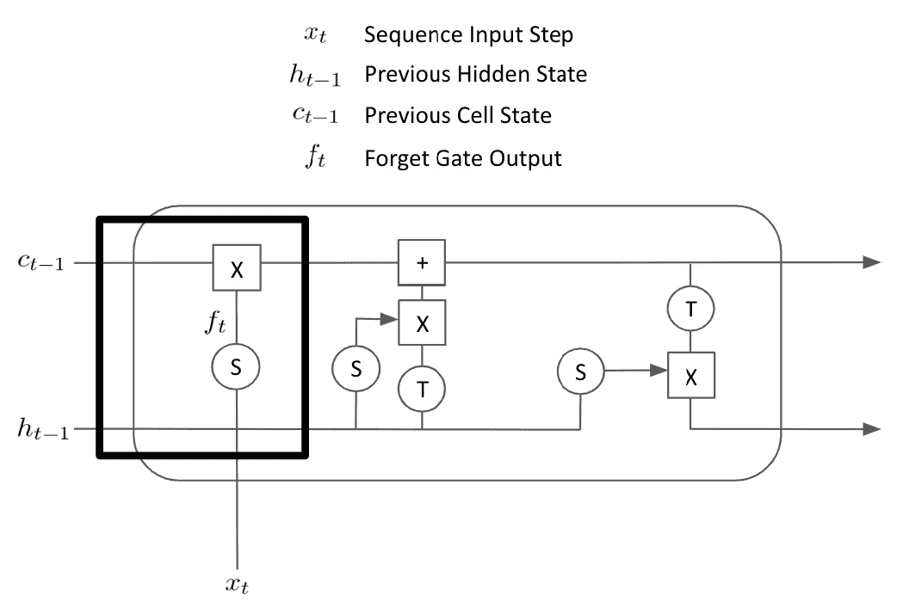
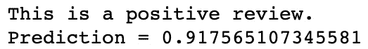

# 第五章：递归神经网络和情感分析

在本章中，我们将研究**递归神经网络**（**RNNs**），这是 PyTorch 中的基本前馈神经网络的变体，我们在*第一章**，机器学习基础*中学习了如何构建。通常情况下，RNNs 可以用于数据可以表示为序列的任何任务。这包括诸如股票价格预测的事情，使用时间序列的历史数据表示为序列。我们通常在 NLP 中使用 RNNs，因为文本可以被视为单词的序列并且可以建模为这样的序列。虽然传统神经网络将单个向量作为输入模型，但是 RNN 可以接受整个向量序列。如果我们将文档中的每个单词表示为向量嵌入，我们可以将整个文档表示为向量序列（或三阶张量）。然后，我们可以使用 RNNs（以及称为**长短期记忆**（**LSTM**）的更复杂形式的 RNN）从我们的数据中学习。

本章将涵盖 RNN 的基础知识以及更高级的 LSTM。然后，我们将看看情感分析，并通过一个实际例子演示如何使用 PyTorch 构建 LSTM 来对文档进行分类。最后，我们将在 Heroku 上托管我们的简单模型，这是一个简单的云应用平台，可以让我们使用我们的模型进行预测。

本章涵盖以下主题：

+   构建 RNNs

+   使用 LSTM

+   使用 LSTM 构建情感分析器

+   在 Heroku 上部署应用程序

# 技术要求

本章中使用的所有代码都可以在 [`github.com/PacktPublishing/Hands-On-Natural-Language-Processing-with-PyTorch-1.x/tree/master/Chapter5`](https://github.com/PacktPublishing/Hands-On-Natural-Language-Processing-with-PyTorch-1.x/tree/master/Chapter5) 找到。Heroku 可以从 [www.heroku.com](http://www.heroku.com) 安装。数据来自 [`archive.ics.uci.edu/ml/datasets/Sentiment+Labelled+Sentences`](https://archive.ics.uci.edu/ml/datasets/Sentiment+Labelled+Sentences)。

# 构建 RNNs

RNN 由递归层组成。虽然在许多方面与标准前馈神经网络中的全连接层相似，但这些递归层包含一个在顺序输入的每个步骤中更新的隐藏状态。这意味着对于任何给定的序列，模型都以隐藏状态初始化，通常表示为一维向量。然后，我们的序列的第一步被送入模型，隐藏状态根据一些学习参数进行更新。然后再将第二个单词送入网络，隐藏状态再次根据其他学习参数进行更新。重复这些步骤，直到整个序列被处理完毕，我们得到最终的隐藏状态。这个计算*循环*，隐藏状态从先前的计算中传递并更新，是我们称之为递归的网络的原因。然后将这个最终的隐藏状态连接到更进一步的全连接层，并预测最终的分类。

我们的递归层大致如下所示，其中*h*为隐藏状态，*x*为我们序列中各个时间步的输入。对于每次迭代，我们更新每个时间步的隐藏状态*x*：


图 5.1 – 循环层

或者，我们可以将其扩展到整个时间步骤序列，如下所示：


图 5.2 – 时间步骤序列

此层适用于*n*个时间步骤的输入。我们的隐藏状态在状态*h*0 中初始化，然后使用第一个输入*x*1 来计算下一个隐藏状态*h*1。还有两组权重矩阵需要学习——矩阵*U*学习隐藏状态在时间步骤之间的变化，矩阵*W*学习每个输入步骤如何影响隐藏状态。

我们还对结果乘积应用*tanh*激活函数，将隐藏状态的值保持在-1 到 1 之间。计算任意隐藏状态*h*t 的方程如下：


然后对输入序列中的每个时间步骤重复此过程，该层的最终输出是我们的最后一个隐藏状态*h*n。当网络学习时，我们执行网络的前向传播，计算最终的分类。然后根据这个预测计算损失，并像以前一样反向传播，计算梯度。这个反向传播过程发生在递归层内的所有步骤中，学习每个输入步骤和隐藏状态之间的参数。

后面我们将看到，实际上我们可以获取每个时间步的隐藏状态，而不是使用最终的隐藏状态，这对于自然语言处理中的序列到序列翻译任务非常有用。然而，目前我们将隐藏层的输出作为网络的其余部分的输出。

## 使用 RNN 进行情感分析

在情感分析的背景下，我们的模型是在一个评论情感分析数据集上训练的，该数据集包含多个文本评论和一个标签，标签为 0 或 1，取决于评论是负面还是正面。这意味着我们的模型成为一个分类任务（其中两个类别是负面/正面）。我们的句子通过一个学习到的词嵌入层，形成包含多个向量（每个单词一个向量）的句子表示。然后，这些向量按顺序馈送到我们的 RNN 层，最终隐藏状态通过另一个全连接层。我们模型的输出是一个介于 0 和 1 之间的单个值，取决于我们的模型是否预测从句子中获得负面或正面情感。这意味着我们完整的分类模型看起来像这样：


图 5.3 – 分类模型

现在，我们将重点介绍 RNN 中的一个问题——梯度爆炸和梯度消失——以及我们如何使用梯度裁剪来解决这个问题。

## 梯度爆炸和梯度消失

在 RNN 中经常遇到的一个问题是**梯度爆炸或梯度消失**。我们可以将递归层视为一个非常深的网络。在计算梯度时，我们在每次隐藏状态迭代时进行。如果在任何给定位置，损失相对于权重的梯度变得非常大，这将在通过递归层所有迭代时产生乘性效应。这可能会导致梯度因快速增长而爆炸。如果我们有大的梯度，这可能会导致网络不稳定。另一方面，如果我们的隐藏状态中的梯度非常小，这将再次产生乘性效应，并且梯度将接近 0。这意味着梯度可能变得太小，无法通过梯度下降准确更新我们的参数，从而导致我们的模型无法学习。

我们可以使用的一种技术来防止梯度爆炸是使用**梯度裁剪**。这种技术限制了我们的梯度，防止它们变得太大。我们只需选择一个超参数 *C*，可以计算我们的裁剪梯度如下：


下图显示了两个变量之间的关系：


图 5.4 – 梯度裁剪比较

另一种防止梯度爆炸或消失的技术是缩短输入序列长度。我们的递归层的有效深度取决于输入序列的长度，因为序列长度决定了我们在隐藏状态上需要执行多少次迭代更新。在这个过程中步骤越少，隐藏状态之间的梯度累积的乘法效应就越小。通过在模型中智能地选择最大序列长度作为超参数，我们可以帮助防止梯度爆炸和消失。

# 引入 LSTMs

虽然 RNN 允许我们将单词序列作为模型的输入，但它们远非完美。RNN 有两个主要缺陷，可以通过使用更复杂版本的 RNN——**LSTM**——来部分解决。

RNN 的基本结构意味着它们很难长期保留信息。考虑一个有 20 个单词的句子。从句子的第一个单词影响初始隐藏状态到句子的最后一个单词，我们的隐藏状态被更新了 20 次。从句子开头到最终的隐藏状态，对于 RNN 来说，很难保留句子开头单词的信息。这意味着 RNN 不擅长捕捉序列中的长期依赖关系。这也与前面提到的梯度消失问题相关联，即通过长而稀疏的向量序列反向传播非常低效。

考虑一个长段落，我们试图预测下一个单词。句子以`I study math…`开头，以`my final exam is in…`结束。直觉上，我们期望下一个单词是`math`或某个与数学相关的领域。然而，在一个长序列的 RNN 模型中，我们的隐藏状态可能在到达句子末尾时难以保留句子开头的信息，因为它经历了多次更新步骤。

我们还应该注意，RNN 不擅长捕捉句子内单词的整体上下文。我们之前看到，在 n-gram 模型中，句子中的单词的含义取决于它在句子中的上下文，这由它之前出现的单词和之后出现的单词决定。在 RNN 中，我们的隐藏状态仅向一个方向更新。在单向传递中，我们的隐藏状态被初始化，并且序列中的第一个单词被传递给它。然后，这个过程被所有后续单词依次重复，直到我们留下最终的隐藏状态。这意味着对于句子中的任何给定单词，我们仅考虑到了在该点之前出现的单词的累积效应。我们不考虑其后的任何单词，这意味着我们未能捕捉到句子中每个单词的完整上下文。

在另一个例子中，我们再次想预测句子中的缺失词语，但这次出现在句子的开头而不是结尾。我们有这样的句子 `I grew up in…so I can speak fluent Dutch`。在这里，我们可以直观地猜测这个人在荷兰长大了，因为他们说荷兰语。然而，因为 RNN 顺序解析信息，它只会使用 `I grew up in…` 来做预测，错过了句子中的其他关键上下文。

这两个问题可以部分通过 LSTM 得到解决。

## 使用长短期记忆网络（LSTM）

LSTM 是 RNN 的更高级版本，并包含两个额外的属性 —— **更新门** 和 **遗忘门**。这两个增加使得网络更容易学习长期依赖性。考虑以下电影评论：

*这部电影太棒了。我周二下午和妻子以及女儿们一起去看的。虽然我没抱太大的期望，但结果却非常有趣。如果有机会的话，我们一定会再去看的。*

在情感分析中，显然句子中并非所有词语都对判断评论是积极还是消极有帮助。我们将重复这个句子，但这次突出显示对评估评论情感有帮助的词语：

*这部电影太棒了。我周二下午和妻子以及女儿们一起去看的。虽然我没抱太大的期望，但结果却非常有趣。如果有机会的话，我们一定会再去看的。*

LSTM 尝试正是这样做 —— 在遗忘所有无关信息的同时记住句子中相关的词语。通过这样做，它阻止无关信息稀释相关信息，从而更好地学习长序列中的长期依赖性。

LSTM 在结构上与 RNN 非常相似。虽然在 LSTM 内部存在一个在步骤之间传递的隐藏状态，但 LSTM 细胞本身的内部工作与 RNN 不同：


图 5.5 – LSTM 细胞

## LSTM 细胞

而 RNN 细胞只需使用前一个隐藏状态和新的输入步骤，并使用一些学习参数计算下一个隐藏状态，LSTM 细胞的内部工作则复杂得多：


图 5.6 – LSTM 细胞的内部工作原理

虽然看起来比 RNN 复杂得多，但我们会逐步解释 LSTM 细胞的每个组成部分。我们首先来看 **遗忘门**（用粗体矩形标示）：



图 5.7 – 遗忘门

遗忘门基本上学习了要忘记序列中哪些元素。将前一个隐藏状态 *h*<sub>t-1</sub> 和最新的输入步骤 *x*<sub>1</sub> 连接在一起，通过遗忘门上的学习权重矩阵和将值压缩在 0 到 1 之间的 Sigmoid 函数进行处理。得到的矩阵 *ft* 与前一步的单元状态 *c*<sub>t-1</sub> 逐点相乘。这有效地对前一单元状态应用了一个蒙版，以便仅将前一单元状态中的相关信息带入下一个时间步。

接下来，我们将看看**输入门**：


图 5.8 – 输入门

输入门再次接受连接的上一个隐藏状态 *h*<sub>t-1</sub> 和当前序列输入 *x*<sub>t</sub>，并通过一个带有学习参数的 Sigmoid 函数进行处理，输出另一个矩阵 *i*<sub>t</sub>，其值在 0 到 1 之间。连接的隐藏状态和序列输入还会经过一个 tanh 函数，将输出压缩在 -1 到 1 之间。然后将其与 *i*<sub>t</sub> 矩阵相乘。这意味着生成 *i*<sub>t</sub> 所需的学习参数有效地学习了在当前时间步中哪些元素应该被保留在我们的单元状态中。然后将此结果加到当前单元状态中，以获得我们的最终单元状态，该状态将传递到下一个时间步。

最后，我们来看 LSTM 单元的最后一个元素——**输出门**：


图 5.9 – 输出门

输出门计算 LSTM 单元的最终输出——包括单元状态和传递到下一步的隐藏状态。单元状态 *c*<sub>t</sub> 与前两步相同，是遗忘门和输入门的产物。最终的隐藏状态 *h*<sub>t</sub> 是通过取连接的前一个隐藏状态 *h*<sub>t-1</sub> 和当前时间步输入 *x*<sub>t</sub>，并通过带有一些学习参数的 Sigmoid 函数进行处理以获得输出门输出 *o*<sub>t</sub> 来计算的。最终的单元状态 *c*<sub>t</sub> 经过一个 tanh 函数并与输出门输出 *o*<sub>t</sub> 相乘，以计算最终的隐藏状态 *h*<sub>t</sub>。这意味着输出门上的学习参数有效地控制了前一个隐藏状态和当前输出的哪些元素与最终单元状态结合，以作为新的隐藏状态传递到下一个时间步。

在我们的前向传播中，我们简单地迭代模型，初始化我们的隐藏状态和单元状态，并在每个时间步使用 LSTM 单元来更新它们，直到我们得到一个最终的隐藏状态，然后将其输出到神经网络的下一层。通过所有 LSTM 层的反向传播，我们可以计算相对于网络损失的梯度，因此我们知道通过梯度下降更新我们的参数的方向。我们得到几个矩阵或参数——一个用于输入门，一个用于输出门，一个用于遗忘门。

由于我们比简单 RNN 获得了更多的参数，且计算图更复杂，通过网络进行反向传播并更新权重的过程可能会比简单 RNN 更耗时。然而，尽管训练时间较长，我们已经证明 LSTM 在许多方面都比传统的 RNN 表现出显著优势，因为输出门、输入门和遗忘门的结合赋予了模型确定哪些输入元素用于更新隐藏状态，哪些隐藏状态元素在前进时应被遗忘的能力，这意味着模型更能形成长期依赖关系并保留以前序列步骤的信息。

## 双向 LSTMs

我们之前提到简单 RNN 的一个缺点是它们无法捕捉单词在句子中的完整上下文，因为它们只能向后看。在 RNN 的每个时间步中，只考虑先前看到的单词，并且不考虑在句子中紧接在后面的单词。尽管基本的 LSTMs 同样是向后看的，但我们可以使用一种改进版的 LSTM，称为**双向 LSTM**，它在每个时间步内考虑单词的前后两侧。

双向 LSTMs 同时以正常顺序和反向顺序处理序列，保持两个隐藏状态。我们称前向隐藏状态为*f*t，并使用*r*t 表示反向隐藏状态：


图 5.10 – 双向 LSTM 处理过程

这里，我们可以看到在整个过程中我们保持了这两个隐藏状态，并使用它们来计算最终的隐藏状态，*h*t。因此，如果我们希望计算时间步*t*处的最终隐藏状态，我们使用已看到包括输入*x*t 的所有单词的前向隐藏状态*f*t，以及已看到包括*x*t 之后所有单词的反向隐藏状态*r*t。因此，我们的最终隐藏状态*h*t 包括了看到整个句子中所有单词的隐藏状态，而不仅仅是在时间步*t*之前发生的单词。这意味着可以更好地捕捉句子中任何给定单词的上下文。双向 LSTM 已被证明在几个自然语言处理任务中比传统的单向 LSTM 表现更好。

# 使用 LSTMs 构建情感分析器

现在我们将看看如何构建我们自己简单的 LSTM 来根据它们的情感分类句子。我们将在一个包含 3000 条评论的数据集上训练我们的模型，这些评论已被分类为积极或消极。这些评论来自三个不同的来源——电影评论、产品评论和地点评论，以确保我们的情感分析器是稳健的。数据集是平衡的，由 1500 条积极评论和 1500 条消极评论组成。我们将从导入数据集并检查它开始：

```py
with open("sentiment labelled sentences/sentiment.txt") as f:
    reviews = f.read()

data = pd.DataFrame([review.split('\t') for review in                      reviews.split('\n')])
data.columns = ['Review','Sentiment']
data = data.sample(frac=1)
```

这将返回以下输出：


图 5.11 – 数据集的输出

我们从文件中读取数据集。我们的数据集是用制表符分隔的，所以我们通过制表符和换行符将其拆分开来。我们重新命名列，然后使用样本函数对数据进行随机重排。查看我们的数据集，我们需要做的第一件事是预处理我们的句子以输入到我们的 LSTM 模型中。

## 数据预处理

首先，我们创建一个函数来标记我们的数据，将每个评论拆分为单独的预处理单词列表。我们遍历我们的数据集，对每个评论，我们去除任何标点符号，将字母转换为小写，并移除任何尾随空白。然后我们使用 NLTK 分词器从这个预处理文本创建单独的标记：

```py
def split_words_reviews(data):
    text = list(data['Review'].values)
    clean_text = []
    for t in text:
        clean_text.append(t.translate(str.maketrans('', '',                   punctuation)).lower().rstrip())
    tokenized = [word_tokenize(x) for x in clean_text]
    all_text = []
    for tokens in tokenized:
        for t in tokens:
            all_text.append(t)
    return tokenized, set(all_text)
reviews, vocab = split_words_reviews(data)
reviews[0]
```

这导致以下输出：


图 5.12 – NTLK 分词的输出

我们返回评论本身，以及所有评论中的所有单词的集合（即词汇/语料库），我们将使用它们创建我们的词汇字典。

为了充分准备我们的句子以输入到神经网络中，我们必须将我们的单词转换为数字。为了做到这一点，我们创建了一些字典，这些字典将允许我们从单词转换为索引，从索引转换为单词。为此，我们简单地循环遍历我们的语料库，并为每个唯一单词分配一个索引：

```py
def create_dictionaries(words):
    word_to_int_dict = {w:i+1 for i, w in enumerate(words)}
    int_to_word_dict = {i:w for w, i in word_to_int_dict.                            items()}
    return word_to_int_dict, int_to_word_dict
word_to_int_dict, int_to_word_dict = create_dictionaries(vocab)
int_to_word_dict
```

这给出以下输出：


图 5.13 – 为每个单词分配索引

我们的神经网络将接受固定长度的输入；然而，如果我们探索我们的评论，我们会发现我们的评论长度各不相同。为了确保所有的输入都是相同长度的，我们将对我们的输入句子进行填充。这基本上意味着我们在较短的句子中添加空令牌，以便所有句子的长度都相同。我们必须首先决定我们希望实施的填充长度。我们首先计算我们输入评论中句子的最大长度，以及平均长度：

```py
print(np.max([len(x) for x in reviews]))
print(np.mean([len(x) for x in reviews]))
```

这给出以下结果：


图 5.14 – 长度数值

我们可以看到，最长的句子有`70`个词，平均句子长度为`11.78`个词。为了捕获所有句子的信息，我们希望所有的句子长度都为 70。然而，使用更长的句子意味着更长的序列，这会导致我们的 LSTM 层变得更深。这意味着模型训练时间更长，因为我们必须通过更多层进行梯度反向传播，但也意味着我们的大部分输入会变得稀疏并充满空标记，这使得从我们的数据中学习变得不那么高效。这一点可以通过我们的最大句子长度远远大于平均句子长度来说明。为了捕获大部分句子信息而又不必要地填充我们的输入并使其过于稀疏，我们选择使用输入大小为`50`。您可能希望尝试使用介于`20`和`70`之间的不同输入大小，看看这如何影响您的模型性能。

我们将创建一个函数，允许我们对句子进行填充，使它们的大小都相同。对于比序列长度短的评论，我们用空标记进行填充。对于比序列长度长的评论，我们简单地丢弃超过最大序列长度的任何标记：

```py
def pad_text(tokenized_reviews, seq_length):

    reviews = []

    for review in tokenized_reviews:
        if len(review) >= seq_length:
            reviews.append(review[:seq_length])
        else:
            reviews.append(['']*(seq_length-len(review)) +                    review)

    return np.array(reviews)
padded_sentences = pad_text(reviews, seq_length = 50)
padded_sentences[0]
```

我们的填充句子看起来像这样：


图 5.15 – 对句子进行填充

我们必须进行进一步的调整，以允许在我们的模型中使用空标记。目前，我们的词汇字典不知道如何将空标记转换为整数以在我们的网络中使用。因此，我们手动将它们添加到我们的字典中，索引为`0`，这意味着当输入到我们的模型中时，空标记将被赋予值`0`：

```py
int_to_word_dict[0] = ''
word_to_int_dict[''] = 0
```

现在我们几乎可以开始训练我们的模型了。我们进行最后一步预处理，将所有填充后的句子编码为数值序列，以输入我们的神经网络。这意味着先前的填充句子现在看起来像这样：

```py
encoded_sentences = np.array([[word_to_int_dict[word] for word in review] for review in padded_sentences])
encoded_sentences[0]
```

我们编码的句子表示如下：


图 5.16 – 对句子进行编码

现在我们已经将所有输入序列编码为数值向量，我们可以开始设计我们的模型架构了。

## 模型架构

我们的模型将由几个主要部分组成。除了输入和输出层外，这些层对许多神经网络都是通用的，我们首先需要一个**嵌入层**。这样，我们的模型就能学习到它所训练的单词的向量表示。我们可以选择使用预先计算的嵌入（如 GloVe），但为了演示目的，我们将训练自己的嵌入层。我们的输入序列通过输入层，并出现为向量序列。

这些向量序列然后被送入我们的**LSTM 层**。正如本章前面详细解释的那样，LSTM 层从我们的嵌入序列中逐步学习，并输出一个代表 LSTM 层最终隐藏状态的单个向量输出。这个最终隐藏状态最终通过进一步的**隐藏层**，然后再通过最终输出节点预测一个值（介于 0 和 1 之间），指示输入序列是正面还是负面评价。这意味着我们的模型架构看起来像这样：


图 5.17 – 模型架构

现在我们将演示如何使用 PyTorch 从头开始编写这个模型。我们创建一个名为`SentimentLSTM`的类，它继承自`nn.Module`类。我们定义我们的`init`参数为我们词汇表的大小，模型将具有的 LSTM 层数量，以及我们模型隐藏状态的大小：

```py
class SentimentLSTM(nn.Module):

    def __init__(self, n_vocab, n_embed, n_hidden, n_output,    n_layers, drop_p = 0.8):
        super().__init__()

        self.n_vocab = n_vocab  
        self.n_layers = n_layers 
        self.n_hidden = n_hidden 
```

然后，我们定义网络的每一层。首先，我们定义嵌入层，它的长度为词汇表中单词的数量，嵌入向量的大小作为一个可以指定的`n_embed`超参数。我们使用从嵌入层输出的向量大小定义我们的 LSTM 层，模型隐藏状态的长度以及我们 LSTM 层将具有的层数。我们还添加了一个参数来指定我们的 LSTM 可以在数据批次上进行训练，并允许我们通过 dropout 实现网络正则化。我们定义了一个进一步的 dropout 层，具有概率`drop_p`（一个在模型创建时指定的超参数），以及我们的最终全连接层和输出/预测节点（带有 sigmoid 激活函数）：

```py
       self.embedding = nn.Embedding(n_vocab, n_embed)
        self.lstm = nn.LSTM(n_embed, n_hidden, n_layers,                        batch_first = True, dropout = drop_p)
        self.dropout = nn.Dropout(drop_p)
        self.fc = nn.Linear(n_hidden, n_output)
        self.sigmoid = nn.Sigmoid()
```

接下来，我们需要在我们的模型类中定义我们的前向传播。在这个前向传播中，我们将一个层的输出链接到下一个层的输入。在这里，我们可以看到我们的嵌入层以`input_words`作为输入，并输出嵌入的单词。然后，我们的 LSTM 层以嵌入的单词作为输入，并输出`lstm_out`。这里唯一的微妙之处在于，我们使用`view()`来重塑我们的张量，从 LSTM 输出到与我们的全连接层的输入正确大小相匹配。对于重塑隐藏层输出以匹配我们输出节点的大小也适用相同的方法。注意，我们的输出将返回一个对`class = 0`和`class = 1`的预测，因此我们切片输出以仅返回`class = 1`的预测——也就是说，我们的句子是正面的概率：

```py
 def forward (self, input_words):

        embedded_words = self.embedding(input_words)
        lstm_out, h = self.lstm(embedded_words) 
        lstm_out = self.dropout(lstm_out)
        lstm_out = lstm_out.contiguous().view(-1,                             self.n_hidden)
        fc_out = self.fc(lstm_out)                  
        sigmoid_out = self.sigmoid(fc_out)              
        sigmoid_out = sigmoid_out.view(batch_size, -1)  

        sigmoid_last = sigmoid_out[:, -1]

        return sigmoid_last, h
```

我们还定义了一个名为 `init_hidden()` 的函数，它用我们的批量大小来初始化我们的隐藏层。这允许我们的模型同时训练和预测多个句子，而不仅仅是一次训练一个句子，如果我们愿意的话。请注意，在这里我们将 `device` 定义为 `"cpu"`，以在本地处理器上运行它。然而，如果您有一个支持 CUDA 的 GPU，也可以将其设置为在 GPU 上进行训练：

```py
    def init_hidden (self, batch_size):

        device = "cpu"
        weights = next(self.parameters()).data
        h = (weights.new(self.n_layers, batch_size,\
                 self.n_hidden).zero_().to(device),\
             weights.new(self.n_layers, batch_size,\
                 self.n_hidden).zero_().to(device))

        return h
```

然后，我们通过创建 `SentimentLSTM` 类的一个新实例来初始化我们的模型。我们传递我们词汇表的大小、嵌入的大小、隐藏状态的大小、以及输出的大小和我们 LSTM 中的层数：

```py
n_vocab = len(word_to_int_dict)
n_embed = 50
n_hidden = 100
n_output = 1
n_layers = 2
net = SentimentLSTM(n_vocab, n_embed, n_hidden, n_output, n_layers)
```

现在我们已经完全定义了我们的模型架构，是时候开始训练我们的模型了。

## 训练模型

要训练我们的模型，我们必须首先定义我们的数据集。我们将使用训练数据集来训练我们的模型，在每一步中评估我们训练过的模型在验证数据集上的表现，然后最终，使用未见过的测试数据集来衡量我们模型的最终性能。我们之所以使用一个与验证训练分开的测试集，是因为我们可能希望基于对验证集的损失来微调我们的模型超参数。如果我们这样做，我们可能会选择在性能上仅对特定验证数据集最优的超参数。我们最后一次评估未见过的测试集，以确保我们的模型对其以前在训练循环的任何部分都没有见过的数据泛化良好。

我们已经将我们的模型输入 (*x*) 定义为 `encoded_sentences`，但我们还必须定义我们的模型输出 (*y*)。我们可以简单地这样做：

```py
labels = np.array([int(x) for x in data['Sentiment'].values])
```

接下来，我们定义我们的训练和验证比例。在这种情况下，我们将在 80% 的数据上训练我们的模型，在额外的 10% 的数据上验证，最后在剩下的 10% 的数据上测试：

```py
train_ratio = 0.8
valid_ratio = (1 - train_ratio)/2
```

然后，我们使用这些比例来切分我们的数据，并将它们转换为张量，然后再转换为数据集：

```py
total = len(encoded_sentences)
train_cutoff = int(total * train_ratio)
valid_cutoff = int(total * (1 - valid_ratio))
train_x, train_y = torch.Tensor(encoded_sentences[:train_cutoff]).long(), torch.Tensor(labels[:train_cutoff]).long()
valid_x, valid_y = torch.Tensor(encoded_sentences[train_cutoff : valid_cutoff]).long(), torch.Tensor(labels[train_cutoff : valid_cutoff]).long()
test_x, test_y = torch.Tensor(encoded_sentences[valid_cutoff:]).long(), torch.Tensor(labels[valid_cutoff:])
train_data = TensorDataset(train_x, train_y)
valid_data = TensorDataset(valid_x, valid_y)
test_data = TensorDataset(test_x, test_y)
```

然后，我们使用这些数据集创建 PyTorch `DataLoader` 对象。 `DataLoader` 允许我们使用 `batch_size` 参数批处理我们的数据集，可以轻松地将不同的批次大小传递给我们的模型。在这个例子中，我们将保持简单，设置 `batch_size = 1`，这意味着我们的模型将在单个句子上进行训练，而不是使用更大的数据批次。我们还选择随机打乱我们的 `DataLoader` 对象，以便数据以随机顺序通过我们的神经网络，而不是每个 epoch 使用相同的顺序，可能会从训练顺序中移除任何偏倚结果：

```py
batch_size = 1
train_loader = DataLoader(train_data, batch_size = batch_size,                          shuffle = True)
valid_loader = DataLoader(valid_data, batch_size = batch_size,                          shuffle = True)
test_loader = DataLoader(test_data, batch_size = batch_size,                         shuffle = True)
```

现在，我们为我们的三个数据集中的每一个定义了`DataLoader`对象之后，我们定义我们的训练循环。我们首先定义了一些超参数，这些参数将在我们的训练循环中使用。最重要的是，我们将我们的损失函数定义为二元交叉熵（因为我们正在预测一个单一的二元类），并将我们的优化器定义为使用学习率为`0.001`的`Adam`。我们还定义了我们的模型来运行一小部分时期（以节省时间），并设置`clip = 5`以定义我们的梯度裁剪：

```py
print_every = 2400
step = 0
n_epochs = 3
clip = 5  
criterion = nn.BCELoss()
optimizer = optim.Adam(net.parameters(), lr = 0.001)
```

我们训练循环的主体如下所示：

```py
for epoch in range(n_epochs):
    h = net.init_hidden(batch_size)

    for inputs, labels in train_loader:
        step += 1  
        net.zero_grad()
        output, h = net(inputs)
        loss = criterion(output.squeeze(), labels.float())
        loss.backward()
        nn.utils.clip_grad_norm(net.parameters(), clip)
        optimizer.step()
```

在这里，我们只是训练我们的模型一定数量的时期，对于每个时期，我们首先使用批量大小参数初始化我们的隐藏层。在这种情况下，我们将`batch_size = 1`设置为一次只训练我们的模型一句话。对于我们的训练加载器中的每批输入句子和标签，我们首先将梯度清零（以防止它们累积），并使用模型当前状态的前向传递计算我们的模型输出。然后，使用模型的预测输出和正确标签来计算我们的损失。接着，我们通过网络进行反向传播，计算每个阶段的梯度。接下来，我们使用`grad_clip_norm()`函数裁剪我们的梯度，因为这将阻止我们的梯度爆炸，正如本章前面提到的。我们定义了`clip = 5`，这意味着在任何给定节点的最大梯度为`5`。最后，我们通过调用`optimizer.step()`来使用反向传播计算出的梯度更新我们的权重。

如果我们单独运行这个循环，我们将训练我们的模型。然而，我们希望在每个时期之后评估我们模型在验证数据集上的表现，以确定其性能。我们按照以下步骤进行：

```py
if (step % print_every) == 0:            
            net.eval()
            valid_losses = []
            for v_inputs, v_labels in valid_loader:

                v_output, v_h = net(v_inputs)
                v_loss = criterion(v_output.squeeze(),                                    v_labels.float())
                valid_losses.append(v_loss.item())
            print("Epoch: {}/{}".format((epoch+1), n_epochs),
                  "Step: {}".format(step),
                  "Training Loss: {:.4f}".format(loss.item()),
                  "Validation Loss: {:.4f}".format(np.                                     mean(valid_losses)))
            net.train()
```

这意味着在每个时期结束时，我们的模型调用`net.eval()`来冻结我们模型的权重，并像以前一样使用我们的数据进行前向传递。请注意，在评估模式下，我们不应用 dropout。然而，这一次，我们不是使用训练数据加载器，而是使用验证加载器。通过这样做，我们可以计算模型在当前状态下在验证数据集上的总损失。最后，我们打印我们的结果，并调用`net.train()`来解冻我们模型的权重，以便我们可以在下一个时期再次训练。我们的输出看起来像这样：


图 5.18 – 训练模型

最后，我们可以保存我们的模型以供将来使用：

```py
torch.save(net.state_dict(), 'model.pkl')
```

在为我们的模型训练了三个 epochs 之后，我们注意到了两个主要的事情。我们先说好消息——我们的模型正在学习！我们的训练损失不仅下降了，而且我们还可以看到，每个 epoch 后验证集上的损失也在下降。这意味着我们的模型在仅仅三个 epochs 后在未见过的数据集上的情感预测能力有所提高！然而，坏消息是，我们的模型严重过拟合了。我们的训练损失远远低于验证损失，这表明虽然我们的模型学会了如何在训练数据集上进行很好的预测，但这并不太适用于未见过的数据集。这是预料之中的，因为我们使用了一个非常小的训练数据集（只有 2400 个训练句子）。由于我们正在训练一个整个嵌入层，许多单词可能仅在训练集中出现一次，而在验证集中从未出现，反之亦然，这使得模型实际上不可能对语料库中所有不同的单词类型进行泛化。实际上，我们希望在更大的数据集上训练我们的模型，以使其能够更好地学会泛化。我们还在非常短的时间内训练了这个模型，并且没有执行超参数调整来确定我们模型的最佳迭代次数。请随意尝试更改模型中的某些参数（如训练时间、隐藏状态大小、嵌入大小等），以提高模型的性能。

尽管我们的模型出现了过拟合，但它仍然学到了一些东西。现在我们希望在最终的测试数据集上评估我们的模型。我们使用之前定义的测试加载器对数据进行最后一次遍历。在这一遍历中，我们循环遍历所有的测试数据，并使用我们的最终模型进行预测：

```py
net.eval()
test_losses = []
num_correct = 0
for inputs, labels in test_loader:
    test_output, test_h = net(inputs)
    loss = criterion(test_output, labels)
    test_losses.append(loss.item())

    preds = torch.round(test_output.squeeze())
    correct_tensor = preds.eq(labels.float().view_as(preds))
    correct = np.squeeze(correct_tensor.numpy())
    num_correct += np.sum(correct)

print("Test Loss: {:.4f}".format(np.mean(test_losses)))
print("Test Accuracy: {:.2f}".format(num_correct/len(test_loader.dataset)))    
```

我们在测试数据集上的表现如下：


图 5.19 – 输出数值

然后，我们将我们的模型预测与真实标签进行比较，得到`correct_tensor`，这是一个向量，评估了我们模型的每个预测是否正确。然后我们对这个向量进行求和并除以其长度，得到我们模型的总准确率。在这里，我们得到了 76%的准确率。虽然我们的模型显然还远非完美，但考虑到我们非常小的训练集和有限的训练时间，这已经不错了！这只是为了说明在处理自然语言处理数据时，LSTM 可以有多么有用。接下来，我们将展示如何使用我们的模型对新数据进行预测。

## 使用我们的模型进行预测

现在我们已经有了一个训练好的模型，应该可以重复我们的预处理步骤来处理一个新的句子，将其传递到我们的模型中，并对其情感进行预测。我们首先创建一个函数来预处理我们的输入句子以进行预测：

```py
def preprocess_review(review):
    review = review.translate(str.maketrans('', '',                    punctuation)).lower().rstrip()
    tokenized = word_tokenize(review)
    if len(tokenized) >= 50:
        review = tokenized[:50]
    else:
        review= ['0']*(50-len(tokenized)) + tokenized

    final = []

    for token in review:
        try:
            final.append(word_to_int_dict[token])

        except:
            final.append(word_to_int_dict[''])

    return final
```

我们去除标点符号和尾随空格，将字母转换为小写，并像之前一样对我们的输入句子进行分词。我们将我们的句子填充到长度为`50`的序列中，然后使用我们预先计算的字典将我们的标记转换为数值。请注意，我们的输入可能包含我们的网络以前未见过的新词。在这种情况下，我们的函数将这些视为空标记。

接下来，我们创建我们实际的`predict()`函数。我们预处理输入评论，将其转换为张量，并传递到数据加载器中。然后，我们循环通过这个数据加载器（即使它只包含一个句子），将我们的评论通过网络以获取预测。最后，我们评估我们的预测并打印出它是正面还是负面评论：

```py
def predict(review):
    net.eval()
    words = np.array([preprocess_review(review)])
    padded_words = torch.from_numpy(words)
    pred_loader = DataLoader(padded_words, batch_size = 1,                             shuffle = True)
    for x in pred_loader:
        output = net(x)[0].item()

    msg = "This is a positive review." if output >= 0.5 else           "This is a negative review."
    print(msg)
    print('Prediction = ' + str(output))
```

最后，我们只需调用`predict()`对我们的评论进行预测：

```py
predict("The film was good")
```

这导致以下输出：



图 5.20 – 正值上的预测字符串

我们还尝试在负值上使用`predict()`：

```py
predict("It was not good")
```

这导致以下输出：


图 5.21 – 负值上的预测字符串

我们现在已经从头开始构建了一个 LSTM 模型来执行情感分析。虽然我们的模型还远未完善，但我们已经演示了如何采用一些带有情感标签的评论来训练模型，使其能够对新评论进行预测。接下来，我们将展示如何将我们的模型托管在 Heroku 云平台上，以便其他人可以使用您的模型进行预测。

# 在 Heroku 上部署应用程序

我们现在在本地机器上训练了我们的模型，并可以使用它进行预测。然而，如果您希望其他人能够使用您的模型进行预测，这可能并不好。如果我们将我们的模型托管在 Heroku 等云平台上，并创建一个基本 API，其他人就能够调用 API 来使用我们的模型进行预测。

## 引入 Heroku

**Heroku** 是一个基于云的平台，您可以在上面托管自己的基本程序。虽然 Heroku 的免费版上传大小最大为 500 MB，处理能力有限，但这应足以让我们托管我们的模型并创建一个基本 API，以便使用我们的模型进行预测。

第一步是在 Heroku 上创建一个免费账户并安装 Heroku 应用程序。然后，在命令行中，输入以下命令：

```py
heroku login
```

使用您的帐户详细信息登录。然后，通过键入以下命令创建一个新的`heroku`项目：

```py
heroku create sentiment-analysis-flask-api
```

请注意，所有项目名称必须是唯一的，因此您需要选择一个不是`sentiment-analysis-flask-api`的项目名称。

我们的第一步是使用 Flask 构建一个基本 API。

## 使用 Flask 创建 API – 文件结构

使用 Flask 创建 API 非常简单，因为 Flask 包含了制作 API 所需的默认模板：

首先，在命令行中，为您的 Flask API 创建一个新文件夹并导航到其中：

```py
mkdir flaskAPI
cd flaskAPI
```

然后，在文件夹中创建一个虚拟环境。这将是您的 API 将使用的 Python 环境：

```py
python3 -m venv vir_env
```

在您的环境中，使用`pip`安装所有您将需要的软件包。这包括您在模型程序中使用的所有软件包，例如 NLTK、`pandas`、NumPy 和 PyTorch，以及您运行 API 所需的软件包，例如 Flask 和 Gunicorn：

```py
pip install nltk pandas numpy torch flask gunicorn
```

然后，我们创建一个我们的 API 将使用的需求列表。请注意，当我们将其上传到 Heroku 时，Heroku 将自动下载并安装此列表中的所有软件包。我们可以通过输入以下内容来实现这一点：

```py
pip freeze > requirements.txt
```

我们需要做的一个调整是将`requirements.txt`文件中的`torch`行替换为以下内容：

```py
**https://download.pytorch.org/whl/cpu/torch-1.3.1%2Bcpu-cp37-cp37m-linux_x86_64.whl**
```

这是 PyTorch 版本的 wheel 文件的链接，它仅包含 CPU 实现。完整版本的 PyTorch 包括完整的 GPU 支持，大小超过 500 MB，因此无法在免费的 Heroku 集群上运行。使用这个更紧凑的 PyTorch 版本意味着您仍然可以在 Heroku 上使用 PyTorch 运行您的模型。最后，我们在我们的文件夹中创建了另外三个文件，以及用于我们模型的最终目录：

```py
touch app.py
touch Procfile
touch wsgi.py
mkdir models
```

现在，我们已经创建了所有我们在 Flash API 中将需要的文件，并且我们准备开始对我们的文件进行调整。

## 创建使用 Flask 的 API 文件

在我们的`app.py`文件中，我们可以开始构建我们的 API：

1.  我们首先进行所有的导入并创建一个`predict`路由。这允许我们使用`predict`参数调用我们的 API 以运行 API 中的`predict()`方法：

    ```py
    import flask
    from flask import Flask, jsonify, request
    import json
    import pandas as pd
    from string import punctuation
    import numpy as np
    import torch
    from nltk.tokenize import word_tokenize
    from torch.utils.data import TensorDataset, DataLoader
    from torch import nn
    from torch import optim
    app = Flask(__name__)
    @app.route('/predict', methods=['GET'])
    ```

1.  接下来，在我们的`app.py`文件中定义我们的`predict()`方法。这在很大程度上是我们模型文件的重新整理，为了避免重复的代码，建议您查看本章节*技术要求*部分链接的 GitHub 存储库中的完成的`app.py`文件。您将看到还有几行额外的代码。首先，在我们的`preprocess_review()`函数中，我们将看到以下几行：

    ```py
    with open('models/word_to_int_dict.json') as handle:
    word_to_int_dict = json.load(handle)
    ```

    这需要我们在主要的模型笔记本中计算的`word_to_int`字典，并将其加载到我们的模型中。这样做是为了保持我们的输入文本与我们训练过的模型的一致的单词索引。然后，我们使用此字典将我们的输入文本转换为编码序列。确保从原始笔记本输出中获取`word_to_int_dict.json`文件，并将其放置在`models`目录中。

1.  类似地，我们还必须从我们训练过的模型中加载权重。我们首先定义我们的`SentimentLSTM`类，并使用`torch.load`加载我们的权重。我们将使用来自原始笔记本的`.pkl`文件，请确保将其放置在`models`目录中：

    ```py
    model = SentimentLSTM(5401, 50, 100, 1, 2)
    model.load_state_dict(torch.load("models/model_nlp.pkl"))
    ```

1.  我们还必须定义 API 的输入和输出。我们希望我们的模型从 API 接收输入，并将其传递给我们的`preprocess_review()`函数。我们使用`request.get_json()`来实现这一点：

    ```py
    request_json = request.get_json()
    i = request_json['input']
    words = np.array([preprocess_review(review=i)])
    ```

1.  为了定义我们的输出，我们返回一个 JSON 响应，其中包含来自我们模型的输出和一个响应码`200`，这是我们预测函数返回的内容：

    ```py
    output = model(x)[0].item()
    response = json.dumps({'response': output})
    	return response, 200
    ```

1.  随着我们应用程序主体的完成，我们还需要添加两个额外的内容以使我们的 API 运行。首先，我们必须将以下内容添加到我们的`wsgi.py`文件中：

    ```py
    from app import app as application
    if __name__ == "__main__":
        application.run()
    ```

1.  最后，将以下内容添加到我们的 Procfile 中：

    ```py
    web: gunicorn app:app --preload
    ```

这就是使应用程序运行所需的全部内容。我们可以通过首先使用以下命令在本地启动 API 来测试我们的 API 是否运行：

```py
gunicorn --bind 0.0.0.0:8080 wsgi:application -w 1
```

一旦 API 在本地运行，我们可以通过向其传递一个句子来请求 API 以预测结果：

```py
curl -X GET http://0.0.0.0:8080/predict -H "Content-Type: application/json" -d '{"input":"the film was good"}'
```

如果一切正常，您应该从 API 收到一个预测结果。现在我们已经让我们的 API 在本地进行预测，是时候将其托管到 Heroku，这样我们就可以在云端进行预测了。

## 使用 Flask 创建 API - 在 Heroku 上托管

我们首先需要以类似于在 GitHub 上提交文件的方式将我们的文件提交到 Heroku。我们通过简单地运行以下命令来将我们的工作`flaskAPI`目录定义为`git`文件夹：

```py
git init
```

在这个文件夹中，我们将以下代码添加到`.gitignore`文件中，这将阻止我们向 Heroku 存储库添加不必要的文件：

```py
vir_env
__pycache__/
.DS_Store
```

最后，我们添加了我们的第一个`commit`函数，并将其推送到我们的`heroku`项目中：

```py
git add . -A 
git commit -m 'commit message here'
git push heroku master
```

这可能需要一些时间来编译，因为系统不仅需要将所有文件从您的本地目录复制到 Heroku，而且 Heroku 还将自动构建您定义的环境，安装所有所需的软件包并运行您的 API。

现在，如果一切正常，您的 API 将自动在 Heroku 云上运行。为了进行预测，您可以简单地通过使用您的项目名称而不是`sentiment-analysis-flask-api`向 API 发出请求：

```py
curl -X GET https://sentiment-analysis-flask-api.herokuapp.com/predict -H "Content-Type: application/json" -d '{"input":"the film was good"}'
```

您的应用程序现在将从模型返回一个预测结果。恭喜您，您现在已经学会了如何从头开始训练 LSTM 模型，将其上传到云端，并使用它进行预测！接下来，本教程希望为您训练自己的 LSTM 模型并自行部署到云端提供基础。

# 摘要

在本章中，我们讨论了 RNN 的基础知识及其主要变体之一，即 LSTM。然后，我们演示了如何从头开始构建自己的 RNN，并将其部署到基于云的平台 Heroku 上。虽然 RNN 经常用于 NLP 任务的深度学习，但并不是唯一适合此任务的神经网络架构。

在下一章中，我们将讨论卷积神经网络，并展示它们如何用于自然语言处理学习任务。
