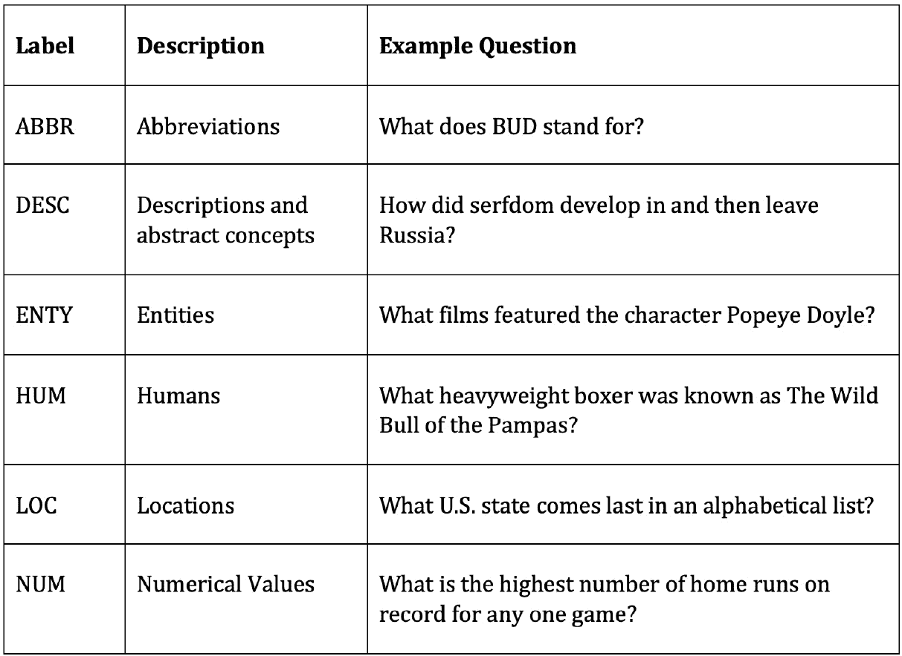

# 第六章：用于文本分类的卷积神经网络

在上一章中，我们展示了如何使用 RNNs 为文本提供情感分类。然而，RNNs 并不是唯一可以用于 NLP 分类任务的神经网络架构。**卷积神经网络**（**CNNs**）是另一种这样的架构。

RNNs 依赖于顺序建模，维护隐藏状态，然后逐词遍历文本，每次迭代更新状态。CNNs 不依赖于语言的顺序元素，而是试图通过感知句子中的每个单词并学习其与句子中相邻单词的关系来从文本中学习。

虽然 CNNs 更常用于基于以下原因分类图像，但它们也被证明在文本分类上是有效的。尽管我们把文本视为序列，但我们也知道句子中每个单词的含义取决于它们的上下文及相邻单词。虽然 CNNs 和 RNNs 从文本中学习的方式不同，但它们都被证明在文本分类中是有效的，而在特定任务中选择哪种取决于任务的性质。

在本章中，我们将探讨 CNNs 的基本理论，并从头构建一个 CNN，用于文本分类。我们将涵盖以下主题：

+   探索 CNNs

+   构建用于文本分类的 CNN

让我们开始吧！

# 技术要求

本章的所有代码可以在 [`github.com/PacktPublishing/Hands-On-Natural-Language-Processing-with-PyTorch-1.x`](https://github.com/PacktPublishing/Hands-On-Natural-Language-Processing-with-PyTorch-1.x) 找到。

# 探索 CNNs

CNN 的基础来自计算机视觉领域，但在概念上也可以扩展到自然语言处理。人类大脑处理和理解图像的方式并不是基于像素级别，而是将图像视为整体的映射，并理解图像中各部分的关联。

CNNs 的一个好比喻是人类大脑处理图片与处理句子的方式。考虑句子 *This is a sentence about a cat*。当你阅读这句话时，你读取第一个词，然后是第二个词，依此类推。现在，考虑一张猫的图片。通过查看第一个像素，然后是第二个像素来同化图片中的信息是愚蠢的。相反，当我们看东西时，我们一次性地感知整个图像，而不是作为一个序列。

例如，如果我们将图像的黑白表示（在这种情况下是数字 1），我们可以将其转换为向量表示，其中每个像素的颜色由 0 或 1 表示：


图 6.1 – 图像的向量表示

然而，如果我们从机器学习的角度思考并将该向量视为模型的特征，单个像素是黑色还是白色会使照片更有可能是特定数字吗？右上角的白色像素会使照片更有可能是四还是七吗？想象一下，如果我们尝试检测更复杂的事物，比如一张照片是狗还是猫。屏幕中央的褐色像素会使照片更有可能是猫还是狗吗？直觉上，我们看到单个像素值在图像分类方面并不意味着太多。然而，我们感兴趣的是像素之间的关系。

在数字表示的情况下，我们知道一个长竖线很有可能是一个一，而任何带有闭环的照片更有可能是零、六、八或九。通过识别和学习图像中的模式，而不仅仅是查看单个像素，我们可以更好地理解和识别这些图像。这正是 CNN 的目标所在。

## 卷积

CNN 的基本概念是卷积。**卷积**本质上是一个应用于矩阵的滑动窗口函数，以捕获周围像素的信息。在以下图表中，我们可以看到卷积的示例运作：


图 6.2 – 卷积的运作

在左侧，我们有正在处理的图像，而在顶部，我们有希望应用的卷积核。对于我们图像中的每个 3x3 块，我们将其乘以我们的核，得到我们在底部的卷积矩阵。然后我们对卷积矩阵求和（或平均），以获得我们在初始图像中这个 3x3 块的单个输出值。请注意，在我们的 5x5 初始图像中，我们可以叠加到九种可能的 3x3 块。当我们为初始图像中的每个 3x3 块应用此卷积过程时，我们得到最终处理的卷积结果为 3x3。

在大图像中（或在自然语言处理中的复杂句子），我们还需要实现池化层。在我们前面的示例中，将 3x3 卷积应用于 5x5 图像会得到 3x3 的输出。但是，如果我们将 3x3 卷积应用于 100x100 像素图像，则仅将输出减少至 98x98。这并没有降低图像的维度以有效地进行深度学习（因为我们必须为每个卷积层学习 98x98 个参数）。因此，我们应用池化层来进一步降低层的维度。

池化层对卷积层的输出应用一个函数（通常是最大函数），以降低其维度。这个函数是在一个滑动窗口上应用的，类似于我们执行卷积的方式，只是现在我们的卷积不重叠。假设我们的卷积层输出为 4x4，并且我们对输出应用一个 2x2 的最大池化函数。这意味着对于我们层内的每个较小的 2x2 网格，我们应用一个最大函数并保留生成的输出。我们可以在以下图中看到这一点：


图 6.3 - 池化层

这些池化层已被证明可以有效地降低数据的维度，同时仍保留了卷积层中大部分基本信息。

这种卷积和池化层的组合基本上是 CNN 从图像中学习的方式。我们可以看到，通过应用许多这些卷积过程（也称为**卷积层**），我们能够捕捉任给像素与其邻近像素的关系的信息。在 CNN 中，我们试图学习的参数是卷积核本身的值。这意味着我们的模型有效地学习如何应该在图像上进行卷积以提取必要的信息以进行分类。

在这种情况下，使用卷积的两个主要优点。首先，我们能够将一系列低级特征组合成一个高级特征；也就是说，我们初始图像上的一个 3x3 块被组合成一个单个值。这实际上起到了一种特征减少的作用，使我们能够仅从图像中提取相关信息。使用卷积的另一个优点是，它使我们的模型具有位置不变性。在我们的数字检测器示例中，我们不关心数字出现在图像的右侧还是左侧；我们只想要能够检测到它。由于我们的卷积将在图像中检测特定模式（即边缘），这使得我们的模型在任何地方检测到相同的特征都会被理论上通过卷积捕捉到，从而使我们的模型具有位置不变性。

尽管这些原则对于理解卷积在图像数据中的工作方式很有用，但也可以应用到自然语言处理数据中。我们将在下一节中进行讨论。

## 自然语言处理的卷积

正如我们在本书中很多次看到的，我们可以将单词表示为向量，将整个句子和文档表示为向量序列。当我们将我们的句子表示为向量序列时，我们可以将其表示为一个矩阵。如果我们有一个给定句子的矩阵表示，我们立即注意到这与我们在图像卷积中卷积过的图像相似。因此，我们可以类似地将卷积应用到自然语言处理中，只要我们能够将我们的文本表示为矩阵。

让我们首先考虑使用这种方法的基础。当我们之前研究 n 元组时，我们看到句子中的一个词的上下文取决于它前面的词和后面的词。因此，如果我们能以一种允许我们捕捉单词与周围单词关系的方式对句子进行卷积，我们可以在理论上检测语言中的模式，并用此来更好地分类我们的句子。

我们的卷积方法与图像上的卷积略有不同，值得注意。在我们的图像矩阵中，我们希望捕获单个像素相对于周围像素的上下文，而在句子中，我们希望捕获整个词向量相对于周围向量的上下文。因此，在自然语言处理中，我们希望跨整个词向量执行卷积，而不是在词向量内部执行。以下图表展示了这一点。

我们首先将我们的句子表示为单个词向量：


图 6.4 – 词向量

然后我们在矩阵上应用 (2 x *n*) 的卷积（其中 *n* 是我们词向量的长度；在这个例子中，*n* = 5）。我们可以使用 (2 x *n*) 的滤波器进行四次卷积，从而得到四个输出。您会注意到，这类似于一个二元组模型，在一个五个词的句子中可以有四个可能的二元组：


图 6.5 – 将词向量卷积成二元组

同样地，我们可以针对任意数量的 n 元组执行此操作；例如，*n*=3：


图 6.6 – 将词向量卷积成 n 元组

这类卷积模型的一个好处是我们可以无限制地对 n 元组进行卷积。我们还能同时对多个不同的 n 元组进行卷积。因此，为了捕获二元组和三元组，我们可以设置我们的模型如下：


图 6.7 – 将词向量卷积成二元组和三元组

尽管卷积神经网络在自然语言处理中具有如前文所述的优势，但它们也有其局限性。

在图像的卷积神经网络中，假设某个像素可能与周围像素相关联是合理的。当应用于自然语言处理时，尽管这种假设部分正确，但词语可以在语义上相关，即使它们不直接接近。句子开头的词可能与句子结尾的词相关。

尽管我们的循环神经网络模型可以通过长期记忆依赖来检测这种关系，但我们的卷积神经网络可能会遇到困难，因为卷积神经网络只能捕获周围单词的上下文。

话虽如此，尽管我们的语言假设不一定成立，但 CNN 在 NLP 中已被证明在某些任务中表现非常好。可以说，使用 CNN 进行 NLP 的主要优势是速度和效率。卷积可以在 GPU 上轻松实现，允许进行快速并行计算和训练。

捕捉单词之间关系的方式也更加高效。在真正的 n-gram 模型中，模型必须学习每个单独 n-gram 的表示，而在我们的 CNN 模型中，我们只需学习卷积核，它将自动提取给定单词向量之间的关系。

现在我们已经定义了我们的 CNN 将如何从我们的数据中学习，我们可以开始从头编写一个模型的代码。

# 为文本分类构建 CNN

现在我们已经了解了 CNN 的基础知识，我们可以开始从头构建一个。在上一章中，我们为情感预测构建了一个模型，其中情感是一个二元分类器；`1`表示积极，`0`表示消极。然而，在这个例子中，我们的目标是构建一个用于**多类文本分类**的 CNN。在多类问题中，一个特定的例子只能被分类为多个类别之一。如果一个例子可以被分类为许多不同的类别，那么这是多标签分类。由于我们的模型是多类的，这意味着我们的模型将致力于预测我们的输入句子被分类为几个类别中的哪一个。虽然这个问题比我们的二元分类任务要困难得多（因为我们的句子现在可以属于多个，而不是两个类别之一），我们将展示 CNN 在这个任务上可以提供良好的性能。我们首先开始定义我们的数据。

## 定义一个多类别分类数据集

在上一章中，我们查看了一些评论，并学习了基于评论是积极的还是消极的二元分类。对于这个任务，我们将查看来自 TREC ([`trec.nist.gov/data/qa.html`](https://trec.nist.gov/data/qa.html)) 数据集的数据，这是一个常用的数据集，用于评估模型文本分类任务的性能。该数据集包含一系列问题，每个问题都属于我们训练模型将学习分类的六个广泛语义类别之一。这六个类别如下：



图 6.8 – TREC 数据集中的语义类别

这意味着与我们之前的分类类不同，我们的模型输出不是在`0`和`1`之间的单一预测，而是我们的多类预测模型现在为每个六个可能类别之一返回一个概率。我们假设所做的预测是针对具有最高预测的类别：


图 6.9 – 预测值

这样一来，我们的模型现在能够在多个类别上执行分类任务，不再局限于之前看到的 0 或 1 的二元分类。由于多类模型需要区分更多不同的类别，因此在预测方面可能会受到影响。

在一个二分类模型中，假设我们有一个平衡的数据集，如果仅进行随机猜测，我们预期模型的准确率为 50%，而具有五个不同类别的多类模型的基准准确率仅为 20%。这意味着，仅仅因为多类模型的准确率远低于 100%，并不意味着模型本身在进行预测时存在问题。这在训练需要预测数百种不同类别的模型时尤为真实。在这些情况下，准确率仅为 50%的模型被认为是表现非常良好的。

现在，我们已经定义了我们的多类分类问题，需要加载我们的数据以便训练模型。

## 创建用于加载数据的迭代器

在上一章节的 LSTM 模型中，我们简单地使用了一个包含所有用于训练模型的数据的`.csv`文件。然后，我们手动将这些数据转换为输入张量，并逐个将它们馈送到网络中进行训练。虽然这种方法完全可以接受，但并不是最有效的方法。

在我们的 CNN 模型中，我们将考虑从我们的数据中创建数据迭代器。这些迭代器对象允许我们从输入数据中轻松生成小批量数据，从而允许我们使用小批量而不是将输入数据逐个馈送到网络中进行训练。这意味着网络内部的梯度是跨整个数据批次计算的，并且参数调整发生在每个批次之后，而不是在每个数据行通过网络之后。

对于我们的数据，我们将从 TorchText 包中获取我们的数据集。这不仅包含了用于模型训练的多个数据集，还允许我们使用内置函数轻松地对句子进行标记化和向量化。

按照以下步骤进行操作：

1.  首先，我们从 TorchText 导入数据和数据集函数：

    ```py
    from torchtext import data
    from torchtext import datasets
    ```

1.  接下来，我们创建一个字段和标签字段，这些字段可以与`TorchText`包一起使用。这些定义了模型处理数据的初始步骤：

    ```py
    questions = data.Field(tokenize = ‘spacy’, batch_first = True)
    labels = data.LabelField(dtype = torch.float)
    ```

    在这里，我们将 tokenize 设置为`spacy`，以设置如何对输入句子进行标记化。然后，`TorchText`使用`spacy`包自动对输入句子进行标记化。`spacy`包含英语语言的索引，因此任何单词都会自动转换为相关的标记。您可能需要在命令行中安装`spacy`才能使其工作。可以通过输入以下内容来完成这一步骤：

    ```py
    pip3 install spacy
    python3 -m spacy download en
    ```

    这将安装`spacy`并下载英语词汇索引。

1.  我们还将我们的标签数据类型定义为浮点数，这将允许我们计算我们的损失和梯度。在定义完我们的字段之后，我们可以使用它们来分割我们的输入数据。使用`TorchText`中的`TREC`数据集，我们将传递问题和标签字段以相应地处理数据集。然后，我们调用`split`函数自动将数据集分成训练集和验证集：

    ```py
    train_data, _ = datasets.TREC.splits(questions, labels)
    train_data, valid_data = train_data.split()
    ```

    请注意，通常情况下，我们可以通过简单调用训练数据来查看我们的数据集：

    ```py
    train_data
    ```

然而，在这里，我们处理的是一个`TorchText`数据集对象，而不是像我们可能习惯看到的加载到 pandas 中的数据集。这意味着我们从上述代码得到的输出如下所示：


图 6.10 – TorchText 对象的输出

我们可以查看此数据集对象中的单个数据，只需调用`.examples`参数。每个示例都会有一个文本和一个标签参数，我们可以像这样检查文本：

```py
train_data.examples[0].text
```

这将返回以下输出：


图 6.11 – 数据集对象中的数据

标签代码如下运行：

```py
train_data.examples[0].label
```

这为我们提供了以下输出：


图 6.12 – 数据集对象的标签

因此，我们可以看到我们的输入数据包括一个标记化的句子，我们的标签包括我们希望分类的类别。我们还可以检查我们的训练集和验证集的大小，如下所示：

```py
print(len(train_data))
print(len(valid_data))
```

这导致以下输出：


图 6.13 – 训练集和验证集的大小

这显示我们的训练到验证比例大约为 70%到 30%。值得注意的是我们的输入句子是如何被标记化的，即标点符号被视为它们自己的标记。

现在我们知道我们的神经网络不会将原始文本作为输入，我们必须找到一些方法将其转换为某种嵌入表示形式。虽然我们可以训练自己的嵌入层，但我们可以使用我们在*第三章**，执行文本嵌入*中讨论过的预先计算的`glove`向量来转换我们的数据。这还有一个额外的好处，可以使我们的模型训练更快，因为我们不需要手动从头开始训练我们的嵌入层：

```py
questions.build_vocab(train_data,
                 vectors = “glove.6B.200d”, 
                 unk_init = torch.Tensor.normal_)
labels.build_vocab(train_data)
```

在这里，我们可以看到通过使用 `build_vocab` 函数，并将我们的问题和标签作为我们的训练数据传递，我们可以构建一个由 200 维 GLoVe 向量组成的词汇表。请注意，TorchText 包将自动下载和获取 GLoVe 向量，因此在这种情况下无需手动安装 GLoVe。我们还定义了我们希望如何处理词汇表中的未知值（即，如果模型传递了一个不在预训练词汇表中的标记时模型将如何处理）。在这种情况下，我们选择将它们视为具有未指定值的普通张量，尽管稍后我们将更新这个值。

通过调用以下命令，我们现在可以看到我们的词汇表由一系列预训练的 200 维 GLoVe 向量组成：

```py
questions.vocab.vectors
```

这将导致以下输出：


图 6.14 – 张量内容

接下来，我们创建我们的数据迭代器。我们为我们的训练和验证数据分别创建单独的迭代器。我们首先指定一个设备，以便在有 CUDA 启用的 GPU 时能够更快地训练我们的模型。在我们的迭代器中，我们还指定了由迭代器返回的批次的大小，在这种情况下是`64`。您可能希望尝试使用不同的批次大小来进行模型训练，因为这可能会影响训练速度以及模型收敛到全局最优的速度：

```py
device = torch.device(‘cuda’ if torch.cuda.is_available() else                       ‘cpu’)
train_iterator, valid_iterator = data.BucketIterator.splits(
    (train_data, valid_data), 
    batch_size = 64, 
    device = device)
```

## 构建 CNN 模型

现在我们已经加载了数据，准备好创建模型了。我们将使用以下步骤来完成：

1.  我们希望构建我们的 CNN 的结构。我们像往常一样从定义我们的模型作为一个从`nn.Module`继承的类开始：

    ```py
    class CNN(nn.Module):
        def __init__(self, vocab_size, embedding_dim,     n_filters, filter_sizes, output_dim, dropout,     pad_idx):

            super().__init__()
    ```

1.  我们的模型被初始化为几个输入，所有这些输入很快将被覆盖。接下来，我们单独定义网络中的各个层，从我们的嵌入层开始：

    ```py
    self.embedding = nn.Embedding(vocab_size, embedding_dim, padding_idx = pad_idx)
    ```

    嵌入层将包含词汇表中每个可能单词的嵌入，因此层的大小是我们词汇表的长度和我们嵌入向量的长度。我们使用的是 200 维的 GLoVe 向量，因此在这个例子中长度将为`200`。我们还必须传递填充索引，该索引是我们嵌入层中用于获取填充我们句子的嵌入的索引，以便它们的长度都相同。当我们初始化我们的模型时，我们稍后将手动定义这个嵌入。

1.  接下来，我们定义网络内部的实际卷积层：

    ```py
    self.convs = nn.ModuleList([
    nn.Conv2d(in_channels = 1, 
         out_channels = n_filters, 
         kernel_size = (fs, embedding_dim)) 
         		for fs in filter_sizes
               ])
    ```

1.  我们首先使用 `nn.ModuleList` 来定义一系列卷积层。`ModuleList` 接受一个模块列表作为输入，并且在您希望定义多个单独的层时使用。由于我们希望在输入数据上训练几个不同大小的卷积层，我们可以使用 `ModuleList` 来实现。我们可以理论上像这样分别定义每一层：

    ```py
    self.conv_2 = nn.Conv2d(in_channels = 1, 
         out_channels = n_filters, 
         kernel_size = (2, embedding_dim)) 
    self.conv_3 = nn.Conv2d(in_channels = 1, 
         out_channels = n_filters, 
         kernel_size = (3, embedding_dim)) 
    ```

这里，滤波器的尺寸分别为`2`和`3`。然而，将这些操作合并到一个函数中会更加高效。此外，如果我们将不同的滤波器尺寸传递给函数，而不是每次添加新层时手动定义每一层，我们的层将会自动生成。

我们还将`out_channels`值定义为我们希望训练的滤波器数量；`kernel_size`将包含我们嵌入的长度。因此，我们可以将我们的`ModuleList`函数传递给我们希望训练的滤波器长度和数量，它将自动生成卷积层。以下是给定一组变量时此卷积层可能的示例：


图 6.15 – 寻找变量的卷积层

我们可以看到我们的`ModuleList`函数适应于我们希望训练的滤波器数量和大小。接下来，在我们的 CNN 初始化中，我们定义剩余的层，即线性层，用于分类我们的数据，以及 dropout 层，用于正则化我们的网络：

```py
self.fc = nn.Linear(len(filter_sizes) * n_filters, output_dim)
self.dropout = nn.Dropout(dropout)
```

请注意，过去，我们的线性层的尺寸始终为`1`，因为我们只需要一个单独的输出节点来执行二元分类。由于我们现在正在解决多类分类问题，我们希望对每个潜在类别进行预测，因此我们的输出维度现在是可变的，而不仅仅是`1`。当我们初始化网络时，我们将设置输出维度为`6`，因为我们正在预测句子来自六个类别中的哪一个。

接下来，与所有我们的神经网络一样，我们必须定义我们的`forward`传递：

```py
def forward(self, text):
emb = self.embedding(text).unsqueeze(1)
conved = [F.relu(c(emb)).squeeze(3) for c in self.convs]
pooled = [F.max_pool1d(c, c.shape[2]).squeeze(2) 
          for c in conved]
concat = self.dropout(torch.cat(pooled, dim = 1))
return self.fc(concat)
```

这里，我们首先通过我们的嵌入层将输入文本传递，以获取句子中所有单词的嵌入。接下来，对于我们之前定义的每一个卷积层，我们将嵌入的句子传递，应用一个`relu`激活函数并挤压结果，移除结果输出的第四个维度。这对于我们所有定义的卷积层都是重复的，以便`conved`包含我们所有卷积层输出的列表。

对于这些输出的每一个，我们应用一个池化函数来减少我们卷积层输出的维度，如前所述。然后，我们将所有池化层的输出连接起来，并在传递到我们最终的全连接层之前应用一个 dropout 函数，这将做出我们的类预测。在完全定义了我们的 CNN 类之后，我们创建模型的一个实例。我们定义超参数，并使用它们创建 CNN 类的一个实例：

```py
input_dimensions = len(questions.vocab)
output_dimensions = 6
embedding_dimensions = 200
pad_index = questions.vocab.stoi[questions.pad_token]
number_of_filters = 100
filter_sizes = [2,3,4]
dropout_pc = 0.5
model = CNN(input_dimensions, embedding_dimensions, number_of_filters, filter_sizes, output_dimensions, dropout_pc, pad_index)
```

我们的输入维度将始终是我们词汇表的长度，而输出维度将是我们希望预测的类别数。在这里，我们预测六种不同的类别，因此我们的输出向量长度将为`6`。我们的嵌入维度是我们的 GLoVe 向量的长度（在本例中为`200`）。填充索引可以手动从我们的词汇表中获取。

接下来的三个超参数可以手动调整，因此您可能希望尝试选择不同的值，以查看这如何影响您的网络的最终输出。我们传递一个过滤器大小的列表，以便我们的模型将使用大小为`2`、`3`和`4`的卷积训练卷积层。我们将为每种过滤器大小训练 100 个这些过滤器，因此总共将有 300 个过滤器。我们还为我们的网络定义了 50% 的丢失率，以确保它足够规范化。如果模型似乎容易过度拟合或欠拟合，可以提高/降低此值。一个一般的经验法则是，如果模型欠拟合，尝试降低丢失率，如果模型过拟合，则尝试提高丢失率。

在初始化我们的模型之后，我们需要将权重加载到我们的嵌入层中。这可以通过以下简单完成：

```py
glove_embeddings = questions.vocab.vectors
model.embedding.weight.data.copy_(glove_embeddings)
```

这将产生以下输出：


图 6.16 – 降低丢失率后的张量输出

接下来，我们需要定义我们的模型如何处理模型账户中未知的标记，这些标记不包含在嵌入层中，并且我们的模型将如何将填充应用到我们的输入句子中。幸运的是，解决这两种情况的最简单方法是使用一个由全零组成的向量。我们确保这些零值张量与我们的嵌入向量长度相同（在这个实例中为`200`）：

```py
unknown_index = questions.vocab.stoi[questions.unk_token]
model.embedding.weight.data[unknown_index] = torch.zeros(embedding_dimensions)
model.embedding.weight.data[pad_index] = torch.zeros(embedding_dimensions)
```

最后，我们定义我们的优化器和准则（损失）函数。请注意，我们选择使用交叉熵损失而不是二元交叉熵，因为我们的分类任务不再是二元的。我们还使用`.to(device)`来使用指定的设备训练我们的模型。这意味着如果有可用的 CUDA 启用的 GPU，我们的训练将在其上进行：

```py
optimizer = torch.optim.Adam(model.parameters())
criterion = nn.CrossEntropyLoss().to(device)
model = model.to(device)
```

现在我们的模型结构已经完全定义，我们准备开始训练模型。

## 训练 CNN

在我们定义训练过程之前，我们需要计算一个性能指标，以说明我们希望我们模型的性能（希望如此！）随时间增加。在我们的二元分类任务中，准确度是我们用来衡量性能的一个简单指标。对于我们的多分类任务，我们将再次使用准确度，但是计算它的过程略微复杂，因为我们现在必须弄清楚我们模型预测了哪一个六个类别中的哪一个，并且哪一个六个类别是正确的。

首先，我们定义一个名为`multi_accuracy`的函数来计算这个：

```py
def multi_accuracy(preds, y):
    pred = torch.max(preds,1).indices
    correct = (pred == y).float()
    acc = correct.sum() / len(correct)
    return acc
```

在这里，对于我们的预测，我们的模型使用 `torch.max` 函数为每个预测返回最高值的索引。对于每个预测，如果此预测的索引与标签的索引相同，则将其视为正确预测。然后我们计算所有这些正确预测的数量，并将其除以总预测数量以得到多类别准确度的度量。我们可以在训练循环中使用此函数来测量每个 epoch 的准确度。

接下来，我们定义我们的训练函数。我们最初将该 epoch 的损失和准确度设置为 `0`，并调用 `model.train()` 以允许在训练模型时更新模型内部的参数：

```py
def train(model, iterator, optimizer, criterion):

    epoch_loss = 0
    epoch_acc = 0

    model.train()
```

接下来，我们在迭代器中循环每个数据批次并执行训练步骤。我们首先将梯度清零，以防止从先前批次计算的累积梯度。然后，我们使用当前批次中句子的模型当前状态进行预测，然后与我们的标签进行比较以计算损失。使用我们在前面部分定义的准确度函数，我们可以计算给定批次的准确度。然后我们反向传播我们的损失，通过梯度下降更新我们的权重并通过我们的优化器进行步进：

```py
for batch in iterator:

optimizer.zero_grad()

preds = model(batch.text).squeeze(1)
loss = criterion(preds, batch.label.long())

acc = multi_accuracy(preds, batch.label)

loss.backward()

optimizer.step()
```

最后，我们将这一批次的损失和准确度加到整个 epoch 的总损失和准确度上。当我们遍历完整个 epoch 中的所有批次后，我们计算该 epoch 的总损失和准确度，并返回它：

```py
epoch_loss += loss.item()
epoch_acc += acc.item()

total_epoch_loss = epoch_loss / len(iterator)
total_epoch_accuracy = epoch_acc / len(iterator)

return total_epoch_loss, total_epoch_accuracy
```

类似地，我们可以定义一个名为 `eval` 的函数，在我们的验证数据上调用它，以计算我们训练过的模型在我们尚未训练的一组数据上的性能。虽然这个函数与我们之前定义的训练函数几乎相同，但我们必须做两个关键的添加：

```py
model.eval()

with torch.no_grad():
```

这两个步骤将我们的模型设置为评估模式，忽略任何 dropout 函数，并确保不计算和更新梯度。这是因为我们希望在评估性能时冻结模型中的权重，并确保我们的模型不会使用验证数据进行训练，因为我们希望将其与用于训练模型的数据分开保留。

现在，我们只需在与数据迭代器结合的循环中调用我们的训练和评估函数，以训练模型。我们首先定义我们希望模型训练的 epoch 数量。我们还定义到目前为止模型已经达到的最低验证损失。这是因为我们只希望保留验证损失最低的训练模型（即性能最佳的模型）。这意味着如果我们的模型训练了多个 epoch 并开始过拟合，只会保留这些模型中表现最佳的一个，这样选择较高数量的 epoch 将会减少后果。

我们将最低验证损失初始化为无穷大：

```py
epochs = 10
lowest_validation_loss = float(‘inf’)
```

接下来，我们定义我们的训练循环，一次处理一个 epoch。我们记录训练的开始和结束时间，以便计算每个步骤的持续时间。然后，我们简单地使用训练数据迭代器在我们的模型上调用训练函数，计算训练损失和准确率，并在此过程中更新我们的模型。接着，我们使用验证数据迭代器上的评估函数，计算验证数据上的损失和准确率，但不更新我们的模型：

```py
for epoch in range(epochs):
    start_time = time.time()

    train_loss, train_acc = train(model, train_iterator,                            optimizer, criterion)
    valid_loss, valid_acc = evaluate(model, valid_iterator,                            criterion)

    end_time = time.time()
```

之后，我们确定我们的模型在当前 epoch 之后是否优于迄今为止表现最佳的模型：

```py
if valid_loss < lowest_validation_loss:
    lowest_validation_loss = valid_loss
    torch.save(model.state_dict(), ‘cnn_model.pt’)
```

如果这个 epoch 之后的损失低于迄今为止最低的验证损失，我们将验证损失设置为新的最低验证损失，并保存当前模型权重。

最后，我们只需在每个 epoch 之后打印结果。如果一切正常，我们应该看到每个 epoch 后训练损失下降，希望验证损失也跟随下降：

```py
print(f’Epoch: {epoch+1:02} | Epoch Time: {int(end_time -       start_time)}s’)
print(f’\tTrain Loss: {train_loss:.3f} | Train Acc: {train_      acc*100:.2f}%’)
print(f’\t Val. Loss: {valid_loss:.3f} |  Val. Acc: {valid_      acc*100:.2f}%’)
```

这导致以下输出：


图 6.17 – 测试模型

幸运的是，我们看到情况似乎确实如此。每个 epoch 后，训练损失和验证损失都在下降，准确率上升，显示我们的模型确实在学习！经过多个训练 epoch 后，我们可以使用最佳模型进行预测。

## 使用训练好的 CNN 进行预测

幸运的是，使用我们完全训练好的模型进行预测是一个相对简单的任务。我们首先使用`load_state_dict`函数加载我们的最佳模型：

```py
model.load_state_dict(torch.load(‘cnn_model.pt’))
```

我们的模型结构已经定义好，所以我们只需从之前保存的文件中加载权重。如果一切正常，您将看到以下输出：


图 6.18 – 预测输出

接下来，我们定义一个函数，该函数将以句子作为输入，对其进行预处理，将其传递给我们的模型，并返回预测：

```py
def predict_class(model, sentence, min_len = 5):

    tokenized = [tok.text for tok in nlp.tokenizer(sentence)]
    if len(tokenized) < min_len:
        tokenized += [‘<pad>’] * (min_len - len(tokenized))
    indexed = [questions.vocab.stoi[t] for t in tokenized]
    tensor = torch.LongTensor(indexed).to(device)
    tensor = tensor.unsqueeze(0)
```

我们首先将输入句子传递给我们的分词器，以获取标记列表。如果句子长度低于最小句子长度，我们然后对这个句子进行填充。然后，我们使用我们的词汇表获取所有这些单个标记的索引，最后创建一个张量，其中包含这些索引的向量。如果 GPU 可用，我们将其传递给 GPU，然后展开输出，因为我们的模型期望三维张量输入而不是单个向量。

接下来，我们进行预测：

```py
model.eval()
prediction = torch.max(model(tensor),1).indices.item()
pred_index = labels.vocab.itos[prediction]
    return pred_index
```

首先，我们将模型设置为评估模式（与我们的评估步骤相同），以便不计算模型的梯度并且不调整权重。然后，我们将句子张量传递给我们的模型，并获取长度为`6`的预测向量，其中包含每个六类别的单独预测。然后，我们取最大预测值的索引，并在标签索引中使用此索引返回预测类别的名称。

为了进行预测，我们只需在任何给定的句子上调用`predict_class`函数。让我们使用以下代码：

```py
pred_class = predict_class(model, “How many roads must a man                            walk down?”)
print(‘Predicted class is: ‘ + str(pred_class))
```

这返回以下预测：


图 6.19 – 预测值

这个预测是正确的！我们的输入问题包含`How many`，表明这个问题的答案是一个数字值。这正是我们的模型也预测到的！你可以继续在任何其他你想测试的问题上验证模型，希望能获得类似的积极结果。恭喜！你现在已经成功训练了一个能够定义任何给定问题类别的多类 CNN。

# 总结

在本章中，我们展示了 CNN 如何从 NLP 数据中学习，以及如何使用 PyTorch 从头开始训练 CNN。虽然深度学习方法与 RNN 中使用的方法非常不同，但在概念上，CNN 以算法方式使用 n-gram 语言模型背后的动机，以从上下文中的相邻单词中提取单词的隐含信息。现在我们已经掌握了 RNN 和 CNN，我们可以开始扩展这些技术，以构建更先进的模型。

在下一章中，我们将学习如何构建既利用卷积神经网络又利用递归神经网络元素的模型，并将它们用于序列以执行更高级的功能，如文本翻译。这些被称为序列到序列网络。
