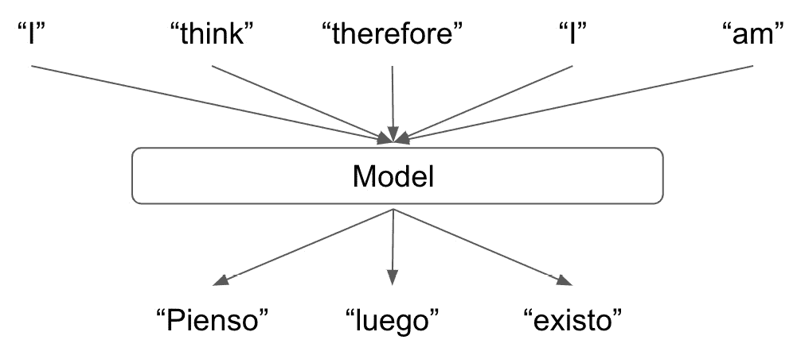
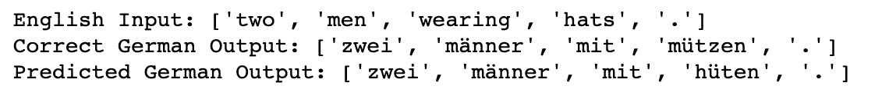

# *第七章*：使用序列到序列神经网络进行文本翻译

在前两章中，我们使用神经网络来分类文本并执行情感分析。这两项任务都涉及接收 NLP 输入并预测某个值。在情感分析中，这是一个介于 0 和 1 之间的数字，表示我们句子的情感。在句子分类模型中，我们的输出是一个多类别预测，表示句子属于的几个类别之一。但如果我们希望不仅仅是进行单一预测，而是预测整个句子呢？在本章中，我们将构建一个序列到序列模型，将一个语言中的句子作为输入，并输出这个句子在另一种语言中的翻译。

在*第五章**，递归神经网络和情感分析*中，我们已经探讨了用于 NLP 学习的几种类型的神经网络架构，即递归神经网络，以及*第六章**，使用 CNN 进行文本分类*中的卷积神经网络。在本章中，我们将再次使用这些熟悉的 RNN，但不再仅构建简单的 RNN 模型，而是将 RNN 作为更大、更复杂模型的一部分，以执行序列到序列的翻译。通过利用我们在前几章学到的 RNN 基础知识，我们可以展示如何扩展这些概念，以创建适合特定用途的各种模型。

在本章中，我们将涵盖以下主题：

+   序列到序列模型的理论

+   为文本翻译构建序列到序列神经网络

+   后续步骤

# 技术要求

本章的所有代码都可以在[`github.com/PacktPublishing/Hands-On-Natural-Language-Processing-with-PyTorch-1.x`](https://github.com/PacktPublishing/Hands-On-Natural-Language-Processing-with-PyTorch-1.x)找到。

# 序列到序列模型的理论

到目前为止，序列到序列模型与我们迄今所见的传统神经网络结构非常相似。其主要区别在于，对于模型的输出，我们期望得到另一个序列，而不是一个二进制或多类别预测。这在翻译等任务中特别有用，我们希望将一个完整的句子转换成另一种语言。

在以下示例中，我们可以看到我们的英语到西班牙语翻译将单词映射到单词：


图 7.1 – 英语到西班牙语翻译

我们输入句子中的第一个单词与输出句子中的第一个单词非常匹配。如果所有语言都是这种情况，我们可以简单地通过我们训练过的模型逐个传递我们句子中的每个单词来获得一个输出句子，那么就不需要进行任何序列到序列建模，如本例所示：


](img/B12365_07_02.jpg)

图 7.2 – 英语到西班牙语单词的翻译

然而，我们从自然语言处理的经验中知道，语言并不像这么简单！一种语言中的单词可能映射到另一种语言中的多个单词，并且这些单词在语法正确的句子中出现的顺序可能不同。因此，我们需要一个能够捕获整个句子上下文并输出正确翻译的模型，而不是直接翻译单个单词的模型。这就是序列到序列建模变得至关重要的地方，正如在这里所看到的：



图 7.3 – 用于翻译的序列到序列建模

要训练一个序列到序列模型，捕捉输入句子的上下文并将其转换为输出句子，我们基本上会训练两个较小的模型来实现这一点：

+   一个**编码器**模型，它捕获我们句子的上下文并将其输出为单个上下文向量

+   一个**解码器**，它接受我们原始句子的上下文向量表示，并将其翻译为另一种语言

所以，实际上，我们的完整序列到序列翻译模型看起来会像这样：


图 7.4 – 完整的序列到序列模型

通过将我们的模型拆分为单独的编码器和解码器元素，我们有效地模块化了我们的模型。这意味着，如果我们希望训练多个模型从英语翻译成不同的语言，我们不需要每次重新训练整个模型。我们只需训练多个不同的解码器来将我们的上下文向量转换为输出句子。然后，在进行预测时，我们可以简单地替换我们希望用于翻译的解码器：


图 7.5 – 详细模型布局

接下来，我们将检查序列到序列模型的编码器和解码器组件。

## 编码器

我们序列到序列模型的编码器元素的目的是能够完全捕获我们输入句子的上下文，并将其表示为向量。我们可以通过使用循环神经网络或更具体地说是长短期记忆网络来实现这一点。正如您可能从我们之前的章节中记得的那样，循环神经网络接受顺序输入并在整个序列中维护隐藏状态。序列中的每个新单词都会更新隐藏状态。然后，在序列结束时，我们可以使用模型的最终隐藏状态作为我们下一层的输入。

在我们的编码器的情况下，隐藏状态代表了我们整个句子的上下文向量表示，这意味着我们可以使用 RNN 的隐藏状态输出来表示整个输入句子：


图 7.6 – 检查编码器

我们使用我们的最终隐藏状态 *h^n* 作为我们的上下文向量，然后使用经过训练的解码器来解码它。同时值得注意的是，在我们的序列到序列模型的背景下，我们在输入句子的开头和结尾分别附加了 "start" 和 "end" 令牌。这是因为我们的输入和输出并没有固定的长度，我们的模型需要能够学习何时结束一个句子。我们的输入句子总是以 "end" 令牌结束，这向编码器表明此时的隐藏状态将被用作该输入句子的最终上下文向量表示。类似地，在解码器步骤中，我们将看到我们的解码器将继续生成词汇，直到预测到一个 "end" 令牌。这使得我们的解码器能够生成实际的输出句子，而不是无限长度的令牌序列。

接下来，我们将看看解码器如何利用这个上下文向量学习将其翻译成输出句子。

## 解码器

我们的解码器接收来自我们编码器层的最终隐藏状态，并将其解码成另一种语言的句子。我们的解码器是一个 RNN，类似于我们的编码器，但是在我们的编码器更新其隐藏状态时考虑当前句子中的当前词汇，我们的解码器在每次迭代中更新其隐藏状态并输出一个令牌，考虑到当前的隐藏状态和先前预测的句子中的词汇。可以在以下图表中看到这一点：

![图 7.7 – 检查解码器 img/B12365_07_07.jpg)图 7.7 – 检查解码器首先，我们的模型将上下文向量作为我们编码器步骤的最终隐藏状态 *h0*。然后，我们的模型旨在预测句子中的下一个词汇，给定当前隐藏状态，然后是句子中的前一个词汇。我们知道我们的句子必须以一个 "start" 令牌开始，因此在第一步，我们的模型尝试根据先前的隐藏状态 *h0* 和句子中的先前词汇（在这种情况下是 "start" 令牌）预测句子中的第一个词汇。我们的模型做出预测（"pienso"），然后更新隐藏状态以反映模型的新状态 *h1*。然后，在下一步中，我们的模型使用新的隐藏状态和上次预测的词汇来预测句子中的下一个词汇。这一过程持续进行，直到模型预测到 "end" 令牌，此时我们的模型停止生成输出词汇。这个模型背后的直觉与我们迄今为止对语言表征的理解是一致的。任何给定句子中的词汇都依赖于它之前的词汇。因此，预测句子中的任何给定词汇而不考虑其之前预测的词汇是没有意义的，因为任何给定句子中的词汇都不是彼此独立的。我们学习模型参数的方法与之前相同：通过进行前向传播，计算目标句子与预测句子的损失，并通过网络反向传播此损失，随着过程更新参数。然而，使用这种过程学习可能非常缓慢，因为起初，我们的模型预测能力很弱。由于我们目标句子中的单词预测不是独立的，如果我们错误地预测了目标句子的第一个单词，那么输出句子中的后续单词也可能不正确。为了帮助这个过程，我们可以使用一种称为**教师强迫**的技术。## 使用教师强迫由于我们的模型最初预测不良好，我们会发现任何初始错误都会呈指数增长。如果我们在句子中第一个预测的单词不正确，那么句子的其余部分很可能也是错误的。这是因为我们模型的预测依赖于它先前的预测。这意味着我们模型遇到的任何损失都可能会成倍增加。由于此原因，我们可能面临梯度爆炸问题，使得我们的模型很难学习任何东西：

图 7.9 – 更新损失

您可以将教师强迫视为一种帮助我们的模型在每个时间步独立学习的方法。这样，由于在早期时间步骤的误预测造成的损失不会传递到后续时间步骤。

通过结合编码器和解码器步骤，并应用教师强迫来帮助我们的模型学习，我们可以构建一个序列到序列的模型，允许我们将一种语言的序列翻译成另一种语言。在接下来的部分，我们将演示如何使用 PyTorch 从头开始构建这个模型。

# 构建文本翻译的序列到序列模型

为了构建我们的序列到序列翻译模型，我们将实现之前概述的编码器/解码器框架。这将展示我们的模型的两个部分如何结合在一起，以通过编码器捕获数据的表示，然后使用解码器将这个表示翻译成另一种语言。为了做到这一点，我们需要获取我们的数据。

## 准备数据

现在我们已经了解足够多的关于机器学习的知识，知道对于这样的任务，我们需要一组带有相应标签的训练数据。在这种情况下，我们将需要 `Torchtext` 库，我们在前一章中使用的这个库包含一个数据集，可以帮助我们获得这些数据。

`Torchtext` 中的 `Multi30k` 数据集包含大约 30,000 个句子及其在多种语言中的对应翻译。对于这个翻译任务，我们的输入句子将是英文，输出句子将是德文。因此，我们完全训练好的模型将能够**将英文句子翻译成德文**。

我们将开始提取和预处理我们的数据。我们将再次使用 `spacy`，它包含一个内置的词汇表字典，我们可以用它来标记化我们的数据：

1.  我们首先将 `spacy` 标记器加载到 Python 中。我们将需要为每种语言执行一次此操作，因为我们将为此任务构建两个完全独立的词汇表：

    ```py
    spacy_german = spacy.load(‘de’)
    spacy_english = spacy.load(‘en’)
    ```

    重要说明

    您可能需要通过以下命令行安装德语词汇表（我们在前一章中安装了英语词汇表）：**python3 -m spacy download de**

1.  接下来，我们为每种语言创建一个函数来对我们的句子进行标记化。请注意，我们对输入的英文句子进行标记化时会颠倒 token 的顺序：

    ```py
    def tokenize_german(text):
        return [token.text for token in spacy_german.            tokenizer(text)]
    def tokenize_english(text):
        return [token.text for token in spacy_english.            tokenizer(text)][::-1]
    ```

    虽然反转输入句子的顺序并非强制性的，但已被证明可以提高模型的学习能力。如果我们的模型由两个连接在一起的 RNN 组成，我们可以展示在反转输入句子时，模型内部的信息流得到了改善。例如，让我们来看一个基本的英文输入句子，但不进行反转，如下所示：

    

    图 7.10 – 反转输入单词

    在这里，我们可以看到为了正确预测第一个输出词 *y0*，我们的第一个英文单词从 *x0* 必须通过三个 RNN 层后才能进行预测。从学习的角度来看，这意味着我们的梯度必须通过三个 RNN 层进行反向传播，同时通过网络保持信息的流动。现在，让我们将其与反转输入句子的情况进行比较：

    

    图 7.11 – 反转输入句子

    现在我们可以看到，输入句子中真正的第一个单词与输出句子中相应单词之间的距离仅为一个 RNN 层。这意味着梯度只需反向传播到一个层，这样网络的信息流和学习能力与输入输出单词之间距离为三层时相比要大得多。

    如果我们计算反向和非反向变体中输入单词与其输出对应单词之间的总距离，我们会发现它们是相同的。然而，我们先前已经看到，输出句子中最重要的单词是第一个单词。这是因为输出句子中的单词依赖于它们之前的单词。如果我们错误地预测输出句子中的第一个单词，那么后面的单词很可能也会被错误地预测。然而，通过正确预测第一个单词，我们最大化了正确预测整个句子的机会。因此，通过最小化输出句子中第一个单词与其输入对应单词之间的距离，我们可以增加模型学习这种关系的能力。这增加了此预测正确的机会，从而最大化了整个输出句子被正确预测的机会。

1.  有了我们构建的分词器，现在我们需要为分词定义字段。请注意，在这里我们如何在我们的序列中添加开始和结束标记，以便我们的模型知道何时开始和结束序列的输入和输出。为了简化起见，我们还将所有的输入句子转换为小写：

    ```py
    SOURCE = Field(tokenize = tokenize_english, 
                init_token = ‘<sos>’, 
                eos_token = ‘<eos>’, 
                lower = True)
    TARGET = Field(tokenize = tokenize_german, 
                init_token = ‘<sos>’, 
                eos_token = ‘<eos>’, 
                lower = True)
    ```

1.  我们定义了字段后，我们的分词化变成了一个简单的一行代码。包含 30,000 个句子的数据集具有内置的训练、验证和测试集，我们可以用于我们的模型：

    ```py
    train_data, valid_data, test_data = Multi30k.splits(exts = (‘.en’, ‘.de’), fields = (SOURCE, TARGET))
    ```

1.  我们可以使用数据集对象的`examples`属性来检查单个句子。在这里，我们可以看到源（`src`）属性包含我们英语输入句子的反向，而目标（`trg`）包含我们德语输出句子的非反向：

    ```py
    print(train_data.examples[0].src)
    print(train_data.examples[0].trg)
    ```

    这给了我们以下输出：

    

    图 7.12 – 训练数据示例

1.  现在，我们可以检查每个数据集的大小。在这里，我们可以看到我们的训练数据集包含 29,000 个示例，而每个验证集和测试集分别包含 1,014 和 1,000 个示例。在过去，我们通常将训练和验证数据拆分为 80%/20%。然而，在像这样输入输出字段非常稀疏且训练集有限的情况下，通常最好利用所有可用数据进行训练：

    ```py
    print(“Training dataset size: “ + str(len(train_data.       examples)))
    print(“Validation dataset size: “ + str(len(valid_data.       examples)))
    print(“Test dataset size: “ + str(len(test_data.       examples)))
    ```

    这将返回以下输出：

    

    图 7.13 – 数据样本长度

1.  现在，我们可以构建我们的词汇表并检查它们的大小。我们的词汇表应包含数据集中发现的每个唯一单词。我们可以看到我们的德语词汇表比我们的英语词汇表大得多。我们的词汇表比每种语言的真实词汇表大小要小得多（英语词典中的每个单词）。因此，由于我们的模型只能准确地翻译它以前见过的单词，我们的模型不太可能能够很好地泛化到英语语言中的所有可能句子。这就是为什么像这样准确训练模型需要极大的 NLP 数据集（例如 Google 可以访问的那些）的原因：

    ```py
    SOURCE.build_vocab(train_data, min_freq = 2)
    TARGET.build_vocab(train_data, min_freq = 2)
    print(“English (Source) Vocabulary Size: “ +        str(len(SOURCE.vocab)))
    print(“German (Target) Vocabulary Size: “ +        str(len(TARGET.vocab)))
    ```

    这将得到以下输出：

    

    图 7.14 – 数据集的词汇量

1.  最后，我们可以从我们的数据集创建数据迭代器。与以前一样，我们指定使用支持 CUDA 的 GPU（如果系统上可用），并指定我们的批量大小：

    ```py
    device = torch.device(‘cuda’ if torch.cuda.is_available()                       else ‘cpu’)
    batch_size = 32
    train_iterator, valid_iterator, test_iterator = BucketIterator.splits(
        (train_data, valid_data, test_data), 
        batch_size = batch_size, 
        device = device)
    ```

现在我们的数据已经预处理完成，我们可以开始构建模型本身。

## 建立编码器

现在，我们可以开始建立我们的编码器：

1.  首先，我们通过从我们的`nn.Module`类继承来初始化我们的模型，就像我们之前的所有模型一样。我们初始化一些参数，稍后我们会定义，以及我们的 LSTM 层中隐藏层的维度数和 LSTM 层的数量：

    ```py
    class Encoder(nn.Module):
        def __init__(self, input_dims, emb_dims, hid_dims,     n_layers, dropout):
            super().__init__()   
            self.hid_dims = hid_dims
            self.n_layers = n_layers
    ```

1.  接下来，我们在编码器内定义我们的嵌入层，这是输入维度数量和嵌入维度数量的长度：

    ```py
    self.embedding = nn.Embedding(input_dims, emb_dims)
    ```

1.  接下来，我们定义实际的 LSTM 层。这需要我们从嵌入层获取嵌入的句子，保持定义长度的隐藏状态，并包括一些层（稍后我们将定义为 2）。我们还实现`dropout`以对网络应用正则化：

    ```py
    self.rnn = nn.LSTM(emb_dims, hid_dims, n_layers, dropout                    = dropout)
    self.dropout = nn.Dropout(dropout)
    ```

1.  然后，我们在编码器内定义前向传播。我们将嵌入应用于我们的输入句子并应用 dropout。然后，我们将这些嵌入传递到我们的 LSTM 层，输出我们的最终隐藏状态。这将由我们的解码器用于形成我们的翻译句子：

    ```py
    def forward(self, src):
        embedded = self.dropout(self.embedding(src))
        outputs, (h, cell) = self.rnn(embedded)
        return h, cell
    ```

我们的编码器将包括两个 LSTM 层，这意味着我们的输出将输出两个隐藏状态。这也意味着我们的完整 LSTM 层，以及我们的编码器，将看起来像这样，我们的模型输出两个隐藏状态：


图 7.15 – 具有编码器的 LSTM 模型

现在我们已经建立了编码器，让我们开始建立我们的解码器。

## 建立解码器

我们的解码器将从编码器的 LSTM 层中获取最终的隐藏状态，并将其转化为另一种语言的输出句子。我们首先通过几乎完全相同的方式初始化我们的解码器，与编码器的方法略有不同的是，我们还添加了一个全连接线性层。该层将使用 LSTM 的最终隐藏状态来预测句子中正确的单词：

```py
class Decoder(nn.Module):
    def __init__(self, output_dims, emb_dims, hid_dims,     n_layers, dropout):
        super().__init__()

        self.output_dims = output_dims
        self.hid_dims = hid_dims
        self.n_layers = n_layers

        self.embedding = nn.Embedding(output_dims, emb_dims)

        self.rnn = nn.LSTM(emb_dims, hid_dims, n_layers,                           dropout = dropout)

        self.fc_out = nn.Linear(hid_dims, output_dims)

        self.dropout = nn.Dropout(dropout)
```

我们的前向传播与编码器非常相似，只是增加了两个关键步骤。首先，我们将前一层的输入展开，以使其适合输入到嵌入层中。然后，我们添加一个全连接层，该层接收我们的 RNN 层的输出隐藏层，并用其来预测序列中的下一个单词：

```py
def forward(self, input, h, cell):

    input = input.unsqueeze(0)

    embedded = self.dropout(self.embedding(input))

    output, (h, cell) = self.rnn(embedded, (h, cell))

    pred = self.fc_out(output.squeeze(0))

    return pred, h, cell
```

类似于编码器，我们在解码器内部使用了一个两层的 LSTM 层。我们取出编码器的最终隐藏状态，并用它们生成序列中的第一个单词 Y1\. 然后，我们更新我们的隐藏状态，并使用它和 Y1 生成下一个单词 Y2，重复此过程，直到我们的模型生成一个结束标记。我们的解码器看起来像这样：


图 7.16 – 带有解码器的 LSTM 模型

在这里，我们可以看到单独定义编码器和解码器并不特别复杂。然而，当我们将这些步骤组合成一个更大的序列到序列模型时，事情开始变得有趣：

## 构建完整的序列到序列模型

现在，我们必须将我们模型的两个部分连接起来，以产生完整的序列到序列模型：

1.  我们首先创建一个新的序列到序列类。这将允许我们将编码器和解码器作为参数传递给它：

    ```py
    class Seq2Seq(nn.Module):
        def __init__(self, encoder, decoder, device):
            super().__init__()

            self.encoder = encoder
            self.decoder = decoder
            self.device = device
    ```

1.  接下来，我们在我们的 `Seq2Seq` 类中创建 `forward` 方法。这可以说是模型中最复杂的部分。我们将编码器与解码器结合起来，并使用教师强迫来帮助我们的模型学习。我们首先创建一个张量，其中存储我们的预测。我们将其初始化为一个全零张量，但随着我们生成预测，我们会更新它。全零张量的形状将是目标句子的长度、批量大小的宽度和目标（德语）词汇表大小的深度：

    ```py
    def forward(self, src, trg, teacher_forcing_rate = 0.5):
        batch_size = trg.shape[1]
        target_length = trg.shape[0]
        target_vocab_size = self.decoder.output_dims

         outputs = torch.zeros(target_length, batch_size,                     target_vocab_size).to(self.device)
    ```

1.  接下来，我们将输入句子传递到编码器中，以获取输出的隐藏状态：

    ```py
    h, cell = self.encoder(src)
    ```

1.  然后，我们必须循环遍历我们的解码器模型，为输出序列中的每个步骤生成一个输出预测。输出序列的第一个元素始终是 `<start>` 标记。我们的目标序列已将其作为第一个元素，因此我们只需将初始输入设置为这个，通过获取列表的第一个元素：

    ```py
    input = trg[0,:]
    ```

1.  接下来，我们循环并进行预测。我们将我们的隐藏状态（从编码器的输出中获得）传递给我们的解码器，以及我们的初始输入（仅是`<start>`标记）。这将为我们序列中的所有单词返回一个预测。然而，我们只对当前步骤中的单词感兴趣；也就是说，序列中的下一个单词。请注意，我们从 1 开始循环，而不是从 0 开始，因此我们的第一个预测是序列中的第二个单词（因为始终预测的第一个单词将始终是起始标记）。

1.  此输出由目标词汇长度的向量组成，每个词汇中都有一个预测。我们使用`argmax`函数来识别模型预测的实际单词。

    接下来，我们需要为下一步选择新的输入。我们将我们的教师强制比例设置为 50%，这意味着有 50%的时间，我们将使用我们刚刚做出的预测作为我们解码器的下一个输入，而另外 50%的时间，我们将采用真实的目标值。正如我们之前讨论的那样，这比仅依赖于模型预测能够更快地让我们的模型学习。

    然后，我们继续这个循环，直到我们对序列中的每个单词都有了完整的预测：

    ```py
    for t in range(1, target_length):
    output, h, cell = self.decoder(input, h, cell)

    outputs[t] = output

    top = output.argmax(1) 

    input = trg[t] if (random.random() < teacher_forcing_                   rate) else top

    return outputs
    ```

1.  最后，我们创建一个准备好进行训练的 Seq2Seq 模型的实例。我们使用一些超参数初始化了一个编码器和一个解码器，所有这些超参数都可以稍微改变模型：

    ```py
    input_dimensions = len(SOURCE.vocab)
    output_dimensions = len(TARGET.vocab)
    encoder_embedding_dimensions = 256
    decoder_embedding_dimensions = 256
    hidden_layer_dimensions = 512
    number_of_layers = 2
    encoder_dropout = 0.5
    decoder_dropout = 0.5
    ```

1.  然后，我们将我们的编码器和解码器传递给我们的`Seq2Seq`模型，以创建完整的模型：

    ```py
    encod = Encoder(input_dimensions,\
                    encoder_embedding_dimensions,\
                    hidden_layer_dimensions,\
                    number_of_layers, encoder_dropout)
    decod = Decoder(output_dimensions,\
                    decoder_embedding_dimensions,\
                    hidden_layer_dimensions,\
                    number_of_layers, decoder_dropout)
    model = Seq2Seq(encod, decod, device).to(device)
    ```

尝试在这里用不同的参数进行实验，并查看它们如何影响模型的性能。例如，在隐藏层中使用更大数量的维度可能会导致模型训练速度较慢，尽管最终模型的性能可能会更好。或者，模型可能会过拟合。通常来说，这是一个通过实验来找到最佳性能模型的问题。

在完全定义了我们的 Seq2Seq 模型之后，我们现在准备开始训练它。

## 训练模型

我们的模型将从整个模型的各个部分开始以 0 权重进行初始化。虽然理论上模型应该能够学习到没有（零）权重的情况，但已经证明使用随机权重初始化可以帮助模型更快地学习。让我们开始吧：

1.  在这里，我们将使用从正态分布中随机抽取的随机样本的权重来初始化我们的模型，其值介于-0.1 到 0.1 之间：

    ```py
    def initialize_weights(m):
        for name, param in m.named_parameters():
            nn.init.uniform_(param.data, -0.1, 0.1)

    model.apply(initialize_weights)
    ```

1.  接下来，与我们的其他所有模型一样，我们定义我们的优化器和损失函数。我们使用交叉熵损失，因为我们正在执行多类别分类（而不是二元交叉熵损失用于二元分类）：

    ```py
    optimizer = optim.Adam(model.parameters())
    criterion = nn.CrossEntropyLoss(ignore_index = TARGET.               vocab.stoi[TARGET.pad_token])
    ```

1.  接下来，在名为`train()`的函数中定义训练过程。首先，我们将模型设置为训练模式，并将 epoch 损失设置为`0`：

    ```py
    def train(model, iterator, optimizer, criterion, clip):
        model.train()
        epoch_loss = 0
    ```

1.  然后，我们在我们的训练迭代器中循环遍历每个批次，并提取要翻译的句子（`src`）和这个句子的正确翻译（`trg`）。然后我们将梯度归零（以防止梯度累积），通过将我们的输入和输出传递给模型函数来计算模型的输出：

    ```py
    for i, batch in enumerate(iterator):
    src = batch.src
    trg = batch.trg
    optimizer.zero_grad()
    output = model(src, trg)
    ```

1.  接下来，我们需要通过比较我们的预测输出和真实的正确翻译句子来计算模型预测的损失。我们使用形状和视图函数来重塑我们的输出数据和目标数据，以便创建两个可以比较的张量，以计算损失。我们在我们的输出和 `trg` 张量之间计算 `loss` 损失标准，然后通过网络反向传播这个损失：

    ```py
    output_dims = output.shape[-1]
    output = output[1:].view(-1, output_dims)
    trg = trg[1:].view(-1)

    loss = criterion(output, trg)

    loss.backward()
    ```

1.  然后，我们实施梯度裁剪以防止模型内出现梯度爆炸，通过梯度下降来步进我们的优化器执行必要的参数更新，最后将批次的损失添加到 epoch 损失中。这整个过程针对单个训练 epoch 中的所有批次重复执行，最终返回每批次的平均损失：

    ```py
    torch.nn.utils.clip_grad_norm_(model.parameters(), clip)

    optimizer.step()

    epoch_loss += loss.item()

    return epoch_loss / len(iterator)
    ```

1.  之后，我们创建一个名为 `evaluate()` 的类似函数。这个函数将计算整个网络中验证数据的损失，以评估我们的模型在翻译它之前未见的数据时的表现。这个函数几乎与我们的 `train()` 函数相同，唯一的区别是我们切换到评估模式：

    ```py
    model.eval()
    ```

1.  由于我们不对权重进行任何更新，我们需要确保实现 `no_grad` 模式：

    ```py
    with torch.no_grad():
    ```

1.  另一个不同之处在于，我们需要确保在评估模式下关闭教师强迫。我们希望评估模型在未见数据上的表现，并且启用教师强迫将使用正确的（目标）数据来帮助我们的模型做出更好的预测。我们希望我们的模型能够完美地做出预测：

    ```py
    output = model(src, trg, 0)
    ```

1.  最后，我们需要创建一个训练循环，在其中调用我们的 `train()` 和 `evaluate()` 函数。我们首先定义我们希望训练的 epoch 数量以及我们的最大梯度（用于梯度裁剪）。我们还将我们的最低验证损失设置为无穷大。稍后将使用它来选择我们表现最佳的模型：

    ```py
    epochs = 10
    grad_clip = 1
    lowest_validation_loss = float(‘inf’)
    ```

1.  然后，我们循环遍历每一个 epoch，在每一个 epoch 中，使用我们的 `train()` 和 `evaluate()` 函数计算训练和验证损失。我们还通过调用 `time.time()` 函数在训练过程前后计时：

    ```py
    for epoch in range(epochs):

        start_time = time.time()

        train_loss = train(model, train_iterator, optimizer,                       criterion, grad_clip)
        valid_loss = evaluate(model, valid_iterator,                          criterion)

        end_time = time.time()
    ```

1.  接下来，对于每个 epoch，我们确定刚刚训练的模型是否是迄今为止表现最佳的模型。如果我们的模型在验证数据上表现最佳（如果验证损失是迄今为止最低的），我们会保存我们的模型：

    ```py
    if valid_loss < lowest_validation_loss:
    lowest_validation_loss = valid_loss
    torch.save(model.state_dict(), ‘seq2seq.pt’) 
    ```

1.  最后，我们简单地打印我们的输出：

    ```py
    print(f’Epoch: {epoch+1:02} | Time: {np.round(end_time-start_time,0)}s’)
    print(f’\tTrain Loss: {train_loss:.4f}’)
    print(f’\t Val. Loss: {valid_loss:.4f}’)
    ```

    如果我们的训练工作正确，我们应该看到训练损失随时间减少，如下所示：


图 7.17 – 训练模型

在这里，我们可以看到我们的训练和验证损失随时间逐渐下降。我们可以继续训练我们的模型多个 epochs，理想情况下直到验证损失达到最低可能值。现在，我们可以评估我们表现最佳的模型，看看它在进行实际翻译时的表现如何。

## 评估模型

为了评估我们的模型，我们将使用我们的测试数据集，将我们的英语句子通过我们的模型，得到翻译成德语的预测。然后，我们将能够将其与真实预测进行比较，以查看我们的模型是否进行了准确的预测。让我们开始吧！

1.  我们首先创建一个`translate()`函数。这个函数与我们创建的`evaluate()`函数在功能上是一样的，用来计算验证集上的损失。但是，这一次我们不关心模型的损失，而是关心预测的输出。我们向模型传递源语句和目标语句，并确保关闭教师强制，这样我们的模型不会用它们来进行预测。然后，我们获取模型的预测结果，并使用`argmax`函数来确定我们预测输出句子中每个词的索引：

    ```py
    output = model(src, trg, 0)
    preds = torch.tensor([[torch.argmax(x).item()] for x         in output])
    ```

1.  然后，我们可以使用这个索引从我们的德语词汇表中获取实际预测的词。最后，我们将英语输入与包含正确德语句子和预测德语句子的模型进行比较。请注意，在这里，我们使用`[1:-1]`来删除预测中的起始和结束标记，并且我们反转了英语输入的顺序（因为输入句子在进入模型之前已经被反转）：

    ```py
    print(‘English Input: ‘ + str([SOURCE.vocab.itos[x] for x        in src][1:-1][::-1]))
    print(‘Correct German Output: ‘ + str([TARGET.vocab.       itos[x] for x in trg][1:-1]))
    print(‘Predicted German Output: ‘ + str([TARGET.vocab.       itos[x] for x in preds][1:-1]))
    ```

    通过这样做，我们可以将我们的预测输出与正确输出进行比较，以评估我们的模型是否能够进行准确的预测。从我们模型的预测中可以看出，我们的模型能够将英语句子翻译成德语，尽管远非完美。一些模型的预测与目标数据完全相同，表明我们的模型完美地翻译了这些句子：


图 7.18 – 翻译输出第一部分

在其他情况下，我们的模型只差一个词。在这种情况下，我们的模型预测单词`hüten`而不是`mützen`；然而，`hüten`实际上是`mützen`的可接受翻译，尽管这些词在语义上可能不完全相同：



图 7.19 – 翻译输出第二部分

我们还可以看到一些似乎被错误翻译的例子。在下面的例子中，我们预测的德语句子的英语等效句子是“`A woman climbs through one`”，这与“`Young woman climbing rock face`”不相等。然而，模型仍然成功翻译了英语句子的关键元素（woman 和 climbing）：


图 7.20 – 翻译输出第三部分

在这里，我们可以看到，虽然我们的模型显然尝试着将英语翻译成德语，但远非完美，并且存在多个错误。它肯定无法欺骗一个德语母语者！接下来，我们将讨论如何改进我们的序列到序列翻译模型的几种方法。

# 下一步

虽然我们展示了我们的序列到序列模型在执行语言翻译方面是有效的，但我们从头开始训练的模型绝不是完美的翻译器。部分原因在于我们训练数据的相对较小规模。我们在一组 30,000 个英语/德语句子上训练了我们的模型。虽然这可能看起来非常大，但要训练一个完美的模型，我们需要一个几个数量级更大的训练集。

理论上，我们需要每个单词在整个英语和德语语言中的多个例子，才能使我们的模型真正理解其上下文和含义。就我们训练集中的情况而言，这包括仅有 6,000 个独特单词的 30,000 个英语句子。据说，一个英语人士的平均词汇量在 20,000 到 30,000 之间，这让我们对需要训练一个完美执行的模型有了一定的了解。这也许是为什么最准确的翻译工具通常由拥有大量语言数据的公司（如 Google）拥有。

# 总结

在本章中，我们介绍了如何从头开始构建序列到序列模型。我们学习了如何分别编码和解码组件，并如何将它们整合成一个能够将一种语言的句子翻译成另一种语言的单一模型。

尽管我们的序列到序列模型包括编码器和解码器，在序列翻译中很有用，但它已不再是最先进的技术。在过去几年中，结合序列到序列模型和注意力模型已经被用来实现最先进的性能。

在下一章中，我们将讨论注意力网络如何在序列到序列学习的背景下使用，并展示我们如何同时使用这两种技术来构建聊天机器人。
