# *第八章*：使用基于注意力的神经网络构建对话机器人

如果你看过任何未来主义科幻电影，你可能会看到人类与机器人交谈。基于机器的智能一直是小说作品中的一个长期特征；然而，由于自然语言处理和深度学习的最新进展，与计算机的对话不再是幻想。虽然我们离真正的智能可能还有很多年的距离，即使是现在，计算机至少能够进行基本的对话并给出初步的智能印象。

在上一章中，我们讨论了如何构建序列到序列模型来将句子从一种语言翻译成另一种语言。一个能进行基本交互的对话机器人工作方式类似。当我们与机器人交谈时，我们的句子成为模型的输入。输出是机器人选择回复的内容。因此，我们不是训练机器人如何解释我们的输入句子，而是教会它如何回应。

我们将在上一章的序列到序列模型基础上增加一种称为**注意力**的东西。这种改进使得我们的序列到序列模型学会了在输入句子中寻找需要的信息，而不是全盘使用输入句子的决定。这种改进允许我们创建具有最先进性能的高效序列到序列模型。

本章将讨论以下主题：

+   神经网络中的注意力理论

+   在神经网络中实现注意力以构建对话机器人

# 技术要求

本章的所有代码可以在 [`github.com/PacktPublishing/Hands-On-Natural-Language-Processing-with-PyTorch-1.x`](https://github.com/PacktPublishing/Hands-On-Natural-Language-Processing-with-PyTorch-1.x) 找到。

# 神经网络中的注意力理论

在上一章中，在我们的序列到序列模型中进行句子翻译（未实现注意力）时，我们使用了编码器和解码器。编码器从输入句子中获得了隐藏状态，这是我们句子的表示。解码器然后使用这个隐藏状态执行翻译步骤。其基本的图形说明如下：

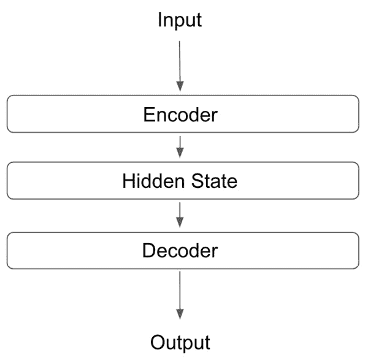

图 8.1 – 序列到序列模型的图形表示

然而，在整个隐藏状态上解码并不一定是使用此任务的最有效方式。这是因为隐藏状态代表输入句子的整体；然而在某些任务中（例如预测句子中的下一个单词），我们并不需要考虑输入句子的整体，只需要考虑与我们试图做出的预测相关的部分。我们可以通过在我们的序列到序列神经网络中使用注意力来表明这一点。我们可以教导我们的模型只看输入中相关的部分来做出预测，从而得到一个更加高效和准确的模型。

考虑以下例子：

我将于 3 月 2 日去法国的首都巴黎。我的航班将从伦敦希思罗机场起飞，大约需要一个小时。

假设我们正在训练一个模型来预测句子中的下一个单词。我们可以先输入句子的开头：

法国的首都是 _____。

在这种情况下，我们希望我们的模型能够检索单词**巴黎**。如果我们使用基本的序列到序列模型，我们会将整个输入转换为一个隐藏状态，然后我们的模型会尝试从中提取相关的信息。这包括关于航班的所有无关信息。您可能会注意到，我们只需要查看输入句子的一个小部分即可识别完成句子所需的相关信息：

我将于 3 月 2 日去**法国的首都巴黎**。我的航班将从伦敦希思罗机场起飞，大约需要一个小时。

因此，如果我们可以训练我们的模型仅使用输入句子中的相关信息，我们可以做出更准确和相关的预测。我们可以在我们的网络中实现**注意力**来实现这一点。

我们可以实现的两种主要注意机制是本地注意力和全局注意力。

## 比较本地和全局注意力

我们可以在我们的网络中实现的两种注意机制非常相似，但有微妙的关键区别。我们将从本地注意力开始。

在**本地注意力**中，我们的模型只关注来自编码器的几个隐藏状态。例如，如果我们正在执行一个句子翻译任务，并且正在计算我们翻译中的第二个单词，模型可能只希望查看与输入句子中第二个单词相关的编码器的隐藏状态。这意味着我们的模型需要查看编码器的第二个隐藏状态（*h*2），但可能还需要查看其之前的隐藏状态（*h*1）。

在以下图表中，我们可以看到这一实践：

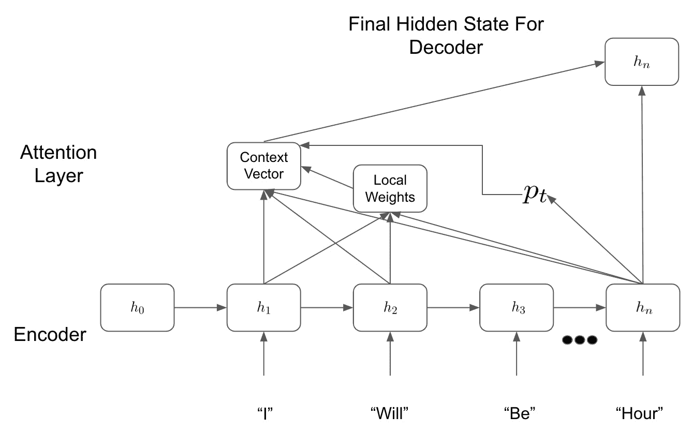

图 8.2 – 本地注意力模型

我们首先通过计算对齐位置，*p*t，从我们的最终隐藏状态，*h*n，得知我们需要查看哪些隐藏状态来进行预测。然后我们计算我们的局部权重，并将其应用于我们的隐藏状态，以确定我们的上下文向量。这些权重可能告诉我们更多地关注最相关的隐藏状态（*h*2），但对前一个隐藏状态（*h*1）的关注较少。

然后，我们将我们的上下文向量传递给我们的解码器，以进行其预测。在我们基于非注意力的序列到序列模型中，我们只会传递我们的最终隐藏状态，*h*n，但我们在这里看到，相反地，我们只考虑我们的模型认为必要以进行预测的相关隐藏状态。

**全局注意力**模型的工作方式与局部注意力模型非常相似。但是，与仅查看少数隐藏状态不同，我们希望查看我们模型的所有隐藏状态 — 因此称为全局。我们可以在这里看到全局注意力层的图形说明：

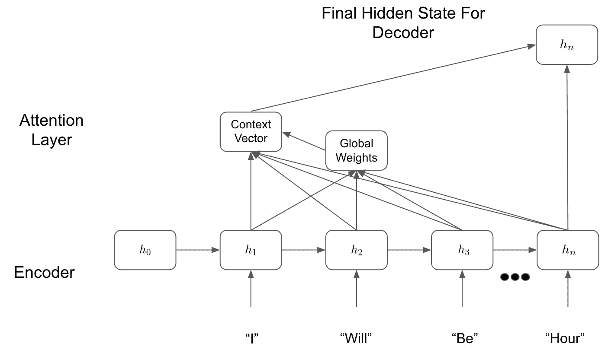

图 8.3 – 全局注意力模型

我们可以看到在上图中，虽然这看起来与我们的局部注意力框架非常相似，但是我们的模型现在正在查看所有的隐藏状态，并计算跨所有隐藏状态的全局权重。这使得我们的模型可以查看它认为相关的输入句子的任何部分，而不限于由局部注意力方法确定的局部区域。我们的模型可能希望只关注一个小的局部区域，但这是模型的能力范围内。全局注意力框架的一个简单理解方式是，它本质上是在学习一个只允许与我们的预测相关的隐藏状态通过的掩码：

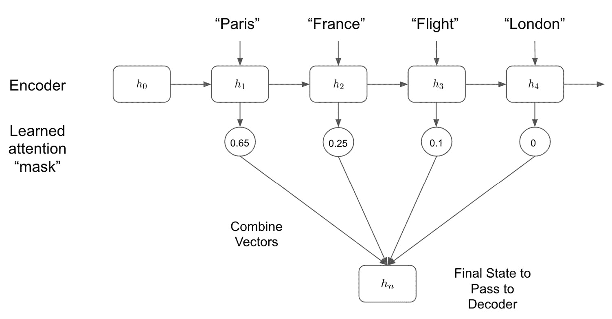

图 8.4 – 组合模型

我们可以看到在上图中，通过学习要关注的隐藏状态，我们的模型控制着在解码步骤中使用哪些状态来确定我们的预测输出。一旦我们决定要关注哪些隐藏状态，我们可以使用多种不同的方法来结合它们，无论是通过串联还是加权点积。

# 使用带有注意力的序列到序列神经网络构建聊天机器人

在我们的神经网络中准确实现注意力的最简单方式是通过一个例子来进行说明。现在我们将通过使用应用注意力框架的序列到序列模型来从头开始构建聊天机器人的步骤。

与我们所有其他的自然语言处理模型一样，我们的第一步是获取和处理数据集，以用于训练我们的模型。

## 获取我们的数据集

为了训练我们的聊天机器人，我们需要一组对话数据，通过这些数据，我们的模型可以学习如何回应。我们的聊天机器人将接受人类输入的一行，并用生成的句子作出回应。因此，理想的数据集应包含一些对话行及其适当的响应。对于这样的任务，理想的数据集将是两个人用户之间的实际聊天记录。不幸的是，这些数据包含私人信息，很难在公共领域内获取，因此，对于这个任务，我们将使用一组电影剧本数据集。

电影剧本由两个或更多角色之间的对话组成。尽管这些数据不是我们想要的格式，但我们可以轻松地将其转换为我们需要的格式。例如，考虑两个角色之间的简单对话：

+   **第 1 行**：你好，贝瑟恩。

+   **第 2 行**：你好，汤姆，你好吗？

+   **第 3 行**：我很好，谢谢，今晚你要做什么？

+   **第 4 行**：我没有什么计划。

+   **第 5 行**：你想和我一起吃晚饭吗？

现在，我们需要将这些转换为呼叫和响应的输入输出对，其中输入是剧本中的一行（呼叫），期望的输出是剧本的下一行（响应）。我们可以将包含*n*行的剧本转换为*n-1*对输入/输出：

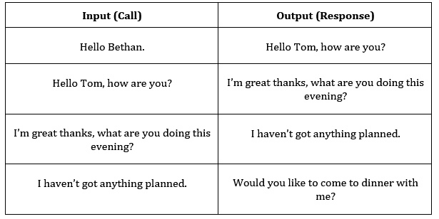

图 8.5 – 输入输出表

我们可以使用这些输入/输出对来训练我们的网络，其中输入代表人类输入的代理，输出是我们期望从模型得到的响应。

构建我们模型的第一步是读取这些数据并执行所有必要的预处理步骤。

## 处理我们的数据集

幸运的是，提供给本示例的数据集已经被格式化，以便每行表示单个输入/输出对。我们可以首先读取数据并检查一些行：

```py
corpus = "movie_corpus"
corpus_name = "movie_corpus"
datafile = os.path.join(corpus, "formatted_movie_lines.txt")
with open(datafile, 'rb') as file:
    lines = file.readlines()

for line in lines[:3]:
    print(str(line) + '\n')
```

这将打印出以下结果：

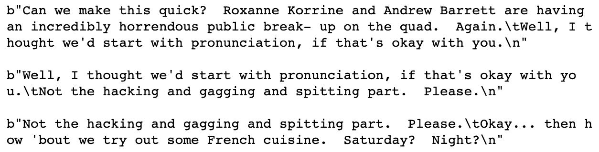

图 8.6 – 检查数据集

您将首先注意到我们的行按预期显示，因为第一行的后半部分成为下一行的前半部分。我们还可以注意到，每行的呼叫和响应部分由制表符（`/t`）分隔，每行之间由换行符（`/n`）分隔。在处理数据集时，我们必须考虑到这一点。

第一步是创建一个包含数据集中所有唯一单词的词汇表或语料库。

## 创建词汇表

在过去，我们的语料库由几个字典组成，包含语料库中唯一单词和单词与索引之间的查找。但是，我们可以通过创建一个包含所有所需元素的词汇表类的更加优雅的方式来完成这项工作：

1.  我们首先创建我们的`Vocabulary`类。我们用空字典——`word2index`和`word2count`——初始化这个类。我们还用占位符初始化`index2word`字典，用于我们的填充标记，以及我们的**句子开头**（**SOS**）和**句子结尾**（**EOS**）标记。我们还保持我们词汇表中单词数的运行计数，作为我们的语料库已经包含了提到的三个标记的默认值（初始为 3）。这些是一个空词汇表的默认值；然而，随着我们读取数据，它们将被填充：

    ```py
    PAD_token = 0 
    SOS_token = 1
    EOS_token = 2
    class Vocabulary:
        def __init__(self, name):
            self.name = name
            self.trimmed = False
            self.word2index = {}
            self.word2count = {}
            self.index2word = {PAD_token: "PAD", SOS_token:                           "SOS", EOS_token: "EOS"}
            self.num_words = 3
    ```

1.  接下来，我们创建用于填充我们词汇表的函数。`addWord`接受一个单词作为输入。如果这是一个不在我们词汇表中的新单词，我们将此单词添加到我们的索引中，将此单词的计数设置为 1，并将我们词汇表中的总单词数增加 1。如果所讨论的单词已经在我们的词汇表中，则简单地将此单词的计数增加 1：

    ```py
    def addWord(self, w):
        if w not in self.word2index:
            self.word2index[w] = self.num_words
            self.word2count[w] = 1
            self.index2word[self.num_words] = w
            self.num_words += 1
        else:
            self.word2count[w] += 1
    ```

1.  我们还使用`addSentence`函数将`addWord`函数应用于给定句子中的所有单词：

    ```py
    def addSentence(self, sent):
        for word in sent.split(' '):
            self.addWord(word)
    ```

    我们可以做的一件事是加快模型训练的速度，即减小词汇表的大小。这意味着任何嵌入层将会更小，模型内学习的参数总数也会减少。一个简单的方法是从我们的词汇表中移除任何低频词汇。在我们的数据集中出现一次或两次的词汇不太可能有很大的预测能力，因此从我们的语料库中移除它们，并在最终模型中用空白标记替换它们，可以减少模型训练的时间，减少过拟合的可能性，而对模型预测的负面影响不大。

1.  要从我们的词汇表中删除低频词汇，我们可以实现一个`trim`函数。该函数首先遍历单词计数字典，如果单词的出现次数大于所需的最小计数，则将其添加到一个新列表中：

    ```py
    def trim(self, min_cnt):
        if self.trimmed:
            return
        self.trimmed = True
        words_to_keep = []
        for k, v in self.word2count.items():
            if v >= min_cnt:
                words_to_keep.append(k)
        print('Words to Keep: {} / {} = {:.2%}'.format(
            len(words_to_keep), len(self.word2index),    
            len(words_to_keep) / len(self.word2index)))
    ```

1.  最后，我们从新的`words_to_keep`列表重新构建我们的索引。我们将所有索引设置为它们的初始空值，然后通过循环遍历我们保留的单词使用`addWord`函数来重新填充它们：

    ```py
        self.word2index = {}
        self.word2count = {}
        self.index2word = {PAD_token: "PAD",\
                           SOS_token: "SOS",\
                           EOS_token: "EOS"}
        self.num_words = 3
        for w in words_to_keep:
            self.addWord(w)
    ```

现在我们已经定义了一个词汇表类，可以轻松地填充我们的输入句子。接下来，我们实际上需要加载我们的数据集来创建我们的训练数据。

## 加载数据

我们将使用以下步骤开始加载数据：

1.  读取我们数据的第一步是执行任何必要的步骤来清理数据并使其更易于阅读。我们首先将其从 Unicode 格式转换为 ASCII 格式。我们可以轻松地使用一个函数来实现这一点：

    ```py
    def unicodeToAscii(s):
        return ''.join(
            c for c in unicodedata.normalize('NFD', s)
            if unicodedata.category(c) != 'Mn'
        )
    ```

1.  接下来，我们希望处理我们的输入字符串，使它们全部小写，并且不包含任何尾随的空白或标点符号，除了最基本的字符。我们可以通过使用一系列正则表达式来实现这一点：

    ```py
    def cleanString(s):
        s = unicodeToAscii(s.lower().strip())
        s = re.sub(r"([.!?])", r" \1", s)
        s = re.sub(r"[^a-zA-Z.!?]+", r" ", s)
        s = re.sub(r"\s+", r" ", s).strip()
        return s
    ```

1.  最后，我们在更广泛的函数内应用此函数——`readVocs`。此函数将我们的数据文件读取为行，并对每行应用`cleanString`函数。它还创建了我们之前创建的`Vocabulary`类的实例，这意味着此函数输出了我们的数据和词汇表：

    ```py
    def readVocs(datafile, corpus_name):
        lines = open(datafile, encoding='utf-8').\
            read().strip().split('\n')
        pairs = [[cleanString(s) for s in l.split('\t')]               for l in lines]
        voc = Vocabulary(corpus_name)
        return voc, pairs
    ```

    接下来，我们根据它们的最大长度过滤我们的输入对。再次这样做是为了减少模型的潜在维度。预测数百个单词长的句子将需要非常深的架构。为了训练时间的利益，我们希望在此限制我们的训练数据，使输入和输出都少于 10 个单词长。

1.  为此，我们创建了一对过滤函数。第一个函数，`filterPair`，根据当前行的输入和输出长度是否小于最大长度返回布尔值。我们的第二个函数，`filterPairs`，则简单地将此条件应用于数据集中的所有对，仅保留符合条件的对：

    ```py
    def filterPair(p, max_length):
        return len(p[0].split(' ')) < max_length and len(p[1].split(' ')) < max_length
    def filterPairs(pairs, max_length):
        return [pair for pair in pairs if filterPair(pair,             max_length)]
    ```

1.  现在，我们只需要创建一个最终函数，将之前所有的函数整合起来，并运行它以创建我们的词汇表和数据对：

    ```py
    def loadData(corpus, corpus_name, datafile, save_dir, max_length):
        voc, pairs = readVocs(datafile, corpus_name)
        print(str(len(pairs)) + " Sentence pairs")
        pairs = filterPairs(pairs,max_length)
        print(str(len(pairs))+ " Sentence pairs after           trimming")
        for p in pairs:
            voc.addSentence(p[0])
            voc.addSentence(p[1])
        print(str(voc.num_words) + " Distinct words in           vocabulary")
        return voc, pairs
    max_length = 10 
    voc, pairs = loadData(corpus, corpus_name, datafile,                       max_length)
    ```

    我们可以看到，我们的输入数据集包含超过 200,000 对。当我们将其过滤为输入和输出长度都小于 10 个单词的句子时，这就减少到仅有 64,000 对，包含 18,000 个不同的单词：

    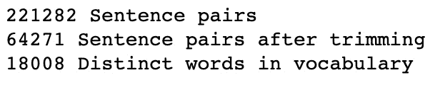

    图 8.7 – 数据集中句子的价值

1.  我们可以打印出我们处理过的输入/输出对的一部分，以验证我们的函数是否都运行正确：

    ```py
    print("Example Pairs:")
    for pair in pairs[-10:]:
        print(pair)
    ```

    生成以下输出：

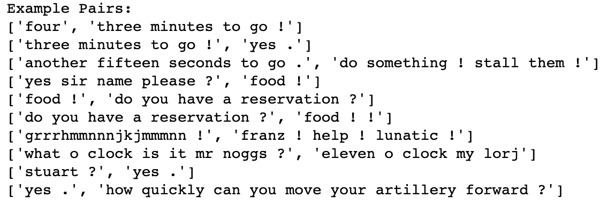

图 8.8 – 处理过的输入/输出对

我们已成功将数据集分割成输入和输出对，用以训练我们的网络。

最后，在我们开始构建模型之前，我们必须从我们的语料库和数据对中移除稀有单词。

## 移除稀有单词

正如先前提到的，包括数据集中仅出现几次的单词会增加模型的维度，增加模型的复杂性以及训练模型的时间。因此，最好将它们从训练数据中移除，以保持我们的模型尽可能简洁和高效。

您可能还记得我们在词汇表中构建了一个`trim`函数，它允许我们从词汇表中删除不常见的单词。我们现在可以创建一个函数来删除这些稀有单词，并调用词汇表中的`trim`方法作为我们的第一步。您将看到这将从我们的词汇表中删除大部分单词，表明大多数词汇中的单词出现不频繁。这是预期的，因为任何语言模型中的单词分布将遵循长尾分布。我们将使用以下步骤来删除这些单词：

1.  我们首先计算我们模型中将保留的单词百分比：

    ```py
    def removeRareWords(voc, all_pairs, minimum):
        voc.trim(minimum)
    ```

    这导致以下输出：

    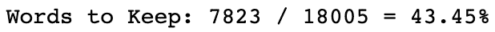

    图 8.9 – 需保留的单词百分比

1.  在同一个函数中，我们循环遍历输入和输出句子中的所有单词。如果对于给定的句对，输入或输出句子中有一个单词不在我们的新修剪语料库中，我们将删除这个句对。我们打印输出并看到，尽管我们删除了超过一半的词汇，但我们只删除了大约 17% 的训练句对。这再次反映了我们的单词语料库如何分布在个别训练句对上：

    ```py
    pairs_to_keep = []
    for p in all_pairs:
        keep = True
        for word in p[0].split(' '):
            if word not in voc.word2index:
                keep = False
                break
        for word in p[1].split(' '):
            if word not in voc.word2index:
                keep = False
                break
        if keep:
            pairs_to_keep.append(p)
    print("Trimmed from {} pairs to {}, {:.2%} of total".\
           format(len(all_pairs), len(pairs_to_keep),
                  len(pairs_to_keep)/ len(all_pairs)))
    return pairs_to_keep
    minimum_count = 3
    pairs = removeRareWords(voc, pairs, minimum_count)
    ```

    这导致以下输出：

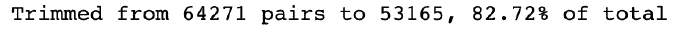

图 8.10 – 构建数据集后的最终值

现在我们有了最终的数据集，我们需要构建一些函数，将我们的数据集转换为我们可以传递给模型的张量批次。

## 将句子对转换为张量

我们知道，我们的模型不会接受原始文本作为输入，而是句子的张量表示。我们也不会逐句处理，而是分批次处理。为此，我们需要将输入和输出句子都转换为张量，张量的宽度表示我们希望训练的批次大小：

1.  我们首先创建了几个辅助函数，用于将我们的句对转换为张量。我们首先创建了一个`indexFromSentence`函数，该函数从词汇表中获取句子中每个单词的索引，并在末尾添加一个 EOS 标记：

    ```py
    def indexFromSentence(voc, sentence):
        return [voc.word2index[word] for word in\
                sent.split(' ')] + [EOS_token]
    ```

1.  其次，我们创建一个`zeroPad`函数，它用零填充任何张量，使张量中的所有句子的长度有效相同：

    ```py
    def zeroPad(l, fillvalue=PAD_token):
        return list(itertools.zip_longest(*l,\
                    fillvalue=fillvalue))
    ```

1.  然后，为了生成我们的输入张量，我们应用这两个函数。首先，我们获取我们输入句子的索引，然后应用填充，然后将输出转换为`LongTensor`。我们还将获取每个输入句子的长度，并将其作为张量输出：

    ```py
    def inputVar(l, voc):
        indexes_batch = [indexFromSentence(voc, sentence)\
                         for sentence in l]
        padList = zeroPad(indexes_batch)
        padTensor = torch.LongTensor(padList)
        lengths = torch.tensor([len(indexes) for indexes\                            in indexes_batch])
        return padTensor, lengths
    ```

1.  在我们的网络中，我们通常应忽略我们的填充标记。我们不希望在这些填充标记上训练我们的模型，因此我们创建一个布尔掩码来忽略这些标记。为此，我们使用一个 `getMask` 函数，将其应用于我们的输出张量。这只是简单地在输出包含单词时返回 `1`，在包含填充标记时返回 `0`：

    ```py
    def getMask(l, value=PAD_token):
        m = []
        for i, seq in enumerate(l):
            m.append([])
            for token in seq:
                if token == PAD_token:
                    m[i].append(0)
                else:
                    m[i].append(1)
        return m
    ```

1.  然后我们将其应用于我们的 `outputVar` 函数。这与 `inputVar` 函数相同，不同之处在于，除了索引化的输出张量和长度张量外，我们还返回我们输出张量的布尔掩码。这个布尔掩码在输出张量中有单词时返回 `True`，在存在填充标记时返回 `False`。我们还返回输出张量中句子的最大长度：

    ```py
    def outputVar(l, voc):
        indexes_batch = [indexFromSentence(voc, sentence) 
                         for sentence in l]
        max_target_len = max([len(indexes) for indexes in
                              indexes_batch])
        padList = zeroPad(indexes_batch)
        mask = torch.BoolTensor(getMask(padList))
        padTensor = torch.LongTensor(padList)
        return padTensor, mask, max_target_len
    ```

1.  最后，为了同时创建我们的输入和输出批次，我们遍历批次中的对，并为每对使用我们之前创建的函数创建输入和输出张量。然后返回所有必要的变量：

    ```py
    def batch2Train(voc, batch):
        batch.sort(key=lambda x: len(x[0].split(" ")),\
                   reverse=True)

        input_batch = []
        output_batch = []

        for p in batch:
            input_batch.append(p[0])
            output_batch.append(p[1])

        inp, lengths = inputVar(input_batch, voc)
        output, mask, max_target_len = outputVar(output_                                   batch, voc)

        return inp, lengths, output, mask, max_target_len
    ```

1.  此函数应该是我们将训练对转换为用于训练模型的张量所需的全部内容。我们可以通过在我们的数据的随机选择上执行我们的 `batch2Train` 函数的单次迭代来验证其是否工作正确。我们将我们的批量大小设为 `5` 并运行一次：

    ```py
    test_batch_size = 5
    batches = batch2Train(voc, [random.choice(pairs) for _\                            in range(test_batch_size)])
    input_variable, lengths, target_variable, mask, max_target_len = batches
    ```

    在这里，我们可以验证我们的输入张量是否已正确创建。注意句子如何以填充（0 标记）结尾，其中句子长度小于张量的最大长度（在本例中为 9）。张量的宽度也与批量大小相对应（在本例中为 5）：

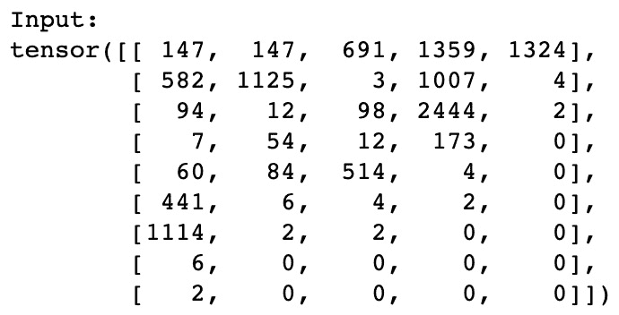

图 8.11 – 输入张量

我们还可以验证相应的输出数据和掩码。注意掩码中的 `False` 值如何与输出张量中的填充标记（零）重叠：

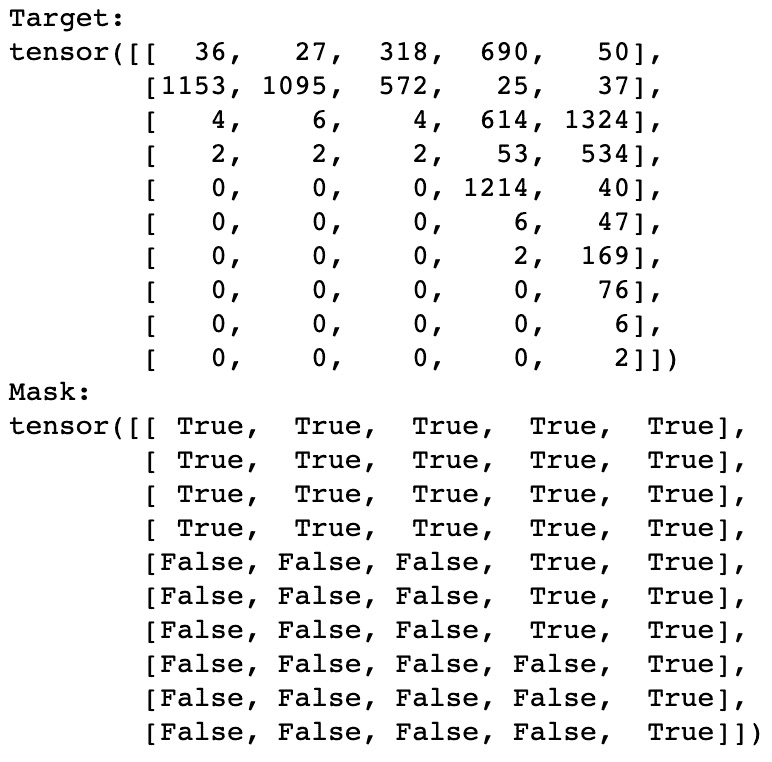

图 8.12 – 目标张量和掩码张量

现在我们已经获取、清理和转换了我们的数据，我们准备开始训练基于注意力机制的模型，这将成为我们聊天机器人的基础。

## 构建模型

与我们其他的序列到序列模型一样，我们首先通过创建我们的编码器来开始。这将把我们输入句子的初始张量表示转换为隐藏状态。

### 构建编码器

现在我们将通过以下步骤创建编码器：

1.  与我们所有的 PyTorch 模型一样，我们首先创建一个继承自 `nn.Module` 的 `Encoder` 类。这里的所有元素应该与之前章节中使用的元素看起来很熟悉：

    ```py
    class EncoderRNN(nn.Module):
        def __init__(self, hidden_size, embedding,\
                     n_layers=1, dropout=0):
            super(EncoderRNN, self).__init__()
            self.n_layers = n_layers
            self.hidden_size = hidden_size
            self.embedding = embedding
    ```

    接下来，我们创建我们的**循环神经网络**（**RNN**）模块。在这个聊天机器人中，我们将使用**门控循环单元**（**GRU**）而不是我们之前看到的**长短期记忆**（**LSTM**）模型。GRUs 比 LSTMs 稍微简单一些，尽管它们仍然通过 RNN 控制信息的流动，但它们不像 LSTMs 那样有单独的遗忘和更新门。我们在这种情况下使用 GRUs 有几个主要原因：

    a) GRUs 已被证明在计算效率上更高，因为要学习的参数更少。这意味着我们的模型将比使用 LSTMs 更快地训练。

    b) GRUs 已被证明在短数据序列上具有与 LSTMs 类似的性能水平。当学习较长的数据序列时，LSTMs 更有用。在这种情况下，我们仅使用包含 10 个单词或更少的输入句子，因此 GRUs 应产生类似的结果。

    c) GRUs 已被证明在从小数据集中学习方面比 LSTMs 更有效。由于我们的训练数据相对于我们试图学习的任务的复杂性很小，我们应该选择使用 GRUs。

1.  现在，我们定义我们的 GRU，考虑到我们输入的大小、层数，以及是否应该实施 dropout：

    ```py
    self.gru = nn.GRU(hidden_size, hidden_size, n_layers,
                      dropout=(0 if n_layers == 1 else\
                               dropout), bidirectional=True)
    ```

    注意这里我们如何将双向性实现到我们的模型中。您会从前几章中回忆起，双向 RNN 允许我们从一个句子中顺序地向前移动，同时也可以顺序地向后移动。这使我们能够更好地捕捉每个单词在句子中相对于前后出现的单词的上下文。我们 GRU 中的双向性意味着我们的编码器看起来像这样：

    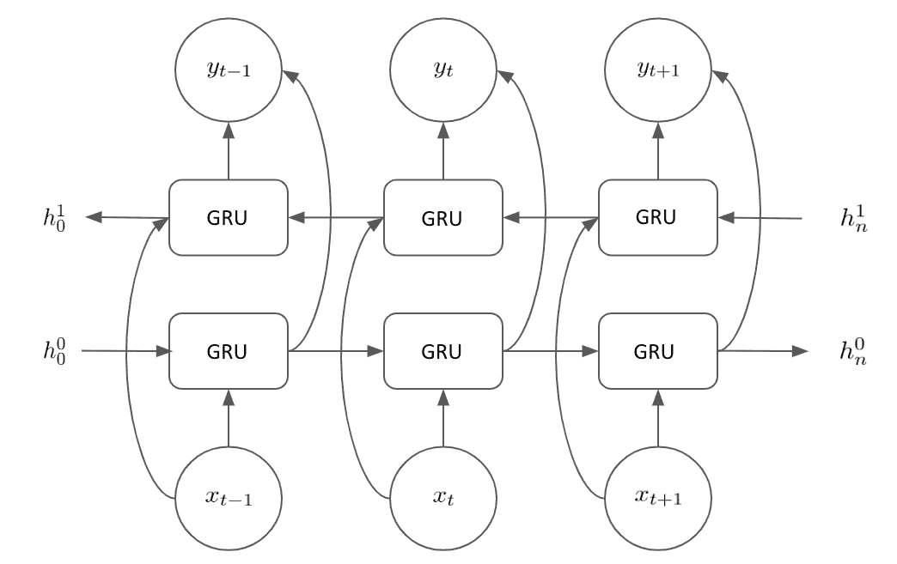

    图 8.13 – 编码器布局

    我们在输入句子中维护两个隐藏状态，以及每一步的输出。

1.  接下来，我们需要为我们的编码器创建一个前向传播。我们通过首先对我们的输入句子进行嵌入，然后在我们的嵌入上使用`pack_padded_sequence`函数来完成这一操作。该函数“打包”我们的填充序列，使得所有的输入都具有相同的长度。然后，我们通过我们的 GRU 传递打包的序列来执行前向传播：

    ```py
    def forward(self, input_seq, input_lengths, hidden=None):
        embedded = self.embedding(input_seq)
        packed = nn.utils.rnn.pack_padded_sequence(embedded,
                                          input_lengths)
        outputs, hidden = self.gru(packed, hidden)
    ```

1.  在此之后，我们取消我们的填充并汇总 GRU 的输出。然后，我们可以返回这个总和输出以及我们的最终隐藏状态，以完成我们的前向传播：

    ```py
    outputs, _ = nn.utils.rnn.pad_packed_sequence(outputs)
    outputs = outputs[:, :, :self.hidden_size] + a \
              outputs[:, : ,self.hidden_size:]
    return outputs, hidden
    ```

现在，我们将继续在下一节中创建一个注意模块。

### 构建注意模块

接下来，我们需要构建我们的注意模块，我们将应用它到我们的编码器上，以便我们可以从编码器输出的相关部分学习。我们将按以下方式执行：

1.  首先，创建一个注意模型的类：

    ```py
    class Attn(nn.Module):
        def __init__(self, hidden_size):
            super(Attn, self).__init__()
            self.hidden_size = hidden_size
    ```

1.  然后，在这个类中创建`dot_score`函数。该函数简单地计算我们的编码器输出与我们的隐藏状态输出的点积。虽然有其他将这两个张量转换为单一表示的方法，但使用点积是其中最简单的之一：

    ```py
    def dot_score(self, hidden, encoder_output):
        return torch.sum(hidden * encoder_output, dim=2)
    ```

1.  然后，我们在我们的前向传播中使用此函数。首先，基于`dot_score`方法计算注意力权重/能量，然后转置结果，并返回经过 softmax 转换的概率分数：

    ```py
    def forward(self, hidden, encoder_outputs):
        attn_energies = self.dot_score(hidden, \
                                       encoder_outputs)
        attn_energies = attn_energies.t()
        return F.softmax(attn_energies, dim=1).unsqueeze(1)
    ```

接下来，我们可以在我们的解码器中使用这个注意力模块来创建一个关注注意力的解码器。

### 构建解码器。

现在我们将构建解码器，如下所示：

1.  我们首先创建我们的`DecoderRNN`类，继承自`nn.Module`并定义初始化参数：

    ```py
    class DecoderRNN(nn.Module):
        def __init__(self, embedding, hidden_size, \
                     output_size, n_layers=1, dropout=0.1):
            super(DecoderRNN, self).__init__()
            self.hidden_size = hidden_size
            self.output_size = output_size
            self.n_layers = n_layers
            self.dropout = dropout
    ```

1.  然后，在此模块中创建我们的层。我们将创建一个嵌入层和一个相应的丢弃层。我们再次使用 GRU 作为我们的解码器；但是，这次我们不需要使我们的 GRU 层双向，因为我们将按顺序解码我们的编码器输出。我们还将创建两个线性层——一个常规层用于计算输出，一个可用于连接的层。此层的宽度是常规隐藏层的两倍，因为它将用于两个长度为`hidden_size`的连接向量。我们还从上一节初始化我们注意力模块的一个实例，以便能够在我们的`Decoder`类中使用它：

    ```py
    self.embedding = embedding
    self.embedding_dropout = nn.Dropout(dropout)
    self.gru = nn.GRU(hidden_size, hidden_size, n_layers,  dropout=(0 if n_layers == 1 else dropout))
    self.concat = nn.Linear(2 * hidden_size, hidden_size)
    self.out = nn.Linear(hidden_size, output_size)
    self.attn = Attn(hidden_size)
    ```

1.  在定义了所有的层之后，我们需要为解码器创建一个前向传播。注意前向传播将逐步（单词）使用。我们首先获取当前输入单词的嵌入，并通过 GRU 层进行前向传播以获取我们的输出和隐藏状态：

    ```py
    def forward(self, input_step, last_hidden, encoder_outputs):
        embedded = self.embedding(input_step)
        embedded = self.embedding_dropout(embedded)
        rnn_output, hidden = self.gru(embedded, last_hidden)
    ```

1.  接下来，我们使用注意力模块从 GRU 输出中获取注意力权重。然后将这些权重与编码器输出相乘，有效地给出我们的注意力权重和编码器输出的加权和：

    ```py
    attn_weights = self.attn(rnn_output, encoder_outputs)
    context = attn_weights.bmm(encoder_outputs.transpose(0,
                                                         1))
    ```

1.  然后，我们将我们的加权上下文向量与我们的 GRU 输出连接起来，并应用一个`tanh`函数来获得我们的最终连接输出：

    ```py
    rnn_output = rnn_output.squeeze(0)
    context = context.squeeze(1)
    concat_input = torch.cat((rnn_output, context), 1)
    concat_output = torch.tanh(self.concat(concat_input))
    ```

1.  在我们解码器的最后一步中，我们简单地使用这个最终连接的输出来预测下一个单词并应用`softmax`函数。前向传播最终返回此输出，以及最终的隐藏状态。这个前向传播将迭代进行，下一个前向传播使用句子中的下一个单词和这个新的隐藏状态：

    ```py
    output = self.out(concat_output)
    output = F.softmax(output, dim=1)
    return output, hidden
    ```

现在我们已经定义了我们的模型，我们准备定义训练过程。

## 定义训练过程。

训练过程的第一步是为我们的模型定义损失度量。由于我们的输入张量可能包含填充序列，因为我们的输入句子长度各不相同，我们不能简单地计算真实输出和预测输出张量之间的差异。为此，我们将定义一个损失函数，该函数在我们的输出上应用布尔掩码，并仅计算非填充标记的损失：

1.  在以下函数中，我们可以看到我们计算整个输出张量的交叉熵损失。然而，为了得到总损失，我们只对布尔掩码选定的张量元素进行平均：

    ```py
    def NLLMaskLoss(inp, target, mask):
        TotalN = mask.sum()
        CELoss = -torch.log(torch.gather(inp, 1,\                        target.view(-1, 1)).squeeze(1))
        loss = CELoss.masked_select(mask).mean()
        loss = loss.to(device)
        return loss, TotalN.item()
    ```

1.  在大部分训练过程中，我们需要两个主要函数——一个函数`train()`，用于对训练数据的单个批次进行训练，另一个函数`trainIters()`，用于迭代整个数据集并在每个单独的批次上调用`train()`。我们首先定义`train()`函数以便在单个数据批次上进行训练。创建`train()`函数，然后将梯度置零，定义设备选项，并初始化变量：

    ```py
    def train(input_variable, lengths, target_variable,\
              mask, max_target_len, encoder, decoder,\
              embedding, encoder_optimizer,\
              decoder_optimizer, batch_size, clip,\
              max_length=max_length):
        encoder_optimizer.zero_grad()
        decoder_optimizer.zero_grad()
        input_variable = input_variable.to(device)
        lengths = lengths.to(device)
        target_variable = target_variable.to(device)
        mask = mask.to(device)
        loss = 0
        print_losses = []
        n_totals = 0
    ```

1.  然后，执行输入和序列长度的前向传递，通过编码器获取输出和隐藏状态：

    ```py
    encoder_outputs, encoder_hidden = encoder(input_variable, lengths)
    ```

1.  接下来，我们创建初始解码器输入，每个句子都以 SOS 标记开头。然后，我们将解码器的初始隐藏状态设置为与编码器相等：

    ```py
    decoder_input = torch.LongTensor([[SOS_token for _ in \
                                       range(batch_size)]])
    decoder_input = decoder_input.to(device)
    decoder_hidden = encoder_hidden[:decoder.n_layers]
    ```

    接下来，我们实现教师强制。如果你还记得上一章节，教师强制在生成输出序列时，我们使用真实的前一个输出标记，而不是预测的前一个输出标记来生成下一个单词。使用教师强制可以帮助我们的模型更快地收敛；然而，我们必须小心，不要将教师强制比率设置得太高，否则我们的模型将过于依赖教师强制，无法独立学习生成正确的输出。

1.  确定当前步骤是否应该使用教师强制：

    ```py
    use_TF = True if random.random() < teacher_forcing_ratio else False
    ```

1.  然后，如果我们确实需要实现教师强制，运行以下代码。我们通过解码器传递每个序列批次以获得输出。然后，我们将下一个输入设置为真实输出（`target`）。最后，我们使用我们的损失函数计算并累积损失，并将其打印到控制台：

    ```py
    for t in range(max_target_len):
    decoder_output, decoder_hidden = decoder(
      decoder_input, decoder_hidden, encoder_outputs)
    decoder_input = target_variable[t].view(1, -1)
    mask_loss, nTotal = NLLMaskLoss(decoder_output, \
         target_variable[t], mask[t])
    loss += mask_loss
    print_losses.append(mask_loss.item() * nTotal)
    n_totals += nTotal
    ```

1.  如果在给定批次上不实现教师强制，该过程几乎相同。但是，我们不是使用真实输出作为序列中的下一个输入，而是使用模型生成的输出：

    ```py
    _, topi = decoder_output.topk(1)
    decoder_input = torch.LongTensor([[topi[i][0] for i in \
                                       range(batch_size)]])
    decoder_input = decoder_input.to(device)
    ```

1.  最后，和我们所有的模型一样，最后的步骤是执行反向传播，实施梯度裁剪，并且通过我们的编码器和解码器优化器来更新权重，使用梯度下降。记住，我们剪切梯度以防止消失/爆炸梯度问题，这在前几章已经讨论过。最后，我们的训练步骤返回我们的平均损失：

    ```py
    loss.backward()
    _ = nn.utils.clip_grad_norm_(encoder.parameters(), clip)
    _ = nn.utils.clip_grad_norm_(decoder.parameters(), clip)
    encoder_optimizer.step()
    decoder_optimizer.step()
    return sum(print_losses) / n_totals
    ```

1.  接下来，如前所述，我们需要创建`trainIters()`函数，它反复调用我们的训练函数来处理不同的输入数据批次。我们首先使用我们之前创建的`batch2Train`函数将数据分成批次：

    ```py
    def trainIters(model_name, voc, pairs, encoder, decoder,\
                   encoder_optimizer, decoder_optimizer,\
                   embedding, encoder_n_layers, \
                   decoder_n_layers, save_dir, n_iteration,\
                   batch_size, print_every, save_every, \
                   clip, corpus_name, loadFilename):
        training_batches = [batch2Train(voc,\
                           [random.choice(pairs) for _ in\
                            range(batch_size)]) for _ in\
                            range(n_iteration)]
    ```

1.  然后，我们创建一些变量，这些变量将允许我们计算迭代次数并跟踪每个时代的总损失：

    ```py
    print('Starting ...')
    start_iteration = 1
    print_loss = 0
    if loadFilename:
        start_iteration = checkpoint['iteration'] + 1
    ```

1.  接下来，我们定义我们的训练循环。对于每个迭代，我们从我们的批次列表中获取一个训练批次。然后，我们从批次中提取相关字段，并使用这些参数运行单个训练迭代。最后，我们将这一批次的损失添加到我们的总损失中：

    ```py
    print("Beginning Training...")
    for iteration in range(start_iteration, n_iteration + 1):
        training_batch = training_batches[iteration - 1]
        input_variable, lengths, target_variable, mask, \
              max_target_len = training_batch
        loss = train(input_variable, lengths,\
                     target_variable, mask, max_target_len,\
                     encoder, decoder, embedding, \
                     encoder_optimizer, decoder_optimizer,\
                     batch_size, clip)
        print_loss += loss
    ```

1.  在每次迭代中，我们还确保打印我们目前的进度，跟踪我们已经完成了多少次迭代以及每个时代的损失是多少：

    ```py
    if iteration % print_every == 0:
        print_loss_avg = print_loss / print_every
        print("Iteration: {}; Percent done: {:.1f}%;\
        Mean loss: {:.4f}".format(iteration,
                              iteration / n_iteration \
                              * 100, print_loss_avg))
        print_loss = 0
    ```

1.  为了完成，我们还需要在每几个时代之后保存我们的模型状态。这样可以让我们重新查看我们训练过的任何历史模型；例如，如果我们的模型开始过拟合，我们可以回到之前的迭代：

    ```py
    if (iteration % save_every == 0):
        directory = os.path.join(save_dir, model_name,\
                                 corpus_name, '{}-{}_{}'.\
                                 format(encoder_n_layers,\
                                 decoder_n_layers, \
                                 hidden_size))
                if not os.path.exists(directory):
                    os.makedirs(directory)
                torch.save({
                    'iteration': iteration,
                    'en': encoder.state_dict(),
                    'de': decoder.state_dict(),
                    'en_opt': encoder_optimizer.state_dict(),
                    'de_opt': decoder_optimizer.state_dict(),
                    'loss': loss,
                    'voc_dict': voc.__dict__,
                    'embedding': embedding.state_dict()
                }, os.path.join(directory, '{}_{}.tar'.format(iteration, 'checkpoint')))
    ```

现在我们已经完成了所有必要的步骤来开始训练我们的模型，我们需要创建函数来允许我们评估模型的性能。

## 定义评估过程

评估聊天机器人与评估其他序列到序列模型略有不同。在我们的文本翻译任务中，一个英文句子将直接翻译成德文。虽然可能有多个正确的翻译，但大部分情况下，从一种语言到另一种语言的翻译只有一个正确的。

对于聊天机器人，有多个不同的有效输出。以下是与聊天机器人对话中的三行内容：

**输入**："Hello"

**输出**："Hello"

**输入**："Hello"

**输出**："Hello. How are you?"

**输入**："*Hello"

**输出**："What do you want?"

在这里，我们有三个不同的响应，每一个都同样有效作为响应。因此，在与聊天机器人对话的每个阶段，不会有单一的“正确”响应。因此，评估要困难得多。测试聊天机器人是否产生有效输出的最直观方法是与其对话！这意味着我们需要设置我们的聊天机器人，使其能够与我们进行对话，以确定其是否工作良好：

1.  我们将从定义一个类开始，这个类将允许我们解码编码的输入并生成文本。我们通过使用所谓的`GreedyEncoder()`类与我们预训练的编码器和解码器来做到这一点：

    ```py
    class GreedySearchDecoder(nn.Module):
        def __init__(self, encoder, decoder):
            super(GreedySearchDecoder, self).__init__()
            self.encoder = encoder
            self.decoder = decoder
    ```

1.  接下来，定义我们的解码器的前向传播。我们通过我们的编码器传递输入以获取我们编码器的输出和隐藏状态。我们将编码器的最终隐藏层作为解码器的第一个隐藏输入：

    ```py
    def forward(self, input_seq, input_length, max_length):
        encoder_outputs, encoder_hidden = \
                        self.encoder(input_seq, input_length)
        decoder_hidden = encoder_hidden[:decoder.n_layers]
    ```

1.  然后，使用 SOS 标记创建解码器输入，并初始化张量以附加解码的单词（初始化为单个零值）：

    ```py
    decoder_input = torch.ones(1, 1, device=device, dtype=torch.long) * SOS_token
    all_tokens = torch.zeros([0], device=device, dtype=torch.long)
    all_scores = torch.zeros([0], device=device)
    ```

1.  然后，逐个解码序列中的单词。我们通过编码器进行前向传播，并添加一个`max`函数来获取最高得分的预测单词及其分数，然后将其附加到`all_tokens`和`all_scores`变量中。最后，我们取这个预测的标记并将其用作我们的解码器的下一个输入。在整个序列迭代完毕后，我们返回完整的预测句子：

    ```py
    for _ in range(max_length):
        decoder_output, decoder_hidden = self.decoder\
            (decoder_input, decoder_hidden, encoder_outputs)
        decoder_scores, decoder_input = \
             torch.max (decoder_output, dim=1)
        all_tokens = torch.cat((all_tokens, decoder_input),\
                                dim=0)
        all_scores = torch.cat((all_scores, decoder_scores),\
                                dim=0)
        decoder_input = torch.unsqueeze(decoder_input, 0)
    return all_tokens, all_scores
    ```

    所有的部分都开始串联在一起了。我们已经定义了训练和评估函数，所以最后一步是编写一个实际将我们的输入作为文本、传递给我们的模型并从模型获取响应的函数。这将是我们聊天机器人的“接口”，在这里我们实际上与我们的聊天机器人对话。

1.  我们首先定义一个`evaluate()`函数，该函数接受我们的输入函数并返回预测的输出单词。我们开始通过我们的词汇表将输入句子转换为索引。然后，我们获得每个这些句子的长度的张量，并将其转置：

    ```py
    def evaluate(encoder, decoder, searcher, voc, sentence,\
                 max_length=max_length):
        indices = [indexFromSentence(voc, sentence)]
        lengths = torch.tensor([len(indexes) for indexes \
                                in indices])
        input_batch = torch.LongTensor(indices).transpose(0, 1)
    ```

1.  然后，我们将我们的长度和输入张量分配给相关设备。接下来，通过搜索器（`GreedySearchDecoder`）运行输入，以获取预测输出的单词索引。最后，我们将这些单词索引转换回单词标记，然后将它们作为函数输出返回：

    ```py
    input_batch = input_batch.to(device)
    lengths = lengths.to(device)
    tokens, scores = searcher(input_batch, lengths, \
                              max_length)
    decoded_words = [voc.index2word[token.item()] for \
                     token in tokens]
    return decoded_words
    ```

1.  最后，我们创建一个`runchatbot`函数，它作为与我们的聊天机器人的接口。这个函数接受人类输入并打印聊天机器人的响应。我们将此函数创建为一个`while`循环，直到我们终止函数或在输入中键入`quit`为止：

    ```py
    def runchatbot(encoder, decoder, searcher, voc):
        input_sentence = ''
        while(1):
            try:
                input_sentence = input('> ')
                if input_sentence == 'quit': break
    ```

1.  然后，我们获取输入的内容并对其进行标准化，然后将标准化的输入传递给我们的`evaluate()`函数，该函数从聊天机器人返回预测的单词：

    ```py
    input_sentence = cleanString(input_sentence)
    output_words = evaluate(encoder, decoder, searcher,\
                            voc, input_sentence)
    ```

1.  最后，我们获取这些输出单词并格式化它们，在打印聊天机器人的响应之前忽略 EOS 和填充标记。因为这是一个`while`循环，这允许我们无限期地与聊天机器人继续对话：

    ```py
    output_words[:] = [x for x in output_words if \
                       not (x == 'EOS' or x == 'PAD')]
    print('Response:', ' '.join(output_words))
    ```

现在我们已经构建了训练、评估和使用我们的聊天机器人所需的所有函数，是时候开始最后一步了——训练我们的模型并与我们训练过的聊天机器人交流了。

## 训练模型

由于我们已经定义了所有必要的函数，训练模型只是初始化我们的超参数并调用我们的训练函数的情况：

1.  首先我们初始化我们的超参数。虽然这些只是建议的超参数，但我们的模型已经被设置成可以适应任何传递给它们的超参数。通过尝试不同的超参数来看哪些超参数会导致最佳的模型配置是一个良好的实践。在这里，您可以尝试增加编码器和解码器的层数，增加或减少隐藏层的大小，或增加批处理大小。所有这些超参数都会影响您的模型学习效果，以及训练模型所需的时间：

    ```py
    model_name = 'chatbot_model'
    hidden_size = 500
    encoder_n_layers = 2
    decoder_n_layers = 2
    dropout = 0.15
    batch_size = 64
    ```

1.  之后，我们可以加载我们的检查点。如果我们以前训练过一个模型，我们可以加载以前迭代的检查点和模型状态。这样可以避免每次重新训练模型：

    ```py
    loadFilename = None
    checkpoint_iter = 4000
    if loadFilename:
        checkpoint = torch.load(loadFilename)
        encoder_sd = checkpoint['en']
        decoder_sd = checkpoint['de']
        encoder_optimizer_sd = checkpoint['en_opt']
        decoder_optimizer_sd = checkpoint['de_opt']
        embedding_sd = checkpoint['embedding']
        voc.__dict__ = checkpoint['voc_dict']
    ```

1.  之后，我们可以开始构建我们的模型。我们首先从词汇表中加载我们的嵌入。如果我们已经训练了一个模型，我们可以加载训练好的嵌入层：

    ```py
    embedding = nn.Embedding(voc.num_words, hidden_size)
    if loadFilename:
        embedding.load_state_dict(embedding_sd)
    ```

1.  接着我们对编码器和解码器进行同样的操作，使用定义好的超参数创建模型实例。如果我们已经训练过一个模型，我们只需加载训练好的模型状态到我们的模型中：

    ```py
    encoder = EncoderRNN(hidden_size, embedding, \
                         encoder_n_layers, dropout)
    decoder = DecoderRNN(embedding, hidden_size, \ 
                         voc.num_words, decoder_n_layers,
                         dropout)
    if loadFilename:
        encoder.load_state_dict(encoder_sd)
        decoder.load_state_dict(decoder_sd)
    ```

1.  最后但同样重要的是，我们为每个模型指定一个设备进行训练。请记住，如果您希望使用 GPU 进行训练，这是一个至关重要的步骤：

    ```py
    encoder = encoder.to(device)
    decoder = decoder.to(device)
    print('Models built and ready to go!')
    ```

    如果一切工作正常，而且您的模型创建没有错误，您应该会看到以下内容：

    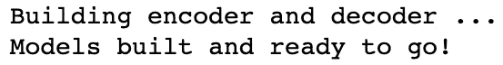

    图 8.14 – 成功的输出

    现在我们已经创建了编码器和解码器的实例，我们准备开始训练它们。

    我们首先初始化一些训练超参数。与我们的模型超参数一样，这些可以调整以影响训练时间和我们模型的学习方式。Clip 控制梯度裁剪，而 teacher forcing 控制我们在模型中使用 teacher forcing 的频率。请注意，我们使用了一个 teacher forcing 比率为 1，以便我们始终使用 teacher forcing。降低 teacher forcing 比率会导致我们的模型收敛时间更长；然而，从长远来看，这可能会帮助我们的模型更好地自动生成正确的句子。

1.  我们还需要定义我们模型的学习率和解码器的学习率比。您会发现，当解码器在梯度下降过程中执行较大的参数更新时，您的模型表现会更好。因此，我们引入了一个解码器学习率比来将一个乘数应用于学习率，使得解码器的学习率比编码器的大。我们还定义了我们的模型打印和保存结果的频率，以及我们希望我们的模型运行多少个 epochs：

    ```py
    save_dir = './'
    clip = 50.0
    teacher_forcing_ratio = 1.0
    learning_rate = 0.0001
    decoder_learning_ratio = 5.0
    epochs = 4000
    print_every = 1
    save_every = 500
    ```

1.  接下来，像往常一样，在 PyTorch 中训练模型时，我们将模型切换到训练模式，以便更新参数：

    ```py
    encoder.train()
    decoder.train()
    ```

1.  接下来，我们为编码器和解码器创建优化器。我们将这些初始化为 Adam 优化器，但其他优化器同样有效。尝试不同的优化器可能会产生不同水平的模型性能。如果以前已经训练过一个模型，也可以在需要时加载优化器状态：

    ```py
    print('Building optimizers ...')
    encoder_optimizer = optim.Adam(encoder.parameters(), \
                                   lr=learning_rate)
    decoder_optimizer = optim.Adam(decoder.parameters(), 
                   lr=learning_rate * decoder_learning_ratio)
    if loadFilename:
        encoder_optimizer.load_state_dict(\
                                       encoder_optimizer_sd)
        decoder_optimizer.load_state_dict(\
                                       decoder_optimizer_sd)
    ```

1.  在运行训练之前的最后一步是确保 CUDA 已配置好以便进行 GPU 训练。为此，我们简单地循环遍历编码器和解码器的优化器状态，并在所有状态上启用 CUDA：

    ```py
    for state in encoder_optimizer.state.values():
        for k, v in state.items():
            if isinstance(v, torch.Tensor):
                state[k] = v.cuda()
    for state in decoder_optimizer.state.values():
        for k, v in state.items():
            if isinstance(v, torch.Tensor):
                state[k] = v.cuda()
    ```

1.  最后，我们准备训练我们的模型。这可以通过简单调用`trainIters`函数并传入所有必要的参数来完成：

    ```py
    print("Starting Training!")
    trainIters(model_name, voc, pairs, encoder, decoder,\
               encoder_optimizer, decoder_optimizer, \
               embedding, encoder_n_layers, \
               decoder_n_layers, save_dir, epochs, \
                batch_size,print_every, save_every, \
                clip, corpus_name, loadFilename)
    ```

    如果一切正常，您将看到以下输出开始打印：

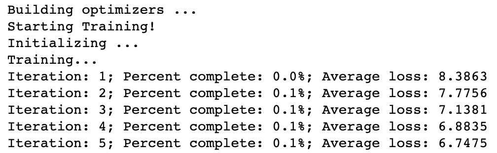

图 8.15 – 模型训练

您的模型现在正在训练！根据多个因素（例如您为模型设置了多少个 epoch 以及是否使用 GPU 等），您的模型可能需要一些时间来训练。训练完成后，您将看到以下输出。如果一切正常，您的模型平均损失将显著低于训练开始时的水平，表明您的模型已经学到了一些有用的东西：

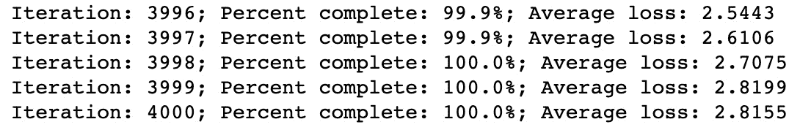

图 8.16 – 4,000 次迭代后的平均损失

现在我们的模型已经训练完成，我们可以开始评估过程并开始使用我们的聊天机器人。

### 评估模型

### 现在我们成功创建并训练了我们的模型，是时候评估其性能了。我们将通过以下步骤来进行：

1.  开始评估之前，我们首先将模型切换到评估模式。与所有其他 PyTorch 模型一样，这是为了防止在评估过程中发生任何进一步的参数更新：

    ```py
    encoder.eval()
    decoder.eval()
    ```

1.  我们还初始化了`GreedySearchDecoder`的一个实例，以便能够执行评估并将预测输出作为文本返回：

    ```py
    searcher = GreedySearchDecoder(encoder, decoder)
    ```

1.  最后，要运行聊天机器人，我们只需调用`runchatbot`函数，传入`encoder`、`decoder`、`searcher`和`voc`：

    ```py
    runchatbot(encoder, decoder, searcher, voc)
    ```

    这样做将打开一个输入提示，让您输入文本：


图 8.17 – 输入文本的用户界面元素

在此处输入您的文本并按*Enter*将您的输入发送给聊天机器人。使用我们训练过的模型，我们的聊天机器人将创建一个响应并将其打印到控制台：

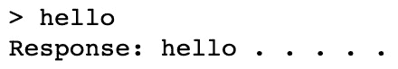

图 8.18 – 聊天机器人的输出

您可以重复此过程多次，与聊天机器人进行“对话”。在简单的对话水平上，聊天机器人可以产生令人惊讶的良好结果：

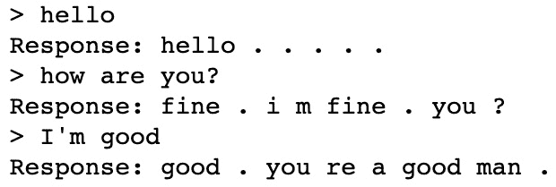

图 8.19 – 聊天机器人的输出

然而，一旦对话变得更复杂，很明显聊天机器人无法达到与人类相同水平的对话能力：

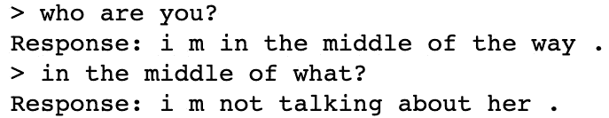

图 8.20 – 聊天机器人的局限性

在许多情况下，您的聊天机器人的回复可能是无意义的：

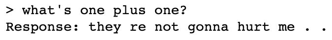

图 8.21 – 错误输出

显然，我们创建了一个能够进行简单来回对话的聊天机器人。但在我们的聊天机器人能够通过图灵测试并使我们相信我们在与人类交谈之前，我们还有很长的路要走。然而，考虑到我们的模型训练的相对较小的数据语料库，我们在序列到序列模型中使用的注意力显示出了相当不错的结果，展示了这些架构有多么的多才多艺。

虽然最好的聊天机器人是在数十亿数据点的庞大语料库上训练的，但我们的模型在相对较小的数据集上证明了相当有效。然而，基本的注意力网络不再是最先进的，在下一章中，我们将讨论一些用于自然语言处理学习的最新发展，这些发展导致了更加逼真的聊天机器人。

# 摘要

在本章中，我们应用了我们从递归模型和序列到序列模型中学到的所有知识，并结合注意力机制构建了一个完全工作的聊天机器人。虽然与我们的聊天机器人交谈不太可能与真人交谈无异，但通过一个相当大的数据集，我们可能希望实现一个更加逼真的聊天机器人。

尽管在 2017 年，带有注意力的序列到序列模型是最先进的，但机器学习是一个快速发展的领域，自那时以来，对这些模型进行了多次改进。在最后一章中，我们将更详细地讨论一些这些最先进的模型，并涵盖用于自然语言处理的其他当代技术，其中许多仍在开发中。
