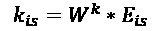
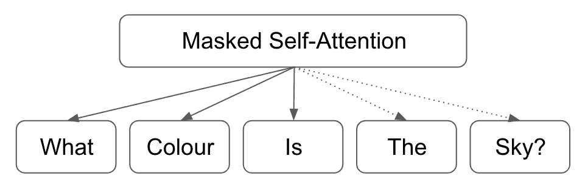

# *第九章*：未来之路

机器学习领域正在迅速扩展，几乎每年都有新的发现。NLP 机器学习领域也不例外，机器学习模型在 NLP 任务上的表现不断增长。

到目前为止，在本书中，我们已经讨论了许多机器学习方法论，使我们能够构建模型来执行诸如分类、翻译和通过聊天机器人逼近对话的 NLP 任务。然而，正如我们迄今所见，我们的模型性能相对于人类来说仍然较差。即使使用我们迄今所研究的技术，包括带有注意力机制的序列到序列网络，我们也不太可能训练出能够匹敌或超越真人的聊天机器人模型。然而，在本章中，我们将看到 NLP 领域的最新进展，这些进展使我们更接近创建与人类难以区分的聊天机器人的目标。

在本章中，我们将探讨几种最先进的自然语言处理（NLP）机器学习模型，并分析导致其优越性能的一些特征。然后，我们将转向研究目前受到广泛研究关注的几个其他 NLP 任务，以及如何利用机器学习技术来解决它们。

本章将涵盖以下主题：

+   探索最先进的 NLP 机器学习

+   未来的 NLP 任务

+   语义角色标注

+   成分句法分析

+   文本蕴含

+   机器理解

# 探索最先进的 NLP 机器学习

尽管我们在本书中学到的技术是从头开始训练我们自己的机器学习模型的高度有用的方法，但它们远非全球开发的最复杂模型。公司和研究团体不断努力创建在多个 NLP 任务上能够达到最高性能的最先进的机器学习模型。

目前有两个 NLP 模型具有最佳性能，并且可以被认为是最先进的：**BERT**和**GPT-2**。这两种模型都是通用语言模型的形式。我们将在接下来的章节中详细讨论它们。

## BERT

**BERT**，全称**双向编码器表示来自 Transformers**，由 Google 于 2018 年开发，被广泛认为是 NLP 领域的领先模型，在自然语言推理和问答任务中取得了领先的性能。幸运的是，这已经作为开源模型发布，因此可以下载并用于您自己的 NLP 任务。

BERT 发布为预训练模型，这意味着用户可以下载并实现 BERT，而无需每次从头开始重新训练模型。预训练模型是在几个语料库上训练的，包括整个维基百科（包含 25 亿词）和另一个包含 8 亿词的书籍语料库。然而，使 BERT 与其他类似模型不同的主要因素是它提供了深度、双向、无监督的语言表示，据显示在自然语言处理任务中提供了更复杂、更详细的表示，从而导致性能提升。

### 嵌入

虽然传统的嵌入层（如 GLoVe）形成一个单一的词语表示，与句子中词语的含义无关，但双向 BERT 模型试图基于其上下文形成表示。例如，在这两个句子中，词语*bat*具有两种不同的含义。

“蝙蝠从我的窗户飞过”

“他用球棒击打了棒球”

尽管在这两个句子中，*bat*是名词，但我们可以辨别出其上下文和含义显然是截然不同的，这取决于其周围的其他词语。有些词语可能在句子中也具有不同的含义，这取决于它们在句子中是名词还是动词：

“她用火柴点火”

“他的糟糕表现意味着他们别无选择，只能解雇他”

利用双向语言模型形成上下文相关的词语表示，这才是使 BERT 成为一流模型的真正原因。对于任何给定的标记，我们通过结合标记、位置和段落嵌入来获得其输入表示：

图 9.1 – BERT 架构

然而，理解模型如何得出这些初始的上下文相关的标记嵌入是很重要的。

### 掩码语言建模

为了创建这种双向语言表示，BERT 使用了两种不同的技术，第一种是掩码语言建模。这种方法通过用掩码令牌替换输入句子中的 15%单词来有效隐藏单词。然后模型试图基于句子中其他词语的上下文来预测掩码词语的真实值。这种预测是双向进行的，以捕获句子的双向上下文：

**输入**：*我们[MASK_1]在句子中[MASK_2]隐藏一些*

**标签**：*MASK_1 = 随机地，MASK_2 = 词语*

如果我们的模型能够学习预测正确的上下文相关词语，那么我们距离上下文相关表示更近了一步。

### 下一个句子预测

BERT 用于学习语言表示的另一种技术是下一个句子预测。在这种方法中，我们的模型接收两个句子，并学习预测第二个句子是否是紧随第一个句子的句子；例如：

**句子 A**:*"我喜欢喝咖啡"*

**句子 B**:*"这是我最喜欢的饮料"*

**是否下一个句子？**:*True*

**句子 A**:*"我喜欢喝咖啡"*

**Sentence B**:*"天空是蓝色的"*

**是否下一个句子？**:*False*

通过传递我们的模型句子对像这样，它可以学习确定任何两个句子是否相关并跟随彼此，或者它们只是两个随机无关的句子。学习这些句子关系在语言模型中是有用的，因为许多自然语言处理相关的任务，如问答，需要模型理解两个句子之间的关系。训练一个模型进行下一个句子预测允许模型识别一对句子之间的某种关系，即使这种关系非常基础。

BERT 使用掩码语言建模和下一个句子预测两种方法进行训练，并最小化两种技术的组合损失函数。通过使用两种不同的训练方法，我们的语言表示足够强大，可以学习句子如何形成和结构化，以及不同句子如何相互关联。

## BERT–架构

该模型架构建立在我们在前几章中看到的许多原理之上，使用双向编码提供复杂的语言表示。BERT 有两种不同的变体，每种变体由不同数量的层和注意头组成：

+   **BERT Base**：12 个 Transformer 块（层），12 个注意头，约 1.1 亿个参数

+   **BERT Large**：24 个 Transformer 块（层），16 个注意头，约 3.4 亿个参数

虽然 BERT Large 只是 BERT Base 的深层版本，参数更多，我们将专注于 BERT Base 的架构。

BERT 是按照**transformer**的原理构建的，现在将更详细地解释。

### Transformers

该模型架构建立在我们在本书中看到的许多原理之上。到目前为止，您应该熟悉编码器和解码器的概念，其中我们的模型学习一个编码器来形成输入句子的表示，然后学习一个解码器来将这个表示解码为最终输出，无论是分类还是翻译任务：

图 9.2 – Transformer 工作流程

然而，我们的 Transformer 在这种方法中增加了另一个复杂性元素，其中 Transformer 实际上有一堆编码器和一堆解码器，每个解码器将最终编码器的输出作为其输入：

图 9.3 – 多编码器的 Transformer 工作流程

在每个编码器层内部，我们找到两个组成部分：一个自注意力层和一个前馈层。自注意力层是首先接收模型输入的层。这一层使得编码器在编码任何接收到的单词时能够检查输入句子中的其他单词，从而使得编码上下文感知。自注意力层的输出传递到前馈层，该层独立应用于每个位置。这可以通过如下图示来说明：

图 9.4 – 前馈层

我们的解码器层在结构上几乎与我们的编码器层相同，但它们包含一个额外的注意力层。这个注意力层帮助解码器专注于编码表示的相关部分，类似于我们在序列到序列模型中看到的注意力工作方式：

图 9.5 – 注意力方法论

我们知道我们的解码器从最终编码器接收输入，因此一个链接的编码器/解码器可能看起来像这样：

图 9.6 – 链接的编码器/解码器数组

这应该为您提供了关于如何将不同的编码器和解码器堆叠在更大模型中的有用概述。接下来，我们将更详细地研究各个部分。

### 编码器

Transformers 的独特特性在于单词通过编码器层时是单独处理的，每个位置的每个单词都有自己的路径。虽然自注意力层内部存在一些依赖关系，但在前馈层内部不存在这种依赖。单词的向量是从嵌入层获取的，然后通过自注意力层再通过前馈网络传递：

图 9.7 – 编码器布局

自注意力无疑是编码器中最复杂的组成部分，因此我们将首先更详细地研究它。假设我们有一个由三个单词组成的输入句子；例如，“This is fine”。对于该句子中的每个单词，我们将其表示为来自模型嵌入层的单词向量。然后，我们从这个单词向量中提取三个向量：一个查询向量、一个键向量和一个值向量。这三个向量是通过将我们的单词向量与训练模型时获得的三个不同权重矩阵相乘而获得的。

如果我们称我们输入句子中每个单词的词嵌入为 *Ethis*、*Eis* 和 *Efine*，我们可以这样计算我们的查询、键和值向量：

**查询向量**：

**键向量**：

**值向量**：

现在我们知道如何计算这些向量后，理解它们各自代表的含义就变得很重要。实际上，每一个都是注意力机制中一个概念的抽象。一旦我们看到它们如何计算，这一点就会变得明显。

让我们继续我们的工作示例。我们需要依次考虑输入句子中的每个单词。为了做到这一点，我们计算每个查询/键向量对在我们句子中的得分。这是通过获得每个输入句子中每个单词的查询向量和位置 0 处键向量的点积来完成的。我们重复这个过程，对输入句子中所有其他位置的键向量，因此我们得到了第一个单词"this"的*n*个得分，其中*n*是句子的长度：

**分数（"this"）**：

接下来，我们对每个得分应用 softmax 函数，使得每个得分的值现在在 0 到 1 之间（这有助于防止梯度爆炸，并使梯度下降更有效和容易计算）。然后，我们将每个得分乘以值向量并将它们全部求和以获得一个最终向量，然后将其向前传递到编码器中：

**最终向量（"this"）**：

然后，我们对输入句子中的所有单词重复这个过程，这样我们就为每个单词获得了一个最终向量，其中包含自注意力的元素，然后将其传递到前馈网络中的编码器。这个自注意力过程意味着我们的编码器知道在输入句子中查找需要的信息的位置。

在这个例子中，我们仅学习了一个权重矩阵来处理我们查询、键和值向量。然而，我们实际上可以为每个元素学习多个不同的矩阵，并同时应用这些矩阵到我们的输入句子，以获得最终的输出。这就是**多头注意力**，它允许我们执行更复杂的注意力计算，依赖于多个不同的学习模式，而不仅仅是单一的注意力机制。

我们知道 BERT 包含 12 个注意力头，意味着为*Wq*、*Wk*和*Wv*学习了 12 个不同的权重矩阵。

最后，我们需要一种方法让我们的编码器考虑输入序列中单词的顺序。目前，我们的模型将输入序列中的每个单词视为独立的，但实际上，单词在输入序列中的顺序会对句子的整体意义产生重大影响。为了解决这个问题，我们使用**位置编码**。

为了应用这一方法，我们的模型获取每个输入嵌入并为每个嵌入单独添加一个位置编码向量。这些位置向量由我们的模型学习，遵循特定的模式以帮助确定序列中每个单词的位置。理论上，将这些位置向量添加到我们的初始嵌入中应该会转化为最终向量中的有意义的距离，一旦它们被投影到单独的查询、键和值向量中：

*x0 = 原始嵌入*

*t0 = 位置编码*

*E0 = 带时间信号的嵌入*

*x0 + t0 = E0*

我们的模型为每个位置学习了不同的位置编码向量（*t*0、*t*1 等），然后在这些单词进入编码器之前应用到输入句子中的每个单词上：

图 9.8 – 添加输入到编码器

现在我们已经介绍了编码器的主要组件，是时候看看模型的另一面，了解解码器的构建方式了。

### 解码器

解码器中的组件与编码器中的组件大致相同。然而，与编码器接收原始输入句子不同，我们的转换器中的解码器从编码器的输出中获取输入。

我们的堆叠编码器处理我们的输入句子，最终留下一组注意力向量，*K* 和 *V*，这些向量在我们的解码器的编码器-解码器注意力层中使用。这使得解码器能够仅关注输入序列的相关部分：

图 9.9 – 堆叠解码器

在每个时间步骤中，我们的解码器使用前面生成的单词及 *K,V* 注意力向量的组合来生成句子中的下一个单词。这个过程迭代重复，直到解码器生成一个 <END> 标记，表示它已经完成生成最终输出。在转换器解码器的一个时间步骤中可能如下所示：

图 9.10 – 转换器解码器

值得注意的是，解码器中的自注意层与我们的编码器中找到的自注意层的工作方式略有不同。在解码器内部，自注意层仅关注输出序列中较早的位置。通过将序列中的任何未来位置屏蔽为负无穷大来实现这一点。这意味着当分类发生时，softmax 计算始终导致预测值为 0。

编码器-解码器注意力层的工作方式与我们的编码器内的多头自注意力层相同。然而，主要区别在于它从下面的层创建一个查询矩阵，并从编码器的输出中获取键和值矩阵。

这些编码器和解码器部分构成了我们的 transformer，这也是 BERT 的基础。接下来，我们将看一些 BERT 的应用以及几种在特定任务上表现出色的变体。

## BERT 的应用

作为最先进的技术，BERT 当然有许多实际应用。目前，它正在被应用于许多您可能每天都在使用的 Google 产品中，比如 Gmail 中的建议回复和智能撰写（Gmail 根据您当前输入的内容预测您预期的句子），以及 Google 搜索引擎中的自动完成（您输入想要搜索的前几个字符，下拉列表将预测您要搜索的内容）。

正如我们在前一章看到的，聊天机器人是自然语言处理深度学习中最令人印象深刻的应用之一，而 BERT 的应用确实带来了一些非常出色的聊天机器人。事实上，问答是 BERT 擅长的主要任务之一，这主要是因为它是在大量的知识库（如维基百科）上训练的，能够以语法正确的方式回答问题（因为训练时考虑了下一个句子预测）。

我们还没有达到与真人对话无法区分的聊天机器人的阶段，而 BERT 从其知识库中获取信息的能力非常有限。但是，BERT 取得的一些成果是令人鼓舞的，并且考虑到自然语言处理机器学习领域的快速进展，这表明这一可能性可能很快就会成为现实。

目前，由于训练方式的限制，BERT 只能处理非常特定类型的自然语言处理任务。但是，有许多变体的 BERT 经过微调，以在特定任务上表现出更好的性能。这些变体包括但不限于以下几种：

+   **roBERTa**：这是 Facebook 开发的一种 BERT 变体。去掉了 BERT 的下一个句子预测元素，但通过实施动态掩码来增强了单词掩码策略。

+   **xlm**/**BERT**：这个模型也是由 Facebook 开发的，应用了一种双语训练机制，使得 BERT 能够学习不同语言中单词之间的关系。这使得 BERT 在机器翻译任务中表现出色，比基本的序列到序列模型有了显著的提升。

+   **distilBERT**：这是一个比 BERT 更紧凑的版本，保留了原始模型的 95% 的性能，但是减少了学习参数的数量，从而缩小了模型的总体大小和训练时间。

+   **ALBERT**：这是 Google 训练的模型，采用了自己独特的训练方法——句子顺序预测。这种 BERT 变体在多个任务上表现优异，目前被认为是比标准 BERT 更先进的技术（这也展示了技术进步的速度是多么快！）。

虽然 BERT 也许是最为人知的，但还有其他一些被认为是最先进的基于 Transformer 的模型。其中一个主要的被视为 BERT 的竞争对手的模型是 GPT-2。

## GPT-2

虽然 GPT-2 与 BERT 相似，但在某些细微的方式上有所不同。虽然两种模型都基于先前概述的 Transformer 架构，BERT 使用了一种称为自注意力的注意力形式，而 GPT-2 使用了掩码自注意力。两者之间的另一个细微差异是，GPT-2 被构造成每次只能输出一个标记。

这是因为 GPT-2 在工作方式上本质上是自回归的。这意味着当它生成一个输出（句子中的第一个单词）时，此输出递归地添加到输入中。然后使用此输入预测句子中的下一个单词，并重复此过程，直到生成完整的句子为止。您可以在以下示例中看到这一点：

**第 1 步：**

**输入**：*天空是什么颜色？*

**输出**：*...*

然后我们将预测的输出添加到输入的末尾并重复此步骤：

**第 2 步：**

**输入**：*天空是什么颜色？*

**输出**：*天空*

我们重复此过程，直到生成整个句子：

**第 3 步：**

**输入**：*天空是什么颜色？天空*

**输出**：*是*

**第 4 步：**

**输入**：*天空是什么颜色？天空是*

**输出**：*蓝色*

在性能方面，BERT 和 GPT-2 之间的一个关键权衡之一。BERT 是双向训练的，这意味着不可能进行单词级别的生成；然而，GPT-2 不是双向的，因此在预测时只考虑句子中的前面单词，这就是为什么在预测句子中缺失单词时，BERT 优于 GPT-2 的原因。

## 比较自注意力和掩码自注意力

这种差异也体现在两种不同模型实现注意力的方式上。由于 BERT 是双向的，其注意力机制能够考虑整个输入句子的上下文，并确定在输入句子中确切的位置进行查找：

图 9.11 – 自注意力机制

另一方面，GPT-2 不是双向的，因此掩码自注意力机制只能查看它已经看过的标记，并且不能“向前看”：

图 9.12 – 掩码自注意力机制

## GPT-2 – 伦理

当考虑是否将模型发布给公众时，GPT-2 的一个非常有趣的考虑是作者在伦理方面的考虑。

GPT-2 的语言生成能力意味着它能够使用非常少的提示生成非常逼真和语法正确的句子。通过提供仅仅几行输入以确定一个主题，模型能够生成关于这个主题的详细信息段落，无论这些信息是否真实！一个臭名昭著的例子是“独角兽”故事，其中模型接收到一句输入：

**输入**: *"在一个令人震惊的发现中，科学家们发现了一群生活在安第斯山脉一个偏远、以前未曾探索过的山谷中的独角兽。更让研究人员感到惊讶的是，这些独角兽讲起了完美的英语。"*

模型输出如下：

**输出**: *科学家们将这种群体命名为“奥维德的独角兽”，因为它们独特的角。这些四角银白色的独角兽以前对科学界来说是未知的。*

*现在，近两个世纪之后，这个引发了奇怪现象的谜团终于得以解决。*

*Jorge Pérez 博士，来自拉巴斯大学的进化生物学家，和几个同伴，当他们在安第斯山脉探索时，发现了一个没有其他动物或人类的小山谷。Pérez 注意到山谷中有一个看起来像是自然泉水的地方，周围有两座岩石和银雪覆盖的山峰。*

这只是一个模型从很少的输入生成的更大的九段回复的第一三段。值得注意的是，这些句子都很有逻辑（无论主题有多不可能！），段落之间的衔接流畅，模型能够从非常少的输入中生成所有这些内容。

尽管这在性能上非常令人印象深刻，展示了构建深度自然语言处理模型可以实现的可能性，但这也引发了对这些模型伦理问题及其如何使用（和滥用！）的一些担忧。

随着“假新闻”的兴起和利用互联网传播误信息的情况，这些例子说明使用这些模型生成逼真文本是多么简单。让我们考虑一个例子，代理人希望在网络上生成关于多个主题的假新闻。现在，他们甚至不需要自己编写虚假信息。理论上，他们可以训练自然语言处理模型来为他们做这些事情，然后在互联网上传播这些虚假信息。GPT-2 的作者在训练和发布模型时特别关注了这一点，指出该模型有被滥用和误用的潜力，因此一旦他们没有看到较小模型被滥用的证据，才向公众发布更大更复杂的模型。

在 NLP 深度学习前景中，这可能成为关键关注点。随着我们接近像 GPT-2 这样可以接近人类复杂水平的聊天机器人和文本生成器，需要全面理解这些模型的使用和误用。研究表明，GPT-2 生成的文本被认为几乎与纽约时报（83%）的真实人类撰写文章一样可信（72%）。随着我们未来继续开发更复杂的深度 NLP 模型，这些数字可能会趋于一致，因为模型生成的文本变得越来越逼真。

此外，GPT-2 的作者还表明，该模型可以进行误用的精细调整。通过在意识形态极端立场上对 GPT-2 进行微调并生成文本，表明可以生成支持这些意识形态的宣传文本。尽管还表明可以训练反模型来检测这些模型生成的文本，但在未来，这些模型变得更加复杂时，我们可能会再次面临更多问题。

在 NLP 模型随着时间的推移变得越来越复杂和高效的同时，这些伦理考虑也值得牢记。虽然您为自己的目的训练的模型可能没有被用于任何误用，但总有可能被用于意外的目的。始终考虑您使用的任何模型的潜在应用。

# 未来的 NLP 任务

虽然本书的大部分内容都集中在文本分类和序列生成上，但还有许多其他 NLP 任务我们没有真正涉及。虽然其中许多任务更多是从学术角度而不是实际角度来看更加有趣，但理解这些任务很重要，因为它们构成了语言的形成和构建的基础。作为 NLP 数据科学家，我们能够更好地理解自然语言的形成，这只会改善我们对主题的理解。在本节中，我们将更详细地讨论 NLP 未来发展的四个关键领域：

+   成分分析

+   语义角色标注

+   文本蕴涵

+   机器理解

## 成分分析

成分分析（也称为句法分析）是识别句子部分并为其分配句法结构的行为。这种句法结构主要由无上下文语法确定，这意味着使用句法分析，我们可以识别给定句子的基本语法结构并将其映射出来。任何句子都可以被分解成“解析树”，这是这种基础句子结构的图形表示，而句法分析是检测这种基础结构并确定如何构建此树的方法。

我们将从讨论这种基本的语法结构开始。句子中的“成分”概念在某种程度上是一种抽象，但基本假设是句子由多个“组”组成，每个组都是一个成分。语法，以其基本形式来说，可以说是一个可以出现在句子中的所有可能类型的成分的索引。

让我们首先考虑最基本的成分类型，即**名词短语**。句子中的名词相对简单，因为它们是定义对象或实体的词语。在以下句子中，我们可以识别出三个名词：

“厨师杰夫烹饪晚餐”

杰夫 - 专有名词，表示一个名字

厨师 - 厨师是一个实体

晚餐 - 晚餐是一个对象/事物

然而，名词短语略有不同，因为每个名词短语应该指代一个单一实体。在前面的句子中，即使*杰夫*和*厨师*都是名词，短语*厨师杰夫*指的是一个单一的人，因此这可以被视为一个名词短语。但我们如何从句法上确定名词短语指的是一个单一实体呢？一个简单的方法是将短语放在动词前面，看看句子是否在语法上有意义。如果有意义，那么很可能这个短语就是一个名词短语：

厨师杰夫烹饪…

厨师杰夫运行…

杰夫厨师喝…

我们能够识别出各种不同的短语，以及帮助我们识别它们的一些复杂语法规则。我们首先确定每个句子可以分解成的单个语法特征：

现在我们知道句子由成分组成，而成分可以由多个单个语法组成，我们现在可以根据其结构开始绘制我们的句子。例如，看下面的例句：

“男孩打了球”

我们可以先将这个句子分成两部分：一个名词短语和一个动词短语：

图 9.13 – 将句子分解为其语法组成部分

然后我们重复这个过程，将每个短语分割成更小的语法组件。我们可以将这个名词短语分割成一个限定词和一个名词：

图 9.14 – 分解名词短语

然后，我们可以将这个动词短语再次分解为动词和另一个名词短语：

图 9.15 – 分解动词短语

我们可以一次又一次地迭代，将我们句子的各个部分分解成越来越小的片段，直到我们留下一个**解析树**。这个解析树传达了我们句子的整个句法结构。我们可以在这里完整地看到我们示例的解析树：

一个

图 9.16 – 句子的语法树

尽管这些语法树允许我们看到句子的句法结构，但它们还远非完美。从这个结构中，我们可以清楚地看到有两个名词短语和一个动词的发生。然而，从前面的结构中，单凭语法，无法清楚地看出实际发生了什么。我们有两个对象之间的动作，但仅凭语法本身无法确定哪个方面在对谁进行动作。我们将看到，语义角色标注捕捉到了一些这种模糊性。

## 语义角色标注

语义角色标注是将标签分配给句子中的单词或短语的过程，指示它们在句子中的语义角色。广义上讲，这涉及识别句子的谓词，并确定句子中每个其他术语与该谓词的关系如何。换句话说，对于给定的句子，语义角色标注确定了句子中"谁对谁做了什么以及在哪里/何时"。

因此，对于给定的句子，我们通常可以将句子分解为其组成部分，如下所示：

图 9.17 将句子分解为其组成部分

句子的这些部分具有特定的语义角色。任何给定句子的**谓词**表示句子中发生的事件，而句子的所有其他部分与给定的谓词相关联。在这个句子中，我们可以将"Who"标记为谓词的代理者。**代理者**是导致事件发生的事物。我们也可以将"Whom"标记为我们谓词的主题。**主题**是句子中最受事件影响的元素：

图 9.18 – 分解角色

理论上，句子中的每个单词或短语都可以用其特定的语义组件标记。一个几乎全面的表格如下所示：

通过执行语义角色标注，我们可以为句子的每个部分分配特定的角色。这在自然语言处理中非常有用，因为它使模型能够更好地"理解"句子，而不是句子仅仅是一堆角色的组合，而是理解成能更好地传达事件实际发生情况的语义角色的组合。

当我们阅读句子“男孩踢了球”时，我们本能地知道有一个男孩，有一个球，而且男孩正在踢球。然而，到目前为止，我们看到的所有自然语言处理模型都是通过查看句子中的单词并为它们创建一些表示来理解这个句子。目前的系统很难理解到这样一个事实，即有两个“事物”，第一个对象（男孩）正在对第二个对象（球）执行某些动作（踢）。通过向我们的模型引入语义角色的元素，我们可以更好地帮助我们的系统通过定义句子的主语和它们之间的交互形成更为现实的表示。

语义角色标注极大地帮助了一个问题，即表达相同意义但语法或句法不同的句子的识别；例如以下句子：

苹果由商店卖给了那个男人

商店卖给了那个男人一个苹果

男人从商店买了苹果

苹果是由商店卖给了那个男人

这些句子本质上意思相同，尽管它们显然没有以相同顺序包含完全相同的单词。通过对这些句子应用语义角色标注，我们可以确定谓词/代理/主题都是相同的。

我们之前看到了如何使用成分分析/句法分析来识别句子的句法结构。在这里，我们可以看到如何将简单句“我买了一只猫”分解为其组成部分 - 代词、动词、定语和名词：

图 9.19 – 成分分析

但是，这并没有揭示句子中每个部分在语义角色中的作用。是我买了猫还是猫买了我？虽然句法角色有助于理解句子的结构，但它对语义意义的启示不多。一个有用的类比是图像标题。在训练用于标记图像的模型中，我们希望得到一个描述图像内容的标题。语义标注则相反，我们接受一个句子并试图抽象出句子中正在发生的行为的心理“图像”。

那么，语义角色标注在自然语言处理中有哪些有用的上下文呢？简而言之，任何需要“理解”文本内容的自然语言处理任务都可以通过角色的添加而得到增强。这可以是从文档摘要、问答到句子翻译等任何内容。例如，使用语义角色标注来识别我们句子的谓词和相关的语义组件，我们可以训练一个模型来识别对句子起着重要信息贡献的组件，并丢弃那些不重要的。

因此，能够训练模型以执行精确和高效的语义角色标注将对自然语言处理的其他领域有用。最早的语义角色标注系统是纯粹基于规则的，由从语法中导出的基本规则集组成。这些系统随后演变为整合统计建模方法，然后是近期的深度学习发展，这使得可以训练分类器在句子中识别相关的语义角色。

就像任何分类任务一样，这是一个需要完全标注句子的监督学习问题，以训练一个能够识别先前未见句子的语义角色的模型。然而，这样标注的句子的可用性非常有限。我们在本章前面看到的巨大语言模型（如 BERT）是在原始句子上进行训练的，并不需要标记的例子。然而，在语义角色标注的情况下，我们的模型需要正确标记的句子来执行这一任务。虽然存在此类目的数据集，但它们不足够大且多样化，无法训练出完全全面且准确的模型，以便在各种句子上表现良好。

正如你可能想象的那样，解决语义角色标注任务的最新先进方法都基于神经网络。最初的模型使用了 LSTM 和双向 LSTM，结合了 GLoVe 嵌入以执行句子的分类。还有一些变体模型结合了卷积层，这些模型也表现出色。

然而，并不奇怪的是，这些最先进的模型都是基于 BERT 的。使用 BERT 在各种自然语言处理相关任务中表现出色，语义角色标注也不例外。整合了 BERT 的模型被全面训练，以预测词性标签，执行句法分析和同时执行语义角色标注，并展现了良好的结果。

其他研究也表明，图卷积网络在语义标注中是有效的。图由节点和边构成，其中图中的节点表示语义成分，边表示父子部分之间的关系。

还有许多开源模型用于语义角色标注。Google 的 SLING 解析器经过训练，用于执行数据的语义标注。该模型使用双向 LSTM 编码句子和转移型递归单元进行解码。该模型仅仅将文本标记作为输入，并输出角色，没有进一步的符号表示：

图 9.20 – 双向 LSTM (SLING)

值得注意的是，SLING 仍然是一个正在进行中的工作。目前，它还不够复杂，无法从任意文本中准确提取事实。这表明在真正能够创建一个真实且准确的语义角色解析器之前，这个领域还有很多工作要做。完成这项工作后，语义角色解析器可以轻松地作为集成机器学习模型的一部分，用于标记句子中的语义角色，然后在更广泛的机器学习模型中使用，以增强模型对文本的“理解”。

## 文本蕴含

文本蕴含也是另一种方法，通过这种方法，我们可以训练模型，试图更好地理解句子的含义。在文本蕴含中，我们尝试识别两段文本之间的方向关系。这种关系存在于一个文本的真实性能够从另一个文本中推导出来的情况下。这意味着，给定两段文本，如果第二段文本可以通过第一段文本中的信息来证明是真实的，我们可以说这两段文本之间存在着正向的方向关系。

这项任务通常以以下方式设置，我们的第一段文本标记为文本，我们的第二段文本标记为假设：

**文本**: *如果你给慈善机构捐款，你会感到快乐*

**假设**: *捐款给慈善机构会产生良好的后果*

这是正文本蕴含的一个例子。如果假设可以从文本中得出结论，那么这两段文本之间就可以说存在方向关系。重要的是通过文本/假设来设置例子，因为这定义了关系的方向。大部分时间，这种关系不是对称的。例如，在这个例子中，第一句蕴含第二句（我们可以根据第一句的信息推断第二句是真实的）。然而，我们不能根据第二句的信息推断第一句是真实的。虽然两个陈述可能都是真实的，但如果我们不能推断这两者之间存在方向关系，我们就不能从一个中推断另一个。

也存在**负文本蕴含**。这是当陈述是相互矛盾的时候；例如：

**文本**: *如果你给慈善机构捐款，你会感到快乐*

**假设**: *捐款给慈善机构会产生坏后果*

在这个例子中，文本并不蕴含假设；相反，文本与假设相矛盾。最后，还有可能确定两个句子之间**没有文本蕴含**，如果它们之间没有关系的话。这意味着这两个陈述不一定是矛盾的，而是文本不蕴含假设：

**文本**: *如果你给慈善机构捐款，你会感到快乐*

**假设**: *捐款给慈善机构会使你放松*

自然语言的歧义性使得这个任务在自然语言处理（NLP）的视角下变得有趣。两个句子可以有不同的句法结构、不同的语义结构，由完全不同的词组成，但仍然可能有非常相似的含义。同样地，两个句子可以由相同的词和实体组成，但含义却截然不同。

这正是使用模型来量化文本含义的地方特别有用。文本蕴涵也是一个独特的问题，因为两个句子可能并不完全具有相同的含义，然而一个句子仍然可以从另一个句子推断出来。这需要一种语言推理的元素，在大多数语言模型中并不存在。通过在我们的模型中引入语言推理的元素，我们可以更好地捕捉文本的含义，以及能够确定两个文本是否包含相同的信息，而不管它们的表现形式是否相似。

幸运的是，简单的文本蕴涵模型并不难创建，基于 LSTM 的模型已被证明是有效的。一个可能有效的设置是 Siamese LSTM 网络。

我们将我们的模型设置为一个多类分类问题，其中两个文本可以被积极或消极地蕴涵，或者没有蕴涵。我们将两个文本输入到一个双输入模型中，从而获取两个文本的嵌入，并通过双向 LSTM 层传递它们。然后对这两个输出进行某种比较（使用某种张量操作），然后它们通过最终的 LSTM 层。最后，我们使用 softmax 层对输出进行分类：

图 9.21 – Siamese LSTM 网络

尽管这些模型还远非完美，它们代表了朝着创建完全准确的文本蕴涵模型迈出的第一步，并为将其整合到未来语言模型中打开了可能性。

## 机器理解

到目前为止，在这本书中，我们主要提到了 NLP，但能够处理语言只是一个方面。当你或我阅读一个句子时，我们不仅仅是阅读、观察和处理单个词语，还会建立起对句子实际含义的内在理解。能够训练出不仅仅理解句子，而且能够形成对其中所表达的思想理解的模型，可以说是 NLP 的下一步。这个领域的真正定义非常宽泛，但通常被称为机器理解或自然语言理解（NLU）。

在学校，我们从小就被教导阅读理解。你可能很早就学会了这项技能，现在可能认为这是理所当然的。通常情况下，你可能甚至没有意识到自己在做这件事；事实上，你现在正在做它！阅读理解简单来说就是阅读文本，理解这段文本，并能回答关于文本的问题。例如，请看下面的文本：

作为一种消毒水的方法，将水加热至其沸点 100 °C（212 °F）是最古老和最有效的方法，因为它不会影响其口感。尽管存在污染物或颗粒物，它仍然有效，并且是一种单步过程，可消灭大多数引起肠道相关疾病的微生物。水的沸点在海平面和常规气压下为 100 °C（212 °F）。

既然你理解了这段文本，现在你应该能够回答以下关于它的问题：

**Q**: *水的沸点是多少？*

**A**: *100 °C (212 °F)*

**Q**: *沸水会影响其口感吗？*

**A**: *否*

理解文本并能回答关于文本的问题的能力构成了我们机器理解任务的基础。我们希望能够训练一个机器学习模型，该模型不仅能够理解文本，还能够用语法正确的自然语言回答关于文本的问题。

这些好处是多方面的，但一个非常直观的用例将是构建一个充当知识库的系统。目前，搜索引擎的工作方式是我们运行搜索（在 Google 或类似的搜索引擎中），搜索引擎返回一些文档。然而，要找到特定的信息，我们仍然必须从返回的文档中推断出正确的信息。整个过程可能看起来像这样：

图 9.22 – 查找信息的过程

在这个例子中，要回答关于“水的沸点是多少？”的问题，我们首先提出我们的问题。然后，在搜索引擎上搜索主题内容。这可能是一些简化的问题表示形式；例如，“水的沸点”。我们的搜索引擎然后会返回一些相关的文档，很可能是水的维基百科条目，我们随后必须手动搜索并使用它来推断我们问题的答案。虽然这种方法是有效的，但机器理解模型可以使这个过程在某种程度上得到简化。

假设我们有一个完美的模型，能够完全理解并回答文本语料库中的问题。我们可以训练这个模型，使用像是互联网大量文本抓取或维基百科这样的大数据源，并形成一个充当大型知识库的模型。通过这样做，我们就能够用真实问题查询知识库，答案会自动返回。这样一来，我们的图表中的知识推断步骤就被移除了，因为推断已由模型处理，模型已经对主题有了理解：

图 9.23 – 使用模型的新流程

在理想的情况下，这将简单到只需在搜索引擎中键入 *"水的沸点是多少？"* ，就会收到 *"100 °C (212 °F)"* 作为答案。

让我们假设我们有一个简化版本的这个模型。假设我们已经知道包含我们所问问题答案的文档。那么，假设我们有了关于水的维基百科页面，我们能否训练一个模型来回答 *"水的沸点是多少？"* 的问题。最初的简单做法，而不是整合完整语言模型的元素，是简单地返回包含答案的维基百科页面的段落。

我们可以训练的架构来实现这个任务可能看起来像这样：

图 9.24 – 模型的架构

我们的模型接受我们想要回答的问题和包含我们问题的文档作为输入。然后，这些输入通过嵌入层传递，以形成每个的基于张量的表示，然后通过编码层形成进一步减少的向量表示。

现在我们的问题和文档被表示为向量后，我们的匹配层尝试确定我们应该查看文档向量中的哪个部分以获取问题的答案。这是通过一种注意力机制形式完成的，我们的问题决定我们应该查看文档向量的哪些部分来回答问题。

最后，我们的融合层旨在捕捉匹配层的长期依赖关系，将来自匹配层的所有接收信息结合起来，并执行解码步骤以获取我们的最终答案。这一层采用双向 RNN 的形式，将匹配层的输出解码为最终预测。我们在这里预测两个值 – 起点和终点 – 使用多类分类。这代表了在我们的文档中包含回答初始问题的起点和终点。如果我们的文档包含 100 个单词，并且第 40 到第 50 个单词之间的句子包含了我们的答案，我们的模型理想地应该预测起点和终点的值分别为 40 和 50。这些值随后可以轻松用于返回输入文档中的相关段落。

返回目标文档的相关区域虽然是一个有用的训练模型，但这并不等同于真正的机器理解模型。为了做到这一点，我们必须融入更大语言模型的元素。

在任何机器理解任务中，实际上有三个要素在起作用。我们已经知道有问题和答案，但还有一个相关的上下文可能决定了给定问题的答案。例如，我们可以问以下问题：

*今天是星期几？*

答案可能会因提问时的上下文而有所不同；例如，星期一、星期二、3 月 6 日、圣诞节。

我们还必须注意问题和答案之间的关系是双向的。在给定知识库的情况下，我们可以根据问题生成答案，但我们也能根据答案生成问题：

图 9.25 – 问题和答案之间的关系

真正的机器理解可能能够执行**问题生成**（**QG**），以及**问答**（**QA**）。对此最明显的解决方案是训练两个单独的模型，一个用于每个任务，并比较它们的结果。理论上，我们的 QG 模型的输出应该等于我们 QA 模型的输入，因此通过比较这两者，我们可以进行同时评估：

图 9.26 – QG 和 QA 模型的比较

然而，一个更全面的模型可以同时执行这两个任务，从而从答案生成问题并回答问题，就像人类能够做的那样：

图 9.27 – 双模型表示

事实上，自然语言理解的最新进展意味着这些模型现在已成为现实。通过结合多种元素，我们能够创建一个能够执行双重模型功能的神经网络结构，正如之前所示。这被称为**双问答网络**。事实上，我们的模型包含了迄今为止在本书中看到的大多数神经网络组件，即嵌入层、卷积层、编码器、解码器和注意力层。问答网络的完整架构看起来类似于以下内容：

图 9.28 – 双问答网络的架构

我们可以从这里做出以下观察：

+   模型的**输入**包括问题、答案和上下文，如前所述，还包括右移的问题和答案。

+   我们的**嵌入**层通过对字符和单词的 GloVe 嵌入向量进行卷积，以创建一个合并的表示。

+   我们的**编码器**由应用了注意力机制的 LSTMs 组成。

+   我们的**输出**也基于 RNN，并逐词解码我们的输出，生成最终的问题和答案。

虽然已存在预训练的问答网络，但你可以练习实现你新学到的 PyTorch 技能，并尝试自己构建和训练这样的模型。

像这样的语言理解模型很可能成为未来几年内自然语言处理研究的主要焦点之一，新的论文很可能会频繁出版。

# 总结

在本章中，我们首先研究了几种最先进的自然语言处理语言模型。特别是，BERT 似乎已被广泛接受为行业标准的最先进语言模型，BERT 及其变体广泛应用于企业自己的自然语言处理应用中。

接下来，我们详细研究了机器学习未来的几个重点领域；即语义角色标注、成分句法分析、文本蕴涵和机器理解。这些领域很可能占据当前自然语言处理研究的大部分内容。

现在，你对于 NLP 深度学习模型及其在 PyTorch 中的实现有了全面的能力和理解，或许你会有兴趣参与未来的研究。无论是在学术还是商业环境中，你现在应该有足够的知识，从零开始创建你自己的深度 NLP 项目，并能使用 PyTorch 创建你需要的模型来解决任何你需要的 NLP 任务。通过继续提升你的技能，并且保持关注并跟上领域中的最新发展，你必定会成为成功的、业界领先的 NLP 数据科学家！
