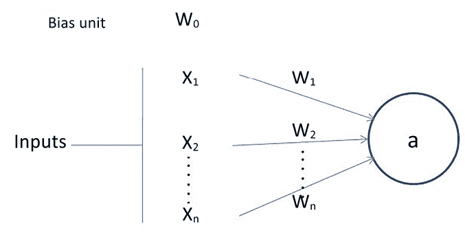
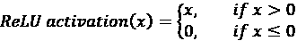
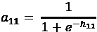
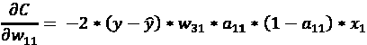
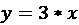
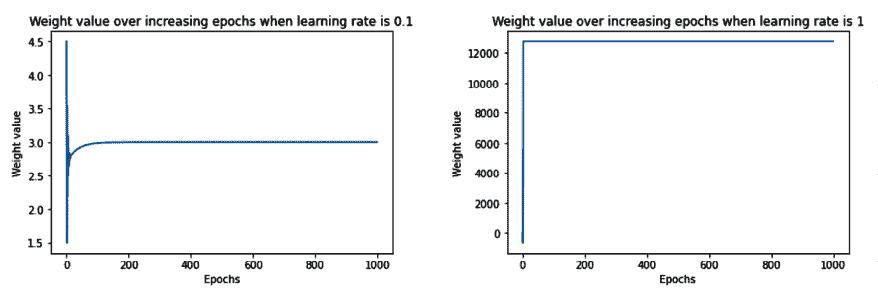

# 1

# 人工神经网络基础知识

**人工神经网络**（**ANN**）是一种监督学习算法，松散地受人类大脑功能的启发。类似于人类大脑中神经元的连接和激活方式，神经网络接受输入并通过函数传递，导致某些后续神经元被激活，并因此产生输出。

有几种标准的 ANN 架构。通用逼近定理表明，我们总是能找到足够大的神经网络架构和合适的权重集合，可以精确预测任何给定输入的输出。这意味着对于给定的数据集/任务，我们可以创建一个架构，并不断调整其权重，直到 ANN 预测我们想要的结果。调整权重直到 ANN 学习到给定任务称为训练神经网络。在解决各种相关任务中，ANN 如何通过在大型数据集上训练和定制架构来获得重要性。

计算机视觉中的一个突出任务是识别图像中存在的对象类别。ImageNet（[`www.image-net.org/challenges/LSVRC/index.php`](https://www.image-net.org/challenges/LSVRC/index.php)）是一个比赛，旨在识别图像中存在的对象类别。多年来分类错误率的减少如下所示：


图 1.1：ImageNet 比赛中的分类错误率（来源：[`www.researchgate.net/publication/331789962_Basics_of_Supervised_Deep_Learning`](https://www.researchgate.net/publication/331789962_Basics_of_Supervised_Deep_Learning)）

2012 年，神经网络（AlexNet）赢得了 ImageNet 比赛。正如您从前面的图表中可以看到的那样，从 2011 年到 2012 年，错误率显著减少，通过利用神经网络。从那时起，随着更深层和复杂的神经网络，分类错误率继续减少，并超过了人类水平的表现。

神经网络不仅在图像分类（以及对象检测和分割等相关任务）中达到了人类水平的性能，而且还启用了一整套全新的用例。**生成 AI**（**GenAI**）利用神经网络以多种方式生成内容：

+   从输入文本生成图像

+   从输入图像和文本生成新的定制图像

+   利用多个输入模态（图像、文本和音频）生成新内容

+   从文本/图像输入生成视频

这为我们学习和实现神经网络在我们的定制任务中的应用提供了坚实的动机。

在本章中，我们将在一个简单的数据集上创建一个非常简单的架构，并主要关注人工神经网络的各种构建模块（前馈、反向传播和学习率）如何调整权重，以使网络能够从给定的输入中学习预测期望的输出。我们首先将从数学上学习神经网络是什么，然后从头开始构建一个，以建立坚实的基础。然后，我们将详细了解每个负责训练神经网络的组件，并编写相应的代码。总体而言，我们将涵盖以下主题：

+   比较人工智能和传统机器学习

+   学习关于人工神经网络构建模块

+   实现前向传播

+   实现反向传播

+   将前向传播和反向传播结合起来实现

+   理解学习率的影响

+   总结神经网络的训练过程

所有本章节中的代码片段都可以在 Github 仓库的 `Chapter01` 文件夹中找到，链接为 [`bit.ly/mcvp-2e`](https://bit.ly/mcvp-2e)。

我们强烈建议您通过每个笔记本中的**在 Colab 中打开**按钮执行代码。

# 比较人工智能和传统机器学习

传统上，系统通过程序员编写的复杂算法来实现智能化。例如，假设您有兴趣识别一张照片是否包含狗。在传统的**机器学习**（**ML**）设置中，机器学习从业者或专业主题专家首先确定需要从图像中提取的特征。然后，他们提取这些特征，并通过一个精心编写的算法将给定的特征解析出来，告诉我们图像是否是一只狗。下图说明了这个概念：


图 1.2：传统机器学习用于分类的工作流程

看下面的样本：


图 1.3：生成规则的示例图像

从前述图像中，一个简单的规则可能是，如果一幅图像中有三个黑色圆圈呈三角形排列，那么它可以被分类为狗。然而，这个规则在这张欺骗性的松饼特写图像面前就会失败：


图 1.4：简单规则可能失败的图像

当然，当显示一个除了狗脸特写之外的图像时，这个规则也会失败。因此，为了准确分类图像，我们需要创建的手动规则数量可能是指数级的，特别是随着图像变得更加复杂。因此，传统方法在非常受限制的环境中效果良好（比如拍护照照片，所有尺寸都在毫米内限制），在无约束环境中效果不佳，因为每幅图像都有很大变化。

我们可以将相同的思路扩展到任何领域，比如文本或结构化数据。过去，如果有人对编程以解决现实任务感兴趣，那么了解输入数据的一切并尽可能多地编写规则以涵盖每种情况就变得必要了。这是一件繁琐的事情，并且不能保证所有新情况都会遵循这些规则。

然而，通过利用 ANN，我们可以在一步中完成这一操作。

神经网络提供了独特的好处，即在单一步骤中结合特征提取（手动调整）并将这些特征用于分类/回归，只需少量手动特征工程。这两个子任务只需标记数据（例如哪些图片是狗，哪些不是狗）和一个神经网络架构。它不需要人类提出规则来分类图像，这减少了传统技术对程序员的大部分负担。

注意，主要要求是我们为需要解决方案的任务提供大量示例。例如，在前面的情况下，我们需要为模型提供多个*狗*和*非狗*图片，以便它学习特征。神经网络在分类任务中的高层视图如下所示：


图 1.5：基于神经网络的分类方法

现在我们已经对神经网络比传统计算机视觉方法表现更好的基本原因有了非常高层次的概述，让我们在本章的各个部分深入了解神经网络如何工作。

# 了解 ANN 构建模块

人工神经网络（ANN）是一组张量（权重）和数学操作，以松散复制人脑功能的方式排列。它可以被视为接受一个或多个张量作为输入并预测一个或多个张量作为输出的数学函数。连接这些输入到输出的操作排列被称为神经网络的架构 - 我们可以根据手头任务定制它，即基于问题是否包含结构化（表格）或非结构化（图像、文本和音频）数据（这是输入和输出张量列表）。

人工神经网络由以下组成：

+   **输入层**：这些层将独立变量作为输入。

+   **隐藏（中间）层**：这些层连接输入和输出层，同时在输入数据之上执行变换。此外，隐藏层包含**节点**（在下图中表示为单元/圆圈），用于将它们的输入值修改为更高维/低维的值。通过使用各种激活函数修改中间层节点的值来实现更复杂表示的功能。

+   **输出层**：这生成了输入变量通过网络传递时预期的值。

考虑到这一点，神经网络的典型结构如下：


图 1.6：神经网络结构

输出层中的**节点**（在上图中表示为圆圈）的数量取决于手头的任务以及我们是否试图预测连续变量或分类变量。如果输出是连续变量，则输出层有一个节点。如果输出是具有*m*个可能类别的分类变量，则输出层有*m*个节点。让我们放大一个节点/神经元并看看发生了什么。一个神经元的输入转换如下：



图 1.7：神经元的输入转换

在上述图表中，*x*[1],*x*[2], ..., *x*[n]是输入变量，*w*[0]是偏置项（类似于线性/逻辑回归中的偏差）。

注意，*w*[1],*w*[2], ..., *w*[n]是分配给每个输入变量的权重，*w*[0]是偏置项。输出值*a*的计算如下：


正如您所看到的，它是*权重和输入*对的乘积之和，后跟额外的函数*f*（偏置项 + 乘积之和）。函数*f*是激活函数，用于在这些乘积之和之上应用非线性。在接下来的部分中，将详细介绍激活函数。此外，通过具有多个隐藏层，可以实现更多的非线性。

在高层次上，神经网络是一组节点，每个节点具有称为**权重**的可调浮点值，并且节点作为图形互连以按照网络结构返回输出。网络由三个主要部分组成：输入层、隐藏层（们）和输出层。请注意，可以有更多的*隐藏层数 (n)*，术语*深度*学习指的是更多的隐藏层数。通常，在神经网络需要理解像图像识别这样复杂的事物时，需要更多的隐藏层。

考虑到神经网络的架构，让我们了解一下前馈传播，它有助于估计网络架构存在的误差（损失）的量。

# 实现前馈传播

为了建立对前馈传播如何工作的坚实基础理解，我们将通过训练神经网络的玩具示例来进行介绍，其中神经网络的输入为(1, 1)，对应的（期望的）输出为 0。在此，我们将根据这对单一输入输出找到神经网络的最优权重。

在实际项目中，将有数千个数据点用于训练人工神经网络。

本例中的神经网络架构包含一个包含三个节点的隐藏层，如下所示：


图 1.8：带有 1 个隐藏层的示例神经网络架构

前述图表中的每个箭头都包含一个浮点值（**权重**），可调整。有 9 个浮点数（6 个对应于输入节点与隐藏层节点之间的连接的权重，3 个对应于隐藏层与输出层之间的连接的权重），我们需要找到这些值，使得当输入为（1,1）时，输出尽可能接近（0）。这就是我们所说的训练神经网络。出于简化目的，我们尚未引入偏置值，但基本逻辑保持不变。

在接下来的部分，我们将了解前述网络的以下内容：

+   计算隐藏层的值

+   执行非线性激活

+   估计输出层的值

+   计算对应于期望值的损失值

## 计算隐藏层单元值

现在，我们将为所有连接分配权重。在第一步中，我们随机分配所有连接的权重。一般来说，在训练开始之前，神经网络会用随机权重进行初始化。再次强调，为了简化起见，在介绍前向传播和反向传播的过程中，我们**不**包括偏置值。但是在后续章节中实现从头开始的前向传播和反向传播时会有。

让我们从在 0 到 1 之间随机初始化的初始权重开始。

**重要提示**

神经网络训练过程中的最终权重不需要处于特定数值范围内。

网络中提供的权重和值的正式表示如下图所示（左半部分），网络中提供的随机初始化权重如右半部分所示。


图 1.9：（左）神经网络的正式表示（右）神经网络的随机权重初始化

在下一步中，我们执行输入与权重的乘法，以计算隐藏层中隐藏单元的值。在激活之前，隐藏层单元的值如下获得：


此处计算的隐藏层单元值（在激活之前）也显示在下图中：


图 1.10：激活前的隐藏层单元值

现在，我们将通过非线性激活函数传递隐藏层的值。

**重要提示**

如果我们在隐藏层中不应用非线性激活函数，无论存在多少隐藏层，神经网络都会变成从输入到输出的巨大线性连接。

## 应用激活函数

激活函数有助于建模输入和输出之间的复杂关系。一些经常使用的激活函数如下计算（其中 *x* 是输入）：



对于各个先前激活的可视化，用于各种输入值的图形如下：


图 1.11：不同输入值的不同激活函数的输出

以我们的例子为例，让我们对三个隐藏层的*总和*应用 sigmoid（逻辑）激活函数 *S(x)*。通过这样做，我们在 sigmoid 激活后得到以下数值：


现在我们已经获得了激活后的隐藏层数值，在接下来的部分中，我们将获得输出层数值。

## 计算输出层的数值

到目前为止，我们已经计算出了应用 sigmoid 激活后的最终隐藏层数值。使用激活后的隐藏层数值和权重值（在第一次迭代中随机初始化），我们将计算网络的输出值：


图 1.12：在隐藏单元值上应用 Sigmoid 激活

我们执行隐藏层值和权重值的乘积之和以计算输出值。另一个提醒：我们排除了需要在每个单元（节点）添加的偏差项，仅简化我们对前向传播和反向传播工作细节的理解，将在编写前向传播和反向传播时包含它：


因为我们从一组随机权重开始，输出节点的值与目标非常不同。在这种情况下，差异为 *1.235*（请记住，目标是 0）。接下来，让我们计算与当前网络状态相关的损失值。

## 计算损失值

损失值（也称为成本函数）是我们在神经网络中优化的值。为了理解如何计算损失值，让我们看看两种情况：

+   连续变量预测

+   分类变量预测

### 计算连续变量预测期间的损失

通常，在变量连续时，损失值计算为实际值和预测之间差的平方的平均值 —— 也就是说，我们通过改变与神经网络相关的权重值来最小化均方误差。均方误差值计算如下：


在上述方程中， 是实际输出。 是由神经网络计算的预测 （其权重存储在形式为  的形式中），其输入为 ，*m* 是数据集中的行数。

关键要点是对于每组唯一的权重，神经网络将预测不同的损失，我们需要找到使损失为零（或在现实场景中尽可能接近零）的黄金权重组合。

在我们的例子中，假设我们正在预测的结果是连续的。在这种情况下，损失函数值是均方误差，计算方法如下：


现在我们已经计算出连续变量的损失值，接下来学习如何计算分类变量的损失值。

### 在预测分类变量时计算损失

当要预测的变量是离散的（即变量中仅有少数类别时），通常使用分类交叉熵损失函数。当要预测的变量具有其中两个不同值时，损失函数为二元交叉熵。

二元交叉熵的计算方法如下，其中*y*是输出的实际值，*p*是输出的预测值，*m*是数据点的总数：


分类交叉熵的计算方法如下，其中*y*是输出的实际值，*p*是输出的预测值，*m*是数据点的总数，*C*是类别的总数：


一种简单的可视化交叉熵损失的方法是查看预测矩阵本身。假设您在图像识别问题中预测五类——狗、猫、老鼠、牛和母鸡。神经网络的最后一层必须有五个神经元，采用 softmax 激活（关于 softmax 的更多信息请见下一节）。这样，它将被迫为每个数据点的每个类别预测一个概率。假设有五幅图像，并且预测的概率如下所示（每行中突出显示的单元格对应于目标类）：


图 1.13：交叉熵损失计算

注意每一行的总和为 1。在第一行中，当目标为**Dog**且预测概率为**0.88**时，相应的损失为**0.128**（这是**0.88**的负对数）。类似地，计算其他损失。正如您所见，当正确类别的概率高时，损失值较低。正如您所知，概率在 0 到 1 之间变化。因此，最小可能的损失可以是 0（当概率为 1 时），而最大损失可以是无穷大（当概率为 0 时）。

在数据集中，最终的损失是所有行中所有个体损失的平均值。

现在我们已经对计算均方误差损失和交叉熵损失有了扎实的理解，让我们回到我们的示例中。假设我们的输出是一个连续变量，我们将在后面的章节中学习如何使用反向传播来最小化损失值。我们将更新之前随机初始化的权重值  来最小化损失 ()。但在此之前，让我们先用 Python 中的 NumPy 数组编写前向传播代码，以加深对其工作原理的理解。

## 编写代码中的前向传播

编写前向传播代码的高级策略如下:

1.  在每个神经元执行求和乘积。

1.  计算激活。

1.  在每个神经元重复前两个步骤直到输出层。

1.  通过将预测值与实际输出进行比较来计算损失。

前向传播函数接受输入数据、当前神经网络权重和输出数据作为输入，并返回当前网络状态的损失作为输出。

用于计算所有数据点上均方误差损失值的前向传播函数在 GitHub 代码库的 `Chapter01` 文件夹中的 `Feed_forward_propagation.ipynb` 文件中，链接地址为 [`bit.ly/mcvp-2e`](https://bit.ly/mcvp-2e)。 

我们强烈建议您点击每个笔记本中的 **在 Colab 中打开** 按钮来执行代码笔记本。示例如下：


图 1.14: GitHub 笔记本中的“在 Colab 中打开”按钮

一旦点击 **在 Colab 中打开**，您将能够轻松执行所有代码，并应能够复制本书中显示的结果。

为了使这个练习更加现实，我们将使每个节点都有关联的偏置。因此，权重数组将包含连接不同节点的权重以及隐藏/输出层节点的偏置。现在可以执行代码了，让我们继续编写前向传播代码:

1.  将输入变量值 (`inputs`)、权重 (`weights`，如果这是第一次迭代则为随机初始化) 和提供的数据集中的实际输出 (`outputs`) 作为 `feed_forward` 函数的参数:

    ```py
    import numpy as np
    def feed_forward(inputs, outputs, weights): 
    ```

1.  通过执行输入和连接输入层到隐藏层的权重值 (`weights[0]`) 的矩阵乘法 (`np.dot`) 并添加与隐藏层节点相关的偏置项 (`weights[1]`) 来计算隐藏层的值:

    ```py
     pre_hidden = np.dot(inputs,weights[0])+ weights[1] 
    ```

1.  在前一步骤中获得的隐藏层值 `pre_hidden` 上应用 Sigmoid 激活函数:

    ```py
     hidden = 1/(1+np.exp(-pre_hidden)) 
    ```

1.  通过执行隐藏层激活值 (`hidden`) 和连接隐藏层到输出层的权重 (`weights[2]`) 的矩阵乘法 (`np.dot`)，并将输出与与输出层节点相关的偏置 `weights[3]` 相加来计算输出层的值:

    ```py
     pred_out = np.dot(hidden, weights[2]) + weights[3] 
    ```

1.  计算数据集上的均方误差值，并返回均方误差的均值：

    ```py
     mean_squared_error = np.mean(np.square(pred_out - outputs))
        return mean_squared_error 
    ```

现在，通过网络进行前向传播，我们能够得到均方误差值。

在我们学习反向传播之前，让我们学习一些前馈网络的组成部分——激活函数和损失值计算——通过在 NumPy 中实现它们，以便我们深入了解它们的工作原理。

### 代码中的激活函数

虽然我们在前面的代码中对隐藏层值应用了 sigmoid 激活，让我们看看其他常用的激活函数：

+   **Tanh**：值（隐藏层单元值）的 tanh 激活计算如下：

    ```py
    def tanh(x):
        return (np.exp(x)-np.exp(-x))/(np.exp(x)+np.exp(-x)) 
    ```

+   **ReLU**：值（隐藏层单元值）的**修正线性单元**（**ReLU**）计算如下：

    ```py
    def relu(x):      
        return np.where(x>0,x,0) 
    ```

+   **线性**：值的线性激活是值本身。这也称为“恒等激活”或“无激活”，很少使用。表示如下：

    ```py
    def linear(x):      
        return x 
    ```

+   **Softmax**：与其他激活函数不同，softmax 是在一组值之上执行的。这通常用于确定在给定场景中输入属于*m*个可能输出类别中的一个的概率。假设我们试图将一幅数字的图像分类为可能的 10 个类别（从 0 到 9）中的一个。

1.  在这种情况下，有 10 个输出值，其中每个输出值应代表输入图像属于 10 个类别之一的概率。

1.  Softmax 激活用于为输出中的每个类别提供概率值，计算如下：

1.  ```py
    def softmax(x):      
        return np.exp(x)/np.sum(np.exp(x)) 
    ```

注意，对输入`x`的两个操作——`np.exp`将使所有值变为正数，而通过`np.sum(np.exp(x))`对所有这些指数进行的除法将强制所有值位于 0 和 1 之间。这个范围与事件概率重合。这就是我们所说的返回概率向量的含义。

现在我们已经学习了各种激活函数，接下来我们将学习不同的损失函数。

### 代码中的损失函数

在神经网络训练过程中，通过更新权重值来最小化损失值（在代码中）。定义适当的损失函数是构建工作和可靠的神经网络模型的关键。通常在构建神经网络时使用的损失函数如下：

+   **均方误差**：均方误差是输出的实际值和预测值之间的平方差。我们对误差取平方，因为误差可以是正或负（当预测值大于实际值或反之时）。平方确保正负误差不会互相抵消。我们计算平均值的平方误差，以便在数据集大小不同时比较两个不同数据集上的误差。

预测输出值数组 (`p`) 和实际输出值数组 (`y`) 之间的均方误差计算如下：

```py
def mse(p, y):  
    return np.mean(np.square(p - y)) 
```

当试图预测具有连续性质的值时，通常使用均方误差。

+   **均绝对误差：** 均绝对误差的工作方式与均方误差非常相似。均绝对误差通过计算所有数据点的实际值和预测值之间的绝对差的平均值，确保正负误差不会互相抵消。

预测输出值数组 (`p`) 和实际输出值数组 (`y`) 之间的均绝对误差实现如下：

```py
def mae(p, y):      
    return np.mean(np.abs(p-y)) 
```

类似于均方误差，均绝对误差通常用于连续变量。

+   **二元交叉熵**：交叉熵是衡量两个不同分布之间差异的指标：实际分布和预测分布。二元交叉熵适用于二进制输出数据，与我们讨论过的前两种损失函数（适用于连续变量预测）不同。

预测值数组 (`p`) 和实际值数组 (`y`) 之间的二元交叉熵实现如下：

```py
def binary_cross_entropy(p, y):     
    return -np.mean((y*np.log(p)+(1-y)*np.log(1-p))) 
```

注意，当预测值远离实际值时，二元交叉熵损失值很高，而当预测值和实际值接近时，损失值很低。

+   **分类交叉熵**：预测值数组 (`p`) 和实际值数组 (`y`) 之间的分类交叉熵实现如下：

```py
def categorical_cross_entropy(p, y):        
    return -np.mean(np.log(p[np.arange(len(y)),y])) 
```

到目前为止，我们已经学习了前向传播及其组成部分，如权重初始化、与节点相关的偏差以及激活和损失函数。在接下来的部分中，我们将学习反向传播，这是一种调整权重的技术，使得它们导致的损失尽可能小。

# 实施反向传播

在前向传播中，我们将输入层连接到隐藏层，然后连接到输出层。在第一次迭代中，我们随机初始化权重，然后计算由这些权重值导致的损失。在反向传播中，我们采取相反的方法。我们从前向传播中获得的损失值开始，并以这样的方式更新网络的权重，以使损失值尽可能小。

通过执行以下步骤减少损失值：

1.  通过逐个地改变神经网络中的每个权重来更新权重。

1.  当改变权重值时 ()，测量损失的变化 ()。

1.  更新权重为 ，其中 *k* 是一个正值，是称为**学习率**的超参数。

    注意，对特定权重的更新与通过改变它稍微减少的损失量成比例。直观地说，如果改变一个权重减少了大量损失值，那么我们可以大幅度更新该权重。然而，如果通过改变权重减少的损失较小，那么我们只更新它一小部分。

如果在**整个**数据集上（我们已经进行了前向传播和反向传播）执行了前面的步骤*n*次，这实质上就是训练*n*个**epochs**。

由于典型神经网络包含成千上万的权重，改变每个权重的值并检查损失是否增加或减少并不是最优的做法。前述列表中的核心步骤是测量在改变权重时损失的变化。正如你在微积分中学习的那样，衡量这一点与计算损失关于权重的**梯度**相同。在下一节中，关于反向传播的链式法则将更多地利用微积分中的偏导数来计算损失关于权重的梯度。但在这一节之前，我们将通过稍微改变一次更新一个权重的方式来从头实现梯度下降。然而，在实施反向传播之前，让我们了解神经网络的一个额外细节：**学习率**。

直观地说，学习率有助于建立对算法的信任。例如，在决定权重更新的大小时，我们可能不会一次性改变权重值很大的量，而是更慢地更新它。

这导致我们的模型获得稳定性；我们将看看学习率如何在*理解学习率影响*部分中帮助稳定性。

我们更新权重以减少错误的整个过程被称为**梯度下降**。**随机梯度下降**是如何在前述场景中最小化错误的。如前所述，**梯度**表示差异（即当权重值稍微改变时损失值的差异），**下降**意味着减少。另一种解释是，梯度表示斜率（损失下降的方向），下降意味着向更低的损失移动。**随机**代表基于随机样本的选择，根据这些样本作出决策。

除了随机梯度下降外，还有许多类似的优化器帮助最小化损失值；不同的优化器将在下一章讨论。

在接下来的两节中，我们将学习如何在 Python 中从头开始编写反向传播，并简要讨论使用链式法则进行反向传播的工作原理。

## 代码中的梯度下降

梯度下降在 Python 中的实现如下：

以下代码在本书的 GitHub 存储库的`Chapter01`文件夹中作为`Gradient_descent.ipynb`提供 - [`bit.ly/mcvp-2e`](https://bit.ly/mcvp-2e)。

1.  定义前馈网络并计算均方误差损失值，就像我们在*代码中的前向传播*部分所做的那样：

    ```py
    from copy import deepcopy
    import numpy as np
    def feed_forward(inputs, outputs, weights):
        pre_hidden = np.dot(inputs,weights[0])+ weights[1]
        hidden = 1/(1+np.exp(-pre_hidden))
        pred_out = np.dot(hidden, weights[2]) + weights[3]
        mean_squared_error = np.mean(np.square(pred_out - outputs))
        retur mean_squared_error 
    ```

1.  逐个将每个权重和偏置值增加一个非常小的量（0.0001），并计算每个权重和偏置更新的总平方误差损失值。

    1.  在以下代码中，我们正在创建一个名为`update_weights`的函数，该函数执行梯度下降过程以更新权重。函数的输入是网络的输入变量`inputs`、期望输出`outputs`、权重（在训练模型开始时随机初始化）以及模型的学习率`lr`（关于学习率的更多信息将在后面的部分讨论）：

    ```py
    def update_weights(inputs, outputs, weights, lr): 
    ```

    1.  确保深度复制权重列表。由于权重将在后续步骤中被操作，`deepcopy`确保我们可以使用多个副本的权重而不影响原始权重值。我们将创建三个原始权重集的副本作为函数的输入 - `original_weights`、`temp_weights`和`updated_weights`：

    ```py
     original_weights = deepcopy(weights)
        temp_weights = deepcopy(weights)
        updated_weights = deepcopy(weights) 
    ```

    1.  通过将输入、输出和原始权重通过前馈函数传递，计算损失值（original_loss）：

    ```py
     original_loss = feed_forward(inputs, outputs, original_weights) 
    ```

    1.  我们将遍历网络的所有层：

    ```py
     for i, layer in enumerate(original_weights): 
    ```

    1.  在我们的神经网络中有四个参数列表 - 两个用于连接输入到隐藏层的权重和偏置参数列表，另外两个用于连接隐藏层到输出层的权重和偏置参数列表。现在，我们遍历所有的单个参数，并且由于每个列表具有不同的形状，我们利用`np.ndenumerate`来遍历给定列表中的每个参数：

    ```py
     for index, weight in np.ndenumerate(layer): 
    ```

    1.  现在我们将原始权重集存储在`temp_weights`中。我们选择第 i 层中存在的权重的索引，并增加一个小的值。最后，我们使用神经网络的新权重集计算新的损失：

    ```py
     temp_weights = deepcopy(weights)
                temp_weights[i][index] += 0.0001
                _loss_plus = feed_forward(inputs, outputs, temp_weights) 
    ```

    1.  在前述代码的第一行中，我们将`temp_weights`重置为原始权重集，因为在每次迭代中，当参数在给定 epoch 内以微小量更新时，我们会更新不同的参数以计算损失。

    1.  我们计算由于权重改变而产生的梯度（损失值的变化）：

    ```py
     grad = (_loss_plus - original_loss)/(0.0001) 
    ```

这个通过微小量更新参数然后计算梯度的过程相当于微分的过程。

1.  最后，我们更新对应第 i 层和`index`的参数。更新后的权重值将按照梯度值的比例减少。此外，我们不完全通过减去梯度值来快速减少权重值，而是通过使用学习率`lr`逐步建立信任（有关学习率的更多信息，请参阅*理解学习率影响*部分）：

1.  ```py
     updated_weights[i][index] -= grad*lr 
    ```

1.  一旦跨所有层和层内索引的参数值更新完成，我们返回更新后的权重值 - `updated_weights`：

1.  ```py
     return updated_weights, original_loss 
    ```

神经网络中的另一个参数是用于计算损失值的**批量大小**。

在前面的场景中，我们考虑了所有数据点来计算损失（均方误差）值。然而，在实际操作中，当我们有成千上万（或在某些情况下，百万级）的数据点时，计算损失值时更多数据点的增量贡献会遵循边际收益递减法则，因此我们会使用远小于总数据点数的批量大小。我们将应用梯度下降（在前馈传播之后）每次使用一个**批次**，直到我们在**一轮训练的一个时期**内耗尽所有数据点。在构建模型时考虑的典型批次大小介于 32 和 1,024 之间。通常是 2 的幂，并且对于非常大的模型，根据情况，批量大小可以小于 32。

## 使用链式法则实现反向传播

到目前为止，我们通过更新权重值一小部分来计算与权重相关的损失的梯度，然后计算在原始情景（权重未更改时）和在更新权重后的前向传播损失之间的差异。以这种方式更新权重值的一个缺点是，当网络很大（有更多权重需要更新）时，需要大量计算来计算损失值（实际上，需要两次计算 - 一次是权重值未更改时，再次是权重值稍微更新后）。这导致更多的计算，因此需要更多的资源和时间。在本节中，我们将学习如何利用链式法则，它不需要我们手动计算损失值即可得出损失对权重值的梯度。

在第一次迭代中（我们随机初始化权重时），输出的预测值为 1.235。为了得到理论公式，让我们将权重和隐藏层值及隐藏层激活表示为*w*、*h*和*a*，如下所示：


图 1.15：泛化权重初始化过程

请注意，在前面的图表中，我们已经将左图的每个组件值概括在右图中。

为了简化理解，在本节中，我们将了解如何使用链规则计算损失值相对于仅 w[11] 的梯度。这种学习方法可以扩展到神经网络的所有权重和偏差。我们鼓励您练习并应用链规则计算到其余的权重和偏差值。此外，为了我们学习的目的简化，我们将仅处理一个数据点，其中输入为 {1,1}，预期输出为 {0}。

本书的 GitHub 存储库中`Chapter01`文件夹中的`chain_rule.ipynb`笔记本包含使用链规则计算网络中所有参数的权重和偏差变化的梯度的方法，网址为[`bit.ly/mcvp-2e`](https://bit.ly/mcvp-2e)。

鉴于我们正在计算损失值相对于 w[11] 的梯度，请让我们通过以下图表理解所有需要包含的中间组件（在以下图表中，未连接输出到 w[11] 的组件已被标为灰色）：


图 1.16：突出显示需要计算损失梯度的值（h[11], a[11], ŷ）

从上述图表中，我们可以看到 w[11]通过突出显示的路径对损失值有贡献 – , , 和 。让我们详细说明 , , 和  是如何分别获得的。

网络的损失值表示如下：


预测输出值  计算如下：


隐藏层激活值（sigmoid 激活）计算如下：



隐藏层值计算如下：


现在我们已经制定了所有方程，请计算损失值 (*C*) 相对于权重  的变化的影响。


这就是所谓的**链规则**。本质上，我们正在执行一系列不同的微分以获取我们感兴趣的微分值。

请注意，在上述方程中，我们已经建立了一系列偏微分方程，使我们能够逐个计算这四个组件的偏导数，并最终计算出损失值相对于权重值  的导数。

上述方程中的各个偏导数计算如下：

1.  损失值对预测输出值  的偏导数如下所示：


1.  预测输出值  对隐藏层激活值  的偏导数如下所示：


1.  隐藏层激活值  对隐藏层激活前数值  的偏导数如下所示：


请注意，上述方程来自于 Sigmoid 函数的导数  如下所示：


1.  隐藏层激活前数值对权重值  的偏导数如下所示：


在各个偏导数计算完毕后，损失值相对于  的梯度通过用前面步骤中计算的相应值替换每个偏导数项来计算，如下所示：



从上述公式可以看出，我们现在能够计算在权重值略微变化时对损失值的影响（即损失相对于权重的梯度），而无需通过重新计算前向传播来进行蛮力计算。

接下来，我们将按以下方式更新权重值：


两种方法的工作版本：1）使用链式法则识别梯度，然后更新权重；2）学习权重微小变化对损失值影响的更新权重值，在本书的 GitHub 仓库的 `Chapter01` 文件夹的笔记本 `Chain_rule.ipynb` 中提供相同的更新权重值，链接为 [`bit.ly/mcvp-2e`](https://bit.ly/mcvp-2e)。

在梯度下降中，我们按顺序执行权重更新过程（逐个权重）。通过利用链式法则，我们学到了另一种计算权重值微小变化对损失值影响的替代方法，同时有机会并行计算。

因为我们在所有层上更新参数，整个参数更新过程可以并行化。此外，考虑到在实际场景中可能存在数百万个层参数，将每个参数在 GPU 的不同核心上进行计算，更新权重的时间比逐个权重循环的速度更快。

现在我们对反向传播有了坚实的理解，不仅从直觉上，还通过利用链式法则，让我们学习一下如何使前向传播和反向传播共同工作，以获得最佳的权重值。

## 将前向传播和反向传播结合起来

在本节中，我们将在与*代码中的前向传播*部分中使用的玩具数据集相同的简单神经网络上建立一个隐藏层，并利用我们在前一节中定义的`update_weights`函数执行反向传播以获得最佳的权重和偏差值。

请注意，我们没有利用链式法则，只是为了让您对前向和反向传播的基础有坚实的理解。从下一章开始，您将不会以这种方式执行神经网络训练。

我们按以下方式定义模型：

1.  输入连接到具有三个单元/节点的隐藏层。

1.  隐藏层连接到具有一个输出层中的单元。

以下代码在本书的 GitHub 存储库`Chapter01`文件夹中作为`Back_propagation.ipynb`提供 – [`bit.ly/mcvp-2e`](https://bit.ly/mcvp-2e)。

我们将按以下方式创建网络：

1.  导入相关包并定义数据集：

    ```py
    from copy import deepcopy
    import numpy as np
    x = np.array([[1,1]])
    y = np.array([[0]]) 
    ```

1.  随机初始化权重和偏差值。

    隐藏层中有三个单元，并且每个输入节点连接到隐藏层单元中的每一个。因此，总共有六个权重值和三个偏差值 – 每个隐藏单元对应一个偏差和两个权重（两个权重来自两个输入节点）。此外，最终层有一个单元连接到隐藏层的三个单元。因此，总共有三个权重和一个偏差决定输出层的值。随机初始化的权重如下：

    ```py
    W = [
        np.array([[-0.0053, 0.3793],
                  [-0.5820, -0.5204],
                  [-0.2723, 0.1896]], dtype=np.float32).T,
        np.array([-0.0140, 0.5607, -0.0628], dtype=np.float32),
        np.array([[ 0.1528,-0.1745,-0.1135]],dtype=np.float32).T,
        np.array([-0.5516], dtype=np.float32)
    ] 
    ```

    在前面的代码中，第一个参数数组对应于连接输入层到隐藏层的 2 x 3 权重矩阵。第二个参数数组代表与隐藏层每个节点相关联的偏差值。第三个参数数组对应于连接隐藏层到输出层的 3 x 1 权重矩阵，最后一个参数数组表示与输出层相关联的偏差。

1.  将神经网络通过 100 次前向传播和反向传播的时期 – 函数已经学习并在前面的章节中定义为`feed_forward`和`update_weights`函数：

    1.  定义`feed_forward`函数：

    ```py
    def feed_forward(inputs, outputs, weights):
        pre_hidden = np.dot(inputs,weights[0])+ weights[1]
        hidden = 1/(1+np.exp(-pre_hidden))
        pred_out = np.dot(hidden, weights[2]) + weights[3]
        mean_squared_error = np.mean(np.square(pred_out - outputs))
        return mean_squared_error 
    ```

    1.  定义`update_weights`函数（我们将在下一节详细了解学习率*lr*）：

    ```py
    def update_weights(inputs, outputs, weights, lr):
        original_weights = deepcopy(weights)
        temp_weights = deepcopy(weights)
        updated_weights = deepcopy(weights)
        original_loss = feed_forward(inputs, outputs, original_weights)
        for i, layer in enumerate(original_weights):
            for index, weight in np.ndenumerate(layer):
                temp_weights = deepcopy(weights)
                temp_weights[i][index] += 0.0001
                _loss_plus = feed_forward(inputs, outputs, temp_weights)
                grad = (_loss_plus - original_loss)/(0.0001)
                updated_weights[i][index] -= grad*lr
        return updated_weights, original_loss 
    ```

    1.  在 100 个时期内更新权重并获取损失值和更新后的权重值：

    ```py
    losses = []
    for epoch in range(100):
        W, loss = update_weights(x,y,W,0.01)
        losses.append(loss) 
    ```

1.  绘制损失值图表：

    ```py
    import matplotlib.pyplot as plt
    %matplotlib inline
    plt.plot(losses)
    plt.title('Loss over increasing number of epochs')
    plt.xlabel('Epochs')
    plt.ylabel('Loss value') 
    ```

    上述代码生成了以下图表：

    

    图 1.17：随着 epochs 增加，损失值的变化情况

    正如你所看到的，损失从约 0.33 开始稳定下降到约 0.0001。这表明权重根据输入输出数据进行调整，当给定输入时，我们可以预期它预测与损失函数中进行比较的输出。输出权重如下：

    ```py
    [array([[ 0.01424004, -0.5907864 , -0.27549535],
            [ 0.39883757, -0.52918637, 0.18640439]], dtype=float32),
     array([ 0.00554004, 0.5519136 , -0.06599568], dtype=float32),
     array([[ 0.3475135 ],
            [-0.05529078],
            [ 0.03760847]], dtype=float32),
     array([-0.22443289], dtype=float32)] 
    ```

    在理解核心 PyTorch 概念之后，可以在 GitHub 仓库的 `Chapter02` 文件夹中的 `Auto_gradient_of_tensors.ipynb` 文件中演示相同权重的 PyTorch 版本的相同代码。重新访问本节，验证无论网络是用 NumPy 还是 PyTorch 编写，输入和输出都是相同的。

    在 NumPy 数组中从头开始构建网络，虽然不是最佳选择，但在本章中是为了让您对神经网络的工作细节有坚实的基础。

1.  一旦我们有了更新的权重，通过网络传递输入来进行预测，并计算输出值：

    ```py
    pre_hidden = np.dot(x,W[0]) + W[1]
    hidden = 1/(1+np.exp(-pre_hidden))
    pred_out = np.dot(hidden, W[2]) + W[3]
    # -0.017 
    ```

上述代码的输出是 `-0.017` 的值，这个值非常接近预期的输出值 0\. 随着 epochs 的增加，`pred_out` 的值甚至更接近 0。

到目前为止，我们已经学习了前向传播和反向传播。在这里定义的 `update_weights` 函数的关键部分是学习率，我们将在下一节中学习它。

# 理解学习率的影响

为了理解学习率如何影响模型的训练，让我们考虑一个非常简单的情况，我们尝试拟合以下方程（请注意，以下方程不同于我们到目前为止正在处理的玩具数据集）：



注意，*y* 是输出，*x* 是输入。通过一组输入和预期输出值，我们将尝试使用不同的学习率拟合方程，以了解学习率的影响：

以下代码可在本书 GitHub 仓库的 `Chapter01` 文件夹中的 `Learning_rate.ipynb` 中找到 – [`bit.ly/mcvp-2e`](https://bit.ly/mcvp-2e)。

1.  指定输入和输出数据集如下：

    ```py
    x = [[1],[2],[3],[4]]
    y = [[3],[6],[9],[12]] 
    ```

1.  定义 `feed_forward` 函数。此外，在这个例子中，我们将修改网络，使其没有隐藏层，并且架构如下:

    注意，在上述函数中，我们正在估计参数 *w* 和 *b*：

    ```py
    from copy import deepcopy
    import numpy as np
    def feed_forward(inputs, outputs, weights):
        pred_out = np.dot(inputs,weights[0])+ weights[1]
        mean_squared_error = np.mean(np.square(pred_out - outputs))
        return mean_squared_error 
    ```

1.  定义 `update_weights` 函数，就像我们在 *梯度下降的代码* 部分中定义的那样：

    ```py
    def update_weights(inputs, outputs, weights, lr):
        original_weights = deepcopy(weights)
        org_loss = feed_forward(inputs, outputs,original_weights)
        updated_weights = deepcopy(weights)
        for i, layer in enumerate(original_weights):
            for index, weight in np.ndenumerate(layer):
                temp_weights = deepcopy(weights)
                temp_weights[i][index] += 0.0001
                _loss_plus = feed_forward(inputs, outputs, temp_weights)
                grad = (_loss_plus - org_loss)/(0.0001)
                updated_weights[i][index] -= grad*lr
        return updated_weights 
    ```

1.  初始化权重和偏置值为随机值：

    ```py
    W = [np.array([[0]], dtype=np.float32),
         np.array([[0]], dtype=np.float32)] 
    ```

注意，权重和偏置值随机初始化为 0 值。此外，输入权重值的形状为 1 x 1，因为输入中每个数据点的形状为 1 x 1，而偏置值的形状为 1 x 1（因为输出中只有一个节点，每个输出只有一个值）。

1.  让我们利用学习率为 0.01 的`update_weights`函数，循环执行 1,000 次迭代，并检查权重值（`W`）随 epoch 增加的变化情况：

    ```py
    weight_value = []
    for epx in range(1000):
        W = update_weights(x,y,W,0.01)
        weight_value.append(W[0][0][0]) 
    ```

请注意，在上述代码中，我们使用学习率为 0.01，并重复`update_weights`函数以在每个 epoch 结束时获取修改后的权重。此外，在每个 epoch 中，我们将最近更新的权重作为输入，以获取下一个 epoch 中的更新后的权重。

1.  绘制每个 epoch 结束时的权重参数值：

    ```py
    import matplotlib.pyplot as plt
    %matplotlib inline
    epochs = range(1, 1001)
    plt.plot(epochs,weight_value)
    plt.title('Weight value over increasing \
    epochs when learning rate is 0.01')
    plt.xlabel('Epochs')
    plt.ylabel('Weight value') 
    ```

上述代码导致权重值随 epoch 增加而变化如下：


图 1.18：学习率为 0.01 时随着 epoch 增加的权重值

请注意，在上述输出中，权重值逐渐向右方向增加，然后饱和在约为 3 的最佳值。

要了解学习率对到达最佳权重值的影响，让我们了解在学习率为 0.1 和学习率为 1 时，当增加 epoch 时权重值如何变化。

当我们修改相应的学习率值在*步骤 5*中并执行*步骤 6*时，获得以下图表：



图 1.19：（左）学习率为 0.1 时随着 epoch 增加的权重值（右）学习率为 1 时随着 epoch 增加的权重值

注意，当学习率非常小时（0.01），权重值缓慢移动（在较多的 epoch 中）向最佳值靠近。然而，稍高的学习率（0.1）时，权重值起初振荡，然后迅速饱和（在较少的 epoch 中）到达最佳值。最后，当学习率很高（1）时，权重值急剧上升到非常高的值，并且无法达到最佳值。

当学习率较低时，权重值没有大幅波动的原因在于我们通过*梯度 *学习率*限制了权重更新的幅度，从本质上讲，当学习率较小时，权重更新量较小。然而，当学习率较高时，权重更新量较大，在权重更新量较小时，损失的变化很小，以至于权重无法达到最佳值。

为了更深入地理解梯度值、学习速率和权重值之间的相互作用，让我们仅运行`update_weights`函数 10 个周期。此外，我们将打印以下数值以了解它们随着周期增加的变化：

+   每个周期开始时的权重值

+   权重更新前的损失

+   当权重稍作调整时的损失

+   梯度值

我们修改`update_weights`函数，打印如下前述数值：

```py
def update_weights(inputs, outputs, weights, lr):
    original_weights = deepcopy(weights)
    org_loss = feed_forward(inputs, outputs, original_weights)
    updated_weights = deepcopy(weights)
    for i, layer in enumerate(original_weights):
        for index, weight in np.ndenumerate(layer):
            temp_weights = deepcopy(weights)
            temp_weights[i][index] += 0.0001
            _loss_plus = feed_forward(inputs, outputs, temp_weights)
            grad = (_loss_plus - org_loss)/(0.0001)
            updated_weights[i][index] -= grad*lr
            **if****(i %** **2** **==** **0****):**
**print****(****'weight value:'****, \**
 **np.****round****(original_weights[i][index],****2****), \**
**'original loss:'****, np.****round****(org_loss,****2****), \**
**'loss_plus:'****, np.****round****(_loss_plus,****2****), \**
**'gradient:'****, np.****round****(grad,****2****), \**
**'updated_weights:'****, \**
 **np.****round****(updated_weights[i][index],****2****))**
    return updated_weights 
```

在前述代码中加粗显示的行是我们从前一节中修改`update_weights`函数的地方，首先我们通过检查 (`i % 2 == 0`) 来确认当前是否在处理权重参数，因为另一个参数对应于偏差值，然后我们打印原始权重值 (`original_weights[i][index]`)、损失值 (`org_loss`)、更新后的损失值 (`_loss_plus`)、梯度 (`grad`) 和更新后的权重值 (`updated_weights`)。

现在让我们了解在我们考虑的三种不同学习速率下，随着周期增加，前述数值如何变化。

## 学习速率为 0.01 的情景

我们将使用以下代码检查数值：

```py
W = [np.array([[0]], dtype=np.float32),
     np.array([[0]], dtype=np.float32)]
weight_value = []
for epx in range(10):
    W = update_weights(x,y,W,0.01)
    weight_value.append(W[0][0][0])
import matplotlib.pyplot as plt
%matplotlib inline
plt.figure(figsize=(15,5))
plt.subplot(121)
epochs = np.arange(1,11)
plt.plot(epochs, weight_value)
plt.title('Weight value over increasing epochs \n when learning rate is 0.01')
plt.xlabel('Epochs')
plt.ylabel('Weight value')
plt.subplot(122)
plt.plot(epochs, loss_value)
plt.title('Loss value over increasing epochs \n when learning rate is 0.01')
plt.xlabel('Epochs')
plt.ylabel('Loss value') 
```

前述代码的输出如下：


图 1.20：当学习速率为 0.01 时，随着周期增加权重和损失值的变化

注意，当学习速率为 0.01 时，损失值下降缓慢，权重值向最优值更新速度也慢。现在让我们了解学习速率为 0.1 时的前述变化。

## 学习速率为 0.1

代码与学习速率为 0.01 的情景保持一致；然而，在这种情况下，学习速率参数将为 0.1。更改学习速率参数值后运行相同代码的输出如下：


图 1.21：当学习速率为 0.1 时，随着周期增加权重和损失值的变化

让我们对比学习速率为 0.01 和 0.1 的情景——两者之间的主要区别如下：

*当学习速率为 0.01 时，与学习速率为 0.1 相比，权重更新速度较慢（在第一个周期中，学习速率为 0.01 时从 0 更新到 0.45，而学习速率为 0.1 时更新到 4.5）。更新速度较慢的原因是学习速率较低，因为权重是通过梯度乘以学习速率进行更新。*

除了权重更新幅度，我们还应注意权重更新的方向。*当权重值小于最优值时，梯度为负；当权重值大于最优值时，梯度为正。这种现象有助于权重值向正确方向更新。*

最后，我们将以学习速率为 1 进行对比。

## 学习速率为 1

代码与学习率为 0.01 的情况下保持不变；但在这种情况下，学习率参数为 1。更改学习率参数后运行相同代码的输出如下：


图 1.22：在学习率为 1 时，随着周期的增加，权重和损失值的变化

从上图中我们可以看到，权重已偏向一个非常高的值（例如在第一个周期结束时，权重值为 45，在后续周期中进一步偏向一个非常大的值）。此外，权重值已移动到一个非常大的数值，因此权重值的微小变化几乎不会导致梯度变化，从而使得权重困在这个高值上。

**注意**

一般来说，采用较低的学习率效果更好。这样一来，模型学习得更慢，但会朝着最优值调整权重。典型的学习率参数值范围在 0.0001 到 0.01 之间。

现在我们已经了解了神经网络的构建模块——前向传播、反向传播和学习率——在接下来的部分，我们将总结如何将这三者结合起来训练神经网络的高级概述。

# 总结神经网络的训练过程

训练神经网络是通过重复两个关键步骤——前向传播和反向传播——来找到神经网络架构的最优权重的过程，给定一个学习率。

在前向传播中，我们将一组权重应用于输入数据，通过定义的隐藏层传递，对隐藏层输出执行定义的非线性激活，然后通过将隐藏层节点值与另一组权重相乘连接到输出层，以估算输出值。最后，我们计算与给定权重集合对应的整体损失。对于第一次前向传播，权重值是随机初始化的。

在反向传播中，我们通过调整权重以减少总体损失的方向来减少损失值（误差）。此外，权重更新的幅度是梯度乘以学习率。

反向传播和前向传播的过程重复进行，直到尽可能地减少损失。这意味着，在训练结束时，神经网络已经调整了其权重  以预测我们希望其预测的输出。在上述示例中，训练后，更新的网络在输入 *{1,1}* 时将预测输出值为 0，因为它被训练成这样。

# 总结

在这一章中，我们了解到需要一个单一网络来同时执行特征提取和分类，然后学习了人工神经网络的架构和各个组件。接下来，我们学习了如何连接网络的各个层，并实现了前馈传播来计算网络当前权重对应的损失值。然后，我们实现了反向传播来优化权重以最小化损失值，并学习了学习率在实现网络的最优权重中的作用。此外，我们从头开始使用 NumPy 实现了网络的所有组件——前馈传播、激活函数、损失函数、链式法则和梯度下降来更新权重，以便在接下来的章节中建立坚实的基础。

现在我们了解了神经网络的工作原理，接下来将在下一章中使用 PyTorch 实现一个神经网络，并深入探讨可以在神经网络中调整的各种其他组件（超参数）。

# 问题

1.  神经网络中的各种层有哪些？

1.  前馈传播的输出是什么？

1.  连续依赖变量的损失函数与二元依赖变量或分类依赖变量的损失函数有何不同？

1.  什么是随机梯度下降？

1.  反向传播练习的作用是什么？

1.  在反向传播期间如何更新跨层所有权重？

1.  在训练神经网络的每个 epoch 中使用了哪些函数？

1.  为什么在 GPU 上训练网络比在 CPU 上训练更快？

1.  在训练神经网络时学习率的影响是什么？

1.  学习率参数的典型值是多少？

# 在 Discord 上了解更多信息

加入我们社区的 Discord 空间，与作者和其他读者进行讨论：

[`packt.link/modcv`](https://packt.link/modcv)


