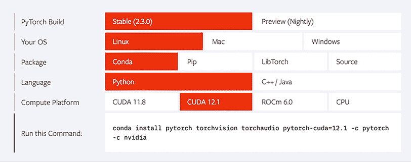
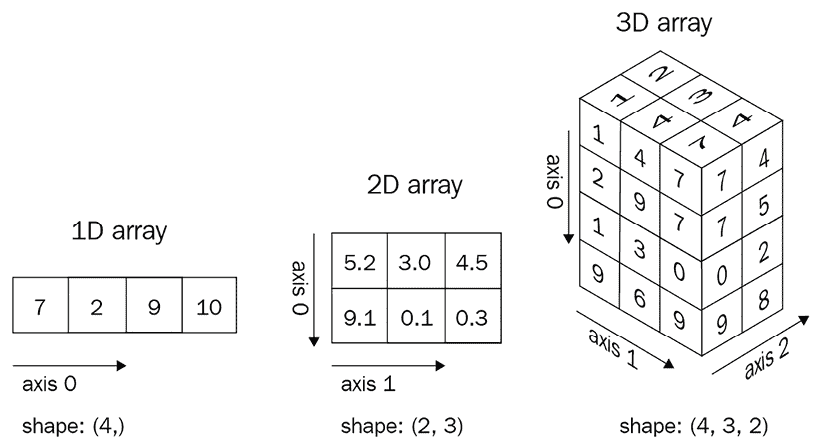
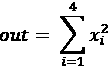
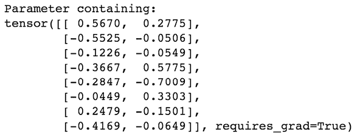
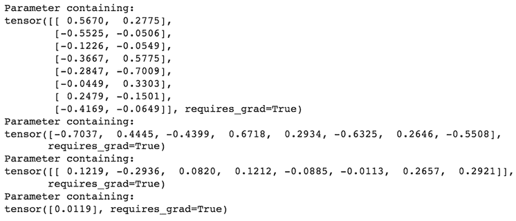
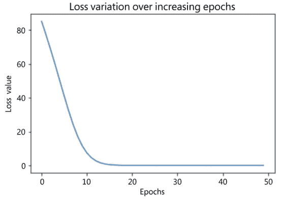
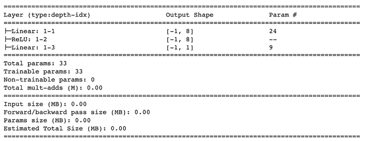
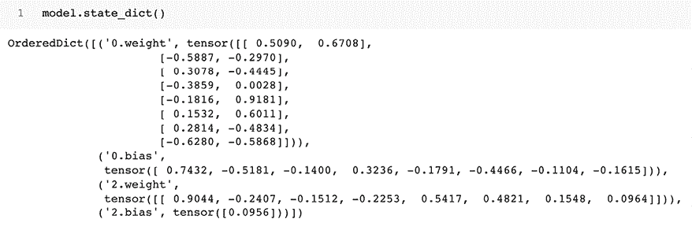

# 第二章：PyTorch 基础知识

在上一章中，我们学习了神经网络的基本构建模块，并且在 Python 中从头开始实现了前向传播和反向传播。

在本章中，我们将深入探讨使用 PyTorch 构建神经网络的基础知识，在后续章节中，当我们学习图像分析的各种用例时，将多次利用这些知识。我们将首先学习 PyTorch 工作的核心数据类型——张量对象。然后，我们将深入探讨可以在张量对象上执行的各种操作，以及在构建神经网络模型时如何利用它们，这是在一个玩具数据集上（在我们逐步查看更现实的数据集之前，从下一章开始）加强我们的理解。这将使我们能够理解如何使用 PyTorch 构建神经网络模型以映射输入和输出值。最后，我们将学习如何实现自定义损失函数，以便根据我们解决的用例定制它们。

具体而言，本章将涵盖以下主题：

+   安装 PyTorch

+   PyTorch 张量

+   使用 PyTorch 构建神经网络

+   使用顺序方法构建神经网络

+   保存和加载 PyTorch 模型

本书的 GitHub 仓库的 `Chapter02` 文件夹中提供了本章中的所有代码的参考：[`bit.ly/mcvp-2e`](https://bit.ly/mcvp-2e)。

# 安装 PyTorch

PyTorch 提供了多个功能，有助于构建神经网络——使用高级方法抽象各种组件，并且还提供了利用 GPU 加速训练神经网络的张量对象。

在安装 PyTorch 之前，我们首先需要确保已安装 Python。

接下来，我们将安装 PyTorch，这相当简单：

1.  访问 [`pytorch.org/`](https://pytorch.org/) 网站上的 **QUICK START LOCALLY** 部分，并选择您的操作系统 (**Your OS**)，**Conda** 作为 **Package**，**Python** 作为 **Language**，以及 **CPU** 作为 **Compute Platform**。如果您有 CUDA 库，可以选择适当的版本：



图 2.1：安装 PyTorch

这将提示您在终端中运行命令，例如 `conda install pytorch torchvision torchaudio pytorch-cuda=12.1 -c pytorch -c nvidia`。

1.  在命令提示符/终端中运行命令，让 Anaconda 安装 PyTorch 和必要的依赖项。

如果您拥有 NVIDIA 显卡作为硬件组件，强烈建议安装 CUDA 驱动程序，这将大幅加速深度学习训练。有关如何安装 CUDA 驱动程序的说明，请参阅本书的 GitHub 仓库中的 *附录*。安装完毕后，您可以选择 **12.1** 作为 CUDA 版本，并使用该命令安装 PyTorch。

1.  您可以在命令提示符/终端中执行`python`，然后输入以下内容以验证 PyTorch 确实已安装：

    ```py
    >>> import torch
    >>> print(torch.__version__) 
    ```

    本书中的所有代码都可以在 Google Colab 中执行：[`colab.research.google.com/`](https://colab.research.google.com/)。Python 和 PyTorch 在 Google Colab 中默认可用。我们强烈建议您在 Colab 中执行所有代码 – 这还包括免费访问 GPU！感谢 Google 提供了这样一个出色的资源！

因此，我们已经成功安装了 PyTorch。现在我们将在 Python 中执行一些基本的张量操作，帮助您掌握相关内容。

# PyTorch 张量

张量是 PyTorch 的基本数据类型。张量是类似于 NumPy 的 ndarray 的多维矩阵：

1.  标量可以表示为零维张量。

1.  向量可以表示为一维张量。

1.  二维矩阵可以表示为二维张量。

1.  多维矩阵可以表示为多维张量。

在图表中，张量如下所示：

图 2.2：张量表示

例如，我们可以将彩色图像视为像素值的三维张量，因为彩色图像由`height x width x 3`个像素组成 – 其中三个通道对应 RGB 通道。类似地，灰度图像可以被视为二维张量，因为它由`height x width`个像素组成。

通过本节末尾，我们将学习张量为何有用，如何初始化它们，以及如何在张量之上执行各种操作。这将为我们后面在本章中利用张量构建神经网络模型打下基础。

## 初始化张量

张量在多种情况下都很有用。除了将它们作为图像的基本数据结构使用外，它们还在连接神经网络不同层的权重时发挥了更显著的作用。在本节中，我们将练习初始化张量对象的不同方法：

本书的`Chapter02`文件夹中的`Initializing_a_tensor.ipynb`文件中可以找到以下代码：[`bit.ly/mcvp-2e`](https://bit.ly/mcvp-2e)。

1.  导入 PyTorch 并通过在列表上调用`torch.tensor`来初始化一个张量：

    ```py
    import torch
    x = torch.tensor([[1,2]])
    y = torch.tensor([[1],[2]]) 
    ```

1.  接下来，访问张量对象的形状和数据类型：

    ```py
    print(x.shape)
    # torch.Size([1,2]) # one entity of two items
    print(y.shape)
    # torch.Size([2,1]) # two entities of one item each
    print(x.dtype)
    # torch.int64 
    ```

    张量中所有元素的数据类型都是相同的。这意味着如果一个张量包含不同数据类型的数据（例如布尔值、整数和浮点数），整个张量将被强制转换为最通用的数据类型：

    ```py
    x = torch.tensor([False, 1, 2.0])
    print(x)
    # tensor([0., 1., 2.]) 
    ```

    正如您在前面代码的输出中看到的那样，布尔值`False`和整数`1`被转换为浮点数。

    或者，与 NumPy 类似，我们可以使用内置函数初始化张量对象。请注意，我们现在描绘的张量和神经网络权重之间的类比现在变得明显 - 我们正在初始化张量以表示神经网络的权重初始化。

1.  生成一个由三行四列填充为 0 的张量对象：

    ```py
    torch.zeros((3, 4)) 
    ```

1.  生成一个由三行四列填充为 1 的张量对象：

    ```py
    torch.ones((3, 4)) 
    ```

1.  生成三行四列的数值，其取值范围在 0 到 10 之间（包括低值但不包括高值）：

    ```py
    torch.randint(low=0, high=10, size=(3,4)) 
    ```

1.  生成三行四列的随机数，取值范围在 0 到 1 之间：

    ```py
    torch.rand(3, 4) 
    ```

1.  生成遵循正态分布的数值，有三行四列：

    ```py
    torch.randn((3,4)) 
    ```

1.  最后，我们可以直接使用`torch.tensor(<numpy-array>)`将 NumPy 数组转换为 Torch 张量：

    ```py
    x = np.array([[10,20,30],[2,3,4]])
    y = torch.tensor(x)
    print(type(x), type(y))
    # <class 'numpy.ndarray'> <class 'torch.Tensor'> 
    ```

现在我们已经了解了如何初始化张量对象，接下来我们将学习如何在其上执行各种矩阵操作。

## 张量的操作

与 NumPy 类似，您可以对张量对象执行各种基本操作。神经网络操作的类比包括将输入与权重进行矩阵乘法、加上偏差项以及在需要时重新塑造输入或权重值。每个操作以及其他操作如下执行：

可以在本书的 GitHub 代码库的`Chapter02`文件夹中的`Operations_on_tensors.ipynb`文件中找到以下代码：[`bit.ly/mcvp-2e`](https://bit.ly/mcvp-2e)。

+   将`x`中所有元素乘以`10`可以通过以下代码执行：

    ```py
    import torch
    x = torch.tensor([[1,2,3,4], [5,6,7,8]]) 
    print(x * 10)
    # tensor([[10, 20, 30, 40],
    #        [50, 60, 70, 80]]) 
    ```

+   将`x`中的元素加`10`并将结果张量存储在`y`中的操作可以通过以下代码实现：

    ```py
    x = torch.tensor([[1,2,3,4], [5,6,7,8]]) 
    y = x.add(10)
    print(y)
    # tensor([[11, 12, 13, 14],
    #         [15, 16, 17, 18]]) 
    ```

+   可以通过以下代码执行张量的重新塑形：

    ```py
    y = torch.tensor([2, 3, 1, 0]) 
    # y.shape == (4)
    y = y.view(4,1)                
    # y.shape == (4, 1) 
    ```

+   另一种重新塑形张量的方法是使用`squeeze`方法，我们提供要移除的轴索引。请注意，仅当要移除的轴在该维度中只有一个项目时才适用：

    ```py
    x = torch.randn(10,1,10)
    z1 = torch.squeeze(x, 1) # similar to np.squeeze()
    # The same operation can be directly performed on
    # x by calling squeeze and the dimension to squeeze out
    z2 = x.squeeze(1)
    assert torch.all(z1 == z2) 
    # all the elements in both tensors are equal
    print('Squeeze:\n', x.shape, z1.shape)
    # Squeeze: torch.Size([10, 1, 10]) torch.Size([10, 10]) 
    ```

+   `squeeze`的相反操作是`unsqueeze`，意味着我们向矩阵中添加一个维度，可以通过以下代码执行：

    ```py
    x = torch.randn(10,10)
    print(x.shape)
    # torch.size(10,10)
    z1 = x.unsqueeze(0)
    print(z1.shape)
    # torch.size(1,10,10)
    # The same can be achieved using [None] indexing
    # Adding None will auto create a fake dim 
    # at the specified axis
    x = torch.randn(10,10)
    z2, z3, z4 = x[None], x[:,None], x[:,:,None]
    print(z2.shape, z3.shape, z4.shape)
    # torch.Size([1, 10, 10]) 
    # torch.Size([10, 1, 10]) 
    # torch.Size([10, 10, 1]) 
    ```

在索引中使用`None`是一种添加维度的巧妙方式，如所示，将经常在本书中用于创建假通道/批量维度。

+   可以通过以下代码执行两个不同张量的矩阵乘法：

    ```py
    x = torch.tensor([[1,2,3,4], [5,6,7,8]])
    print(torch.matmul(x, y))
    # tensor([[11],
    #         [35]]) 
    ```

+   或者，也可以使用`@`运算符执行矩阵乘法：

    ```py
    print(x@y)
    # tensor([[11],
    #  [35]]) 
    ```

+   与 NumPy 中的`concatenate`类似，我们可以使用`cat`方法对张量进行连接：

    ```py
    import torch
    x = torch.randn(10,10,10)
    z = torch.cat([x,x], axis=0) # np.concatenate()
    print('Cat axis 0:', x.shape, z.shape)
    # Cat axis 0:  torch.Size([10, 10, 10]) 
    # torch.Size([20, 10, 10])
    z = torch.cat([x,x], axis=1) # np.concatenate()
    print('Cat axis 1:', x.shape, z.shape)
    # Cat axis 1: torch.Size([10, 10, 10]) 
    # torch.Size([10, 20, 10]) 
    ```

+   通过以下代码可以提取张量中的最大值：

    ```py
    x = torch.arange(25).reshape(5,5)
    print('Max:', x.shape, x.max()) 
    # Max:  torch.Size([5, 5]) tensor(24) 
    ```

+   我们可以提取最大值以及最大值所在的行索引：

    ```py
    x.max(dim=0)
    # torch.return_types.max(values=tensor([20, 21, 22, 23, 24]), 
    # indices=tensor([4, 4, 4, 4, 4])) 
    ```

    请注意，在上述输出中，我们获取维度`0`（即张量的行）上的最大值。因此，所有行的最大值是第 4 个索引处的值，因此`indices`输出也全为四。此外，`.max`返回最大值及其位置（`argmax`）。

    类似地，当获取跨列的最大值时，输出如下：

    ```py
    m, argm = x.max(dim=1) 
    print('Max in axis 1:\n', m, argm) 
    # Max in axis 1: tensor([ 4, 9, 14, 19, 24]) 
    # tensor([4, 4, 4, 4, 4]) 
    ```

    `min`操作与`max`完全相同，但在适用时返回最小值和最小位置。

+   重新排列张量对象的维度：

    ```py
    x = torch.randn(10,20,30)
    z = x.permute(2,0,1) # np.permute()
    print('Permute dimensions:', x.shape, z.shape)
    # Permute dimensions:  torch.Size([10, 20, 30]) 
    # torch.Size([30, 10, 20]) 
    ```

请注意，当我们在原始张量上执行置换时，张量的形状会发生变化。

永远不要重新形状（即在`tensor.view`上使用），以交换维度。即使 Torch 不会报错，这也是错误的，并且会在训练期间产生意想不到的结果。如果需要交换维度，请始终使用 permute。

由于在本书中涵盖所有可用操作很困难，重要的是要知道您几乎可以用与 NumPy 几乎相同的语法在 PyTorch 中执行几乎所有 NumPy 操作。标准的数学运算，如`abs`、`add`、`argsort`、`ceil`、`floor`、`sin`、`cos`、`tan`、`cumsum`、`cumprod`、`diag`、`eig`、`exp`、`log`、`log2`、`log10`、`mean`、`median`、`mode`、`resize`、`round`、`sigmoid`、`softmax`、`square`、`sqrt`、`svd`和`transpose`等等，可以直接在具有或不具有适用轴的任何张量上调用。您可以随时运行`dir(torch.Tensor)`来查看 Torch 张量的所有可能方法，并运行`help(torch.Tensor.<method>)`以查看该方法的官方帮助和文档。

接下来，我们将学习如何利用张量在数据上执行梯度计算，这是神经网络中反向传播的关键方面。

## 张量对象的自动梯度

正如我们在前一章中看到的，微分和计算梯度在更新神经网络的权重中起着至关重要的作用。 PyTorch 的张量对象具有内置功能来计算梯度。

您可以在本书 GitHub 存储库的`Chapter02`文件夹中的`Auto_gradient_of_tensors.ipynb`文件中找到以下代码：[`bit.ly/mcvp-2e`](https://bit.ly/mcvp-2e)。

在本节中，我们将了解如何使用 PyTorch 计算张量对象的梯度：

1.  定义一个张量对象，并指定需要计算梯度：

    ```py
    import torch
    x = torch.tensor([[2., -1.], [1., 1.]], requires_grad=True)
    print(x) 
    ```

在上述代码中，`requires_grad`参数指定要为张量对象计算梯度。

1.  接下来，定义计算输出的方式，这在本例中是所有输入平方和的总和：

    这在代码中用以下行表示：

    ```py
    out = x.pow(2).sum() 
    ```

    我们知道前述函数的梯度是*2*x*。让我们使用 PyTorch 提供的内置函数来验证这一点。

1.  可通过调用 `backward()` 方法计算变量的梯度。在我们的情况下，我们计算梯度 - 输出 `out` 对输入 `x` 的微小变化的影响 - 如下所示：

    ```py
    out.backward() 
    ```

1.  现在，我们可以获取相对于 `x` 的 `out` 的梯度如下：

    ```py
    x.grad 
    ```

    这将产生以下输出：

    ```py
    # tensor([[4., -2.],
    #         [2., 2.]]) 
    ```

注意，先前获得的梯度与直观梯度值（即 *x* 的两倍）匹配。

作为练习，在 *第一章* 的 `Chain rule.ipynb` 中尝试重新创建此场景，并使用 PyTorch 计算梯度。在进行前向传播后进行单次更新后，验证更新的权重是否与我们在笔记本中计算的相匹配。

到目前为止，我们已经学习了在张量对象的顶部初始化、操作和计算梯度，这些构成神经网络的基本构建模块。除了计算自动梯度外，还可以使用 NumPy 数组进行初始化和操作数据。这要求我们理解为什么在构建神经网络时应使用张量对象而不是 NumPy 数组的原因，我们将在下一节中详细介绍。

## PyTorch 张量相对于 NumPy 的 ndarray 的优势

在前一章中，我们看到在计算最优权重值时，我们通过微小变化每个权重，并理解其对减少总体损失值的影响。请注意，基于一个权重更新的损失计算不会影响同一迭代中其他权重更新的损失计算。因此，如果每个权重更新由不同的核并行进行而不是顺序更新权重，则可以优化此过程。在这种情况下，GPU 非常有用，因为它在核心数量上比 CPU 多得多（一般情况下，CPU 可能有 <=64 核）。

与 NumPy 相比，Torch 张量对象被优化以在 GPU 上工作。为了进一步理解这一点，让我们进行一个小实验，在这个实验中，我们在一个场景中使用 NumPy 数组进行矩阵乘法操作，而在另一个场景中使用张量对象，并比较执行矩阵乘法所需的时间：

可在本书 GitHub 存储库的 `Chapter02` 文件夹中的 `Numpy_Vs_Torch_object_computation_speed_comparison.ipynb` 文件中找到以下代码：[`bit.ly/mcvp-2e`](https://bit.ly/mcvp-2e)。

1.  生成两个不同的 `torch` 对象：

    ```py
    import torch
    x = torch.rand(1, 6400)
    y = torch.rand(6400, 5000) 
    ```

1.  定义我们将在 *步骤 1* 中创建的张量对象存储到的设备：

    ```py
    device = 'cuda' if torch.cuda.is_available() else 'cpu' 
    ```

请注意，如果您没有 GPU 设备，设备将是 `cpu`（此外，当使用 CPU 时，您不会注意到执行所需的时间差异很大）。

1.  注册在 *步骤 1* 中创建的张量对象到设备上（注册张量对象意味着将信息存储在设备中）：

    ```py
    x, y = x.to(device), y.to(device) 
    ```

1.  在 Torch 对象上执行矩阵乘法，并计时以便我们可以将其与在 NumPy 数组上执行矩阵乘法的速度进行比较：

    ```py
    %timeit z=(x@y)
    # It takes 0.515 milli seconds on an average to 
    # perform matrix multiplication 
    ```

1.  在`cpu`上执行相同张量的矩阵乘法：

    ```py
    x, y = x.cpu(), y.cpu()
    %timeit z=(x@y)
    # It takes 9 milli seconds on an average to 
    # perform matrix multiplication 
    ```

1.  执行相同的矩阵乘法，这次在 NumPy 数组上进行：

    ```py
    import numpy as np
    x = np.random.random((1, 6400))
    y = np.random.random((6400, 5000))
    %timeit z = np.matmul(x,y)
    # It takes 19 milli seconds on an average to 
    # perform matrix multiplication 
    ```

您将注意到，在 GPU 上执行的 Torch 对象的矩阵乘法比在 CPU 上快约 18 倍，并且比在 NumPy 数组上执行的矩阵乘法快约 40 倍。通常情况下，使用 Torch 张量在 CPU 上进行的`matmul`仍然比 NumPy 快。请注意，只有当您拥有 GPU 设备时，才能注意到这种速度增加。如果您在 CPU 设备上工作，您将不会注意到这种显著的速度增加。这就是为什么如果您没有 GPU，我们建议使用 Google Colab 笔记本，因为该服务提供免费的 GPU。

现在我们已经学会了如何在神经网络的各个组件/操作中利用张量对象，并且了解了如何使用 GPU 加速计算，接下来我们将学习将所有这些放在一起使用 PyTorch 构建神经网络。

# 使用 PyTorch 构建神经网络

在前一章中，我们学习了如何从头开始构建神经网络，其中神经网络的组件如下：

+   隐藏层的数量

+   隐藏层中的单元数

+   各层执行的激活函数

+   我们试图优化的损失函数

+   与神经网络相关联的学习率

+   用于构建神经网络的数据批量大小

+   正向传播和反向传播的时期数量

然而，所有这些都是使用 Python 中的 NumPy 数组从头构建的。在本节中，我们将学习如何在玩具数据集上使用 PyTorch 来实现所有这些。请注意，我们将利用迄今为止关于初始化张量对象、在其上执行各种操作以及计算梯度值以在构建神经网络时更新权重的学习。

为了学会直观地执行各种操作，我们将在本章节的玩具数据集上构建一个神经网络。但从下一章开始，我们将处理更现实的问题和数据集。

我们将解决一个简单的添加两个数字的玩具问题，以便理解使用 PyTorch 实现神经网络的方法，其中我们初始化数据集如下：

在本书的 GitHub 存储库的`Chapter02`文件夹中的`Building_a_neural_network_using_PyTorch_on_a_toy_dataset.ipynb`文件中可以找到以下代码，网址为[`bit.ly/mcvp-2e`](https://bit.ly/mcvp-2e)。

1.  定义输入(`x`)和输出(`y`)的值：

    ```py
    import torch
    x = [[1,2],[3,4],[5,6],[7,8]]
    y = [[3],[7],[11],[15]] 
    ```

请注意，在前面的输入和输出变量初始化中，输入和输出都是一个列表的列表，其中输入列表中的值的和是输出列表中的值。

1.  将输入列表转换为张量对象：

    ```py
    X = torch.tensor(x).float()
    Y = torch.tensor(y).float() 
    ```

    正如您所见，我们已将张量对象转换为浮点对象。将张量对象作为浮点数或长整数是一个好习惯，因为它们最终将乘以小数值（权重）。

    此外，我们将输入（`X`）和输出（`Y`）数据点注册到设备 - 如果您有 GPU，则为`cuda`，如果您没有 GPU，则为`cpu`：

    ```py
    device = 'cuda' if torch.cuda.is_available() else 'cpu'
    X = X.to(device)
    Y = Y.to(device) 
    ```

1.  定义神经网络架构：

    1.  `torch.nn`模块包含有助于构建神经网络模型的函数：

    ```py
    import torch.nn as nn 
    ```

    1.  我们将创建一个类（`MyNeuralNet`），该类可以组合我们的神经网络架构。在创建模型架构时，强制性继承`nn.Module`作为所有神经网络模块的基类：

    ```py
    class MyNeuralNet(nn.Module): 
    ```

    1.  在类内部，我们使用`__init__`方法初始化了神经网络的所有组件。我们应该调用`super().__init__()`以确保该类继承自`nn.Module`：

    ```py
     def __init__(self):
            super().__init__() 
    ```

    1.  在上述代码中，通过指定`super().__init__()`，我们现在能够利用为`nn.Module`编写的所有预构建功能。将在`init`方法中初始化的组件将在`MyNeuralNet`类的不同方法中使用。

    1.  定义神经网络中的层：

    ```py
     self.input_to_hidden_layer = nn.Linear(2,8)
            self.hidden_layer_activation = nn.ReLU()
            self.hidden_to_output_layer = nn.Linear(8,1) 
    ```

    1.  在前面的代码行中，我们指定了神经网络的所有层 - 一个线性层（`self.input_to_hidden_layer`），然后是 ReLU 激活（`self.hidden_layer_activation`），最后是线性层（`self.hidden_to_output_layer`）。目前，层数和激活的选择是任意的。在下一章中，我们将更详细地学习层中单位数量和层激活的影响。

    1.  接下来，让我们通过打印`nn.Linear`方法的输出来理解上述代码中的函数在做什么：

    ```py
    **# NOTE - This line of code is not a part of model building,** 
    **# this is used only for illustration of Linear method**
    print(nn.Linear(2, 7))
    Linear(in_features=2, out_features=7, bias=True) 
    ```

    1.  在前面的代码中，线性方法接受两个值作为输入并输出七个值，并且还有一个与之相关的偏差参数。此外，`nn.ReLU()`调用了 ReLU 激活函数，然后可以在其他方法中使用。

    1.  以下是一些其他常用的激活函数：

    +   Sigmoid

    +   Softmax

    +   Tanh

    1.  现在我们已经定义了神经网络的组件，让我们在定义网络的前向传播时将这些组件连接在一起：

    ```py
     def forward(self, x):
            x = self.input_to_hidden_layer(x)
            x = self.hidden_layer_activation(x)
            x = self.hidden_to_output_layer(x)
            return x 
    ```

使用`forward`作为函数名称是强制性的，因为 PyTorch 已将此函数保留为执行前向传播的方法。使用其他任何名称将引发错误。

1.  到目前为止，我们已经建立了模型架构；让我们在下一步中检查随机初始化的权重值。

1.  您可以通过执行以下步骤访问每个组件的初始权重：

    1.  创建`MyNeuralNet`类对象的实例，并将其注册到`device`：

    ```py
    mynet = MyNeuralNet().to(device) 
    ```

    1.  可以通过指定以下内容访问每层的权重和偏差：

    ```py
    # NOTE - This line of code is not a part of model building, 
    # this is used only for illustration of 
    # how to obtain parameters of a given layer
    mynet.input_to_hidden_layer.weight 
    ```

    1.  上述代码的输出如下所示：

        图 2.3：输入层与隐藏层之间连接的权重值

由于神经网络每次以随机值初始化，因此输出的值将与前值不同。如果希望在多次迭代执行代码时保持相同值，需要在创建类对象实例之前使用 Torch 的`manual_seed`方法指定种子，如`torch.manual_seed(0)`。

1.  所有神经网络的参数可以通过以下代码获取：

1.  ```py
    # NOTE - This line of code is not a part of model building, 
    # this is used only for illustration of 
    # how to obtain parameters of all layers in a model
    mynet.parameters() 
    ```

1.  上述代码返回一个生成器对象。

1.  最后，通过以下方式循环生成器以获取参数：

1.  ```py
    # NOTE - This line of code is not a part of model building, 
    # this is used only for illustration of how to 
    # obtain parameters of all layers in a model 
    # by looping through the generator object
    for par in mynet.parameters():
        print(par) 
    ```

1.  上述代码将导致以下输出：

图 2.4：权重和偏置值

当在`__init__`方法中定义任何`nn`层时，模型已将这些张量注册为特殊对象，必要时用于跟踪前向和反向传播。它将自动创建相应的张量并同时注册它们。您还可以使用`nn.Parameter(<tensor>)`函数手动注册这些参数。因此，以下代码等效于我们之前定义的神经网络类。

1.  使用`nn.Parameter`函数定义模型的另一种方式如下：

1.  ```py
    # for illustration only
    class MyNeuralNet(nn.Module):
         def __init__(self):
            super().__init__()
            self.input_to_hidden_layer = nn.Parameter(torch.rand(2,8))
            self.hidden_layer_activation = nn.ReLU()
            self.hidden_to_output_layer = nn.Parameter(torch.rand(8,1))
         def forward(self, x):
            x = x @ self.input_to_hidden_layer
            x = self.hidden_layer_activation(x)
            x = x @ self.hidden_to_output_layer
            return x 
    ```

1.  定义我们优化的损失函数。考虑到我们在预测连续输出，我们将优化均方误差：

    ```py
    loss_func = nn.MSELoss() 
    ```

其他显著的损失函数如下：

+   `CrossEntropyLoss`（用于多项分类）

+   `BCELoss`（用于二元分类的二元交叉熵损失）

+   通过将输入值传递给`neuralnet`对象，然后计算给定输入的`MSELoss`，可以计算神经网络的损失值：

1.  ```py
    _Y = mynet(X)
    loss_value = loss_func(_Y,Y)
    print(loss_value)
    # tensor(91.5550, grad_fn=<MseLossBackward>)
    # Note that loss value can differ in your instance 
    # due to a different random weight initialization 
    ```

在上述代码中，`mynet(X)`计算输入通过神经网络时的输出值。此外，`loss_func`函数计算神经网络预测（`_Y`）和实际值（`Y`）之间的`MSELoss`值。

作为惯例，在本书中，我们将使用`_<variable>`来关联与真实值`<variable>`对应的预测。在此`<variable>`之上是`Y`。

还要注意，在计算损失时，我们始终先发送预测值，然后是真实值。这是 PyTorch 的惯例。

现在我们已定义了损失函数，接下来我们将定义优化器，以尝试减少损失值。优化器的输入将是与神经网络相对应的参数（权重和偏置）以及在更新权重时的学习率。

对于这个示例，我们将考虑随机梯度下降（在下一章中将会更多地讨论不同的优化器和学习率的影响）。

1.  从 `torch.optim` 模块中导入 `SGD` 方法，然后将神经网络对象（`mynet`）和学习率（`lr`）作为参数传递给 `SGD` 方法：

    ```py
    from torch.optim import SGD
    opt = SGD(mynet.parameters(), lr = 0.001) 
    ```

1.  将一个 epoch 中要完成的所有步骤一起执行：

    1.  计算给定输入和输出对应的损失值。

    1.  计算每个参数对应的梯度。

    1.  根据学习率和每个参数的梯度更新参数值。

    1.  更新权重后，请确保在计算下一个 epoch 中的梯度之前刷新在上一步中计算的梯度：

    ```py
    **# NOTE - This line of code is not a part of model building,** 
    **# this is used only for illustration of how we perform** 
    opt.zero_grad() # flush the previous epoch's gradients
    loss_value = loss_func(mynet(X),Y) # compute loss
    loss_value.backward() # perform backpropagation
    opt.step() # update the weights according to the #gradients computed 
    ```

    1.  使用 `for` 循环重复前述步骤的次数等于 epoch 的数量。在以下示例中，我们执行了总共 50 个 epoch 的权重更新过程。此外，我们将每个 epoch 中的损失值存储在列表 `loss_history` 中：

    ```py
    loss_history = []
    for _ in range(50):
        opt.zero_grad()
        loss_value = loss_func(mynet(X),Y)
        loss_value.backward()
        opt.step()
        loss_history.append(loss_value.item()) 
    ```

    1.  让我们绘制损失随着 epoch 增加的变化（正如我们在前一章中看到的，我们以使整体损失值随 epoch 增加而减少的方式更新权重）：

    ```py
    import matplotlib.pyplot as plt
    %matplotlib inline
    plt.plot(loss_history)
    plt.title('Loss variation over increasing epochs')
    plt.xlabel('epochs')
    plt.ylabel('loss value') 
    ```

    上述代码导致以下图表：

图 2.5：随着 epoch 增加的损失变化

请注意，正如预期的那样，损失值随着 epoch 的增加而减少。

到目前为止，在本节中，我们通过基于输入数据集中提供的所有数据点计算损失来更新神经网络的权重。在接下来的部分，我们将了解每次权重更新时仅使用部分输入数据点的优势。

## 数据集、数据加载器和批大小

神经网络中一个尚未考虑的超参数是批大小（batch size）。批大小指的是用于计算损失值或更新权重的数据点数量。

这个特别的超参数在有数百万数据点的情况下特别有用，在这种情况下，使用所有数据点来更新权重的一个实例并不是最佳选择，因为内存无法容纳如此多的信息。此外，样本可能足够代表数据。批大小有助于确保我们获取足够代表性的多个数据样本，但不一定是总数据的 100%代表性。

在本节中，我们将提出一种方法来指定在计算权重梯度和更新权重时要考虑的批大小，这些权重进而用于计算更新后的损失值：

您可以在本书 GitHub 存储库的 `Chapter02` 文件夹中的 `Specifying_batch_size_while_training_a_model.ipynb` 文件中找到以下代码：[`bit.ly/mcvp-2e`](https://bit.ly/mcvp-2e)。

1.  导入帮助加载数据和处理数据集的方法：

    ```py
    from torch.utils.data import Dataset, DataLoader
    import torch
    import torch.nn as nn 
    ```

1.  导入数据，将其转换为浮点数，并将其注册到设备上：

    1.  提供要处理的数据点：

    ```py
    x = [[1,2],[3,4],[5,6],[7,8]]
    y = [[3],[7],[11],[15]] 
    ```

    1.  将数据转换为浮点数：

    ```py
    X = torch.tensor(x).float()
    Y = torch.tensor(y).float() 
    ```

    1.  将数据注册到设备上 - 鉴于我们使用的是 GPU，我们指定设备为`'cuda'`。如果您使用 CPU，请将设备指定为`'cpu'`：

    ```py
    device = 'cuda' if torch.cuda.is_available() else 'cpu'
    X = X.to(device)
    Y = Y.to(device) 
    ```

1.  实例化数据集的类 - `MyDataset`：

    ```py
    class MyDataset(Dataset): 
    ```

在`MyDataset`类内部，我们存储信息以逐个获取数据点，以便将一批数据点捆绑在一起（使用`DataLoader`），然后通过一次前向传播和一次反向传播来更新权重：

1.  定义一个`__init__`方法，该方法接受输入和输出对，并将它们转换为 Torch 浮点对象：

    ```py
     def __init__(self,x,y):
            self.x = torch.tensor(x).float()
            self.y = torch.tensor(y).float() 
    ```

1.  指定输入数据集的长度（`__len__`），以便类知道输入数据集中存在的数据点数量：

    ```py
     def __len__(self):
            return len(self.x) 
    ```

1.  最后，使用`__getitem__`方法获取特定的行：

    ```py
     def __getitem__(self, ix):
            return self.x[ix], self.y[ix] 
    ```

在前面的代码中，`ix`指的是要从数据集中获取的行的索引，该索引将是 0 到数据集长度之间的整数。

1.  创建已定义类的实例：

    ```py
    ds = MyDataset(X, Y) 
    ```

1.  将之前定义的数据集实例通过`DataLoader`传递，以获取原始输入和输出张量对象中的`batch_size`数量的数据点：

    ```py
    dl = DataLoader(ds, batch_size=2, shuffle=True) 
    ```

    此外，在前面的代码中，我们还指定从原始输入数据集（`ds`）中获取两个数据点的随机样本（通过设置`shuffle=True`）以及指定批次大小为`2`。

    要从`dl`中获取批次数据，我们需要遍历它：

    ```py
    # NOTE - This line of code is not a part of model building, 
    # this is used only for illustration of 
    # how to print the input and output batches of data
    for x,y in dl:
        print(x,y) 
    ```

    这将导致以下输出：

    ```py
    tensor([[1., 2.],
            [3., 4.]]) tensor([[3.], [7.]])
    tensor([[5., 6.],
            [7., 8.]]) tensor([[1.], [15.]]) 
    ```

    在前面的代码中，由于原始数据集中有四个数据点，而指定的批次大小为`2`，因此导致了两组输入输出对。

1.  现在，我们定义在前一节中定义的神经网络类：

    ```py
    class MyNeuralNet(nn.Module):
        def __init__(self):
            super().__init__()
            self.input_to_hidden_layer = nn.Linear(2,8)
            self.hidden_layer_activation = nn.ReLU()
            self.hidden_to_output_layer = nn.Linear(8,1)
        def forward(self, x):
            x = self.input_to_hidden_layer(x)
            x = self.hidden_layer_activation(x)
            x = self.hidden_to_output_layer(x)
            return x 
    ```

1.  接下来，我们定义模型对象（`mynet`），损失函数（`loss_func`）和优化器（`opt`），如前一节所定义的：

    ```py
    mynet = MyNeuralNet().to(device)
    loss_func = nn.MSELoss()
    from torch.optim import SGD
    opt = SGD(mynet.parameters(), lr = 0.001) 
    ```

1.  最后，遍历数据点批次以最小化损失值，就像我们在前一节中的*步骤 6*中所做的一样：

    ```py
    import time
    loss_history = []
    start = time.time()
    for _ in range(50):
        for data in dl:
            x, y = data
            opt.zero_grad()
            loss_value = loss_func(mynet(x),y)
            loss_value.backward()
            opt.step()
            loss_history.append(loss_value.item())
    end = time.time()
    print(end - start) 
    ```

尽管前面的代码看起来与我们在前一节中讨论过的代码非常相似，但是在每个 epoch 中，我们的权重更新次数是前一节中权重更新次数的两倍。本节中的批次大小为`2`，而前一节中的批次大小为`4`（总数据点数）。

## 对新数据点进行预测：

在前一节中，我们学习了如何在已知数据点上拟合模型。在本节中，我们将学习如何利用前一节中训练的`mynet`模型中定义的前向方法来预测未见数据点。我们将继续使用前一节中构建的代码：

1.  创建我们想要测试模型的数据点：

    ```py
    val_x = [[10,11]] 
    ```

注意，新数据集（`val_x`）也将是一个列表的列表，因为输入数据集是一个列表的列表。

1.  将新数据点转换为浮点张量对象并注册到设备上：

    ```py
    val_x = torch.tensor(val_x).float().to(device) 
    ```

1.  将张量对象通过已训练的神经网络`mynet`传递，就像它是一个 Python 函数一样。这与通过建立的模型进行前向传播是相同的：

    ```py
    mynet(val_x)
    # 20.99 
    ```

上述代码返回与输入数据点相关联的预测输出值。

到目前为止，我们已经能够训练我们的神经网络将输入映射到输出，通过执行反向传播来更新权重值以最小化损失值（使用预定义的损失函数计算）。

在接下来的部分，我们将学习如何构建我们自己的自定义损失函数，而不是使用预定义的损失函数。

## 实现自定义损失函数

在某些情况下，我们可能需要实现一个自定义损失函数，该函数根据我们解决的问题进行自定义，特别是涉及**目标检测/生成对抗网络（GANs）**的复杂用例。PyTorch 为我们提供了编写自定义函数来构建自定义损失函数的功能。

在本节中，我们将实现一个自定义损失函数，其功能与`nn.Module`中预先构建的`MSELoss`函数相同：

以下代码可以在本书的 GitHub 存储库的`Chapter02`文件夹中的`Implementing_custom_loss_function.ipynb`文件中找到，网址为[`bit.ly/mcvp-2e`](https://bit.ly/mcvp-2e)。

1.  导入数据，构建数据集和`DataLoader`，并定义一个神经网络，与上一节相同：

    ```py
    x = [[1,2],[3,4],[5,6],[7,8]]
    y = [[3],[7],[11],[15]]
    import torch
    X = torch.tensor(x).float()
    Y = torch.tensor(y).float()
    device = 'cuda' if torch.cuda.is_available() else 'cpu'
    X = X.to(device)
    Y = Y.to(device) 
    import torch.nn as nn
    from torch.utils.data import Dataset, DataLoader
    class MyDataset(Dataset):
        def __init__(self,x,y):
            self.x = torch.tensor(x).float()
            self.y = torch.tensor(y).float()
        def __len__(self):
            return len(self.x)
        def __getitem__(self, ix):
            return self.x[ix], self.y[ix]
    ds = MyDataset(X, Y)
    dl = DataLoader(ds, batch_size=2, shuffle=True)
    class MyNeuralNet(nn.Module):
        def __init__(self):
            super().__init__()
            self.input_to_hidden_layer = nn.Linear(2,8)
            self.hidden_layer_activation = nn.ReLU()
            self.hidden_to_output_layer = nn.Linear(8,1)
        def forward(self, x):
            x = self.input_to_hidden_layer(x)
            x = self.hidden_layer_activation(x)
            x = self.hidden_to_output_layer(x)
            return x
    mynet = MyNeuralNet().to(device) 
    ```

1.  通过取两个张量对象作为输入，获取它们的差异，对它们进行平方处理，然后返回两者之间平方差的均值来定义自定义损失函数：

    ```py
    def my_mean_squared_error(_y, y):
        loss = (_y-y)**2
        loss = loss.mean()
        return loss 
    ```

1.  对于在上一节中相同的输入和输出组合，使用`nn.MSELoss`来获取均方误差损失，如下所示：

    ```py
    loss_func = nn.MSELoss()
    loss_value = loss_func(mynet(X),Y)
    print(loss_value)
    # 92.7534 
    ```

1.  类似地，当我们在*步骤 2*中定义的函数中使用时，损失值的输出如下：

    ```py
    my_mean_squared_error(mynet(X),Y)
    # 92.7534 
    ```

注意结果匹配。我们使用了内置的`MSELoss`函数，并将其结果与我们构建的自定义函数进行了比较。我们可以根据我们解决的问题定义我们选择的自定义函数。

到目前为止，我们已经学会了计算最后一层的输出。迄今为止，中间层的值一直是一个黑盒子。在接下来的部分，我们将学习如何获取神经网络的中间层值。

## 获取中间层的值

在某些情况下，获取神经网络的中间层值非常有帮助（在我们讨论风格转移和迁移学习用例时将会详细介绍*第四章*和*第五章*）。

PyTorch 提供了两种方式来获取神经网络的中间值：

以下代码可以在本书的 GitHub 存储库的`Chapter02`文件夹中的`Fetching_values_of_intermediate_layers.ipynb`文件中找到，网址为[`bit.ly/mcvp-2e`](https://bit.ly/mcvp-2e)。

1.  一种方法是直接调用层，就像它们是函数一样。可以按如下方式完成：

    ```py
    input_to_hidden = mynet.input_to_hidden_layer(X)
    hidden_activation = mynet.hidden_layer_activation(input_to_hidden)
    print(hidden_activation) 
    ```

    请注意，在调用`hidden_layer_activation`层之前，我们必须先调用`input_to_hidden_layer`激活，因为`input_to_hidden_layer`的输出是`hidden_layer_activation`层的输入。

1.  另一种方法是通过指定我们在`forward`方法中想要查看的层来实现。

    让我们查看本章中我们一直在使用的模型的激活后的隐藏层值。

    虽然以下代码与我们在上一节中看到的代码相同，但我们确保`forward`方法不仅返回输出，还返回激活后的隐藏层值（`hidden2`）：

    ```py
    class NeuralNet(nn.Module):
        def __init__(self):
            super().__init__()
            self.input_to_hidden_layer = nn.Linear(2,8)
            self.hidden_layer_activation = nn.ReLU()
            self.hidden_to_output_layer = nn.Linear(8,1)
        def forward(self, x):
            hidden1 = self.input_to_hidden_layer(x)
            hidden2 = self.hidden_layer_activation(hidden1)
            output = self.hidden_to_output_layer(hidden2)
            return output, hidden2 
    ```

    现在，我们可以通过指定以下内容来访问隐藏层值：

    ```py
    mynet = NeuralNet().to(device)
    mynet(X)[1] 
    ```

请注意，`mynet`的第 0 个索引输出是我们定义的网络前向传播的最终输出，而第一个索引输出是激活后的隐藏层值。

# 使用序列方法构建神经网络

到目前为止，我们已经学习了如何使用神经网络类来实现神经网络，其中我们手动构建了每一层。然而，除非我们构建的是一个复杂的网络，否则构建神经网络架构的步骤是直接的，我们只需指定层和层堆叠的顺序。让我们继续学习一种简化定义神经网络架构的方法，使用`Sequential`类。

我们将执行与前几节相同的步骤，不同之处在于用于手动定义神经网络架构的类将替换为`Sequential`类，以创建神经网络架构。让我们为在本章中已经处理过的相同玩具数据编写网络代码：

以下代码在本书 GitHub 存储库的`Chapter02`文件夹中的`Sequential_method_to_build_a_neural_network.ipynb`中提供：[`bit.ly/mcvp-2e`](https://bit.ly/mcvp-2e)。

1.  定义玩具数据集：

    ```py
    x = [[1,2],[3,4],[5,6],[7,8]]
    y = [[3],[7],[11],[15]] 
    ```

1.  导入相关包并定义我们将在其上工作的设备：

    ```py
    import torch
    import torch.nn as nn
    import numpy as np
    from torch.utils.data import Dataset, DataLoader
    device = 'cuda' if torch.cuda.is_available() else 'cpu' 
    ```

1.  现在，我们定义数据集类（`MyDataset`）：

    ```py
    class MyDataset(Dataset):
        def __init__(self, x, y):
            self.x = torch.tensor(x).float().to(device)
            self.y = torch.tensor(y).float().to(device)
        def __getitem__(self, ix):
            return self.x[ix], self.y[ix]
        def __len__(self): 
            return len(self.x) 
    ```

1.  定义数据集（`ds`）和数据加载器（`dl`）对象：

    ```py
    ds = MyDataset(x, y)
    dl = DataLoader(ds, batch_size=2, shuffle=True) 
    ```

1.  使用`nn`包中可用的`Sequential`方法定义模型架构：

    ```py
    model = nn.Sequential(
                nn.Linear(2, 8),
                nn.ReLU(),
                nn.Linear(8, 1)
            ).to(device) 
    ```

请注意，在前述代码中，我们定义了与前几节中相同的网络架构，但我们的定义方式有所不同。`nn.Linear`接受二维输入，并为每个数据点输出八维输出。此外，`nn.ReLU`在八维输出上执行 ReLU 激活，最后，八维输入通过最终的`nn.Linear`层得到一维输出（在我们的情况下，这是两个输入相加的输出）。

1.  打印我们在*步骤 5*中定义的模型摘要：

    1.  安装并导入使我们能够打印模型摘要的包：

    ```py
    !pip install torch_summary
    from torchsummary import summary 
    ```

    1.  打印模型的摘要，该摘要期望模型的名称和模型的输入大小：

    ```py
    summary(model, torch.zeros(1,2)) 
    ```

    上述代码给出了以下输出：

    图 2.6：模型架构总结

第一层的输出形状是（-1, 8），其中 -1 表示可以有与批处理大小一样多的数据点，8 表示每个数据点我们有一个八维输出，从而导致形状为（批处理大小 x 8）的输出。对于接下来的两层，解释是类似的。

1.  接下来，我们定义损失函数（`loss_func`）和优化器（`opt`），并训练模型，就像我们在上一节中所做的那样。在这种情况下，我们不需要定义一个模型对象；在这种情况下，网络没有在类内定义：

    ```py
    loss_func = nn.MSELoss()
    from torch.optim import SGD
    opt = SGD(model.parameters(), lr = 0.001)
    import time
    loss_history = []
    start = time.time()
    for _ in range(50):
        for ix, iy in dl:
            opt.zero_grad()
            loss_value = loss_func(model(ix),iy)
            loss_value.backward()
            opt.step()
            loss_history.append(loss_value.item())
    end = time.time()
    print(end - start) 
    ```

1.  现在我们已经训练好了模型，我们可以在我们现在定义的验证数据集上预测值：

    1.  定义验证数据集：

    ```py
    val = [[8,9],[10,11],[1.5,2.5]] 
    ```

    1.  预测通过模型传递验证列表的输出（请注意，预期值是列表中每个列表的两个输入的总和）。根据数据集类的定义，我们首先将列表的列表转换为浮点数，然后将其转换为张量对象并注册到设备：

    ```py
    model(torch.tensor(val).float().to(device))
    # tensor([[16.9051], [20.8352], [ 4.0773]], 
    # device='cuda:0', grad_fn=<AddmmBackward>) 
    ```

上述代码的输出（如上面的注释所述）接近预期的输出（即输入值的总和）。

现在我们已经学会了利用顺序方法来定义和训练模型，让我们学习一下如何保存和加载模型以进行推理。

# 保存和加载 PyTorch 模型

在处理神经网络模型时的一个重要方面是在训练后保存并重新加载模型。想象一下，您必须从已经训练好的模型进行推理的场景。您将加载训练好的模型，而不是再次训练它。

下面的代码可以在本书 GitHub 仓库的 `Chapter02` 文件夹中的 `save_and_load_pytorch_model.ipynb` 文件中找到，链接为 [`bit.ly/mcvp-2e`](https://bit.ly/mcvp-2e)。

在讨论相关命令来完成这一点之前，以我们的案例为例，让我们了解完全定义神经网络的重要组件。我们需要以下内容：

+   每个张量（参数）都有一个唯一的名称（键）

+   将逻辑连接到网络中的每个张量中的一个或另一个

+   每个张量的值（权重/偏差值）

在定义期间的 `__init__` 阶段处理第一个点，而在 `forward` 方法定义期间处理第二个点。在 `__init__` 阶段，默认情况下，在张量中随机初始化值。但是我们想要的是加载训练模型时学到的一组特定权重（或值），并将每个值与特定名称关联起来。这是通过调用以下特殊方法获得的。

## 使用 state_dict

`model.state_dict()`命令是理解如何保存和加载 PyTorch 模型工作原理的根本。`model.state_dict()`中的字典对应于参数名称（键）和模型对应的值（权重和偏置值）。`state`指的是模型的当前快照（快照是每个张量的值集）。

它返回一个键和值的字典（`OrderedDict`）：

图 2.7：带有权重和偏置值的状态字典

键是模型层的名称，值对应于这些层的权重。

## 保存

运行`torch.save(model.state_dict(), 'mymodel.pth')`会将该模型以 Python 序列化格式保存在名为`mymodel.pth`的磁盘上。一个好的做法是在调用`torch.save`之前将模型转移到 CPU，因为这样会将张量保存为 CPU 张量而不是 CUDA 张量。这将有助于在加载模型到任何计算机上时，无论其是否具有 CUDA 功能。

我们使用以下代码保存模型：

```py
torch.save(model.to('cpu').state_dict(), 'mymodel.pth') 
```

## 加载

加载模型需要我们首先使用随机权重初始化模型，然后从`state_dict`中加载权重：

1.  使用与训练时使用的相同命令创建一个空模型：

    ```py
    model = nn.Sequential(
                nn.Linear(2, 8),
                nn.ReLU(),
                nn.Linear(8, 1)
            ).to(device) 
    ```

1.  从磁盘加载模型并反序列化以创建一个`orderedDict`值：

    ```py
    state_dict = torch.load('mymodel.pth') 
    ```

1.  将`state_dict`加载到`model`中，注册到`device`，并进行预测：

    ```py
    model.load_state_dict(state_dict)
    # <All keys matched successfully>
    model.to(device)
    model(torch.tensor(val).float().to(device)) 
    ```

如果所有权重名称都存在于模型中，则会收到所有键匹配的消息。这意味着我们可以在世界上的任何计算机上从磁盘加载我们的模型，以便所有目的。接下来，我们可以将模型注册到设备，并对新数据点进行推断。

或者，我们可以使用`torch.save(model, '<path>')`保存模型，并使用`torch.load('<path>')`加载模型。尽管这看起来步骤更少更方便，但不建议，且在神经网络版本/Python 版本更改时更不灵活，容易出错。虽然`torch.save(model.state_dict())`仅保存权重（即张量字典），`torch.save(model)`将同时保存 Python 类。这在加载时可能会导致 PyTorch/Python 版本不一致的问题。

# 总结

在本章中，我们学习了 PyTorch 的基础构建模块——张量对象——以及在其上执行各种操作。我们进一步构建了一个玩具数据集上的神经网络，首先构建了一个初始化前馈架构的类，通过指定批处理大小从数据集中获取数据点，并定义了损失函数和优化器，通过多个时期进行循环。最后，我们还学习了定义自定义损失函数以优化选择的指标，并利用顺序方法简化网络架构定义的过程。所有这些步骤构成了构建神经网络的基础，将在后续章节中多次应用于各种用例中。

通过掌握使用 PyTorch 构建神经网络的各种组件的知识，我们将继续进入下一章节，在该章节中，我们将学习处理图像数据集上神经网络超参数的各种实际方面。

# 问题

1.  在训练期间为什么要将整数输入转换为浮点数值？

1.  用于重新塑形张量对象的方法有哪些？

1.  使用张量对象比使用 NumPy 数组计算更快的原因是什么？

1.  在神经网络类中，初始化魔术函数包括哪些内容？

1.  在执行反向传播之前为什么要执行零梯度操作？

1.  哪些魔术函数构成数据集类？

1.  如何在新数据点上进行预测？

1.  如何获取神经网络中间层的值？

1.  `Sequential`方法如何帮助简化神经网络架构的定义？

1.  在更新`loss_history`时，我们附加`loss.item()`而不是`loss`。这样做有什么作用，为什么附加`loss.item()`而不只是`loss`很有用？

1.  使用`torch.save(model.state_dict())`的优势是什么？

# 在 Discord 上了解更多

加入我们社区的 Discord 空间，与作者和其他读者进行讨论：

[`packt.link/modcv`](https://packt.link/modcv)


