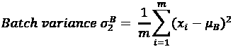
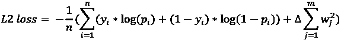

# 第三章：使用 PyTorch 构建深度神经网络

在前一章中，我们学习了如何使用 PyTorch 编写神经网络。我们还了解了神经网络中存在的各种超参数，如批量大小、学习率和损失优化器。在本章中，我们将转变方向，学习如何使用神经网络进行图像分类。基本上，我们将学习如何表示图像并调整神经网络的超参数以理解它们的影响。

为了不引入过多复杂性和混乱，我们仅在上一章中涵盖了神经网络的基本方面。但是，在训练网络时，我们调整的输入还有很多。通常，这些输入称为**超参数**。与神经网络中的*参数*（在训练过程中学习的）相反，超参数是由构建网络的人提供的。更改每个超参数的不同方面可能会影响训练神经网络的准确性或速度。此外，一些额外的技术，如缩放、批量归一化和正则化，有助于提高神经网络的性能。我们将在本章中学习这些概念。

但在此之前，我们将学习图像的表示方法：只有这样，我们才能深入探讨超参数的细节。在学习超参数影响时，我们将限制自己使用一个数据集：Fashion MNIST（有关数据集的详细信息可以在 [`github.com/zalandoresearch/fashion-mnist`](https://github.com/zalandoresearch/fashion-mnist) 找到），以便我们可以比较不同超参数变化对准确性的影响。通过这个数据集，我们还将介绍训练和验证数据的概念，以及为什么有两个单独的数据集是重要的。最后，我们将学习神经网络过拟合的概念，然后了解某些超参数如何帮助我们避免过拟合。

总之，在本章中，我们将涵盖以下主题：

+   表示图像

+   为何利用神经网络进行图像分析？

+   为图像分类准备数据

+   训练神经网络

+   缩放数据集以提高模型准确性

+   理解批量大小变化的影响

+   理解损失优化器变化的影响

+   理解学习率变化的影响

+   构建更深层次的神经网络

+   理解批量归一化的影响

+   过拟合的概念

让我们开始吧！

本章中的所有代码可以在本书 GitHub 仓库的 `Chapter03` 文件夹中查阅，链接为 [`bit.ly/mcvp-2e`](https://bit.ly/mcvp-2e)。

我们在 GitHub 仓库的相关代码中已经覆盖了学习率变化的影响。

# 表示图像

数字图像文件（通常与扩展名“JPEG”或“PNG”相关联）由像素数组组成。 像素是图像的最小构成元素。 在灰度图像中，每个像素是介于`0`和`255`之间的标量（单一）值：0 代表黑色，255 代表白色，介于两者之间的是灰色（像素值越小，像素越暗）。 另一方面，彩色图像中的像素是三维向量，对应于其红、绿和蓝通道中的标量值。

一个图像有 *height x width x c* 个像素，其中 *height* 是像素的**行数**，*width* 是像素的**列数**，*c* 是**通道数**。 对于彩色图像，*c* 是 `3`（分别对应图像的红色、绿色和蓝色强度的一个通道），而对于灰度图像，*c* 是 `1`。 这里展示了一个包含 3 x 3 像素及其对应标量值的灰度图像示例：


图 3.1: 图像表示

再次强调，像素值为 `0` 意味着它是纯黑色，而 `255` 表示纯亮度（即灰度图像的纯白色和彩色图像中相应通道的纯红/绿/蓝色）。

## 将图像转换为结构化数组和标量

Python 可以将图像转换为结构化数组和标量，具体如下：

可在 GitHub 的 `Chapter03` 文件夹中找到 `Inspecting_grayscale_images.ipynb` 文件中的以下代码：[`bit.ly/mcvp-2e`](https://bit.ly/mcvp-2e)。

1.  下载一个样本图像或上传您自己的自定义图像：

    ```py
    !wget https://www.dropbox.com/s/l98lee/Hemanvi.jpeg 
    ```

1.  导入 `cv2`（从磁盘读取图像）和 `matplotlib`（绘制加载的图像）库，并将下载的图像读入 Python 环境：

    ```py
    %matplotlib inline
    import cv2, matplotlib.pyplot as plt
    img = cv2.imread('Hemanvi.jpeg') 
    ```

在前述代码行中，我们利用 `cv2.imread` 方法读取图像。 这将图像转换为像素值数组。

1.  我们将裁剪图像，从第 50 行到第 250 行，以及从第 40 列到第 240 列。 最后，我们将使用以下代码将图像转换为灰度并绘制它：

    ```py
    # Crop image
    img = img[50:250,40:240]
    # Convert image to grayscale
    img_gray = cv2.cvtColor(img, cv2.COLOR_BGR2GRAY)
    # Show image
    plt.imshow(img_gray, cmap='gray') 
    ```

上述步骤的输出如下所示：


图 3.2: 裁剪后的图像

您可能已经注意到，前述图像被表示为一个 200 x 200 的像素数组。 现在，让我们减少用于表示图像的像素数量，以便我们可以在图像上叠加像素值（与在 200 x 200 数组上可视化像素值相比，在 25 x 25 数组上更难实现此目标）。

1.  将图像转换为一个 25 x 25 的数组并绘制它：

    ```py
    img_gray_small = cv2.resize(img_gray,(25,25))
    plt.imshow(img_gray_small, cmap='gray') 
    ```

这将产生以下输出：


图 3.3: 调整大小后的图像

自然地，使用较少像素来表示相同图像会产生模糊的输出。

1.  让我们检查像素值。请注意，由于空间限制，以下输出只粘贴了前四行像素值：

    ```py
    print(img_gray_small) 
    ```

这导致以下输出：


图 3.4：输入图像的像素值

将相同的像素值集合复制并粘贴到 MS Excel 中，并按像素值进行颜色编码，效果如下：


图 3.5：图像对应的像素值

正如我们之前提到的，像素的标量值接近 255 的显示更浅，接近 0 的则显示更暗。

## 为彩色图像创建一个结构化数组

前面的步骤同样适用于彩色图像，其表示为三维向量。最亮的红色像素表示为`(255,0,0)`。同样，三维向量图像中的纯白色像素表示为`(255,255,255)`。有了这些基础知识，让我们为彩色图像创建一个结构化的像素值数组：

可以在 GitHub 上的 `Chapter03` 文件夹中的 `Inspecting_color_images.ipynb` 文件中找到以下代码：[`bit.ly/mcvp-2e`](https://bit.ly/mcvp-2e)。

1.  下载一幅彩色图像：

    ```py
    !wget https://www.dropbox.com/s/l98lee/Hemanvi.jpeg 
    ```

1.  导入相关包并加载图像：

    ```py
    import cv2, matplotlib.pyplot as plt
    %matplotlib inline
    img = cv2.imread('Hemanvi.jpeg') 
    ```

1.  裁剪图像：

    ```py
    img = img[50:250,40:240,:]
    img = cv2.cvtColor(img, cv2.COLOR_BGR2RGB) 
    ```

请注意，在上述代码中，我们使用了 `cv2.cvtcolor` 方法重新排序了通道。我们这样做是因为当使用 cv2 导入图像时，通道的顺序是蓝色首先，然后是绿色，最后是红色；通常，我们习惯于查看 RGB 通道的图像，其中顺序是红色、绿色，最后是蓝色。

1.  绘制获得的图像：

    ```py
    plt.imshow(img)
    print(img.shape)
    # (200,200,3) 
    ```

这导致以下输出（请注意，如果您正在阅读印刷版的书籍，并且尚未下载彩色图像包，则以下图像将以灰度显示）：


图 3.6：RGB 格式的图像

1.  可以按以下步骤获取右下角的 3 x 3 像素阵列：

    ```py
    crop = img[-3:,-3:] 
    ```

1.  打印并绘制像素值：

    ```py
    print(crop)
    plt.imshow(crop) 
    ```

前述代码的输出如下：


图 3.7：图像一个区域的 RGB 值

现在我们已经学会如何将图像（即计算机上的文件）表示为张量，我们现在可以学习各种数学运算和技术，利用这些张量执行任务，如图像分类、目标检测、图像分割等，本书中的许多任务。

但首先，让我们了解为何**人工神经网络**（**ANNs**）在图像分析中很有用。

# 为何要利用神经网络进行图像分析？

在传统的计算机视觉中，我们会在使用图像作为输入之前为每个图像创建一些特征。让我们看一些基于以下示例图像的这些特征，以便体会通过训练神经网络节省的努力：


图 3.8：从图像中生成的一部分特征

注意，我们不会详细介绍如何获取这些特征，因为这里的意图是帮助您意识到手动创建特征是一种次优的练习。但是，您可以在[`docs.opencv.org/4.x/d7/da8/tutorial_table_of_content_imgproc.html`](https://docs.opencv.org/4.x/d7/da8/tutorial_table_of_content_imgproc.html)了解各种特征提取方法：

+   **直方图特征**：对于某些任务，如自动亮度或夜视，理解图片中的照明情况是很重要的：即明亮或黑暗像素的比例。

+   **边缘和角落特征**：对于诸如图像分割的任务，重要的是找到与每个人对应的像素集合，因此首先提取边缘是有意义的，因为人的边界只是边缘的集合。在其他任务中，如图像配准，检测关键地标是至关重要的。这些地标将是图像中所有角落的子集。

+   **颜色分离特征**：在自动驾驶汽车的任务中，如交通灯检测，系统理解交通灯显示的颜色是非常重要的。

+   **图像梯度特征**：进一步探讨颜色分离特征，理解像素级别的颜色变化可能很重要。不同的纹理可以给我们不同的梯度，这意味着它们可以用作纹理检测器。事实上，找到梯度是边缘检测的先决条件。

这些只是少数这类特征中的一部分。还有许多其他特征，涵盖它们是困难的。创建这些特征的主要缺点是，您需要成为图像和信号分析的专家，并且应该充分理解哪些特征最适合解决问题。即使两个条件都满足，也不能保证这样的专家能够找到正确的输入组合，即使找到了，也不能保证这样的组合在新的未见场景中能够有效工作。

由于这些缺点，社区主要转向基于神经网络的模型。这些模型不仅可以自动找到正确的特征，还可以学习如何最优地组合它们来完成工作。正如我们在第一章中已经看到的，神经网络既是特征提取器，也是分类器。

现在我们已经看过一些历史特征提取技术及其缺点的示例，让我们学习如何在图像上训练神经网络。

# 准备我们的数据用于图像分类

鉴于本章涵盖多种场景，为了看到一个场景比另一个场景的优势，我们将在本章中专注于一个数据集：Fashion MNIST 数据集，其中包含 10 种不同类别的服装图片（衬衫、裤子、鞋子等）。让我们准备这个数据集：

下面的代码可以在 GitHub 上的 `Chapter03` 文件夹中的 `Preparing_our_data.ipynb` 文件中找到，网址为 [`bit.ly/mcvp-2e`](https://bit.ly/mcvp-2e)。

1.  开始下载数据集并导入相关包。`torchvision` 包含各种数据集，其中之一是 `FashionMNIST` 数据集，在本章中我们将对其进行处理：

    ```py
    from torchvision import datasets
    import torch
    data_folder = '~/data/FMNIST' # This can be any directory
    # you want to download FMNIST to
    fmnist = datasets.FashionMNIST(data_folder, download=True, train=True) 
    ```

在上述代码中，我们指定了要存储下载数据集的文件夹（`data_folder`）。然后，我们从 `datasets.FashionMNIST` 获取 `fmnist` 数据并将其存储在 `data_folder` 中。此外，我们指定只下载训练图像，通过指定 `train = True`。

1.  接下来，我们必须将 `fmnist.data` 中可用的图像存储为 `tr_images`，将 `fmnist.targets` 中可用的标签（目标）存储为 `tr_targets`：

    ```py
    tr_images = fmnist.data
    tr_targets = fmnist.targets 
    ```

1.  检查我们正在处理的张量：

    ```py
    unique_values = tr_targets.unique()
    print(f'tr_images & tr_targets:\n\tX -{tr_images.shape}\n\tY \
    -{tr_targets.shape}\n\tY-Unique Values : {unique_values}')
    print(f'TASK:\n\t{len(unique_values)} class Classification')
    print(f'UNIQUE CLASSES:\n\t{fmnist.classes}') 
    ```

上述代码的输出如下：


图 3.9：输入和输出形状以及唯一类别

在这里，我们可以看到有 60,000 张图片，每张大小为 28 x 28，并且在所有图片中有 10 种可能的类别。请注意，`tr_targets` 包含每个类别的数值，而 `fmnist.classes` 给出与 `tr_targets` 中每个数值对应的名称。

1.  为所有 10 种可能的类别绘制 10 张随机样本的图片：

    1.  导入相关包以绘制图像网格，以便也可以处理数组：

    ```py
    import matplotlib.pyplot as plt
    %matplotlib inline
    import numpy as np 
    ```

    1.  创建一个图表，我们可以展示一个 10 x 10 的网格，其中每行网格对应一个类别，每列呈现属于该行类别的示例图片。循环遍历唯一的类别号码（`label_class`），并获取对应给定类别号码的行索引（`label_x_rows`）：

    ```py
    R, C = len(tr_targets.unique()), 10
    fig, ax = plt.subplots(R, C, figsize=(10,10))
    for label_class, plot_row in enumerate(ax):
        label_x_rows = np.where(tr_targets == label_class)[0] 
    ```

    请注意，在上述代码中，我们将 `np.where` 条件的第 0 个索引作为输出提取出来，因为其长度为 1。它包含所有目标值（`tr_targets`）等于 `label_class` 的索引数组。

    1.  循环 10 次以填充给定行的列。此外，我们需要从之前获取的与给定类别对应的索引中选择一个随机值（`ix`）并绘制它们：

    ```py
     for plot_cell in plot_row:
            plot_cell.grid(False); plot_cell.axis('off')
            ix = np.random.choice(label_x_rows)
            x, y = tr_images[ix], tr_targets[ix]
            plot_cell.imshow(x, cmap='gray')
    plt.tight_layout() 
    ```

这导致以下输出：


图 3.10：Fashion MNIST 样本图片

请注意，在上述图片中，每一行代表同一类别的 10 张不同图片的样本。

# 训练神经网络

要训练神经网络，我们必须执行以下步骤：

1.  导入相关包

1.  建立一个可以逐个数据点获取数据的数据集

1.  从数据集中包装 DataLoader

1.  建立一个模型，然后定义损失函数和优化器

1.  分别定义两个函数来训练和验证一批数据

1.  定义一个计算数据准确率的函数

1.  根据每个数据批次进行权重更新，逐渐增加 epochs

在接下来的代码行中，我们将执行以下每个步骤：

以上代码可以在 GitHub 的`Chapter03`文件夹中的`Steps_to_build_a_neural_network_on_FashionMNIST.ipynb`文件中找到，位于[`bit.ly/mcvp-2e`](https://bit.ly/mcvp-2e)。

1.  导入相关的包和`fmnist`数据集：

    ```py
    from torch.utils.data import Dataset, DataLoader
    import torch
    import torch.nn as nn
    import numpy as np
    import matplotlib.pyplot as plt
    %matplotlib inline
    device = "cuda" if torch.cuda.is_available() else "cpu"
    from torchvision import datasets
    data_folder = '~/data/FMNIST' # This can be any directory you
    # want to download FMNIST to
    fmnist = datasets.FashionMNIST(data_folder, download=True, train=True)
    tr_images = fmnist.data
    tr_targets = fmnist.targets 
    ```

1.  建立一个获取数据集的类。请记住，它是从`Dataset`类派生的，并需要定义三个魔法函数`__init__`、`__getitem__`和`__len__`：

    ```py
    class FMNISTDataset(Dataset):
        def __init__(self, x, y):
            x = x.float()
            x = x.view(-1,28*28)
            self.x, self.y = x, y
        def __getitem__(self, ix):
            x, y = self.x[ix], self.y[ix]
            return x.to(device), y.to(device)
        def __len__(self):
            return len(self.x) 
    ```

注意，在`__init__`方法中，我们将输入转换为浮点数，并将每个图像展平为 28*28 = 784 个数值（其中每个数值对应一个像素值）。在`__len__`方法中，我们还指定数据点的数量；这里是`x`的长度。`__getitem__`方法包含了当我们请求第`ix`个数据点时应该返回什么的逻辑（`ix`将是一个介于`0`和`__len__`之间的整数）。

1.  创建一个函数，从名为`FMNISTDataset`的数据集生成一个训练 DataLoader，称为`trn_dl`。这将随机抽样 32 个数据点作为批量大小：

    ```py
    **def****get_data****():**
        train = FMNISTDataset(tr_images, tr_targets)
        trn_dl = DataLoader(train, batch_size=32, shuffle=True)
        return trn_dl 
    ```

1.  定义一个模型，以及损失函数和优化器：

    ```py
    from torch.optim import SGD
    **def****get_model****():**
        model = nn.Sequential(
                    nn.Linear(28 * 28, 1000),
                    nn.ReLU(),
                    nn.Linear(1000, 10)
                ).to(device)
        loss_fn = nn.CrossEntropyLoss()
        optimizer = SGD(model.parameters(), lr=1e-2)
        return model, loss_fn, optimizer 
    ```

该模型是一个含有 1,000 个神经元的隐藏层网络。输出是一个 10 个神经元的层，因为有 10 个可能的类。此外，我们调用`CrossEntropyLoss`函数，因为输出可以属于每个图像的 10 个类中的任意一个。最后，本练习中需要注意的关键方面是，我们已将学习率`lr`初始化为`0.01`，而不是默认值`0.001`，以查看模型在此练习中的学习情况。

注意，我们在神经网络中根本不使用“softmax”。输出的范围是不受限制的，即值可以具有无限的范围，而交叉熵损失通常期望输出为概率（每行应该总和为`1`）。在这种情况下，输出中的无约束值仍然可以工作，因为`nn.CrossEntropyLoss`实际上期望我们发送原始 logits（即无约束值）。它在内部执行 softmax。

1.  定义一个函数，将数据集训练到一批图像上：

    ```py
    **def****train_batch****(****x, y, model, opt, loss_fn****):**
        **model.train()** # <- let's hold on to this until we reach
        # dropout section
        # call your model like any python function on your batch
        # of inputs
        **prediction = model(x)**
        # compute loss
        **batch_loss = loss_fn(prediction, y)**
        # based on the forward pass in `model(x)` compute all the
        # gradients of 'model.parameters()'
        **batch_loss.backward()**
        # apply new-weights = f(old-weights, old-weight-gradients)
        # where "f" is the optimizer
        **optimizer.step()**
        # Flush gradients memory for next batch of calculations
     **optimizer.zero_grad()**
    **return** **batch_loss.item()** 
    ```

前面的代码在前向传播中将图像批量传递给模型。它还计算批次上的损失，然后通过反向传播传递权重并更新它们。最后，它清除梯度的内存，以免影响下一次传播中的梯度计算方式。

现在我们完成了这些步骤，我们可以通过获取`batch_loss.item()`上的`batch_loss`来提取损失值作为标量。

1.  构建一个计算给定数据集准确率的函数：

    ```py
    # since there's no need for updating weights,
    # we might as well not compute the gradients.
    # Using this '@' decorator on top of functions
    # will disable gradient computation in the entire function
    **@torch.no_grad()**
    **def****accuracy****(****x, y, model****):**
        **model.****eval****()** # <- let's wait till we get to dropout
        # section
        # get the prediction matrix for a tensor of `x` images
        **prediction = model(x)**
        # compute if the location of maximum in each row
        # coincides with ground truth
        **max_values, argmaxes = prediction.****max****(-****1****)**
        **is_correct = argmaxes == y**
        **return** **is_correct.cpu().numpy().tolist()** 
    ```

在前述代码中，我们明确提到通过使用`@torch.no_grad()`并计算`prediction`值，通过模型进行前向传播，我们不需要计算梯度。接下来，我们调用`prediction.max(-1)`来识别每行对应的`argmax`索引。然后，我们通过`argmaxes == y`来将我们的`argmaxes`与基准真实值进行比较，以便检查每行是否被正确预测。最后，我们在将其转移到 CPU 并转换为 NumPy 数组后返回`is_correct`对象列表。

1.  使用以下代码行训练神经网络：

    1.  初始化模型、损失、优化器和 DataLoaders：

    ```py
    trn_dl = get_data()
    model, loss_fn, optimizer = get_model() 
    ```

    1.  初始化将在每个 epoch 结束时包含准确率和损失值的列表：

    ```py
    losses, accuracies = [], [] 
    ```

    1.  定义 epoch 的数量：

    ```py
    for epoch in range(5):
        print(epoch) 
    ```

    1.  初始化将包含每个 epoch 内每个批次的准确率和损失值的列表：

    ```py
     epoch_losses, epoch_accuracies = [], [] 
    ```

    1.  通过遍历 DataLoader 来创建训练数据的批次：

    ```py
     for ix, batch in enumerate(iter(trn_dl)):
            x, y = batch 
    ```

    1.  使用`train_batch`函数训练批次，并将训练结束时的损失值存储在`batch_loss`的顶部。此外，将跨批次的损失值存储在`epoch_losses`列表中：

    ```py
     batch_loss = train_batch(x, y, model,optimizer, loss_fn)
            epoch_losses.append(batch_loss) 
    ```

    1.  我们存储每个 epoch 内所有批次的平均损失值：

    ```py
     epoch_loss = np.array(epoch_losses).mean() 
    ```

    1.  接下来，在所有批次训练结束时计算预测的准确率：

    ```py
     for ix, batch in enumerate(iter(trn_dl)):
            x, y = batch
            is_correct = accuracy(x, y, model)
            epoch_accuracies.extend(is_correct)
        epoch_accuracy = np.mean(epoch_accuracies) 
    ```

    1.  在列表中存储每个 epoch 结束时的损失和准确率值：

    ```py
     losses.append(epoch_loss)
        accuracies.append(epoch_accuracy) 
    ```

    1.  可以使用以下代码显示随着 epoch 增加的训练损失和准确率的变化。

    ```py
    epochs = np.arange(5)+1
    plt.figure(figsize=(20,5))
    plt.subplot(121)
    plt.title('Loss value over increasing epochs')
    plt.plot(epochs, losses, label='Training Loss')
    plt.legend()
    plt.subplot(122)
    plt.title('Accuracy value over increasing epochs')
    plt.plot(epochs, accuracies, label='Training Accuracy')
    plt.gca().set_yticklabels(['{:.0f}%'.format(x*100) \
                              for x in \ plt.gca().get_yticks()])
    plt.legend() 
    ```

    前述代码的输出如下：

    

    图 3.11：随着 epoch 增加的训练损失和准确率值

我们的训练准确率在五个 epoch 结束时为 12%。请注意，随着 epoch 数量的增加，损失值并没有显著减少。换句话说，无论我们等待多长时间，模型都不太可能提供高准确率（比如超过 80%）。这要求我们了解所使用的各种超参数如何影响神经网络的准确性。

请注意，由于我们在代码开始时没有指定`torch.random_seed(0)`，因此当您执行所提供的代码时，结果可能会有所不同。但是，您得到的结果应该让您得出类似的结论。

现在，您已经全面了解了如何训练神经网络，让我们研究一些应遵循的良好实践以实现良好的模型性能以及使用它们的原因。可以通过微调各种超参数来实现这一目标，其中一些将在接下来的部分中进行介绍。

# 缩放数据集以提高模型准确性

缩放数据集是确保变量限制在有限范围内的过程。在本节中，我们将通过将每个输入值除以数据集中可能的最大值 255 来将独立变量的值限制在 0 到 1 之间。这对应于白色像素的值`255`：

为简洁起见，我们仅在接下来的代码中提供了修改后的代码（来自前一节）。完整代码可在 GitHub 上的`Chapter03`文件夹中的`Scaling_the_dataset.ipynb`文件中找到：[`bit.ly/mcvp-2e`](https://bit.ly/mcvp-2e)。

1.  获取数据集以及训练图像和目标，就像我们在前一节中所做的那样。

1.  修改`FMNISTDataset`，该数据集获取数据，使得输入图像除以 255（像素的最大强度/值）：

    ```py
    class FMNISTDataset(Dataset):
        def __init__(self, x, y):
            **x = x.****float****()/****255**
            x = x.view(-1,28*28)
            self.x, self.y = x, y
        def __getitem__(self, ix):
            x, y = self.x[ix], self.y[ix]
            return x.to(device), y.to(device)
        def __len__(self):
            return len(self.x) 
    ```

请注意，与上一节相比，我们唯一更改的是将输入数据除以最大可能像素值：`255`。

鉴于像素值范围在`0`到`255`之间，将它们除以 255 将导致值始终在`0`到`1`之间。

1.  训练一个模型，就像我们在前一节的步骤 4、5、6 和 7 中所做的那样。训练损失和准确率值的变化如下：


图 3.12：在经过扩展的数据集上随着周期的增加的训练损失和准确率数值

如图所示，训练损失持续降低，训练准确率持续增加，达到约 85%的准确率。与未对输入数据进行缩放的情况相比，训练损失未能持续降低，而五个周期结束时训练数据集的准确率仅为 12%。

让我们深入探讨为什么在这里缩放有帮助的可能原因。我们将以 Sigmoid 值计算的示例为例：


在下表中，我们根据前述公式计算了**Sigmoid**列。


图 3.13：不同输入和权重值的 Sigmoid 值

在左表中，我们可以看到当权重值大于 0.1 时，Sigmoid 值不随权重值的增加（变化）而变化。此外，当权重非常小时，Sigmoid 值只有少量变化；改变 Sigmoid 值的唯一方法是通过非常小的数值改变权重。

然而，当输入值很小时，右表中的 Sigmoid 值变化很大。

这是因为大的负值的指数（由于将权重值乘以一个大数得出）非常接近于 0，而指数值在权重乘以扩展输入时变化，正如右表所示。

现在我们了解到，除非权重值非常小，否则 sigmoid 值不会有很大变化，我们将学习如何将权重值影响向最优值。

缩放输入数据集，使其包含一个范围更小的值通常有助于实现更好的模型准确性。

接下来，我们将学习神经网络的另一个重要超参数之一的影响：**批大小**。

# 理解不同批大小的影响

在之前的章节中，训练数据集中每批有 32 个数据点。这导致每个 epoch 有更多的权重更新次数，因为每个 epoch 有 1,875 次权重更新（60,000/32 接近于 1,875，其中 60,000 是训练图像的数量）。

此外，我们没有考虑模型在未见数据集（验证数据集）上的性能。我们将在本节中探讨这一点。

在本节中，我们将比较以下内容：

+   当训练批大小为 32 时，训练和验证数据的损失值和准确率。

+   当训练批大小为 10,000 时，训练和验证数据的损失值和准确率。

现在我们已经介绍了验证数据，让我们重新运行*构建神经网络*部分中提供的代码，增加额外的代码以生成验证数据，并计算验证数据集的损失值和准确率。

为了简洁起见，我们只提供了修改后的代码（来自上一节）在接下来的部分。完整的代码可以在 GitHub 存储库中的`Chapter03`文件夹中的`Varying_batch_size.ipynb`文件中找到，链接为[`bit.ly/mcvp-2e`](https://bit.ly/mcvp-2e)。

## 批大小为 32

鉴于我们已经在前一节中使用批大小为 32 构建了一个模型，现在我们将详细说明用于处理验证数据集的附加代码。我们将跳过训练模型的详细过程，因为这已经在*构建神经网络*部分中涵盖了。让我们开始吧：

1.  下载并导入训练图像和目标。

1.  与训练图像类似，我们必须通过在调用数据集中的`FashionMNIST`方法时指定`train = False`来下载和导入验证数据集：

    ```py
    val_fmnist =datasets.FashionMNIST(data_folder,download=True, train=False)
    val_images = val_fmnist.data
    val_targets = val_fmnist.targets 
    ```

1.  导入相关包并定义`device`。

1.  定义数据集类（`FashionMNIST`）和将用于批处理数据的函数（`train_batch`）、计算准确率的函数（`accuracy`），然后定义模型架构、损失函数和优化器（`get_model`）。

1.  定义一个函数，将获取数据，即`get_data`。该函数将返回批大小为`32`的训练数据和与验证数据长度相同的验证数据集（我们将不使用验证数据来训练模型；我们只使用它来了解模型在未见数据上的准确性）：

    ```py
    def get_data():
        train = FMNISTDataset(tr_images, tr_targets)
        trn_dl = DataLoader(train, **batch_size=****32**, shuffle=True)
        val = FMNISTDataset(val_images, val_targets)
        val_dl = DataLoader(val, batch_size=len(val_images),
                                                shuffle=False)
        return trn_dl, val_dl 
    ```

在上述代码中，我们创建了 `FMNISTDataset` 类的 `val` 对象，除了之前看到的 `train` 对象。此外，验证数据的 DataLoader (`val_dl`) 使用了 `val_images` 的长度作为批大小，而 `trn_dl` 的批大小为 `32`。这是因为训练数据用于训练模型，而我们获取验证数据的准确率和损失指标。在本节和下节中，我们尝试理解基于模型训练时间和准确性变化 `batch_size` 的影响。

1.  定义一个函数来计算验证数据的损失值：即 `val_loss`。请注意，我们单独计算这个，因为在训练模型时计算了训练数据的损失值：

    ```py
    @torch.no_grad()
    def val_loss(x, y, model):
        model.eval()
        prediction = model(x)
        val_loss = loss_fn(prediction, y)
        return val_loss.item() 
    ```

如您所见，我们应用 `torch.no_grad` 因为我们不训练模型，只获取预测。此外，我们通过损失函数 (`loss_fn`) 传递我们的 `prediction` 并返回损失值 (`val_loss.item()`)。

1.  获取训练和验证 DataLoader。同时，初始化模型、损失函数和优化器：

    ```py
    trn_dl, val_dl = get_data()
    model, loss_fn, optimizer = get_model() 
    ```

1.  训练模型如下：

    1.  初始化包含训练和验证准确率以及损失值的列表，随着 epoch 增加逐步记录它们的变化：

    ```py
    train_losses, train_accuracies = [], []
    val_losses, val_accuracies = [], [] 
    ```

    1.  在五个 epoch 中循环，并初始化包含给定 epoch 内训练数据批次的准确率和损失的列表：

    ```py
    for epoch in range(5):
        print(epoch)
        train_epoch_losses, train_epoch_accuracies = [], [] 
    ```

    1.  在一个 epoch 内，循环遍历训练数据的批次，并计算准确率 (`train_epoch_accuracy`) 和损失值 (`train_epoch_loss`)：

    ```py
     for ix, batch in enumerate(iter(trn_dl)):
            x, y = batch
            batch_loss = train_batch(x, y, model,optimizer, loss_fn)
            train_epoch_losses.append(batch_loss)
        train_epoch_loss = np.array(train_epoch_losses).mean()
        for ix, batch in enumerate(iter(trn_dl)):
            x, y = batch
            is_correct = accuracy(x, y, model)
            train_epoch_accuracies.extend(is_correct)
        train_epoch_accuracy = np.mean(train_epoch_accuracies) 
    ```

    1.  计算验证数据一批次内的损失值和准确率（因为验证数据的批大小等于验证数据的长度）：

    ```py
     for ix, batch in enumerate(iter(val_dl)):
            x, y = batch
            val_is_correct = accuracy(x, y, model)
            validation_loss = val_loss(x, y, model)
        val_epoch_accuracy = np.mean(val_is_correct) 
    ```

    1.  请注意，在上述代码中，验证数据的损失值是使用 `val_loss` 函数计算的，并存储在 `validation_loss` 变量中。此外，所有验证数据点的准确率存储在 `val_is_correct` 列表中，而其平均值存储在 `val_epoch_accuracy` 变量中。

    1.  最后，我们将训练和验证数据集的准确率和损失值附加到包含 epoch 级别聚合验证和准确率值的列表中。我们这样做是为了在下一步中查看 epoch 级别的改进：

    ```py
     train_losses.append(train_epoch_loss)
        train_accuracies.append(train_epoch_accuracy)
        val_losses.append(validation_loss)
        val_accuracies.append(val_epoch_accuracy) 
    ```

1.  可视化训练和验证数据集在增加的 epoch 中准确率和损失值的改善：


图 3.14: 随着批大小为 32 增加的情况下的训练和验证损失及准确率

如您所见，当批大小为 32 时，训练和验证准确率在五个 epoch 结束时达到约 85%。接下来，我们将在 `get_data` 函数中训练 DataLoader 时变化 `batch_size` 参数，以查看其对五个 epoch 结束时准确率的影响。

## 批大小为 10,000

在本节中，我们将每批使用 10,000 个数据点，以便了解变化 `batch_size` 的影响。

请注意，“批量大小为 32”的部分提供的代码在此处保持完全相同，除了“步骤 5”中的代码，我们将指定批量大小为 10,000。在执行代码时，请参考此书的 GitHub 仓库中提供的相应笔记本。

通过在“步骤 5”中仅进行这一必要更改，并在执行所有步骤直到“步骤 9”后，当批量大小为 10,000 时，随着增加时期的训练和验证准确率和损失的变化如下：


图 3.15：使用批量大小为 10,000 的增加时期的训练和验证损失和准确率

在这里，我们可以看到准确率和损失值未达到前一个场景的相同水平，其中批量大小为 32，因为每个时期更新权重的次数较少（6 次），而批量大小为 32 为 1,875 次。

当你只有少量时期时，较低的批量大小通常有助于实现最佳精度，但不应过低以至于影响训练时间。

到目前为止，我们已经学习了如何缩放数据集，以及在模型训练时间内通过改变批量大小来达到特定精度的影响。在接下来的部分中，我们将学习如何在相同数据集上改变损失优化器的影响。

# 理解不同损失优化器的影响

到目前为止，我们已经基于 Adam 优化器优化了损失。损失优化器有助于确定最优权重值以最小化总体损失。有多种损失优化器（不同的更新权重值以最小化损失值的方式）会影响模型的整体损失和准确率。在本节中，我们将执行以下操作：

1.  修改优化器，使其成为**随机梯度下降**（**SGD**）优化器

1.  在 DataLoader 中获取数据时恢复为批量大小为 32

1.  将时期数增加到 10（这样我们可以比较 SGD 和 Adam 在更长时期内的表现）

这些更改意味着只有“批量大小为 32”的部分中的一个步骤会改变（因为该部分的批量大小已经为 32）；也就是说，我们将修改优化器，使其成为 SGD 优化器。

让我们修改“批量大小为 32”的“步骤 4”中的`get_model`函数，以修改优化器，使其使用 SGD 优化器，如下所示：

完整的代码可以在 GitHub 上的`Chapter03`文件夹中的`Varying_loss_optimizer.ipynb`文件中找到，链接为[`bit.ly/mcvp-2e`](https://bit.ly/mcvp-2e)。为了简洁起见，我们不会详细说明“批量大小为 32”的每一个步骤；相反，在接下来的代码中，我们将仅讨论引入更改的步骤。**在执行代码时，建议您参考 GitHub 上的相应笔记本。**

1.  修改优化器，使其在`get_model`函数中使用 SGD 优化器，同时确保其他所有内容保持不变：

    ```py
    **from** **torch.optim** **import** **SGD, Adam**
    def get_model():
        model = nn.Sequential(
                    nn.Linear(28 * 28, 1000),
                    nn.ReLU(),
                    nn.Linear(1000, 10)
                ).to(device)
        loss_fn = nn.CrossEntropyLoss()
        optimizer = **SGD**(model.parameters(), lr=1e-2)
        return model, loss_fn, optimizer 
    ```

现在，在*步骤 8* 中增加 epoch 数量，同时保持除*步骤 4* 和*步骤 8* 外的所有其他步骤与*批大小为 32*节相同。

1.  增加我们将用于训练模型的 epoch 数量。

在进行这些更改后，一旦按顺序执行*批大小为 32*节中的所有其余步骤，使用 SGD 和 Adam 优化器单独训练时，随着 epoch 增加，训练和验证数据集的准确性和损失值变化如下：


图 3.16：使用 SGD 优化器随着 epoch 增加的训练和验证损失及准确率


图 3.17：使用 Adam 优化器随着 epoch 增加的训练和验证损失及准确率

正如您所看到的，当我们使用 Adam 优化器时，准确率仍非常接近 85%。

**注意**

某些优化器比其他优化器更快地达到最佳准确率。其他显著的优化器包括 Adagrad、Adadelta、AdamW、LBFGS 和 RMSprop。

到目前为止，在训练我们的模型时，我们使用了学习率为 0.01，并在训练过程中的所有 epoch 中保持不变。在*第一章*，*人工神经网络基础*中，我们学到学习率在达到最佳权重值时发挥关键作用。在这里，当学习率较小时，权重值逐渐向最优值移动，而当学习率较大时，权重值在非最优值处振荡。

然而，最初权重迅速更新到接近最优状态是直观的。从那时起，它们应该被非常缓慢地更新，因为最初减少的损失量很高，而后续 epoch 中减少的损失量则很低。

这要求初始时具有较高的学习率，并随后逐渐降低，直到模型达到接近最优准确率。这要求我们理解何时必须降低学习率（随时间的学习率退火）。请参阅 GitHub 上`Chapter03`文件夹中的`Learning_rate_annealing.ipynb`文件，以了解学习率退火的影响。

要了解学习率变化的影响，以下几种情况将有所帮助：

+   在经过缩放的数据集上使用较高的学习率（0.1）

+   在经过缩放的数据集上使用较低的学习率（0.00001）

+   在未经缩放的数据集上使用较低的学习率（0.00001）

这三种情况不会在本章中讨论；但是，您可以在 GitHub 存储库的`Chapter03`文件夹中的`Varying_learning_rate_on_scaled_data.ipynb`文件和`Varying_learning_rate_on_non_scaled_data.ipynb`文件中获取它们的全部代码，网址为[`bit.ly/mcvp-2e`](https://bit.ly/mcvp-2e)。

在下一节中，我们将学习神经网络中层数如何影响其准确性。

# 构建更深的神经网络

到目前为止，我们的神经网络架构仅有一个隐藏层。在本节中，我们将对比存在两个隐藏层和没有隐藏层（没有隐藏层时为逻辑回归）的模型性能。

可以构建如下的网络内两个层的模型（请注意，我们将第二个隐藏层的单元数设置为 1,000）。修改后的`get_model`函数（来自*批量大小为 32*部分中的代码），其中包含两个隐藏层，如下所示：

完整的代码可以在 GitHub 上的`Chapter03`文件夹中的`Impact_of_building_a_deeper_neural_network.ipynb`文件中找到，网址为[`bit.ly/mcvp-2e`](https://bit.ly/mcvp-2e)。为了简洁起见，我们不会详细描述*批量大小为 32*部分的每一步。在执行代码时，请参考 GitHub 上的笔记本。

```py
def get_model():
    model = nn.Sequential(
                nn.Linear(28 * 28, 1000),
                nn.ReLU(),
 **nn.Linear(****1000****,** **1000****),**
 **nn.ReLU(),**
                nn.Linear(1000, 10)
            ).to(device)
    loss_fn = nn.CrossEntropyLoss()
    optimizer = Adam(model.parameters(), lr=1e-3)
    return model, loss_fn, optimizer 
```

同样地，没有隐藏层的`get_model`函数如下所示：

```py
def get_model():
    model = nn.Sequential(
                **nn.Linear(****28** ***** **28****,** **10****)**
            ).to(device)
    loss_fn = nn.CrossEntropyLoss()
    optimizer = Adam(model.parameters(), lr=1e-3)
    return model, loss_fn, optimizer 
```

在上述函数中，请注意，我们直接将输入连接到输出层。

当我们像在*批量大小为 32*部分那样训练模型时，训练和验证数据集上的准确率和损失如下：


图 3.18：随着不同隐藏层数量的增加，训练和验证损失以及准确率的变化

在这里，请注意以下内容：

+   当没有隐藏层时，模型无法学习得很好。

+   与仅有一个隐藏层的模型相比，当存在两个隐藏层时，模型的过拟合程度更大（验证损失比仅有一个隐藏层的模型更高）。

到目前为止，在不同的部分中，我们发现当输入数据未经过缩放时（未缩小到一个小范围），模型的训练效果并不好。非缩放的数据（具有较大范围的数据）也可能出现在隐藏层中（特别是在具有多个隐藏层的深度神经网络中），这是因为涉及到节点值获取的矩阵乘法。让我们在下一节中了解批量归一化如何帮助处理非缩放数据。

# 理解批量归一化的影响

我们之前学到，当输入值较大时，当权重值发生显著变化时，Sigmoid 输出的变化不会有太大的差异。

现在，让我们考虑相反的情况，即输入值非常小的情况：


图 3.19：不同输入和权重值的 Sigmoid 值

当输入值非常小时，Sigmoid 输出会稍微变化，需要对权重值进行大的改变才能达到最优结果。

另外，在*缩放输入数据*部分中，我们看到大输入值对训练精度有负面影响。这表明，我们既不能有非常小的输入值，也不能有非常大的输入值。

除了输入中的非常小或非常大的值之外，我们还可能遇到一个情况，即隐藏层中某个节点的值可能会导致一个非常小的数字或一个非常大的数字，这会导致与连接隐藏层到下一层的权重之前看到的问题相同。在这种情况下，批次归一化就派上用场了，因为它像我们缩放输入值时那样归一化每个节点的值。通常，批次中的所有输入值都按以下方式缩放：





通过从批次均值减去每个数据点，然后将其除以批次方差，我们将节点上批次的所有数据点归一化到一个固定范围。虽然这被称为硬归一化，但通过引入γ和β参数，我们让网络确定最佳归一化参数。

为了理解批次归一化过程如何帮助，让我们看看在训练和验证数据集上的损失和精度值，以及以下场景中隐藏层值的分布：

1.  没有批次归一化的非常小的输入值

1.  带有批次归一化的非常小的输入值

让我们开始吧！

## 没有批次归一化的非常小的输入值

到目前为止，当我们必须缩放输入数据时，我们将其缩放为介于 0 和 1 之间的值。在本节中，我们将进一步将其缩放为介于 0 和 0.0001 之间的值，以便我们能够理解缩放数据的影响。正如我们在本节开头所看到的，即使权重值变化很大，小输入值也不能改变 sigmoid 值。

为了缩放输入数据集，使其具有非常低的值，我们将通过以下方式更改我们通常在`FMNISTDataset`类中执行的缩放，即通过将输入值的范围从`0`减少到`0.0001`。

完整的代码可以在 GitHub 上的`Chapter03`文件夹中的`Batch_normalization.ipynb`文件中找到。为简洁起见，我们不会详细说明*批次大小为 32*部分的每一个步骤。**在执行代码时，请参考 GitHub 上的笔记本。**

```py
class FMNISTDataset(Dataset):
    def __init__(self, x, y):
        **x = x.****float****()/(****255*********10000****)** **# Done only for us to**
**# understand the impact of Batch normalization**
        x = x.view(-1,28*28)
        self.x, self.y = x, y
    def __getitem__(self, ix):
        x, y = self.x[ix], self.y[ix]
        return x.to(device), y.to(device)
    def __len__(self):
        return len(self.x) 
```

请注意，在我们突出显示的代码行中（`x = x.float()/(255*10000)`），我们通过将其除以 10000 来减少输入像素值的范围。

接下来，我们必须重新定义`get_model`函数，以便我们可以获取模型的预测以及隐藏层的值。我们可以通过指定一个神经网络类来做到这一点，如下所示：

```py
def get_model():
    class neuralnet(nn.Module):
        def __init__(self):
            super().__init__()
            self.input_to_hidden_layer = nn.Linear(784,1000)
            self.hidden_layer_activation = nn.ReLU()
            self.hidden_to_output_layer = nn.Linear(1000,10)
        def forward(self, x):
            x = self.input_to_hidden_layer(x)
            x1 = self.hidden_layer_activation(x)
            x2= self.hidden_to_output_layer(x1)
            return x2, x1
    model = neuralnet().to(device)
    loss_fn = nn.CrossEntropyLoss()
    optimizer = Adam(model.parameters(), lr=1e-3)
    return model, loss_fn, optimizer 
```

在上述代码中，我们定义了`neuralnet`类，该类返回输出层值（`x2`）和隐藏层的激活值（`x1`）。请注意，网络的架构没有改变。

给定 `get_model` 函数现在返回两个输出，我们需要修改 `train_batch` 和 `val_loss` 函数，这些函数进行预测时，通过模型传递输入。在这里，我们只会获取输出层的数值，而不是隐藏层的数值。考虑到从模型返回的内容中输出层的数值位于第 0^(th) 索引中，我们将修改这些函数，使它们只获取预测结果的第 0^(th) 索引，如下所示：

```py
def train_batch(x, y, model, opt, loss_fn):
    model.train()
    **prediction = model(x)[****0****]**
    batch_loss = loss_fn(prediction, y)
    batch_loss.backward()
    optimizer.step()
    optimizer.zero_grad()
    return batch_loss.item()
def accuracy(x, y, model):
    model.eval()
    with torch.no_grad():
        **prediction = model(x)[****0****]**
    max_values, argmaxes = prediction.max(-1)
    is_correct = argmaxes == y
    return is_correct.cpu().numpy().tolist() 
```

请注意，上述代码的突出部分是我们确保只获取模型输出的第 0^(th) 索引处的位置（因为第 0^(th) 索引包含输出层的数值）。

现在，当我们运行 *Scaling* *the data* 部分提供的其余代码时，我们将看到随着 epochs 增加，训练和验证数据集中准确率和损失值的变化如下：


图 3.20：当网络使用非常小的输入值训练时的训练和验证损失与准确率

注意，在上述情景中，即使经过 100 个 epochs，模型训练效果仍然不佳（在之前的章节中，模型在验证数据集上的准确率在 10 个 epochs 内就能达到约 90%，而当前模型的验证准确率仅为约 85%）。

让我们通过探索隐藏值的分布以及参数分布，来理解当输入值具有非常小的范围时，为何模型训练效果不佳：


图 3.21：当网络使用非常小的输入值训练时的权重和隐藏层节点数值的分布

请注意，第一个分布指示了隐藏层数值的分布（我们可以看到这些数值具有非常小的范围）。此外，考虑到输入和隐藏层数值都非常小，权重必须经过大量变化（包括连接输入到隐藏层的权重和连接隐藏层到输出层的权重）。

现在我们知道，当输入值具有非常小的范围时，网络训练效果不佳，让我们来了解批标准化如何帮助增加隐藏层中数值的范围。

## 使用批标准化的非常小的输入值

在本节中，我们将只对前一小节的代码进行一处更改；也就是在定义模型架构时添加批标准化。

修改后的 `get_model` 函数如下所示：

```py
def get_model():
    class neuralnet(nn.Module):
        def __init__(self):
            super().__init__()
            self.input_to_hidden_layer = nn.Linear(784,1000)
            **self.batch_norm = nn.BatchNorm1d(****1000****)**
            self.hidden_layer_activation = nn.ReLU()
            self.hidden_to_output_layer = nn.Linear(1000,10)
        def forward(self, x):
            x = self.input_to_hidden_layer(x)
            **x0 = self.batch_norm(x)**
 **x1 = self.hidden_layer_activation(x0)**
            x2= self.hidden_to_output_layer(x1)
            return x2, x1
    model = neuralnet().to(device)
    loss_fn = nn.CrossEntropyLoss()
    optimizer = Adam(model.parameters(), lr=1e-3)
    return model, loss_fn, optimizer 
```

在前面的代码中，我们声明了一个变量（`batch_norm`），它执行批量归一化（`nn.BatchNorm1d`）。我们执行`nn.BatchNorm1d(1000)`的原因是因为每个图像的输出维度为 1,000（即隐藏层的一维输出）。此外，在`forward`方法中，我们将隐藏层的输出值通过批量归一化传递，然后通过 ReLU 激活。

随着训练和验证数据集在增加的 epochs 中准确性和损失值的变化如下：


图 3.22：当网络使用非常小的输入值和批量归一化进行训练时的训练和验证损失

在这里，我们可以看到该模型的训练方式与输入值范围不太小时的训练方式非常相似。现在，让我们了解隐藏层值的分布和权重分布，正如在前一节中看到的：


图 3.23：当网络使用非常小的输入值和批量归一化进行训练时，权重和隐藏层节点值的分布

我们可以看到，当我们使用批量归一化时，隐藏层的值具有更广泛的分布，连接隐藏层与输出层的权重具有更小的分布。这导致模型学习效果与前面的部分一样有效。

在训练深度神经网络时，批量归一化大大有助于我们。它帮助我们避免梯度变得太小，以至于权重几乎不会更新。

到目前为止，我们已经看到了训练损失和准确率比验证准确率和损失要好得多的情况：这表明模型在训练数据上过拟合，但在验证数据集上泛化能力不强。接下来我们将看看如何解决过拟合问题。

# 过拟合的概念

到目前为止，我们看到训练数据集的准确率通常超过 95%，而验证数据集的准确率约为 89%。基本上，这表明模型在未见数据上的泛化能力不强，因为它可以从训练数据集中学习。这还表明，模型学习了训练数据集的所有可能边界情况，这些情况不能应用于验证数据集。

在训练数据集上有很高的准确率，而在验证数据集上有相对较低的准确率，指的是过拟合的情况。

一些常见的策略用于减少过拟合的影响，包括**dropout**和正则化。接下来我们将看看它们对训练和验证损失的影响。

## 添加 dropout 的影响

我们已经学到，每当计算 `loss.backward()` 时，权重更新就会发生。通常情况下，我们会在网络内有数十万个参数，并且有数千个数据点用于训练我们的模型。这给我们可能性，即使大多数参数有助于合理地训练模型，某些参数可能会被微调以训练图像，导致它们的值仅由训练数据集中的少数图像决定。这反过来导致训练数据在高准确性上表现良好，但在验证数据集上并非必然如此。

Dropout 是一种机制，它随机选择指定百分比的节点激活并将其减少为 0。在下一次迭代中，另一组随机的隐藏单元将被关闭。这样，神经网络不会针对边缘情况进行优化，因为网络在每次迭代中都没有那么多机会来调整权重以记住边缘情况（鉴于权重不是每次迭代都会更新）。

请记住，在预测过程中，不需要应用 dropout，因为这种机制只能在训练模型时应用。

通常，在训练和验证过程中，层的行为可能会有所不同，就像在 dropout 的情况下所见。因此，您必须在模型前端使用以下两种方法之一指定模式：`model.train()` 用于让模型知道它处于训练模式，以及 `model.eval()` 用于让模型知道它处于评估模式。如果我们不这样做，可能会得到意想不到的结果。例如，在下图中，请注意模型（其中包含 dropout）在训练模式下对相同输入给出不同预测的情况。

然而，当同一模型处于 `eval` 模式时，它将抑制 dropout 层并返回相同输出：


图 3.24：model.eval()对输出值的影响

在定义架构时，在 `get_model` 函数中如下指定 `Dropout`：

完整代码可以在 GitHub 上的 `Impact_of_dropout.ipynb` 文件中的 `Chapter03` 文件夹中找到，网址为 [`bit.ly/mcvp-2e`](https://bit.ly/mcvp-2e)。为简洁起见，我们在执行代码时不会详细介绍每个步骤。**在执行代码时，请参考 GitHub 上的笔记本。**

```py
def get_model():
    model = nn.Sequential(
                **nn.Dropout(****0.25****),**
                nn.Linear(28 * 28, 1000),
                nn.ReLU(),
                **nn.Dropout(****0.25****),**
                nn.Linear(1000, 10)
            ).to(device)
    loss_fn = nn.CrossEntropyLoss()
    optimizer = Adam(model.parameters(), lr=1e-3)
    return model, loss_fn, optimizer 
```

请注意，在前述代码中，`Dropout` 在线性激活之前指定。这指定了线性激活层中一定比例的权重不会被更新。

一旦模型训练完成，就像 *Batch size of 32* 部分一样，训练集和验证集的损失和准确性值如下：


图 3.25：使用 dropout 的训练和验证损失及准确度

在这种情况下，训练集和验证集的准确性之间的差异不像前一情景中那么大，因此导致了一个具有较少过拟合的情况。

## 正则化的影响

除了训练准确性远高于验证准确性之外，过拟合的另一个特征是某些权重值远高于其他权重值。大权重值可以是模型在训练数据上学习得非常好的迹象（基本上是根据所见的内容进行死记硬背学习）。

Dropout 是一种机制，用于使权重值的更新频率降低，而正则化是另一种我们可以用于此目的的机制。

正则化是一种技术，通过惩罚模型具有大权重值来实现。因此，它是一种目标函数，旨在最小化训练数据的损失以及权重值。在本节中，我们将学习两种类型的正则化：L1 正则化和 L2 正则化。

完整的代码可以在 GitHub 的`Chapter03`文件夹中的`Impact_of_regularization.ipynb`文件中找到，链接为[`bit.ly/mcvp-2e`](https://bit.ly/mcvp-2e)。为了简洁起见，我们不会详细说明来自*批量大小为 32*部分的每一步。**在执行代码时，请参考 GitHub 上的笔记本。**

让我们开始吧！

### L1 正则化

L1 正则化计算如下：


前面公式的第一部分是我们到目前为止用于优化的分类交叉熵损失，而第二部分是指模型权重值的绝对和。请注意，L1 正则化通过将权重的绝对值的和纳入损失值计算中来确保对高绝对权重值进行惩罚。

指的是我们与正则化（权重最小化）损失相关联的权重。

在训练模型时实施 L1 正则化，如下所示：

```py
def train_batch(x, y, model, opt, loss_fn):
    model.train()
    prediction = model(x)
    **l1_regularization =** **0**
    for param in model.parameters():
        **l1_regularization += torch.norm(param,****1****)**
    **batch_loss = loss_fn(prediction, y)+****0.0001*****l1_regularization**
    batch_loss.backward()
    optimizer.step()
    optimizer.zero_grad()
    return batch_loss.item() 
```

你可以看到，我们通过初始化`l1_regularization`在所有层上强制实施了权重和偏差的正则化。

`torch.norm(param,1)`提供了跨层权重和偏差值的绝对值。此外，我们还有一个与层间参数的绝对值的和相关联的非常小的权重（`0.0001`）。

一旦我们执行剩余代码，如*批量大小为 32*部分所示，随着增加的 epochs，训练和验证数据集的损失和准确率值将如下：


图 3.26：使用 L1 正则化的训练和验证损失以及准确率

如您所见，训练集和验证集的准确性之间的差异与没有 L1 正则化时相比并不高。

### L2 正则化

L2 正则化计算如下：



前述公式的第一部分指的是获取的分类交叉熵损失，而第二部分指的是模型权重值的平方和。与 L1 正则化类似，通过将权重的平方和纳入损失值计算中，我们惩罚了较大的权重值。

 指的是我们与正则化（权重最小化）损失相关联的权重值。

在训练模型时实施 L2 正则化，具体如下：

```py
def train_batch(x, y, model, opt, loss_fn):
    model.train()
    prediction = model(x)
    **l2_regularization =** **0**
    for param in model.parameters():
        **l2_regularization += torch.norm(param,****2****)**
    **batch_loss = loss_fn(prediction, y) +** **0.01*****l2_regularization**
    batch_loss.backward()
    optimizer.step()
    optimizer.zero_grad()
    return batch_loss.item() 
```

在前述代码中，正则化参数， (`0.01`)，略高于 L1 正则化，因为权重通常在 -1 和 1 之间，平方后会变得更小。将它们乘以更小的数字，正如我们在 L1 正则化中所做的那样，会导致我们在整体损失计算中对正则化的权重非常小。执行剩余代码后，就像 *批大小为 32* 部分一样，随着 epoch 的增加，训练和验证数据集的损失和准确率值如下：


图 3.27：使用 L2 正则化的训练和验证损失以及准确率

我们可以看到，L2 正则化还导致了验证和训练数据集的准确率和损失值更加接近。

# 总结

我们从学习图像表示开始了解本章内容。然后，我们学习了如何通过缩放、学习率的值、优化器的选择以及批大小来提高训练的准确性和速度。接着，我们了解了批归一化如何提高训练速度并解决隐藏层中的非常小或非常大的值问题。然后，我们学习了如何通过调整学习率来进一步提高准确性。最后，我们深入了解了过拟合的概念，并学习了如何通过 dropout 以及 L1 和 L2 正则化来避免过拟合。

现在我们已经学习了使用深度神经网络进行图像分类以及有助于训练模型的各种超参数，在下一章中，我们将学习本章所学内容的失败情况以及如何使用卷积神经网络解决这些问题。

# 问题

1.  如果输入数据集中的输入值未经过缩放，会发生什么？

1.  当训练神经网络时，如果背景是白色像素而内容是黑色像素，可能会发生什么？

1.  批大小对模型训练时间和内存的影响是什么？

1.  输入值范围对训练结束时权重分布的影响是什么？

1.  批归一化如何帮助提高准确率？

1.  为什么权重在 dropout 层的训练和评估过程中表现不同？

1.  我们如何知道模型是否在训练数据上过拟合了？

1.  正则化如何帮助避免过拟合？

1.  L1 和 L2 正则化有何不同？

1.  丢弃法如何帮助减少过拟合？

# 了解更多关于 Discord

加入我们社区的 Discord 空间，与作者和其他读者进行讨论：

[`packt.link/modcv`](https://packt.link/modcv)


