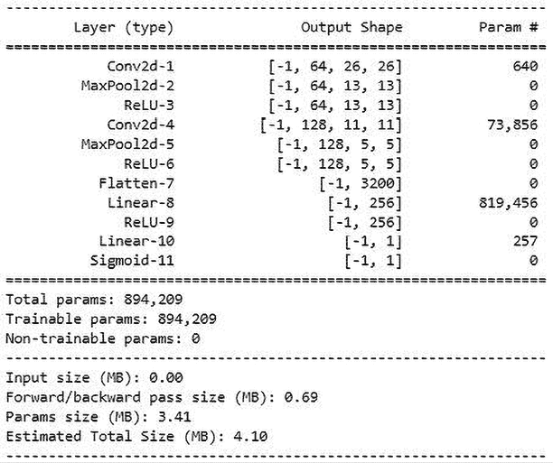
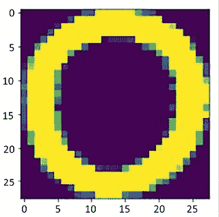
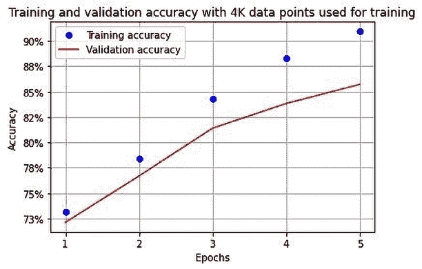

# 第四章：引入卷积神经网络

到目前为止，我们学习了如何构建深度神经网络以及调整它们的各种超参数所产生的影响。在本章中，我们将了解传统深度神经网络无法解决的问题。然后，我们将通过一个玩具例子了解**卷积神经网络**（**CNNs**）的内部工作原理，然后理解它们的一些主要超参数，包括步幅、池化和滤波器。接下来，我们将利用 CNN 以及各种数据增强技术来解决传统深度神经网络精度不高的问题。然后，我们将了解 CNN 中特征学习过程的结果是什么样子。最后，我们将把学到的东西结合起来解决一个用例：我们将通过声明图像中包含狗还是猫来分类图像。通过这样做，我们将能够理解预测准确性如何随着用于训练的数据量的变化而变化。

到本章末尾，您将对 CNN 有深入的理解，CNN 是多个模型架构的基础，用于各种任务。

本章将涵盖以下主题：

+   传统深度神经网络的问题

+   CNN 的构建模块

+   实现 CNN

+   使用深度 CNN 分类图像

+   实现数据增强

+   可视化特征学习的结果

+   为了对真实世界图像进行分类构建 CNN

让我们开始吧！

本章中的所有代码都可在此书的 GitHub 存储库的`Chapter04`文件夹中找到：[`bit.ly/mcvp-2e`](https://bit.ly/mcvp-2e)。

# 传统深度神经网络的问题

在深入研究 CNN 之前，让我们看看在使用传统深度神经网络时面临的主要问题。

让我们重新考虑我们在*第三章*中在 Fashion-MNIST 数据集上构建的模型。我们将获取一个随机图像并预测与该图像对应的类别，如下所示：

以下代码可以在 GitHub 上`Chapter04`文件夹中的`Issues_with_image_translation.ipynb`文件中找到：[`bit.ly/mcvp-2e`](https://bit.ly/mcvp-2e)。这里仅讨论与图像翻译问题对应的附加代码，以保持简洁。

1.  获取可用训练图像中的随机图像：

    ```py
    # Note that you should run the code in
    # Batch size of 32 section in Chapter 3
    # before running the following code
    import matplotlib.pyplot as plt
    %matplotlib inline
    # ix = np.random.randint(len(tr_images))
    ix = 24300
    plt.imshow(tr_images[ix], cmap='gray')
    plt.title(fmnist.classes[tr_targets[ix]]) 
    ```

前面的代码将产生以下输出：


图 4.1：与索引 24300 相对应的图像

1.  将图像通过**训练好的模型**传递（继续使用我们在*第三章*的*批量大小为 32*节中训练的模型）：

    1.  预处理图像，使其经过与构建模型时执行的相同预处理步骤：

    ```py
    img = tr_images[ix]/255.
    img = img.view(28*28)
    img = img.to(device) 
    ```

    1.  提取与各种类别相关联的概率：

    ```py
    np_output = model(img).cpu().detach().numpy()
    np.exp(np_output)/np.sum(np.exp(np_output)) 
    ```

1.  前面的代码将产生以下输出，我们可以看到最高概率是第一个索引，即`裤子`类：

    

    图 4.2：不同类别的概率

1.  将图像多次（每次移动一个像素）从向左 5 像素到向右 5 像素进行翻译，并将预测结果存储在列表中：

    1.  创建一个存储预测的列表：

    ```py
    preds = [] 
    ```

    1.  创建一个循环，将图像从原始位置的-5 像素（向左 5 像素）滚动到+5 像素（向右 5 像素）：

    ```py
    for px in range(-5,6): 
    ```

    1.  在前述代码中，我们指定 6 作为上限，尽管我们只关注将图像翻译到+5 像素，因为范围的输出将为-5 到+5，而(-5,6)是指定范围的输出。

    1.  预处理图像，就像我们在*步骤 2*中所做的那样：

    ```py
     img = tr_images[ix]/255.
        img = img.view(28, 28) 
    ```

    1.  在`for`循环中以`px`的值滚动图像：

    ```py
     img2 = np.roll(img, px, axis=1) 
    ```

    1.  在这里，我们指定`axis=1`，因为我们希望图像像素在水平方向移动而不是垂直方向。

    1.  将滚动后的图像存储为张量对象并注册到`device`：

    ```py
     img3 = torch.Tensor(img2).view(28*28).to(device) 
    ```

    1.  将`img3`通过训练模型以预测滚动图像的类，并将其附加到存储各种翻译预测的列表中：

    ```py
     np_output = model(img3).cpu().detach().numpy()
        preds.append(np.exp(np_output)/np.sum(np.exp(np_output))) 
    ```

1.  可视化模型对所有翻译（-5 像素到+5 像素）的预测：

    ```py
    import seaborn as sns
    fig, ax = plt.subplots(1,1, figsize=(12,10))
    plt.title('Probability of each class \
    for various translations')
    sns.heatmap(np.array(preds), annot=True, ax=ax, fmt='.2f',
    xticklabels=fmnist.classes,yticklabels=[str(i)+ \
    str(' pixels') for i in range(-5,6)], cmap='gray') 
    ```

前面的代码导致以下输出：


图 4.3：不同翻译每个类的概率

由于我们只将图像从左移动 5 像素到右移动 5 像素，因此图像内容没有变化。但是，当翻译超过 2 像素时，图像的预测类别会发生变化。这是因为在模型训练时，所有训练和测试图像的内容都在中心。这与前一情景不同，我们测试的是偏离中心的翻译图像（偏移 5 像素），导致预测类别不正确。

现在我们已经了解了传统神经网络失败的场景，接下来我们将学习 CNN 如何帮助解决这个问题。但在此之前，让我们首先看一下 CNN 的基本组成部分。

# CNN 的基本构建块

CNN 在处理图像时是最突出的架构之一。它们解决了深度神经网络的主要局限性，就像我们在前一节中看到的那样。除了图像分类外，它们还有助于目标检测、图像分割、生成对抗网络等各种任务 - 实质上是我们使用图像的任何地方。此外，有多种构建 CNN 的方式，也有多个预训练模型利用 CNN 执行各种任务。从本章开始，我们将广泛使用 CNN。

在接下来的小节中，我们将理解 CNN 的基本构建块，它们如下：

+   卷积

+   过滤器

+   步幅和填充

+   池化

让我们开始吧！

## 卷积

卷积基本上是两个矩阵之间的乘法。正如您在前一章节中看到的，矩阵乘法是训练神经网络的关键组成部分。（我们在计算隐藏层值时执行矩阵乘法——这是输入值和连接输入到隐藏层的权重值之间的矩阵乘法。类似地，我们执行矩阵乘法来计算输出层值。）

为了确保我们对卷积过程有牢固的理解，让我们通过一个例子来进行说明。假设我们有两个矩阵用于执行卷积。

这里是矩阵 A：


图 4.4：矩阵 A

这里是矩阵 B：


图 4.5：矩阵 B

在执行卷积操作时，我们将矩阵 B（较小的矩阵）滑动到矩阵 A（较大的矩阵）上。此外，我们在矩阵 A 和矩阵 B 之间执行元素对元素的乘法，如下所示：

1.  乘以较大矩阵的{1,2,5,6}部分与较小矩阵的{1,2,3,4}部分：

*1*1 + 2*2 + 5*3 + 6*4 = 44*

1.  乘以较大矩阵的{2,3,6,7}部分与较小矩阵的{1,2,3,4}部分：

*2*1 + 3*2 + 6*3 + 7*4 = 54*

1.  乘以较大矩阵的{3,4,7,8}部分与较小矩阵的{1,2,3,4}部分：

*3*1 + 4*2 + 7*3 + 8*4 = 64*

1.  乘以较大矩阵的{5,6,9,10}部分与较小矩阵的{1,2,3,4}部分：

*5*1 + 6*2 + 9*3 + 10*4 = 84*

1.  乘以较大矩阵的{6,7,10,11}部分与较小矩阵的{1,2,3,4}部分：

*6*1 + 7*2 + 10*3 + 11*4 = 94*

1.  乘以较大矩阵的{7,8,11,12}部分与较小矩阵的{1,2,3,4}部分：

*7*1 + 8*2 + 11*3 + 12*4 = 104*

1.  乘以较大矩阵的{9,10,13,14}部分与较小矩阵的{1,2,3,4}部分：

*9*1 + 10*2 + 13*3 + 14*4 = 124*

1.  乘以较大矩阵的{10,11,14,15}部分与较小矩阵的{1,2,3,4}部分：

*10*1 + 11*2 + 14*3 + 15*4 = 134*

1.  乘以较大矩阵的{11,12,15,16}部分与较小矩阵的{1,2,3,4}部分：

*11*1 + 12*2 + 15*3 + 16*4 = 144*

执行上述操作的结果如下所示：


图 4.6：卷积操作的输出

较小的矩阵通常被称为**滤波器**或内核，而较大的矩阵是原始图像。

## 滤波器

一个滤波器是一组权重的矩阵，初始时以随机方式初始化。模型随着时间的推移学习到滤波器的最优权重值。滤波器的概念带来了两个不同的方面：

+   滤波器学习的内容

+   如何表示滤波器

通常情况下，CNN 中的滤波器越多，模型能够学习图像的特征也就越多。在本章的*可视化特征学习结果*部分中，我们将学习各种滤波器学习的内容。目前，我们先掌握这样一个中间理解，即滤波器学习图像中不同特征的情况。例如，某个滤波器可能学习猫的耳朵，并在其卷积的图像部分包含猫耳朵时提供高激活（矩阵乘法值）。

在前一节中，当我们将大小为 2 x 2 的滤波器与大小为 4 x 4 的矩阵进行卷积时，我们得到的输出尺寸为 3 x 3。然而，如果有 10 个不同的滤波器与更大的矩阵（原始图像）相乘，则结果将是 10 组 3 x 3 的输出矩阵。

在上述情况下，一个 4 x 4 的图像与大小为 2 x 2 的 10 个滤波器进行卷积，得到 3 x 3 x 10 的输出值。基本上，当图像被多个滤波器卷积时，输出的通道数等于图像被卷积的滤波器数目。

此外，在处理彩色图像的情况下，图像有三个通道，与原始图像进行卷积的滤波器也将有三个通道，导致每次卷积得到单个标量输出。另外，如果滤波器与中间输出（例如形状为 64 x 112 x 112）进行卷积，滤波器将具有 64 个通道以获取标量输出。此外，如果有 512 个滤波器与中间层获得的输出进行卷积，使用 512 个滤波器的卷积输出将具有形状为 512 x 112 x 112。

为了进一步巩固我们对滤波器输出的理解，让我们看看以下的图示：


图 4.7: 多个滤波器进行卷积操作的输出

在前述图中，我们可以看到输入图像被与其深度相同的滤波器乘以，并且卷积输出的通道数与卷积的滤波器数目相同。

## 步幅和填充

在前一节中，每个滤波器跨越图像时，一次跨越一列和一行（在图像末尾穷尽所有可能的列之后）。这也导致输出尺寸在高度和宽度上比输入图像尺寸少 1 个像素。这会导致信息的部分丢失，并且如果卷积的输出和原始图像不具有相同的形状，则可能限制我们将卷积操作的输出添加到原始图像中的可能性。这被称为残差添加，并将在下一章节中详细讨论。目前，让我们学习步幅和填充如何影响卷积操作的输出形状。

### 步幅

让我们通过利用“滤波器”部分中看到的同一示例来理解步幅的影响。我们将矩阵 B 以步幅 2 移动到矩阵 A 上。因此，步幅为 2 的卷积输出如下所示：

1.  大矩阵的{1,2,5,6}与小矩阵的{1,2,3,4}相乘：

*1*1 + 2*2 + 5*3 + 6*4 = 44*

1.  大矩阵的{3,4,7,8}与小矩阵的{1,2,3,4}相乘：

*3*1 + 4*2 + 7*3 + 8*4 = 64*

1.  大矩阵的{9,10,13,14}与小矩阵的{1,2,3,4}相乘：

*9*1 + 10*2 + 13*3 + 14*4 = 124*

1.  大矩阵的{11,12,15,16}与小矩阵的{1,2,3,4}相乘：

*11*1 + 12*2 + 15*3 + 16*4 = 144*

执行上述操作的结果如下：


图 4.8：步幅卷积输出

由于我们现在步幅为 2，请注意前述输出与步幅为 1 时相比具有较低的维度（其中输出形状为 3 x 3）。

### 填充

在前述情况下，我们不能将过滤器的最左侧元素与图像的最右侧元素相乘。如果我们执行这样的矩阵乘法，我们将在图像上加入零填充。这将确保我们可以对图像中所有元素与滤波器中的元素进行逐元素乘法。

让我们通过使用“卷积”部分中使用的同一示例来理解填充。一旦在矩阵 A 上添加填充，修订后的矩阵 A 将如下所示：


图 4.9：矩阵 A 上的填充

正如你所见，我们已经用零填充了矩阵 A，并且与矩阵 B 的卷积不会导致输出维度小于输入维度。在我们处理残差网络时，这一点非常有用，因为我们必须将卷积的输出添加到原始图像中。

一旦完成这一步，我们可以对卷积操作的输出执行激活。对于这一步，我们可以使用第三章中看到的任何激活函数。

## 池化

池化在一个小区块中聚合信息。想象一种情况，卷积激活的输出如下所示：


图 4.10：卷积操作的输出

此区域的最大池化为 4，因为这是区块中数值的最大值。让我们理解更大矩阵的最大池化：


图 4.11：卷积操作的输出

在前述情况下，如果池化步幅长度为 2，则最大池化操作计算如下，我们将输入图像通过步幅 2 进行分割（即，我们将图像分割成 2 x 2 的分区）：


图 4.12：突出显示的步幅卷积输出

对于矩阵的四个子部分，元素池中的最大值如下：


图 4.13：最大池化值

在实践中，并非总是需要步幅为 2；这里仅用于举例说明。池化的其他变体包括求和池化和平均池化。然而，在实践中，最大池化更常用。

请注意，通过执行卷积和池化操作后，原始矩阵的大小从 4 x 4 减小为 2 x 2。在现实情况下，如果原始图像的形状为 200 x 200 并且滤波器的形状为 3 x 3，则卷积操作的输出将是 198 x 198。随后，步长为 2 的池化操作的输出将是 99 x 99。这样，通过利用池化，我们保留了更重要的特征同时减少了输入的维度。

## 将它们整合在一起

到目前为止，我们已经了解了卷积、滤波器、步幅、填充和池化，以及它们在减少图像维度中的作用。现在，我们将了解 CNN 的另一个关键组成部分——平坦化层（全连接层）——然后将我们学到的三个部分整合在一起。

要理解平坦化过程，我们将使用前一节中池化层的输出，并对其进行平坦化处理。平坦化池化层的输出是 {6, 8, 14, 16}。

通过这样做，我们会看到平坦化层可以等同于输入层（在*第三章*中我们将输入图像压平为 784 维输入）。一旦获取了平坦化层（全连接层）的值，我们可以将其传递到隐藏层然后获取用于预测图像类别的输出。

CNN 的整体流程如下：


图 4.14：CNN 工作流程

我们可以看到 CNN 模型的整体流程，我们通过多个滤波器将图像通过卷积传递，然后通过池化（在前述情况下，重复两次卷积和池化过程），最后将最终池化层的输出进行平坦化处理。这形成了前述图像的**特征学习**部分，其中我们将图像转换为较低维度（平坦化输出），同时恢复所需的信息。

卷积和池化操作构成了特征学习部分，滤波器帮助从图像中提取相关特征，池化则有助于聚合信息，从而减少在平坦化层的节点数量。

如果直接将输入图像（例如尺寸为 300 x 300 像素）进行平坦化处理，我们处理的是 90K 个输入值。如果输入有 90K 个像素值并且隐藏层有 100K 个节点，我们需要处理约 9 亿个参数，这在计算上是巨大的。

卷积和池化有助于获取一个比原始图像更小的平坦化层表示。

最后，分类的最后部分类似于我们在*第三章*中对图像进行分类的方式，那里有一个隐藏层然后获得输出层。

## 卷积和池化在图像翻译中的帮助

当我们执行池化操作时，可以将操作的输出视为一个区域（一个小补丁）的抽象。特别是在图像被翻译时，这种现象非常方便。

想象一种情景，图像向左平移了 1 个像素。一旦我们对其执行卷积、激活和池化，我们将减少图像的维度（由于池化），这意味着较少数量的像素存储了来自原始图像的大部分信息。此外，由于池化存储了区域（补丁）的信息，即使原始图像平移了 1 个单位，池化图像中一个像素的信息也不会变化。这是因为该区域的最大值很可能已被捕获在池化图像中。

卷积和池化还可以帮助我们实现**感受野**。要理解感受野，让我们想象一个场景，我们在一个形状为 100 x 100 的图像上进行两次卷积 + 池化操作。如果卷积操作进行了填充，那么在两次卷积池化操作结束时的输出形状将为 25 x 25。25 x 25 输出中的每个单元格现在对应于原始图像中一个较大的 4 x 4 部分。因此，由于卷积和池化操作，结果图像中的每个单元格都包含原始图像的一个补丁内的关键信息。

现在我们已经了解了 CNN 的核心组件，让我们通过一个玩具示例将它们应用起来，以理解它们如何一起工作。

# 实施 CNN

CNN 是计算机视觉技术的基础组成部分之一，对于您深入理解它们的工作原理非常重要。虽然我们已经知道 CNN 包括卷积、池化、展平，然后是最终的分类层，但在本节中，我们将通过代码了解 CNN 前向传播期间发生的各种操作。

要对此有一个坚实的理解，首先，我们将使用 PyTorch 在一个玩具示例上构建一个 CNN 架构，然后通过 Python 从头开始构建前向传播以匹配输出。CNN 架构将与我们在上一章中构建的神经网络架构有所不同，因为 CNN 除了典型的香草深度神经网络外，还包括以下内容：

+   卷积操作

+   池化操作

+   展平层

在以下代码中，我们将在玩具数据集上构建一个 CNN 模型，如下所示：

可在 GitHub 的`Chapter04`文件夹中找到`CNN_working_details.ipynb`文件中的以下代码：[`bit.ly/mcvp-2e`](https://bit.ly/mcvp-2e)。

1.  首先，我们需要导入相关的库：

    ```py
    import torch
    from torch import nn
    from torch.utils.data import TensorDataset, Dataset, DataLoader
    from torch.optim import SGD, Adam
    device = 'cuda' if torch.cuda.is_available() else 'cpu'
    from torchvision import datasets
    import numpy as np
    import matplotlib.pyplot as plt
    %matplotlib inline 
    ```

1.  接下来，我们需要按照以下步骤创建数据集：

    ```py
    X_train = torch.tensor([[[[1,2,3,4],[2,3,4,5],
                              [5,6,7,8],[1,3,4,5]]],
                            [[[-1,2,3,-4],[2,-3,4,5],
                [-5,6,-7,8],[-1,-3,-4,-5]]]]).to(device).float()
    X_train /= 8
    y_train = torch.tensor([0,1]).to(device).float() 
    ```

注意，PyTorch 期望输入的形状为**N x C x H x W**，其中*N*是图像的数量（批量大小），*C*是通道数，*H*是高度，*W*是图像的宽度。

在这里，我们将输入数据集进行缩放，使其范围在-1 到+1 之间，通过将输入数据除以最大输入值即 8。输入数据集的形状为(2,1,4,4)，因为有两个数据点，每个数据点的形状为 4 x 4，并且有 1 个通道。

1.  定义模型架构：

    ```py
    def get_model():
        model = nn.Sequential(
                    nn.Conv2d(1, 1, kernel_size=3),
                    nn.MaxPool2d(2),
                    nn.ReLU(),
                    nn.Flatten(),
                    nn.Linear(1, 1),
                    nn.Sigmoid(),
                ).to(device)
        loss_fn = nn.BCELoss()
        optimizer = Adam(model.parameters(), lr=1e-3)
        return model, loss_fn, optimizer 
    ```

注意，在上述模型中，我们指定输入中有 1 个通道，并且我们使用`nn.Conv2d`方法在卷积后提取 1 个通道的输出（即，我们有 1 个大小为 3 x 3 的滤波器）。

然后，我们使用`nn.MaxPool2d`进行最大池化和 ReLU 激活（使用`nn.Relu()`），然后扁平化并连接到最终层，每个数据点有一个输出。

此外，请注意，损失函数是二元交叉熵损失(`nn.BCELoss()`)，因为输出来自二元类别。我们还指定优化将使用学习率为 0.001 的 Adam 优化器进行。

1.  使用`torch_summary`包中的`summary`方法对我们的`model`、损失函数(`loss_fn`)和`optimizer`进行获取后，总结模型的架构：

    ```py
    !pip install torch_summary
    from torchsummary import summary
    model, loss_fn, optimizer = get_model()
    summary(model, X_train); 
    ```

上述代码产生以下输出：


图 4.15：模型架构摘要

让我们理解每一层包含多少参数的原因。`Conv2d`类的参数如下：


图 4.16：Conv2d 中的参数说明

在前面的例子中，我们指定卷积核的大小(`kernel_size`)为 3，并且`out_channels`的数量为 1（本质上，滤波器的数量为 1），其中初始（输入）通道的数量为 1。因此，对于每个输入图像，我们在一个形状为 1 x 4 x 4 的图像上卷积一个形状为 3 x 3 的滤波器，得到一个形状为 1 x 2 x 2 的输出。有 10 个参数，因为我们正在学习九个权重参数（3 x 3）和卷积核的一个偏置。对于`MaxPool2d`、ReLU 和 flatten 层，没有参数，因为这些是在卷积层输出之上执行的操作；不涉及权重或偏置。

线性层有两个参数 - 一个权重和一个偏置 - 这意味着总共有 12 个参数（来自卷积操作的 10 个和线性层的两个）。

1.  使用我们在*第三章*中使用的相同模型训练代码来训练模型，定义将对数据批次进行训练的函数(`train_batch`)。然后，获取`DataLoader`并在 2,000 个 epochs 中对数据批次进行训练（我们只使用 2,000 个是因为这是一个小型玩具数据集），如下所示：

    1.  定义将对数据批次进行训练的函数(`train_batch`)：

    ```py
    def train_batch(x, y, model, opt, loss_fn):
        model.train()
        prediction = model(x)
        batch_loss = loss_fn(prediction.squeeze(0), y)
        batch_loss.backward()
        optimizer.step()
        optimizer.zero_grad()
        return batch_loss.item() 
    ```

    1.  使用 `TensorDataset` 方法指定数据集来定义训练 DataLoader，然后使用 `DataLoader` 加载它：

    ```py
    trn_dl = DataLoader(TensorDataset(X_train, y_train)) 
    ```

    1.  鉴于我们没有对输入数据进行大量修改，我们不会单独构建一个类，而是直接利用 `TensorDataset` 方法，该方法提供了与输入数据对应的对象。

    1.  在 2,000 个 epochs 上训练模型：

    ```py
    for epoch in range(2000):
        for ix, batch in enumerate(iter(trn_dl)):
            x, y = batch
            batch_loss = train_batch(x, y, model,optimizer, loss_fn) 
    ```

1.  使用上述代码，我们已经在我们的玩具数据集上训练了 CNN 模型。

1.  对第一个数据点执行前向传播：

    ```py
    model(X_train[:1]) 
    ```

上述代码的输出是 `0.1625`。

请注意，由于执行上述代码时随机权重初始化可能不同，因此您可能会有不同的输出值。

使用 GitHub 仓库中的 `CNN from scratch in Python.pdf` 文件，我们可以学习如何从头开始构建 CNN 中的前向传播，并在第一个数据点上复制输出 0.1625。

在接下来的部分中，我们将把这个应用到 Fashion-MNIST 数据集，并看看它在翻译后的图像上表现如何。

# 使用深度 CNN 对图像进行分类

到目前为止，我们已经看到传统神经网络对翻译图像预测不正确。这需要解决，因为在实际情况中，会需要应用各种增强技术，如翻译和旋转，这些在训练阶段没有看到。在本节中，我们将了解 CNN 如何解决在 Fashion-MNIST 数据集的图像发生翻译时预测不正确的问题。

Fashion-MNIST 数据集的预处理部分与上一章节相同，除了当我们对输入数据进行重塑（`.view`）时，我们不再将输入展平为 28 x 28 = 784 维度，而是将每个图像重塑为形状为 (1,28,28)（请记住，首先需要指定通道，然后是它们的高度和宽度，在 PyTorch 中）：

可在 GitHub 的 `Chapter04` 文件夹中的 `CNN_on_FashionMNIST.ipynb` 文件中找到以下代码：[`bit.ly/mcvp-2e`](https://bit.ly/mcvp-2e)**.**

1.  导入必要的包：

    ```py
    from torchvision import datasets
    from torch.utils.data import Dataset, DataLoader
    import torch
    import torch.nn as nn
    device = "cuda" if torch.cuda.is_available() else "cpu"
    import numpy as np
    import matplotlib.pyplot as plt
    %matplotlib inline
    data_folder = '~/data/FMNIST' # This can be any directory you
    # want to download FMNIST to
    fmnist = datasets.FashionMNIST(data_folder,download=True, train=True)
    tr_images = fmnist.data
    tr_targets = fmnist.targets 
    ```

1.  Fashion-MNIST 数据集类定义如下。请记住，`Dataset` 对象将**总是**需要我们定义的 `__init__`、`__getitem__` 和 `__len__` 方法：

    ```py
    class FMNISTDataset(Dataset):
        def __init__(self, x, y):
            x = x.float()/255
            **x = x.view(-****1****,****1****,****28****,****28****)**
            self.x, self.y = x, y
        def __getitem__(self, ix):
            x, y = self.x[ix], self.y[ix]
            return x.to(device), y.to(device)
        def __len__(self):
            return len(self.x) 
    ```

粗体的代码行是我们重塑每个输入图像的地方（与前一章节所做的不同），因为我们正在为期望每个输入具有批大小 x 通道 x 高度 x 宽度形状的 CNN 提供数据。

1.  CNN 模型架构定义如下：

    ```py
    from torch.optim import SGD, Adam
    def get_model():
        model = nn.Sequential(
                    nn.Conv2d(1, 64, kernel_size=3),
                    nn.MaxPool2d(2),
                    nn.ReLU(),
                    nn.Conv2d(64, 128, kernel_size=3),
                    nn.MaxPool2d(2),
                    nn.ReLU(),
                    nn.Flatten(),
                    nn.Linear(3200, 256),
                    nn.ReLU(),
                    nn.Linear(256, 10)
                ).to(device)
        loss_fn = nn.CrossEntropyLoss()
        optimizer = Adam(model.parameters(), lr=1e-3)
        return model, loss_fn, optimizer 
    ```

1.  可以使用以下代码创建模型总结：

    ```py
    from torchsummary import summary
    model, loss_fn, optimizer = get_model()
    summary(model, torch.zeros(1,1,28,28)); 
    ```

这导致以下输出：


图 4.17：模型架构总结

为了加深我们对 CNN 的理解，让我们了解在前面的输出中参数数量被设定为什么样的原因：

+   **第一层**：考虑到有 64 个大小为 3 的滤波器，我们有 64 x 3 x 3 个权重和 64 个偏置，总共 640 个参数。

+   **第四层**：考虑到有 128 个大小为 3 的滤波器，我们有 128 x 64 x 3 x 3 个权重和 128 个偏置，总共 73,856 个参数。

+   **第八层**：考虑到一个具有 3,200 个节点的层连接到另一个具有 256 个节点的层，我们有 3,200 x 256 个权重和 256 个偏置，总共 819,456 个参数。

+   **第十层**：考虑到一个具有 256 个节点的层连接到一个具有 10 个节点的层，我们有 256 x 10 个权重和 10 个偏置，总共 2570 个参数。

现在，我们像在前一章中训练模型一样训练模型。

完整的代码可以在本书的 GitHub 存储库中找到：`https://bit.ly/mcvp-2e`。

一旦模型训练完成，您会注意到在训练集和测试集上的准确性和损失的变化如下：


图 4.18：随着时代的推移训练和验证损失及准确率

在上述场景中，请注意，验证数据集在前五个时期内的准确率约为 92%，这已经优于我们在上一章节中通过各种技术所见到的准确率，即使没有额外的正则化。

让我们翻译这张图片并预测翻译后图片的类别：

1.  将图像向左或向右平移 5 个像素并预测其类别：

    ```py
    preds = []
    ix = 24300
    for px in range(-5,6):
        img = tr_images[ix]/255.
        img = img.view(28, 28)
        img2 = np.roll(img, px, axis=1)
        plt.imshow(img2)
        plt.show()
        img3 = torch.Tensor(img2).view(-1,1,28,28).to(device)
        np_output = model(img3).cpu().detach().numpy()
        preds.append(np.exp(np_output)/np.sum(np.exp(np_output))) 
    ```

在上述代码中，我们对图像（`img3`）进行了 reshape，使其形状为`(-1,1,28,28)`，这样我们可以将图像传递给 CNN 模型。

1.  绘制各种翻译下类别的概率：

    ```py
    import seaborn as sns
    fig, ax = plt.subplots(1,1, figsize=(12,10))
    plt.title('Probability of each class for \
    various translations')
    sns.heatmap(np.array(preds).reshape(11,10), annot=True,
                ax=ax,fmt='.2f', xticklabels=fmnist.classes,
                yticklabels=[str(i)+str(' pixels') \
                for i in range(-5,6)], cmap='gray') 
    ```

上述代码的输出如下：


图 4.19：各种翻译下各类别的概率

在这种情况下，请注意，即使将图像向右或向左平移了 4 个像素，预测仍然是正确的，而在没有使用 CNN 的情况下，图像向右或向左平移 4 个像素时预测是错误的。此外，当图像向右或向左平移 5 个像素时，**Trouser**类别的概率显著下降。

正如我们所看到的，虽然 CNN 有助于解决图像平移的挑战，但并不能完全解决问题。我们将学习如何通过结合数据增强和 CNN 来解决这样的场景。

鉴于可以利用不同的数据增强技术，我们在 GitHub 存储库的`Chapter04`文件夹中的`implementing data augmentation.pdf`文件中提供了详尽的数据增强信息。

# 可视化特征学习的结果

到目前为止，我们已经了解到 CNN 如何帮助我们分类图像，即使图像中的对象已被转换。我们还了解到滤波器在学习图像特征方面起着关键作用，这反过来有助于将图像正确分类。但是，我们尚未提到使滤波器强大的是什么。在本节中，我们将学习有关滤波器学习的内容，这使得 CNN 能够正确分类图像，并通过对包含 X 和 O 图像的数据集进行分类来理解完全连接层（展平层）的激活状态。

让我们看看滤波器学到了什么：

下面的代码可以在 GitHub 上的 `Chapter04` 文件夹中的 `Visualizing_the_features'_learning.ipynb` 文件中找到，链接为 [`bit.ly/mcvp-2e`](https://bit.ly/mcvp-2e)。

1.  下载数据集：

    ```py
    !wget https://www.dropbox.com/s/5jh4hpuk2gcxaaq/all.zip
    !unzip all.zip 
    ```

注意文件夹中的图像命名如下：


图 4.20：图像的命名约定

图像的类别可以从图像名称中获取，其中图像名称的第一个字符指定图像所属的类别。

1.  导入所需模块：

    ```py
    import torch
    from torch import nn
    from torch.utils.data import TensorDataset,Dataset,DataLoader
    from torch.optim import SGD, Adam
    device = 'cuda' if torch.cuda.is_available() else 'cpu'
    from torchvision import datasets
    import numpy as np, cv2
    import matplotlib.pyplot as plt
    %matplotlib inline
    from glob import glob
    from imgaug import augmenters as iaa 
    ```

1.  定义一个获取数据的类。还要确保图像已调整为 28 x 28 的形状，批次已用三个通道形状，并且因变量已作为数值值获取。我们将在以下代码中逐步完成这些操作：

    1.  定义图像增强方法，将图像调整为 28 x 28 的形状：

    ```py
    tfm = iaa.Sequential(iaa.Resize(28)) 
    ```

    1.  定义一个类，它接受文件夹路径作为输入，并在 `__init__` 方法中循环处理该路径中的文件：

    ```py
    class XO(Dataset):
        def __init__(self, folder):
            self.files = glob(folder) 
    ```

    1.  定义 `__len__` 方法，它返回要考虑的文件的长度：

    ```py
     def __len__(self): return len(self.files) 
    ```

    1.  定义 `__getitem__` 方法，我们用它来获取返回该索引处的文件，读取文件，然后对图像进行增强。我们在这里没有使用 `collate_fn`，因为这是一个小数据集，不会显著影响训练时间：

    ```py
     def __getitem__(self, ix):
            f = self.files[ix]
            im = tfm.augment_image(cv2.imread(f)[:,:,0]) 
    ```

    1.  鉴于每个图像的形状为 28 x 28，我们现在将在形状的开头创建一个虚拟通道维度，即在图像的高度和宽度之前：

    ```py
     im = im[None] 
    ```

    1.  现在，我们可以根据文件名中 `'/'` 后和 `'@'` 前的字符确定每个图像的类别：

    ```py
     cl = f.split('/')[-1].split('@')[0] == 'x' 
    ```

    1.  最后，我们返回图像及其对应的类别：

    ```py
     return torch.tensor(1 - im/255).to(device).float(),
                          torch.tensor([cl]).float().to(device) 
    ```

1.  检查您获取的图像样本。在以下代码中，我们通过从之前定义的类中获取数据来提取图像及其对应的类别：

    ```py
    data = XO('/content/all/*') 
    ```

现在，我们可以绘制我们获取的数据集的图像样本：

1.  ```py
    R, C = 7,7
    fig, ax = plt.subplots(R, C, figsize=(5,5))
    for label_class, plot_row in enumerate(ax):
        for plot_cell in plot_row:
            plot_cell.grid(False); plot_cell.axis('off')
            ix = np.random.choice(1000)
            im, label = data[ix]
            print()
            plot_cell.imshow(im[0].cpu(), cmap='gray')
    plt.tight_layout() 
    ```

上述代码的结果如下输出：


图 4.21：样本图像

1.  定义模型架构、损失函数和优化器：

    ```py
    from torch.optim import SGD, Adam
    def get_model():
        model = nn.Sequential(
                    nn.Conv2d(1, 64, kernel_size=3),
                    nn.MaxPool2d(2),
                    nn.ReLU(),
                    nn.Conv2d(64, 128, kernel_size=3),
                    nn.MaxPool2d(2),
                    nn.ReLU(),
                    nn.Flatten(),
                    nn.Linear(3200, 256),
                    nn.ReLU(),
                    nn.Linear(256, 1),
                    nn.Sigmoid()
                ).to(device)
        loss_fn = nn.BCELoss()
        optimizer = Adam(model.parameters(), lr=1e-3)
        return model, loss_fn, optimizer 
    ```

    注意，损失函数是二元交叉熵损失 (`nn.BCELoss()`)，因为提供的输出来自二进制类。可以通过以下方式获取上述模型的摘要：

    ```py
    !pip install torch_summary
    from torchsummary import summary
    model, loss_fn, optimizer = get_model()
    summary(model, torch.zeros(1,1,28,28)); 
    ```

这导致以下输出：



图 4.22：模型架构摘要

1.  定义一个用于批量训练的函数，该函数接受图像和它们的类别作为输入，并在对给定数据批次执行反向传播后返回它们的损失值和准确度：

    ```py
    def train_batch(x, y, model, opt, loss_fn):
        model.train()
        prediction = model(x)
        is_correct = (prediction > 0.5) == y
        batch_loss = loss_fn(prediction, y)
        batch_loss.backward()
        optimizer.step()
        optimizer.zero_grad()
        return batch_loss.item(), is_correct[0] 
    ```

1.  定义一个 `DataLoader`，其中输入是 `Dataset` 类：

    ```py
    trn_dl = DataLoader(XO('/content/all/*'),batch_size=32, drop_last=True) 
    ```

1.  初始化模型：

    ```py
    model, loss_fn, optimizer = get_model() 
    ```

1.  在 `5` 个 epoch 上训练模型：

    ```py
    for epoch in range(5):
        for ix, batch in enumerate(iter(trn_dl)):
            x, y = batch
            batch_loss = train_batch(x, y, model,optimizer, loss_fn) 
    ```

1.  获取图像以查看滤波器对图像的学习效果：

    ```py
    im, c = trn_dl.dataset[2]
    plt.imshow(im[0].cpu())
    plt.show() 
    ```

这导致以下输出：



图 4.23：示例图像

1.  通过训练好的模型传递图像并获取第一层的输出。然后，将其存储在 `intermediate_output` 变量中：

    ```py
    first_layer = nn.Sequential(*list(model.children())[:1])
    intermediate_output = first_layer(im[None])[0].detach() 
    ```

1.  绘制 64 个滤波器的输出。`intermediate_output` 中的每个通道是每个滤波器的卷积输出：

    ```py
    fig, ax = plt.subplots(8, 8, figsize=(10,10))
    for ix, axis in enumerate(ax.flat):
        axis.set_title('Filter: '+str(ix))
        axis.imshow(intermediate_output[ix].cpu())
    plt.tight_layout()
    plt.show() 
    ```

这导致以下输出：


图 4.24：64 个滤波器的激活

注意，某些滤波器（如 0、4、6 和 7 号滤波器）学习了网络中存在的边缘，而另一些滤波器（如第 54 号滤波器）学习了反转图像的技巧。

1.  传递多个 O 图像并检查第四个滤波器在这些图像上的输出（我们仅用第四个滤波器作为示例用途；如果您希望，可以选择不同的滤波器）。

    1.  从数据中获取多个 O 图像：

    ```py
    x, y = next(iter(trn_dl))
    x2 = x[y==0] 
    ```

    1.  重塑 `x2`，使其具有适合 CNN 模型的正确输入形状，即批处理大小 x 通道数 x 高度 x 宽度：

    ```py
    x2 = x2.view(-1,1,28,28) 
    ```

    1.  定义一个变量，该变量存储了第一层的模型：

    ```py
    first_layer = nn.Sequential(*list(model.children())[:1]) 
    ```

    1.  提取通过模型直到第一层（`first_layer`）的 O 图像的输出，如前所述：

    ```py
    first_layer_output = first_layer(x2).detach() 
    ```

1.  绘制将多个图像通过 `first_layer` 模型的输出：

    ```py
    n = 4
    fig, ax = plt.subplots(n, n, figsize=(10,10))
    for ix, axis in enumerate(ax.flat):
        axis.imshow(first_layer_output[ix,4,:,:].cpu())
        axis.set_title(str(ix))
    plt.tight_layout()
    plt.show() 
    ```

上述代码的结果如下所示：


图 4.25：当多个 O 图像通过时第四个滤波器的激活

注意，在给定滤波器的行为（在本例中是第一层的第四个滤波器）在图像间保持一致。

1.  现在，让我们创建另一个模型，该模型提取直到第二个卷积层（即前述模型中定义的四个层），然后提取通过原始 O 图像的输出。然后，我们将绘制第二层滤波器与输入 O 图像卷积的输出：

    ```py
    second_layer = nn.Sequential(*list(model.children())[:4])
    second_intermediate_output=second_layer(im[None])[0].detach() 
    ```

    绘制将滤波器与相应图像卷积的输出：

    ```py
    fig, ax = plt.subplots(11, 11, figsize=(10,10))
    for ix, axis in enumerate(ax.flat):
        axis.imshow(second_intermediate_output[ix].cpu())
        axis.set_title(str(ix))
    plt.tight_layout()
    plt.show() 
    ```

    上述代码的结果如下所示：

    

    图 4.26：第二个卷积层中 128 个滤波器的激活

    现在，让我们以前述图像中第 34 个滤波器的输出为例。当我们通过第 34 个滤波器传递多个 O 图像时，我们应该看到图像间的激活类似。让我们测试一下，如下所示：

    ```py
    second_layer = nn.Sequential(*list(model.children())[:4])
    second_intermediate_output = second_layer(x2).detach()
    fig, ax = plt.subplots(4, 4, figsize=(10,10))
    for ix, axis in enumerate(ax.flat):
        axis.imshow(second_intermediate_output[ix,34,:,:].cpu())
        axis.set_title(str(ix))
    plt.tight_layout()
    plt.show() 
    ```

上述代码的结果如下所示：


图 4.27：当多个 O 图像通过时第 34 个滤波器的激活

注意，即使在这里，不同图像上第 34 个滤波器的激活也是相似的，即 O 的左半部分在激活滤波器时是相同的。

1.  绘制全连接层的激活如下：

    1.  首先，获取更大的图像样本：

    ```py
    custom_dl= DataLoader(XO('/content/all/*'),batch_size=2498, drop_last=True) 
    ```

    1.  接下来，从数据集中选择仅包含**O**图像，并将它们重塑，以便可以作为输入传递给我们的 CNN 模型：

    ```py
    x, y = next(iter(custom_dl))
    x2 = x[y==0]
    x2 = x2.view(len(x2),1,28,28) 
    ```

    1.  获取扁平（全连接）层，并将之前的图像通过模型传递到扁平层：

    ```py
    flatten_layer = nn.Sequential(*list(model.children())[:7])
    flatten_layer_output = flatten_layer(x2).detach() 
    ```

    1.  绘制扁平层：

    ```py
    plt.figure(figsize=(100,10))
    plt.imshow(flatten_layer_output.cpu()) 
    ```

上述代码的输出如下所示：


图 4.28：全连接层的激活

注意输出的形状为 1,245 x 3,200，因为我们的数据集中有 1,245 个**O**图像，并且每个图像在扁平化层中有 3,200 个维度。

还有趣的是，当输入为**O**时，完全连接层的某些值会被突出显示（在这里，我们可以看到白色线条，每个点代表大于零的激活值）。

注意，尽管输入图像风格差异很大，但模型已经学会将一些结构带入完全连接的层。

现在我们已经学会了 CNN 的工作原理以及滤波器如何在这个过程中起作用，我们将应用这些知识来分类包含猫和狗图像的数据集。

# 构建用于分类真实世界图像的 CNN

到目前为止，我们已经学习了如何在 Fashion-MNIST 数据集上执行图像分类。在本节中，我们将为更真实的场景执行相同的操作，任务是对包含猫或狗的图像进行分类。我们还将学习当我们改变用于训练的图像数量时，数据集的准确性如何变化。

我们将在 Kaggle 上的数据集上工作，网址为[`www.kaggle.com/tongpython/cat-and-dog`](https://www.kaggle.com/tongpython/cat-and-dog)：

您可以在 GitHub 上的`Cats_Vs_Dogs.ipynb`文件中找到以下代码，位于`Chapter04`文件夹中，网址为[`bit.ly/mcvp-2e`](https://bit.ly/mcvp-2e)。请务必从 GitHub 笔记本中复制 URL，以避免在重现结果时出现任何问题。

1.  导入必要的包：

    ```py
    import torchvision
    import torch.nn as nn
    import torch
    import torch.nn.functional as F
    from torchvision import transforms,models,datasets
    from PIL import Image
    from torch import optim
    device = 'cuda' if torch.cuda.is_available() else 'cpu'
    import cv2, glob, numpy as np, pandas as pd
    import matplotlib.pyplot as plt
    %matplotlib inline
    from glob import glob
    !pip install torch_summary 
    ```

1.  下载数据集如下：

    1.  我们必须下载在`colab`环境中可用的数据集。但首先，我们必须上传我们的 Kaggle 认证文件：

    ```py
    !pip install -q aggle
    from google.colab import files
    files.upload() 
    ```

为了进行这一步骤，您将需要上传您的`kaggle.json`文件，可以从您的 Kaggle 帐户中获取。有关如何获取`kaggle.json`文件的详细信息，请参见 GitHub 上关联笔记本中提供的相关信息，网址为[`bit.ly/mcvp-2e`](https://bit.ly/mcvp-2e)。

1.  接下来，指定我们要移动到 Kaggle 文件夹，并将`kaggle.json`文件复制到其中：

1.  ```py
    !mkdir -p ~/.kaggle
    !cp kaggle.json ~/.kaggle/
    !ls ~/.kaggle
    !chmod 600 /root/.kaggle/kaggle.json 
    ```

1.  最后，下载猫和狗的数据集并解压缩它：

1.  ```py
    !kaggle datasets download -d tongpython/cat-and-dog
    !unzip cat-and-dog.zip 
    ```

1.  提供训练和测试数据集文件夹：

    ```py
    train_data_dir = '/content/training_set/training_set'
    test_data_dir = '/content/test_set/test_set' 
    ```

1.  构建一个从前述文件夹获取数据的类。然后，根据图像对应的目录，为狗图像提供标签 1，猫图像提供标签 0。此外，确保获取的图像已被归一化为介于 0 和 1 之间的比例，并重新排列它以便先提供通道（因为 PyTorch 模型期望在提供图像的高度和宽度之前首先指定通道） - 如下所示进行：

    1.  定义 `__init__` 方法，该方法接受一个文件夹作为输入，并将与 `cats` 和 `dogs` 文件夹中的图像对应的文件路径（图像路径）存储在单独的对象中，在连接文件路径成为单个列表后：

    ```py
    from torch.utils.data import DataLoader, Dataset
    class cats_dogs(Dataset):
        def __init__(self, folder):
            cats = glob(folder+'/cats/*.jpg')
            dogs = glob(folder+'/dogs/*.jpg')
            self.fpaths = cats + dogs 
    ```

    1.  接下来，随机化文件路径并根据这些文件路径对应的文件夹创建目标变量：

    ```py
     from random import shuffle, seed; seed(10);
            shuffle(self.fpaths)
            self.targets=[fpath.split('/')[-1].startswith('dog') \
                          for fpath in self.fpaths] # dog=1 
    ```

    1.  定义 `__len__` 方法，该方法对应于 `self` 类：

    ```py
     def __len__(self): return len(self.fpaths) 
    ```

    1.  定义 `__getitem__` 方法，我们用该方法从文件路径列表中指定一个随机文件路径，读取图像，并调整所有图像的大小为 224 x 224。考虑到我们的 CNN 需要从通道中获取每个图像的输入，我们将重新排列调整大小后的图像，以便在返回缩放后的图像和相应的 `target` 值之前，首先提供通道：

    ```py
     def __getitem__(self, ix):
            f = self.fpaths[ix]
            target = self.targets[ix]
            im = (cv2.imread(f)[:,:,::-1])
            im = cv2.resize(im, (224,224))
            return torch.tensor(im/255).permute(2,0,1).to(device).float(),\
                   torch.tensor([target]).float().to(device) 
    ```

1.  检查一个随机图像：

    ```py
    data = cats_dogs(train_data_dir)
    im, label = data[200] 
    ```

我们需要将获取的图像重新排列以使通道排列在最后。这是因为 `matplotlib` 期望图像的通道在提供图像的高度和宽度之后指定：

1.  ```py
    plt.imshow(im.permute(1,2,0).cpu())
    print(label) 
    ```

这将导致以下输出：


图 4.29：示例狗图像

1.  定义模型、损失函数和优化器，如下所示：

    1.  首先，我们必须定义 `conv_layer` 函数，在其中按顺序执行卷积、ReLU 激活、批归一化和最大池化。此方法将在我们定义的最终模型中重复使用：

    ```py
    def conv_layer(ni,no,kernel_size,stride=1):
        return nn.Sequential(
            nn.Conv2d(ni, no, kernel_size, stride),
            nn.ReLU(),
            nn.BatchNorm2d(no),
            nn.MaxPool2d(2)
        ) 
    ```

    1.  在上述代码中，我们将输入通道数 (`ni`)、输出通道数 (`no`)、`kernel_size` 和 `stride` 作为 `conv_layer` 函数的输入。

    1.  定义 `get_model` 函数，该函数执行多次卷积和池化操作（通过调用 `conv_layer` 方法），将输出展平，并在连接到输出层之前连接一个隐藏层：

    ```py
    def get_model():
        model = nn.Sequential(
                  conv_layer(3, 64, 3),
                  conv_layer(64, 512, 3),
                  conv_layer(512, 512, 3),
                  conv_layer(512, 512, 3),
                  conv_layer(512, 512, 3),
                  conv_layer(512, 512, 3),
                  nn.Flatten(),
                  nn.Linear(512, 1),
                  nn.Sigmoid(),
                ).to(device)
        loss_fn = nn.BCELoss()
        optimizer=torch.optim.Adam(model.parameters(), lr= 1e-3)
        return model, loss_fn, optimizer 
    ```

您可以在 `nn.Sequential` 内部链式调用 `nn.Sequential`，深度可以随意。在上述代码中，我们使用 `conv_layer` 就像它是任何其他 `nn.Module` 层一样。

1.  现在，我们必须调用 `get_model` 函数来获取模型、损失函数 (`loss_fn`) 和优化器，并使用我们从 `torchsummary` 包中导入的 `summary` 方法对模型进行总结：

1.  ```py
    from torchsummary import summary
    model, loss_fn, optimizer = get_model()
    summary(model, torch.zeros(1,3, 224, 224)); 
    ```

上述代码将产生以下输出：


图 4.30：模型架构摘要

1.  创建 `get_data` 函数，该函数创建 `cats_dogs` 类的对象，并为训练和验证文件夹分别创建 `batch_size` 为 32 的 `DataLoader`：

    ```py
    def get_data():
        train = cats_dogs(train_data_dir)
        trn_dl = DataLoader(train, batch_size=32, shuffle=True,
                                              drop_last = True)
        val = cats_dogs(test_data_dir)
        val_dl = DataLoader(val,batch_size=32, shuffle=True, drop_last = True)
        return trn_dl, val_dl 
    ```

在前述代码中，我们通过指定`drop_last = True`来忽略最后一个数据批次。我们这样做是因为最后一个批次的大小可能与其他批次不同。

1.  定义将在数据批次上训练模型的函数，就像我们在前面的章节中所做的一样：

    ```py
    def train_batch(x, y, model, opt, loss_fn):
        model.train()
        prediction = model(x)
        batch_loss = loss_fn(prediction, y)
        batch_loss.backward()
        optimizer.step()
        optimizer.zero_grad()
        return batch_loss.item() 
    ```

1.  定义用于计算准确性和验证损失的函数，就像我们在前面的章节中所做的一样：

    1.  定义`accuracy`函数：

    ```py
    @torch.no_grad()
    def accuracy(x, y, model):
        prediction = model(x)
        is_correct = (prediction > 0.5) == y
        return is_correct.cpu().numpy().tolist() 
    ```

    1.  请注意，用于精度计算的前述代码与 Fashion-MNIST 分类中的代码不同，因为当前模型（猫与狗分类）是为二元分类构建的，而 Fashion-MNIST 模型是为多类分类构建的。

    1.  定义验证损失计算函数：

    ```py
    @torch.no_grad()
    def val_loss(x, y, model):
        prediction = model(x)
        val_loss = loss_fn(prediction, y)
        return val_loss.item() 
    ```

1.  在 5 个 epoch 上训练模型，并在每个 epoch 结束时检查测试数据的准确性，就像我们在前面的章节中所做的一样：

    1.  定义模型并获取所需的 DataLoaders：

    ```py
    trn_dl, val_dl = get_data()
    model, loss_fn, optimizer = get_model() 
    ```

    1.  在增加的 epoch 上训练模型：

    ```py
    train_losses, train_accuracies = [], []
    val_losses, val_accuracies = [], []
    for epoch in range(5):
        train_epoch_losses, train_epoch_accuracies = [], []
        val_epoch_accuracies = []
        for ix, batch in enumerate(iter(trn_dl)):
            x, y = batch
            batch_loss = train_batch(x, y, model,optimizer, loss_fn)
            train_epoch_losses.append(batch_loss)
        train_epoch_loss = np.array(train_epoch_losses).mean()
        for ix, batch in enumerate(iter(trn_dl)):
            x, y = batch
            is_correct = accuracy(x, y, model)
            train_epoch_accuracies.extend(is_correct)
        train_epoch_accuracy = np.mean(train_epoch_accuracies)
        for ix, batch in enumerate(iter(val_dl)):
            x, y = batch
            val_is_correct = accuracy(x, y, model)
            val_epoch_accuracies.extend(val_is_correct)
        val_epoch_accuracy = np.mean(val_epoch_accuracies)
        train_losses.append(train_epoch_loss)
        train_accuracies.append(train_epoch_accuracy)
        val_accuracies.append(val_epoch_accuracy) 
    ```

1.  绘制随着 epoch 增加，训练和验证准确性的变化：

    ```py
    epochs = np.arange(5)+1
    import matplotlib.ticker as mtick
    import matplotlib.pyplot as plt
    import matplotlib.ticker as mticker
    %matplotlib inline
    plt.plot(epochs, train_accuracies, 'bo',
             label='Training accuracy')
    plt.plot(epochs, val_accuracies, 'r',
             label='Validation accuracy')
    plt.gca().xaxis.set_major_locator(mticker.MultipleLocator(1))
    plt.title('Training and validation accuracy \
    with 4K data points used for training')
    plt.xlabel('Epochs')
    plt.ylabel('Accuracy')
    plt.gca().set_yticklabels(['{:.0f}%'.format(x*100) \
                               for x in plt.gca().get_yticks()])
    plt.legend()
    plt.grid('off')
    plt.show() 
    ```

前述代码的输出如下：



图 4.31：随着 epoch 增加，训练和验证准确性的变化

请注意，在 5 个 epoch 结束时的分类准确性约为 86%。

正如我们在前一章中讨论的，批量归一化对提高分类准确性有很大影响——通过训练模型而不使用批量归一化来自行验证这一点。此外，如果您使用较少的参数，模型也可以在没有批量归一化的情况下进行训练。您可以通过减少层数、增加步幅、增加池化或将图像调整为低于 224 x 224 的数字来实现这一点。

到目前为止，我们的训练基于约 8K 个示例，其中 4K 个示例来自`cat`类，其余来自`dog`类。在接下来的章节中，我们将了解在分类测试数据集的分类准确性中，训练示例数量减少对每个类别的影响。

## 对训练图像数量的影响

我们知道，通常使用的训练示例越多，我们的分类准确性就越好。在本节中，我们将通过人为减少可用于训练的图像数量，然后在分类测试数据集时测试模型的准确性，来了解使用不同数量的可用图像对训练准确性的影响。

可在 GitHub 上的`Chapter04`文件夹中的`Cats_Vs_Dogs.ipynb`文件中找到以下代码，网址为[`bit.ly/mcvp-2e`](https://bit.ly/mcvp-2e)。鉴于这里提供的大部分代码与我们在前一节中看到的类似，我们仅为简洁起见提供了修改后的代码。相应的 GitHub 笔记本将包含完整的代码。

在这里，我们只希望在训练数据集中有每类 500 个数据点。我们可以通过在 `__init__` 方法中限制文件数到每个文件夹中的前 500 个图像路径，并确保其余保持与上一节相同的方式来实现这一点：

```py
 def __init__(self, folder):
        cats = glob(folder+'/cats/*.jpg')
        dogs = glob(folder+'/dogs/*.jpg')
        self.fpaths = cats[:500] + dogs[:500]
        from random import shuffle, seed; seed(10);
            shuffle(self.fpaths)
        self.targets = [fpath.split('/')[-1].startswith('dog') \
                        for fpath in self.fpaths] 
```

在上述代码中，与我们在前一节中执行的初始化唯一区别在于 `self.paths`，我们现在将考虑的文件路径数量限制为每个文件夹中的前 500 个。

现在，一旦我们执行其余代码，就像在前一节中所做的那样，构建在 1,000 张图像（每类 500 张）上的模型在测试数据集上的准确率如下：


图 4.32：使用 1K 数据点的训练和验证准确率

可以看到，由于训练中图像样本较少，在测试数据集上模型的准确率显著降低，即下降至约 66%。

现在，让我们看看训练数据点数量如何影响测试数据集的准确性，通过改变用于训练模型的可用训练示例的数量（我们为每种情况构建一个模型）。

我们将使用与 1K（每类 500 个）数据点训练示例相同的代码，但会改变可用图像的数量（分别为 2K、4K 和 8K 总数据点）。为简洁起见，我们只关注在不同训练图像数量下运行模型的输出。结果如下：


图 4.33：使用不同数据点数量的训练和验证准确率

正如您所见，可用的训练数据越多，模型在测试数据上的准确率就越高。然而，在我们遇到的每种情况下，我们可能没有足够大量的训练数据。下一章将涵盖迁移学习，通过引导您了解各种技术，即使在少量训练数据的情况下也能获得高准确率。

# 总结

当将与先前看到的已被翻译的类似的新图像作为模型的输入时，传统神经网络会失败。CNN 在解决此缺陷中发挥了关键作用。这是通过 CNN 中存在的各种机制实现的，包括滤波器、步幅和池化。最初，我们建立了一个玩具示例来学习 CNN 的工作原理。然后，我们学习了数据增强如何通过在原始图像上创建翻译增强来增加模型的准确性。之后，我们了解了不同滤波器在特征学习过程中学到的内容，以便我们能够实现一个用于图像分类的 CNN。

最后，我们看到不同数量的训练数据对测试数据准确性的影响。在这里，我们看到可用的训练数据越多，测试数据的准确性就越高。在下一章中，我们将学习如何利用各种迁移学习技术来提高测试数据集的准确性，即使我们只有少量的训练数据。

# 问题

1.  在使用传统神经网络时，为什么在第一章节中对翻译图像的预测结果较低？

1.  卷积是如何进行的？

1.  如何确定滤波器中的最优权重值？

1.  卷积和池化的组合如何帮助解决图像翻译的问题？

1.  靠近输入层的卷积滤波器学习什么？

1.  池化在构建模型时有哪些功能性？

1.  为什么我们不能像在 Fashion-MNIST 数据集上那样，对输入图像进行展平，然后为真实世界的图像训练模型？

1.  数据增强如何帮助改进图像翻译？

1.  在什么情况下我们利用`collate_fn`来处理数据加载器？

1.  改变训练数据点的数量对验证数据集的分类准确率有什么影响？

# 了解更多关于 Discord 的内容

加入我们社区的 Discord 空间，与作者和其他读者讨论：

[`packt.link/modcv`](https://packt.link/modcv)


