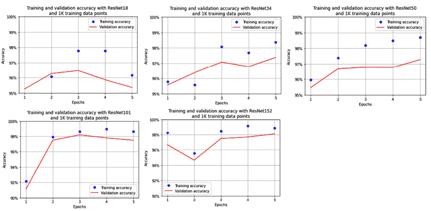

# 5

# 图像分类的迁移学习

在前一章中，我们了解到随着训练数据集中可用图像数量的增加，模型的分类准确率也在不断提高，以至于一个包含 8000 张图像的训练数据集在验证数据集上的准确率比一个包含 1000 张图像的训练数据集要高。然而，我们并不总是有数百或数千张图像以及它们对应类别的实际数据集选项，来训练模型。这就是迁移学习能发挥作用的地方。

迁移学习是一种技术，其中我们将模型在通用数据集上的学习迁移到感兴趣的特定数据集上。通常，用于进行迁移学习的预训练模型是在数百万张图像（这些图像是通用的，不是我们感兴趣的数据集）上训练的，然后这些预训练模型现在被微调到我们感兴趣的数据集上。

在本章中，我们将学习关于两种不同的迁移学习架构家族 - **视觉几何组** (**VGG**) 架构的变体和 **残差网络** (**ResNet**) 架构的变体。

除了理解架构之外，我们还将了解它们在两个不同用例中的应用，即年龄和性别分类，在这里我们将学习如何同时优化交叉熵和平均绝对误差损失，以估计一个人的年龄并预测其性别（给定一个人的图像），以及面部关键点检测（检测眼睛、眉毛和下巴轮廓等关键点，给定一个面部图像作为输入），在这里我们将学习如何利用神经网络在单次预测中生成多个（136 个而不是 1 个）连续输出。最后，我们将学习一个新的库，可以大大减少跨其余章节的代码复杂性。

总结一下，本章涵盖了以下主题：

+   引入迁移学习

+   理解 VGG16 和 ResNet 架构

+   实现面部关键点检测

+   多任务学习：实现年龄估计和性别分类

+   引入 `torch_snippets` 库

本章所有的代码都可以在本书 GitHub 仓库的 `Chapter05` 文件夹中找到 - [`bit.ly/mcvp-2e`](https://bit.ly/mcvp-2e)。

# 引入迁移学习

迁移学习是一种技术，利用从一个任务中获得的知识来解决另一个类似的任务。

想象一个模型，它在数百万张涵盖数千种物体类别（不仅仅是猫和狗）的图像上进行了训练。该模型的各种滤波器（核）会对图像中各种形状、颜色和纹理进行广泛激活。这些滤波器然后可以被重复使用，用于在新的图像上学习特征。在学习特征后，它们可以连接到隐藏层，然后连接到最终分类层，以便在新数据上进行自定义。

ImageNet ([`www.image-net.org/`](http://www.image-net.org/)) 是一个比赛，旨在将大约 1400 万张图像分类为 1000 个不同的类别。数据集中包含各种类别，包括印度大象、狮子鱼、硬盘、发胶和吉普车。

本章中要介绍的深度神经网络架构已经在 ImageNet 数据集上进行了训练。此外，考虑到在 ImageNet 中需要分类的对象的种类和数量，模型非常深，以尽可能多地捕捉信息。

让我们通过一个假设的场景来理解迁移学习的重要性。

考虑以下情况，我们正在处理道路的图像，并试图根据它们所包含的对象进行分类。从头开始建立模型可能会导致结果不佳，因为图像数量可能不足以学习数据集内的各种变化（正如我们在先前的用例中看到的，训练 8000 张图像比训练 1000 张图像在验证数据集上获得更高的准确性）。在这种情况下，预训练模型在 ImageNet 上训练就非常方便。在训练过程中，它已经学习了与交通相关的各种类别，如汽车、道路、树木和人类。因此，利用已训练好的模型将会导致更快速和更准确的训练，因为模型已经了解了通用形状，现在只需将其适配到特定图像上。

有了直觉之后，让我们现在来理解迁移学习的高级流程，如下所示：

1.  标准化输入图像，使用在预训练模型训练期间使用的相同*平均值*和*标准差*进行标准化。

1.  获取预训练模型的架构。获取这种架构的权重，这些权重是在大数据集上训练得到的结果。

1.  丢弃预训练模型的最后几层，以便我们可以微调这个特定数据集的最后几层。

1.  将截断的预训练模型连接到一个刚初始化的层（或多层），其中权重是随机初始化的。确保最后一层的输出具有与我们想要预测的类别/输出一样多的神经元。

1.  确保预训练模型的权重不可训练（换句话说，在反向传播期间被冻结/不更新），但新初始化层的权重及其与输出层连接的权重是可训练的。

我们不会训练预训练模型的权重，因为我们假设这些权重已经很好地适应了任务，因此利用大模型的学习。总结一下，我们只会学习我们小数据集的新初始化层。

1.  逐步增加时期更新可训练参数，以适应模型。

现在我们已经了解了如何实现迁移学习，让我们在接下来的章节中了解各种架构，它们是如何构建的，以及在将迁移学习应用于猫对狗的用例时的结果。首先，我们将详细介绍一些出自 VGG 的各种架构。

# 理解 VGG16 的架构

**VGG**代表**Visual** **Geometry** **Group**，它位于牛津大学。 *16*代表模型中的层数。VGG16 模型经过训练，用于在 ImageNet 竞赛中分类对象，并在 2014 年排名第二。我们研究这种架构而不是获胜架构（GoogleNet）的原因是其简单性及其被视觉社区广泛用于多种其他任务。

让我们了解 VGG16 的架构以及如何在 PyTorch 中访问和表示预训练的 VGG16 模型。

以下代码可以在 GitHub 上的`Chapter05`文件夹中的`VGG_architecture.ipynb`文件中找到，网址为[`bit.ly/mcvp-2e`](https://bit.ly/mcvp-2e)。

要开始使用 PyTorch 中的预训练 VGG16 模型，请按照以下步骤进行：

1.  安装所需的包：

    ```py
    import torchvision
    import torch.nn as nn
    import torch
    import torch.nn.functional as F
    from torchvision import transforms,models,datasets
    !pip install torch_summary
    from torchsummary import summary
    device = 'cuda' if torch.cuda.is_available() else 'cpu' 
    ```

`torchvision`包中的`models`模块托管了 PyTorch 中可用的各种预训练模型。

1.  加载 VGG16 模型并在设备上注册模型：

    ```py
    model = models.vgg16(pretrained=True).to(device) 
    ```

在上述代码中，我们调用了`models`类中的`vgg16`方法。通过指定`pretrained=True`，我们指定加载用于在 ImageNet 竞赛中分类图像的权重，然后将模型注册到设备上。

1.  获取模型的总结：

    ```py
    summary(model, torch.zeros(1,3,224,224)); 
    ```

上述代码的输出可以在 GitHub 上的相关笔记本中找到。

在上述总结中，我们提到的 16 层被分组如下：

```py
{1,2},{3,4,5},{6,7},{8,9,10},{11,12},{13,14},{15,16,17},{18,19},{20,21},{22,23,24},{25,26},{27,28},{29,30,31,32},{33,34,35},{36,37,38],{39} 
```

同样的总结也可以通过可视化呈现：


图 5.1：VGG16 架构

请注意，该网络中有大约 138 million 个参数（其中大约 122 million 个是网络末端的线性层– 102 + 16 + 4 million 个参数），包括 13 层卷积和/或池化层，以及 3 个线性层。

另一种理解 VGG16 模型组件的方式是通过如下方式打印它：

```py
model 
```

上述代码的输出可以在 GitHub 上找到。

请注意，模型中有三个主要子模块– `features`、`avgpool`和`classifier`。通常，我们会冻结`features`和`avgpool`模块。删除`classifier`模块（或仅删除底部的几层）并创建一个新模块，以预测与我们的数据集对应的所需类别数（而不是现有的 1,000 个类）。

## 实现 VGG16

现在让我们了解如何在实践中使用 VGG16 模型，使用猫狗数据集（仅考虑每个类别的 500 张图像进行训练）在以下代码中：

可在 GitHub 上的`Chapter05`文件夹中的`Implementing_VGG16_for_image_classification.ipynb`文件中找到以下代码，位于[`bit.ly/mcvp-2e`](https://bit.ly/mcvp-2e)。请务必从 GitHub 的笔记本复制 URL，以避免在复制结果时出现任何问题。

1.  安装所需的软件包：

    ```py
    import torch
    import torchvision
    import torch.nn as nn
    import torch.nn.functional as F
    from torchvision import transforms,models,datasets
    import matplotlib.pyplot as plt
    from PIL import Image
    from torch import optim
    device = 'cuda' if torch.cuda.is_available() else 'cpu'
    import cv2, glob, numpy as np, pandas as pd
    from glob import glob
    import torchvision.transforms as transforms
    from torch.utils.data import DataLoader, Dataset 
    ```

1.  下载数据集并指定训练和测试目录：

    1.  假设我们正在使用 Google Colab，我们执行以下步骤，提供认证密钥并将其放置在 Kaggle 可以使用该密钥进行身份验证并下载数据集的位置：

    ```py
    !pip install -q kaggle
    from google.colab import files
    files.upload()
    !mkdir -p ~/.kaggle
    !cp kaggle.json ~/.kaggle/
    !ls ~/.kaggle
    !chmod 600 /root/.kaggle/kaggle.json 
    ```

    1.  下载数据集并解压缩：

    ```py
    !kaggle datasets download -d tongpython/cat-and-dog
    !unzip cat-and-dog.zip 
    ```

    1.  指定训练和测试图像文件夹：

    ```py
    train_data_dir = 'training_set/training_set'
    test_data_dir = 'test_set/test_set' 
    ```

1.  提供返回猫和狗数据集的输入输出对的类，就像我们在前一章中所做的那样。请注意，在这种情况下，我们仅从每个文件夹中获取前 500 张图像：

    ```py
    class CatsDogs(Dataset):
        def __init__(self, folder):
            cats = glob(folder+'/cats/*.jpg')
            dogs = glob(folder+'/dogs/*.jpg')
            self.fpaths = cats**[:****500****]****[:****500****]** + dogs
     **self.normalize = transforms.Normalize(mean=[****0.485****,** 
    **0.456****,** **0.406****],std=[****0.229****,** **0.224****,** **0.225****])**
            from random import shuffle, seed; seed(10); 
            shuffle(self.fpaths)
            self.targets = [fpath.split('/')[-1].startswith('dog') for fpath \
                                                               in self.fpaths]
        def __len__(self): return len(self.fpaths)
        def __getitem__(self, ix):
            f = self.fpaths[ix]
            target = self.targets[ix]
            im = (cv2.imread(f)[:,:,::-1])
            im = cv2.resize(im, (224,224))
            im = torch.tensor(im/255)
            im = im.permute(2,0,1)
            **im = self.normalize(im)** 
            return (
                im.float().to(device), 
                torch.tensor([target]).float().to(device)
            ) 
    ```

本节中`cats_dogs`类与*第四章*中的主要区别在于我们正在使用`transforms`模块中的`Normalize`函数应用`normalize`函数。

当利用预训练模型时，必须对图像进行调整、排列，然后进行归一化（适用于该预训练模型），首先将图像缩放到 0 到 1 之间的值，跨越 3 个通道，然后对 RGB 通道进行均值归一化为`[0.485, 0.456, 0.406]`，标准差归一化为`[0.229, 0.224, 0.225]`。

1.  获取图像及其标签：

    ```py
    data = CatsDogs(train_data_dir) 
    ```

1.  现在让我们检查一个样本图像及其对应的类别：

    ```py
    im, label = data[200]
    plt.imshow(im.permute(1,2,0).cpu())
    print(label) 
    ```

1.  上述代码会产生以下输出：

    ```py
    # tensor([0.], device='cuda:0') 
    ```


图 5.2：输入样本图像

1.  下载预训练的 VGG16 权重，然后冻结`features`模块，并使用`avgpool`和`classifier`模块进行训练：

    1.  首先，从`models`类中下载预训练的 VGG16 模型。

    ```py
    def get_model():
        model = models.vgg16(pretrained=True) 
    ```

    1.  指定我们要冻结先前下载的模型中的所有参数：

    ```py
     for param in model.parameters():
            param.requires_grad = False 
    ```

    1.  替换`avgpool`模块以返回大小为 1 x 1 的特征映射，而不是 7 x 7；换句话说，输出现在将是`batch_size x 512 x 1 x 1`：

    ```py
     model.avgpool = nn.AdaptiveAvgPool2d(output_size=(1,1)) 
    ```

我们已经见过 `nn.MaxPool2d`，在这里我们从特征图的每个部分选取最大值。这个层的对应物称为 `nn.AvgPool2d`，它返回一个部分的平均值而不是最大值。在这两个层中，我们固定了核大小。上面的层 `nn.AdaptiveAvgPool2d` 是带有变化的另一种池化层。我们指定输出特征图的大小。该层自动计算核大小，以便返回指定的特征图大小。例如，如果输入特征图大小的维度为 `batch_size x 512 x k x k`，那么池化核大小将是 `k x k`。该层的主要优势是，无论输入大小如何，该层的输出始终是固定的，因此神经网络可以接受任何高度和宽度的图像。

1.  定义模型的 `classifier` 模块，在这里我们首先展平 `avgpool` 模块的输出，将 512 单元连接到 128 单元，并在连接到输出层之前执行激活：

1.  ```py
     model.classifier = nn.Sequential(nn.Flatten(),
                                        nn.Linear(512, 128),
                                        nn.ReLU(),
                                        nn.Dropout(0.2),
                                        nn.Linear(128, 1),
                                        nn.Sigmoid()) 
    ```

1.  定义损失函数（`loss_fn`）和 `optimizer`，并将它们与定义的模型一起返回：

1.  ```py
     loss_fn = nn.BCELoss()
        optimizer = torch.optim.Adam(model.parmeters(),lr= 1e-3)
        return model.to(device), loss_fn, optimizer 
    ```

请注意，在前面的代码中，我们首先冻结了预训练模型的所有参数，然后重写了 `avgpool` 和 `classifier` 模块。现在，剩下的代码将看起来与我们在前一章中看到的类似。

模型的摘要如下：

1.  ```py
    !pip install torch_summary
    from torchsummary import summary
    model, criterion, optimizer = get_model()
    summary(model, torch.zeros(1,3,224,224)) 
    ```

前面代码的输出可以在 GitHub 上关联的笔记本中找到。

请注意，可训练参数的数量仅为 65,793，总共为 14.7 百万，因为我们已冻结了 `features` 模块并已重写了 `avgpool` 和 `classifier` 模块。现在，只有 `classifier` 模块将具有将被学习的权重。

1.  定义一个函数来训练一个批次数据，计算准确率，并获取数据，就像我们在上一章中做的那样：

    1.  在一批数据上进行训练：

    ```py
    def train_batch(x, y, model, opt, loss_fn):
        model.train()
        prediction = model(x)
        batch_loss = loss_fn(prediction, y)
        batch_loss.backward()
        optimizer.step()
        optimizer.zero_grad()
        return batch_loss.item() 
    ```

    1.  定义一个函数来计算一批数据的准确率：

    ```py
    @torch.no_grad()
    def accuracy(x, y, model):
        model.eval()
        prediction = model(x)
        is_correct = (prediction > 0.5) == y
        return is_correct.cpu().numpy().tolist() 
    ```

    1.  定义一个函数来获取数据加载器：

    ```py
    def get_data():
        train = CatsDogs(train_data_dir)
        trn_dl = DataLoader(train, batch_size=32, huffle=True, \
                                              drop_last = True)
        val = CatsDogs(test_data_dir)
        val_dl = DataLoader(val, batch_size=32, huffle=True, drop_last = True)
        return trn_dl, val_dl 
    ```

    1.  初始化 `get_data` 和 `get_model` 函数：

    ```py
    trn_dl, val_dl = get_data()
    model, loss_fn, optimizer = get_model() 
    ```

1.  训练模型在不断增加的 epoch 上，就像我们在前一章中所做的那样：

    ```py
    train_losses, train_accuracies = [], []
    val_accuracies = []
    for epoch in range(5):
        print(f" epoch {epoch + 1}/5")
        train_epoch_losses, train_epoch_accuracies = [], []
        val_epoch_accuracies = []
        for ix, batch in enumerate(iter(trn_dl)):
            x, y = batch
            batch_loss = train_batch(x, y, modl, optimizer, loss_fn)
            train_epoch_losses.append(batch_loss) 
        train_epoch_loss = np.array(train_epoch_losses).mean()
        for ix, batch in enumerate(iter(trn_dl)):
            x, y = batch
            is_correct = accuracy(x, y, model)
            train_epoch_accuracies.extend(is_correct)
        train_epoch_accuracy = np.mean(train_epoch_accuracies)
        for ix, batch in enumerate(iter(val_dl)):
            x, y = batch
            val_is_correct = accuracy(x, y, model)
            val_epoch_accuracies.extend(val_is_correct)
        val_epoch_accuracy = np.mean(val_epoch_accuracies)
        train_losses.append(train_epoch_loss)
        train_accuracies.append(train_epoch_accuracy)
        val_accuracies.append(val_epoch_accuracy) 
    ```

1.  绘制随着 epoch 增加的训练和测试准确率值的图表：

    ```py
    epochs = np.arange(5)+1
    import matplotlib.ticker as mtick
    import matplotlib.pyplot as plt
    import matplotlib.ticker as mticker
    %matplotlib inline
    plt.plot(epochs, train_accuracies, 'bo', 
             label='Training accuracy')
    plt.plot(epochs, val_accuracies, 'r', 
             label='Validation accuracy')
    plt.gca().xaxis.set_major_locator(mticker.MultipleLocator(1))
    plt.title('Training and validation accuracy \
    with VGG16 \nand 1K training data points')
    plt.xlabel('Epochs')
    plt.ylabel('Accuracy')
    plt.ylim(0.95,1)
    plt.gca().set_yticklabels(['{:.0f}%'.format(x*100) \
                               for x in plt.gca().get_yticks()]) 
    plt.legend()
    plt.grid('off')
    plt.show() 
    ```

结果如下输出：


图 5.3：VGG16 使用 1K 训练数据点的训练和验证准确率

请注意，即使在 1,000 张图像（每类 500 张图像）的小数据集上，我们在第一个 epoch 内也能获得 98% 的准确率。

除了 VGG16 外，还有 VGG11 和 VGG19 预训练架构，它们的工作原理与 VGG16 类似，但层数不同。VGG19 的参数比 VGG16 多，因为它有更多的层。

当我们在 VGG16 的位置上使用 VGG11 和 VGG19 预训练模型时，训练和验证准确率如下：


图 5.4：（左）使用 1K 训练数据点的 VGG19 准确率；（右）使用 1K 训练数据点的 VGG11 准确率

请注意，尽管基于 VGG19 的模型在验证数据上的准确率略高于基于 VGG16 的模型，达到了 98%，基于 VGG11 的模型准确率稍低，只有 97%。

从 VGG16 到 VGG19，我们增加了层次的数量，通常来说，神经网络层数越深，准确率就会越好。

然而，如果仅仅增加层数就是诀窍的话，那么我们可以继续向模型中添加更多层次（同时要注意避免过拟合），以在 ImageNet 上获得更精确的结果，然后对感兴趣的数据集进行微调。不幸的是，这并不是真的。

有多种原因使得这并不那么容易。当我们在架构上变得更深时，可能会发生以下任何一种情况：

+   我们必须学习更多的特征。

+   梯度消失问题会出现。

+   在更深的层次上有太多的信息修改。

ResNet 在此特定场景中应运而生，以解决识别不需要学习的情况，我们将在下一节讨论。

# 理解 ResNet 架构

当构建过深的网络时，会出现两个问题。在前向传播中，网络的最后几层几乎无法获取原始图像的信息。在反向传播中，靠近输入的前几层由于梯度消失几乎不会获得梯度更新（换句话说，它们几乎为零）。为了解决这两个问题，ResNet 使用类似高速公路的连接，将前几层的原始信息传递给后面的层次。理论上，甚至最后一层也将由于这种高速公路网络而获得原始图像的所有信息。由于跳跃连接的存在，反向梯度将自由流动到初始层，并几乎没有修改。

在残差网络中，“残差”一词指的是模型预期从前一层学习到的额外信息，需要传递给下一层。

典型的残差块如下所示：


图 5.5：残差块

正如您所见，到目前为止，我们一直对提取`F(x)`值感兴趣，其中`x`是来自前一层的值，在残差网络的情况下，我们不仅仅是提取通过权重层传递后的值，即 F(x)，还将 F(x)与原始值`x`相加。

到目前为止，我们一直在使用执行线性或卷积变换 `F(x)` 的标准层以及一些非线性激活。这两种操作在某种意义上都会破坏输入信息。这是第一次，我们看到一个层不仅转换输入，还通过将输入直接添加到转换中来保留输入，即 `F(x) + x`。因此，在某些情况下，该层几乎不需要记住输入是什么，并且可以专注于学习任务的正确转换。

让我们通过代码更详细地查看残差层，构建一个残差块：

此部分的完整代码可以在 GitHub 上的 `Implementing_ResNet18_for_image_classification.ipynb` 文件中找到，位于 `Chapter05` 文件夹中，网址为 [`bit.ly/mcvp-2e`](https://bit.ly/mcvp-2e)。

1.  在 `__init__` 方法中定义一个具有卷积操作（前面图表中的权重层）的类：

    ```py
    class ResLayer(nn.Module):
         def __init__(self,ni,no,kernel_size,stride=1):
            super(ResLayer, self).__init__()
            padding = kernel_size - 2
            self.conv = nn.Sequential( \
                            nn.Conv2d(ni, no, kernel_size, stride,
                                      padding=padding),
                            nn.ReLU()
            ) 
    ```

请注意，在上述代码中，我们将 `padding` 定义为通过卷积传递时的输出维度，如果我们要对两者求和，则输入的维度应保持不变。

1.  定义 `forward` 方法：

    ```py
     def forward(self, x):
             x = self.conv(x) + x
             return x 
    ```

在上述代码中，我们得到一个输出，它是输入经过卷积操作和原始输入的和。

现在我们已经学习了残差块的工作原理，让我们了解一下如何在预训练的基于残差块的网络 ResNet18 中连接残差块：


图 5.6：ResNet18 架构

正如您所见，该架构中有 18 层，因此被称为 ResNet18 架构。此外，请注意如何跨网络进行跳跃连接。它们不是在每个卷积层之后进行连接，而是在每两个层之后进行连接。

## 实现 ResNet18

通过理解 ResNet 架构的组成，让我们基于 ResNet18 架构构建一个模型，用于对狗和猫进行分类，就像我们在之前的部分中使用 VGG16 一样。

要构建一个分类器，*实现 VGG16* 部分到 *步骤 3* 的代码保持不变，因为它涉及导入包、获取数据和检查它们。因此，我们将从理解预训练的 ResNet18 模型的组成开始：

此部分的完整代码可以在 GitHub 上的 `Resnet_block_architecture.ipynb` 文件中找到，位于 `Chapter05` 文件夹中，网址为 [`bit.ly/mcvp-2e`](https://bit.ly/mcvp-2e)。考虑到大部分代码与 *实现 VGG16* 部分的代码相似，我们只提供了额外的代码以简洁为目的。如需完整代码，请参考 GitHub 上的笔记本。

1.  加载预训练的 ResNet18 模型并检查加载模型中的模块：

    ```py
    model = models.resnet18(pretrained=True).to(device)
    model 
    ```

ResNet18 模型的结构包含以下组件：

+   卷积

+   批归一化

+   ReLU

+   `MaxPooling`

+   四层 ResNet 块

+   平均池化（`avgpool`）

+   一个全连接层（`fc`）

就像我们在 VGG16 中所做的那样，我们将冻结所有不同的模块，但在接下来的步骤中更新`avgpool`和`fc`模块的参数。

1.  定义模型架构、损失函数和优化器：

    ```py
    def get_model():
        model = models.resnet18(pretrained=True)
        for param in model.parameters():
            param.requires_grad = False
        model.avgpool = nn.AdaptiveAvgPool2d(output_size=(1,1))
        model.fc = nn.Sequential(nn.Flatten(),
        nn.Linear(512, 128),
        nn.ReLU(),
        nn.Dropout(0.2),
        nn.Linear(128, 1),
        nn.Sigmoid())
        loss_fn = nn.BCELoss()
        optimizer = torch.optim.Adam(model.parameter(),lr= 1e-3)
        return model.to(device), loss_fn, optimizer 
    ```

在前述模型中，`fc`模块的输入形状是 512，因为`avgpool`的输出形状为批次大小 x 512 x 1 x 1。

现在我们已经定义了模型，让我们执行*实施 VGG*部分的*步骤 5*和*6*。在对模型（其中模型为 ResNet18、ResNet34、ResNet50、ResNet101 和 ResNet152，每个图表的训练和验证精度）进行增加的 epoch 训练后，训练和验证精度的变化如下：



图 5.7：使用不同数量的 ResNet 层进行训练和验证的准确率

我们看到模型在仅训练了 1,000 张图像后的准确性在 97%到 98%之间变化，其中随着 ResNet 层数的增加，准确性也随之增加。

除了 VGG 和 ResNet 之外，其他一些著名的预训练模型还包括 Inception、MobileNet、DenseNet 和 SqueezeNet。

现在我们已经了解了如何利用预训练模型来预测一个二元类别，接下来，在接下来的几节中，我们将学习如何利用预训练模型来解决涉及以下内容的真实用例：

+   **多重回归**：针对给定图像进行多个值的预测 – 面部关键点检测

+   **多任务学习**：在单次预测中预测多个项目 – 年龄估计和性别分类

# 实现面部关键点检测

到目前为止，我们已经学习了如何预测二元类别（猫与狗）或多标签（时尚-MNIST）。现在让我们学习一个回归问题，通过这样做，我们可以预测不止一个而是多个连续输出（因此是多重回归学习）。

想象一种情境，您被要求预测图像上面部的关键点；例如，眼睛、鼻子和下巴的位置。在这种情况下，我们需要采用一种新策略来构建一个检测关键点的模型。

在我们进一步深入之前，让我们通过下面的图像了解我们试图实现什么：


图 5.8：（左）输入图像；（右）覆盖了面部关键点的输入图像

正如您可以在前面的图像中观察到的那样，面部关键点表示了图像中包含面部的各种关键点的标记。

要解决这个问题，我们首先必须解决其他几个问题：

+   图像可以有不同的形状。这要求在调整图像以将它们全部调整为标准图像尺寸时，调整关键点的位置。

+   面部关键点类似于散点图上的点，但这次基于某种模式分散。这意味着这些值在图像被调整为 224 x 224 x 3 的形状时，可以在 0 到 224 之间的任何地方。

+   根据图像的大小规范化因变量（面部关键点的位置）。如果考虑到它们相对于图像尺寸的位置，关键点值始终在 0 和 1 之间。

+   鉴于因变量值始终在 0 和 1 之间，我们可以在最后使用一个 sigmoid 层来获取值，这些值将在 0 和 1 之间。

现在让我们为解决面部关键点检测用例制定流水线：

下面的代码可以在位于 GitHub 的`Chapter05`文件夹中的`2D_and_3D facial_keypoints_detection.ipynb`文件中找到，链接为[`bit.ly/mcvp-2e`](https://bit.ly/mcvp-2e)。确保从 GitHub 的笔记本中复制代码，以避免在重现结果时出现问题。

1.  导入相关包和数据集：

    ```py
    import torchvision
    import torch.nn as nn
    import torch
    import torch.nn.functional as F
    from torchvision import transforms, models, datasets
    from torchsummary import summary
    import numpy as np, pandas as pd, os, glob, cv2
    from torch.utils.data import TensorDataset,DataLoader,Dataset
    from copy import deepcopy
    from mpl_toolkits.mplot3d import Axes3D
    import matplotlib.pyplot as plt
    %matplotlib inline
    from sklearn import cluster
    device = 'cuda' if torch.cuda.is_available() else 'cpu' 
    ```

1.  下载并导入相关数据。您可以下载包含图像及其对应的面部关键点的相关数据：

    ```py
    !git clone https://github.com/udacity/P1_Facial_Keypoints.git
    !cd P1_Facial_Keypoints
    root_dir = 'P1_Facial_Keypoints/data/training/'
    all_img_paths = glob.glob(os.path.join(root_dir, '*.jpg'))
    data = pd.rea_csv('P1_Facial_Keypoints/data/training_frames_keypoints.csv') 
    ```

导入数据集的样本如下所示：


图 5.9：输入数据集

在上述输出中，第 1 列表示图像的名称，偶数列表示与脸部 68 个关键点中的每一个对应的*x*轴值，其余的奇数列（除了第一列）表示与脸部 68 个关键点中的每一个对应的*y*轴值。

1.  定义`FacesData`类，为数据加载器提供输入和输出数据点：

    ```py
    class FacesData(Dataset): 
    ```

    1.  现在让我们定义`__init__`方法，该方法以文件的 DataFrame (`df`) 作为输入：

    ```py
     def __init__(self, df):
            super(FacesData).__init__()
            self.df = df 
    ```

    1.  定义用于预处理图像以便预训练 VGG16 模型能够使用的均值和标准差：

    ```py
     self.normalize = transforms.Normalize(
                                    mean=[0.485, 0.456, 0.406], 
                                    std=[0.229, 0.224, 0.225]) 
    ```

    1.  现在，定义`__len__`方法：

    ```py
     def __len__(self): return len(self.df) 
    ```

    1.  定义`__getitem__`方法，并获取与给定索引(`ix`)对应的图像路径：

    ```py
     def __getitem__(self, ix):
            img_path = 'P1_Facial_Keypoints/data/training/' + self.df.iloc[ix,0] 
    ```

    1.  缩放图像：

    ```py
     img = cv2.imread(img_path)/255. 
    ```

    1.  将预期的输出值（关键点）规范化为原始图像大小的比例：

    ```py
     kp = deepcopy(self.df.iloc[ix,1:].tolist())
            kp_x = (np.array(kp[0::2])/img.shape[1]).tolist()
            kp_y = (np.array(kp[1::2])/img.shape[0]).tolist() 
    ```

    1.  在上述代码中，我们确保关键点被提供为原始图像尺寸的比例。这样做是为了在调整原始图像大小时，关键点的位置不会改变，因为关键点是按照原始图像的比例提供的。此外，通过这样做，我们有了预期的输出值，这些值在 0 到 1 之间。

    1.  在预处理图像后返回关键点(`kp2`)和图像(`img`)：

    ```py
     kp2 = kp_x + kp_y
            kp2 = torch.tensor(kp2) 
            img = self.preprocess_input(img)
            return img, kp2 
    ```

    1.  定义预处理图像的函数(`preprocess_input`)：

    ```py
     def preprocess_input(self, img):
            img = cv2.resize(img, (224,224))
            img = torch.tensor(img).permute(2,0,1)
            img = self.normalize(img).float()
            return img.to(device) 
    ```

    1.  定义一个加载图像的函数，当我们希望可视化测试图像和测试图像的预测关键点时，这将非常有用：

    ```py
     def load_img(self, ix):
            img_path = 'P1_Facial_Keypoints/data/training/' + self.df.iloc[ix,0]
            img = cv2.imread(img_path)
            img = cv2.cvtColor(img, cv2.COLOR_BGR2RGB)/255.
            img = cv2.resize(img, (224,224))
            return img 
    ```

1.  现在让我们创建训练和测试数据集，并建立训练和测试数据加载器：

    ```py
    from sklearn.model_selection import train_test_split
    train, test = train_test_split(data, tst_size=0.2, random_state=101)
    train_dataset = FacesData(train.reset_index(drop=True))
    test_dataset = FacesData(test.reset_index(drop=True))
    train_loader = DataLoader(train_dataset, batch_size=32)
    test_loader = DataLoader(test_dataset, batch_size=32) 
    ```

在上述代码中，我们已经按输入数据帧中的人名拆分了训练和测试数据集，并获取了它们对应的对象。

1.  现在让我们定义一个模型，我们将利用它来识别图像中的关键点：

    1.  加载预训练的 VGG16 模型：

    ```py
    def get_model():
        model = models.vgg16(pretrained=True) 
    ```

    1.  确保先冻结预训练模型的参数：

    ```py
     for param in model.parameters():
            param.requires_grad = False 
    ```

    1.  覆盖并解冻模型的最后两层参数：

    ```py
     model.avgpool = nn.Sequential( nn.Conv2d(512,512,3),
                                          nn.MaxPool2d(2),
                                          nn.Flatten())
        model.classifier = nn.Sequential(
                                          nn.Linear(2048, 512),
                                          nn.ReLU(),
                                          nn.Dropout(0.5),
                                          nn.Linear(512, 136),
                                          nn.Sigmoid()
                                        ) 
    ```

    1.  请注意，在 `classifier` 模块中模型的最后一层是一个返回值在 0 到 1 之间的 sigmoid 函数，并且预期的输出将始终在 0 到 1 之间，因为关键点位置是原始图像尺寸的一部分。

    1.  定义损失函数和优化器，并将它们与模型一起返回：

    ```py
     criterion = nn.L1Loss()
        optimizer = torch.optim.Adam(mode.parameters(), lr=1e-4)
        return model.to(device), criterion, optimizer 
    ```

1.  请注意，损失函数为 `L1Loss`；换句话说，我们正在对面部关键点位置的预测进行均值绝对误差减小（这将被预测为图像宽度和高度的百分比）。

1.  获取模型、损失函数和相应的优化器：

    ```py
    model, criterion, optimizer = get_model() 
    ```

1.  定义函数以在一批数据点上进行训练，并在测试数据集上进行验证：

    1.  训练一个批次，与之前所做的一样，涉及获取通过模型传递输入的输出、计算损失值并进行反向传播以更新权重：

    ```py
    def train_batch(img, kps, model, optimizer, criterion):
        model.train()
        optimizer.zero_grad()
        _kps = model(img.to(device))
        loss = criterion(_kps, kps.to(device))
        loss.backward()
        optimizer.step()
        return loss 
    ```

    1.  构建一个函数，返回测试数据上的损失和预测的关键点：

    ```py
    def validate_batch(img, kps, model, criterion):
        model.eval()
        _kps = model(img.to(device))
        loss = criterion(_kps, kps.to(device))
        return _kps, loss 
    ```

1.  根据训练数据加载器训练模型，并在测试数据上进行测试，就像我们在之前的章节中所做的那样：

    ```py
    train_loss, test_loss = [], []
    n_epochs = 50
    for epoch in range(n_epochs):
        print(f" epoch {epoch+ 1} : 50")
        epoch_train_loss, epoch_test_loss = 0, 0
        for ix, (img,kps) in enumerate(train_loader):
            loss = train_batch(img, kps, mdel, optimizer, criterion)
            epoch_train_loss += loss.item() 
        epoch_train_loss /= (ix+1)
        for ix,(img,kps) in enumerate(test_loadr):
           ps,  loss = validate_batch(img, kps, model, criterion)
            epoch_test_loss += loss.item() 
        epoch_test_loss /= (ix+1)
        train_loss.append(epoch_train_loss)
        test_loss.append(epoch_test_loss) 
    ```

1.  绘制随着 epoch 增加的训练和测试损失：

    ```py
    epochs = np.arange(50)+1
    import matplotlib.ticker as mtick
    import matplotlib.pyplot as plt
    import matplotlib.ticker as mticker
    %matplotlib inline
    plt.plot(epochs, train_loss, 'bo', label='Training loss')
    plt.plot(epochs, test_loss, 'r', label='Test loss')
    plt.title('Training and Test loss over increasing epochs')
    plt.xlabel('Epochs')
    plt.ylabel('Loss')
    plt.legend()
    plt.grid('off')
    plt.show() 
    ```

上述代码的输出如下所示：


图 5.10：随着 epoch 增加的训练和测试损失

1.  测试我们的模型在一个随机测试图像的索引上，假设为 `0`。请注意，在以下代码中，我们正在利用早前创建的 `FacesData` 类中的 `load_img` 方法：

    ```py
    ix = 0
    plt.figure(figsize=(10,10))
    plt.subplot(221)
    plt.title('Original image')
    im = test_dataset.load_img(ix)
    plt.imshow(im)
    plt.grid(False)
    plt.subplot(222)
    plt.title('Image with facial keypoints')
    x, _ = test_dataset[ix]
    plt.imshow(im)
    kp = model(x[None]).flatten().detach().cpu()
    plt.scatter(kp[:68]*224, kp[68:]*224, c='r')
    plt.grid(False)
    plt.show() 
    ```

上述代码的输出如下所示：


图 5.11：（左）原始图像；（右）与预测的面部关键点叠加的原始图像

从上述图像中，我们看到模型能够相当精确地识别面部关键点。

在本节中，我们从头开始构建了面部关键点检测器模型。然而，有些预训练模型既适用于 2D 又适用于 3D 点检测。考虑到有多个数据集/来源可获取面部图像，如果我们在包含比我们之前使用的数据集中更多面部图像的大型数据集上构建模型，会怎么样？

## 2D 和 3D 面部关键点检测

在本节中，我们将利用一个预训练模型，该模型可以在几行代码中检测人脸中存在的二维和三维关键点。

可以在 GitHub 上的`Chapter05`文件夹中的`2D_and_3D facial_keypoints.ipynb`文件中找到以下代码。请确保从 GitHub 的笔记本中复制代码，以避免再现结果时出现问题。

为了处理这个问题，我们将利用`face-alignment`库：

1.  安装所需的包：

    ```py
    !pip install -qU face-alignment
    import face_alignment, cv2 
    ```

1.  导入图片：

    ```py
    !wget https://www.dropbox.com/s/2s7x/Hema.JPG 
    ```

1.  定义面部对齐方法，我们可以指定是否要获取 2D 或 3D 中的关键点地标：

    ```py
    fa = face_alignment.FaceAlignment(face_alignment.LandmarksType.TWO_D, 
                        flip_input=False, device='cpu') 
    ```

1.  读取输入图像并将其提供给`get_landmarks`方法：

    ```py
    input = cv2.imread('Hema.JPG')
    preds = fa.get_landmarks(input)[0]
    print(preds.shape)
    # (68,2) 
    ```

在前面的代码行中，我们利用`fa`类中的`get_landmarks`方法来获取对应于面部关键点的 68 个*x*和*y*坐标。

1.  绘制带有检测到的关键点的图像：

    ```py
    import matplotlib.pyplot as plt
    %matplotlib inline
    fig,ax = plt.subplots(figsize=(5,5))
    plt.imshow(cv2.cvtColor(cv2.imread('Hema.JPG'), cv2.COLOR_BGR2RGB))
    ax.scatter(preds[:,0], preds[:,1], marker='+', c='r')
    plt.show() 
    ```

上述代码的结果如下。请注意在 68 个可能的面部关键点周围的+符号的散点图：


图 5.12：叠加预测关键点的输入图像

类似地，通过以下方式获得面部关键点的 3D 投影：

1.  ```py
    fa = face_alignment.FaceAlignment(face_alignment.**LandmarksType.THREE_D**, 
                              flip_input=False, device='cpu')
    input = cv2.imread('Hema.JPG')
    preds = fa.get_landmarks(input)[0]
    import pandas as pd
    df = pd.DataFrame(preds)
    df.columns = ['x','y','z']
    import plotly.express as px
    fig = px.scatter_3d(df, x = 'x', y = 'y', z = 'z')
    fig.show() 
    ```

请注意，与 2D 关键点场景中使用的代码唯一的更改是我们在`LandmarksType`中指定为 3D，而不是 2D。上述代码的结果如下：


图 5.13：预测的 3D 面部关键点

利用`face_alignment`库的代码，我们可以利用预训练的面部关键点检测模型，在新图像上有高准确率的预测能力。

到目前为止，在不同的使用案例中，我们学到了以下内容：

+   **猫与狗**：进行二元分类预测

+   **FashionMNIST**：在 10 个可能的类别中预测标签

+   **面部关键点**：预测给定图像的多个值，介于 0 和 1 之间

在下一节中，我们将学习如何使用单个网络同时预测二进制类和回归值。

# 实施年龄估计和性别分类

多任务学习是研究的一个分支，其中使用单个/少量输入来预测几个不同但最终相关的输出。例如，在自动驾驶汽车中，模型需要识别障碍物、规划路线以及正确控制油门/刹车和转向等。它需要通过考虑相同的输入（来自多个传感器）在瞬间完成所有这些任务。此外，多任务学习有助于学习可以跨多个任务交叉利用的领域特定特征，可能在同一领域内。

根据我们迄今解决的各种用例，我们现在能够训练神经网络并在给定图像时估计一个人的年龄或预测一个人的性别，分别一次处理一个任务。但是，我们尚未查看过能够从图像中一次预测年龄和性别的情况。在单次预测中预测两种不同的属性非常重要，因为同一图像用于两种预测（在*第七章*中进行对象检测时将进一步体现）。

在本节中，我们将学习如何在单个前向传递中预测连续和分类预测两个属性。

可在 GitHub 的`Chapter05`文件夹中的`Age_and_gender_prediction.ipynb`文件中找到本节的完整代码，位于[`bit.ly/mcvp-2e`](https://bit.ly/mcvp-2e)。请确保从 GitHub 笔记本中复制代码以避免重现结果时出现任何问题。

要开始在单个前向传递中预测连续和分类属性，请按照以下步骤进行操作：

1.  导入相关包：

    ```py
    import torch
    import numpy as np, cv2, pandas as pd, glob, time
    import matplotlib.pyplot as plt
    %matplotlib inline
    import torch.nn as nn
    from torch import optim
    import torch.nn.functional as F
    from torch.utils.data import Dataset, DataLoader
    import torchvision
    from torchvision import transforms, models, datasets
    device = 'cuda' if torch.cuda.is_available() else 'cpu' 
    ```

1.  获取数据集：

    ```py
    from pydrive.auth import GoogleAuth
    from pydrive.drive import GoogleDrive
    from google.colab import auth
    from oauth2client.client import GoogleCredentials
    auth.authenticate_user()
    gauth = GoogleAuth()
    gauth.credentials=GoogleCredentials.get_application_default()
    drive = GoogleDrive(gauth)
    def getFile_from_drive( file_id, name ):
        downloaded = drive.CreateFile({'id': file_id})
        downloaded.GetContentFile(name)
    getFile_from_drive('1Z1RqRo0_JiavaZw2yzZG6WETdZQ8qX86', 
                       'fairface-img-margin025-trainval.zip')
    getFile_from_drive('1k5vvyREmHDW5TSM9QgB04Bvc8C8_7dl-', 
                                'fairface-label-train.csv')
    getFile_from_drive('1_rtz1M1zhvS0d5vVoXUamnohB6cJ02iJ', 
                                  'fairface-label-val.csv')
    !unzip -qq fairface-img-margin025-trainval.zip 
    ```

1.  我们下载的数据集可以加载，并且结构如下所示：

    ```py
    trn_df = pd.read_csv('fairface-label-train.csv')
    val_df = pd.read_csv('fairface-label-val.csv')
    trn_df.head() 
    ```

前面的代码会产生如下输出：


图 5.14：输入数据集

在上图中，请注意数据集包含文件的路径、年龄、性别和与图像相关的种族。

1.  构建`GenderAgeClass`类，该类以文件名作为输入，并返回相应的图像、性别和缩放后的年龄。我们对`age`进行缩放，因为它是一个连续的数值，并且正如我们在*第三章*中看到的，缩放数据可以避免梯度消失，并且在后处理期间重新缩放它：

    1.  在`__init__`方法中提供图像的文件路径（`fpaths`）：

    ```py
    IMAGE_SIZE = 224
    class GenderAgeClass(Dataset):
        def __init__(self, df, tfms=None):
            self.df = df
            self.normalize = transforms.Normalize(
                                    mean=[0.485, 0.456, 0.406], 
                                    std=[0.229, 0.224, 0.225]) 
    ```

    1.  定义`__len__`方法，该方法返回输入中图像的数量：

    ```py
     def __len__(self): return len(self.df) 
    ```

    1.  定义`__getitem__`方法，用于获取给定位置`ix`的图像信息：

    ```py
     def __getitem__(self, ix):
            f = self.df.iloc[ix].squeeze()
            file = f.file
            gen = f.gender == 'Female'
            age = f.age
            im = cv2.imread(file)
            im = cv2.cvtColor(im, cv2.COLOR_BGR2RGB)
            return im, age, gen 
    ```

    1.  编写一个预处理图像的函数，包括调整图像大小、置换通道和对缩放图像进行归一化：

    ```py
     def preprocess_image(self, im):
            im = cv2.resize(im, (IMAGE_SIZE, IMAGE_SIZE))
            im = torch.tensor(im).permute(2,0,1)
            im = self.normalize(im/255.)
            return im[None] 
    ```

    1.  创建`collate_fn`方法，获取一个批次的数据，其中数据点按以下方式预处理：

        +   使用`process_image`方法处理每个图像。

        +   将年龄按 80（数据集中的最大`age`值）进行缩放，以使所有值都在 0 到 1 之间。

        +   将`gender`转换为浮点值。

        +   `image`、`age`和`gender`分别转换为`torch`对象并返回：

    ```py
     def collate_fn(self, batch):
            'preprocess images, ages and genders'
            ims, ages, genders = [], [], []
            for im, age, gender in batch:
                im = self.preprocess_image(im)
                ims.append(im)
                ages.append(float(int(age)/80))
                genders.append(float(gender))
            ages, genders = [torch.tensor(x).to(device).float() \
                                for x in [ages, genders]]
            ims = torch.cat(ims).to(device)
            return ims, ages, genders 
    ```

1.  现在我们定义训练和验证数据集以及数据加载器：

    1.  创建数据集：

    ```py
    trn = GenderAgeClass(trn_df)
    val = GenderAgeClass(val_df) 
    ```

    1.  指定数据加载器：

    ```py
    device = 'cuda' if torch.cuda.is_available() else 'cpu'
    train_loader = DataLoader(trn, batch_size=32, shuffle=True, 
                              drop_last=True,collate_fn=trn.collate_fn)
    test_loader = DataLoader(val, batch_size=32, 
                             collate_fn=val.collate_fn)
    a,b,c, = next(iter(train_loader))
    print(a.shape, b.shape, c.shape) 
    ```

1.  定义模型、损失函数和优化器：

    1.  首先，在函数中加载预训练的 VGG16 模型：

    ```py
    def get_model():
        model = models.vgg16(pretrained = True) 
    ```

    1.  接下来，冻结加载的模型（通过指定`param.requires_grad = False`）：

    ```py
     for param in model.parameters():
            param.requires_grad = False 
    ```

    1.  用我们自己的层覆盖`avgpool`层：

    ```py
     model.avgpool = nn.Sequential(
                            nn.Conv2d(512,512, kernel_size=3),
                            nn.MaxPool2d(2),
                            nn.ReLU(),
                            nn.Flatten()
                           ) 
    ```

现在到了关键部分。我们偏离了迄今为止学到的内容，通过创建两个输出分支来执行：

1.  在 `__init__` 方法中构建名为 `ageGenderClassifier` 的神经网络类：

1.  ```py
     class ageGenderClassifier(nn.Module):
            def __init__(self):
                super(ageGenderClassifier, self).__init__() 
    ```

1.  定义 `intermediate` 层的计算：

1.  ```py
     self.intermediate = nn.Sequential(
                                        nn.Linear(2048,512),
                                        nn.ReLU(),
                                        nn.Dropout(0.4),
                                        nn.Linear(512,128),
                                        nn.ReLU(),
                                        nn.Dropout(0.4),
                                        nn.Linear(128,64),
                                        nn.ReLU(),
                                      ) 
    ```

1.  定义 `age_classifier` 和 `gender_classifier`：

1.  ```py
     self.age_classifier = nn.Sequential(
                                            nn.Linear(64, 1),
                                            nn.Sigmoid()
                                        )
                self.gender_classifier = nn.Sequential(
                                            nn.Linear(64, 1),
                                            nn.Sigmoid()
                                           ) 
    ```

    注意，在上述代码中，最后的层具有 sigmoid 激活，因为 `age` 输出将是一个在 0 到 1 之间的值（因为它被 80 缩放），而 `gender` 的输出是 sigmoid，因为输出要么是 `0` 要么是 `1`。

1.  定义前向传递方法，首先堆叠 `intermediate` 层，然后是 `age_classifier`，然后是 `gender_classifier`：

1.  ```py
     def forward(self, x):
                x = self.intermediate(x)
                age = self.age_classifier(x)
                gender = self.gender_classifier(x)
                return gender, age 
    ```

1.  使用我们之前定义的类覆盖 `classifier` 模块：

1.  ```py
     model.classifier = ageGenderClassifier() 
    ```

1.  定义性别（二元交叉熵损失）和年龄（L1 损失）预测的损失函数。定义优化器并返回模型、损失函数和优化器，如下所示：

1.  ```py
     gender_criterion = nn.BCELoss()
        age_criterion = nn.L1Loss()
        loss_functions = gender_criterion, age_criterion
        optimizer = torch.optim.Adam(modelparameters(),lr= 1e-4)
        return model.to(device), loss_functions, optimizer 
    ```

1.  调用 `get_model` 函数以初始化变量中的值：

1.  ```py
    model, criterion, optimizer = get_model() 
    ```

1.  定义训练批次数据和验证数据集批次的函数。`train_batch` 方法接受图像、实际的性别、年龄值、模型、优化器和损失函数作为输入，以计算损失，如下所示：

    1.  定义带有输入参数的 `train_batch` 方法：

    ```py
    def train_batch(data, model, optimizer, criteria): 
    ```

    1.  指定我们正在训练模型，将优化器重置为 `zero_grad`，并计算预测的 `age` 和 `gender` 的值：

    ```py
     model.train()
        ims, age, gender = data
        optimizer.zero_grad()
        pred_gender, pred_age = model(ims) 
    ```

    1.  在计算年龄估计和性别分类的损失之前获取年龄和性别的损失函数：

    ```py
     gender_criterion, age_criterion = criteria
        gender_loss = gender_criterion(predgender.squeeze(), gender)
        age_loss = age_criterion(pred_age.squeeze(), age) 
    ```

    1.  通过将 `gender_loss` 和 `age_loss` 相加来计算总体损失，并通过优化模型的可训练权重执行反向传播以减少总体损失，并返回总体损失：

    ```py
     total_loss = gender_loss + age_loss
        total_loss.backward()
        optimizer.step()
        return total_loss 
    ```

1.  `validate_batch` 方法接受图像、模型和损失函数，以及实际的年龄和性别值作为输入，计算年龄和性别的预测值以及损失值，如下所示：

    1.  使用适当的输入参数定义 `validate_batch` 函数：

    ```py
    def validate_batch(data, model, criteria): 
    ```

    1.  指定我们要评估模型，因此在通过模型传递图像预测年龄和性别值之前不需要进行梯度计算：

    ```py
     model.eval()
        with torch.no_grad():
            pred_gender, pred_age = model(img) 
    ```

    1.  计算对应于年龄和性别预测的损失值 (`gender_loss` 和 `age_loss`)。我们将预测值（其形状为 `(批次大小，1)`）压缩，以便将其重塑为与原始值相同形状的形式（其形状为批次大小）：

    ```py
     gender_criterion, age_criterion = criteria
        gender_loss = gender_criterion(prd_gender.squeeze(), gender)
        age_loss = age_criterion(pred_age.squeeze(), age) 
    ```

    1.  计算总体损失和最终预测的性别类别 (`pred_gender`)，并返回预测的性别、年龄和总损失：

    ```py
     total_loss = gender_loss + age_loss
        pred_gender = (pred_gender > 0.5).squeeze()
        gender_acc = (pred_gender == gender).float().sum()
        age_mae = torch.abs(age - pred_age).float().sum()
        return total_loss, gender_acc, age_mae 
    ```

1.  在五个周期内训练模型：

    1.  定义占位符以存储训练和测试损失值，并指定周期数：

    ```py
    import time
    model, criteria, optimizer = get_model()
    val_gender_accuracies = []
    val_age_maes = []
    train_losses = []
    val_losses = []
    n_epochs = 5
    best_test_loss = 1000
    start = time.time() 
    ```

    1.  循环遍历不同的周期，并在每个周期开始时重新初始化训练和测试损失值：

    ```py
    for epoch in range(n_epochs):
        epoch_train_loss, epoch_test_loss = 0, 0
        val_age_mae, val_gender_acc, ctr = 0, 0, 0
        _n = len(train_loader) 
    ```

    1.  遍历训练数据加载器（`train_loader`）并训练模型：

    ```py
     for ix, data in enumerate(train_loader):
            loss = train_batch(data, model, optimizer, criteria)
            epoch_train_loss += loss.item() 
    ```

    1.  遍历测试数据加载器并计算性别准确率以及年龄的 `mae`：

    ```py
     for ix, data in enumerate(test_loader):
            loss, gender_acc, age_mae  validate_batch(data, model, criteria)
            epoch_test_loss += loss.item()
            val_age_mae += age_mae
            val_gender_acc += gender_acc
            ctr += len(data[0]) 
    ```

    1.  计算年龄预测和性别分类的总体准确率：

    ```py
     val_age_mae /= ctr
        val_gender_acc /= ctr
        epoch_train_loss /= len(train_loader)
        epoch_test_loss /= len(test_loader) 
    ```

    1.  记录每个 epoch 的指标：

    ```py
     elapsed = time.time()-start
        best_test_loss = min(best_test_loss, epoch_test_loss)
        print('{}/{} ({:.2f}s - {:.2f}s remaining)'.format(\
                        epoch+1, n_epchs, time.time()-start, \
                        (n_epochs-epoch)*(elapsed/(epoch+1))))
        info = f'''Epoch: {epoch+1:03d}
                    \tTrain Loss: {epoch_train_loss:.3f}
                    \tTest:\{epoch_test_loss:.3f}
                    \tBest Test Loss: {best_test_loss:.4f}'''
        info += f'\nGender Accuracy: 
                    {val_gender_acc*100:.2f}%\tAge MAE: \
                                        {val_age_mae:.2f}\n'
        print(info) 
    ```

    1.  在每个 epoch 中存储测试数据集的年龄和性别准确率：

    ```py
     val_gender_accuracies.append(val_gender_acc)
        val_age_maes.append(val_age_mae) 
    ```

1.  绘制随着 epoch 增加的年龄估计和性别预测的准确率：

    ```py
    epochs = np.arange(1,(n_epochs+1))
    fig,ax = plt.subplots(1,2,figsize=(10,5))
    ax = ax.flat
    ax[0].plot(epochs, val_gender_accuracies, 'bo')
    ax[1].plot(epochs, val_age_maes, 'r')
    ax[0].set_xlabel('Epochs')  ; ax[1].set_xlabel('Epochs')
    ax[0].set_ylabel('Accuracy'); ax[1].set_ylabel('MAE')
    ax[0].set_title('Validation Gender Accuracy')
    ax[0].set_title('Validation Age Mean-Absolute-Error')
    plt.show() 
    ```

上述代码的结果如下输出：


图 5.15：（左）性别预测准确率；（右）预测年龄的平均绝对误差

在年龄预测方面我们偏差 6 年，性别预测准确率约为 84%。

1.  对随机测试图像进行年龄和性别预测：

    1.  获取图像。随意选择您自己的图像：

    ```py
    !wget https://www.dropbox.com/s/6kzr8/Sindhura.JPG 
    ```

    1.  加载图像并将其通过我们之前创建的 `trn` 对象中的 `preprocess_image` 方法处理：

    ```py
    im = cv2.imread('/content/Sindhura.JPG')
    im = trn.preprocess_image(im).to(device) 
    ```

    1.  将图像传递到训练好的模型中：

    ```py
    gender, age = model(im)
    pred_gender = gender.to('cpu').detach().numpy()
    pred_age = age.to('cpu').detach().numpy() 
    ```

    1.  绘制图像并打印原始值和预测值：

    ```py
    im = cv2.imread('/content/Sindhura.JPG')
    im = cv2.cvtColor(im, cv2.COLOR_BGR2RGB)
    plt.imshow(im)
    print('predicted gender:',np.here(pred_gender[0][0]<0.5, 'Male','Female'),
          '; Predicted age', int(pred_age[0][0]*80)) 
    ```

上述代码的结果如下输出：


图 5.16：样本图像的预测

在上述用例中，我们可以看到我们能够一次性进行年龄和性别的预测。但是，需要注意的是这是非常不稳定的，不同图像方向和光照条件下年龄值会有很大变化。数据增强在这种情况下非常有用。此外，作为练习，可以训练自己的模型，仅提取面部区域来计算人的年龄和性别，这样就不考虑背景信息了。

到目前为止，我们已经学习了迁移学习、预训练架构以及如何在两种不同的用例中利用它们。您可能还注意到，代码稍微有些冗长，我们手动导入大量包，创建空列表以记录指标，并不断读取/显示图像以进行调试。在下一节中，我们将学习关于避免这种冗长代码的作者建立的一个库。

# 介绍 `torch_snippets` 库

正如您可能注意到的，我们几乎在所有部分中都使用相同的函数。反复编写相同的函数代码是浪费时间的。为了方便起见，我们这本书的作者编写了一个名为 `torch_snippets` 的 Python 库，使我们的代码看起来简短而干净。

诸如读取图像、显示图像和整个训练循环等工具是非常重复的。我们希望通过将它们封装在尽可能是单个函数调用的代码中来避免一遍又一遍地编写相同的函数。例如，要读取彩色图像，我们无需每次写`cv2.imread(...)`然后跟着`cv2.cvtColor(...)`。相反，我们只需简单地调用`read(...)`即可。同样地，对于`plt.imshow(...)`，存在许多麻烦，包括图像的大小应该是最佳的，通道维度应该是最后一个（记住，PyTorch 将它们放在第一位）。

所有这些都将由单个函数`show`处理。类似于`read`和`show`，我们将在整本书中使用超过 20 个便捷函数和类。从现在开始，我们将使用`torch_snippets`，以便更多地专注于实际的深度学习工作而不受干扰。让我们稍微深入一下，通过这个库训练`age`和`gender`，以便学习如何使用这些函数并获得最大的收益。

本节的完整代码可以在 GitHub 上的`age_gender_torch_snippets.ipynb`文件中找到，位于`Chapter05`文件夹中，网址为[`bit.ly/mcvp-2e`](https://bit.ly/mcvp-2e)。为简洁起见，我们仅在此提供附加代码。如需完整代码，请参阅 GitHub 上的笔记本。

为了更好地理解和利用用于训练同时预测年龄和性别的模型的函数，我们将从安装和加载必要的库开始。按照以下步骤开始：

1.  安装并加载该库：

    ```py
    !pip install torch_snippets
    from torch_snippets import * 
    ```

一开始，该库允许我们加载所有重要的`torch`模块和工具，例如 NumPy、pandas、Matplotlib、Glob、Os 等等。

1.  下载数据并按照前面部分创建数据集。创建一个名为**`GenderAgeClass`**的数据集类，并做出一些改变，以下面的代码为例：

    ```py
    class GenderAgeClass(Dataset):
        ...
        def __getitem__(self, ix):
            ...
            age = f.age
            **im = read(file,** **1****)**
            return im, age, gen
        def preprocess_image(self, im):
            **im = resize(im, IMAGE_SIZE)**
            im = torch.tensor(im).permute(2,0,1)
            ... 
    ```

在上述代码块中，行`im = read(file, 1)`将`cv2.imread`和`cv2.COLOR_BGR2RGB`封装为单个函数调用。数字“1”代表“读取为彩色图像”，如果未指定，将默认加载黑白图像。还有一个`resize`函数封装了`cv2.resize`。接下来，让我们看看`show`函数。

1.  指定训练和验证数据集，并查看样本图像：

    ```py
    trn = GenderAgeClass(trn_df)
    val = GenderAgeClass(val_df)
    train_loader = DataLoader(trn, batch_size=32, shuffle=rue, \
                              drop_last=True, collate_fn=trn.collate_fn)
    test_loader = DataLoader(val, batch_siz=32, collate_fn=val.collate_fn)
    im, gen, age = trn[0]
    **show(im, title=****f'Gender:** **{gen}****\nAge:** **{age}****'****, sz=****5****)** 
    ```

由于本书涉及到图像处理，将`import matplotlib.pyplot as plt`和`plt.imshow`封装成一个函数是有意义的。调用`show(<2D/3D-Tensor>)`将实现这一功能。与 Matplotlib 不同，它可以绘制在 GPU 上存在的 torch 数组，无论图像是否包含作为第一维还是最后一维的通道。

关键词`title`将在图像上绘制标题，关键词`sz`（缩写大小）将根据传递的整数值绘制较大/较小的图像（如果未传递，则`sz`将根据图像分辨率选择合理的默认值）。在目标检测章节（*第 7*和*第 8*章）中，我们将使用同一函数显示边界框。查看`help(show)`获取更多参数。让我们在这里创建一些数据集，并检查第一批图像及其目标。

1.  创建数据加载器并检查张量。检查张量的数据类型、最小值、均值、最大值和形状是如此常见的活动，它被封装为一个函数。它可以接受任意数量的张量输入：

    ```py
    train_loader = DataLoader(trn, batch_size=32, shuffleTrue, \
                              drop_last=True, collate_fn=trn.collate_fn)
    test_loader = DataLoader(val, batch_sie=32, \
                             collate_fn=val.collate_fn)
    ims, gens, ages = next(iter(train_loader))
    **inspect(ims, gens, ages)** 
    ```

`inspect`输出将如下所示：

```py
============================================================
Tensor Shape: torch.Size([32, 3, 224, 224]) Min: -2.118 Max: 2.640 Mean: 0.133 dtype: torch.float32
============================================================
Tensor Shape: torch.Size([32]) Min: 0.000 Max: 1.000 Mean: 0.594 dtype: torch.float32 
============================================================
Tensor Shape: torch.Size([32]) Min: 0.087 Max: 0.925 Mean: 0.400 dtype: torch.float32 
============================================================ 
```

1.  像往常一样创建`model`、`optimizer`、`loss_functions`、`train_batch`和`validate_batch`。由于每个深度学习实验都是独特的，因此此步骤没有任何包装函数。

在本节中，我们将利用在前一节中定义的`get_model`、`train_batch`和`validate_batch`函数。为简洁起见，本节中不提供代码。然而，所有相关代码均可在 GitHub 上对应的笔记本中找到。

1.  最后，我们需要加载所有组件并开始训练。记录随着增加的 epochs 的指标。

这是一个高度重复的循环，只需进行最小的更改。我们将始终在固定数量的 epochs 上进行循环，首先是在训练数据加载器上，然后是在验证数据加载器上。每个批次都是使用`train_batch`或`validate_batch`调用的。每次您必须创建指标的空列表，并在训练/验证后跟踪它们的平均值。在 epoch 结束时，您必须打印所有这些指标的平均值并重复此任务。还有一个有用的方法，您要知道每个 epoch/批次将训练多长时间（以秒为单位）。最后，在训练结束时，通常会使用`matplotlib`绘制相同的指标。所有这些都包装在一个名为`Report`的单一实用程序中。这是一个 Python 类，具有不同的方法来理解。以下代码中的粗体部分突出了`Report`的功能性：

```py
model, criterion, optimizer = get_model()
n_epochs = 5
**log = Report(n_epochs)**
for epoch in range(n_epochs):
    N = len(train_loader)
    for ix, data in enumerate(train_loader):
        total_loss,gender_loss,age_loss = train_batch(data, 
                                  model, optimizer, criterion)
        **log.record(epoch+(ix+****1****)/N, trn_loss=total_loss, end=****'\r'****)**
    N = len(test_loader)
    for ix, data in enumerate(test_loader):
        total_loss,gender_acc,age_mae = validate_batc(data, \
                                           model, criterion)
        gender_acc /= len(data[0])
        age_mae /= len(data[0])
        **log.record(epoch+(ix+****1****)/N, val_loss=total_loss,** 
 **val_gender_acc=gender_acc,** 
 **val_age_mae=age_mae, end=****'\r'****)**
    **log.report_avgs(epoch+****1****)**
**log.plot_epochs()** 
```

在开始训练之前，使用要训练的 epoch 数实例化`Report`类，并在训练开始之前实例化。

在每个训练/验证步骤中，我们可以调用`Report.record`方法，传递一个位置参数（在批次号中的位置），通常是`(epoch_number + (1+batch number)/(total_N_batches)`。在位置参数之后，我们传递一堆关键字参数，可以自由选择。如果需要捕获训练损失，关键字参数可以是`trn_loss`。在前面的例子中，我们记录了四个指标，`trn_loss`、`val_loss`、`val_gender_acc`和`val_age_mae`，而不创建单个空列表。

它不仅记录，还会将相同的损失打印在输出中。使用`'\r'`作为结束参数的方式特殊地表示：在记录新的损失集合时替换此行。此外，`Report`将自动计算训练和验证的剩余时间并打印出来。当调用`Report.report_avgs`函数时，`Report`将记住指标的记录时间并在该 epoch 时打印所有平均指标。这将是一个永久性的打印。

最后，相同的平均指标作为线图显示在函数调用`Report.plot_epochs`中，无需格式化（您也可以使用`Report.plot`来绘制整个训练的每个批次指标，但这可能看起来很混乱）。同样的函数可以在需要时选择性地绘制指标。举个例子，在前述情况下，如果您只想绘制`trn_loss`和`val_loss`指标，可以通过调用`log.plot_epochs(['trn_loss', 'val_loss'])`或者简单地`log.plot_epochs('_loss')`来实现。这将搜索所有指标并确定我们要请求的指标。

一旦训练完成，前面代码段的输出应如下所示：


图 5.17：随着 epoch 增加的训练和验证损失

请注意，输出具有对应的年龄和性别值的训练和验证数据集损失和准确性值，即使我们没有在训练和验证数据集中初始化任何空列表来记录这些指标（这在前几节中我们已经做过）。

1.  加载样本图像并进行预测：

    ```py
    !wget -q https://www.dropbox.com/s/6kzr8/5_9.JPG
    IM = read('/content/5_9.JPG', 1)
    im = trn.preprocess_image(IM).to(device)
    gender, age = model(im)
    pred_gender = gender.to('cpu').detach().numpy()
    pred_age = age.to('cpu').detach().numpy()
    info = f'predicted gender: {np.where(pred_gender[0[0]<0.5, \
    "Male","Female")}\n Predicted age {int(pred_age[0][0]*80)}'
    show(IM, title=info, sz=10) 
    ```

通过上述步骤，我们能够用更少的代码完成任务。总结一下，在接下来的书中，我们将在需要的任何地方使用以下重要函数（以及它们包装的函数）：

+   `from torch_snippets import *`

+   全局（`glob.glob`）

+   选择（`np.random.choice`）

+   读取（`cv2.imread`）

+   显示（`plt.imshow`）

+   子图（`plt.subplots` – 显示图像列表）

+   检查（`tensor.min`、`tensor.mean`、`tensor.max`、`tensor.shape`和`tensor.dtype` – 多个张量的统计信息）

+   报告（在训练过程中跟踪所有指标并在训练后绘制它们）

您可以通过运行`torch_snippets.print(dir(torch_snippets))`查看所有函数的完整列表。对于每个函数，您可以使用`help(function)`或者在 Jupyter 笔记本中简单地使用`??function`来打印其帮助信息。通过充分利用`torch_snippets`，您应该能够大大简化代码。从下一章开始，您将看到这一点的实际应用。

# 概要

在本章中，我们已经学习了如何通过迁移学习在数据点较少的情况下实现高准确度。我们还了解了流行的预训练模型 VGG 和 ResNet。此外，我们理解了在试图预测不同场景时如何构建模型，例如在面部关键点的位置和在训练模型同时预测年龄和性别时如何组合损失值，其中年龄是某种数据类型，而性别是另一种数据类型。

通过迁移学习的图像分类基础，我们将在下一章中学习关于训练图像分类模型的一些实际方面。我们将学习如何解释模型，训练模型以实现高准确度的技巧和窍门，以及实施训练模型时从业者需要避免的陷阱。

# 问题

1.  VGG 和 ResNet 的预训练架构是在什么上训练的？

1.  为什么 VGG11 的准确性不如 VGG16？

1.  VGG11 中的数字 11 代表什么？

1.  “残差网络”中的术语*残差*指的是什么？

1.  什么是残差网络的优势？

1.  书中讨论的各种流行的预训练模型及其各自的特点是什么？

1.  在迁移学习期间，为什么应该使用与训练预训练模型时相同的均值和标准差对图像进行标准化？

1.  何时以及为什么我们应该冻结模型中的某些参数？

1.  我们如何知道预训练模型中存在的各种模块？

1.  我们如何训练一个可以同时预测分类和数值的模型？

1.  如果我们执行与我们在*实现年龄估计和性别分类*部分编写的相同代码，则为什么年龄和性别预测代码不总是适用于您自己的图像？

1.  我们如何进一步提高我们在*实现面部关键点检测*部分讨论的面部关键点识别模型的准确性？

# 在 Discord 上了解更多

加入我们社区的 Discord 空间，与作者和其他读者进行讨论：

[`packt.link/modcv`](https://packt.link/modcv)


