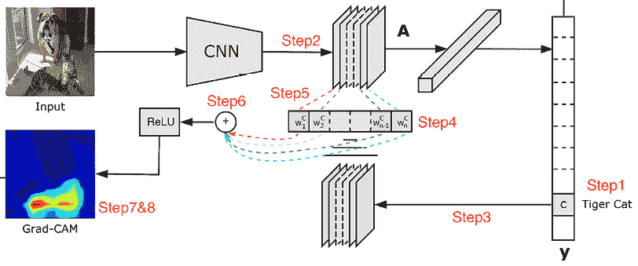

# 第六章：图像分类的实际方面

在前几章中，我们学习了如何利用**卷积神经网络**（**CNNs**）和预训练模型进行图像分类。本章将进一步巩固我们对 CNN 的理解，并在实际应用中考虑使用它们时需要考虑的各种实际方面。我们将首先通过使用**类激活映射**（**CAMs**）来理解 CNN 为何预测特定类别。接下来，我们将学习各种可以改善模型准确性的数据增强方法。最后，我们将了解在真实世界中模型可能出现问题的各种情况，并强调在这些情况下应该注意的方面，以避免陷阱。

以下主题将在本章中涵盖：

+   生成 CAMs

+   理解批量归一化和数据增强的影响

+   在模型实施期间需要注意的实际方面

此外，通过实现以下模型，你将了解到前述主题：

+   预测细胞图像是否指示疟疾

+   分类道路信号

# 生成 CAMs

想象一种情境，你建立了一个能够进行良好预测的模型。然而，你向模型的利益相关者展示时，他们希望理解模型预测的原因。在这种情况下，CAM 非常有用。

例如，CAM 如下所示，左侧为输入图像，右侧突出显示用于生成类预测的像素：


图 6.1：图像（左）和相应的 CAM（右）

这样，如果想要调试或理解模型预测，可以利用 CAM 来了解影响输出预测最多的像素。

让我们了解一下在模型训练后如何生成 CAM。特征图是卷积操作后产生的中间激活。通常，这些激活图的形状是`n 通道 x 高度 x 宽度`。如果我们取所有这些激活的均值，它们会显示图像中所有类别的热点位置。但是，如果我们只关心对于特定类别（比如`猫`）而言真正重要的位置，我们需要找出在`n 通道`中只负责该类别的那些特征图。对于生成这些特征图的卷积层，我们可以计算其相对于`猫`类别的梯度。

请注意，只有那些负责预测`猫`的通道才会有很高的梯度。这意味着我们可以利用梯度信息来赋予`n 通道`中的每一个权重，并获得一个专门用于`猫`类的激活图。

现在我们了解了生成 CAM 的高级策略，让我们一步步实践：

1.  决定要计算 CAM 的类别以及要在神经网络中哪个卷积层计算 CAM。

1.  计算任意卷积层的激活：假设随机卷积层的特征形状为 512 x 7 x 7。


图 6.2: 计算某层的激活

1.  获取与感兴趣类别相关的梯度值。输出梯度形状为 256 x 512 x 3 x 3（即卷积张量的形状：即`输入通道 x 输出通道 x 卷积核大小 x 卷积核大小`）。


图 6.3: 获取梯度值

1.  计算每个输出通道内梯度的均值。输出形状为 512。在下图中，我们计算的均值使我们从输入形状为 256 x 512 x 3 x 3 中得到了形状为 512 的输出。


图 6.4: 计算梯度均值

1.  计算加权激活图，即将 512 个梯度均值乘以 512 个激活通道。输出形状为 512 x 7 x 7。


图 6.5: 计算加权激活图

1.  计算加权激活图的均值（跨 512 个通道），以获取形状为 7 x 7 的输出。


图 6.6: 计算加权激活图的均值

1.  调整（放大）加权激活图输出，以获取与输入大小相同的图像。这样做是为了得到一个类似原始图像的激活图。


图 6.7: 放大加权激活图

1.  将加权激活图叠加到输入图像上。

下图来自论文*Grad-CAM: 基于梯度定位的深度网络视觉解释* ([`arxiv.org/abs/1610.02391`](https://arxiv.org/abs/1610.02391))，生动地描述了前述步骤：



图 6.8: 计算 CAMs 概述

整个过程的关键在于*步骤 5*。我们考虑步骤的两个方面：

+   如果某个像素很重要，则 CNN 在这些像素上的激活会很大。

+   如果某个卷积通道对所需类别很重要，那么该通道的梯度会非常大。

通过这两者的乘积，我们确实得到一个跨所有像素重要性的地图。

前述策略在代码中实现，以理解 CNN 模型预测图像显示疟疾事件可能性的原因如下：

本书的 GitHub 仓库中`Chapter06`文件夹中提供了 `Class_activation_maps.ipynb` 代码 ([`bit.ly/mcvp-2e`](https://bit.ly/mcvp-2e))。代码包含从中下载数据的 URL，并且长度适中。我们强烈建议您在 GitHub 上执行该笔记本，以重现结果，同时理解文本中执行和各种代码组件的解释步骤。

1.  下载数据集并导入相关包（确保提供您的 Kaggle 用户名和密钥）：

    ```py
    %%writefile kaggle.json
    {"username":"XX","key":"XX"}
    !pip install -q kaggle
    !mkdir -p ~/.kaggle
    !cp kaggle.json ~/.kaggle/
    !ls ~/.kaggle
    !chmod 600 /root/.kaggle/kaggle.json
    !kaggle datasets download -d iarunava/cell-images-for-detecting-malaria
    %pip install -U -q torch_snippets
    !unzip -qq cell_images.zip
    import os
    from torch_snippets import * 
    ```

输入图像的样本如下所示：

图 6.9：寄生图像（左）和未感染图像（右）

1.  指定与输出类相对应的索引：

    ```py
    id2int = {'Parasitized': 0, 'Uninfected': 1} 
    ```

1.  执行在图像顶部要执行的转换：

    ```py
    from torchvision import transforms as T
    trn_tfms = T.Compose([
                    T.ToPILImage(),
                    T.Resize(128),
                    T.CenterCrop(128),
                    T.ColorJitter(brightness=(0.95,1.05), 
                                  contrast=(0.95,1.05), 
                                  saturation=(0.95,1.05), 
                                  hue=0.05),
                    T.RandomAffine(5, translate=(0.01,0.1)),
                    T.ToTensor(),
                    T.Normalize(mean=[0.5, 0.5, 0.5], 
                                std=[0.5, 0.5, 0.5]),
                ]) 
    ```

在前述代码中，我们对输入图像进行了一系列转换，即对图像进行了调整大小的流水线（以确保其中一个维度的最小尺寸为 `128`，在本例中），然后从中心裁剪。此外，我们进行了随机颜色抖动和仿射变换。接下来，我们使用 `.ToTensor` 方法对图像进行缩放，使其值介于 `0` 和 `1` 之间，最后对图像进行了归一化。正如在 *第四章* 中讨论的那样，我们也可以使用 `imgaug` 库。

1.  指定在验证图像上要执行的转换：

    ```py
    val_tfms = T.Compose([
                    T.ToPILImage(),
                    T.Resize(128),
                    T.CenterCrop(128),
                    T.ToTensor(),
                    T.Normalize(mean=[0.5, 0.5, 0.5], 
                                std=[0.5, 0.5, 0.5]),
                ]) 
    ```

1.  定义 `MalariaImages` 数据集类：

    ```py
    class MalariaImages(Dataset):
        def __init__(self, files, transform=None):
            self.files = files
            self.transform = transform
            logger.info(len(self))
        def __len__(self):
            return len(self.files)
        def __getitem__(self, ix):
            fpath = self.files[ix]
            clss = fname(parent(fpath))
            img = read(fpath, 1)
            return img, clss
        def choose(self):
            return self[randint(len(self))]
        def collate_fn(self, batch):
            _imgs, classes = list(zip(*batch))
            if self.transform:
                imgs = [self.transform(img)[None] for img in _imgs]
            classes = [torch.tensor([id2int[clss]]) for class in classes]
            imgs, classes = [torch.cat(i).to(device) for i in [imgs, classes]]
            return imgs, classes, _imgs 
    ```

1.  获取训练和验证数据集以及数据加载器：

    ```py
    device = 'cuda' if torch.cuda.is_available() else 'cpu'
    all_files = Glob('cell_images/*/*.png')
    np.random.seed(10)
    np.random.shuffle(all_files)
    from sklearn.model_selection import train_test_split
    trn_files, val_files = train_test_split(all_files, random_state=1)
    trn_ds = MalariaImages(trn_files, transform=trn_tfms)
    val_ds = MalariaImages(val_files, transform=val_tfms)
    trn_dl = DataLoader(trn_ds, 32, shuffle=True, 
                        collate_fn=trn_ds.collate_fn)
    val_dl = DataLoader(val_ds, 32, shuffle=False, 
                        collate_fn=val_ds.collate_fn) 
    ```

1.  定义 `MalariaClassifier` 模型：

    ```py
    def convBlock(ni, no):
        return nn.Sequential(
            nn.Dropout(0.2),
            nn.Conv2d(ni, no, kernel_size=3, padding=1),
            nn.ReLU(inplace=True),
            nn.BatchNorm2d(no),
            nn.MaxPool2d(2),
        )

    class MalariaClassifier(nn.Module):
        def __init__(self):
            super().__init__()
            self.model = nn.Sequential(
                convBlock(3, 64),
                convBlock(64, 64),
                convBlock(64, 128),
                convBlock(128, 256),
                convBlock(256, 512),
                convBlock(512, 64),
                nn.Flatten(),
                nn.Linear(256, 256),
                nn.Dropout(0.2),
                nn.ReLU(inplace=True),
                nn.Linear(256, len(id2int))
            )
            self.loss_fn = nn.CrossEntropyLoss()
        def forward(self, x):
            return self.model(x)
        def compute_metrics(self, preds, targets):
            loss = self.loss_fn(preds, targets)
            acc =(torch.max(preds, 1)[1]==targets).float().mean()
            return loss, acc 
    ```

1.  定义用于训练和验证数据批次的函数：

    ```py
    def train_batch(model, data, optimizer, criterion):
        model.train()
        ims, labels, _ = data
        _preds = model(ims)
        optimizer.zero_grad()
        loss, acc = criterion(_preds, labels)
        loss.backward()
        optimizer.step()
        return loss.item(), acc.item()
    @torch.no_grad()
    def validate_batch(model, data, criterion):
        model.eval()
        ims, labels, _ = data
        _preds = model(ims)
        loss, acc = criterion(_preds, labels)
        return loss.item(), acc.item() 
    ```

1.  在增加的 epochs 上训练模型：

    ```py
    model = MalariaClassifier().to(device)
    criterion = model.compute_metrics
    optimizer = optim.Adam(model.parameters(), lr=1e-3)
    n_epochs = 2
    log = Report(n_epochs)
    for ex in range(n_epochs):
        N = len(trn_dl)
        for bx, data in enumerate(trn_dl):
            loss, acc = train_batch(model, data, optimizer, criterion)
            log.record(ex+(bx+1)/N,trn_loss=loss,trn_acc=acc, end='\r')
        N = len(val_dl)
        for bx, data in enumerate(val_dl):
            loss, acc = validate_batch(model, data, criterion)
            log.record(ex+(bx+1)/N,val_loss=loss,val_acc=acc, end='\r')

        log.report_avgs(ex+1) 
    ```

1.  在模型中的第五个 `convBlock` 中提取卷积层：

    ```py
    im2fmap = nn.Sequential(*(list(model.model[:5].children())+ \
                            list(model.model[5][:2].children()))) 
    ```

在前面的代码行中，我们正在获取模型的第四层以及 `convBlock` 中的前两层，这恰好是 `Conv2D` 层。

1.  定义 `im2gradCAM` 函数，该函数接受输入图像并获取与图像激活对应的热图：

    ```py
    def im2gradCAM(x):
        model.eval()
        logits = model(x)
        heatmaps = []
        activations = im2fmap(x)
        print(activations.shape)
        pred = logits.max(-1)[-1]
        # get the model's prediction
        model.zero_grad()
        # compute gradients with respect to 
        # model's most confident logit
        logits[0,pred].backward(retain_graph=True)
        # get the gradients at the required featuremap location
        # and take the avg gradient for every featuremap
        pooled_grads = model.model[-6][1].weight.grad.data.mean((1,2,3))
        # multiply each activation map with 
        # corresponding gradient average
        for i in range(activations.shape[1]):
            activations[:,i,:,:] *= pooled_grads[i]
        # take the mean of all weighted activation maps
        # (that has been weighted by avg. grad at each fmap)
        heatmap =torch.mean(activations, dim=1)[0].cpu().detach()
        return heatmap, 'Uninfected' if pred.item() else 'Parasitized' 
    ```

1.  定义 `upsampleHeatmap` 函数以将热图上采样到与图像形状对应的形状：

    ```py
    SZ = 128
    def upsampleHeatmap(map, img):
        m,M = map.min(), map.max()
        map = 255 * ((map-m) / (M-m))
        map = np.uint8(map)
        map = cv2.resize(map, (SZ,SZ))
        map = cv2.applyColorMap(255-map, cv2.COLORMAP_JET)
        map = np.uint8(map)
        map = np.uint8(map*0.7 + img*0.3)
        return map 
    ```

在前面的代码行中，我们正在对图像进行反归一化，并将热图叠加在图像顶部。

1.  在一组图像上运行上述函数：

    ```py
    N = 20
    _val_dl = DataLoader(val_ds, batch_size=N, shuffle=True, \
                         collate_fn=val_ds.collate_fn)
    x,y,z = next(iter(_val_dl))
    for i in range(N):
        image = resize(z[i], SZ)
        heatmap, pred = im2gradCAM(x[i:i+1])
        if(pred=='Uninfected'):
            continue
        heatmap = upsampleHeatmap(heatmap, image)
        subplots([image, heatmap], nc=2, figsize=(5,3), suptitle=pred) 
    ```

前述代码的输出如下：


图 6.10：原始寄生图像及其对应的 CAM

从中可以看出，预测之所以如此，是因为突出显示的内容具有最高的 CAM 值。

现在我们已经了解了如何使用训练模型为图像生成类激活热图，我们能够解释某个分类之所以如此的原因。在接下来的部分，让我们学习一些关于数据增强的额外技巧，这些技巧在构建模型时能够提供帮助。

# 理解数据增强和批量归一化的影响

通过利用数据增强的聪明方式来提高模型的准确性。正如在*第四章*中已经提到的那样，我们在 GitHub 仓库中提供了关于数据增强的大量额外细节。在现实世界中，你会遇到具有不同属性的图像：例如，一些图像可能更亮，一些可能在边缘附近包含感兴趣的对象，而一些图像可能比其他图像更加抖动。在本节中，我们将了解如何利用数据增强来帮助提高模型的准确性。此外，我们将了解数据增强如何在实践中成为模型的伪正则化器。

为了理解数据增强和批标准化的影响，我们将通过一个识别交通标志的数据集进行评估。我们将评估三种情况：

+   没有批标准化/数据增强

+   仅批标准化，但没有数据增强

+   既有批标准化又有数据增强

注意，由于数据集和处理在三种情况下保持不变，只有数据增强和模型（批标准化层的添加）有所不同，因此我们只提供第一个情景的以下代码，但其他两种情况在 GitHub 笔记本中可用。

## 编写道路标志检测代码

让我们编写道路标志检测的代码，没有数据增强和批标准化，如下所示：

请注意，我们在这里不解释代码，因为它与我们在先前章节中讨论过的代码非常一致；只有粗体字体的行在三种情况下有所不同。以下代码在本书的 GitHub 库的`Chapter06`文件夹中的`road_sign_detection.ipynb`文件中以[`bit.ly/mcvp-2e`](https://bit.ly/mcvp-2e)链接提供。

1.  下载数据集并导入相关包：

    ```py
    import os
    if not os.path.exists('GTSRB'):
        %pip install -U -q torch_snippets
        !wget -qq https://sid.erda.dk/public/archives/
            daaeac0d7ce1152aea9b61d9f1e19370/
            GTSRB_Final_Training_Images.zip
        !wget -qq https://sid.erda.dk/public/archives/
            daaeac0d7ce1152aea9b61d9f1e19370/
            GTSRB_Final_Test_Images.zip
        !unzip -qq GTSRB_Final_Training_Images.zip
        !unzip -qq GTSRB_Final_Test_Images.zip
        !wget https://raw.githubusercontent.com/georgesung/
         traffic_sign_classification_german/master/signnames.csv
        !rm GTSRB_Final_Training_Images.zip 
           GTSRB_Final_Test_Images.zip
    from torch_snippets import * 
    ```

1.  为可能的输出类分配类 ID：

    ```py
    classIds = pd.read_csv('signnames.csv')
    classIds.set_index('ClassId', inplace=True)
    classIds = classIds.to_dict()['SignName']
    classIds = {f'{k:05d}':v for k,v in classIds.items()}
    id2int = {v:ix for ix,(k,v) in enumerate(classIds.items())} 
    ```

1.  定义在没有任何增强的图像上的转换流水线：

    ```py
    from torchvision import transforms as T
    trn_tfms = T.Compose([
                    T.ToPILImage(),
                    T.Resize(32),
                    T.CenterCrop(32),
                    # T.ColorJitter(brightness=(0.8,1.2), 
                    # contrast=(0.8,1.2), 
                    # saturation=(0.8,1.2), 
                    # hue=0.25),
                    # T.RandomAffine(5,  #translate=(0.01,0.1)),
                    **T.ToTensor(),**
     **T.Normalize(mean=[****0.485****,** **0.456****,** **0.406****],** 
     **std=[****0.229****,** **0.224****,** **0.225****]),**
                ])
    val_tfms = T.Compose([
                    T.ToPILImage(),
                    T.Resize(32),
                    T.CenterCrop(32),
                    T.ToTensor(),
                    T.Normalize(mean=[0.485, 0.456, 0.406], 
                                std=[0.229, 0.224, 0.225]),
                ]) 
    ```

在上述代码中，我们指定将每个图像转换为 PIL 图像，并从中心调整和裁剪图像。此外，我们使用`.ToTensor`方法将图像缩放到像素值在`0`和`1`之间；正如我们在*第三章*中学到的那样，这对于在缩放数据集上训练模型更好。最后，我们对输入图像进行归一化，以便利用预训练模型。

前述代码的注释部分是你应该取消注释并重新运行的内容，以理解执行数据增强的情况。此外，我们不对`val_tfms`上的图像执行增强，因为这些图像在模型训练期间不使用。然而，`val_tfms`图像应该通过剩余的转换流水线作为`trn_tfms`。

1.  定义`GTSRB`数据集类：

    ```py
    class GTSRB(Dataset):
        def __init__(self, files, transform=None):
            self.files = files
            self.transform = transform
            logger.info(len(self))
        def __len__(self):
            return len(self.files)
        def __getitem__(self, ix):
            fpath = self.files[ix]
            clss = fname(parent(fpath))
            img = read(fpath, 1)
            return img, classIds[clss]
        def choose(self):
            return self[randint(len(self))]
        def collate_fn(self, batch):
            imgs, classes = list(zip(*batch))
            if self.transform:
                imgs =[self.transform(img)[None] for img in imgs]
            classes = [torch.tensor([id2int[clss]]) for clss in classes]
            imgs, classes = [torch.cat(i).to(device) for i in [imgs, classes]]
            return imgs, classes 
    ```

1.  创建训练和验证数据集以及数据加载器：

    ```py
    device = 'cuda' if torch.cuda.is_available() else 'cpu'
    all_files = Glob('GTSRB/Final_Training/Images/*/*.ppm')
    np.random.seed(10)
    np.random.shuffle(all_files)
    from sklearn.model_selection import train_test_split
    trn_files, val_files = train_test_split(all_files, random_state=1)
    trn_ds = GTSRB(trn_files, transform=trn_tfms)
    val_ds = GTSRB(val_files, transform=val_tfms)
    trn_dl = DataLoader(trn_ds, 32, shuffle=True, \
                        collate_fn=trn_ds.collate_fn)
    val_dl = DataLoader(val_ds, 32, shuffle=False, \
                        collate_fn=val_ds.collate_fn)
    Define the SignClassifier model:
    import torchvision.models as models
    def convBlock(ni, no):
        return nn.Sequential(
                    nn.Dropout(0.2),
                    nn.Conv2d(ni, no, kernel_size=3, padding=1),
                    nn.ReLU(inplace=True),
                    #nn.BatchNorm2d(no),
                    nn.MaxPool2d(2),
                )

    class SignClassifier(nn.Module):
        def __init__(self):
            super().__init__()
            self.model = nn.Sequential(
                            convBlock(3, 64),
                            convBlock(64, 64),
                            convBlock(64, 128),
                            convBlock(128, 64),
                            nn.Flatten(),
                            nn.Linear(256, 256),
                            nn.Dropout(0.2),
                            nn.ReLU(inplace=True),
                            nn.Linear(256, len(id2int))
                        )
            self.loss_fn = nn.CrossEntropyLoss()
        def forward(self, x):
            return self.model(x)
        def compute_metrics(self, preds, targets):
            ce_loss = self.loss_fn(preds, targets)
            acc =(torch.max(preds, 1)[1]==targets).float().mean()
            return ce_loss, acc 
    ```

当您测试具有`BatchNormalization`情景的模型时，请确保取消`convBlock`定义行的注释。

1.  分别定义在数据批次上训练和验证的函数：

    ```py
    def train_batch(model, data, optimizer, criterion):
        model.train()
        ims, labels = data
        _preds = model(ims)
        optimizer.zero_grad()
        loss, acc = criterion(_preds, labels)
        loss.backward()
        optimizer.step()
        return loss.item(), acc.item()
    @torch.no_grad()
    def validate_batch(model, data, criterion):
        model.eval()
        ims, labels = data
        _preds = model(ims)
        loss, acc = criterion(_preds, labels)
        return loss.item(), acc.item() 
    ```

1.  定义模型并在逐步增加的时代训练它：

    ```py
    model = SignClassifier().to(device)
    criterion = model.compute_metrics
    optimizer = optim.Adam(model.parameters(), lr=1e-3)
    n_epochs = 50
    log = Report(n_epochs)
    for ex in range(n_epochs):
        N = len(trn_dl)
        for bx, data in enumerate(trn_dl):
            loss, acc = train_batch(model, data, optimizer, criterion)
            log.record(ex+(bx+1)/N,trn_loss=loss, trn_acc=acc, end='\r')
        N = len(val_dl)
        for bx, data in enumerate(val_dl):
            loss, acc = validate_batch(model, data, criterion)
            log.record(ex+(bx+1)/N, val_loss=loss, val_acc=acc, end='\r')

        log.report_avgs(ex+1)
        if ex == 10: optimizer = optim.Adam(model.parameters(), lr=1e-4) 
    ```

在*步骤 3*（数据增强）和*步骤 5*（批量归一化）中被注释掉的代码行是在三种情况下需要更改的代码。在训练和验证精度方面，三种情况的结果如下：


表 6.1：模型在有/无图像增强和批量归一化的消融研究

注意，在前述三种情况中，我们看到以下情况：

+   当没有批量归一化时，模型的准确性不如此高。

+   当我们只有批量归一化而没有数据增强时，模型的准确性显著提高，但模型也在训练数据上过拟合。

+   既有批量归一化又有数据增强的模型在准确性和过拟合方面表现出色（因为训练和验证损失值非常相似）。

在批量归一化和数据增强的重要性存在的情况下，在下一节中，我们将学习在训练/实施我们的图像分类模型时需要注意的一些关键方面。

# 在模型实施过程中需要注意的实际因素

到目前为止，我们已经看到了在构建图像分类模型时的各种方法。在本节中，我们将学习一些在实际应用中构建模型时需要注意的实际考虑因素。本节将讨论以下内容：

+   不平衡数据

+   在分类时执行图像中对象的大小

+   训练和验证图像之间的差异

+   网络中卷积和池化层的数量

+   在 GPU 上训练的图像尺寸

+   OpenCV 实用程序

## 不平衡数据

想象一种情况，您试图预测一个在我们的数据集中非常罕见的对象：比如说在总图像中只占 1%。例如，这可以是预测 X 光图像是否显示罕见肺部感染的任务。

如何衡量训练用于预测罕见肺部感染的模型的准确性？如果我们简单地预测所有图像的无感染类别，分类的准确率为 99%，但仍然毫无用处。在这种情况下，展示罕见对象类别发生次数和模型正确预测罕见对象类别次数的混淆矩阵在这种情况下非常有用。因此，在这种情况下关注的正确指标集是与混淆矩阵相关的指标。

典型混淆矩阵如下所示：


图 6.11：典型混淆矩阵

在前面的混淆矩阵中，`0`表示无感染，`1`表示感染。通常，我们会填充该矩阵以了解我们的模型有多准确。

接下来是确保模型进行训练的问题。通常情况下，损失函数（二元或分类交叉熵）会确保在误分类量高时损失值也很高。然而，除了损失函数外，我们还可以给稀有类别分配更高的权重，从而明确告诉模型我们希望正确分类稀有类别的图像。

除了分配类别权重之外，我们已经看到图像增强和/或迁移学习在显著提高模型准确率方面帮助很大。此外，在增强图像时，我们可以过采样稀有类别的图像，以增加它们在整体人口中的比例。

## 图像中对象的大小

想象一种情景，即大图像中的小块区域决定了图像的类别：例如，肺部感染识别，其中某些小结节的存在表示疾病的发生。在这种情况下，图像分类可能会导致不准确的结果，因为对象只占整个图像的一小部分。在这种情况下，目标检测非常有用（我们将在下一章节中学习）。

解决这些问题的一个高级直觉方法是首先将输入图像分成更小的网格单元（比如一个 10 x 10 的网格），然后识别网格单元是否包含感兴趣的对象。

除此之外，您可能还想考虑这样一种情况：模型在高分辨率图像上进行训练（也进行推断）。这确保了前面例子中的小结节由足够数量的像素表示，以便进行模型训练。

## 训练数据与验证数据之间的差异

想象这样一种情景：您建立了一个模型来预测眼睛图像是否表明患者可能患有糖尿病视网膜病变。为了建立模型，您收集了数据，筛选了数据，进行了裁剪和归一化，最终构建了在验证图像上具有非常高准确率的模型。然而，假设在实际环境中（例如由医生/护士使用）使用模型时，模型无法进行良好的预测。让我们了解一些可能的原因：

+   医生办公室中的图像是否与用于训练模型的图像相似？

+   在训练时使用的图像和预测时使用的图像（现实世界中的图像）可能会有很大的不同，特别是如果您在经过所有预处理的筛选数据集上构建了模型，而在医生端使用的图像则没有经过筛选。

+   如果医生办公室用于捕捉图像的设备与用于收集训练图像的设备的图像捕获分辨率不同，图像可能会有所不同。

+   图像可能会因为两个地方拍摄时的不同光照条件而不同。

+   图像主体是否足够代表整体人口？

+   如果在男性人群的图像上进行训练，但在女性人群上进行测试，或者如果在一般情况下，训练和现实世界的图像对应不同的人口统计学特征，则图像是具有代表性的。

+   训练和验证的拆分是否系统地完成了？

+   想象一种情况，有 10,000 张图像，前 5,000 张属于一类，后 5,000 张属于另一类。在构建模型时，如果我们不随机分割数据集，而是按顺序分割为训练和验证集（没有随机索引），我们可能会在训练时看到一类的高比例，在验证时看到另一类的高比例。

一般而言，在最终用户利用系统之前，我们需要确保训练、验证和现实世界的图像具有相似的数据分布。我们将在 *第十八章* 中学习数据漂移的概念，这是一种识别验证/测试数据是否与训练数据不同的技术。

## flatten 层中的节点数

考虑一种情况，您正在处理尺寸为 300 x 300 的图像。从技术上讲，我们可以执行超过五次卷积池化操作，以获得具有尽可能多特征的最终层。此外，在 CNN 中，我们在这种情况下可以拥有任意多的通道。然而，在实际中，一般会设计一个网络，使其在 flatten 层中具有 500 到 5,000 个节点。

正如我们在 *第四章* 中看到的，如果在 flatten 层中有更多节点，那么在连接到最终分类层之前，当 flatten 层连接到后续的密集层时，参数数量将非常高。

通常情况下，最好有一个预训练模型，以获取 flatten 层，从而在适当时激活相关的过滤器。此外，在利用预训练模型时，请确保冻结预训练模型的参数。

一般来说，在较简单的分类任务中，CNN 中可训练参数的数量可以在 1 百万到 1 千万之间。

## 图像大小

假设我们正在处理非常高维度的图像，例如形状为 2,000 x 1,000。在处理这样大的图像时，我们需要考虑以下可能性：

+   图像可以调整到较低的尺寸吗？物体的图像在调整大小后可能不会丢失信息；然而，文档图像如果调整到较小的尺寸可能会丢失相当多的信息。

+   我们可以减小批量大小，以便批量适合 GPU 内存吗？通常，如果我们处理大图像，给定批量大小的情况下，GPU 内存可能不足以对图像批量执行计算。

+   图像的某些部分是否包含大部分信息，因此是否可以裁剪图像的其余部分？

## OpenCV 实用工具

OpenCV 是一个开源包，拥有广泛的模块，可以从图像中提取信息（关于 OpenCV 实用工具的更多详细信息可以在 GitHub 仓库中找到）。在深度学习革命之前，它是计算机视觉领域使用最广泛的库之一。传统上，它是基于多个手工特征构建的，截至本书撰写时，OpenCV 具有几个集成深度学习模型输出的包。

想象一种情景，你必须将模型部署到生产环境中；在这种情况下，通常情况下简化问题会更可取：有时甚至可以以牺牲准确性为代价。如果任何 OpenCV 模块可以解决你已经尝试解决的问题，一般来说，它应该优先于构建模型（除非从头开始构建模型比利用现成模块带来显著的准确性提升更合适）。

# 总结

在本章中，我们学习了构建 CNN 模型时需要考虑的多个实际因素：批量归一化、数据增强、使用 CAMs 解释结果以及在将模型部署到生产环境时需要注意的一些场景。

在下一章中，我们将转向学习目标检测的基础知识：不仅识别图像中对象对应的类别，还将在对象位置周围绘制边界框。

# 问题

1.  如何获取类激活映射？

1.  在训练模型时，批量归一化和数据增强如何帮助？

1.  CNN 模型过拟合的常见原因是什么？

1.  CNN 模型在训练和验证数据集上有效，但在实际世界中失败的各种场景是什么？

1.  我们何时利用 OpenCV 包，以及何时优先使用 OpenCV 而不是深度学习的优势场景是什么？

# 在 Discord 上了解更多

加入我们社区的 Discord 空间，与作者和其他读者讨论：

[`packt.link/modcv`](https://packt.link/modcv)


