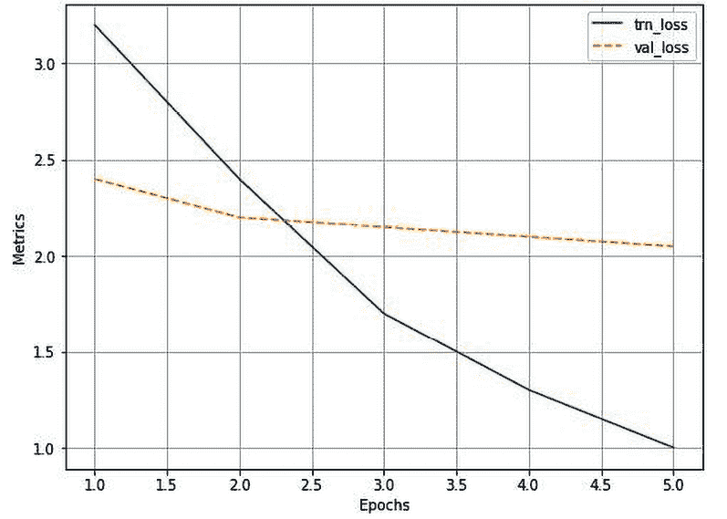

# 第七章：物体检测基础

在前几章中，我们学习了如何执行图像分类。想象一下利用计算机视觉进行自动驾驶汽车的场景。不仅需要检测图像中是否包含车辆、人行道和行人等物体，还需要准确识别这些物体的*位置*。在这种场景下，我们将在本章和下一章中学习的各种物体检测技术将非常有用。

在本章和下一章中，我们将学习一些执行物体检测的技术。我们将从学习基础知识开始 - 使用名为`ybat`的工具对图像中对象的地面实况边界框进行标记，使用`selectivesearch`方法提取区域提议，并通过**交并比**（**IoU**）和均值平均精度度量来定义边界框预测的准确性。之后，我们将学习两个基于区域提议的网络 - R-CNN 和 Fast R-CNN - 首先了解它们的工作细节，然后在包含卡车和公共汽车图像的数据集上实施它们。

本章将涵盖以下主题：

+   引入物体检测

+   创建用于训练的边界框地面实况

+   理解区域提议

+   理解 IoU、非极大值抑制和均值平均精度

+   训练基于 R-CNN 的自定义物体检测器

+   训练基于 Fast R-CNN 的自定义物体检测器

    本章中的所有代码片段都可以在 GitHub 存储库的`Chapter07`文件夹中找到，链接为[`bit.ly/mcvp-2e`](https://bit.ly/mcvp-2e)。

# 引入物体检测

随着自动驾驶汽车、面部检测、智能视频监控和人数统计解决方案的兴起，快速准确的物体检测系统需求量大增。这些系统不仅包括从图像中对物体进行分类，还包括在每个物体周围绘制适当边界框以定位它们。这（绘制边界框和分类）使得物体检测比其传统的计算机视觉前辈图像分类更为复杂。

在探索物体检测的广泛用例之前，让我们了解它如何增强我们在上一章中介绍的物体分类任务。想象一下图像中有多个物体的情况。我让你预测图像中存在的物体类别。例如，假设图像中既有猫又有狗。你会如何对这样的图像进行分类？物体检测在这种场景中非常有用，它不仅预测物体的位置（边界框），还预测各个边界框内存在的物体类别。

要理解物体检测的输出是什么样的，请查看以下图表：


图 7.1：对象分类与检测之间的区别

在前述图中，我们可以看到，典型的对象分类仅仅提到图像中存在的对象类别，而对象定位则在图像中的对象周围绘制边界框。另一方面，对象检测涉及绘制边界框以及识别图像中多个对象的边界框中对象的类别。

利用对象检测的一些不同用例包括以下内容：

+   **安全性**：这对识别入侵者很有用。

+   **自动驾驶汽车**：这对识别道路图像中各种对象很有帮助。

+   **图像搜索**：这有助于识别包含感兴趣对象（或人员）的图像。

+   **汽车**: 这可以帮助识别汽车图像中的车牌号码。

在所有前述情况下，对象检测被利用来在图像中的各种对象周围绘制边界框。

在本章中，我们将学习预测对象的类别，并在图像中围绕对象创建一个紧密的边界框，这是定位任务。我们还将学习检测图像中多个对象对应的类别，以及围绕每个对象的边界框，这是对象检测任务。

训练典型对象检测模型包括以下步骤：

1.  创建包含图像中各种对象的边界框标签和类别的真值数据

1.  提出扫描图像以识别可能包含对象的区域（区域建议）的机制

在本章中，我们将学习利用名为`SelectiveSearch`的方法生成的区域建议。在下一章中，我们将学习如何利用锚框来识别包含对象的区域。

1.  通过使用 IoU 指标创建目标类别变量

1.  创建目标边界框偏移变量，以纠正区域建议在*步骤 2*中的位置

1.  构建一个模型，可以预测对象的类别，同时还能预测与区域建议对应的目标边界框偏移量

1.  使用**均值平均精度**（**mAP**）来衡量对象检测的准确性

现在我们已经对训练对象检测模型要做的事情有了高层次的概述，我们将在下一节学习为边界框创建数据集（这是构建对象检测模型的第一步）。

# 创建用于训练的边界框真值

我们已经了解到目标检测以边界框的形式给出感兴趣对象的输出图像。为了构建能够检测这些边界框的算法，我们需要创建输入输出组合，其中输入是图像，输出是边界框和物体类别。

请注意，当我们检测到边界框时，我们实际上是检测到围绕图像的边界框的四个角的像素位置。

要训练一个提供边界框的模型，我们需要图像及其图像中所有物体的对应边界框坐标。在本节中，我们将学习创建训练数据集的一种方法，其中图像是输入，而对应的边界框和物体类别存储在 XML 文件中作为输出。

在这里，我们将安装并使用`ybat`来创建（标注）图像中物体周围的边界框。我们还将检查包含注释类和边界框信息的 XML 文件。

请注意，还有像 CVAT 和 Label Studio 这样的替代图像标注工具。

让我们从 GitHub 下载`ybat-master.zip`（[`github.com/drainingsun/ybat`](https://github.com/drainingsun/ybat)），然后解压缩它。然后，使用您选择的浏览器打开`ybat.html`。

在我们开始创建与图像对应的真实标签之前，让我们指定我们想要跨图像标记的所有可能类，并将其存储在`classes.txt`文件中，如下所示：


图 7.2：提供类名

现在，让我们准备与图像对应的真实标签。这涉及到在物体周围绘制边界框（如以下步骤中所见的人物），并为图像中存在的对象分配标签/类别：

1.  上传您想要标注的所有图像。

1.  上传`classes.txt`文件。

1.  通过首先选择文件名，然后在要标记的每个对象周围绘制十字线来为每个图像进行标记。在绘制十字线之前，请确保在以下图像中*步骤 2*下正确选择`classes`区域中的类别（`classes`窗格可以看到以下图像中*步骤 2*之下）。

1.  将数据转储保存为所需格式。每种格式都是由不同的研究团队独立开发的，它们都同样有效。基于它们的流行度和便利性，每个实现都更喜欢不同的格式。

正如你所看到的，在下图中表示了前述步骤：


图 7.3：标注步骤

例如，当我们下载 PascalVOC 格式时，它会下载一个 XML 文件的压缩包。在 GitHub 上，可以看到绘制矩形边界框后 XML 文件的快照，文件名为`sample_xml_file. xml`。在那里，您将观察到`bndbox`字段包含感兴趣图像中对象的*x*和*y*坐标的最小和最大值。我们还应该能够使用`name`字段提取图像中对象对应的类别。

现在我们了解了如何创建图像中存在对象的真实对象（类别标签和边界框），让我们深入了解识别图像中对象的基本构建块。首先，我们将介绍有助于突出显示最可能包含对象部分的区域建议。

# 理解区域建议

想象一个假设情景，感兴趣图像中包含一个人和背景的天空。假设背景（天空）的像素强度变化很小，而前景（人物）的像素强度变化很大。

仅从上述描述本身，我们可以得出这里有两个主要区域 - 人物和天空。此外，在人物图像的区域内，对应头发的像素与对应脸部的像素强度不同，建立了区域内可能存在多个子区域的事实。

**区域建议** 是一种技术，有助于识别区域岛，其中像素彼此相似。生成区域建议对于目标检测非常有用，其中我们必须识别图像中存在的对象的位置。此外，由于区域建议生成了一个区域的建议，它有助于目标定位，其中的任务是识别一个完全适合对象周围的边界框。我们将在稍后的部分，*基于训练 R-CNN 的自定义对象检测器*中学习区域建议如何协助对象的定位和检测，但首先让我们了解如何从图像中生成区域建议。

## 利用 SelectiveSearch 生成区域建议

SelectiveSearch 是用于目标定位的区域建议算法，它根据像素强度生成可能被一起分组的区域建议。SelectiveSearch 根据类似像素的层次分组像素，进而利用图像中内容的颜色、纹理、大小和形状的兼容性进行分组。

首先，SelectiveSearch 通过根据前述属性分组像素来过度分割图像。然后，它遍历这些过度分割的群组，并根据相似性将它们分组。在每次迭代中，它将较小的区域组合成较大的区域。

让我们通过以下示例了解`selectivesearch`的过程：

在本书的 GitHub 仓库`Chapter07`文件夹中的`Understanding_selectivesearch.ipynb`中找到此练习的完整代码，网址为[`bit.ly/mcvp-2e`](https://bit.ly/mcvp-2e)。

1.  安装所需的包：

    ```py
    %pip install selectivesearch
    %pip install torch_snippets
    from torch_snippets import *
    import selectivesearch
    from skimage.segmentation import felzenszwalb 
    ```

1.  获取并加载所需的图像：

    ```py
    !wget https://www.dropbox.com/s/l98leemr7/Hemanvi.jpeg
    img = read('Hemanvi.jpeg', 1) 
    ```

1.  从图像中提取基于颜色、纹理、大小和形状兼容性的`felzenszwalb`分段：

    ```py
    segments_fz = felzenszwalb(img, scale=200) 
    ```

请注意，在`felzenszwalb`方法中，`scale`表示可以在图像段内形成的簇的数量。`scale`值越高，保留的原始图像细节就越多。

1.  绘制原始图像和带有分割的图像：

    ```py
    subplots([img, segments_fz],
             titles=['Original Image',
                     'Image post\nfelzenszwalb segmentation'], sz=10, nc=2) 
    ```


图 7.4：原始图像及其相应的分割

从前述输出中，请注意属于同一组的像素具有相似的像素值。

具有相似值的像素形成区域提议。这有助于目标检测，因为我们现在将每个区域提议传递给网络，并要求它预测区域提议是背景还是对象。此外，如果它是对象，它还帮助我们识别获取与对象对应的紧凑边界框的偏移量，以及区域提议内内容对应的类别。

现在我们了解了 SelectiveSearch 的作用，让我们实现`selectivesearch`函数来获取给定图像的区域提议。

## 实施 SelectiveSearch 来生成区域提议

在本节中，我们将定义`extract_candidates`函数，使用`selectivesearch`来在后续关于训练基于 R-CNN 和 Fast R-CNN 的自定义目标检测器的部分中使用它：

1.  导入相关包并获取图像：

    ```py
    %pip install selectivesearch
    %pip install torch_snippets
    from torch_snippets import *
    import selectivesearch
    !wget https://www.dropbox.com/s/l98leemr7/Hemanvi.jpeg
    img = read('Hemanvi.jpeg', 1) 
    ```

1.  定义`extract_candidates`函数，从图像中获取区域提议：

    1.  定义以图像作为输入参数的函数：

    ```py
    def extract_candidates(img): 
    ```

    1.  使用`selective_search`方法在图像内获取候选区域：

    ```py
     img_lbl, regions = selectivesearch.selective_search(img, 
                                       scale=200,  min_size=100) 
    ```

    1.  计算图像面积并初始化一个候选列表，用于存储通过定义的阈值的候选者：

    ```py
     img_area = np.prod(img.shape[:2])
        candidates = [] 
    ```

    1.  仅获取那些超过总图像面积的 5%并且小于或等于图像面积的 100%的候选者（区域），然后返回它们：

    ```py
     for r in regions:
            if r['rect'] in candidates: continue
            if r['size'] < (0.05*img_area): continue
            if r['size'] > (1*img_area): continue
            x, y, w, h = r['rect']
            candidates.append(list(r['rect']))
        return candidates 
    ```

1.  提取候选区域并在图像顶部绘制它们：

    ```py
    candidates = extract_candidates(img)
    show(img, bbs=candidates) 
    ```


图 7.5：图像中的区域提议

前图中的网格代表来自`selective_search`方法的候选区域（区域提议）。

现在我们了解了区域提议生成，还有一个问题没有解答。我们如何利用区域提议进行目标检测和定位？

在感兴趣图像中，与对象位置（地面真实位置）具有高交集的区域提议被标记为包含对象的区域，而交集较低的区域提议被标记为背景。在接下来的部分，我们将学习如何计算区域提议候选与地面真实边界框的交集，在我们理解构建物体检测模型背后的各种技术的旅程中。

# 理解 IoU

想象一种情况，我们为对象提出了一个边界框的预测。我们如何衡量我们预测的准确性？在这种情况下，IoU 的概念非常有用。

在术语“交并比”中，“交集”一词指的是预测边界框与实际边界框重叠的程度，而“并集”则指的是用于重叠的总体空间。 IoU 是两个边界框之间重叠区域与两个边界框组合区域的比率。

这可以用下图表示：


图 7.6：可视化 IoU

在上述两个边界框（矩形）的图示中，让我们将左边界框视为地面真实位置，右边界框视为对象的预测位置。作为度量标准的 IoU 是两个边界框之间重叠区域与组合区域的比率。在下图中，您可以观察 IoU 度量标准随着边界框重叠变化的情况：


图 7.7：不同情况下 IoU 值的变化

我们可以看到随着重叠减少，IoU 也会减少，在最后一个图中，当没有重叠时，IoU 度量为 0。

现在我们了解了如何测量 IoU，让我们在代码中实现它，并创建一个计算 IoU 的函数，因为我们将在训练 R-CNN 和训练 Fast R-CNN 的部分中利用它。

在 GitHub 的`Chapter07`文件夹中的`Calculating_Intersection_Over_Union.ipynb`文件中查找以下代码：[`bit.ly/mcvp-2e`](https://bit.ly/mcvp-2e)。

让我们定义一个函数，该函数以两个边界框作为输入，并返回 IoU 作为输出：

1.  指定`get_iou`函数，该函数以`boxA`和`boxB`作为输入，其中`boxA`和`boxB`是两个不同的边界框（可以将`boxA`视为地面真实边界框，`boxB`视为区域提议）：

    ```py
    def get_iou(boxA, boxB, epsilon=1e-5): 
    ```

我们定义了`epsilon`参数来处理罕见的情况，即两个框之间的并集为 0，导致除零错误。请注意，在每个边界框中，将有四个值对应于边界框的四个角。

1.  计算交集框的坐标：

    ```py
     x1 = max(boxA[0], boxB[0])
        y1 = max(boxA[1], boxB[1])
        x2 = min(boxA[2], boxB[2])
        y2 = min(boxA[3], boxB[3]) 
    ```

请注意，`x1`存储两个边界框之间最左侧 x 值的最大值。类似地，`y1`存储最上面的 y 值，`x2`和`y2`分别存储交集部分的最右 x 值和最下 y 值。

1.  计算交集区域的宽度和高度（`width`和`height`）：

    ```py
     width = (x2 - x1)
        height = (y2 - y1) 
    ```

1.  计算重叠区域的面积（`area_overlap`）：

    ```py
     if (width<0) or (height <0):
            return 0.0
        area_overlap = width * height 
    ```

请注意，在前面的代码中，如果与重叠区域对应的宽度或高度小于 0，则交集的面积为 0。否则，我们计算重叠（交集）的面积类似于计算矩形面积的方式 - 宽度乘以高度。

1.  计算对应于两个边界框的组合面积：

    ```py
     area_a = (boxA[2] - boxA[0]) * (boxA[3] - boxA[1])
        area_b = (boxB[2] - boxB[0]) * (boxB[3] - boxB[1])
        area_combined = area_a + area_b - area_overlap 
    ```

在前面的代码中，我们计算两个边界框的组合面积 - `area_a` 和 `area_b` - 然后在计算`area_combined`时减去重叠的区域，因为在计算`area_a`和`area_b`时，`area_overlap`被计算了两次。

1.  计算 IoU 值并返回它：

    ```py
     iou = area_overlap / (area_combined+epsilon)
        return iou 
    ```

在前面的代码中，我们计算`iou`作为重叠区域的面积（`area_overlap`）与两个边界框组合区域的面积（`area_combined`）之比，并返回结果。

到目前为止，我们已经学习了如何创建地面实况并计算 IoU，这有助于准备训练数据。

在后续部分，我们将推迟构建模型，因为训练模型涉及更多的步骤，并且在训练模型之前，我们还需要学习更多组件。在下一节中，我们将学习非极大值抑制，它有助于在推断时缩小围绕对象的不同可能预测边界框。

# **非极大值抑制**

想象一种情景，其中生成了多个区域建议，并且彼此显著重叠。基本上，所有预测的边界框坐标（对于区域建议的偏移量）彼此显著重叠。例如，让我们考虑以下图像，在图像中为人生成了多个区域建议：


图 7.8：图像和可能的边界框

我们如何确定在许多区域建议中，我们将考虑作为包含对象的边界框以及我们将放弃的边界框？在这种情况下，**非极大值抑制**非常有用。让我们解释一下这个术语。

**非极大值**指的是那些概率最高但不包含对象的边界框，**抑制**指的是我们放弃这些边界框。在非极大值抑制中，我们确定具有最高概率包含对象的边界框，并且丢弃所有 IoU 低于某个阈值的其他边界框，这些边界框显示具有最高概率包含对象。

在 PyTorch 中，使用 `torchvision.ops` 模块中的 `nms` 函数执行非极大值抑制。`nms` 函数接受边界框坐标、边界框中对象的置信度以及跨边界框的 IoU 阈值，从而确定要保留的边界框。在预测新图像中对象类别和边界框时，您将利用 `nms` 函数，同时涵盖*训练基于 R-CNN 的自定义对象检测器*和*训练基于 Fast R-CNN 的自定义对象检测器*部分。

# 平均精确度

到目前为止，我们已经看到得到的输出包括图像中每个对象周围的边界框和边界框内对象对应的类别。接下来的问题是：如何量化模型预测的准确性？mAP 在这种情况下派上了用场。

在我们尝试理解 mAP 之前，让我们首先理解精确度，然后是平均精确度，最后是 mAP：

+   **精确度**: 通常，我们计算精确度如下：


真正的正样本是指预测正确对象类别的边界框，并且其与真实值之间的 IoU 大于某个阈值。错误的正样本是指预测类别错误或与真实值之间的重叠小于定义的阈值的边界框。此外，如果为同一真实边界框识别出多个边界框，则只能有一个边界框是真正的正样本，其他都是错误的正样本。

+   **平均精确度:** 平均精确度是在各种 IoU 阈值上计算得出的精确度值的平均值。

+   **mAP:** mAP 是在数据集中所有对象类别上，通过各种 IoU 阈值计算得出的精确度值的平均值。

到目前为止，我们已经看到为模型准备训练数据集，对模型预测执行非极大值抑制，并计算其准确性。在接下来的几节中，我们将学习如何训练一个（基于 R-CNN 和 Fast R-CNN 的）模型来检测新图像中的对象。

# 训练基于 R-CNN 的自定义对象检测器

R-CNN 代表**基于区域的卷积神经网络**。在 R-CNN 中，**基于区域**指的是用于识别图像中对象的区域提议。请注意，R-CNN 协助识别图像中存在的对象及其位置。

在接下来的几节中，我们将学习关于 R-CNN 的工作细节，然后在我们的自定义数据集上对其进行训练。

## R-CNN 的工作细节

让我们通过下面的图表来对基于 R-CNN 的对象检测有一个高层次的理解：


图 7.9：R-CNN 步骤序列（图片来源：`https://arxiv.org/pdf/1311.2524.pdf`）

在利用 R-CNN 技术进行对象检测时，我们执行以下步骤：

1.  从图像中提取区域提案。我们需要确保提取出大量的提案，以免错过图像中的任何潜在对象。

1.  调整（变形）所有提取的区域以获得相同大小的区域。

1.  将调整大小后的区域提案通过网络传递。通常情况下，我们会通过预训练模型（如 VGG16 或 ResNet50）传递调整大小后的区域提案，并在全连接层中提取特征。

1.  创建用于模型训练的数据，其中输入是通过预训练模型传递区域提案提取的特征。输出是每个区域提案对应的类别以及与图像对应的地面实况边界框的区域提案偏移量。

如果一个区域提案与对象的 IoU 大于特定阈值，则创建训练数据。在这种情况下，该区域任务是预测其重叠对象的类别以及与包含感兴趣对象的地面实况边界框相关的区域提案的偏移量。以下展示了样本图像、区域提案和地面实况边界框：


图 7.10：带有区域提案和地面实况边界框的样本图像

在前述图像中，`o`（红色）表示区域提案的中心（虚线边界框），`x`表示与`cat`类别对应的地面实况边界框的中心（实线边界框）。我们计算区域提案边界框与地面实况边界框之间的偏移量，作为两个边界框中心坐标之间的差异（`dx`，`dy`）及边界框高度和宽度之间的差异（`dw`，`dh`）。

1.  连接两个输出头，一个对应图像类别，另一个对应区域提案与地面实况边界框的偏移量，以提取对象的精细边界框。

这个练习类似于预测性别（一个类别变量，类似于本案例研究中的对象类别）和年龄（一个连续变量，类似于对区域提案进行的偏移量），基于*第五章*中一个人脸图像的用例。

1.  编写自定义损失函数来训练模型，该函数将最小化对象分类误差和边界框偏移误差。

注意，我们要最小化的损失函数与原始论文中优化的损失函数不同（[`arxiv.org/pdf/1311.2524.pdf`](https://arxiv.org/pdf/1311.2524.pdf)）。我们这样做是为了减少从头开始构建 R-CNN 和 Fast R-CNN 所带来的复杂性。一旦您熟悉了模型的工作原理，并能够使用接下来两节中的代码构建模型，我们强烈建议您从头开始实现原始论文中的模型。

在接下来的部分，我们将学习获取数据集和为训练创建数据。在此之后的部分中，我们将学习设计模型并对其进行训练，然后在新图像中预测存在的对象类别及其边界框。

## 在自定义数据集上实现物体检测的 R-CNN。

到目前为止，我们已经理解了 R-CNN 的工作原理。现在我们将学习如何为训练创建数据。该过程涉及以下步骤：

1.  下载数据集。

1.  准备数据集。

1.  定义区域提议提取和 IoU 计算函数。

1.  创建训练数据。

1.  为模型创建输入数据。

1.  调整区域提议的大小。

1.  通过预训练模型将它们传递以获取完全连接层的值。

1.  为模型创建输出数据。

1.  为每个区域提议标记类别或背景标签。

1.  定义区域提议相对于地面真值的偏移量（如果区域提议对应于对象而不是背景）。

1.  定义并训练模型。

1.  在新图像上进行预测。

让我们开始编码以下各节。

## 下载数据集。

对于物体检测的情况，我们将从 Google Open Images v6 数据集中下载数据（网址为[`storage.googleapis.com/openimages/v5/test-annotations-bbox.csv`](https://storage.googleapis.com/openimages/v5/test-annotations-bbox.csv)）。然而，在代码中，我们将仅处理公交车或卡车的图像，以确保我们可以训练图像（正如您很快会注意到使用`selectivesearch`时的内存问题）。在*第十章*，*目标检测和分割的应用*中，我们将扩展我们将在其中训练的类别数量（除了公交车和卡车之外还有更多类别）：

在 GitHub 的`Chapter07`文件夹中的`Training_RCNN.ipynb`文件中找到以下代码，网址为[`bit.ly/mcvp-2e`](https://bit.ly/mcvp-2e)。该代码包含用于下载数据的 URL，并且长度适中。我们强烈建议您在 GitHub 上执行笔记本，以帮助您重现结果并理解文本中的步骤和各种代码组件。

导入相关包以下载包含图像及其地面真实值的文件：

```py
%pip install -q --upgrade selectivesearch torch_snippets
from torch_snippets import *
import selectivesearch
from google.colab import files
files.upload() # upload kaggle.json file
!mkdir -p ~/.kaggle
!mv kaggle.json ~/.kaggle/
!ls ~/.kaggle
!chmod 600 /root/.kaggle/kaggle.json
!kaggle datasets download -d sixhky/open-images-bus-trucks/
!unzip -qq open-images-bus-trucks.zip
from torchvision import transforms, models, datasets
from torch_snippets import Report
from torchvision.ops import nms
device = 'cuda' if torch.cuda.is_available() else 'cpu' 
```

一旦执行上述代码，我们应该将图像及其相应的地面真实值存储在可用的 CSV 文件中。

### 准备数据集。

现在我们已经下载了数据集，我们将准备数据集。该过程涉及以下步骤：

1.  获取每个图像及其相应的类别和边界框值。

1.  获取每个图像中的区域提议，它们对应的 IoU 值，以及区域提议相对于地面真值将被校正的增量。

1.  为每个类别分配数字标签（除了公交车和卡车类别之外，我们还有一个额外的背景类别，其中 IoU 与地面真实边界框低于阈值）。

1.  将每个区域建议调整为一个公共大小，以便将它们传递给网络

在此练习结束时，我们将已经调整了区域建议的裁剪大小，为每个区域建议分配了真实的类别，并计算了区域建议相对于真实边界框的偏移量。我们将从上一节结束的地方继续编码：

1.  指定图像的位置，并读取我们下载的 CSV 文件中存在的真实值：

    ```py
    IMAGE_ROOT = 'images/images'
    DF_RAW = pd.read_csv('df.csv')
    print(DF_RAW.head()) 
    ```


图 7.11：样本数据

注意，`XMin`、`XMax`、`YMin` 和 `YMax` 对应于图像边界框的真实值。此外，`LabelName` 提供了图像的类别。

1.  定义一个类，返回图像及其对应的类和真实值，以及图像的文件路径：

    1.  将数据框（`df`）和包含图像的文件夹路径（`image_folder`）作为输入传递给 `__init__` 方法，并获取数据框中存在的唯一 `ImageID` 值（`self.unique_images`）。我们这样做是因为一张图像可能包含多个对象，因此多行可以对应相同的 `ImageID` 值：

    ```py
    class OpenImages(Dataset):
        def __init__(self, df, image_folder=IMAGE_ROOT):
            self.root = image_folder
            self.df = df
            self.unique_images = df['ImageID'].unique()
        def __len__(self): return len(self.unique_images) 
    ```

    1.  定义 `__getitem__` 方法，在此方法中，我们获取索引（`ix`）对应的图像（`image_id`），获取其边界框坐标（`boxes`）和类别，并返回图像、边界框、类别和图像路径：

    ```py
     def __getitem__(self, ix):
            image_id = self.unique_images[ix]
            image_path = f'{self.root}/{image_id}.jpg'
            # Convert BGR to RGB
            image = cv2.imread(image_path, 1)[...,::-1]
            h, w, _ = image.shape
            df = self.df.copy()
            df = df[df['ImageID'] == image_id]
            boxes = df['XMin,YMin,XMax,YMax'.split(',')].values
            boxes = (boxes*np.array([w,h,w,h])).astype(np.uint16).tolist()
            classes = df['LabelName'].values.tolist()
            return image, boxes, classes, image_path 
    ```

1.  检查一个样本图像及其对应的类和边界框真实值：

    ```py
    ds = OpenImages(df=DF_RAW)
    im, bbs, clss, _ = ds[9]
    show(im, bbs=bbs, texts=clss, sz=10) 
    ```


图 7.12：带有真实边界框和对象类别的样本图像

1.  定义 `extract_iou` 和 `extract_candidates` 函数：

    ```py
    def extract_candidates(img):
        img_lbl,regions = selectivesearch.selective_search(img,
                                       scale=200, min_size=100)
        img_area = np.prod(img.shape[:2])
        candidates = []
        for r in regions:
            if r['rect'] in candidates: continue
            if r['size'] < (0.05*img_area): continue
            if r['size'] > (1*img_area): continue
            x, y, w, h = r['rect']
            candidates.append(list(r['rect']))
        return candidates
    def extract_iou(boxA, boxB, epsilon=1e-5):
        x1 = max(boxA[0], boxB[0])
        y1 = max(boxA[1], boxB[1])
        x2 = min(boxA[2], boxB[2])
        y2 = min(boxA[3], boxB[3])
        width = (x2 - x1)
        height = (y2 - y1)
        if (width<0) or (height <0):
            return 0.0
        area_overlap = width * height
        area_a = (boxA[2] - boxA[0]) * (boxA[3] - boxA[1])
        area_b = (boxB[2] - boxB[0]) * (boxB[3] - boxB[1])
        area_combined = area_a + area_b - area_overlap
        iou = area_overlap / (area_combined+epsilon)
        return iou 
    ```

现在，我们已经定义了准备数据和初始化数据加载器所需的所有函数。接下来，我们将获取区域建议（模型的输入区域）及其与边界框偏移量的真实值，以及对象的类别（预期输出）。

### 获取区域建议及其偏移量的真实值

在本节中，我们将学习如何创建与我们模型对应的输入和输出值。输入由使用 `selectivesearch` 方法提取的候选区域组成，输出包括与候选区域相对应的类别以及如果候选区域包含对象时其相对于最大重叠边界框的偏移量。

我们将从上一节结束的地方继续编码：

1.  初始化空列表来存储文件路径（`FPATHS`），真实边界框（`GTBBS`），对象类别（`CLSS`），边界框与区域建议的偏移量（`DELTAS`），区域建议位置（`ROIS`）以及区域建议与真实值的 IoU（`IOUS`）：

    ```py
    FPATHS, GTBBS, CLSS, DELTAS, ROIS, IOUS = [],[],[],[],[],[] 
    ```

1.  遍历数据集并填充在*步骤 1*中初始化的列表：

    1.  对于这个练习，我们可以使用所有数据点进行训练，或者只使用前 500 个数据点进行演示。您可以在两者之间选择，这将决定训练时间和训练准确度（数据点越多，训练时间和准确度越高）：

    ```py
    N = 500
    for ix, (im, bbs, labels, fpath) in enumerate(ds):
        if(ix==N):
            break 
    ```

    在上述代码中，我们指定将处理 500 张图像：

    1.  使用`extract_candidates`函数从每个图像（`im`）中提取候选项的绝对像素值（注意，`XMin`、`Xmax`、`YMin`和`YMax`是作为已下载数据帧中图像形状的比例提供的），并将提取的区域坐标从（x，y，w，h）系统转换为（x，y，x+w，y+h）系统：

    ```py
     H, W, _ = im.shape
        candidates = extract_candidates(im)
        candidates = np.array([(x,y,x+w,y+h) for x,y,w,h in candidates]) 
    ```

    1.  初始化`ious`、`rois`、`deltas`和`clss`，作为存储每个图像中每个候选项的 IoU、区域提议位置、边界框偏移和对应类别的列表。我们将浏览所有选择性搜索中的提议，并将具有高 IoU 的提议存储为公共汽车/卡车提议（标签中的任意一种类别），其余提议存储为背景提议：

    ```py
     ious, rois, clss, deltas = [], [], [], [] 
    ```

    1.  将所有候选项相对于图像中的所有地面真实边界框的 IoU 存储起来，其中`bbs`是图像中不同对象的地面真实边界框，而`candidates`包括在前一步骤中获取的区域提议候选项：

    ```py
     ious = np.array([[extract_iou(candidate, _bb_) for \
                    candidate in candidates] for _bb_ in bbs]).T 
    ```

    1.  循环遍历每个候选项并存储候选项的 XMin（`cx`）、YMin（`cy`）、XMax（`cX`）和 YMax（`cY`）值：

    ```py
     for jx, candidate in enumerate(candidates):
            cx,cy,cX,cY = candidate 
    ```

    1.  提取与获取了 IoU 列表的所有地面真实边界框相关的候选项对应的 IoU 时：

    ```py
     candidate_ious = ious[jx] 
    ```

    1.  找到具有最高 IoU 的候选项的索引（`best_iou_at`）及其相应的地面真实边界框（`best_bb`）：

    ```py
     best_iou_at = np.argmax(candidate_ious)
            best_iou = candidate_ious[best_iou_at]
            best_bb = _x,_y,_X,_Y = bbs[best_iou_at] 
    ```

    1.  如果 IoU（`best_iou`）大于阈值（0.3），我们将为与候选项对应的类分配标签，否则分配背景：

    ```py
     if best_iou > 0.3: clss.append(labels[best_iou_at])
            else : clss.append('background') 
    ```

    1.  提取所需的偏移量（`delta`），将当前提议转换为最佳区域提议（即地面真实边界框）`best_bb`所需的偏移量，换句话说，调整当前提议的左、右、上和下边缘多少，使其与来自地面真实边界框的`best_bb`完全对齐：

    ```py
     delta = np.array([_x-cx, _y-cy, _X-cX, _Y-cY]) / np.array([W,H,W,H])
            deltas.append(delta)
            rois.append(candidate / np.array([W,H,W,H])) 
    ```

    1.  将文件路径、IoU、RoI、类偏移和地面真实边界框追加到列表中：

    ```py
     FPATHS.append(fpath)
        IOUS.append(ious)
        ROIS.append(rois)
        CLSS.append(clss)
        DELTAS.append(deltas)
        GTBBS.append(bbs) 
    ```

    1.  获取图像路径名并将获取的所有信息`FPATHS`、`IOUS`、`ROIS`、`CLSS`、`DELTAS`和`GTBBS`存储在一个列表的列表中：

    ```py
    FPATHS = [f'{IMAGE_ROOT}/{stem(f)}.jpg' for f in FPATHS]
    FPATHS, GTBBS, CLSS, DELTAS, ROIS = [item for item in \
                                         [FPATHS, GTBBS, \
                                          CLSS, DELTAS, ROIS]] 
    ```

请注意，到目前为止，类别作为类别名称可用。现在，我们将把它们转换为相应的索引，使得背景类别的类索引为 0，公共汽车类的类索引为 1，卡车类的类索引为 2。

1.  为每个类别分配索引：

    ```py
    targets = pd.DataFrame(flatten(CLSS), columns=['label'])
    label2target = {l:t for t,l in enumerate(targets['label'].unique())}
    target2label = {t:l for l,t in label2target.items()}
    background_class = label2target['background'] 
    ```

现在我们已经为每个区域提议分配了一个类别，并创建了边界框偏移量的其他地面真值。接下来，我们将获取与获取的信息（`FPATHS`、`IOUS`、`ROIS`、`CLSS`、`DELTAS`和`GTBBS`）对应的数据集和数据加载器。

### 创建训练数据

到目前为止，我们已经获取了数据，在所有图像中获取了区域提议，准备了每个区域提议中对象的类别的地面真值，并获取了与相应图像中对象具有高重叠（IoU）的每个区域提议相对应的偏移量。

在本节中，我们将基于前一节结尾处获得的区域提议的地面真值准备一个数据集类，从中创建数据加载器。然后，我们将通过将每个区域提议调整为相同形状并缩放它们来标准化每个区域提议。我们将继续从前一节结束的地方编码：

1.  定义一个函数来在通过类似 VGG16 的预训练模型之前对图像进行标准化处理。对于 VGG16 的标准化实践如下：

    ```py
    normalize= transforms.Normalize(mean=[0.485, 0.456, 0.406],
                                    std=[0.229, 0.224, 0.225]) 
    ```

1.  定义一个函数（`preprocess_image`）来预处理图像（`img`），其中我们会切换通道、标准化图像，并将其注册到设备上：

    ```py
    def preprocess_image(img):
        img = torch.tensor(img).permute(2,0,1)
        img = normalize(img)
        return img.to(device).float() 
    ```

1.  定义解码预测的函数`decode`：

1.  ```py
    def decode(_y):
        _, preds = _y.max(-1)
        return preds 
    ```

1.  使用前面步骤中获取的预处理区域提议和地面真值（*前一节的第 2 步*）来定义数据集（`RCNNDataset`）：

    ```py
    class RCNNDataset(Dataset):
        def __init__(self, fpaths, rois, labels, deltas, gtbbs):
            self.fpaths = fpaths
            self.gtbbs = gtbbs
            self.rois = rois
            self.labels = labels
            self.deltas = deltas
        def __len__(self): return len(self.fpaths) 
    ```

    1.  根据区域提议获取裁剪图像以及与类别和边界框偏移量相关的其他地面真值：

    ```py
     def __getitem__(self, ix):
            fpath = str(self.fpaths[ix])
            image = cv2.imread(fpath, 1)[...,::-1]
            H, W, _ = image.shape
            sh = np.array([W,H,W,H])
            gtbbs = self.gtbbs[ix]
            rois = self.rois[ix]
            bbs = (np.array(rois)*sh).astype(np.uint16)
            labels = self.labels[ix]
            deltas = self.deltas[ix]
            crops = [image[y:Y,x:X] for (x,y,X,Y) in bbs]
            return image,crops,bbs,labels,deltas,gtbbs,fpath 
    ```

    1.  定义`collate_fn`函数，该函数执行对裁剪图像进行大小调整和标准化（`preprocess_image`）：

    ```py
     def collate_fn(self, batch):
            input, rois, rixs, labels, deltas =[],[],[],[],[]
            for ix in range(len(batch)):
                image, crops, image_bbs, image_labels, \
                    image_deltas, image_gt_bbs, \
                    image_fpath = batch[ix]
                crops = [cv2.resize(crop, (224,224)) for crop in crops]
                crops = [preprocess_image(crop/255.)[None] for crop in crops]
                input.extend(crops)
                labels.extend([label2target[c] for c in image_labels])
                deltas.extend(image_deltas)
            input = torch.cat(input).to(device)
            labels = torch.Tensor(labels).long().to(device)
            deltas = torch.Tensor(deltas).float().to(device)
            return input, labels, deltas 
    ```

1.  创建训练和验证数据集以及数据加载器：

    ```py
    n_train = 9*len(FPATHS)//10
    train_ds = RCNNDataset(FPATHS[:n_train],ROIS[:n_train],
                           CLSS[:n_train], DELTAS[:n_train],
                           GTBBS[:n_train])
    test_ds = RCNNDataset(FPATHS[n_train:], ROIS[n_train:],
                          CLSS[n_train:], DELTAS[n_train:],
                          GTBBS[n_train:])
    from torch.utils.data import TensorDataset, DataLoader
    train_loader = DataLoader(train_ds, batch_size=2,
                              collate_fn=train_ds.collate_fn,
                              drop_last=True)
    test_loader = DataLoader(test_ds, batch_size=2,
                             collate_fn=test_ds.collate_fn,
                             drop_last=True) 
    ```

到目前为止，我们已经了解了为训练准备数据的相关信息。接下来，我们将学习如何定义和训练一个模型，该模型能够预测区域提议的类别和偏移量，以便在图像中绘制紧密的边界框。

### R-CNN 网络架构

现在我们已经准备好数据，在本节中，我们将学习如何构建一个模型，该模型能够预测区域提议的类别和相应的偏移量，以便在图像中绘制紧密的边界框。我们采用的策略如下：

1.  定义一个 VGG 主干。

1.  通过预训练模型后获取标准化裁剪后的特征。

1.  将带有 sigmoid 激活的线性层附加到 VGG 主干上，以预测区域提议对应的类别。

1.  附加一个额外的线性层来预测四个边界框偏移量。

1.  定义用于两个输出（一个用于预测类别，另一个用于预测四个边界框偏移量）的损失计算方法。

1.  训练模型，该模型预测区域提议的类别和四个边界框偏移量。

执行以下代码。我们将继续从前一节结束的地方编码：

1.  定义 VGG 骨干网：

    ```py
    vgg_backbone = models.vgg16(pretrained=True)
    vgg_backbone.classifier = nn.Sequential()
    for param in vgg_backbone.parameters():
        param.requires_grad = False
    vgg_backbone.eval().to(device) 
    ```

1.  定义`RCNN`网络模块：

    1.  定义类别：

    ```py
    class RCNN(nn.Module):
        def __init__(self):
            super().__init__() 
    ```

    1.  定义骨干网 (`self.backbone`) 和如何计算类别分数 (`self.cls_score`) 和边界框偏移值 (`self.bbox`)：

    ```py
     feature_dim = 25088
            self.backbone = vgg_backbone
            self.cls_score = nn.Linear(feature_dim, len(label2target))
            self.bbox = nn.Sequential(
                              nn.Linear(feature_dim, 512),
                              nn.ReLU(),
                              nn.Linear(512, 4),
                              nn.Tanh(),
                            ) 
    ```

    1.  定义损失函数，对应类别预测 (`self.cel`) 和边界框偏移回归 (`self.sl1`)：

    ```py
     self.cel = nn.CrossEntropyLoss()
            self.sl1 = nn.L1Loss() 
    ```

    1.  定义前向传播方法，通过 VGG 骨干网 (`self.backbone`) 传递图像以获取特征 (`feat`)，进一步通过分类和边界框回归方法获取跨类别的概率 (`cls_score`) 和边界框偏移量 (`bbox`)：

    ```py
     def forward(self, input):
            feat = self.backbone(input)
            cls_score = self.cls_score(feat)
            bbox = self.bbox(feat)
            return cls_score, bbox 
    ```

    1.  定义计算损失的函数 (`calc_loss`)，其中我们返回检测和回归损失的总和。请注意，如果实际类别是背景类别，则不计算与偏移相对应的回归损失：

    ```py
     def calc_loss(self, probs, _deltas, labels, deltas):
            detection_loss = self.cel(probs, labels)
            ixs, = torch.where(labels != 0)
            _deltas = _deltas[ixs]
            deltas = deltas[ixs]
            self.lmb = 10.0
            if len(ixs) > 0:
                regression_loss = self.sl1(_deltas, deltas)
                return detection_loss + self.lmb *\
                    regression_loss, detection_loss.detach(),
                    regression_loss.detach()
            else:
                regression_loss = 0
                return detection_loss + self.lmb regression_loss, \
                       detection_loss.detach(), regression_loss 
    ```

1.  有了模型类别后，我们现在定义批量数据训练和验证数据预测的功能：

    1.  定义`train_batch`函数：

    ```py
    def train_batch(inputs, model, optimizer, criterion):
        input, clss, deltas = inputs
        model.train()
        optimizer.zero_grad()
        _clss, _deltas = model(input)
        loss, loc_loss, regr_loss = criterion(_clss, _deltas, clss, deltas)
        accs = clss == decode(_clss)
        loss.backward()
        optimizer.step()
        return loss.detach(), loc_loss, regr_loss, accs.cpu().numpy() 
    ```

    1.  定义`validate_batch`函数：

    ```py
    @torch.no_grad()
    def validate_batch(inputs, model, criterion):
        input, clss, deltas = inputs
        with torch.no_grad():
            model.eval()
            _clss,_deltas = model(input)
            loss,loc_loss,regr_loss = criterion(_clss, _deltas, clss, deltas)
            _, _clss = _clss.max(-1)
            accs = clss == _clss
        return _clss,_deltas,loss.detach(), \
                      loc_loss, regr_loss, accs.cpu().numpy() 
    ```

1.  现在，让我们创建一个模型对象，获取损失标准，然后定义优化器和时期数：

    ```py
    rcnn = RCNN().to(device)
    criterion = rcnn.calc_loss
    optimizer = optim.SGD(rcnn.parameters(), lr=1e-3)
    n_epochs = 5
    log = Report(n_epochs) 
    ```

现在我们在增加的时期内训练模型：

1.  ```py
    for epoch in range(n_epochs):
        _n = len(train_loader)
        for ix, inputs in enumerate(train_loader):
            loss, loc_loss,regr_loss,accs = train_batch(inputs, rcnn,
                                            optimizer, criterion)
            pos = (epoch + (ix+1)/_n)
            log.record(pos, trn_loss=loss.item(),
                       trn_loc_loss=loc_loss,
                       trn_regr_loss=regr_loss,
                       trn_acc=accs.mean(), end='\r')

        _n = len(test_loader)
        for ix,inputs in enumerate(test_loader):
            _clss, _deltas, loss, loc_loss, regr_loss, \
            accs = validate_batch(inputs, rcnn, criterion)
            pos = (epoch + (ix+1)/_n)
            log.record(pos, val_loss=loss.item(),
                    val_loc_loss=loc_loss,
                    val_regr_loss=regr_loss,
                    val_acc=accs.mean(), end='\r')
    # Plotting training and validation metrics
    log.plot_epochs('trn_loss,val_loss'.split(',')) 
    ```

训练和验证数据的总体损失图如下：



图 7.13：增加时期内的训练和验证损失

现在我们已经训练了一个模型，我们将在下一节中使用它来预测新图像。

### 预测新图像

让我们利用到目前为止训练的模型来预测并在新图像上绘制对象周围的边界框及其对应的对象类别，在预测的边界框内。

1.  从新图像中提取区域建议。

1.  调整和规范化每个裁剪。

1.  将处理后的裁剪图像前向传递以预测类别和偏移量。

1.  执行非最大抑制以仅获取置信度最高的包含对象的框。

我们通过一个函数执行上述策略，该函数以图像作为输入，并提供地面实况边界框（仅用于比较地面实况和预测的边界框）。

我们将继续从前一节结束的地方进行编码：

1.  定义`test_predictions`函数以预测新图像：

    1.  该函数以`filename`为输入，读取图像，并提取候选对象：

    ```py
    def test_predictions(filename, show_output=True):
        img = np.array(cv2.imread(filename, 1)[...,::-1])
        candidates = extract_candidates(img)
        candidates = [(x,y,x+w,y+h) for x,y,w,h in candidates] 
    ```

    1.  遍历候选者以调整大小和预处理图像：

    ```py
     input = []
        for candidate in candidates:
            x,y,X,Y = candidate
            crop = cv2.resize(img[y:Y,x:X], (224,224))
            input.append(preprocess_image(crop/255.)[None])
        input = torch.cat(input).to(device) 
    ```

    1.  预测类别和偏移量：

    ```py
     with torch.no_grad():
            rcnn.eval()
            probs, deltas = rcnn(input)
            probs = torch.nn.functional.softmax(probs, -1)
            confs, clss = torch.max(probs, -1) 
    ```

    1.  提取不属于背景类别的候选对象，并将候选对象的边界框与预测的边界框偏移值相加：

    ```py
     candidates = np.array(candidates)
        confs,clss,probs,deltas=[tensor.detach().cpu().numpy() \
                                  for tensor in [confs, clss, probs, deltas]]
        ixs = clss!=background_class
        confs,clss,probs,deltas,candidates = [tensor[ixs] for \
               tensor in [confs,clss, probs, deltas,candidates]]
        bbs = (candidates + deltas).astype(np.uint16) 
    ```

    1.  使用非最大抑制（`nms`）消除近似重复的边界框（在此情况下，具有 IoU 大于 0.05 的两个框被视为重复）。在重复的框中，我们选择置信度最高的框并丢弃其余的框：

    ```py
     ixs = nms(torch.tensor(bbs.astype(np.float32)),
                                     torch.tensor(confs), 0.05)
        confs,clss,probs,deltas,candidates,bbs=[tensor[ixs] \
                   for tensor in [confs, clss, probs, deltas, candidates, bbs]]
        if len(ixs) == 1:
            confs, clss, probs, deltas, candidates, bbs = \
                    [tensor[None] for tensor in [confs, clss,
                             probs, deltas, candidates, bbs]] 
    ```

    1.  获取置信度最高的边界框：

    ```py
     if len(confs) == 0 and not show_output:
            return (0,0,224,224), 'background', 0
        if len(confs) > 0:
            best_pred = np.argmax(confs)
            best_conf = np.max(confs)
            best_bb = bbs[best_pred]
            x,y,X,Y = best_bb 
    ```

    1.  绘制图像以及预测的边界框：

    ```py
     _, ax = plt.subplots(1, 2, figsize=(20,10))
        show(img, ax=ax[0])
        ax[0].grid(False)
        ax[0].set_title('Original image')
        if len(confs) == 0:
            ax[1].imshow(img)
            ax[1].set_title('No objects')
            plt.show()
            return
        ax[1].set_title(target2label[clss[best_pred]])
        show(img, bbs=bbs.tolist(),
            texts=[target2label[c] for c in clss.tolist()],
            ax=ax[1], title='predicted bounding box and class')
        plt.show()
        return (x,y,X,Y),target2label[clss[best_pred]],best_conf 
    ```

1.  在新图像上执行上述函数：

    ```py
    image, crops, bbs, labels, deltas, gtbbs, fpath = test_ds[7]
    test_predictions(fpath) 
    ```

上述代码生成以下图像：


图 7.14：原始图像和预测的边界框与类别

根据上图，我们可以看到图像类别的预测准确，边界框的预测也还不错。请注意，生成上述图像的预测大约需要~1.5 秒。

所有这些时间都花在生成区域建议、调整每个区域建议、通过 VGG 骨干网络传递它们以及使用定义的模型生成预测上。其中大部分时间都花在通过 VGG 骨干网络传递每个建议上。在接下来的部分，我们将学习如何通过使用基于 Fast R-CNN 架构的模型来解决*将每个建议传递给 VGG*的问题。

# 训练基于 Fast R-CNN 的自定义对象检测器

R-CNN 的一个主要缺点是生成预测需要相当长的时间。这是因为为每个图像生成区域建议，调整区域的裁剪，以及提取与**每个裁剪**（区域建议）对应的特征会造成瓶颈。

Fast R-CNN 通过将**整个图像**通过预训练模型以提取特征，然后获取与原始图像中来自`selectivesearch`的区域建议相对应的特征区域，解决了这个问题。在接下来的部分，我们将学习在自定义数据集上训练之前了解 Fast R-CNN 的工作细节。

## Fast R-CNN 的工作细节

让我们通过以下图表理解 Fast R-CNN：


图 7.15：Fast R-CNN 的工作细节

让我们通过以下步骤理解上述图表：

1.  将图像通过预训练模型传递以在扁平化层之前提取特征；我们称它们为输出特征图。

1.  提取与图像对应的区域建议。

1.  提取与区域建议对应的特征图区域（请注意，当图像通过 VGG16 架构传递时，输出时图像会缩小 32 倍，因为进行了五次池化操作。因此，如果原始图像中存在边界框(32,64,160,128)，则对应于边界框(1,2,5,4)的特征图将对应于完全相同的区域）。

1.  逐个将对应于区域提议的特征图通过**感兴趣区域（RoI）**池化层，使所有区域提议的特征图具有相似的形状。这是对 R-CNN 技术中执行的扭曲的替代。

1.  将 RoI 池化层的输出值通过全连接层传递。

1.  训练模型以预测每个区域提议对应的类别和偏移量。

注意，R-CNN 和快速 R-CNN 之间的主要区别在于，在 R-CNN 中，我们逐个通过预训练模型传递裁剪图像（调整大小的区域提议），而在快速 R-CNN 中，我们裁剪对应于每个区域提议的特征图（通过通过整个图像传递预训练模型获得），从而避免需要通过预训练模型传递每个调整大小的区域提议的需求。

现在了解了快速 R-CNN 的工作原理，下一节我们将使用在 R-CNN 部分中利用的相同数据集构建一个模型。

## 使用自定义数据集实现快速 R-CNN 进行目标检测

在本节中，我们将致力于使用快速 R-CNN 训练我们的自定义对象检测器。为了保持简洁，本节仅提供此部分中的附加或更改代码（应在关于 R-CNN 的先前章节中的“创建训练数据”小节中运行所有代码直至*步骤 2*）：

在这里，我们仅提供用于训练快速 R-CNN 的附加代码。在 GitHub 的 `Chapter07` 文件夹中的 `Training_Fast_R_CNN.ipynb` 文件中找到完整的代码：[`bit.ly/mcvp-2e`](https://bit.ly/mcvp-2e)。

1.  创建一个`FRCNNDataset`类，返回图像、标签、地面实况、区域提议及每个区域提议对应的增量：

    ```py
    class FRCNNDataset(Dataset):
        def __init__(self, fpaths, rois, labels, deltas, gtbbs):
            self.fpaths = fpaths
            self.gtbbs = gtbbs
            self.rois = rois
            self.labels = labels
            self.deltas = deltas
        def __len__(self): return len(self.fpaths)
        def __getitem__(self, ix):
            fpath = str(self.fpaths[ix])
            image = cv2.imread(fpath, 1)[...,::-1]
            gtbbs = self.gtbbs[ix]
            rois = self.rois[ix]
            labels = self.labels[ix]
            deltas = self.deltas[ix]
            assert len(rois) == len(labels) == len(deltas), \
                f'{len(rois)}, {len(labels)}, {len(deltas)}'
            return image, rois, labels, deltas, gtbbs, fpath
        def collate_fn(self, batch):
            input, rois, rixs, labels, deltas = [],[],[],[],[]
            for ix in range(len(batch)):
                image, image_rois, image_labels, image_deltas, \
                    image_gt_bbs, image_fpath = batch[ix]
                image = cv2.resize(image, (224,224))
                input.append(preprocess_image(image/255.)[None])
                rois.extend(image_rois)
                rixs.extend([ix]*len(image_rois))
                labels.extend([label2target[c] for c in image_labels])
                deltas.extend(image_deltas)
            input = torch.cat(input).to(device)
            rois = torch.Tensor(rois).float().to(device)
            rixs = torch.Tensor(rixs).float().to(device)
            labels = torch.Tensor(labels).long().to(device)
            deltas = torch.Tensor(deltas).float().to(device)
            return input, rois, rixs, labels, deltas 
    ```

注意，上述代码与我们在 R-CNN 部分学到的非常相似，唯一的变化是我们返回了更多信息（`rois` 和 `rixs`）。

`rois` 矩阵包含关于批处理中的哪个 RoI 属于哪个图像的信息。注意，`input` 包含多个图像，而 `rois` 是一个单独的框列表。我们不会知道第一张图像有多少个 RoI 属于它，第二张图像有多少个 RoI 属于它，依此类推。这就是 `rixs` 起作用的地方。它是一个索引列表。列表中的每个整数将相应的边界框与适当的图像关联起来；例如，如果 `rixs` 是 `[0,0,0,1,1,2,3,3,3]`，则我们知道前三个边界框属于批处理中的第一个图像，接下来的两个属于第二个图像，依此类推。

1.  创建训练和测试数据集：

    ```py
    n_train = 9*len(FPATHS)//10
    train_ds = FRCNNDataset(FPATHS[:n_train],ROIS[:n_train],
                            CLSS[:n_train], DELTAS[:n_train],
                            GTBBS[:n_train])
    test_ds = FRCNNDataset(FPATHS[n_train:], ROIS[n_train:],
                           CLSS[n_train:], DELTAS[n_train:],
                           GTBBS[n_train:])
    from torch.utils.data import TensorDataset, DataLoader
    train_loader = DataLoader(train_ds, batch_size=2,
                              collate_fn=train_ds.collate_fn,
                              drop_last=True)
    test_loader = DataLoader(test_ds, batch_size=2,
                             collate_fn=test_ds.collate_fn,
                             drop_last=True) 
    ```

1.  定义一个用于训练数据集的模型：

    1.  首先，导入 `torchvision.ops` 类中存在的 `RoIPool` 方法：

    ```py
    from torchvision.ops import RoIPool 
    ```

    1.  定义 `FRCNN` 网络模块：

    ```py
    class FRCNN(nn.Module):
        def __init__(self):
            super().__init__() 
    ```

    1.  载入预训练模型并冻结参数：

    ```py
     rawnet= torchvision.models.vgg16_bn(pretrained=True)
            for param in rawnet.features.parameters():
                param.requires_grad = False 
    ```

    1.  提取直至最后一层的特征：

    ```py
     self.seq = nn.Sequential(*list(\rawnet.features.children())[:-1]) 
    ```

    1.  指定 `RoIPool` 要提取 7 x 7 的输出。这里，`spatial_scale` 是建议（来自原始图像）需要缩小的因子，以便在通过展平层之前，每个输出都具有相同的形状。图像大小为 224 x 224，而特征图大小为 14 x 14：

    ```py
     self.roipool = RoIPool(7, spatial_scale=14/224) 
    ```

    1.  定义输出头部 – `cls_score` 和 `bbox`：

    ```py
     feature_dim = 512*7*7
            self.cls_score = nn.Linear(feature_dim, len(label2target))
            self.bbox = nn.Sequential(
                              nn.Linear(feature_dim, 512),
                              nn.ReLU(),
                              nn.Linear(512, 4),
                              nn.Tanh(),
                            ) 
    ```

    1.  定义损失函数：

    ```py
     self.cel = nn.CrossEntropyLoss()
            self.sl1 = nn.L1Loss() 
    ```

    1.  定义 `forward` 方法，该方法将图像、区域建议和区域建议的索引作为网络的输入：

    ```py
     def forward(self, input, rois, ridx): 
    ```

    1.  将 `input` 图像通过预训练模型传递：

    ```py
     res = input
            res = self.seq(res) 
    ```

    1.  创建 `rois` 的矩阵作为 `self.roipool` 的输入，首先通过将 `ridx` 连接为第一列，接下来四列为区域建议边界框的绝对值来实现：

    ```py
     rois = torch.cat([ridx.unsqueeze(-1), rois*224], dim=-1)
            res = self.roipool(res, rois)
            feat = res.view(len(res), -1)
            cls_score = self.cls_score(feat)
            bbox=self.bbox(feat)#.view(-1,len(label2target),4)
            return cls_score, bbox 
    ```

    1.  定义损失值计算 (`calc_loss`)，就像我们在 *R-CNN* 部分所做的那样：

    ```py
     def calc_loss(self, probs, _deltas, labels, deltas):
            detection_loss = self.cel(probs, labels)
            ixs, = torch.where(labels != background_class)
            _deltas = _deltas[ixs]
            deltas = deltas[ixs]
            self.lmb = 10.0
            if len(ixs) > 0:
                regression_loss = self.sl1(_deltas, deltas)
                return detection_loss + self.lmb * regression_loss, \
                       detection_loss.detach(), regression_loss.detach()
            else:
                regression_loss = 0
                return detection_loss + self.lmb * regression_loss, \
                       detection_loss.detach(), regression_loss 
    ```

1.  定义在批处理中训练和验证的函数，就像我们在 *训练* *基于自定义目标检测器的 R-CNN* 部分所做的那样：

    ```py
    def train_batch(inputs, model, optimizer, criterion):
        input, rois, rixs, clss, deltas = inputs
        model.train()
        optimizer.zero_grad()
        _clss, _deltas = model(input, rois, rixs)
        loss, loc_loss, regr_loss =criterion(_clss,_deltas, clss, deltas)
        accs = clss == decode(_clss)
        loss.backward()
        optimizer.step()
        return loss.detach(), loc_loss, regr_loss, accs.cpu().numpy()
    def validate_batch(inputs, model, criterion):
        input, rois, rixs, clss, deltas = inputs
        with torch.no_grad():
            model.eval()
            _clss,_deltas = model(input, rois, rixs)
            loss, loc_loss,regr_loss = criterion(_clss, _deltas, clss, deltas)
            _clss = decode(_clss)
            accs = clss == _clss
        return _clss,_deltas,loss.detach(),loc_loss,regr_loss, accs.cpu().numpy() 
    ```

1.  定义并训练模型以增加 epochs：

    ```py
    frcnn = FRCNN().to(device)
    criterion = frcnn.calc_loss
    optimizer = optim.SGD(frcnn.parameters(), lr=1e-3)
    n_epochs = 5
    log = Report(n_epochs)
    for epoch in range(n_epochs):
        _n = len(train_loader)
        for ix, inputs in enumerate(train_loader):
            loss, loc_loss,regr_loss, accs = train_batch(inputs,
                                    frcnn, optimizer, criterion)
            pos = (epoch + (ix+1)/_n)
            log.record(pos, trn_loss=loss.item(),
                       trn_loc_loss=loc_loss,
                       trn_regr_loss=regr_loss,
                       trn_acc=accs.mean(), end='\r')

        _n = len(test_loader)
        for ix,inputs in enumerate(test_loader):
            _clss, _deltas, loss, \
            loc_loss, regr_loss, accs = validate_batch(inputs,
                                               frcnn, criterion)
            pos = (epoch + (ix+1)/_n)
            log.record(pos, val_loss=loss.item(),
                    val_loc_loss=loc_loss,
                    val_regr_loss=regr_loss,
                    val_acc=accs.mean(), end='\r')
    # Plotting training and validation metrics
    log.plot_epochs('trn_loss,val_loss'.split(',')) 
    ```

总损失的变化如下：


图 7.16: 增加 epochs 时的训练和验证损失

1.  定义一个函数来对测试图像进行预测：

    1.  定义一个函数，该函数以文件名作为输入，然后读取文件并将其调整大小为 224 x 224：

    ```py
    import matplotlib.pyplot as plt
    %matplotlib inline
    import matplotlib.patches as mpatches
    from torchvision.ops import nms
    from PIL import Image
    def test_predictions(filename):
        img = cv2.resize(np.array(Image.open(filename)), (224,224)) 
    ```

    1.  获取区域建议，将它们转换为 `(x1, y1, x2, y2)` 格式（左上角像素和右下角像素的坐标），然后将这些值转换为它们所在的宽度和高度的比例：

    ```py
     candidates = extract_candidates(img)
        candidates = [(x,y,x+w,y+h) for x,y,w,h in candidates] 
    ```

    1.  预处理图像并缩放 RoIs (`rois`)：

    ```py
     input = preprocess_image(img/255.)[None]
        rois = [[x/224,y/224,X/224,Y/224] for x,y,X,Y in candidates] 
    ```

    1.  由于所有建议都属于同一图像，`rixs` 将是一个零列表（与建议数量相同）：

    ```py
     rixs = np.array([0]*len(rois)) 
    ```

    1.  将输入、RoIs 通过训练模型前向传播，并为每个建议获取置信度和类别分数：

    ```py
     rois,rixs = [torch.Tensor(item).to(device) for item in [rois, rixs]]
        with torch.no_grad():
            frcnn.eval()
            probs, deltas = frcnn(input, rois, rixs)
            confs, clss = torch.max(probs, -1) 
    ```

    1.  过滤掉背景类：

    ```py
     candidates = np.array(candidates)
        confs,clss,probs,deltas=[tensor.detach().cpu().numpy() \
                 for tensor in [confs, clss, probs, deltas]]

        ixs = clss!=background_class
        confs, clss, probs,deltas,candidates= [tensor[ixs] for \
              tensor in [confs, clss, probs, deltas,candidates]]
        bbs = candidates + deltas 
    ```

    1.  使用 `nms` 移除近似重复的边界框，并获取高置信度模型为对象的那些建议的索引：

    ```py
     ixs = nms(torch.tensor(bbs.astype(np.float32)),
                    torch.tensor(confs), 0.05)
        confs, clss, probs,deltas,candidates,bbs= [tensor[ixs] \ 
                      for tensor in [confs,clss,probs, deltas, candidates, bbs]]
        if len(ixs) == 1:
            confs, clss, probs, deltas, candidates, bbs = \
                        [tensor[None] for tensor in [confs,clss,
                                probs, deltas, candidates, bbs]]

        bbs = bbs.astype(np.uint16) 
    ```

    1.  绘制获得的边界框：

    ```py
     _, ax = plt.subplots(1, 2, figsize=(20,10))
        show(img, ax=ax[0])
        ax[0].grid(False)
        ax[0].set_title(filename.split('/')[-1])
        if len(confs) == 0:
            ax[1].imshow(img)
            ax[1].set_title('No objects')
            plt.show()
            return
        else:
            show(img,bbs=bbs.tolist(),
        texts=[target2label[c] for c in clss.tolist()],ax=ax[1])
            plt.show() 
    ```

1.  对测试图像进行预测：

    ```py
    test_predictions(test_ds[29][-1]) 
    ```

上述代码导致如下结果：


图 7.17: 原始图像及其预测的边界框和类别

上述代码在 1.5 秒内执行。这主要是因为我们仍在使用两个不同的模型，一个用于生成区域建议，另一个用于进行类别预测和修正。在下一章中，我们将学习如何使用单个模型进行预测，以便在实时场景中进行快速推断。

# 摘要

在本章中，我们首先学习了为目标定位和检测过程创建训练数据集。然后，我们了解了 SelectiveSearch，一种基于相邻像素相似性推荐区域的区域建议技术。我们还学习了计算 IoU 指标以理解围绕图像中对象的预测边界框的好坏程度。

此外，我们研究了执行非极大值抑制以在图像中获取每个对象的一个边界框，然后学习了如何从头构建 R-CNN 和 Fast R-CNN 模型。我们还探讨了为什么 R-CNN 速度慢，以及 Fast R-CNN 如何利用 RoI 池化从特征图获取区域建议以加快推理速度。最后，我们了解到，来自单独模型的区域建议导致在新图像上预测需要更多时间。

在下一章中，我们将学习一些现代目标检测技术，这些技术用于更实时地进行推断。

# 问题

1.  区域建议技术如何生成建议？

1.  如果图像中存在多个对象，如何计算 IoU？

1.  为什么 Fast R-CNN 比 R-CNN 更快？

1.  RoI 池化是如何工作的？

1.  在预测边界框修正时，如果没有获取特征图后的多个层，会有什么影响？

1.  为什么在计算总体损失时必须给回归损失分配更高的权重？

1.  非极大值抑制是如何工作的？

# 加入 Discord 以获取更多信息

加入我们的 Discord 社区空间，与作者和其他读者进行讨论：

[`packt.link/modcv`](https://packt.link/modcv)


