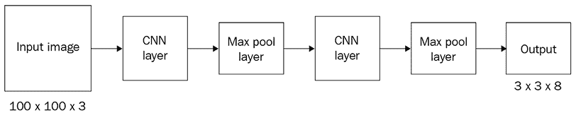

# 8

# 高级目标检测

在前一章节中，我们学习了 R-CNN 和 Fast R-CNN 技术，它们利用区域建议生成图像中对象位置的预测以及图像中对象对应的类别。此外，我们还了解到推断速度的瓶颈在于具有用于区域建议生成和对象检测的两种不同模型。在本章中，我们将学习不同的现代技术，如 Faster R-CNN、YOLO 和**单次检测器**（**SSD**），它们通过使用单一模型来为对象的类别和边界框进行预测，从而克服了慢推断时间的问题。我们将首先学习关于锚框的内容，然后继续学习每种技术的工作原理以及如何实现它们来检测图像中的对象。

我们将在本章节中讨论以下主题：

+   现代目标检测算法的组成部分

+   在自定义数据集上训练 Faster R-CNN

+   YOLO 的工作细节

+   在自定义数据集上训练 YOLO

+   SSD 的工作细节

+   在自定义数据集上训练 SSD

除了上述内容外，作为额外的奖励，我们在 GitHub 仓库中还涵盖了以下内容：

+   训练 YOLOv8

+   训练 EfficientDet 架构

    本章中的所有代码片段均可在 GitHub 仓库的 `Chapter08` 文件夹中找到：[`bit.ly/mcvp-2e`](https://bit.ly/mcvp-2e)。

    随着领域的发展，我们将定期在 GitHub 仓库中添加有价值的补充内容。请查看每章节目录中的 `supplementary_sections` 文件夹获取新的和有用的内容。

# 现代目标检测算法的组成部分

R-CNN 和 Fast R-CNN 技术的缺点在于它们有两个不相交的网络——一个用于识别可能包含对象的区域，另一个用于在识别到对象的地方对边界框进行修正。此外，这两个模型都需要与区域建议一样多的前向传播。现代目标检测算法主要集中在训练单个神经网络上，并且具备在一次前向传递中检测所有对象的能力。典型现代目标检测算法的各个组成部分包括：

+   锚框

+   区域建议网络（RPN）

+   区域兴趣（RoI）池化

让我们在以下小节中讨论这些（我们将专注于锚框和 RPN，因为我们在前一章节中已经讨论了 RoI 池化）。

## 锚框

到目前为止，我们使用了来自 `selectivesearch` 方法的区域建议。锚框作为 `selectivesearch` 的便捷替代品将在本节中学习它们如何替代基于 `selectivesearch` 的区域建议。

通常，大多数对象具有类似的形状 - 例如，在大多数情况下，与人的图像对应的边界框将具有比宽度大的更大的高度，而与卡车图像对应的边界框将具有比高度大的更大的宽度。因此，我们在训练模型之前（通过检查与各种类别对象对应的边界框的真实值）将会对图像中存在的对象的高度和宽度有一个合理的了解。

此外，在某些图像中，感兴趣的对象可能会缩放 - 导致高度和宽度比平均值更小或更大 - 同时保持纵横比（即高度/宽度）。

一旦我们对图像中存在的对象的纵横比、高度和宽度有一个合理的了解（可以从数据集中的真实值获得），我们就会定义具有高度和宽度的锚框，这些锚框表示数据集中大多数对象的边界框。通常，这是通过在图像中存在的对象的地面真实边界框上使用 K 均值聚类来获得的。

现在我们了解了如何获取锚框的高度和宽度，我们将学习如何在流程中利用它们：

1.  将每个锚框从图像的左上角滑动到右下角。

1.  具有与对象高度重叠联合（**IoU**）的高的锚框将标记为包含对象，并且其他将标记为`0`。

我们可以通过提到 IoU 的阈值来修改 IoU 的阈值，如果 IoU 大于某个阈值，则对象类别为`1`；如果小于另一个阈值，则对象类别为`0`，否则未知。

一旦我们按照这里定义的真实值获得了地面真实值，我们可以构建一个模型，该模型可以预测对象的位置，并预测与锚框相匹配的偏移量以与地面真实值匹配。现在让我们了解如何在以下图像中表示锚框：


图 8.1：示例锚框

在上一张图片中，我们有两种锚框，一种高度大于宽度，另一种宽度大于高度，以对应图像中的对象（类别） - 一个人和一辆车。

我们将这两个锚框滑动到图像上，并注意 IoU 与真实标签的位置最高的地方，并指出该特定位置包含对象，而其余位置则不包含对象。

除了上述两种锚框外，我们还会创建具有不同尺度的锚框，以便适应图像中对象可能呈现的不同尺度。以下是不同尺度锚框的示例。请注意，所有锚框都具有相同的中心点，但具有不同的长宽比或尺度：


图 8.2：具有不同尺度和长宽比的锚框

现在我们了解了锚框，接下来的部分中，我们将学习关于 RPN 的知识，RPN 利用锚框来预测可能包含对象的区域。

## 区域提议网络

想象一个场景，我们有一个 224 x 224 x 3 的图像。进一步假设这个例子中锚框的形状是 8 x 8。如果我们有一个步幅为 8 像素，那么我们每一行可以从图像中获取 224/8 = 28 个裁剪图像 —— 实际上从一张图像中总共可以获取 28*28 = 576 个裁剪图像。然后，我们将每一个裁剪图像通过 RPN 传递，该网络指示裁剪图像中是否包含对象。基本上，RPN 提供了裁剪图像包含对象的可能性。

让我们比较`selectivesearch`的输出和 RPN 的输出。

`selectivesearch` 根据像素值进行一组计算，为我们提供了一个区域候选。然而，RPN 根据锚框和锚框滑过图像的步幅生成区域候选。我们使用这两种方法之一获取区域候选后，会识别最有可能包含对象的候选者。

虽然基于`selectivesearch`的区域提议生成是在神经网络之外完成的，但我们可以构建一个作为对象检测网络一部分的 RPN。通过使用 RPN，我们现在无需在网络之外执行不必要的计算来计算区域提议。这样，我们只需要一个单一模型来识别区域、图像中对象的类别以及它们对应的边界框位置。

接下来，我们将学习 RPN 如何确定一个区域候选（在滑动锚框后获得的裁剪图像）是否包含对象。在我们的训练数据中，我们会有与对象对应的真实边界框。现在，我们将每个区域候选与图像中对象的真实边界框进行比较，以确定区域候选与真实边界框之间的 IoU 是否大于某个阈值。如果 IoU 大于某个阈值（比如`0.5`），则区域候选包含对象；如果 IoU 小于某个阈值（比如`0.1`），则区域候选不包含对象，并且在训练过程中将忽略所有 IoU 介于两个阈值之间（`0.1`和`0.5`）的候选者。

一旦我们训练一个模型来预测区域候选是否包含对象，我们接着执行非极大值抑制，因为多个重叠的区域可能包含对象。

总结一下，RPN 通过以下步骤训练模型，使其能够识别高概率包含对象的区域提议：

1.  滑动不同长宽比和尺寸的锚框穿过图像，获取图像的裁剪图像。

1.  计算图像中对象的真实边界框与前一步中获得的裁剪图像之间的 IoU。

1.  准备训练数据集，使得 IoU 大于阈值的裁剪区域包含对象，而 IoU 小于阈值的裁剪区域不包含对象。

1.  训练模型以识别包含对象的区域。

1.  执行非最大抑制以识别概率最高的包含对象的区域候选项，并消除与其高度重叠的其他区域候选项。

现在我们通过一个 RoI 池化层将区域候选项传递，以获得形状的区域。

## 分类和回归

到目前为止，我们已经学习了以下步骤，以便识别对象并执行边界框的偏移量：

1.  识别包含对象的区域。

1.  使用 RoI 池化确保所有区域的特征图，无论区域的形状如何，都完全相同（我们在前一章学习过这一点）。

这些步骤存在两个问题如下：

+   区域提议与物体的重叠不密切（在 RPN 中我们设定了`IoU>0.5`的阈值）。

+   我们已经确定了区域是否包含对象，但没有确定区域中对象的类别。

我们在本节中解决了这两个问题，我们将先前获得的均匀形状的特征图传递到网络中。我们期望网络能够预测区域内包含的对象的类别，并且预测区域的偏移量，以确保边界框尽可能紧密地围绕图像中的对象。

让我们通过以下图表来理解这一点：


图 8.3：预测对象类别和预测边界框要进行的偏移量

在前面的图表中，我们将 RoI 池化的输出作为输入（形状为 7 x 7 x 512），将其展平，并将其连接到一个密集层，然后预测两个不同的方面：

+   区域中的对象类别

+   预测边界框的偏移量的数量，以最大化与地面实况的 IoU

因此，如果数据中有 20 个类别，则神经网络的输出总共包含 25 个输出 – 21 个类别（包括背景类别）和用于边界框高度、宽度以及两个中心坐标的 4 个偏移量。

现在我们已经了解了目标检测流水线的不同组成部分，让我们通过以下图表进行总结：


图 8.4：Faster R-CNN 工作流程

更多关于 Faster R-CNN 的细节可以在这篇论文中找到 – [`arxiv.org/pdf/1506.01497.pdf`](https://arxiv.org/pdf/1506.01497.pdf)。

在 Faster R-CNN 的每个组件的工作细节都已经就位后，在下一节中，我们将编写使用 Faster R-CNN 算法进行目标检测的代码。

# 在自定义数据集上训练 Faster R-CNN

在以下代码中，我们将训练 Faster R-CNN 算法来检测图像中物体周围的边界框。为此，我们将继续上一章节中的相同卡车与公共汽车检测练习：

在 GitHub 的 `Chapter08` 文件夹中的 `Training_Faster_RCNN.ipynb` 文件中找到以下代码：[`bit.ly/mcvp-2e`](https://bit.ly/mcvp-2e)。

1.  下载数据集：

    ```py
    !pip install -qU torch_snippets
    import os
    %%writefile kaggle.json
     {"username":"XXX", "key":"XXX"}
     !mkdir -p ~/.kaggle
     !cp kaggle.json ~/.kaggle/
     !chmod 600 /root/.kaggle/kaggle.json
     !kaggle datasets download -d sixhky/open-images-bus-trucks/
     !unzip -qq open-images-bus-trucks.zip
     !rm open-images-bus-trucks.zip 
    ```

1.  读取包含图像及其边界框和类信息的元数据的 DataFrame：

    ```py
    from torch_snippets import *
    from PIL import Image
    IMAGE_ROOT = 'images/images'
    DF_RAW = df = pd.read_csv('df.csv') 
    ```

1.  定义与标签和目标对应的索引：

    ```py
    label2target = {l:t+1 for t,l in enumerate(DF_RAW['LabelName'].unique())}
    label2target['background'] = 0
    target2label = {t:l for l,t in label2target.items()}
    background_class = label2target['background']
    num_classes = len(label2target) 
    ```

1.  定义用于预处理图像的函数 – `preprocess_image`：

    ```py
    def preprocess_image(img):
        img = torch.tensor(img).permute(2,0,1)
        return img.to(device).float() 
    ```

1.  定义数据集类 – `OpenDataset`：

    1.  定义一个 `__init__` 方法，该方法接受包含图像的文件夹和包含图像元数据的 DataFrame 作为输入：

    ```py
    class OpenDataset(torch.utils.data.Dataset):
        w, h = 224, 224
        def __init__(self, df, image_dir=IMAGE_ROOT):
            self.image_dir = image_dir
            self.files = glob.glob(self.image_dir+'/*')
            self.df = df
            self.image_infos = df.ImageID.unique() 
    ```

    1.  定义 `__getitem__` 方法，在此方法中我们返回预处理的图像和目标值：

    ```py
     def __getitem__(self, ix):
            # load images and masks
            image_id = self.image_infos[ix]
            img_path = find(image_id, self.files)
            img = Image.open(img_path).convert("RGB")
            img = np.array(img.resize((self.w, self.h),
                                  resample=Image.BILINEAR))/255.
            data = df[df['ImageID'] == image_id]
            labels = data['LabelName'].values.tolist()
            data = data[['XMin','YMin','XMax','YMax']].values
            # Convert to absolute coordinates
            data[:,[0,2]] *= self.w
            data[:,[1,3]] *= self.h
            boxes = data.astype(np.uint32).tolist()
            # torch FRCNN expects ground truths as
            # a dictionary of tensors
            target = {}
            target["boxes"] = torch.Tensor(boxes).float()
            target["labels"]= torch.Tensor([label2target[i] \
                                    for i in labels]).long()
            img = preprocess_image(img)
            return img, target 
    ```

注意，这是我们第一次将输出作为张量字典而不是张量列表返回。这是因为 `FRCNN` 类的官方 PyTorch 实现期望目标包含边界框的绝对坐标和标签信息。

1.  定义 `collate_fn` 方法（默认情况下，`collate_fn` 仅适用于张量作为输入，但在这里，我们处理的是字典列表）和 `__len__` 方法：

1.  ```py
     def collate_fn(self, batch):
            return tuple(zip(*batch))
        def __len__(self):
            return len(self.image_infos) 
    ```

1.  创建训练和验证数据加载器及数据集：

    ```py
    from sklearn.model_selection import train_test_split
    trn_ids, val_ids = train_test_split(df.ImageID.unique(),
                        test_size=0.1, random_state=99)
    trn_df, val_df = df[df['ImageID'].isin(trn_ids)], \
                        df[df['ImageID'].isin(val_ids)]
    train_ds = OpenDataset(trn_df)
    test_ds = OpenDataset(val_df)
    train_loader = DataLoader(train_ds, batch_size=4,
                              collate_fn=train_ds.collate_fn,
                                              drop_last=True)
    test_loader = DataLoader(test_ds, batch_size=4,
                               collate_fn=test_ds.collate_fn,
                                              drop_last=True) 
    ```

1.  定义模型：

    ```py
    import torchvision
    from torchvision.models.detection.faster_rcnn import FastRCNNPredictor
    device = 'cuda' if torch.cuda.is_available() else 'cpu'
    def get_model():
        model = torchvision.models.detection\
                    .fasterrcnn_resnet50_fpn(pretrained=True)
        in_features = model.roi_heads.box_predictor.cls_score.in_features
        model.roi_heads.box_predictor = \
                     FastRCNNPredictor(in_features, num_classes)
        return model 
    ```

模型包含以下关键子模块：


图 8.5：Faster R-CNN 架构

在上述输出中，我们注意到以下元素：

+   `GeneralizedRCNNTransform` 是一个简单的调整大小后跟随标准化变换：


图 8.6：输入上的转换

+   `BackboneWithFPN` 是将输入转换为特征映射的神经网络。

+   `RegionProposalNetwork` 生成前述特征映射的锚框，并预测分类和回归任务的单独特征映射：


图 8.7：RPN 架构

+   `RoIHeads` 使用前述的映射，通过 ROI 池化对齐它们，处理它们，并为每个提议返回分类概率和相应的偏移量：


图 8.8：roi_heads 架构

1.  定义在数据批次上训练并计算验证数据上的损失值的函数：

    ```py
    # Defining training and validation functions
    def train_batch(inputs, model, optimizer):
        model.train()
        input, targets = inputs
        input = list(image.to(device) for image in input)
        targets = [{k: v.to(device) for k, v in t.items()} for t in targets]
        optimizer.zero_grad()
        losses = model(input, targets)
        loss = sum(loss for loss in losses.values())
        loss.backward()
        optimizer.step()
        return loss, losses
    @torch.no_grad()
    def validate_batch(inputs, model):
        model.train()
    #to obtain losses, model needs to be in train mode only
    #Note that here we aren't defining the model's forward #method
    #hence need to work per the way the model class is defined
        input, targets = inputs
        input = list(image.to(device) for image in input)
        targets = [{k: v.to(device) for k, v \
                    in t.items()} for t in targets]
        optimizer.zero_grad()
        losses = model(input, targets)
        loss = sum(loss for loss in losses.values())
        return loss, losses 
    ```

1.  在增加的时期训练模型：

    1.  定义模型：

    ```py
    model = get_model().to(device)
    optimizer = torch.optim.SGD(model.parameters(), lr=0.005,
                               momentum=0.9,weight_decay=0.0005)
    n_epochs = 5
    log = Report(n_epochs) 
    ```

    1.  训练模型并计算训练和测试数据集上的损失值：

    ```py
    for epoch in range(n_epochs):
        _n = len(train_loader)
        for ix, inputs in enumerate(train_loader):
            loss, losses = train_batch(inputs, model, optimizer)
            loc_loss, regr_loss, loss_objectness, \
                loss_rpn_box_reg = \
                    [losses[k] for k in ['loss_classifier', \
                    'loss_box_reg', 'loss_objectness', \
                    'loss_rpn_box_reg']]
            pos = (epoch + (ix+1)/_n)
            log.record(pos, trn_loss=loss.item(),
                     trn_loc_loss=loc_loss.item(),
                     trn_regr_loss=regr_loss.item(),
                     trn_objectness_loss=loss_objectness.item(),
                   trn_rpn_box_reg_loss=loss_rpn_box_reg.item(),
                     end='\r')
        _n = len(test_loader)
        for ix,inputs in enumerate(test_loader):
            loss, losses = validate_batch(inputs, model)
            loc_loss, regr_loss, loss_objectness, \
                loss_rpn_box_reg = \
                    [losses[k] for k in ['loss_classifier', \
                    'loss_box_reg', 'loss_objectness', \
                    'loss_rpn_box_reg']]
            pos = (epoch + (ix+1)/_n)
            log.record(pos, val_loss=loss.item(),
                     val_loc_loss=loc_loss.item(),
                     val_regr_loss=regr_loss.item(),
                     val_objectness_loss=loss_objectness.item(),
                     val_rpn_box_reg_loss=loss_rpn_box_reg.item(), end='\r')
        if (epoch+1)%(n_epochs//5)==0: log.report_avgs(epoch+1) 
    ```

1.  绘制各种损失值随时间增加的变化：

    ```py
    log.plot_epochs(['trn_loss','val_loss']) 
    ```

这导致以下输出：


图 8.9：随着时期增加，训练和验证损失值

1.  在新图像上进行预测：

    1.  训练模型的输出包含与类别对应的盒子、标签和分数。在下面的代码中，我们定义了一个`decode_output`函数，它接受模型的输出并在非极大值抑制后提供盒子、分数和类别的列表：

    ```py
    from torchvision.ops import nms
    def decode_output(output):
        'convert tensors to numpy arrays'
        bbs = output['boxes'].cpu().detach().numpy().astype(np.uint16)
        labels = np.array([target2label[i] for i in \
                    output['labels'].cpu().detach().numpy()])
        confs = output['scores'].cpu().detach().numpy()
        ixs = nms(torch.tensor(bbs.astype(np.float32)),
                                torch.tensor(confs), 0.05)
        bbs, confs, labels = [tensor[ixs] for tensor in [bbs, confs, labels]]
        if len(ixs) == 1:
            bbs,confs,labels = [np.array([tensor]) for tensor \
                                    in [bbs, confs, labels]]
        return bbs.tolist(), confs.tolist(), labels.tolist() 
    ```

    1.  获取测试图像上的盒子和类别的预测结果：

    ```py
    model.eval()
    for ix, (images, targets) in enumerate(test_loader):
        if ix==3: break
        images = [im for im in images]
        outputs = model(images)
        for ix, output in enumerate(outputs):
            bbs, confs, labels = decode_output(output)
            info = [f'{l}@{c:.2f}' for l,c in zip(labels,confs)]
            show(images[ix].cpu().permute(1,2,0), bbs=bbs,
                                             texts=labels, sz=5) 
    ```

前述代码提供了以下输出：


图 8.10：预测的边界框和类别

注意，现在生成一张图像的预测需要约 400 毫秒，而 Fast R-CNN 需要 1.5 秒。

在本节中，我们使用 PyTorch `models`包中提供的`fasterrcnn_resnet50_fpn`模型类训练了一个 Faster R-CNN 模型。在接下来的部分中，我们将了解 YOLO，这是一种现代目标检测算法，它可以在一个步骤中执行目标类别检测和区域校正，无需单独的 RPN。

# YOLO 的工作细节

**You Only Look Once** (**YOLO**)及其变体是显著的目标检测算法之一。在本节中，我们将高层次地了解 YOLO 的工作原理及其在克服基于 R-CNN 的目标检测框架的潜在限制方面的作用。

首先，让我们了解基于 R-CNN 的检测算法可能存在的限制。在 Faster R-CNN 中，我们使用锚框在图像上滑动并识别可能包含对象的区域，然后进行边界框修正。然而，在全连接层中，仅传递检测到的区域的 RoI 池化输出作为输入，在区域建议的边界框不能完全包含对象的情况下（对象超出了区域建议的边界框的边界），网络必须猜测对象的真实边界，因为它仅看到了部分图像（而不是整个图像）。在这种情况下，YOLO 非常有用，因为它在预测图像对应的边界框时会查看整个图像。此外，Faster R-CNN 仍然较慢，因为我们有两个网络：RPN 和最终预测围绕对象的类别和边界框的网络。

让我们了解 YOLO 如何在整个图像一次性地检测以及使用单一网络进行预测的同时，克服 Faster R-CNN 的限制。我们将通过以下示例了解为 YOLO 准备数据。

首先，我们为给定的图像创建一个地面真实值来训练模型：

1.  让我们考虑一张具有红色边界框的给定地面真实值图像：


图 8.11：具有地面真实边界框的输入图像

1.  将图像划分为*N* x *N*的网格单元格 – 暂时假定*N*=3：


图 8.12：将输入图像分成一个 3 x 3 的网格

1.  识别包含至少一个地面真实边界框中心的网格单元格。在我们的 3 x 3 网格图像中，它们是单元格**b1**和**b3**。

1.  包围框中心点落在的单元格（或单元格）负责预测对象的边界框。让我们为每个单元格创建相应的真实值。

1.  每个单元格的输出真实值如下所示：


图 8.13：真实值表示

在这里，**pc**（对象存在分数）是网格单元格包含对象的概率。

1.  让我们了解如何计算**bx**、**by**、**bw**和**bh**。首先，我们将网格单元格（假设我们考虑**b1**网格单元格）作为我们的宇宙，并将其归一化到 0 到 1 的比例，如下所示:

    图 8.14：计算每个真实值的 bx、by、bw 和 bh 的步骤 1

**bx**和**by**是边界框中心相对于图像（网格单元格）的位置，如前所述定义。在我们的案例中，**bx** = 0.5，因为边界框的中心点距离原点 0.5 个单位。同样地，**by** = 0.5：


图 8.15：计算 bx 和 by

到目前为止，我们已经计算了从图像中对象的网格单元格中心到真实中心的偏移量。现在让我们了解如何计算**bw**和**bh**：

+   **bw**是边界框相对于网格单元格宽度的比率。

+   **bh**是边界框相对于网格单元格高度的比率。

1.  接下来，我们将预测与网格单元格对应的类别。如果我们有三个类别（`c1` – `truck`，`c2` – `car`和`c3` – `bus`），我们将预测网格单元格包含任何类别的对象的概率。请注意，这里我们不需要背景类别，因为**pc**对应于网格单元格是否包含对象。

1.  现在我们了解了如何表示每个单元格的输出层之后，让我们了解如何构建我们的 3 x 3 网格单元的输出：

    1.  让我们考虑网格单元格**a3**的输出:

    图 8.16：计算与单元格 a3 对应的真实值

    单元格**a3**的输出如前所示的截图。由于网格单元格不包含对象，第一个输出（**pc** – 对象存在分数）为`0`，其余值由于单元格不包含任何对象的中心而无关紧要。

    1.  让我们考虑与网格单元格**b1**对应的输出:

    图 8.17：与单元格 b1 对应的真实值

    之前的输出是因为网格单元格中包含有对象的**bx**、**by**、**bw**和**bh**值，这些值的获取方式与之前所述相同，最终类别为`car`，导致 c2 为`1`，而 c1 和 c3 为`0`。

请注意，对于每个单元格，我们能够获取 8 个输出。因此，对于 3 x 3 网格单元，我们获取 3 x 3 x 8 个输出。

让我们看看接下来的步骤：

1.  定义一个模型，其输入是图像，输出为 3 x 3 x 8，并且根据前一步骤定义的真实值：



图 8.18：示例模型架构

1.  通过考虑锚框来定义真实值。

到目前为止，我们一直在为预期只有一个物体存在于网格单元格内的情景进行构建。然而，在现实中，可能存在一个网格单元格内有多个物体的情况。这会导致创建不正确的真实值。让我们通过以下示例图像来理解这一现象：


图 8.19：同一个网格单元格中可能存在多个物体的情景

在上述示例中，汽车和人的真实边界框的中点都落在同一个单元格中 —— 单元格 **b1**。

避免这种情况的一种方法是使用具有更多行和列的网格，例如一个 19 x 19 的网格。然而，仍然可能存在增加网格单元格数量并不起作用的情况。在这种情况下，锚框就显得特别有用。假设我们有两个锚框 —— 一个高度大于宽度（对应于人），另一个宽度大于高度（对应于汽车）：


图 8.20：利用锚框

通常，锚框会以网格单元格中心作为它们的中心。在存在两个锚框的情况下，每个单元格的输出表示为两个锚框期望输出的串联：


图 8.21：当存在两个锚框时的真实值表示

这里，**bx**，**by**，**bw** 和 **bh** 表示与锚框的偏移（在这种场景中，锚框是宇宙，如图像所示，而不是网格单元格）。

从前面的截图中，我们看到输出为 3 x 3 x 16，因为有两个锚框。期望输出的形状为 *N* x *N* x `num_classes` x `num_anchor_boxes`，其中 *N* x *N* 是网格中单元格的数量，`num_classes` 是数据集中的类别数，`num_anchor_boxes` 是锚框的数量。

1.  现在我们定义损失函数来训练模型。

当计算与模型相关的损失时，我们需要确保在物体性分数低于某个阈值时不计算回归损失和分类损失（这对应于不包含物体的单元格）。

接下来，如果单元格包含一个物体，我们需要确保跨不同类别的分类尽可能准确。

最后，如果单元格包含对象，则边界框偏移应尽可能接近预期。然而，由于宽度和高度的偏移可以比中心的偏移要大得多（因为中心的偏移范围在 0 到 1 之间，而宽度和高度的偏移则不需要），因此我们通过获取平方根值来给予宽度和高度偏移更低的权重。

计算定位和分类损失如下：


在此，我们观察到以下内容：

+    是与回归损失相关联的权重。

+    表示单元格是否包含对象

+    对应于预测类别概率

+    表示物体性得分

总损失是分类损失和回归损失值的总和。

现在，我们已经能够训练一个模型来预测物体周围的边界框。然而，为了更深入地了解 YOLO 及其变体，我们建议您阅读原始论文，网址为 [`arxiv.org/pdf/1506.02640`](https://arxiv.org/pdf/1506.02640)。

现在我们了解了 YOLO 如何在单次预测中预测物体的边界框和类别之后，我们将在下一节中编写代码。

# 在自定义数据集上训练 YOLO

在深度学习中，建立在他人工作的基础上是成为成功从业者的重要途径。对于这一实现，我们将使用官方 YOLOv4 实现来识别图像中公共汽车和卡车的位置。我们将克隆 YOLO 作者自己的存储库实现，并根据需要进行定制，如下所示。

要训练最新的 YOLO 模型，我们强烈建议您查阅以下存储库 – [`github.com/ultralytics/ultralytics`](https://github.com/ultralytics/ultralytics) 和 [`github.com/WongKinYiu/yolov7`](https://github.com/WongKinYiu/yolov7)。

我们已经在 GitHub 的`Chapter08`文件夹中提供了 YOLOv8 的工作实现，文件名为`Training_YOLOv8.ipynb`，网址为 [`bit.ly/mcvp-2e`](https://bit.ly/mcvp-2e)。

## 安装 Darknet

首先，从 GitHub 拉取`darknet`存储库并在环境中编译它。该模型是用一种称为 Darknet 的独立语言编写的，与 PyTorch 不同。我们将使用以下代码进行操作：

可在 GitHub 上的`Chapter08`文件夹中的`Training_YOLO.ipynb`文件中找到以下代码，网址为 [`bit.ly/mcvp-2e`](https://bit.ly/mcvp-2e)。

1.  拉取 Git 存储库：

    ```py
    !git clone https://github.com/AlexeyAB/darknet
    %cd darknet 
    ```

1.  重新配置`Makefile`文件：

    ```py
    !sed -i 's/OPENCV=0/OPENCV=1/' Makefile
    # In case you dont have a GPU, make sure to comment out the
    # below 3 lines
    !sed -i 's/GPU=0/GPU=1/' Makefile
    !sed -i 's/CUDNN=0/CUDNN=1/' Makefile
    !sed -i 's/CUDNN_HALF=0/CUDNN_HALF=1/' Makefile 
    ```

`Makefile` 是在环境中安装 `darknet` 所需的配置文件（可以将此过程视为在 Windows 上安装软件时所做的选择）。我们强制 `darknet` 使用以下标志进行安装：`OPENCV`、`GPU`、`CUDNN` 和 `CUDNN_HALF`。这些都是重要的优化措施，可加快训练速度。此外，在前面的代码中，有一个称为 `sed` 的奇特函数，它代表 **流编辑器**。它是一个强大的 Linux 命令，可以直接从命令提示符中修改文本文件中的信息。具体而言，在这里我们使用它的搜索和替换功能，将 `OPENCV=0` 替换为 `OPENCV=1`，以此类推。要理解的语法是 `sed 's/<search-string>/<replace-with>/'path/to/text/file`。

1.  编译 `darknet` 源代码：

    ```py
    !make 
    ```

1.  安装 `torch_snippets` 包：

    ```py
    !pip install -q torch_snippets 
    ```

1.  下载并解压数据集，并删除 ZIP 文件以节省空间：

    ```py
    !wget --quiet \
     https://www.dropbox.com/s/agmzwk95v96ihic/open-images-bus-trucks.tar.xz
    !tar -xf open-images-bus-trucks.tar.xz
    !rm open-images-bus-trucks.tar.xz 
    ```

1.  获取预训练权重以进行样本预测：

    ```py
    !wget --quiet\ https://github.com/AlexeyAB/darknet/releases/download/darknet_yolo_v3_optimal/yolov4.weights 
    ```

1.  通过运行以下命令测试安装是否成功：

    ```py
    !./darknet detector test cfg/coco.data cfg/yolov4.cfg\ yolov4.weights
     data/person.jpg 
    ```

这将使用从 `cfg/yolov4.cfg` 构建的网络和预训练权重 `yolov4.weights` 对 `data/person.jpg` 进行预测。此外，它还从 `cfg/coco.data` 获取类别，这是预训练权重训练的内容。

前述代码将对样本图像 (`data/person.jpg`) 进行预测，如下所示：


图 8.22：对样本图像的预测

现在我们已经了解了如何安装 `darknet`，在下一节中，我们将学习如何为自定义数据集创建真实数据，以利用 `darknet`。

## 设置数据集格式

YOLO 使用固定格式进行训练。一旦我们按要求格式存储图像和标签，就可以用单个命令对数据集进行训练。因此，让我们了解一下 YOLO 训练所需的文件和文件夹结构。

有三个重要的步骤：

1.  创建一个文本文件 `data/obj.names`，其中包含一行一个类别名称，通过运行以下命令行来实现（`%%writefile` 是一个魔术命令，用于在笔记本单元格中创建一个包含内容的文本文件 `data/obj.names`）：

    ```py
    %%writefile data/obj.names
    bus
    truck 
    ```

1.  在 `data/obj.data` 创建一个文本文件，描述数据集中的参数以及包含训练和测试图像路径的文本文件的位置，还有包含对象名称的文件位置和保存训练模型的文件夹位置：

    ```py
    %%writefile data/obj.data
    classes = 2
    train = data/train.txt
    valid = data/val.txt
    names = data/obj.names
    backup = backup/ 
    ```

前述文本文件的扩展名不是 `.txt`。YOLO 使用硬编码的名称和文件夹来识别数据的位置。此外，魔术命令 `%%writefile` 在 Jupyter 中创建一个带有单元格中指定内容的文件，如前所示。将每个 `%%writefile` `...` 视为 Jupyter 中的一个单独单元格。

1.  将所有图像和真实文本文件移动到 `data/obj` 文件夹中。我们将从 `bus-trucks` 数据集中将图像复制到此文件夹，并包含标签：

    ```py
    !mkdir -p data/obj
    !cp -r open-images-bus-trucks/images/* data/obj/
    !cp -r open-images-bus-trucks/yolo_labels/all/{train,val}.txt data/
    !cp -r open-images-bus-trucks/yolo_labels/all/labels/*.txt data/obj/ 
    ```

请注意，所有的训练和验证图像都位于同一个`data/obj`文件夹中。我们还将一堆文本文件移动到同一个文件夹中。每个包含图像真实标签的文件与图像具有相同的名称。例如，文件夹可能包含`1001.jpg`和`1001.txt`，意味着文本文件包含该图像的标签和边界框。如果`data/train.txt`包含`1001.jpg`作为其行之一，则它是一个训练图像。如果它存在于`val.txt`中，则是一个验证图像。

文本文件本身应包含如下信息：`cls`、`xc`、`yc`、`w`、`h`，其中`cls`是边界框中物体的类索引，位于（`xc`，`yc`）处，表示矩形的中心点，宽度为`w`，高度为`h`。每个`xc`、`yc`、`w`和`h`都是图像宽度和高度的一部分。将每个对象存储在单独的行上。

例如，如果宽度（`800`）和高度（`600`）的图像包含一个卡车和一个公共汽车，中心分别为（`500,300`）和（`100,400`），宽度和高度分别为（`200,100`）和（`300,50`），则文本文件如下所示：

```py
1 0.62 0.50 0.25 0.12
0 0.12 0.67 0.38 0.08 
```

现在我们已经创建了数据，让我们在下一节中配置网络架构。

## 配置架构

YOLO 提供了一长串的架构。有些大，有些小，适用于大或小的数据集。配置可以具有不同的主干。标准数据集有预训练的配置。每个配置都是 GitHub 仓库`cfgs`文件夹中的`.cfg`文件。

每个文件都包含网络架构的文本文件（与我们使用`nn.Module`类建立的方式不同），以及一些超参数，如批处理大小和学习率。我们将选择最小的可用架构，并为我们的数据集进行配置：

```py
# create a copy of existing configuration and modify it in place
!cp cfg/yolov4-tiny-custom.cfg cfg/yolov4-tiny-bus-trucks.cfg
# max_batches to 4000 (since the dataset is small enough)
!sed -i 's/max_batches = 500200/max_batches=4000/' cfg/yolov4-tiny-bus-trucks.cfg
# number of sub-batches per batch
!sed -i 's/subdivisions=1/subdivisions=16/' cfg/yolov4-tiny-bus-trucks.cfg
# number of batches after which learning rate is decayed
!sed -i 's/steps=400000,450000/steps=3200,3600/' cfg/yolov4-tiny-bus-trucks.cfg
# number of classes is 2 as opposed to 80
# (which is the number of COCO classes)
!sed -i 's/classes=80/classes=2/g' cfg/yolov4-tiny-bus-trucks.cfg
# in the classification and regression heads,
# change number of output convolution filters
# from 255 -> 21 and 57 -> 33, since we have fewer classes
# we don't need as many filters
!sed -i 's/filters=255/filters=21/g' cfg/yolov4-tiny-bus-trucks.cfg
!sed -i 's/filters=57/filters=33/g' cfg/yolov4-tiny-bus-trucks.cfg 
```

这样一来，我们已经重新配置了`yolov4-tiny`，使其可以在我们的数据集上进行训练。唯一剩下的步骤是加载预训练的权重并训练模型，这将在下一节中进行。

## 训练和测试模型

我们将从以下 GitHub 位置获取权重，并将它们存储在`build/darknet/x64`中：

```py
!wget --quiet https://github.com/AlexeyAB/darknet/releases/download/darknet_yolo_v4_pre/yolov4-tiny.conv.29
!cp yolov4-tiny.conv.29 build/darknet/x64/ 
```

最后，我们将使用以下命令训练模型：

```py
!./darknet detector train data/obj.data \
cfg/yolov4-tiny-bus-trucks.cfg yolov4-tiny.conv.29 -dont_show -mapLastAt 
```

`-dont_show`标志跳过显示中间预测图像，而`-mapLastAt`会定期打印验证数据上的平均精度。整个训练可能需要 1 到 2 小时与 GPU。权重会定期存储在备份文件夹中，并可以在训练后用于预测，例如以下代码，该代码在新图像上进行预测：

```py
!pip install torch_snippets
from torch_snippets import Glob, stem, show, read
# upload your own images to a folder
image_paths = Glob('images-of-trucks-and-busses')
for f in image_paths:
    !./darknet detector test \
    data/obj.data cfg/yolov4-tiny-bus-trucks.cfg\
    backup/yolov4-tiny-bus-trucks_4000.weights {f}
    !mv predictions.jpg {stem(f)}_pred.jpg
for i in Glob('*_pred.jpg'):
    show(read(i, 1), sz=20) 
```

前面的代码导致了以下输出：


图 8.23：输入图像上的预测边界框和类别

现在我们已经了解了如何利用 YOLO 在自定义数据集上执行目标检测，接下来，我们将学习另一种目标检测技术——**单阶段检测器（SSD）**。

# SSD 的工作细节

到目前为止，我们已经看到了一个场景，在这个场景中，我们在逐渐对前一层输出进行卷积和池化之后进行预测。然而，我们知道不同的层对原始图像有不同的感知域。例如，初始层的感知域比最终层的感知域要小。在这里，我们将学习 SSD 如何利用这一现象为图像的边界框进行预测。

SSD 如何帮助解决检测不同尺度对象的问题的工作原理如下：

1.  我们利用预训练的 VGG 网络，并在其上添加一些额外的层，直到获得一个 1 x 1 的块。

1.  不仅仅利用最终层进行边界框和类别预测，我们将利用所有最后几层来进行类别和边界框的预测。

1.  我们将使用具有特定比例和长宽比的默认框代替锚框。

1.  每个默认框都应该预测对象和边界框偏移量，就像锚框在 YOLO 中预测类别和偏移量一样。

现在我们了解了 SSD 与 YOLO 的主要不同之处（即 SSD 中的默认框取代了 YOLO 中的锚框，并且多个层连接到最终层，而不是 YOLO 中的逐步卷积池化），接下来我们将学习以下内容：

+   SSD 的网络架构

+   如何利用不同层进行边界框和类别预测

+   如何为不同层的默认框分配比例和长宽比

SSD 的网络架构如下：


图 8.24：SSD 工作流程

正如您在前面的图中所看到的，我们正在获取一个大小为 300 x 300 x 3 的图像，并通过预训练的 VGG-16 网络来获得`conv5_3`层的输出。此外，我们通过在`conv5_3`输出上添加几个额外的卷积来扩展网络。

接下来，我们为每个单元格和每个默认框获取边界框偏移量和类别预测（关于默认框的更多信息将在下一节详细介绍；现在，让我们想象这与锚框类似）。从`conv5_3`输出中得到的预测总数为 38 x 38 x 4，其中 38 x 38 是`conv5_3`层的输出形状，4 是在`conv5_3`层上操作的默认框数量。同样，网络中所有检测的总数如下：

| **层** | **每类的检测数** |
| --- | --- |
| `conv5_3` | 38 x 38 x 4 = 5,776 |
| `FC6` | 19 x 19 x 6 = 2,166 |
| `conv8_2` | 10 x 10 x 6 = 600 |
| `conv9_2` | 5 x 5 x 6 = 150 |
| `conv10_2` | 3 x 3 x 4 = 36 |
| `conv11_2` | 1 x 1 x 4 = 4 |
| **总检测数** | **8,732** |

表 8.1：每类的检测数

请注意，在原始论文描述的架构中，某些层次的默认盒子数量较多（为 6 而不是 4）。

现在，让我们了解默认盒子的不同尺度和长宽比。我们将从尺度开始，然后继续到长宽比。

让我们想象一种情况，其中对象的最小比例为图像高度和宽度的 20%，对象的最大比例为图像高度和宽度的 90%。在这种情况下，我们随着层次的增加逐渐增加尺度（随着向后层次，图像尺寸显著缩小），如下所示：


图 8.25：随着不同层次对象大小比例变化的盒子尺度

使图像逐步缩放的公式如下：


了解了如何在不同层次计算尺度之后，让我们学习如何生成不同长宽比的盒子。可能的长宽比如下所示：


不同层次盒子的中心如下：


这里，*i* 和 *j* 一起表示层 *l* 中的一个单元格。另一方面，根据不同长宽比计算的宽度和高度如下所示：


请注意，在某些层次我们考虑了四个盒子，而在另一层次我们考虑了六个盒子。如果要保留四个盒子，则移除 `{3,1/3}` 长宽比，否则考虑所有六个可能的盒子（五个尺度相同的盒子和一个尺度不同的盒子）。让我们看看如何获得第六个盒子：


有了这些，我们已经得到了所有可能的盒子。接下来让我们了解如何准备训练数据集。

具有 IoU 大于阈值（例如 `0.5`）的默认盒子被视为正匹配，其余为负匹配。在 SSD 的输出中，我们预测盒子属于某一类的概率（其中第 0 类表示背景），还预测了相对于默认盒子的真实值偏移量。

最后，通过优化以下损失值来训练模型：

+   **分类损失**：使用以下方程表示：


在前述方程中，*pos* 表示与真实值有较高重叠的少数默认盒子，而 *neg* 表示误分类的盒子，这些盒子预测为某一类别，但实际上未包含对象。最后，我们确保 *pos:neg* 比例最多为 1:3，如果不进行这种采样，背景类盒子会占主导地位。

+   **定位损失：** 对于定位，我们仅在物体性得分大于某个阈值时考虑损失值。定位损失计算如下：


在这里，*t*是预测的偏移量，*d*是实际偏移量。

欲深入了解 SSD 工作流程，请参阅[`arxiv.org/abs/1512.02325`](https://arxiv.org/abs/1512.02325)。

现在我们理解了如何训练 SSD，让我们在下一节将其用于我们的公共汽车与卡车目标检测练习中。本节的核心实用函数位于 GitHub 仓库：[`github.com/sizhky/ssd-utils/`](https://github.com/sizhky/ssd-utils/)。让我们在开始训练过程之前逐个了解它们。

## SSD 代码中的组件

GitHub 仓库中有三个文件。让我们稍微深入了解它们，并在训练之前理解它们使用的导入。**请注意，此部分不是训练过程的一部分，而是用于理解训练中使用的导入。**

我们从 GitHub 仓库的`model.py`文件中导入`SSD300`和`MultiBoxLoss`类。让我们分别了解它们。

### SSD300

当你查看`SSD300`函数定义时，可以明显看到该模型由三个子模块组成：

```py
class SSD300(nn.Module):
    ...
    def __init__(self, n_classes, device):
        ...
        self.base = VGGBase()
        self.aux_convs = AuxiliaryConvolutions()
        self.pred_convs = PredictionConvolutions(n_classes)
        ... 
```

首先我们将输入发送到`VGGBase`，它返回两个尺寸为`(N, 512, 38, 38)`和`(N, 1024, 19, 19)`的特征向量。第二个输出将成为`AuxiliaryConvolutions`的输入，它返回更多的特征映射，尺寸为`(N, 512, 10, 10)`、`(N, 256, 5, 5)`、`(N, 256, 3, 3)`和`(N, 256, 1, 1)`。最后，来自`VGGBase`的第一个输出和这四个特征映射被发送到`PredictionConvolutions`，它返回 8,732 个锚框，正如我们之前讨论的那样。

`SSD300`类的另一个关键方面是`create_prior_boxes`方法。对于每个特征图，与之关联的有三个项目：网格的大小、用于缩小网格单元的比例（这是该特征图的基础锚框），以及单元格中所有锚框的长宽比。使用这三个配置，代码使用三重`for`循环并为所有 8,732 个锚框创建`(cx, cy, w, h)`列表。

最后，`detect_objects`方法接受模型预测的锚框分类和回归值张量，并将它们转换为实际边界框坐标。

### MultiBoxLoss

作为人类，我们只关心少数边界框。但是对于 SSD 的工作方式，我们需要比较来自多个特征映射的 8,732 个边界框，并预测一个锚框是否包含有价值的信息。我们将此损失计算任务分配给`MultiBoxLoss`。

forward 方法的输入是模型的锚框预测和地面真实边界框。

首先，我们将地面真值框转换为 8,732 个锚框的列表，方法是将模型中的每个锚点与边界框进行比较。如果 IoU（交并比）足够高，则特定的锚框将具有非零回归坐标，并将一个对象关联为分类的地面真值。自然地，大多数计算出的锚框将具有其关联类别为`background`，因为它们与实际边界框的 IoU 很小，或者在很多情况下为`0`。

一旦地面真实值转换为这些 8,732 个锚框回归和分类张量，就可以轻松地将它们与模型的预测进行比较，因为它们的形状现在是相同的。我们在回归张量上执行`MSE-Loss`，在定位张量上执行`CrossEntropy-Loss`，并将它们相加作为最终损失返回。

# 在自定义数据集上训练 SSD

在下面的代码中，我们将训练 SSD 算法以检测图像中物体周围的边界框。我们将使用我们一直在进行的卡车与公共汽车物体检测任务：

在 GitHub 的`Chapter08`文件夹中的`Training_SSD.ipynb`文件中找到以下代码，网址为[`bit.ly/mcvp-2e`](https://bit.ly/mcvp-2e)。代码包含下载数据的 URL，并且相对较长。我们强烈建议在 GitHub 上执行笔记本以重现结果，同时按照文本中各种代码组件的步骤和解释进行操作。

1.  下载图像数据集并克隆托管代码模型和其他处理数据工具的 Git 仓库：

    ```py
    import os
    if not os.path.exists('open-images-bus-trucks'):
        !pip install -q torch_snippets
        !wget --quiet https://www.dropbox.com/s/agmzwk95v96ihic/\
        open-images-bus-trucks.tar.xz
        !tar -xf open-images-bus-trucks.tar.xz
        !rm open-images-bus-trucks.tar.xz
        !git clone https://github.com/sizhky/ssd-utils/
    %cd ssd-utils 
    ```

1.  预处理数据，就像我们在*在自定义数据集上训练 Faster R-CNN*部分中所做的一样：

    ```py
    from torch_snippets import *
    DATA_ROOT = '../open-images-bus-trucks/'
    IMAGE_ROOT = f'{DATA_ROOT}/images'
    DF_RAW = pd.read_csv(f'{DATA_ROOT}/df.csv')
    df = DF_RAW.copy()
    df = df[df['ImageID'].isin(df['ImageID'].unique().tolist())]
    label2target = {l:t+1 for t,l in enumerate(DF_RAW['LabelName'].unique())}
    label2target['background'] = 0
    target2label = {t:l for l,t in label2target.items()}
    background_class = label2target['background']
    num_classes = len(label2target)
    device = 'cuda' if torch.cuda.is_available() else 'cpu' 
    ```

1.  准备数据集类，就像我们在*在自定义数据集上训练 Faster R-CNN*部分中所做的一样：

    ```py
    import collections, os, torch
    from PIL import Image
    from torchvision import transforms
    normalize = transforms.Normalize(
                    mean=[0.485, 0.456, 0.406],
                    std=[0.229, 0.224, 0.225]
                )
    denormalize = transforms.Normalize( 
                    mean=[-0.485/0.229,-0.456/0.224,-0.406/0.255],
                    std=[1/0.229, 1/0.224, 1/0.255]
                )
    def preprocess_image(img):
        img = torch.tensor(img).permute(2,0,1)
        img = normalize(img)
        return img.to(device).float()
    class OpenDataset(torch.utils.data.Dataset):
        w, h = 300, 300
        def __init__(self, df, image_dir=IMAGE_ROOT):
            self.image_dir = image_dir
            self.files = glob.glob(self.image_dir+'/*')
            self.df = df
            self.image_infos = df.ImageID.unique()
            logger.info(f'{len(self)} items loaded')

        def __getitem__(self, ix):
            # load images and masks
            image_id = self.image_infos[ix]
            img_path = find(image_id, self.files)
            img = Image.open(img_path).convert("RGB")
            img = np.array(img.resize((self.w, self.h),
                           resample=Image.BILINEAR))/255.
            data = df[df['ImageID'] == image_id]
            labels = data['LabelName'].values.tolist()
            data = data[['XMin','YMin','XMax','YMax']].values
            data[:,[0,2]] *= self.w
            data[:,[1,3]] *= self.h
            boxes = data.astype(np.uint32).tolist() # convert to
            # absolute coordinates
            return img, boxes, labels
        def collate_fn(self, batch):
            images, boxes, labels = [], [], []
            for item in batch:
                img, image_boxes, image_labels = item
                img = preprocess_image(img)[None]
                images.append(img)
                boxes.append(torch.tensor( \                       
                           image_boxes).float().to(device)/300.)
                labels.append(torch.tensor([label2target[c] \
                      for c in image_labels]).long().to(device))
            images = torch.cat(images).to(device)
            return images, boxes, labels
        def __len__(self):
            return len(self.image_infos) 
    ```

1.  准备训练和测试数据集以及数据加载器：

    ```py
    from sklearn.model_selection import train_test_split
    trn_ids, val_ids = train_test_split(df.ImageID.unique(),
                                 test_size=0.1, random_state=99)
    trn_df, val_df = df[df['ImageID'].isin(trn_ids)], \
                    df[df['ImageID'].isin(val_ids)]
    train_ds = OpenDataset(trn_df)
    test_ds = OpenDataset(val_df)
    train_loader = DataLoader(train_ds, batch_size=4,
                              collate_fn=train_ds.collate_fn,
                              drop_last=True)
    test_loader = DataLoader(test_ds, batch_size=4,
                             collate_fn=test_ds.collate_fn,
                             drop_last=True) 
    ```

1.  定义函数以在批量数据上进行训练，并计算验证数据的准确性和损失值：

    ```py
    def train_batch(inputs, model, criterion, optimizer):
        model.train()
        N = len(train_loader)
        images, boxes, labels = inputs
        _regr, _clss = model(images)
        loss = criterion(_regr, _clss, boxes, labels)
        optimizer.zero_grad()
        loss.backward()
        optimizer.step()
        return loss
    @torch.no_grad()
    def validate_batch(inputs, model, criterion):
        model.eval()
        images, boxes, labels = inputs
        _regr, _clss = model(images)
        loss = criterion(_regr, _clss, boxes, labels)
        return loss 
    ```

1.  导入模型：

    ```py
    from model import SSD300, MultiBoxLoss
    from detect import * 
    ```

1.  初始化模型、优化器和损失函数：

    ```py
    n_epochs = 5
    model = SSD300(num_classes, device)
    optimizer = torch.optim.AdamW(model.parameters(), lr=1e-4, weight_decay=1e-5)
    criterion = MultiBoxLoss(priors_cxcy=model.priors_cxcy, device=device)
    log = Report(n_epochs=n_epochs)
    logs_to_print = 5 
    ```

1.  在增加的 epochs 上训练模型：

    ```py
    for epoch in range(n_epochs):
        _n = len(train_loader)
        for ix, inputs in enumerate(train_loader):
            loss = train_batch(inputs, model, criterion, optimizer)
            pos = (epoch + (ix+1)/_n)
            log.record(pos, trn_loss=loss.item(), end='\r')
        _n = len(test_loader)
        for ix,inputs in enumerate(test_loader):
            loss = validate_batch(inputs, model, criterion)
            pos = (epoch + (ix+1)/_n)
            log.record(pos, val_loss=loss.item(), end='\r') 
    ```

随着 epoch 的增加，训练和测试损失值的变化如下：


图 8.26：随着 epoch 增加的训练和验证损失

1.  获取新图像的预测（获取随机图像）：

    ```py
    image_paths = Glob(f'{DATA_ROOT}/images/*')
    image_id = choose(test_ds.image_infos)
    img_path = find(image_id, test_ds.files)
    original_image = Image.open(img_path, mode='r')
    original_image = original_image.convert('RGB') 
    ```

1.  获取与图像中存在的对象对应的边界框、标签和分数：

    ```py
    bbs, labels, scores = detect(original_image, model,
                                 min_score=0.9, max_overlap=0.5,
                                 top_k=200, device=device) 
    ```

1.  将获取的输出覆盖在图像上：

    ```py
    labels = [target2label[c.item()] for c in labels]
    label_with_conf = [f'{l} @ {s:.2f}' for l,s in zip(labels,scores)]
    print(bbs, label_with_conf)
    show(original_image, bbs=bbs,
         texts=label_with_conf, text_sz=10) 
    ```

上述代码获取执行迭代中每个输出的样本如下（每次执行都会有一个图像）：


图 8.27：输入图像上的预测边界框和类别

从中我们可以看出，我们可以相当准确地检测图像中的物体。

# 摘要

在本章中，我们了解了现代目标检测算法 Faster R-CNN、YOLO 和 SSD 的工作细节。我们学习了它们如何克服两个独立模型的限制 - 一个用于获取区域提议，另一个用于在区域提议上获取类别和边界框偏移量。此外，我们使用 PyTorch 实现了 Faster R-CNN，使用 `darknet` 实现了 YOLO，并从头开始实现了 SSD。

在接下来的章节中，我们将学习关于图像分割的内容，这一步进一步超越了仅仅识别对象位置的功能，它还能识别对应对象的像素。此外，在 *第十章*，*目标检测和分割的应用* 中，我们将学习 Detectron2 框架，它不仅有助于检测对象，还能在单次操作中对它们进行分割。

# 问题

1.  为什么 Faster R-CNN 相对于 Fast R-CNN 更快？

1.  在与 Faster R-CNN 相比时，YOLO 和 SSD 为何更快？

1.  YOLO 和 SSD 单次检测器算法有何特点？

1.  目标性分数和类别分数之间有何区别？

# 在 Discord 上了解更多信息

加入我们社区的 Discord 空间，与作者和其他读者进行讨论：

[`packt.link/modcv`](https://packt.link/modcv)


