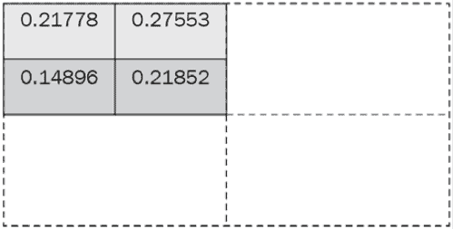

# 9

# 图像分割

在上一章中，我们学习了如何检测图像中存在的对象，以及与检测到的对象相对应的类别。在本章中，我们将更进一步，不仅在对象周围绘制边界框，还将确定包含对象的确切像素。此外，在本章结束时，我们将能够单独识别属于同一类别的实例/对象。

通过查看 U-Net 和 Mask R-CNN 架构，我们还将学习语义分割和实例分割。具体来说，我们将涵盖以下主题：

+   探索 U-Net 架构

+   使用 U-Net 实现语义分割以在道路上分割对象

+   探索 Mask R-CNN 架构

+   使用 Mask R-CNN 实现实例分割以识别给定类别的多个实例

通过图像分割，我们试图实现的简明示例如下所示：


图 9.1: 在示例图像上对象定位和分割任务的差异（来源：[`arxiv.org/pdf/1405.0312.pdf`](https://arxiv.org/pdf/1405.0312.pdf)）

上图显示了：(a) 从图像中识别的对象类别，(b) 从图像中识别的对象位置，(c) 从图像中识别的对象类别掩码，以及 (d) 从图像中分离出的对象实例。现在你知道可以期待什么了，让我们开始吧！

本章中的所有代码可以在 GitHub 仓库的 `Chapter09` 文件夹中找到，链接为 [`bit.ly/mcvp-2e`](https://bit.ly/mcvp-2e)。

# 探索 U-Net 架构

想象一种情景，你被要求预测图像中哪些像素对应于什么对象。到目前为止，当我们预测对象类别和边界框时，我们通过网络传递图像，然后通过骨干架构（如 VGG 或 ResNet）传递图像，将输出在某一层展平，并在进行类别和边界框偏移预测之前连接额外的密集层。然而，在图像分割的情况下，输出形状与输入图像的形状相同，展平卷积的输出然后重构图像可能会导致信息丢失。此外，在图像分割的情况下，原始图像中存在的轮廓和形状在输出图像中不会发生变化，因此我们到目前为止处理过的网络（展平最后一层并连接额外的密集层）在执行分割时并不是最优的。

在本节中，我们将学习如何执行图像分割。在执行分割时，我们需要牢记以下两个方面：

+   原始图像中的对象的形状和结构在分割输出中保持不变。

+   利用完全卷积架构（而不是我们将某一层展平的结构）可以帮助我们，因为我们使用一个图像作为输入和另一个作为输出。

U-Net 架构帮助我们实现了这一点。U-Net 的典型表示如下（输入图像形状为 3 x 96 x 128，图像中类别数为 21；这意味着输出包含 21 个通道）：


图 9.2：一个样例 U-Net 架构

前述架构被称为**U-Net 架构**，因为它具有类似**U**字形的形状。

在前述图的左半部分，我们可以看到图像通过卷积层，就像我们在前几章中所见到的那样，并且图像的大小在减小，而通道数在增加。然而，在右半部分，我们可以看到我们将缩小的图像进行了上采样，回到原始的高度和宽度，但通道数与类别数相同（在这种情况下是 21）。

此外，在上采样过程中，我们还利用左半部分相应层的信息使用**跳跃连接**（类似于我们在第五章中学到的 ResNet 中的那些），以便保留原始图像中的结构/对象。这样，U-Net 架构学习保留原始图像的结构（和对象的形状），同时利用卷积特征来预测每个像素对应的类别。

一般来说，输出的通道数与我们想要预测的类别数相同。

现在我们了解了 U-Net 架构的高层次，让我们在下一节中了解我们介绍的新概念，上采样。

# 执行上采样

在 U-Net 架构中，使用 `nn.ConvTranspose2d` 方法进行上采样，该方法接受输入通道数、输出通道数、核心大小和步幅作为输入参数。`ConvTranspose2d` 的一个示例计算如下：


图 9.3：上采样操作

在前述示例中，我们采取了一个形状为 3 x 3 的输入数组（**输入数组**），应用了步长为 2 的步幅，在这里我们分布输入值以适应步幅（**调整为步幅的输入数组**），用零填充数组（**调整为步幅和填充的输入数组**），并使用滤波器（**过滤器/核心**）与填充的输入进行卷积以获取输出数组。

通过利用填充和步幅的组合，我们已经将形状为 3 x 3 的输入上采样到形状为 6 x 6 的数组。虽然前述示例仅用于说明目的，但优化的滤波器值学习（因为在模型训练过程中优化了滤波器权重和偏差）尽可能地重建原始图像。

`nn.ConvTranspose2d`中的超参数如下：


图 9.4: `ConvTranspose2d`的参数

为了理解`nn.ConvTranspose2d`如何帮助放大数组，让我们来看下面的代码：

1.  导入相关软件包：

    ```py
    import torch
    import torch.nn as nn 
    ```

1.  使用`nn.ConvTranspose2d`方法初始化网络`m`：

    ```py
    m = nn.ConvTranspose2d(1, 1, kernel_size=(2,2), stride=2, padding = 0) 
    ```

在前述代码中，我们指定输入通道值为`1`，输出通道值为`1`，核的大小为`(2,2)`，步长为`2`，填充为`0`。

内部填充的计算方式为扩展 * (核大小 - 1) - 填充。因此，它是 1*(2-1)-0 = 1，在输入数组的两个维度上都添加零填充为 1。

1.  初始化输入数组并通过模型传递：

    ```py
    input = torch.ones(1, 1, 3, 3)
    output = m(input)
    output.shape 
    ```

前述代码生成的形状为`1x1x6x6`，如前文提供的示例图像所示。

现在我们理解了 U-Net 架构的工作原理以及`nn.ConvTranspose2d`如何帮助放大图像，让我们来实现它，以便可以预测道路场景图像中存在的不同物体。

# 使用 U-Net 实现语义分割

在本节中，我们将利用 U-Net 架构来预测图像中所有像素对应的类别。如下所示是这种输入-输出组合的示例：


图 9.5: (左) 输入图像；(右) 输出图像，显示图像中存在的各种对象对应的类别

请注意，在前述图片中，属于同一类的对象（左图中的输入图像）具有相同的像素值（右图中的输出图像），这就是我们将语义相似的像素进行**分割**的原因。这也称为语义分割。让我们学习如何编写语义分割代码：

在 GitHub 的`Chapter09`文件夹中的`Semantic_Segmentation_with_U_Net.ipynb`文件中找到以下代码，位于[`bit.ly/mcvp-2e`](https://bit.ly/mcvp-2e)，代码包含用于下载数据的 URL，并且长度适中。

1.  让我们从下载必要的数据集、安装必要的软件包并导入它们开始。完成后，我们可以定义设备：

    ```py
    import os
    if not os.path.exists('dataset1'):
        !wget -q https://www.dropbox.com/s/0pigmmmynbf9xwq/dataset1.zip
        !unzip -q dataset1.zip
        !rm dataset1.zip
        !pip install -q torch_snippets pytorch_model_summary
    from torch_snippets import *
    from torchvision import transforms
    from sklearn.model_selection import train_test_split
    device = 'cuda' if torch.cuda.is_available() else 'cpu' 
    ```

1.  定义用于转换图像(`tfms`)的函数：

    ```py
    tfms = transforms.Compose([
                transforms.ToTensor(),
                transforms.Normalize([0.485, 0.456, 0.406],
                                     [0.229, 0.224, 0.225])
            ]) 
    ```

1.  定义数据集类(`SegData`)以获取训练所需的输入和输出图像：

    1.  指定包含图像的文件夹在`__init__`方法中：

    ```py
    class SegData(Dataset):
        def __init__(self, split):
            self.items=stems(f'dataset1/images_prepped_{split}')
            self.split = split 
    ```

    1.  定义`__len__`方法：

    ```py
     def __len__(self):
            return len(self.items) 
    ```

    1.  定义`__getitem__`方法：

    ```py
     def __getitem__(self, ix):
            image =read(f'dataset1/images_prepped_{self.split}/\
                                   {self.items[ix]}.png', 1)
            image = cv2.resize(image, (224,224))
            mask=read(f'dataset1/annotations_prepped_{self.split}\
                                /{self.items[ix]}.png')[:,:,0]
            mask = cv2.resize(mask, (224,224))
            return image, mask 
    ```

    在`__getitem__`方法中，我们将输入(`image`)和输出(`mask`)图像都调整大小，使它们具有相同的形状。请注意，掩码图像包含的整数值在`[0,11]`范围内。这表明有 12 种不同的类别。

    1.  定义一个函数(`choose`)来选择一个随机图像索引（主要用于调试目的）：

    ```py
     def choose(self): return self[randint(len(self))] 
    ```

    1.  定义`collate_fn`方法来对图像批次进行预处理：

    ```py
     def collate_fn(self, batch):
            ims, masks = list(zip(*batch))
            ims = torch.cat([tfms(im.copy()/255.)[None] \
                         for im in ims]).float().to(device)
            ce_masks = torch.cat([torch.Tensor(mask[None]) for\
                         mask in masks]).long().to(device)
            return ims, ce_masks 
    ```

    在前述代码中，我们对所有输入图像进行预处理，以便它们具有一个通道（这样每个图像稍后可以通过 CNN 传递），一旦我们转换了缩放后的图像。注意，`ce_masks` 是一个长整数张量，类似于交叉熵目标。

1.  定义训练和验证数据集，以及数据加载器：

    ```py
    trn_ds = SegData('train')
    val_ds = SegData('test')
    trn_dl = DataLoader(trn_ds, batch_size=4, shuffle=True,
                        collate_fn=trn_ds.collate_fn)
    val_dl = DataLoader(val_ds, batch_size=1, shuffle=True,
                        collate_fn=val_ds.collate_fn) 
    ```

1.  定义神经网络模型架构以进行分割训练。请注意，U-Net 包含传统的卷积以及上采样卷积：

    1.  定义卷积块（`conv`）：

    ```py
    def conv(in_channels, out_channels):
        return nn.Sequential(
            nn.Conv2d(in_channels,out_channels,kernel_size=3,
                        stride=1, padding=1),
            nn.BatchNorm2d(out_channels),
            nn.ReLU(inplace=True)
        ) 
    ```

    1.  在 `conv` 的定义中，我们依次执行 `Conv2d` 操作、`BatchNorm2d` 操作和 `ReLU` 操作。

    1.  定义 `up_conv` 块：

    ```py
    def up_conv(in_channels, out_channels):
        return nn.Sequential(
            nn.ConvTranspose2d(in_channels, out_channels,
                               kernel_size=2, stride=2),
            nn.ReLU(inplace=True)
        ) 
    ```

    1.  `ConvTranspose2d` 确保我们放大图像。这与 `Conv2d` 操作不同，后者减少图像的维度。它接受具有 `in_channels` 通道数的图像作为输入通道，并生成具有 `out_channels` 输出通道数的图像。

    1.  定义网络类（`UNet`）：

    ```py
    from torchvision.models import vgg16_bn
    class UNet(nn.Module):
        def __init__(self, pretrained=True, out_channels=12):
            super().__init__()
            self.encoder= vgg16_bn(pretrained=pretrained).features
            self.block1 = nn.Sequential(*self.encoder[:6])
            self.block2 = nn.Sequential(*self.encoder[6:13])
            self.block3 = nn.Sequential(*self.encoder[13:20])
            self.block4 = nn.Sequential(*self.encoder[20:27])
            self.block5 = nn.Sequential(*self.encoder[27:34])
            self.bottleneck = nn.Sequential(*self.encoder[34:])
            self.conv_bottleneck = conv(512, 1024)
            self.up_conv6 = up_conv(1024, 512)
            self.conv6 = conv(512 + 512, 512)
            self.up_conv7 = up_conv(512, 256)
            self.conv7 = conv(256 + 512, 256)
            self.up_conv8 = up_conv(256, 128)
            self.conv8 = conv(128 + 256, 128)
            self.up_conv9 = up_conv(128, 64)
            self.conv9 = conv(64 + 128, 64)
            self.up_conv10 = up_conv(64, 32)
            self.conv10 = conv(32 + 64, 32)
            self.conv11 = nn.Conv2d(32, out_channels, kernel_size=1) 
    ```

    1.  在前述的 `__init__` 方法中，我们定义了在 `forward` 方法中使用的所有层。

    1.  定义 `forward` 方法：

    ```py
     def forward(self, x):
            block1 = self.block1(x)
            block2 = self.block2(block1)
            block3 = self.block3(block2)
            block4 = self.block4(block3)
            block5 = self.block5(block4)
            bottleneck = self.bottleneck(block5)
            x = self.conv_bottleneck(bottleneck)
            x = self.up_conv6(x)
            x = torch.cat([x, block5], dim=1)
            x = self.conv6(x)
            x = self.up_conv7(x)
            x = torch.cat([x, block4], dim=1)
            x = self.conv7(x)
            x = self.up_conv8(x)
            x = torch.cat([x, block3], dim=1)
            x = self.conv8(x)
            x = self.up_conv9(x)
            x = torch.cat([x, block2], dim=1)
            x = self.conv9(x)
            x = self.up_conv10(x)
            x = torch.cat([x, block1], dim=1)
            x = self.conv10(x)
            x = self.conv11(x)
            return x 
    ```

    1.  在前述代码中，我们通过在适当的张量对上使用 `torch.cat` 来制作 U 型连接，连接了降采样和上采样卷积特征。

    1.  定义一个函数（`UNetLoss`），用于计算我们的损失和准确性值：

    ```py
    ce = nn.CrossEntropyLoss()
    def UnetLoss(preds, targets):
        ce_loss = ce(preds, targets)
        acc = (torch.max(preds,1)[1] == targets).float().mean()
        return ce_loss, acc 
    ```

    1.  定义一个函数，该函数将对批次进行训练（`train_batch`），并计算验证数据集上的指标（`validate_batch`）：

    ```py
    def train_batch(model, data, optimizer, criterion):
        model.train()
        ims, ce_masks = data
        _masks = model(ims)
        optimizer.zero_grad()
        loss, acc = criterion(_masks, ce_masks)
        loss.backward()
        optimizer.step()
        return loss.item(), acc.item()
    @torch.no_grad()
    def validate_batch(model, data, criterion):
        model.eval()
        ims, masks = data
        _masks = model(ims)
        loss, acc = criterion(_masks, masks)
        return loss.item(), acc.item() 
    ```

    1.  定义模型、优化器、损失函数以及训练的 epochs 数量：

    ```py
    model = UNet().to(device)
    criterion = UnetLoss
    optimizer = optim.Adam(model.parameters(), lr=1e-3)
    n_epochs = 20 
    ```

1.  在增加的 epochs 上训练模型：

    ```py
    log = Report(n_epochs)
    for ex in range(n_epochs):
        N = len(trn_dl)
        for bx, data in enumerate(trn_dl):
            loss, acc = train_batch(model, data, optimizer, criterion)
            log.record(ex+(bx+1)/N,trn_loss=loss,trn_acc=acc, end='\r')
        N = len(val_dl)
        for bx, data in enumerate(val_dl):
            loss, acc = validate_batch(model, data, criterion)
            log.record(ex+(bx+1)/N,val_loss=loss,val_acc=acc, end='\r')

        log.report_avgs(ex+1) 
    ```

1.  绘制随着 epochs 增加的训练、验证损失和准确性值：

    ```py
    log.plot_epochs(['trn_loss','val_loss']) 
    ```

前述代码生成以下输出：


图 9.6：随着 epochs 增加的训练和验证损失

1.  计算在新图像上的预测输出，以观察模型在未见图像上的性能：

    1.  在新图像上获取模型预测：

    ```py
    im, mask = next(iter(val_dl))
    _mask = model(im) 
    ```

    1.  获取具有最高概率的通道：

    ```py
    _, _mask = torch.max(_mask, dim=1) 
    ```

    1.  展示原始和预测图像：

    ```py
    subplots([im[0].permute(1,2,0).detach().cpu()[:,:,0],
              mask.permute(1,2,0).detach().cpu()[:,:,0],
              _mask.permute(1,2,0).detach().cpu()[:,:,0]],nc=3,
              titles=['Original image','Original mask',
              'Predicted mask'])
    ```

    前述代码生成以下输出：


图 9.7：（左）原始图像；（中）原始掩模；（右）预测掩模

从前面的图片中，我们看到使用 U-Net 架构可以成功生成分割掩模。然而，同一类的所有实例将具有相同的预测像素值。如果我们想要分开图像中`Person`类的实例会怎样？

在接下来的部分，我们将学习关于 Mask R-CNN 架构，它帮助生成实例级别的掩模，以便我们可以区分实例（即使是同一类的实例）。

# 探索 Mask R-CNN 架构

Mask R-CNN 架构有助于识别/突出显示图像中给定类别的对象实例。当图像中存在多个相同类型的对象时，这尤为方便。此外，术语 **Mask** 表示由 Mask R-CNN 在像素级别执行的分割。

Mask R-CNN 架构是 Faster R-CNN 网络的扩展，我们在上一章中学习过。然而，Mask R-CNN 架构进行了一些修改，如下所示：

+   `RoI Pooling` 层已被 `RoI Align` 层取代。

+   在最终层中，除了预测对象的类别和边界框修正外，还包括了一个掩码头来预测对象的掩码。

+   **全卷积网络**（**FCN**）用于掩码预测。

在我们理解各个组件如何工作之前，让我们快速看一下 Mask R-CNN 中发生的事件（图片来源：[`arxiv.org/pdf/1703.06870.pdf`](https://arxiv.org/pdf/1703.06870.pdf)）：


图 9.8：Mask R-CNN 工作流程

在上图中，请注意我们从一个图层获取类别和边界框信息，从另一个图层获取掩码信息。

Mask R-CNN 架构的工作细节如下：


图 9.9：Mask R-CNN 的工作细节

在我们实现 Mask R-CNN 架构之前，我们需要理解其组成部分。我们将从 RoI Align 开始。

## RoI Align

在 Faster R-CNN 中，我们了解到了 RoI 池化。RoI 池化的一个缺点是，在执行 RoI 池化操作时，我们可能会丢失某些信息。这是因为在池化之前，图像的各个区域可能具有不均匀的内容表示。

让我们通过前一章节提供的示例来看一下：


图 9.10：RoI 池化计算

在上图中，区域提议的形状为 5 x 7，并且我们必须将其转换为 2 x 2 的形状。在转换为 2 x 2 的过程中，区域的某些部分的表示较少，相比其他部分更有权重。这导致信息丢失，RoI Align 应运而生以解决这种情况。

让我们通过一个简单的示例来理解 RoI Align 的工作原理。在这里，我们试图将以下区域（用虚线表示）转换为 2 x 2 的形状：


图 9.11：用虚线表示的区域

请注意，区域（用虚线表示）在特征图的所有单元格中并不均匀分布。

我们必须执行以下步骤以获取 2 x 2 形状中区域的合理表示：

1.  首先，将区域分成相等的 2 x 2 形状：


图 9.12: 计算区域的四个角

1.  定义在每个 2 x 2 单元格内均匀间隔的四个点：


图 9.13: 计算四个选定点

注意，在上述图表中，两个连续点之间的距离为 0.75（水平或垂直）。

1.  根据每个点到最近已知值的距离计算加权平均值：


图 9.14: 扩展到每个点对应值

1.  对单元格中所有四个点重复前述插值步骤：



图 9.15: 四个角的数值

1.  在单元格内所有四个点上执行平均池化：


图 9.16: 所有四个单元格的池化输出

通过实施上述步骤，在执行 RoI Align 时，我们不会丢失信息，也就是说，当我们将所有区域放置在相同形状内时。

## 掩码头

使用 RoI Align，我们可以获得从区域建议网络获取的标准形状 RoI Align 输出更准确的表示。现在，我们希望获取分割（掩码）输出，对于每个区域建议给定标准形状的 RoI Align 输出。

通常情况下，在目标检测中，我们会通过平坦化层传递 RoI Align 以预测物体的类别和边界框偏移量。然而，在图像分割的情况下，我们预测包含对象的边界框内的像素。因此，现在我们有了第三个输出（除了类别和边界框偏移量），即感兴趣区域内的预测掩码。

在这里，我们预测掩码，它是叠加在原始图像上的图像。考虑到我们预测的是一个图像，而不是展平 RoI Align 的输出，我们将其连接到另一个卷积层以获得另一个类似图像的结构（宽度 x 高度的维度）。让我们通过查看以下图表来理解这一现象：


图 9.17: 获取掩码的工作流程

在上述图表中，我们使用特征金字塔网络（FPN）获得了形状为 7 x 7 x 2048 的输出，现在具有两个分支：

+   第一个分支在展平 FPN 输出后返回对象的类别和边界框。

+   第二个分支在 FPN 的输出上执行卷积以获取掩码。

对于 14 x 14 输出的地面真值是区域提议的调整大小图像。如果数据集中有 80 个唯一类别，则区域提议的地面真值形状为 80 x 14 x 14。每个 80 x 14 x 14 像素是 1 或 0，表示像素是否包含对象。因此，在预测像素类别时，我们执行二进制交叉熵损失最小化。

模型训练后，我们可以检测区域，获取类别，获取边界框偏移量，并获取与每个区域对应的掩码。进行推断时，我们首先检测图像中存在的对象并进行边界框校正。然后，我们将区域偏移量传递给掩码头部，以预测与区域中不同像素对应的掩码。

现在我们了解了 Mask R-CNN 架构的工作原理，让我们编写代码，以便在图像中检测人物的实例。

# 使用 Mask R-CNN 实现实例分割

为了帮助我们理解如何为实例分割编写 Mask R-CNN 代码，我们将利用一个数据集，该数据集遮盖了图像中存在的人物。我们将使用从 ADE20K 数据集的子集创建的数据集，该数据集包含输入图像及其相应的掩码，可在 [`groups.csail.mit.edu/vision/datasets/ADE20K/`](https://groups.csail.mit.edu/vision/datasets/ADE20K/) 找到。我们将仅使用那些具有人物掩码的图像。

我们将采用以下策略：

1.  获取数据集，然后从中创建数据集和数据加载器。

1.  创建 PyTorch 官方实现 Mask R-CNN 所需的地面真值格式。

1.  下载预训练的 Faster R-CNN 模型，并将 Mask R-CNN 头部连接到模型上。

1.  使用已标准化的 PyTorch 代码片段训练 Mask R-CNN 模型。

1.  首先执行非极大值抑制来推断图像，并识别图像中的人物的边界框和掩码。

让我们编写上述策略的代码：

在 GitHub 的 `Chapter09` 文件夹中的 `Instance_Segmentation.ipynb` 文件中找到以下代码：[`bit.ly/mcvp-2e`](https://bit.ly/mcvp-2e)。

1.  从 GitHub 导入相关数据集和训练工具：

    ```py
    !wget --quiet \
     http://sceneparsing.csail.mit.edu/data/ChallengeData2017/images.tar
    !wget --quiet http://sceneparsing.csail.mit.edu/data/ChallengeData2017/annotations_instance.tar
    !tar -xf images.tar
    !tar -xf annotations_instance.tar
    !rm images.tar annotations_instance.tar
    !pip install -qU torch_snippets
    !wget --quiet https://raw.githubusercontent.com/pytorch/vision/master/references/detection/engine.py
    !wget --quiet https://raw.githubusercontent.com/pytorch/vision/master/references/detection/utils.py
    !wget --quiet https://raw.githubusercontent.com/pytorch/vision/master/references/detection/transforms.py
    !wget --quiet https://raw.githubusercontent.com/pytorch/vision/master/references/detection/coco_eval.py
    !wget --quiet https://raw.githubusercontent.com/pytorch/vision/master/references/detection/coco_utils.py
    !pip install -q -U \
    'git+https://github.com/cocodataset/cocoapi.git#subdirectory=PythonAPI' 
    ```

1.  导入所有必要的包并定义`device`：

    ```py
    from torch_snippets import *
    import torchvision
    from torchvision.models.detection.faster_rcnn import FastRCNNPredictor
    from torchvision.models.detection.mask_rcnn import MaskRCNNPredictor
    from engine import train_one_epoch, evaluate
    import utils
    import transforms as T
    device = 'cuda' if torch.cuda.is_available() else 'cpu' 
    ```

1.  获取包含人物掩码的图像，如下所示：

    1.  循环遍历`images`和`annotations_instance`文件夹以获取文件名：

    ```py
    all_images = Glob('images/training')
    all_annots = Glob('annotations_instance/training') 
    ```

    1.  检查原始图像和人物实例掩码的表示：

    ```py
    f = 'ADE_train_00014301'
    im = read(find(f, all_images), 1)
    an = read(find(f, all_annots), 1).transpose(2,0,1)
    r,g,b = an
    nzs = np.nonzero(r==4) # 4 stands for person
    instances = np.unique(g[nzs])
    masks = np.zeros((len(instances), *r.shape))
    for ix,_id in enumerate(instances):
        masks[ix] = g==_id
    subplots([im, *masks], sz=20) 
    ```

    上述代码生成以下输出。我们可以看到为每个人生成了单独的掩码。这里有四个`Person`类的实例：

    

    图 9.18：每个个体的单独掩码生成

    在这个特定的数据集中，实例的地面实况注释是以这样一种方式提供的，即 RGB 中的红色通道对应于对象的类别，而绿色通道对应于实例编号（如果图像中有多个相同类别的对象，如我们此处的示例）。此外，`Person` 类以值 4 编码。

1.  遍历注释并存储至少包含一个人的文件：

1.  ```py
    annots = []
    for ann in Tqdm(all_annots):
        _ann = read(ann, 1).transpose(2,0,1)
        r,g,b = _ann
        if 4 not in np.unique(r): continue
        annots.append(ann) 
    ```

1.  将文件分为训练文件和验证文件：

1.  ```py
    from sklearn.model_selection import train_test_split
    _annots = stems(annots)
    trn_items,val_items=train_test_split(_annots,random_state=2) 
    ```

1.  定义转换方法：

    ```py
    def get_transform(train):
        transforms = []
        transforms.append(T.PILToTensor())
        if train:
            transforms.append(T.RandomHorizontalFlip(0.5))
        return T.Compose(transforms) 
    ```

1.  创建数据集类（`MasksDataset`），如下所示：

    1.  定义 `__init__` 方法，该方法接受图像名称（`items`）、转换方法（`transforms`）和要考虑的文件数（`N`）作为输入：

    ```py
    class MasksDataset(Dataset):
        def __init__(self, items, transforms, N):
            self.items = items
            self.transforms = transforms
            self.N = N 
    ```

    1.  定义一个方法（`get_mask`），将获取等于图像中存在的实例数的面具数量：

    ```py
     def get_mask(self, path):
            an = read(path, 1).transpose(2,0,1)
            r,g,b = an
            nzs = np.nonzero(r==4)
            instances = np.unique(g[nzs])
            masks = np.zeros((len(instances), *r.shape))
            for ix,_id in enumerate(instances):
                masks[ix] = g==_id
            return masks 
    ```

    1.  获取图像及其对应的目标值以返回。每个人（实例）被视为不同的对象类别；即每个实例都是不同的类别。请注意，类似于训练 Faster R-CNN 模型，目标作为张量字典返回。让我们定义 `__getitem__` 方法：

    ```py
     def __getitem__(self, ix):
            _id = self.items[ix]
            img_path = f'images/training/{_id}.jpg'
            mask_path=f'annotations_instance/training/{_id}.png'
            masks = self.get_mask(mask_path)
            obj_ids = np.arange(1, len(masks)+1)
            img = Image.open(img_path).convert("RGB")
            num_objs = len(obj_ids) 
    ```

    1.  除了面具本身外，Mask R-CNN 还需要边界框信息。然而，这很容易准备，如下所示的代码：

    ```py
     boxes = []
            for i in range(num_objs):
                obj_pixels = np.where(masks[i])
                xmin = np.min(obj_pixels[1])
                xmax = np.max(obj_pixels[1])
                ymin = np.min(obj_pixels[0])
                ymax = np.max(obj_pixels[0])
                if (((xmax-xmin)<=10) | (ymax-ymin)<=10):
                    xmax = xmin+10
                    ymax = ymin+10
                boxes.append([xmin, ymin, xmax, ymax]) 
    ```

    1.  在上述代码中，通过在边界框的 `x` 和 `y` 坐标的最小值上添加 10 个像素，来调整存在可疑地面实况的情况（即 `Person` 类的高度或宽度小于 10 像素）。

    1.  将所有目标值转换为张量对象：

    ```py
     boxes = torch.as_tensor(boxes, dtype=torch.float32)
            labels = torch.ones((num_objs,), dtype=torch.int64)
            masks = torch.as_tensor(masks, dtype=torch.uint8)
            area = (boxes[:, 3] - boxes[:, 1]) *(boxes[:, 2] - boxes[:, 0])
            iscrowd = torch.zeros((num_objs,),dtype=torch.int64)
            image_id = torch.tensor([ix]) 
    ```

    1.  将目标值存储在字典中：

    ```py
     target = {}
            target["boxes"] = boxes
            target["labels"] = labels
            target["masks"] = masks
            target["image_id"] = image_id
            target["area"] = area
            target["iscrowd"] = iscrowd 
    ```

    1.  指定转换方法并在缩放图像后返回图像：

    ```py
     if self.transforms is not None:
                img, target = self.transforms(img, target)
            if (img.dtype == torch.float32) or (img.dtype == torch.uint8) :
                 img = img/255.
            return img, target 
    ```

    1.  指定 `__len__` 方法：

    ```py
     def __len__(self):
            return self.N 
    ```

    1.  定义将选择随机图像的函数：

    ```py
     def choose(self):
            return self[randint(len(self))] 
    ```

    1.  检查输入输出组合：

    ```py
    x = MasksDataset(trn_items, get_transform(train=True),N=100)
    im,targ = x[0]
    inspect(im,targ)
    subplots([im, *targ['masks']], sz=10) 
    ```

以下是运行上述代码时生成的一些示例输出。我们可以看到面具的形状为 2 x 512 x 683，表明图像中有两个人物：


图 9.19：（左）输入图像；（中间和右侧）预测的人物面具

请注意，在 `__getitem__` 方法中，图像中有多少个对象（实例），就有多少个面具和边界框。此外，因为我们只有两个类别（`Background` 类和 `Person` 类），我们将 `Person` 类指定为 `1`。

到此步骤结束时，输出字典中有相当多的信息，即对象类别、边界框、面具、面具区域以及面具是否对应于人群。所有这些信息都在 `target` 字典中可用。对于我们将要使用的训练函数，数据以 `torchvision.models.detection.maskrcnn_resnet50_fpn` 类所要求的格式标准化非常重要。

1.  接下来，我们需要定义实例分割模型（`get_model_instance_segmentation`）。我们将使用一个预训练模型，只重新初始化头部以预测两类（背景和人）。首先，我们需要初始化一个预训练模型，并替换`box_predictor`和`mask_predictor`头部，以便从头学习：

    ```py
    def get_model_instance_segmentation(num_classes):
        # load an instance segmentation model pre-trained on
        # COCO
        model = torchvision.models.detection\
                         .maskrcnn_resnet50_fpn(pretrained=True)
        # get number of input features for the classifier
        in_features = model.roi_heads.box_predictor.cls_score.in_features
        # replace the pre-trained head with a new one
        model.roi_heads.box_predictor = FastRCNNPredictor(\
                                        in_features,num_classes)
        in_features_mask = model.roi_heads\
                          .mask_predictor.conv5_mask.in_channels
        hidden_layer = 256
        # and replace the mask predictor with a new one
        model.roi_heads.mask_predictor = MaskRCNNPredictor(\
                                          in_features_mask,
                                          hidden_layer, 
                                          num_classes)
        return model 
    ```

`FastRCNNPredictor`期望两个输入：`in_features`（输入通道数）和`num_classes`（类别数）。基于要预测的类别数，计算出边界框预测的数量，即类别数的四倍。

`MaskRCNNPredictor`期望三个输入：`in_features_mask`（输入通道数）、`hidden_layer`（输出通道数）和`num_classes`（要预测的类别数）。

可通过指定以下内容获取所定义模型的详细信息：

1.  ```py
    model = get_model_instance_segmentation(2).to(device)
    model 
    ```

模型的底半部（即不包含骨干网络的部分）如下所示：


图 9.20：Mask R-CNN 模型架构

请注意，Faster R-CNN（我们在前一章节中训练的）与 Mask R-CNN 模型之间的主要区别在于`roi_heads`模块，它本身包含多个子模块。让我们看看它们执行的任务：

+   `roi_heads`：对从 FPN 网络获取的输入进行对齐，并创建两个张量。

+   `box_predictor`：使用我们获得的输出来预测每个 RoI 的类别和边界框偏移量。

+   `mask_roi_pool`：该层然后对来自 FPN 的输出进行对齐。

+   `mask_head`：将先前获得的对齐输出转换为可用于预测掩码的特征图。

+   `mask_predictor`：接受来自`mask_head`的输出并预测最终的掩码。

1.  获取对应于训练和验证图像的数据集和数据加载器：

    ```py
    dataset = MasksDataset(trn_items, get_transform(train=True), N=3000)
    dataset_test = MasksDataset(val_items, get_transform(train=False), N=800)
    # define training and validation data loaders
    data_loader=torch.utils.data.DataLoader(dataset,
                batch_size=2, shuffle=True, num_workers=0, 
                              collate_fn=utils.collate_fn)
    data_loader_test = torch.utils.data.DataLoader(dataset_test, 
                      batch_size=1, shuffle=False, 
                      num_workers=0,collate_fn=utils.collate_fn) 
    ```

1.  定义模型、参数和优化标准：

    ```py
    num_classes = 2
    model = get_model_instance_segmentation(num_classes).to(device)
    params = [p for p in model.parameters() if p.requires_grad]
    optimizer = torch.optim.SGD(params, lr=0.005,                             
                               momentum=0.9,weight_decay=0.0005)
    # and a learning rate scheduler
    lr_scheduler = torch.optim.lr_scheduler.StepLR(optimizer, 
                                     step_size=3, gamma=0.1) 
    ```

所定义的预训练模型架构将图像和`targets`字典作为输入来减少损失。通过运行以下命令可以查看模型接收到的输出样本：

1.  ```py
    # The following code is for illustration purpose only
    model.eval()
    pred = model(dataset[0][0][None].to(device))
    inspect(pred[0]) 
    ```

前述代码的输出如下所示：


图 9.21：样本预测

在这里，我们可以看到一个包含边界框（`BOXES`）、对应于边界框的类别（`LABELS`）、对应于类别预测的置信度分数（`SCORES`）以及我们掩码实例的位置（`MASKS`）的字典。正如您所见，该模型硬编码为返回 100 个预测，这是合理的，因为我们不应该期望一张典型图像中有超过 100 个对象。

要获取已检测到的实例数量，我们将使用以下代码：

1.  ```py
    # The following code is for illustration purpose only
    pred[0]['masks'].shape
    # torch.Size([100, 1, 536, 559]) 
    ```

前述代码获取图像的最多 100 个掩模实例（其中实例对应于非背景类），以及与图像相对应的尺寸。对于这 100 个实例，还会返回相应的类别标签、边界框和该类别的 100 个相应置信度值。

1.  在增加纪元的训练模型：

    ```py
    num_epochs = 5
    trn_history = []
    for epoch in range(num_epochs):
        # train for one epoch, printing every 10 iterations
        res = train_one_epoch(model, optimizer, data_loader,
                              device, epoch, print_freq=10)
        trn_history.append(res)
        # update the learning rate
        lr_scheduler.step()
        # evaluate on the test dataset
        res = evaluate(model, data_loader_test, device=device) 
    ```

通过这样做，我们现在可以在图像中的人物上覆盖我们的掩模。我们可以记录我们在增加纪元期间的训练损失变化如下：

1.  ```py
    import matplotlib.pyplot as plt
    plt.title('Training Loss')
    losses=[np.mean(list(trn_history[i].meters['loss'].deque)) \
                for i in range(len(trn_history))]
    plt.plot(losses) 
    ```

前述代码的结果如下：


图 9.22: 随着增加纪元的训练损失

1.  对测试图像进行预测：

    ```py
    model.eval()
    im = dataset_test[0][0]
    show(im)
    with torch.no_grad():
        prediction = model([im.to(device)])
        for i in range(len(prediction[0]['masks'])):
            plt.imshow(Image.fromarray(prediction[0]['masks']\
                          [i, 0].mul(255).byte().cpu().numpy()))
            plt.title('Class: '+str(prediction[0]['labels']\
                       [i].cpu().numpy())+' Score:'+str(\
                      prediction[0]['scores'][i].cpu().numpy()))
            plt.show() 
    ```

前述代码的结果如下。我们可以看到我们成功地识别了图像中的四个人物。此外，模型还预测了图像中的多个其他部分（我们在前述输出中未显示），尽管置信度较低：


图 9.23: （左）输入图像；（其余）预测的掩模

现在模型能够很好地检测实例，让我们对一个不在提供数据集中的自定义图像进行预测。

1.  对自己的新图像进行预测：

    ```py
    !wget https://www.dropbox.com/s/e92sui3a4kt/Hema18.JPG
    img = Image.open('Hema18.JPG').convert("RGB")
    from torchvision import transforms
    pil_to_tensor = transforms.ToTensor()(img).unsqueeze_(0)
    Image.fromarray(pil_to_tensor[0].mul(255)\
                            .permute(1, 2, 0).byte().numpy()) 
    ```

输入图像如下：


图 9.24: 样本输入图像在验证数据之外

1.  获取输入图像的预测：

    ```py
    model.eval()
    with torch.no_grad():
        prediction = model([pil_to_tensor[0].to(device)])
        for i in range(len(prediction[0]['masks'])):
            plt.imshow(Image.fromarray(prediction[0]['masks']\
                        [i, 0].mul(255).byte().cpu().numpy()))
            plt.title('Class: '+str(prediction[0]\
                     ['labels'][i].cpu().numpy())+ \       
         'Score:'+str(prediction[0]['scores'][i].cpu().numpy()))
            plt.show() 
    ```

前述代码的结果如下：


图 9.25: （左）输入图像；（其余）预测的掩模

注意，在前述图像中，经过训练的模型表现不如在测试图像上的表现好。这可能是由于以下原因：

+   人们在训练期间可能没有如此接近并重叠。

+   模型可能没有在大多数占据图像的感兴趣类别的图像上进行训练。

+   我们在训练模型的数据集中的图像与预测图像具有不同的数据分布。

然而，尽管检测到了重复的掩模，但在这些区域中具有较低的类别得分（从第三个掩模开始）表明可能存在重复的预测。

到目前为止，我们已经学习了如何分割多个`Person`类的实例。在下一节中，我们将了解在本节构建的代码中需要调整的内容，以便在图像中分割多个类别的多个实例。

# 预测多个类别的多个实例

在前一节中，我们学习了如何分割 `Person` 类。在本节中，我们将学习如何同时为人物和桌子实例进行分割，使用的是我们在前一节构建的同一模型。让我们开始吧：

鉴于大部分代码与前一节保持一致，我们只会解释本节中的附加代码。在执行代码时，我们建议您查看 GitHub 上的 `Chapter09` 文件夹中的 `predicting_multiple_instances_of_multiple_classes.ipynb` 笔记本，网址为 [`bit.ly/mcvp-2e`](https://bit.ly/mcvp-2e)。

1.  获取包含感兴趣类别（`Person`（类别 ID 4）和 `Table`（类别 ID 6））的图像：

    ```py
    classes_list = [4,6]
    annots = []
    for ann in Tqdm(all_annots):
        _ann = read(ann, 1).transpose(2,0,1)
        r,g,b = _ann
        if np.array([num in np.unique(r) for num in \
                    classes_list]).sum()==0: continue
        annots.append(ann)
    from sklearn.model_selection import train_test_split
    _annots = stems(annots)
    trn_items, val_items = train_test_split(_annots, random_state=2) 
    ```

在上述代码中，我们获取包含至少一个感兴趣类别（`classes_list`）的图像。

1.  修改 `get_mask` 方法，使其返回每个掩码对应的类别的掩码和类别在 `MasksDataset` 类中的定义：

    ```py
     def get_mask(self,path):
            an = read(path, 1).transpose(2,0,1)
            r,g,b = an
            cls = list(set(np.unique(r)).intersection({4,6}))
            masks = []
            labels = []
            for _cls in cls:
                nzs = np.nonzero(r==_cls)
                instances = np.unique(g[nzs])
                for ix,_id in enumerate(instances):
                    masks.append(g==_id)
                    labels.append(classes_list.index(_cls)+1)
            return np.array(masks), np.array(labels) 
    ```

在上述代码中，我们获取存在于图像中的感兴趣类别（`cls`），并将它们存储在 `labels` 中。接下来，我们遍历每个识别的类别（`cls`），并将红色通道值对应于类别（`cls`）的位置存储在 `nzs` 中。然后，我们获取这些位置上的实例 ID（`instances`）。此外，在返回 `masks` 和 `labels` 的 NumPy 数组之前，我们将 `instances` 追加到 `masks` 中，并将对应于实例的类别追加到 `labels` 中。

1.  在 `__getitem__` 方法中修改 `labels` 对象，使其包含从 `get_mask` 方法获取的标签，而不是用 `torch.ones` 填充。下面代码的粗体部分是在前一节的 `__getitem__` 方法中实现这些更改的地方：

    ```py
     def __getitem__(self, ix):
            _id = self.items[ix]
            img_path = f'images/training/{_id}.jpg'
            mask_path = \ f'annotations_instance/training/{_id}.png'
            **masks, labels = self.get_mask(mask_path)**
            #print(labels)
            obj_ids = np.arange(1, len(masks)+1)
            img = Image.open(img_path).convert("RGB")
            num_objs = len(obj_ids)
            boxes = []
            for i in range(num_objs):
                obj_pixels = np.where(masks[i])
                xmin = np.min(obj_pixels[1])
                xmax = np.max(obj_pixels[1])
                ymin = np.min(obj_pixels[0])
                ymax = np.max(obj_pixels[0])
                if (((xmax-xmin)<=10) | (ymax-ymin)<=10):
                    xmax = xmin+10
                    ymax = ymin+10
                boxes.append([xmin, ymin, xmax, ymax])
            boxes = torch.as_tensor(boxes, dtype=torch.float32)
            **labels = torch.as_tensor(labels, dtype=torch.int64)**
            masks = torch.as_tensor(masks, dtype=torch.uint8)
            area = (boxes[:, 3] - boxes[:, 1]) * (boxes[:, 2] - boxes[:, 0])
            iscrowd = torch.zeros((num_objs,), dtype=torch.int64)
            image_id = torch.tensor([ix])
            target = {}
            target["boxes"] = boxes
            target["labels"] = labels
            target["masks"] = masks
            target["image_id"] = image_id
            target["area"] = area
            target["iscrowd"] = iscrowd
            if self.transforms is not None:
                img, target = self.transforms(img, target)
             if (img.dtype == torch.float32) or (img.dtype == torch.uint8) :
                 img = img/255.
            return img, target
        def __len__(self):
            return self.N
        def choose(self):
            return self[randint(len(self))] 
    ```

1.  指定在定义 `model` 时有三个类别而不是两个，因为现在我们需要预测人物、桌子和背景类别：

    ```py
    num_classes = 3
    model=get_model_instance_segmentation(num_classes).to(device) 
    ```

在训练模型之后，与前一节相比，随着迭代次数增加，训练损失的变化如下：


图 9.26：随着迭代次数增加的训练损失

此外，对于包含人物和桌子的样本图像，预测的段如下所示：


图 9.27：（左）输入图像；（其余）预测的掩码和相应的类

从上述图中，我们可以看到使用同一模型能够预测两个类别。作为练习，我们鼓励您增加类别数量和迭代次数，并查看您的结果。

# 摘要

在本章中，我们学习了如何利用 U-Net 和 Mask R-CNN 对图像进行分割。我们了解到 U-Net 架构如何通过卷积进行图像的降采样和升采样，以保留图像的结构，同时能够预测图像中物体周围的掩码。接着，我们通过道路场景检测练习巩固了这一理解，将图像分割成多个类别。然后，我们了解了 RoI Align，它有助于解决 RoI 池化在图像量化方面的问题。随后，我们学习了 Mask R-CNN 的工作原理，以便训练模型来预测图像中的人物实例，以及图像中的人物和表格实例。

现在我们对各种目标检测技术和图像分割技术有了很好的理解，在下一章中，我们将学习如何利用我们迄今所学的技术来扩展我们将预测的类别数量的应用。此外，我们还将学习 Detectron2 框架，该框架在构建 Faster R-CNN 和 Mask R-CNN 模型时减少了代码复杂性。

# 问题

1.  在 U-Net 架构中，升采样如何帮助？

1.  在 U-Net 中为什么需要一个完全卷积网络？

1.  RoI Align 如何改进 Mask R-CNN 中的 RoI 池化？

1.  U-Net 和 Mask R-CNN 在分割中的主要区别是什么？

1.  什么是实例分割？

# 在 Discord 上了解更多信息

加入我们社区的 Discord 空间，与作者和其他读者讨论：

[`packt.link/modcv`](https://packt.link/modcv)


