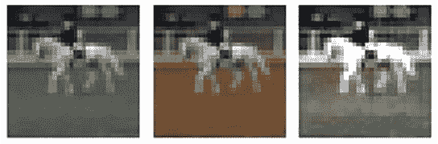
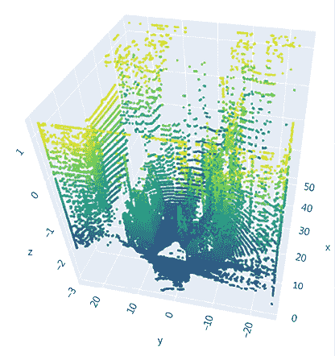

# 10

# 物体检测与分割的应用

在前几章中，我们学习了各种物体检测技术，如 R-CNN 系列算法、YOLO、SSD 以及 U-Net 和 Mask R-CNN 图像分割算法。在本章中，我们将进一步学习更适合解决检测和分割问题的框架/架构，处理更现实的场景。

我们将从利用 Detectron2 框架开始，训练和检测图像中存在的自定义对象。我们还将使用预训练模型预测图像中人类的姿势。此外，我们将学习如何统计图像中人群的人数，然后学习如何利用分割技术进行图像着色。接下来，我们将学习一个修改版的 YOLO，通过使用来自 LIDAR 传感器的点云来预测物体周围的 3D 边界框。最后，我们将学习如何从视频中识别动作。

在本章结束时，您将学习以下内容：

+   多对象实例分割

+   人体姿势检测

+   人群计数

+   图像着色

+   使用点云进行 3D 物体检测

+   从视频中识别动作

    本章所有代码片段均可在 GitHub 存储库的`Chapter10`文件夹中找到，链接为[`bit.ly/mcvp-2e`](https://bit.ly/mcvp-2e)。

    随着领域的发展，我们将定期向 GitHub 存储库添加有价值的补充内容。请查看每个章节目录下的`supplementary_sections`文件夹获取新的有用内容。

# 多对象实例分割

在前几章中，我们学习了各种物体检测算法。在本节中，我们将学习 Detectron2 平台（链接：[`ai.facebook.com/blog/-detectron2-a-pytorch-based-modular-object-detection-library-/`](https://ai.facebook.com/blog/-detectron2-a-pytorch-based-modular-object-detection-library-/)），然后实现使用 Google 开放图像数据集进行多对象实例分割。Detectron2 是由 Facebook 团队开发的平台。Detectron2 包含了最先进的物体检测算法的高质量实现，包括 Mask R-CNN 模型系列的 DensePose。原始 Detectron 框架使用 Caffe2 编写，而 Detectron2 框架则使用 PyTorch 编写。

Detectron2 支持与物体检测相关的一系列任务。与原始 Detectron 类似，它支持具有框和实例分割掩码的物体检测，以及人体姿势预测。除此之外，Detectron2 还增加了对语义分割和全景分割（将语义分割和实例分割结合在一起的任务）的支持。通过利用 Detectron2，我们能够在几行代码中构建物体检测、分割和姿势估计。

在本节中，我们将：

+   获取开放图像数据集

+   将数据集转换为 COCO 格式

+   使用 Detectron2 训练模型

+   在训练模型上推断新图像

让我们逐一进行这些步骤。

## 获取和准备数据

我们将处理由 Google 提供的 Open Images 数据集中可用的图像（其中包含数百万张图像及其注释），网址为[`storage.googleapis.com/openimages/web/index.html`](https://storage.googleapis.com/openimages/web/index.html)。

在此代码部分，我们将了解仅获取所需图像而不是整个数据集的方法。请注意，此步骤是必需的，因为数据集大小限制了可能没有广泛资源的典型用户构建模型的能力。

您可以在 GitHub 的`Chapter10`文件夹中找到名为`Multi_object_segmentation.ipynb`的文件，网址为[`bit.ly/mcvp-2e`](https://bit.ly/mcvp-2e)。

1.  安装所需的包：

    ```py
    !pip install -qU openimages torch_snippets 
    ```

1.  下载所需的注释文件：

    ```py
    from torch_snippets import *
    !wget -O train-annotations-object-segmentation.csv -q https://storage.googleapis.com/openimages/v5/train-annotations-object-segmentation.csv
    !wget -O classes.csv -q \
    https://raw.githubusercontent.com/openimages/dataset/master/dict.csv 
    ```

1.  指定我们希望模型预测的类别（您可以访问 Open Images 网站查看所有类别的列表）：

    ```py
    required_classes = 'person,dog,bird,car,elephant,football,\
    jug,laptop,mushroom,pizza,rocket,shirt,traffic sign,\
    Watermelon,Zebra'
    required_classes = [c.lower() for c in \
                            required_classes.lower().split(',')]
    classes = pd.read_csv('classes.csv', header=None)
    classes.columns = ['class','class_name']
    classes = classes[classes['class_name'].map(lambda x: x \
                               in required_classes)] 
    ```

1.  获取与`required_classes`对应的图像 ID 和掩码：

    ```py
    from torch_snippets import *
    df = pd.read_csv('train-annotations-object-segmentation.csv')
    data = pd.merge(df, classes, left_on='LabelName', 
                    right_on='class')
    subset_data = data.groupby('class_name').agg( \
                            {'ImageID': lambda x: list(x)[:500]})
    subset_data = flatten(subset_data.ImageID.tolist())
    subset_data = data[data['ImageID'].map(lambda x: x in subset_data)]
    subset_masks = subset_data['MaskPath'].tolist() 
    ```

鉴于数据量巨大，我们只获取`subset_data`中每类 500 张图像。您可以选择是否获取更小或更大的文件集合以及唯一类别的列表（`required_classes`）。

到目前为止，我们只有与图像对应的`ImageId`和`MaskPath`值。在接下来的步骤中，我们将继续从`open-images`下载实际的图像和掩码。

1.  现在我们已经准备好下载子集掩码数据，让我们开始下载。Open Images 有 16 个用于训练掩码的 ZIP 文件。每个 ZIP 文件仅包含来自`subset_masks`的少量掩码，因此我们将在将所需掩码移动到单独文件夹后删除其余部分。这一*下载* -> *移动* -> *删除*操作将保持内存占用相对较小。我们将对这 16 个文件每一个运行此步骤一次：

    ```py
    !mkdir -p masks
    for c in Tqdm('0123456789abcdef'):
        !wget -q \
         https://storage.googleapis.com/openimages/v5/train-masks/train-masks-{c}.zip
        !unzip -q train-masks-{c}.zip -d tmp_masks
        !rm train-masks-{c}.zip
        tmp_masks = Glob('tmp_masks', silent=True)
        items = [(m,fname(m)) for m in tmp_masks]
        items = [(i,j) for (i,j) in items if j in subset_masks]
        for i,j in items:
            os.rename(i, f'masks/{j}')
        !rm -rf tmp_masks 
    ```

1.  下载与`ImageId`对应的图像：

    ```py
    masks = Glob('masks')
    masks = [fname(mask) for mask in masks]
    subset_data=subset_data[subset_data['MaskPath'].map(lambda \
                                   x: x in masks)]
    subset_imageIds = subset_data['ImageID'].tolist()
    from openimages.download import _download_images_by_id
    !mkdir images
    _download_images_by_id(subset_imageIds, 'train', './images/') 
    ```

1.  将所有图像、掩码和地面真相打包并保存它们——以防会话崩溃时，保存和检索文件以便后续训练是有帮助的。创建 ZIP 文件后，请确保将文件保存在您的驱动器上或下载它。文件大小最终约为 2.5 GB：

    ```py
    import zipfile
    files = Glob('images') + Glob('masks') + \
    ['train-annotations-object-segmentation.csv', 'classes.csv']
    with zipfile.ZipFile('data.zip','w') as zipme:
        for file in Tqdm(files):
            zipme.write(file,compress_type=zipfile.ZIP_DEFLATED) 
    ```

最后，将数据移动到单个目录中：

1.  ```py
    !mkdir -p train/
    !mv images train/myData2020
    !mv masks train/annotations 
    ```

鉴于目标检测代码中有如此多的移动组件，作为标准化方法，Detectron 接受严格的训练数据格式。虽然可以编写数据集定义并将其提供给 Detectron，但将整个训练数据保存为 COCO 格式更简单（也更有利）。这样，您可以利用其他训练算法，例如**detectron transformers**（**DETR**），而无需更改数据。

1.  首先，我们将定义类别：

    1.  以 COCO 格式定义所需的类别：

    ```py
    !pip install git+git://github.com/sizhky/pycococreator.git@0.2.0
    import datetime
    INFO = {
        "description": "MyData2020",
        "url": "None",
        "version": "1.0",
        "year": 2020,
        "contributor": "sizhky",
        "date_created": datetime.datetime.utcnow().isoformat(' ')
    }
    LICENSES = [
        {
            "id": 1,
            "name": "MIT"
        }
    ]
    CATEGORIES = [{'id': id+1, 'name': name.replace('/',''), \
                   'supercategory': 'none'} \
                  for id,(_,(name, clss_name)) in \
                  enumerate(classes.iterrows())] 
    ```

    1.  在上述代码中，在 `CATEGORIES` 的定义中，我们正在创建一个名为 `supercategory` 的新键。要理解 `supercategory`，让我们通过一个例子来看：`Man` 和 `Woman` 类别属于 `Person` 超类。在我们的情况下，由于我们不关心超类，我们将其指定为 `none`。

    1.  导入相关包并创建一个带有保存 COCO JSON 文件所需键的空字典：

    ```py
    !pip install pycocotools
    from pycococreatortools import pycococreatortools
    from os import listdir
    from os.path import isfile, join
    from PIL import Image
    coco_output = {
        "info": INFO,
        "licenses": LICENSES,
        "categories": CATEGORIES,
        "images": [],
        "annotations": []
    } 
    ```

    1.  设置几个包含图像位置信息和注释文件位置信息的变量：

    ```py
    ROOT_DIR = "train"
    IMAGE_DIR, ANNOTATION_DIR = 'train/myData2020/', 'train/annotations/'
    image_files = [f for f in listdir(IMAGE_DIR) if \
                   isfile(join(IMAGE_DIR, f))]
    annotation_files = [f for f in listdir(ANNOTATION_DIR) if \
                        isfile(join(ANNOTATION_DIR, f))] 
    ```

    1.  循环遍历每个图像文件名并填充 `coco_output` 字典中的 `images` 键：

    ```py
    image_id = 1
    # go through each image
    for image_filename in Tqdm(image_files):
        image = Image.open(IMAGE_DIR + '/' + image_filename)
        image_info = pycococreatortools.create_image_info(image_id, \
                    os.path.basename(image_filename), image.size)
        coco_output["images"].append(image_info)
        image_id = image_id + 1 
    ```

1.  循环遍历每个分割注释并填充 `coco_output` 字典中的 `annotations` 键：

    ```py
    segmentation_id = 1
    for annotation_filename in Tqdm(annotation_files):
        image_id = [f for f in coco_output['images'] if \
                    stem(f['file_name']) == \
                    annotation_filename.split('_')[0]][0]['id']
        class_id = [x['id'] for x in CATEGORIES \
                    if x['name'] in annotation_filename][0]
        category_info = {'id': class_id, \
                        'is_crowd': 'crowd' in image_filename}
        binary_mask = np.asarray(Image.open(f'{ANNOTATION_DIR}/\
    {annotation_filename}').convert('1')).astype(np.uint8)

        annotation_info = pycococreatortools\
                        .create_annotation_info( \
                        segmentation_id, image_id, 
                        category_info, 
                        binary_mask, image.size, tolerance=2)
        if annotation_info is not None:
            coco_output["annotations"].append(annotation_info)
            segmentation_id = segmentation_id + 1 
    ```

1.  将 `coco_output` 保存在 JSON 文件中：

    ```py
    coco_output['categories'] = [{'id': id+1,'name':clss_name, \
                                  'supercategory': 'none'} for \
                                 id,(_,(name, clss_name)) in \
                                 enumerate(classes.iterrows())]
    import json
    with open('images.json', 'w') as output_json_file:
        json.dump(coco_output, output_json_file) 
    ```

现在，我们的文件已经按照 COCO 格式准备好了。现在，我们可以使用 Detectron2 框架来训练我们的模型。

## 训练模型进行实例分割

要训练我们的模型，我们需要下载所需的包，修改配置文件以反映数据集路径，然后训练模型。

让我们逐步进行：

1.  安装所需的 Detectron2 包：

    ```py
    %cd /content/
    # install detectron2:
    !git clone https://github.com/facebookresearch/detectron2
    %cd /content/detectron2
    %pip install -r requirements.txt
    !python setup.py install
    %pip install git+https://github.com/facebookresearch/fvcore.git
    %cd /content/ 
    ```

注意：在进行下一步之前，您需要重新启动 Colab。

1.  导入相关的 `detectron2` 包：

    ```py
    from detectron2 import model_zoo
    from detectron2.engine import DefaultPredictor
    from detectron2.config import get_cfg
    from detectron2.utils.visualizer import Visualizer
    from detectron2.data import MetadataCatalog, DatasetCatalog
    from detectron2.engine import DefaultTrainer 
    ```

1.  鉴于我们已重新启动 Colab，请重新获取所需的类：

    ```py
    from torch_snippets import *
    required_classes= 'person,dog,bird,car,elephant,football,jug,\
    laptop,Mushroom,Pizza,Rocket,Shirt,Traffic sign,\
    Watermelon,Zebra'
    required_classes = [c.lower() for c in \
                        required_classes.lower().split(',')]
    classes = pd.read_csv('classes.csv', header=None)
    classes.columns = ['class','class_name']
    classes = classes[classes['class_name'].map(lambda \
                                    x: x in required_classes)] 
    ```

1.  使用 `register_coco_instances` 注册创建的数据集：

    ```py
    from detectron2.data.datasets import register_coco_instances
    register_coco_instances("dataset_train", {}, \
                            "images.json", "train/myData2020") 
    ```

1.  在 `cfg` 配置文件中定义所有参数。配置 (`cfg`) 是一个特殊的 Detectron 对象，保存了训练模型所需的所有相关信息：

    ```py
    cfg = get_cfg()
    cfg.merge_from_file(model_zoo.get_config_file("COCO-\ InstanceSegmentation/mask_rcnn_R_50_FPN_3x.yaml"))
    cfg.DATASETS.TRAIN = ("dataset_train",)
    cfg.DATASETS.TEST = ()
    cfg.DATALOADER.NUM_WORKERS = 2
    cfg.MODEL.WEIGHTS = model_zoo.get_checkpoint_url("COCO-\ InstanceSegmentation/mask_rcnn_R_50_FPN_3x.yaml") # pretrained 
    # weights
    cfg.SOLVER.IMS_PER_BATCH = 2
    cfg.SOLVER.BASE_LR = 0.00025 # pick a good LR
    cfg.SOLVER.MAX_ITER = 5000 # instead of epochs, we train on 
    # 5000 batches
    cfg.MODEL.ROI_HEADS.BATCH_SIZE_PER_IMAGE = 512
    cfg.MODEL.ROI_HEADS.NUM_CLASSES = len(classes) 
    ```

正如您在前面的代码中所看到的，您可以设置所有用于训练模型所需的主要超参数。`merge_from_file` 从用于使用 `FPN` 作为骨干预训练 `mask_rcnn` 的预先存在的配置文件中导入所有核心参数。这还将包含有关预训练实验的其他信息，例如优化器和损失函数。在我们的目的中，已在 `cfg` 中设置的超参数是不言自明的。

1.  训练模型：

    ```py
    os.makedirs(cfg.OUTPUT_DIR, exist_ok=True)
    trainer = DefaultTrainer(cfg) 
    trainer.resume_or_load(resume=False)
    trainer.train() 
    ```

使用上述代码行，我们可以训练一个模型来预测属于我们自定义数据集中定义类的对象的类、边界框和分割。

1.  将模型保存在一个文件夹中：

    ```py
    !cp output/model_final.pth output/trained_model.pth 
    ```

到目前为止，我们已经训练好了我们的模型。在下一节中，我们将对新图像进行推断，以便使用我们预训练的模型识别给定图像中的对象。

## 对新图像进行推断

要对新图像执行推断，加载路径，设置概率阈值，并通过 `DefaultPredictor` 方法传递，如下所示：

1.  使用训练好的模型权重加载权重。使用相同的 `cfg` 并按照以下代码加载模型权重：

    ```py
    cfg.MODEL.WEIGHTS = os.path.join(cfg.OUTPUT_DIR, "trained_model.pth") 
    ```

1.  设置对象属于某一类的概率阈值：

    ```py
    cfg.MODEL.ROI_HEADS.SCORE_THRESH_TEST = 0.25 
    ```

1.  定义 `predictor` 方法：

    ```py
    predictor = DefaultPredictor(cfg) 
    ```

1.  在感兴趣的图像上执行分割并进行可视化。在以下代码中，我们随机绘制了 30 张训练图像（注意我们尚未创建验证数据；这是你的练习），但你也可以加载自己的图像路径来代替 `choose(files)`：

    ```py
    from detectron2.utils.visualizer import ColorMode
    files = Glob('train/myData2020')
    for _ in range(30):
        im = cv2.imread(choose(files))
        outputs = predictor(im)
        v = Visualizer(im[:, :, ::-1], scale=0.5, 
                        metadata=MetadataCatalog.get("dataset_train"), 
                        instance_mode=ColorMode.IMAGE_BW 
    # remove the colors of unsegmented pixels. 
    # This option is only available for segmentation models
        )
        out = v.draw_instance_predictions(outputs["instances"].to("cpu"))
        show(out.get_image()) 
    ```

`Visualizer` 是 Detectron2 绘制对象实例的方式。鉴于预测（存在于 `outputs` 变量中）仅是张量字典，`Visualizer` 将其转换为像素信息并将其绘制在图像上。让我们看看每个输入的含义：

1.  `im`：我们要可视化的图像。

1.  `scale`：绘制时图像的大小。在这里，我们要求将图像缩小到 50%。

1.  `metadata`：我们需要数据集的类级信息，主要是索引到类的映射，以便当我们将原始张量作为输入发送时，类将解码为实际可读的类别。

1.  `instance_mode`：我们要求模型仅突出显示分段像素。

1.  最后，一旦类被创建（在我们的例子中是 `v`），我们可以要求它从模型中获取实例预测并显示图像。

前面的代码给出了以下输出。请注意，我们能够准确识别与大象相对应的像素：


图 10.1：实例分割预测

现在我们已经了解了如何利用 Detectron2 来识别图像中类别对应的像素，接下来我们将学习如何利用 Detectron2 执行图像中人体姿势的检测。

# 人体姿势检测

在前面的部分中，我们了解了检测多个对象并对它们进行分割。现在我们将学习在图像中检测多个人物，以及使用 Detectron2 检测图像中各个人体部位的关键点。检测关键点在多种用例中非常有用，例如体育分析和安全领域。对于此练习，我们将利用配置文件中提供的预训练关键点模型：

可在 GitHub 上的 `Chapter10` 文件夹中的 `Human_pose_detection.ipynb` 文件中找到以下代码，网址为 [`bit.ly/mcvp-2e`](https://bit.ly/mcvp-2e)。

1.  安装所有前面部分中显示的要求。

    ```py
    %cd /content/
    # install detectron2:
    !git clone https://github.com/facebookresearch/detectron2
    %cd /content/detectron2
    %pip install -r requirements.txt
    !python setup.py install
    %pip install git+https://github.com/facebookresearch/fvcore.git
    %cd /content/
    %pip install torch_snippets
    %pip install pyyaml==5.1 pycocotools>=2.0.1
    from torch_snippets import *
    import detectron2
    from detectron2.utils.logger import setup_logger
    setup_logger()
    from detectron2 import model_zoo
    from detectron2.engine import DefaultPredictor
    from detectron2.config import get_cfg
    from detectron2.utils.visualizer import Visualizer
    from detectron2.data import MetadataCatalog, DatasetCatalog 
    ```

1.  获取配置文件并加载在 Detectron2 中存在的预训练关键点检测模型：

    ```py
    cfg = get_cfg() # get a fresh new config
    cfg.merge_from_file(model_zoo.get_config_file("COCO-Keypoints/keypoint_rcnn_R_50_FPN_3x.yaml")) 
    ```

1.  指定配置参数：

    ```py
    cfg.MODEL.ROI_HEADS.SCORE_THRESH_TEST = 0.5 # set threshold 
    # for this model
    cfg.MODEL.WEIGHTS = model_zoo.get_checkpoint_url("COCO-Keypoints/keypoint_rcnn_R_50_FPN_3x.yaml")
    predictor = DefaultPredictor(cfg) 
    ```

1.  加载我们想要预测的图像：

    ```py
    from torch_snippets import read, resize
    !wget -q https://i.imgur.com/ldzGSHk.jpg -O image.png
    im = read('image.png',1)
    im = resize(im, 0.5) # resize image to half its dimensions 
    ```

1.  对图像进行预测并绘制关键点：

    ```py
    outputs = predictor(im)
    v = Visualizer(im[:,:,::-1], 
                   MetadataCatalog.get(cfg.DATASETS.TRAIN[0]), 
                   scale=1.2)
    out = v.draw_instance_predictions(outputs["instances"].to("cpu"))
    import matplotlib.pyplot as plt
    %matplotlib inline
    plt.imshow(out.get_image()) 
    ```

前面的代码给出了以下输出。我们可以看到模型能够准确识别图像中人物的各个身体姿势关键点：


图 10.2：（左）输入图像（右）预测的关键点叠加在原始图像上

在本节中，我们学习了如何使用 Detectron2 平台执行关键点检测。在下一节中，我们将学习如何从头开始实现修改后的 VGG 架构来估计图像中的人数。

# 人群计数

想象一种场景，你被给予一张人群的图片，并被要求估计图片中的人数。在这种情况下，人群计数模型非常有用。在我们继续构建用于执行人群计数的模型之前，让我们先了解一下可用的数据和模型架构。

为了训练一个能够预测图像中人数的模型，我们首先需要加载图像。图像应包含图像中所有人的头部中心位置。以下是输入图像及其各自人员头部中心位置的样本：


图 10.3：（左）原始图像（右）图像中人头中心的绘图

来源：上海科技数据集，根据 BSD 2-Clause “简化”许可证许可 (https://github.com/desenzhou/ShanghaiTechDataset)

在前面的例子中，代表真实数据的图像（右边 - 图像中存在的人头中心）非常稀疏。确切地说，有 *N* 个白色像素，其中 *N* 是图像中的人数。让我们放大到图像的左上角，并再次看看同样的地图：


图 10.4：图 10.3 的放大版本

在下一步中，我们将将地面实况稀疏图像转换为表示该图像区域中人数的密度图：


图 10.5：（左）图像中头部中心的绘图（右）密度图

同一裁剪的最终输入输出对将如下所示：


图 10.6：（左）放大后的输入图像（右）输出图像

整个图像的最终输入输出对将如下所示：


图 10.7：（左）原始输入图像（右）密度图

需要注意的是，在上述图像中，当两个人靠近时，像素强度较高。然而，当一个人远离其他人时，与该人对应的像素密度更均匀分布，导致对该人的像素强度较低。本质上，热图是以这样一种方式生成的，即像素值的总和等于图像中出现的人数。

现在，我们已经准备好接受输入图像以及图像中人员头部中心位置的位置（这些位置已经被处理以获取地面真实输出热图），我们将利用文章*CSRNet: Dilated Convolutional Neural Networks for Understanding the Highly Congested Scenes*（[`arxiv.org/pdf/1802.10062.pdf`](https://arxiv.org/pdf/1802.10062.pdf)）中详细描述的架构来预测图像中出现的人数。模型架构如下：


图 10.8：CSRNet 架构

注意在模型架构的上述结构中，我们首先将图像通过标准的 VGG-16 骨干网络传递，然后通过四个额外的卷积层。这个输出通过四种配置之一最终通过一个 1 x 1 x 1 卷积层。我们将使用*A*配置，因为它是最小的。

接下来，我们对输出图像执行**均方误差**（**MSE**）损失最小化，以获得最佳的权重值，同时使用 MAE 跟踪实际的人群计数。架构的一个额外细节是作者使用了**扩张卷积**而不是普通卷积。典型的扩张卷积如下所示：


图 10.9：扩张卷积核示例

来源：arXiv:1802.10062 [cs.CV]

左侧的前图表示到目前为止我们一直在工作的典型核心。中间和右侧的图表示的是扩张卷积核，这些核心之间存在像素间隙。这样，卷积核具有更大的感受野，这在我们需要理解靠近给定人员的人数以估算与人员对应的像素密度时非常方便。我们使用扩张卷积核（具有九个参数），而不是正常卷积核（要达到与三个卷积核的膨胀率等效的 49 个参数），以使用更少的参数捕获更多信息。

现在我们已经理解了如何设计模型的架构，让我们继续编写模型来进行人群计数。

对于那些希望了解工作详细信息的人，我们建议阅读此处的论文：[`arxiv.org/pdf/1802.10062.pdf`](https://arxiv.org/pdf/1802.10062.pdf)。我们将在接下来的部分中训练的模型受到此论文的启发。

## 实施人群计数

我们将采用的策略执行人群计数如下：

1.  导入相关的包和数据集。

1.  我们将要处理的数据集 – 上海科技数据集 – 已经将人脸中心转换为基于高斯滤波器密度的分布，因此我们无需再次执行。使用网络映射输入图像和输出高斯密度图。

1.  定义执行扩张卷积的函数。

1.  定义网络模型并在数据批次上进行训练以最小化 MSE。

让我们继续按照以下策略进行编码：

下面的代码可以在 GitHub 上的 `Chapter10` 文件夹中的 `crowd_counting.ipynb` 文件中找到，链接为 `https://bit.ly/mcvp-2e`。

1.  导入包并下载数据集：

    ```py
    %%writefile kaggle.json
    {"username":"xx","key":"xx"}
    !mkdir -p ~/.kaggle
    !mv kaggle.json ~/.kaggle/
    !ls ~/.kaggle
    !chmod 600 /root/.kaggle/kaggle.json
    %%time
    %cd /content
    import os
    if not os.path.exists('shanghaitech-with-people-density-map'):
        print('downloading data...')
        !kaggle datasets download -d tthien/shanghaitech-with-people-density-map/
        print('unzipping data...')
        !unzip -qq shanghaitech-with-people-density-map.zip
    if not os.path.exists('CSRNet-pytorch/'):
        %pip install -U scipy torch_snippets torch_summary
        !git clone https://github.com/sizhky/CSRNet-pytorch.git
    %cd CSRNet-pytorch
    !ln -s ../shanghaitech_with_people_density_map
    from torch_snippets import *
    import h5py
    from scipy import io 
    ```

1.  提供图像的位置（`image_folder`）、地面实况（`gt_folder`）和热图文件夹（`heatmap_folder`）：

    ```py
    part_A = Glob('shanghaitech_with_people_density_map/\
    ShanghaiTech/part_A/train_data/');
    image_folder = 'shanghaitech_with_people_density_map/\
    ShanghaiTech/part_A/train_data/images/'
    heatmap_folder = 'shanghaitech_with_people_density_map/\
    ShanghaiTech/part_A/train_data/ground-truth-h5/'
    gt_folder = 'shanghaitech_with_people_density_map/\
    ShanghaiTech/part_A/train_data/ground-truth/' 
    ```

1.  定义训练和验证数据集以及数据加载器：

    ```py
    device = 'cuda' if torch.cuda.is_available() else 'cpu'
    tfm = T.Compose([
        T.ToTensor()
    ])
    class Crowds(Dataset):
        def __init__(self, stems):
            self.stems = stems
        def __len__(self):
            return len(self.stems)
        def __getitem__(self, ix):
            _stem = self.stems[ix]
            image_path = f'{image_folder}/{_stem}.jpg'
            heatmap_path = f'{heatmap_folder}/{_stem}.h5'
            gt_path = f'{gt_folder}/GT_{_stem}.mat'
            pts = io.loadmat(gt_path)
            pts = len(pts['image_info'][0,0][0,0][0])
            image = read(image_path, 1)
            with h5py.File(heatmap_path, 'r') as hf:
                gt = hf['density'][:]
            **gt = resize(gt,** **1****/****8****)*****64**
            return image.copy(), gt.copy(), pts
        def collate_fn(self, batch):
            ims, gts, pts = list(zip(*batch))
            ims = torch.cat([tfm(im)[None] for im in ims]).to(device)
            gts = torch.cat([tfm(gt)[None] for gt in gts]).to(device)
            return ims, gts, torch.tensor(pts).to(device)
        def choose(self):
            return self[randint(len(self))]
    from sklearn.model_selection import train_test_split
    trn_stems, val_stems = train_test_split(stems(Glob(image_folder)),
                                                     random_state=10)
    trn_ds = Crowds(trn_stems)
    val_ds = Crowds(val_stems)
    trn_dl = DataLoader(trn_ds, batch_size=1, shuffle=True, 
                        collate_fn=trn_ds.collate_fn)
    val_dl = DataLoader(val_ds, batch_size=1, shuffle=True, 
                        collate_fn=val_ds.collate_fn) 
    ```

注意，到目前为止，我们已编写的典型数据集 `class` 的唯一补充是前述代码中粗体的代码行。我们正在调整地面实况，因为我们网络的输出将缩小到原始大小的 1/8，并且我们将地图乘以 `64`，以便图像像素的总和将缩放回原始人群计数。

1.  通过实现以下步骤来定义网络架构：

    1.  定义使扩张卷积（`make_layers`）成为可能的函数：

    ```py
    import torch.nn as nn
    import torch
    from torchvision import models
    from utils import save_net,load_net
    def make_layers(cfg, in_channels = 3, batch_norm=False, dilation = False):
        if dilation:
            d_rate = 2
        else:
            d_rate = 1
        layers = []
        for v in cfg:
            if v == 'M': # M is for maxpooling
                layers += [nn.MaxPool2d(kernel_size=2,stride=2)]
            else:
                conv2d = nn.Conv2d(in_channels,v,kernel_size=3,
                                   padding=d_rate, dilation=d_rate)
                if batch_norm:
                    layers += [conv2d, nn.BatchNorm2d(v), 
                               nn.ReLU(inplace=True)]
                else:
                    layers += [conv2d, nn.ReLU(inplace=True)]
                in_channels = v
        return nn.Sequential(*layers) 
    ```

    1.  定义网络架构 – `CSRNet`：

    ```py
    class CSRNet(nn.Module):
        def __init__(self, load_weights=False):
            super(CSRNet, self).__init__()
            self.seen = 0
            self.frontend_feat = [64, 64, 'M', 128, 128, 
                                  'M',256, 256, 256, 'M', 512, 512, 512]
            self.backend_feat = [512, 512, 512, 256, 128, 64]
            self.frontend = make_layers(self.frontend_feat)
            self.backend = make_layers(self.backend_feat, in_channels = 512,
                                       dilation = True)
            self.output_layer = nn.Conv2d(64, 1, kernel_size=1)
            if not load_weights:
                mod = models.vgg16(pretrained = True)
                self._initialize_weights()
                items = list(self.frontend.state_dict().items())
                _items = list(mod.state_dict().items())
                for i in range(len(self.frontend.state_dict().items())):
                    items[i][1].data[:] = _items[i][1].data[:]
        def forward(self,x):
            x = self.frontend(x)
            x = self.backend(x)
            x = self.output_layer(x)
            return x
        def _initialize_weights(self):
            for m in self.modules():
                if isinstance(m, nn.Conv2d):
                    nn.init.normal_(m.weight, std=0.01)
                    if m.bias is not None:
                        nn.init.constant_(m.bias, 0)
                elif isinstance(m, nn.BatchNorm2d):
                    nn.init.constant_(m.weight, 1)
                    nn.init.constant_(m.bias, 0) 
    ```

1.  定义用于训练和验证数据批次的函数：

    ```py
    def train_batch(model, data, optimizer, criterion):
        model.train()
        optimizer.zero_grad()
        ims, gts, pts = data
        _gts = model(ims)
        loss = criterion(_gts, gts)
        loss.backward()
        optimizer.step()
        pts_loss = nn.L1Loss()(_gts.sum(), gts.sum())
        return loss.item(), pts_loss.item()
    @torch.no_grad()
    def validate_batch(model, data, criterion):
        model.eval()
        ims, gts, pts = data
        _gts = model(ims)
        loss = criterion(_gts, gts)
        pts_loss = nn.L1Loss()(_gts.sum(), gts.sum())
        return loss.item(), pts_loss.item() 
    ```

1.  在增加周期的训练模型：

    ```py
    model = CSRNet().to(device)
    criterion = nn.MSELoss()
    optimizer = optim.Adam(model.parameters(), lr=1e-6)
    n_epochs = 20
    log = Report(n_epochs)
    for ex in range(n_epochs):
        N = len(trn_dl)
        for bx, data in enumerate(trn_dl):
            loss,pts_loss=train_batch(model, data, optimizer, criterion)
            log.record(ex+(bx+1)/N, trn_loss=loss, 
                               trn_pts_loss=pts_loss, end='\r')
        N = len(val_dl)
        for bx, data in enumerate(val_dl):
            loss, pts_loss = validate_batch(model, data, criterion)
            log.record(ex+(bx+1)/N, val_loss=loss, 
                        val_pts_loss=pts_loss, end='\r')
        log.report_avgs(ex+1)
        if ex == 10: optimizer = optim.Adam(model.parameters(), 
                                            lr=1e-7) 
    ```

上述代码导致训练和验证损失的变化（这里损失是人群计数的 MAE），如下：


图 10.10: 随着周期增加的训练和验证损失

从上述图表可以看出，我们的预测与实际相差约 150 人。我们可以通过以下两种方式改进模型：

1.  通过使用数据增强并在原始图像的裁剪上进行训练

1.  通过使用更大的网络（我们使用了配置 *A*，而 *B*、*C* 和 *D* 更大）

1.  通过获取测试图像并对其进行归一化来对新图像进行推断：

    ```py
    from matplotlib import cm as c
    from torchvision import datasets, transforms
    from PIL import Image
    transform=transforms.Compose([
                     transforms.ToTensor(),transforms.Normalize(\
                              mean=[0.485, 0.456, 0.406],
                              std=[0.229, 0.224, 0.225]),
                      ])
    test_folder = 'shanghaitech_with_people_density_map/\
    ShanghaiTech/part_A/test_data/'
    imgs = Glob(f'{test_folder}/images')
    f = choose(imgs)
    print(f)
    img = transform(Image.open(f).convert('RGB')).to(device) 
    ```

然后通过训练模型传递图像：

1.  ```py
    output = model(img[None])
    print("Predicted Count : ", int(output.detach().cpu().sum().numpy()))
    temp = np.asarray(output.detach().cpu()\
                        .reshape(output.detach().cpu()\
                        .shape[2],output.detach()\
                        .cpu().shape[3]))
    plt.imshow(temp,cmap = c.jet)
    plt.show() 
    ```

上述代码导致输入图像的热图（右图），我们可以看到模型预测的热图相当准确，并且人数预测值接近实际值：


图 10.11: (左) 输入图像 (右) 预测的密度图和人数计数

在下一节中，我们将继续探讨其他应用，并利用 U-Net 架构对图像进行着色。

# 图像着色

想象一下这样的场景：您被要求将一堆黑白图像变成彩色图像。您会如何解决这个问题？一种解决方法是使用伪监督流水线，其中我们将原始图像转换为黑白图像，并将其视为输入-输出对。

我们将利用 CIFAR-10 数据集演示如何对图像进行着色。我们在编写图像着色网络的代码时将采取的策略如下：

1.  从训练数据集中获取原始彩色图像，并将其转换为灰度图像以获取输入（灰度）和输出（原始彩色图像）组合。

1.  规范化输入和输出。

1.  构建 U-Net 架构。

1.  在增加的 epochs 上训练模型。

有了上述策略，让我们继续编写模型如下：

您可以在 GitHub 的`Chapter10`文件夹中的`Image colorization.ipynb`文件中找到以下代码，网址为[`bit.ly/mcvp-2e`](https://bit.ly/mcvp-2e)。

1.  安装所需的包并导入它们：

    ```py
    !pip install torch_snippets
    from torch_snippets import *
    device = 'cuda' if torch.cuda.is_available() else 'cpu' 
    ```

1.  下载数据集并定义训练和验证数据集以及数据加载器：

    1.  下载数据集：

    ```py
    from torchvision import datasets
    import torch
    data_folder = '~/cifar10/cifar/' 
    datasets.CIFAR10(data_folder, download=True) 
    ```

    1.  定义训练和验证数据集以及数据加载器：

    ```py
    class Colorize(torchvision.datasets.CIFAR10):
        def __init__(self, root, train):
            super().__init__(root, train)

        def __getitem__(self, ix):
            im, _ = super().__getitem__(ix)
            bw = im.convert('L').convert('RGB')
            bw, im = np.array(bw)/255., np.array(im)/255.
            bw, im = [torch.tensor(i).permute(2,0,1)\
                      .to(device).float() for i in [bw,im]]
            return bw, im
    trn_ds = Colorize('~/cifar10/cifar/', train=True)
    val_ds = Colorize('~/cifar10/cifar/', train=False)
    trn_dl = DataLoader(trn_ds, batch_size=256, shuffle=True)
    val_dl = DataLoader(val_ds, batch_size=256, shuffle=False) 
    ```

    1.  输入和输出图像的示例如下所示：

    ```py
    a,b = trn_ds[0]
    subplots([a,b], nc=2) 
    ```

    上述代码产生以下输出：


图 10.12: (左) 输入图像 (右) 着色后的图像

注意 CIFAR-10 的图像形状为 32 x 32。

1.  定义网络架构：

    ```py
    class Identity(nn.Module):
        def __init__(self):
            super().__init__()
        def forward(self, x):
            return x
    class DownConv(nn.Module):
        def __init__(self, ni, no, maxpool=True):
            super().__init__()
            self.model = nn.Sequential(
                nn.MaxPool2d(2) if maxpool else Identity(),
                nn.Conv2d(ni, no, 3, padding=1),
                nn.BatchNorm2d(no),
                nn.LeakyReLU(0.2, inplace=True),
                nn.Conv2d(no, no, 3, padding=1),
                nn.BatchNorm2d(no),
                nn.LeakyReLU(0.2, inplace=True),
            )
        def forward(self, x):
            return self.model(x)
    class UpConv(nn.Module):
        def __init__(self, ni, no, maxpool=True):
            super().__init__()
            self.convtranspose = nn.ConvTranspose2d(ni, no, 2, stride=2)
            self.convlayers = nn.Sequential(
                nn.Conv2d(no+no, no, 3, padding=1),
                nn.BatchNorm2d(no),
                nn.LeakyReLU(0.2, inplace=True),
                nn.Conv2d(no, no, 3, padding=1),
                nn.BatchNorm2d(no),
                nn.LeakyReLU(0.2, inplace=True),
            )

        def forward(self, x, y):
            x = self.convtranspose(x)
            x = torch.cat([x,y], axis=1)
            x = self.convlayers(x)
            return x
    class UNet(nn.Module):
        def __init__(self):
            super().__init__()
            self.d1 = DownConv( 3, 64, maxpool=False)
            self.d2 = DownConv( 64, 128)
            self.d3 = DownConv( 128, 256)
            self.d4 = DownConv( 256, 512)
            self.d5 = DownConv( 512, 1024)
            self.u5 = UpConv (1024, 512)
            self.u4 = UpConv ( 512, 256)
            self.u3 = UpConv ( 256, 128)
            self.u2 = UpConv ( 128, 64)
            self.u1 = nn.Conv2d(64, 3, kernel_size=1, stride=1)
        def forward(self, x):
            x0 = self.d1( x) # 32
            x1 = self.d2(x0) # 16
            x2 = self.d3(x1) # 8
            x3 = self.d4(x2) # 4
            x4 = self.d5(x3) # 2
            X4 = self.u5(x4, x3)# 4
            X3 = self.u4(X4, x2)# 8
            X2 = self.u3(X3, x1)# 16
            X1 = self.u2(X2, x0)# 32
            X0 = self.u1(X1) # 3
            return X0 
    ```

1.  定义模型、优化器和损失函数：

    ```py
    def get_model():
        model = UNet().to(device)
        optimizer = optim.Adam(model.parameters(), lr=1e-3)
        loss_fn = nn.MSELoss()
        return model, optimizer, loss_fn 
    ```

1.  定义训练和验证数据集以及数据加载器：

    ```py
    def train_batch(model, data, optimizer, criterion):
        model.train()
        x, y = data
        _y = model(x)
        optimizer.zero_grad()
        loss = criterion(_y, y)
        loss.backward()
        optimizer.step()
        return loss.item()
    @torch.no_grad()
    def validate_batch(model, data, criterion):
        model.eval()
        x, y = data
        _y = model(x)
        loss = criterion(_y, y)
        return loss.item() 
    ```

1.  在增加的 epochs 上训练模型：

    ```py
    model, optimizer, criterion = get_model()
    exp_lr_scheduler = optim.lr_scheduler.StepLR(optimizer, 
                                        step_size=10, gamma=0.1)
    _val_dl = DataLoader(val_ds, batch_size=1, shuffle=True)
    n_epochs = 100
    log = Report(n_epochs)
    for ex in range(n_epochs):
        N = len(trn_dl)
        for bx, data in enumerate(trn_dl):
            loss = train_batch(model, data, optimizer,criterion)
            log.record(ex+(bx+1)/N, trn_loss=loss, end='\r')
            if (bx+1)%50 == 0:
                for _ in range(5):
                    a,b = next(iter(_val_dl))
                    _b = model(a)
                    subplots([a[0], b[0], _b[0]], nc=3, figsize=(5,5))
        N = len(val_dl)
        for bx, data in enumerate(val_dl):
            loss = validate_batch(model, data, criterion)
            log.record(ex+(bx+1)/N, val_loss=loss, end='\r')

        exp_lr_scheduler.step()
        if (ex+1) % 5 == 0: log.report_avgs(ex+1)
        for _ in range(5):
            a,b = next(iter(_val_dl))
            _b = model(a)
            subplots([a[0], b[0], _b[0]], nc=3, figsize=(5,5))
    log.plot_epochs() 
    ```

上述代码生成了以下输出。我们可以看到模型能够相当好地对灰度图像进行着色：



图 10.13: (左) 输入图像 (中) 原始图像 (右) 预测图像

到目前为止，我们已经了解了如何利用 Detectron2 进行分割和关键点检测，如何在人群计数中使用扩张卷积，以及在图像着色中使用 U-Net。在下一节中，我们将学习如何利用 YOLO 进行 3D 物体检测。

# 使用点云进行 3D 物体检测

现在我们知道如何使用具有锚框核心概念的算法来预测 2D 图像上的边界矩形。让我们学习如何将相同的概念扩展到预测围绕物体的 3D 边界框。

在自动驾驶汽车中，如行人/障碍物检测和路径规划等任务在不了解环境的情况下无法完成。预测 3D 物体位置及其方向是一项重要任务。不仅 2D 障碍物周围的边界框重要，还需要知道距离、高度、宽度和障碍物的方向，这对安全导航至关重要。

在本节中，我们将学习如何使用 YOLO 来预测实际数据集中汽车和行人的 3D 方向和位置。

关于数据下载、训练和测试集的说明均包含在此 GitHub 仓库中：[`github.com/sizhky/Complex-YOLOv4-Pytorch/blob/master/README.md#training-instructions`](https://github.com/sizhky/Complex-YOLOv4-Pytorch/blob/master/README.md#training-instructions)。考虑到仅有少数公开可用的 3D 数据集，我们选择了本练习中最常用的数据集，您仍需要注册才能下载。我们还在前述链接中提供了注册说明。

## 理论

收集实时 3D 数据的众所周知传感器之一是**光探测与测距仪**（**LIDAR**）。它是安装在旋转装置上的激光器，每秒发射数百次激光束。另一个传感器接收来自周围物体的激光反射，并计算激光在遇到障碍物前走过的距离。在汽车的所有方向上执行此操作将产生反映环境本身的距离 3D 点云。在我们即将了解的数据集中，我们从 Velodyne 开发的特定硬件获得了 3D 点云。让我们了解 3D 物体检测的输入和输出是如何编码的。

### 输入编码

我们的原始输入将是以`.bin`文件形式呈现给我们的 3D 点云。可以使用`np.fromfile(<filepath>)`将每个文件加载为 NumPy 数组，以下是一个样本文件的数据查看：

```py
files = Glob('training/velodyne')
F = choose(files)
pts = np.fromfile(F, dtype=np.float32).reshape(-1, 4)
pts 
```

下载并按照 GitHub 仓库的说明移动原始文件后，这些文件位于`dataset/.../training/velodyne`目录中。

前述代码得到以下输出：


图 10.14：输入数组

可视化如下所示：

```py
# take the points and remove faraway points
x,y,z = np.clip(pts[:,0], 0, 50), 
        np.clip(pts[:,1], -25, 25), 
        np.clip(pts[:,2],-3, 1.27)
fig = go.Figure(data=[go.Scatter3d(\
        x=x, y=y, z=z, mode='markers',
        marker=dict(
            size=2,
            color=z, # set color to a list of desired values
            colorscale='Viridis', # choose a colorscale
            opacity=0.8
        )
    )])
fig.update_layout(margin=dict(l=0, r=0, b=0, t=0))
fig.show() 
```

前述代码的结果如下：



图 10.15：输入数组的可视化

我们可以通过以下步骤将这些信息转换为鸟瞰视图图像：

1.  把 3D 点云投影到*XY*平面（地面）并分割成 8 平方厘米分辨率的网格单元。

1.  对于每个单元格，计算以下内容并将其与指定的通道关联：

    1.  红色通道：网格中最高点的高度

    1.  绿色通道：网格中最高点的强度

    1.  蓝色通道：网格中点数除以 64（这是一个标准化因子）

例如，重建的云顶视图可能如下所示：


第 10.16 图：图像输入的鸟瞰视图

您可以清楚地看到图像中的“阴影”，表明存在障碍物。这是我们从 LIDAR 点云数据创建图像的方式。

我们已经将 3D 点云作为原始输入，并获得了鸟瞰图像作为输出。这是创建将作为 YOLO 模型输入的图像所必需的预处理步骤。

### 输出编码

现在我们已经得到了鸟瞰图像（3D 点云）作为模型的输入，模型需要预测以下真实世界的特征：

+   图像中目标物体的**类别**

+   目标物体距车辆东西轴（**x** 轴）的距离（以米为单位）

+   目标物体距车辆南北轴（**y** 轴）的距离（以米为单位）

+   目标物体的方向（**偏航角**）

+   目标物体的大小（以米为单位的**长度**和**宽度**）

可以在鸟瞰图像的像素坐标系中预测边界框，但这些预测仍然在像素空间中，没有真实世界的意义。在这种情况下，我们需要将这些鸟瞰图像的像素坐标边界框预测转换为以米为单位的真实世界坐标。为了避免后处理过程中的额外步骤，我们直接预测真实世界的值。

此外，在现实场景中，目标物体可以朝任意方向定位。如果我们仅计算长度和宽度，则无法足以描述紧凑边界框。一个这样的场景示例如下：


第 10.17 图：边界框表示

要获得目标物体的紧凑边界框，我们还需要了解障碍物面向的方向信息，因此还需要额外的偏航参数。严格来说，它是物体相对南北轴的方向。

首先，YOLO 模型使用一个 32 x 64 的锚点网格（宽度大于高度），考虑到汽车的仪表板摄像头（因此也包括 LIDAR）视野比高度更宽。该模型为此任务使用了两种损失。第一种是正常的 YOLO 损失（负责预测 *x*、*y*、*l*、*w* 和类别），我们在第八章的 *高级目标检测* 中学到的，还有一种称为欧拉损失，专门预测偏航角。正式来说，从模型输出预测最终边界框的方程组如下：


在这里，*b*[x]、*b*[y]、*b*[w]、*b*[l]和*b*[φ]分别是障碍物的*x*和*y*坐标值、宽度、长度和偏航角。*t*[x]、*t*[y]、*t*[w]、*t*[l]、*t*[Im]和*t*[Re]是从中预测的六个回归值。请注意，虽然只有 5 个值需要预测，但角度φ使用两个辅助值*t*[Im]和*t*[Re]进行预测，分别代表虚部和实部目标。这些只是官方实现中使用的名称，实质上是在尝试使用前述的 arctan 公式计算*b*[φ]。*c*[x]和*c*[y]是 32 x 64 矩阵内网格单元中心的位置，*p**w*和*p**l*是预定义的先验，通过取汽车和行人的平均宽度和长度确定。此外，实现中还有五个先验（锚定框）。

假设相同类别的每个物体的高度为固定数值。

参考此处给出的插图，以图像方式展示：


图 10.18：边界框回归 源自：arXiv:1803.06199v2 [cs.CV]

总损失计算如下：


您已经从上一章了解到*Loss*[YOLO]（使用*t*[x]、*t*[y]、*t*[w]和*t*[l]作为目标）。同时，请注意以下内容：


现在我们已经理解了 3D 物体检测的基础与 2D 物体检测相同（但要预测更多参数），以及此任务的输入输出对，让我们利用现有的 GitHub 仓库来训练我们的模型。

想了解更多关于 3D 物体检测的细节，请参考论文*Complex-YOLO*，链接地址为[`arxiv.org/pdf/1803.06199.pdf`](https://arxiv.org/pdf/1803.06199.pdf)。

## 训练 YOLO 模型进行 3D 物体检测

标准化的代码大大减少了用户的编码工作量。与 Detectron2 类似，通过确保数据位于正确位置并处于正确格式，我们可以用最少的代码行训练和测试算法。一旦确保了这些，我们就可以进行训练和测试。

首先需要克隆`Complex-YOLOv4-Pytorch`代码库：

```py
$ git clone https://github.com/sizhky/Complex-YOLOv4-Pytorch 
```

按照`README.md`文件中的说明下载并移动数据集到正确的位置。

此 GitHub 仓库中提供了关于下载数据、训练和测试集的所有说明：[`github.com/sizhky/Complex-YOLOv4-Pytorch/blob/master/README.md#training-instructions`](https://github.com/sizhky/Complex-YOLOv4-Pytorch/blob/master/README.md#training-instructions)。考虑到目前仅有少量开放的 3D 数据集，我们选择了这个练习中最常用的数据集，但您仍需注册才能下载。我们还在前述链接提供了注册说明。

### 数据格式

我们可以使用任何具有地面真实值的 3D 点云数据来进行此练习。有关如何下载和移动数据的更多说明，请参阅 GitHub 存储库中的`README`文件。

数据需要以以下格式存储在根目录中：


图 10.19：数据存储格式

对我们而言，三个新文件夹是`velodyne`、`calib`和`label_2`：

+   `velodyne`包含编码为`.bin`文件的 3D 点云信息列表，这些信息对应于`image_2`文件夹中的图像。

+   `calib`包含每个点云对应的校准文件。来自 LIDAR 点云坐标系的三维坐标可以通过位于`calib`文件夹中每个文件中的 3 x 4 投影矩阵投影到相机坐标系（即图像）上。基本上，LIDAR 传感器捕捉的点略微偏离相机捕捉的点。这种偏移是因为传感器彼此之间相距几英寸。知道正确的偏移量将帮助我们正确地从相机将边界框和三维点投影到图像上。

+   `label_2`包含每个图像的地面真实值（每行一个地面真实值），格式为 15 个值，这些值在下表中有解释：


图 10.20：样本地面真实值

请注意，我们的目标列是类型（类）、*w*、*l*、*x*、*z*和*y*（偏航），如此处所示。对于此任务，我们将忽略其余的值。

### 数据检查

我们可以通过运行以下内容来验证数据是否已正确下载：

```py
$ cd Complex-YOLOv4-Pytorch/src/data_process
$ python kitti_dataloader.py --output-width 600 
```

上述代码显示了多个图像，每次显示一张图像。以下是这样一个示例（图像来源：[`arxiv.org/pdf/1803.06199.pdf`](https://arxiv.org/pdf/1803.06199.pdf)）：


图 10.21：输入图像及其对应的地面真实值

来源：arXiv:1803.06199v2 [cs.CV]

现在我们已经能够下载并查看一些图像，在下一节中，我们将学习如何训练模型以预测 3D 边界框。

### 训练

训练代码包装在一个单独的 Python 文件中，并可按以下方式调用：

```py
$ cd Complex-YOLOv4-Pytorch/src
$ python train.py --gpu_idx 0 --batch_size 2 --num_workers 4 \
                  --num_epochs 5 
```

默认的训练周期数为 300，但从第五个周期开始结果就相当合理了。每个周期在 GTX 1070 GPU 上需要 30 到 45 分钟的时间。如果无法一次性完成训练，可以使用`--resume_path`来恢复训练。代码每五个周期保存一个新的检查点。

### 测试

就像前面的*数据检查*部分一样，训练好的模型可以使用以下代码进行测试：

```py
$ cd Complex-YOLOv4-Pytorch/src
$ python test.py --gpu_idx 0 --pretrained_path ../checkpoints/complexer_yolo/Model_complexer_yolo_epoch_5.pth --cfgfile ./config/cfg/complex_yolov4.cfg --show_image 
```

代码的主要输入是检查点路径和模型配置路径。在指定它们并运行代码后，会出现以下输出（图像来源：[`arxiv.org/pdf/1803.06199.pdf`](https://arxiv.org/pdf/1803.06199.pdf)）：


图 10.22：输入图像及相应的预测标签和边界框

来源：arXiv:1803.06199v2 [cs.CV]

由于模型的简单性，我们可以在普通 GPU 上实时应用它，每秒获得约 15-20 个预测结果。

到目前为止，我们已经学习了关于采用图像/帧作为输入并预测类别/对象/边界框的情景。如果我们想要从视频（或帧序列）中识别一个事件，该怎么办？让我们在下一节中重点关注这一点。

# 从视频中进行动作识别

现在让我们学习如何使用 MMAction 工具箱（[`github.com/open-mmlab/mmaction`](https://github.com/open-mmlab/mmaction)）来进行动作识别，这是来自 open-mmlab 项目的工具。MMAction 的主要特点包括：

+   在修剪后的视频上进行动作识别（视频部分含有动作）

+   在未修剪的视频中进行时间动作检测（动作定位）

+   在未修剪的视频中进行空间（表明动作部分的帧）和时间（帧间动作变化）动作检测

+   支持各种动作数据集

+   支持多种动作理解框架

首先，让我们了解动作识别的工作原理。视频是随时间间隔（帧）的图像集合。我们有两种模型输入选择 - 2D 和 3D。2D 模型输入的维度为 FxCHW，其中 F 是帧数，C、H、W 分别是通道数、高度和宽度。3D 模型输入的维度为 CFHW。

对于 2D 模型输入情况，我们通过我们在第五章学习过的骨干网络（VGG16，ResNet50）传递视频（帧集）以获取中间层。接下来，我们通过时间卷积将中间输出聚合，以获取每帧发生情况的信息。对于 3D 模型输入情况，我们通过 3D 模型的骨干网络（如 ResNet3D），可以固有地处理时间维度以及空间维度，获取中间层。

接下来，我们通过池化层传递输出（跨所有帧），以获取倒数第二层，然后用它来预测不同的类别。


图 10.23：动作识别工作流程

提供了关于执行动作识别的不同方法的调查：[`arxiv.org/pdf/2010.11757.pdf`](https://arxiv.org/pdf/2010.11757.pdf)

现在我们已经了解了如何在视频上进行动作分类，让我们执行以下操作：

1.  可以直接使用 MMAction 进行给定视频中的动作识别

1.  在自定义数据集上训练 MMAction 以识别动作

让我们开始使用 MMAction。

## 在给定视频中识别一个动作

要使用 MMAction 在给定视频中识别动作，请执行以下步骤：

以下代码可以在 GitHub 上的 `Chapter10` 文件夹中的 `action_recognition.ipynb` 文件中找到，网址为 [`bit.ly/mcvp-2e`](https://bit.ly/mcvp-2e)。

1.  安装依赖项。我们将安装 `pytorch`（版本 2.2.1+u121）并安装 MIM 0.3.9。MIM 提供了一个统一的界面，用于启动和安装 OpenMMLab 项目及其扩展，并管理 OpenMMLab 模型库。首先安装 `openmim`，`mmengine` 和 `mmcv`。然后我们将安装 `mmaction` 及其依赖项：

    ```py
    %pip install torch torchvision torchaudio --index-url https://download.pytorch.org/whl/cu121
    %pip install -U "openmim==0.3.9"
    !mim install -U "mmengine==0.10.4"
    !mim install "mmcv==2.2.0"
    !git clone https://github.com/sizhky/mmaction2.git -b main
    %cd mmaction2
    %pip install -e .
    %pip install -r requirements/optional.txt
    %pip install "timm==0.9.16"
    %pip install "torch-snippets==0.528" lovely-tensors 
    ```

1.  下载预训练的检查点：

    ```py
    !mkdir checkpoints
    !wget -c https://download.openmmlab.com/mmaction/recognition/tsn/tsn_r50_1x1x3_100e_kinetics400_rgb/tsn_r50_1x1x3_100e_kinetics400_rgb_20200614-e508be42.pth -O       checkpoints/tsn_r50_1x1x3_100e_kinetics400_rgb_20200614-e508be42.pth 
    ```

1.  导入所需的包：

    ```py
    from mmaction.apis import inference_recognizer, init_recognizer
    from mmengine import Config
    from torch_snippets import *
    from builtins import print 
    ```

1.  初始化识别器：

    ```py
    # Choose to use a config and initialize the recognizer
    config = 'configs/recognition/tsn/tsn_imagenet-pretrained-r50_8xb32-1x1x3-100e_kinetics400-rgb.py'
    config = Config.fromfile(config) 
    ```

像 `detectron2` 和 `huggingface` 一样，`mmaction` 是一个使用配置文件创建模型、数据加载器和流水线以及训练器的库。在这一部分和下一部分中，我们将继续利用它。

1.  ```py
    # Setup a checkpoint file to load
    checkpoint = 'checkpoints/tsn_r50_1x1x3_100e_kinetics400_rgb_20200614-e508be42.pth'
    # Initialize the recognizer
    model = init_recognizer(config, checkpoint, device='cuda:0') 
    ```

模型基本上有两个组件 - 一个 ResNet 主干，接受形状为 [F x 3 x H x W] 的张量并返回形状为 [F x 2048 x 7 x 7] 的特征向量。头部通过首先对每个 7x7 特征图进行平均来转换这个张量。这将返回形状为 [F x 2048 x 1 x 1] 的张量。在下一步中，帧被平均，计算出的张量将是形状为 [1 x 2048 x 1 x 1]。这被展平为 [1 x 2048]，然后通过一个线性层，最终返回形状为 [1 x 400] 的张量，其中 400 是类别数。

1.  使用识别器进行推理：

    ```py
    from operator import itemgetter
    video = 'demo/demo.mp4'
    label = 'tools/data/kinetics/label_map_k400.txt'
    results = inference_recognizer(model, video)
    pred_scores = results.pred_score.cpu().numpy().tolist()
    score_tuples = tuple(zip(range(len(pred_scores)), pred_scores))
    score_sorted = sorted(score_tuples, key=itemgetter(1), reverse=True)
    top5_label = score_sorted[:5]
    labels = open(label).readlines()
    labels = [x.strip() for x in labels]
    results = [(labels[k[0]], k[1]) for k in top5_label] 
    ```

`inference_recognizer` 函数是对视频预处理和模型前向传播的封装，其中视频被加载为 NumPy 数组，帧被调整大小和重塑，尺寸被设置为模型接受的 [F x 3 x H x W] 张量格式。

1.  打印预测结果：

    ```py
    for result in results:
        print(f'{result[0]}: ', result[1]) 
    ```


图 10.24：预测的动作

我们使用了一个简单的技巧，将帧视为批处理维度。这样，ResNet 的功能不会改变。一个新的头部用于将帧平均为单个值，然后可以简单地使用张量执行带有交叉熵损失的分类。正如您所看到的，我们使用了一个相对简单的路径，将我们对图像处理的知识扩展到了视频分类。

## 在自定义数据集上训练识别器

现在我们已经学会了如何利用现有的架构进行视频分类，让我们进一步在我们自己的二分类视频数据集上训练相同的模型。请注意，这可以扩展到任意数量的类别的视频分类。

要训练一个新的识别器，我们需要执行以下步骤：

1.  让我们下载位于 [`research.google/pubs/the-kinetics-human-action-video-dataset/`](https://research.google/pubs/the-kinetics-human-action-video-dataset/) 的数据集的一个小子集：

    ```py
    # download, decompress the data
    !rm kinetics400_tiny.zip*
    !rm -rf kinetics400_tiny
    !wget https://download.openmmlab.com/mmaction/kinetics400_tiny.zip
    !unzip kinetics400_tiny.zip > /dev/null 
    ```

上述代码下载了 40 个视频 - 30 个用于训练数据集，10 个用于验证数据集。

任务是二进制视频分类，其中有两个类别 - “攀登绳索”（0）和“吹玻璃”（1）。

1.  检查注释格式：

    ```py
    !cat kinetics400_tiny/kinetics_tiny_train_video.txt 
    ```


图 10.25：输入视频路径及其对应的类别

上述每行均指示文件路径及其相应的标签。

1.  通过实施以下内容修改配置文件以进行训练：

    1.  初始化配置文件：

    ```py
    cfg = Config.fromfile('./configs/recognition/tsn/tsn_imagenet-pretrained-r50_8xb32-1x1x3-100e_kinetics400-rgb.py') 
    ```

    如前文所述，我们将使用配置文件创建训练器类（也称为运行器）。

    1.  我们将通过更改默认值来修改配置值以适应我们的用例。这些变量的名称应该是自说明的：

    ```py
    from mmengine.runner import set_random_seed
    # Modify dataset type and path
    cfg.data_root = 'kinetics400_tiny/train/'
    cfg.data_root_val = 'kinetics400_tiny/val/'
    cfg.ann_file_train = 'kinetics400_tiny/kinetics_tiny_train_video.txt'
    cfg.ann_file_val = 'kinetics400_tiny/kinetics_tiny_val_video.txt'
    cfg.test_dataloader.dataset.ann_file = 'kinetics400_tiny/kinetics_tiny_val_video.txt'
    cfg.test_dataloader.dataset.data_prefix.video = 'kinetics400_tiny/val/'
    cfg.train_dataloader.dataset.ann_file = 'kinetics400_tiny/kinetics_tiny_train_video.txt'
    cfg.train_dataloader.dataset.data_prefix.video = 'kinetics400_tiny/train/'
    cfg.val_dataloader.dataset.ann_file = 'kinetics400_tiny/kinetics_tiny_val_video.txt'
    cfg.val_dataloader.dataset.data_prefix.video  = 'kinetics400_tiny/val/'
    # Modify num classes of the model in cls_head
    cfg.model.cls_head.num_classes = 2
    # We can use the pre-trained TSN model
    cfg.load_from = './checkpoints/tsn_r50_1x1x3_100e_kinetics400_rgb_20200614-e508be42.pth'
    # Set up working dir to save files and logs.
    cfg.work_dir = './output_dir'
    cfg.train_dataloader.batch_size = cfg.train_dataloader.batch_size // 16
    cfg.val_dataloader.batch_size = cfg.val_dataloader.batch_size // 16
    cfg.optim_wrapper.optimizer.lr = cfg.optim_wrapper.optimizer.lr / 8 / 16
    cfg.train_cfg.max_epochs = 10
    cfg.train_dataloader.num_workers = 2
    cfg.val_dataloader.num_workers = 2
    cfg.test_dataloader.num_workers = 2 
    ```

1.  最后，我们将创建一个运行器类，并使用它来训练识别器：

    ```py
    import os.path as osp
    import mmengine
    from mmengine.runner import Runner
    # Create work_dir
    mmengine.mkdir_or_exist(osp.abspath(cfg.work_dir))
    # build the runner from config
    runner = Runner.from_cfg(cfg)
    # start training
    runner.train() 
    ```

上述代码导致训练准确率达到 100%。

注意

类似于 `mmaction` 中的 `Runner`，`huggingface`、`pytorch lightning`、`pytorch-ignite`、`tensorflow` 和 `detectron2` 中的 `Trainer`，以及 `fastai` 中的 `Learner`，都是核心训练组件的封装。

+   `optimizer.zero_grad()`

+   `model.train()`

+   `pred = model(inputs)`

+   `loss = loss_fn(pred, target)`

+   `loss.backward()`

+   `optimizer.step()`

每个库的功能差异仅仅在于它们的实现方式。它们的功能几乎相同，探索它们是你理解如何编写优秀深度学习代码的好方法。

1.  最后，我们测试识别器：

    ```py
    runner.test() 
    ```

上述操作导致 Top1 准确率为 90%，Top5 准确率为 100%。

# 总结

在本章中，我们了解了处理目标定位和分割的各种实用方面。具体来说，我们学习了如何利用 Detectron2 平台进行图像分割和检测以及关键点检测。此外，我们还了解了在处理从 Open Images 数据集获取图像时涉及的某些复杂性。接下来，我们利用 VGG 和 U-Net 架构分别进行了人群计数和图像着色的工作。然后，我们理解了使用点云图像进行 3D 对象检测的理论和实现步骤。最后，我们了解了如何对一系列帧（视频）执行分类练习的方法。正如从所有这些示例中可以看出的那样，底层基础知识与前几章中描述的基本相同，只是网络的输入/输出有所修改以适应手头的任务。

在下一章中，我们将转换方向学习图像编码，这有助于识别相似图像以及生成新图像。

# 问题

1.  为何将数据集转换为 Detectron2 特定格式是重要的？

1.  直接对图像中的人数进行回归是困难的。VGG 架构之所以能够进行人群计数的关键见解是什么？

1.  解释在图像着色案例中的自监督学习。

1.  我们是如何将 3D 点云转换成与 YOLO 兼容的图像的？

1.  如何使用仅适用于图像的架构处理视频的简单方法？

# 在 Discord 上了解更多信息。

加入我们社区的 Discord 空间，与作者和其他读者进行讨论：

[`packt.link/modcv`](https://packt.link/modcv)


