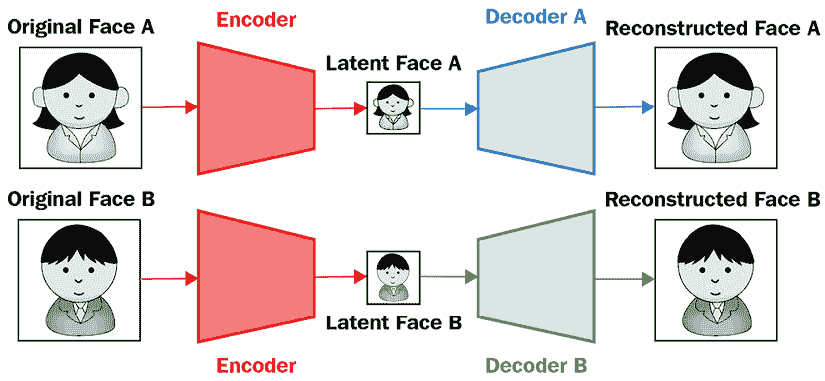

# 11

# 自编码器与图像操作

在之前的章节中，我们学习了如何对图像进行分类、检测图像中的对象以及分割与图像中的对象对应的像素。在本章中，我们将学习如何使用**自编码器**将图像表示为较低维度，然后利用图像的较低维度表示程度较高地操作（修改）图像。我们还将学习如何生成基于两幅不同图像的内容和风格生成新图像。然后，我们将探讨如何以不改变图像外观的方式修改图像，但在将图像通过图像分类模型时，将图像对应的类从一个类更改为另一个类。最后，我们将学习如何生成深度伪造：给定人物 A 的源图像，我们生成与人物 A 具有相似面部表情的人物 B 的目标图像。

总体而言，在本章中我们将学习以下主题：

+   理解和实现自编码器

+   理解卷积自编码器

+   理解变分自编码器

+   对图像执行对抗攻击

+   执行神经风格迁移

+   生成深度伪造

本章中所有代码片段均可在 Github 存储库的`Chapter11`文件夹中找到，链接为[`bit.ly/mcvp-2e`](https://bit.ly/mcvp-2e)。

# 理解自编码器

到目前为止，在之前的章节中，我们已经学习了通过训练基于输入图像及其对应标签的模型来对图像进行分类。现在让我们想象一种情景，即我们需要根据它们的相似性对图像进行聚类，并且不具有它们对应的标签。自编码器在识别和分组相似图像方面非常有用。

## 自编码器的工作原理

自编码器将图像作为输入，将其存储在较低维度中，并尝试生成相同的图像作为输出，因此术语**自**（简而言之，意味着能够重现输入）。然而，如果我们只是在输出中复制输入，那么我们不需要一个网络，只需简单地将输入乘以 1 即可。自编码器与我们迄今为止所学的典型神经网络架构的区别在于，它将图像中的信息编码到较低维度，然后再生成图像，因此称为**编码器**。这样，相似的图像将具有类似的编码。此外，**解码器**致力于从编码向量中重建原始图像。

为了进一步理解自编码器，让我们看一下以下图表：


图 11.1：典型自编码器架构

假设输入图像是 MNIST 手写数字的扁平化版本，输出图像与输入相同。中间层是称为 **瓶颈** 层的编码层。在输入和瓶颈层之间发生的操作表示 **编码器**，在瓶颈层和输出之间的操作表示 **解码器**。

通过瓶颈层，我们可以将图像表示为更低维度。此外，借助瓶颈层，我们可以重构原始图像。我们利用瓶颈层来解决识别相似图像和生成新图像的问题，在接下来的部分中我们将学习如何做到这一点。瓶颈层在以下方面帮助：

+   具有相似瓶颈层数值（编码表示）的图像可能彼此相似。

+   通过更改瓶颈层的节点值，我们可以改变输出图像。

在前面的理解基础上，让我们在接下来的部分执行以下操作：

+   从头开始实现自动编码器

+   根据瓶颈层数值可视化图像的相似性

在下一节中，我们将了解如何构建自动编码器及瓶颈层中不同单元对解码器输出的影响。

## 实现基础自动编码器

要了解如何构建自动编码器，让我们在 MNIST 数据集上实现一个：

您可以在本书的 GitHub 仓库的 `Chapter11` 文件夹中的 `simple_auto_encoder_with_different_latent_size.ipynb` 文件中找到代码，网址为 [`bit.ly/mcvp-2e`](https://bit.ly/mcvp-2e)。

您可以按照以下步骤操作：

1.  导入相关包并定义设备：

    ```py
    !pip install -q torch_snippets
    from torch_snippets import *
    from torchvision.datasets import MNIST
    from torchvision import transforms
    device = 'cuda' if torch.cuda.is_available() else 'cpu' 
    ```

1.  指定我们希望图像通过的转换：

    ```py
    img_transform = transforms.Compose([
                        transforms.ToTensor(),
                        transforms.Normalize([0.5], [0.5]),
                        transforms.Lambda(lambda x: x.to(device))
                    ]) 
    ```

在前面的代码中，我们看到我们正在将图像转换为张量，对其进行归一化，然后将其传递到设备上。

1.  创建训练和验证数据集：

    ```py
    trn_ds = MNIST('/content/', transform=img_transform, \
                   train=True, download=True)
    val_ds = MNIST('/content/', transform=img_transform, \
                   train=False, download=True) 
    ```

1.  定义数据加载器：

    ```py
    batch_size = 256
    trn_dl = DataLoader(trn_ds, batch_size=batch_size, shuffle=True)
    val_dl = DataLoader(val_ds, batch_size=batch_size, shuffle=False) 
    ```

1.  定义网络架构。我们在 `__init__` 方法中定义 `AutoEncoder` 类，包括编码器和解码器以及瓶颈层 `latent_dim` 的维度：

    ```py
    class AutoEncoder(nn.Module):
        def __init__(self, latent_dim):
            super().__init__()
            self.latend_dim = latent_dim
            self.encoder = nn.Sequential(
                                nn.Linear(28 * 28, 128), 
                                nn.ReLU(True),
                                nn.Linear(128, 64), 
                                nn.ReLU(True), 
                                nn.Linear(64, latent_dim))
            self.decoder = nn.Sequential(
                                nn.Linear(latent_dim, 64), 
                                nn.ReLU(True),
                                nn.Linear(64, 128), 
                                nn.ReLU(True), 
                                nn.Linear(128, 28 * 28), 
                                nn.Tanh()) 
    ```

1.  定义 `forward` 方法：

    ```py
     def forward(self, x):
            x = x.view(len(x), -1)
            x = self.encoder(x)
            x = self.decoder(x)
            x = x.view(len(x), 1, 28, 28)
            return x 
    ```

1.  可视化前述模型：

    ```py
    !pip install torch_summary
    from torchsummary import summary
    model = AutoEncoder(3).to(device)
    summary(model, torch.zeros(2,1,28,28)) 
    ```

结果如下：


图 11.2：UNet 架构

从前述输出中，我们可以看到 `Linear: 2-5 layer` 是瓶颈层，每个图像表示为三维向量。此外，解码器层使用瓶颈层中的三个值 (`Linear: 2-5 layer`) 重建原始图像。

1.  定义名为 `train_batch` 的函数，以便在批处理数据上训练模型，就像我们在前几章中所做的那样：

    ```py
    def train_batch(input, model, criterion, optimizer):
        model.train()
        optimizer.zero_grad()
        output = model(input)
        loss = criterion(output, input)
        loss.backward()
        optimizer.step()
        return loss 
    ```

1.  定义 `validate_batch` 函数以验证批处理数据上的模型：

    ```py
    @torch.no_grad()
    def validate_batch(input, model, criterion):
        model.eval()
        output = model(input)
        loss = criterion(output, input)
        return loss 
    ```

1.  定义模型、损失标准和优化器。确保我们使用 `MSELoss` 因为我们正在重建像素值。

    ```py
    model = AutoEncoder(3).to(device)
    criterion = nn.MSELoss()
    optimizer = torch.optim.AdamW(model.parameters(), \
                                  lr=0.001, weight_decay=1e-5) 
    ```

1.  随着 epoch 的增加训练模型：

    ```py
    num_epochs = 5
    log = Report(num_epochs)
    for epoch in range(num_epochs):
        N = len(trn_dl)
        for ix, (data, _) in enumerate(trn_dl):
            loss = train_batch(data, model, criterion, optimizer)
            log.record(pos=(epoch + (ix+1)/N), trn_loss=loss, end='\r')

        N = len(val_dl)
        for ix, (data, _) in enumerate(val_dl):
            loss = validate_batch(data, model, criterion)
            log.record(pos=(epoch + (ix+1)/N), val_loss=loss, end='\r')

        log.report_avgs(epoch+1) 
    ```

1.  可视化随着 epoch 增加的训练和验证损失：

    ```py
    log.plot_epochs(log=True) 
    ```

```py
output:
```


图 11.3：随着 epoch 增加的训练和验证损失

1.  通过查看`val_ds`数据集上未在训练期间提供的几个预测/输出来验证模型：

    ```py
    for _ in range(3):
        ix = np.random.randint(len(val_ds))
        im, _ = val_ds[ix]
        _im = model(im[None])[0]
        fig, ax = plt.subplots(1, 2, figsize=(3,3))
        show(im[0], ax=ax[0], title='input')
        show(_im[0], ax=ax[1], title='prediction')
        plt.tight_layout()
        plt.show() 
    ```

前述代码的输出如下：


图 11.4：自编码器生成的预测/输出

我们可以看到，尽管瓶颈层仅有三个维度，网络仍能以非常高的准确度重现输入。然而，图像的清晰度并不如预期。这主要是由于瓶颈层中节点数量较少造成的。在接下来的图像中，我们将展示在不同瓶颈层大小（2、3、5、10 和 50）训练网络后的重建图像：


图 11.5：自编码器生成的预测/输出

随着瓶颈层中向量的数量增加，重建图像的清晰度得到了提高。

在接下来的章节中，我们将学习如何使用**卷积神经网络**（**CNN**）生成更清晰的图像，并了解如何将相似图像分组。

## 实现卷积自编码器

在前一节中，我们学习了自编码器并在 PyTorch 中实现了它们。尽管我们已经实现了它们，但我们通过数据集的便利之处在于每个图像只有一个通道（每个图像表示为黑白图像），而且图像相对较小（28 x 28 像素）。因此，网络将输入展平，并能够在 784（28*28）个输入值上进行训练，以预测 784 个输出值。然而，在现实中，我们将遇到具有三个通道且远大于 28 x 28 像素的图像。

在本节中，我们将学习如何实现一个能够处理多维输入图像的卷积自编码器。然而，为了与普通自编码器进行比较，我们将继续使用在前一节中使用过的 MNIST 数据集，但是修改网络结构，使其成为一个卷积自编码器而非普通自编码器。

卷积自编码器的表示如下：


图 11.6：卷积自编码器

从上述图像中，我们可以看到输入图像在用于重建图像的瓶颈层中表示为一个块。图像通过多次卷积来获取瓶颈表示（通过**编码器**获得的**瓶颈**层），并且通过上采样瓶颈表示来获取原始图像（原始图像通过**解码器**重建）。请注意，在卷积自编码器中，与输入层相比，瓶颈层中的通道数量可以非常高。

现在我们知道了卷积自编码器的表示方式，让我们来实现它：

下面的代码可以在本书的 GitHub 代码库`Chapter11`文件夹中的`conv_auto_encoder.ipynb`中找到，网址为`https://bit.ly/mcvp-2e`。

1.  *步骤* *1* 到 *4*，与*实现普通自编码器部分*完全相同，具体如下：

    ```py
    !pip install -q torch_snippets
    from torch_snippets import *
    from torchvision.datasets import MNIST
    from torchvision import transforms
    device = 'cuda' if torch.cuda.is_available() else 'cpu'
    img_transform = transforms.Compose([
                        transforms.ToTensor(),
                        transforms.Normalize([0.5], [0.5]),
                        transforms.Lambda(lambda x: x.to(device))
                                        ])
    trn_ds = MNIST('/content/', transform=img_transform, \
                   train=True, download=True)
    val_ds = MNIST('/content/', transform=img_transform, \
                   train=False, download=True)
    batch_size = 128
    trn_dl = DataLoader(trn_ds, batch_size=batch_size, shuffle=True)
    val_dl = DataLoader(val_ds, batch_size=batch_size, shuffle=False) 
    ```

1.  定义神经网络类`ConvAutoEncoder`如下：

    1.  定义类和`__init__`方法：

    ```py
    class ConvAutoEncoder(nn.Module):
        def __init__(self):
            super().__init__() 
    ```

    1.  定义`encoder`架构：

    ```py
     self.encoder = nn.Sequential(
                                nn.Conv2d(1, 32, 3, stride=3, padding=1), 
                                nn.ReLU(True),
                                nn.MaxPool2d(2, stride=2),
                                nn.Conv2d(32, 64, 3, stride=2, padding=1), 
                                nn.ReLU(True),
                                nn.MaxPool2d(2, stride=1)
                            ) 
    ```

    注意，在前面的代码中，我们从初始通道数`1`开始，增加到`32`，然后进一步增加到`64`，同时通过执行`nn.MaxPool2d`和`nn.Conv2d`操作减少输出值的大小。

    1.  定义`decoder`架构：

    ```py
     self.decoder = nn.Sequential(
                            nn.ConvTranspose2d(64, 32, 3, stride=2), 
                            nn.ReLU(True),
                            nn.ConvTranspose2d(32, 16, 5, stride=3,padding=1),
                            nn.ReLU(True),
                            nn.ConvTranspose2d(16, 1, 2, stride=2,padding=1), 
                            nn.Tanh()
                        ) 
    ```

    1.  定义`forward`方法：

    ```py
     def forward(self, x):
            x = self.encoder(x)
            x = self.decoder(x)
            return x 
    ```

1.  使用`summary`方法获取模型的摘要：

    ```py
    model = ConvAutoEncoder().to(device)
    !pip install torch_summary
    from torchsummary import summary
    summary(model, torch.zeros(2,1,28,28)); 
    ```

前面的代码结果如下：


图 11.7：模型架构摘要

从前面的总结可以看出，形状为批大小 x 64 x 2 x 2 的`MaxPool2d-6`层充当了瓶颈层。

一旦我们训练模型，就像我们在前一节中做的那样（在*步骤 6、7、8 和 9*中），随着增加的时期训练和验证损失的变化以及输入图像的预测如下：


图 11.8：随着时期的变化和样本预测的损失变化

从前面的图像可以看出，卷积自编码器能够比普通自编码器更清晰地预测图像。作为练习，我们建议您在编码器和解码器中改变通道数量，然后分析结果的变化。

在接下来的部分中，当图像的标签不存在时，我们将讨论基于瓶颈层值分组相似图像的问题。

## 使用 t-SNE 对相似图像进行分组

在前面的部分中，我们假设每个图像在更低的维度中表示，假设相似的图像将具有相似的嵌入，而不相似的图像将具有不相似的嵌入。然而，我们还没有详细查看图像相似性度量或嵌入表示。

在本节中，我们将在二维空间中绘制嵌入（瓶颈）向量。我们可以通过一种称为**t-SNE**的技术将卷积自编码器的 64 维向量压缩到二维空间中，该技术有助于以一种使得相似数据点聚集在一起而不相似数据点远离彼此的方式压缩信息。 （关于 t-SNE 的更多信息请参见：[`www.jmlr.org/papers/v9/vandermaaten08a.html`](http://www.jmlr.org/papers/v9/vandermaaten08a.html)。）

通过这种方式，我们可以验证类似图像将具有相似的嵌入，因为相似的图像应该在二维平面上聚集在一起。我们将在二维平面上表示所有测试图像的嵌入：

以下代码在本书的 GitHub 存储库的`Chapter11`文件夹中的`conv_auto_encoder.ipynb`中可用，网址为[`bit.ly/mcvp-2e`](https://bit.ly/mcvp-2e)。

1.  初始化列表以存储潜在向量（`latent_vectors`）和图像的对应`classes`（请注意，我们仅存储每个图像的类别，以验证同一类别的图像是否确实在表示上彼此接近）：

    ```py
    latent_vectors = []
    classes = [] 
    ```

1.  循环遍历验证数据加载器中的图像（`val_dl`）并存储编码器层输出的结果（`model.encoder(im).view(len(im),-1)`）和每个图像（`im`）对应的类别（`clss`）：

    ```py
    for im,clss in val_dl:
        latent_vectors.append(model.encoder(im).view(len(im),-1))
        classes.extend(clss) 
    ```

1.  连接 NumPy 数组`latent_vectors`：

    ```py
    latent_vectors = torch.cat(latent_vectors).cpu().detach().numpy() 
    ```

1.  导入 t-SNE（`TSNE`）并指定将每个向量转换为二维向量（`TSNE(2)`），以便我们可以绘制它：

    ```py
    from sklearn.manifold import TSNE
    tsne = TSNE(2) 
    ```

1.  运行`fit_transform`方法来拟合 t-SNE 到图像嵌入（`latent_vectors`）：

    ```py
    clustered = tsne.fit_transform(latent_vectors) 
    ```

1.  绘制 t-SNE 拟合后的数据点：

    ```py
    fig = plt.figure(figsize=(12,10))
    cmap = plt.get_cmap('Spectral', 10)
    plt.scatter(*zip(*clustered), c=classes, cmap=cmap)
    plt.colorbar(drawedges=True) 
    ```

前面的代码生成了以下输出（你可以参考书的数字版以查看彩色图片）：


图 11.9：使用 t-SNE 分组的数据点（图像）

我们可以看到同一类别的图像被聚集在一起，这进一步证实了瓶颈层的值以这样的方式排列，即看起来相似的图像将具有相似的值。

到目前为止，我们已经了解了如何使用自编码器将相似图像分组在一起。在下一节中，我们将学习如何使用自编码器生成新图像。

# 理解变分自编码器

到目前为止，我们已经看到了一种情况，可以将相似的图像分组到集群中。此外，我们学习到当我们获取落在给定集群中的图像的嵌入时，我们可以重新构建（解码）它们。但是，如果一个嵌入（潜在向量）位于两个集群之间，我们不能保证生成逼真的图像。**变分自编码器**（**VAEs**）在这种情况下非常有用。

## VAE 的必要性

在深入理解和构建 VAE 之前，让我们探讨从嵌入中生成图像的局限性，这些图像不属于任何一个集群（或位于不同集群中心）。首先，我们通过以下步骤从采样向量生成图像（可在`conv_auto_encoder.ipynb`文件中找到）：

1.  计算在前一节中使用的验证图像的潜在向量（嵌入）：

    ```py
    latent_vectors = []
    classes = []
    for im,clss in val_dl:
        latent_vectors.append(model.encoder(im))
        classes.extend(clss)
    latent_vectors = torch.cat(latent_vectors).cpu()\
                          .detach().numpy().reshape(10000, -1) 
    ```

1.  使用列级均值(`mu`)和标准差(`sigma`)生成随机向量，并在创建来自均值和标准差的向量之前，给标准差添加轻微噪声（`torch.randn(1,100)`）。最后，将它们保存在列表中（`rand_vectors`）：

    ```py
    rand_vectors = []
    for col in latent_vectors.transpose(1,0):
        mu, sigma = col.mean(), col.std()
        rand_vectors.append(sigma*torch.randn(1,100) + mu) 
    ```

1.  绘制从*步骤 2*中获取的向量重建的图像和在前一节中训练的卷积自编码器模型：

    ```py
    rand_vectors=torch.cat(rand_vectors).transpose(1,0).to(device)
    fig,ax = plt.subplots(10,10,figsize=(7,7)); ax = iter(ax.flat)
    for p in rand_vectors:
        img = model.decoder(p.reshape(1,64,2,2)).view(28,28)
        show(img, ax=next(ax)) 
    ```

上述代码的输出如下：


图 11.10：从潜在向量的均值和标准差生成的图像

从上述输出中我们可以看到，当我们绘制从已知向量的列的均值和加噪标准差生成的图像时，得到的图像不如之前清晰。这是一个现实的情况，因为我们事先不知道会生成逼真图片的嵌入向量的范围。

**VAEs**通过生成具有均值为 0 和标准差为 1 的向量来帮助我们解决这个问题，从而确保我们生成的图像具有均值为 0 和标准差为 1。

实质上，在 VAE 中，我们指定瓶颈层应遵循某种分布。在接下来的章节中，我们将学习我们在 VAE 中采用的策略，还将学习有助于获取遵循特定分布的瓶颈特征的**Kullback-Leibler**（**KL**）散度损失。

## VAE 的工作原理

在 VAE 中，我们通过以下方式构建网络，使得从预定义分布生成的随机向量能够生成逼真的图像。简单的自编码器无法做到这一点，因为我们没有在网络中指定生成图像的数据分布。我们通过 VAE 采用以下策略来实现这一点：

1.  编码器的输出是每个图像的两个向量：

    +   一个向量代表均值。

    +   另一个表示标准差。

1.  从这两个向量中，我们获取一个修改后的向量，该向量是均值和标准差之和（乘以一个随机小数）。修改后的向量将与每个向量具有相同数量的维度。

1.  将上一步得到的修改后的向量作为输入传递给解码器以获取图像。

1.  我们优化的损失值是以下几种组合：

    +   KL 散度损失：衡量均值向量和标准差向量的分布与 0 和 1 的偏差，分别为

    +   均方损失：是我们用来重构（解码）图像的优化方法

通过指定均值向量应该具有围绕 0 中心的分布，标准差向量应该围绕 1 中心的分布，我们训练网络的方式是，当我们生成均值为 0、标准差为 1 的随机噪声时，解码器能够生成逼真的图像。

此外，请注意，如果我们仅最小化 KL 散度，编码器将预测均值向量为 0，并且每个输入的标准差为 1。因此，同时最小化 KL 散度损失和均方损失是重要的。

在下一节中，让我们学习一下 KL 散度，以便我们可以将其纳入模型损失值的计算中。

## KL 散度

KL 散度有助于解释数据两个分布之间的差异。在我们的具体案例中，我们希望我们的瓶颈特征值遵循均值为 0、标准差为 1 的正态分布。

因此，我们使用 KL 散度损失来理解我们的瓶颈特征值与期望的值分布有多不同，期望的分布具有均值为 0 和标准差为 1。

让我们通过详细说明如何计算 KL 散度损失来看看 KL 散度损失如何帮助：


在前述方程中，σ和μ分别表示每个输入图像的均值和标准差值。

让我们讨论前述方程：

1.  确保均值向量分布在 0 附近：

最小化均方误差（）在前述方程中确保尽可能接近 0。

1.  确保标准差向量分布在 1 附近：

方程的其余项（除了）确保σ（标准差向量）分布在 1 附近。

当均值（µ）为 0 且标准差为 1 时，前述损失函数被最小化。此外，通过指定我们正在考虑标准差的对数，我们确保σ值不能为负。

现在我们理解了构建 VAE 的高级策略以及要最小化的损失函数，以获得编码器输出的预定义分布后，让我们在下一节中实现 VAE。

## 构建 VAE

在本节中，我们将编写一个 VAE 来生成手写数字的新图像。

以下代码在本书 GitHub 库的`Chapter11`文件夹中的`VAE.ipynb`中可用：[`bit.ly/mcvp-2e`](https://bit.ly/mcvp-2e)。

由于我们具有相同的数据，*实现基本自动编码器*部分中的所有步骤仍然相同，除了*步骤 5 和 6*，在其中我们分别定义网络架构和训练模型。相反，我们在以下代码中以不同方式定义它们（在`VAE.ipynb`文件中可用）：

1.  *步骤 1* 到 *步骤 4*，与*实现基本自动编码器*部分完全相同，具体如下：

    ```py
    !pip install -q torch_snippets
    from torch_snippets import *
    import torch
    import torch.nn as nn
    import torch.nn.functional as F
    import torch.optim as optim
    from torchvision import datasets, transforms
    from torchvision.utils import make_grid
    device = 'cuda' if torch.cuda.is_available() else 'cpu'
    train_dataset = datasets.MNIST(root='MNIST/', train=True, \
                                   transform=transforms.ToTensor(), \
                                   download=True)
    test_dataset = datasets.MNIST(root='MNIST/', train=False, \
                                  transform=transforms.ToTensor(), \
                                  download=True)
    train_loader = torch.utils.data.DataLoader(dataset = train_dataset, \
                                               batch_size=64, shuffle=True)
    test_loader = torch.utils.data.DataLoader(dataset= test_dataset, \
                                              batch_size=64, shuffle=False) 
    ```

1.  定义神经网络类`VAE`如下：

    1.  在`__init__`方法中定义将在其他方法中使用的层：

    ```py
    class VAE(nn.Module):
        def __init__(self, x_dim, h_dim1, h_dim2, z_dim):
            super(VAE, self).__init__()
            self.d1 = nn.Linear(x_dim, h_dim1)
            self.d2 = nn.Linear(h_dim1, h_dim2)
            self.d31 = nn.Linear(h_dim2, z_dim)
            self.d32 = nn.Linear(h_dim2, z_dim)
            self.d4 = nn.Linear(z_dim, h_dim2)
            self.d5 = nn.Linear(h_dim2, h_dim1)
            self.d6 = nn.Linear(h_dim1, x_dim) 
    ```

    1.  注意 `d1` 和 `d2` 层对应编码器部分，而 `d5` 和 `d6` 对应解码器部分。`d31` 和 `d32` 层分别对应均值向量和标准差向量。然而，为了方便起见，我们假设将使用 `d32` 层作为对数方差向量的表示。

    1.  定义编码器方法：

    ```py
     def encoder(self, x):
            h = F.relu(self.d1(x))
            h = F.relu(self.d2(h))
            return self.d31(h), self.d32(h) 
    ```

    1.  注意编码器返回两个向量：一个用于均值 `(self.d31(h))`，另一个用于对数方差值 `(self.d32(h))`。

    1.  定义从编码器输出中进行采样的方法 (`sampling`)：

    ```py
     def sampling(self, mean, log_var):
            std = torch.exp(0.5*log_var)
            eps = torch.randn_like(std)
            return eps.mul(std).add_(mean) 
    ```

    1.  注意 *0.5*log_var* (`torch.exp(0.5*log_var)`) 的指数代表标准差 (`std`)。此外，我们通过随机正态分布生成的噪声乘以均值和标准差的加法来返回值。通过乘以 `eps`，我们确保即使在编码器向量轻微变化时，也能生成图像。

1.  定义解码器方法：

    ```py
     def decoder(self, z):
            h = F.relu(self.d4(z))
            h = F.relu(self.d5(h))
            return F.sigmoid(self.d6(h)) 
    ```

1.  定义前向方法：

    ```py
     def forward(self, x):
            mean, log_var = self.encoder(x.view(-1, 784))
            z = self.sampling(mean, log_var)
            return self.decoder(z), mean, log_var 
    ```

在上述方法中，我们确保编码器返回均值和对数方差值。接下来，我们通过均值加上乘以对数方差的 epsilon 进行采样，并通过解码器传递后返回值。

1.  定义用于对一个批次模型进行训练和另一个批次进行验证的函数：

    ```py
    def train_batch(data, model, optimizer, loss_function):
        model.train()
        data = data.to(device)
        optimizer.zero_grad()
        recon_batch, mean, log_var = model(data)
        loss, mse, kld = loss_function(recon_batch, data, mean, log_var)
        loss.backward()
        optimizer.step()
        return loss, mse, kld, log_var.mean(), mean.mean()
    @torch.no_grad()
    def validate_batch(data, model, loss_function):
        model.eval()
        data = data.to(device)
        recon, mean, log_var = model(data)
        loss, mse, kld = loss_function(recon, data, mean, log_var)
        return loss, mse, kld, log_var.mean(), mean.mean() 
    ```

1.  定义损失函数：

    ```py
    def loss_function(recon_x, x, mean, log_var):
        RECON = F.mse_loss(recon_x, x.view(-1, 784), reduction='sum')
        KLD = -0.5 * torch.sum(1 + log_var - mean.pow(2) - log_var.exp())
        return RECON + KLD, RECON, KLD 
    ```

在上述代码中，我们获取原始图像 (`x`) 和重构图像 (`recon_x`) 之间的 MSE 损失 (`RECON`)。接下来，根据我们在前一节定义的公式计算 KL 散度损失 (`KLD`)。注意对数方差的指数是方差值。

1.  定义模型对象 (`vae`) 和优化器函数 (`optimizer`)：

    ```py
    vae = VAE(x_dim=784, h_dim1=512, h_dim2=256, z_dim=50).to(device)
    optimizer = optim.AdamW(vae.parameters(), lr=1e-3) 
    ```

1.  在增加 epoch 的过程中训练模型：

    ```py
    n_epochs = 10
    log = Report(n_epochs)
    for epoch in range(n_epochs):
        N = len(train_loader)
        for batch_idx, (data, _) in enumerate(train_loader):
            loss, recon, kld, log_var, mean = train_batch(data, \
                                                          vae, optimizer, \
                                                          loss_function)
            pos = epoch + (1+batch_idx)/N
            log.record(pos, train_loss=loss, train_kld=kld, \
                       train_recon=recon,train_log_var=log_var, \
                       train_mean=mean, end='\r')

        N = len(test_loader)
        for batch_idx, (data, _) in enumerate(test_loader):
            loss, recon, kld,log_var,mean = validate_batch(data, \
                                               vae, loss_function)
            pos = epoch + (1+batch_idx)/N
            log.record(pos, val_loss=loss, val_kld=kld, \
                       val_recon=recon, val_log_var=log_var, \
                       val_mean=mean, end='\r')

        log.report_avgs(epoch+1)
        with torch.no_grad():
            z = torch.randn(64, 50).to(device)
            sample = vae.decoder(z).to(device)
            images = make_grid(sample.view(64, 1, 28, 28)).permute(1,2,0)
            show(images)
    log.plot_epochs(['train_loss','val_loss']) 
    ```

尽管大多数前述代码是熟悉的，让我们看一下网格图像生成过程。我们首先生成一个随机向量 (`z`)，然后通过解码器 (`vae.decoder`) 获取图像样本。`make_grid` 函数会绘制图像（如果需要，会自动进行反归一化）。

损失值变化的输出和生成图像的样本如下：


图 11.11：（左）随 epoch 增加损失的变化。（右）使用 VAE 生成的图像

我们可以看到我们能够生成原始图像中不存在的逼真新图像。

到目前为止，我们已经学习了使用 VAE 生成新图像的方法。但是，如果我们希望修改图像以使模型无法识别正确的类别，我们将在下一节中学习用于实现此目的的技术。

# 对图像执行对抗攻击：

在前一节中，我们学习了使用 VAE 从随机噪声生成图像。但这是一个无监督的练习。如果我们想以如此微小的方式修改图像，以至于对于人类来说与原始图像几乎无法区分，但神经网络模型仍然会将其识别为属于不同类别的对象，那么对图像进行的对抗攻击就非常有用。

对抗攻击是指我们对输入图像值（像素）进行的更改，以便达到特定目标。这在使我们的模型更加健壮以免受轻微修改影响方面特别有帮助。在本节中，我们将学习如何轻微修改图像，使预训练模型将其预测为不同类别（由用户指定），而不是原始类别。我们将采用的策略如下：

1.  提供一张大象的图像。

1.  指定与图像相对应的目标类别。

1.  导入预训练模型，其中模型参数设置为不更新（`gradients = False`）。

1.  指定我们在输入图像像素值上计算梯度，而不是网络权重值。这是因为在训练中欺骗网络时，我们无法控制模型，只能控制发送到模型的图像。

1.  计算与模型预测和目标类别对应的损失。

1.  对模型进行反向传播。这一步骤帮助我们理解每个输入像素值相关的梯度。

1.  根据每个输入像素值对应的梯度更新输入图像像素值。

1.  在多个 epochs 中重复*步骤 5、6 和 7*。

让我们用代码来做这件事：

本书的 GitHub 存储库中的`Chapter11`文件夹中提供了`adversarial_attack.ipynb`代码文件：[`bit.ly/mcvp-2e`](https://bit.ly/mcvp-2e)。该代码包含用于下载数据的 URL。我们强烈建议您在 GitHub 上执行该笔记本，以重现结果并理解执行步骤以及文本中各种代码组件的解释。

1.  导入相关包、我们用于此用例的图像以及预训练的 ResNet50 模型。同时，指定我们要冻结参数，因为我们不会更新模型（但会更新图像以使其欺骗模型）：

    ```py
    !pip install torch_snippets
    from torch_snippets import inspect, show, np, torch, nn
    from torchvision.models import resnet50
    model = resnet50(pretrained=True)
    for param in model.parameters():
        param.requires_grad = False
    model = model.eval()
    import requests
    from PIL import Image
    url = 'https://lionsvalley.co.za/wp-content/uploads/2015/11/african-elephant-square.jpg'
    original_image = Image.open(requests.get(url, stream=True)\
                                .raw).convert('RGB')
    original_image = np.array(original_image)
    original_image = torch.Tensor(original_image) 
    ```

1.  导入`image_net_classes`并为每个类分配 ID：

    ```py
    image_net_classes = 'https://gist.githubusercontent.com/yrevar/942d3a0ac09ec9e5eb3a/raw/238f720ff059c1f82f368259d1ca4ffa5dd8f9f5/imagenet1000_clsidx_to_labels.txt'
    image_net_classes = requests.get(image_net_classes).text
    image_net_ids = eval(image_net_classes)
    image_net_classes = {i:j for j,i in image_net_ids.items()} 
    ```

1.  指定一个函数来对图像进行归一化（`image2tensor`）和反归一化（`tensor2image`）：

    ```py
    from torchvision import transforms as T
    from torch.nn import functional as F
    normalize = T.Normalize([0.485, 0.456, 0.406], 
                            [0.229, 0.224, 0.225])
    denormalize=T.Normalize( \
                    [-0.485/0.229,-0.456/0.224,-0.406/0.225], 
                    [1/0.229, 1/0.224, 1/0.225])
    def image2tensor(input):
        x = normalize(input.clone().permute(2,0,1)/255.)[None]
        return x
    def tensor2image(input):
        x = (denormalize(input[0].clone()).permute(1,2,0)*255.)\
                                          .type(torch.uint8)
        return x 
    ```

1.  定义一个函数来预测给定图像的类别（`predict_on_image`）：

    ```py
    def predict_on_image(input):
        model.eval()
        show(input)
        input = image2tensor(input)
        pred = model(input)
        pred = F.softmax(pred, dim=-1)[0]
        prob, clss = torch.max(pred, 0)
        clss = image_net_ids[clss.item()]
        print(f'PREDICTION: `{clss}` @ {prob.item()}') 
    ```

在上述代码中，我们正在将输入图像转换为张量（使用先前定义的`image2tensor`方法进行归一化）并通过`model`获取图像中对象的类别（`clss`）和预测的概率（`prob`）。

1.  定义`attack`函数如下：

    1.  `attack`函数接受`image`、`model`和`target`作为输入：

    ```py
    from tqdm import trange
    losses = []
    def attack(image, model, target, epsilon=1e-6): 
    ```

    1.  将图像转换为张量，并指定需要计算梯度的输入：

    ```py
     input = image2tensor(image)
        input.requires_grad = True 
    ```

    1.  通过将规范化的输入(`input`)通过模型计算预测，然后计算相应目标类别的损失值：

    ```py
     pred = model(input)
        loss = nn.CrossEntropyLoss()(pred, target) 
    ```

    1.  执行反向传播以减少损失：

    ```py
     loss.backward()
        losses.append(loss.mean().item()) 
    ```

    1.  基于梯度方向微调图像：

    ```py
     output = input - epsilon * input.grad.sign() 
    ```

    1.  在前述代码中，我们通过一个非常小的量（乘以`epsilon`）更新输入值。此外，我们仅仅通过梯度的方向（`input.grad.sign()`）进行更新图像，而不是梯度的大小，而且在此之前乘以了一个非常小的值（`epsilon`）。

    1.  将张量转换为图像（`tensor2image`）并返回输出，这会使图像反标准化：

    ```py
     output = tensor2image(output)
        del input
        return output.detach() 
    ```

1.  修改图像以属于不同的类别：

    1.  指定我们想要将图像转换为的目标（`desired_targets`）：

    ```py
    modified_images = []
    desired_targets = ['lemon', 'comic book', 'sax, saxophone'] 
    ```

    1.  循环遍历目标，并在每次迭代中指定目标类别：

    ```py
    for target in desired_targets:
        target = torch.tensor([image_net_classes[target]]) 
    ```

    1.  修改图像以攻击逐步增加的时期，并将它们收集到一个列表中：

    ```py
     image_to_attack = original_image.clone()
        for _ in trange(10):
            image_to_attack = attack(image_to_attack,model,target)
        modified_images.append(image_to_attack) 
    ```

    1.  下面的代码会导致修改后的图像和相应的类别：

    ```py
    for image in [original_image, *modified_images]:
        predict_on_image(image)
        inspect(image) 
    ```

前述代码生成如下内容：


图 11.12：修改后的图像及其对应的类别

我们可以看到，当我们轻微地修改图像时，预测类别完全不同，但置信度非常高。

现在我们了解了如何修改图像，使其成为我们希望的类别，接下来的部分中，我们将学习如何修改图像（内容图像）以我们选择的风格。

# 理解神经风格转移

想象一个场景，你想以梵高的风格绘制一幅图像。在这种情况下，神经风格转移非常有用。在神经风格转移中，我们使用一个内容图像和一个风格图像，将这两个图像以一种方式结合起来，使得合成图像保留内容图像的内容，同时保持风格图像的风格。

## 理解神经风格转移的工作原理

示例风格图像和内容图像如下：


图 11.13：（左）风格图像。 （右）内容图像

我们希望保留右侧图片（内容图像）中的内容，但同时叠加左侧图片（风格图像）中的颜色和纹理。

执行神经风格转移的过程如下（我们将遵循此论文中概述的技术：[`arxiv.org/abs/1508.06576`](https://arxiv.org/abs/1508.06576)）。我们试图修改原始图像，使得损失值分解为**内容损失**和**风格损失**。内容损失指生成图像与内容图像有多**不同**。风格损失指风格图像与生成图像有多**相关**。

虽然我们提到损失是基于图像差异计算的，但在实践中，我们稍微修改了它，确保使用图像的特征层激活而不是原始图像计算损失。例如，在第二层的内容损失将是通过第二层传递时的*内容图像和生成图像的激活*之间的平方差。这是因为特征层捕获原始图像的某些属性（例如，高层中对应于原始图像的前景轮廓以及低层中细粒度对象的细节）。

虽然计算内容损失似乎很简单，让我们尝试理解如何计算生成图像与样式图像之间的相似性。一个称为**格拉姆矩阵**的技术非常方便。格拉姆矩阵计算生成图像和样式图像之间的相似性，计算方法如下：


*GM**l* 是层*l*的样式图像*S*和生成图像*G*的格拉姆矩阵值。*N*[l]代表特征图的数量，其中*M*[l]是特征图的高度乘以宽度。

由于将矩阵乘以其自身的转置得到了格拉姆矩阵。让我们讨论这个操作是如何使用的。假设您正在处理一个具有 32 x 32 x 256 的特征输出层。格拉姆矩阵被计算为通道内每个 32 x 32 值与所有通道中值的相关性。因此，格拉姆矩阵计算结果为 256 x 256 的矩阵形状。现在我们比较样式图像和生成图像的 256 x 256 值，以计算样式损失。

让我们理解为什么格拉姆矩阵对于样式转移如此重要。在成功的情况下，假设我们将毕加索的风格转移到了蒙娜丽莎上。让我们称毕加索的风格为*St*（代表样式），原始蒙娜丽莎为*So*（代表源），最终图像为*Ta*（代表目标）。请注意，在理想情况下，图像*Ta*中的局部特征与*St*中的局部特征相同。即使内容可能不同，将样式图像的类似颜色、形状和纹理带入目标图像中是样式转移中的重要部分。

扩展开来，如果我们发送*So*并从 VGG19 的中间层提取其特征，它们将与通过发送*Ta*获得的特征不同。然而，在每个特征集内，相应向量将以类似的方式相对于彼此变化。例如，如果两个特征集的第一个通道均值与第二个通道均值的比率将是相似的。这就是我们尝试使用格拉姆损失计算的原因。

通过比较内容图像的特征激活的差异来计算内容损失。通过首先在预定义层中计算格拉姆矩阵，然后比较生成图像和样式图像的格拉姆矩阵来计算样式损失。

现在我们能够计算样式损失和内容损失，最终修改的输入图像是最小化总损失的图像，即样式损失和内容损失的加权平均。

## 执行神经风格迁移

我们采用的实施神经风格迁移的高层策略如下：

1.  将输入图像通过预训练模型传递。

1.  提取预定义层的层值。

1.  将生成的图像通过模型并在同一预定义层中提取其值。

1.  计算与内容图像和生成图像相对应的每个层的内容损失。

1.  将样式图像通过模型的多层并计算样式图像的格拉姆矩阵值。

1.  将生成的图像通过样式图像传递的相同层，并计算其相应的格拉姆矩阵值。

1.  提取两个图像的格拉姆矩阵值的平方差。这将是样式损失。

1.  总损失将是样式损失和内容损失的加权平均。

1.  使总损失最小化的生成图像将是感兴趣的最终图像。

现在让我们编写前面的策略代码：

本书 GitHub 存储库的`Chapter11`文件夹中提供了名为`neural_style_transfer.ipynb`的以下代码：[`bit.ly/mcvp-2e`](https://bit.ly/mcvp-2e)。代码包含从中下载数据的 URL，并且代码长度适中。我们强烈建议您在 GitHub 上执行笔记本以重现结果，同时理解执行步骤和文本中各种代码组件的解释。

1.  导入相关包：

    ```py
    !pip install torch_snippets
    from torch_snippets import *
    from torchvision import transforms as T
    from torch.nn import functional as F
    device = 'cuda' if torch.cuda.is_available() else 'cpu' 
    ```

1.  定义用于预处理和后处理数据的函数：

    ```py
    from torchvision.models import vgg19
    preprocess = T.Compose([
                    T.ToTensor(),
                    T.Normalize(mean=[0.485, 0.456, 0.406], 
                                std=[0.229, 0.224, 0.225]),
                    T.Lambda(lambda x: x.mul_(255))
                ])
    postprocess = T.Compose([
                    T.Lambda(lambda x: x.mul_(1./255)),
                    T.Normalize(\
                    mean=[-0.485/0.229,-0.456/0.224,-0.406/0.225], 
                                std=[1/0.229, 1/0.224, 1/0.225]),
                ]) 
    ```

1.  定义`GramMatrix`模块：

    ```py
    class GramMatrix(nn.Module):
        def forward(self, input):
            b,c,h,w = input.size()
            feat = input.view(b, c, h*w)
            G = feat@feat.transpose(1,2)
            G.div_(h*w)
            return G 
    ```

在前述代码中，我们正在计算所有可能的特征与自身的内积，这基本上是在询问所有向量如何相互关联。

1.  定义格拉姆矩阵的相应均方误差损失，`GramMSELoss`：

    ```py
    class GramMSELoss(nn.Module):
        def forward(self, input, target):
            out = F.mse_loss(GramMatrix()(input), target)
            return(out) 
    ```

一旦我们对两个特征集都有了格拉姆向量，它们尽可能地匹配，因此`mse_loss`至关重要。

1.  定义模型类`vgg19_modified`：

    1.  初始化类：

    ```py
    class vgg19_modified(nn.Module):
        def __init__(self):
            super().__init__() 
    ```

    1.  提取特征：

    ```py
     features = list(vgg19(pretrained = True).features)
            self.features = nn.ModuleList(features).eval() 
    ```

    1.  定义`forward`方法，该方法接受层列表并返回与每个层对应的特征：

    ```py
     def forward(self, x, layers=[]):
            order = np.argsort(layers)
            _results, results = [], []
            for ix,model in enumerate(self.features):
                x = model(x)
                if ix in layers: _results.append(x)
            for o in order: results.append(_results[o])
            return results if layers is not [] else x 
    ```

    1.  定义模型对象：

    ```py
    vgg = vgg19_modified().to(device) 
    ```

1.  导入内容和样式图像：

    ```py
    !wget https://www.dropbox.com/s/z1y0fy2r6z6m6py/60.jpg
    !wget https://www.dropbox.com/s/1svdliljyo0a98v/style_image.png 
    ```

1.  确保图像调整大小为相同形状，512 x 512 x 3：

    ```py
    imgs = [Image.open(path).resize((512,512)).convert('RGB') \
            for path in ['style_image.png', '60.jpg']]
    style_image,content_image=[preprocess(img).to(device)[None] \
                                  for img in imgs] 
    ```

1.  指定要使用`requires_grad = True`修改内容图像：

    ```py
    opt_img = content_image.data.clone()
    opt_img.requires_grad = True 
    ```

1.  指定定义内容损失和样式损失的层次，即我们使用的中间 VGG 层，用于比较风格的 Gram 矩阵和内容的原始特征向量（注意，下面选择的层次纯粹是实验性的）：

    ```py
    style_layers = [0, 5, 10, 19, 28] 
    content_layers = [21]
    loss_layers = style_layers + content_layers 
    ```

定义内容和样式损失值的损失函数：

1.  ```py
    loss_fns = [GramMSELoss()] * len(style_layers) + \
                [nn.MSELoss()] * len(content_layers)
    loss_fns = [loss_fn.to(device) for loss_fn in loss_fns] 
    ```

1.  定义与内容和样式损失相关联的权重：

    ```py
    style_weights = [1000/n**2 for n in [64,128,256,512,512]] 
    content_weights = [1]
    weights = style_weights + content_weights 
    ```

1.  我们需要操作我们的图像，使得目标图像的风格尽可能地与`style_image`相似。因此，我们通过计算从 VGG 的几个选择层次获得的特征的 Gram 矩阵来计算`style_image`的`style_targets`值。由于整体内容应该保持不变，我们选择`content_layer`变量来计算来自 VGG 的原始特征：

    ```py
    style_targets = [GramMatrix()(A).detach() for A in \
                     vgg(style_image, style_layers)]
    content_targets = [A.detach() for A in \
                       vgg(content_image, content_layers)]
    targets = style_targets + content_targets 
    ```

1.  定义`optimizer`和迭代次数(`max_iters`)。尽管我们可以使用 Adam 或任何其他优化器，但 LBFGS 是一种观察到在确定性场景中工作最佳的优化器。此外，由于我们处理的是一张图像，没有任何随机性。许多实验表明，在神经传递设置中，LBFGS 收敛更快，损失更低，因此我们将使用这个优化器：

    ```py
    max_iters = 500
    optimizer = optim.LBFGS([opt_img])
    log = Report(max_iters) 
    ```

1.  执行优化。在确定性场景中，我们在同一个张量上进行迭代时，可以将优化器步骤包装为一个零参数函数，并重复调用它，如下所示：

    ```py
    iters = 0
    while iters < max_iters:
        def closure():
            global iters
            iters += 1
            optimizer.zero_grad()
            out = vgg(opt_img, loss_layers)
            layer_losses = [weights[a]*loss_fnsa \
                            for a,A in enumerate(out)]
            loss = sum(layer_losses)
            loss.backward()
            log.record(pos=iters, loss=loss, end='\r')
            return loss
        optimizer.step(closure) 
    ```

1.  绘制损失变化情况：

    ```py
    log.plot(log=True) 
    ```

这导致以下输出：


图 11.14：随着 epoch 增加的损失变化

1.  绘制具有内容和风格图像组合的图像：

    ```py
    With torch.no_grad()
        out_img = postprocess(opt_img[0]).permute(1,2,0)
    show(out_img) 
    ```

输出如下：


图 11.15：风格转移后的图像

从前述图片可以看出，图像是内容和风格图像的组合。

通过这种方式，我们已经看到了两种操作图像的方法：对图像进行对抗性攻击以修改图像的类别，以及风格转移来将一个图像的风格与另一个图像的内容结合。在接下来的部分，我们将学习生成 Deepfakes，这将表情从一个脸部转移到另一个脸部。

# 理解 Deepfakes

到目前为止，我们已经了解了两种不同的图像到图像的任务：使用 UNet 进行语义分割和使用自动编码器进行图像重构。Deepfakery 是一个具有非常相似基础理论的图像到图像任务。

## 深度伪造的工作原理

想象一种情况，你想创建一个应用程序，它可以拍摄一张脸部图片，并以你期望的方式改变表情。在这种情况下，Deepfakes 非常有用。尽管我们有意选择在本书中不讨论最新的 Deepfakes 技术，但一些技术如少样本对抗学习已经发展出来，用于生成具有感兴趣面部表情的逼真图片。了解 Deepfakes 的工作原理和 GANs（你将在下一章节学习到）将帮助你识别假视频。

在深伪造任务中，我们有几百张个人 A 的图片和几百张个人 B 的图片（或者可能是个人 A 和 B 的视频）。目标是重建具有个人 A 表情的个人 B 的面部，反之亦然。

以下图示解释了深度伪造图像生成过程的工作原理：



图 11.16：自动编码器工作流程，其中有一个编码器和两个类/集合的面部的独立解码器

在上述图片中，我们通过编码器（**编码器**）传递个人 A 和个人 B 的图像。一旦我们得到与个人 A（**潜在面部 A**）和个人 B（**潜在面部 B**）对应的潜在向量，我们通过它们对应的解码器（**解码器 A** 和 **解码器 B**）传递潜在向量以获取相应的原始图像（**重构面部 A** 和 **重构面部 B**）。到目前为止，编码器和两个解码器的概念与我们在*理解自动编码器*部分看到的非常相似。然而，在这种情况下，*我们只有一个编码器，但有两个解码器*（每个解码器对应不同的人）。期望从编码器获取的潜在向量表示图像中存在的面部表情的信息，而解码器获取相应的图像。一旦编码器和两个解码器训练好了，在执行深度伪造图像生成时，我们在我们的架构中切换连接如下：


图 11.17：从潜在表示图像重构一旦解码器被交换

当个人 A 的潜在向量通过解码器 B 传递时，个人 B 的重构面部将具有个人 A 的特征（一个微笑的面孔），反之亦然，当个人 B 通过解码器 A 传递时（一个悲伤的面孔）。

另一个有助于生成逼真图像的技巧是对脸部图像进行扭曲，并以这样的方式将它们馈送到网络中，扭曲的脸部作为输入，期望原始图像作为输出。

现在我们了解了它的工作原理，让我们使用自动编码器实现生成具有另一个人表情的假图像。

## 生成深度伪造

现在让我们来看一个实际例子：

以下代码可在本书的 GitHub 存储库的 `Chapter11` 文件夹中的 `Generating_Deep_Fakes.ipynb` 中找到：[`bit.ly/mcvp-2e`](https://bit.ly/mcvp-2e)。代码包含用于下载数据的 URL，并且长度适中。我们强烈建议您在 GitHub 中执行该笔记本，以重现结果，同时理解文本中执行步骤和各种代码组件的解释。

1.  让我们下载数据（我们已经合成创建）和源代码如下：

    ```py
    import os
    if not os.path.exists('Faceswap-Deepfake-Pytorch'):
        !wget -q https://www.dropbox.com/s/5ji7jl7httso9ny/person_images.zip
        !wget -q https://raw.githubusercontent.com/sizhky/deep-fake-util/main/random_warp.py
        !unzip -q person_images.zip
    !pip install -q torch_snippets torch_summary
    from torch_snippets import *
    from random_warp import get_training_data 
    ```

1.  从图像中获取面部截图如下：

    1.  定义面部级联，它在图像中绘制一个围绕面部的边界框。在 GitHub 存储库的*OpenCV 图像分析实用程序*PDF 中有关级联的更多信息。但是，目前仅需说明面部级联在图像中绘制紧密的面部边界框：

    ```py
    face_cascade = cv2.CascadeClassifier(cv2.data.haarcascades + \
                            'haarcascade_frontalface_default.xml') 
    ```

    1.  为从图像中裁剪面部定义一个名为`crop_face`的函数：

    ```py
    def crop_face(img):
        gray = cv2.cvtColor(img, cv2.COLOR_BGR2GRAY)
        faces = face_cascade.detectMultiScale(gray, 1.3, 5)
        if(len(faces)>0):
            for (x,y,w,h) in faces:
                img2 = img[y:(y+h),x:(x+w),:]
            img2 = cv2.resize(img2,(256,256))
            return img2, True
        else:
            return img, False 
    ```

    在前述函数中，我们通过面部级联将灰度图像（`gray`）传递，并裁剪包含面部的矩形。接下来，我们返回一个重新调整大小的图像（`img2`）。此外，为了考虑到在图像中未检测到面部的情况，我们传递一个标志以显示是否检测到面部。

    1.  裁剪`personA`和`personB`的图像，并将它们放在不同的文件夹中：

    ```py
    !mkdir cropped_faces_personA
    !mkdir cropped_faces_personB
    def crop_images(folder):
        images = Glob(folder+'/*.jpg')
        for i in range(len(images)):
            img = read(images[i],1)
            img2, face_detected = crop_face(img)
            if(face_detected==False):
                continue
            else:
                cv2.imwrite('cropped_faces_'+folder+'/'+str(i)+ \
                    '.jpg',cv2.cvtColor(img2, cv2.COLOR_RGB2BGR))
    crop_images('personA')
    crop_images('personB') 
    ```

1.  创建一个数据加载器并检查数据：

    ```py
    class ImageDataset(Dataset):
        def __init__(self, items_A, items_B):
            self.items_A = np.concatenate([read(f,1)[None] \
                                           for f in items_A])/255.
            self.items_B = np.concatenate([read(f,1)[None] \
                                           for f in items_B])/255.
            self.items_A += self.items_B.mean(axis=(0, 1, 2)) \
                            - self.items_A.mean(axis=(0, 1, 2))
        def __len__(self):
            return min(len(self.items_A), len(self.items_B))
        def __getitem__(self, ix):
            a, b = choose(self.items_A), choose(self.items_B)
            return a, b
        def collate_fn(self, batch):
            imsA, imsB = list(zip(*batch))
            imsA, targetA = get_training_data(imsA, len(imsA))
            imsB, targetB = get_training_data(imsB, len(imsB))
            imsA, imsB, targetA, targetB = [torch.Tensor(i)\
                                            .permute(0,3,1,2)\
                                            .to(device) \
                                            for i in [imsA, imsB,\
                                            targetA, targetB]]
            return imsA, imsB, targetA, targetB
    a = ImageDataset(Glob('cropped_faces_personA'), \
                     Glob('cropped_faces_personB'))
    x = DataLoader(a, batch_size=32, collate_fn=a.collate_fn) 
    ```

数据加载器返回四个张量，`imsA`，`imsB`，`targetA`和`targetB`。第一个张量（`imsA`）是第三个张量（`targetA`）的扭曲（变形）版本，第二个（`imsB`）是第四个张量（`targetB`）的扭曲（变形）版本。

此外，正如您在`a =ImageDataset(Glob('cropped_faces_personA'), Glob('cropped_faces_personB'))`行中看到的那样，我们有两个图像文件夹，每个人一个。这些面部之间没有任何关系，并且在`__iteritems__`数据集中，我们每次随机获取两张面部。

此步骤中的关键函数是`get_training_data`，出现在`collate_fn`中。这是一个用于扭曲（变形）面部的增强函数。我们将扭曲的面部作为自编码器的输入，并尝试预测正常的面部。

扭曲的优势不仅在于它增加了我们的训练数据量，而且还作为网络的正则化器，强制它理解关键面部特征，尽管提供的是扭曲的面部。

1.  让我们检查一些图像：

    ```py
    inspect(*next(iter(x)))
    for i in next(iter(x)):
        subplots(i[:8], nc=4, sz=(4,2)) 
    ```

上述代码的输出如下：


图 11.18：一批图像的输入和输出组合

请注意，输入图像是扭曲的，而输出图像则不是，输入到输出图像现在具有一对一的对应关系。

1.  构建模型如下：

    1.  定义卷积（`_ConvLayer`）和上采样（`_UpScale`）函数以及在构建模型时将利用的`Reshape`类：

        ```py
        def _ConvLayer(input_features, output_features):
            return nn.Sequential(
                nn.Conv2d(input_features, output_features, 
                          kernel_size=5, stride=2, padding=2),
                nn.LeakyReLU(0.1, inplace=True)
            )
        def _UpScale(input_features, output_features):
            return nn.Sequential(
                nn.ConvTranspose2d(input_features, output_features, 
                                 kernel_size=2, stride=2, padding=0),
                nn.LeakyReLU(0.1, inplace=True)
            )
        class Reshape(nn.Module):
            def forward(self, input):
                output = input.view(-1, 1024, 4, 4) # channel * 4 * 4
                return output 
        ```

    1.  定义`Autoencoder`模型类，它有一个单独的`encoder`和两个解码器（`decoder_A`和`decoder_B`）：

        ```py
        class Autoencoder(nn.Module):
            def __init__(self):
                super(Autoencoder, self).__init__()
                self.encoder = nn.Sequential(
                                _ConvLayer(3, 128),
                                _ConvLayer(128, 256),
                                _ConvLayer(256, 512),
                                _ConvLayer(512, 1024),
                                nn.Flatten(),
                                nn.Linear(1024 * 4 * 4, 1024),
                                nn.Linear(1024, 1024 * 4 * 4),
                                Reshape(),
                                _UpScale(1024, 512),
                            )
                self.decoder_A = nn.Sequential(
                                _UpScale(512, 256),
                                _UpScale(256, 128),
                                _UpScale(128, 64),
                                nn.Conv2d(64, 3, kernel_size=3, padding=1),
                                nn.Sigmoid(),
                            )
                self.decoder_B = nn.Sequential(
                                _UpScale(512, 256),
                                _UpScale(256, 128),
                                _UpScale(128, 64),
                                nn.Conv2d(64, 3, kernel_size=3, padding=1),
                                nn.Sigmoid(),
                            )
            def forward(self, x, select='A'):
                if select == 'A':
                    out = self.encoder(x)
                    out = self.decoder_A(out)
                else:
                    out = self.encoder(x)
                    out = self.decoder_B(out)
                return out 
        ```

1.  生成模型的摘要：

    ```py
    from torchsummary import summary
    model = Autoencoder()
    summary(model, torch.zeros(32,3,64,64), 'A'); 
    ```

上述代码生成以下输出：

图 11.19：模型架构总结

1.  定义`train_batch`逻辑：

    ```py
    def train_batch(model, data, criterion, optimizes):
        optA, optB = optimizers
        optA.zero_grad()
        optB.zero_grad()
        imgA, imgB, targetA, targetB = data
        _imgA, _imgB = model(imgA, 'A'), model(imgB, 'B')
        lossA = criterion(_imgA, targetA)
        lossB = criterion(_imgB, targetB)

        lossA.backward()
        lossB.backward()
        optA.step()
        optB.step()
        return lossA.item(), lossB.item() 
    ```

我们感兴趣的是运行`model(imgA, 'B')`（它将使用类 A 的输入图像返回类 B 的图像），但我们没有地面真相来进行比较。因此，我们正在预测`imgA`（其中`imgA`是`targetA`的扭曲版本）的`_imgA`，并使用`nn.L1Loss`将`_imgA`与`targetA`进行比较。

我们不需要`validate_batch`，因为没有验证数据集。在训练期间，我们将预测新图像，并在质量上看到进展。

1.  创建训练模型所需的所有组件：

    ```py
    model = Autoencoder().to(device)
    dataset = ImageDataset(Glob('cropped_faces_personA'), \
                           Glob('cropped_faces_personB'))
    dataloader = DataLoader(dataset, 32, collate_fn=dataset.collate_fn)
    optimizers=optim.Adam( \
                    [{'params': model.encoder.parameters()}, \
                     {'params': model.decoder_A.parameters()}], \
                     lr=5e-5, betas=(0.5, 0.999)), \
            optim.Adam([{'params': model.encoder.parameters()}, \
                     {'params': model.decoder_B.parameters()}], \
                            lr=5e-5, betas=(0.5, 0.999))

    criterion = nn.L1Loss() 
    ```

1.  训练模型：

    ```py
    n_epochs = 1000
    log = Report(n_epochs)
    !mkdir checkpoint
    for ex in range(n_epochs):
        N = len(dataloader)
        for bx,data in enumerate(dataloader):
            lossA, lossB = train_batch(model, data, 
                                       criterion, optimizers)
            log.record(ex+(1+bx)/N, lossA=lossA, 
                       lossB=lossB, end='\r')
        log.report_avgs(ex+1)
        if (ex+1)%100 == 0:
            state = {
                    'state': model.state_dict(),
                    'epoch': ex
                }
            torch.save(state, './checkpoint/autoencoder.pth')
        if (ex+1)%100 == 0:
            bs = 5
            a,b,A,B = data
            line('A to B')
            _a = model(a[:bs], 'A')
            _b = model(a[:bs], 'B')
            x = torch.cat([A[:bs],_a,_b])
            subplots(x, nc=bs, figsize=(bs*2, 5))
            line('B to A')
            _a = model(b[:bs], 'A')
            _b = model(b[:bs], 'B')
            x = torch.cat([B[:bs],_a,_b])
            subplots(x, nc=bs, figsize=(bs*2, 5))
    log.plot_epochs() 
    ```

上述代码导致重构的图像如下：


图 11.20：原始和重构图像

损失值的变化如下（您可以参考书籍的数字版获取彩色图像）：


图 11.21：随着 epochs 增加，损失的变化

正如您所看到的，我们可以通过调整自编码器以使用两个解码器而不是一个，从而在一个面孔和另一个面孔之间交换表情。此外，随着更多的 epochs，重构的图像变得更加逼真。

# 摘要

在本章中，我们学习了不同变体的自编码器：香草、卷积和变分。我们还学习了瓶颈层单位数量如何影响重构图像。接下来，我们学习了使用 t-SNE 技术识别与给定图像相似的图像。我们了解到当我们对向量进行采样时，无法获得逼真的图像，通过使用变分自编码器，我们学习了如何通过重构损失和 KL 散度损失生成新图像。接着，我们学习了如何对图像进行对抗攻击，以修改图像的类别而不改变图像的感知内容。然后，我们学习了如何利用内容损失和基于 Gram 矩阵的风格损失的组合来优化图像的内容和风格损失，从而生成两个输入图像的组合图像。最后，我们学习了如何调整自编码器以在没有任何监督的情况下交换两个面孔。

现在我们已经学习了如何从给定的图像集生成新图像，下一章中，我们将进一步讨论这个主题，使用生成对抗网络的变体生成全新的图像。

# 问题

1.  自编码器中的“编码器”是什么？

1.  自编码器优化哪种损失函数？

1.  自编码器如何帮助分组类似的图像？

1.  卷积自编码器在何时有用？

1.  如果我们从香草/卷积自编码器获得的嵌入向量空间随机采样，为什么会得到非直观的图像？

1.  变分自编码器优化的是哪些损失函数？

1.  变分自编码器如何克服香草/卷积自编码器生成新图像的限制？

1.  在对抗攻击期间，为什么我们修改输入图像的像素而不是权重值？

1.  在神经风格转移中，我们优化哪些损失以获得最佳结果？

1.  当计算风格和内容损失时，为什么要考虑不同层的激活而不是原始图像？

1.  当计算风格损失时，为什么要考虑 Gram 矩阵损失而不是图像之间的差异？

1.  在构建用于生成深度伪造的模型时，为什么我们会扭曲图像？

# 在 Discord 上了解更多信息

加入我们社区的 Discord 空间，与作者和其他读者进行讨论：

[`packt.link/modcv`](https://packt.link/modcv)


