# 12

# 使用 GAN 生成图像

在上一章中，我们学习了如何使用神经风格转移操作图片，并将一个图像中的表情叠加到另一个图像上。但是，如果我们给网络一堆图片，并要求它自行创造出一个全新的图片，会怎样呢？

生成对抗网络（GANs）是实现给定一组图片生成图像的尝试。在本章中，我们将从理解使得 GANs 起作用的原理开始，然后从头开始构建一个。这是一个不断扩展的广阔领域，即使我们在撰写本书时，也在扩展中。本章将通过介绍三种变体来奠定 GANs 的基础；在下一章中，我们将学习更高级的 GANs 及其应用。

在本章中，我们将探讨以下主题：

+   引入 GAN

+   使用 GAN 生成手写数字

+   使用 DCGAN 生成人脸图像

+   实现条件 GANs

本章中所有代码片段均可在 Github 仓库的 `Chapter12` 文件夹中找到，链接为 [`bit.ly/mcvp-2e`](https://bit.ly/mcvp-2e)。

# 引入 GAN

要理解 GAN，我们需要理解两个术语：生成器和判别器。首先，我们应该有一个合理数量的对象图片样本（100-1000 张图片）。**生成网络**（生成器）从图片样本中学习表示，并生成类似样本图片的图片。**判别网络**（判别器）则会查看生成器网络生成的图片和原始图片样本，并将图片分类为原始或生成的（伪造的）。

生成器网络试图以一种方式生成图片，使得判别器将这些图片分类为真实的。判别器网络试图将生成的图片分类为假的，并将原始样本中的图片分类为真实的。

本质上，GAN 中的对抗术语表示了两个网络相反性质的对立面——*一个生成器网络，生成图像以欺骗判别器网络，和一个判别器网络，通过判断图像是生成的还是原始的来分类每张图片*。

让我们通过下图了解 GANs 的工作过程：

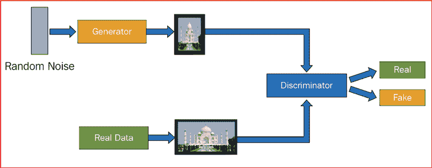

图 12.1：典型的 GAN 工作流程

在上述图表中，生成器网络从随机噪声生成图像作为输入。鉴别器网络查看生成器生成的图像，并将其与真实数据（提供的图像样本）进行比较，以确定生成的图像是真实还是伪造的。生成器试图生成尽可能多的逼真图像，而鉴别器则试图检测生成器生成的图像中哪些是伪造的。这样一来，生成器通过学习鉴别器的观察对象，学会尽可能多地生成逼真图像。

通常情况下，在每一步训练中，生成器和鉴别器交替训练。这样做类似于警察和小偷的游戏，生成器是试图生成伪造数据的小偷，而鉴别器则是试图辨别现有数据是真实还是伪造的警察。训练 GAN 的步骤如下：

1.  训练生成器（而不是鉴别器）以生成被鉴别器分类为真实的图像。

1.  训练鉴别器（而不是生成器）以将生成器生成的图像分类为伪造的。

1.  重复该过程直到达到平衡。

现在让我们理解如何使用以下图表和步骤计算生成器和鉴别器的损失值，从而同时训练两个网络：

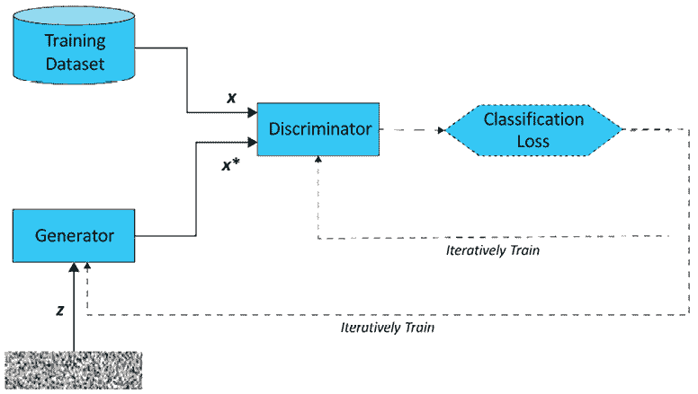

图 12.2：GAN 训练工作流程（虚线表示训练，实线表示过程）

在上述场景中，当鉴别器能够非常好地检测生成的图像时，与生成器相关的损失要比与鉴别器相关的损失高得多。因此，梯度调整得使得生成器的损失更低。然而，这会使得鉴别器的损失偏高。在下一次迭代中，梯度会调整，以使得鉴别器的损失更低。这样一来，生成器和鉴别器不断训练，直到生成器生成逼真图像，而鉴别器无法区分真实图像和生成图像。

在了解这些之后，让我们在下一节生成与 MNIST 数据集相关的图像。

# 使用 GAN 生成手写数字。

要生成手写数字图像，我们将利用前一节学习的同一网络。我们将采用以下策略：

1.  导入 MNIST 数据。

1.  初始化随机噪声。

1.  定义生成器模型。

1.  定义鉴别器模型。

1.  交替训练两个模型。

1.  让模型训练，直到生成器和鉴别器的损失大致相同。

让我们在下面的代码中执行上述每个步骤。

本书 GitHub 存储库中的`Chapter12`文件夹中提供了`Handwritten_digit_generation_using_GAN.ipynb`代码：[`bit.ly/mcvp-2e`](https://bit.ly/mcvp-2e)。代码相当冗长。我们强烈建议您在 GitHub 上执行此笔记本，以重现结果，并在理解步骤和文本中各种代码组件的解释时进行操作。

1.  导入相关包并定义设备：

    ```py
    !pip install -q torch_snippets
    from torch_snippets import *
    device = "cuda" if torch.cuda.is_available() else "cpu"
    from torchvision.utils import make_grid 
    ```

1.  导入`MNIST`数据，并使用内置数据转换定义数据加载器，以便将输入数据缩放到均值 0.5 和标准差 0.5：

    ```py
    from torchvision.datasets import MNIST
    from torchvision import transforms
    transform = transforms.Compose([
                    transforms.ToTensor(),
                    transforms.Normalize(mean=(0.5,), std=(0.5,))
            ])
    data_loader = torch.utils.data.DataLoader(MNIST('~/data', \
                           train=True, download=True, transform=transform), \
                           batch_size=128, shuffle=True, drop_last=True) 
    ```

1.  定义`Discriminator`模型类：

    ```py
    class Discriminator(nn.Module):
        def __init__(self):
            super().__init__()
            self.model = nn.Sequential( 
                                    nn.Linear(784, 1024),
                                    nn.LeakyReLU(0.2),
                                    nn.Dropout(0.3),
                                    nn.Linear(1024, 512),
                                    nn.LeakyReLU(0.2),
                                    nn.Dropout(0.3),
                                    nn.Linear(512, 256),
                                    nn.LeakyReLU(0.2),
                                    nn.Dropout(0.3),
                                    nn.Linear(256, 1),
                                    nn.Sigmoid()
                                )
        def forward(self, x): return self.model(x) 
    ```

鉴别器网络摘要如下：

在前述代码中，请注意，我们使用了`LeakyReLU`（关于不同类型 ReLU 激活的实证评估可在此处找到：[`arxiv.org/pdf/1505.00853`](https://arxiv.org/pdf/1505.00853)）作为激活函数，而不是`ReLU`。

1.  ```py
    !pip install torch_summary
    from torchsummary import summary
    discriminator = Discriminator().to(device)
    summary(discriminator,torch.zeros(1,784)) 
    ```

上述代码生成以下输出：

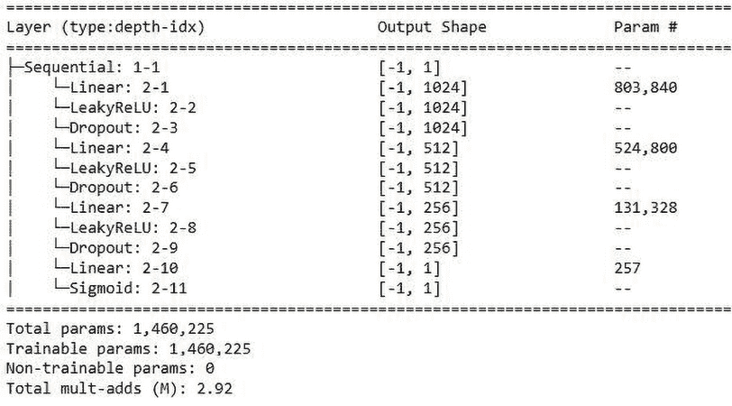

图 12.3：鉴别器架构摘要

1.  定义`Generator`模型类：

    ```py
    class Generator(nn.Module):
        def __init__(self):
            super().__init__()
            self.model = nn.Sequential(
                                    nn.Linear(100, 256),
                                    nn.LeakyReLU(0.2),
                                    nn.Linear(256, 512),
                                    nn.LeakyReLU(0.2),
                                    nn.Linear(512, 1024),
                                    nn.LeakyReLU(0.2),
                                    nn.Linear(1024, 784),
                                    nn.Tanh()
                                )
        def forward(self, x): return self.model(x) 
    ```

注意，生成器接受 100 维输入（即随机噪声），并从输入生成图像。生成器模型摘要如下：

1.  ```py
    generator = Generator().to(device)
    summary(generator,torch.zeros(1,100)) 
    ```

上述代码生成以下输出：

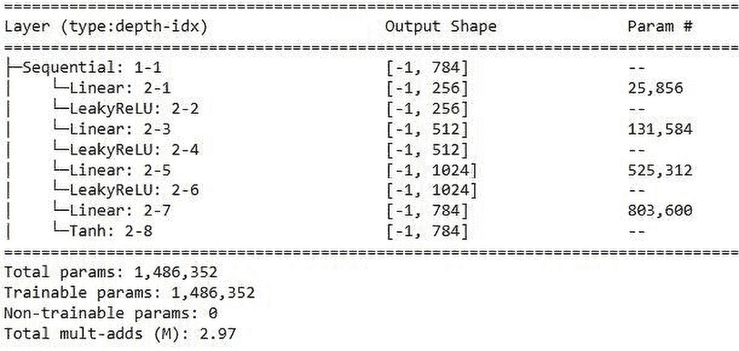

图 12.4：生成器架构摘要

1.  定义一个生成随机噪声并将其注册到设备的函数：

    ```py
    def noise(size):
        n = torch.randn(size, 100)
        return n.to(device) 
    ```

1.  定义训练鉴别器的函数如下：

    1.  鉴别器训练函数(`discriminator_train_step`)接受真实数据(`real_data`)和假数据(`fake_data`)作为输入：

    ```py
    def discriminator_train_step(real_data, fake_data): 
    ```

    1.  重置梯度：

    ```py
     d_optimizer.zero_grad() 
    ```

    1.  在进行损失值反向传播之前，在真数据(`real_data`)上进行预测并计算损失(`error_real`)：

    ```py
     prediction_real = discriminator(real_data)
            error_real = loss(prediction_real, \
                              torch.ones(len(real_data),1).to(device))
            error_real.backward() 
    ```

    当我们计算真实数据上的鉴别器损失时，我们期望鉴别器预测输出为`1`。因此，在鉴别器训练期间，通过使用`torch.ones`来计算真实数据上的鉴别器损失，预期鉴别器预测输出为`1`。

    1.  在进行损失值反向传播之前，在假数据(`fake_data`)上进行预测并计算损失(`error_fake`)：

    ```py
     prediction_fake = discriminator(fake_data)
            error_fake = loss(prediction_fake, \
                        torch.zeros(len(fake_data),1).to(device))
            error_fake.backward() 
    ```

    当我们计算假数据上的鉴别器损失时，我们期望鉴别器预测输出为`0`。因此，在鉴别器训练期间，通过使用`torch.zeros`来计算假数据上的鉴别器损失，预期鉴别器预测输出为`0`。

    1.  更新权重并返回总体损失（将`error_real`在`real_data`上的损失值与`error_fake`在`fake_data`上的损失值相加）：

    ```py
     d_optimizer.step()
            return error_real + error_fake 
    ```

1.  以以下方式训练生成器模型：

    1.  定义生成器训练函数(`generator_train_step`)，接受假数据(`fake_data`)作为输入：

    ```py
    def generator_train_step(fake_data): 
    ```

    1.  重置生成器优化器的梯度：

    ```py
     g_optimizer.zero_grad() 
    ```

    1.  预测鉴别器在虚假数据（`fake_data`）上的输出：

    ```py
     prediction = discriminator(fake_data) 
    ```

    1.  通过传递`prediction`和期望值作为`torch.ones`来计算生成器损失值，因为我们希望在训练生成器时愚弄鉴别器输出值为`1`：

    ```py
     error = loss(prediction, torch.ones(len(real_data),1).to(device)) 
    ```

    1.  执行反向传播，更新权重，并返回错误：

    ```py
     error.backward()
        g_optimizer.step()
        return error 
    ```

1.  定义模型对象，每个生成器和鉴别器的优化器，以及优化损失函数：

    ```py
    discriminator = Discriminator().to(device)
    generator = Generator().to(device)
    d_optimizer= optim.Adam(discriminator.parameters(),lr=0.0002)
    g_optimizer = optim.Adam(generator.parameters(), lr=0.0002)
    loss = nn.BCELoss()
    num_epochs = 200
    log = Report(num_epochs) 
    ```

1.  在增加的 epochs 上运行模型：

    1.  循环通过 200 个 epochs（`num_epochs`）使用第 2 步获得的`data_loader`函数：

    ```py
    for epoch in range(num_epochs):
        N = len(data_loader)
        for i, (images, _) in enumerate(data_loader): 
    ```

    1.  加载真实数据（`real_data`）和虚假数据，其中虚假数据（`fake_data`）是通过将`noise`（批处理大小为`real_data`中的数据点数：`len(real_data)`）通过`generator`网络来获得的。注意，重要的是运行`fake_data.detach()`，否则训练将无法进行。在分离时，我们正在创建张量的新副本，以便在`discriminator_train_step`中调用`error.backward()`时，与生成器相关联的张量（用于创建`fake_data`）不受影响：

    ```py
     real_data = images.view(len(images), -1).to(device)
            fake_data=generator(noise(len(real_data))).to(device)
            fake_data = fake_data.detach() 
    ```

    1.  使用在第 6 步中定义的`discriminator_train_step`函数训练鉴别器：

    ```py
     d_loss=discriminator_train_step(real_data, fake_data) 
    ```

    1.  现在我们已经训练了鉴别器，让我们在这一步中训练生成器。从噪声数据生成一组新的虚假图像（`fake_data`），并使用第 6 步中定义的`generator_train_step`训练生成器：

    ```py
     fake_data=generator(noise(len(real_data))).to(device)
            g_loss = generator_train_step(fake_data) 
    ```

    1.  记录损失：

    ```py
     log.record(epoch+(1+i)/N, d_loss=d_loss.item(), \
                       g_loss=g_loss.item(), end='\r')
        log.report_avgs(epoch+1)
    log.plot_epochs(['d_loss', 'g_loss']) 
    ```

随着 epochs 的增加，鉴别器和生成器的损失如下（您可以参考书籍的数字版本获取彩色图像）：

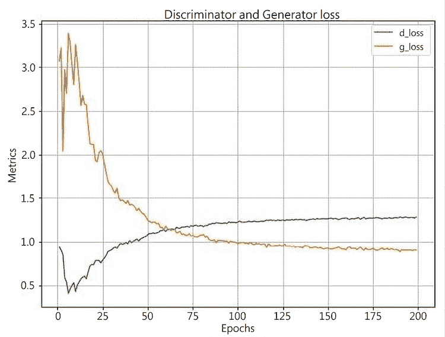

图 12.5：随着 epochs 增加的鉴别器和生成器损失

1.  可视化训练后的虚假数据：

    ```py
    z = torch.randn(64, 100).to(device)
    sample_images = generator(z).data.cpu().view(64, 1, 28, 28)
    grid = make_grid(sample_images, nrow=8, normalize=True)
    show(grid.cpu().detach().permute(1,2,0), sz=5) 
    ```

上述代码生成以下输出：

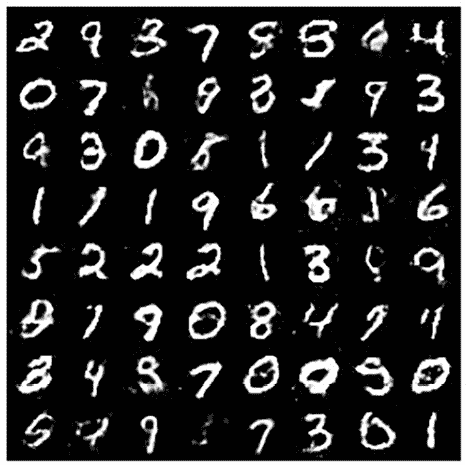

图 12.6：生成的数字

从这里我们可以看出，我们可以利用 GAN 生成逼真的图像，但仍然有一些改进的空间。在下一节中，我们将学习如何使用深度卷积 GAN 生成更逼真的图像。

# 使用 DCGAN 生成面部图像

在前一节中，我们学习了如何使用 GAN 生成图像。但是，我们已经在*第四章*，*引入卷积神经网络*中看到，卷积神经网络（CNNs）在图像背景下的表现比普通神经网络更好。在本节中，我们将学习如何使用深度卷积生成对抗网络（DCGANs）生成图像，这些网络在模型中使用卷积和池化操作。

首先，让我们了解我们将利用的技术，使用一组 100 个随机数生成图像（我们选择了 100 个随机数，以便网络有合理数量的值来生成图像。我们鼓励读者尝试不同数量的随机数并查看结果）。我们将首先将噪声转换为*批量大小 x 100 x 1 x 1*的形状。

在 DCGAN 中附加额外的通道信息而不在 GAN 部分中执行的原因是，我们将在本节中利用 CNN，它需要以批量大小 x 通道 x 高度 x 宽度的形式输入。

接下来，我们通过利用

`ConvTranspose2d`。正如我们在*第九章*，*图像分割*中学到的那样，`ConvTranspose2d` 执行的是卷积操作的相反操作，即使用预定义的内核大小、步长和填充来将输入的较小特征映射大小（高度 x 宽度）上采样到较大的大小。通过这种方式，我们逐渐将大小为批量大小 x 100 x 1 x 1 的随机噪声向量转换为批量大小 x 3 x 64 x 64 的图像。有了这个，我们已经将大小为 100 的随机噪声向量转换为一个人脸图像。 

在理解了这一点之后，现在让我们构建一个模型来生成人脸图像：

以下代码在本书 GitHub 存储库的 `Chapter12` 文件夹中的 `Face_generation_using_DCGAN.ipynb` 中作为可用。代码包含用于下载数据的 URL，并且长度适中。我们强烈建议您在 GitHub 上执行笔记本以重现结果，同时理解执行步骤和文本中各种代码组件的解释。

1.  下载并提取人脸图像（我们通过生成随机人物的面孔来整理的数据集）：

    ```py
    !wget https://www.dropbox.com/s/rbajpdlh7efkdo1/male_female_face_images.zip
    !unzip male_female_face_images.zip 
    ```

这里展示了一些图像的样本：

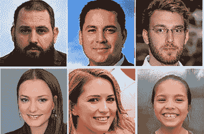

图 12.7：示例男性和女性图像

1.  导入相关包：

    ```py
    !pip install -q --upgrade torch_snippets
    from torch_snippets import *
    import torchvision
    from torchvision import transforms
    import torchvision.utils as vutils
    import cv2, numpy as np, pandas as pd
    device = "cuda" if torch.cuda.is_available() else "cpu" 
    ```

1.  定义数据集和数据加载器：

    1.  确保我们裁剪图像时仅保留人脸，并且丢弃图像中的额外细节。首先，我们将下载级联过滤器（有关级联过滤器的更多信息可以在 GitHub 上的《使用 OpenCV 工具进行图像分析》PDF 中找到），这将有助于识别图像中的人脸：

    ```py
    face_cascade = cv2.CascadeClassifier(cv2.data.haarcascades + \
                            'haarcascade_frontalface_default.xml') 
    ```

    1.  创建一个新文件夹，并将所有裁剪的人脸图像倒入到这个新文件夹中：

    ```py
    !mkdir cropped_faces
    images = Glob('/content/females/*.jpg') + \
                Glob('/content/males/*.jpg')
    for i in range(len(images)):
        img = read(images[i],1)
        gray = cv2.cvtColor(img, cv2.COLOR_BGR2GRAY)
        faces = face_cascade.detectMultiScale(gray, 1.3, 5)
        for (x,y,w,h) in faces:
            img2 = img[y:(y+h),x:(x+w),:]
        cv2.imwrite('cropped_faces/'+str(i)+'.jpg', \
                    cv2.cvtColor(img2, cv2.COLOR_RGB2BGR)) 
    ```

裁剪后的人脸样本如下：

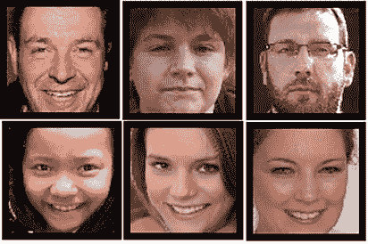

图 12.8：裁剪的男性和女性面孔

请注意，通过裁剪并仅保留面部，我们保留了我们希望生成的信息。这样，我们可以减少 DCGAN 需要学习的复杂性。

1.  指定在每个图像上执行的转换：

1.  ```py
    transform=transforms.Compose([
                                   transforms.Resize(64),
                                   transforms.CenterCrop(64),
                                   transforms.ToTensor(),
        transforms.Normalize((0.5, 0.5, 0.5), (0.5, 0.5, 0.5))]) 
    ```

1.  定义 `Faces` 数据集类：

1.  ```py
    class Faces(Dataset):
        def __init__(self, folder):
            super().__init__()
            self.folder = folder
            self.images = sorted(Glob(folder))
        def __len__(self):
            return len(self.images)
        def __getitem__(self, ix):
            image_path = self.images[ix]
            image = Image.open(image_path)
            image = transform(image)
            return image 
    ```

1.  创建数据集对象：`ds`：

1.  ```py
    ds = Faces(folder='cropped_faces/') 
    ```

1.  如下所示定义`dataloader`类：

1.  ```py
    dataloader = DataLoader(ds, batch_size=64, shuffle=True, num_workers=8) 
    ```

1.  定义权重初始化，使得权重的分布更小，正如在对抗训练部分的详细说明中提到的那样，参见[`arxiv.org/pdf/1511.06434`](https://arxiv.org/pdf/1511.06434)：

    ```py
    def weights_init(m):
        classname = m.__class__.__name__
        if classname.find('Conv') != -1:
            nn.init.normal_(m.weight.data, 0.0, 0.02)
        elif classname.find('BatchNorm') != -1:
            nn.init.normal_(m.weight.data, 1.0, 0.02)
            nn.init.constant_(m.bias.data, 0) 
    ```

1.  定义`Discriminator`模型类，接受形状为批量大小 x 3 x 64 x 64 的图像，并预测其真实性或伪造性：

    ```py
    class Discriminator(nn.Module):
        def __init__(self):
            super(Discriminator, self).__init__()
            self.model = nn.Sequential(
                nn.Conv2d(3,64,4,2,1,bias=False),
                nn.LeakyReLU(0.2,inplace=True),
                nn.Conv2d(64,64*2,4,2,1,bias=False),
                nn.BatchNorm2d(64*2),
                nn.LeakyReLU(0.2,inplace=True),
                nn.Conv2d(64*2,64*4,4,2,1,bias=False),
                nn.BatchNorm2d(64*4),
                nn.LeakyReLU(0.2,inplace=True),
                nn.Conv2d(64*4,64*8,4,2,1,bias=False),
                nn.BatchNorm2d(64*8),
                nn.LeakyReLU(0.2,inplace=True),
                nn.Conv2d(64*8,1,4,1,0,bias=False),
                nn.Sigmoid()
            )
            self.apply(weights_init)
        def forward(self, input): return self.model(input) 
    ```

获取定义模型的摘要：

1.  ```py
    !pip install torch_summary
    from torchsummary import summary
    discriminator = Discriminator().to(device)
    summary(discriminator,torch.zeros(1,3,64,64)); 
    ```

上述代码生成如下输出：

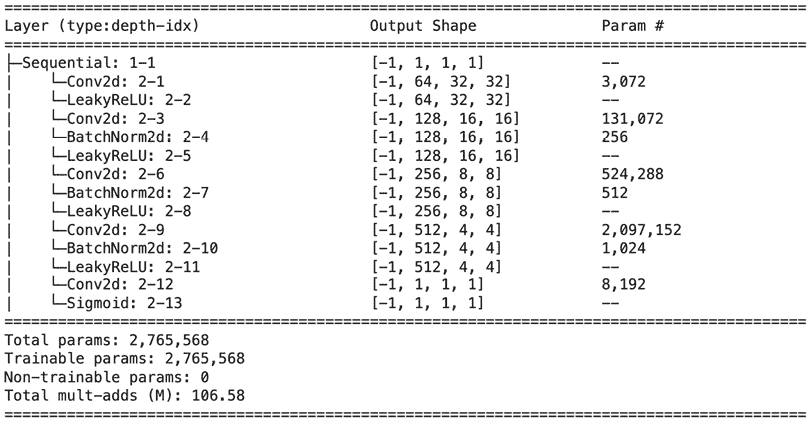

图 12.9: 鉴别器架构摘要

1.  定义`Generator`模型类，从形状为批量大小 x 100 x 1 x 1 的输入生成虚假图像：

    ```py
    class Generator(nn.Module):
        def __init__(self):
            super(Generator,self).__init__()
            self.model = nn.Sequential(
                nn.ConvTranspose2d(100,64*8,4,1,0,bias=False,),
                nn.BatchNorm2d(64*8),
                nn.ReLU(True),
                nn.ConvTranspose2d(64*8,64*4,4,2,1,bias=False),
                nn.BatchNorm2d(64*4),
                nn.ReLU(True),
                nn.ConvTranspose2d( 64*4,64*2,4,2,1,bias=False),
                nn.BatchNorm2d(64*2),
                nn.ReLU(True),
                nn.ConvTranspose2d( 64*2,64,4,2,1,bias=False),
                nn.BatchNorm2d(64),
                nn.ReLU(True),
                nn.ConvTranspose2d( 64,3,4,2,1,bias=False),
                nn.Tanh()
            )
            self.apply(weights_init)
        def forward(self,input): return self.model(input) 
    ```

获取定义模型的摘要：

1.  ```py
    generator = Generator().to(device)
    summary(generator,torch.zeros(1,100,1,1)) 
    ```

上述代码生成如下输出：

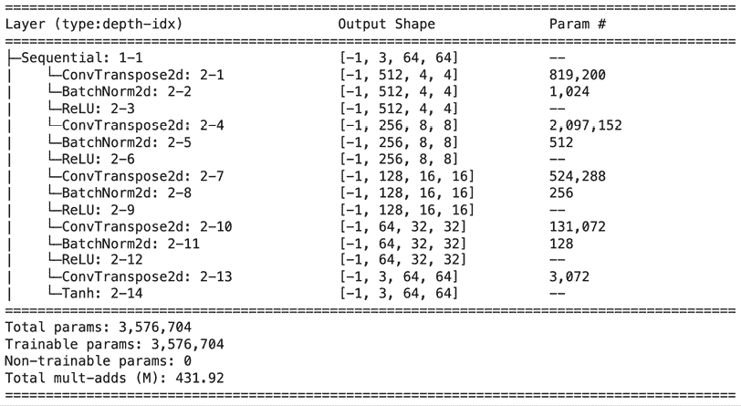

图 12.10: 生成器架构摘要

请注意，我们利用`ConvTranspose2d`逐渐上采样数组，使其尽可能地类似于图像。

1.  定义用于训练生成器（`generator_train_step`）和鉴别器（`discriminator_train_step`）的函数：

    ```py
    def discriminator_train_step(real_data, fake_data):
        d_optimizer.zero_grad()
        prediction_real = discriminator(real_data)
        error_real = loss(prediction_real.squeeze(), \
                          torch.ones(len(real_data)).to(device))
        error_real.backward()
        prediction_fake = discriminator(fake_data)
        error_fake = loss(prediction_fake.squeeze(), \
                          torch.zeros(len(fake_data)).to(device))
        error_fake.backward()
        d_optimizer.step()
        return error_real + error_fake
    def generator_train_step(fake_data):
        g_optimizer.zero_grad()
        prediction = discriminator(fake_data)
        error = loss(prediction.squeeze(), \
                     torch.ones(len(real_data)).to(device))
        error.backward()
        g_optimizer.step()
        return error 
    ```

在上述代码中，我们在模型输出上执行了`.squeeze`操作，因为模型的输出形状为批量大小 x 1 x 1 x 1，需要与形状为批量大小 x 1 的张量进行比较。

1.  创建生成器和鉴别器模型对象、优化器和要优化的鉴别器损失函数：

    ```py
    discriminator = Discriminator().to(device)
    generator = Generator().to(device)
    loss = nn.BCELoss()
    d_optimizer = optim.Adam(discriminator.parameters(), \
                             lr=0.0002, betas=(0.5, 0.999))
    g_optimizer = optim.Adam(generator.parameters(), \
                             lr=0.0002, betas=(0.5, 0.999)) 
    ```

1.  在逐步增加的周期上运行模型，如下所示：

    1.  循环通过*步骤 3*中定义的`dataloader`函数 25 个周期：

    ```py
    log = Report(25)
    for epoch in range(25):
        N = len(dataloader)
        for i, images in enumerate(dataloader): 
    ```

    1.  通过生成器网络传递真实数据（`real_data`）加载真实数据，并生成虚假数据（`fake_data`）：

    ```py
     real_data = images.to(device)
            fake_data = generator(torch.randn(len(real_data), 100, 1, \
                                        1).to(device)).to(device)
            fake_data = fake_data.detach() 
    ```

    请注意，当生成`real_data`时，普通 GAN 和 DCGAN 之间的主要区别在于，在 DCGAN 的情况下，我们不必展平`real_data`，因为我们正在利用 CNN。

    1.  使用*步骤 7*中定义的`discriminator_train_step`函数训练鉴别器：

    ```py
    d_loss=discriminator_train_step(real_data, fake_data) 
    ```

    1.  从嘈杂数据（`torch.randn(len(real_data))`）生成一组新图像（`fake_data`），并使用*步骤 7*中定义的`generator_train_step`函数训练生成器：

    ```py
    fake_data = generator(torch.randn(len(real_data), \
                        100, 1, 1).to(device)).to(device)
    g_loss = generator_train_step(fake_data) 
    ```

    1.  记录损失：

    ```py
     log.record(epoch+(1+i)/N, d_loss=d_loss.item(), \
                       g_loss=g_loss.item(), end='\r')
      log.report_avgs(epoch+1)
    log.plot_epochs(['d_loss','g_loss']) 
    ```

上述代码生成如下输出（您可以参考书籍的数字版本查看彩色图像）：

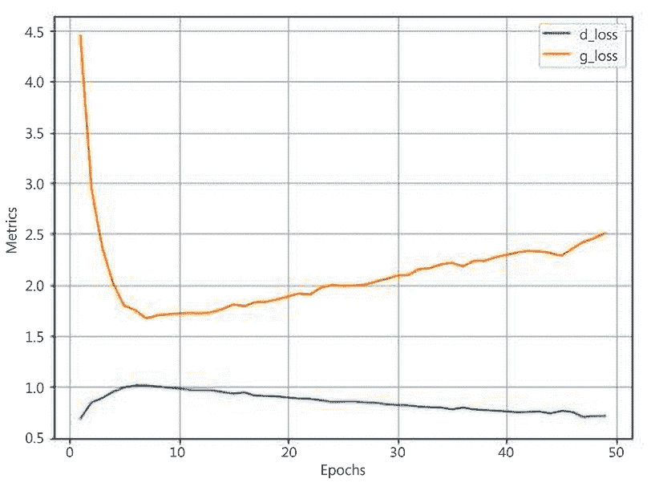

图 12.11: 随着训练周期增加，鉴别器和生成器的损失

请注意，在这种设置中，生成器和鉴别器损失的变化不遵循我们在手写数字生成情况下看到的模式，原因如下：

+   我们处理更大的图像（图像形状为 64 x 64 x 3，与前一节中的 28 x 28 x 1 形状的图像相比）。

+   与人脸图像中存在的特征相比，数字的变化较少。

+   与图像中的信息相比，手写数字中的信息仅在少数像素中可用。

一旦训练过程完成，使用以下代码生成一组样本图像：

```py
generator.eval()
noise = torch.randn(64, 100, 1, 1, device=device)
sample_images = generator(noise).detach().cpu()
grid = vutils.make_grid(sample_images,nrow=8,normalize=True)
show(grid.cpu().detach().permute(1,2,0), sz=10, \
     title='Generated images') 
```

前述代码生成了以下一组图像：

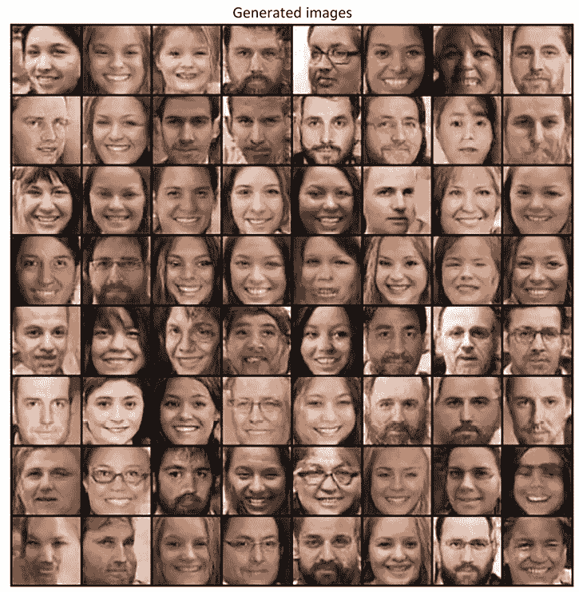

图 12.12：从训练过的 DCGAN 模型生成的图像

注意，尽管生成器从随机噪声生成了人脸图像，这些图像看起来还算不错，但仍然不够逼真。一个潜在的原因是并非所有输入图像都具有相同的面部对齐。作为练习，我们建议您仅在原始图像中没有倾斜面孔且人物直视摄像头的图像上训练 DCGAN。

此外，我们建议您尝试将生成图像与具有高鉴别器分数和低鉴别器分数的图像进行对比。

在这一部分中，我们已经学习了如何生成人脸的图像。然而，我们无法指定我们感兴趣的图像的生成（例如，一个有胡须的男人）。在接下来的部分中，我们将致力于生成特定类别的图像。

# 实现条件生成对抗网络

想象一种情景，我们想要生成我们感兴趣的类别的图像；例如，一只猫、一只狗，或者一位戴眼镜的男人的图像。我们如何指定我们想要生成我们感兴趣的图像呢？**条件生成对抗网络（Conditional GANs）**在这种情况下派上了用场。暂时假设我们只有男性和女性面部图像以及它们对应的标签。在这一部分中，我们将学习如何从随机噪声生成指定类别的图像。

我们采用的策略如下：

1.  指定我们要生成的图像的标签为独热编码版本。

1.  将标签通过嵌入层传递，以生成每个类别的多维表示。

1.  生成随机噪声并与上一步生成的嵌入层串联。

1.  训练模型的方法与前几节相同，但这次要将噪声向量与我们希望生成的图像类别的嵌入串联起来。

在下面的代码中，我们将编写前述策略：

此书的 GitHub 存储库中的 `Chapter12` 文件夹中提供了名为 `Face_generation_using_Conditional_GAN.ipynb` 的以下代码：[`bit.ly/mcvp-2e`](https://bit.ly/mcvp-2e)。我们强烈建议您在 GitHub 中执行此笔记本，以重现结果，同时理解执行步骤和文本中各种代码组件的解释。

1.  导入图像和相关包：

    ```py
    !wget https://www.dropbox.com/s/rbajpdlh7efkdo1/male_female_face_images.zip
    !unzip male_female_face_images.zip
    !pip install -q --upgrade torch_snippets
    from torch_snippets import *
    device = "cuda" if torch.cuda.is_available() else "cpu"
    from torchvision.utils import make_grid
    from torch_snippets import *
    from PIL import Image
    import torchvision
    from torchvision import transforms
    import torchvision.utils as vutils 
    ```

1.  创建数据集和数据加载器，如下所示：

    1.  存储男性和女性图像路径：

    ```py
    female_images = Glob('/content/females/*.jpg')
    male_images = Glob('/content/males/*.jpg') 
    ```

    1.  确保裁剪图像，仅保留面部并丢弃图像中的其他细节。首先，我们将下载级联滤波器（有关级联滤波器的更多信息可在 GitHub 上的 *Using OpenCV Utilities for Image Analysis* PDF 中找到，这将帮助识别图像中的面部）：

    ```py
    face_cascade = cv2.CascadeClassifier(cv2.data.haarcascades + \
                            'haarcascade_frontalface_default.xml') 
    ```

    1.  创建两个新文件夹（一个对应男性图像，另一个对应女性图像），并将所有裁剪后的面部图像转储到相应的文件夹中：

    ```py
    !mkdir cropped_faces_females
    !mkdir cropped_faces_males
    def crop_images(folder):
        images = Glob(folder+'/*.jpg')
        for i in range(len(images)):
            img = read(images[i],1)
            gray = cv2.cvtColor(img, cv2.COLOR_BGR2GRAY)
            faces = face_cascade.detectMultiScale(gray, 1.3, 5)
            for (x,y,w,h) in faces:
                img2 = img[y:(y+h),x:(x+w),:]
                cv2.imwrite('cropped_faces_'+folder+'/'+ \
                        str(i)+'.jpg',cv2.cvtColor(img2, cv2.COLOR_RGB2BGR))
    crop_images('females')
    crop_images('males') 
    ```

    1.  指定要在每个图像上执行的转换：

    ```py
    transform=transforms.Compose([
                                   transforms.Resize(64),
                                   transforms.CenterCrop(64),
                                   transforms.ToTensor(),
        transforms.Normalize((0.5, 0.5, 0.5), (0.5, 0.5, 0.5))]) 
    ```

    1.  创建 `Faces` 数据集类，返回图像及其中人物的性别：

    ```py
    class Faces(Dataset):
        def __init__(self, folders):
            super().__init__()
            self.folderfemale = folders[0]
            self.foldermale = folders[1]
            self.images = sorted(Glob(self.folderfemale)) + \
                            sorted(Glob(self.foldermale))
        def __len__(self):
            return len(self.images)
        def __getitem__(self, ix):
            image_path = self.images[ix]
            image = Image.open(image_path)
            image = transform(image)
            gender = np.where('female' in image_path,1,0)
            return image, torch.tensor(gender).long() 
    ```

    1.  定义 `ds` 数据集和 `dataloader`：

    ```py
    ds = Faces(folders=['cropped_faces_females', \
                        'cropped_faces_males'])
    dataloader = DataLoader(ds, batch_size=64, \
                            shuffle=True, num_workers=8) 
    ```

1.  定义权重初始化方法（就像我们在 *Using DCGANs to generate face images* 部分中所做的那样），以便随机初始化的权重值没有普遍变化：

    ```py
    def weights_init(m):
        classname = m.__class__.__name__
        if classname.find('Conv') != -1:
            nn.init.normal_(m.weight.data, 0.0, 0.02)
        elif classname.find('BatchNorm') != -1:
            nn.init.normal_(m.weight.data, 1.0, 0.02)
            nn.init.constant_(m.bias.data, 0) 
    ```

1.  如下定义 `Discriminator` 模型类：

    1.  定义模型架构：

    ```py
    class Discriminator(nn.Module):
        def __init__(self, emb_size=32):
            super(Discriminator, self).__init__()
            self.emb_size = 32
            self.label_embeddings = nn.Embedding(2, self.emb_size)
            self.model = nn.Sequential(
                nn.Conv2d(3,64,4,2,1,bias=False),
                nn.LeakyReLU(0.2,inplace=True),
                nn.Conv2d(64,64*2,4,2,1,bias=False),
                nn.BatchNorm2d(64*2),
                nn.LeakyReLU(0.2,inplace=True),
                nn.Conv2d(64*2,64*4,4,2,1,bias=False),
                nn.BatchNorm2d(64*4),
                nn.LeakyReLU(0.2,inplace=True),
                nn.Conv2d(64*4,64*8,4,2,1,bias=False),
                nn.BatchNorm2d(64*8),
                nn.LeakyReLU(0.2,inplace=True),
                nn.Conv2d(64*8,64,4,2,1,bias=False),
                nn.BatchNorm2d(64),
                nn.LeakyReLU(0.2,inplace=True),
                nn.Flatten()
            )
            self.model2 = nn.Sequential(
                nn.Linear(288,100),
                nn.LeakyReLU(0.2,inplace=True),
                nn.Linear(100,1),
                nn.Sigmoid()
            )
            self.apply(weights_init) 
    ```

    1.  注意，在模型类中，我们有一个额外的参数 `emb_size`，它存在于条件 GAN 中，而不是 DCGAN 中。`emb_size` 表示我们将输入类标签（我们要生成的图像类的类别）转换为的嵌入数量，这些嵌入存储为 `label_embeddings`。我们将输入类标签从一热编码版本转换为更高维度的嵌入的原因是，模型具有更高的自由度来学习和调整以处理不同的类别。

        虽然模型类在很大程度上与我们在 DCGAN 中看到的相同，我们正在初始化另一个模型 (`model2`)，这个模型执行分类任务。在我们讨论完 `forward` 方法后，将详细介绍第二个模型如何帮助解释。在你阅读下面的 `forward` 方法和模型摘要后，你也会理解为什么 `self.model2` 有 288 个输入值。

    1.  定义 `forward` 方法，接受图像及其标签作为输入：

    ```py
    def forward(self, input, labels):
        x = self.model(input)
        y = self.label_embeddings(labels)
        input = torch.cat([x, y], 1)
        final_output = self.model2(input)
        return final_output 
    ```

    1.  在定义的 `forward` 方法中，我们获取第一个模型的输出 (`self.model(input)`) 和通过 `label_embeddings` 传递 `labels` 的输出，然后连接这些输出。接下来，我们通过早期定义的第二个模型 (`self.model2`) 传递连接的输出，它获取我们的判别器输出。

    1.  获取定义模型的摘要：

    ```py
    !pip install torch_summary
    from torchsummary import summary
    discriminator = Discriminator().to(device)
    summary(discriminator,torch.zeros(32,3,64,64).to(device), \
            torch.zeros(32).long().to(device)); 
    ```

上述代码生成以下输出：

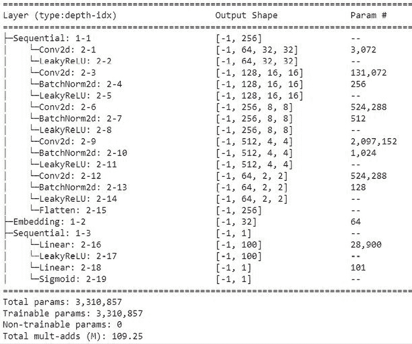

图 12.13：判别器架构摘要

注意，`self.model2` 接受 288 个值作为输入，因为 `self.model` 的输出每个数据点有 256 个值，然后与输入类标签的 32 个嵌入值连接，结果是 256 + 32 = 288 个输入值给 `self.model2`。

1.  定义 `Generator` 网络类：

    1.  定义 `__init__` 方法：

    ```py
    class Generator(nn.Module):
        def __init__(self, emb_size=32):
            super(Generator,self).__init__()
            self.emb_size = emb_size
            self.label_embeddings = nn.Embedding(2, self.emb_size) 
    ```

    1.  注意，在前述代码中，我们使用`nn.Embedding`将 2D 输入（即类别）转换为 32 维向量(`self.emb_size`)。

    ```py
     self.model = nn.Sequential(
                nn.ConvTranspose2d(100+self.emb_size,\
                                   64*8,4,1,0,bias=False),
                nn.BatchNorm2d(64*8),
                nn.ReLU(True),
                nn.ConvTranspose2d(64*8,64*4,4,2,1,bias=False),
                nn.BatchNorm2d(64*4),
                nn.ReLU(True),
                nn.ConvTranspose2d(64*4,64*2,4,2,1,bias=False),
                nn.BatchNorm2d(64*2),
                nn.ReLU(True),
                nn.ConvTranspose2d(64*2,64,4,2,1,bias=False),
                nn.BatchNorm2d(64),
                nn.ReLU(True),
                nn.ConvTranspose2d(64,3,4,2,1,bias=False),
                nn.Tanh()
            ) 
    ```

    1.  注意，在前述代码中，我们利用了`nn.ConvTranspose2d`来向上缩放以获取图像作为输出。

    1.  应用权重初始化：

    ```py
     self.apply(weights_init) 
    ```

    1.  定义`forward`方法，该方法接受噪声值(`input_noise`)和输入标签(`labels`)作为输入，并生成图像的输出：

    ```py
    def forward(self,input_noise,labels):
        label_embeddings = self.label_embeddings(labels).view(len(labels), \
                                  self.emb_size,1, 1)
        input = torch.cat([input_noise, label_embeddings], 1)
        return self.model(input) 
    ```

    1.  获取所定义的`generator`函数的摘要：

    ```py
    generator = Generator().to(device)
    summary(generator,torch.zeros(32,100,1,1).to(device), \
            torch.zeros(32).long().to(device)); 
    ```

前述代码生成如下输出：

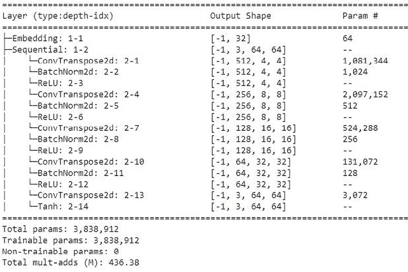

图 12.14：生成器架构摘要

1.  定义一个函数(`noise`)，用于生成具有 100 个值的随机噪声，并将其注册到设备上：

    ```py
    def noise(size):
        n = torch.randn(size, 100, 1, 1, device=device)
        return n.to(device) 
    ```

1.  定义训练鉴别器的函数：`discriminator_train_step`：

    1.  鉴别器接受四个输入——真实图像(`real_data`)、真实标签(`real_labels`)、虚假图像(`fake_data`)和虚假标签(`fake_labels`)：

    ```py
    def discriminator_train_step(real_data, real_labels, \
                                 fake_data, fake_labels):
        d_optimizer.zero_grad() 
    ```

    在这里，我们正在重置鉴别器对应的梯度。

    1.  计算在真实数据(`prediction_real`通过`discriminator`网络时的损失值。将输出的损失值与期望值`(torch.ones(len(real_data),1).to(device))`进行比较，以获取`error_real`，然后执行反向传播：

    ```py
    prediction_real = discriminator(real_data, real_labels)
    error_real = loss(prediction_real, \
                      torch.ones(len(real_data),1).to(device))
    error_real.backward() 
    ```

    1.  计算在虚假数据(`prediction_fake`通过`discriminator`网络时的损失值。将输出的损失值与期望值`(torch.zeros(len(fake_data),1).to(device))`进行比较，以获取`error_fake`，然后执行反向传播：

    ```py
    prediction_fake = discriminator(fake_data, fake_labels)
    error_fake = loss(prediction_fake, \
                    torch.zeros(len(fake_data),1).to(device))
    error_fake.backward() 
    ```

    1.  更新权重并返回损失值：

    ```py
    d_optimizer.step()    
    return error_real + error_fake 
    ```

1.  定义生成器的训练步骤，其中我们将虚假图像(`fake_data`)与虚假标签(`fake_labels`)作为输入传递：

    ```py
    def generator_train_step(fake_data, fake_labels):
        g_optimizer.zero_grad()
        prediction = discriminator(fake_data, fake_labels)
        error = loss(prediction, \
                     torch.ones(len(fake_data), 1).to(device))
        error.backward()
        g_optimizer.step()
        return error 
    ```

注意，`generator_train_step`函数类似于`discriminator_train_step`，唯一的区别在于这里期望输出为`torch.ones(len(fake_data),1).to(device))`，因为我们正在训练生成器。

1.  定义`generator`和`discriminator`模型对象、损失优化器和`loss`函数：

    ```py
    discriminator = Discriminator().to(device)
    generator = Generator().to(device)
    loss = nn.BCELoss()
    d_optimizer = optim.Adam(discriminator.parameters(), \
                             lr=0.0002, betas=(0.5, 0.999))
    g_optimizer = optim.Adam(generator.parameters(), \
                             lr=0.0002, betas=(0.5, 0.999))
    fixed_noise = torch.randn(64, 100, 1, 1, device=device)
    fixed_fake_labels = torch.LongTensor([0]* (len(fixed_noise)//2) \
                        + [1]*(len(fixed_noise)//2)).to(device)
    loss = nn.BCELoss()
    n_epochs = 25
    img_list = [] 
    ```

在前述代码中，在定义`fixed_fake_labels`时，我们指定一半图像对应于一类（类 0），其余图像对应于另一类（类 1）。此外，我们定义了`fixed_noise`，将用于从随机噪声生成图像。

1.  在增加的 epochs (`n_epochs`)上训练模型：

    1.  指定`dataloader`的长度：

    ```py
    log = Report(n_epochs)
    for epoch in range(n_epochs):
        N = len(dataloader) 
    ```

    1.  循环遍历图像批次及其标签：

    ```py
     for bx, (images, labels) in enumerate(dataloader): 
    ```

    1.  指定`real_data`和`real_labels`：

    ```py
     real_data, real_labels = images.to(device), labels.to(device) 
    ```

    1.  初始化`fake_data`和`fake_labels`：

    ```py
     fake_labels = torch.LongTensor(np.random.randint(0, \
                            2,len(real_data))).to(device)
            fake_data=generator(noise(len(real_data)),fake_labels)
            fake_data = fake_data.detach() 
    ```

    1.  使用在*步骤 7*中定义的`discriminator_train_step`函数训练鉴别器以计算鉴别器损失(`d_loss`)：

    ```py
     d_loss = discriminator_train_step(real_data, \
                    real_labels, fake_data, fake_labels) 
    ```

    1.  重新生成虚假图像 (`fake_data`) 和虚假标签 (`fake_labels`)，并使用在 *步骤 8* 中定义的 `generator_train_step` 函数来计算生成器损失 (`g_loss`)：

    ```py
     fake_labels = torch.LongTensor(np.random.randint(0, \
                            2,len(real_data))).to(device)
            fake_data = generator(noise(len(real_data)), \
                                            fake_labels).to(device)
            g_loss = generator_train_step(fake_data, fake_labels) 
    ```

    1.  记录如下损失指标：

    ```py
     pos = epoch + (1+bx)/N
            log.record(pos, d_loss=d_loss.detach(), \
                   g_loss=g_loss.detach(), end='\r')
        log.report_avgs(epoch+1) 
    ```

1.  一旦训练模型，生成男性和女性图像：

    ```py
     with torch.no_grad():
            fake = generator(fixed_noise, fixed_fake_labels).detach().cpu()
            imgs = vutils.make_grid(fake, padding=2, \
                                normalize=True).permute(1,2,0)
            img_list.append(imgs)
            show(imgs, sz=10) 
    ```

在上述代码中，我们将噪声 (`fixed_noise`) 和标签 (`fixed_fake_labels`) 传递给生成器，以获取在训练模型 25 个周期后的 `fake` 图像，结果如下：

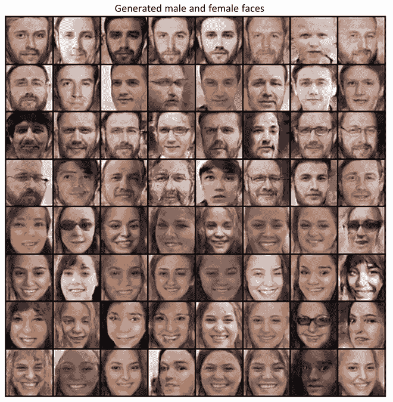

图 12.15：生成的男性和女性面孔

从上述图像中，我们可以看到前 32 张图像对应于男性图像，接下来的 32 张图像对应于女性图像，这证实了条件 GAN 的表现符合预期。

# 总结

在本章中，我们学习了如何利用两个不同的神经网络使用 GAN 生成手写数字的新图像。接下来，我们使用 DCGAN 生成逼真的面孔。最后，我们学习了条件 GAN，这有助于我们生成特定类别的图像。尽管我们使用不同的技术生成图像，但我们仍然发现生成的图像不够逼真。此外，在条件 GAN 中，虽然我们通过指定要生成的图像类别来生成图像，但我们仍无法执行图像翻译，即要求替换图像中的一个对象，并保留其他一切。此外，我们还没有一种图像生成机制，其中要生成的类别（风格）更无监督。

在下一章中，我们将学习使用一些最新变体的 GAN 生成更逼真的图像。此外，我们将学习以更无监督的方式生成不同风格的图像。

# 问题

1.  如果生成器和鉴别器模型的学习率很高会发生什么？

1.  在生成器和鉴别器都经过充分训练的情况下，给定图像是真实的概率是多少？

1.  为什么在生成图像时要使用 `ConvTranspose2d`？

1.  为什么在条件 GAN 中的嵌入大小比类别数高？

1.  如何生成带胡须的男性图像？

1.  为什么在生成器的最后一层使用 Tanh 激活而不是 ReLU 或 sigmoid？

1.  即使我们没有对生成的数据进行反归一化，为什么我们仍然得到逼真的图像？

1.  如果在训练 GAN 前不裁剪与图像对应的面部会发生什么？

1.  在训练生成器时，为什么鉴别器的权重不会得到更新（因为 `generator_train_step` 函数涉及鉴别器网络）？

1.  在训练鉴别器时为什么要获取真实图像和虚假图像的损失，而在训练生成器时只获取虚假图像的损失？

# 在 Discord 上了解更多信息

加入我们社区的 Discord 空间，与作者和其他读者进行讨论：

[`packt.link/modcv`](https://packt.link/modcv)


