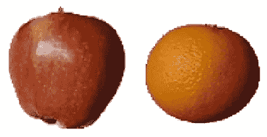

# 13

# 高级 GAN 用于图像操作

在前一章中，我们学习了如何利用**生成对抗网络**（**GANs**）生成逼真图像。在本章中，我们将学习如何利用 GANs 来操作图像。我们将学习使用 GANs 生成图像的两种变体方法——配对方法和非配对方法。在配对方法中，我们将提供输入和输出的组合对，以生成基于输入图像的新图像，我们将在**Pix2Pix GAN**中学习到。在非配对方法中，我们将指定输入和输出；然而，我们不会提供输入和输出之间的一对一对应关系，而是期望 GAN 学习两类的结构，并将一个类别的图像转换为另一个类别的图像，这是我们讨论**CycleGAN**时将要学习的内容。

另一种非配对图像操作的类别涉及从随机向量的潜在空间生成图像，并查看随着潜在向量值的变化图像如何改变，这是我们在*利用 StyleGAN 在自定义图像上*部分将要学习的内容。最后，我们将学习如何利用预训练的 GAN——**超分辨率生成对抗网络**（**SRGAN**），将低分辨率图像转换为高分辨率图像。

具体来说，我们将学习以下主题：

+   利用 Pix2Pix GAN 将草图/边缘图片转换为图片

+   利用 CycleGAN 将苹果转换为橙子，反之亦然

+   利用 StyleGAN 在自定义图像上改变图像表情

+   使用 SRGAN 对图像进行超分辨率处理

    本章中的所有代码片段都可以在 GitHub 仓库的`Chapter13`文件夹中找到，网址是[`bit.ly/mcvp-2e`](https://bit.ly/mcvp-2e)。

# 利用 Pix2Pix GAN

想象一种情景，我们有一对彼此相关的图像（例如，一个对象边缘的图像作为输入，实际对象图像作为输出）。面临的挑战是，我们希望根据对象边缘的输入图像生成一张图像。在传统设置中，这将是一个简单的输入到输出的映射，因此是一个监督学习问题。然而，假设你正在与一个试图为产品设计新外观的创意团队合作。在这种情况下，监督学习并没有太多帮助，因为它只从历史中学习。这里 GAN 会很有用，因为它确保生成的图像看起来逼真，并为实验留下空间（因为我们希望检查生成的图像是否类似于我们想要生成的图像）。具体来说，Pix2Pix GAN 在需要从另一个仅包含边缘（或轮廓）图像生成图像的情景中非常有用。

在本节中，我们将了解用于从鞋类图像的手绘边缘生成鞋类图像的架构。我们将采用以下策略来从手绘的草图生成逼真图像：

1.  从大量实际图像中获取，并使用标准的`cv2`边缘检测技术创建相应的边缘。

1.  从原始图像的补丁中采样颜色，以使生成器知道生成哪些颜色。

1.  建立一个 UNet 架构，该架构以带有样本补丁颜色的边缘作为输入，并预测相应的图像 - 这是我们的生成器。

1.  构建一个鉴别器架构，它接受图像并预测其真实性。

1.  训练生成器和鉴别器，使之达到生成可以欺骗鉴别器的图像的能力。

让我们编写策略：

以下代码可作为本书 GitHub 存储库中`Chapter13`文件夹中的`Pix2Pix_GAN.ipynb`获取：[`bit.ly/mcvp-2e`](https://bit.ly/mcvp-2e) 该代码包含从中下载数据的 URL，长度适中。我们强烈建议您在 GitHub 上执行笔记本以在按照步骤执行并阅读文本中各种代码部分的解释时重现结果。

1.  导入数据集（在此处可用：[`sketchx.eecs.qmul.ac.uk/downloads/`](https://sketchx.eecs.qmul.ac.uk/downloads/)），并安装相关的包：

    ```py
    !wget https://www.dropbox.com/s/g6b6gtvmdu0h77x/ShoeV2_photo.zip
    !pip install torch_snippets
    !pip install torch_summary
    from torch_snippets import *
    device = 'cuda' if torch.cuda.is_available() else 'cpu' 
    ```

上述代码下载了鞋类图像。下载的图像样本如下所示：


图 13.1：样本图像

对于我们的问题，我们希望根据鞋子的边缘和一些样本补丁颜色绘制鞋子。在下一步中，我们将从鞋类图像中获取边缘。这样，我们可以训练一个模型，从鞋子的边缘和样本补丁颜色中重建出鞋子的图像。

1.  定义一个函数，从下载的图像中获取边缘：

    ```py
    def detect_edges(img):
        img_gray = cv2.cvtColor(img, cv2.COLOR_RGB2GRAY)
        img_gray = cv2.bilateralFilter(img_gray, 5, 50, 50)
        img_gray_edges = cv2.Canny(img_gray, 45, 100)
        # invert black/white
        img_gray_edges = cv2.bitwise_not(img_gray_edges)         
        img_edges=cv2.cvtColor(img_gray_edges, cv2.COLOR_GRAY2RGB)
        return img_edges 
    ```

在上述代码中，我们利用 OpenCV 包中提供的各种方法从图像中获取边缘（有关 OpenCV 方法的详细信息，请参见 GitHub 存储库中“第一版额外章节”文件夹中的 OpenCV 章节）。

1.  定义图像转换流水线，对数据集进行预处理和标准化（`preprocess`和`normalize`）：

    ```py
    IMAGE_SIZE = 256
    preprocess = T.Compose([
                 T.Lambda(lambda x: torch.Tensor(x.copy())\
                           .permute(2, 0, 1).to(device))])
    normalize = lambda x: (x - 127.5)/127.5 
    ```

1.  定义数据集类（`ShoesData`）。此数据集类返回原始图像和带有边缘的图像。我们将向网络传递的一个额外细节是一些颜色补丁，这些补丁出现在随机选择的区域中。这样，我们使用户能够从手绘的轮廓图像中取出所需颜色并在图像的不同部分中添加，从而生成新的图像。

    此处显示了一个示例输入（第一幅图像）和输出（第三幅图像）（您可以在本书的数字版中以彩色查看）：

    

    图 13.2：（左）原始图像；（中）原始图像的轮廓；（右）带有颜色信息的轮廓图像

    然而，我们拥有的输入图像只是鞋子的图像（最左边的图像），我们将用它来提取鞋子的边缘（中间的图像）。接下来，我们将在下一步中撒上颜色，以获取原始图像的颜色信息（最右边的图像）。当右边的图像通过我们的网络时，应该生成左边的图像。在下面的代码中，我们将构建一个类，该类接受轮廓图像，撒上颜色，并返回撒上颜色的图像对和原始鞋子图像（生成包含轮廓图像的图像）：

1.  定义 `ShoesData` 类、`__init__` 方法和 `__len__` 方法：

1.  ```py
    class ShoesData(Dataset):
        def __init__(self, items):
            self.items = items
        def __len__(self): return len(self.items) 
    ```

1.  定义 `__getitem__` 方法。在这个方法中，我们将处理输入图像以获取带有边缘的图像，然后在原始图像中撒上颜色。在这里，我们获取给定图像的边缘：

1.  ```py
     def __getitem__(self, ix):
            f = self.items[ix]
            try: im = read(f, 1)
            except:
                blank = preprocess(Blank(IMAGE_SIZE, IMAGE_SIZE, 3))
                return blank, blank
            edges = detect_edges(im) 
    ```

1.  一旦我们获取了图像中的边缘，我们会调整大小并对图像进行归一化处理：

1.  ```py
     im, edges = resize(im, IMAGE_SIZE), resize(edges, IMAGE_SIZE)
            im, edges = normalize(im), normalize(edges) 
    ```

1.  在 `edges` 图像上撒上颜色，并预处理原始图像和 `edges` 图像：

1.  ```py
     self._draw_color_circles_on_src_img(edges, im)
            im, edges = preprocess(im), preprocess(edges)
            return edges, im 
    ```

1.  定义撒上颜色的函数：

1.  ```py
     def _draw_color_circles_on_src_img(self, img_src,
                                           img_target):
            non_white_coords = self._get_non_white_coordinates(img_target)
            for center_y, center_x in non_white_coords:
                self._draw_color_circle_on_src_img(img_src,
                            img_target, center_y, center_x)
        def _get_non_white_coordinates(self, img):
            non_white_mask = np.sum(img, axis=-1) < 2.75
            non_white_y, non_white_x = np.nonzero(non_white_mask)
            # randomly sample non-white coordinates
            n_non_white = len(non_white_y)
            n_color_points = min(n_non_white, 300)
            idxs = np.random.choice(n_non_white, n_color_points, 
                                                  replace=False)
            non_white_coords = list(zip(non_white_y[idxs],
                                        non_white_x[idxs]))
            return non_white_coords
        def _draw_color_circle_on_src_img(self, img_src,
                                img_target, center_y, center_x):
            assert img_src.shape == img_target.shape
            y0, y1, x0, x1= self._get_color_point_bbox_coords(center_y,                                                          center_x)
            color= np.mean(img_target[y0:y1, x0:x1],axis=(0, 1))
            img_src[y0:y1, x0:x1] = color
        def _get_color_point_bbox_coords(self, center_y,center_x):
            radius = 2
            y0 = max(0, center_y-radius+1)
            y1 = min(IMAGE_SIZE, center_y+radius)
            x0 = max(0, center_x-radius+1)
            x1 = min(IMAGE_SIZE, center_x+radius)
            return y0, y1, x0, x1
        def choose(self): return self[randint(len(self))] 
    ```

1.  定义训练和验证数据的对应数据集和数据加载器：

    ```py
    from sklearn.model_selection import train_test_split
    train_items, val_items = train_test_split(Glob('ShoeV2_photo/*.png'),
                             test_size=0.2, random_state=2)
    trn_ds, val_ds = ShoesData(train_items), ShoesData(val_items)
    trn_dl = DataLoader(trn_ds, batch_size=32, shuffle=True)
    val_dl = DataLoader(val_ds, batch_size=32, shuffle=True) 
    ```

1.  定义生成器和鉴别器架构，这些架构使用权重初始化 (`weights_init_normal`)、`UNetDown` 和 `UNetUp` 架构，正如我们在 *第九章*、“图像分割” 和 *第十章*、“目标检测和分割的应用” 中定义 `GeneratorUNet` 和 `Discriminator` 架构：

    1.  初始化权重，使其遵循正态分布：

    ```py
    def weights_init_normal(m):
        classname = m.__class__.__name__
        if classname.find("Conv") != -1:
            torch.nn.init.normal_(m.weight.data, 0.0, 0.02)
        elif classname.find("BatchNorm2d") != -1:
            torch.nn.init.normal_(m.weight.data, 1.0, 0.02)
            torch.nn.init.constant_(m.bias.data, 0.0) 
    ```

    1.  定义 `UnetDown` 和 `UNetUp` 类：

    ```py
    class UNetDown(nn.Module):
        def __init__(self, in_size, out_size, normalize=True, dropout=0.0):
            super(UNetDown, self).__init__()
            layers = [nn.Conv2d(in_size, out_size, 4, 2, 1, bias=False)]
            if normalize:
                layers.append(nn.InstanceNorm2d(out_size))
            layers.append(nn.LeakyReLU(0.2))
            if dropout:
                layers.append(nn.Dropout(dropout))
            self.model = nn.Sequential(*layers)
        def forward(self, x):
            return self.model(x)
    class UNetUp(nn.Module):
        def __init__(self, in_size, out_size, dropout=0.0):
            super(UNetUp, self).__init__()
            layers = [
                nn.ConvTranspose2d(in_size, out_size, 4, 2, 1, bias=False),
                nn.InstanceNorm2d(out_size),
                nn.ReLU(inplace=True),
            ]
            if dropout:
                layers.append(nn.Dropout(dropout))
            self.model = nn.Sequential(*layers)
        def forward(self, x, skip_input):
            x = self.model(x)
            x = torch.cat((x, skip_input), 1)
            return x 
    ```

    1.  定义 `GeneratorUNet` 类：

    ```py
    class GeneratorUNet(nn.Module):
        def __init__(self, in_channels=3, out_channels=3):
            super(GeneratorUNet, self).__init__()
            self.down1 = UNetDown(in_channels, 64,normalize=False)
            self.down2 = UNetDown(64, 128)
            self.down3 = UNetDown(128, 256)
            self.down4 = UNetDown(256, 512, dropout=0.5)
            self.down5 = UNetDown(512, 512, dropout=0.5)
            self.down6 = UNetDown(512, 512, dropout=0.5)
            self.down7 = UNetDown(512, 512, dropout=0.5)
            self.down8 = UNetDown(512, 512, normalize=False, dropout=0.5)
            self.up1 = UNetUp(512, 512, dropout=0.5)
            self.up2 = UNetUp(1024, 512, dropout=0.5)
            self.up3 = UNetUp(1024, 512, dropout=0.5)
            self.up4 = UNetUp(1024, 512, dropout=0.5)
            self.up5 = UNetUp(1024, 256)
            self.up6 = UNetUp(512, 128)
            self.up7 = UNetUp(256, 64)
            self.final = nn.Sequential(
                nn.Upsample(scale_factor=2),
                nn.ZeroPad2d((1, 0, 1, 0)),
                nn.Conv2d(128, out_channels, 4, padding=1),
                nn.Tanh(),
            )
        def forward(self, x):
            d1 = self.down1(x)
            d2 = self.down2(d1)
            d3 = self.down3(d2)
            d4 = self.down4(d3)
            d5 = self.down5(d4)
            d6 = self.down6(d5)
            d7 = self.down7(d6)
            d8 = self.down8(d7)
            u1 = self.up1(d8, d7)
            u2 = self.up2(u1, d6)
            u3 = self.up3(u2, d5)
            u4 = self.up4(u3, d4)
            u5 = self.up5(u4, d3)
            u6 = self.up6(u5, d2)
            u7 = self.up7(u6, d1)
            return self.final(u7) 
    ```

    1.  定义 `Discriminator` 类：

    ```py
    class Discriminator(nn.Module):
        def __init__(self, in_channels=3):
            super(Discriminator, self).__init__()
            def discriminator_block(in_filters, out_filters, 
                                          normalization=True):
                """Returns downsampling layers of each
                discriminator block"""
                layers = [nn.Conv2d(in_filters, out_filters, 4, 
                                          stride=2, padding=1)]
                if normalization:
                   layers.append(nn.InstanceNorm2d(out_filters))
                layers.append(nn.LeakyReLU(0.2, inplace=True))
                return layers
            self.model = nn.Sequential(
                *discriminator_block(in_channels * 2, 64,
                                     normalization=False),
                *discriminator_block(64, 128),
                *discriminator_block(128, 256),
                *discriminator_block(256, 512),
                nn.ZeroPad2d((1, 0, 1, 0)),
                nn.Conv2d(512, 1, 4, padding=1, bias=False)
                                      )
        def forward(self, img_A, img_B):
            img_input = torch.cat((img_A, img_B), 1)
            return self.model(img_input) 
    ```

1.  定义生成器和鉴别器模型对象并获取概要：

    ```py
    generator = GeneratorUNet().to(device)
    discriminator = Discriminator().to(device)
    from torchsummary import summary
    print(summary(generator, torch.zeros(3, 3, IMAGE_SIZE,
                                IMAGE_SIZE).to(device)))
    print(summary(discriminator, torch.zeros(3, 3, IMAGE_SIZE, IMAGE_SIZE).\to(device), torch.zeros(3, 3, IMAGE_SIZE, IMAGE_SIZE).to(device))) 
    ```

生成器架构概述如下：


图 13.3：生成器架构概述

鉴别器架构概述如下：


图 13.4：鉴别器架构概述

1.  定义训练鉴别器的函数 (`discriminator_train_step`)：

    1.  鉴别器函数接受源图像 (`real_src`)、真实目标 (`real_trg`) 和伪造目标 (`fake_trg`) 作为输入：

    ```py
    def discriminator_train_step(real_src, real_trg, fake_trg):
        d_optimizer.zero_grad() 
    ```

    1.  通过比较真实目标（`real_trg`）和目标的预测值（`real_src`）来计算损失（`error_real`），期望鉴别器将图像预测为真实的（由 `torch.ones` 表示），然后进行反向传播：

    ```py
     prediction_real = discriminator(real_trg, real_src)
        error_real = criterion_GAN(prediction_real,
                                   torch.ones(len(real_src), 
                                          1, 16, 16).to(device))
        error_real.backward() 
    ```

    1.  计算与假图像（`fake_trg`）对应的鉴别器损失（`error_fake`）；预期鉴别器将假目标分类为假图像（由`torch.zeros`指示），然后进行反向传播：

    ```py
     prediction_fake = discriminator( real_src, fake_trg.detach())
        error_fake = criterion_GAN(prediction_fake,
                                   torch.zeros(len(real_src), 1, 
                                        16, 16).to(device))
        error_fake.backward() 
    ```

    1.  执行优化器步骤，并返回预测的真实和假目标的总体错误和损失值：

    ```py
     d_optimizer.step()
        return error_real + error_fake 
    ```

1.  定义训练生成器的函数（`generator_train_step`），该函数接受一个假的目标（`fake_trg`）并训练它，使其在通过鉴别器时被识别为假的概率很低：

    ```py
    def generator_train_step(real_src, fake_trg):
        g_optimizer.zero_grad()
        prediction = discriminator(fake_trg, real_src)
        loss_GAN = criterion_GAN(prediction, 
                torch.ones(len(real_src), 1, 16, 16).to(device))
        loss_pixel = criterion_pixelwise(fake_trg, real_trg)
        loss_G = loss_GAN + lambda_pixel * loss_pixel
        loss_G.backward()
        g_optimizer.step()
        return loss_G 
    ```

请注意，在前述代码中，除了生成器损失外，我们还获取了对应于给定轮廓的生成图像和真实图像之间差异的像素损失（`loss_pixel`）。

1.  定义一个函数来获取预测的样本：

    ```py
    denorm = T.Normalize((-1, -1, -1), (2, 2, 2))
    def sample_prediction():
        """Saves a generated sample from the validation set"""
        data = next(iter(val_dl))
        real_src, real_trg = data
        fake_trg = generator(real_src)
        img_sample = torch.cat([denorm(real_src[0]),
                                denorm(fake_trg[0]),
                                denorm(real_trg[0])], -1)
        img_sample = img_sample.detach().cpu().permute(1,2,0).numpy()
        show(img_sample, title='Source::Generated::GroundTruth',sz=12) 
    ```

1.  对生成器和鉴别器模型对象应用权重初始化（`weights_init_normal`）：

    ```py
    generator.apply(weights_init_normal)
    discriminator.apply(weights_init_normal) 
    ```

1.  指定损失标准和优化方法（`criterion_GAN`和`criterion_pixelwise`）：

    ```py
    criterion_GAN = torch.nn.MSELoss()
    criterion_pixelwise = torch.nn.L1Loss()
    lambda_pixel = 100
    g_optimizer = torch.optim.Adam(generator.parameters(),
                 	             lr=0.0002, betas=(0.5, 0.999))
    d_optimizer= torch.optim.Adam(discriminator.parameters(),
                                    lr=0.0002, betas=(0.5, 0.999)) 
    ```

1.  训练模型超过 100 个时期：

    ```py
    epochs = 100
    log = Report(epochs)
    for epoch in range(epochs):
        N = len(trn_dl)
        for bx, batch in enumerate(trn_dl):
            real_src, real_trg = batch
            fake_trg = generator(real_src)
            errD = discriminator_train_step(real_src,  real_trg, fake_trg)
            errG = generator_train_step(real_src, fake_trg)
            log.record(pos=epoch+(1+bx)/N, errD=errD.item(),
                       errG=errG.item(), end='\r')
        [sample_prediction() for _ in range(2)] 
    ```

1.  在样本手绘轮廓上生成输出（图像）：

    ```py
    [sample_prediction() for _ in range(2)] 
    ```

上述代码生成以下输出：


图 13.5：（左）输入图像；（中）生成的图像；（右）原始图像

请注意，在前述输出中，我们生成了具有与原始图像相似颜色的图像。作为练习，我们鼓励您训练更多时期的模型，并查看生成图像的改进。

在本节中，我们学习了如何使用图像的轮廓来生成图像。然而，这要求我们提供输入和输出作为一对，这可能是一个繁琐的过程。在下一节中，我们将学习无配对图像转换的方法。这是通过网络自动学习图像转换而无需指定输入和输出映射的过程。

# 利用 CycleGAN

想象一个场景，我们要求您执行从一个类别到另一个类别的图像转换，但是不使用输入和相应的输出图像来训练模型。例如，将电影当前场景中的一个演员更换为另一个演员。然而，我们会给您两个不同文件夹中的两个类别/演员的图像。在这种情况下，CycleGAN 非常有用。

在本节中，我们将学习如何训练 CycleGAN（[`arxiv.org/abs/1703.10593`](https://arxiv.org/abs/1703.10593)）将苹果的图像转换为橙子的图像，反之亦然。但首先，让我们了解 CycleGAN 的工作原理。

## CycleGAN 的工作原理

CycleGAN 中的“Cycle”指的是我们将图像从一个类别转换为另一个类别，然后再转换回原始类别的过程。在高层次上，此架构中将有三个单独的损失值。关于损失计算的更多细节请参阅下一页：

+   **对抗损失**：确保领域生成器使用另一个领域的图像作为输入准确地创建各自领域中的对象。与标准 GAN 的唯一区别在于，生成器接受图像而不是噪声。

+   **循环损失**：再循环生成图像到原始图像的损失，以确保周围像素不被改变。

+   **身份损失**：当一个输入图像属于一个类别时，通过预期将另一个类别的图像转换为输入图像类别的生成器时的损失。

在这里，我们将讲解构建 CycleGAN 的高级步骤：

1.  导入并预处理数据集。

1.  构建生成器和鉴别器网络 UNet 架构。

1.  定义两个生成器：

    +   **G_AB**：将类 A 图像转换为类 B 图像的生成器

    +   **G_BA**：将类 B 图像转换为类 A 图像的生成器

1.  定义**身份损失：**

    +   如果你将一个橙子图像发送给一个橙子生成器，理想情况下，如果生成器已经完全理解了橙子的所有内容，它不应该改变图像，而是应该“生成”完全相同的图像。因此，我们利用这个知识创建一个身份。

    +   当通过 G_BA 传递类 A 的图像（real_A）并与 real_A 进行比较时，身份损失应该是最小的。

    +   当通过 G_AB 传递类 B 的图像（real_B）并与 real_B 进行比较时，身份损失应该是最小的。

1.  定义**GAN 损失：**

    +   对于 real_A 和 fake_A（当 real_B 图像通过 G_BA 时获得的 fake_A），鉴别器和生成器损失。

    +   对于 real_B 和 fake_B（当 real_A 图像通过 G_AB 时获得的 fake_B），鉴别器和生成器损失。

1.  定义**再循环损失：**

    +   考虑这样一个场景：将一个苹果图像通过橙子生成器转换为生成假橙子，然后通过苹果生成器将假橙子转换回苹果。

    +   当 real_A 通过 G_AB 传递时获得的 fake_B 应该在 fake_B 通过 G_BA 传递时再生出 real_A。

    +   当 real_B 通过 G_BA 传递时获得的 fake_A 应该在 fake_A 通过 G_AB 传递时再生出 real_B。

1.  优化三个损失的加权损失。

现在我们理解了步骤，让我们编写代码来将苹果转换成橙子，反之亦然。

## 实施 CycleGAN

要实现我们刚刚讨论的步骤，可以使用以下代码：

该代码作为本书 GitHub 存储库中`Chapter13`文件夹下的`CycleGAN.ipynb`可用：[`bit.ly/mcvp-2e`](https://bit.ly/mcvp-2e)。代码包含从中下载数据的 URL，并且长度适中。我们强烈建议您在 GitHub 上执行笔记本以在阅读代码组件的步骤和解释时再现结果。

1.  下载并提取包含苹果和橙子图像的数据集文件夹：

    ```py
    !wget https://www.dropbox.com/s/2xltmolfbfharri/apples_oranges.zip
    !unzip apples_oranges.zip 
    ```

这是我们将要处理的图像的一个示例：



图 13.6：样本图像

注意，苹果和橙子图像之间没有一对一的对应关系（不像我们在*Leveraging the Pix2Pix GAN*一节中学到的轮廓到鞋子生成的用例）。

1.  导入所需的包：

    ```py
    !pip install torch_snippets torch_summary
    import itertools
    from PIL import Image
    from torch_snippets import *
    from torchvision import transforms
    from torchvision.utils import make_grid
    from torchsummary import summary 
    ```

1.  定义图像转换流水线（`transform`）：

    ```py
    IMAGE_SIZE = 256
    device = 'cuda' if torch.cuda.is_available() else 'cpu'
    transform = transforms.Compose([
        transforms.Resize(int(IMAGE_SIZE*1.33)),
        transforms.RandomCrop((IMAGE_SIZE,IMAGE_SIZE)),
        transforms.RandomHorizontalFlip(),
        transforms.ToTensor(),
        transforms.Normalize((0.5, 0.5, 0.5), (0.5, 0.5, 0.5))]) 
    ```

1.  定义数据集类（`CycleGANDataset`），接受苹果和橙子文件夹（在解压下载的数据集后获取）作为输入，并提供一批苹果和橙子图像：

    ```py
    class CycleGANDataset(Dataset):
        def __init__(self, apples, oranges):
            self.apples = Glob(apples)
            self.oranges = Glob(oranges)
        def __getitem__(self, ix):
            apple = self.apples[ix % len(self.apples)]
            orange = choose(self.oranges)
            apple = Image.open(apple).convert('RGB')
            orange = Image.open(orange).convert('RGB')
            return apple, orange
        def __len__(self): return max(len(self.apples), len(self.oranges))
        def choose(self): return self[randint(len(self))]
        def collate_fn(self, batch):
            srcs, trgs = list(zip(*batch))
            srcs=torch.cat([transform(img)[None] for img in \
                             srcs], 0).to(device).float()
            trgs=torch.cat([transform(img)[None] for img in \ 
                             trgs], 0).to(device).float()
            return srcs.to(device), trgs.to(device) 
    ```

1.  定义训练和验证数据集以及数据加载器：

    ```py
    trn_ds = CycleGANDataset('apples_train', 'oranges_train')
    val_ds = CycleGANDataset('apples_test', 'oranges_test')
    trn_dl = DataLoader(trn_ds, batch_size=1, shuffle=True,
                        collate_fn=trn_ds.collate_fn)
    val_dl = DataLoader(val_ds, batch_size=5, shuffle=True,
                        collate_fn=val_ds.collate_fn) 
    ```

1.  定义网络的权重初始化方法（`weights_init_normal`），如前几节所定义：

    ```py
    def weights_init_normal(m):
        classname = m.__class__.__name__
        if classname.find("Conv") != -1:
            torch.nn.init.normal_(m.weight.data, 0.0, 0.02)
            if hasattr(m, "bias") and m.bias is not None:
                torch.nn.init.constant_(m.bias.data, 0.0)
        elif classname.find("BatchNorm2d") != -1:
            torch.nn.init.normal_(m.weight.data, 1.0, 0.02)
            torch.nn.init.constant_(m.bias.data, 0.0) 
    ```

1.  定义残差块网络（`ResidualBlock`），因为在这个例子中，我们将使用 ResNet：

    ```py
    class ResidualBlock(nn.Module):
        def __init__(self, in_features):
            super(ResidualBlock, self).__init__()
            self.block = nn.Sequential(
                nn.ReflectionPad2d(1),
                nn.Conv2d(in_features, in_features, 3),
                nn.InstanceNorm2d(in_features),
                nn.ReLU(inplace=True),
                nn.ReflectionPad2d(1),
                nn.Conv2d(in_features, in_features, 3),
                nn.InstanceNorm2d(in_features),
            )
        def forward(self, x):
            return x + self.block(x) 
    ```

1.  定义生成器网络（`GeneratorResNet`）：

    ```py
    class GeneratorResNet(nn.Module):
        def __init__(self, num_residual_blocks=9):
            super(GeneratorResNet, self).__init__()
            out_features = 64
            channels = 3
            model = [
                nn.ReflectionPad2d(3),
                nn.Conv2d(channels, out_features, 7),
                nn.InstanceNorm2d(out_features),
                nn.ReLU(inplace=True),
            ]
            in_features = out_features
            # Downsampling
            for _ in range(2):
                out_features *= 2
                model += [
                    nn.Conv2d(in_features, out_features, 3,
                              stride=2, padding=1),
                    nn.InstanceNorm2d(out_features),
                    nn.ReLU(inplace=True),
                         ]
                in_features = out_features
            # Residual blocks
            for _ in range(num_residual_blocks):
                model += [ResidualBlock(out_features)]
            # Upsampling
            for _ in range(2):
                out_features //= 2
                model += [
                    nn.Upsample(scale_factor=2),
                    nn.Conv2d(in_features, out_features, 3,
                              stride=1, padding=1),
                    nn.InstanceNorm2d(out_features),
                    nn.ReLU(inplace=True),
                         ]
                in_features = out_features
            # Output layer
            model += [nn.ReflectionPad2d(channels),
                      nn.Conv2d(out_features, channels, 7),
                      nn.Tanh()]
            self.model = nn.Sequential(*model)
            self.apply(weights_init_normal)
        def forward(self, x):
            return self.model(x) 
    ```

1.  定义鉴别器网络（`Discriminator`）：

    ```py
    class Discriminator(nn.Module):
        def __init__(self):
            super(Discriminator, self).__init__()
            channels, height, width = 3, IMAGE_SIZE, IMAGE_SIZE
            def discriminator_block(in_filters, out_filters,  
                                            normalize=True):
                """Returns downsampling layers of each
                discriminator block"""
                layers = [nn.Conv2d(in_filters, out_filters, 4, 
                                    stride=2, padding=1)]
                if normalize:
                   layers.append(nn.InstanceNorm2d(out_filters))
                layers.append(nn.LeakyReLU(0.2, inplace=True))
                return layers
            self.model = nn.Sequential(
              *discriminator_block(channels,64,normalize=False),
              *discriminator_block(64, 128),
              *discriminator_block(128, 256),
              *discriminator_block(256, 512),
              nn.ZeroPad2d((1, 0, 1, 0)),
              nn.Conv2d(512, 1, 4, padding=1)
            )
            self.apply(weights_init_normal)
        def forward(self, img):
            return self.model(img) 
    ```

1.  定义生成图像样本的函数 – `generate_sample`：

    ```py
    @torch.no_grad()
    def generate_sample():
        data = next(iter(val_dl))
        G_AB.eval()
        G_BA.eval()   
        real_A, real_B = data
        fake_B = G_AB(real_A)
        fake_A = G_BA(real_B)
        # Arange images along x-axis
        real_A = make_grid(real_A, nrow=5, normalize=True)
        real_B = make_grid(real_B, nrow=5, normalize=True)
        fake_A = make_grid(fake_A, nrow=5, normalize=True)
        fake_B = make_grid(fake_B, nrow=5, normalize=True)
        # Arange images along y-axis
        image_grid = torch.cat((real_A,fake_B,real_B,fake_A), 1)
    show(image_grid.detach().cpu().permute(1,2,0).numpy(),sz=12) 
    ```

1.  定义训练生成器的函数（`generator_train_step`）：

    1.  函数将两个生成器模型（G_AB 和 G_BA）作为`Gs`和`optimizer`，以及两类真实图像`real_A`和`real_B`作为输入：

    ```py
    def generator_train_step(Gs, optimizer, real_A, real_B): 
    ```

    1.  指定生成器：

    ```py
     G_AB, G_BA = Gs 
    ```

    1.  将优化器的梯度设置为零：

    ```py
     optimizer.zero_grad() 
    ```

    1.  如果将橙色图像发送到橙色生成器，理想情况下，如果生成器完全理解了橙子的所有内容，它不应对图像做任何更改，并且应该“生成”出完全相同的图像。因此，我们利用这一知识创建了一个身份。对应于`criterion_identity`的损失函数将在模型训练之前定义。计算类型为 A（苹果）和 B（橙子）的身份损失（`loss_identity`）：

    ```py
     loss_id_A = criterion_identity(G_BA(real_A), real_A)
        loss_id_B = criterion_identity(G_AB(real_B), real_B)
        loss_identity = (loss_id_A + loss_id_B) / 2 
    ```

    1.  当图像通过生成器传递，并且生成的图像预期尽可能接近另一类时，计算 GAN 损失（在这种情况下，当训练生成器时，我们对同一类别的伪造图像传递给鉴别器时，使用`np.ones`）：

    ```py
     fake_B = G_AB(real_A)
        loss_GAN_AB = criterion_GAN(D_B(fake_B),
                        torch.Tensor(np.ones((len(real_A), 1,
                                          16, 16))).to(device))
        fake_A = G_BA(real_B)
        loss_GAN_BA = criterion_GAN(D_A(fake_A),
                        torch.Tensor(np.ones((len(real_A), 1,
                                          16, 16))).to(device))
        loss_GAN = (loss_GAN_AB + loss_GAN_BA) / 2 
    ```

    1.  计算循环损失。考虑这样一个场景：一个苹果图像经由橙色生成器转换成一个伪橙色图像，然后这个伪橙色图像再经由苹果生成器转换回苹果。如果生成器是完美的，这个过程应该返回原始图像，这意味着以下循环损失应该为零：

    ```py
     recov_A = G_BA(fake_B)
        loss_cycle_A = criterion_cycle(recov_A, real_A)
        recov_B = G_AB(fake_A)
        loss_cycle_B = criterion_cycle(recov_B, real_B)
        loss_cycle = (loss_cycle_A + loss_cycle_B) / 2 
    ```

    1.  计算总加权损失（其中`lambda_cyc`和`lambda_id`分别是循环损失和身份损失的权重），在返回计算值之前进行反向传播：

    ```py
     loss_G = loss_GAN + lambda_cyc * loss_cycle + \
                lambda_id * loss_identity
        loss_G.backward()
        optimizer.step()
        return loss_G, loss_identity, loss_GAN, loss_cycle,
                loss_G, fake_A, fake_B 
    ```

1.  定义训练鉴别器的函数（`discriminator_train_step`）：

    ```py
    def discriminator_train_step(D, real_data, fake_data, optimizer):
        optimizer.zero_grad()
        loss_real = criterion_GAN(D(real_data),
                      torch.Tensor(np.ones((len(real_data), 1,
                                       16, 16))).to(device))
        loss_fake = criterion_GAN(D(fake_data.detach()),
                      torch.Tensor(np.zeros((len(real_data), 1,
                                       16, 16))).to(device))
        loss_D = (loss_real + loss_fake) / 2
        loss_D.backward()
        optimizer.step()
        return loss_D 
    ```

1.  定义生成器、鉴别器对象、优化器和损失函数：

    ```py
    G_AB = GeneratorResNet().to(device)
    G_BA = GeneratorResNet().to(device)
    D_A = Discriminator().to(device)
    D_B = Discriminator().to(device)
    criterion_GAN = torch.nn.MSELoss()
    criterion_cycle = torch.nn.L1Loss()
    criterion_identity = torch.nn.L1Loss()
    optimizer_G = torch.optim.Adam(
        itertools.chain(G_AB.parameters(), G_BA.parameters()),
        lr=0.0002, betas=(0.5, 0.999))
    optimizer_D_A = torch.optim.Adam(D_A.parameters(),
                            lr=0.0002, betas=(0.5, 0.999))
    optimizer_D_B = torch.optim.Adam(D_B.parameters(),
                            lr=0.0002, betas=(0.5, 0.999))
    lambda_cyc, lambda_id = 10.0, 5.0 
    ```

1.  在增加的周期内训练网络：

    ```py
    n_epochs = 10
    log = Report(n_epochs)
    for epoch in range(n_epochs):
        N = len(trn_dl)
        for bx, batch in enumerate(trn_dl):
            real_A, real_B = batch
            loss_G, loss_identity, loss_GAN, loss_cycle, \
            loss_G, fake_A, fake_B = generator_train_step(\
                                      (G_AB,G_BA), optimizer_G, 
                                             real_A, real_B)
            loss_D_A = discriminator_train_step(D_A, real_A, 
                                      fake_A, optimizer_D_A)
            loss_D_B = discriminator_train_step(D_B, real_B, 
                                      fake_B, optimizer_D_B)
            loss_D = (loss_D_A + loss_D_B) / 2

            log.record(epoch+(1+bx)/N, loss_D=loss_D.item(),
              loss_G=loss_G.item(), loss_GAN=loss_GAN.item(),
                loss_cycle=loss_cycle.item(),
               loss_identity=loss_identity.item(), end='\r')
            if bx%100==0: generate_sample()
        log.report_avgs(epoch+1) 
    ```

1.  在我们训练了模型之后生成图像：

    ```py
    generate_sample() 
    ```

前面的代码生成了以下输出：


图 13.7：原始和重建的苹果和橙子以及反之亦然

在前面的图像中，我们可以看到我们成功地将苹果转换成橙子（前两行），以及将橙子转换成苹果（最后两行）。

到目前为止，我们已经学习了通过 Pix2Pix GAN 进行成对图像转换和通过 CycleGAN 进行非成对图像转换。在接下来的章节中，我们将学习如何利用 StyleGAN 将一种风格的图像转换为另一种风格的图像。

# 利用 StyleGAN 处理自定义图像

在第十一章中，我们学习了神经风格转移。我们通过将一幅图像的风格与另一幅图像的内容混合来生成一幅图像。然而，如果我们想要在图片中创建一个人的年轻版本或者给图像增加眼镜等特定属性，StyleGAN 可以做到这一点。让我们在接下来的几节中学习如何做到这一点。

## StyleGAN 的演变

让我们首先看一些在 StyleGAN 发明之前的发展。众所周知，生成假面孔（正如我们在上一章中看到的）涉及到使用 GAN。研究面临的最大问题是，可以生成的图像很小（通常为 64 x 64）。任何尝试生成更大图像的努力都会导致生成器或鉴别器陷入局部最小值，停止训练并生成胡言乱语。在一篇提出 Progressive GAN（ProGAN）的研究论文中出现了生成高质量图像的重大进展，它使用了一个巧妙的技巧。逐步增加生成器和鉴别器的大小：

1.  首先，您创建一个生成器和鉴别器，以从潜在向量生成 4 x 4 的图像。

1.  接下来，额外的卷积（和放大）层被添加到训练好的生成器和鉴别器中，这些层负责接受 4 x 4 像素的图像（这些图像是从步骤 1 中的潜在向量生成的），并生成/鉴别 8 x 8 像素的图像。

1.  然后，在生成器和鉴别器中再次创建新的层，以便它们可以被训练生成更大的图像。逐步增加图像大小的逻辑是，向已经正常运行的网络添加新层比尝试从头学习所有层更容易。

以这种方式，图像被放大到 1,024 x 1,024 像素的分辨率：

）](img/B18457_13_08.png)

尽管它取得了成功，但要控制生成图像的各个方面（如性别和年龄）却相当困难，主要因为网络只接收一个输入（在前述图像中，这是网络顶部的**潜在**）。StyleGAN 解决了这个问题。它使用类似的训练方案逐步生成图像，但每次网络增长时都添加了一组额外的潜在输入。这意味着网络现在在固定间隔接受多个潜在向量（如图 13.9 中 *(a)* 区块所示）。在生成的阶段，每个给定的潜在向量决定了在网络的该阶段生成的特征。让我们在这里更详细地讨论 StyleGAN 的工作细节：


图 13.9：StyleGAN 工作细节

（来源：[`arxiv.org/pdf/1812.04948`](https://arxiv.org/pdf/1812.04948)*）*

在前述图中，我们可以对比传统生成图像的方式和基于风格的生成器。在传统生成器中，只有一个输入。然而，在基于风格的生成器内部有一种机制。让我们看看细节：

1.  创建一个大小为 1 x 512 的随机噪声向量 *z*。

1.  将其提供给称为风格网络（或映射网络）的辅助网络，该网络创建了一个大小为 18 x 512 的张量 *w*。

1.  生成器（合成）网络包含 18 个卷积层。每一层将接受以下输入：

    +   *w* 的相应行（A）

    +   一个随机噪声向量（B）

    +   前一层的输出

注意，噪声（B）仅用于正则化目的。

前述三者的结合将创建一个管道，接受一个大小为 1 x 512 的向量，并生成一个 1,024 x 1,024 的图像。

现在让我们详细讨论从映射网络生成的大小为 18 x 512 向量中的每个 1 x 512 向量如何对图像的生成贡献：

在合成网络的前几层添加的 1 x 512 向量有助于生成图像的大尺度特征，例如姿势和面部形状（因为它们负责生成 4 x 4、8 x 8 图像等，这些是稍后层次中将进一步增强的第一批图像）。

在中间层添加的向量对应于小尺度特征，如发型和眼睛是否睁开或闭合（因为它们负责生成 16 x 16、32 x 32 和 64 x 64 图像）。

在最后几层添加的向量对应于图像的颜色方案和其他微观结构。当我们达到最后几层时，图像结构被保留，面部特征也被保留，但仅改变像素级别的细节，例如光照条件。

在接下来的部分，我们将利用预训练的 StyleGAN2 模型来自定义我们感兴趣的图像，使其具有不同的风格。对于我们的目标，我们将使用 StyleGAN2 模型执行样式迁移。在高层次上，面部样式迁移的工作方式如下（随着您通过代码结果进行查看，以下内容将更加清晰）：

+   假设 `w1` 样式向量用于生成 `face-1`，`w2` 样式向量用于生成 `face-2`。两个向量的形状均为 18 x 512。

+   在 `w2` 的前几个 18 个向量（负责从 4 x 4 到 8 x 8 分辨率生成图像）中，将其与 `w1` 中对应的向量替换。然后，我们将非常粗略的特征，如从 `face-1` 到 `face-2` 的姿势，进行转移。

+   如果后续样式向量（例如 18 x 512 向量中的第三到第十五个，负责生成 64 x 64 到 256 x 256 分辨率的图像）在 `w2` 中被来自 `w1` 的向量替换，则我们转移眼睛、鼻子和其他中级面部特征。

+   如果替换了最后几个样式向量（负责生成 512 x 512 到 1,024 x 1,024 分辨率图像），则会转移细节特征，如肤色和背景（这些特征对整体面部影响不大）。

理解了样式迁移的实现方式，现在让我们看看如何使用 StyleGAN2 进行样式迁移。

## 实现 StyleGAN

要使用 StyleGAN2 在自定义图像上实现样式迁移，我们遵循以下广泛步骤：

1.  采用自定义图像。

1.  将自定义图像对齐，以便仅存储图像的面部区域。

1.  获取通过 StyleGAN2 传递时可能生成自定义对齐图像的潜在向量。

1.  通过将随机噪声/潜在向量（1 x 512）传递给映射网络生成图像。

到这一步，我们有两幅图像 —— 我们的自定义对齐图像和通过 StyleGAN2 网络生成的图像。现在，我们希望将自定义图像的一些特征转移到生成的图像中，反之亦然。让我们编写前述策略的代码（请注意，我们正在利用从 GitHub 存储库获取的预训练网络，因为训练这样的网络需要数天甚至数周时间）。

您需要一个支持 CUDA 的环境来运行以下代码。以下代码可以在本书的 GitHub 仓库的 `Chapter13` 文件夹中的 `Customizing_StyleGAN2.ipynb` 中找到 [`bit.ly/mcvp-2e`](https://bit.ly/mcvp-2e)。该代码包含了从中下载数据的 URL，并且代码长度适中。我们强烈建议您在 GitHub 上执行此笔记本，以便在阅读步骤和文本中的各种代码组件的说明时重现结果。

1.  克隆存储库，安装要求并获取预训练权重：

    ```py
    import os
    if not os.path.exists('pytorch_stylegan_encoder'):
        !git clone https://github.com/sizhky/pytorch_stylegan_encoder.git
        %cd pytorch_stylegan_encoder
        !git submodule update --init --recursive
        !wget -q https://github.com/jacobhallberg/pytorch_stylegan_encoder/releases/download/v1.0/trained_models.zip
        !unzip -q trained_models.zip
        !rm trained_models.zip
        !pip install -qU torch_snippets
        !mv trained_models/stylegan_ffhq.pth InterFaceGAN/models/pretrain
    else:
        %cd pytorch_stylegan_encoder

    from torch_snippets import * 
    ```

1.  加载预训练生成器和合成网络，映射网络的权重：

    ```py
    from InterFaceGAN.models.stylegan_generator import StyleGANGenerator
    from models.latent_optimizer import PostSynthesisProcessing
    synthesizer=StyleGANGenerator("stylegan_ffhq").model.synthesis
    mapper = StyleGANGenerator("stylegan_ffhq").model.mapping
    trunc = StyleGANGenerator("stylegan_ffhq").model.truncation 
    ```

1.  定义一个从随机向量生成图像的函数：

    ```py
    post_processing = PostSynthesisProcessing()
    post_process = lambda image: post_processing(image)\
                    .detach().cpu().numpy().astype(np.uint8)[0]
    def latent2image(latent):
        img = post_process(synthesizer(latent))
        img = img.transpose(1,2,0)
        return img 
    ```

1.  生成一个随机向量：

    ```py
    rand_latents = torch.randn(1,512).cuda() 
    ```

在上述代码中，我们将随机的 1 x 512 维向量通过映射和截断网络生成一个 1 x 18 x 512 的向量。这些 18 x 512 向量决定了生成图像的风格。

1.  从随机向量生成一个图像：

    ```py
    show(latent2image(trunc(mapper(rand_latents))), sz=5) 
    ```

前述代码生成以下输出：


图 13.10：来自随机潜在的图像

到目前为止，我们已经生成了一个图像。在接下来的几行代码中，您将学习如何在前面生成的图像与您选择的图像之间执行风格转移。

1.  获取自定义图像（`MyImage.jpg`）并对齐它。对齐是生成正确潜在向量的重要步骤，因为 StyleGAN 中生成的所有图像都有面部居中和特征明显可见：

    ```py
    !wget https://www.dropbox.com/s/lpw10qawsc5ipbn/MyImage.JPG\
     -O MyImage.jpg
    !git clone https://github.com/Puzer/stylegan-encoder.git
    !mkdir -p stylegan-encoder/raw_images
    !mkdir -p stylegan-encoder/aligned_images
    !mv MyImage.jpg stylegan-encoder/raw_images 
    ```

1.  对齐自定义图像：

    ```py
    !python stylegan-encoder/align_images.py \
            stylegan-encoder/raw_images/ \
            stylegan-encoder/aligned_images/
    !mv stylegan-encoder/aligned_images/* ./MyImage.jpg 
    ```

1.  使用对齐图像生成完美重现对齐图像的潜在变量。这是识别最小化对齐图像与从潜在向量生成的图像之间差异的潜在向量组合的过程：

    ```py
    from PIL import Image
    img = Image.open('MyImage.jpg')
    show(np.array(img), sz=4, title='original')
    !python encode_image.py ./MyImage.jpg\
     pred_dlatents_myImage.npy\
     --use_latent_finder true\
     --image_to_latent_path ./trained_models/image_to_latent.pt
    pred_dlatents = np.load('pred_dlatents_myImage.npy')
    pred_dlatent = torch.from_numpy(pred_dlatents).float().cuda()
    pred_image = latent2image(pred_dlatent)
    show(pred_image, sz=4, title='synthesized') 
    ```

前述代码生成以下输出：


图 13.11：原始图像和相应潜在图像的合成图像

Python 脚本`encode_image.py`在高层次上执行以下操作（为了彻底了解每个步骤，请查看 GitHub 存储库中的脚本）：

1.  在潜在空间中创建一个随机向量。或者，我们可以通过将原始图像通过网络传递初始化为权重`image_to_latent.pt`和文件`models/image_to_latent.py`中的架构，以获得需要较少优化的初始潜在（向量）集合。

1.  用这个向量合成一个图像。

1.  使用 VGG 的感知损失比较合成图像与原始输入图像。

1.  对`w`随机向量进行反向传播，以在固定迭代次数内减少此损失。

1.  优化的潜在向量现在将合成一个图像，该图像在 VGG 给出的特征几乎与输入图像相同，因此合成图像将类似于输入图像。我们现在有了对应于感兴趣图像的潜在向量。

1.  在图像之间执行风格转移。如讨论的那样，风格转移背后的核心逻辑实际上是风格张量的部分转移，即 18 x 512 风格张量的 18 个子集之一。在这里，我们将在一个案例中传输前两行（18 x 512 张量的两行），在一个案例中传输第 3-15 行，以及在一个案例中传输第 15-18 行。由于每组向量负责生成图像的不同方面，每组交换的向量集合交换图像中的不同特征：

    ```py
    idxs_to_swap = slice(0,3)
    my_latents=torch.Tensor(np.load('pred_dlatents_myImage.npy',
                                             allow_pickle=True))
    A, B = latent2image(my_latents.cuda()),
           latent2image(trunc(mapper(rand_latents)))
    generated_image_latents = trunc(mapper(rand_latents))
    x = my_latents.clone()
    x[:,idxs_to_swap] = generated_image_latents[:,idxs_to_swap]
    a = latent2image(x.float().cuda())
    x = generated_image_latents.clone()
    x[:,idxs_to_swap] = my_latents[:,idxs_to_swap]
    b = latent2image(x.float().cuda())
    subplots([A,a,B,b], figsize=(7,8), nc=2,
             suptitle='Transfer high level features') 
    ```

前述代码生成以下输出：


图 13.12：原始图像（左侧）和对应的风格转移图像（右侧）

在*图 13.12*中，由于我们在流水线的早期阶段进行了交换，因此最高级别的特征，如年龄，被交换了。在交换下一个层级的特征（4 到 15），我们将看到下一个层级的特征，如颜色调色板和背景，被交换了。最后，层次（15,18）似乎根本没有改变图像，因为这些特征非常微妙，影响图片中非常细微的细节，如光照。这里的输出带有`idxs_to_swap`分别为`slice(4,15)`和`slice (15,18)`。


图 13.13：不同层级上的层交换风格转移

1.  接下来，我们推断出一个风格向量，使得新向量只会改变我们自定义图像的表情。为此，您需要计算将潜在向量移动的正确方向。我们可以通过首先创建大量的假图像来实现这一点。然后使用 SVM 分类器来识别图像中的人是否微笑。因此，这个 SVM 创建了一个分隔笑脸和非笑脸的超平面。移动的所需方向将是垂直于这个超平面，这被呈现为`stylegan_ffhq_smile_w_boundary.npy`。实现细节可以在`InterfaceGAN/edit.py`代码中找到：

    ```py
    !python InterFaceGAN/edit.py\
     -m stylegan_ffhq\
     -o results_new_smile\
     -b InterFaceGAN/boundaries/stylegan_ffhq_smile_w_boundary.npy\
     -i pred_dlatents_myImage.npy\
     -s WP\
     --steps 20
    generated_faces = glob.glob('results_new_smile/*.jpg')
    subplots([read(im,1) for im in sorted(generated_faces)], 
                                            figsize=(10,10)) 
    ```

这里展示了生成的图像的外观：


图 13.14：从皱眉到微笑的情感变化进展

总结一下，我们学习了如何利用 GAN 生成非常高分辨率的人脸图像的研究进展。关键是通过逐步增加生成器和鉴别器的复杂性，以增加分辨率的步骤，使得在每一步中，这两个模型在其任务上都表现得不错。我们学习了如何通过确保每个分辨率上的特征由独立输入（称为风格向量）来操纵生成图像的风格。我们还学习了如何通过从一幅图像中交换风格来操纵不同图像的风格。

**VToonify** 可用于从输入视频生成高质量的艺术变化。有关论文和相关代码，请访问这里：[`github.com/williamyang1991/VToonify`](https://github.com/williamyang1991/VToonify)。

现在我们已经学会如何利用预训练的 StyleGAN2 模型执行风格转移，在接下来的部分，我们将利用预训练的 SRGAN 模型生成高分辨率的图像。

# 引入 SRGAN

在前一节中，我们看到了一个场景，我们在其中使用预训练的 StyleGAN 来生成给定风格的图像。在本节中，我们将进一步学习如何使用预训练模型来执行图像超分辨率。在实施之前，我们将了解 SRGAN 模型的架构。

首先，我们将解释为什么 GAN 是超分辨率任务的一个好解决方案。想象一种情况，你拿到一张图像，并被要求提高其分辨率。直觉上，你会考虑各种插值技术来进行超分辨率。以下是一个低分辨率图像示例，以及各种技术的输出：


图 13.15：不同图像超分辨率技术的性能

（来源：[`arxiv.org/pdf/1609.04802.pdf`](https://arxiv.org/pdf/1609.04802.pdf)）

在前述图像中，我们可以看到传统的插值技术，如双三次插值，在从低分辨率重建图像（在本例中为原始图像的 4 倍降低缩放图像）方面并没有太大帮助。

尽管基于超分辨率 ResNet 的 UNet 在这种情况下可能很有用，但是 GAN 可以更有用，因为它们模拟了人类的感知。鉴别器知道典型的超分辨率图像是什么样子，可以检测到生成的图像具有不像高分辨率图像的特性的情况。

通过验证 GAN 在超分辨率中的实用性，让我们来了解并利用预训练模型。

## 架构

尽管可以从头开始编码和训练 SRGAN，但我们将在可能的情况下使用预训练模型。因此，在本节中，我们将利用 Christian Ledig 及其团队开发并发表在标题为《使用生成对抗网络的逼真单图像超分辨率》的论文中的模型。

SRGAN 的架构如下：


图 13.16：SRGAN 架构

（来源：[`arxiv.org/pdf/1609.04802.pdf`](https://arxiv.org/pdf/1609.04802.pdf)）

在前述图像中，我们可以看到鉴别器将高分辨率图像作为输入来训练一个模型，预测一个图像是高分辨率还是低分辨率图像。生成器网络以低分辨率图像作为输入，并生成高分辨率图像。在训练模型时，同时最小化内容损失和对抗损失。如果你希望详细了解模型训练的细节以及各种技术用于生成高分辨率图像的比较结果，我们建议你阅读 Ledig 的论文。

在理解了模型构建的高层次之后，我们现在将编写代码来利用预训练的 SRGAN 模型将低分辨率图像转换为高分辨率图像。

## 编码 SRGAN

以下是加载预训练的 SRGAN 并进行预测的步骤：

以下代码在本书 GitHub 仓库的 `Chapter13` 文件夹中可作为 `Image super resolution using SRGAN.ipynb` 使用：[`bit.ly/mcvp-2e`](https://bit.ly/mcvp-2e) 代码包含了从中下载数据的 URL。我们强烈建议您在 GitHub 上执行笔记本，以便在您进行步骤执行和文本中各种代码组件的解释时重现结果。

1.  导入相关包和预训练模型：

    ```py
    import os
    if not os.path.exists('srgan.pth.tar'):
        !pip install -q torch_snippets
        !wget -q https://raw.githubusercontent.com/sizhky/a-PyTorch-Tutorial-to-Super-Resolution/master/models.py -O models.py
        from pydrive.auth import GoogleAuth
        from pydrive.drive import GoogleDrive
        from google.colab import auth
        from oauth2client.client import GoogleCredentials
        auth.authenticate_user()
        gauth = GoogleAuth()
        gauth.credentials = GoogleCredentials.get_application_default()
        drive = GoogleDrive(gauth)
        downloaded = drive.CreateFile({'id': \
                        '1_PJ1Uimbr0xrPjE8U3Q_bG7XycGgsbVo'})
        downloaded.GetContentFile('srgan.pth.tar')
        from torch_snippets import *
        device = 'cuda' if torch.cuda.is_available() else 'cpu' 
    ```

1.  加载模型：

    ```py
    model = torch.load('srgan.pth.tar', map_location='cpu')['generator'].to(device)
    model.eval() 
    ```

1.  获取要转换为更高分辨率的图像：

    ```py
    !wget https://www.dropbox.com/s/nmzwu68nrl9j0lf/Hema6.JPG 
    ```

1.  定义预处理和后处理图像的函数：

    ```py
    preprocess = T.Compose([
                    T.ToTensor(),
                    T.Normalize([0.485, 0.456, 0.406],
                                [0.229, 0.224, 0.225]),
                    T.Lambda(lambda x: x.to(device))
                ])
    postprocess = T.Compose([
                    T.Lambda(lambda x: (x.cpu().detach()+1)/2),
                    T.ToPILImage()
                ]) 
    ```

1.  加载并预处理图像：

    ```py
    image = readPIL('Hema6.JPG')
    image.size
    # (260,181)
    image = image.resize((130,90))
    im = preprocess(image) 
    ```

请注意，在上述代码中，我们对原始图像执行了额外的调整大小，以进一步模糊图像，但这仅用于说明，因为当我们使用缩小的图像时，改进效果更为明显。

1.  通过加载的 `model` 对预处理过的图像进行处理，并对模型输出进行后处理：

    ```py
    sr = model(im[None])[0]
    sr = postprocess(sr) 
    ```

1.  绘制原始图像和高分辨率图像：

    ```py
    subplots([image, sr], nc=2, figsize=(10,10),
             titles=['Original image','High resolution image']) 
    ```

上述代码的输出如下：


图 13.17：原始图像及其对应的 SRGAN 输出

在上述图像中，我们可以看到高分辨率图像捕捉到了原始图像中模糊的细节。

请注意，如果原始图像模糊或低分辨率，原始图像和高分辨率图像之间的对比度将会很高。然而，如果原始图像不模糊，则对比度不会那么高。我们鼓励您使用不同分辨率的图像进行工作。

# 总结

在本章中，我们学习了如何使用 Pix2Pix GAN 从图像的轮廓生成图像。此外，我们还学习了 CycleGAN 中的各种损失函数，将一类图像转换为另一类图像。接下来，我们学习了如何使用 StyleGAN 生成逼真的人脸，并根据生成器的训练方式复制图像之间的风格。最后，我们学习了如何使用预训练的 SRGAN 模型生成高分辨率图像。所有这些技术为我们进一步学习在 *第 16* 和 *第 17* 章中更现代的图像属性转移方法打下了坚实基础。

在下一章中，我们将改变方向，学习如何将计算机视觉技术与强化学习中的其他突出技术结合使用。

# 问题

1.  为什么我们需要 Pix2Pix GAN，如果像 UNet 这样的监督学习算法可以从轮廓生成图像？

1.  为什么我们需要针对 CycleGAN 中的三种不同损失函数进行优化？

1.  ProgressiveGAN 使用的技巧如何帮助构建 StyleGAN 模型？

1.  如何识别与给定自定义图像相对应的潜在向量？

# 在 Discord 上了解更多

加入我们社区的 Discord 空间，与作者和其他读者讨论：

[`packt.link/modcv`](https://packt.link/modcv)


