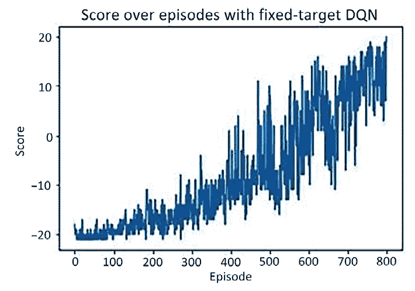

# 第十四章：结合计算机视觉和强化学习

在上一章中，我们学习了如何生成感兴趣的图像。在本章中，我们将学习如何将基于强化学习的技术（主要是深度 Q-learning）与基于计算机视觉的技术相结合。这在学习环境复杂且无法收集所有案例数据的场景中特别有用。在这种情况下，我们希望模型在模拟环境中尽可能接近现实地自学习。这种模型在用于自动驾驶汽车、机器人、游戏中的机器人（真实和数字）、以及自监督学习领域时非常有用。

我们将从了解强化学习的基本知识开始，然后了解与确定如何计算与在给定状态下采取行动相关的价值（**Q 值**）相关的术语。然后，我们将学习填充**Q 表**，这有助于确定在给定状态下与各种行动相关联的值。我们还将学习在由于可能状态数过高而无法创建 Q 表的情况下，如何利用**深度 Q 网络**（**DQN**）来确定各种行动的 Q 值。这是我们将了解如何将神经网络与强化学习相结合。接下来，我们将学习 DQN 模型本身无法工作的情况，通过使用**固定目标模型**来解决这个问题。在这里，我们将通过利用 CNN 与强化学习来玩一个名为 Pong 的视频游戏。最后，我们将利用我们所学到的知识来构建一个可以在模拟环境中自主驾驶汽车的代理人 - CARLA。

总之，在本章中，我们将涵盖以下主题：

+   学习强化学习的基础知识

+   实现 Q-learning

+   实现深度 Q-learning

+   实现具有固定目标的深度 Q-learning

+   实现一个执行自主驾驶的代理

本章中的所有代码片段都在 GitHub 存储库的`Chapter14`文件夹中可用，网址是[`bit.ly/mcvp-2e`](https://bit.ly/mcvp-2e)。

随着领域的发展，我们将定期向 GitHub 存储库添加有价值的补充内容。请检查每个章节目录下的`supplementary_sections`文件夹获取新的有用内容。

# 学习强化学习的基础知识

**强化学习**（**RL**）是机器学习的一个领域，关注软件**代理人**如何在给定**环境**的**状态**下采取**行动**，最大化累积**奖励**的概念。

要了解 RL 如何帮助，让我们考虑一个简单的场景。想象一下你正在与计算机下国际象棋。让我们确定涉及的不同组件：

+   计算机是一个已经学会/正在学习如何下国际象棋的**代理人**。

+   游戏设置（规则）构成了**环境**。

+   当我们进行一步棋（采取**行动**）时，棋盘的**状态**（棋盘上各个棋子的位置）会发生变化。

+   游戏结束时，根据结果，代理获得**奖励**。代理的目标是最大化奖励。

如果机器（*agent1*）与人类对弈，它能够进行的游戏数量是有限的（取决于人类可以进行的游戏数量）。这可能对代理学习游戏造成瓶颈。但是，如果`agent1`（正在学习游戏的代理）能够与*agent2*对弈（`agent2`可以是另一个正在学习国际象棋的代理，或者是一个已经预先编程以玩游戏的国际象棋软件）呢？从理论上讲，这些代理可以无限对弈，这最大化了学习玩游戏的机会。通过进行多场游戏，学习代理很可能学会如何处理游戏的不同场景/状态。

让我们理解学习代理将要遵循的学习过程：

1.  最初，代理在给定状态下采取随机动作。

1.  代理将其在游戏中各个状态下采取的动作存储在**内存**中。

1.  然后，代理将在各个状态下动作的结果与**奖励**关联起来。

1.  在进行多场游戏之后，代理可以通过重播其**经历**来关联状态中的动作和潜在奖励。

接下来是量化在给定状态下采取行动所对应的**价值**的问题。我们将在下一节学习如何计算这个价值。

## 计算状态价值

要理解如何量化一个状态的价值，让我们使用一个简单的场景来定义环境和目标，如下所示：


图 14.1：环境

环境是一个具有两行三列的网格。代理从**起始**单元格开始，并且如果到达右下角的网格单元格，则实现其目标（奖励得分+1）。如果它去到任何其他单元格，代理将不会获得奖励。代理可以通过向右、向左、向下或向上移动来采取行动，具体取决于行动的可行性（例如，代理可以从起始网格单元格向右或向下移动）。到达除右下角单元格以外的任何其他单元格的奖励为 0。

利用这些信息，让我们计算一个单元格的**价值**（代理在给定快照中所处的状态）。鉴于从一个单元格移动到另一个单元格会消耗一些能量，我们通过一个折扣因子 γ 来打折到达单元格的价值，其中 γ 考虑到从一个单元格移动到另一个单元格所花费的能量。此外，引入 γ 会导致代理更快地学会玩得好。因此，让我们形式化广泛使用的贝尔曼方程，帮助计算单元格的价值：


有了上述方程式，让我们计算所有单元格的值（**一旦确定了状态中的最优动作**），其中γ的值为 0.9（γ的典型值在 0.9 到 0.99 之间）：


从前述计算中，我们可以理解如何计算给定状态（单元格）中的值，当给出该状态中的最优动作时。对于我们达到终端状态的简化情景，这些值如下：


图 14.2：每个单元格的值

有了这些值，我们期望代理会遵循增值路径。

现在我们了解了如何计算状态值，接下来的部分中，我们将了解如何计算与状态-动作组合相关联的值。

## 计算状态-动作值

在上一节中，我们提供了一个情景，其中我们已经知道代理正在采取最优动作（这并不现实）。在本节中，我们将看看一个情景，我们可以识别与状态-动作组合对应的值。

在下图中，单元格内的每个子单元格代表在该单元格中采取动作的值。最初，给定状态中各种动作的单元格值如下：


图 14.3：给定状态中不同动作的初始值

请注意，在前面的图像中，单元格*b1*（第 1 行和第 2 列）将具有值 1，如果代理从该单元格向右移动（因为它对应终端单元格）；其他动作结果为 0。X 表示该动作不可能，因此与之相关联的值为零。

在四次迭代（步骤）后，给定状态中各动作的更新单元格值如下：


图 14.4：四次迭代后更新的单元格值

随后将通过多次迭代提供最大化每个单元格价值的最优动作。

让我们了解如何获取第二个表中的单元格值（在前述图像中称为*迭代 2*）。我们将其缩小到 0.3，这是通过在第二个表的第 1 行和第 2 列中存在时采取向下动作获得的。当代理采取向下动作时，有 1/3 的机会采取下一个状态的最优动作。因此，采取向下动作的值如下：


类似地，我们可以获取不同单元格中采取不同可能动作的值。

现在我们知道了如何计算给定状态中各种动作的值，在接下来的部分中，我们将学习 Q-learning 以及如何利用它与 Gym 环境，使其能够玩各种游戏。

# 实施 Q-learning

从技术上讲，现在我们已经计算出了所需的各种状态-动作值，我们可以确定在每个状态下将采取的动作。然而，在更复杂的情景中——例如玩视频游戏时——获取状态信息就变得棘手。OpenAI 的**Gym**环境在这种情况下非常有用。它包含了我们正在玩的游戏的预定义环境。在这里，它获取下一个状态的信息，给定在当前状态下已经采取的动作。到目前为止，我们考虑了选择最优路径的情况。然而，可能会出现我们陷入局部最小值的情况。

在本节中，我们将学习 Q-learning，它帮助计算状态中与动作相关联的值，以及利用 Gym 环境，使我们能够玩各种游戏。目前，我们将看看一个称为 Frozen Lake 的简单游戏，它在 Gym 环境中可用。我们还将学习探索-利用，这有助于避免陷入局部最小值。然而，在此之前，我们将学习 Q 值。

## 定义 Q 值

Q-learning 或者 Q 值中的 Q 代表动作的质量（值）。让我们回顾一下如何计算它：


我们已经知道，我们必须持续**更新**给定状态的状态-动作值，直到饱和为止。因此，我们将修改前述公式如下：


在上述方程中，我们用学习率替换 1，以便我们可以更渐进地更新在状态中采取的动作的值：


在这个 Q 值的正式定义中，接下来的部分中，我们将学习关于 Gym 环境以及它如何帮助我们获取 Q 表（其中存储了在各种状态下执行的各种动作的价值信息），从而在状态中提出最优动作。

## 理解 Gym 环境

在本节中，我们将探索 Gym 环境以及其中的各种功能，同时玩冰湖游戏：

以下代码作为`Understanding_the_Gym_environment.ipynb`在本书 GitHub 存储库的`Chapter14`文件夹中提供，网址为[`bit.ly/mcvp-2e`](https://bit.ly/mcvp-2e)。

1.  安装并导入相关软件包：

    ```py
    %pip install -U "gym==0.26.2"
    import numpy as np
    import gym
    import random 
    ```

1.  打印 Gym 环境中的各种环境：

    ```py
    from gym import envs
    print('\n'.join([str(env) for env in envs.registry])) 
    ```

前述代码打印了一个包含在 Gym 中所有可用游戏的字典。

1.  为所选游戏创建一个环境：

    ```py
    env = gym.make('FrozenLake-v1', is_slippery=False, render_mode='rgb_array') 
    ```

1.  检查已创建的环境：

    ```py
    env.render() 
    ```

前述代码的输出如下：


图 14.5：环境状态

在上述图像中，代理从 **左上角** 开始。在冰冻湖中间有四个洞。如果代理掉入洞中，将获得 0 的奖励并终止游戏。游戏的目标是使代理通过采取特定的动作（在步骤 6 中提到）达到 **目标（右下角）**。

1.  打印游戏中观测空间的大小（即状态数）：

    ```py
    env.observation_space.n 
    ```

上述代码给出了 `16` 的输出。这代表游戏的 16 个单元格。

1.  打印可能动作的数量：

    ```py
    env.action_space.n 
    ```

上述代码的结果是 `4`，表示可以执行的四种可能动作。

1.  在给定状态下随机抽取一个动作：

    ```py
    env.action_space.sample() 
    ```

在这里，`.sample()` 指定我们在给定状态下随机选择四种可能的动作之一。每个动作对应的标量可以与动作的名称相关联。我们可以通过查看 GitHub 上的源代码来做到这一点：[`github.com/openai/gym/blob/master/gym/envs/toy_text/frozen_lake.py`](https://github.com/openai/gym/blob/master/gym/envs/toy_text/frozen_lake.py)。

1.  将环境重置为其原始状态：

    ```py
    env.reset() 
    ```

1.  执行 (`step`) 一个动作：

    ```py
    env.step(env.action_space.sample()) 
    ```

上述代码获取下一个状态、奖励、游戏是否完成的标志以及其他信息。我们可以使用 `.step` 执行游戏，因为环境在给定动作的情况下会提供下一个状态。

这些步骤为我们建立一个指导在每个状态下采取最优动作的 Q 表奠定了基础。我们将在下一节中完成这一操作。

## 构建 Q 表

在前一节中，我们学习了如何手动计算各种状态-动作对的 Q 值。在本节中，我们将利用 Gym 环境及其相关模块填充 Q 表，其中行表示代理的可能状态，列表示代理可以执行的动作。Q 表的值表示在给定状态下执行动作的 Q 值。

我们可以使用以下策略填充 Q 表的数值：

1.  初始化游戏环境和 Q 表，以零填充。

1.  执行一个随机动作，并获取下一个状态、奖励、游戏是否完成的标志以及其他信息。

1.  使用我们之前定义的贝尔曼方程更新 Q 值。

1.  重复 *步骤 2* 和 *3*，使每个回合最多有 50 步。

1.  重复 *步骤 2*、*3* 和 *4* 多个回合。

让我们编写上述策略的代码：

以下代码可在本书的 GitHub 代码库的 `Chapter14` 文件夹中的 `Building_Q_table.ipynb` 中找到：[`bit.ly/mcvp-2e`](https://bit.ly/mcvp-2e)。

1.  安装和初始化游戏环境：

    ```py
    %pip install torch-snippets "gym==0.26.2"
    import numpy as np
    import gym
    import random
    env = gym.make('FrozenLake-v0', is_slippery=False, 
                                    render_mode='rgb_array') 
    ```

1.  使用零初始化 Q 表：

    ```py
    action_size=env.action_space.n
    state_size=env.observation_space.n
    qtable=np.zeros((state_size,action_size)) 
    ```

上述代码检查可以用来构建 Q 表的可能动作和状态。Q 表的维度应该是状态数乘以动作数。

1.  进行多个回合，同时随机选择一个动作：

    1.  在这里，我们首先在每个 episode 结束时重置环境：

    ```py
    episode_rewards = []
    for i in range(10000):
        state, *_ =env.reset() 
    ```

    1.  每个 episode 最多执行 50 步：

    ```py
     total_rewards = 0
        for step in range(50): 
    ```

    1.  我们考虑每个 episode 最多 50 步，因为代理可能会在两个状态之间永远循环（考虑连续执行左右动作）。因此，我们需要指定代理可以采取的最大步数。

    1.  随机采样一个动作并执行（`step`）该动作：

    ```py
     action=env.action_space.sample()
            new_state,reward,done,*_=env.step(action) 
    ```

    1.  更新对应于状态和动作的 Q 值：

    ```py
     qtable[state,action]+=0.1*(reward+0.9*np.max(qtable[new_state,:]) \
                                                       -qtable[state,action]) 
    ```

    1.  在上述代码中，我们指定学习速率为`0.1`，并更新状态-动作组合的 Q 值，考虑到下一个状态的最大 Q 值（`np.max(qtable[new_state,:])`）。

    1.  更新`state`值为之前获得的`new_state`，并将`reward`累积到`total_rewards`中：

    ```py
     state=new_state
            total_rewards+=reward 
    ```

    1.  将奖励放入列表（`episode_rewards`），并打印 Q 表（`qtable`）：

    ```py
     episode_rewards.append(total_rewards)
    print(qtable) 
    ```

上述代码获取了各种动作在不同状态下的 Q 值：


图 14.6：各种动作在状态间的 Q 值

我们将学习如何在下一节中利用获得的 Q 表。

到目前为止，我们一直在每次随机采取一个动作。然而，在现实场景中，一旦我们学到某些动作不能在某些状态下执行，反之亦然，我们就不需要再随机采取动作了。在这种情况下，探索-利用的概念非常有用。

## 利用探索-利用

探索-利用的概念可以描述如下：

+   **探索** 是一种策略，我们学习在给定状态下需要做什么（采取什么动作）。

+   **利用** 是一种策略，利用已经学到的知识 - 即在给定状态下采取哪个动作。

在初始阶段，高量的探索是理想的，因为代理一开始不会知道哪些动作是最优的。随着 episode 的进行，随着代理逐渐学习各种状态-动作组合的 Q 值，我们必须利用利用，执行能够带来高奖励的动作。

有了这个直觉之后，让我们修改在前一节中构建的 Q 值计算方法，以便包含探索和利用：

```py
episode_rewards = []
**epsilon=****1**
**max_epsilon=****1**
**min_epsilon=****0.01**
**decay_rate=****0.005**
for episode in range(1000):
    state, *_=env.reset()
    total_rewards = 0
    for step in range(50):
        **exp_exp_tradeoff=random.uniform(****0****,****1****)**
        **## Exploitation:**
        **if** **exp_exp_tradeoff>epsilon:**
            **action=np.argmax(qtable[state,:])**
        **else****:**
            **## Exploration**
            **action=env.action_space.sample()**
        new_state,reward,done,*_=env.step(action)
        qtable[state,action]+=0.9*(reward+0.9*np.max(\
                                  qtable[new_state,:])\
                                   -qtable[state,action])
        state=new_state
        total_rewards+=reward
    episode_rewards.append(total_rewards)
    epsilon=min_epsilon+(max_epsilon-min_epsilon)\
                            ***np.exp(decay_rate*episode)**
print(qtable) 
```

在上述代码中的粗体行是在之前显示的代码基础上新增的部分。在这段代码中，我们指定随着更多的 episode 进行，我们执行更多的利用而非探索。

一旦我们获得了 Q 表，我们可以利用它来确定代理需要执行的步骤以达到目的地：

```py
env.reset()
for episode in range(1):
    state, *_=env.reset()
    step=0
    done=False
    print("-----------------------")
    print("Episode",episode)
    for step in range(50):
        env.render()
        action=np.argmax(qtable[state,:])
        print(action)
        new_state,reward,done,*_­­­=env.step(action)
        if done:
            print("Number of Steps",step+1)
            break
        state=new_state
env.close() 
```

在前面的代码中，我们获取代理所处的当前`state`，确定在给定状态-动作组合中产生最大值的`action`，执行该动作（`step`）以获取代理将会处于的`new_state`对象，并重复这些步骤直到游戏完成（终止）。

前面的代码的输出结果如下：


图 14.7：代理执行的最优动作

正如您从前面的图中看到的那样，代理能够采取最优动作来达到其目标。请注意，这只是一个简化的例子，因为状态空间是离散的，导致我们构建了一个 Q 表。

但是，如果状态空间是连续的（例如，状态空间是游戏当前状态的快照图像）会怎么样？构建 Q 表变得非常困难（因为可能的状态数量非常大）。在这种情况下，深度 Q 学习非常有用。我们将在下一节学习关于这个的内容。

# 实施深度 Q 学习

到目前为止，我们已经学习了如何构建 Q 表，通过多次回放游戏（在本例中是 Frozen Lake 游戏）来为给定的状态-动作组合提供对应的值。然而，当状态空间是连续的（比如 Pong 游戏的快照 - 也就是图像），可能的状态空间数量就变得非常庞大。我们将在本节以及接下来的节中解决这个问题，使用深度 Q 学习。在本节中，我们将学习如何通过神经网络估计状态-动作组合的 Q 值，因此称为**深度** Q 学习。与 Q 表相比，深度 Q 学习利用神经网络来映射任何给定的状态-动作（其中状态可以是连续的或离散的）组合到 Q 值。

在这个练习中，我们将在 Gym 的 CartPole 环境中进行操作。让我们首先了解这是什么。

## 理解 CartPole 环境

我们的任务是尽可能长时间地平衡车杆。下面的图像展示了 CartPole 环境的样子：


图 14.8：CartPole 环境中的可能动作

注意，在购物车向右移动时，杆向左移动，反之亦然。此环境中的每个状态都使用四个观测定义，它们的名称及其最小和最大值如下：

| **观察** | **最小值** | **最大值** |
| --- | --- | --- |
| 购物车位置 | -2.4 | 2.4 |
| 购物车速度 | -inf | inf |
| 杆角度 | -41.8° | 41.8° |
| 杆顶端的速度 | -inf | inf |

表 14.1：CartPole 环境中的观察（状态）

请注意，表示状态的所有观察都具有连续的值。

在高层次上，CartPole 平衡游戏的深度 Q 学习工作如下：

1.  获取输入值（游戏图像/游戏的元数据）。

1.  将输入值通过一个具有与可能动作数相同输出数量的网络。

1.  输出层预测与在给定状态下采取行动相对应的动作值。

网络架构的高级概述如下：


图 14.9：在给定状态时识别正确动作值的网络架构

在上述图像中，网络架构使用状态（四个观察）作为输入，当前状态下采取左右动作的 Q 值作为输出。我们按以下方式训练神经网络：

1.  在探索阶段，我们执行具有输出层中最高值的随机动作。

1.  然后，我们将动作、下一个状态、奖励以及标志游戏是否完成存储在内存中。

1.  在给定状态下，如果游戏尚未完成，则在该状态下采取行动的 Q 值将如下计算：


1.  当前状态-动作组合的 Q 值保持不变，除了在 *步骤 2* 中执行的动作。

1.  多次执行步骤 1 到 4 并存储经验。

1.  适合一个以状态作为输入和以行动值作为预期输出的模型（从记忆和重播经验中），并最小化**均方误差**（**MSE**）损失，该损失是最佳动作在下一个状态的目标 Q 值与在给定状态下动作的预测 Q 值之间的差值。

1.  在多个情节上重复上述步骤，同时减少探索率。

有了上述策略，让我们编写深度 Q 学习，以便进行 CartPole 平衡。

## 执行 CartPole 平衡

要执行 CartPole 平衡，您可以使用以下代码：

此代码作为 `Deep_Q_Learning_Cart_Pole_balancing.ipynb` 存在于此书 GitHub 存储库的 `Chapter14` 文件夹中，网址为 [`bit.ly/mcvp-2e`](https://bit.ly/mcvp-2e)。该代码包含用于下载数据的 URL，并且长度适中。我们强烈建议您在 GitHub 上执行笔记本以重现结果，以便理解所需执行的步骤和各种代码组件。

1.  安装并导入相关包：

    ```py
    %pip install "gym==0.26.2"
    import gym
    import numpy as np
    import cv2import torch
    import torch.nn as nn
    import torch.nn.functional as F
    import random
    from collections import namedtuple, deque
    import torch.optim as optim
    device = 'cuda' if torch.cuda.is_available() else 'cpu' 
    ```

1.  定义环境：

    ```py
    env = gym.make('CartPole-v1') 
    ```

1.  定义网络架构：

    ```py
    class DQNetwork(nn.Module):
        def __init__(self, state_size, action_size):
            super(DQNetwork, self).__init__()

            self.fc1 = nn.Linear(state_size, 24)
            self.fc2 = nn.Linear(24, 24)
            self.fc3 = nn.Linear(24, action_size)

        def forward(self, state):     
            x = F.relu(self.fc1(state))
            x = F.relu(self.fc2(x))
            x = self.fc3(x)
            return x 
    ```

注意，由于仅在 2 个隐藏层中包含 24 个单元，因此体系结构相当简单。输出层包含与可能动作数相同数量的单元。

1.  定义 `Agent` 类，如下所示：

    1.  使用各种参数、网络和经验定义 `__init__` 方法：

    ```py
    class Agent():
        def __init__(self, state_size, action_size):

            self.state_size = state_size
            self.action_size = action_size
            self.seed = random.seed(0)
            ## hyperparameters
            self.buffer_size = 2000
            self.batch_size = 64
            self.gamma = 0.99
            self.lr = 0.0025
            self.update_every = 4
            # Q-Network
            self.local = DQNetwork(state_size, action_size).to(device)
            self.optimizer=optim.Adam(self.local.parameters(), lr=self.lr)
            # Replay memory
            self.memory = deque(maxlen=self.buffer_size)
            self.experience = namedtuple("Experience", \
                                field_names=["state", "action",
                                "reward", "next_state", "done"])
            self.t_step = 0 
    ```

    1.  定义 `step` 函数，从内存中获取数据，并通过调用 `learn` 函数将其适应模型：

    ```py
     def step(self, state, action, reward, next_state, done):
            # Save experience in replay memory
            self.memory.append(self.experience(state, action,
                                               reward, next_state, done))
            # Learn once every 'update_every' number of time steps.
            self.t_step = (self.t_step + 1) % self.update_every
            if self.t_step == 0:
            # If enough samples are available in memory,
            # get random subset and learn
                if len(self.memory) > self.batch_size:
                    experiences = self.sample_experiences()
                    self.learn(experiences, self.gamma) 
    ```

    1.  请注意，我们正在学习随机样本的经验（使用 `self.memory`），而不是连续经验序列，确保模型仅基于当前输入学习要做什么。如果我们按顺序提供经验，模型可能会学习连续输入中的相关性。

    1.  定义 `act` 函数，它在给定状态时预测动作：

    ```py
     def act(self, state, eps=0.):
            # Epsilon-greedy action selection
            if random.random() > eps:
                state = torch.from_numpy(state).float()\
                                               .unsqueeze(0).to(device)
                self.local.eval()
                with torch.no_grad():
                    action_values = self.local(state)
                self.local.train()
                return np.argmax(action_values.cpu().data.numpy())
            else:
                return random.choice(np.arange(self.action_size)) 
    ```

    1.  注意，在上述代码中，我们在确定要采取的动作时进行探索利用。

    1.  定义 `learn` 函数，它适配模型以便在给定状态时预测动作值：

    ```py
     def learn(self, experiences, gamma):
            states,actions,rewards,next_states,dones= experiences
            # Get expected Q values from local model
            Q_expected = self.local(states).gather(1, actions)
            # Get max predicted Q values (for next states)
            # from local model
            Q_targets_next = self.local(next_states).detach()\
                                                    .max(1)[0].unsqueeze(1)
            # Compute Q targets for current states
            Q_targets = rewards+(gamma*Q_targets_next*(1-dones))

            # Compute loss
            loss = F.mse_loss(Q_expected, Q_targets)
            # Minimize the loss
            self.optimizer.zero_grad()
            loss.backward()
            self.optimizer.step() 
    ```

    1.  在上述代码中，我们获取了抽样的经验并预测了我们执行的动作的 Q 值。此外，考虑到我们已经知道下一个状态，我们可以预测下一个状态中动作的最佳 Q 值。这样，我们现在知道了与在给定状态下采取的动作对应的目标值。最后，我们计算了预期值 (`Q_targets`) 和预测值 (`Q_expected`) 之间的损失，即当前状态中采取的动作的 Q 值的损失。

    1.  定义 `sample_experiences` 函数以从记忆中抽取经验：

    ```py
     def sample_experiences(self):
            experiences = random.sample(self.memory,
                                        k=self.batch_size)
            states = torch.from_numpy(np.vstack([e.state \
                        for e in experiences if e is not \
                                    None])).float().to(device)
            actions = torch.from_numpy(np.vstack([e.action \
                        for e in experiences if e is not \
                                    None])).long().to(device)
            rewards = torch.from_numpy(np.vstack([e.reward \
                        for e in experiences if e is not \
                                    None])).float().to(device)
            next_states=torch.from_numpy(np.vstack([e.next_state \
                        for e in experiences if e is not \
                                      None])).float().to(device)
            dones = torch.from_numpy(np.vstack([e.done \
                        for e in experiences if e is not None])\
                           .astype(np.uint8)).float().to(device)
            return (states, actions, rewards, next_states,dones) 
    ```

1.  定义 `agent` 对象：

    ```py
    agent = Agent(env.observation_space.shape[0], env.action_space.n) 
    ```

1.  执行深度 Q 学习，如下所示：

    1.  初始化将存储得分信息和超参数的列表：

    ```py
    scores = [] # list containing scores from each episode
    scores_window = deque(maxlen=100) # last 100 scores
    n_episodes=5000
    max_t=5000
    eps_start=1.0
    eps_end=0.001
    eps_decay=0.9995
    eps = eps_start 
    ```

    1.  在每一回合中重置环境并获取状态的形状（观察数量）。此外，重塑它以便我们可以将其传递给网络：

    ```py
    for i_episode in range(1, n_episodes+1):
        state, *_ = env.reset()
        state_size = env.observation_space.shape[0]
        state = np.reshape(state, [1, state_size])
        score = 0 
    ```

    1.  在 `max_t` 时间步中循环，确定要执行的动作并执行 (`step`)。然后，重塑状态，以便将重塑后的状态传递给神经网络：

    ```py
     for i in range(max_t):
            action = agent.act(state, eps)
            next_state, reward, done, *_ = env.step(action)
            next_state = np.reshape(next_state, [1, state_size]) 
    ```

    1.  通过指定 `agent.step` 在当前状态的基础上适配模型，并重置状态到下一个状态，以便在下一次迭代中有用：

    ```py
     reward = reward if not done or score == 499 else -10
            agent.step(state, action, reward, next_state, done)
            state = next_state
            score += reward
            if done:
                break 
    ```

    1.  存储得分值，定期打印，并在前 10 步得分的均值大于 450 时停止训练（这通常是一个不错的分数，因此被选择）：

    ```py
     scores_window.append(score) # save most recent score
        scores.append(score) # save most recent score
        eps = max(eps_end, eps_decay*eps) # decrease epsilon
        print('\rEpisode {:.2f}\tReward {:.2f} \tAverage Score: {:.2f} \tEpsilon: {:.2f}'.format(i_episode, score, np.mean(scores_window), eps), end="")
        if i_episode % 100 == 0:
            print('\rEpisode {:.2f}\tAverage Score: {:.2f} \tEpsilon: {:.2f}'.format(i_episode, np.mean(scores_window), eps))
        if i_episode>10 and np.mean(scores[-10:])>450:
            break 
    ```

1.  绘制随着回合增加得分变化的图表：

    ```py
    import matplotlib.pyplot as plt
    %matplotlib inline
    plt.plot(scores)
    plt.title('Scores over increasing episodes') 
    ```

以下是显示得分随回合变化的图表：


图 14.10：随着回合增加的得分

从上图可以看出，在第 2,000 个回合后，模型在平衡 CartPole 时取得了高分。

现在我们已经学会了如何实现深度 Q 学习，在接下来的部分，我们将学习如何处理不同的状态空间 - Pong 中的视频帧，而不是定义 CartPole 环境中的四个状态空间。我们还将学习如何使用固定目标模型实现深度 Q 学习。

# 使用固定目标模型实现深度 Q 学习

在前一节中，我们学习了如何利用深度 Q 学习解决 Gym 中的 CartPole 环境问题。在本节中，我们将解决一个更复杂的乒乓球游戏，并了解如何利用深度 Q 学习以及固定目标模型来解决游戏。在处理此用例时，您还将学习如何利用基于 CNN 的模型（代替我们在前一节中使用的普通神经网络）来解决问题。前一节的理论基本保持不变，但关键变化是“固定目标模型”。基本上，我们创建了本地模型的副本，并在每 1,000 步与本地模型一起使用本地模型的奖励。这使得本地模型更加稳定，并更平滑地更新其权重。在 1,000 步之后，我们使用本地模型更新目标模型，以更新整体学习。

两个模型有效的原因是，我们减轻了本地模型同时选择动作和生成训练网络目标的负担 - 这种相互依赖会导致训练过程中的显著振荡。

## 理解用例

该用例的目标是构建一个能够与计算机（预训练的非学习代理）对战并在乒乓球游戏中击败它的代理，期望代理能够获得 21 分。

我们将采用的策略来解决创建成功的乒乓球游戏代理的问题如下：

1.  剪裁图像的不相关部分以获取当前帧（状态）：


图 14.11：乒乓球游戏中的原始图像和处理后图像（帧）

请注意，在前述图像中，我们已经对原始图像进行了处理，剪裁了处理后图像的顶部和底部像素。

1.  堆叠四个连续帧 - 代理需要状态序列来判断球是否接近它。

1.  让代理通过最初采取随机动作来进行游戏，并在内存中收集当前状态、未来状态、采取的动作和奖励。只保留最近 10,000 个动作的信息，并在超过 10,000 个动作时清除历史信息。

1.  构建一个网络（本地网络），从内存中取样状态并预测可能动作的值。

1.  定义另一个网络（目标网络），它是本地网络的复制品。

1.  每当更新本地网络 1,000 次时，更新目标网络。每 1,000 个周期结束时，目标网络的权重与本地网络的权重相同。

1.  利用目标网络计算下一状态中最佳动作的 Q 值。

1.  对于本地网络建议的动作，我们期望它预测即时奖励和下一状态中最佳动作的 Q 值之和。

1.  最小化本地网络的均方误差损失。

1.  让代理程序继续播放，直到最大化其奖励。

有了上述策略，我们现在可以编写代理程序，使其在玩乒乓球时最大化奖励。

## 编写代理程序玩乒乓球

编写代理程序以使其自学习如何玩乒乓球的步骤如下：

以下代码在本书的 GitHub 存储库的`Chapter14`文件夹中的`Pong_Deep_Q_Learning_with_Fixed_targets.ipynb`文件中提供。代码包含从中下载数据的 URL，并且代码长度适中。我们强烈建议您在 GitHub 上执行笔记本以重现结果，以理解执行步骤和各种代码组件。

1.  导入相关包并设置游戏环境：

    ```py
    %pip install -qqU "gym[atari, accept-rom-license]==0.26.2"
    import gym
    import numpy as np
    import cv2
    from collections import deque
    import matplotlib.pyplot as plt
    import torch
    import torch.nn as nn
    import torch.nn.functional as F
    import random
    from collections import namedtuple, deque
    import torch.optim as optim
    import matplotlib.pyplot as plt
    %matplotlib inline
    device = 'cuda' if torch.cuda.is_available() else 'cpu'
    env = gym.make('PongDeterministic-v0') 
    ```

1.  定义状态大小和动作大小：

    ```py
    state_size = env.observation_space.shape[0]
    action_size = env.action_space.n 
    ```

1.  定义一个函数，该函数将预处理帧以去除不相关的底部和顶部像素：

    ```py
    def preprocess_frame(frame):
        bkg_color = np.array([144, 72, 17])
        img = np.mean(frame[34:-16:2,::2]-bkg_color,axis=-1)/255.
        resized_image = img
        return resized_image 
    ```

1.  定义一个函数，该函数将堆叠四个连续的帧，如下所示：

    1.  该函数接受`stacked_frames`、当前`state`和`is_new_episode`标志作为输入：

    ```py
    def stack_frames(stacked_frames, state, is_new_episode):
        # Preprocess frame
        frame = preprocess_frame(state)
        stack_size = 4 
    ```

    1.  如果这是新的场次（游戏重新开始），我们将以初始帧的堆栈开始：

    ```py
     if is_new_episode:
            # Clear our stacked_frames
            stacked_frames = deque([np.zeros((80,80), dtype=np.uint8) \
                             for i in range(stack_size)], maxlen=4)
            # Because we're in a new episode,
            # copy the same frame 4x
            for i in range(stack_size):
                stacked_frames.append(frame)
            # Stack the frames
            stacked_state = np.stack(stacked_frames, \
                                     axis=2).transpose(2, 0, 1) 
    ```

    1.  如果该场次不是新的，我们将从`stacked_frames`中移除最旧的帧并附加最新的帧：

    ```py
     else:
            # Append frame to deque,
            # automatically removes the #oldest frame
            stacked_frames.append(frame)
            # Build the stacked state
            # (first dimension specifies #different frames)
            stacked_state = np.stack(stacked_frames, \
                                     axis=2).transpose(2, 0, 1)
        return stacked_state, stacked_frames 
    ```

1.  定义网络架构——即`DQNetwork`：

    ```py
    class DQNetwork(nn.Module):
        def __init__(self, states, action_size):
            super(DQNetwork, self).__init__()

            self.conv1 = nn.Conv2d(4, 32, (8, 8), stride=4)
            self.conv2 = nn.Conv2d(32, 64, (4, 4), stride=2)
            self.conv3 = nn.Conv2d(64, 64, (3, 3), stride=1)
            self.flatten = nn.Flatten()
            self.fc1 = nn.Linear(2304, 512)
            self.fc2 = nn.Linear(512, action_size)

        def forward(self, state):
            x = F.relu(self.conv1(state))
            x = F.relu(self.conv2(x))
            x = F.relu(self.conv3(x))
            x = self.flatten(x)
            x = F.relu(self.fc1(x))
            x = self.fc2(x)
            return x 
    ```

1.  如前一节中所做的那样，定义`Agent`类：

    1.  定义`__init__`方法：

    ```py
    class Agent():
        **def****__init__****(self, state_size, action_size):**      
            self.state_size = state_size
            self.action_size = action_size
            self.seed = random.seed(0)
            ## hyperparameters
            self.buffer_size = 1000
            self.batch_size = 32
            self.gamma = 0.99
            self.lr = 0.0001
            self.update_every = 4
            self.update_every_target = 1000
            self.learn_every_target_counter = 0
            # Q-Network
            self.local = DQNetwork(state_size, action_size).to(device)
            self.target = DQNetwork(state_size, action_size).to(device)
            self.optimizer=optim.Adam(self.local.parameters(), lr=self.lr)
            # Replay memory
            self.memory = deque(maxlen=self.buffer_size)
            self.experience = namedtuple("Experience", \
                               field_names=["state", "action", \
                                "reward", "next_state", "done"])
            # Initialize time step (for updating every few steps)
            self.t_step = 0 
    ```

    1.  请注意，在前述代码的`__init__`方法中，与前一节提供的代码相比，我们唯一增加的部分是`target`网络及其更新频率（这些行在前述代码中以粗体显示）。

    1.  定义将更新权重的方法（`step`），就像我们在前一节中所做的那样：

    ```py
     def step(self, state, action, reward, next_state, done):
            # Save experience in replay memory
            self.memory.append(self.experience(state[None], \
                                        action, reward, \
                                        next_state[None], done))

            # Learn every update_every time steps.
            self.t_step = (self.t_step + 1) % self.update_every
            if self.t_step == 0:
        # If enough samples are available in memory, get  
        # random subset and learn
                if len(self.memory) > self.batch_size:
                    experiences = self.sample_experiences()
                    self.learn(experiences, self.gamma) 
    ```

    1.  定义`act`方法，该方法将获取给定状态下要执行的动作：

    ```py
     def act(self, state, eps=0.):
            # Epsilon-greedy action selection
            if random.random() > eps:
                state = torch.from_numpy(state).float()\
                             .unsqueeze(0).to(device)
                self.local.eval()
                with torch.no_grad():
                    action_values = self.local(state)
                self.local.train()
                return np.argmax(action_values.cpu().data.numpy())
            else:
                return random.choice(np.arange(self.action_size)) 
    ```

    1.  定义`learn`函数，该函数将训练本地模型：

    ```py
     def learn(self, experiences, gamma):
            self.learn_every_target_counter+=1
            states,actions,rewards,next_states,dones = experiences
            # Get expected Q values from local model
            Q_expected = self.local(states).gather(1, actions)
            # Get max predicted Q values (for next states)
            # from target model
            **Q_targets_next =** **self****.target(next_states).detach()\**
                                 **.****max****(****1****)[****0****].unsqueeze(****1****)**
            # Compute Q targets for current state
            Q_targets = rewards+(gamma*Q_targets_next*(1-dones))

            # Compute loss
            loss = F.mse_loss(Q_expected, Q_targets)
            # Minimize the loss
            self.optimizer.zero_grad()
            loss.backward()
            self.optimizer.step()
            # ------------ update target network ------------- #
            if self.learn_every_target_counter%1000 ==0:
                self.target_update() 
    ```

    1.  请注意，在前述代码中，`Q_targets_next`是使用目标模型而不是在前一节中使用的本地模型预测的（我们在代码中突出显示了这一行）。我们还会在每 1,000 步之后更新目标网络，其中`learn_every_target_counter`是帮助我们确定是否应更新目标模型的计数器。

    1.  定义一个函数(`target_update`)，用于更新目标模型：

    ```py
     def target_update(self):
            print('target updating')
            self.target.load_state_dict(self.local.state_dict()) 
    ```

    1.  定义一个函数，该函数将从内存中采样经验：

    ```py
     def sample_experiences(self):
            experiences = random.sample(self.memory, k=self.batch_size)
            states = torch.from_numpy(np.vstack([e.state \
                        for e in experiences if e is not \
                               None])).float().to(device)
            actions = torch.from_numpy(np.vstack([e.action \
                        for e in experiences if e is not \
                               None])).long().to(device)
            rewards = torch.from_numpy(np.vstack([e.reward \
                        for e in experiences if e is not \
                               None])).float().to(device)
            next_states=torch.from_numpy(np.vstack([e.next_state \
                         for e in experiences if e is not \
                                      None])).float().to(device)
            dones = torch.from_numpy(np.vstack([e.done \
                        for e in experiences if e is not None])\
                           .astype(np.uint8)).float().to(device)
            return (states, actions, rewards, next_states,dones) 
    ```

1.  定义`Agent`对象：

    ```py
    agent = Agent(state_size, action_size) 
    ```

1.  定义将用于训练代理程序的参数：

    ```py
    n_episodes=5000
    max_t=5000
    eps_start=1.0
    eps_end=0.02
    eps_decay=0.995
    scores = [] # list containing scores from each episode
    scores_window = deque(maxlen=100) # last 100 scores
    eps = eps_start
    stack_size = 4
    stacked_frames = deque([np.zeros((80,80), dtype=np.int) \
                            for i in range(stack_size)], maxlen=stack_size) 
    ```

1.  训练代理程序随着场次的增加，就像我们在前一节中所做的那样：

    ```py
    for i_episode in range(1, n_episodes+1):
        state, *_ = env.reset()
        state, frames = stack_frames(stacked_frames, state, True)
        score = 0
        for i in range(max_t):
            action = agent.act(state, eps)
            next_state, reward, done, *_ = env.step(action)
            next_state, frames = stack_frames(frames, next_state, False)
            agent.step(state, action, reward, next_state, done)
            state = next_state
            score += reward
            if done:
                break
        scores_window.append(score) # save most recent score
        scores.append(score) # save most recent score
        eps = max(eps_end, eps_decay*eps) # decrease epsilon
        print('\rEpisode {}\tReward {} \tAverage Score: {:.2f} \
        \tEpsilon: {}'.format(i_episode,score,\
                              np.mean(scores_window),eps),end="")
        if i_episode % 100 == 0:
            print('\rEpisode {}\tAverage Score: {:.2f} \
            \tEpsilon: {}'.format(i_episode, \
                                  np.mean(scores_window), eps)) 
    ```

以下图表显示了随着场次增加得分的变化：



图 14.12：随着时代增长的得分

从前面的图像中，我们可以看到代理逐渐学会了玩 Pong 游戏，并且在 800 个周期结束时，它学会了在接受高奖励的同时玩这个游戏。

现在我们已经训练了一个能够很好地玩 Pong 游戏的代理，下一节我们将训练一个代理，使其能够在模拟环境中自动驾驶汽车。

# 实现一个代理程序执行自动驾驶

现在您已经看到 RL 在逐步挑战的环境中运作，我们将通过演示相同的概念可以应用于自动驾驶汽车来结束本章。由于在实际汽车上看到这种工作是不切实际的，我们将转而使用模拟环境。这种情景包含以下组成部分：

+   环境是一个充满交通的完整城市，道路上有汽车和其他细节。演员（代理）是一辆汽车。

+   汽车的输入包括各种感官输入，例如仪表板摄像头、**光学雷达**（**LIDAR**）传感器和 GPS 坐标。

+   输出将是汽车移动的快慢程度，以及转向的级别。

此仿真将尝试准确地反映现实世界的物理情况。因此，请注意，无论是汽车仿真还是真实汽车，基本原理都将保持不变。

注意，我们要安装的环境需要**图形用户界面**（**GUI**）来显示仿真内容。此外，训练将至少需要一天时间，如果不是更长。由于 Google Colab 缺乏可视化设置并且时间使用限制，我们将不再使用 Google Colab 笔记本，正如我们迄今所做的那样。这是本书唯一一个需要活跃的 Linux 操作系统，并且最好有 GPU 以在几天的训练中获得可接受结果的部分。

## 设置 CARLA 环境

正如我们之前提到的，我们需要一个可以模拟复杂交互的环境，使我们相信我们实际上正在处理一个真实场景。CARLA 就是这样的一个环境。环境作者对 CARLA 表示如下：

“*CARLA 是从头开始开发的，旨在支持自动驾驶系统的开发、训练和验证。除了开放源代码和协议外，CARLA 还提供了专为此目的创建并可以自由使用的开放数字资产（城市布局、建筑物和车辆）。仿真平台支持传感器套件的灵活规格、环境条件、对所有静态和动态参与者的全面控制、地图生成等等。*”

我们需要遵循两个步骤来设置环境：

1.  安装 CARLA 仿真环境的二进制文件。

1.  安装 Gym 版本，该版本提供了 Python 连接以进行仿真环境。

此部分的步骤已作为视频教程呈现在此处：[`tinyurl.com/mcvp-self-driving-agent`](https://tinyurl.com/mcvp-self-driving-agent)。

让我们开始吧！

### 安装 CARLA 二进制文件

在本节中，我们将学习如何安装必要的 CARLA 二进制文件：

1.  访问[`github.com/carla-simulator/carla/releases/tag/0.9.6`](https://github.com/carla-simulator/carla/releases/tag/0.9.6)，并下载编译版本文件`CARLA_0.9.6.tar.gz`。

1.  将其移动到您希望 CARLA 在系统中居住的位置并解压缩它。在这里，我们将通过下载并解压缩 CARLA 到`Documents`文件夹来演示这一点：

    ```py
    $ mv CARLA_0.9.6.tar.gz ~/Documents/
    $ cd ~/Documents/
    $ tar -xf CARLA_0.9.6.tar.gz
    $ cd CARLA_0.9.6/ 
    ```

1.  将 CARLA 添加到`PYTHONPATH`中，以便您的机器上的任何模块都可以导入它：

    ```py
    $ echo "export PYTHONPATH=$PYTHONPATH:/home/$(whoami)/Documents/CARLA_0.9.6/PythonAPI/carla/dist/carla-0.9.6-py3.5-linux-x86_64.egg" >> ~/.bashrc 
    ```

在前面的代码中，我们将包含 CARLA 的目录添加到名为`PYTHONPATH`的全局变量中，这是一个用于访问所有 Python 模块的环境变量。将其添加到`~/.bashrc`将确保每次打开终端时都可以访问此新文件夹。运行上述代码后，重新启动终端并运行`ipython -c "import carla; carla.__spec__"`。您应该会得到以下输出：


图 14.13：CARLA 在您的机器上的位置

1.  最后，按以下方式提供必要的权限并执行 CARLA：

    ```py
    $ chmod +x /home/$(whoami)/Documents/CARLA_0.9.6/CarlaUE4.sh
    $ ./home/$(whoami)/Documents/CARLA_0.9.6/CarlaUE4.sh 
    ```

一两分钟后，您应该会看到一个类似于以下显示 CARLA 作为仿真运行的窗口，准备接受输入：


图 14.14：显示 CARLA 运行的窗口

在本节中，我们已验证`CARLA`是一个仿真环境，其二进制文件按预期工作。让我们继续为其安装 Gym 环境。保持终端运行状态不变，因为我们需要二进制文件在整个练习过程中后台运行。

### 安装 CARLA 的 Gym 环境

由于没有官方的 Gym 环境，我们将利用用户实施的 GitHub 存储库，并从那里为 CARLA 安装 Gym 环境。按照以下步骤安装 CARLA 的 Gym 环境：

1.  克隆 Gym 存储库到您选择的位置并安装该库：

    ```py
    $ cd /location/to/clone/repo/to
    $ git clone https://github.com/cjy1992/gym-carla
    $ cd gym-carla
    $ pip install -r requirements.txt
    $ pip install -e . 
    ```

1.  通过运行以下命令来测试您的设置：

    ```py
    $ python test.py 
    ```

应该会打开一个类似以下的窗口，显示我们已将一个虚拟汽车添加到环境中。从这里，我们可以监视俯视图，激光雷达传感器点云和我们的车载摄像头：


图 14.15：当前情节的概述

在这里，我们可以观察到以下内容：

+   第一个视图包含一个与车辆 GPS 系统显示非常相似的视图 - 即我们的车辆，各种航点和道路车道。然而，我们不会使用此输入进行训练，因为它还显示了视图中的其他车辆，这是不现实的。

+   第二视图更为有趣。有些人认为它就像是自动驾驶汽车的眼睛。激光雷达每秒多次向周围环境发射脉冲光（在所有方向），捕获反射光以确定该方向上最近的障碍物距离。车载计算机汇总所有最近的障碍物信息，以重建一个三维点云，使其能够三维理解其环境。

+   在第一和第二视图中，我们可以看到汽车前方有一条带状物。这是一个航向指示，指示汽车应该去的方向。

+   第三视图是一个简单的仪表盘摄像头。

除了这三个外，CARLA 还提供其他传感器数据，例如以下内容：

+   `lateral-distance`（车道偏离距离）

+   `delta-yaw`（相对于前方道路的角度）

+   `速度`

+   车辆前方是否有危险障碍物

我们将使用前面提到的前四个传感器以及 LIDAR 和我们的仪表盘摄像头来训练模型。

现在我们准备理解 CARLA 的组件并为自动驾驶汽车创建 DQN 模型。

## 训练自动驾驶代理

在笔记本中开始训练过程之前，我们将创建两个文件 —— `model.py` 和 `actor.py`。它们分别包含模型架构和 `Agent` 类。`Agent` 类包含我们将用于训练代理的各种方法。

此部分的代码说明位于本书 GitHub 存储库的 `Chapter14` 文件夹中的 `Carla.md` 文件中，网址为 [`bit.ly/mcvp-2e`](https://bit.ly/mcvp-2e)。

### 创建 `model.py`

这将是一个 PyTorch 模型，它将接受提供给它的图像以及其他传感器输入。预计它将返回最可能的行动：

```py
from torch_snippets import *
class DQNetworkImageSensor(nn.Module):
    def __init__(self):
        super().__init__()
        self.n_outputs = 9
        self.image_branch = nn.Sequential(
                            nn.Conv2d(3, 32, (8, 8), stride=4),
                            nn.ReLU(inplace=True),
                            nn.Conv2d(32, 64, (4, 4), stride=2),
                            nn.ReLU(inplace=True),
                            nn.Conv2d(64,128,(3, 3),stride=1),
                            nn.ReLU(inplace=True),
                            nn.AvgPool2d(8),
                            nn.ReLU(inplace=True),
                            nn.Flatten(),
                            nn.Linear(1152, 512),
                            nn.ReLU(inplace=True),
                            nn.Linear(512, self.n_outputs)
                        )
        self.lidar_branch = nn.Sequential(
                            nn.Conv2d(3, 32, (8, 8), stride=4),
                            nn.ReLU(inplace=True),
                            nn.Conv2d(32,64,(4, 4),stride=2),
                            nn.ReLU(inplace=True),
                            nn.Conv2d(64,128,(3, 3),stride=1),
                            nn.ReLU(inplace=True),
                            nn.AvgPool2d(8),
                            nn.ReLU(inplace=True),
                            nn.Flatten(),
                            nn.Linear(1152, 512),
                            nn.ReLU(inplace=True),
                            nn.Linear(512, self.n_outputs)
                        )
        self.sensor_branch = nn.Sequential(
                                nn.Linear(4, 64),
                                nn.ReLU(inplace=True),
                                nn.Linear(64, self.n_outputs)
                            )
    def forward(self, image, lidar=None, sensor=None):
        x = self.image_branch(image)
        if lidar is None:
            y = 0
        else:
            y = self.lidar_branch(lidar)
        z = self.sensor_branch(sensor)
        return x + y + z 
```

让我们来解析这段代码。正如您所看到的，与之前只接受图像输入的部分不同，这里的 `forward` 方法中输入的数据类型更多：

+   `self.image_branch` 期望来自汽车仪表盘摄像头的图像。

+   `self.lidar_branch` 接受由 LIDAR 传感器生成的图像。

+   `self.sensor_branch` 接受四个传感器输入，形式为 NumPy 数组。这四个项目是：

    +   横向距离（车道偏离距离）

    +   `delta-yaw`（相对于前方道路的角度）

    +   速度

    +   车辆前方是否存在任何危险障碍物

在 `gym_carla/envs/carla_env.py` 中看到第 544 行（已经进行了 Git 克隆的存储库）得到相同的输出。在神经网络的不同分支上，该模块将提供不同级别的传感器重要性，并将输出汇总为最终输出。注意，共有九个输出；我们稍后将对其进行查看。

### 创建 `actor.py`

与前几节类似，我们将使用一些代码来存储回放信息，并在需要时进行播放：

1.  让我们把导入和超参数放在正确的位置：

    ```py
    import numpy as np
    import random
    from collections import namedtuple, deque
    import torch
    import torch.nn.functional as F
    import torch.optim as optim
    from model1 import DQNetworkImageSensor
    BUFFER_SIZE = int(1e3) # replay buffer size
    BATCH_SIZE = 256 # minibatch size
    GAMMA = 0.99 # discount factor
    TAU = 1e-2 # for soft update of target parameters
    LR = 5e-4 # learning rate
    UPDATE_EVERY = 50 # how often to update the network
    ACTION_SIZE = 2
    device = 'cuda' if torch.cuda.is_available() else 'cpu' 
    ```

1.  接下来，我们将初始化目标网络和本地网络。在这里与上一节相比，代码没有做任何更改，只是导入的模块不同：

    ```py
    class Actor():
        def __init__(self):      
            # Q-Network
            self.qnetwork_local=DQNetworkImageSensor().to(device)
            self.qnetwork_target=DQNetworkImageSensor().to(device)
            self.optimizer = optim.Adam(self.qnetwork_local.parameters(),
                                                                  lr=LR)
            # Replay memory
            self.memory= ReplayBuffer(ACTION_SIZE,BUFFER_SIZE, \
                                       BATCH_SIZE, 10)
            # Initialize time step
            # (for updating every UPDATE_EVERY steps)
            self.t_step = 0

        def step(self, state, action, reward, next_state, done):
            # Save experience in replay memory
            self.memory.add(state, action, reward, next_state, done)

            # Learn every UPDATE_EVERY time steps.
            self.t_step = (self.t_step + 1) % UPDATE_EVERY
            if self.t_step == 0:
      # If enough samples are available in memory,
      # get random subset and learn
                if len(self.memory) > BATCH_SIZE:
                    experiences = self.memory.sample()
                    self.learn(experiences, GAMMA) 
    ```

1.  由于有更多传感器需要处理，我们将它们作为状态字典传输。状态包含了在前一节介绍的`'image'`、`'lidar'`和`'sensor'`键。在将它们发送给神经网络之前，我们进行预处理，如下面的代码所示：

    ```py
     def act(self, state, eps=0.):
            images,lidars sensors=state['image'], \
                                  state['lidar'],state['sensor']
            images = torch.from_numpy(images).float()\
                          .unsqueeze(0).to(device)
            lidars = torch.from_numpy(lidars).float()\
                          .unsqueeze(0).to(device)
            sensors = torch.from_numpy(sensors).float()\
                           .unsqueeze(0).to(device)
            self.qnetwork_local.eval()
            with torch.no_grad():
                action_values = self.qnetwork_local(images, \
                                  lidar=lidars, sensor=sensors)
            self.qnetwork_local.train()
            # Epsilon-greedy action selection
            if random.random() > eps:
                return np.argmax(action_values.cpu().data.numpy())
            else:
                return random.choice(np.arange(self.qnetwork_local.n_outputs)) 
    ```

1.  现在，我们需要从重放内存中提取项目。执行以下指令：

    1.  获得一批当前状态和下一个状态。

    1.  计算网络在当前状态下执行操作时的预期奖励，`Q_expected`。

    1.  将其与目标奖励`Q_targets`进行比较，当下一个状态被送入网络时将获得该奖励。

    1.  定期使用本地网络更新目标网络。

下面是用于实现此目的的代码：

1.  ```py
     def learn(self, experiences, gamma):
            states,actions,rewards,next_states,dones= experiences
            images, lidars, sensors = states
            next_images, next_lidars, next_sensors = next_states
            # Get max predicted Q values (for next states)
            # from target model
            Q_targets_next = self.qnetwork_target(next_images,
                                            lidar=next_lidars,
                                         sensor=next_sensors)\
                                .detach().max(1)[0].unsqueeze(1)
            # Compute Q targets for current states
            Q_targets= rewards +(gamma*Q_targets_next*(1-dones))
            # Get expected Q values from local model
            # import pdb; pdb.set_trace()
            Q_expected=self.qnetwork_local(images,lidar=lidars,
                                     sensor=sensors).gather(1,actions.long())
            # Compute loss
            loss = F.mse_loss(Q_expected, Q_targets)
            # Minimize the loss
            self.optimizer.zero_grad()
            loss.backward()
            self.optimizer.step()
            # ------------ update target network ------------- #
            self.soft_update(self.qnetwork_local,
                             self.qnetwork_target, TAU)
        def soft_update(self, local_model, target_model, tau):
            for target_param, local_param in \
                zip(target_model.parameters(), \
                local_model.parameters()):
                target_param.data.copy_(tau*local_param.data + \
                                    (1.0-tau)*target_param.data) 
    ```

1.  在`ReplayBuffer`类中唯一的主要更改是数据存储方式。由于我们有多个传感器，每个内存状态（当前状态和下一个状态）都存储为数据元组 - 即`states = [images, lidars, sensors]`：

    ```py
    class ReplayBuffer:
        """Fixed-size buffer to store experience tuples."""
        def __init__(self, action_size, buffer_size, batch_size, seed):
            self.action_size = action_size
            self.memory = deque(maxlen=buffer_size)
            self.batch_size = batch_size
            self.experience = namedtuple("Experience", \
                              field_names=["state", "action", \
                              "reward","next_state", "done"])
            self.seed = random.seed(seed)

        def add(self, state, action, reward, next_state, done):
            """Add a new experience to memory."""
            e = self.experience(state, action, reward,
                                next_state, done)
            self.memory.append(e)

        def sample(self):
            experiences = random.sample(self.memory,
                                        k=self.batch_size)
            images = torch.from_numpy(np.vstack([e.state['image'][None] \
                     for e in experiences if e is not None]))\
                        .float().to(device)
            lidars = torch.from_numpy(np.vstack([e.state['lidar'][None] \
                     for e in experiences if e is not None]))\
                        .float().to(device)
            sensors = torch.from_numpy(np.vstack([e.state['sensor'] \
                     for e in experiences if e is not None]))\
                        .float().to(device)
            **states = [images, lidars, sensors]**
            actions = torch.from_numpy(np.vstack(\
                        [e.action for e in experiences \
                         if e is not None])).long().to(device)
            rewards = torch.from_numpy(np.vstack(\
                        [e.reward for e in experiences \
                         if e is not None])).float().to(device)
            next_images = torch.from_numpy(np.vstack(\
                        [e.next_state['image'][None] \
                         for e in experiences if e is not
                         None])).float().to(device)
            next_lidars = torch.from_numpy(np.vstack(\
                        [e.next_state['lidar'][None] \
                         for e in experiences if e is not \
                         None])).float().to(device)
            next_sensors = torch.from_numpy(np.vstack(\
                        [e.next_state['sensor'] \
                         for e in experiences if e is not \
                         None])).float().to(device)
            next_states = [next_images, next_lidars, next_sensors]
            dones = torch.from_numpy(np.vstack([e.done \
                         for e in experiences if e is not \
                     None]).astype(np.uint8)).float().to(device)     
            return (states,actions, rewards, next_states, dones)
        def __len__(self):
            """Return the current size of internal memory."""
            return len(self.memory) 
    ```

注意，粗体代码行获取当前状态、动作、奖励和下一个状态的信息。

现在关键的组件都已就位，让我们将 Gym 环境加载到 Python 笔记本中并开始训练。

### 使用固定目标训练 DQN

在这里我们没有额外的理论需要学习。基础知识保持不变；我们只会对 Gym 环境、神经网络的架构以及我们的代理需要采取的行动进行更改：

1.  首先，加载与环境相关的超参数。在以下代码中，每个键值对旁边的每个注释都很重要。因为我们将模拟一个复杂的环境，我们需要选择环境的参数，如城市中的汽车数量、行人数量、模拟哪个城镇、仪表摄像头图像的分辨率和 LIDAR 传感器：

    ```py
    %pip install -U "gym==0.26.2"
    import gym
    import gym_carla
    import carla
    from model import DQNetworkState
    from actor import Actor
    from torch_snippets import *
    params = {
        'number_of_vehicles': 10,
        'number_of_walkers': 0,
        'display_size': 256, # screen size of bird-eye render
        'max_past_step': 1, # the number of past steps to draw
        'dt': 0.1, # time interval between two frames
        'discrete': True, # whether to use discrete control space
        # discrete value of accelerations
        'discrete_acc': [-1, 0, 1],
        # discrete value of steering angles
        'discrete_steer': [-0.3, 0.0, 0.3],
        # define the vehicle
        'ego_vehicle_filter': 'vehicle.lincoln*',
        'port': 2000, # connection port
        'town': 'Town03', # which town to simulate
        'task_mode': 'random', # mode of the task
        'max_time_episode': 1000, # maximum timesteps per episode
        'max_waypt': 12, # maximum number of waypoints
        'obs_range': 32, # observation range (meter)
        'lidar_bin': 0.125, # bin size of lidar sensor (meter)
        'd_behind': 12, # distance behind the ego vehicle (meter)
        'out_lane_thres': 2.0, # threshold for out of lane
        'desired_speed': 8, # desired speed (m/s)
        'max_ego_spawn_times': 200, # max times to spawn vehicle
        'display_route': True, # whether to render desired route
        'pixor_size': 64, # size of the pixor labels
        'pixor': False, # whether to output PIXOR observation
    }
    # Set gym-carla environment
    env = gym.make('carla-v0', params=params) 
    ```

在上述`params`字典中，对于我们模拟中的动作空间，以下内容很重要：

+   `'discrete': True`：我们的动作位于一个离散空间中。

+   `'discrete_acc':[-1,0,1]`：自驾车在模拟过程中可以进行的所有可能的加速度。

+   `'discrete_steer':[-0.3,0,0.3]`：自驾车在模拟过程中可以进行的所有可能的转向幅度。

正如您所看到的，`discrete_acc`和`discrete_steer`列表各包含三个项目。这意味着汽车可以采取 9 种唯一的离散动作。因此，`model.py`文件中的网络有九个离散状态。

一旦您浏览了官方文档，可以随意更改参数。

1.  有了这些，我们就有了训练模型所需的所有组件。如果存在预训练模型，请加载它。如果我们从头开始，将其保持为`None`：

    ```py
    load_path = None # 'car-v1.pth'
    # continue training from an existing model
    save_path = 'car-v2.pth'
    actor = Actor()
    if load_path is not None:
        actor.qnetwork_local.load_state_dict(torch.load(load_path))
        actor.qnetwork_target.load_state_dict(torch.load(load_path))
    else:
        pass 
    ```

1.  固定 episode 数量，并定义`dqn`函数来训练代理，如下所示：

    1.  重置状态：

    ```py
    n_episodes = 100000
    def dqn(n_episodes=n_episodes, max_t=1000, eps_start=1, \
            eps_end=0.01, eps_decay=0.995):
        scores = [] # list containing scores from each episode
        scores_window = deque(maxlen=100) # last 100 scores
        eps = eps_start # Initialize epsilon
        for i_episode in range(1, n_episodes+1):
            state, *_ = env.reset() 
    ```

    1.  将状态封装到字典中（如在`actor.py:Actor`类中讨论的），并对其进行操作：

    ```py
     image, lidar, sensor = state['camera'], \
                                   state['lidar'], \
                                   state['state']
            image, lidar = preprocess(image), preprocess(lidar)
            state_dict = {'image': image, 'lidar': lidar, \
                          'sensor': sensor}
            score = 0
            for t in range(max_t):
                action = actor.act(state_dict, eps) 
    ```

    1.  存储从环境中获得的下一个状态，然后存储`state, next_state`对（以及奖励和其他状态信息），以使用 DQN 来训练 actor：

    ```py
     next_state, reward, done, *_ = env.step(action)
                image, lidar, sensor = next_state['camera'], \
                                       next_state['lidar'], \
                                       next_state['state']
                image,lidar = preprocess(image), preprocess(lidar)
                next_state_dict= {'image':image,'lidar':lidar, \
                                  'sensor': sensor}
                actor.step(state_dict, action, reward, \
                           next_state_dict, done)
                state_dict = next_state_dict
                score += reward
                if done:
                    break
            scores_window.append(score) # save most recent score
            scores.append(score) # save most recent score
            eps = max(eps_end, eps_decay*eps) # decrease epsilon
            if i_episode % 100 == 0:
                log.record(i_episode, mean_score=np.mean(scores_window))
                torch.save(actor.qnetwork_local.state_dict(), save_path) 
    ```

我们必须重复这个循环，直到收到完成信号，然后重置环境并重新开始存储行动。每隔 100 个 episode，存储模型。

1.  调用`dqn`函数来训练模型：

    ```py
    dqn() 
    ```

由于这是一个更复杂的环境，训练可能需要几天时间，因此请耐心，并继续使用`load_path`和`save_path`参数每次训练几个小时。通过足够的训练，车辆可以学会如何自主驾驶。这是我们在两天训练后能够达到的训练结果视频：[`tinyurl.com/mcvp-self-driving-agent-result`](https://tinyurl.com/mcvp-self-driving-agent-result)。

# 概要

在本章中，我们学习了如何计算给定状态下各种行动的价值。然后，我们学习了代理如何更新 Q 表，使用折扣值来执行给定状态下的行动。在此过程中，我们了解了在状态数量较多的情况下，Q 表是不可行的。我们还学习了如何利用深度 Q 网络来解决可能状态数量较高的情况。接着，我们利用基于固定目标的 DQN，结合 CNN-based 神经网络来建立一个学习如何玩乒乓球的代理。最后，我们学习了如何利用具有固定目标的 DQN 来进行自动驾驶，使用 CARLA 模拟器。

正如我们在本章中多次看到的那样，您可以使用深度 Q 学习来学习非常不同的任务，比如 CartPole 平衡、玩乒乓球和自动驾驶导航，几乎使用相同的代码。虽然这不是我们探索 RL 旅程的终点，但在这一点上，我们应该能够理解如何将基于 CNN 和基于强化学习的算法结合起来解决复杂问题并构建学习代理。

到目前为止，我们学习了如何将基于计算机视觉的技术与其他重要研究领域的技术结合起来，包括元学习、自然语言处理和强化学习。除此之外，我们还学习了如何使用 GAN 进行对象分类、检测、分割和图像生成。在下一章中，我们将转向学习如何将深度学习模型投入到生产中。

# 问题

1.  代理如何计算给定状态的价值？

1.  如何填充 Q 表？

1.  为什么在状态-行动价值计算中需要折扣因子？

1.  为什么需要探索-利用策略？

1.  为什么需要使用深度 Q 学习？

1.  如何使用深度 Q 学习计算给定状态-动作组合的值？

1.  一旦代理在 CartPole 环境中最大化了奖励，是否有可能后来学习到次优策略？

# 在 Discord 上了解更多

加入我们社区的 Discord 空间，与作者和其他读者进行讨论：

[`packt.link/modcv`](https://packt.link/modcv)


