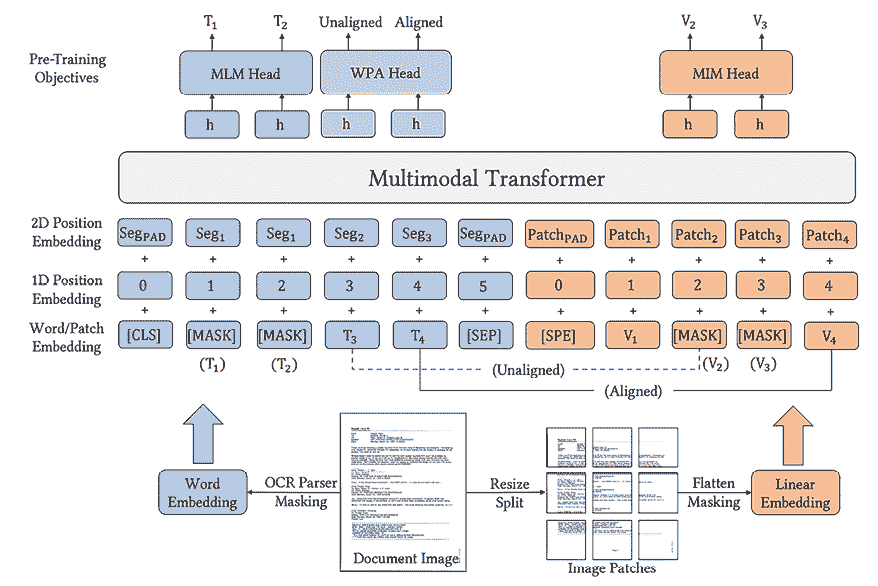

# 第十五章：结合计算机视觉和 NLP 技术

在上一章中，我们了解了结合强化学习和计算机视觉的应用。在本章中，我们将转而学习**卷积神经网络**（**CNN**）如何与 transformers 家族的算法结合使用，在自然语言处理中广泛使用（截至本书编写时）开发同时利用计算机视觉和 NLP 的解决方案。

为了理解如何结合 CNN 和 transformers，我们将首先学习**视觉 transformers**（**ViTs**）的工作原理以及它们如何帮助执行图像分类。之后，我们将学习如何利用 transformers 执行手写图像的转录，使用**Transformer 光学字符识别**（**TrOCR**）。接下来，我们将学习如何结合 transformers 和 OCR，使用名为**LayoutLM**的技术在文档图像上执行问答。最后，我们将学习如何使用名为**Bootstrapping Language Image Pre-training**（**BLIP2**）的 transformer 架构执行视觉问题回答。

在本章结束时，您将学习以下主题：

+   实现 ViTs 进行图像分类

+   实现 LayoutLM 进行文档问答

+   转录手写图像

+   使用 BLIP2 进行视觉问题回答

    建议您阅读关于使用最少数据点进行训练的补充章节，以熟悉在 GitHub 的`第一版额外章节`文件夹中提供的词嵌入。

本章的代码位于本书 GitHub 存储库的`Chapter15`文件夹中，链接为[`bit.ly/mcvp-2e`](https://bit.ly/mcvp-2e)。

随着领域的发展，我们将定期向 GitHub 存储库添加有价值的补充内容。请查看每章节目录中的`supplementary_sections`文件夹获取新的和有用的内容。

# 引入 transformers

在我们学习关于 ViTs 之前，让我们从自然语言处理的角度理解 transformers。一个 transformer 有助于生成一个最能描述给定上下文（周围单词）中单词的表示（单词/向量嵌入）。**递归神经网络**（**RNNs**）和**长短期记忆**（**LSTM**）架构（有关详细信息，请参阅相关的 GitHub 存储库）的一些主要限制包括：

+   与单词相关的词嵌入不依赖于单词出现的上下文（无论上下文是关于水果还是公司，单词*苹果*的嵌入都相同）。

+   在训练期间进行隐藏状态计算是顺序的（一个单词的隐藏状态依赖于前一个单词的隐藏状态，因此只能在前一个隐藏状态计算之后计算），导致处理文本所需的时间相当长。

Transformers 解决了这两个主要限制，导致：

+   利用大型数据语料库对变压器进行预训练的能力

+   将变压器微调到各种下游任务中（包括利用它们进行视觉任务）

+   在各种架构中利用中间状态/隐藏状态 – 仅编码器、仅解码器或编码器-解码器架构（更多关于编码器和解码器的内容在以下章节中）

+   相比于 RNN 的顺序训练，训练变压器输出可以并行进行

充分利用变压器的优势，让我们了解它们的工作原理。

## 变压器的基础

要理解变压器，让我们通过一个机器翻译的场景来了解 – 源语言为英语，目标语言为法语。

变压器架构可以如下所示：


图 15.1：变压器架构

（来源：[`arxiv.org/pdf/1706.03762`](https://arxiv.org/pdf/1706.03762)）

在上述架构中，左侧块是编码器，右侧块是解码器。让我们先了解编码器块。

### 编码器块

第一步是获取对应于英文输入句子的标记。在传统语言建模中，我们给罕见单词分配一个“未知”标记，并获取与其余（频繁的）单词对应的嵌入。然而，在变压器架构的标记化过程中，我们执行字节对编码（标记化），以一种使个别单词分解的方式（例如，单词 `anand` 可能会分解为 `###an`、`###and`，而像 `computer` 这样的频繁单词则保持原样）。这样，我们就不会有任何未知单词。此外，每个标记随后将具有相关联的嵌入。

因此，我们利用标记化来获得输入单词嵌入。

现在让我们学习一下位于变压器核心的**自注意力**模块。它以三个二维矩阵作为输入，分别称为**查询**（**Q**）、**键**（**K**）和**值**（**V**）矩阵。这些矩阵可以具有非常大的嵌入大小（因为它们将包含词汇 x 嵌入大小数量的值），因此首先被分成较小的组件（*以下图表中的步骤 1*），然后再运行经过缩放的点积注意力（*以下图表中的步骤 2*）：


图 15.2：缩放点积注意力和多头注意力的工作流程

让我们理解自注意力是如何工作的。假设我们有一个输入序列长度为 3 个标记 - 即，我们有三个词/标记嵌入（*W1*，*W2*，和 *W3*）。假设每个嵌入的大小为 512 个值。可以执行以下步骤：

1.  每个嵌入单独转换为三个额外的向量，即对应于每个输入的 `Q`、`K` 和 `V` 向量。在下面的图像中，`512` 是 Q、K 和 V 向量的嵌入维数，`3` 是序列长度（3 个单词/标记）：


图 15.3：初始化 Q、K 和 V 向量

1.  我们采用多头方法，将每个向量分成较小的“头部”（本例中为八个），每个键、查询和值张量有八组大小为 64 x 3 的向量。这里，`64` 是通过将 512（嵌入大小）除以 8（头部数）获得的，`3` 是序列长度：


图 15.4：每个头部的 Q、K 和 V 值

注意，由于有八个头部，将会有八组键、查询和值的张量集合。此外，每个头部可以学习单词的不同方面。

1.  在每个头部中，我们首先执行键转置和查询矩阵之间的矩阵乘法。这样，我们得到一个 3 x 3 的矩阵。将得到的矩阵除以向量的维数的平方根（在本例中为 `d = 64`）。通过 softmax 激活函数。现在，我们有一个显示每个单词与其他每个单词关系重要性的矩阵：


图 15.5：对 Q 和 K 向量的操作

1.  最后，我们对前述张量输出执行值张量的矩阵乘法，以获得自注意力操作的输出：


图 15.6：自注意力计算

形式上，这种缩放点积注意力计算可以写成：


在上述方程中，*d* 指向向量的维数（在本例中为 64），k 表示头部的索引。

在相关的 GitHub 仓库中，提供了有关一个样本输入和随机初始化的 Q、K 和 V 权重矩阵的逐步计算，文件名为 `self-attention.ipynb`，存放在 `Chapter15` 文件夹中，网址为 [`bit.ly/mcvp-2e`](https://bit.ly/mcvp-2e)。

1.  然后，我们使用 concat 层（*图 15.2* 中的 *步骤 3*）组合这一步骤的八个输出，最终得到一个大小为 512 x 3 的单一张量。由于有八个头部（即八个 Q、K 和 V 矩阵），该层也被称为 **多头自注意力**（来源：*Attention Is All You Need*，[`arxiv.org/pdf/1706.03762.pdf`](https://arxiv.org/pdf/1706.03762.pdf)）。

例如，在计算机视觉中，当搜索马等对象时，查询将包含信息以搜索大尺寸且通常为棕色、黑色或白色的对象。经缩放的点积注意力的 softmax 输出将反映包含这种颜色（棕色、黑色、白色等）的键矩阵的部分。因此，来自自注意力层的值输出将包含图像中大致符合所需颜色的部分，并存在于值矩阵中。

1.  然后，我们通过残差块传递多头注意力的输出，在这个残差块中，我们首先将多头注意力的输入和输出相加，然后对最终输出进行归一化。

1.  然后，我们通过线性网络传递输出，其维度与输入的维度相似。

我们多次使用自注意力块（如*图 15.1*中的`Nx`）。

### 解码器块

虽然解码器块与编码器块非常相似，但架构上有两个附加部分：

+   掩盖的多头注意力

+   交叉注意力

虽然多头注意力的工作方式与编码器块类似，但在计算给定时间步的令牌的注意力时，我们掩盖了未来时间步中的令牌。这样，我们构建网络，使其不会窥视未来的令牌。我们通过添加掩码/单位矩阵来掩盖未来的令牌，以确保在注意力计算期间不考虑未来的令牌。

编码器的键和值矩阵用作解码器的交叉头部注意力的键和查询输入，而值输入则由神经网络学习，独立于编码器的输入。我们将其称为交叉注意力，因为键和值矩阵从编码器层获取，而查询从解码器层获取。

最后，尽管这是一系列输入，但没有迹象表明哪个令牌（单词）是第一个，哪个是下一个。位置编码是可学习的嵌入，我们将其添加到每个输入中，作为其在序列中位置的函数。这样做是为了让网络理解序列中哪个单词嵌入是第一个，哪个是第二个，依此类推。

在 PyTorch 中创建 Transformer 网络的方法非常简单。您可以像这样创建一个内置的 transformer 块：

```py
from torch import nn
transformer = nn.Transformer(hidden_dim, nheads, \
                     num_encoder_layers, num_decoder_layers) 
```

在这里，`hidden_dim`是嵌入的大小，`nheads`是多头自注意力中的头数，而`num_encoder_layers`和`num_decoder_layers`分别是网络中编码和解码块的数量。

从头实现 transformers 的工作细节可以在 GitHub 存储库的`Chapter15`文件夹中的`Transformers_from_scratch.ipynb`文件中找到，具体链接为[`bit.ly/mcvp-2e`](https://bit.ly/mcvp-2e)。

现在我们知道 transformers 如何工作，在下一节中，让我们了解 ViTs 如何工作。

## ViTs 的工作原理

通过以下图示轻松理解 ViT：


图 15.7：ViT 架构（来源：[`arxiv.org/pdf/2010.11929`](https://arxiv.org/pdf/2010.11929)）

让我们看看在前面的图中遵循的工作流程：

1.  我们正在取出一张图像并从中提取 9（3 x 3）个补丁。例如，假设原始图像的大小为 300 x 300，每个 9 个补丁中的一个将是 100 x 100 的形状。

1.  接下来，我们取出每个补丁，将它们展开，并通过线性投影传递它们。这个练习类似于提取与单词（标记）对应的词嵌入。

1.  接下来，我们添加与补丁对应的位置嵌入。我们添加位置嵌入是因为我们需要保留补丁在原始图像中的位置信息。此外，我们还初始化一个类标记，这对于图像最终的分类非常有帮助。

1.  现在，所有嵌入都通过变换器编码器。在变换器中，这些嵌入经过一系列的归一化、多头注意力和线性头的跳跃连接（MLP 代表多层感知器）。

1.  现在，我们有了与每个补丁对应的输出嵌入。我们现在附加最终头部，具体取决于我们要解决的问题。在图像分类的情况下，我们只会为**分类**（**CLS**）标记附加一个线性层。其余补丁的输出可以用作下游任务（如物体识别或图像字幕）的特征提取器。

现在我们了解了 ViTs 的工作原理，我们将继续在数据集上实施变换器。

# 实施 ViTs

我们将在我们在*第 4*和*第五章*中使用的猫狗数据集上实施 ViTs：

以下代码可在本书 GitHub 存储库的`Chapter15`文件夹中的`ViT_Image_classification.ipynb`文件中找到，链接为`https://bit.ly/mcvp-2e`。

1.  安装和导入所需的包：

    ```py
    %pip install -U torch-snippets transformers kaggle
    from torch_snippets import *
    from transformers import ViTModel, ViTConfig
    from torch.optim import Adam
    model_checkpoint = 'google/vit-base-patch16-224-in21k' 
    ```

注意，我们将利用上述预训练的 ViT 模型（提供的检查点位置）。

1.  导入数据集：

    ```py
    %%writefile kaggle.json
    {"username":"xx", "key":"xx"}
    !mkdir -p ~/.kaggle
    !cp kaggle.json ~/.kaggle/
    !chmod 600 /root/.kaggle/kaggle.json
    !kaggle datasets download -d tongpython/cat-and-dog
    !unzip cat-and-dog.zip 
    ```

1.  指定训练数据的位置：

    ```py
    train_data_dir = 'training_set/training_set'
    test_data_dir = 'test_set/test_set' 
    ```

1.  指定数据集类，就像我们在*第 4*和*第五章*中所做的那样：

    ```py
    class CatsDogs(Dataset):
        def __init__(self, folder):
            cats = glob(folder+'/cats/*.jpg')
            dogs = glob(folder+'/dogs/*.jpg')
            self.fpaths = cats[:500] + dogs[:500]
            self.normalize = transforms.Normalize(mean=[0.485, 0.456, 0.406],
                                                  std=[0.229, 0.224, 0.225])
            from random import shuffle, seed; seed(10); shuffle(self.fpaths)
            self.targets = [fpath.split('/')[-1].startswith('dog') \
                                        for fpath in self.fpaths]
        def __len__(self): return len(self.fpaths)
        def __getitem__(self, ix):
            f = self.fpaths[ix]
            target = self.targets[ix]
            im = (cv2.imread(f)[:,:,::-1])
            im = cv2.resize(im, (224,224))
            im = torch.tensor(im/255)
            im = im.permute(2,0,1)
            im = self.normalize(im)
            return im.float().to(device), \
                      torch.tensor([target]).float().to(device) 
    ```

1.  定义 ViT 模型架构：

    ```py
    class ViT(nn.Module):
      def __init__(self, config=ViTConfig(), num_labels=1,
                   model_checkpoint='google/vit-base-patch16-224-in21k'):
            super(ViT, self).__init__()
            self.vit = ViTModel.from_pretrained(model_checkpoint, \
                                         add_pooling_layer=False)
            self.classifier1 = (nn.Linear(config.hidden_size, 128))
            self.classifier2 = (nn.Linear(128, num_labels))
            self.classifier = nn.Sequential(
                                            self.classifier1,
                                            nn.ReLU(),
                                            self.classifier2)
            for param in self.vit.parameters():
                param.requires_grad = False
      def forward(self, x):
        x = self.vit(x)['last_hidden_state']
        # Use the embedding of [CLS] token
        output = self.classifier(x[:, 0, :])
        output = torch.sigmoid(output)
        return output 
    ```

在前述架构中，我们获取与每个补丁对应的特征，获取第一个的特征（CLS 标记）并通过 sigmoid 层传递它，因为我们希望将其分类为可能的类之一。

1.  定义模型、损失函数和优化器：

    ```py
    model = ViT().to('cuda')
    loss_fn = nn.BCELoss()
    optimizer = torch.optim.Adam(model.parameters(), lr= 1e-3) 
    ```

1.  定义执行训练、计算准确度和获取数据的函数：

    ```py
    def train_batch(x, y, model, opt, loss_fn):
        model.train()
        prediction = model(x)
        batch_loss = loss_fn(prediction, y)
        batch_loss.backward()
        optimizer.step()
        optimizer.zero_grad()
        return batch_loss.item()
    @torch.no_grad()
    def accuracy(x, y, model):
        model.eval()
        prediction = model(x)
        is_correct = (prediction > 0.5) == y
        return is_correct.cpu().numpy().tolist()
    def get_data():
        train = CatsDogs(train_data_dir)
        trn_dl = DataLoader(train, batch_size=32, shuffle=True,
                                               drop_last = True)
        val = CatsDogs(test_data_dir)
        val_dl = DataLoader(val, batch_size=32, shuffle=True,
                                               drop_last = True)
        return trn_dl, val_dl
    trn_dl, val_dl = get_data() 
    ```

1.  在增加的 epochs 上训练模型：

    ```py
    n_epochs = 5
    report = Report(n_epochs)
    for epoch in range(n_epochs):
        train_epoch_losses, train_epoch_accuracies = [], []
        val_epoch_accuracies = []
        n = len(trn_dl)
        for ix, batch in enumerate(iter(trn_dl)):
            x, y = batch
            batch_loss = train_batch(x, y, model, optimizer, loss_fn)
            is_correct = accuracy(x, y, model)
            report.record(epoch+(ix+1)/n, trn_loss=batch_loss,
                                  trn_acc=np.mean(is_correct), end='\r')
        n = len(val_dl)
        for ix, batch in enumerate(iter(val_dl)):
            x, y = batch
            val_is_correct = accuracy(x, y, model)
            report.record(epoch+(ix+1)/n,
                          val_acc=np.mean(val_is_correct), end='\r')
        report.report_avgs(epoch+1) 
    ```

1.  训练和验证准确性如下：

    ```py
    report.plot(['trn_loss'], sz=3, figsize=(5,3))
    report.plot_epochs(['acc','trn_acc'], figsize=(5,3)) 
    ```


图 15.8：随着增加的 epochs 的训练损失和准确性

注意，准确性与我们在*第五章*中看到的 VGG 和 ResNet 的准确性相似。

在本节中，我们学习了如何利用仅编码器的变压器来执行图像分类。在下一节中，我们将学习如何利用基于编码器-解码器架构的变压器来转录包含手写单词的图像。

# 转录手写图像

想象一种情况，您必须从扫描文档中提取信息（从身份证或手动填写表格的图片中提取键和值）。您将不得不从图像中提取（转录）文本。由于以下变化，这个问题变得棘手：

+   手写

+   扫描/图片质量

+   光线条件

在本节中，我们将学习有关转录手写图像的技术。

让我们首先了解一下如何将变压器的编码器-解码器架构应用于手写图像的转录。

## 手写转录工作流程

我们将利用 TrOCR 架构（来源：[`arxiv.org/abs/2109.10282`](https://arxiv.org/abs/2109.10282)）来转录手写信息。

下图显示了所遵循的工作流程：


图 15.9：TrOCR 工作流程

如前面的图片所示，工作流程如下：

1.  我们接收输入并将其调整为固定的高度和宽度。

1.  然后，我们将图像分成一组补丁。

1.  然后，我们将补丁展平并获取与每个补丁对应的嵌入。

1.  我们将补丁嵌入与位置嵌入结合，并通过编码器传递它们。

1.  编码器的键和值向量被送入解码器的交叉注意力层，以在最终层中获取输出。

我们将使用 Microsoft 发布的`trocr-base-handwritten`模型来训练模型和标记器。让我们继续编写下一节的手写识别代码。

## 代码中的手写转录

可以遵循以下步骤进行手写转录：

此代码作为`TrOCR_fine_tuning.ipynb`在本书 GitHub 存储库的`Chapter15`文件夹中提供，网址为[`bit.ly/mcvp-2e`](https://bit.ly/mcvp-2e)。

1.  下载并导入图像数据集：

    ```py
    !wget https://www.dropbox.com/s/l2ul3upj7dkv4ou/synthetic-data.zip
    !unzip -qq synthetic-data.zip 
    ```

在前面的代码中，我们已经下载了包含图像的数据集；图像的文件名包含了与该图像对应的转录的真实信息。

从下载的图像中选取的样本如下：


图 15.10：样本图像及其真实信息（作为标题）

1.  安装所需的包并导入它们：

    ```py
    !pip install torch_snippets torch_summary editdistance jiwer accelerate
    from torch_snippets import *
    from torchsummary import summary
    import editdistance 
    ```

1.  指定图像的位置和从图像中提取真实信息的函数：

    ```py
    device = 'cuda' if torch.cuda.is_available() else 'cpu'
    fname2label = lambda fname: stem(fname).split('@')[0]
    images = Glob('synthetic-data/*') 
    ```

注意我们正在创建`fname2label`函数，因为在文件名中`@`符号后面的图像的真实信息是可用的。文件名的示例如下：


图 15.11：样本文件名

1.  从 25K 图像数据集中获取 5,000 个样本（图像及其对应的标签），以加快训练速度：

    ```py
    images_list = []
    labels_list = []
    for image in images:
      images_list.append(str(image).split('/')[-1])
      labels_list.append(fname2label(image))
    df = pd.DataFrame([images_list[:5000], labels_list[:5000]]).T
    df.columns = ['file_name', 'text'] 
    ```

1.  指定训练和测试的数据框架：

    ```py
    from sklearn.model_selection import train_test_split
    train_df, test_df = train_test_split(df, test_size=0.1)
    train_df.reset_index(drop=True, inplace=True)
    test_df.reset_index(drop=True, inplace=True) 
    ```

1.  定义 `Dataset` 类：

    ```py
    class IAMDataset(Dataset):
        def __init__(self, root_dir, df, processor, max_target_length=128):
            self.root_dir = root_dir
            self.df = df
            self.processor = processor
            self.max_target_length = max_target_length
        def __len__(self):
            return len(self.df)
        def __getitem__(self, idx):
            # get file name + text
            file_name = self.df['file_name'][idx]
            text = self.df['text'][idx]
            # prepare image (i.e. resize + normalize)
            image = Image.open(self.root_dir + file_name).convert("RGB")
            pixel_values = self.processor(image,
                               return_tensors="pt").pixel_values
            # add labels (input_ids) by encoding the text
            labels = self.processor.tokenizer(text,
                                           padding="max_length", 
                                 max_length=self.max_target_length).input_ids
            # important: make sure that PAD tokens are ignored by the loss function
            labels = [label if label != self.processor.tokenizer.pad_token_id \
                                               else -100 for label in labels]
            encoding = {"pixel_values": pixel_values.squeeze(), \
                        "labels": torch.tensor(labels)}
            return encoding 
    ```

在上述代码中，我们正在获取图像，并通过处理器获取像素值。此外，我们正在通过模型的标记生成器传递标签，以获取标签的标记。

1.  定义 `TrOCRProcessor`：

    ```py
    from transformers import TrOCRProcessor
    processor = TrOCRProcessor.from_pretrained("microsoft/trocr-base-handwritten") 
    ```

在上述代码中，我们正在定义处理器，预处理图像并对标签进行标记化。

1.  定义训练和评估数据集：

    ```py
    train_dataset = IAMDataset(root_dir='/content/synthetic-data/', \
                                  df=train_df, processor=processor)
    eval_dataset = IAMDataset(root_dir='/content/synthetic-data/', 
                                  df=test_df, processor=processor) 
    ```

1.  定义 `TrOCR` 模型：

    ```py
    from transformers import VisionEncoderDecoderModel
    model = VisionEncoderDecoderModel.from_pretrained("microsoft/trocr-base-
                                                                    stage1") 
    ```

1.  定义模型配置参数和训练参数：

    ```py
    # set special tokens used for creating the decoder_input_ids from the labels
    model.config.decoder_start_token_id = processor.tokenizer.cls_token_id
    model.config.pad_token_id = processor.tokenizer.pad_token_id
    # make sure vocab size is set correctly
    model.config.vocab_size = model.config.decoder.vocab_size
    # set beam search parameters
    model.config.eos_token_id = processor.tokenizer.sep_token_id
    model.config.max_length = 64
    model.config.early_stopping = True
    model.config.no_repeat_ngram_size = 3
    model.config.length_penalty = 2.0
    model.config.num_beams = 4
    from transformers import Seq2SeqTrainer, Seq2SeqTrainingArguments
    training_args = Seq2SeqTrainingArguments(
                                             predict_with_generate=True,
                                             evaluation_strategy="steps",
                                             per_device_train_batch_size=8,
                                             per_device_eval_batch_size=8,
                                             fp16=True,
                                             output_dir="./",
                                             logging_steps=2,
                                             save_steps=1000,
                                             eval_steps=100,
                                             num_train_epochs = 10
                                             ) 
    ```

1.  定义计算字符错误率的函数：

    ```py
    from datasets import load_metric
    cer_metric = load_metric("cer")
    def compute_metrics(pred):
        labels_ids = pred.label_ids
        pred_ids = pred.predictions
        pred_str = processor.batch_decode(pred_ids,
                                   skip_special_tokens=True)
        labels_ids[labels_ids == -100] = processor.tokenizer.pad_token_id
        label_str = processor.batch_decode(labels_ids, \
                                   skip_special_tokens=True)
        cer = cer_metric.compute(predictions=pred_str, references=label_str)
        return {"cer": cer} 
    ```

1.  训练模型：

    ```py
    from transformers import default_data_collator
    # instantiate trainer
    trainer = Seq2SeqTrainer(
                             model=model,
                             tokenizer=processor.feature_extractor,
                             args=training_args,
                             compute_metrics=compute_metrics,
                             train_dataset=train_dataset,
                             eval_dataset=eval_dataset,
                             data_collator=default_data_collator,
                             )
    trainer.train() 
    ```

上述代码的结果如下：


图 15.12：随着增加的 epoch 数，训练和验证损失以及字符错误率

注意，随着步骤的增加，错误率持续降低。

1.  对我们数据集中的样本图像进行推断：

    ```py
    # Load and preprocess the image
    image = Image.open("/content/synthetic-data/American@3WPOqS.png").convert("RGB")
    pixel_values = processor(image, return_tensors="pt").pixel_values
    # Perform inference
    model.eval()  # Set the model to evaluation mode
    with torch.no_grad():
        generated_ids = model.generate(pixel_values.to(device))
    # Decode the generated ids to text
    predicted_text = processor.batch_decode(generated_ids, \
                               skip_special_tokens=True)[0]
    show(image)
    print("Predicted Text:", predicted_text) 
    ```

上述代码的结果显示如下图像：


图 15.13：样本预测

到目前为止，我们已经了解了如何利用编码器-解码器架构进行手写识别。在接下来的部分，我们将学习如何利用变换器架构在文档中获取键和值。

# 文档布局分析

想象一种情景，你被要求从护照中提取各种键的值（例如姓名、出生日期、签发日期和到期日期）。在某些护照中，值位于键的下方；在其他护照中，它们位于键的右侧；还有些在键的左侧。我们如何构建一个能够为文档图像中的每个文本分配相应值的单一模型？在这种情况下，LayoutLM 非常有用。

## 理解 LayoutLM

LayoutLM 是一个在大量文档图像上预训练的模型。LayoutLM 的架构如下：


图 15.14：LayoutLM 架构（来源：[`arxiv.org/pdf/1912.13318`](https://arxiv.org/pdf/1912.13318)）

如前图所示，相应的工作流程包括以下步骤：

1.  我们拍摄文档的图像并提取各种单词及其边界框坐标（x0、x1、y0 和 y1） - 这是通过 OCR 工具完成的，它们不仅提供文本，还提供文档中文本所在的边界框。

1.  我们获取与这些边界框坐标对应的位置嵌入 - 位置嵌入是基于边界框坐标计算的。

1.  我们将从上述图片中提取的各种文本对应的嵌入（**文本嵌入**）添加到一起，其中我们通过标记器传递文本，进而通过预训练的**双向编码器转换器**（**BERT**）模型。

1.  在预训练的 LayoutLM 的训练阶段中，我们会随机屏蔽某些单词（但不是这些单词的位置嵌入），并根据上下文（周围单词及其对应的位置嵌入）预测屏蔽的单词。

1.  一旦预训练的 LayoutLM 模型被微调，我们通过将单词的文本嵌入与对应的单词位置嵌入相加来提取每个单词对应的嵌入。

1.  接下来，我们利用 Faster R-CNN 获取与单词位置对应的图像嵌入。我们利用图像嵌入以获取关于文本样式（例如粗体、斜体或下划线）的关键信息，这是 OCR 无法提供的。

1.  最后，我们执行下游任务，提取与图像对应的键和值。在文档键值提取的情况下，这对应于命名实体识别的任务，其中每个输出单词被分类为可能的键或与键相关联的值之一。

LayoutLMv3 是 LayoutLM 的改进版本，其架构如下：



图 15.15：LayoutLMv3 架构（来源：[`arxiv.org/pdf/2204.08387`](https://arxiv.org/pdf/2204.08387)）

前述架构展示了以下步骤：

1.  单词是使用典型的 OCR 解析器从图像中获取的。

1.  然后，使用 `RoBERTa` 模型将单词转换为嵌入（更多细节请见：[`arxiv.org/abs/1907.11692`](https://arxiv.org/abs/1907.11692)）。

1.  文档被调整为固定形状，然后转换为多个补丁。

1.  每个补丁都被展平并通过线性层传递，以获得与补丁对应的嵌入。

1.  1D 位置嵌入对应于单词/补丁的索引，而 2D 位置嵌入对应于边界框/段落。

1.  一旦嵌入就位，我们执行掩码预训练（`MLM Head`），方式类似于 LayoutLM，其中我们掩码某些单词并使用上下文预测它们。类似地，在**掩码图像建模**（**MIM Head**）中，我们掩码某些块并预测块内的标记。

1.  然后执行**单词补丁对齐**（**WPA Head**），这指的是预测掩码图像补丁是否具有相应的掩码标记。如果一个标记被掩码，并且相应的图像补丁也被掩码，则它是对齐的；如果其中一个被掩码而另一个没有，则它是不对齐的。

在接下来的章节中，我们将学习如何实现这一点。

## 实施 LayoutLMv3

让我们使用一个护照数据集编写`LayoutLMv3`的代码 - 在这里，我们尝试将图像中的每个标记与相应的键或值关联起来：

以下代码位于本书 GitHub 仓库的`Chapter15`文件夹中的`LayoutLMv3_passports.ipynb`中，地址为[`bit.ly/mcvp-2e`](https://bit.ly/mcvp-2e)。

1.  安装所需的包并导入它们：

    ```py
    %pip install transformers[torch] datasets seqeval torch-snippets torchinfo lovely_tensors
    from torch_snippets import *
    from builtins import print 
    ```

1.  导入一个合成护照数据集：

    ```py
    from datasets import load_dataset
    dataset = load_dataset('sizhkhy/passports') 
    ```

输入数据集包含单词、框和标签，如下所示：


图 15.16：样本期望输出

一个样本图像如下所示：


图 15.17：样本合成护照

1.  指定训练和测试集划分：

    ```py
    examples_train = dataset['train']
    examples_eval = dataset['valid'] 
    ```

1.  指定`label2id`和`id2label`的映射：

    ```py
    id2label = {i:v for i, v in set(list(zip(\
                                flatten(examples_train['labels']), \
                                flatten(examples_train['label_string']))))}
    label2id = {v:i for i, v in id2label.items()} 
    ```

1.  定义处理器并准备函数来编码输入：

    ```py
    from transformers import AutoProcessor
    processor = AutoProcessor.from_pretrained("microsoft/layoutlmv3-base", apply_ocr=False)
    def prepare_examples(examples):
      images = examples['image']
      words = examples['words']
      boxes = examples['boxes']
      word_labels = examples['labels']
      encoding = processor(images, words, boxes=boxes, \
                           word_labels=word_labels,
                           truncation=True, padding="max_length")
      return encoding 
    ```

在上述代码中，我们正在利用预训练的`LayoutLMv3`模型的处理器，我们正在对我们的数据集进行微调。然后，我们通过处理器传递图像、单词和框来获得相应的编码。

1.  准备训练和评估数据集：

    ```py
    train_dataset = examples_train.map(
                                  prepare_examples,
                                  batched=True,
                                  remove_columns=examples_train.column_names,
                                  )
    eval_dataset = examples_eval.map(
                                  prepare_examples,
                                  batched=True,
                                  remove_columns=examples_eval.column_names,
                                  ) 
    ```

1.  定义评估指标：

    ```py
    from datasets import load_metric
    metric = load_metric("seqeval") 
    ```

1.  定义计算指标的函数：

    ```py
    return_entity_level_metrics = False
    def compute_metrics(p):
        predictions, labels = p
        predictions = np.argmax(predictions, axis=2)
        # Remove ignored index (special tokens)
        true_predictions = [[id2label[p] for (p, l) in \
                      zip(prediction, label) if l != -100] \
              for prediction, label in zip(predictions, labels)]
        true_labels = [[id2label[l] for (p, l) in \
                       zip(prediction,label) if\ l != -100] \
               for prediction, label in zip(predictions,labels)]
        results = metric.compute(predictions=true_predictions,
                                         references=true_labels)
        if return_entity_level_metrics:
            # Unpack nested dictionaries
            final_results = {}
            for key, value in results.items():
                if isinstance(value, dict):
                    for n, v in value.items():
                        final_results[f"{key}_{n}"] = v
                else:
                    final_results[key] = value
            return final_results
        else:
            return {
                "precision": results["overall_precision"],
                "recall": results["overall_recall"],
                "f1": results["overall_f1"],
                "accuracy": results["overall_accuracy"]} 
    ```

在上述代码中，我们正在获取非填充的真实输出并计算精确度、召回率、F1 分数和准确度指标。

1.  通过从 transformers 库导入相关模块来定义预训练的`LayoutLMv3`模型：

    ```py
    from transformers import LayoutLMv3ForTokenClassification
    model = LayoutLMv3ForTokenClassification.from_pretrained(
                         "microsoft/layoutlmv3-base",
                         id2label=id2label,
                         label2id=label2id
                         ) 
    ```

在上述代码中，我们正在定义我们将用于微调模型的基础模型。

1.  定义训练参数：

    ```py
    from transformers import TrainingArguments, Trainer
    training_args = TrainingArguments(output_dir="test",
                                  max_steps=100,                                 
                                  per_device_train_batch_size=2,                                 
                                  per_device_eval_batch_size=2,
                                  learning_rate=1e-5,                                 
                                  evaluation_strategy="steps",
                                  eval_steps=50,                                 
                                  load_best_model_at_end=True,                                
                                  metric_for_best_model="f1") 
    ```

1.  初始化训练器并训练模型：

    ```py
    from transformers.data.data_collator import default_data_collator
    # Initialize our Trainer
    trainer = Trainer(
        model=model,
        args=training_args,
        train_dataset=train_dataset,
        eval_dataset=eval_dataset,
        tokenizer=processor,
        data_collator=default_data_collator,
        compute_metrics=compute_metrics,
    )
    trainer.train() 
    ```

1.  接下来，我们进行推断（推断的代码在相关的 GitHub 仓库中提供），以获取输入图像的结果。以下是使用预测的键和值进行的样本推断（这些键和值作为图像内的边界框存在）：


图 15.18：预测输出及提取的不同键和值的边界框

在这一部分，我们已经学习了从文档中提取键和值的方法。在下一部分中，我们将学习如何在给定一张通用图像的情况下执行问答任务。

# 视觉问答

想象一种情景，你拿到一张图像，并被要求根据图像回答某些问题。这是一种**视觉问答**（**VQA**）的任务。VQA 的高级策略可以利用预训练的图像编码图像信息，使用**大型语言模型**（**LLM**）编码问题（文本），然后使用图像和文本表示来生成（解码）答案 - 实质上是一个多模态模型，既可以接收文本输入也可以接收图像输入。

通过获取与图像对应的标题并在标题上执行问答，执行视觉问答的一种方式。

要理解为什么我们不能使用这个，让我们看一下下面的图像：


图 15.19：示例图像

一组关于原始图像标题的可能问题：

| **提取的标题** | **问题** |
| --- | --- |
| 一只戴着墨镜的猫 | 图像的主题是什么？ |
| 一只戴着墨镜的猫 | 图像的背景颜色是什么？ |

表 15.1：给定图像的一些问题

在前面的情景中，虽然我们可以回答第一个问题，但我们无法回答第二个问题，因为与问题相关的信息没有在上下文中提取出来（提取的标题）。

让我们了解一下 BLIP2 - 一个帮助解决这个问题的模型。

## 引入 BLIP2

在我们刚刚讨论的高级策略中讨论的编码器-解码器模型的一个问题是，当 VQA 模型整合视觉感知和语言理解时，模型可能会导致灾难性遗忘。当这些模型使用新的视觉或语言模式进行更新时，这两个领域之间复杂的相互作用可能会导致先前学习的模式被遗忘。

使用冻结图像编码器和 LLMs（BLIP2）通过独特的架构解决了这个问题：


图 15.20：BLIP2 架构（来源：[`ar5iv.labs.arxiv.org/html/2301.12597`](https://ar5iv.labs.arxiv.org/html/2301.12597)）

查询变换器（Q-Former）充当了从图像编码器到 LLM 的桥梁。

Q-Former 从图像中提取与所问问题最相关的信息；因此，在本节开头呈现的情景中，它将从图像中提取与所问问题最相关的视觉信息。现在，我们将上下文（Q-Former 提取的信息）附加到问题并将其作为输入提供给 LLM。

本质上，Q-Former 充当了从图像编码器到 LLM 的桥梁，以修改从图像中提取的特征，使其与所问问题最相关。

Q-Former 训练有两个阶段：

1.  从冻结编码器中引导视觉-语言表示学习

1.  从冻结的 LLM 中引导视觉-语言生成学习

让我们详细看看这些阶段。

### 表示学习

在表示学习阶段，我们将 Q-Former 连接到冻结的图像编码器，并使用图像-文本对进行预训练。我们的目标是训练 Q-Former，使得这些查询（32 个可学习查询向量）能够学习提取与文本最相关的视觉表示。

我们共同优化了三个预训练目标，它们共享相同的输入格式和模型参数。每个目标使用不同的注意屏蔽策略来控制查询和文本之间的交互。

下图说明了这一点：


图 15.21：表示学习的详细信息（来源：[`arxiv.org/pdf/2301.12597.pdf`](https://arxiv.org/pdf/2301.12597.pdf)）

如前图所示，三个目标如下：

+   **图像-文本匹配：** 在这个任务中，在自注意模块内，查询标记可以关注文本标记，而文本标记可以关注查询向量。这个预训练的目标是执行图像和文本对是否匹配的二元分类。

+   **基于图像的文本生成：** 在这个任务中，在自注意模块中，查询向量不能访问（被屏蔽）文本标记，而文本标记可以访问查询向量以及先前生成的标记。此训练的目标是生成与图像匹配的文本。

+   **图像-文本对比学习：** 在这个任务中，我们有一个共享的自注意模块，用于学习的查询和输入文本之间。学习的查询与图像编码器交互以获取输出向量。输入文本转换为嵌入向量，并与自注意和前馈网络交互以生成对应文本的嵌入。我们预训练 Q-Former，使其对匹配的图像-文本对具有高相似度，并对图像与不同文本的情况具有低相似度（类似于 CLIP 的训练方式）。请注意，虽然自注意层是共享的，但文本标记被屏蔽，以防止两者之间信息泄漏。

通过上述三种预训练目标，我们完成了表示学习练习，从中提取了对文本最具信息性的视觉信息。

### 生成学习

在生成学习阶段，我们通过 Q-Former 传递学习的查询以获得输出向量，然后通过全连接层传递以获得与文本嵌入维度相同的嵌入。可以如下所示：


图 15.22：生成学习的详细信息（来源：[`ar5iv.labs.arxiv.org/html/2301.12597`](https://ar5iv.labs.arxiv.org/html/2301.12597)）

现在我们有两种通过冻结的 LLM 生成文本的方式。基于解码器的 LLM 接收**全连接**（**FC**）层的输出并生成输出文本，而基于编码器-解码器的模型接收 FC 输出和前缀文本的连接以生成后续文本。

通过上述方法，我们完成了预训练 BLIP2 的两个阶段，并获得了与所提问题最相关的上下文。这是我们如何为问题提供最相关的图像背景并生成答案的方法。让我们继续在下一节实现 BLIP2。

## 实施 BLIP2

在本节中，我们将利用 BLIP2 执行以下任务：

+   图像字幕

+   图像问题回答

您可以使用以下步骤来实现此操作：

此代码在本书 GitHub 存储库的`Chapter15`文件夹中的`Visual_Question_answering.ipynb`文件中提供，网址为[`bit.ly/mcvp-2e`](https://bit.ly/mcvp-2e)。

1.  导入所需的包并加载模型：

    ```py
    import torch
    from transformers import AutoProcessor, Blip2ForConditionalGeneration
    device = "cuda" if torch.cuda.is_available() else "cpu"
    MODEL_ID = "Salesforce/blip2-opt-2.7b"
    processor = AutoProcessor.from_pretrained(MODEL_ID)
    model = Blip2ForConditionalGeneration.from_pretrained(MODEL_ID,
                                   torch_dtype=torch.float16)
    model.to(device) 
    ```

请注意，该模型需要高显存，因此我们在 Colab 上使用了 V100 机器。

1.  加载图像 - 您可以使用任何您选择的图像：

    ```py
    import requests
    from PIL import Image
    image = Image.open('/content/Tejas.jpeg') 
    ```


图 15.23：示例图像

1.  将图像通过处理器以生成与图像相对应的标题：

    ```py
    inputs = processor(image, return_tensors="pt").to(device,
                                                 torch.float16)
    generated_ids = model.generate(**inputs, max_new_tokens=20)
    generated_text = processor.batch_decode(generated_ids, skip_special_tokens=True)[0].strip()
    print(generated_text) 
    ```

这给我们带来了以下输出：

```py
a baby wearing a party hat sits on a bed 
```

1.  对图像执行问题回答：

    ```py
    prompt = "Question: what is the color of baby's trousers? Answer:"
    inputs = processor(image, text=prompt, return_tensors="pt").to(device, torch.float16)
    generated_ids = model.generate(**inputs, max_new_tokens=10)
    generated_text = processor.batch_decode(generated_ids, skip_special_tokens=True)[0].strip()
    print(generated_text) 
    ```

上述代码的输出结果为`blue`。

注意，在执行问题回答时，我们应明确提及问题的开始和答案的开始，如提示所提供。

# 摘要

在本章中，我们了解了变压器的工作原理。此外，我们还学习了如何利用 ViT 进行图像分类。然后，我们学习了如何在学习手写转录时利用 TrOCR 进行文档理解，以及如何从文档中利用 LayoutLM 提取键值对。最后，我们了解了如何使用预训练的 BLIP2 模型进行视觉问题回答。

通过这些内容，您应该可以轻松处理一些最常见的真实世界用例，例如文档上的 OCR，从文档中提取键值对，以及图像上的视觉问题回答（处理多模态数据）。此外，通过对变换器的理解，您现在可以深入了解基础模型的下一章。

# 问题

1.  自注意力的输入、计算步骤和输出是什么？

1.  图像如何在视觉变换器中转换为序列输入？

1.  在 LayoutLM 模型中，BERT 变换器的输入是什么？

1.  BLIP 的三个目标是什么？

# 在 Discord 上了解更多信息

加入我们社区的 Discord 空间，与作者和其他读者进行讨论：

[`packt.link/modcv`](https://packt.link/modcv)


