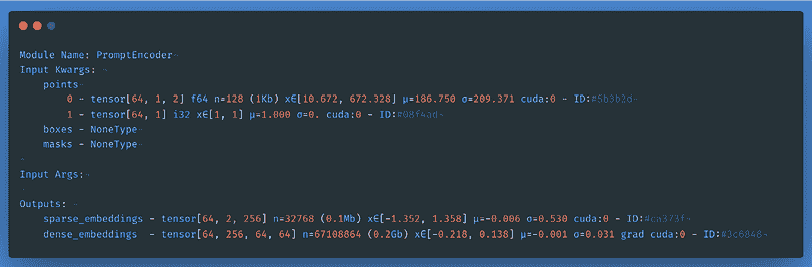
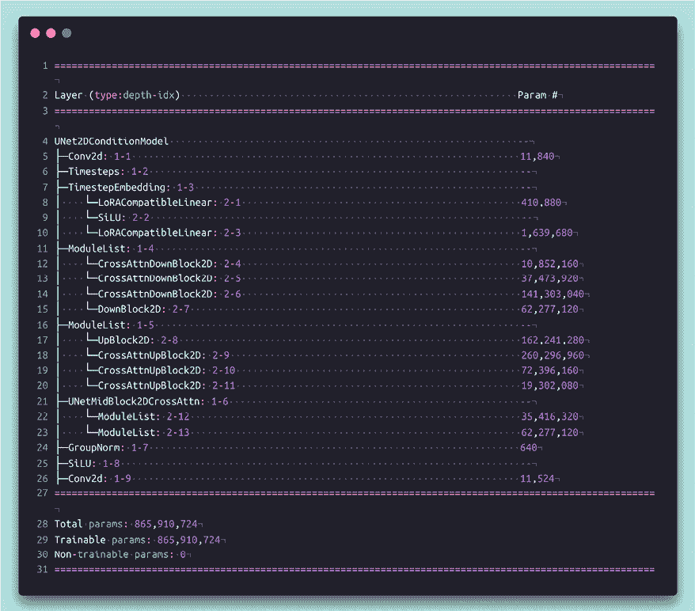
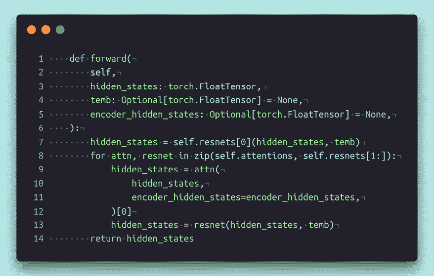

# 16

# 计算机视觉中的基础模型

在前一章中，我们了解了如何使用 NLP 和 CV 技术构建新型应用程序。然而，这需要大量的训练，要么是从头开始，要么是通过微调预训练模型。当利用预训练模型时，该模型通常已经在大型数据语料库上进行了训练 - 例如，像 ImageNet 这样的数据集，其中包含大约 2100 万张图像。然而，在互联网上，我们可以访问数亿张图像及其对应的 alt 文本。如果我们在互联网规模的数据上预训练模型，并将这些模型用于涉及对象检测、分割和文本到图像生成的各种应用程序，而无需进行任何微调，会怎么样？这构成了基础模型的基石。

在本章中，我们将学习以下内容：

+   利用图像和文本嵌入来识别给定文本的最相关图像，反之亦然。

+   利用图像和文本编码进行零样本图像物体检测和分割

+   从头开始构建扩散模型，使用该模型我们将有条件地（通过文本提示）和无条件地生成图像

+   提示工程生成更好的图像

更具体地说，我们将学习**对比语言-图像预训练**（**CLIP**），它可以识别与给定文本相关的图像，反之亦然，结合图像编码器和提示（文本）编码器来识别图像内的区域/段落。我们还将学习如何利用基于 CNN 的架构与**稳定扩散**模型（**SAM**）进行零样本分割，比基于变压器的零样本分割快约 50 倍。我们还将了解**Stable Diffusion**模型及其 XL 变体的基础知识。

本章中的所有代码片段都可以在 GitHub 存储库的`Chapter16`文件夹中找到，网址为[`bit.ly/mcvp-2e`](https://bit.ly/mcvp-2e)。

随着领域的发展，我们将定期向 GitHub 存储库添加有价值的补充内容。请查看每个章节目录中的`supplementary_sections`文件夹获取新的有用内容。

# 介绍 CLIP

想象一种情景，在这种情况下，您可以访问一个图像数据集。您并未获得数据集中每个图像对应的标签。然而，您拥有一个详尽的列表，其中包含图像数据集中所有唯一标签的信息。对于给定的图像，您将如何分配可能的标签？

在这种情况下，CLIP 来拯救。CLIP 为每个图像和标签提供一个嵌入（与图像相关的文本 - 通常是图像类别或图像的标题）。通过计算图像嵌入和所有唯一标签的文本嵌入之间的相似性，我们可以将图像与最可能的标签关联，其中与图像嵌入最相似的标签是最可能的标签。

在下一节中，让我们先了解一下 CLIP，然后从头构建一个 CLIP 模型，再使用一个预训练模型。

## CLIP 的工作原理

要了解 CLIP 如何工作，让我们拆解首字母缩写**CLIP**（**对比语言-图像预训练**）：

+   预训练：模型在一个庞大的数据语料库上进行训练。

+   语言-图像预训练：该模型在包含图片及其对应文本（例如图片的 alt-text）的大量数据语料库上进行训练。

+   对比语言-图像预训练：语言-图像预训练是这样进行的，即相似图片的图像和文本嵌入将是相似的，而一个对象的图像嵌入与另一个对象对应的文本嵌入将尽可能不相似。

让我们通过以下图表来理解这一点：


图 16.1：CLIP 概述

在上述图中，我们有一组图片和文字。此外，我们还有一组嵌入（i[1]、i[2]...i[N]），这些嵌入是通过将这些图片传递到图像编码器后获得的，以及一组对应的文本嵌入（t[1]、t[2]...t[N]），这些嵌入是通过将文本传递到文本编码器后获得的。

现在我们需要以一种方式训练模型，使得 i[N]与 t[N]有很高的相似度，并且与对应其他图片的文本嵌入的相似度非常低。

在下一节中，让我们继续从头训练 CLIP 模型。

## 从头构建一个 CLIP 模型

要从头构建一个 CLIP 模型，我们将利用 FLICKR-8K 数据集，因为它包含了图片和相关的标题：

下面的代码可以在 GitHub 仓库的`Chapter16`文件夹中的`CLIP_from_scratch.ipynb`文件中找到，网址为[`bit.ly/mcvp-2e`](https://bit.ly/mcvp-2e)。确保从笔记本中运行代码，并参考这里提供的解释以理解不同的步骤。你需要一个 Kaggle 账户来下载数据。

1.  安装所需的包并导入所需的模块：

    ```py
    %%capture
    import os
    if not os.path.exists("MCVP2e-CLIP"):
      !git clone https://github.com/sizhky/MCVP2e-CLIP.git
      %pip install -r MCVP2e-CLIP/requirements.txt
    %cd MCVP2e-CLIP 
    ```

1.  导入所需的包：

    ```py
    import itertools
    from torch_snippets import *
    from clip.core import download_flickr8k_from_kaggle
    from clip.config import ClipConfig
    from clip.dataset import CLIPDataset
    from clip.models import CLIP 
    ```

1.  提供你的 Kaggle 凭证：

    ```py
    %%writefile kaggle.json
    {"username":"XXXX","key":"XXXX"} 
    ```

1.  下载 Flickr 数据集。在运行下一行代码之前，请确保你同意 Kaggle 网页上的条款[`www.kaggle.com/datasets/adityajn105/flickr8k`](https://www.kaggle.com/datasets/adityajn105/flickr8k)，否则无法下载。


1.  ```py
    kaggle_json_path = P("kaggle.json")
    data_download_path = P("/content/flickr-8k-kaggle/")
    download_flickr8k_from_kaggle(kaggle_json_path, data_download_path)
    df = pd.read_csv(data_download_path / "captions.txt")
    df["id"] = [id_ for id_ in range(len(df) // 5) for _ in range(5)]
    df.to_csv(data_download_path / "captions.csv") 
    ```

1.  设置你的训练配置：

    ```py
    config = ClipConfig()
    config.image_path = data_download_path / "Images"
    config.captions_csv_path = data_download_path / "captions.csv"
    # Make any other experiment changes, if you want to, below
    config.debug = False  # Switch to True, in case you want to reduce the dataset size
    config.epochs = 1
    config.save_eval_and_logging_steps = 50 
    ```

建议您查看 GitHub 笔记本中的完整`ClipConfig`类，并了解各个参数 - 图像编码器和文本编码器的学习率、周期数、后端模型名称、图像和文本嵌入、文本的最大序列长度以及投影层的维度（因为图像和文本的嵌入维度不同）。现在，我们只是指向正确的数据集路径并设置周期数。

1.  创建训练和验证数据集。

数据集的关键组件如下（代码从`dataset.py`脚本导入）。

1.  ```py
    class CLIPDataset(Dataset):
        def __init__(self, df, config, mode):
            """
            image_filenames and captions must have the same length; so, if there are
            multiple captions for each image, the image_filenames must have repetitive
            file names
            """
            self.config = config
            self.tokenizer = DistilBertTokenizer.from_pretrained(
                config.distilbert_text_tokenizer
            )
            self.image_filenames = df.image.tolist()
            self.captions = df.caption.tolist()
            with notify_waiting(f"Creating encoded captions for {mode} dataset..."):
                self.encoded_captions = self.tokenizer(
                    self.captions,
                    padding=True,
                    truncation=True,
                    max_length=config.max_length,
                )
            self.transforms = get_transforms(config)
        def __getitem__(self, idx):
            item = {
                key: torch.tensor(values[idx])
                for key, values in self.encoded_captions.items()
            }
            image = \ 
    read(f"{self.config.image_path}/{self.image_filenames[idx]}", 1)
            image = self.transforms(image=image)
            item["image"] = torch.tensor(image).permute(2, 0, 1).float()
            item["caption"] = self.captions[idx]
            return item
        def __len__(self):
            return len(self.captions) 
    ```

所有文本都使用 DistilBert 分词器进行标记化。所有图像都被转换为固定大小，并使用`get_transforms`方法进行归一化。我们已经因简洁起见省略了`Dataset`类中使用的其他方法的解释。但是，请务必检查类并理解`dataset.py`脚本中定义的不同方法。

使用以下代码片段创建训练和验证数据集：

1.  ```py
    trn_ds, val_ds = CLIPDataset.train_test_split(config) 
    ```

1.  加载模型：

    ```py
    model = CLIP(config).to(config.device) 
    ```

1.  让我们看看模型的关键组件：

    1.  `ImageEncoder`类：使用`ImageEncoder`类，我们获取图像的嵌入，该嵌入是通过经过预训练的 resnet-50 模型传递图像得到的：

    ```py
    class ImageEncoder(nn.Module):
        """
        Encode images to a fixed size vector
        """
        def __init__(
            self, model_name=CFG.model_name, 
                  pretrained=CFG.pretrained,  
                  trainable=CFG.trainable):
            super().__init__()
            self.model = timm.create_model(
                model_name, pretrained, num_classes=0, 
                                       global_pool="avg")
            for p in self.model.parameters():
                p.requires_grad = trainable
        def forward(self, x):
            return self.model(x) 
    ```

    1.  `TextEncoder`通过将文本（标记）通过 BERT 模型来将标记转换为嵌入。

    ```py
    class TextEncoder(nn.Module):
        def __init__(self, model_name=CFG.text_encoder_model, 
            pretrained=CFG.pretrained, trainable=CFG.trainable):
            super().__init__()
            if pretrained:
                self.model = DistilBertModel.from_pretrained(model_name)
            else:
                self.model = DistilBertModel(config=DistilBertConfig())

            for p in self.model.parameters():
                p.requires_grad = trainable
            # we are using CLS token hidden representation as   
            # the sentence's embedding
            self.target_token_idx = 0
        def forward(self, input_ids, attention_mask):
            output = self.model(input_ids=input_ids, 
                                  attention_mask=attention_mask)
            last_hidden_state = output.last_hidden_state
            return last_hidden_state[:,self.target_token_idx, :] 
    ```

    1.  `ProjectionHead`：由于文本编码器输出为 768 维，而图像编码器为 2048 维，我们需要将它们调整到相同的维度以进行比较。

    ```py
    class ProjectionHead(nn.Module):
        def __init__(
            self,
            embedding_dim,
            projection_dim=CFG.projection_dim,
            dropout=CFG.dropout
        ):
            super().__init__()
            self.projection = nn.Linear(embedding_dim, projection_dim)
            self.gelu = nn.GELU()
            self.fc = nn.Linear(projection_dim, projection_dim)
            self.dropout = nn.Dropout(dropout)
            self.layer_norm = nn.LayerNorm(projection_dim)

        def forward(self, x):
            projected = self.projection(x)
            x = self.gelu(projected)
            x = self.fc(x)
            x = self.dropout(x)
            x = x + projected
            x = self.layer_norm(x)
            return x 
    ```

1.  构建`CLIPModel`。为此，我们获得相同维度的`image_embedding`和`text_embedding`。接下来，我们计算 logits 来理解文本和图像嵌入之间的相似性。然后，我们计算给定图像的嵌入与其余图像的嵌入之间的相似性（文本同理）。最后，根据相似图像具有相似嵌入和不相似图像具有远离的嵌入的直觉，计算总体损失：

    ```py
    class CLIPModel(nn.Module):
        def __init__(
            self,
            temperature=CFG.temperature,
            image_embedding=CFG.image_embedding,
            text_embedding=CFG.text_embedding,
        ):
            super().__init__()
            self.image_encoder = ImageEncoder()
            self.text_encoder = TextEncoder()
            self.image_projection = \ 
                  ProjectionHead(embedding_dim=image_embedding)
            self.text_projection = \ 
                  ProjectionHead(embedding_dim=text_embedding)
            self.temperature = temperature
        def forward(self, batch):
            # Getting Image and Text Features
            image_features = self.image_encoder(batch["image"])
            text_features = self.text_encoder( \
                                  input_ids=batch["input_ids"],  
                        attention_mask=batch["attention_mask"])
    # Getting Image and Text Embeddings (with same dimension)
            image_embeddings= self.image_projection(image_features)
            text_embeddings = self.text_projection(text_features)
            # Calculating the Loss
            logits = (text_embeddings @ image_embeddings.T)/self.temperature
            images_similarity = image_embeddings @ image_embeddings.T
            texts_similarity = text_embeddings @ text_embeddings.T
            targets = F.softmax( (images_similarity + texts_similarity) / 2 * \
                                               self.temperature, dim=-1)
            texts_loss = cross_entropy(logits, targets, reduction='none')
            images_loss = cross_entropy(logits.T, targets.T, reduction='none')
            loss =  (images_loss + texts_loss) / 2.0 # shape: (batch_size)
            return {"loss": loss.mean()} 
    ```

    在上述代码中使用的损失函数如下：

    ```py
    def cross_entropy(preds, targets, reduction='none'):
        log_softmax = nn.LogSoftmax(dim=-1)
        loss = (-targets * log_softmax(preds)).sum(1)
        if reduction == "none":
            return loss
        elif reduction == "mean":
            return loss.mean() 
    ```

我们将输出作为一个字典返回，其中包含`loss`键，以保持与 Hugging Face 的兼容性。

1.  加载优化器并定义图像编码器和文本编码器的学习率。

    ```py
    params = [
        {"params": model.image_encoder.parameters(), "lr": 
                                       config.image_encoder_lr},
        {"params": model.text_encoder.parameters(), "lr": 
                                       config.text_encoder_lr},
        {
            "params": itertools.chain(
                model.image_projection.parameters(), 
                model.text_projection.parameters()
            ),
            "lr": config.head_lr,
            "weight_decay": config.weight_decay,
        },
    ]
    optimizer = torch.optim.AdamW(params, weight_decay=0.0)
    lr_scheduler=torch.optim.lr_scheduler.ReduceLROnPlateau( \
                                                    optimizer, mode="min",
                                                    patience=config.patience,
                                                    factor=config.factor) 
    ```

1.  使用 Hugging Face API 进行训练：

    ```py
    from transformers import Trainer, TrainingArguments
    # Define TrainingArguments
    training_args = TrainingArguments(
        output_dir="./results",  # Output directory where checkpoints and logs will be saved.
        num_train_epochs=config.epochs,  # Total number of training epochs.
        per_device_train_batch_size=config.batch_size,  # Batch size per GPU.
        per_device_eval_batch_size=config.batch_size,  # Batch size for evaluation
        evaluation_strategy="steps",  # Evaluation strategy (steps, epoch).
        logging_strategy="steps",  # Logging strategy (steps, epoch).
        save_strategy="steps",  # Save strategy (steps, epoch).
        save_total_limit=2,  # Limit the total amount of checkpoints.
        learning_rate=5e-5,  # Learning rate.
        logging_steps=config.save_eval_and_logging_steps,
        save_steps=config.save_eval_and_logging_steps,# Save checkpoints every N #steps.
        eval_steps=config.save_eval_and_logging_steps,  # Evaluate every N steps.
        logging_dir="./logs",  # Directory for storing logs.
        metric_for_best_model="loss",
        label_names=["image", "input_ids"],
    )
    # Create Trainer
    trainer = Trainer(
                      model=model,
                      args=training_args,
                      train_dataset=trn_ds,
                      eval_dataset=val_ds,
                      optimizers=(optimizer, lr_scheduler),
    )
    # Train the model
    trainer.train() 
    ```

**注意**

类似于 detectron 训练器、mmaction2 运行器，我们有一个 Hugging Face 训练器，它是围绕`opt.zero_grad()`、`loss.backward()`等步骤的封装，以使训练代码对最终用户简洁。深入研究实际的训练器类留作你的练习。

1.  训练完成后，我们可以获取与所有图像对应的嵌入：

    ```py
    def get_image_embeddings(valid_df, model_path):
        tokenizer = DistilBertTokenizer.from_pretrained(CFG.text_tokenizer)
        valid_loader = build_loaders(valid_df, tokenizer, mode="valid")

        model = CLIPModel().to(CFG.device)
        model.load_state_dict(torch.load(model_path, 
                                  map_location=CFG.device))
        model.eval()

        valid_image_embeddings = []
        with torch.no_grad():
            for batch in tqdm(valid_loader):
                image_features = \ 
              model.image_encoder(batch["image"].to(CFG.device))
                image_embeddings = \ 
                model.image_projection(image_features)
                valid_image_embeddings.append(image_embeddings)
        return model, torch.cat(valid_image_embeddings)
    _, valid_df = make_train_valid_dfs()
    model, image_embeddings = get_image_embeddings(valid_df, "best.pt") 
    ```

1.  查找与给定查询（用户输入文本）的匹配项：

    ```py
    def find_matches(model, image_embeddings, query, image_filenames, n=9):
        tokenizer = DistilBertTokenizer.from_pretrained(CFG.text_tokenizer)
        encoded_query = tokenizer([query])
        batch = {
            key: torch.tensor(values).to(CFG.device)
            for key, values in encoded_query.items()
        }
        with torch.no_grad():
            text_features = model.text_encoder(
                input_ids=batch["input_ids"], 
                attention_mask=batch["attention_mask"]
            )
            text_embeddings = model.text_projection(text_features)

        image_embeddings_n = F.normalize(image_embeddings, p=2, dim=-1)
        text_embeddings_n = F.normalize(text_embeddings, p=2, dim=-1)
        dot_similarity = text_embeddings_n@image_embeddings_n.T

        values, indices = torch.topk(dot_similarity.squeeze(0), n * 5)
        matches = [image_filenames[idx] for idx in indices[::5]] 
        _, axes = plt.subplots(3, 3, figsize=(10, 10))
        for match, ax in zip(matches, axes.flatten()):
            image = cv2.imread(f"{CFG.image_path}/{match}")
            image = cv2.cvtColor(image, cv2.COLOR_BGR2RGB)
            ax.imshow(image)
            ax.axis("off") 
        plt.show()
    find_matches(model,
                 image_embeddings,
                 query="dogs on the grass",
                 image_filenames=valid_df['image'].values,
                 n=9) 
    ```

上述代码的输出如下：


图 16.2：与查询“草地上的狗”匹配的图像

有了这个，我们现在能够为给定查询提供匹配的图像。

现在我们理解了 CLIP 是如何从头开始训练的，我们将学习如何利用 OpenAI API 获取与图像和文本对应的嵌入。

## 利用 OpenAI CLIP

从头开始训练 CLIP 的一个问题是需要大量资源 - 计算资源以及训练模型所需的数据。**OpenAI CLIP** 已经在 4 亿图像文本对的数据集上训练。通过以下步骤查询它：

以下代码位于 GitHub 仓库中的 `Chapter16` 文件夹中的 `OpenAI_CLIP.ipynb` 文件中，位于 [`bit.ly/mcvp-2e`](https://bit.ly/mcvp-2e)。确保从笔记本中运行代码并参考以下解释，以理解不同的步骤。

1.  安装所需的软件包：

    ```py
    !pip install ftfy regex tqdm 
    ```

1.  克隆 GitHub 仓库：

    ```py
    !git clone https://github.com/openai/CLIP.git
    %cd CLIP 
    ```

1.  加载预训练的 CLIP 模型：

    ```py
    import torch
    import clip
    from PIL import Image
    device = "cuda" if torch.cuda.is_available() else "cpu"
    model, preprocess = clip.load("ViT-B/32", device=device) 
    ```

1.  提供图像和文本并预处理它们：

    ```py
    image = preprocess(Image.open("CLIP.png")).unsqueeze(0).to(device)
    text=clip.tokenize(["a diagram","a dog","a cat"]).to(device) 
    ```

在上述代码中，我们提供了一个图表的图像和可能对应于图像的标签。

我们提供的图像是：


图 16.3：输入图像

1.  通过前馈网络传递图像和文本嵌入：

    ```py
    with torch.no_grad():
        image_features = model.encode_image(image)
        text_features = model.encode_text(text)

        logits_per_image, logits_per_text = model(image, text)
        probs = logits_per_image.softmax(dim=-1).cpu().numpy()
    print("Label probs:", probs)  
    # prints: [[0.9927937  0.00421068 0.00299572]] 
    ```

通过上述方法，我们可以在给定图像和可能标签集合的情况下获取相应的标签。

现在我们理解了如何在零-shot 设置中获取标签，条件是提供可能标签集合，在下一节中，我们将学习如何分割图像并获取相关内容（仅与标签对应的掩码），通过指定标签。

# 介绍 SAM

想象一种场景，你拿到一张图像，并被要求预测与给定文本对应的掩码（比如一张图像中有多个物体，比如狗、猫、人等）。你会如何解决这个问题？

在传统设置中，这是一个对象检测问题，我们需要数据来在给定数据集上进行微调或利用预训练模型。我们无法利用 CLIP，因为它对整体图像进行分类，而不是其中的个别对象。

此外，在这种情况下，我们希望在甚至不训练模型的情况下完成所有这些操作。这就是 **Segment Anything Model**（**SAM**）- [`arxiv.org/pdf/2304.02643`](https://arxiv.org/pdf/2304.02643) 来自 Meta 在解决问题中的帮助。

## SAM 的工作原理

SAM 在来自 Meta 开发的数据引擎中的 1 亿张图像（SAM 1B 数据集）上训练，这些图像生成自 1100 万张图像。

1.  辅助手动 - SAM 协助注释者注释掩码。

1.  半自动化 - SAM 为图像中存在的对象子集生成掩码，同时注释者标记图像中剩余的对象。

1.  全自动 - 人类提示 SAM 使用网格点，SAM 自动生成与点对应的掩码。

使用这三个步骤，可以生成更多的蒙版（因为 SAM 提示小物体，人类可能会错过）。

上述步骤导致每个图像生成相当多的蒙版，具体如下：


图 16.4：使用 SAM 生成的蒙版

SAM 的架构如下所示：


图 16.5：SAM 架构

在上述图像中，正在执行以下步骤：

1.  一个图像通过图像编码器（即预训练的视觉转换器）传入，以获得相应的图像嵌入。

1.  一旦我们有了图像嵌入，我们可以通过提供密集蒙版（上图中的蒙版）或稀疏蒙版（点、框和文本）在整体图像中查询特定蒙版。

1.  提示编码器负责接收点、框和蒙版，并返回密集和稀疏嵌入。点和框嵌入的构造方式类似于我们在 LayoutLM 中计算嵌入的方式。让我们看看不同类型蒙版之间的区别：

    +   在需要对人的头发或树叶等部分进行分割的场景中，密集蒙版非常有用，我们提供所需提取蒙版的粗略轮廓，SAM 负责提取蒙版。

    +   当我们要指定与图像对应的文本/边界框/点时，稀疏蒙版非常有用。

    +   如果我们没有提供任何蒙版、文本或点输入，模型将自动生成 1,024 个点均匀分布在输入图像上给点编码器。

在较高级别上，提示编码器的 `forward` 方法如下所示：


图 16.6：提示编码器的正向传播

示例输入和输出如下所示：



图 16.7：提示编码器的示例输入和输出

在上面的示例中，我们将 64 个点发送到编码器（64 个 x 和 y 坐标，因此形状为 [64,2]），并获得稀疏和密集嵌入。对于文本提示，它通过 CLIP 嵌入来获得与文本对应的嵌入，当通过提示编码器时。对于点/边界框，它们由与点对应的位置嵌入表示。

1.  然后，嵌入传递到蒙版解码器，该解码器计算提示编码器和图像编码器之间的注意力，然后输出一组蒙版。

蒙版解码器的架构如下所示：


图 16.8：蒙版解码器架构

下面逐步解释各组件及其功能：

1.  **Image embedding**: 这个过程始于图像嵌入，它是将输入图像转换为一组特征向量的表示（从视觉变压器输出，其中每个特征向量对应于不同的补丁）。

1.  **Output tokens + prompt tokens**: 提示（任何点或边界框/文本）表示为嵌入。输出令牌类似于变压器中的 CLS 令牌。它们是可学习的嵌入，包含有效分割练习的信息（其中我们输出三个可能的与提示对应的掩码）。

1.  **Attention blocks**: 这些块类似于变压器解码器块中的块，其中包括自注意力（在解码器输出内部）和编码器与解码器之间的交叉注意力。

    1.  **Image to token attention**: 这个块帮助模型集中在图像嵌入中与令牌相关的特征。这是一种跨注意力形式，其中图像特征信息影响令牌的处理。

    1.  **Token to image attention**: 这相反，允许令牌影响图像特征的处理。

    1.  **Self-attention**: 这种机制允许令牌相互作用，帮助模型在不同令牌之间集成信息。

1.  **Multilayer perceptron (MLP)**: 这是一个神经网络层，处理注意机制中的特征，以进一步转换和组合信息。

1.  **Iterations**: 注意块和 MLP 堆叠在层中（如 x2 所示），允许模型在每次迭代中优化其对图像的理解和提示。

1.  **2x convolutional transpose**: 这是一种上采样操作，用于增加特征图的空间分辨率。也称为反卷积。此操作用于从较低分辨率的嵌入返回到原始图像的高分辨率空间，这对于创建详细的遮罩是必要的。

1.  **Dot product per mask**: 这一步涉及计算精炼特征与每个潜在掩码之间的点积。这是一种评分方式，用于评估每个特征与预测掩码的对应程度，有效地将特征向量与预测掩码对齐。

1.  **Masks**: 每个掩码的点积结果用于生成最终的分割掩码。每个掩码对应于图像中由提示定义的特定区域或对象。

1.  **Intersection over union (IoU) scores**: 除了生成掩码之外，模型还输出 IoU 分数。IoU 度量预测分割掩码与地面实况掩码之间的重叠。

蒙版解码器主要负责从图像和提示（点、框、文本等）的组合信息中获取信息，并将其解码为一组与图像中的对象或特征相对应的分割蒙版。它使用注意力机制聚焦于相关特征，MLP 处理和组合信息，并使用转置卷积将低分辨率嵌入映射回图像空间。最终输出是一组蒙版，每个蒙版都带有相应的 IoU 分数，指示分割的质量。

## 实施 SAM

想象一个情景，您委派一个标注员尽可能快地标注图像，只需一个点击（作为对象感兴趣的顶部点提示）作为输入。

在本节中，让我们继续使用以下代码，在样本图像上利用 SAM 并了解 SAM 如何在给定点提示的情况下帮助快速分割：

以下代码可在 GitHub 仓库的 `Chapter16` 文件夹中的 `SAM.ipynb` 文件中找到，该仓库位于 [`bit.ly/mcvp-2e`](https://bit.ly/mcvp-2e)。确保从笔记本中运行代码，并参考以下解释以了解不同步骤。

1.  克隆 GitHub 仓库并安装所需的包：

    ```py
    !git clone https://github.com/facebookresearch/segment-anything.git
    %cd segment-anything
    !pip install -e . 
    ```

1.  下载预训练的视觉变换器模型：

    ```py
    !wget https://dl.fbaipublicfiles.com/segment_anything/sam_vit_h_4b8939.pth 
    ```

1.  加载 SAM 模型并创建预测器实例：

    ```py
    from segment_anything import SamAutomaticMaskGenerator, \
                          sam_model_registry, SamPredictor
    import cv2
    sam = sam_model_registry["vit_h"]\
               (checkpoint="sam_vit_h_4b8939.pth").to('cuda')
    mask_generator = SamAutomaticMaskGenerator(sam)
    predictor = SamPredictor(sam) 
    ```

预测器将负责对点/蒙版/框进行必要的预处理，然后进行模型预测，最后进行必要的后处理。

1.  加载我们要进行预测的图像：

    ```py
    image = cv2.imread('/content/segment-anything/notebooks/images/truck.jpg')
    image = cv2.cvtColor(image, cv2.COLOR_BGR2RGB)
    predictor.set_image(image) 
    ```

1.  提供我们想要提取相应蒙版的点/点/框/提示：

    ```py
    import numpy as np
    input_point = np.array([[500, 375]])
    input_label = np.array([1]) 
    ```

1.  提取与提供的点对应的蒙版：

    ```py
    masks, scores, logits = predictor.predict(
                                              point_coords=input_point,
                                              point_labels=input_label,
                                              multimask_output=True,
                                              ) 
    ```


图 16.9：通过提供点提示获得的蒙版

根据前面的输出，我们可以看到我们能够生成与提供的点对应的蒙版。此过程可以扩展至：

+   以框作为输入

+   多个点和框作为输入

+   作为输入的文本提示

我们已在相关的 GitHub 仓库中提供了所有上述示例。

现在我们已经了解了如何在给定提示的情况下提取蒙版，让我们现在学习如何从图像中提取所有可能的蒙版：

1.  要提取所有的蒙版，请按照本节前述步骤中步骤 1-3 进行操作。

1.  加载图像：

    ```py
    import cv2
    image = cv2.imread('/content/segment-anything/notebooks/images/truck.jpg')
    image = cv2.cvtColor(image, cv2.COLOR_BGR2RGB) 
    ```

1.  生成蒙版：

    ```py
    masks = mask_generator.generate(image) 
    ```

1.  定义可视化覆盖在原始图像上的蒙版的函数：

    ```py
    import numpy as np
    import torch
    import matplotlib.pyplot as plt
    import cv2
    def show_anns(anns):
        if len(anns) == 0:
            return
        sorted_anns = sorted(anns, key=(lambda x: x['area']), reverse=True)
        ax = plt.gca()
        ax.set_autoscale_on(False)
        img = np.ones((sorted_anns[0]['segmentation'].shape[0], 
                   sorted_anns[0]['segmentation'].shape[1], 4))
        img[:,:,3] = 0
        for ann in sorted_anns:
            m = ann['segmentation']
            color_mask = np.concatenate([np.random.random(3), [0.35]])
            img[m] = color_mask
        ax.imshow(img) 
    ```

1.  可视化图像：

    ```py
    plt.figure(figsize=(20,20))
    plt.imshow(image)
    show_anns(masks)
    plt.axis('off')
    plt.show() 
    ```

输出如下所示：


图 16.10：图像内所有预测的蒙版

根据前述图像，我们可以看到原始图像中不同粒度区域的蒙版。

到目前为止，我们已经学习了如何利用 SAM 来识别图像中的掩膜。然而，获取一张图像的掩膜需要相当长的时间（5-20 秒，取决于图像分辨率和图像中的物体），这使得在实时分割中使用它非常困难。在接下来的部分中，我们将学习 FastSAM，它有助于实时生成掩膜。

## FastSAM 的工作原理

SAM 采用输入提示来计算相应的掩膜。如果提供了输入提示，则将掩膜传递到第二个块，进行提示编码；如果未提供输入提示，则 SAM 将计算所有可能的掩膜。这一切都利用了转换器来编码图像并在解码时进行注意力计算。处理一张输入图像和提示需要相当长的时间（约 10 秒）。我们如何减少生成预测所需的时间？FastSAM 就是帮助实现这一目标的。

FastSAM 将 SAM 分解为两个任务：

1.  计算实例的掩膜

1.  将提示与其中一个实例关联

此外，FastSAM 利用了 CNN 主干网络，进一步降低了计算复杂性。FastSAM 仅在 SAM 1B 数据集中存在的 2%数据点上进行训练，其架构如下：


图 16.11：FastSAM 工作流程（来源：[`arxiv.org/pdf/2306.12156`](https://arxiv.org/pdf/2306.12156)）

FastSAM 包括两个步骤：

1.  所有实例分割

1.  提示引导的选择

让我们详细看一下这些步骤。

### 所有实例分割

在*图 16.11*（工作流程的上半部分），我们将输入图像通过 CNN 主干网络（如 ResNet101 架构）传递。然后我们将输出通过特征金字塔网络，它不仅从给定图像中提取特征，还确保捕获多样尺寸的特征。FPN 的输出具有两个不同的分支 - 检测和分割。

检测分支输出类别和边界框，而分割分支输出 k 个原型（在 FastSAM 中默认为 32 个）以及 k 个掩膜系数（有关原型和掩膜系数的更多细节，请参阅 YOLACT++论文：[`arxiv.org/pdf/1912.06218.pdf`](https://arxiv.org/pdf/1912.06218.pdf)）。分割和检测任务并行计算。分割分支接收高分辨率特征图输入，保留空间细节，并包含语义信息。

### 提示引导的选择

提示引导的选择变得更加容易，因为在掩膜内部的点会突出显示实例/掩膜（对于点提示），并且具有最高 IoU 的框确定了盒子提示中的实例。

此外，在文本嵌入的情况下，我们利用 CLIP 模型计算文本嵌入，并将其与图像中每个实例的嵌入进行比较，以识别最可能表示文本的掩码。

现在我们了解了 FastSAM 如何在高层次上运行，让我们继续实施它。

## 实现 FastSAM

要实现 FastSam，请使用以下代码：

此代码位于 GitHub 仓库中`Chapter16`文件夹中的`FastSAM.ipynb`文件中，网址为[`bit.ly/mcvp-2e`](https://bit.ly/mcvp-2e)。务必从笔记本运行代码，并参考以下解释了解不同步骤。

1.  克隆与 FastSAM 相关的 Git 存储库：

    ```py
    !git clone https://github.com/CASIA-IVA-Lab/FastSAM.git 
    ```

1.  下载预训练模型：

    ```py
    !wget https://huggingface.co/spaces/An-619/FastSAM/resolve/main/weights/FastSAM.pt 
    ```

1.  安装所需的包和 OpenAI clip：

    ```py
    !pip install -r FastSAM/requirements.txt
    !pip install git+https://github.com/openai/CLIP.git 
    ```

1.  切换目录：

    ```py
    %cd FastSAM 
    ```

1.  导入所需的包：

    ```py
    import matplotlib.pyplot as plt
    import cv2
    from fastsam import FastSAM, FastSAMPrompt 
    ```

1.  实例化我们想要处理的模型和图像：

    ```py
    model = FastSAM('/content/FastSAM.pt')
    IMAGE_PATH = '/content/FastSAM/images/cat.jpg'
    DEVICE = 'cuda' 
    ```

1.  将图像通过模型传递：

    ```py
    everything_results = model(IMAGE_PATH, device=DEVICE, 
                               retina_masks=True, imgsz=1024,  
                               conf=0.4, iou=0.9)
    prompt_process = FastSAMPrompt(IMAGE_PATH, everything_results, \
                                                      device=DEVICE)
    # everything prompt
    ann = prompt_process.everything_prompt() 
    ```

上述代码生成图像中检测到的所有可能掩码。注意，执行时间为 0.5 秒（比 SAM 快约 20 倍）。

1.  指定我们希望获取掩码的提示：

    ```py
    ann = prompt_process.text_prompt(text='a photo of a cat') 
    ```

1.  将处理后的图像写入磁盘：

    ```py
    prompt_process.plot(annotations=ann,output_path='./output/cat.jpg') 
    ```

上述代码保存了带有猫掩码的相应图片。

到目前为止，我们已经了解了如何利用 SAM 获取与图像对应的掩码，以及如何利用 FastSAM 加速预测生成。然而，在实际场景中，我们可能希望跟踪给定实例/对象随时间在视频中的所有帧中的变化。论文 *Segment & Track Anything*（[`arxiv.org/pdf/2305.06558.pdf`](https://arxiv.org/pdf/2305.06558.pdf)）详细说明了如何实现这一点。

跟踪任何内容的代码位于相关 GitHub 存储库中的`SAMTrack.ipynb`文件中。

另外，ImageBind 是另一个基础模型，将多种模态（图像、文本、音频、视频、热图和深度）绑定到一个维度中，因此可以提供跨模态的翻译机会。有关 ImageBind 的详细信息，请查阅相关论文和 GitHub 存储库（[`github.com/facebookresearch/ImageBind`](https://github.com/facebookresearch/ImageBind)）。

到目前为止，我们已经学习了关于零-shot 识别或零-shot 分割给定图像的内容。在接下来的部分，我们将学习关于扩散模型，这将有助于图像的零-shot **生成**。

# 引入扩散模型

在前面的 GAN 章节中，我们学习了如何从噪声生成图像；我们还学习了如何从条件输入（例如应生成的图像类别）生成图像。然而，在那种情况下，我们能够直接从随机噪声得到一个脸部图像。这是一个步骤变化。如果我们可以以更渐进的方式从随机噪声生成图像，例如，最初逐渐生成与图像对应的轮廓，然后逐渐从这些轮廓获取图像的更精细细节呢？此外，如果我们可以从文本输入生成图像呢？在这种情况下，扩散模型非常有用。

扩散模型模仿扩散过程的情景，指的是时间内数量（在本例中为图像中的像素值）的逐渐扩散或分散。

## 扩散模型的工作原理

想象一种情景，你有一组图像。在正向过程中，我们在增加的时间步骤中添加了一小部分噪声 - 即，在第一次迭代中，噪声量很低，但是在第 100 次迭代中，噪声量很高。

在反向过程中，我们以嘈杂图像（在第 100 个时间步长）作为输入，并预测图像中存在的噪声量。接下来，我们移除预测的噪声，添加较小量的噪声（以保持稳定性；更多细节请参见下一节和相关的 GitHub 存储库），并预测第 99 个时间步长中存在的噪声，并重复上述步骤，直到达到第一个时间步长。

扩散模型是一个典型的 U-Net 模型（配有注意力和 resnet 模块），其工作方式如下：

1.  输入图像是带有根据时间步长（t）变化的噪声的嘈杂图像

1.  将图像连同时间嵌入（对应于时间步骤）通过几个卷积和池化步骤传递，以获得编码器向量

1.  将编码器向量通过上卷积传递，并像在 U-Net 架构的分割练习中那样，从输入添加跳过连接 *第九章*

1.  预测输入图像中存在的噪声

1.  从输入图像中减去预测的噪声

1.  以略微添加回图像中噪声的方式从步骤 5 中获得的图像重新进行时间步骤 t-1 的重复

在上述过程中，有几个方面需要考虑：

+   在每个时间步骤中添加的噪音量 - 噪音曲线

+   在给定时间步骤后减去噪声后要添加回的噪声量

在我们的练习中，我们将遵循此图中显示的模式，其中 x 轴是时间步长，y 轴是对原始（输入）图像保留量：


图 16.12：随时间增加向图像添加的噪声程度

最初，我们不会对输入图像进行很多修改。但随着时间步的增加，我们会向图像添加相当大的噪声。

与线性添加噪声相比，这种噪声添加模式更有帮助，因为这将帮助模型花费更多时间选择图像的轮廓和细节，而线性添加噪声将迫使模型从第一个时间步开始学习。

现在我们了解了扩散模型在高层次上的工作原理，让我们在下一节中了解扩散模型的架构细节。

## 扩散模型架构

要了解该架构，我们将构建一个扩散模型以生成 MNIST 数字。这需要输入形状为 28x28x1 的输入，并生成相同形状的输出。但首先，让我们详细查看架构。

扩散模型是一个带有以下层/块的 UNet 模型：

+   卷积

+   时间步嵌入

+   注意力块

+   ResNet 块

+   下采样

在 GitHub 上的`unet_components_from_scratch.ipynb`笔记本中提供了该架构的快速概述，网址为[`bit.ly/mcvp-2e`](https://bit.ly/mcvp-2e)。

扩散 U-Net 的架构如下：


图 16.13：扩散 U-Net 架构摘要

让我们了解架构中存在的不同模块/块：

+   卷积模块 – `Conv_in` – 接受原始图像并增加图像中存在的通道数。

+   `time_embedding`模块接收当前时间步，并将其转换为嵌入。

+   一个`down_block`由以下模块组成：

    +   ResNet：一个`ResNet`块包含以下模块：

        +   组归一化：训练生成高分辨率图像模型的一个限制是，在标准 GPU 上，一个批次中无法容纳许多图像。这导致批次归一化限制在较小的数量上，从而导致训练不太稳定。

        +   在这种情况下，组归一化非常方便，因为它在一个输入的通道上操作，而不是在一批输入上操作。本质上，组归一化对图像内的通道进行归一化（均值为零，方差为一）。这样，我们确保一组通道具有标准的数据分布，从而确保更稳定的训练。

        +   卷积：一旦我们执行了组归一化，我们将输出通过卷积层。

        +   时间嵌入投影：接下来，我们通过将时间嵌入投影到与组归一化输出一致的维度来添加时间嵌入。

        +   非线性：此模块中使用的非线性为**Sigmoid Linear Unit (SiLU)**，计算如下：

        

    +   `Attention`：然后将输出传递给`attention`块，执行以下操作：

        +   我们首先执行组归一化，并增加输入中存在的组数。

        +   接下来，我们执行注意力（就像我们在前一章中使用键、查询和值矩阵一样）。

        +   最后，我们通过一个线性层传递输出。

    +   降采样：在`downsampling`块中，我们接受一个输入并将维度减半（步长为 2）。

在`upsampling`块中发生与上述步骤完全相反的过程。此外，在上采样过程中，还会添加来自输入的跳过连接。我们将在下一节更深入地介绍每一层 - *理解稳定扩散*。

现在我们理解了扩散模型的架构，让我们在下一节中继续构建一个基于 MNIST 数据集的扩散模型。

## 从头开始实现扩散模型

要实现扩散模型，我们将利用 MNIST 数据集并执行以下步骤：

下面的代码位于 GitHub 存储库中`Chapter16`文件夹中的`Diffusion_PyTorch.ipynb`文件中，网址为[`bit.ly/mcvp-2e`](https://bit.ly/mcvp-2e)。务必从笔记本中运行代码，并参考以下解释了解不同步骤。

1.  安装所需库并加载库：

    ```py
    %pip install -q diffusers torch-snippets
    from torch_snippets import *
    from diffusers import DDPMScheduler, UNet2DModel
    from torch.utils.data import Subset
    import torch
    import torch.nn as nn
    from torch.optim.lr_scheduler import CosineAnnealingLR
    device = 'cuda' # torch.device("cuda" if torch.cuda.is_available() else "cpu")
    print(f'Using device: {device}') 
    ```

1.  载入数据集：

    ```py
    transform = torchvision.transforms.Compose([
                                           torchvision.transforms.Resize(32),
                                           torchvision.transforms.ToTensor()
                                           ])
    dataset = torchvision.datasets.MNIST(root="mnist/", train=True, \
                                  download=True, transform=transform) 
    ```

1.  定义批量大小和`train_dataloader`：

    ```py
    batch_size = 128
    train_dataloader = DataLoader(dataset, 
                                  batch_size=batch_size, 
                                  shuffle=True) 
    ```

1.  定义模型架构，我们将从 diffusers 库中利用`UNet2DModel`。这包括我们在前一节中提到的所有不同块的架构：

    ```py
    net = UNet2DModel(
        sample_size=28,  # the target image resolution
        in_channels=1,  # the number of input channels, 3 for RGB images
        out_channels=1,  # the number of output channels
        layers_per_block=1,  # how many ResNet layers to use per UNet block
        block_out_channels=(32, 64, 128, 256),  # Roughly matching our basic unet example
        down_block_types=(
            "DownBlock2D", # a regular ResNet downsampling block
            "AttnDownBlock2D", # a ResNet downsampling block with spatial self-attention
            "AttnDownBlock2D",
            "AttnDownBlock2D",
        ),
        up_block_types=(
            "AttnUpBlock2D",
            "AttnUpBlock2D",
            "AttnUpBlock2D",  # a ResNet upsampling block with spatial self-attention
            "UpBlock2D",   # a regular ResNet upsampling block
          ),
    )
    _ = net.to(device) 
    ```

1.  定义噪声调度程序：

    ```py
    noise_scheduler = DDPMScheduler(num_train_timesteps=1000) 
    ```

`DDPMScheduler`（**DDPM**代表**去噪扩散概率模型**）是管理噪声添加和反转过程调度的组件。它确定噪声应该以什么速率和方式添加，然后再反转。调度程序通常控制诸如以下方面：

+   扩散步骤的数量

+   每一步添加的噪声的方差

+   方差在反向过程中每步如何变化

1.  定义一个函数，它接受一个输入图像以及相应的时间步，并破坏图像：

    ```py
    def corrupt(xb, timesteps=None):
      if timesteps is None:
        timesteps = torch.randint(0, 999, (len(xb),)).long().to(device)
      noise = torch.randn_like(xb)
      noisy_xb = noise_scheduler.add_noise(xb, noise, timesteps)
      return noisy_xb, timesteps 
    ```

1.  定义模型训练配置：

    ```py
    n_epochs = 50
    report = Report(n_epochs)
    loss_fn = nn.MSELoss()
    opt = torch.optim.Adam(net.parameters(), lr=1e-3)
    scheduler = CosineAnnealingLR(opt, T_max=len(train_dataloader), \
                                                       verbose=False) 
    ```

在前述代码中，`CosineAnnealingLR`按照余弦退火调度调整学习率。这意味着学习率从初始高值逐渐减小到最小值，然后再次增加。这可能有助于避免局部最小值。

调度程序的参数是：

+   `opt`：调整学习率的优化器。

+   `T_max`：学习率将在此迭代数后重置。在您的代码中，它设置为`train_dataloader`的长度，这意味着学习率将在每个 epoch 后完成余弦周期。

1.  训练模型：

    ```py
    for epoch in range(n_epochs):
        n = len(train_dataloader)
        for bx, (x, y) in enumerate(train_dataloader):
            x = x.to(device)  # Data on the GPU
            noisy_x, timesteps = corrupt(x)  # Create our noisy x
            pred = net(noisy_x, timesteps).sample
            loss = loss_fn(pred, x)  # How close is the output to the true 'clean' x?
            opt.zero_grad()
            loss.backward()
            opt.step()
            scheduler.step()
            report.record(epoch + ((bx + 1) / n), loss=loss.item(), end='\r')
        report.report_avgs(epoch + 1) 
    ```

损失值的绘图如下：


图 16.14：随着 epoch 增加的损失值

1.  让我们绘制在此过程中生成的几个数据点：

    ```py
    net.cpu()
    noise = torch.randn(5,1,32,32).to(net.device)
    progress = [noise[:,0]]
    for ts in np.logspace(np.log10(999), 0.1, 100):
      ts = torch.Tensor([ts]).long().to(net.device)
      noise = net(noise, ts).sample.detach().cpu()
      noise, _ = corrupt(noise, ts)
      progress.append(noise[:,0])
    print(len(progress))
    _n = 10
    subplots(torch.stack(progress[::_n]).permute(1, 0, 2, 3).reshape(-1, 32, \
                                                       32), nc=11, sz=(10,4)) 
    ```

上述代码的结果是：


图 16.15：随时间步增加生成的图像

从上述内容可以看出，我们能够从随机噪声生成 MNIST 数字。

然而，尽管当前模型能够生成图像，但我们无法指定我们感兴趣的标签。在下一节中，我们将学习如何添加额外的上下文（如文本提示）以有条件地生成图像。

## 条件图像生成

为了用条件输入训练扩散模型，我们修改以下内容：

1.  扩展 UNet，以便接受额外的输入通道。这样，提示将附加到输入的原始通道上。

1.  将标签通过嵌入层传递，以便将其转换为嵌入。

1.  修改图像损坏函数，将标签的嵌入与输入图像串联起来。

一旦完成上述更改，其余的训练代码保持不变。让我们继续编写条件图像生成的代码：

下面的代码位于 GitHub 存储库中的`Chapter16`文件夹中的`Conditional_Diffuser_training.ipynb`文件中，链接为[`bit.ly/mcvp-2e`](https://bit.ly/mcvp-2e)。确保从笔记本中运行代码，并参考以下解释以理解各个步骤。

1.  步骤 1-3 与上一节相同。

1.  接下来，定义嵌入层：

    ```py
    class EmbeddingLayer(nn.Module):
        def __init__(self, num_embeddings, embedding_dim):
            super().__init__()
            self.embedding = nn.Embedding(num_embeddings, 
                                           embedding_dim)
        def forward(self, labels):
            return self.embedding(labels)
    embedding_layer = EmbeddingLayer(num_embeddings=10, embedding_dim=32).to(device) 
    ```

在上述代码中，我们创建了一个嵌入层，该层接受 10 个可能的标签之一，并将其转换为维度为 32 的嵌入。

1.  扩展 UNet 类，使其接受 32 个额外的输入通道：

    ```py
    class ConditionalUNet2DModel(UNet2DModel):
        def __init__(self, *args, **kwargs):
            super().__init__(*args, **kwargs)
            self.in_channels += 32  # Adjust for embedding dimension 
    ```

1.  实例化 UNet2D 模型对象：

    ```py
    net = ConditionalUNet2DModel(
        sample_size=28,
        in_channels=1 + 32,  # 1 for original channel, 32 for embedding
        out_channels=1,
        layers_per_block=1,
        block_out_channels=(32, 64, 128, 256),
        down_block_types=("DownBlock2D", "AttnDownBlock2D", 
                        "AttnDownBlock2D", "AttnDownBlock2D"),
        up_block_types=("AttnUpBlock2D", "AttnUpBlock2D", 
                    "AttnUpBlock2D", "UpBlock2D"),).to(device) 
    ```

1.  定义图像损坏函数，其中图像损坏方式类似于我们在“扩散模型如何工作”部分看到的方式：

    ```py
    def corrupt_with_embedded_labels(xb, labels,timesteps=None):
        if timesteps is None:
            timesteps = torch.randint(0, 999, 
                                  (len(xb),)).long().to(device)
        noise = torch.randn_like(xb)
        noisy_xb = noise_scheduler.add_noise(xb, noise, 
                                                     timesteps)
        labels_embedded=embedding_layer(labels).unsqueeze(1).unsqueeze(-1)
        labels_embedded = labels_embedded.expand(-1, -1, 
                                      xb.shape[2], xb.shape[3])
        return torch.cat([noisy_xb, labels_embedded], dim=1), timesteps 
    ```

在上述代码中，我们通过`embedding_layer`传递标签来获取它们对应的嵌入。最后，我们将噪声图像和标签嵌入串联起来。

1.  像在第 8 步中一样训练模型。

1.  执行推断。为此，我们将 10 个图像初始化为零像素值，并指定时间戳为 999：

    ```py
    xb = torch.zeros(10, 1, 32, 32)
    timesteps = torch.randint(999, 1000, (len(xb),)).long().to(device) 
    ```

1.  接下来，使用`noise_scheduler`向初始化图像添加噪声：

    ```py
    noise = torch.randn_like(xb)
    noisy_xb = noise_scheduler.add_noise(xb, noise, timesteps).to(device) 
    ```

1.  定义我们要生成的标签（我们希望生成与每个标签对应的图像）：

    ```py
    labels = torch.Tensor([0,1,2,3,4,5,6,7,8,9]).long().to(device) 
    ```

1.  获取与标签对应的嵌入：

    ```py
    labels_embedded=embedding_layer(labels).unsqueeze(-1).unsqueeze(-1)
    labels_embedded = labels_embedded.expand(-1, -1, 
                            xb.shape[2], xb.shape[3]).to(device) 
    ```

1.  将噪声图像和标签嵌入串联起来：

    ```py
    noisy_x = torch.cat([noisy_xb, labels_embedded], dim=1) 
    ```

1.  使用训练模型进行预测：

    ```py
    pred = net(noisy_x, timesteps).sample.permute(0,2,3,1).reshape(-1, 32, 32) 
    ```

1.  可视化生成的图像：

    ```py
    subplots(pred.detach().cpu().numpy()) 
    ```


图 16.16：生成的图像

从上述输出中，我们看到可以通过指定它们的标签有条件地生成图像。

现在我们已经学会了如何从头开始使用扩散模型生成图像，接下来将学习如何利用稳定扩散根据文本提示生成图像。

# 理解稳定扩散

到目前为止，我们已经了解了扩散模型的工作原理。Stable Diffusion 通过首先利用 VAE 将图像编码到较低维度，然后在缩小的/潜在空间上进行训练来改进 UNet2D 模型。一旦模型训练完成，我们使用 VAE 解码器获得高分辨率图像。这样，训练速度更快，因为模型从潜在空间而不是像素值中学习特征。

Stable Diffusion 的架构如下：


图 16.17：Stable Diffusion 概述

VAE 编码器是标准的自动编码器，接受形状为 768x768 的输入图像并返回 96x96 图像。VAE 解码器接受 96x96 图像并将其放大为 768x768。

预训练的 Stable Diffusion U-Net 模型架构如下：


图 16.18：预训练的 Stable Diffusion U-Net 模型架构

在上图中，噪声输入表示从 VAE 编码器获得的输出。文本提示表示文本的 CLIP 嵌入。

## Stable Diffusion 模型的构建模块

UNet2D 架构对 Stable Diffusion 的功能至关重要，深入理解它对掌握 Stable Diffusion 领域至关重要。由于其复杂性，特征在多个层之间的连接和数据流动，全面理解每个关键层是至关重要的。为了实现这一目标，我们将通过三个关键组成部分来详细检查每一层：

1.  层的输入：该层输入的数据或张量是什么？

1.  输入的转换：该层如何处理或转换这些输入？

1.  最终输出：转换后的结果是什么？通过深入探讨这些方面，我们旨在为您展示张量如何在模型中流动，从而使您能够全面掌握 Stable Diffusion。

让我们通过下载预训练的 Stable Diffusion 模型并调用其摘要来深入理解 UNet2D 模型的内部机制，如下所示：

```py
from diffusers import StableDiffusionPipeline
from torchinfo import summary
model_id = "stabilityai/stable-diffusion-2"
pipe = StableDiffusionPipeline.from_pretrained(model_id)
summary(pipe.unet, depth=4) 
```

我们得到以下内容：



图 16.19：UNet2D 模型架构

让我们尝试揭示管道中的每个部分，以深入理解这种成功网络背后的理论。我们有以下高级块：

+   CrossAttnDownBlock2D

+   CrossAttnUpBlock2D

+   UNetMidBlock2DCrossAttn

+   DownBlock2D

+   UpBlock2D

让我们详细查看每个块。

### CrossAttnDownBlock2D

运行 `pipe.unet.down_blocks` 将给我们四个下采样模块（即 UNet 中 *图 16.18* 的左部分）。前三个是 `CrossAttnDownBlock2D`，最后一个是 `DownBlock2D`。检查任意 `CrossAttnDownBlock2D` 的摘要，我们得到：

```py
Summary(pipe.unet.down_blocks[0], depth=2) 
```

上述代码的结果如下：


图 16.20：UNet 第一个下采样块的总结

如您在 *图 16.20* 中所见，模块由 3 种类型的块组成 – `Transformer2DModel`、`ResnetBlock2D` 和 `Downsample2D`。

检查 `CrossAttnDownBlock2D` 类在 [github.com/huggingface/diffusers](https://github.com/huggingface/diffusers) GitHub 仓库中的 `forward` 方法，在 `diffusers/models/unet_2d_blocks.py` 中，我们看到模型使用三个输入：


图 16.21：CrossAttnDownBlock2D 的输入

如前面的截图所示，这些输入是：

+   `hidden_states`，即对应于嘈杂输入 `x` 的嵌入

+   `temb`，对应于 `timestep` 的嵌入

+   `encoder_hidden_states`，对应于输入文本提示的嵌入

在高层次上，`CrossAttnDownBlock2D` 块内计算的（简化的）顺序在 *图 16.22* 中提供。


图 16.22：CrossAttnDownBlock2D 的前向方法

在 *图 16.20* 的架构图中，请注意 `CrossAttnDownBlock2D` 在执行 `DownBlock2D` 之前，将 ResNet 和 Transformer2D 块重复两次，这在 *图 16.22* 中体现为一个 `for` 循环。

理解流程的关键点是 `resnet` 块使用 `temb`，而 `attn` 模块使用 `encoder_hidden_states`（与提示相关）。

最终，`CrossAttnDownBlock2D` 获取输入的隐藏状态，并按以下顺序通过其内部块处理，同时将必要的 `temb` 或 `encoder_hidden_states` 张量作为 `resnet` 和 `attn` 的输入：

`resnet`->`attn`->`resnet`->`attn`->`downsampler`

最后，返回隐藏状态和中间隐藏状态：


图 16.23：CrossAttnDownBlock2D 的输出

请注意，我们获得 320 个通道，因为 `DownBlock2D` 输出 320 个通道。`hidden_states` 用作下一个块的输入，而输出状态用于跳跃连接。这一步在增加通道数后重复两次，然后被馈送到中间块。

### UNetMidBlock2DcrossAttn

这个块是 UNet 的瓶颈，作为尽可能提取重要信息的关键点。

它接收以下输入：


图 16.24：UNetMidBlock2DcrossAttn 的输入

这还使用了以下（简化的）前向方法：



图 16.25：UNetMidBlock2DcrossAttn 的前向方法（简化版）

请注意，此模块有一个额外的`ResNet`。输出如下：


图 16.26：UNetMidBlock2DcrossAttn 的输出

此输出被作为`hidden_states`传递给下一个`CrossAttnUpBlock2D`模块。

### CrossAttnUpBlock2D

此模块的摘要类似于`CrossAttnDownBlock2D`的摘要。有人可能认为这里唯一的区别在于名称——只是在任何`Down`出现的地方换成`Up`。但需要考虑的重要事情是这些块还接受来自相应级别`CrossAttnDown2D`的输出状态（如下屏幕截图中的`res_hidden_states_tuple`）：


图 16.27：CrossAttnUpBlock2D

简化的前向方法如下所示：


图 16.28：CrossAttnUpBlock2D 的前向方法（简化）

名为`res_hidden_states_tuple`的额外输入是三个张量的集合（每个`down`块有三个`output_states`）。每个张量与`hidden_states`串联并传递给`resnet`。

输出是一个隐藏状态的单个张量：


图 16.29：CrossAttnUpBlock2D 的输出

请注意，我们获得的输出形状为 96x96，这是输入图像的形状。

### DownBlock2D，UpBlock2D

这两个模块仅包含 Resnet2D 块，没有注意力模块。读者被鼓励浏览[github.com/huggingface/diffusers](https://github.com/huggingface/diffusers)并查找`DownBlock2D`和`UpBlock2D`类定义，以找到这些块的输入、输出和前向方法。

### Transformer2DModel

这是一个标准的基于自注意力的 Transformer 编码器模块，在输入阶段有一个额外的责任，即将 2D 输入转换为 1D，并在末尾再次转换为 2D 输出。

这里是输入：


图 16.30：Transformer2DModel 的输入

以下是模块的（简化）`forward`方法：


图 16.31：Transformer2DModel 的前向方法（简化）

首先将输入存储为残差，然后通过一个卷积层（在上述代码中的`self.proj`中）投影`hidden_states`张量，结果形状为 2x786x96x96。高度和宽度维度在形状`[bs, hxw, channels]`中重新排列。一旦通过变换器块传递，输入和输出的形状相同。这一步的输出被重塑和排列为(bs x h x w x channels)，然后通过卷积层传递以获得原始维度：


图 16.32：Transformer2DModel 的输出

### ResnetBlock2D

这个块与标准的 resnet 没有什么不同，除了接受一个新的`temb`变量。以下是输入：


图 16.33：ResnetBlock2D 的输入

这是`forward`方法：


图 16.34：ResnetBlock2D 的前向方法

在这里，`self.time_emb_proj`是一个线性层，确保`temb`的通道维度与`hidden_states`相同。

输出与`hidden_states`的形状相同：


图 16.35：ResnetBlock2D 的输出

现在，我们取得了 320x96x96 维度的输出，并通过 VAE 解码器获取输出图像。

现在我们理解了 Stable Diffusion 模型的工作细节，让我们继续利用它来接受文本提示并将其转换为图像。

## 实施稳定扩散

为了根据文本提示生成图像，我们将利用 Hugging Face 团队构建的 diffusers 库。我们将使用以下代码来实现：

此代码可在 GitHub 存储库的`Chapter16`文件夹中的`Conditional_Diffuser_training.ipynb`文件中找到，链接为[`bit.ly/mcvp-2e`](https://bit.ly/mcvp-2e)。请确保从笔记本中运行代码，并参考以下说明以理解不同步骤。

1.  登录到 Hugging Face 并提供 auth 令牌：

    ```py
    !huggingface-cli login 
    ```

1.  安装所需的包：

    ```py
    !pip install -q accelerate diffusers 
    ```

1.  导入所需的库：

    ```py
    from torch import autocast
    from diffusers import DiffusionPipeline 
    ```

1.  定义生成器并设置种子以确保可重复性：

    ```py
    # Setting a seed would ensure reproducibility of the experiment.
    generator = torch.Generator(device="cuda").manual_seed(42) 
    ```

1.  正如我们在之前的章节中所看到的，huggingface（及其扩展的 diffusers）将模型包装成易于用户使用的管道形式。让我们定义一下 Hugging Face 的管道：

    ```py
    # Define the Stable Diffusion pipeline
    pipeline = DiffusionPipeline.from_pretrained(
                                             "CompVis/stable-diffusion-v1-4",
                                             torch_dtype=torch.float16,
                                             )
    # Set the device for the pipeline
    pipeline = pipeline.to("cuda") 
    ```

1.  通过上述定义的管道传递文本提示：

    ```py
    prompt = "baby in superman dress"
    image = pipeline(prompt, generator=generator) 
    ```

1.  可视化图像：

    ```py
    image.images[0] 
    ```

这给出了以下输出：


图 16.36：由 Stable Diffusion 生成的图像

请注意，上述生成的图像存在多个问题——生成了多个婴儿，腿部似乎不对齐等。我们能做得更好吗？

1.  稳定扩散有一个 XL 变体，它在更多数据上进行了训练，生成了分辨率更高的图像（1024x1024），因此出错的几率更低。让我们用其 XL 版本替换基础模型，如下所示：

    ```py
    # Define the Stable Diffusion XL pipeline
    pipeline = DiffusionPipeline.from_pretrained(
                                  "stabilityai/stable-diffusion-xl-base-1.0",
                                  torch_dtype=torch.float16,
                                  )
    # Set the device for the pipeline
    pipeline = pipeline.to("cuda") 
    ```

1.  通过刚刚定义的管道传递提示：

    ```py
    prompt = "baby in superman dress"
    image = pipe(prompt, generator=generator) 
    ```

输出是：


图 16.37：SDXL 的输出

请注意，使用 XL 管道生成的图像比使用基础管道生成的图像要好得多。但是，我们能否做得更好呢？

1.  在这种情况下，提示工程可以拯救我们。我们可以按以下方式修改我们的提示：

    ```py
    prompt = "baby in superman dress, photorealistic, cinematic" 
    ```

前述提示在经过 XL 管道时，生成的输出如下：


图 16.38：SDXL 的逼真输出

请注意，通过添加“逼真”和“电影般”等词语，我们能够生成比之前生成的普通图像更具戏剧性的图像。

# 总结

在这一章中，我们学习了 CLIP 如何帮助对齐文本和图像的嵌入。然后，我们了解了如何利用 SAM 对任何图像进行分割。接下来，我们了解了如何使用 FastSAM 加速 SAM。最后，我们学习了如何利用扩散模型生成无条件和有条件给定提示的图像。

我们讨论了向 segment-anything 模型发送不同模态的提示，使用 SAM 跟踪对象，以及在相关的 GitHub 存储库中使用 `ImageBind` 结合多个模态。

有了这些知识，你可以在非常有限或无需训练数据点的情况下，利用基础模型处理你的数据/任务，比如在第 7 至 9 章学到的分割/目标检测任务中训练/利用模型。

在下一章中，你将学习如何进一步调整扩散模型，以生成你感兴趣的图像。

# 问题

1.  CLIP 如何将文本和图像表示为同一域中的内容？

1.  如何在 Segment Anything 架构中计算不同类型的令牌，如点令牌、边界框令牌和文本令牌？

1.  扩散模型是如何工作的？

1.  稳定扩散与普通扩散有何不同？

1.  稳定扩散和 SDXL 模型之间有什么区别？

# 在 Discord 上了解更多

加入我们社区的 Discord 空间，与作者和其他读者进行讨论：

[`packt.link/modcv`](https://packt.link/modcv)


