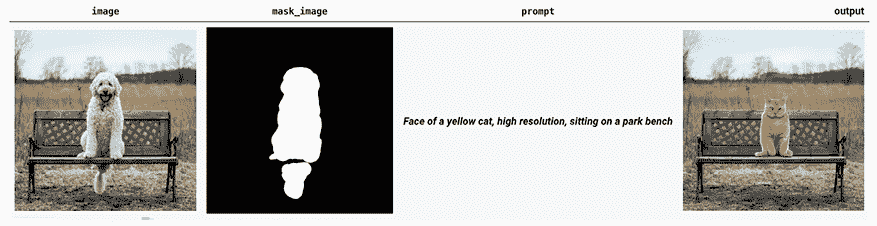
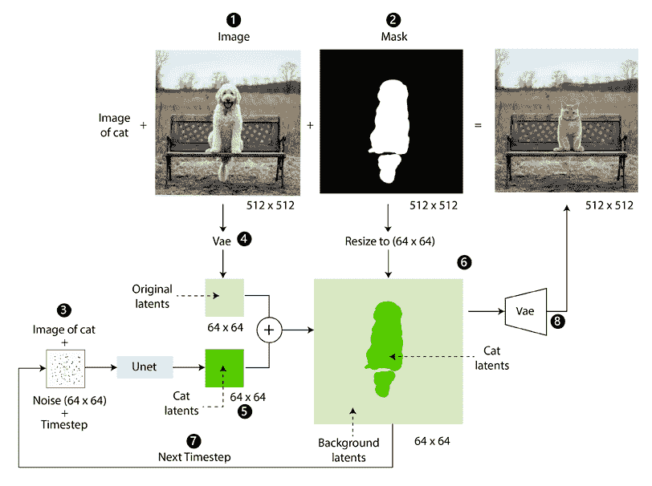
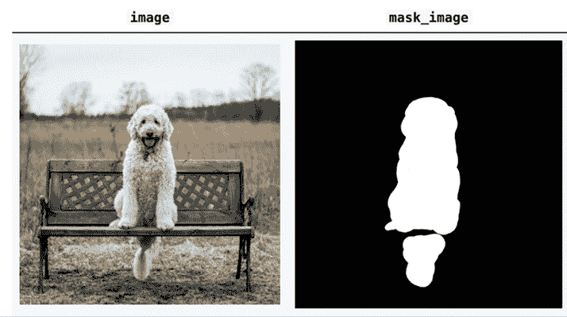
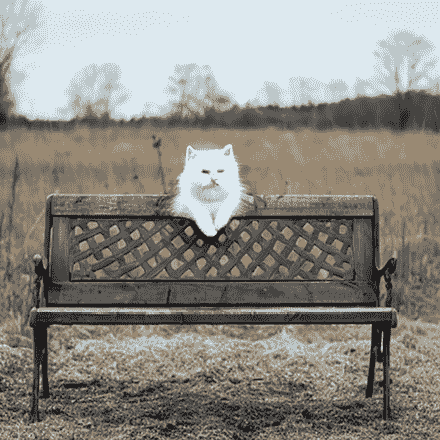
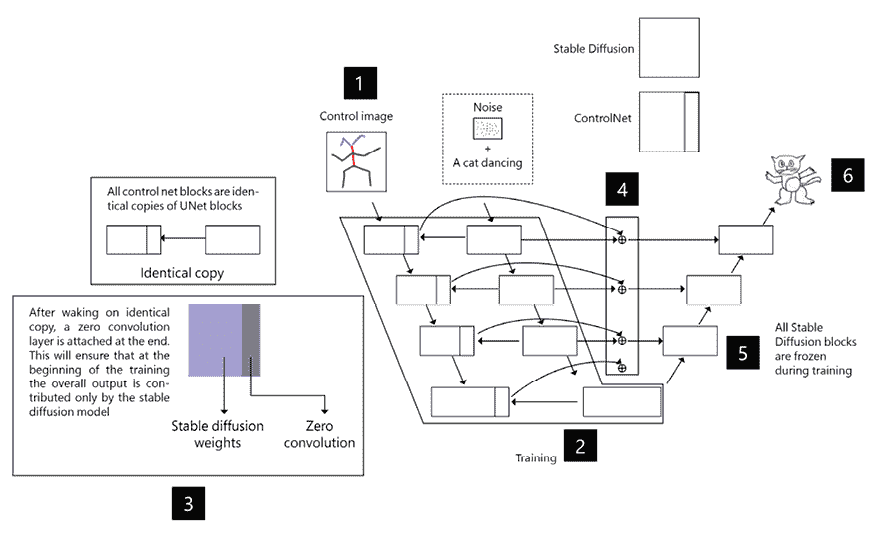
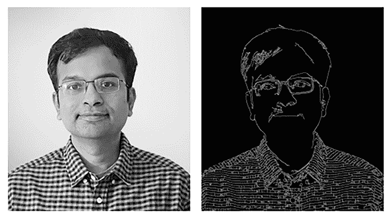
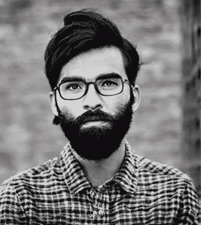
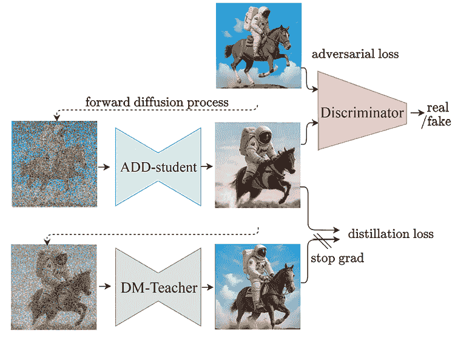
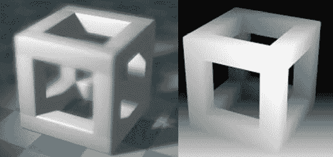
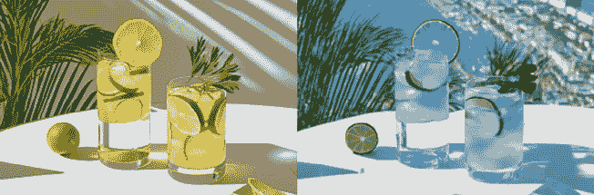

# 第十七章：稳定扩散的应用

在前一章中，我们学习了扩散模型的工作原理、稳定扩散的架构以及扩散器 - 这个库。

虽然我们已经了解了生成图像（无条件和条件，从文本提示），但我们仍然没有学会如何控制图像 - 例如，我可能想要将图像中的猫替换为狗，使人以特定姿势站立，或者用感兴趣的主题替换超级英雄的面孔。在本章中，我们将学习有关帮助实现上述目标的扩散应用模型训练过程和编码的一些应用。具体来说，我们将涵盖以下主题：

+   从文本提示中进行涂抹以替换图像中的对象。

+   使用 ControlNet 从文本提示中生成特定姿势的图像。

+   使用 DepthNet 使用参考深度图像和文本提示生成图像。

+   使用 SDXL Turbo 从文本提示中更快地生成图像。

+   使用 Text2Video 从文本提示生成视频。

本章使用的代码位于 GitHub 仓库的`Chapter17`文件夹中，网址为[`bit.ly/mcvp-2e`](https://bit.ly/mcvp-2e)。您可以从笔记本运行代码并利用它们来理解所有步骤。

随着领域的发展，我们将会定期向 GitHub 仓库添加有价值的补充内容。请检查每章目录中的`supplementary_sections`文件夹获取新的和有用的内容。

# 涂抹

涂抹是用另一幅图像替换图像的某一部分的任务。涂抹的一个示例如下：



图 17.1：前三项 - 图像、mask_image 和 prompt 作为输入，右侧的图像表示涂抹过程的输出。

在上一幅图像中，我们提供了一个与我们想要替换的主题 - 一只狗对应的掩模。此外，我们提供了我们想要用来生成图像的提示。使用掩模和提示，我们应该生成一个满足提示的输出，同时保持图像的其余部分不变。

在下一节中，我们将了解涂抹模型训练的工作流程。

## 模型训练工作流程

涂抹模型训练如下：

1.  输入要求图像和与输入相关的标题。

1.  选择一个主题（*图 17.1 中的一只狗*），并获取与该主题相对应的掩模。

1.  使用标题作为提示。

1.  将原始图像通过变分自动编码器传递，将输入图像（例如从 512x512 图像缩小到 64x64 图像）以提取对应于原始图像的潜变量。

1.  创建文本潜变量（即使用 OpenAI CLIP 或任何其他潜变模型进行嵌入）以对应提示。将文本潜变量和噪声作为输入传递到 U-Net 模型以输出潜变量。

1.  获取原始的潜变量（在*步骤 4*中获得）、调整大小的掩模（在*步骤 2*中获得）和潜变量（在*步骤 5*中获得）以分离背景潜变量和与掩模区域相对应的潜变量。实质上，这一步中的潜变量计算为`original_image_latents * (1-mask) + text_based_latents * mask`。

1.  完成所有时间步后，我们获得与提示相对应的潜变量。

1.  这些潜变量通过**变分自动编码器**（**VAE**）解码器传递，以获得最终图像。VAE 确保生成的图像内部协调一致。

修复绘制的整体工作流程如下：



图 17.2：修复绘制的工作流程

现在我们了解了工作流程，让我们继续学习如何在下一节中使用稳定扩散进行修复绘制。

## 使用稳定扩散进行修复绘制

要对图像进行修复绘制，我们将使用`diffusers`软件包和其中的稳定扩散流程。让我们编写修复绘制的代码如下：

下面的代码在 GitHub 存储库的`Chapter17`文件夹中的`image_inpainting.ipynb`文件中提供，网址为[`bit.ly/mcvp-2e`](https://bit.ly/mcvp-2e)

1.  安装所需的软件包：

    ```py
    !pip install diffusers transformers accelerate 
    ```

1.  导入所需的库：

    ```py
    import PIL
    import requests
    import torch
    from io import BytesIO
    from diffusers import StableDiffusionInpaintPipeline 
    ```

1.  定义修复绘制的流程：

    ```py
    pipeline = StableDiffusionInpaintPipeline.from_pretrained(
                                      "runwayml/stable-diffusion-inpainting",
                                       torch_dtype=torch.float16)
    pipeline = pipeline.to("cuda") 
    ```

在上述代码中，我们利用了由`runwayml`开发的修复绘制模型。此外，我们指定所有权重精度为 float16 而不是 float32，以减少内存占用。

1.  从相应的 URL 获取图像及其对应的掩模：

    ```py
    def download_image(url):
        response = requests.get(url)
        return PIL.Image.open(BytesIO(response.content)).convert("RGB")
    img_url = "https://raw.githubusercontent.com/CompVis/latent-diffusion/main/data/inpainting_examples/overture-creations-5sI6fQgYIuo.png"
    mask_url = "https://raw.githubusercontent.com/CompVis/latent-diffusion/main/data/inpainting_examples/overture-creations-5sI6fQgYIuo_mask.png"
    init_image = download_image(img_url).resize((512, 512))
    mask_image = download_image(mask_url).resize((512, 512)) 
    ```

原始图像及其相应的掩模如下：



图 17.3：您要替换的图像及其掩模

您可以使用标准工具如 MS-Paint 或 GIMP 创建掩模。

1.  定义提示并通过流程传递图像、掩模和提示：

    ```py
    prompt = "Face of a white cat, high resolution, sitting on a park bench"
    image = pipeline(prompt=prompt, image=init_image, 
                                    mask_image=mask_image).images[0] 
    ```

现在，我们可以生成与提示及输入图像相对应的图像。



图 17.4：修复绘制后的图像

在本节中，我们学习了如何用我们选择的另一个主题替换图像的主题。在下一节中，我们将学习如何使生成的图像具有特定的兴趣姿势。

# ControlNet

想象一个场景，我们希望图像的主题具有我们指定的某个姿势 – ControlNet 帮助我们实现这一目标。在本节中，我们将学习如何利用扩散模型修改 ControlNet 的架构，并实现这一目标。

## 架构

ControlNet 的工作原理如下：

1.  我们将人体图像传递给 OpenPose 模型，以获取与图像对应的 Stick Figures（关键点）。OpenPose 模型是一种姿势检测器，与我们在*第十章*中探索的人类姿势检测模型非常相似。

    +   模型的输入是一个人物轮廓图和与图像对应的提示，期望的输出是原始的人类图像。

1.  我们创建 UNet2DConditionModel 的下采样块的副本。

1.  复制块通过零卷积层传递（权重初始化设置为零的层）。这样做是为了能更快地训练模型。如果没有通过零卷积层传递，复制块的添加可能会修改输入（包括文本潜变量、嘈杂图像的潜变量和输入人物轮廓的潜变量）到上采样块，导致上采样器之前没有见过的分布（例如，当复制块最初没有贡献时，输入图像中的面部属性得到保留）。

1.  复制块的输出然后添加到原始下采样块的输出中，在进行上采样时。

1.  原始块已冻结，只有复制块被设置为训练。

1.  当提示和人物轮廓图作为输入时，模型被训练用于预测输出（在给定姿势下，即人物轮廓图的姿势）。

这个工作流程在下图中有所体现：



图 17.5：ControlNet 工作流程

注意，相同的管道不仅可以扩展到精明图像，还可以扩展到粗略线条、涂鸦、图像分割地图和深度图。

现在我们理解了 ControlNet 的训练方式，让我们继续在下一节中编写代码。

## 实现 ControlNet

要实现 ControlNet，我们将利用 `diffusers` 库和一个预训练模型，该模型训练用于预测给定图像和提示的图像。让我们编写代码：

以下代码位于 GitHub 仓库中 `Chapter17` 文件夹中的 `ControlNet_inference.ipynb` 文件中，网址为 [`bit.ly/mcvp-2e`](https://bit.ly/mcvp-2e)。

1.  安装所需的库并导入它们：

    ```py
    %pip install -Uqq torch-snippets diffusers accelerate
    from torch_snippets import *
    import cv2
    import numpy as np
    from PIL import Image 
    ```

1.  从给定图像中提取一个精明边缘图像：

    ```py
    image0 = read('/content/Screenshot 2023-11-06 at 11.14.37 AM.png')
    low_threshold = 10
    high_threshold = 250
    image = cv2.Canny(image0, low_threshold, high_threshold)
    image = image[:, :, None]
    canny_image = np.concatenate([image, image, image], axis=2)
    canny_image = Image.fromarray(canny_image)
    show(canny_image, sz=3)
    canny_image.save('canny.png') 
    ```

上述代码的结果是一个精明图像，如下所示：

1.  ```py
    subplots([image0, canny_image]) 
    ```



图 17.6：原始图像（左）和精明图像（右）

1.  从 `diffusers` 库导入帮助实现 ControlNet 的模块：

    ```py
    from diffusers import StableDiffusionControlNetPipeline, ControlNetModel, UniPCMultistepScheduler
    from diffusers.utils import load_image
    import torch 
    ```

1.  初始化 ControlNet：

    ```py
    generator = torch.Generator(device='cuda').manual_seed(12345)
    controlnet = ControlNetModel.from_pretrained(
                                            "lllyasviel/sd-controlnet-canny") 
    ```

在上述代码中，我们加载了预训练的 `ControlNet` 模型。

1.  定义管道和噪声调度程序以生成图像：

    ```py
    pipe = StableDiffusionControlNetPipeline.from_pretrained(
                                            "runwayml/stable-diffusion-v1-5",
                                             controlnet=controlnet
                                             ).to('cuda')
    pipe.scheduler = DPMSolverMultistepScheduler.from_config(pipe.scheduler.\
                                                                       config) 
    ```

上述管道的架构在 GitHub 笔记本中提供。该架构包含了从输入图像和提示中提取编码器所使用的不同模型。

1.  将精明图像通过管道传递：

    ```py
    image = pipe(
        "a man with beard, realistic, high quality",
        negative_prompt="cropped, out of frame, worst quality, low quality, jpeg artifacts, ugly, blurry, bad anatomy, bad proportions, nsfw",
        num_inference_steps=100,
        generator=generator,
        image=canny_image,
        controlnet_conditioning_scale=0.5
    ).images[0]
    image.save('output.png') 
    ```

上述代码的结果如下：



图 17.7：输出图像

注意生成的图像与原始图像中原本存在的人物非常不同。然而，在根据提示生成新图像的同时，保留了原始图像中的姿势。在下一节中，我们将学习如何快速生成高质量的图像。

# SDXL Turbo

类似于稳定扩散，已经训练了一个名为**SDXL**（**稳定扩散特大**）的模型，返回具有 1,024x1,024 尺寸的高清图像。由于其尺寸巨大以及去噪步骤的数量，SDXL 在生成图像时需要相当长的时间。我们如何在保持图像一致性的同时减少生成图像所需的时间？SDXL Turbo 在这里起到了救援作用。

## 架构

SDXL Turbo 通过执行以下步骤进行训练：

1.  从预训练数据集（在[`laion.ai/blog/laion-400-open-dataset/`](https://laion.ai/blog/laion-400-open-dataset/)上提供的**大规模人工智能开放网络**（**LAION**））中抽样一幅图像及其相应文本。

1.  向原始图像添加噪音（所选时间步长可以是 1 到 1,000 之间的随机数）

1.  训练学生模型（对抗扩散模型）生成能欺骗鉴别器的图像。

1.  进一步地，以这样一种方式训练学生模型，使其输出与教师 SDXL 模型的输出非常相似（当从学生模型生成的添加噪声的输出作为输入传递给教师模型时）。这样，我们优化了两个损失 - 判别器损失（学生模型生成的图像与原始图像之间的差异）以及学生和教师模型输出之间的均方误差损失。请注意，我们只训练学生模型。

这在以下图示中有所体现：



图 17.8：SDXL turbo 训练

来源：[`stability.ai/research/adversarial-diffusion-distillation`](https://stability.ai/research/adversarial-diffusion-distillation)

对对抗损失和蒸馏损失的训练可以帮助模型对输入图像（教师模型的输出）的微小修改具有很好的泛化能力。

## 实施 SDXL Turbo

SDXL Turbo 的代码实现如下：

你可以在 GitHub 仓库的`Chapter17`文件夹中的`sdxl_turbo.ipynb`文件中找到代码，链接为[`bit.ly/mcvp-2e`](https://bit.ly/mcvp-2e)。

1.  安装所需的库：

    ```py
    %pip -q install diffusers accelerate torch-snippets torchinfo lovely_tensors 
    ```

1.  导入所需的包：

    ```py
    from diffusers import AutoPipelineForText2Image, AutoPipelineForImage2Image
    import torch 
    ```

1.  定义`SDXL Turbo`流程：

    ```py
    pipeline = AutoPipelineForText2Image.from_pretrained("stabilityai/sdxl-
                           turbo", torch_dtype=torch.float16, variant="fp16")
    pipeline = pipeline.to("cuda") 
    ```

1.  提供提示和负面提示（`n_prompt`），并获取输出图像。请注意，负面提示（`n_prompt`）确保生成图像中不包含其中提到的属性：

    ```py
    %%time
    prompt = "baby in superman dress, photorealistic, cinematic"
    n_prompt = 'bad, ugly, blur, deformed'
    image = pipeline(prompt, num_inference_steps = 1, 
                 guidance_scale=0.0, negative_prompt = n_prompt, 
                 seed = 42).images[0]
    image 
    ```


图 17.9：生成的图像

前面的代码在不到 2 秒的时间内执行，而典型的 SDXL 模型生成一个图像需要超过 40 秒。

# DepthNet

想象一个情景，您想修改背景，同时保持图像主题的一致性。您将如何解决这个问题？

一种方法是利用我们在*第十六章*学到的**Segment Anything Model**（**SAM**），并将背景替换为您选择的背景。但是，这种方法存在两个主要问题：

+   背景没有生成，因此您必须手动提供背景图像。

+   主题和背景颜色不一致，因为我们进行了拼接。

DepthNet 通过利用扩散方法来解决这个问题，我们将使用模型来理解图像的哪些部分是背景和前景，使用深度图。

## 工作流

DepthNet 的工作原理如下：

1.  我们计算图像的深度掩模（深度是通过类似于《Vision Transformers for Dense Prediction》论文中提到的管道计算的：[`arxiv.org/abs/2103.13413`](https://arxiv.org/abs/2103.13413)）。

1.  Diffusion UNet2DConditionModel 被修改为接受五通道输入，其中前四个通道是标准的噪声潜变量，第五个通道仅是潜变量深度掩模。

1.  现在，训练模型以使用修改的扩散模型来预测输出图像，其中除了提示外，我们还有额外的深度图作为输入。

典型的图像及其相应的深度图如下：



图 17.10：一幅图像及其深度图

现在让我们继续实现 DepthNet。

## 实施 DepthNet

要实现 DepthNet，您可以使用以下代码：

完整代码可以在 GitHub 存储库中的`Chapter17`文件夹的`DepthNet.ipynb`文件中找到，网址为[`bit.ly/mcvp-2e`](https://bit.ly/mcvp-2e)。

1.  安装所需的软件包：

    ```py
    %pip -q install diffusers accelerate torch-snippets torchinfo lovely_tensors
    !wget https://png.pngtree.com/thumb_back/fw800/background/20230811/pngtree-two-glasses-with-a-lime-wedge-in-them-next-to-a-image_13034833.jpg -O lime_juice.png 
    ```

1.  导入所需的软件包：

    ```py
    import torch
    import requests
    from PIL import Image
    from torch_snippets import *
    from diffusers import StableDiffusionDepth2ImgPipeline 
    ```

1.  定义管道：

    ```py
    pipe = StableDiffusionDepth2ImgPipeline.from_pretrained(
                                      "stabilityai/stable-diffusion-2-depth",
                                       torch_dtype=torch.float16,) 
    ```

1.  指定提示并通过管道传递图像：

    ```py
    init_image = Image.open('/content/test.jpg')
    prompt = "glasses of lime juice with skyline view in background in a cool afternoon"
    n_propmt = "bad, deformed, ugly, bad anotomy"
    image = pipe(prompt=prompt, image=init_image,  
                 negative_prompt=n_propmt, strength=0.7, 
                 num_inference_steps = 100).images[0] 
    ```

前面的代码导致以下输出（有关彩色图像，请参阅书的电子版本）：



图 17.11：（左）输入图像（右）来自 DepthNet 的输出

请注意，在上述图片中，原始图片中的深度（左侧的图片）被保留，而提示修改了图片的内容/视图。

# 文本转视频

想象一种情况，您提供文本提示并希望从中生成视频。您如何实现这一点？

到目前为止，我们已经从文本提示生成了图像。从文本生成视频需要我们控制两个方面：

+   **时间一致性**跨帧（一个帧中的主题应与后续帧中的主题类似）

+   **帧间操作的一致性**（如果文本提示是一架火箭射向天空，则火箭在不断增加的帧数中应该有一致的向上轨迹）

在训练文本到视频模型时，我们应该处理上述两个方面，我们再次使用扩散模型来处理这些方面。

为了理解模型构建过程，我们将学习由 damo-vilab 构建的文本到视频模型。它利用`Unet3DConditionModel`而不是我们在上一章节中看到的`Unet2DConditionModel`。

## 工作流程

`Unet3DConditionModel`包含`CrossAttnDownBlock3D`块，而不是`CrossAttnDownBlock2D`块。在`CrossAttnDownBlock3D`块中，除了我们在上一章节看到的`resnet`和`attention`模块外，还有两个模块：

1.  **temp_conv**：在`temp_conv`模块中，我们通过一个`Conv3D`层传递输入。在这种情况下，输入考虑了所有帧（而在 2D 中，一次只有一个帧）。实质上，通过同时考虑所有帧，我们的输入是一个 5D 张量，形状为[bs, frames, channels, height, width]。您可以将此视为一种维持主题在帧间时间一致性的机制。

1.  **temp_attn**：在`temp_attn`模块中，我们对帧维度而不是通道维度执行自注意力。这有助于在帧间保持动作的一致性。

`CrossAttnUpBlock3D`和`CrossAttnMidBlock3D`块仅在其子模块（我们已经讨论过的）方面有所不同，与它们的 2D 对应块相比没有功能上的差异。我们将留给您深入了解这些块的活动。

## 实现文本到视频

现在让我们继续实现执行文本到视频生成的代码：

以下代码位于 GitHub 存储库中`Chapter17`文件夹中的`text_image_to_video.ipynb`文件中，网址为[`bit.ly/mcvp-2e`](https://bit.ly/mcvp-2e)。

1.  安装所需的软件包并导入它们：

    ```py
    %pip -q install -U diffusers transformers accelerate torch-snippets lovely_tensors torchinfo pysnooper
    import torch
    from diffusers import DiffusionPipeline, DPMSolverMultistepScheduler
    from diffusers.utils import export_to_video
    from IPython.display import HTML
    from base64 import b64encode 
    ```

1.  定义文本到视频生成的流程：

    ```py
    pipe = DiffusionPipeline.from_pretrained(\
                   "damo-vilab/text-to-video-ms-1.7b",  
                   torch_dtype=torch.float16, variant="fp16")
    pipe.enable_model_cpu_offload() 
    ```

1.  提供提示、视频持续时间以及每秒帧数来生成视频：

    ```py
    prompt = 'bear running on the ocean'
    negative_prompt = 'low quality'
    video_duration_seconds = 3
    num_frames = video_duration_seconds * 25 + 1 
    ```

1.  将上述参数传递给流水线：

    ```py
    video_frames = pipe(prompt, negative_prompt="low quality", num_inference_steps=25, num_frames=num_frames).frames 
    ```

1.  使用以下代码显示视频：

    ```py
    def display_video(video):
        fig = plt.figure(figsize=(4.2,4.2))  #Display size specification
        fig.subplots_adjust(left=0, right=1, bottom=0, top=1)
        mov = []
        for i in range(len(video)):  #Append videos one by one to mov
            img = plt.imshow(video[i], animated=True)
            plt.axis('off')
            mov.append([img])
        #Animation creation
        anime = animation.ArtistAnimation(fig, mov, 
                              interval=100, repeat_delay=1000)
        plt.close()
        return anime
    video_path = export_to_video(video_frames)
    video = imageio.mimread(video_path)  #Loading video
    HTML(display_video(video).to_html5_video())  #Inline video display in HTML5 
    ```

有了以上内容，我们现在可以从文本生成视频了。您可以在相关笔记本中查看生成的视频。

# 概述

在本章中，我们学习了如何创意地利用扩散模型进行多种应用。在这个过程中，我们还了解了各种架构的工作细节以及代码实现。

这与深入理解扩散模型如何工作的坚实基础结合使用，将确保您能够利用稳定的扩散模型进行多种创意工作，修改和微调用于定制图像生成的架构，并结合/流水线多个模型以获得您所需的输出。

在下一章中，我们将学习部署计算机视觉模型以及在此过程中需要考虑的各种方面。

# 问题

1.  使用稳定扩散进行图像修复的关键概念是什么？

1.  ControlNet 背后的关键概念是什么？

1.  SDXL Turbo 比 SDXL 更快的原因是什么？

1.  DepthNet 背后的关键概念是什么？

# 加入我们的 Discord 了解更多信息

加入我们社区的 Discord 空间，与作者和其他读者进行讨论：

[`packt.link/modcv`](https://packt.link/modcv)


