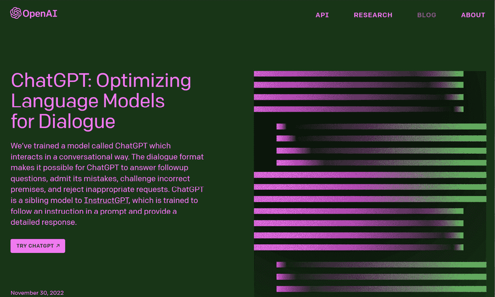
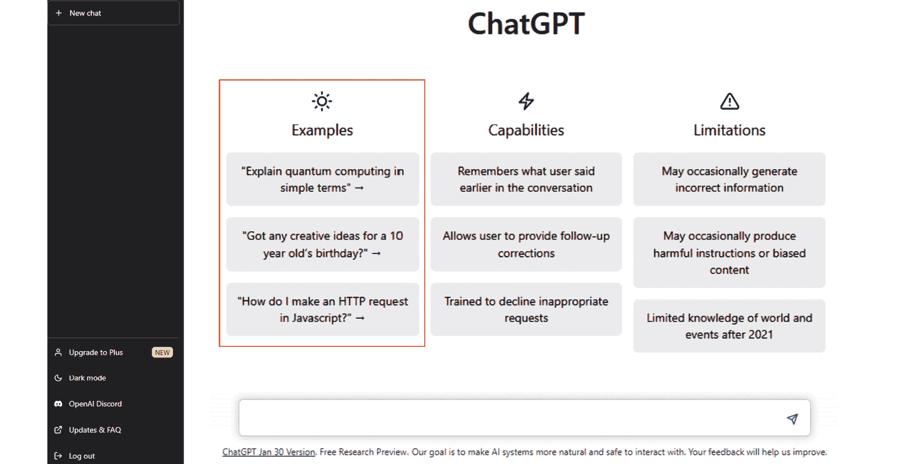
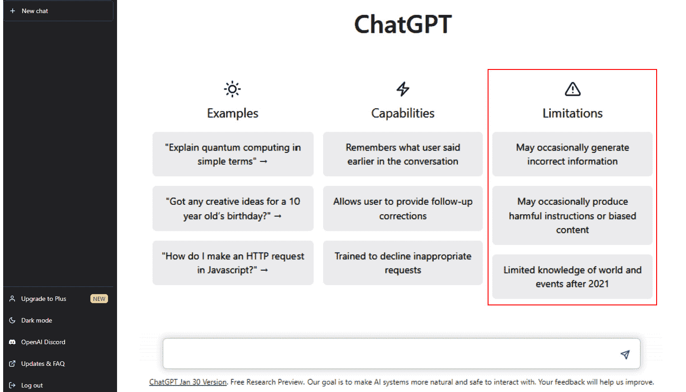
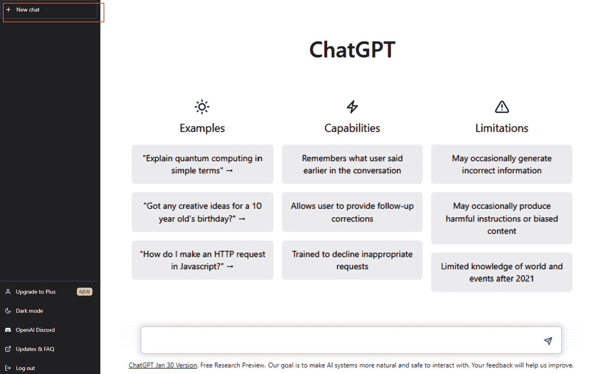
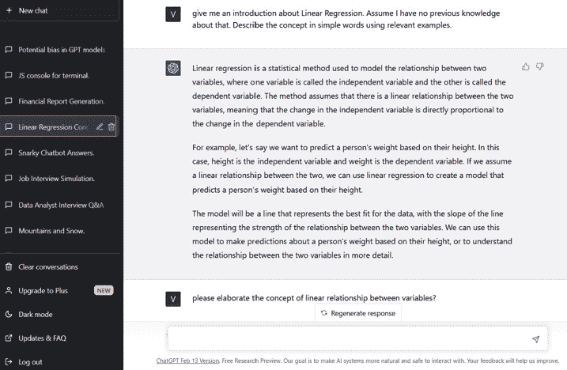
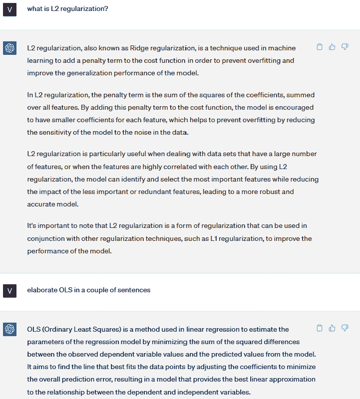

# 三、熟悉 ChatGPT

本章让您设置 ChatGPT 账户并开始使用该服务。它还将介绍如何与 Web UI 交互，如何按主题组织聊天，以及如何构建对话。

在本章结束时，您将更好地了解 ChatGPT 是什么，它是如何工作的，以及如何有效地将其组织为日常助手。您还将了解其主要功能和局限性，以便知道如何负责任地使用它。

在本章中，我们将涵盖以下主题：

+   设置 ChatGPT 账户

+   熟悉 UI

+   组织聊天

# 设置 ChatGPT 账户

要开始使用 ChatGPT，您首先需要创建一个 OpenAI 账户。请按照这里的说明：

1.  在这里导航至 OpenAI 网站：[`openai.com`](https://openai.com)。

1.  滚动到下方，点击**ChatGPT**，如下所示：

图 3.1 – OpenAI 登陆页面

1.  然后您需要点击**尝试 ChatGPT**：

图 3.2 – ChatGPT 登陆页面

1.  在下一页，您需要填写表格注册一个 OpenAI 账户。这是您可以用来访问 OpenAI Playground 并生成 API 密钥的同一个账户。

图 3.3 – ChatGPT 登陆页面，带有登录和注册选项

1.  现在您可以开始使用 ChatGPT Web 应用程序了。找到 ChatGPT Web 应用程序后，点击启动。您将能够直接在 Web 浏览器中与 ChatGPT 交互并执行各种自然语言处理任务。

图 3.4 – ChatGPT Web 界面

太棒了！现在您可以开始使用 ChatGPT。但您也需要了解应用程序是什么样的。让我们接着了解一下。

# 熟悉 UI

ChatGPT 的 Web 界面非常直观易用。在开始编写提示之前，您可以轻松尝试服务提供的一些示例：

图 3.5 – ChatGPT 提供的示例提示

接下来，您还将了解 ChatGPT 的主要功能：

图 3.6 – ChatGPT 的功能

在功能中，强调了 ChatGPT 如何在整个对话中保持记忆。在上一章中，我们深入研究了 GPT 背后的数学，并看到了记忆保留组件的重要性：现在您可以欣赏到这种数学复杂性的实际运作。

ChatGPT 的这种能力也是**少样本学习**的一个例子，我们将在接下来的章节中更多地了解这个概念。

注意

ChatGPT 能够保持先前上下文的记忆，这要归功于其少样本学习能力。少样本学习是一种机器学习技术，使模型能够在非常有限的标记数据下学习新概念或任务，已成为人工智能领域的重要研究领域。

由于具有记忆保持和少样本学习等功能，ChatGPT 允许用户在对话过程中提供跟进或更正，而无需再次提供上下文。

这里有一个示例，展示了如何在与 ChatGPT 对话中对提示进行更正：

图 3.7 – ChatGPT 跟进评论和提示更正示例

最后，模型还提醒用户，除了其功能之外，它还经过训练，可以拒绝可能有害或冒犯性的不当请求。

在其主页上提供的最后一组信息与 ChatGPT 的限制相关：

图 3.8 – ChatGPT 限制

这些元素是一个重要的提醒，即如今，AI 工具仍需要人类监督。事实上，除了 2021 年至今之间的缺失信息外，ChatGPT 可能还会提供不准确甚至错误的信息。这就是为什么它仍然需要监督的原因。

值得一提的有趣现象是*幻觉*。幻觉指的是 AI 模型生成类似真实数据但实际上并非基于任何真实观察的虚假或想象数据的现象。以下是一个例子：

图 3.9 – ChatGPT 幻觉示例

*图 3.9*中的问题最初由道格拉斯·霍夫斯塔德和大卫·本德尔开发，旨在诱导 ChatGPT 产生幻觉性回应！

为了防止幻觉，应该牢记一些良好的做法：

+   **具体明确**：确保您的提示定义明确，清楚陈述您想要实现的目标。这将有助于模型生成更专注和相关的回应。例如，一个提示如*告诉我关于世界的事情*可能不会产生很好的结果。

+   **提供充分的上下文**：提供的上下文越多，模型就能更好地理解您的需求并生成相关的响应。

+   **避免歧义**：在您的提示中避免使用模糊或含糊不清的术语或短语，因为这可能会使模型难以理解您想要什么。

+   **使用简洁的语言**：尽可能简洁地表达您的提示，同时提供足够的信息让模型生成响应。这将有助于确保模型生成专注和简洁的回应。

+   **注意训练数据**：ChatGPT 已经在大量文本语料库上进行了训练，它可能生成基于该数据模式的有偏见或不准确的响应。请注意这一点，并考虑调整您的提示，如果您怀疑模型生成的响应不合适或准确。

正如我们将在下一章中看到的，这些提示设计考虑不仅有助于防止幻觉，还有助于从与 ChatGPT 的互动中获得最高价值和效用。

有了这一点，让我们现在看看聊天是如何管理的。

# 组织聊天

ChatGPT 展示的节省时间功能是具有多个开放线程或聊天的可能性。实际上，当您开始编写第一个提示时，ChatGPT 将自动启动一个新的聊天并以相关标题命名。请看以下截图的左上角：

图 3.10 – 在 ChatGPT 中创建新聊天

您始终可以决定从头开始新的聊天，但是，您可能希望继续几天前开始的对话。

想象一下，您已经要求 ChatGPT 解释线性回归的概念，然后开始了几个后续对话。这是它的显示方式：

图 3.11 – 具有上下文的现有聊天示例

在那个聊天中，ChatGPT 已经有了上下文，因此您可以继续对话而无需重复概念。请看这里：

图 3.12 – 同一上下文中的后续问题示例

通过这一点，我们了解了 ChatGPT 聊天是如何维护和组织的，这使得参考旧聊天变得容易。

# 摘要

在本章中，我们详细介绍了如何使用我们的帐户开始使用 ChatGPT 的具体步骤。我们还深入探讨了其能力和局限性，以及有关幻觉风险以及如何通过提示设计避免这种风险的一些考虑。我们还看到了应用程序中如何呈现聊天以及如何轻松地参考旧聊天。

在下一章中，我们将更多关注提示设计和工程，以便从与 ChatGPT 的对话中获得最高价值。

# 参考资料

+   [`openai.com/blog/chatgpt/`](https://openai.com/blog/chatgpt/)

+   [`www.sify.com/ai-analytics/the-hilarious-and-horrifying-hallucinations-of-ai/`](https://www.sify.com/ai-analytics/the-hilarious-and-horrifying-hallucinations-of-ai/)

+   [`www.datanami.com/2023/01/17/hallucinations-plagiarism-and-chatgpt/`](https://www.datanami.com/2023/01/17/hallucinations-plagiarism-and-chatgpt/)

