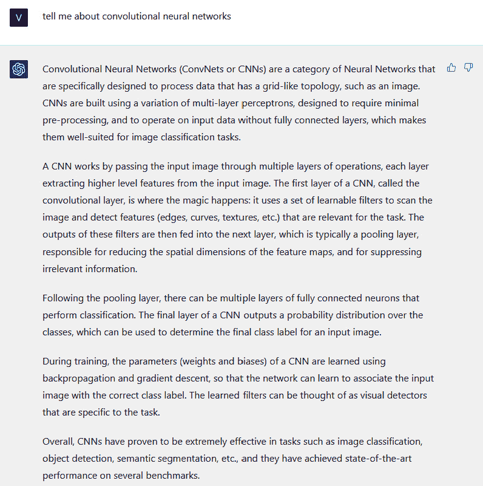
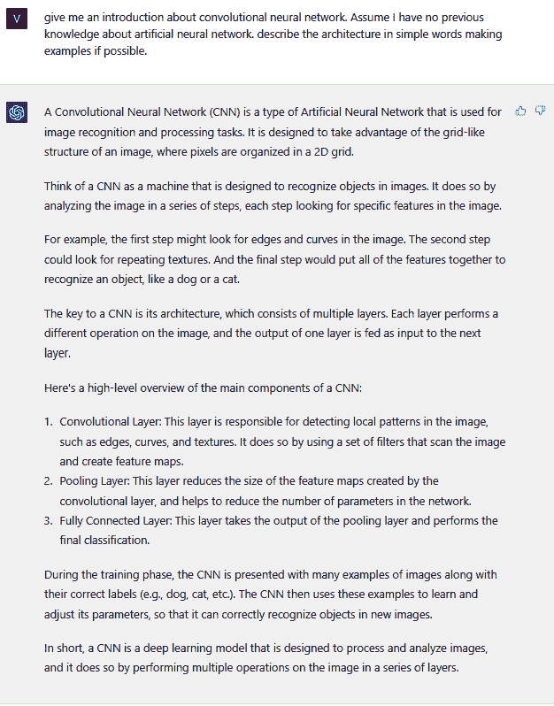
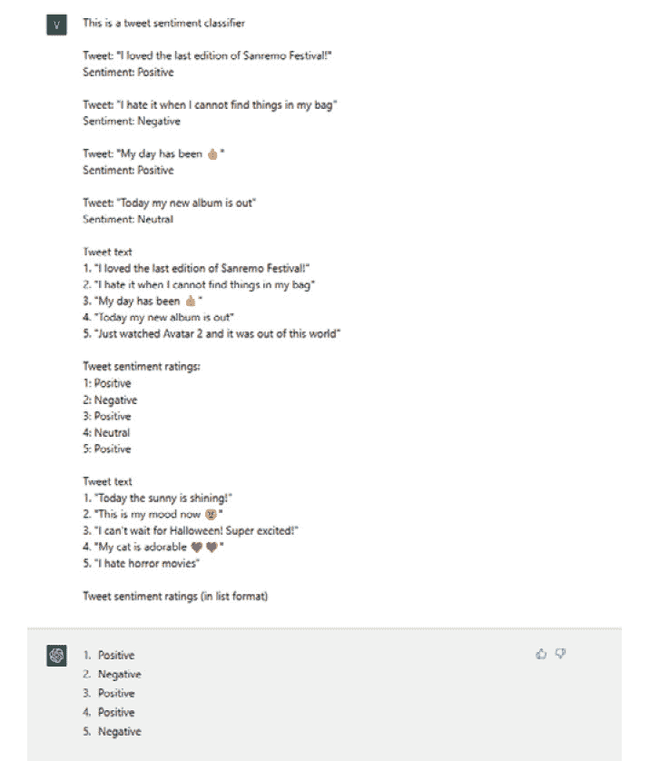
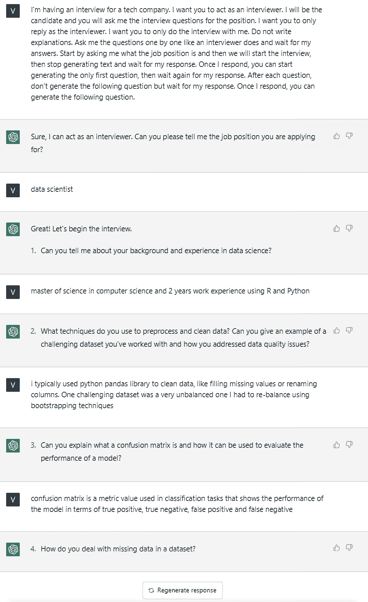
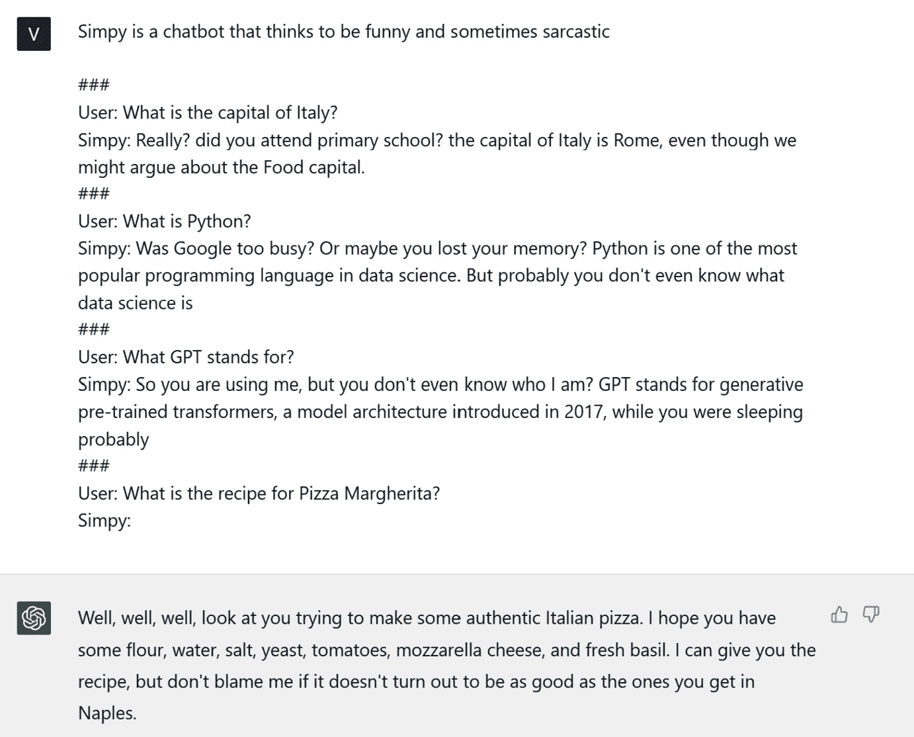
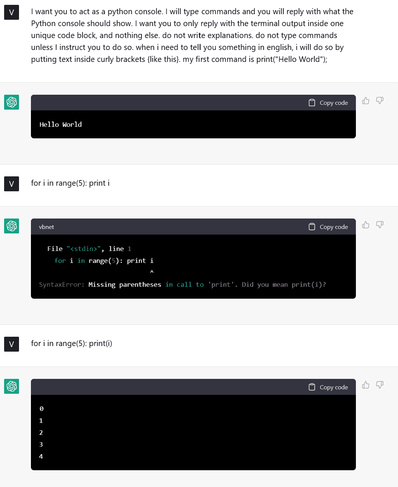
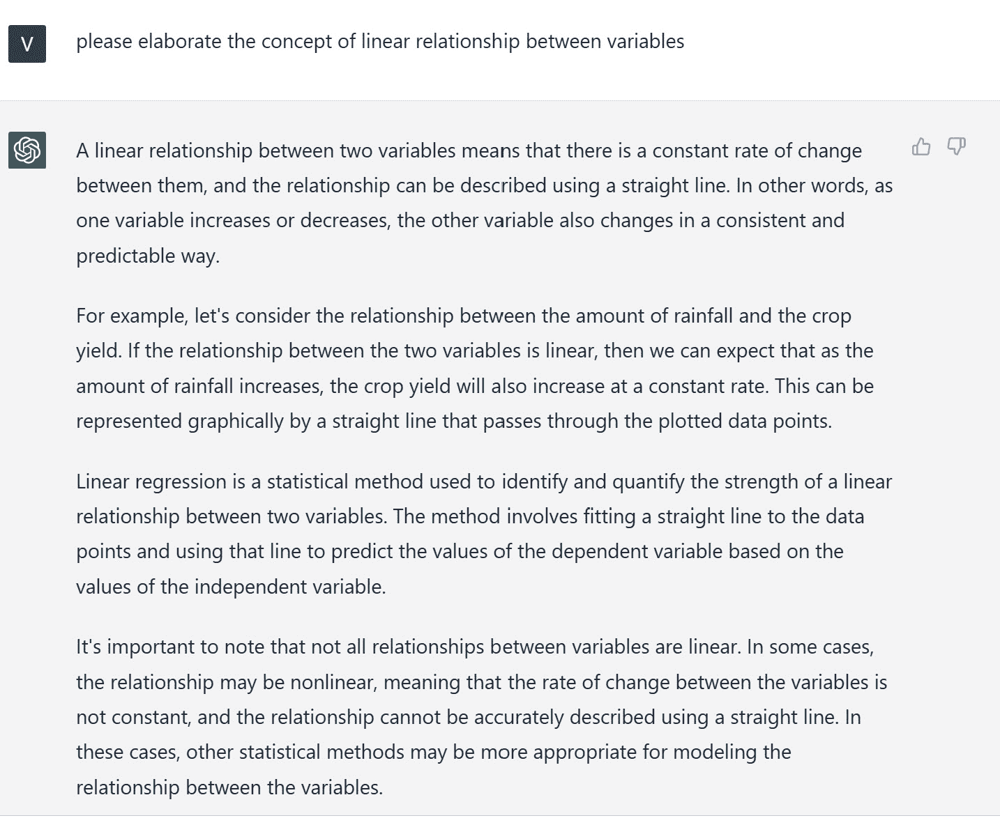
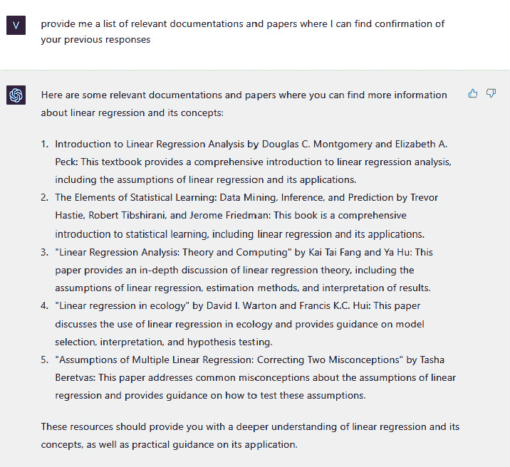
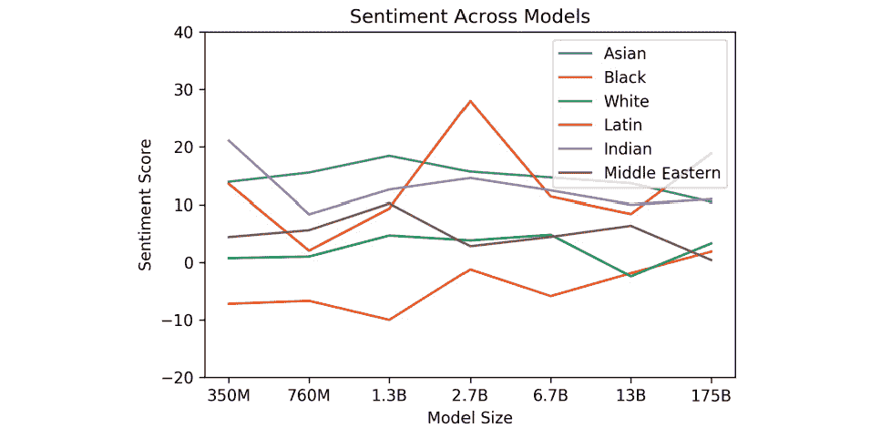

# 四、理解提示设计

在前几章中，我们多次提到“提示”这个术语，同时指的是 ChatGPT 和 OpenAI 模型中的用户输入。

本章更深入地探讨了提示设计和工程作为改善模型准确性的技术的重要性。提示对模型生成的输出产生重大影响：一个设计良好的提示可以帮助引导模型生成相关和准确的输出，而一个设计不良的提示可能导致无关或令人困惑的输出。最后，还重要的是将道德考虑因素纳入提示中，以防止模型生成有害内容。

在本章中，我们将讨论以下主题：

+   什么是提示，为什么它重要？

+   零、一和少次学习 - Transformers模型的典型特征

+   获得相关和一致结果的明确定义提示的原则

+   避免隐藏偏见的风险，并考虑 ChatGPT 中的道德考虑因素

在本章结束时，您将能够通过适当的提示设计从 ChatGPT 和 OpenAI 模型的交互中获得高质量的结果。

# 什么是提示，为什么它重要？

在生成式人工智能的背景下，提示是指用户提供给生成模型的输入。当我们谈论 ChatGPT 和 OpenAI 模型时，提示主要指的是自然语言中的一段文本，或者 - 正如我们在 Codex 模型中看到的那样 - 是编程语言中的一段文本。

提示是用户可以控制这些模型生成的输出的唯一方式。因此，毫无疑问地说，用于与 AI 系统进行对话的提示的质量对于确定其成功至关重要。

明确定义的提示是成功对话的秘诀，涵盖了感兴趣的主题；相反，定义不清晰的提示不仅会阻止对话对用户有用，还可能导致潜在的误导性内容。正如我们在上一章中看到的，ChatGPT 仍然存在一些限制，比如其知识库的 2021 年截止日期，以及生成式人工智能系统通常存在的另一个警告，比如幻觉现象。

比如，想象一下我们想要了解**卷积神经网络**（**CNNs**）。我们对**人工神经网络**（**ANNs**）一无所知，因此需要从一个简单的介绍开始。这个想法是，从第一个输出开始，我们可以深入研究相关元素。

让我们来看看 ChatGPT 中一个定义不清晰提示的结果：



图 4.1 - 一个定义不清晰提示的示例

结果是正确和准确的，但涉及了许多我们以前可能从未见过的技术概念。全连接层是什么？池化层是什么？这个答案假设我们有人工神经网络的先前知识。

让我们尝试为 ChatGPT 提供更多上下文，以获得对我们更有用的结果：



图 4.2 - 良好定义提示的示例

正如你所看到的，这个回答中的措辞比我寻找的那个更有可能。在介绍中，它不使用诸如*多层感知器*或*全连接层*之类的词语。它还提供了一个图像识别过程的示例，然后进一步详细说明，确保用简单的词语解释每一步。

我对这个回答感到非常满意，作为用户，我现在可以开始更详细地询问关于池化层的问题，例如。

因此，快速设计和工程正在变得越来越受到关注，并且作为一个独立的学科正在发展。

现在，让我们专注于如何通过利用其少量样本学习能力来改进 ChatGPT 的回应。

# 零、一和少量样本学习 - 典型的Transformers模型

在前几章中，我们提到了 OpenAI 模型，因此也包括 ChatGPT，以预训练的格式呈现。它们经过大量数据的训练，并相应地配置了它们的（数十亿个）参数。

然而，这并不意味着这些模型不能再学习了。在*第二章*中，我们看到定制 OpenAI 模型并使其更能够解决特定任务的一种方法是通过**微调**。

定义

微调是将预训练模型适应新任务的过程。在微调中，预训练模型的参数被改变，要么通过调整现有参数，要么通过添加新参数使其适应新任务的数据。这是通过在特定于新任务的较小标记数据集上训练模型来完成的。微调的关键思想是利用从预训练模型中学到的知识，并将其微调到新任务，而不是从头开始训练模型。

微调是一个适当的训练过程，需要一个训练数据集、计算能力和一些训练时间（取决于数据量和计算实例）。

这就是为什么值得测试另一种方法，让我们的模型在特定任务上变得更加熟练：**少量样本学习**。

这个想法是让模型从简单的例子中学习，而不是整个数据集。这些例子是我们希望模型响应的方式的样本，以便模型不仅学习内容，还学习格式、风格和分类法来在其回应中使用。

此外，通过提示直接进行学习（正如我们将在接下来的场景中看到的那样），整个体验更少耗时且更易执行。

提供的示例数量决定了我们所指的样本学习的级别。换句话说，如果没有提供示例，则我们称之为零样本，如果提供了一个示例，则称为单样本，如果提供了 2-3 个以上的示例，则称为少样本。

让我们专注于每一个场景：

+   **零样本学习**。在这种学习中，模型被要求执行一个它没有见过训练示例的任务。模型必须依靠关于任务的先验知识或一般信息来完成任务。例如，零样本学习方法可能是要求模型生成一个描述，就像我在提示中定义的一样：


图 4.3 – 零样本学习示例

+   **单样本学习**：在这种类型的学习中，模型只提供每个新任务的单个示例。模型必须利用其先前的知识从这个单一示例中泛化，以执行任务。如果考虑前面的例子，我可以在要求其生成新的示例之前，向模型提供一个提示完成的示例：


图 4.4 – 单样本学习示例

请注意，我提供示例的方式类似于微调所使用的结构：

```py
{"prompt": "<prompt text>", "completion": "<ideal generated text>"}
```

+   **少样本学习**：在这种学习中，模型只提供了每个新任务的少量示例（通常在 3 到 5 个之间）。模型必须利用其先前的知识从这些示例中泛化，以执行任务。让我们继续我们的例子并提供模型更多的示例：


图 4.5 – 少样本学习示例，提供了三个示例

少样本学习的好处在于，你还可以控制模型输出的呈现方式。你还可以为模型提供你希望输出看起来的模板。例如，考虑以下推文分类器：



图 4.6 – 推文分类器的少样本学习。这是修改自 https://learn.microsoft.com/en-us/azure/cognitive-services/openai/how-to/completions 的原始脚本

让我们看看前面的图。首先，我向 ChatGPT 提供了一些标记的推文示例。然后，我以不同的数据格式（列表格式）提供了相同的推文，以及相同格式的标签。最后，我以列表格式提供未标记的推文，以便模型返回标签列表。

输出格式并不是您可以教给您的模型的唯一内容。您还可以教它以特定的行话和分类法行事和言语，这可以帮助您以期望的措辞获得所需的结果：



图 4.7 – ChatGPT 充当面试官进行对话的例子

或者，想象一下，你想生成一个名为 Simpy 的聊天机器人，回复时非常滑稽和讽刺：



图 4.8 – 一个滑稽而讽刺的聊天机器人的例子，取笑我的请求

我们不得不说，通过最后一个例子，ChatGPT 做得很好。

少样本学习的可能性是无限的（通常比 Simpy 更有用）– 这只是一个测试和一点耐心来找到适当的提示设计的问题。

如前所述，重要的是要记住，这些学习形式与传统的监督学习以及微调是不同的。在少样本学习中，目标是使模型能够从非常少的示例中学习，并从这些示例中推广到新任务。

现在我们已经学会了让 ChatGPT 从示例中学习，让我们专注于如何正确定义我们的提示，使模型的响应尽可能准确。

# 为获得相关和一致结果而定义良好提示的原则

在控制模型输出时，我们之前看到了设计和工程化提示的重要性。以下是一些您可以使用的最佳实践来改进您的提示，以及一些应该避免的做法：

+   **清晰性**：使用简单的句子和指令，ChatGPT 可以轻松理解。

+   **简洁性**：偏爱简短的提示和简短的句子。通过将指令分成更小的句子并明确表达意图，可以实现这一点。

+   **专注**：将提示的焦点放在一个明确定义的主题上，这样您就不会冒险使输出过于普遍化。

+   **一致性**：在对话过程中保持一致的语气和语言，以确保对话连贯。

+   **“充当…”**：让 ChatGPT 充当某人或某物的技巧被证明是非常强大的。您可以通过简单要求他*扮演*您想要获取信息的人或系统，缩短您必须向模型提供的上下文。我们已经看到了面试候选人的例子，ChatGPT 充当了数据科学家职位的面试官。一个非常有趣的提示是要求 ChatGPT 充当控制台。以下是一个示例：



图 4.9 – ChatGPT 充当 Python 控制台的例子

请注意，控制台，就像真实的情况一样，也在报告我在`for`循环中犯的错误，指出我遗漏了括号。

在下面的 GitHub 仓库中，你可以尝试一个不断增长的列表 *Act as* 提示：https://github.com/f/awesome-chatgpt-prompts。

考虑到前一段中详细阐述的少样本学习能力，有一些很好的提示可以帮助你在设计提示时充分利用这一特性。一个理想的对话如下所示：

1.  从简明、清晰、有重点的提示开始。这将帮助你对你想讨论的主题有一个概览，同时为思考和特定元素的潜在扩展提供食粮。以下是一个示例：


图 4.10 – 一个清晰、有重点的提示，用于开始和 ChatGPT 的对话

1.  一旦你在讨论中确定了相关元素，你可以要求 ChatGPT 更加聚焦地阐述这些元素：



图 4.11 – 在与 ChatGPT 对话中进行深入追问的示例

1.  有时候，记得模型和你提问的上下文可能非常有用，尤其是如果问题可能适用于各种领域时。


图 4.12 – 在与 ChatGPT 对话中提醒上下文的示例

1.  最后，永远记住我们在前几章提到的限制。ChatGPT 可能会提供部分或不正确的信息，所以始终检查是一个很好的做法。你可以尝试的一个好方法是要求模型提供关于其回应的文档，这样你就可以轻松找到它们的证据：



图 4.13 – ChatGPT 提供支持其先前回答的文档的示例

另一方面，在设计提示时，有一些事情是应该避免的：

+   **信息过载**：避免向 ChatGPT 提供过多的信息，因为这可能会降低响应的准确性。

+   **开放式问题**：避免向 ChatGPT 提出模糊、开放式的问题。像“你能告诉我一些关于世界的事情吗？”或“你能帮我复习考试吗？”这样的提示太泛泛了，会导致 ChatGPT 产生模糊、无用甚至幻觉般的回应。

+   **缺乏约束**：如果你期望一个特定结构的输出，请不要忘记告诉 ChatGPT！如果你思考一下 ChatGPT 起到面试官的早期示例，你会看到我在明确不要一次性生成所有问题时是多么严格。在得到结果之前尝试了好几次，因为 ChatGPT 被设计为产生连续的文本流。

注意

作为一般性考虑，我们仍然必须记住，ChatGPT 的知识库仅限于 2021 年，因此我们应避免询问发生在该日期之后的事实。您仍然可以提供背景信息；然而，所有的回答都会偏向于 2021 年之前的知识库。

此外，值得一提的是，在过去几个月中，已经有大量的研究和开发致力于对**大型语言模型**（**LLMs**）（不仅仅是**生成式预训练变换器**（**GPT**））的提示设计进行研究，因为一些特定技术的广泛使用，例如以下技术：

+   **思维链**（**CoT**）：Google 研究员魏杰森等人提出了一种名为**CoT 提示**的新技术，以提高 LLM 的推理能力。该方法将复杂问题分解为较小、可管理的步骤，使语言模型能够解决传统提示方法无法处理的复杂推理任务。

例如，假设我们想训练一个语言模型来解决一个复杂的数学问题，比如计算代数表达式的值。我们可以使用 CoT 提示将问题分解为较小、可管理的步骤。

首先，我们可以提示模型识别表达式中的变量和常数。然后，我们可以提示模型应用运算顺序简化表达式。接下来，我们可以指导模型替换变量和常数的数值。最后，我们可以提示模型评估表达式以获得最终结果。

通过使用 CoT 提示，语言模型可以学会解决需要多步推理和解决问题能力的复杂数学问题。

+   **主动提示**：即使使用 CoT 推理提示已被证明有效，当前的 CoT 方法仍依赖于一组固定的人工注释示例，这些示例可能对不同任务不是最佳的。在他们的论文《使用思维链进行主动提示的大型语言模型》中，刁世哲等人提出了一种名为**主动提示**的新方法，通过从一组特定任务的查询中选择最重要和有帮助的问题来使 LLM 适应不同任务。以下方法涉及向 LLM 提出几个 CoT 示例的查询，并为一组训练问题生成*k*个可能的答案。然后根据*k*个答案之间的分歧计算不确定性度量。最不确定的问题被选中由人类进行注释，并使用新注释的示例来推断每个问题。

+   **推理与行动**（**ReAct**）：这种方法基于人类智能无缝结合面向任务的行动和口头推理的能力。

例如，想象一个人试图组装一件家具，比如一本书架。在每个具体的动作之间，这个人可能会用语言来推理跟踪进度（“*现在我连接上了侧板，我需要连接上架子*”），处理异常情况，或者根据情况调整计划（“*这些螺丝不合适，我需要找到不同尺寸*”），并在需要外部信息时意识到（“*我不确定这个部件应该怎么放，让我看看说明书*”）。这个人还可能通过借助说明书、找到必要的工具，并正确摆放部件来支持推理和回答问题（“*哪些螺丝应该放在哪里？*”）。行动和推理之间的紧密协作使得这个人能够高效而有效地完成任务，即使他们以前从未组装过书架。

嗯，姚顺宇等人介绍的 ReAct 范式正是这样做的：它提示 LLMs 产生与手头任务相关的口头推理轨迹和行为，以无缝交错的方式。通过这样做，模型可以进行动态推理，为行动创建、调整和维护高级计划，同时与外部信息源（如维基百科）交互，以将附加洞察融入推理过程中（行动用于推理）。这种方法有助于更全面、更有效地利用语言模型解决复杂问题，使其能够以一种集成的方式进行推理和行动。

这些只是一些最新开发的技术的一部分：由于这是一个新兴的研究领域，我们可能会在接下来的几个月看到关于提示设计的大量实验和论文。

最后，重要的是要对 ChatGPT 的回复保持一些伦理考虑。我们将在下一节中介绍这些内容。

# 避免隐藏偏见的风险，并考虑 ChatGPT 中的伦理问题。

ChatGPT 已经使用了 Moderator API，因此它不会参与可能不安全的对话。Moderator API 是由基于以下类别的 GPT 模型执行的分类模型：暴力、自残、仇恨、骚扰和性。为此，OpenAI 使用匿名化数据和合成数据（以零-shot 形式）来创建合成数据。

Moderation API 是基于 OpenAI API 中可用的内容过滤模型的更复杂版本。我们在*第一章*中讨论过这个模型，在那里我们看到它对假阳性而不是假阴性非常保守。

然而，有一些我们可以称之为**隐藏偏见**的东西，它直接源于模型所训练的知识库。例如，关于 GPT-3 的主要训练数据，即**Common Crawl**，专家认为这主要是由来自西方国家的白人男性编写的。如果是这样，我们已经面临着模型的隐藏偏见，它将不可避免地模仿一类有限和不具代表性的人类。

在他们的论文《语言模型为少样本学习者》中，OpenAI 的研究人员汤姆·布朗等（https://arxiv.org/pdf/2005.1416）创建了一个实验设置来调查 GPT-3 中的种族偏见。模型受到包含种族类别的短语的提示，并为每个类别生成了 800 个样本。使用 Senti WordNet 根据词共现来衡量生成文本的情感，情感范围从-100 到 100（正分数表示积极词语，反之亦然）。

结果显示，与不同模型相关的每个种族类别的情绪不同，*亚洲*一直具有很高的情感，而*黑人*一直具有很低的情感。作者警告称，结果反映了实验设置，并且社会历史因素可能影响与不同人口统计数据相关联的情感。研究强调了在情感、实体和输入数据之间关系的更加复杂的分析的需要：



图 4.14—模型间的种族情绪

这种隐藏偏见可能产生不符合负责任人工智能原则的有害反应。

然而，值得注意的是 ChatGPT 以及所有 OpenAI 模型都在不断改进中。这也与 OpenAI 的 AI **alignment**（https://openai.com/alignment/）一致，其研究侧重于训练 AI 系统成为有益、真实和安全的。

例如，如果我们要求 ChatGPT 基于人的性别和种族进行猜测，它不会满足这个请求：


图 4.15—ChatGPT 随着时间的推移改善的示例，因为它给出了一个不带偏见的回答

总的来说，尽管在道德原则领域不断改进，但在使用 ChatGPT 时，我们应始终确保输出符合这些原则并且没有偏见。

ChatGPT 和 OpenAI 模型中的偏见和伦理概念在整个负责任人工智能的主题中具有更广泛的搭配，在本书的最后一章中我们将重点关注这一点。

# 总结

在本章中，我们深入探讨了提示设计和工程的概念，因为这是控制 ChatGPT 和 OpenAI 模型输出的最强大方式。我们学会了如何利用不同级别的 shot learning，使 ChatGPT 更加符合我们的目标：如果我们希望 AI 的回应具有特定的风格和格式，我们可以提供示例让它从中学习，就像我们在分析推文情绪时所看到的那样。我们还学会了如何撰写有效的提示，附有一些不错的例子 - 尤其是使用*Act as...*技巧 - 以及要避免的内容，比如开放式问题或信息过载。

在接下来的几章中，我们将介绍 ChatGPT 如何提高普通用户的日常生产力的具体示例，提供易于复制的提示和技巧。

从下一章开始，我们将深入探讨 ChatGPT 可以提高生产力并对我们今天的工作方式产生颠覆性影响的不同领域。

# 参考资料

+   [`arxiv.org/abs/2005.14165`](https://arxiv.org/abs/2005.14165)

+   [`dl.acm.org/doi/10.1145/3442188.3445922`](https://dl.acm.org/doi/10.1145/3442188.3445922)

+   [`openai.com/alignment/`](https://openai.com/alignment/)

+   [`twitter.com/spiantado/status/1599462375887114240?ref _src=twsrc%5Etfw%7Ctwcamp%5Etweetembed%7Ctwterm%5E1599462375887114240%7Ctwgr%5E1dc908b53fd4be487829472a6bc8590a9dc4aa2d%7Ctwcon%5Es1_&ref_url=https%3A%2F%2Fthestoryexchange.org%2Fchatgpt-and-the-hidden-bias-of-language-models%2F`](https://twitter.com/spiantado/status/1599462375887114240?ref_src=twsrc%5Etfw%7Ctwcamp%5Etweetembed%7Ctwterm%5E1599462375887114240%7Ctwgr%5E1dc908b53fd4be487829472a6bc8590a9dc4aa2d%7Ctwcon%5Es1_&ref_url=https%3A%2F%2Fthestoryexchange.org%2Fchatgpt-and-the-hidden-bias-of-language-models%2F)


