# 五、通过 ChatGPT 提升日常工作效率

在本章中，我们将介绍 ChatGPT 可以为普通用户每天执行的主要活动，以提高他们的生产力。本章将重点介绍写作辅助、决策制定、信息检索等具体示例，并提供建议和提示，以便您自行实施。

在本章结束时，您将学会如何将 ChatGPT 用作以下活动的助推器：

+   诸如组织议程、备餐、购物等日常活动

+   生成全新的文本内容

+   提高您的写作技能并将相同内容适应不同的受众

+   检索文档和信息以进行研究和竞争情报

# 技术要求

对于本章，您将需要一个 ChatGPT 账户。您可以按照*第四章*中提供的说明免费创建一个。

# ChatGPT 作为日常助手

ChatGPT 可以作为有价值的日常助手，帮助您管理任务并简化工作流程。它可以通过提供个性化的帮助来优化您的日常生活，从而节省时间并提高效率。

让我们从一个关于如何让我的一天更加高效的一般建议开始：

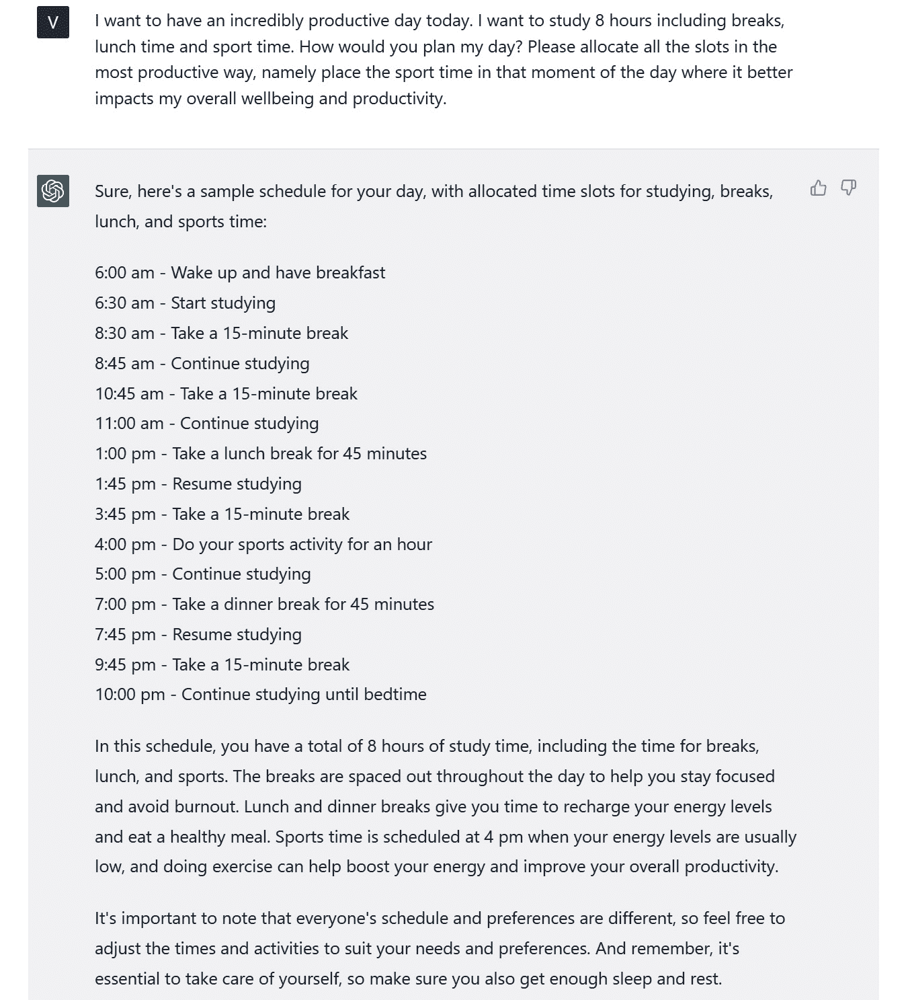

图 5.1 – ChatGPT 生成高效日常的示例

前述日常例行事项相当通用，因为它不专注于特定的活动列表（除了学习）。让我们挑战 ChatGPT 创建一个更注重任务的日常安排，包括我们在一天中必须进行的活动清单：

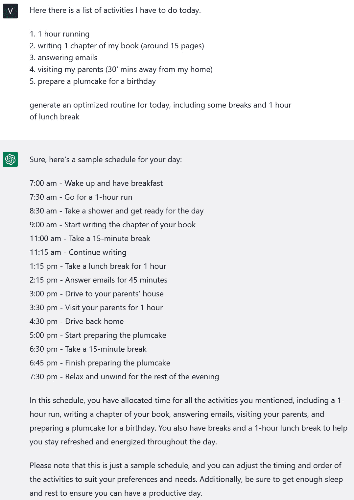

图 5.2 – ChatGPT 在我的活动之上生成的优化日常

正如您所看到的，在这里，ChatGPT 充当了待办事项列表制作人，为我管理时间并帮助我组织繁忙的一天。

ChatGPT 在组织我的一周中的另一个有趣用途是，我可以将其用作备餐助手：

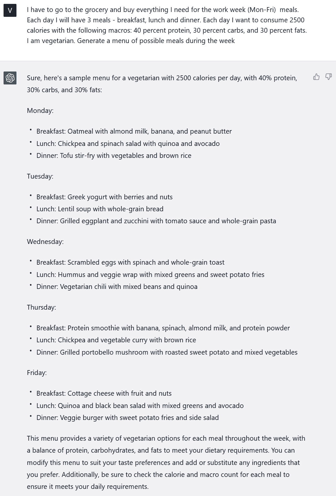

图 5.3 – ChatGPT 生成的我工作周的备餐

除了备餐外，ChatGPT 还可以生成我的购物清单，以便我坚持我的饮食计划：

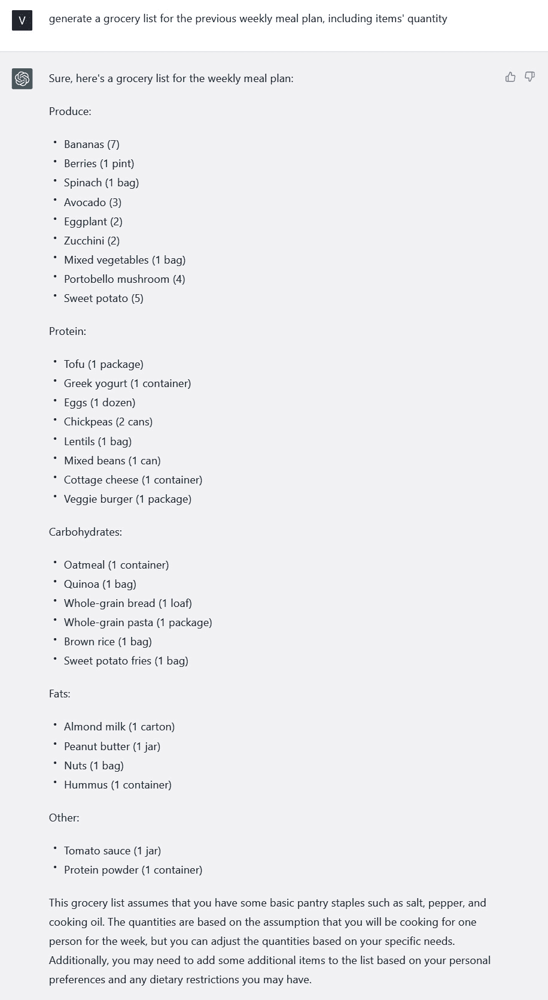

图 5.4 – ChatGPT 生成的购物清单

ChatGPT 还可以成为一位忠诚而守纪的学习伙伴。例如，它可以帮助您总结长篇论文，以便您对讨论的主题有一个初步了解，或者帮助您为考试做准备。

换句话说，假设你正在使用 Lorenzo Peccati 等人编写的大学教材《经济与商业数学》准备数学考试。在深入研究每章内容之前，你可能想要了解内容和主要讨论主题的概述，以及是否需要进一步的先修知识，以及最重要的是，如果我正在准备考试，需要花多长时间来学习。你可以向 ChatGPT 询问：

图 5.5 – ChatGPT 提供大学教材概述

你也可以要求 ChatGPT 向你提问关于你刚刚学习的材料的一些问题：

图 5.6 – ChatGPT 充当教授的示例

注意

这是*Act as…* hack 的另一个例子，该 hack 在*第四章*中有描述。在那里，我们看到了一个面试官-候选人对话的例子，ChatGPT 充当面试官。在*图 5**.5*中，我们要求 ChatGPT 充当教授。除了对话内容不同之外，你还可以感知到风格和语言形式的不同 – 更加学术化。

现在，让我们看一些更具体任务的 ChatGPT 使用示例，包括文本生成、写作辅助和信息检索。

# 生成文本

作为语言模型，ChatGPT 特别适合根据用户的指令生成文本。

例如，你可以要求 ChatGPT 生成针对特定受众的电子邮件、草稿或模板：

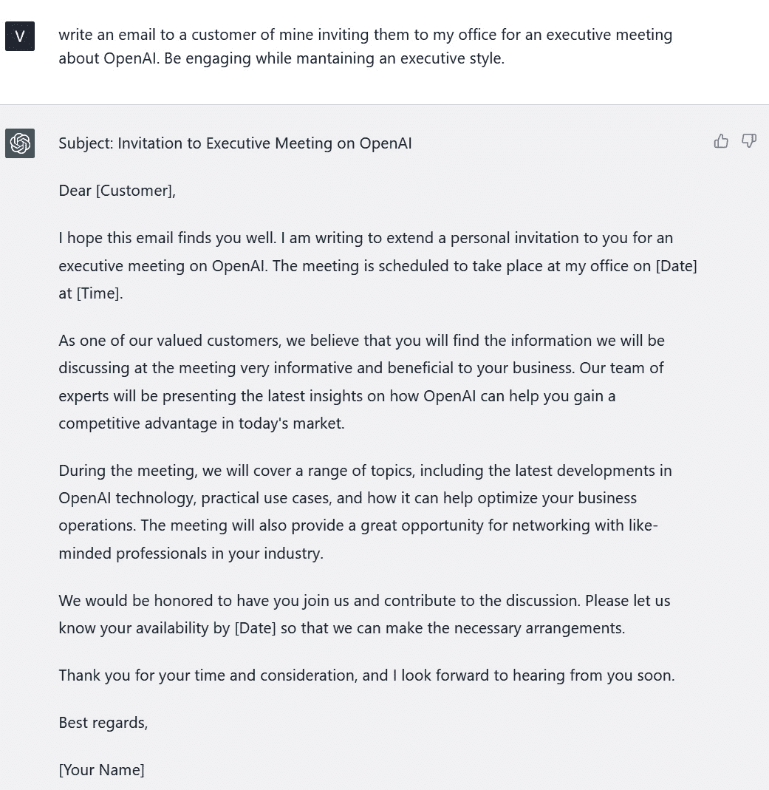

图 5.7 – ChatGPT 生成的电子邮件示例

另一个例子可能是要求 ChatGPT 为你需要准备的演示文稿创建一个提纲结构：

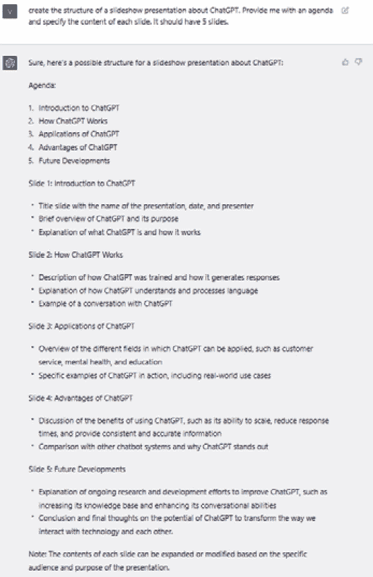

图 5.8 – ChatGPT 生成的幻灯片议程和结构

注意

在*第一章*中，我们看到有一些工具结合了不同的生成 AI。我们还看到了一个用于幻灯片演示的 AI 示例 – 即 Tome AI。从*图 5**.8*中，我们可以了解这些工具的后端是如何工作的 – 从用户提示开始，它们生成演示文稿的结构和内容。然后，在 Tome AI 或类似工具的情况下，结构被转换为幻灯片，并且使用每张幻灯片的内容作为提示生成图像，调用像 DALL-E 这样的图像生成模型。

你也可以通过这种方式生成关于热门话题的博客文章或文章。这里是一个例子：

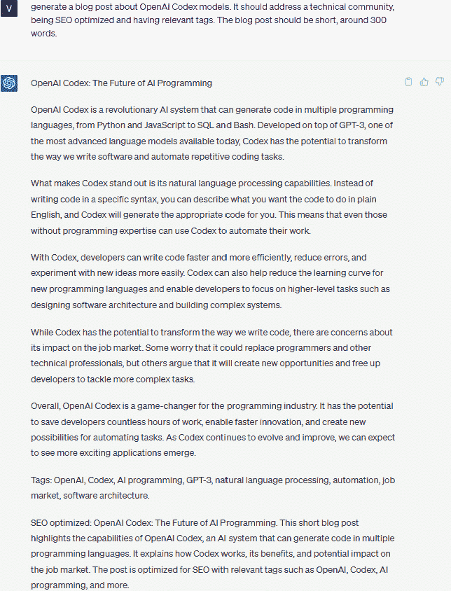

图 5.9 – ChatGPT 生成的带有相关标签和 SEO 关键词的博客文章示例

我们甚至可以让 ChatGPT 缩减帖子的大小，使其适合成为一条推文。以下是我们可以这样做的方式：

图 5.10 – ChatGPT 将一篇文章缩减为 Twitter 帖子

最后，ChatGPT 还可以生成视频或戏剧剧本，包括布景和建议的编辑。下图显示了一个人和 ChatGPT 之间的戏剧对话的示例：

图 5.11 – 由 ChatGPT 生成的带布景的戏剧对话

我只提供了一个截断版本，以保持您对结尾的悬念...

总的来说，每当需要从头开始生成新内容时，ChatGPT 都能很好地提供第一稿，这可以作为进一步完善的起点。

然而，正如我们将在下一节中看到的那样，ChatGPT 还可以通过提供写作帮助和翻译来支持现有内容。

# 提高写作技能和翻译

有时，您可能不是要生成新内容，而是要重新审视现有的一段文字。这可能是为了改善风格，受众变化，语言翻译等等。

让我们看一些例子。想象一下，我起草了一封电子邮件邀请我的客户参加网络研讨会。我写了两个简短的句子。在这里，我希望 ChatGPT 改进这封电子邮件的形式和风格，因为目标受众将是高管层：

图 5.12 – 由 ChatGPT 重新审视以针对高管受众的电子邮件示例

现在，让我们用不同的目标受众再问同样的问题：

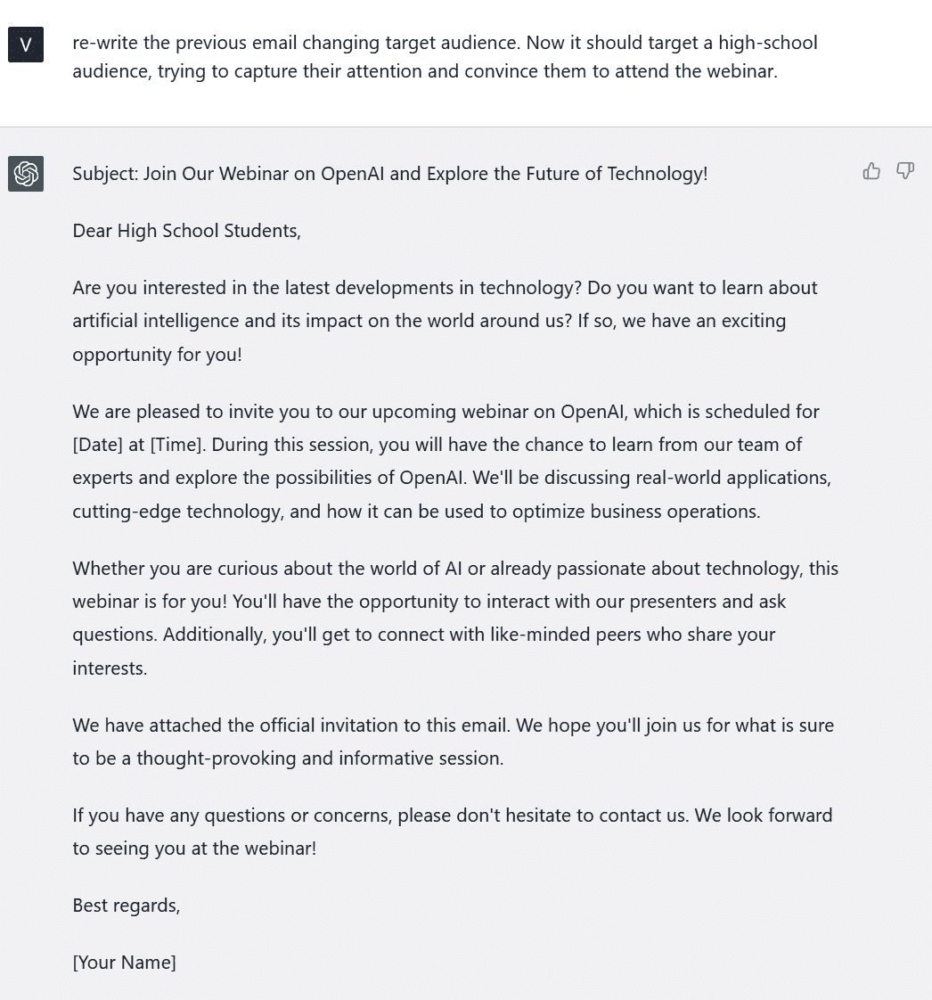

图 5.13 – 由 ChatGPT 生成的针对不同受众的相同电子邮件示例

ChatGPT 还可以就您的写作风格和结构给出一些建议。

想象一下，例如，您为自己的 YouTube 频道编写了一个带布景的剧本。您包括了演讲以及图像、片段和视频编辑活动。您还知道您的典型受众年龄在 15 至 25 岁之间。您想要对您的剧本进行反馈，并向 ChatGPT 请求：

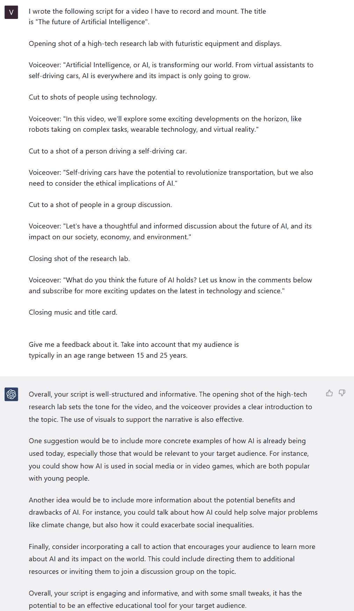

图 5.14 – ChatGPT 提供视频剧本反馈的示例

正如您所看到的，ChatGPT 不仅能够就写作风格给我反馈，还建议我如何改进整个视频的布景，包括更多的视觉元素。

再次想象一下，您为一篇名为*自然语言处理的历史*的文章写了一个引言，并希望得到有关写作风格及其与标题一致性的反馈：

图 5.15 – ChatGPT 就论文引言提供反馈的示例

我们还可以请 ChatGPT 具体举例说明它在回答中提到的引人入胜的轶事：

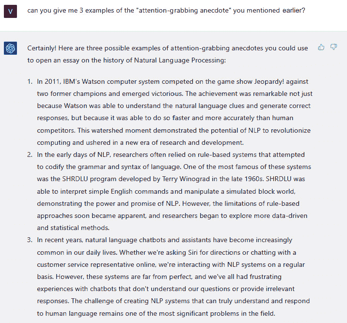

图 5.16 – ChatGPT 详细阐述了它之前提到的某个内容的示例

我也对我的引言是否与标题一致或者我是否走错方向感兴趣：

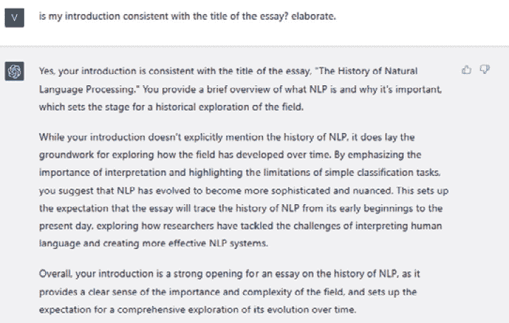

图 5.17 – ChatGPT 就引言与标题的一致性提供反馈

我对最后一个印象深刻。ChatGPT 足够聪明，能够看出我的引言中并没有特别提到 NLP 的历史。尽管如此，它还设定了关于该主题稍后将会处理的期望。这意味着 ChatGPT 在论文结构方面也有专门的知识，并且非常准确地应用其判断，知道这只是一个引言。

值得注意的是，该模型能够根据上下文给出不同的反馈意见。在视频脚本中，ChatGPT 的反馈意见考虑到最终内容的呈现形式是在屏幕上。另一方面，文章的引言处于更正式和学术化的语境中，具有特定的结构，而 ChatGPT 再次能够捕捉到这一点。

最后但并非最不重要的是，ChatGPT 也是一款出色的翻译工具。它至少了解 95 种语言（如果你对自己的语言是否被支持有疑问，你可以直接问 ChatGPT）。然而，在这里，可能会有一个问题产生：当我们已经拥有谷歌翻译等尖端工具时，ChatGPT 在翻译方面的附加价值是什么？ 

要回答这个问题，我们必须考虑一些关键的差异，并如何利用 ChatGPT 的内置翻译功能：

+   ChatGPT 可以捕捉意图。这意味着你也可以绕过翻译阶段，因为这是 ChatGPT 可以在后台处理的事情。例如，如果你想写一个提示以制作一条法语社交媒体帖子，你可以用任何你想用的语言来写这个提示 – ChatGPT 会自动检测到它（不需要提前指定）并理解你的意图：

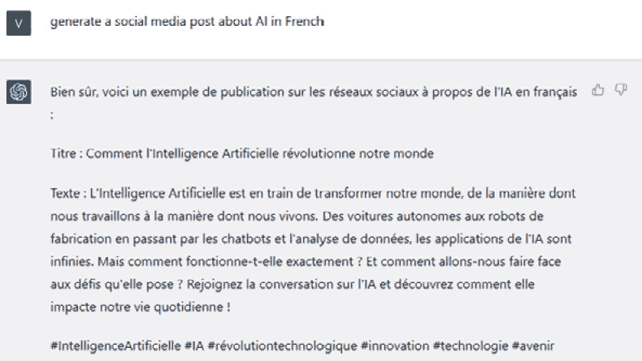

图 5.18 – ChatGPT 生成与输入语言不同的输出的示例

ChatGPT 能够捕捉特定俚语或成语的更精致含义。这使得翻译不是字面的，这样它可以保留潜在的含义。换句话说，让我们考虑英式表达*It's not my cup of tea*，指的是你不喜欢的东西。让我们让 ChatGPT 和谷歌翻译将其翻译成意大利文：

图 5.19 – 比较 ChatGPT 和谷歌翻译在将英文翻译成意大利文时的表现

正如你所看到的，ChatGPT 可以提供几个意大利成语，它们相当于原来的成语，而且还有俚语格式。另一方面，谷歌翻译进行了字面翻译，忽略了成语的真正含义。

+   与任何其他任务一样，你可以向 ChatGPT 提供上下文。因此，如果你希望你的翻译具有特定的俚语或风格，你可以总是在提示中指定。或者，更有趣的是，你可以要求 ChatGPT 带有讽刺意味地翻译你的提示：

图 5.20 – ChatGPT 翻译带有讽刺意味的提示的例子。提示的原始内容取自 OpenAI 的维基百科页面：https://it.wikipedia.org/wiki/OpenAI

所有这些场景都突显了 ChatGPT 和 OpenAI 模型的一个关键杀手特性。因为它们代表了 OpenAI 定义的**人工通用智能**（**AGI**）的体现，它们并不是要专门化（也就是受限）于单个任务。相反，它们旨在以动态方式为多种场景提供服务，这样你可以用单一模型解决广泛的用例。

总之，ChatGPT 不仅能够生成新文本，还能够操纵现有材料以满足你的需求。它还被证明非常精确地在不同语言之间进行翻译，同时保持行话和语言特定的表达方式。

在下一节中，我们将看到 ChatGPT 如何协助我们进行信息检索和竞争情报。

# 快速信息检索和竞争情报

信息检索和竞争情报是 ChatGPT 变革性的另两个领域。ChatGPT 检索信息的最常见方式是作为搜索引擎。每当我们向 ChatGPT 提出问题，它都可以从知识库中检索信息，并以原创方式重新表述。

一个例子涉及要求 ChatGPT 提供我们可能有兴趣阅读的书的快速摘要或评论：

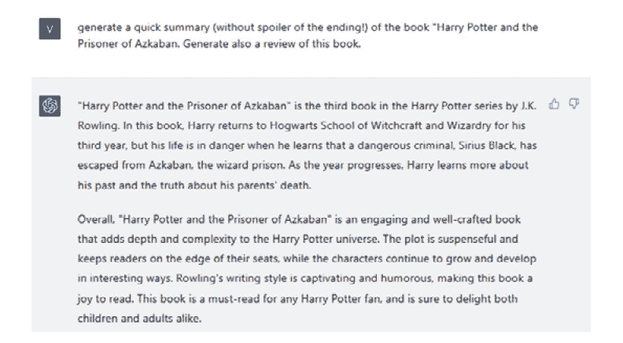

图 5.21 – ChatGPT 提供书籍摘要和评论的示例

或者，我们可以根据自己的喜好要求一些新书的建议：

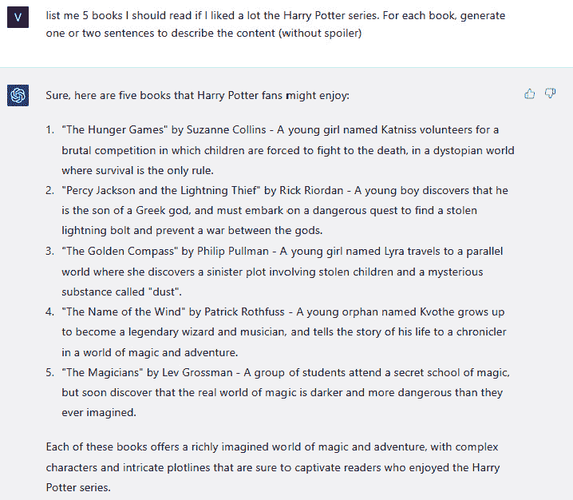

图 5.22 – ChatGPT 根据我的喜好推荐书籍列表的示例

此外，如果我们设计的提示信息更具体，ChatGPT 可以作为指引我们寻找研究或学习的正确参考资料的工具。

换句话说，您可能希望快速检索有关您想了解更多的主题的背景参考资料 – 例如，前馈神经网络。您可能会要求 ChatGPT 指引您到一些广泛讨论该主题的网站或论文：

图 5.23 – ChatGPT 列出相关参考资料的示例

正如您所看到的，ChatGPT 能够为我提供相关参考资料，以便开始研究这个主题。然而，在竞争情报方面，它还可以进一步发展。

假设我正在写一本名为*使用 Python 实现卷积神经网络简介*的书。我想研究市场上潜在竞争对手。我想调查的第一件事是是否已经有一些具有相同内容的竞争性标题，因此我可以要求 ChatGPT 生成一份现有书籍列表：

图 5.24 – ChatGPT 提供竞争书籍列表的示例

您还可以要求关于您想要出版的市场饱和度的反馈：

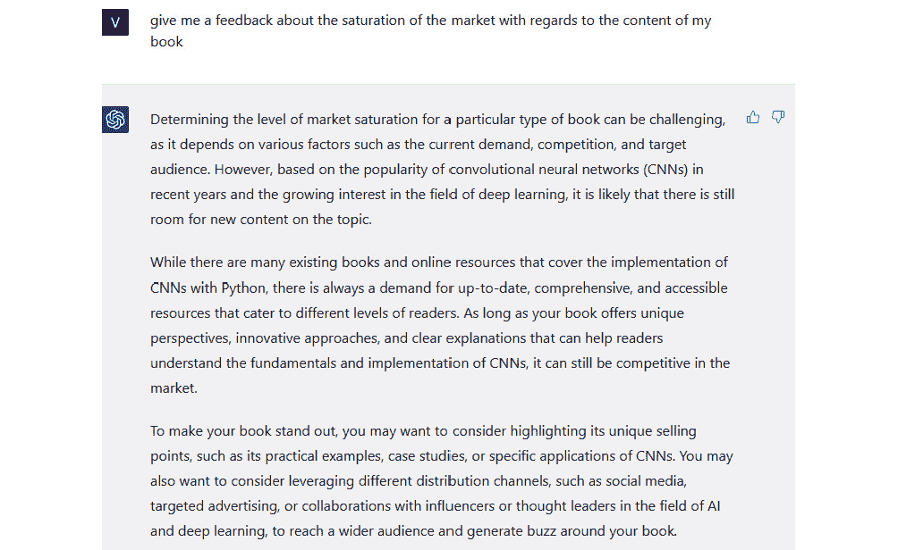

图 5.25 – ChatGPT 就如何在市场上保持竞争力提供建议

最后，让我们请 ChatGPT 更准确地告诉我在我将要操作的市场上如何保持竞争力：

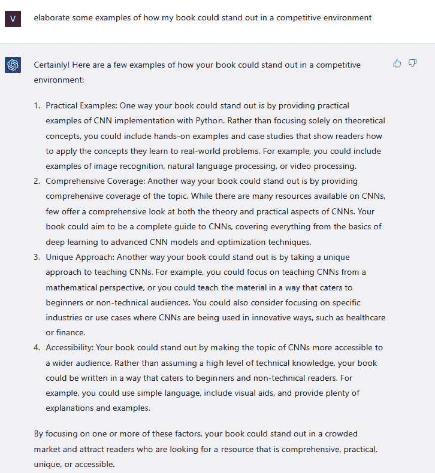

图 5.26 – ChatGPT 如何建议改进您的书籍内容以使其脱颖而出的示例

ChatGPT 在列举一些使我的书独特的好建议方面做得相当不错。

总的来说，ChatGPT 可以成为信息检索和竞争情报的有价值助手。然而，重要的是要记住知识库截止日期为 2021 年：这意味着，每当我们需要检索实时信息，或者在进行今天的竞争市场分析时，我们可能无法依赖 ChatGPT。

尽管如此，这个工具仍然提供了可以应用的出色建议和最佳实践，而不受知识库截止日期的影响。

# 总结

本章我们看到的所有示例都只是 ChatGPT 可以帮助提高生产力的一小部分模拟。这些小技巧可以极大地帮助你完成可能会重复的活动（比如用类似模板回复邮件而不是写每日例行公事）或者繁琐的活动（比如搜索背景资料或竞争情报）。

在下一章中，我们将更深入地探讨 ChatGPT 正在改变游戏规则的三个主要领域——开发、营销和研究。

