# 七、通过 ChatGPT 掌握营销技巧

在本章中，我们将重点介绍营销人员如何利用 ChatGPT，在这一领域中查看 ChatGPT 的主要用例，以及营销人员如何将其作为有价值的助手。

我们将学习 ChatGPT 如何协助以下活动：

+   营销人员对 ChatGPT 的需求

+   新产品开发和上市策略

+   营销比较的 A/B 测试

+   通过**搜索引擎** **优化** (**SEO**)使网站和帖子更高效

+   文本数据的情感分析

在本章结束时，你将能够利用 ChatGPT 进行与营销相关的活动，并提高你的生产力。

# 技术要求

你需要一个 OpenAI 账户才能访问 ChatGPT 和 DALL-E。

本章中的所有代码和提示都可以在本书的 GitHub 仓库中找到：[`github.com/PacktPublishing/Modern-Generative-AI-with-ChatGPT-and-OpenAI-Models`](https://github.com/PacktPublishing/Modern-Generative-AI-with-ChatGPT-and-OpenAI-Models)。

# 营销人员对 ChatGPT 的需求

营销可能是 ChatGPT 和 OpenAI 模型创造力最纯粹发挥作用的领域。它们可以成为支持创意发展的实用工具，涉及新产品、营销活动、搜索引擎优化等方面。总体而言，营销人员自动化和简化了工作的许多方面，同时提高了营销工作的质量和效果。

这里有一个例子。在营销中，ChatGPT 最显著且有前景的用例之一是个性化营销。ChatGPT 可用于分析客户数据，并生成与个体客户共鸣的个性化营销信息。例如，营销团队可以使用 ChatGPT 分析客户数据，并制定针对特定客户偏好和行为的定向电子邮件营销活动。这可以增加转化的可能性，并导致更高的客户满意度。通过提供客户情感和行为洞察、生成个性化营销信息、提供个性化客户支持以及生成内容，ChatGPT 可帮助营销人员提供卓越的客户体验，并推动业务增长。

这是 ChatGPT 在营销领域的许多应用示例之一。在接下来的章节中，我们将看到由 ChatGPT 支持的端到端营销项目的具体示例。

# 新产品开发和上市策略

你可以将 ChatGPT 引入营销活动的第一种方式可能是作为新产品开发和**上市**（**GTM**）策略的助手。

在本节中，我们将逐步了解如何开发和推广新产品的指南。你已经拥有一个名为**RunFast**的跑步服装品牌，到目前为止你只生产了鞋子，所以你希望通过新产品线扩展业务。我们将从进行头脑风暴开始来创建一个 GTM 策略。当然，一切都由 ChatGPT 支持：

+   **头脑风暴的创意**：ChatGPT 能够支持你进行头脑风暴，并提供新产品线的草案选项的理由。所以，让我们问问应该专注于哪种新产品线：

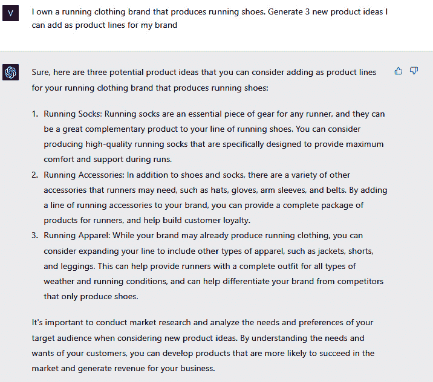

图 7.1 – ChatGPT 生成的新创意示例

在三个建议中，我们将选择第一个，因为 ChatGPT 建议的原因——这确实是我们跑步鞋的一个补充产品，所以我们将继续进行。

+   **产品名称**：现在我们已经确定了自己的想法，我们需要为其想一个引人注目的名称。同样，我会向 ChatGPT 寻求更多选项，以便我可以选择我的最喜欢的：

图 7.2 – 潜在的产品名称列表

**SprintSoles**对我来说听起来不错 – 我会选择这个。

+   **生成引人注目的口号**：除了产品名称外，我还想分享名称背后的意图和产品线的使命，以便我的目标受众对此产生兴趣。我希望能激发客户的信任和忠诚，并让他们在我的新产品线的使命中看到自己的影子。

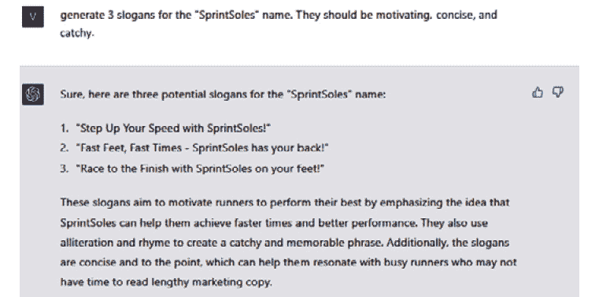

图 7.3 – 我的新产品名称口号列表

很好，现在我满意了产品名称和口号，我将在以后用它们来创建一个独特的社交媒体公告。在这之前，我想要花更多时间进行针对目标受众的市场调研。

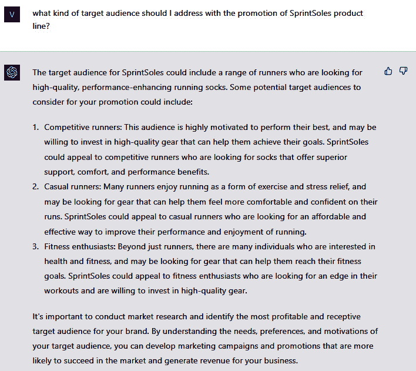

图 7.4 – 要达到的新产品线目标人群列表

重要的是要考虑到受众内的不同群体，以便你能够区分你想要传达的信息。在我的情况下，我希望确保我的产品线能够对不同的人群产生影响，比如竞技跑者、休闲跑者和健身爱好者。

+   **产品变体和销售渠道**：根据前面的潜在客户群，我可以生成产品变体，使其更加贴合特定受众：

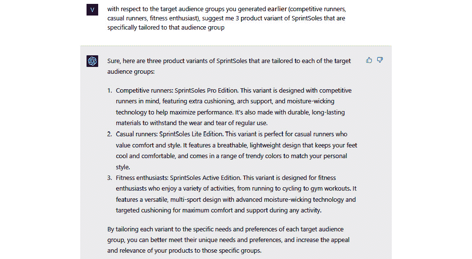

图 7.5 – 产品线变体示例

同样，我还可以要求 ChatGPT 为前面的每个群体提供不同的销售渠道建议：

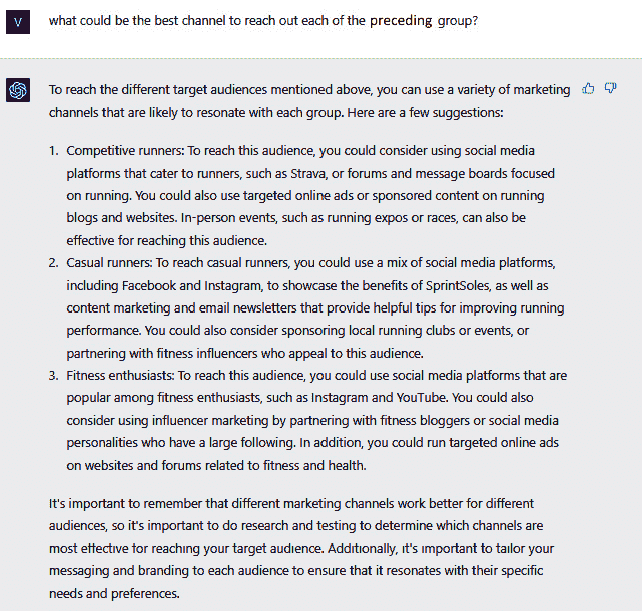

图 7.6 – ChatGPT 提供的不同销售渠道建议

+   **脱颖而出**：我希望我的产品线在竞争中脱颖而出，在一个非常饱和的市场中脱颖而出 – 我想让它独特。出于这个目的，我要求 ChatGPT 包括可持续性和包容性等社会考虑因素。让我们请 ChatGPT 在这方面提供一些建议：

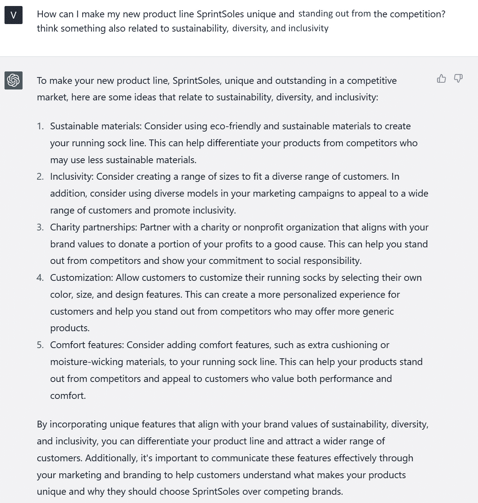

图 7.7 – ChatGPT 生成的突出特点示例

正如您所看到的，它能够生成有趣的特点，使我的产品线独特。

+   **产品描述**：现在是时候开始制定我们的 GTP 计划了。首先，我想生成一个产品描述放在我的网站上，包括之前所有独特的差异化因素。

图 7.8 – 由 ChatGPT 生成的描述和 SEO 关键词示例

+   **公平价格**：另一个关键因素是确定我们产品的公平价格。当我针对不同受众（竞争跑步者、休闲跑步者和健身爱好者）区分产品变体时，我也希望有一个考虑到这种聚类的价格范围。

图 7.9 – 产品变体的价格范围

我们快要完成了。我们已经经历了许多新产品开发和市场推广步骤，在每一步中，ChatGPT 都是一个很好的支持工具。

最后，我们可以请 ChatGPT 为我们的新产品生成一个 Instagram 帖子，包括相关的标签和 SEO 关键词。然后我们可以用 DALL-E 生成图像！

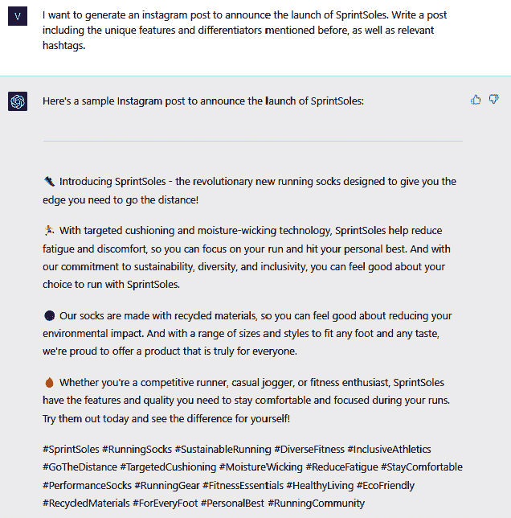

图 7.10 – 由 ChatGPT 生成的社交媒体帖子

而且，有了 DALL-E 的特别贡献，这是最终结果：

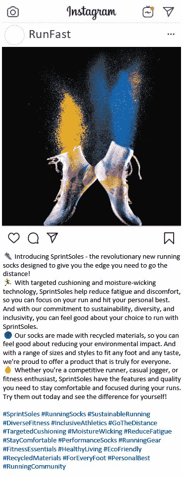

图 7.11 – 由 ChatGPT 和 DALL-E 完全生成的 Instagram 帖子

当然，这里还缺少许多元素来完成产品开发和市场推广。然而，在 ChatGPT 的支持下（以及 DALL-E 的特别贡献 – 您可以在 [`openai.com/product/dall-e-2`](https://openai.com/product/dall-e-2) 上自行尝试 DALL-E），我们设法集思广益，构思了一个新的产品线和变体，潜在客户，引人注目的口号，最后，生成了一个相当不错的 Instagram 帖子来宣布 SprintSoles 的推出！

# 营销比较的 A/B 测试

ChatGPT 还可以帮助营销人员进行 A/B 测试的另一个有趣领域。

在营销中的 A/B 测试是一种比较营销活动、广告或网站的两个不同版本以确定哪个表现更好的方法。在 A/B 测试中，创建两个相同活动或元素的变体，只有一个变量在两个版本之间改变。目标是看哪个版本生成更多的点击、转化或其他期望的结果。

A/B 测试的一个例子可能是测试两个电子邮件活动的版本，使用不同的主题行，或测试两个网站着陆页的版本，带有不同的行动呼吁按钮。通过测量每个版本的响应率，营销人员可以确定哪个版本表现更好，并基于数据做出关于以后使用哪个版本的决策。

A/B 测试使营销人员能够优化他们的活动和元素，以实现最大效果，从而获得更好的结果和更高的投资回报率。

由于这种方法涉及生成许多相同内容的变体的过程，ChatGPT 的生成能力肯定可以在其中提供帮助。

让我们考虑以下示例。我正在推广我开发的新产品：一款新的、轻薄的速度攀岩安全带。我已经做过一些市场调研，我了解我的利基受众。我也知道，对于这个受众来说，一个很好的沟通渠道是在一个在线攀岩博客上发布内容，其中大多数攀岩健身房的会员都是忠实读者。

我的目标是创建一篇出色的博客文章，分享这款新安全带的推出，并且我想在两个群体中测试它的两个不同版本。我即将发布的博客文章，也是我想要进行 A/B 测试的对象，如下所示：

图 7.12 – 推出攀岩装备的博客文章示例

在这里，ChatGPT 可以在两个层面上帮助我们：

+   第一层是重新表述文章，使用不同的关键词或不同的引人注目的口号。为了做到这一点，一旦这篇文章作为背景提供，我们可以要求 ChatGPT 处理这篇文章，并稍微改变一些元素：

图 7.13 – ChatGPT 生成的博客文章的新版本

根据我的要求，ChatGPT 能够重新生成我要求的那些元素（标题、副标题和结尾句），以便我可以通过监控两个受众群体的反应来监控这些元素的有效性。

+   第二级别是设计网页，即改变图像的搭配而不是按钮的位置。为此，我在登载在攀岩博客上的博文中创建了一个简单的网页（你可以在书的 GitHub 代码库中找到这个代码：[`github.com/PacktPublishing/Modern-Generative-AI-with-ChatGPT-and-OpenAI-Models/tree/main/Chapter%207%20-%20ChatGPT%20for%20Marketers/Code`](https://github.com/PacktPublishing/Modern-Generative-AI-with-ChatGPT-and-OpenAI-Models/tree/main/Chapter%207%20-%20ChatGPT%20for%20Marketers/Code)）：

图 7.14 – 登载在攀岩博客上的示例博文

我们可以直接用 HTML 代码来激活 ChatGPT，并要求它改变一些布局元素，比如按钮的位置或它们的措辞。例如，读者可能会对一个 **我想要** 的按钮比**立即购买**按钮更感兴趣。

所以，让我们用 HTML 源代码来激活 ChatGPT：

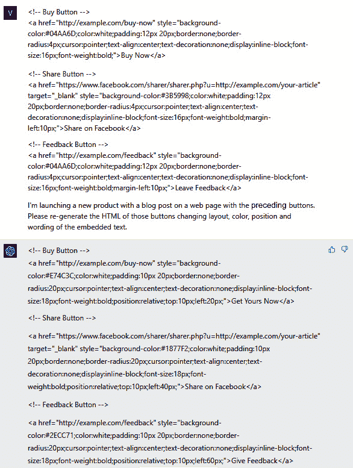

图 7.15 – ChatGPT 改变 HTML 代码

让我们看一下输出是什么样的：

图 7.16 – 网站的新版本

正如你所见，ChatGPT 只在按钮层面进行了干预，稍微改变了它们的布局、位置、颜色和措辞。

事实上，检查两个版本网页的源代码，我们可以看到它们在按钮部分的不同之处：

图 7.17 – 两个版本网站的源代码比较

总之，ChatGPT 是市场营销 A/B 测试的宝贵工具。其快速生成相同内容的不同版本能减少新活动上市的时间。通过利用 ChatGPT 进行 A/B 测试，你可以优化你的市场营销策略，并最终为你的业务带来更好的结果。

# 提升搜索引擎优化（SEO）

ChatGPT 另一个有前景的领域是**搜索引擎优化**（**SEO**）。这是 Google 或必应等搜索引擎排名的关键因素，它决定了你的网站是否能对寻找你所推广内容的用户可见。

定义

SEO 是一种增加网站在**搜索引擎结果页**（**SERP**）上的可见性和排名的技术。它通过优化网站或网页来增加来自搜索引擎的有机（非付费）流量的数量和质量。SEO 的目的是通过为特定关键词或短语优化网站，吸引更多有针对性的访问者。

想象一下，您经营一家名为**帽子和手套**的电子商务公司，该公司只销售，正如您可能已经猜到的那样，帽子和手套。您现在正在创建您的电子商务网站，并希望优化其排名。让我们请教 ChatGPT 列出一些相关的关键词，以嵌入到我们的网站中：

图 7.18 – ChatGPT 生成的 SEO 关键词示例

正如您所看到的，ChatGPT 能够创建不同类型的关键词列表。其中一些非常直观，如**帽子**和**手套**。其他则相关，具有间接联系。例如，**礼物想法**不一定与我的电子商务业务相关，但将其包含在我的关键词中可能非常明智，这样我就可以扩大我的受众群体。

SEO 的另一个关键要素是**搜索引擎意图**。搜索引擎意图，也称为**用户意图**，指的是用户在搜索引擎中进行的特定搜索查询的潜在目的或目标。理解搜索引擎意图很重要，因为它有助于企业和营销人员创建更具针对性和有效的内容和营销策略，与搜索者的需求和期望保持一致。

通常有四种类型的搜索引擎意图：

+   **信息意图**：用户正在寻找关于特定主题或问题的信息，例如*法国的首都是什么？*或*如何在家里制作披萨*。

+   **导航意图**：用户正在寻找特定网站或网页，例如**Facebook 登录**或**Amazon.com**。

+   **商业意图**：用户正在寻找购买产品或服务，但可能尚未做出最终决定。商业意图搜索的示例包括*1000 美元以下最佳笔记本电脑*或*在线折扣鞋*。

+   **交易意图**：用户有完成交易的具体目标，可能涉及实物购买或订阅服务。交易意图的示例可能是*购买 iPhone 13*或*注册健身房会员*。

通过理解特定搜索查询背后的意图，企业和营销人员可以创建更具针对性和有效的内容，满足目标受众的需求和期望。这可以提高搜索引擎排名，增加流量，最终实现更多的转化和收入。

现在，问题是，ChatGPT 能否确定给定请求的意图？在回答之前，值得注意的是，推断给定提示意图的活动是**大型语言模型**（**LLMs**）的核心业务，包括 GPT。因此，可以肯定，ChatGPT 能够捕捉提示的意图。

这里的附加价值在于，我们想看看 ChatGPT 是否能够确定在一个精确的领域和具体的分类法中的意图，即营销领域。这就是为什么提示设计再次至关重要，以指导 ChatGPT 朝着正确的方向发展。

图 7.19 – ChatGPT 充当 SEO 专家的示例

最后，我们还可以进一步利用 *Act as…* hack，这是我们在 *第四章* 中已经提到过的。了解如何优化我们的网站，使其尽可能地吸引更多用户，这确实非常有趣。在营销领域，这种分析被称为 **SEO 审核**。SEO 审核是对网站的 SEO 表现和潜在改进领域进行评估。SEO 审核通常由 SEO 专家、网站开发人员或营销人员进行，涉及对网站的技术基础设施、内容和反向链接配置的全面分析。

在进行 SEO 审核期间，审核员通常会使用一系列工具和技术来识别改进的领域，例如关键词分析、网站速度分析、网站架构分析和内容分析。然后，审核员将生成一份报告，概述关键问题、改进机会以及建议的行动来解决这些问题。

让我们请 ChatGPT 充当 SEO 专家，并指导我们 SEO 审核报告应该是什么样子，应该包括哪些指标和关键绩效指标：

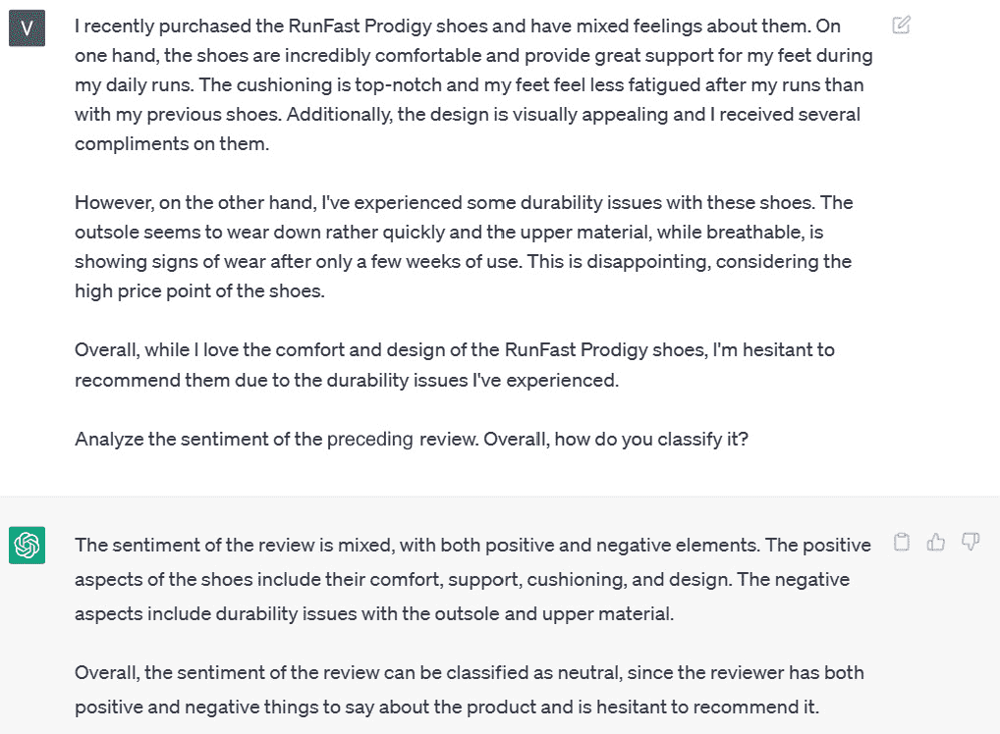

图 7.20 – ChatGPT 提供优化 HTML 代码的示例

ChatGPT 能够生成相当准确的分析，带有相关的评论和建议。总的来说，ChatGPT 在与 SEO 相关的活动中具有有趣的潜力，无论是从头开始构建网站还是改进现有网站，它都可以成为一个很好的工具。

# 通过进行情感分析来提高质量和增加客户满意度

情感分析是营销中使用的一种技术，用于分析和解释客户对品牌、产品或服务表达的情感和意见。它涉及使用 **自然语言处理**（**NLP**）和 **机器学习**（**ML**）算法来识别和分类文本数据的情感，例如社交媒体帖子、客户评论和反馈调查。

通过进行情感分析，营销人员可以深入了解客户对其品牌、产品或服务的看法，识别改进的领域，并做出数据驱动的决策，优化其营销策略。例如，他们可以跟踪客户评论的情感，以确定哪些产品或服务收到积极或消极的反馈，并相应调整其营销信息。

总的来说，情感分析是营销人员了解客户情感、衡量客户满意度以及制定与目标受众 resonates 的有效营销活动的宝贵工具。

情感分析已经存在一段时间了，因此您可能想知道 ChatGPT 能够带来什么附加价值。嗯，除了分析的准确性（它目前是市场上最强大的模型）之外，ChatGPT 还有区别于其他情感分析工具的地方，因为它是**人工通用智能**（**AGI**）。

这意味着当我们使用 ChatGPT 进行情感分析时，并不是在使用它的特定 API 之一来执行该任务：ChatGPT 和 OpenAI 模型的核心理念是它们可以同时协助用户完成许多常规任务，根据用户的请求与任务进行交互并调整分析的范围。

因此，毫无疑问，ChatGPT 能够捕捉给定文本的情感，比如 Twitter 帖子或产品评论。但是，ChatGPT 还可以更进一步，协助识别正面或负面影响情感的产品或品牌的特定方面。例如，如果顾客们一直以消极方式谈论产品的某个特征，ChatGPT 可以将该特征标记为需要改进的地方。或者，可以要求 ChatGPT 生成对特别微妙的评论的回应，同时记住评论的情感并将其用作回应的背景。它还可以生成汇总所有评论或评论中找到的负面和正面因素并将它们分成类别的报告。

让我们考虑下面的例子。一位顾客最近从我的电子商务公司 RunFast 购买了一双鞋，并留下了以下评论：

*我最近购买了 RunFast Prodigy 鞋子，对它们有着复杂的感受。一方面，这些鞋子非常舒适，在我日常跑步时为我的脚提供了很好的支撑。缓冲效果一流，比我之前的鞋子跑步后我的脚感到更轻松。此外，设计也很吸引眼球，我也收到了几个赞美它们的评论。*

*但另一方面，我对这些鞋子的耐久性有些问题。鞋底似乎磨损得相当快，鞋面材料虽然透气，但只用了几周就出现了磨损迹象。考虑到鞋子的高价格，这令人失望。*

*总的来说，虽然我喜欢 RunFast Prodigy 鞋子的舒适度和设计，但由于我经历过的耐用性问题，我犹豫是否推荐它们。*

让我们请 ChatGPT 捕捉这条评论的情感：

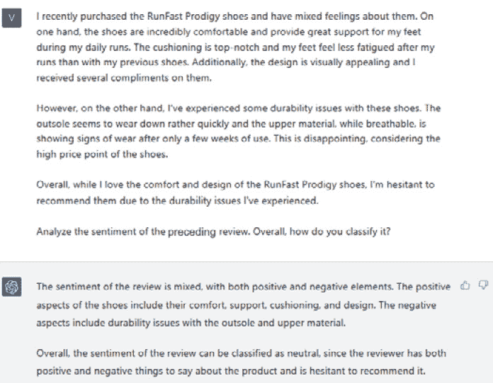

图 7.21 – ChatGPT 分析客户评论

从前述图中，我们可以看到 ChatGPT 并不局限于提供标签：它还解释了评论的正面和负面要素，这些要素表现出了复杂的感觉，因此总体上可以标记为中立。

让我们深入一点，并请一些关于改进产品的建议：

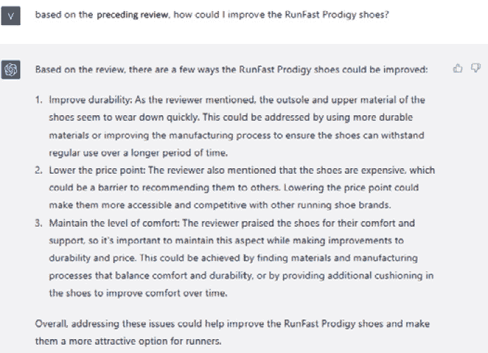

图 7.22 – 基于客户反馈的产品改进建议

最后，让我们回应客户，向客户显示，我们作为一家公司确实关心客户的反馈，并希望改进我们的产品。

图 7.23 – ChatGPT 生成的响应

我们看到的例子非常简单，只有一个评论。现在想象一下，我们有大量的评论，以及多种销售渠道，我们从中收到反馈。想象一下，像 ChatGPT 和 OpenAI 模型这样的工具的强大之处，它们可以分析和整合所有这些信息，找出产品的优点和缺点，捕捉客户的趋势和购物习惯。此外，为了客户关怀和留存，我们还可以使用我们喜欢的写作风格自动化回答评论。事实上，通过定制您的聊天机器人的语言和语调，以满足客户的特定需求和期望，您可以创造更具吸引力和有效的客户体验。

这里有一些例子：

+   **有同情心的聊天机器人**：使用有同情心的语调与语言与客户交流，这些客户可能正在经历问题或者需要帮助处理敏感问题

+   **专业聊天机器人**：使用专业的语调与语言与客户交流，这些客户可能正在寻求具体信息或者需要在技术问题上获得帮助

+   **会话式聊天机器人**：使用轻松友好的语调与客户交流，这些客户可能正在寻求个性化的体验或者有更一般的询问

+   **幽默聊天机器人**：使用幽默和风趣的语言与客户交流，这些客户可能正在寻求一种轻松的体验或者缓解紧张的情况

+   **教育性聊天机器人**：使用教学风格的沟通与客户交流，这些客户可能希望了解更多关于产品或服务的信息

总之，ChatGPT 可以成为企业进行情感分析、改善质量和留住客户的强大工具。凭借其先进的自然语言处理能力，ChatGPT 可以实时准确地分析客户反馈和评论，为企业提供有价值的客户情绪和偏好的见解。通过将 ChatGPT 作为其客户体验策略的一部分，企业可以快速识别可能会对客户满意度产生负面影响的任何问题，并采取纠正措施。这不仅可以帮助企业提高质量，还可以增加客户忠诚度和留存。

# 摘要

在本章中，我们探讨了营销人员如何利用 ChatGPT 来增强他们的营销策略。我们了解到 ChatGPT 可以帮助开发新产品，定义上市策略，设计 A/B 测试，增强 SEO 分析，并捕捉评论、社交媒体帖子和其他客户反馈的情感。

对于营销人员来说，ChatGPT 的重要性在于其革新公司与客户互动方式的潜力。通过利用 NLP、ML 和大数据的力量，ChatGPT 让公司能够创建更个性化和相关的营销信息，改善客户支持和满意度，最终推动销售和收入增长。

随着 ChatGPT 不断发展和演变，很可能我们会看到更多在营销行业的参与，特别是公司与客户互动的方式。事实上，大量依赖 AI 让公司能更深入地了解客户行为和偏好。

对于营销人员的关键要点是要接受这些变化，并适应 AI 驱动营销的新现实，以保持竞争优势并满足客户需求。

在下一章中，我们将看到本书涵盖的 ChatGPT 应用的第三个也是最后一个领域 - 研究。

