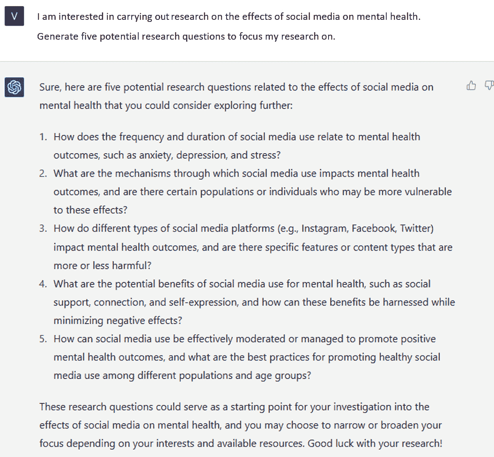
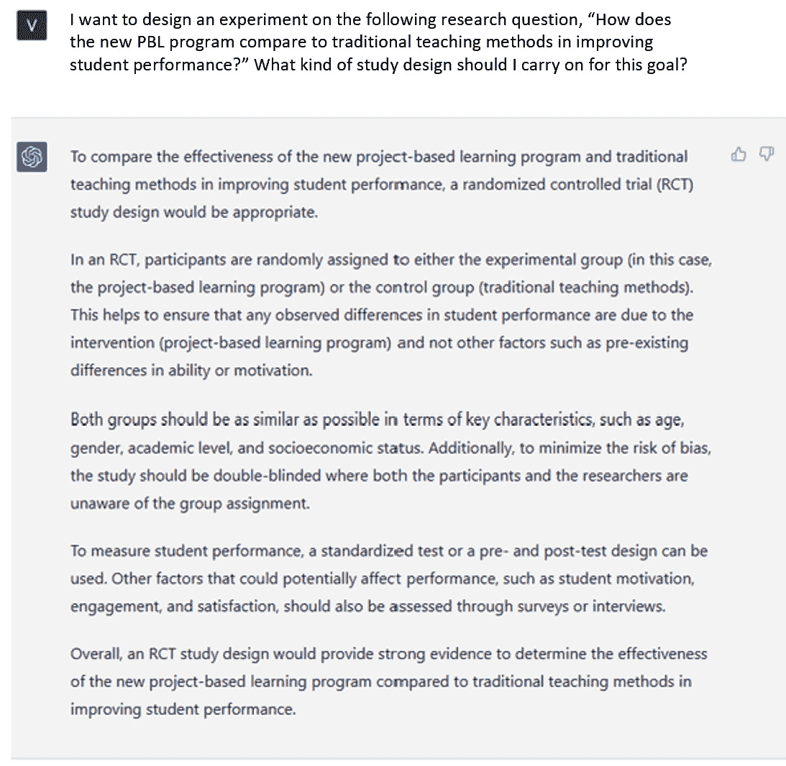
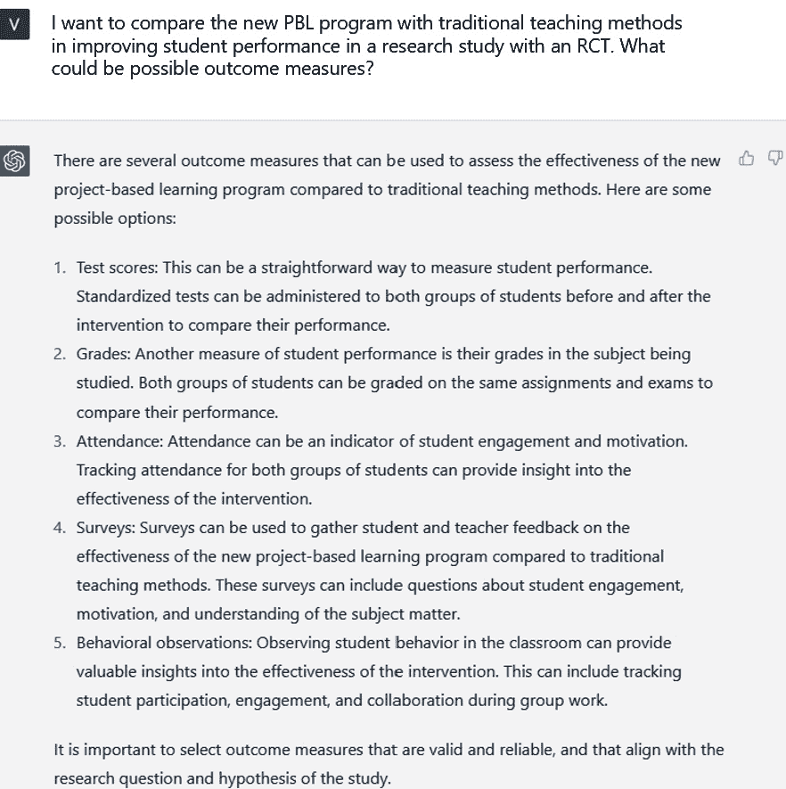
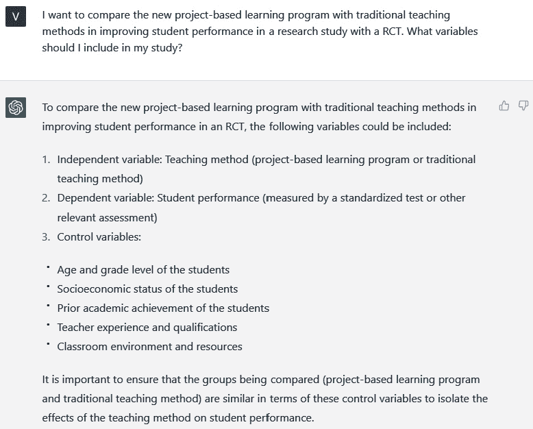
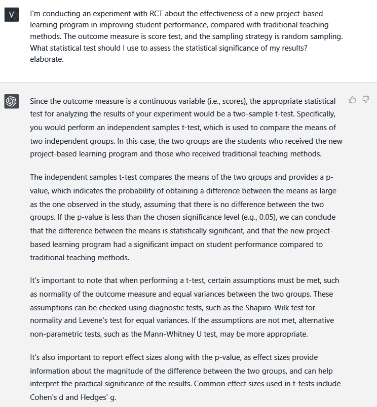
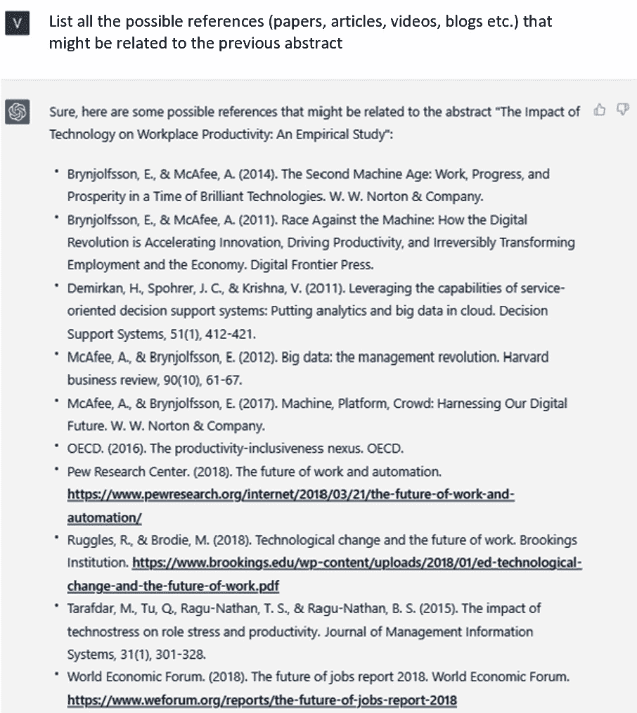
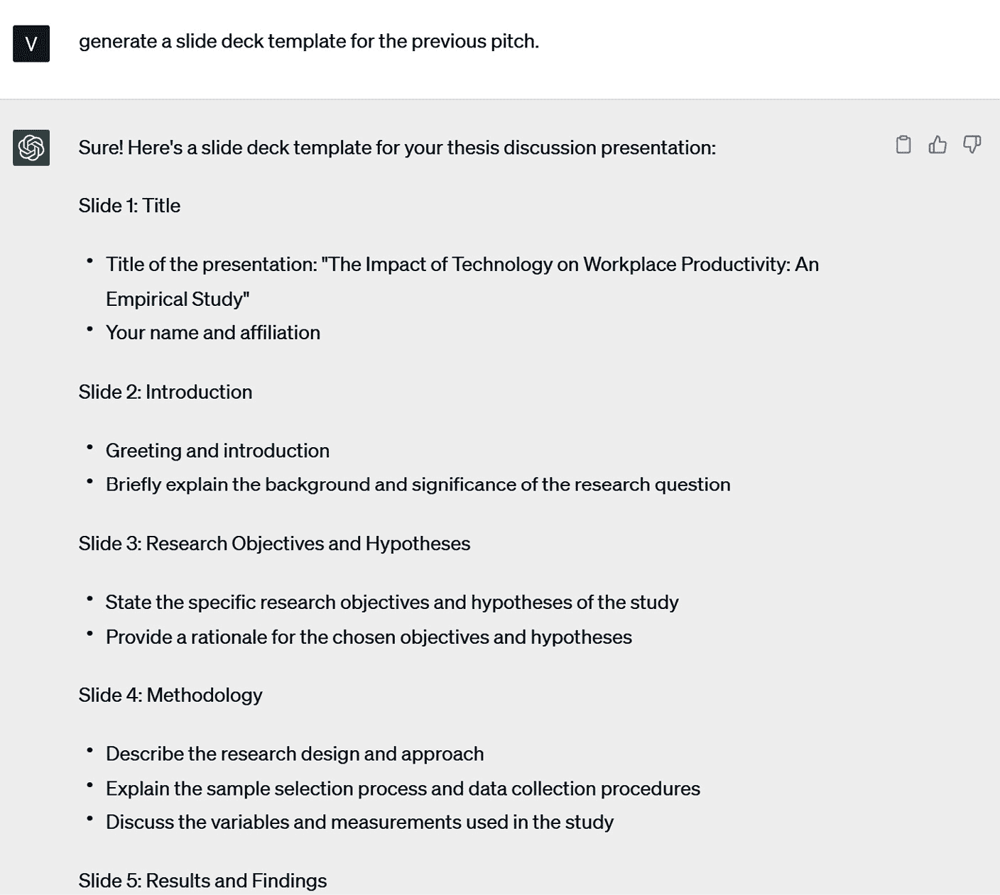
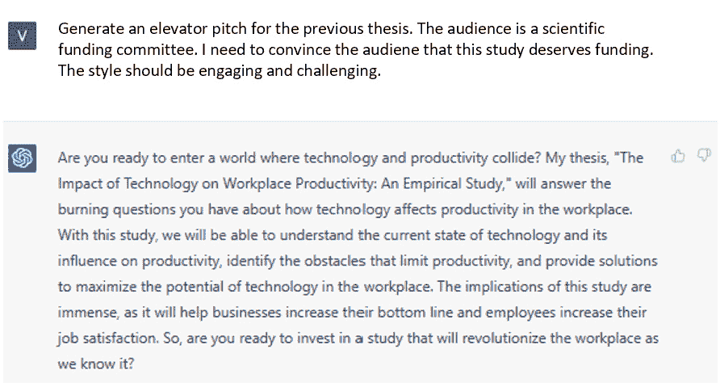

# 八、用 ChatGPT 重新定义研究

在本章中，我们专注于希望利用 ChatGPT 的研究人员。本章将介绍 ChatGPT 可以解决的一些主要用例，以便您从具体示例中了解 ChatGPT 在研究中的应用。

通过本章结束时，您将熟悉多种使用 ChatGPT 作为研究助手的方式，包括以下内容：

+   研究人员对 ChatGPT 的需求

+   为您的研究头脑风暴文献

+   为您的实验设计和框架提供支持

+   生成并格式化参考文献以纳入您的研究

+   关于您的研究向不同受众传达演讲或幻灯片展示

本章还将提供示例，并使您能够自行尝试提示。

# 研究人员对 ChatGPT 的需求

ChatGPT 可以成为各领域研究人员的极其宝贵的资源。作为一个在大量数据上训练的复杂语言模型，ChatGPT 可以快速准确地处理大量信息，并生成可能通过传统研究方法难以或耗时发现的见解。

此外，ChatGPT 还可以为研究人员提供对其领域的独特视角，通过分析可能不会立即为人类研究人员所注意到的模式和趋势。例如，想象一位研究气候变化并希望了解公众对这一问题的看法的研究人员。他们可以要求 ChatGPT 分析与气候变化相关的社交媒体数据，并识别在线人们表达的最常见主题和情绪。然后，ChatGPT 可以向研究人员提供详尽的报告，详细说明与该主题相关的最常见单词、短语和情绪，以及任何有用的新兴趋势或模式。

通过与 ChatGPT 合作，研究人员可以获得尖端技术和见解，并保持在其领域的前沿。

现在让我们深入探讨四种使用情况，ChatGPT 可以提高研究生产力。

# 为您的研究头脑风暴文献

文献综述是对特定主题或问题的现有已发表研究进行批判性和系统性审查的关键过程。它涉及搜索、审查和综合相关已发表研究和其他来源，如书籍、会议记录和灰色文献。文献综述的目标是识别特定领域中的差距、不一致性和进一步研究的机会。

文献综述过程通常包括以下步骤：

1.  **定义研究问题**：进行文献综述的第一步是定义感兴趣主题的研究问题。因此，假设我们正在研究社交媒体对心理健康的影响。现在我们有兴趣思考一些可能的研究问题，以便聚焦我们的研究，并且我们可以利用 ChatGPT 来做到这一点：

图 8.1 – 基于给定主题的研究问题示例

这些都是可以进一步调查的有趣问题。由于我对最后一个问题特别感兴趣，我将把它作为我们分析下一步的参考。

1.  **文献搜索**：现在我们有了研究问题，下一步是使用各种数据库、搜索引擎和其他来源搜索相关文献。研究人员可以使用特定关键词和搜索词来帮助识别相关研究。

图 8.2 – 在 ChatGPT 支持下进行文献搜索

从 ChatGPT 的建议开始，我们可以开始深入研究这些参考文献。

1.  **筛选文献**：一旦确定了相关文献，下一步是筛选研究以确定它们是否符合综述的纳入标准。这通常涉及审查摘要，必要时还包括研究的全文。

比如，假设我们想深入研究**促进青少年和年轻成年人健康使用社交媒体：干预框架**研究论文。让我们请 ChatGPT 为我们筛选一下：

图 8.3 – 特定论文的文献筛选

ChatGPT 能够为我提供这篇论文的概述，并考虑到其研究问题和讨论的主要话题，我认为它对我的研究将非常有用。

注意

ChatGPT 能够生成这篇论文的筛选，因为显然它是其知识库的一部分。如果您有兴趣在 2021 年之后撰写的论文上执行相同的筛选（ChatGPT 培训的截止日期），您需要向 ChatGPT 提供摘要或段落内容。

1.  **提取数据**：确定了相关研究后，研究人员需要从每个研究中提取数据，如研究设计、样本大小、数据收集方法和主要发现。

例如，假设我们想从 Hinduja 和 Patchin（2018）的论文*数字自残：普及率、动机和结果*中收集以下信息：

+   论文中收集的数据来源和研究对象

+   研究人员采用的数据收集方法

+   数据样本大小

+   分析的主要局限性和缺点

+   研究人员采用的实验设计

就是这样：

图 8.4 – 从给定论文中提取相关数据和框架

1.  **综合文献**：文献综述过程中的最后一步是综合研究结果并得出关于该领域当前知识状态的结论。这可能涉及识别共同主题，突出文献中的差距或不一致之处，并确定未来研究的机会。

让我们想象一下，除了 ChatGPT 提出的论文外，我们还收集了其他标题和论文，我们想要综合。更具体地说，我想了解它们是否指向相同的结论，哪些是共同趋势，哪种方法可能比其他方法更可靠。对于这种情况，我们将考虑三篇研究论文：

+   *社交媒体对心理健康的影响：一项拟议研究*，作者 Grant Sean Bossard ([`digitalcommons.bard.edu/cgi/viewcontent.cgi?article=1028&context=senproj_f2020`](https://digitalcommons.bard.edu/cgi/viewcontent.cgi?article=1028&context=senproj_f2020))

+   *社交媒体对心理健康的影响*，作者 Vardanush Palyan ([`www.spotlightonresearch.com/mental-health-research/the-impact-of-social-media-on-mental-health`](https://www.spotlightonresearch.com/mental-health-research/the-impact-of-social-media-on-mental-health))

+   *社交媒体对心理健康的影响：服务提供者意识的混合方法研究*，作者 Sarah Nichole Koehler 和 Bobbie Rose Parrell ([`scholarworks.lib.csusb.edu/cgi/viewcontent.cgi?article=2131&context=etd`](https://scholarworks.lib.csusb.edu/cgi/viewcontent.cgi?article=2131&context=etd))

这是结果的呈现方式：

图 8.5 – 三篇研究论文的文献分析和基准比较

同样，在这种情况下，ChatGPT 能够对所提供的三篇论文进行相关摘要和分析，包括方法之间的基准比较和可靠性考虑。

总的来说，ChatGPT 能够在文献综述领域执行许多活动，从研究问题头脑风暴到文献综合。一如既往，需要**专业领域专家**（**SME**）来审查结果；然而，在这种协助下，许多活动可以更有效地完成。

ChatGPT 还可以支持研究人员想要进行的实验设计。我们将在以下部分讨论这一点。

# 为您的实验设计和框架提供支持

实验设计是计划和执行科学实验或研究以回答研究问题的过程。它涉及对研究设计、要测量的变量、样本大小以及收集和分析数据的程序做出决策。

ChatGPT 可以通过为您提供研究框架，如随机对照试验、拟实验设计或相关研究，以及在实施该设计过程中支持您，帮助进行研究的实验设计。

让我们考虑下面的情景。我们想调查新教育项目对学生数学学习成果的影响。这个新项目包含**基于项目的学习**(**PBL**)，意味着学生被要求以协作的方式解决现实世界的问题，利用数学概念和技能来解决问题并创造解决方案。

为此目的，我们将我们的研究问题定义如下：

*新的 PBL 项目在改善学生表现方面与传统教学方法相比如何？*

这就是 ChatGPT 可以帮助的方式：

+   **确定研究设计**：ChatGPT 可以协助确定研究问题的适当研究设计，如随机对照试验、拟实验设计或相关研究。

图 8.6 – ChatGPT 建议适合你的实验的适当研究设计

ChatGPT 建议进行**随机对照试验**(**RCT**)，并清楚地解释了背后的原因。对我来说，继续这种方法是合理的；下一步将是确定我们实验中需要考虑的结果指标和变量。

+   **确定结果指标**：ChatGPT 可以帮助您确定一些潜在的结果指标，以确定测试的结果。让我们为我们的研究请求一些建议：

图 8.7 – 给定研究的学习成果

对我来说，选择考试成绩作为结果指标是合理的。

+   **确定变量**：ChatGPT 可以帮助研究人员确定研究中的自变量和因变量：

图 8.8 – ChatGPT 为给定研究生成变量

注意，ChatGPT 还能够生成特定于我们考虑的研究设计（RCT）的变量类型，称为**控制变量**。

控制变量，也被称为**协变量**，是在研究中保持恒定或进行控制的变量，以便隔离独立变量和因变量之间的关系。这些变量不是研究的主要焦点，但被包括在内是为了最小化混杂变量对结果的影响。通过控制这些变量，研究人员可以减少获得假阳性或假阴性结果的风险，并增加研究的内部有效性。

有了前述变量，我们已经准备好设置我们的实验了。现在我们需要选择参与者，而 ChatGPT 可以帮助我们。

+   **抽样策略**：ChatGPT 可以为研究提供潜在的抽样策略：

图 8.9 – ChatGPT 提出的 RCT 抽样策略建议

请注意，在实际情况下，总是一个好习惯要求 AI 工具生成更多选项并解释背后的原因，这样您可以做出理性的决定。对于这个例子，让我们继续使用 ChatGPT 建议给出的内容，其中还包括关于感兴趣人群和样本大小的建议。

+   **数据分析**：ChatGPT 可以协助研究人员确定适当的统计测试，以分析从研究中收集的数据，如方差分析、 t 检验或回归分析。

图 8.10 – ChatGPT 为给定研究建议统计测试

ChatGPT 提出的所有建议都是连贯的，并在关于如何进行统计测试的论文中得到了确认。它还能够确定我们可能在谈论一个连续变量（即分数），因此我们知道前面的所有信息都是基于这个假设。如果我们想要离散分数，我们可以通过添加这些信息来调整提示，然后 ChatGPT 将提出不同的方法。

ChatGPT 具体说明假设并解释其推理的事实是基于其输入做出安全决策的关键。

总之，当设计实验时，ChatGPT 可以成为研究人员的宝贵工具。通过利用其**自然语言处理**（**NLP**）能力和广泛的知识库，ChatGPT 可以帮助研究人员选择适当的研究设计，确定抽样技术，识别变量和学习成果，甚至建议用于分析数据的统计测试。

在接下来的部分中，我们将继续探讨 ChatGPT 如何支持研究人员，重点放在参考文献生成上。

# 生成和格式化参考文献

ChatGPT 可以通过提供自动引用和参考工具来支持研究人员进行参考文献生成。这些工具可以为各种来源生成准确的引用和参考，包括书籍、文章、网站等。ChatGPT 熟悉各种引用风格，如 APA、MLA、Chicago 和 Harvard，使研究人员能够选择适合他们工作的风格。此外，ChatGPT 还可以根据研究人员的输入建议相关来源，帮助简化研究过程，并确保所有必要的来源都包含在参考文献中。通过利用这些工具，研究人员可以节省时间，并确保他们的参考文献准确而全面。

让我们考虑以下例子。假设我们完成了一篇名为*技术对工作场所生产力的影响：一项实证研究*的研究论文。在研究和写作过程中，我们收集了以下需要包含在参考文献中的论文、网站、视频和其他来源（依次为三个研究论文、一个 YouTube 视频和一个网站）的参考文献：

+   *第二个机器时代：在充满精彩技术的时代中的工作，进步和繁荣*。Brynjolfsson, 2014\. [`psycnet.apa.org/record/2014-07087-000`](https://psycnet.apa.org/record/2014-07087-000)

+   *利用服务型决策支持系统的能力：把分析和大数据置于云中*。Demirkan, 2013\. 页码 412-421\. [`www.sciencedirect.com/science/article/https://www.sciencedirect.com/science/article/abs/pii/S0167923612001595abs/pii/S0167923612001595`](https://www.sciencedirect.com/science/article/https://www.sciencedirect.com/science/article/abs/pii/S0167923612001595abs/pii/S0167923612001595)

+   *技术压力对角色压力和生产力的影响*. Tarafdar. 页码 300-350\. 2014\. [`www.tandfonline.com/doi/abs/10.2753/MIS0742-1222240109`](https://www.tandfonline.com/doi/abs/10.2753/MIS0742-1222240109)

+   *关于未来工作的重大辩论，得到了解释*. Vox. [`www.youtube.com/watch?v=TUmyygCMMGA`](https://www.youtube.com/watch?v=TUmyygCMMGA)

+   *技术和自动化对现今企业的影响*。, Forbes. 2021\. 技术和自动化对今日企业的影响 ([forbes.com](http://forbes.com)), Forbes. 2021\.

显然，我们不能在我们的研究论文中有上述列表；我们需要适当的格式。为了做到这一点，我们可以向 ChatGPT 提供原始参考文献列表，并要求它按照特定格式重新生成，例如 APA 格式，这是**美国心理学协会**（**APA**）官方使用的参考格式风格，在教育、心理学和社会科学中常用。

让我们看看 ChatGPT 是如何处理的：

图 8.11 – ChatGPT 按照 APA 格式生成的参考文献列表

请注意，如果 ChatGPT 不知道详细信息，则我已指定不要添加详细信息。事实上，我注意到有时候 ChatGPT 会添加出版日期的月份和日期，造成一些错误。

ChatGPT 可以提供的其他有趣的帮助是建议我们可能想引用的潜在参考文献。我们已经在本章第一段看到了 ChatGPT 在写作过程之前能够策划相关文献；然而，一旦论文完成，我们可能会忘记引用相关文献，甚至不知道自己引用了别人的工作。

ChatGPT 可以成为头脑风暴可能错过的引用的伟大助手。让我们再考虑一下我们的论文*技术对工作场所生产力的影响：一项经验性研究*，其摘要如下：

*这项经验性研究探讨了技术对工作场所生产力的影响。该研究旨在确定技术对工作场所生产力的影响程度，并确定对生产力产生最大影响的具体技术。我们对各行业员工进行了调查，并使用回归分析对结果进行了分析。发现表明技术对工作场所生产力有显著的积极影响，对生产力影响最大的技术是促进沟通、协作和任务管理的技术。研究结论是，组织应继续投资于支持这些功能的技术，以最大程度地提高工作场所的生产力*。

让我们让 ChatGPT 列出可能与这种研究相关的所有可能的参考文献：

图 8.12 – 与提供的摘要相关的参考文献列表

您也可以重复此过程，检查论文的其他部分，确保没有漏掉任何相关的引用需要包括在您的参考文献中。

一旦您的研究准备好了，您可能需要用提议方式来进行展示。在接下来的部分中，我们将看到 ChatGPT 如何支持这个任务。

# 生成研究的演示

研究的最后一步通常是向各种受众展示。这可能涉及准备幻灯片演示、提案或网络研讨会，研究人员需要向不同类型的受众表达观点。

比如说，我们的研究*技术对工作场所生产力的影响：一项经验性研究*是为了硕士论文讨论。在这种情况下，我们可以要求 ChatGPT 产生一个持续 15 分钟的提案结构，并遵守科学方法。让我们看看产生了怎样的结果（作为背景，我参考的是上一段的摘要）：

图 8.13 – ChatGPT 生成的论文讨论

那太令人印象深刻了！回到我大学时代，有这样的工具来帮助我设计讨论会真的很有用。

从这个结构开始，我们也可以要求 ChatGPT 生成一个幻灯片演示，作为我们论文讨论的视觉呈现。

注

在*第一章*中，我们已经看到了一个由人工智能驱动的工具 Tome AI 的一个示例，用于生成端到端的幻灯片演示，使用文本生成和图像生成。在这一段中，我们将专注于文本生成部分，但请记住，还有 AI 工具可以帮助您创建幻灯片演示。

让我们继续进行这个请求：

图 8.14 – 基于讨论提纲的幻灯片结构

最后，让我们想象一下，我们的论文讨论非常出色，以至于可能被选中获得研究基金以继续探讨这个主题。现在，我们需要一个电梯演讲来说服资助委员会。让我们从 ChatGPT 那里寻求一些支持:

图 8.15 – 给定论文的电梯演讲

我们总是可以调整结果，使其更符合我们所追求的东西；但是，已经有可用的结构和框架可以节省很多时间，并让我们更专注于想要阐述的技术内容。

总的来说，ChatGPT 能够支持研究的端到端旅程，从文献收集和审阅到最终研究的最终提纲的生成，我们已经展示了它是研究人员的出色 AI 助手。

此外，请注意，在研究领域，最近已经开发了一些与 ChatGPT 不同但同样由 GPT 模型驱动的工具。其中一个例子是 humanata.ai，这是一个由人工智能驱动的工具，允许您上传您的文档并对其进行多种操作，包括摘要、即时问答和基于上传文件生成新论文。

这表明 GPT 驱动的工具（包括 ChatGPT）正在为研究领域的几项创新铺平道路。

# 摘要

在本章中，我们探讨了 ChatGPT 作为研究人员宝贵工具的使用。通过文献综述、实验设计、参考文献生成和格式化以及演示生成，ChatGPT 可以协助研究人员加快那些附加值低或为零的活动，以便他们可以专注于相关活动。

请注意，我们仅关注 ChatGPT 可以支持研究人员的一小部分活动。研究领域中还有许多其他活动可以从 ChatGPT 的支持中受益，其中包括数据收集、研究参与者招募、研究网络、公众参与等等。

将此工具纳入工作流程的研究人员可以从其多功能性和节省时间的功能中受益，最终实现更具影响力的研究成果。

但是，重要的是要牢记 ChatGPT 只是一个工具，应该与专业知识和判断力结合使用。与任何研究项目一样，需要对研究问题和研究设计进行深思熟虑，以确保结果的有效性和可靠性。

通过这一章，我们也结束了本书的*第二部分*，重点关注您可以利用 ChatGPT 的各种场景和领域。然而，我们主要关注个人或小团队的使用，从个人生产力到研究辅助。从*第三部分*开始，我们将提升讨论到大型组织如何利用与 ChatGPT 背后相同的生成式 AI 进行企业规模项目，使用在 Microsoft Azure 云上提供的 OpenAI 模型 API。

# 参考文献

+   [`scholarworks.lib.csusb.edu/cgi/viewcontent.cgi?article=2131&context=etd`](https://scholarworks.lib.csusb.edu/cgi/viewcontent.cgi?article=2131&context=etd)

+   [`www.spotlightonresearch.com/mental-health-research/the-impact-of-social-media-on-mental-health`](https://www.spotlightonresearch.com/mental-health-research/the-impact-of-social-media-on-mental-health)

+   [`digitalcommons.bard.edu/cgi/viewcontent.cgi?article=1028&context=senproj_f2020`](https://digitalcommons.bard.edu/cgi/viewcontent.cgi?article=1028&context=senproj_f2020)

+   [`www.humata.ai/`](https://www.humata.ai/)

