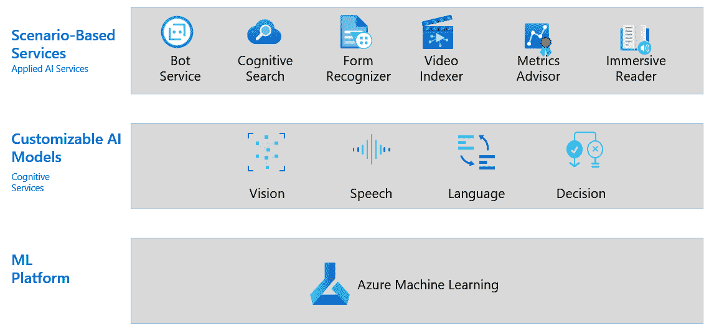
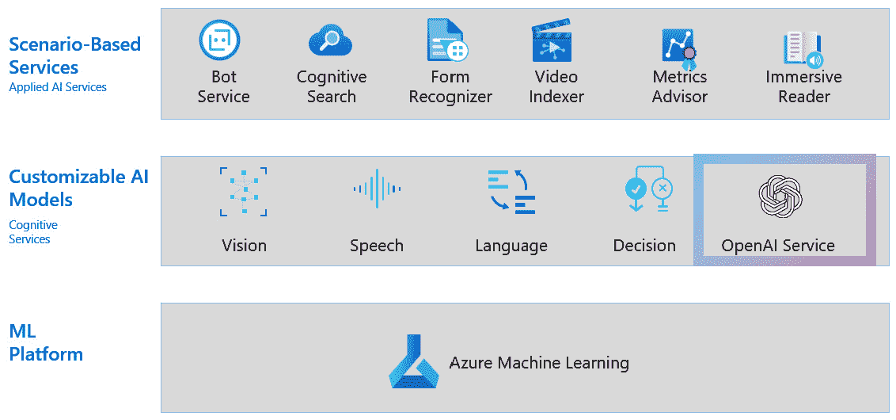
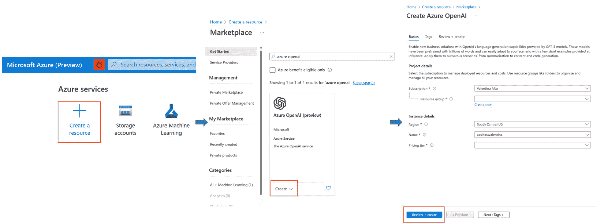
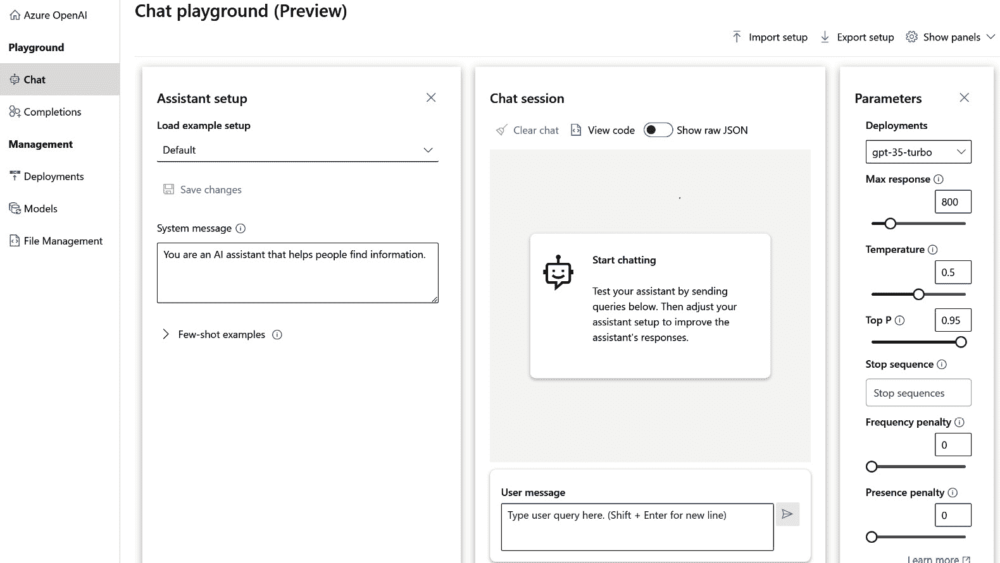
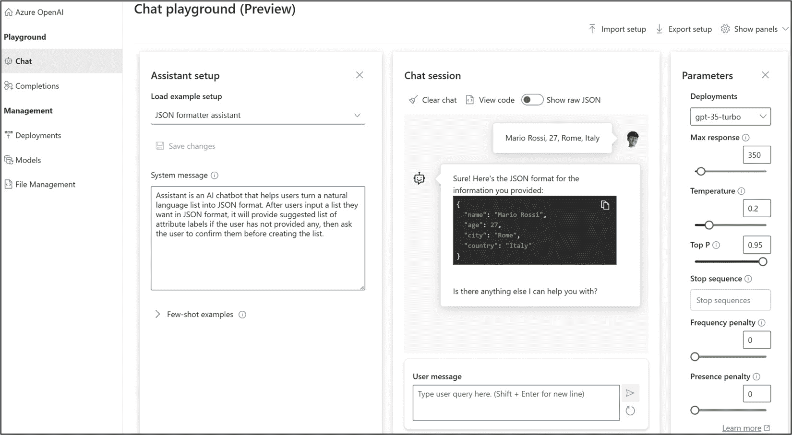
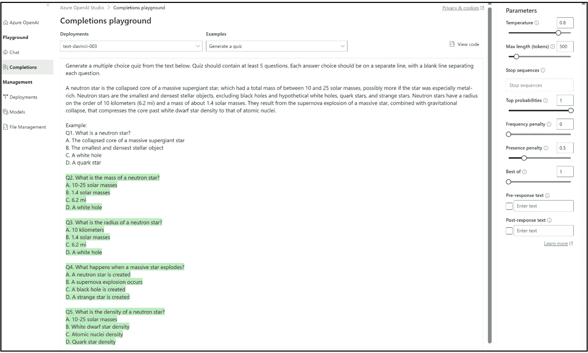
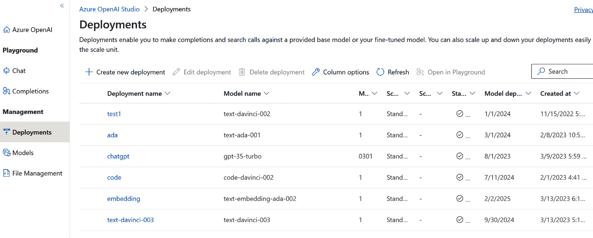
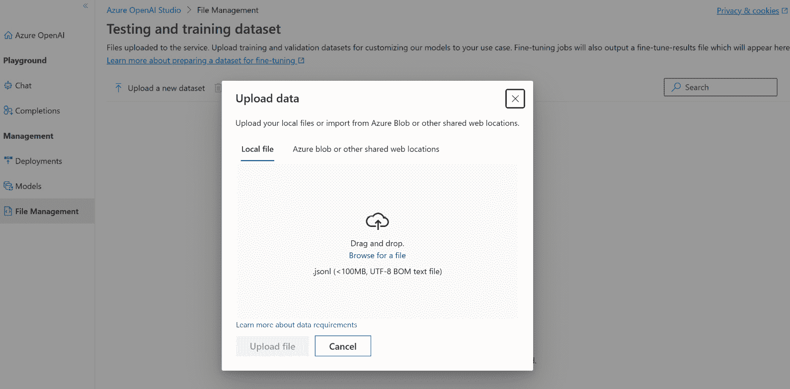

# 九、为企业介绍 Azure OpenAI 的 OpenAI 和 ChatGPT

在本章中，我们将重点关注 OpenAI 模型在企业级的应用，并介绍 OpenAI 和 Microsoft 的合作伙伴关系以及**Azure OpenAI**（**AOAI**）服务。我们将介绍 Microsoft 在**人工智能**（**AI**）领域的里程碑和发展，并突出 Azure 云在 OpenAI 领域的发展历程，以及为何这对于大型组织来说是一个改变游戏规则的因素。最后，我们将考虑负责任的人工智能，并介绍如何确保您的 AI 系统符合道德标准。

在本章中，我们将讨论以下主题：

+   Microsoft 和 OpenAI 合作的历史以及 AOAI 服务的介绍

+   在 OpenAI 模型的公共云中的角色

+   负责任的人工智能

在本章结束时，您将了解 AOAI 服务的主要特点，以及它与我们迄今讨论的 OpenAI 模型的区别。您还将了解 Microsoft 和 OpenAI 之间的合作历史，以及为什么需要在企业规模的基础架构上部署 OpenAI 模型。最后，您将了解 Microsoft 持续而长期的负责任人工智能承诺，以及它如何使 AOAI 服务受益。

# 技术要求

以下是本章的技术要求：

+   **Azure 订阅**，您可以在此处免费创建：[`azure.microsoft.com/free/cognitive-services`](https://azure.microsoft.com/free/cognitive-services)。

+   在期望的 Azure 订阅中**授予对 Azure OpenAI 的访问权限**。撰写本文时，该服务的访问权限仅通过申请获得。您可以通过填写表单，申请访问 Azure OpenAI，链接为[`aka.ms/oai/access`](https://aka.ms/oai/access)。

# 为企业级 AI 介绍 OpenAI 和 Microsoft – 引入 Azure OpenAI

Microsoft 长期投资于 AI 研发，专注于构建 AI 驱动的工具和服务，可供企业和个人解决复杂问题并提高生产力。

它还在实现人类在 AI 领域实现平等的一系列重要里程碑，如语音识别（2017）、机器翻译（2018）、对话问答（2019）、图像字幕（2020）和自然语言理解（2021）。

定义

在 AI 领域，人类平等指的是 AI 系统能够以与人类相等或难以区分的水平执行任务的时刻。这个概念经常用来衡量 AI 系统的性能，尤其是在自然语言理解、语音识别和图像识别等领域。在 AI 领域实现人类的平等被认为是一个重要的里程碑，因为它证明了 AI 有效地匹配了在特定领域的人类能力。

在接下来的几节中，我们将探讨微软在人工智能领域的研究历史和背景，以充分了解其与 OpenAI 的合作之旅，并最终开发 AOAI 服务。 

## 微软人工智能背景

人工智能领域的早期研究可以追溯到 1990 年代末，当时微软建立了其**机器学习**（**ML**）和应用统计研究小组。从那时开始，微软开始研究和尝试智能代理和虚拟助手。在这种情况下，原型是 Clippy，一个为 Microsoft Office 的个人数字助理：

图 9.1 – Clippy，2000 年推出的默认办公助手

Clippy 是更复杂工具的先驱，例如 Cortana。Cortana 于 2014 年推出，是一个使用**自然语言处理**（**NLP**）和机器学习来为用户提供个性化协助的数字助手。

随后，2016 年，作为对微软牛津项目的扩展，微软在 Azure 云中推出了微软认知服务，这是一组 API，为开发人员提供人工智能能力，而无需他们需要机器学习和数据科学专业知识：

图 9.2 – 微软 Azure 人工智能服务

有了认知服务，人工智能最终可以被广泛用户消费，从大型企业到个人开发者。出于这个原因，我们见证了我们现在称之为**人工智能民主化**：人工智能不再是那些拥有深厚技术知识和强大昂贵硬件进行模型训练的特权。认知服务出于以下原因已经发展：

+   以便任何人，从数据科学家到业务用户，都可以利用认知服务进行无代码方法的利用

+   提供一组已经经过训练的预构建模型 – 也就是说，它们已经可以使用，不需要 GPU 驱动的硬件来运行

从微软最近几年收购的人工智能公司中可以看出微软对人工智能的投资，包括 2016 年的 SwiftKey（一个预测键盘应用：[`blogs.microsoft.com/blog/2016/02/03/microsoft-acquires-swiftkey-in-support-of-re-inventing-productivity-ambition/`](https://blogs.microsoft.com/blog/2016/02/03/microsoft-acquires-swiftkey-in-support-of-re-inventing-productivity-ambition/)），2017 年的 Maluuba（一个深度学习初创公司：https://blogs.microsoft.com/blog/2017/01/13/microsoft-acquires-deep-learning-startup-maluuba-ai-pioneer-yoshua-bengio-advisory-role/），和 2018 年的 Bonsai（一个构建人工智能模型的平台：[`blogs.microsoft.com/blog/2018/06/20/microsoft-to-acquire-bonsai-in-move-to-build-brains-for-autonomous-systems/`](https://blogs.microsoft.com/blog/2018/06/20/microsoft-to-acquire-bonsai-in-move-to-build-brains-for-autonomous-systems/)）。

在微软投资和合作的公司中，还包括 OpenAI。

两家科技公司之间的合作始于 2016 年，当时 OpenAI 同意利用微软的 Azure 云基础设施来运行其人工智能实验。后来，在 2019 年，微软宣布与 OpenAI 达成了一项价值 10 亿美元的合作伙伴关系（[`news.microsoft.com/2019/07/22/openai-forms-exclusive-computing-partnership-with-microsoft-to-build-new-azure-ai-supercomputing-technologies/`](https://news.microsoft.com/2019/07/22/openai-forms-exclusive-computing-partnership-with-microsoft-to-build-new-azure-ai-supercomputing-technologies/)），旨在开发可造福人类的人工智能模型和技术。这项合作基于以下三个主要支柱：

+   微软和 OpenAI 将共同建立新的 Azure 超级计算基础设施来训练人工智能模型

+   OpenAI 将使其模型和技术可以从 Azure 云中使用

+   微软将成为 OpenAI 在市场上推广新人工智能解决方案的首选合作伙伴

从那时起，两家公司继续投资和研究，最终在 2023 年 1 月，一套 OpenAI 模型通过 AOAI 服务在 Azure 上提供。

随着 AOAI 服务的普及，达到了一个新的里程碑，微软 AI 产品组合得到了扩展，增加了 OpenAI 强大的大型语言模型。

## Azure OpenAI 服务

AOAI 服务是微软的产品，提供对 OpenAI 强大语言模型（如 GPT-3.5、Codex 和 DALL-E）的 REST API 访问。您可以像使用 OpenAI 模型一样使用这些模型，例如内容生成、摘要、语义搜索、自然语言和代码翻译等任务。

在 Microsoft Azure AI 产品组合的背景下，AOAI 服务位于以下认知服务产品之间：

图 9.3 – AOAI 服务的普及（GA）

与任何其他认知服务产品一样，AOAI 提供已经训练好并准备消费的模型。

要创建您的 AOAI 资源，请按照以下说明操作：

1.  转到 Azure 门户网站 [`ms.portal.azure.com`](https://ms.portal.azure.com)。

1.  点击**创建一个资源**。

1.  输入`azure openai`，然后点击**创建**。

1.  填写所需信息，然后点击**审核 + 创建**。

如下截图所示：

图 9.4 – 创建 AOAI 资源的步骤

这个过程可能需要几分钟。一旦准备就绪，您可以直接转到其用户友好的界面，AOAI Playground，测试您的模型，然后部署它们：

图 9.5 – AOAI 用户界面和 Playground

请注意，AOAI Playground 看起来几乎与我们在*第二章*中看到的 OpenAI Playground 版本相同。这里的区别在于，要使用 AOAI 模型，您必须启动一个部署，这是一个无服务器计算实例，您可以将其附加到模型上。您可以在 Playground 中或在 Azure 门户的资源后端页面上执行此操作：

图 9.6 – 通过 Playground（A）或 Azure 门户（B）创建新的 AOAI 部署

例如，我创建了一个名为 `text-davinci-003` 的部署，带有一个关联的 `text-davinci-003` 模型：

图 9.7 – AOAI 的活跃部署

在 OpenAI Playground 中，我们可以通过用户界面直接测试这些模型，或者将它们的 API 嵌入到我们的应用程序中。在下一节中，我们将探讨如何与 Playground 互动并尝试不同模型的配置。在*第十章*中，我们将学习如何将 AOAI 的 Models API 集成到企业应用程序中。

## 探索 Playground

AOAI Playground 是熟悉基础模型并开始规划哪个模型版本最适合您的项目的最简单方法。用户界面呈现不同的选项卡和工作区，如下面的截图所示：

图 9.8 – AOAI Playground 概览

让我们逐个探索：

+   **Playground** | **Chat**：**Chat** 工作区专为与对话模型（如 ChatGPT 背后的 GPT-3.5-turbo 模型）一起使用而设计：

图 9.9 – AOAI Chat 工作区

它提供了与 ChatGPT 本身类似的体验，可以通过附加参数配置您的模型（正如我们在*第二章*中在 OpenAI Playground 中看到的）。此外，还有一个使 **Chat** 工作区非常有趣的附加功能，称为 **系统消息**：

图 9.10 – 系统消息示例

**系统消息** 是我们给模型的一组指令，告诉它如何行为和与我们互动。至于提示，**系统消息** 是模型配置的一个关键组成部分，因为它极大地影响模型的性能。

例如，让我们指示我们的模型表现为 JSON 格式化助手：

图 9.11 – 模型充当 JSON 格式化助手的示例

正如您从前面的截图中看到的那样，该模型能够通过一些简单的数据（如姓名和年龄）建议一个 JSON 文件，而无需指定任何标签。

+   **游乐场** | **完成**：与之前的工作区不同，**完成**工作区提供了一种类似*白皮书*的地方，您可以与您的模型进行交互。虽然 GPT-3.5-turbo 设计用于对话任务（这意味着它可以通过类似聊天机器人的界面来消耗），但 GPT-3 系列包含更多通用模型，可用于广泛的语言任务，如内容生成、摘要等。

例如，我们可以要求我们的模型通过给定主题描述和一次性示例来生成一个测验，如下所示：

图 9.12 – 生成测验的 GPT 模型示例

最后，根据**聊天**工作区，通过**完成**，您可以配置参数，如最大标记数或温度（有关这些参数及其含义的全面列表，请参考*第二章*）。

+   **管理** | **部署**：在**部署**选项卡中，您可以创建和管理与 AOAI 模型关联的新部署。它们如下所示：

图 9.13 – AOAI 部署列表

每个部署只能托管一个模型。您可以随时编辑或删除您的部署。正如我们之前提到的，模型部署是使用 AOAI 服务中的**完成**或**聊天**工作区的启用步骤。

+   **管理** | **模型**：在这个选项卡中，您可以快速评估 AOAI 服务中可用的模型，其中包括可以部署的模型（即尚未部署的模型）。例如，让我们考虑以下截图：

图 9.14 – AOAI 模型列表

在这里，我们有`text-similarity-curie-001`。它没有关联的部署，因此可以部署（因为`text-similarity-ada-002`已经有一个部署，所以不再可用）。

在这个选项卡中，您还可以按照一种称为微调的过程创建自定义模型。我们在*第二章*中探讨了这一点：

图 9.15 – 模型微调示例

从这个引导小部件开始，您可以上传您的训练和验证数据，以生成一个定制模型，从一个基础模型（即`text-davinci-002`）开始，该模型将托管在一个专用部署上。

注意

在*第二章*中，我们看到训练数据集应该符合以下类型的特定格式（称为 JSONL）：

`{"prompt": "<提示文本>", "completion": "<理想生成文本>"}` 

`{"prompt": "<提示文本>", "completion": "<理想生成文本>"}` 

`{"prompt": "<提示文本>", "completion": "<理想生成文本>"}` 

`...`

为了简化这种格式，OpenAI 开发了一个工具，可以将您的数据格式化为准备进行微调的特定格式。它还可以提供建议，以便修改数据，使工具可以用于微调。此外，它接受各种数据格式作为输入，包括 CSV、TXT 和 JSON。

要使用此工具，您可以通过运行以下命令初始化 OpenAI 的**命令行界面**（**CLI**）：

**pip install --****upgrade openai**

初始化后，您可以运行该工具，如下所示：

`openai tools fine_tunes.prepare_data -``f <LOCAL_FILE>`

+   **管理** | **文件管理**：最后，在**文件管理**选项卡中，您可以直接从用户界面管理和上传您的训练和测试数据，如下所示：

图 9.16 – 在 AOAI 服务中上传文件的示例

您可以选择通过选择**本地文件**或**Azure blob 或其他共享网络位置**来上传文件。

上传文件后，您将能够在创建定制模型时通过**模型**选项卡选择它们。

最后，正如在前一节中提到的，每个模型都配备了一个 REST API，可以在您的应用程序中使用。

在下一章中，我们将看到许多使用 AOAI 模型 API 的端到端实现。然而，在我们深入研究之前，我们需要了解 AOAI 与标准 OpenAI 模型的区别，以及为什么 Azure 云成为游戏的一部分。

# 为什么要引入公共云？

在本章的开头，我们看到微软和 OpenAI 近年来合作，以及微软的云 Azure 如何成为 OpenAI 模型训练的“健身房”。然而，它也成为了 OpenAI 模型可以被消费的云基础设施。

但是使用 OpenAI 和 Azure OpenAI 模型有什么区别？区别在于基础架构：使用 Azure OpenAI，您正在利用您*自己的*基础架构，同时生活在您*自己的安全*订阅中。这带来了一系列优势：

+   **可扩展性和灵活性**：您可以从 Azure 的可扩展性中受益，并适应 AOAI 模型的弹性使用。从小型试点到企业级生产项目，AOAI 允许您利用所需的容量，并在必要时进行扩展或缩减。

+   **安全性和合规性**：您可以使用基于角色的身份验证和私人网络连接，使部署更加安全和可信。您还可以在完全控制您的数据的同时训练您的 AI 模型。

+   **区域可用性**：您可以在满足生产需求的 Azure 全球基础设施上运行您的 AI 工作负载。

+   **内置的负责任 AI**：您可以使用内容过滤来确保您的 AI 模型生成适当和符合道德的输出。

有了 Azure 中可用的 OpenAI 模型，我们可以将游戏提升到企业和生产级别，满足大型组织通常的所有安全和容量要求。

先前提到的好处之一值得特别关注：负责任的人工智能。人工智能技术的快速发展也需要从道德工具的角度加以解决。这是微软自 2016 年以来一直在研究的内容，我们将在下一节中探讨。

# 理解负责任的人工智能

我们提到内置的负责任人工智能是 AOAI 的关键特性之一。然而，要完全理解它，我们首先需要了解微软对负责任人工智能的承诺和旅程。

## 微软迈向负责任人工智能的旅程

微软很快意识到，随着人工智能技术不断发展并更多地融入我们的生活，有必要确保这些系统负责任、道德，并以符合所有人利益的方式开发和使用。

这一旅程的开端可以追溯到 2016 年，当时微软的首席执行官萨蒂亚·纳德拉撰写了一篇文章，探讨人类和人工智能如何共同解决社会最大的挑战，并介绍了负责任人工智能的第一个概念，其中包括透明度、公平性，以及它是为了隐私和协助人类而设计的。

此后不久，在 2017 年，微软通过第一个人工智能伦理委员会**Aether**（简称**AI、伦理和工程研究中的影响**）正式确立了这些概念，形成了微软高级领导团队的咨询小组。

AETHER 花时间倾听客户和内部专家的意见，然后与法律事务合作，在 2018 年 1 月出版了名为*《未来计算：人工智能及其在社会中的作用》*的书。在这本书中，微软确定了六项原则，旨在指导公司开发人工智能系统，并帮助全行业和整个社会了解负责任的人工智能实践。

微软对负责任的人工智能的六大原则如下：

+   **公平性**：微软旨在创建无偏见、公平对待所有个人和群体的人工智能系统，不歧视或偏见

+   **可靠性和安全性**：微软致力于创建强大、可靠和安全的人工智能系统，不会危及安全或造成意外伤害

+   **隐私和安全**：微软重视个人和其数据的隐私和安全，并通过透明度和对人工智能技术的负责任使用来保护它们

+   **包容性**：微软认为人工智能应该被设计为赋予和包容来自不同背景的个人，并促进所有人的平等机会

+   **透明度**：微软相信人工智能系统的决策和行动应该透明和可追溯，并致力于为其结果提供清晰的解释

+   **问责制**：微软承担其 AI 系统对社会和环境的影响的责任，并致力于促进在 AI 开发和使用中的道德和负责任实践。

微软通过委员会的帮助遵循这些原则，为其领导层、工程团队以及公司内的每个团队提供指导。

微软还制定了一个**负责任人工智能标准**，为负责任地构建 AI 系统提供了框架。

在该书出版后，微软继续在负责任人工智能的以下领域进行投资和研究：

+   从对面部识别领域的政府监管贡献（2018，[`www.geekwire.com/2018/microsoft-calls-government-regulation-facial-recognition-technology/`](https://www.geekwire.com/2018/microsoft-calls-government-regulation-facial-recognition-technology/)，[`blogs.microsoft.com/on-the-issues/2018/12/17/six-principles-to-guide-microsofts-facial-recognition-work/`](https://blogs.microsoft.com/on-the-issues/2018/12/17/six-principles-to-guide-microsofts-facial-recognition-work/)）到在系统工程中建立负责任人工智能或 RAISE（2020，[`www.microsoft.com/en-us/ai/our-approach?activetab=pivot1%3aprimaryr5`](https://www.microsoft.com/en-us/ai/our-approach?activetab=pivot1%3aprimaryr5))

+   在 ML 可解释性、不公平评估和缓解、错误分析、因果推断和反事实分析领域负责任人工智能工具的发展（2021，[`responsibleaitoolbox.ai/`](https://responsibleaitoolbox.ai/)）

以下图表展示了负责任人工智能的整个过程：

图 9.17 – 微软的负责任人工智能之旅

微软对负责任人工智能的承诺体现在其产品设计方式以及提供的最佳实践和指南中。

当然，这也适用于 AOAI 服务。正如我们将在下一节中看到的，AOAI 服务在不同层面内置了负责任的人工智能。

## Azure OpenAI 和负责任人工智能

关于 AOAI 服务，我们可以从以下两个层面谈论负责任的人工智能：

+   JSON 响应中的`finish_reason`参数将是`content_filter`，表示部分生成内容已被过滤。

+   **行为准则和最佳实践**：对于其其他 AI 服务，微软为 AOAI 提供**透明度说明**。该应用旨在促进对 AI 技术工作方式、其局限性和能力以及考虑整个系统（包括人和环境）重要性的理解。开发人员和系统所有者可以使用这些说明来创建适合其预期目的的 AI 系统，并在 AOAI 的特定情况下，帮助识别可能触发内置内容过滤器的情景。

内置功能和透明度说明都是微软努力将道德人工智能实践应用于现实场景的体现，遵循着他们的 AI 原则。

总之，作为微软负责任的 AI 象征着该公司对道德人工智能开发和部署的坚定承诺，AOAI 也从中受益。

# 总结

在本章中，我们看到了 OpenAI 与微软之间的合作如何为面向企业级组织带来了强大和创新的人工智能解决方案：AOAI。该服务结合了 OpenAI 的尖端技术和微软的广泛云基础设施，为企业提供了一个可扩展和可定制的平台，用于构建和部署先进的人工智能应用程序。

我们还详细讨论了微软对负责任的人工智能实践和伦理的强烈关注，以及 AOAI 服务如何反映了对负责任人工智能的承诺，比如内置于平台的内容过滤器等功能。

随着人工智能继续改变行业并塑造我们的未来，OpenAI 与微软之间的合作标志着企业级人工智能解决方案发展的重要里程碑。AOAI 使企业能够利用人工智能的力量推动增长和创新，同时确保道德和负责任的实践。

在下一章中，我们将深入探讨企业正在开发的 AOAI Models API 的具体用例。我们还将看到一个潜在用例的端到端实现，该用例使用 Python 和 Streamlit，以便您可以第一手体验 AOAI 的模型如何为您的应用程序注入人工智能。

# 参考资料

+   [`blogs.microsoft.com/blog/2023/01/23/microsoftandopenaiextendpartnership/`](https://blogs.microsoft.com/blog/2023/01/23/microsoftandopenaiextendpartnership/)

+   [`news.microsoft.com/2019/07/22/openai-forms-exclusive-computing-partnership-with-microsoft-to-build-new-azure-ai-supercomputing-technologies/`](https://news.microsoft.com/2019/07/22/openai-forms-exclusive-computing-partnership-with-microsoft-to-build-new-azure-ai-supercomputing-technologies/)

+   [`azure.microsoft.com/en-us/blog/general-availability-of-azure-openai-service-expands-access-to-large-advanced-ai-models-with-added-enterprise-benefits/`](https://azure.microsoft.com/en-us/blog/general-availability-of-azure-openai-service-expands-access-to-large-advanced-ai-models-with-added-enterprise-benefits/)

+   [`slate.com/technology/2016/06/microsoft-ceo-satya-nadella-humans-and-a-i-can-work-together-to-solve-societys-challenges.xhtml`](https://slate.com/technology/2016/06/microsoft-ceo-satya-nadella-humans-and-a-i-can-work-together-to-solve-societys-challenges.xhtml)

+   [`www.geekwire.com/2018/microsoft-calls-government-regulation-facial-recognition-technology/`](https://www.geekwire.com/2018/microsoft-calls-government-regulation-facial-recognition-technology/)

+   [`blogs.microsoft.com/on-the-issues/2018/12/17/six-principles-to-guide-microsofts-facial-recognition-work/`](https://blogs.microsoft.com/on-the-issues/2018/12/17/six-principles-to-guide-microsofts-facial-recognition-work/)

+   [`www.microsoft.com/en-us/ai/our-approach?activetab=pivot1%3aprimaryr5`](https://www.microsoft.com/en-us/ai/our-approach?activetab=pivot1%3aprimaryr5)

+   [`responsibleaitoolbox.ai/`](https://responsibleaitoolbox.ai/)

+   [`www.microsoft.com/en-us/research/publication/human-parity-on-commonsenseqa-augmenting-self-attention-with-external-attention/`](https://www.microsoft.com/en-us/research/publication/human-parity-on-commonsenseqa-augmenting-self-attention-with-external-attention/)

+   [`learn.microsoft.com/en-gb/azure/cognitive-services/openai/how-to/fine-tuning?pivots=programming-language-studio#openai-cli-data-preparation-tool`](https://learn.microsoft.com/en-gb/azure/cognitive-services/openai/how-to/fine-tuning?pivots=programming-language-studio#openai-cli-data-preparation-tool)

