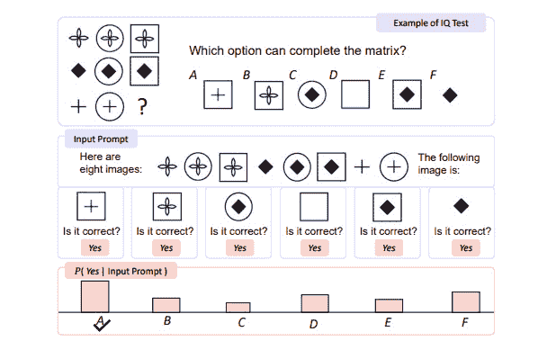
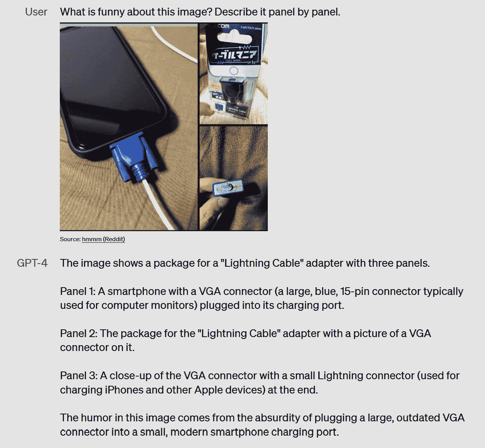
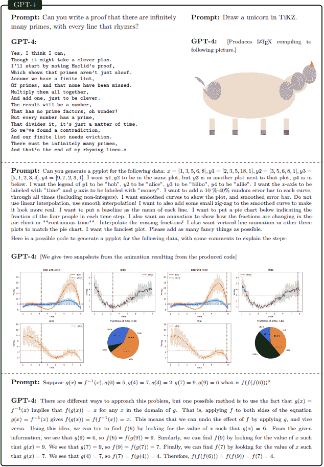
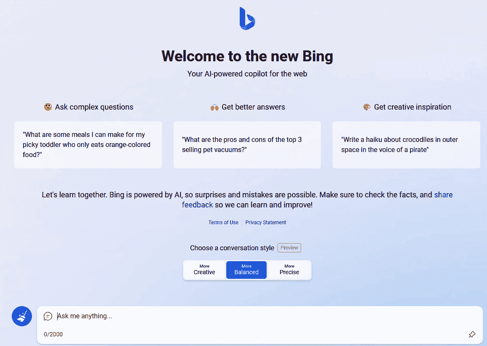
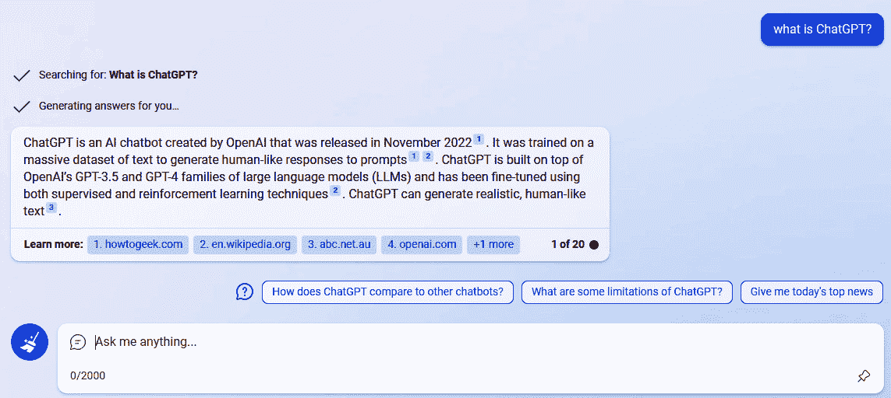
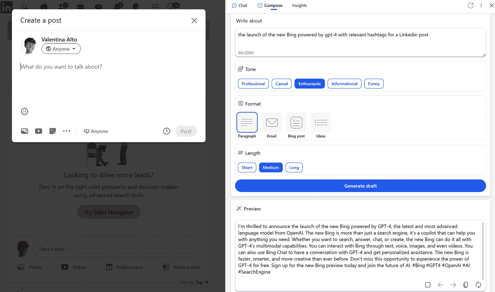
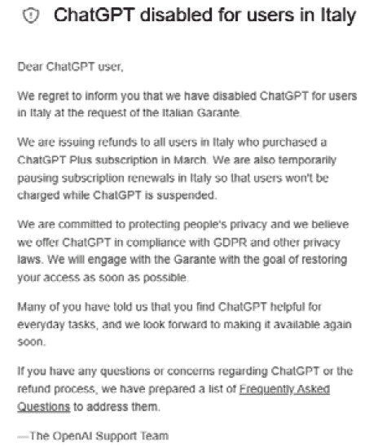

# 十一、结语和最终思考

你已经走到了这一步 - 恭喜！希望你觉得这本书有趣，并且它对你的目标有所帮助。

在撰写本书时，发生了许多变化和新发展，这些变化绝对值得一提。事实上，我们确实看到了生成 AI 模型复杂性和准确性不断增加的*摩尔定律*发展。

因此，在这最后一章中，我们将简要回顾我们在整本书中学到的内容，同时揭示最近的发展和未来可以期待的内容。

更具体地说，我们将涵盖以下主题：

+   我们迄今为止学到的概述

+   LLMs 如何进入行业

+   生成 AI 领域的最新发展和关注点

+   未来可以期待什么

在本章结束时，您将对生成 AI 领域的最新发展有一个更广泛的了解，了解它如何影响行业，以及在新发展和社会关注方面可以期待什么。

# 迄今为止我们学到的内容回顾

我们从介绍生成 AI 概念及其各种应用开始了这本书。我们看到生成 AI 不仅涉及文本，还涉及图像、视频和音乐。

然后，在*第二章*中，我们转而看了一下将生成 AI 带入最大流行的公司：OpenAI。成立于 2015 年，OpenAI 主要专注于一种特定类型的生成模型，**生成预训练Transformers**（**GPT**）。然后，在 2022 年 11 月，OpenAI 发布了 ChatGPT，这是一个由 GPT 模型驱动的免费网络应用程序，用于对话助手。它获得了巨大的流行，仅在五天内就达到了 100 万用户！

ChatGPT 已经改变了游戏规则。它对日常生产力以及各个行业领域的影响是巨大的。在深入讨论 ChatGPT 如何影响这些领域之前，在*第三章*中，我们学习了如何设置并开始使用 ChatGPT 账户。我们还在*第四章*中看到了如何正确设计使用生成模型（如 ChatGPT）时最重要的元素：提示。提示是用户的输入，不过是自然语言中的指令。设计提示是从您的生成模型中获得最大价值的关键步骤，以至于**提示工程**已经成为一个新的研究领域。

一旦我们熟悉了 ChatGPT 和提示设计，我们就转向*第五章*，在那里我们终于得到了 ChatGPT 如何提升您的日常生产力并成为您的日常助手的具体示例。从生成电子邮件到提高写作技巧，我们看到了许多活动如何得益于 ChatGPT 的生成力量。

但我们并未止步于此。通过*第 6*、*第 7*和*第 8*章，我们看到了 ChatGPT 如何不仅可以提升日常生产力，还可以用于特定领域的活动 - 对于开发人员，从代码生成和优化到解释机器学习模型；对于营销人员，从新产品开发到改善**搜索引擎优化**（**SEO**）；对于研究人员，从实验设计到基于研究的演示生成。

从*第九章*开始，我们将对话转向了企业级别，讨论了 OpenAI 模型如何通过 Azure 直接可消费化，以便企业可以保持可靠性和安全性。

最后，在*第十章*中，我们看到了 Azure OpenAI 模型在企业应用案例中的具体示例。每个示例都附带了一个业务场景以及一个使用 Python 进行端到端实现的示例，使用 Streamlit 作为前端。

这段旅程旨在让您更清楚地了解当我们提到流行词汇如 ChatGPT、OpenAI 和 LLMs 时我们在谈论什么。

然而，在接下来的部分中，我们将看到近几个月来令人难以置信的快速人工智能发展，带来了全新的技术，超越了我们迄今所学到的内容。

# 这只是一个开始

在整本书中，我们看到了生成式人工智能，更具体地说是 GPT 模型，正在彻底改变公民和大型企业的工作方式。

然而，我们已经踏上了一段旅程，ChatGPT 和 GPT 模型只是通向前所未有的技术进步时代的第一步。正如我们在整本书中所看到的，这些模型已经展示了在语言理解和生成方面的卓越能力。然而，生成式人工智能的真正潜力尚未完全实现。

第一批**多模态大型语言模型**（**MLLMs**）的发布以及微软引入**Copilot**系统已经揭示了我们可能期待的一瞥。

## 多模态大型语言模型的出现

到目前为止，我们主要关注的是**大型语言模型**（**LLMs**），因为它们是 GPT-x 系列和 ChatGPT 背后的架构。这些模型是在大量文本数据（如书籍、文章和网站）上进行训练的，并使用神经网络来学习人类语言的模式和结构。

正如我们在*第二章*中所看到的，如果我们想要将更多生成式人工智能能力与 LLMs 相结合，比如图像理解和生成，我们需要额外模型的支持，比如 DALL-E。这一点在 MLLMs 的引入之前都是成立的。

MLLM 是将自然语言处理与计算机视觉相结合的人工智能系统，用于理解和生成文本和视觉内容。这些模型经过大量数据的训练，如图像和文本，并且能够对包含文本和视觉输入的查询生成类似人类的响应。

近几个月来，多模态学习模型领域取得了巨大进展，并且在接下来的章节中，我们将着重关注两个主要模型：Kosmos-1 和 GPT-4。

### Kosmos-1

在他们的论文《语言并非你所需的全部：将感知与语言模型对齐》中，微软的研究员 Shaohan Huang 等介绍了**Kosmos-1**，一种能够响应语言和视觉线索的 MLLM。这使其能够执行诸如图像字幕和视觉问题回答等任务。

虽然像 OpenAI 的 ChatGPT 这样的 LLM 已经变得很受欢迎，但它们在处理图像和音频等多模态输入方面存在困难。微软的研究论文强调了多模态感知和真实世界联系的需求，以推进人工通用智能（AGI）的发展。

Kosmos-1 能够感知各种模态，通过零迁移学习来遵循指令，并使用少量迁移学习从所提供的上下文中学习。该模型的展示显示了其在涉及视觉提示的各种情况下自动化任务的潜力。

下图提供了它的工作原理的示例:

图 11.1 – Kosmos-1 的多模态输入示例。原始图片来源于 https://arxiv.org/pdf/2302.14045.pdf

对零迁移热测足挑战示灵异于蕴含成人水平，但显示了 MLLM 通过将感知与语言模型对齐来感知抽象概念模式的潜力。

定义

Raven IQ 测试，也称为雷文进阶矩阵测试，是专门设计用于衡量一个人的抽象推理和流体智力的一种非语言标准化测试。由约翰·C·雷文于 1936 年开发，该测试由具有矩阵形式的视觉模式的多项选择题组成。参与者的任务是识别完成图案的缺失部分。

下图是 Kosmos-1 解决的 Raven IQ 测试的示例:

图 11.2 – Kosmos-1 解决的 Raven IQ 测试的示例。原始图片来源于 ttps://arxiv.org/pdf/2302.14045.pdf

目前，Kosmos-1 只能分析图像和文本。然而，在研究论文的结论中，微软的研究人员宣布了进一步发展该模型以集成语音功能的意图。

### GPT-4

2023 年 3 月 14 日，OpenAI 宣布了 GPT 系列的新版本：**GPT-4**。这款全新模型的技术描述由 OpenAI 的研究人员在论文*GPT-4 技术报告*中描述（[`arxiv.org/pdf/2303.08774.pdf`](https://arxiv.org/pdf/2303.08774.pdf)）。

根据这篇论文，很明显 GPT-4 展示了比以前的 AI 模型更高水平的智能。GPT-4 在包括数学、编码、视觉、医学、法律和心理学在内的广泛任务中展示出接近人类的表现，而无需特殊提示。

更具体地说，GPT-4 在四个主要领域表现优于其先前版本（GPT 3.5）：

+   **多模态性**：GPT-4 是 MLLM 的一个很好的例子，因为它能够理解和生成自然语言以及图像：

图 11.3 – GPT-4 理解和解释图像的示例

通过 GPT-4，我们基本上能够处理和理解一个由文本和图像组成的整个文档。

+   **准确性**：GPT-4 已被证明比 GPT-3.5 更可靠、更有创造力和更具接受性，尤其在复杂任务中。为了理解这种差异，对这两个模型进行了几次测试，最初设计用于人类的考试，GPT-4（无论是否具有视觉能力）始终优于 GPT-3.5。

在计算机视觉领域也进行了测试。在这种情况下，OpenAI 评估了 GPT-4 在为计算机视觉模型设计的传统基准上的表现，同样，在这种情况下，GPT-4 明显优于大多数**最新技术**（**SOTA**）模型。

+   **一致性**：正如我们在*第五章*中看到的，OpenAI 发布了一个 AI 一致性（[`openai.com/alignment/`](https://openai.com/alignment/)）宣言，其研究旨在使 AGI 与人类价值观一致，并遵循人类意图。

为提高 GPT-4 的安全性和与用户意图的一致性，已经付出了大量努力。因此，与其前身相比，GPT-4 的安全性大大提高，生成违禁内容请求的可能性减少了 82%（[`openai.com/product/gpt-4`](https://openai.com/product/gpt-4)）。这一改进的原因在于 OpenAI 的 GPT-4 融入了新的研究进展，增加了额外的安全层。受人类输入启发，这一安全功能直接集成到 GPT-4 模型中，使其更擅长处理潜在有害输入。因此，模型生成不安全响应的可能性大大降低。

此外，OpenAI 的内部评估表明，与上一版本相比，GPT-4 生成准确和基于事实的回复的可能性要高出 40%。这些增强显示了在完善 AI 语言模型方面正在取得的持续进展，确保其对用户的安全性和可靠性。

+   **整体可用性**：最后但同样重要的是，GPT-4 解决了其前身的主要限制之一。到了 GPT-3.5，我们需要考虑的最大标记数为 4,096。 使用 GPT-4，标记数的最大值大大增加到了约 32,000，这使得它更适用于复杂和较长的任务，特别是涉及逐步推理的任务。

从 Microsoft Research 的 Sébastien Bubeck 等人的论文《人工通用智能之火花：GPT-4 的早期实验》([`arxiv.org/pdf/2303.12712.pdf`](https://arxiv.org/pdf/2303.12712.pdf)) 中，可以窥见这种全新模型的能力。

在下图中，展示了这些实验的一些示例：

图 11.4 – 多模态 GPT-4 的早期实验

前面的图只是展示了 GPT-4 的全部能力的一些示例，但这些示例本身已经非常令人印象深刻。再次强调的是，使用大型语言模型，我们正在进入生成式 AI 的新阶段，其中一个基础模型将能够完全处理和理解整个文档，然后根据其生成新的材料。

注

2023 年 3 月 21 日，Microsoft 宣布 GPT-4 已经在 Azure OpenAI 服务中可用 ([`azure.microsoft.com/en-us/blog/introducing-gpt4-in-azure-openai-service/`](https://azure.microsoft.com/en-us/blog/introducing-gpt4-in-azure-openai-service/))。这意味着这个强大的模型已经可以用于企业级项目，或者在 Azure OpenAI Playground 中进行直接测试。

GPT-4 是一个非常强大的模型，已经成为许多融合 AI 的应用程序的引擎。其中之一就是名为 ChatGPT Plus 的全新版 ChatGPT。但还有另一个应用程序，我认为更加有趣，因为它正在彻底改变搜索引擎工具的使用方式：Microsoft Bing。我们将在下一节深入探讨这一点。

## Microsoft Bing 和 Copilot 系统

最近几年，微软已经成为 AI 领域的领军者，大量投资于研究和开发，推动创新并开辟新的可能性。作为推动 AI 技术前进的一部分，微软已经与 OpenAI 达成战略合作伙伴关系，正如我们在*第九章*中所看到的。

微软与 OpenAI 之间的合作旨在加速 AI 领域的进展，结合各自在云计算、软件和尖端 AI 模型方面的专业知识。他们共同致力于创建不仅具有卓越能力，而且遵守透明、公平和道德责任原则的 AI 系统。

自 2023 年 1 月宣布 Azure OpenAI 服务的普遍可用性以来，微软已在生成式 AI 领域发布了一系列新发展，利用 LLM 的力量，包括 GPT-4。

在接下来的章节中，我们将重点关注两个最有前景的发展：新版必应和副驾驶系统。

### 新版必应

微软必应是微软拥有和运营的网络搜索引擎。该服务起源于微软先前的搜索引擎：MSN 搜索、Windows Live 搜索，以及后来的 Live 搜索。

2023 年 2 月，微软宣布（[`blogs.microsoft.com/blog/2023/02/07/reinventing-search-with-a-new-ai-powered-microsoft-bing-and-edge-your-copilot-for-the-web/`](https://blogs.microsoft.com/blog/2023/02/07/reinventing-search-with-a-new-ai-powered-microsoft-bing-and-edge-your-copilot-for-the-web/)）由 GPT 模型驱动的新版必应。此外，随着 2023 年 3 月 14 日 GPT-4 的推出，微软确认（[`blogs.bing.com/search/march_2023/Confirmed-the-new-Bing-runs-on-OpenAI%E2%80%99s-GPT-4`](https://blogs.bing.com/search/march_2023/Confirmed-the-new-Bing-runs-on-OpenAI%E2%80%99s-GPT-4)）新版必应实际上是运行在 OpenAI 的 GPT-4 上。

图 11.5 – 新版必应

在新版本中，必应已经成为一种类似 ChatGPT 的版本，能够浏览网络（因此绕过了 ChatGPT 在 2021 年的知识限制问题），并且还能提供超出预期响应的参考资料。请参考以下截图：

图 11.6 – 新版必应提供带有参考资料的答案

新版必应还可以像 ChatGPT 一样协助生成内容。例如，我可以在撰写 LinkedIn 帖子时向必应寻求支持：

图 11.7 – 必应作为 LinkedIn 帖子助手的示例

有了这个最新功能，新版必应可以被视为网络的副驾驶，加快研究以及检索或生成材料的速度。

在基础模型和 LLM 的新景观中，副驾驶的概念至关重要，因为这是这些新 AI 系统进入组织的最有可能方式。

定义

正如其名称所示，副驾驶作为用户的专家助手，旨在支持用户解决复杂任务。副驾驶具有用户友好的自然语言界面，并由基础模型驱动。此外，它们的作用范围由用户定义。例如，应用程序 A 中的副驾驶将仅使用应用程序 A 的数据进行工作。

在下一节中，我们将看到微软如何将这一概念扩展到其整套应用程序中。

### Microsoft 365 副驾驶

2023 年 3 月，由微软引入（[`blogs.microsoft.com/blog/2023/03/16/introducing-microsoft-365-copilot-your-copilot-for-work/`](https://blogs.microsoft.com/blog/2023/03/16/introducing-microsoft-365-copilot-your-copilot-for-work/)），副驾驶系统是一个基于以下三种技术构建的复杂处理和编排引擎：

+   微软 365 应用程序，如 Excel、Word 和 PowerPoint

+   微软图表，一个提供对 Microsoft 365 服务中各种数据和智能的访问的平台

+   LLMs，如 GPT-4

基于副驾驶系统，Microsoft 365 Copilot 是一个革命性的 AI 助手，旨在增强工作场所的生产力和释放创造力。通过利用 LLMs 并与 Microsoft 365 应用程序和数据集成，Copilot 将自然语言转化为完成任务和与工作连接的强大工具。

Microsoft 365 副驾驶无缝集成到 Word、Excel、PowerPoint、Outlook 和 Teams 等流行应用程序中。通过自然语言提示，副驾驶可以执行生成基于会议、电子邮件和聊天的状态更新等任务。用户始终对其核心活动保持控制，从而增加了在各种 Microsoft 365 应用程序之间的创造力、分析、表达和协作。

在本节中，我们看到在过去的几个月里，OpenAI 模型和 LLM 领域中的其他 AI 模型已有进一步的发展。我们还看到微软等公司正在引入一种新的将这些 LLMs 集成到应用程序中的方式，即全新概念的 Copilot。

在下一节中，我们将深入探讨其他公司如何在其流程和数字化转型规划中拥抱 OpenAI 的模型，涵盖不同的用例和方法。

# 生成技术对行业的影响 - 一种颠覆性的力量

随着 ChatGPT 和生成模型的持续发展，它们的能力无疑以前难以想象的方式改变着行业。一方面，这些技术的整合有潜力显著提高生产力和推动经济增长。通过自动化耗时任务，生成式 AI 可以让人类工作者将精力集中在更有创造力、战略性和增值的活动上。此外，AI 驱动的工具可以增强人类能力，使专业人士能够做出更明智的决策和生成新颖的想法。

已经有一些企业在其核心业务中嵌入了生成式人工智能的例子：

+   **摩根士丹利**，一家领先的财富管理公司，一直致力于利用 OpenAI 的 GPT-4 技术改善对其广泛内容库的访问（[`openai.com/customer-stories/morgan-stanley`](https://openai.com/customer-stories/morgan-stanley)）。该公司一直在探索 GPT 的嵌入和检索能力，以创建一个内部聊天机器人，可以高效地搜索其庞大的财富管理资源。这一举措由分析、数据和创新负责人 Jeff McMillan 领导，旨在使公司的集体知识易于访问和可操作。

+   **多邻国**，一款以游戏风格为特色、拥有超过 5000 万用户的语言学习应用一直依靠人工智能作为其战略的一部分。人工智能参与的功能之一是**解释我的答案**。此功能允许用户深入了解多邻国响应背后的明确语法规则（例如，如果用户的答案是错误的，用户可以打开聊天窗口，并要求对为什么错误进行解释）。到目前为止，多邻国一直试图使用预先编写的语法提示和搭载了 GPT-3 的人工智能来实现此功能。然而，直到 GPT-4 的出现，响应的准确性和学习者的参与度才得以提高，原因在于其对不同习语的语法规则的高级理解能力。

+   **Stripe**，一家金融科技支付服务提供商，做了一些非常有远见的事情。在 2023 年初，它要求 100 名员工停止日常工作，并开始设想 LLMs 如何丰富和增强支付服务的功能。他们不仅发现了许多潜在的应用（输出是 50 个应用程序的列表！），而且开始原型设计了 15 个具体的用例。其中，特别感兴趣的是使用 GPT-4 进行欺诈检测。Stripe 的 Discord 社区受到恶意行为者的渗透。GPT-4 通过分析 Stripe 的 Discord 社区中的帖子语法和检测协调的恶意活动，帮助识别潜在的欺诈者，确保平台安全。

另一方面，ChatGPT 和生成式人工智能模型的快速采用引发了对工作岗位取代、数据隐私和技术潜在滥用的担忧。随着自动化改变劳动力市场，各行各业必须应对员工转岗的挑战，确保员工具备在日益由人工智能驱动的世界中取得成功所需的技能。

生成式人工智能对产业的颠覆性影响是不可否认的，既提供机遇，又带来挑战。通过促进人类与人工智能的合作，推动道德的开发和部署，并优先考虑终身学习和再技能培训，我们可以塑造一个未来，在这个未来中，生成式人工智能成为跨行业积极变革的强大催化剂。

目前，我们主要关注 Generative AI 可以实现的内容。在接下来的几节中，我们将揭示这种新颖颠覆性技术的伦理影响所引起的担忧。

# 揭示对 Generative AI 的担忧

正如本对年轻的彼得·帕克说的：“拥有伟大的力量就意味着拥有伟大的责任。”

当我们接近探索 ChatGPT 和 GPT 模型世界的启示之旅的尽头时，必须解决有关这些 AI 技术出现的担忧。虽然 Generative AI 的进步具有突破性，但它们也引发了关于隐私、安全、伦理影响和潜在滥用的重要问题。

实际上，最近几个月已经有许多公司、机构以及个体发表了有关这些问题的公告和声明，包括担忧、停止进一步发展的呼吁以及适当的监管。

在下一节中，我想分享一些最新的新闻和发展，并希望它也能激发对不久的未来可能出现的情况的思考和猜测。

## 埃隆·马斯克呼吁停止发展。

最近，埃隆·马斯克和其他 1000 多名技术专业人士签署的一封公开信呼吁暂停开发比 GPT-4 更复杂的 AI 系统。签署者包括史蒂夫·沃兹尼亚克、伊玛德·莫斯塔克和尤瓦尔·诺亚·哈拉瑞，他们对这些 AI 系统对社会和人类构成的重大风险表示担忧。

该公开信要求领先的 AI 实验室暂停这些先进系统的培训过程至少六个月，确保这一暂停是公开和可验证的。信中强调了与 AI 驱动的宣传、工作自动化和对我们文明失去控制的潜在担忧。

这一呼吁出现在 OpenAI 推出 GPT-4 的浪潮之后，这是一个增强语言模型，为 ChatGPT 的高级版本提供支持。据 OpenAI 称，GPT-4 在处理复杂任务和生成更精细结果方面比以前的版本更有能力，而且缺陷更少。

诸如 GPT-4 之类的 AI 系统利用大量数据来回应查询并执行任务。ChatGPT 于 11 月首次亮相，具有类似人类的能力，可以撰写电子邮件、安排旅行计划、编写代码，并在各种考试中表现出色，例如司法考试。

OpenAI 尚未对该公开信发表评论，但该组织已经承认确保比人类更聪明的 AI 技术为人类利益服务的重要性。OpenAI 建议，未来的系统可能需要在训练之前接受独立评估，并且应该努力规范用于模型开发的计算资源的扩大。

包括谷歌、微软、Adobe、Snapchat、DuckDuckGo 和 Grammarly 在内的几家公司推出了利用生成式人工智能功能的服务。OpenAI 的研究指出了这些能力所涉及的风险，比如引用不可信的来源或赋予恶意行为者欺骗或利用他人的可能性。

人工智能专家对行业的发展轨迹和可能缺乏必要预防措施和对后果的理解越来越担忧。该信件强调，先进的人工智能可能对地球上的生活产生重大影响，并需要仔细的规划和管理。它指出，目前这样的规划还不足，因为人工智能实验室继续创建和部署越来越强大、难以理解、预测或控制的人工智能系统。

如果这封公开信没有约束力，另一个例子是意大利“隐私保护监督者”所宣布的，我们将在下一节重点讨论。

## ChatGPT 在意大利被意大利“隐私保护监督者”禁止使用

由于隐私问题，意大利成为第一个禁止 ChatGPT 的西方国家。

意大利数据保护机构**隐私保护监督者**宣布将立即对 OpenAI 实施禁令并展开调查：

图 11.10 - 访问 ChatGPT 时 OpenAI 在意大利的消息

意大利监管机构不仅将阻止 ChatGPT，还将调查其是否符合**通用数据保护条例**（**GDPR**），该条例规定了个人数据的使用、处理和存储。

在涉及用户对话和付款信息的数据泄露后，该机构于 2023 年 3 月 20 日表示，没有法律依据用于训练平台基础算法的*大规模收集和存储个人数据*。

监管机构还表达了对无法验证用户年龄的担忧，可能会使未成年人暴露于不当回应之中。

意大利数据保护机构给予 OpenAI 20 天时间解决其担忧，否则将面临 2000 万欧元（2170 万美元）或其年收入的 4%的罚款。

OpenAI 根据意大利数据保护监管机构 Garante 的要求，于 2023 年 4 月 1 日为意大利用户停用了 ChatGPT，并表示致力于隐私保护和 GDPR 合规。

公司表示期待与 Garante 密切合作，并希望尽快在意大利重新提供 ChatGPT。

前面提到的担忧和干预只是一个更广泛话题的冰山一角，即负责任人工智能的概念，这将是下一节的主题。

# 生成式人工智能的伦理影响以及我们为什么需要负责任的人工智能

前一节强调了随着生成式人工智能技术的广泛知识和应用，一个普遍的担忧正在上升。

人工智能技术的快速发展带来了大量必须仔细解决以确保其负责任和公平部署的伦理考虑和挑战。以下是其中一些：

+   **数据隐私和安全**：由于人工智能系统在学习和决策过程中严重依赖数据，确保数据隐私和安全变得至关重要。在*第九章*中，我们已经看到微软如何通过 Azure OpenAI 服务解决了数据隐私问题，以确保 Azure 云所期望的**服务级别协议**（**SLAs**）和安全实践。然而，这个数据隐私话题也涉及到首次用于训练模型的数据：即使 ChatGPT 用于生成响应的知识库是公开的，那么涉及用户信息用于生成响应的同意阈值在哪里呢？

+   **偏见和公平**：人工智能模型通常从历史数据中学习，这可能无意中引入偏见。解决人工智能系统中的偏见和公平涉及以下方面：

    +   **多样化数据集**：确保训练数据多样化且代表各种人口统计信息可以帮助减少人工智能模型中的偏见。

    +   **算法公平性**：开发优先考虑公平性且不歧视特定人口群体的算法是至关重要的。

    +   **监控和审计**：定期监控和审计人工智能系统可以帮助识别和纠正偏见，确保结果是公平的。

+   **透明度和问责制**：随着人工智能系统变得更加复杂，理解它们的决策过程可能具有挑战性。这涉及以下两个重要方面：

    +   **可解释的人工智能**：开发能够清晰解释其决策的人工智能模型可以帮助用户理解和信任系统。

    +   **责任和责任**：建立清晰的责任和责任界限对于让开发人员、组织和用户对人工智能决策的后果负责是至关重要的。

+   **工作的未来**：人工智能驱动的自动化有可能在某些领域取代工作，引发对工作未来的担忧。在本书中，我们已经看到 ChatGPT 和 OpenAI 模型如何能够提高个人和企业的生产力。然而，也有可能一些重复性任务将被人工智能彻底取代，这将影响一些工人。这是变革和发展过程的一部分，更好地接受变化而不是与之抗争。

在这个方向上的一些行动可能是再培训和提升技能计划 - 政府、组织和教育机构应该投资于再培训和提升技能计划，帮助工人适应不断变化的就业市场，并获得新兴角色所需的新技能。

最重要的是，应鼓励人工智能与人类的合作。开发能够补充和增强人类能力的人工智能系统可以帮助创造新的工作机会，并促进合作工作环境。

通过解决这些伦理考虑和挑战，我们可以朝着正确的方向努力，确保 AI 技术的负责开发和部署，促进更美好和更公平的未来。

现在，下一个合乎逻辑的问题可能是：鉴于近几个月 AI 技术的巨大加速，我们应该期待什么？

# 近期的期望

近几个月 AI 研究和发展的加速令人难以置信。从 2022 年 11 月到写作时（2023 年 4 月），我们已经看到发生了以下事情：

+   ChatGPT 的发布（2022 年 11 月）

+   Azure OpenAI 的普遍可获得性（2023 年 1 月）

+   ChatGPT 背后的模型 API 的普遍可获得性，GPT-3.5-turbo（2023 年 2 月）

+   MLLMs（如 Kosmos-1 和 GPT-4）的普遍可获得性（2023 年 3 月）

+   微软宣布 Copilot 系统（2023 年 3 月）

这种不可思议的加速速度使得很难预测接下来会发生什么。正如我们所见，这种速度也引起了机构、公司和公众人物的关注，因为这些新技术缺乏监管。与此同时，公司和机构将不可避免地需要适应这个新的地理环境，以和竞争对手保持同步。

如果我们考虑近期的未来，我们在谈论*明天*。我们已经看到一些 IT 公司，比如微软，已经将 GPT 模型整合到他们的应用程序中作为副驾驶系统，而其他公司，如 WolframAlpha、Expedia 和 Instacart，已经设计了直接集成到 ChatGPT 的插件。

OpenAI 模型融入应用的趋势显而易见，这也体现在已开发的各种框架上，这些框架的目的是促进 LLMs 和应用之间的集成，以及管理提示、对话、记忆、记号化和其他通常所需的步骤。这些框架的一些示例是 LangChain、Pinecone 和 Semantic Kernel。

我们在*第二章*中提到，OpenAI 的使命是构建广泛有益的 AGI，这种类型的人工智能“通用”，意味着它有能力学习和执行各种任务，而无需进行特定任务的编程。

换句话说，OpenAI 正在设想一种能够做任何人类可以做的人工智能机器。

如果我们一年前就考虑这个问题，那么这看起来就像是未来主义。在当前飞快的发展速度下，我们会在不久的将来获得 AGI 机器，这真的难以置信吗？

# 摘要

诸如 OpenAI、ChatGPT 和生成式 AI 模型等人工智能技术的快速发展正在引领创新和转型的新时代。具有巨大潜力改革产业并重塑日常生活，这些进步正在重新定义人机互动的规则。

当我们站在这个由人工智能驱动的未来的边缘时，我们有责任确保这些技术被负责任和道德地使用。通过拥抱机遇并解决挑战，我们可以促进一个 AI 赋能人类、提升我们潜力至新高度的世界。

GPT 始于两年前 - 如果我们考虑最近几个月人工智能发展的速度，这已经是一个时代 - 然而，它反映了人工智能对我们生活的不可避免影响以及适应这个新现实所面临的挑战。

