# 1

# 赋予计算机从数据中学习的能力

在我看来，**机器学习**，即利用算法理解数据的应用与科学，是所有计算机科学领域中最激动人心的领域！我们生活在一个数据丰富的时代；利用来自机器学习领域的自学习算法，我们可以将这些数据转化为知识。多亏了近年来开发的许多强大开源库，现在可能是进入机器学习领域并学习如何利用强大算法来识别数据模式并对未来事件进行预测的最佳时机。

在本章中，您将了解主要概念和不同类型的机器学习。与相关术语的基本介绍一起，我们将为成功利用机器学习技术解决实际问题奠定基础。

在本章中，我们将涵盖以下主题：

+   机器学习的一般概念

+   三种学习类型和基本术语

+   成功设计机器学习系统的构建模块

+   安装和设置 Python 进行数据分析和机器学习

# 构建智能机器以将数据转化为知识

在现代技术时代，我们拥有大量结构化和非结构化数据资源。在 20 世纪下半叶，**人工智能**（**AI**）的一个子领域——机器学习，作为自学习算法的一部分，通过从数据中获取知识来进行预测逐渐发展起来。

与要求人类手动推导规则并从分析大量数据中构建模型相比，机器学习提供了更高效的选择，即从数据中提取知识以逐步改进预测模型的性能并做出数据驱动的决策。

机器学习不仅在计算机科学研究中变得日益重要，而且在我们的日常生活中也扮演着越来越重要的角色。由于机器学习，我们享受到强大的电子邮件垃圾邮件过滤器，便捷的文本和语音识别软件，可靠的网络搜索引擎，推荐有趣电影观看，移动支票存款，估计送餐时间等服务。希望不久的将来，我们还将增加安全高效的自动驾驶汽车到这一列表中。在医疗应用方面也取得了显著进展；例如，研究人员证明深度学习模型可以以接近人类的准确度检测皮肤癌（[`www.nature.com/articles/nature21056`](https://www.nature.com/articles/nature21056)）。最近，DeepMind 的研究人员使用深度学习预测了三维蛋白质结构，表现出色地超过了基于物理的方法（[`deepmind.com/blog/article/alphafold-a-solution-to-a-50-year-old-grand-challenge-in-biology`](https://deepmind.com/blog/article/alphafold-a-solution-to-a-50-year-old-grand-challenge-in-biology)）。准确的三维蛋白质结构预测在生物和制药研究中发挥着重要作用，最近在医疗保健领域中也有许多其他重要的机器学习应用。例如，研究人员设计了系统，可以预测 COVID-19 患者未来四天的氧需求，以帮助医院分配资源给需要的人群（[`ai.facebook.com/blog/new-ai-research-to-help-predict-covid-19-resource-needs-from-a-series-of-x-rays/`](https://ai.facebook.com/blog/new-ai-research-to-help-predict-covid-19-resource-needs-from-a-series-of-x-rays/)）。当今社会的另一个重要话题是气候变化，这是我们面临的最大和最关键的挑战之一。目前，许多工作致力于开发智能系统来应对气候变化（[`www.forbes.com/sites/robtoews/2021/06/20/these-are-the-startups-applying-ai-to-tackle-climate-change`](https://www.forbes.com/sites/robtoews/2021/06/20/these-are-the-startups-applying-ai-to-tackle-climate-change)）。解决气候变化的众多方法之一是精准农业的新兴领域。在这里，研究人员旨在设计基于计算机视觉的机器学习系统，优化资源配置，以最小化化肥的使用和浪费。

# 机器学习的三种不同类型

在本节中，我们将详细介绍三种机器学习类型：**监督学习**，**无监督学习**和**强化学习**。我们将了解这三种不同学习类型之间的基本差异，并使用概念示例来理解它们可以应用于的实际问题领域：

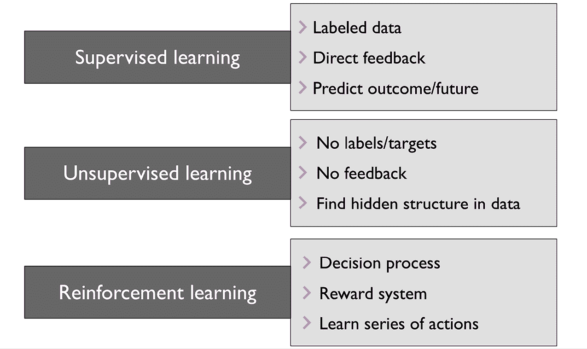

图 1.1: 三种不同类型的机器学习

## 使用监督学习对未来进行预测

监督学习的主要目标是从带标签的训练数据中学习模型，使我们能够对未见过或将来的数据进行预测。在这里，“监督”一词指的是一组训练示例（数据输入），其中已知所需的输出信号（标签）。监督学习就是对数据输入和标签之间关系建模的过程。因此，我们也可以将监督学习看作是“标签学习”。

*图 1.2* 概述了典型的监督学习工作流程，其中标记的训练数据传递给机器学习算法，以拟合一个可以对新的未标记数据输入进行预测的预测模型：

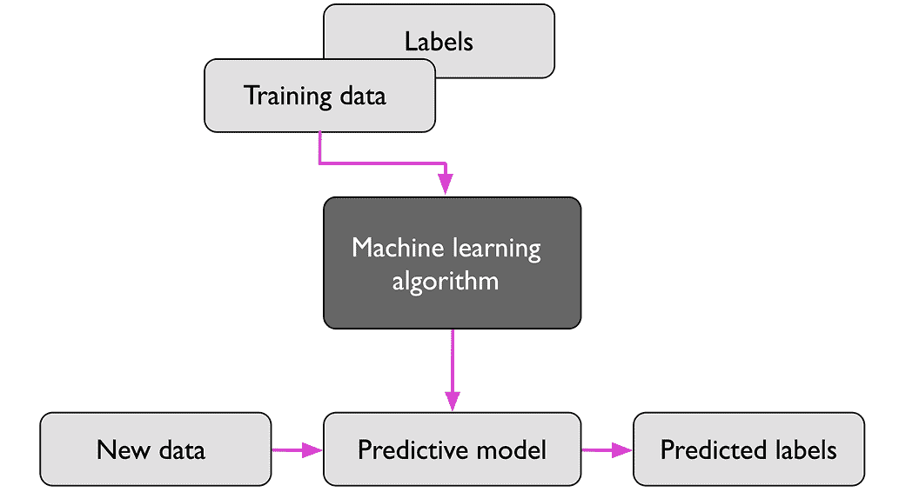

图 1.2: 监督学习过程

考虑电子邮件垃圾邮件过滤的例子，我们可以使用监督机器学习算法在一组带标记的电子邮件上进行模型训练，这些电子邮件已正确标记为垃圾邮件或非垃圾邮件，以预测新电子邮件是否属于这两个类别之一。像前面的电子邮件垃圾邮件过滤例子中这样的监督学习任务，也被称为**分类任务**。监督学习的另一个子类是**回归**，在回归中，输出信号是连续值。

### 预测类标签的分类

分类是监督学习的一个子类，其目标是根据过去的观察预测新实例或数据点的分类类标签。这些类标签是离散的、无序的值，可以理解为数据点的组成员资格。先前提到的电子邮件垃圾检测示例代表了二元分类任务的典型例子，其中机器学习算法学习一组规则来区分两个可能的类别：垃圾邮件和非垃圾邮件。

*图 1.3* 说明了一个二元分类任务的概念，给出了 30 个训练示例；其中 15 个训练示例标记为 A 类，15 个标记为 B 类。在这种情况下，我们的数据集是二维的，这意味着每个示例都与两个值相关联：*x*[1] 和 *x*[2]。现在，我们可以使用监督机器学习算法学习一个规则——以虚线表示的决策边界，它可以分开这两个类，并根据其 *x*[1] 和 *x*[2] 值将新数据分类到这两个类别中：

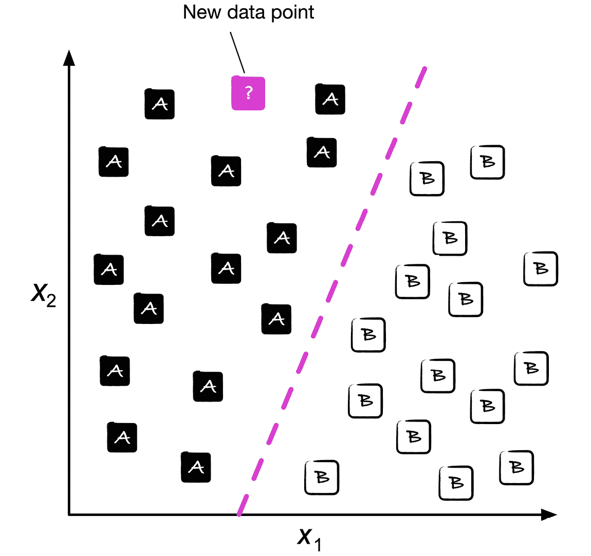

图 1.3: 分类新数据点

然而，类标签集合不必具有二进制性质。监督学习算法学习的预测模型可以将训练数据集中呈现的任何类标签分配给新的未标记数据点或实例。

**多类分类**任务的典型例子是手写字符识别。我们可以收集一个训练数据集，其中包含每个字母在字母表中的多个手写示例。这些字母（“A”，“B”，“C”等）代表我们想要预测的不同无序类别或类标签。现在，如果用户通过输入设备提供了一个新的手写字符，我们的预测模型将能够以一定的准确率预测字母表中的正确字母。然而，如果这些数字不是训练数据集的一部分，例如，我们的机器学习系统将无法正确识别任何数字 0 到 9 中的任何一个。

### 用于预测连续结果的回归

我们在前一节中学到，分类任务的目标是将无序标签分配给实例。监督学习的第二种类型是预测连续结果，也称为**回归分析**。在回归分析中，我们给定一些预测（解释）变量和一个连续的响应变量（结果），并试图找到这些变量之间的关系，以便预测结果。

请注意，在机器学习领域，预测变量通常被称为“特征”，响应变量通常被称为“目标变量”。我们将在本书中沿用这些约定。

例如，假设我们有兴趣预测学生的数学 SAT 成绩。（SAT 是美国常用的大学入学标准化测试。）如果学习时间与最终成绩之间存在关系，我们可以将其作为训练数据，学习一个模型，该模型使用学习时间来预测计划参加该测试的未来学生的测试成绩。

**均值回归**

“回归”一词由弗朗西斯·高尔顿在他的文章《遗传体质的中等回归》中于 1886 年创造。高尔顿描述了一个生物现象，即人群中身高的变异不会随时间增加。

他观察到父母的身高并不会传递给他们的孩子，而是他们孩子的身高会回归到人群的平均水平。

*图 1.4* 说明了线性回归的概念。给定一个特征变量 *x* 和一个目标变量 *y*，我们拟合一条直线到这些数据上，以最小化数据点与拟合线之间的距离——通常是平均平方距离。

现在，我们可以使用从这些数据中学到的截距和斜率来预测新数据的目标变量：

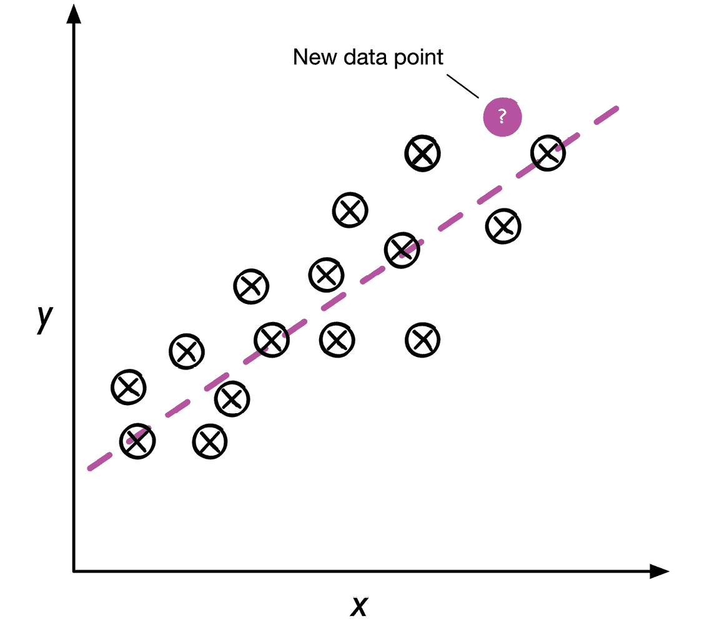

图 1.4：线性回归示例

## 使用强化学习解决交互式问题

另一种机器学习的类型是**强化学习**。在强化学习中，目标是开发一个系统（**代理**），通过与环境的互动来提高其性能。由于关于环境当前状态的信息通常还包括所谓的**奖励信号**，我们可以将强化学习看作与监督学习相关的领域。然而，在强化学习中，这种反馈不是正确的地面真实标签或值，而是一个衡量行动如何受奖励函数影响的度量。通过与环境的互动，代理可以利用强化学习来学习一系列通过探索性试错方法或审慎计划最大化此奖励的动作。

强化学习的一个流行例子是象棋程序。在这里，代理根据棋盘的状态（环境）决定一系列动作，奖励可以定义为在比赛结束时**赢**或**输**：

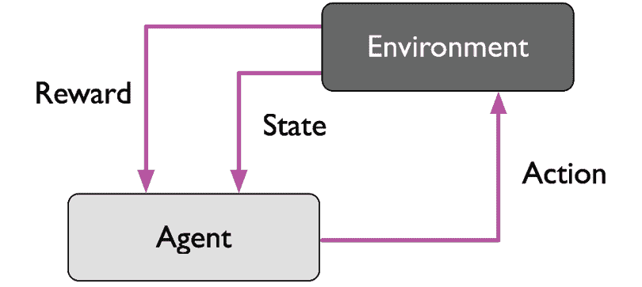

图 1.5：强化学习过程

强化学习有许多不同的子类型。然而，一个通用的方案是，在强化学习中，代理试图通过与环境的一系列互动来最大化奖励。每个状态可以与正面或负面奖励相关联，奖励可以定义为实现总体目标，例如赢得或输掉一场象棋比赛。例如，在象棋中，每一步的结果可以被看作是环境的不同状态。

进一步探讨象棋的例子，我们可以将访问棋盘上特定配置视为与更有可能导致获胜的状态相关联——例如，从棋盘上移除对手的棋子或威胁王后。然而，其他位置则与更有可能导致输掉比赛的状态相关联，例如在接下来的回合中失去对手的棋子。现在，在象棋游戏中，奖励（无论是赢得比赛的正面奖励还是输掉比赛的负面奖励）直到游戏结束后才会给出。此外，最终的奖励还取决于对手的棋局。例如，对手可能会牺牲王后，但最终赢得比赛。

总之，强化学习关注于学习选择一系列动作，以最大化总奖励，这可以通过即时采取行动后或通过*延迟*反馈来获得。

## 用无监督学习发现隐藏结构

在监督学习中，当我们训练模型时，我们事先知道正确答案（标签或目标变量），在强化学习中，我们为代理执行的特定操作定义奖励措施。然而，在无监督学习中，我们处理的是未标记数据或未知结构的数据。使用无监督学习技术，我们能够探索数据的结构，从中提取有意义的信息，而无需已知的结果变量或奖励函数的指导。

### 利用聚类找到子群体

**聚类**是一种探索性数据分析或模式发现技术，允许我们将一堆信息组织成有意义的子群体（**簇**），而不需要事先了解它们的群组成员资格。在分析过程中产生的每个簇定义了一组共享某种相似度但与其他簇中的对象更为不同的对象，这也是为什么有时将聚类称为**无监督分类**。聚类是一种从数据中提取有意义关系的重要技术。例如，它允许市场营销人员根据客户的兴趣发现客户群体，以制定不同的营销计划。

*图 1.6*说明了如何将聚类应用于将未标记数据组织成三个不同组或簇（A、B 和 C，顺序任意），基于它们特征的相似性，*x*[1]和*x*[2]：

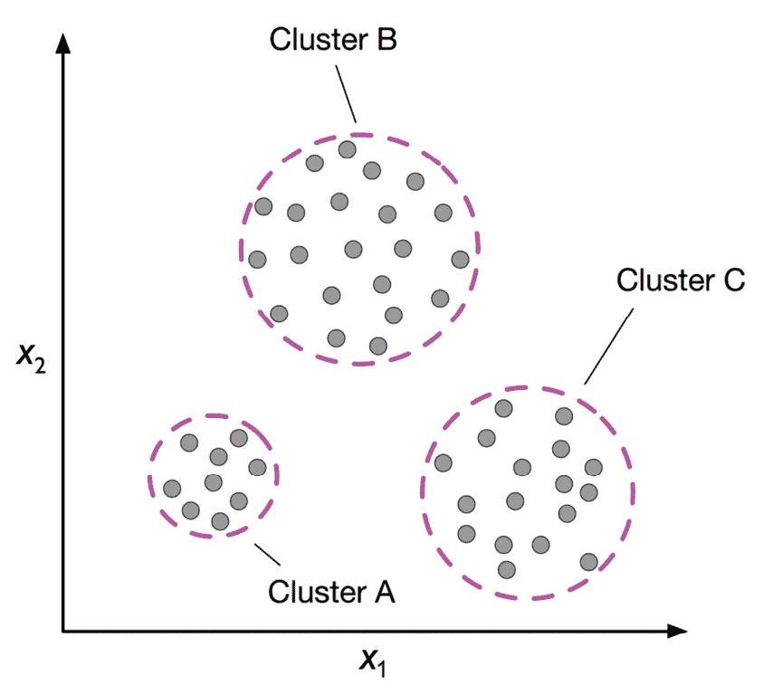

图 1.6：聚类的工作原理

### 数据压缩的降维

无监督学习的另一个子领域是**降维**。通常，我们处理的是高维数据——每个观测都伴随着大量的测量，这可能会对有限的存储空间和机器学习算法的计算性能构成挑战。无监督降维是特征预处理中常用的方法，用于从数据中去除噪声，这些噪声可能会降低某些算法的预测性能。降维将数据压缩到更小的维度子空间，同时保留大部分相关信息。

有时，降维也可以用于数据可视化；例如，可以将高维特征集投影到一维、二维或三维特征空间中，以通过 2D 或 3D 散点图或直方图进行可视化。*图 1.7*展示了一个例子，其中非线性降维被应用于将一个 3D 瑞士卷压缩到一个新的 2D 特征子空间中：

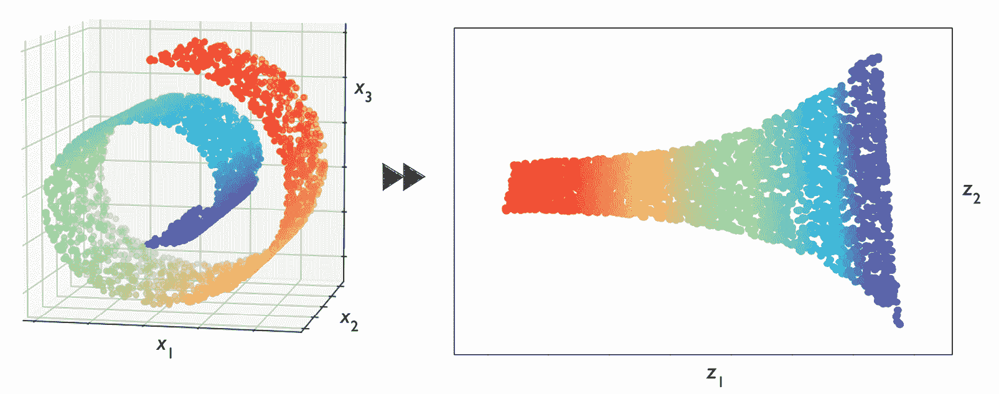

图 1.7：从三维到二维的降维示例

# 基本术语和符号介绍

现在我们已经讨论了机器学习的三大类别——监督学习、无监督学习和强化学习——让我们来看看本书中将要使用的基本术语。下面的小节涵盖了我们在谈论数据集不同方面时会使用的常见术语，以及更精确和高效地进行数学表示的符号约定。

由于机器学习是一个广泛且跨学科的领域，您很可能会很快遇到许多指代相同概念的不同术语。第二小节汇总了机器学习文献中使用的许多常用术语，这对您作为参考资料可能会很有用。

## 本书中使用的符号和约定

*图 1.8* 描述了鸢尾花数据集的摘录，这是机器学习领域中的一个经典例子（更多信息可在 [`archive.ics.uci.edu/ml/datasets/iris`](https://archive.ics.uci.edu/ml/datasets/iris) 找到）。鸢尾花数据集包含了来自三种不同物种——山鸢尾、变色鸢尾和维吉尼亚鸢尾——的 150 朵鸢尾花的测量数据。

在这里，每个花样本代表数据集中的一行，而以厘米为单位的花测量数据则以列的形式存储，我们也称之为数据集的**特征**：

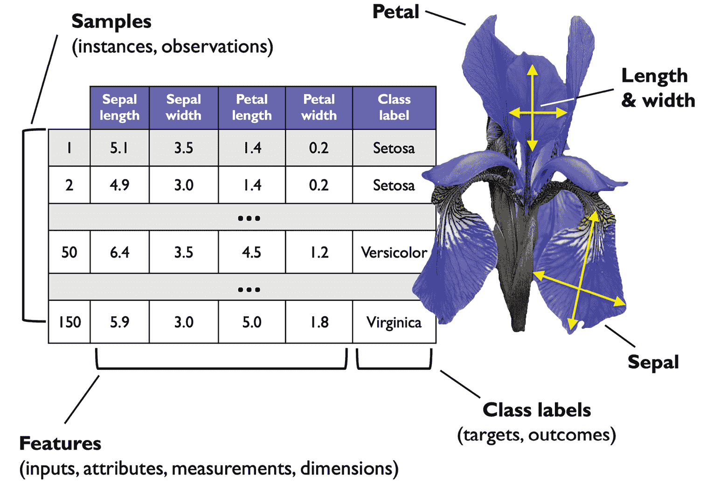

图 1.8：鸢尾花数据集

为了保持符号简单且高效，我们将使用线性代数的基础知识。在接下来的章节中，我们将使用矩阵符号来表示我们的数据。我们将遵循通常的约定，将每个样本表示为特征矩阵 **X** 中的单独行，其中每个特征存储为单独的列。

鸢尾花数据集包含 150 个样本和四个特征，可以写成一个 150×4 的矩阵，形式上表示为 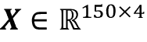：

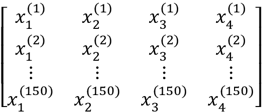

**符号约定**

在本书的大部分内容中，除非另有说明，我们将使用上标 *i* 表示第 *i* 个训练样本，使用下标 *j* 表示训练数据集的第 *j* 个维度。

我们将使用小写的粗体字母来指代向量 (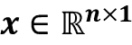)，使用大写的粗体字母来指代矩阵 (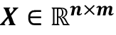)。为了指代向量或矩阵中的单个元素，我们将字母写成斜体 (*x*^(^n^) 或 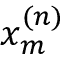)。

例如，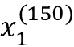 指的是鸢尾花样本 150 的第一维，即萼片长度。矩阵 **X** 中的每一行代表一个花实例，并且可以写成一个四维行向量，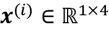：

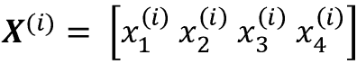

每个特征维度是一个 150 维列向量，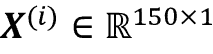。例如：

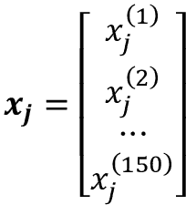

类似地，我们可以将目标变量（这里是类标签）表示为一个 150 维列向量：

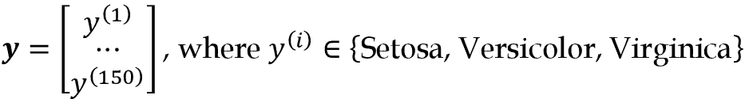

## 机器学习术语

机器学习是一个广泛的领域，也是一个非常跨学科的领域，它将许多其他研究领域的科学家聚集在一起。事实上，许多术语和概念已经被重新发现或重新定义，可能已经对您不陌生，但在不同的名称下出现。为了您的方便，在以下列表中，您可以找到一些常用术语及其同义词的选择，这在阅读本书和机器学习文献时可能会对您有所帮助：

+   **训练示例**：表中的一行，表示数据集中的一个观察值、记录、实例或样本（在大多数情况下，“样本”指的是训练示例的集合）。

+   **训练**：模型拟合，对于类似参数估计的参数模型。

+   **特征，缩写** **x**：数据表或数据（设计）矩阵中的一列。同义词为预测变量、变量、输入、属性或协变量。

+   **目标，缩写** **y**：与结果、输出、响应变量、因变量（类）标签和地面真实值同义。

+   **损失函数**：通常与*成本*函数同义使用。有时损失函数也被称为*误差*函数。在一些文献中，“损失”一词指的是单个数据点的损失，而成本是计算整个数据集上的损失（平均或总和）的度量。

# 构建机器学习系统的路线图

在前几节中，我们讨论了机器学习的基本概念和三种不同类型的学习。在本节中，我们将讨论伴随学习算法的机器学习系统的其他重要部分。

*图 1.9*展示了在预测建模中使用机器学习的典型工作流程，我们将在以下小节中讨论它：

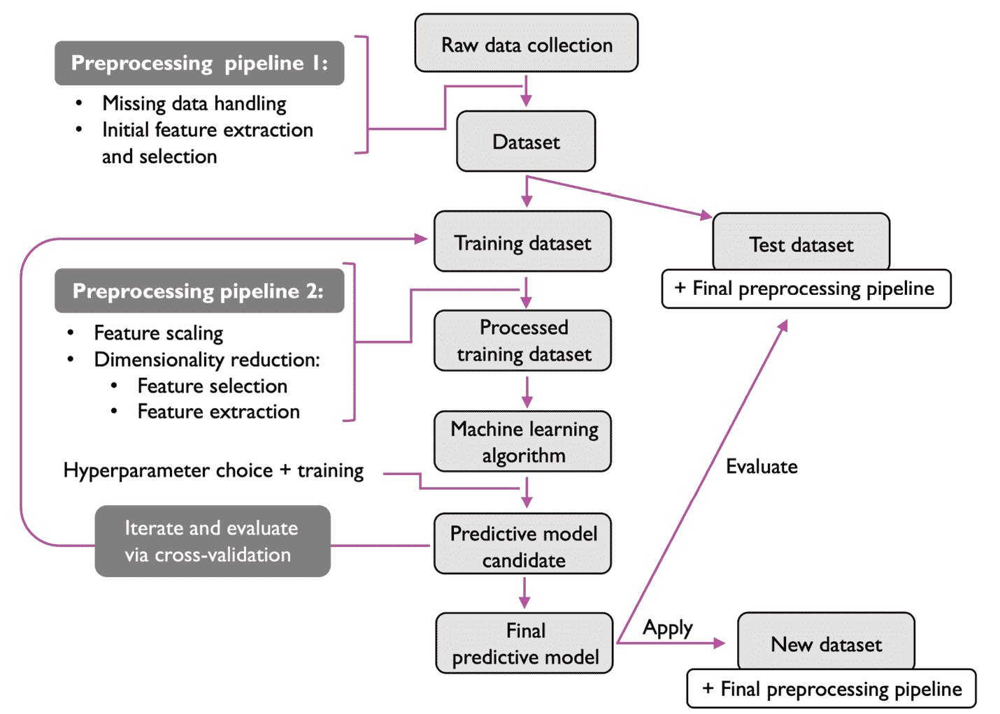

图 1.9：预测建模工作流程

## 预处理 - 将数据整理成形

让我们首先讨论构建机器学习系统的路线图。原始数据很少以学习算法优化性能所需的形式和形状出现。因此，数据预处理是任何机器学习应用中最关键的步骤之一。

如果我们以前一节中的鸢尾花数据集为例，我们可以将原始数据看作一系列花卉图像，我们希望从中提取有意义的特征。有用的特征可能围绕花卉的颜色或花卉的高度、长度和宽度。

许多机器学习算法还要求所选特征在相同的尺度上以实现最佳性能，这通常通过将特征转换为范围为[0, 1]或具有零均值和单位方差的标准正态分布来实现，我们将在后面的章节中看到。

选定的一些特征可能高度相关，因此在一定程度上是多余的。在这些情况下，降维技术对于将特征压缩到较低维子空间是有用的。减少特征空间的维度具有存储空间需求较少和学习算法运行更快的优势。在某些情况下，如果数据集包含大量无关特征（或噪声），降维还可以改善模型的预测性能；也就是说，如果数据集具有低信噪比。

为了确定我们的机器学习算法不仅在训练数据集上表现良好，而且在新数据上也能很好地泛化，我们还希望将数据集随机分成单独的训练和测试数据集。我们使用训练数据集来训练和优化我们的机器学习模型，而将测试数据集保留到最后用于评估最终模型。

## 训练和选择预测模型

正如您将在后续章节中看到的那样，已经开发了许多不同的机器学习算法来解决不同的问题任务。从大卫·沃尔珀特（David Wolpert）著名的*无免费午餐定理*中可以总结出一个重要观点，即我们不能“免费”学习（*没有先验区分的学习算法*，D.H.沃尔珀特，1996 年；*优化的无免费午餐定理*，D.H.沃尔珀特和 W.G.麦克瑞迪，1997 年）。我们可以将这个概念与流行的说法联系起来，*我想如果你唯一拥有的工具是一把锤子，那么处理一切就像处理钉子一样是诱人的*（亚伯拉罕·马斯洛，1966 年）。例如，每种分类算法都有其固有的偏见，如果我们不对任务做任何假设，没有单一的分类模型能够享有优势。因此，在实践中，比较至少几种不同的学习算法以训练和选择表现最佳的模型至关重要。但在我们能够比较不同模型之前，我们首先必须决定一个用于衡量性能的度量标准。一个常用的度量标准是分类准确度，它定义为正确分类实例的比例。

一个合理的问题是：如果我们不在模型选择中使用这个测试数据集，而是将其保留到最后模型评估时使用，那么我们如何知道哪个模型在最终测试数据集和真实世界数据上表现良好？为了解决这个问题，可以使用总称为“交叉验证”的不同技术。在交叉验证中，我们进一步将数据集分成训练和验证子集，以估计模型的泛化性能。

最后，我们也不能期望软件库提供的不同学习算法的默认参数对我们的特定问题任务是最优的。因此，在后续章节中，我们将频繁使用超参数优化技术，这些技术帮助我们调整模型的性能。

我们可以将这些超参数视为不从数据中学习的参数，而是表示模型旋钮，我们可以调整它们以提高其性能。在后续章节中，当我们看到实际示例时，这将变得更加清晰。

## 评估模型和预测未见数据实例

在我们选择了在训练数据集上拟合的模型之后，我们可以使用测试数据集来估计它在这些未见数据上的表现，以估算所谓的*泛化误差*。如果我们对其性能满意，现在可以使用这个模型来预测新的未来数据。需要注意的是，先前提到的程序的参数（如特征缩放和降维）仅从训练数据集中获取，并且稍后相同的参数将重新应用于转换测试数据集以及任何新的数据实例——否则在测试数据上测得的性能可能会过于乐观。

# 使用 Python 进行机器学习

Python 是数据科学中最流行的编程语言之一，得益于其非常活跃的开发者和开源社区，已经开发出大量有用的科学计算和机器学习库。

尽管解释性语言（如 Python）在计算密集型任务中的性能不如低级别编程语言，但已开发出诸如 NumPy 和 SciPy 等扩展库，这些库建立在底层的 Fortran 和 C 实现之上，用于在多维数组上进行快速向量化操作。

对于机器学习编程任务，我们将主要参考 scikit-learn 库，这是目前最流行和易于访问的开源机器学习库之一。在后续章节中，当我们专注于机器学习的一个子领域*深度学习*时，我们将使用 PyTorch 库的最新版本，该库通过利用图形卡高效训练所谓的*深度神经网络*模型。

## 安装 Python 和从 Python 包索引中安装包

Python 可用于三大主要操作系统——Microsoft Windows、macOS 和 Linux——安装程序和文档均可从官方 Python 网站下载：[`www.python.org`](https://www.python.org)。

本书中提供的代码示例已针对 Python 3.9 编写和测试，我们通常建议您使用最新版本的 Python 3。一些代码也可能与 Python 2.7 兼容，但由于 Python 2.7 的官方支持已于 2019 年结束，并且大多数开源库已停止支持 Python 2.7（[`python3statement.org`](https://python3statement.org)），我们强烈建议您使用 Python 3.9 或更新版本。

您可以通过执行以下命令检查您的 Python 版本

```py
python --version 
```

或

```py
python3 --version 
```

在您的终端（如果使用 Windows，则为 PowerShell）中执行。

本书中将使用的额外软件包可以通过`pip`安装程序安装，`pip`已成为 Python 标准库的一部分，自 Python 3.3 起。有关`pip`的更多信息，请访问[`docs.python.org/3/installing/index.html`](https://docs.python.org/3/installing/index.html)。

成功安装 Python 后，我们可以在终端中执行`pip`来安装额外的 Python 软件包：

```py
pip install SomePackage 
```

已安装的软件包可以通过`--upgrade`标志进行更新：

```py
pip install SomePackage --upgrade 
```

## 使用 Anaconda Python 发行版和包管理器

一个高度推荐的开源软件包管理系统，用于安装用于科学计算的 Python，是由 Continuum Analytics 提供的 conda。Conda 是免费的，并在宽松的开源许可下授权。其目标是帮助在不同操作系统上管理 Python 数据科学、数学和工程软件包的安装和版本。如果您希望使用 conda，它有不同的版本，包括 Anaconda、Miniconda 和 Miniforge：

+   Anaconda 预装了许多科学计算软件包。可以在[`docs.anaconda.com/anaconda/install/`](https://docs.anaconda.com/anaconda/install/)下载 Anaconda 安装程序，并在[`docs.anaconda.com/anaconda/user-guide/getting-started/`](https://docs.anaconda.com/anaconda/user-guide/getting-started/)找到 Anaconda 快速入门指南。

+   Miniconda 是 Anaconda 的精简替代品（[`docs.conda.io/en/latest/miniconda.html`](https://docs.conda.io/en/latest/miniconda.html)）。本质上，它与 Anaconda 类似，但没有预安装任何软件包，这是许多人（包括作者）喜欢的。

+   Miniforge 类似于 Miniconda，但由社区维护，并使用不同的软件包仓库（conda-forge），与 Miniconda 和 Anaconda 不同。我们发现 Miniforge 是 Miniconda 的一个很好的替代方案。下载和安装说明可在 GitHub 仓库中找到：[`github.com/conda-forge/miniforge`](https://github.com/conda-forge/miniforge)。

成功安装 conda（通过 Anaconda、Miniconda 或 Miniforge），我们可以使用以下命令安装新的 Python 软件包：

```py
conda install SomePackage 
```

可使用以下命令更新现有软件包：

```py
conda update SomePackage 
```

通过社区支持的 conda-forge 项目（[`conda-forge.org`](https://conda-forge.org)）可能会提供不在官方 conda 频道中的包，可以通过`--channel conda-forge`标志指定。例如：

```py
conda install SomePackage --channel conda-forge 
```

不能通过默认的 conda 频道或 conda-forge 获取的包可以通过`pip`安装，如前所述。例如：

```py
pip install SomePackage 
```

## 用于科学计算、数据科学和机器学习的包

在本书的前半部分，我们主要使用 NumPy 的多维数组来存储和操作数据。偶尔，我们将使用建立在 NumPy 之上的 pandas 库，它提供了额外的高级数据操作工具，使得处理表格数据变得更加方便。为了增强您的学习体验并可视化定量数据，Matplotlib 库是非常可定制化的，对于理解数据非常有帮助。

本书主要使用的机器学习库是 scikit-learn（*第三章*至*第十一章*）。*第十二章*，“使用 PyTorch 并行化神经网络训练”，将介绍深度学习库 PyTorch。

编写本书所用的主要 Python 包的版本号列在以下列表中。请确保您安装的包的版本号与这些版本号理想情况下相等，以确保代码示例正确运行：

+   NumPy 1.21.2

+   SciPy 1.7.0

+   Scikit-learn 1.0

+   Matplotlib 3.4.3

+   pandas 1.3.2

安装这些包后，您可以通过在 Python 中导入包并访问其`__version__`属性来再次检查安装的版本，例如：

```py
>>> import numpy
>>> numpy.__version__
'1.21.2' 
```

为了方便起见，我们在本书的免费代码存储库[`github.com/rasbt/machine-learning-book`](https://github.com/rasbt/machine-learning-book)中包含了一个名为`python-environment-check.py`的脚本，这样您可以通过执行此脚本检查您的 Python 版本和包版本。

某些章节将需要额外的包，并将提供有关安装的信息。例如，目前不需要安装 PyTorch。*第十二章*将在需要时提供提示和说明。

如果尽管您的代码与章节中的代码完全相同仍然遇到错误，请先检查底层包的版本号，然后再花时间调试或与出版商或作者联系。有时，库的新版本引入了不向后兼容的更改，这可能解释这些错误。

如果你不想改变主要的 Python 安装包版本，我们建议在安装本书中使用的包时使用虚拟环境。如果你使用 Python 而没有 conda 管理器，你可以使用`venv`库创建一个新的虚拟环境。例如，你可以通过以下两个命令创建和激活虚拟环境：

```py
python3 -m venv /Users/sebastian/Desktop/pyml-book
source /Users/sebastian/Desktop/pyml-book/bin/activate 
```

请注意，每次打开新终端或 PowerShell 时都需要激活虚拟环境。你可以在[`docs.python.org/3/library/venv.html`](https://docs.python.org/3/library/venv.html)找到更多关于`venv`的信息。

如果你正在使用带有 conda 包管理器的 Anaconda，你可以按照以下方式创建和激活虚拟环境：

```py
conda create -n pyml python=3.9
conda activate pyml 
```

# 摘要

在本章中，我们以非常高的层次探讨了机器学习，并熟悉了我们将在后续章节中更详细探讨的大局和主要概念。我们了解到监督学习由两个重要的子领域组成：分类和回归。虽然分类模型允许我们将对象分类到已知类别中，但我们可以使用回归分析来预测目标变量的连续结果。无监督学习不仅提供了发现未标记数据结构的有用技术，还可用于特征预处理步骤中的数据压缩。

我们简要地介绍了将机器学习应用于问题任务的典型路线图，这将作为我们在后续章节中进行更深入讨论和实际示例的基础。最后，我们设置了我们的 Python 环境，并安装和更新了所需的包，以准备观看机器学习的实际操作。

在本书的后续部分中，除了机器学习本身，我们还将介绍不同的技术来预处理数据集，这将帮助你充分发挥不同机器学习算法的性能。虽然我们将在整本书中广泛涵盖分类算法，但我们也将探讨回归分析和聚类的不同技术。

我们前方有一段激动人心的旅程，涵盖机器学习广阔领域中的许多强大技术。然而，我们将一步步地接近机器学习，通过本书的各章节逐渐建立我们的知识基础。在接下来的章节中，我们将通过实现最早的分类机器学习算法之一来开始这段旅程，这将为我们准备好*第三章*，*使用 scikit-learn 进行机器学习分类器的导览*，在那里我们将涵盖更高级的机器学习算法，使用 scikit-learn 开源机器学习库。

# 加入我们书籍的 Discord 空间

加入书籍的 Discord 工作空间，与作者进行每月的*问我任何*会话：

[`packt.link/MLwPyTorch`](https://packt.link/MLwPyTorch)


