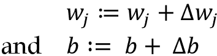
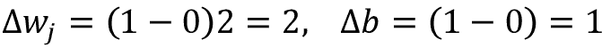
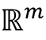
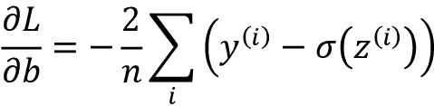
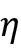

# 2

# 为分类训练简单的机器学习算法

在本章中，我们将利用两种最早被算法描述的用于分类的机器学习算法：感知器和自适应线性神经元。我们将从头开始在 Python 中逐步实现感知器，并训练它来对鸢尾花数据集中的不同花种进行分类。这将帮助我们理解分类的机器学习算法的概念以及它们如何在 Python 中高效实现。

探讨使用自适应线性神经元进行优化基础，为通过 scikit-learn 机器学习库使用更复杂分类器奠定基础，《第三章》*使用 scikit-learn 进行机器学习分类器之旅*。

本章我们将讨论以下主题：

+   建立对机器学习算法的理解

+   使用 pandas、NumPy 和 Matplotlib 读取、处理和可视化数据

+   在 Python 中为 2 类问题实现线性分类器

# 人工神经元——对机器学习早期历史的简要介绍

在我们详细讨论感知器及相关算法之前，让我们简要回顾一下机器学习的起源。为了设计一种**人工智能**（**AI**），沃伦·麦卡洛克和沃尔特·皮茨在 1943 年发表了第一个简化脑细胞的概念，即所谓的**麦卡洛克-皮茨**（**MCP**）神经元（参见《神经活动中内在思想的逻辑演算》由*W. S. 麦卡洛克*和*W. 皮茨*，*数学生物物理学公报*，5(4)：115-133，1943 年）。

生物神经元是大脑中相互连接的神经细胞，参与处理和传递化学和电信号，如*图 2.1*所示：


图 2.1：神经元处理化学和电信号

麦卡洛克和皮茨将这样的神经元描述为具有二进制输出的简单逻辑门；多个信号到达树突，然后被细胞体整合，如果累积信号超过一定阈值，则会生成一个输出信号，该信号将通过轴突传递。

仅几年后，弗兰克·罗森布拉特基于 MCP 神经元模型发布了感知器学习规则的第一个概念（参见《感知器：一个感知和识别自动机》由*F. 罗森布拉特*，*康奈尔航空实验室*，1957 年）。通过他的感知器规则，罗森布拉特提出了一种算法，可以自动学习最优权重系数，然后将其与输入特征相乘，以决定神经元是否发火（传递信号）。在监督学习和分类的背景下，这样的算法可以用于预测新数据点属于哪一类。

## 人工神经元的正式定义

更正式地说，我们可以将**人工神经元**的概念放入二分类任务（类别为 0 和 1）的背景中。我们可以定义一个决策函数，，它接受某些输入值*x*和相应的权重向量*w*的线性组合，其中*z*称为所谓的净输入*z* = *w*[1]*x*[1] + *w*[2]*x*[2] + ... + *w*[m]*x*[m]：


现在，如果特定示例**x**^(^i^)的净输入大于定义的阈值，，我们预测类别 1；否则，预测类别 0。在感知器算法中，决策函数，，是**单位阶跃函数**的一个变体：


为了简化后续的代码实现，我们可以通过几个步骤修改此设置。首先，我们将阈值，，移动到方程的左侧：


其次，我们将所谓的*偏置单元*定义为 ，并将其作为净输入的一部分：

*z* = *w*[1]*x*[1] + ... + *w*[m]*x*[m] + *b* = **w**^T**x** + *b*

第三，考虑到引入偏置单元和上述净输入*z*的重新定义，我们可以如下重新定义决策函数：


**线性代数基础：点积和矩阵转置**

在接下来的章节中，我们经常会使用线性代数的基本符号。例如，我们将使用向量点积来简写**x**和**w**中值的乘积之和，而上标*T*代表转置，这是一种将列向量转换为行向量及其相反操作。例如，假设我们有以下两个列向量：


然后，我们可以将向量**a**的转置表示为**a**^T = [*a*[1] *a*[2] *a*[3]]，并将点积表示为


此外，转置操作也可以应用于矩阵，以反映其沿对角线的镜像，例如：


请注意，转置操作严格来说只适用于矩阵；然而，在机器学习的背景下，当我们使用术语“向量”时，我们指的是*n* × 1 或 1 × *m*矩阵。

在本书中，我们只会使用线性代数中非常基础的概念；然而，如果您需要快速复习，请查看 Zico Kolter 的出色的*线性代数复习和参考*，可在[`www.cs.cmu.edu/~zkolter/course/linalg/linalg_notes.pdf`](http://www.cs.cmu.edu/~zkolter/course/linalg/linalg_notes.pdf)免费获取。

*图 2.2*说明了如何将净输入*z* = **w**^T**x** + *b*通过感知器的决策函数（左子图）压缩为二进制输出（0 或 1），以及如何使用它来区分可以通过线性决策边界分离的两个类别（右子图）：


图 2.2：阈值函数为二元分类问题生成线性决策边界

## 感知器学习规则

MCP 神经元和 Rosenblatt 的*阈值*感知器模型背后的整个理念是使用还原主义方法模拟大脑中的单个神经元的工作方式：它要么*发射*，要么不发射。因此，Rosenblatt 的经典感知器规则非常简单，感知器算法可以总结为以下步骤：

1.  将权重和偏置单元初始化为 0 或小的随机数。

1.  对于每个训练示例**x**^(^i^)，

    1.  计算输出值，

    1.  更新权重和偏置单元。

在这里，输出值是由我们之前定义的单位阶跃函数预测的类标签，而权重向量**w**中的偏置单元和每个权重*w*[j]的同时更新，可以更正式地写成：



更新值（“增量”）计算如下：


注意，与偏置单元不同，权重*w*[j]对应于数据集中的特征*x*[j]，它们参与确定上面定义的更新值。此外，是**学习率**（通常是一个介于 0.0 和 1.0 之间的常数），*y*^(^i^)是第*i*个训练示例的**真实类标签**，是**预测类标签**。重要的是要注意，偏置单元和权重向量中的所有权重是同时更新的，这意味着在更新之前我们不重新计算预测标签，直到通过相应的更新值和更新偏置单元和所有权重。具体来说，对于二维数据集，我们可以将更新写成：


在我们在 Python 中实现感知器规则之前，让我们通过一个简单的思想实验来说明这个学习规则有多简单。在感知器正确预测类标签的两种情况下，由于更新值为 0，偏置单元和权重保持不变：

(1) 

(2) 

然而，在预测错误的情况下，权重被推向正类或负类的方向：

(3) 

(4) 

为了更好地理解特征值作为乘法因子，，让我们通过另一个简单的例子来说明：


假设，我们将这个例子误分类为*类 0*。在这种情况下，我们会总共增加相应的权重 2.5，以便下次我们遇到这个例子时，净输入会更加正向，因此更有可能超过单位阶跃函数的阈值，将例子分类为*类 1*：


权重更新，，与的值成比例。例如，如果我们有另一个例子，，被错误地分类为*类 0*，那么我们将进一步推动决策边界，以便下次正确分类这个例子：



需要注意的是，感知器的收敛仅在两类线性可分的情况下才保证，这意味着两类不能通过线性决策边界完全分离。（感兴趣的读者可以在我的讲义中找到收敛证明：[`sebastianraschka.com/pdf/lecture-notes/stat453ss21/L03_perceptron_slides.pdf`](https://sebastianraschka.com/pdf/lecture-notes/stat453ss21/L03_perceptron_slides.pdf)）。*图 2.3*展示了线性可分和线性不可分场景的视觉示例：


图 2.3：线性可分和非线性可分类示例

如果两类不能通过线性决策边界分开，我们可以设置对训练数据集的最大遍历次数（**epochs**）和/或允许的误分类数量阈值。否则，感知器将永远不会停止更新权重。本章后面，我们将介绍 Adaline 算法，该算法产生线性决策边界，即使类别不完全线性可分。在*第三章*，我们将学习可以产生非线性决策边界的算法。

**下载示例代码**

如果您直接从 Packt 购买了本书，可以从您在[`www.packtpub.com`](http://www.packtpub.com)的帐户中下载示例代码文件。如果您在其他地方购买了本书，可以直接从[`github.com/rasbt/machine-learning-book`](https://github.com/rasbt/machine-learning-book)下载所有代码示例和数据集。

现在，在我们进入下一节的实现之前，你刚刚学到的内容可以用一个简单的图表来总结，说明感知器的一般概念：


图 2.4：模型的权重和偏置根据误差函数进行更新

上图说明了感知器如何接收示例（**x**）的输入，并将其与偏置单元（**b**）和权重（**w**）结合起来计算净输入。然后，净输入传递给阈值函数，该函数生成 0 或 1 的二进制输出——示例的预测类标签。在学习阶段，此输出用于计算预测错误并更新权重和偏置单元。

# 在 Python 中实现感知器学习算法

在前面的部分，我们学习了 Rosenblatt 的感知器规则的工作原理；现在让我们在 Python 中实现它，并将其应用于我们在*第一章*，*使计算机能够从数据中学习*中介绍的鸢尾花数据集。

## 一个面向对象的感知器 API

我们将以面向对象的方式定义感知器接口作为 Python 类，这将允许我们通过`fit`方法初始化新的`Perceptron`对象，该对象可以从数据中学习，并通过单独的`predict`方法进行预测。作为惯例，我们在未初始化对象时通过调用对象的其他方法为属性添加下划线（`_`），例如`self.w_`。

**Python 科学计算栈的其他资源**

如果您对 Python 的科学库还不熟悉或需要复习，请参阅以下资源：

+   **NumPy**: [`sebastianraschka.com/blog/2020/numpy-intro.html`](https://sebastianraschka.com/blog/2020/numpy-intro.html)

+   **pandas**: [`pandas.pydata.org/pandas-docs/stable/user_guide/10min.html`](https://pandas.pydata.org/pandas-docs/stable/user_guide/10min.html)

+   **Matplotlib**: [`matplotlib.org/stable/tutorials/introductory/usage.html`](https://matplotlib.org/stable/tutorials/introductory/usage.html)

以下是 Python 中感知器的实现：

```py
import numpy as np
class Perceptron:
    """Perceptron classifier.

    Parameters
    ------------
    eta : float
      Learning rate (between 0.0 and 1.0)
    n_iter : int
      Passes over the training dataset.
    random_state : int
      Random number generator seed for random weight 
      initialization.

    Attributes
    -----------
    w_ : 1d-array
      Weights after fitting.
    b_ : Scalar
      Bias unit after fitting.
    errors_ : list
      Number of misclassifications (updates) in each epoch.

    """
    def __init__(self, eta=0.01, n_iter=50, random_state=1):
        self.eta = eta
        self.n_iter = n_iter
        self.random_state = random_state

    def fit(self, X, y):
        """Fit training data.

        Parameters
        ----------
        X : {array-like}, shape = [n_examples, n_features]
          Training vectors, where n_examples is the number of 
          examples and n_features is the number of features.
        y : array-like, shape = [n_examples]
          Target values.

        Returns
        -------
        self : object

        """
        rgen = np.random.RandomState(self.random_state)
        self.w_ = rgen.normal(loc=0.0, scale=0.01,
                              size=X.shape[1])
        self.b_ = np.float_(0.)
        self.errors_ = []

        for _ in range(self.n_iter):
            errors = 0
            for xi, target in zip(X, y):
                update = self.eta * (target - self.predict(xi))
                self.w_ += update * xi
                self.b_ += update
                errors += int(update != 0.0)
            self.errors_.append(errors)
        return self

    def net_input(self, X):
        """Calculate net input"""
        return np.dot(X, self.w_) + self.b_

    def predict(self, X):
        """Return class label after unit step"""
        return np.where(self.net_input(X) >= 0.0, 1, 0) 
```

使用此感知器实现，我们现在可以通过给定的学习率`eta`（）和迭代次数`n_iter`（训练数据集的遍数）来初始化新的`Perceptron`对象。

通过`fit`方法，我们将偏置`self.b_`初始化为初始值 0，并将`self.w_`中的权重初始化为向量，，其中*m*表示数据集中的维度（特征）数量。

请注意，初始权重向量包含从标准偏差为 0.01 的正态分布中提取的小随机数，通过`rgen.normal(loc=0.0, scale=0.01, size=1 + X.shape[1])`，其中`rgen`是一个 NumPy 随机数生成器，我们使用用户指定的随机种子进行了初始化，以便在需要时可以重现以前的结果。

从技术上讲，我们可以将权重初始化为零（事实上，这是原始感知器算法中所做的）。然而，如果我们这样做，学习率  (`eta`) 将不会对决策边界产生影响。如果所有权重都初始化为零，则学习率参数 `eta` 只影响权重向量的规模，而不影响方向。如果你熟悉三角学，考虑一个向量 *v*1 =[1 2 3]，其中向量 *v*2 = 0.5 × *v*1 的角度将完全为零，如以下代码片段所示：

```py
>>> v1 = np.array([1, 2, 3])
>>> v2 = 0.5 * v1
>>> np.arccos(v1.dot(v2) / (np.linalg.norm(v1) *
...           np.linalg.norm(v2)))
0.0 
```

这里，`np.arccos` 是反余弦三角函数，`np.linalg.norm` 是计算向量长度的函数。（我们决定从随机正态分布中抽取随机数，例如，而不是从均匀分布中抽取，并且使用标准偏差为 `0.01`，这是任意的；请记住，我们只是希望获得小的随机值，以避免全零向量的特性，正如前面讨论的。）

在阅读本章后，作为可选练习，你可以将`self.w_ = rgen.normal(loc=0.0, scale=0.01, size=X.shape[1])`改为`self.w_ = np.zeros(X.shape[1])`，然后使用不同的`eta`值运行下一节中呈现的感知器训练代码。你会观察到决策边界不会改变。

**NumPy 数组索引**

对于一维数组，NumPy 的索引工作方式类似于 Python 列表，使用方括号 (`[]`) 表示法。对于二维数组，第一个索引器指定行号，第二个索引器指定列号。例如，我们使用 `X[2, 3]` 来选择二维数组 `X` 中的第三行第四列。

在权重初始化完成后，`fit` 方法遍历训练数据集中的所有单个示例，并根据我们在前一节讨论的感知器学习规则更新权重。

类标签由 `predict` 方法预测，在训练期间在 `fit` 方法中调用以获取权重更新的类标签；但是 `predict` 也可以用于预测我们拟合模型后新数据的类标签。此外，我们还在 `self.errors_` 列表中收集每个时期中的误分类数量，以便稍后分析我们的感知器在训练期间的表现。在 `net_input` 方法中使用的 `np.dot` 函数简单地计算向量点积，**w**^T**x** + *b*。

**向量化：用矢量化代码替代 for 循环**

而不是使用 NumPy 计算两个数组`a`和`b`之间的向量点积，可以通过`a.dot(b)`或`np.dot(a, b)`执行计算，我们也可以通过纯 Python 在`sum([i * j for i, j in zip(a, b)])`中执行计算。然而，使用 NumPy 而不是经典的 Python `for`循环结构的优势在于，其算术操作是矢量化的。矢量化意味着将元素算术操作自动应用于数组中的所有元素。通过将我们的算术操作表述为对数组的一系列指令，而不是一次对每个元素执行一组操作，我们可以更好地利用具有**单指令多数据**（**SIMD**）支持的现代**中央处理单元**（**CPU**）架构。此外，NumPy 使用高度优化的线性代数库，如**基本线性代数子程序**（**BLAS**）和**线性代数包**（**LAPACK**），这些库是用 C 或 Fortran 编写的。最后，NumPy 还允许我们使用线性代数的基础以更紧凑和直观的方式编写代码，如向量和矩阵点积。

## 在鸢尾花数据集上训练感知器模型

为了测试我们的感知器实现，我们将在本章的其余部分限制以下分析和示例到两个特征变量（维度）。虽然感知器规则不限于两个维度，但仅考虑两个特征，萼片长度和花瓣长度，将允许我们在散点图中可视化训练模型的决策区域，以便学习目的。

请注意，出于实际原因，我们还将仅考虑鸢尾花数据集中的两个花类别，山鸢尾和变色鸢尾——记住，感知器是一个二元分类器。然而，感知器算法可以扩展到多类分类，例如**一对全**（**OvA**）技术。

**多类分类的 OvA 方法**

OvA，有时也称为**一对多**（**OvR**），是一种技术，允许我们将任何二元分类器扩展到多类问题。使用 OvA，我们可以为每个类别训练一个分类器，其中特定类别被视为正类，所有其他类别的示例被视为负类。如果我们要对新的未标记数据实例进行分类，我们将使用我们的*n*个分类器，其中*n*是类标签的数量，并将具有最高置信度的类标签分配给我们要分类的特定实例。在感知器的情况下，我们将使用 OvA 来选择与最大绝对净输入值相关联的类标签。

首先，我们将使用`pandas`库直接从*UCI 机器学习库*加载鸢尾花数据集到`DataFrame`对象，并通过`tail`方法打印最后五行来检查数据是否加载正确：

```py
>>> import os
>>> import pandas as pd
>>> s = 'https://archive.ics.uci.edu/ml/'\
...     'machine-learning-databases/iris/iris.data'
>>> print('From URL:', s)
From URL: https://archive.ics.uci.edu/ml/machine-learning-databases/iris/iris.data
>>> df = pd.read_csv(s,
...                  header=None,
...                  encoding='utf-8')
>>> df.tail() 
```

执行上述代码后，我们应该看到以下输出，显示了 Iris 数据集的最后五行：


图 2.5：Iris 数据集的最后五行

**加载 Iris 数据集**

如果你在离线工作或者 UCI 服务器在[`archive.ics.uci.edu/ml/machine-learning-databases/iris/iris.data`](https://archive.ics.uci.edu/ml/machine-learning-databases/iris/iris.data)暂时不可用时，你可以在本书的代码包中找到 Iris 数据集（以及本书中使用的所有其他数据集）。例如，要从本地目录加载 Iris 数据集，可以替换此行，

```py
df = pd.read_csv(
  'https://archive.ics.uci.edu/ml/'
  'machine-learning-databases/iris/iris.data',
  header=None, encoding='utf-8') 
```

与以下一行：

```py
df = pd.read_csv(
  'your/local/path/to/iris.data',
  header=None, encoding='utf-8') 
```

接下来，我们提取与 50 朵山鸢尾花和 50 朵变色鸢尾花对应的前 100 个类标签，并将这些类标签转换为两个整数类标签`1`（变色鸢尾花）和`0`（山鸢尾花），然后将其分配给向量`y`，其中 pandas `DataFrame`的`values`方法产生了相应的 NumPy 表示。

同样，我们从这 100 个训练示例中提取第一个特征列（萼片长度）和第三个特征列（花瓣长度），并将它们分配给特征矩阵`X`，我们可以通过二维散点图来可视化：

```py
>>> import matplotlib.pyplot as plt
>>> import numpy as np
>>> # select setosa and versicolor
>>> y = df.iloc[0:100, 4].values
>>> y = np.where(y == 'Iris-setosa', 0, 1)
>>> # extract sepal length and petal length
>>> X = df.iloc[0:100, [0, 2]].values
>>> # plot data
>>> plt.scatter(X[:50, 0], X[:50, 1],
...             color='red', marker='o', label='Setosa')
>>> plt.scatter(X[50:100, 0], X[50:100, 1],
...             color='blue', marker='s', label='Versicolor')
>>> plt.xlabel('Sepal length [cm]')
>>> plt.ylabel('Petal length [cm]')
>>> plt.legend(loc='upper left')
>>> plt.show() 
```

执行上述代码示例后，我们应该看到以下散点图：


图 2.6：以萼片和花瓣长度分类的山鸢尾花和变色鸢尾花的散点图

*图 2.6*显示了 Iris 数据集中花例子在两个特征轴上的分布：花瓣长度和萼片长度（以厘米为单位）。在这个二维特征子空间中，我们可以看到线性决策边界应该足以将山鸢尾花和变色鸢尾花分开。因此，感知器这样的线性分类器应该能够完美地分类这个数据集中的花。

现在，是时候在我们刚刚提取的 Iris 数据子集上训练感知器算法了。此外，我们将绘制每个 epoch 的误分类错误，以检查算法是否收敛并找到了能够分离两种 Iris 花类的决策边界：

```py
>>> ppn = Perceptron(eta=0.1, n_iter=10)
>>> ppn.fit(X, y)
>>> plt.plot(range(1, len(ppn.errors_) + 1),
...          ppn.errors_, marker='o')
>>> plt.xlabel('Epochs')
>>> plt.ylabel('Number of updates')
>>> plt.show() 
```

请注意，误分类错误的数量和更新次数是相同的，因为每当感知器错误分类一个示例时，感知器的权重和偏置就会更新。执行上述代码后，我们应该能看到误分类错误与迭代次数的图示，如*图 2.7*所示：


正如我们在*图 2.7*中所看到的，我们的感知器在第六次 epoch 后收敛，现在应该能够完美地对训练示例进行分类。让我们实现一个小便捷函数来可视化二维数据集的决策边界：

```py
from matplotlib.colors import ListedColormap
def plot_decision_regions(X, y, classifier, resolution=0.02):
    # setup marker generator and color map
    markers = ('o', 's', '^', 'v', '<')
    colors = ('red', 'blue', 'lightgreen', 'gray', 'cyan')
    cmap = ListedColormap(colors[:len(np.unique(y))])

    # plot the decision surface
    x1_min, x1_max = X[:, 0].min() - 1, X[:, 0].max() + 1
    x2_min, x2_max = X[:, 1].min() - 1, X[:, 1].max() + 1
    xx1, xx2 = np.meshgrid(np.arange(x1_min, x1_max, resolution),
                           np.arange(x2_min, x2_max, resolution))
    lab = classifier.predict(np.array([xx1.ravel(), xx2.ravel()]).T)
    lab = lab.reshape(xx1.shape)
    plt.contourf(xx1, xx2, lab, alpha=0.3, cmap=cmap)
    plt.xlim(xx1.min(), xx1.max())
    plt.ylim(xx2.min(), xx2.max())

    # plot class examples
    for idx, cl in enumerate(np.unique(y)):
        plt.scatter(x=X[y == cl, 0],
                    y=X[y == cl, 1],
                    alpha=0.8,
                    c=colors[idx],
                    marker=markers[idx],
                    label=f'Class {cl}',
                    edgecolor='black') 
```

首先，我们定义了一些`colors`和`markers`并通过`ListedColormap`从颜色列表创建了一个色彩映射。然后，我们确定了两个特征的最小值和最大值，并使用这些特征向量通过 NumPy 的`meshgrid`函数创建了一对网格数组`xx1`和`xx2`。由于我们在两个特征维度上训练了感知器分类器，我们需要展平网格数组并创建一个与鸢尾花训练子集相同列数的矩阵，以便我们可以使用`predict`方法来预测相应网格点的类标签`lab`。

将预测的类标签`lab`重新整形为与`xx1`和`xx2`相同维度的网格后，我们现在可以通过 Matplotlib 的`contourf`函数绘制等高线图，该函数将不同决策区域映射到网格数组中每个预测类的不同颜色：

```py
>>> plot_decision_regions(X, y, classifier=ppn)
>>> plt.xlabel('Sepal length [cm]')
>>> plt.ylabel('Petal length [cm]')
>>> plt.legend(loc='upper left')
>>> plt.show() 
```

执行上述代码示例后，我们现在应该能看到一个决策区域的绘图，如*图 2.8*所示：

图 2.8：感知器决策区域的绘图

如图中所示，感知器学习了一个能够完美分类鸢尾花训练子集中所有样本的决策边界。

**感知器收敛性**

尽管感知器完美地分类了两类鸢尾花，但收敛是感知器的最大问题之一。罗森布拉特在数学上证明了，如果两个类可以通过线性超平面分开，感知器学习规则将收敛。然而，如果这些类不能通过线性决策边界完美分开，权重将永远不会停止更新，除非我们设置最大迭代次数。有兴趣的读者可以在我的讲义中找到这个证明的摘要，链接在[`sebastianraschka.com/pdf/lecture-notes/stat453ss21/L03_perceptron_slides.pdf`](https://sebastianraschka.com/pdf/lecture-notes/stat453ss21/L03_perceptron_slides.pdf)。

# 自适应线性神经元和学习的收敛

在本节中，我们将介绍另一种单层**神经网络**（**NN**）：**自适应线性神经元**（**Adaline**）。 Adaline 由伯纳德·维德罗和他的博士生泰德·霍夫在罗森布拉特感知器算法几年后发布，可以看作是后者的改进（*An Adaptive “Adaline” Neuron Using Chemical “Memistors”*, *Technical Report Number 1553-2* by *B. Widrow and colleagues*, *Stanford Electron Labs*, Stanford, CA, *October* 1960）。

Adaline 算法特别有趣，因为它展示了定义和最小化连续损失函数的关键概念。这为理解其他用于分类的机器学习算法奠定了基础，如逻辑回归、支持向量机和多层神经网络，以及线性回归模型，我们将在后续章节中讨论。

Adaline 规则（也称为**Widrow-Hoff 规则**）与 Rosenblatt 的感知器之间的关键区别在于权重的更新是基于线性激活函数而不是感知器中的单位阶跃函数。在 Adaline 中，这个线性激活函数  简单地是净输入的恒等函数，因此 。

尽管线性激活函数用于学习权重，但我们仍然使用阈值函数来进行最终预测，这类似于我们之前讨论过的单位阶跃函数。

感知器和 Adaline 算法之间的主要区别在 *图 2.9* 中被突出显示：

Figure 2.9: 感知器和 Adaline 算法的比较

如 *图 2.9* 所示，Adaline 算法将真实类标签与线性激活函数的连续值输出进行比较以计算模型误差并更新权重。相比之下，感知器将真实类标签与预测类标签进行比较。

## 用梯度下降最小化损失函数

监督机器学习算法的一个关键组成部分是一个定义好的**目标函数**，在学习过程中要进行优化。这个目标函数通常是我们想要最小化的损失或成本函数。在 Adaline 的情况下，我们可以定义损失函数 *L* 为模型参数学习的**均方误差**（**MSE**），即计算结果与真实类标签之间的平均平方误差：


这个术语  只是为了方便起见，并且会使得推导损失函数对权重参数的梯度更加容易，正如我们将在下面的段落中看到的那样。这种连续的线性激活函数与单位阶跃函数相比的主要优势在于损失函数的可微性。这个损失函数的另一个好处是它是凸的；因此，我们可以使用一个非常简单但功能强大的优化算法，称为**梯度下降**，来找到最小化我们的损失函数以对 Iris 数据集中的示例进行分类的权重。

如 *图 2.10* 所示，我们可以将梯度下降的主要思想描述为在达到局部或全局损失最小值之前 *向下爬山*。在每次迭代中，我们沿着梯度的反方向迈出一步，步长由学习速率的值以及梯度的斜率决定（为简单起见，以下图仅为单个权重 *w* 可视化此过程）：

Figure 2.10: 梯度下降的工作原理

使用梯度下降，我们现在可以通过沿着损失函数 *L* 的梯度  的反方向来更新模型参数 *w* 和 *b*：


参数变化， 和 ，被定义为负梯度乘以学习率 ：


要计算损失函数的梯度，我们需要计算损失函数对每个权重 *w*[j] 的偏导数：


类似地，我们计算损失对偏置的偏导数为：



请注意，分子中的 2 仅仅是一个常数缩放因子，我们可以省略它而不影响算法。去除缩放因子的效果与将学习率乘以 2 相同。以下信息框解释了这个缩放因子的来源。

因此，我们可以将权重更新写为：


由于我们同时更新所有参数，我们的 Adaline 学习规则变为：


**均方误差导数**

如果您熟悉微积分，可以得到 MSE 损失函数对第*j*个权重的偏导数如下：


同样的方法可以用来找到部分导数 ，除了  等于 -1，因此最后一步简化为 。

尽管 Adaline 学习规则看起来与感知器规则相同，我们应该注意  与  是一个实数，而不是整数类标签。此外，权重更新是基于训练数据集中的所有示例计算的（而不是在每个训练示例之后逐步更新参数），这也是为什么这种方法被称为 **批量梯度下降**。为了更加明确，并且在本章和本书后续讨论相关概念时避免混淆，我们将这个过程称为 **全批量梯度下降**。

## 在 Python 中实现 Adaline

由于感知器规则和 Adaline 非常相似，我们将采用先前定义的感知器实现，并更改`fit`方法，以便通过梯度下降来最小化损失函数更新权重和偏置参数：

```py
class AdalineGD:
    """ADAptive LInear NEuron classifier.

    Parameters
    ------------
    eta : float
        Learning rate (between 0.0 and 1.0)
    n_iter : int
        Passes over the training dataset.
    random_state : int
        Random number generator seed for random weight initialization.

    Attributes
    -----------
    w_ : 1d-array
        Weights after fitting.
    b_ : Scalar
        Bias unit after fitting.
    losses_ : list
      Mean squared error loss function values in each epoch.    
    """
    def __init__(self, eta=0.01, n_iter=50, random_state=1):
        self.eta = eta
        self.n_iter = n_iter
        self.random_state = random_state

    def fit(self, X, y):
        """ Fit training data.

        Parameters
        ----------
        X : {array-like}, shape = [n_examples, n_features]
            Training vectors, where n_examples
            is the number of examples and
            n_features is the number of features.
        y : array-like, shape = [n_examples]
            Target values.

        Returns
        -------
        self : object

        """
        rgen = np.random.RandomState(self.random_state)
        self.w_ = rgen.normal(loc=0.0, scale=0.01,
                              size=X.shape[1])
        self.b_ = np.float_(0.)
        self.losses_ = []

        for i in range(self.n_iter):
            net_input = self.net_input(X)
            output = self.activation(net_input)
            errors = (y - output)
            self.w_ += self.eta * 2.0 * X.T.dot(errors) / X.shape[0]
            self.b_ += self.eta * 2.0 * errors.mean()
            loss = (errors**2).mean()
            self.losses_.append(loss)
        return self

    def net_input(self, X):
        """Calculate net input"""
        return np.dot(X, self.w_) + self.b_

    def activation(self, X):
        """Compute linear activation"""
        return X

    def predict(self, X):
        """Return class label after unit step"""
        return np.where(self.activation(self.net_input(X))
                        >= 0.5, 1, 0) 
```

与感知器不同，我们不是在评估每个单独的训练样例后更新权重，而是基于整个训练数据集计算梯度。对于偏置单元，这是通过`self.eta * 2.0 * errors.mean()`完成的，其中`errors`是包含偏导数值的数组。类似地，我们更新权重。然而，请注意，通过偏导数更新权重涉及特征值*x*[j]，我们可以通过将`errors`与每个权重的每个特征值相乘来计算它们：

```py
 for w_j in range(self.w_.shape[0]):
                self.w_[w_j] += self.eta * 
                    (2.0 * (X[:, w_j]*errors)).mean() 
```

为了更有效地实现权重更新而不使用`for`循环，我们可以在特征矩阵和误差向量之间进行矩阵-向量乘法：

```py
self.w_ += self.eta * 2.0 * X.T.dot(errors) / X.shape[0] 
```

请注意，`activation`方法对代码没有影响，因为它仅仅是一个恒等函数。在这里，我们添加了激活函数（通过`activation`方法计算得到）来说明信息如何通过单层神经网络传播的一般概念：来自输入数据的特征，净输入，激活和输出。

在下一章中，我们将学习关于逻辑回归分类器的内容，它使用了非恒等、非线性的激活函数。我们将看到逻辑回归模型与 Adaline 密切相关，唯一的区别在于它们的激活和损失函数。

现在，类似于之前的感知器实现，我们将损失值收集在`self.losses_`列表中，以检查算法在训练后是否收敛。

**矩阵乘法**

执行矩阵乘法类似于计算向量点积，其中矩阵中的每一行被视为单行向量。这种向量化方法代表了更紧凑的表示法，并且利用 NumPy 进行更有效的计算。例如：


请注意，在前述方程中，我们正在将一个矩阵与一个向量相乘，从数学上讲这是没有定义的。然而，请记住，我们使用的惯例是将此前述向量视为一个 3×1 矩阵。

在实践中，通常需要一些实验来找到一个良好的学习率，，以实现最佳收敛。因此，让我们选择两个不同的学习率，和，开始，并绘制损失函数与迭代次数的图表，以查看 Adaline 实现从训练数据中学习的效果。

**超参数**

学习率，（`eta`），以及迭代次数（`n_iter`），是感知器和 Adaline 学习算法的所谓超参数（或调参参数）。在*第六章*，*学习模型评估和超参数调优的最佳实践*中，我们将看到不同的技术来自动找到不同超参数值，以获得分类模型的最佳性能。

现在让我们绘制两种不同学习率下的损失随着迭代次数的变化图表：

```py
>>> fig, ax = plt.subplots(nrows=1, ncols=2, figsize=(10, 4))
>>> ada1 = AdalineGD(n_iter=15, eta=0.1).fit(X, y)
>>> ax[0].plot(range(1, len(ada1.losses_) + 1),
...            np.log10(ada1.losses_), marker='o')
>>> ax[0].set_xlabel('Epochs')
>>> ax[0].set_ylabel('log(Mean squared error)')
>>> ax[0].set_title('Adaline - Learning rate 0.1')
>>> ada2 = AdalineGD(n_iter=15, eta=0.0001).fit(X, y)
>>> ax[1].plot(range(1, len(ada2.losses_) + 1),
...            ada2.losses_, marker='o')
>>> ax[1].set_xlabel('Epochs')
>>> ax[1].set_ylabel('Mean squared error')
>>> ax[1].set_title('Adaline - Learning rate 0.0001')
>>> plt.show() 
```

正如我们在得到的损失函数图中所看到的，我们遇到了两种不同类型的问题。左图显示了如果选择的学习率过大可能会发生的情况。在每个 epoch 中，而不是最小化损失函数，MSE 都会变大，因为我们*超调*了全局最小值。另一方面，我们可以看到右图中损失在减少，但是所选的学习率  太小，算法需要非常多的 epoch 才能收敛到全局损失最小值：


图 2.11: 子优化学习率下的误差图

*图 2.12* 描述了如果我们改变某个权重参数的值以最小化损失函数 *L*，可能会发生的情况。左侧的子图说明了选择得当的学习率的情况，损失逐渐减小，朝着全局最小值的方向移动。

右侧的子图说明了，如果我们选择一个过大的学习率，会发生什么情况——我们会超调全局最小值：


图 2.12: 选用适当学习率与学习率过大的比较

## 通过特征缩放改进梯度下降

在本书中我们会遇到许多需要进行某种形式特征缩放以获得最佳性能的机器学习算法，在*第三章*，*使用 Scikit-Learn 的机器学习分类器概览*，和*第四章*，*构建良好的训练数据集——数据预处理*中会详细讨论这一点。

梯度下降是许多算法之一，受益于特征缩放。在本节中，我们将使用一种称为**标准化**的特征缩放方法。这种标准化过程有助于梯度下降学习更快地收敛；然而，并不使原始数据集成为正态分布。标准化将每个特征的均值平移到零，并使每个特征具有标准偏差为 1（单位方差）。例如，要对第 *j* 个特征进行标准化，我们可以简单地从每个训练样本中减去样本均值 ，并将其除以其标准差 ：


在这里，*x*[j] 是由所有训练样本 *n* 的第 *j* 个特征值组成的向量，这种标准化技术应用于数据集中的每个特征 *j*。

标准化有助于梯度下降学习的一个原因是，更容易找到适合所有权重（和偏差）的学习率。如果特征在非常不同的尺度上，那么对一个权重进行更新有效的学习率可能对另一个权重来说太大或太小。总体而言，使用标准化特征可以稳定训练过程，使优化器无需经过更多步骤就能找到良好或最优解（全局损失最小值）。*图 2.13* 展示了未经标准化特征（左侧）和经过标准化特征（右侧）可能的梯度更新情况，其中同心圆代表了在二维分类问题中两个模型权重的损失表面函数：


图 2.13：未经标准化和标准化特征上的梯度更新比较

可以通过使用内置的 NumPy 方法 `mean` 和 `std` 轻松实现标准化：

```py
>>> X_std = np.copy(X)
>>> X_std[:,0] = (X[:,0] - X[:,0].mean()) / X[:,0].std()
>>> X_std[:,1] = (X[:,1] - X[:,1].mean()) / X[:,1].std() 
```

经过标准化后，我们将再次训练 Adaline，并看到它现在在使用学习率为  的少量周期后收敛：

```py
>>> ada_gd = AdalineGD(n_iter=20, eta=0.5)
>>> ada_gd.fit(X_std, y)
>>> plot_decision_regions(X_std, y, classifier=ada_gd)
>>> plt.title('Adaline - Gradient descent')
>>> plt.xlabel('Sepal length [standardized]')
>>> plt.ylabel('Petal length [standardized]')
>>> plt.legend(loc='upper left')
>>> plt.tight_layout()
>>> plt.show()
>>> plt.plot(range(1, len(ada_gd.losses_) + 1),
...          ada_gd.losses_, marker='o')
>>> plt.xlabel('Epochs')
>>> plt.ylabel('Mean squared error')
>>> plt.tight_layout()
>>> plt.show() 
```

执行此代码后，我们应该看到决策区域的图以及损失下降的图，如 *图 2.14* 所示：


图 2.14：Adaline 的决策区域和随着周期数变化的 MSE 的绘图

正如图中所示，Adaline 现在在训练标准化特征后已经收敛。但请注意，即使所有花的例子都被正确分类，MSE 仍保持非零。

## 大规模机器学习和随机梯度下降

在前一节中，我们学习了通过沿着从整个训练数据集计算出的损失梯度的反方向迈出步伐来最小化损失函数；这也是为什么有时这种方法被称为全批量梯度下降。现在想象一下，我们有一个包含数百万数据点的非常大的数据集，在许多机器学习应用中这并不罕见。在这种情况下，运行全批量梯度下降可能在计算上非常昂贵，因为每次朝全局最小值迈出一步时，我们都需要重新评估整个训练数据集。

批量梯度下降算法的一种流行替代方案是**随机梯度下降**（**SGD**），有时也称为迭代或在线梯度下降。而不是基于所有训练样本上累积误差的和来更新权重，**x**^(^i^)：


我们为每个训练样本逐步更新参数，例如：


虽然 SGD 可以被看作是梯度下降的一种近似，但它通常会因为更频繁的权重更新而更快地达到收敛。由于每个梯度是基于单个训练样本计算的，误差曲面比梯度下降中的要嘈杂，这也可以作为一个优势，即如果我们使用非线性损失函数，SGD 更容易逃离浅层局部最小值，正如我们稍后在 *第十一章* *从零开始实现多层人工神经网络* 中将看到的。通过 SGD 获得令人满意的结果，重要的是要以随机顺序呈现训练数据；此外，我们希望在每个 epoch 中对训练数据集进行洗牌，以防止循环。

**调整训练中的学习率**

在 SGD 的实现中，固定的学习率，，通常会被随着时间推移逐渐减小的自适应学习率所取代，例如：


其中 *c*[1] 和 *c*[2] 是常数。注意，SGD 并不会达到全局损失最小值，而是非常接近它的某个区域。通过使用自适应学习率，我们可以进一步接近损失最小值。

SGD 的另一个优势是我们可以用它进行**在线学习**。在在线学习中，我们的模型会随着新的训练数据的到来而实时训练。如果我们积累了大量的数据，比如 Web 应用中的客户数据，这尤其有用。利用在线学习，系统可以立即适应变化，并且如果存储空间有限，更新模型后可以丢弃训练数据。

**小批量梯度下降**

在全批量梯度下降和 SGD 之间的一种折中方案是所谓的**小批量梯度下降**。小批量梯度下降可以理解为将全批量梯度下降应用于训练数据的较小子集，例如每次 32 个训练样本。与全批量梯度下降相比，通过小批量可以更快地达到收敛，因为权重更新更频繁。此外，小批量学习允许我们将在 SGD 中遍历训练样本的 `for` 循环替换为利用线性代数概念的向量化操作（例如通过点积实现加权和），这可以进一步提高学习算法的计算效率。

由于我们已经使用梯度下降实现了 Adaline 学习规则，我们只需进行一些调整即可修改学习算法以通过 SGD 更新权重。在 `fit` 方法内部，我们现在会在每个训练示例后更新权重。此外，我们将实现一个额外的 `partial_fit` 方法，该方法不会重新初始化权重，用于在线学习。为了在训练后检查算法是否收敛，我们将计算每个 epoch 中训练示例的平均损失。此外，我们将添加一个选项，在每个 epoch 前对训练数据进行洗牌，以避免优化损失函数时出现重复循环；通过 `random_state` 参数，我们允许指定一个随机种子以实现可重现性。

```py
class AdalineSGD:
    """ADAptive LInear NEuron classifier.

    Parameters
    ------------
    eta : float
        Learning rate (between 0.0 and 1.0)
    n_iter : int
        Passes over the training dataset.
    shuffle : bool (default: True)
        Shuffles training data every epoch if True to prevent 
        cycles.
    random_state : int
        Random number generator seed for random weight 
        initialization.

    Attributes
    -----------
    w_ : 1d-array
        Weights after fitting.
    b_ : Scalar
        Bias unit after fitting.
    losses_ : list
        Mean squared error loss function value averaged over all
        training examples in each epoch.

    """
    def __init__(self, eta=0.01, n_iter=10,
                 shuffle=True, random_state=None):
        self.eta = eta
        self.n_iter = n_iter
        self.w_initialized = False
        self.shuffle = shuffle
        self.random_state = random_state

    def fit(self, X, y):
        """ Fit training data.

        Parameters
        ----------
        X : {array-like}, shape = [n_examples, n_features]
            Training vectors, where n_examples is the number of 
            examples and n_features is the number of features.
        y : array-like, shape = [n_examples]
            Target values.

        Returns
        -------
        self : object

        """
        self._initialize_weights(X.shape[1])
        self.losses_ = []
        for i in range(self.n_iter):
            if self.shuffle:
                X, y = self._shuffle(X, y)
            losses = []
            for xi, target in zip(X, y):
                losses.append(self._update_weights(xi, target))
            avg_loss = np.mean(losses) 
            self.losses_.append(avg_loss)
        return self

    def partial_fit(self, X, y):
        """Fit training data without reinitializing the weights"""
        if not self.w_initialized:
            self._initialize_weights(X.shape[1])
        if y.ravel().shape[0] > 1:
            for xi, target in zip(X, y):
                self._update_weights(xi, target)
        else:
            self._update_weights(X, y)
        return self

    def _shuffle(self, X, y):
        """Shuffle training data"""
        r = self.rgen.permutation(len(y))
        return X[r], y[r]

    def _initialize_weights(self, m):
        """Initialize weights to small random numbers"""
        self.rgen = np.random.RandomState(self.random_state)
        self.w_ = self.rgen.normal(loc=0.0, scale=0.01,
                                   size=m)
        self.b_ = np.float_(0.)
        self.w_initialized = True

    def _update_weights(self, xi, target):
        """Apply Adaline learning rule to update the weights"""
        output = self.activation(self.net_input(xi))
        error = (target - output)
        self.w_ += self.eta * 2.0 * xi * (error)
        self.b_ += self.eta * 2.0 * error
        loss = error**2
        return loss

    def net_input(self, X):
        """Calculate net input"""
        return np.dot(X, self.w_) + self.b_

    def activation(self, X):
        """Compute linear activation"""
        return X

    def predict(self, X):
        """Return class label after unit step"""
        return np.where(self.activation(self.net_input(X))
                        >= 0.5, 1, 0) 
```

我们现在在 `AdalineSGD` 分类器中使用的 `_shuffle` 方法工作原理如下：通过 `np.random` 中的 `permutation` 函数，我们生成一个在 0 到 100 范围内的唯一数字的随机序列。这些数字可以用作我们特征矩阵和类标签向量的索引，以对它们进行洗牌。

我们可以使用 `fit` 方法来训练 `AdalineSGD` 分类器，并使用我们的 `plot_decision_regions` 来绘制我们的训练结果：

```py
>>> ada_sgd = AdalineSGD(n_iter=15, eta=0.01, random_state=1)
>>> ada_sgd.fit(X_std, y)
>>> plot_decision_regions(X_std, y, classifier=ada_sgd)
>>> plt.title('Adaline - Stochastic gradient descent')
>>> plt.xlabel('Sepal length [standardized]')
>>> plt.ylabel('Petal length [standardized]')
>>> plt.legend(loc='upper left')
>>> plt.tight_layout()
>>> plt.show()
>>> plt.plot(range(1, len(ada_sgd.losses_) + 1), ada_sgd.losses_,
...          marker='o')
>>> plt.xlabel('Epochs')
>>> plt.ylabel('Average loss')
>>> plt.tight_layout()
>>> plt.show() 
```

我们从执行前述代码示例中获得的两个图表如 *图 2.15* 所示：


图 2.15：使用 SGD 训练 Adaline 模型后的决策区域和平均损失图

正如您所见，平均损失迅速下降，经过 15 个 epoch 后的最终决策边界看起来类似于批量梯度下降的 Adaline。如果我们想要在流式数据的在线学习场景中更新我们的模型，我们可以简单地对单个训练示例调用 `partial_fit` 方法，例如 `ada_sgd.partial_fit(X_std[0, :], y[0])`。

# 总结

在本章中，我们对监督学习的线性分类器的基本概念有了很好的理解。在实现了感知器之后，我们看到了如何通过梯度下降的向量化实现和通过 SGD 的在线学习高效地训练自适应线性神经元。

现在我们已经学会了如何在 Python 中实现简单的分类器，我们准备进入下一章，在那里我们将使用 Python 的 scikit-learn 机器学习库来获取更先进和强大的机器学习分类器，这些分类器在学术界和工业界都广泛使用。

我们在实现感知器和 Adaline 算法时采用的面向对象方法将有助于理解基于相同核心概念实现的 scikit-learn API，这些概念也是本章节的基础：`fit` 和 `predict` 方法。基于这些核心概念，我们将学习用于建模类概率的逻辑回归，以及用于处理非线性决策边界的支持向量机。此外，我们还将介绍一类不同的监督学习算法，即基于树的算法，它们通常组合成强大的集成分类器。

# 加入我们书籍的 Discord 空间

加入书籍的 Discord 工作空间，与作者进行每月的 *问答* 会话：

[`packt.link/MLwPyTorch`](https://packt.link/MLwPyTorch)


