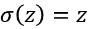
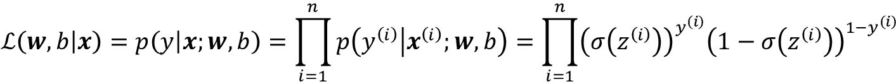
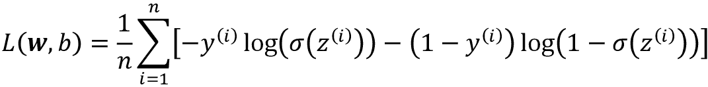
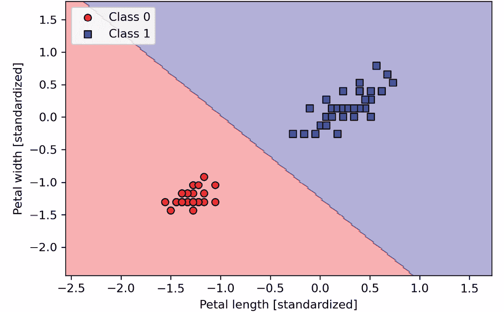
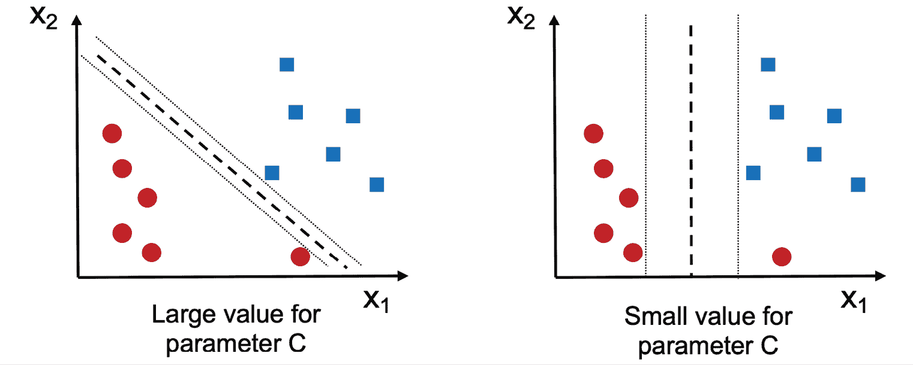
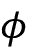
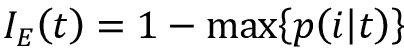

# 第三章：使用 Scikit-Learn 进行机器学习分类器的介绍

在本章中，我们将介绍一些在学术界和工业界常用的流行和强大的机器学习算法。在学习了解几种用于分类的监督学习算法之间的差异时，我们还将理解它们各自的优缺点。此外，我们将首次使用 Scikit-Learn 库，该库提供了一个用户友好且一致的接口，有效和高效地使用这些算法。

本章节将涵盖以下主题：

+   介绍了用于分类的稳健和流行算法，如逻辑回归、支持向量机、决策树和*k*最近邻算法。

+   使用 Scikit-Learn 机器学习库的示例和解释，该库通过用户友好的 Python API 提供了各种机器学习算法。

+   探讨了具有线性和非线性决策边界分类器的优缺点。

# 选择分类算法

为特定问题任务选择适当的分类算法需要实践和经验；每种算法都有其独特之处，并基于某些假设。用 David H. Wolpert 的**没有免费午餐定理**的话来说，没有单一的分类器适用于所有可能的场景（*The Lack of A Priori Distinctions Between Learning Algorithms*, *Wolpert, David H*, *Neural Computation 8.7* (1996): 1341-1390）。实际上，建议您始终比较至少几种不同学习算法的性能，以选择最适合特定问题的模型；这些算法可能在特征或示例数量、数据集中的噪声量以及类别是否线性可分方面有所不同。

最终，分类器的性能——包括计算性能和预测能力——在很大程度上取决于可用于学习的基础数据。训练监督机器学习算法所涉及的五个主要步骤可以总结如下：

1.  选择特征和收集带标签的训练样本

1.  选择性能度量标准

1.  选择学习算法并训练模型

1.  评估模型的性能

1.  更改算法的设置并调整模型。

由于本书的方法是逐步建立机器学习知识，因此我们将主要关注本章节中不同算法的主要概念，并在本书的后期重新讨论诸如特征选择和预处理、性能指标以及超参数调整等主题，进行更详细的讨论。

# 使用 scikit-learn 的第一步——训练感知器

在 *第二章*，*训练简单的机器学习算法进行分类* 中，您学习了两种相关的分类学习算法，即**感知器**规则和**Adaline**，我们自己用 Python 和 NumPy 实现了这些算法。现在我们将看看 scikit-learn API，正如前文所述，它结合了用户友好和一致的界面与几种分类算法的高度优化实现。scikit-learn 库不仅提供多种学习算法，还提供许多方便的函数来预处理数据、微调和评估我们的模型。我们将在 *第四章*，*构建良好的训练数据集 - 数据预处理* 和 *第五章*，*通过降维压缩数据* 中更详细地讨论这些内容及其概念。

为了开始使用 scikit-learn 库，我们将训练一个与 *第二章* 中实现的感知器模型类似的模型。为简单起见，我们将在以下各节中一直使用已经熟悉的**鸢尾花数据集**。方便的是，鸢尾花数据集已经通过 scikit-learn 提供，因为它是一个简单而受欢迎的数据集，经常用于测试和实验算法。与前一章节类似，我们将仅使用鸢尾花数据集的两个特征进行可视化目的。

我们将把这 150 个花例子的花瓣长度和花瓣宽度分配给特征矩阵 `X`，并将相应的花种类的类标签分配给向量数组 `y`：

```py
>>> from sklearn import datasets
>>> import numpy as np
>>> iris = datasets.load_iris()
>>> X = iris.data[:, [2, 3]]
>>> y = iris.target
>>> print('Class labels:', np.unique(y))
Class labels: [0 1 2] 
```

函数 `np.unique(y)` 返回了存储在 `iris.target` 中的三个唯一类标签，正如我们所看到的，鸢尾花的类名 `Iris-setosa`、`Iris-versicolor` 和 `Iris-virginica` 已经存储为整数（这里是 `0`、`1`、`2`）。虽然许多 scikit-learn 函数和类方法也可以处理字符串格式的类标签，但使用整数标签是一种推荐的方法，可以避免技术故障并提高计算性能，因为整数标签具有较小的内存占用；此外，将类标签编码为整数是大多数机器学习库的常规约定。

为了评估训练模型在未见数据上的表现如何，我们将进一步将数据集分割为单独的训练和测试数据集。在 *第六章*，*学习模型评估和超参数调优的最佳实践* 中，我们将更详细地讨论模型评估的最佳实践。使用 scikit-learn 的 `model_selection` 模块中的 `train_test_split` 函数，我们随机将 `X` 和 `y` 数组分割为 30% 的测试数据（45 个例子）和 70% 的训练数据（105 个例子）：

```py
>>> from sklearn.model_selection import train_test_split
>>> X_train, X_test, y_train, y_test = train_test_split(
...     X, y, test_size=0.3, random_state=1, stratify=y
... ) 
```

请注意，`train_test_split`函数在分割之前已经内部对训练数据集进行了洗牌；否则，所有来自类`0`和类`1`的示例都将最终进入训练数据集，而测试数据集将由类`2`的 45 个示例组成。通过`random_state`参数，我们为内部伪随机数生成器提供了一个固定的随机种子（`random_state=1`），用于洗牌数据集之前的操作。使用这样一个固定的`random_state`可以确保我们的结果是可重现的。

最后，我们利用内置的支持通过`stratify=y`进行分层。在这个上下文中，分层意味着`train_test_split`方法返回的训练和测试子集具有与输入数据集相同的类标签比例。我们可以使用 NumPy 的`bincount`函数来验证这一点，该函数统计数组中每个值的出现次数：

```py
>>> print('Labels counts in y:', np.bincount(y))
Labels counts in y: [50 50 50]
>>> print('Labels counts in y_train:', np.bincount(y_train))
Labels counts in y_train: [35 35 35]
>>> print('Labels counts in y_test:', np.bincount(y_test))
Labels counts in y_test: [15 15 15] 
```

许多机器学习和优化算法也需要特征缩放以获得最佳性能，正如我们在*第二章*中的**梯度下降**示例中看到的那样。在这里，我们将使用 scikit-learn 的`preprocessing`模块中的`StandardScaler`类对特征进行标准化：

```py
>>> from sklearn.preprocessing import StandardScaler
>>> sc = StandardScaler()
>>> sc.fit(X_train)
>>> X_train_std = sc.transform(X_train)
>>> X_test_std = sc.transform(X_test) 
```

使用前述代码，我们从`preprocessing`模块加载了`StandardScaler`类，并初始化了一个新的`StandardScaler`对象，将其赋给了变量`sc`。使用`fit`方法，`StandardScaler`估计了每个特征维度的训练数据的参数，即样本均值  和标准差  。通过调用`transform`方法，我们使用这些估计参数标准化了训练数据， 和  。请注意，我们使用相同的缩放参数来标准化测试数据集，以便训练数据集和测试数据集的值可以相互比较。

在标准化训练数据之后，我们现在可以训练感知器模型。scikit-learn 中的大多数算法默认支持多类分类，通过**一对多**（**OvR**）方法，我们可以一次将三个花类别的数据输入到感知器中。代码如下所示：

```py
>>> from sklearn.linear_model import Perceptron
>>> ppn = Perceptron(eta0=0.1, random_state=1)
>>> ppn.fit(X_train_std, y_train) 
```

`scikit-learn`接口会让你想起我们在*第二章*中实现的感知器。在从`linear_model`模块加载`Perceptron`类之后，我们初始化了一个新的`Perceptron`对象，并通过`fit`方法训练了模型。在这里，模型参数`eta0`相当于我们自己感知器实现中使用的学习率`eta`。

正如您在*第二章*中记得的那样，找到合适的学习率需要一些实验。如果学习率太大，算法将会超出全局损失最小值。如果学习率太小，算法将需要更多的周期直到收敛，这可能会使学习变慢，尤其是对于大型数据集。此外，我们使用了`random_state`参数来确保每个周期后对训练数据集的初始洗牌具有可重复性。

在 scikit-learn 中训练了一个模型后，我们可以通过`predict`方法进行预测，就像在*第二章*中我们自己的感知器实现中一样。代码如下：

```py
>>> y_pred = ppn.predict(X_test_std)
>>> print('Misclassified examples: %d' % (y_test != y_pred).sum())
Misclassified examples: 1 
```

执行代码，我们可以看到感知器在 45 个花示例中误分类了 1 个。因此，测试数据集上的误分类率约为 0.022，或 2.2% ()。

**分类错误与准确率**

许多机器学习实践者报告模型的分类准确率，而不是错误率，计算方法如下：

1–*error* = 0.978，即 97.8%

使用分类错误或准确率仅仅是一种偏好。

注意，scikit-learn 还实现了许多不同的性能指标，这些指标可以通过`metrics`模块获得。例如，我们可以如下计算感知器在测试数据集上的分类准确率：

```py
>>> from sklearn.metrics import accuracy_score
>>> print('Accuracy: %.3f' % accuracy_score(y_test, y_pred))
Accuracy: 0.978 
```

在这里，`y_test`是真实的类标签，`y_pred`是我们先前预测的类标签。另外，scikit-learn 中的每个分类器都有一个`score`方法，通过将`predict`调用与`accuracy_score`结合来计算分类器的预测准确率，如下所示：

```py
>>> print('Accuracy: %.3f' % ppn.score(X_test_std, y_test))
Accuracy: 0.978 
```

**过拟合**

请注意，在本章中，我们将根据测试数据集评估模型的性能。在*第六章*中，您将学习到一些有用的技术，包括图形分析，如学习曲线，以检测和预防过拟合。过拟合是指模型在训练数据中捕捉到模式，但在未见数据中无法很好泛化。

最后，我们可以使用*第二章*中的`plot_decision_regions`函数来绘制新训练的感知器模型的**决策区域**，并可视化它如何有效地分离不同的花示例。不过，让我们做一个小修改，通过小圆圈突出显示来自测试数据集的数据实例：

```py
from matplotlib.colors import ListedColormap
import matplotlib.pyplot as plt
def plot_decision_regions(X, y, classifier, test_idx=None,
                          resolution=0.02):
    # setup marker generator and color map
    markers = ('o', 's', '^', 'v', '<')
    colors = ('red', 'blue', 'lightgreen', 'gray', 'cyan')
    cmap = ListedColormap(colors[:len(np.unique(y))])
    # plot the decision surface
    x1_min, x1_max = X[:, 0].min() - 1, X[:, 0].max() + 1
    x2_min, x2_max = X[:, 1].min() - 1, X[:, 1].max() + 1
    xx1, xx2 = np.meshgrid(np.arange(x1_min, x1_max, resolution),
                           np.arange(x2_min, x2_max, resolution))
    lab = classifier.predict(np.array([xx1.ravel(), xx2.ravel()]).T)
    lab = lab.reshape(xx1.shape)
    plt.contourf(xx1, xx2, lab, alpha=0.3, cmap=cmap)
    plt.xlim(xx1.min(), xx1.max())
    plt.ylim(xx2.min(), xx2.max())
    # plot class examples
    for idx, cl in enumerate(np.unique(y)):
        plt.scatter(x=X[y == cl, 0],
                    y=X[y == cl, 1],
                    alpha=0.8,
                    c=colors[idx],
                    marker=markers[idx],
                    label=f'Class {cl}',
                    edgecolor='black')
    # highlight test examples
    if test_idx:
        # plot all examples
        X_test, y_test = X[test_idx, :], y[test_idx]

        plt.scatter(X_test[:, 0], X_test[:, 1],
                    c='none', edgecolor='black', alpha=1.0,
                    linewidth=1, marker='o',
                    s=100, label='Test set') 
```

通过对`plot_decision_regions`函数进行轻微修改，我们现在可以指定要在结果图中标记的示例的索引。代码如下：

```py
>>> X_combined_std = np.vstack((X_train_std, X_test_std))
>>> y_combined = np.hstack((y_train, y_test))
>>> plot_decision_regions(X=X_combined_std,
...                       y=y_combined,
...                       classifier=ppn,
...                       test_idx=range(105, 150))
>>> plt.xlabel('Petal length [standardized]')
>>> plt.ylabel('Petal width [standardized]')
>>> plt.legend(loc='upper left')
>>> plt.tight_layout()
>>> plt.show() 
```

正如我们在结果图中所看到的，三种花的类别不能完全通过线性决策边界分开：


图 3.1：适用于鸢尾花数据集的多类感知器模型的决策边界

然而，请记住我们在*第二章*中的讨论，感知器算法在数据集上永远不会收敛，除非数据集完全线性可分，这就是为什么实际上不建议在实践中使用感知器算法的原因。在接下来的章节中，我们将看看更强大的线性分类器，即使类别不是完全线性可分的，它们也会收敛到损失最小值。

**额外的感知器设置**

`Perceptron`以及其他 scikit-learn 函数和类通常具有我们为了清晰起见而省略的其他参数。您可以使用 Python 中的`help`函数（例如`help(Perceptron)`）或通过查阅优秀的 scikit-learn 在线文档[`scikit-learn.org/stable/`](http://scikit-learn.org/stable/)了解更多有关这些参数的信息。

# 通过逻辑回归对类别概率建模

尽管感知器规则为分类的机器学习算法提供了一个不错和简单的介绍，但它的最大缺点是，如果类别不是完全线性可分的，它永远不会收敛。前一节中的分类任务就是这种情况的一个例子。原因在于权重不断更新，因为每个时期至少存在一个误分类的训练示例。当然，您可以改变学习率并增加时期的数量，但请注意，感知器将永远不会在这个数据集上收敛。

为了更好地利用我们的时间，现在我们将看一看另一种简单但更强大的线性和二元分类问题的算法：**逻辑回归**。请注意，尽管名为逻辑回归，但逻辑回归是一种分类模型，而不是回归模型。

## 逻辑回归和条件概率

逻辑回归是一种非常容易实现并且在线性可分类中表现非常好的分类模型。它是工业界中最广泛使用的分类算法之一。与感知器和 Adaline 类似，本章中的逻辑回归模型也是二元分类的线性模型。

**逻辑回归用于多类**

逻辑回归可以方便地推广到多类设置中，这被称为**多项逻辑回归**或**Softmax 回归**。关于多项逻辑回归的更详细覆盖超出了本书的范围，但有兴趣的读者可以在我的讲义笔记中找到更多信息，网址为[`sebastianraschka.com/pdf/lecture-notes/stat453ss21/L08_logistic__slides.pdf`](https://sebastianraschka.com/pdf/lecture-notes/stat453ss21/L08_logistic__slides.pdf)或[`youtu.be/L0FU8NFpx4E`](https://youtu.be/L0FU8NFpx4E)。

在多类设置中使用逻辑回归的另一种方法是通过 OvR 技术，这是我们之前讨论过的。

要解释作为二元分类的概率模型的逻辑回归的主要机制，让我们首先介绍**几率**：支持特定事件的几率。几率可以写作，其中*p*代表积极事件的概率。术语“积极事件”并不一定意味着“好”，而是指我们要预测的事件，例如，患者在某些症状下患某种疾病的概率；我们可以将积极事件看作类标签*y* = 1，症状看作特征**x**。因此，简要地说，我们可以定义概率*p*为*p*(*y* = 1|**x**)，即给定其特征**x**的特定示例属于某个类 1 的条件概率。

接着我们可以进一步定义**logit**函数，它就是对数几率的对数（log-odds）：


注意*log*表示自然对数，这是计算机科学中的常规约定。*logit*函数接受范围为 0 到 1 的输入值，并将它们转换为整个实数范围的值。

在逻辑模型下，我们假设加权输入（在第二章中称为净输入）与对数几率之间存在线性关系：


尽管前面描述了我们对于对数几率与净输入之间的线性关系的假设，我们实际上感兴趣的是概率*p*，即给定其特征的示例的类成员概率。虽然 logit 函数将概率映射到实数范围，我们可以考虑该函数的反函数将实数范围映射回[0, 1]范围的概率*p*。

这个 logit 函数的反函数通常称为**逻辑 Sigmoid 函数**，由于其典型的 S 形状，有时简称为**Sigmoid 函数**：


这里，*z*是净输入，即权重和输入（即与训练示例相关联的特征）的线性组合：

*z* = **w**^T**x** + *b*

现在，让我们简单地绘制 Sigmoid 函数在范围–7 到 7 之间的一些值，以查看其外观：

```py
>>> import matplotlib.pyplot as plt
>>> import numpy as np
>>> def sigmoid(z):
...     return 1.0 / (1.0 + np.exp(-z))
>>> z = np.arange(-7, 7, 0.1)
>>> sigma_z = sigmoid(z)
>>> plt.plot(z, sigma_z)
>>> plt.axvline(0.0, color='k')
>>> plt.ylim(-0.1, 1.1)
>>> plt.xlabel('z')
>>> plt.ylabel('$\sigma (z)$')
>>> # y axis ticks and gridline
>>> plt.yticks([0.0, 0.5, 1.0])
>>> ax = plt.gca()
>>> ax.yaxis.grid(True)
>>> plt.tight_layout()
>>> plt.show() 
```

执行前面的代码示例后，我们现在应该看到 S 形（sigmoid）曲线：


图 3.2：逻辑 Sigmoid 函数的绘图

我们可以看到，如果*z*趋向于无穷大（*z*→∞），接近 1，因为*e*^–^z 在*z*较大时变得非常小。类似地，如果*z*趋向于负无穷大（*z*→–∞），趋向于 0，这是因为分母变得越来越大。因此，我们可以得出结论，这个 Sigmoid 函数接受实数值作为输入，并将它们转换为[0, 1]范围内的值，并在处截距。

要对逻辑回归模型建立一些理解，我们可以将其与*第二章*相关联。在 Adaline 中，我们使用了恒等函数，，作为激活函数。在逻辑回归中，这个激活函数简单地变成了我们之前定义的 sigmoid 函数。

Adaline 与逻辑回归之间的区别在下图中有所说明，唯一的区别在于激活函数：


图 3.3：逻辑回归与 Adaline 比较

然后，通过 sigmoid 函数的输出解释为特定示例属于类 1 的概率，，给定其特征，*x*，并由权重和偏置参数化，*w* 和 *b*。例如，如果我们计算一个特定花示例的 ，这意味着这个示例是`Iris-versicolor`花的概率为 80%。因此，这种花是`Iris-setosa`花的概率可以计算为 *p*(*y* = 0|**x**; **w**, *b*) = 1 – *p*(*y* = 1|**x**; **w**, *b*) = 0.2，或者 20%。

预测的概率可以简单地通过阈值函数转换为二进制结果：


如果我们看看 sigmoid 函数的前面的图，这等同于以下内容：


实际上，有许多应用场景不仅关注预测的类标签，而是特别关注预测类成员概率的估计（应用阈值函数之前的 sigmoid 函数输出）。例如，逻辑回归在天气预报中使用，不仅可以预测某一天是否会下雨，还可以报告降雨的可能性。同样地，逻辑回归可以用于根据某些症状预测患者患某种疾病的概率，这就是为什么逻辑回归在医学领域中非常流行的原因。

## 通过逻辑损失函数学习模型权重

您已经了解了如何使用逻辑回归模型预测概率和类标签；现在，让我们简要讨论如何拟合模型的参数，例如权重和偏置单元，*w* 和 *b*。在前一章中，我们定义了均方误差损失函数如下：


我们最小化这个函数，以便学习我们的 Adaline 分类模型的参数。为了解释我们如何推导逻辑回归的损失函数，让我们首先定义可能性，，即当我们构建逻辑回归模型时要最大化的可能性，假设数据集中的个体示例是彼此独立的。该公式如下：



在实践中，最大化（自然）对数化简化了这个方程，这被称为**对数似然**函数：


首先，应用对数函数减少了数值下溢的可能性，这种情况可能发生在似然值非常小的情况下。其次，我们可以将因子的乘积转换为因子的总和，这样可以更容易地通过加法技巧获取此函数的导数，正如你可能从微积分中记得的那样。

**推导似然函数**

我们可以得到给定数据的模型似然性表达式，，如下所示。考虑到我们有一个二元分类问题，类标签为 0 和 1，我们可以将标签 1 视为伯努利变量——它可以取两个值，0 和 1，概率为 *p*：。对于单个数据点，我们可以将这个概率写为  和 。

将这两个表达式放在一起，并使用简写 ，我们得到了伯努利变量的概率质量函数：


我们可以写出训练标签的似然性，假设所有训练示例是独立的，使用乘法规则计算所有事件发生的概率，如下所示：


现在，代入伯努利变量的概率质量函数，我们得到似然性的表达式，通过改变模型参数来最大化：


现在，我们可以使用梯度上升等优化算法来最大化这个对数似然函数。（梯度上升的工作方式与第二章中解释的梯度下降完全相同，只是梯度上升是最大化一个函数，而不是最小化它。）或者，让我们将对数似然重写为可以使用梯度下降最小化的损失函数 *L*，如第二章中所述：


为了更好地理解这个损失函数，让我们看看我们为单个训练样本计算的损失：


查看方程式，我们可以看到如果 *y* = 0，第一项变为零，如果 *y* = 1，第二项变为零：


```py
:
```

```py
>>> def loss_1(z):
...     return - np.log(sigmoid(z))
>>> def loss_0(z):
...     return - np.log(1 - sigmoid(z))
>>> z = np.arange(-10, 10, 0.1)
>>> sigma_z = sigmoid(z)
>>> c1 = [loss_1(x) for x in z]
>>> plt.plot(sigma_z, c1, label='L(w, b) if y=1')
>>> c0 = [loss_0(x) for x in z]
>>> plt.plot(sigma_z, c0, linestyle='--', label='L(w, b) if y=0')
>>> plt.ylim(0.0, 5.1)
>>> plt.xlim([0, 1])
>>> plt.xlabel('$\sigma(z)$')
>>> plt.ylabel('L(w, b)')
>>> plt.legend(loc='best')
>>> plt.tight_layout()
>>> plt.show() 
```

结果绘制显示了在 *x* 轴上 0 到 1 范围内的 sigmoid 激活（sigmoid 函数的输入为范围在 –10 到 10 的 *z* 值），以及与之相关联的逻辑损失在 *y* 轴上：


图 3.4：逻辑回归中使用的损失函数图

我们可以看到，如果我们正确预测一个示例属于类别 1（连续线），损失接近于 0。类似地，我们可以看到在 *y* 轴上，如果我们正确预测 *y* = 0（虚线），损失也接近于 0。然而，如果预测错误，损失将趋向于无穷大。主要问题是我们通过越来越大的损失来惩罚错误的预测。

## 将 Adaline 实现转换为逻辑回归算法

如果我们要自己实现逻辑回归，我们可以简单地在 *第二章* 中的 Adaline 实现中用新的损失函数 *L* 替换原有的损失函数：



我们使用这个来计算每个时期分类所有训练示例的损失。此外，我们需要用 sigmoid 函数替换线性激活函数。如果我们对 Adaline 代码进行这些更改，我们将得到一个可工作的逻辑回归实现。以下是完全批量梯度下降的实现（但请注意，同样的更改也可以应用于随机梯度下降版本）：

```py
class LogisticRegressionGD:
    """Gradient descent-based logistic regression classifier.
    Parameters
    ------------
    eta : float
      Learning rate (between 0.0 and 1.0)
    n_iter : int
      Passes over the training dataset.
    random_state : int
      Random number generator seed for random weight
      initialization.
    Attributes
    -----------
    w_ : 1d-array
      Weights after training.
    b_ : Scalar
      Bias unit after fitting.
    losses_ : list
      Mean squared error loss function values in each epoch.
    """
    def __init__(self, eta=0.01, n_iter=50, random_state=1):
        self.eta = eta
        self.n_iter = n_iter
        self.random_state = random_state
    def fit(self, X, y):
        """ Fit training data.
        Parameters
        ----------
        X : {array-like}, shape = [n_examples, n_features]
          Training vectors, where n_examples is the 
          number of examples and n_features is the 
          number of features.
        y : array-like, shape = [n_examples]
          Target values.
        Returns
        -------
        self : Instance of LogisticRegressionGD
        """
        rgen = np.random.RandomState(self.random_state)
        self.w_ = rgen.normal(loc=0.0, scale=0.01, size=X.shape[1])
        self.b_ = np.float_(0.)
        self.losses_ = []
        for i in range(self.n_iter):
            net_input = self.net_input(X)
            output = self.activation(net_input)
            errors = (y - output)
            self.w_ += self.eta * 2.0 * X.T.dot(errors) / X.shape[0]
            self.b_ += self.eta * 2.0 * errors.mean()
            loss = (-y.dot(np.log(output))
                   - ((1 - y).dot(np.log(1 - output)))
                    / X.shape[0])
            self.losses_.append(loss)
        return self
    def net_input(self, X):
        """Calculate net input"""
        return np.dot(X, self.w_) + self.b_
    def activation(self, z):
        """Compute logistic sigmoid activation"""
        return 1\. / (1\. + np.exp(-np.clip(z, -250, 250)))
    def predict(self, X):
        """Return class label after unit step"""
        return np.where(self.activation(self.net_input(X)) >= 0.5, 1, 0) 
```

当我们拟合逻辑回归模型时，我们必须记住它仅适用于二元分类任务。

因此，让我们仅考虑山鸢尾和变色鸢尾花（类别 `0` 和 `1`），并检查我们的逻辑回归实现是否有效：

```py
>>> X_train_01_subset = X_train_std[(y_train == 0) | (y_train == 1)]
>>> y_train_01_subset = y_train[(y_train == 0) | (y_train == 1)]
>>> lrgd = LogisticRegressionGD(eta=0.3,
...                             n_iter=1000,
...                             random_state=1)
>>> lrgd.fit(X_train_01_subset,
...          y_train_01_subset)
>>> plot_decision_regions(X=X_train_01_subset,
...                       y=y_train_01_subset,
...                       classifier=lrgd)
>>> plt.xlabel('Petal length [standardized]')
>>> plt.ylabel('Petal width [standardized]')
>>> plt.legend(loc='upper left')
>>> plt.tight_layout()
>>> plt.show() 
```

所得的决策区域图如下所示：



图 3.5：逻辑回归模型的决策区域图

**逻辑回归的梯度下降学习算法**

如果您将上一章中的 `LogisticRegressionGD` 与第二章中的 `AdalineGD` 代码进行比较，您可能会注意到权重和偏置更新规则保持不变（除了缩放因子 2）。使用微积分，我们可以证明梯度下降通过逻辑回归和 Adaline 更新参数的确是相似的。但请注意，下面导出的梯度下降学习规则的推导是为了对数回归梯度下降学习规则背后的数学概念感兴趣的读者。对于本章其余部分的跟进，这并非必需。

*图 3.6* 总结了我们如何计算对第 *j* 个权重的对数似然函数的偏导数：


图 3.6：计算对数似然函数的偏导数

注意，为简洁起见，我们省略了对训练示例的平均值。

请记住，从 *第二章* 我们知道，我们在梯度相反的方向上采取步骤。因此，我们反转  并更新第 *j* 个权重如下，包括学习率 ：


虽然未显示损失函数对偏置单位的偏导数，但是偏置导数遵循相同的链式法则概念，导致以下更新规则：


权重和偏置单位的更新与 *第二章* 中 Adaline 的更新相同。

## 使用 scikit-learn 训练 logistic 回归模型

在前一小节中，我们刚刚完成了有用的编码和数学练习，这有助于说明 Adaline 和 logistic 回归之间的概念差异。 现在，让我们学习如何使用 scikit-learn 更优化的 logistic 回归实现，它还支持即插即用的多类设置。 请注意，在 scikit-learn 的最新版本中，用于多类分类的技术，即 multinomial 或 OvR，是自动选择的。 在以下代码示例中，我们将使用 `sklearn.linear_model.LogisticRegression` 类以及熟悉的 `fit` 方法在标准化的花卉训练数据集中训练模型的所有三个类。 另外，我们设置 `multi_class='ovr'` 以进行说明目的。 作为读者的练习，您可能希望将结果与 `multi_class='multinomial'` 进行比较。 请注意，`multinomial` 设置现在是 scikit-learn 的 `LogisticRegression` 类的默认选择，并且在实践中推荐用于互斥类，例如在 Iris 数据集中找到的类。 在这里，“互斥” 意味着每个训练示例只能属于一个单一类（与多标签分类相对，其中训练示例可以是多个类的成员）。

现在，让我们看看代码示例：

```py
>>> from sklearn.linear_model import LogisticRegression
>>> lr = LogisticRegression(C=100.0, solver='lbfgs',
...                         multi_class='ovr')
>>> lr.fit(X_train_std, y_train)
>>> plot_decision_regions(X_combined_std,
...                       y_combined,
...                       classifier=lr,
...                       test_idx=range(105, 150))
>>> plt.xlabel('Petal length [standardized]')
>>> plt.ylabel('Petal width [standardized]')
>>> plt.legend(loc='upper left')
>>> plt.tight_layout()
>>> plt.show() 
```

在对训练数据拟合模型之后，我们绘制了决策区域、训练示例和测试示例，如 *图 3.7* 所示：


图 3.7：scikit-learn 的多类 logistic 回归模型的决策区域

**凸优化算法**

请注意，存在许多不同的算法用于解决优化问题。 对于最小化凸损失函数（例如 logistic 回归损失），建议使用比常规的 **随机梯度下降** (**SGD**) 更高级的方法。 实际上，scikit-learn 实现了一整套这样的优化算法，可以通过 `solver` 参数指定，即 `'newton-cg'`、`'lbfgs'`、`'liblinear'`、`'sag'` 和 `'saga'`。

尽管逻辑回归损失是凸的，大多数优化算法应该可以轻松收敛到全局损失最小值。然而，使用一种算法而不是另一种算法有一定的优势。例如，在之前的版本（例如 v 0.21）中，scikit-learn 默认使用`'liblinear'`，它不能处理多项式损失，并且仅限于多类分类的 OvR 方案。然而，在 scikit-learn v 0.22 中，默认解算器更改为`'lbfgs'`，它代表了有限内存**Broyden–Fletcher–Goldfarb–Shanno**（**BFGS**）算法（[`en.wikipedia.org/wiki/Limited-memory_BFGS`](https://en.wikipedia.org/wiki/Limited-memory_BFGS)），在这方面更加灵活。

查看我们用于训练`LogisticRegression`模型的前述代码时，您可能会想，“这个神秘的参数 C 是什么？”在下一小节中，我们将讨论这个参数，介绍过拟合和正则化的概念。然而，在我们继续讨论这些主题之前，让我们完成我们关于类成员概率的讨论。

可以使用`predict_proba`方法计算训练样本属于某一类的概率。例如，我们可以预测测试数据集中前三个示例的概率如下：

```py
>>> lr.predict_proba(X_test_std[:3, :]) 
```

此代码片段返回以下数组：

```py
array([[3.81527885e-09, 1.44792866e-01, 8.55207131e-01],
       [8.34020679e-01, 1.65979321e-01, 3.25737138e-13],
       [8.48831425e-01, 1.51168575e-01, 2.62277619e-14]]) 
```

第一行对应于第一朵花的类成员概率，第二行对应于第二朵花的类成员概率，依此类推。请注意，每行中的列总和为 1，如预期那样。（您可以通过执行`lr.predict_proba(X_test_std[:3, :]).sum(axis=1)`来确认这一点。）

第一行中的最高值约为 0.85，这意味着第一个示例属于类别 3（`Iris-virginica`），预测概率为 85%。因此，正如您可能已经注意到的，我们可以通过识别每行中最大的列来获取预测的类标签，例如使用 NumPy 的`argmax`函数：

```py
>>> lr.predict_proba(X_test_std[:3, :]).argmax(axis=1) 
```

返回的类索引如下所示（它们对应于`Iris-virginica`，`Iris-setosa`和`Iris-setosa`）：

```py
array([2, 0, 0]) 
```

在上述代码示例中，我们计算了条件概率，并通过使用 NumPy 的`argmax`函数手动将其转换为类标签。在实践中，当使用 scikit-learn 时，更方便的获取类标签的方法是直接调用`predict`方法：

```py
>>> lr.predict(X_test_std[:3, :])
array([2, 0, 0]) 
```

最后，如果您想预测单个花例的类标签，请注意：scikit-learn 期望数据输入为二维数组；因此，我们首先必须将单行切片转换为这样的格式。将单行条目转换为二维数据数组的一种方法是使用 NumPy 的`reshape`方法添加一个新维度，如下所示：

```py
>>> lr.predict(X_test_std[0, :].reshape(1, -1))
array([2]) 
```

## 通过正则化解决过拟合

过拟合是机器学习中常见的问题，指的是模型在训练数据上表现良好，但在未见过的数据（测试数据）上表现不佳。如果一个模型存在过拟合问题，我们也会说这个模型具有高方差，这可能是由于参数过多导致模型过于复杂，无法很好地适应基础数据。同样，我们的模型也可能遭受**欠拟合**（高偏差）的问题，这意味着我们的模型不够复杂，无法很好地捕捉训练数据中的模式，因此在未见数据上也表现较差。

尽管到目前为止我们只遇到过用于分类的线性模型，但通过将线性决策边界与更复杂、非线性决策边界进行比较，可以最好地说明过拟合和欠拟合的问题，如在*图 3.8*中所示：


图 3.8：欠拟合、拟合良好和过拟合模型的示例

**偏差-方差权衡**

研究人员经常使用“偏差”和“方差”或“偏差-方差权衡”这些术语来描述模型的性能，也就是说，你可能会听到有人说某个模型具有“高方差”或“高偏差”。那么，这是什么意思呢？一般来说，我们可能会说“高方差”与过拟合成正比，“高偏差”与欠拟合成正比。

在机器学习模型的背景下，方差衡量了在多次重新训练模型时，例如在训练数据集的不同子集上，为对特定示例进行分类，模型预测的一致性（或变异性）。我们可以说模型对训练数据中随机性敏感。相反，偏差衡量了多次在不同训练数据集上重新构建模型时，预测值与正确值的偏差程度；偏差是衡量由于非随机性而产生的系统误差的指标。

如果你对“偏差”和“方差”这两个术语的技术规范和推导感兴趣，可以在我的讲义中找到相关内容：[`sebastianraschka.com/pdf/lecture-notes/stat451fs20/08-model-eval-1-intro__notes.pdf`](https://sebastianraschka.com/pdf/lecture-notes/stat451fs20/08-model-eval-1-intro__notes.pdf)。

寻找一个良好的偏差-方差平衡的一种方式是通过正则化调整模型的复杂性。正则化是处理共线性（特征之间的高相关性）、从数据中过滤噪声以及最终预防过拟合的非常有用的方法。

正则化背后的概念是引入额外信息来惩罚极端参数（权重）值。最常见的正则化形式是所谓的**L2 正则化**（有时也称为 L2 缩减或权重衰减），可以写作如下形式：


在这里，被称为**正则化参数**。请注意，分母中的 2 只是一个缩放因子，因此在计算损失梯度时会被抵消。样本大小*n*被添加以将正则化项缩放类似于损失。

**正则化和特征标准化**

正则化是特征缩放如标准化之类的另一个重要原因。为了使正则化正常工作，我们需要确保所有特征都在可比较的尺度上。

逻辑回归的损失函数可以通过添加简单的正则化项进行正则化，这将在模型训练过程中缩小权重：


未正则化损失的偏导数定义如下：


将正则化项添加到损失函数中会改变偏导数的形式如下：


通过正则化参数，我们可以控制拟合训练数据的紧密程度，同时保持权重较小。通过增加的值，我们增加了正则化强度。请注意，偏置单元，本质上是拦截项或负阈值，如我们在*第二章*中学到的那样，通常不被正则化。

在 scikit-learn 中实现的`LogisticRegression`类中的参数`C`，来自支持向量机的一个约定，这将是下一节的主题。术语`C`与正则化参数的倒数成反比，。因此，减少逆正则化参数`C`的值意味着增加正则化强度，我们可以通过绘制两个权重系数的 L2 正则化路径来进行可视化：

```py
>>> weights, params = [], []
>>> for c in np.arange(-5, 5):
...     lr = LogisticRegression(C=10.**c,
...                             multi_class='ovr')
...     lr.fit(X_train_std, y_train)
...     weights.append(lr.coef_[1])
...     params.append(10.**c)
>>> weights = np.array(weights)
>>> plt.plot(params, weights[:, 0],
...          label='Petal length')
>>> plt.plot(params, weights[:, 1], linestyle='--',
...          label='Petal width')
>>> plt.ylabel('Weight coefficient')
>>> plt.xlabel('C')
>>> plt.legend(loc='upper left')
>>> plt.xscale('log')
>>> plt.show() 
```

通过执行前述代码，我们拟合了 10 个逻辑回归模型，使用不同的逆正则化参数`C`的值。为了说明目的，我们仅收集了类别`1`（在这里是数据集中的第二类：`Iris-versicolor`）的权重系数，对所有分类器进行了采集。请记住，我们正在使用一对多技术进行多类分类。

正如我们在生成的图表中所看到的，如果减少参数`C`，即增加正则化强度，权重系数会收缩：


图 3.9：逆正则化强度参数 C 对 L2 正则化模型结果的影响

增加正则化强度可以减少过拟合，因此我们可能会问为什么不默认强力正则化所有模型。原因是我们在调整正则化强度时必须小心。例如，如果正则化强度过高，权重系数接近零，模型可能因为欠拟合而表现非常糟糕，正如*图 3.8*所示。

**关于逻辑回归的额外资源**

由于个别分类算法的深入涵盖超出了本书的范围，推荐给希望了解更多关于逻辑回归的读者，《逻辑回归：从入门到高级概念与应用》，斯科特·梅纳德博士，Sage Publications，2009 年。

# 使用支持向量机进行最大间隔分类

另一个强大且广泛使用的学习算法是**支持向量机**（**SVM**），可以看作是感知器的扩展。使用感知器算法，我们最小化了分类错误。然而，在 SVM 中，我们的优化目标是最大化边界。边界被定义为分离超平面（决策边界）与离该超平面最近的训练样本之间的距离，这些样本被称为**支持向量**。

这在*图 3.10*中有所说明：


图 3.10：SVM 在决策边界和训练数据点之间最大化间隔

## 最大间隔直觉

决策边界具有大间隔的背后理念在于，它们往往具有较低的泛化误差，而具有小间隔的模型更容易过拟合。

不幸的是，虽然 SVM 背后的主要直觉相对简单，但其中的数学内容相当深奥，需要对约束优化有扎实的理解。

因此，SVM 中最大间隔优化背后的细节超出了本书的范围。但是，如果您有兴趣了解更多内容，我们建议以下资源：

+   克里斯·J·C·伯吉斯在《支持向量机模式识别的教程》（数据挖掘与知识发现，2(2): 121-167, 1998）中的出色解释

+   弗拉基米尔·瓦普尼克的著作《统计学习理论的本质》，Springer Science+Business Media, 2000

+   安德鲁·吴的非常详细的讲义笔记，可在[`see.stanford.edu/materials/aimlcs229/cs229-notes3.pdf`](https://see.stanford.edu/materials/aimlcs229/cs229-notes3.pdf)获取

## 使用松弛变量处理非线性可分情况

虽然我们不打算深入探讨最大间隔分类背后更复杂的数学概念，但让我们简要提到所谓的*松弛变量*，它由弗拉基米尔·瓦普尼克在 1995 年引入，导致了所谓的**软间隔分类**。引入松弛变量的动机是，在非线性可分数据中，SVM 优化目标中的线性约束需要放宽，以允许在适当的损失惩罚下优化的收敛，即使存在分类错误。

松弛变量的使用引入了常被称为*S*的变量，在支持向量机的上下文中，我们可以把*S*看作是控制误分类惩罚的超参数。较大的*S*值对应着较大的误差惩罚，而如果选择较小的*S*值，则对误分类错误的严格性较低。我们可以使用*S*参数来控制边界的宽度，从而调整偏差-方差的权衡，如*图 3.11*所示：



图 3.11: 逆正则化强度大值和小值对分类的影响

这个概念与正则化有关，我们在前一节中讨论了正则化回归的情况，在这种情况下，减小`C`的值会增加模型的偏差（欠拟合），降低方差（过拟合）。

现在我们已经了解了线性支持向量机的基本概念，让我们训练一个 SVM 模型来对我们鸢尾花数据集中的不同花进行分类：

```py
>>> from sklearn.svm import SVC
>>> svm = SVC(kernel='linear', C=1.0, random_state=1)
>>> svm.fit(X_train_std, y_train)
>>> plot_decision_regions(X_combined_std,
...                       y_combined,
...                       classifier=svm,
...                       test_idx=range(105, 150))
>>> plt.xlabel('Petal length [standardized]')
>>> plt.ylabel('Petal width [standardized]')
>>> plt.legend(loc='upper left')
>>> plt.tight_layout()
>>> plt.show() 
```

在使用前述代码示例训练鸢尾花数据集的分类器后，展示了支持向量机的三个决策区域，如*图 3.12*所示：


图 3.12: 支持向量机的决策区域

**逻辑回归与支持向量机**

在实际分类任务中，线性逻辑回归和线性支持向量机通常产生非常相似的结果。逻辑回归试图最大化训练数据的条件概率，这使得它比支持向量机更容易受到异常值的影响，后者主要关注最靠近决策边界的点（支持向量）。另一方面，逻辑回归有简单模型的优势，并且更容易实现，数学上更容易解释。此外，逻辑回归模型可以轻松更新，在处理流数据时非常有吸引力。

## 在 scikit-learn 中的替代实现方式

scikit-learn 库中的`LogisticRegression`类，我们在前面的章节中使用过，可以通过设置`solver='liblinear'`来使用 LIBLINEAR 库。LIBLINEAR 是台湾大学开发的高度优化的 C/C++库（[`www.csie.ntu.edu.tw/~cjlin/liblinear/`](http://www.csie.ntu.edu.tw/~cjlin/liblinear/)）。

同样地，我们用来训练支持向量机的`SVC`类使用了 LIBSVM，这是一种专门用于支持向量机的等效 C/C++库（[`www.csie.ntu.edu.tw/~cjlin/libsvm/`](http://www.csie.ntu.edu.tw/~cjlin/libsvm/)）。

使用 LIBLINEAR 和 LIBSVM 相比于例如原生 Python 实现的优势在于，它们允许快速训练大量线性分类器。然而，有时我们的数据集太大而无法放入计算机内存。因此，scikit-learn 还通过`SGDClassifier`类提供了替代实现，该类还通过`partial_fit`方法支持在线学习。`SGDClassifier`类的概念类似于我们在*第二章*中为 Adaline 实现的随机梯度算法。

我们可以初始化感知器的 SGD 版本（`loss='perceptron'`）、逻辑回归（`loss='log'`）和具有默认参数的 SVM（`loss='hinge'`），如下所示：

```py
>>> from sklearn.linear_model import SGDClassifier
>>> ppn = SGDClassifier(loss='perceptron')
>>> lr = SGDClassifier(loss='log')
>>> svm = SGDClassifier(loss='hinge') 
```

# 使用核 SVM 解决非线性问题

支持向量机（SVM）在机器学习从业者中享有极高的流行度的另一个原因是，它们可以轻松地应用**核技巧**来解决非线性分类问题。在我们讨论所谓的**核 SVM**的主要概念之前，让我们首先创建一个合成数据集，看看这样一个非线性分类问题可能会是什么样子。

## 线性不可分数据的核方法

使用以下代码，我们将使用 NumPy 的`logical_or`函数创建一个形如 XOR 门的简单数据集，其中 100 个示例将被分配类标签`1`，另外 100 个示例将被分配类标签`-1`：

```py
>>> import matplotlib.pyplot as plt
>>> import numpy as np
>>> np.random.seed(1)
>>> X_xor = np.random.randn(200, 2)
>>> y_xor = np.logical_xor(X_xor[:, 0] > 0,
...                        X_xor[:, 1] > 0)
>>> y_xor = np.where(y_xor, 1, 0)
>>> plt.scatter(X_xor[y_xor == 1, 0],
...             X_xor[y_xor == 1, 1],
...             c='royalblue', marker='s',
...             label='Class 1')
>>> plt.scatter(X_xor[y_xor == 0, 0],
...             X_xor[y_xor == 0, 1],
...             c='tomato', marker='o',
...             label='Class 0')
>>> plt.xlim([-3, 3])
>>> plt.ylim([-3, 3])
>>> plt.xlabel('Feature 1')
>>> plt.ylabel('Feature 2')
>>> plt.legend(loc='best')
>>> plt.tight_layout()
>>> plt.show() 
```

执行代码后，我们将得到一个带有随机噪声的 XOR 数据集，如*图 3.13*所示：


图 3.13：XOR 数据集的绘图

显然，如果我们使用线性超平面作为决策边界，通过前面章节讨论过的线性逻辑回归或线性支持向量机模型，我们将无法很好地将正类和负类的示例分开。

处理这种线性不可分数据的**核方法**的基本思想是通过映射函数创建原始特征的非线性组合，将其投影到高维空间中，使数据变得线性可分，如所示。正如*图 3.14*所示，我们可以将一个二维数据集转换为一个新的三维特征空间，其中通过以下投影使得类别变得可分：


这使我们能够通过一个线性超平面将绘图中显示的两类分开，如果我们将其投影回原始特征空间，则这将成为一个非线性决策边界，如下所示的同心圆数据集：


图 3.14：使用核方法对非线性数据进行分类的过程

## 在高维空间中使用核技巧找到分离超平面

要使用支持向量机解决非线性问题，我们会通过映射函数  将训练数据转换为更高维度的特征空间，并训练一个线性支持向量机模型来在这个新的特征空间中对数据进行分类。然后，我们可以使用同样的映射函数  将新的未见数据进行转换，并使用线性支持向量机模型进行分类。

然而，这种映射方法的一个问题是构建新特征在计算上非常昂贵，特别是在处理高维数据时。这就是所谓的**核技巧**发挥作用的地方。

虽然我们没有详细介绍如何解决二次规划任务来训练支持向量机，但在实践中，我们只需将点积 **x**^(^i^)^T**x**^(^j^) 替换为 。为了避免显式计算两个点之间的点积步骤，我们定义了所谓的**核函数**：


最常用的核函数之一是**径向基函数**（**RBF**）核，也可以简称为**高斯核**：


这通常被简化为：


这里， 是要优化的自由参数。

大致而言，术语“核”可以被解释为一对示例之间的**相似度函数**。负号将距离度量反转为相似度评分，并且由于指数项的存在，结果的相似度评分将落入 1（完全相似示例）到 0（非常不相似示例）的范围内。

现在我们已经了解了核技巧背后的大局，让我们看看能否训练一个能够很好地分离异或数据的核支持向量机。在这里，我们简单地使用我们之前导入的 `SVC` 类，并将 `kernel='linear'` 参数替换为 `kernel='rbf'`：

```py
>>> svm = SVC(kernel='rbf', random_state=1, gamma=0.10, C=10.0)
>>> svm.fit(X_xor, y_xor)
>>> plot_decision_regions(X_xor, y_xor, classifier=svm)
>>> plt.legend(loc='upper left')
>>> plt.tight_layout()
>>> plt.show() 
```

如我们在结果图中所见，核支持向量机相对较好地分离了异或数据：


图 3.15：使用核方法在异或数据上的决策边界

我们将参数 ，设置为 `gamma=0.1`，可以理解为高斯球体的截断参数。如果增加  的值，我们将增加训练示例的影响或范围，这将导致更紧密和更崎岖的决策边界。为了更好地理解 ，让我们将 RBF 核支持向量机应用于我们的鸢尾花数据集：

```py
>>> svm = SVC(kernel='rbf', random_state=1, gamma=0.2, C=1.0)
>>> svm.fit(X_train_std, y_train)
>>> plot_decision_regions(X_combined_std,
...                       y_combined, classifier=svm,
...                       test_idx=range(105, 150))
>>> plt.xlabel('Petal length [standardized]')
>>> plt.ylabel('Petal width [standardized]')
>>> plt.legend(loc='upper left')
>>> plt.tight_layout()
>>> plt.show() 
```

由于我们选择了相对较小的值来设置 ，所以 RBF 核支持向量机模型的决策边界将比较柔和，如*图 3.16*所示：


图 3.16：使用具有小*图 3.17*值的 RBF 核 SVM 模型在鸢尾花数据集上的决策边界

现在，让我们增加*图 3.17*中的值并观察决策边界的效果：

```py
>>> svm = SVC(kernel='rbf', random_state=1, gamma=100.0, C=1.0)
>>> svm.fit(X_train_std, y_train)
>>> plot_decision_regions(X_combined_std,
...                       y_combined, classifier=svm,
...                       test_idx=range(105,150))
>>> plt.xlabel('Petal length [standardized]')
>>> plt.ylabel('Petal width [standardized]')
>>> plt.legend(loc='upper left')
>>> plt.tight_layout()
>>> plt.show() 
```

在*图 3.17*中，我们现在可以看到围绕类别`0`和`1`的决策边界使用了一个相对较大的值的情况：


图 3.17：使用具有大*图 3.17*值的 RBF 核 SVM 模型在鸢尾花数据集上的决策边界

尽管模型非常适合训练数据集，这样的分类器可能在未见数据上具有很高的泛化误差。这说明了当算法对训练数据中的波动过于敏感时，参数也在控制过拟合或方差中扮演着重要角色。

# 决策树学习

**决策树**分类器是有吸引力的模型，如果我们关心解释性的话。正如“决策树”这个名称所暗示的，我们可以将这个模型看作通过提出一系列问题来分解我们的数据。

考虑以下例子，我们使用决策树来决定特定一天的活动：


图 3.18：决策树的一个示例

基于我们训练数据集中的特征，决策树模型学习一系列问题，以推断示例的类别标签。虽然*图 3.18*说明了基于分类变量的决策树的概念，但如果我们的特征是实数，比如在鸢尾花数据集中，相同的概念也适用。例如，我们可以简单地沿着**萼片宽度**特征轴定义一个截断值，并提出一个二元问题：“萼片宽度 ≥ 2.8 cm 吗？”

使用决策算法，我们从树根开始，并根据导致最大**信息增益**（**IG**）的特征来分割数据，这将在接下来的部分详细解释。在迭代过程中，我们可以在每个子节点重复这个分割过程，直到叶子节点是纯净的。这意味着每个节点上的训练示例都属于同一类别。实际上，这可能导致一个非常深的树，有许多节点，这很容易导致过拟合。因此，我们通常希望通过设置树的最大深度来**修剪**树。

## 最大化信息增益 - 在投入最少的前提下获得最大的收益

要在最具信息性的特征上分割节点，我们需要定义一个通过树学习算法优化的目标函数。在这里，我们的目标函数是在每次分割时最大化信息增益，定义如下：


这里，*f* 是要执行分割的特征；*D*[p] 和 *D*[j] 分别是父节点和第 *j* 个子节点的数据集；*I* 是我们的**不纯度**度量；*N*[p] 是父节点的总训练示例数；*N*[j] 是第 *j* 个子节点中示例的数目。正如我们所见，信息增益简单地是父节点的不纯度与子节点不纯度之和的差异——子节点的不纯度越低，信息增益越大。然而，为了简化和减少组合搜索空间，大多数库（包括 scikit-learn）实现二叉决策树。这意味着每个父节点分裂为两个子节点，*D*[left] 和 *D*[right]：


在二叉决策树中常用的三种不纯度度量或分裂准则是**基尼不纯度**（*I*[G]）、**熵**（*I*[H]）和**分类错误**（*I*[E]）。让我们从所有**非空**类的熵定义开始（）：


在这里，*p*(*i*|*t*) 是属于特定节点 *t* 的类 *i* 示例的比例。因此，如果一个节点上的所有示例属于同一类，则熵为 0，如果我们具有均匀的类分布，则熵是最大的。例如，在二元类设置中，如果 *p*(*i*=1|*t*) = 1 或 *p*(*i*=0|*t*) = 0，则熵为 0。如果类均匀分布，其中 *p*(*i*=1|*t*) = 0.5 和 *p*(*i*=0|*t*) = 0.5，则熵为 1。因此，我们可以说熵准则试图在树中最大化互信息。

为了提供直观感受，让我们通过以下代码可视化不同类分布的熵值：

```py
>>> def entropy(p):
...     return - p * np.log2(p) - (1 - p) * np.log2((1 - p))
>>> x = np.arange(0.0, 1.0, 0.01)
>>> ent = [entropy(p) if p != 0 else None for p in x]
>>> plt.ylabel('Entropy')
>>> plt.xlabel('Class-membership probability p(i=1)')
>>> plt.plot(x, ent)
>>> plt.show() 
```

*图 3.19* 如下所示是前述代码生成的图形：


图 3.19：不同类成员概率的熵值

基尼不纯度可以理解为最小化误分类的概率准则：


与熵类似，**基尼不纯度**在类别完全混合时达到最大值，例如，在二元类别设置中（*c* = 2）：


然而，在实践中，基尼不纯度和熵通常产生非常相似的结果，因此通常不值得花费大量时间评估不同的不纯度准则，而是试验不同的修剪阈值。实际上，正如您将在图 3.21 中看到的那样，基尼不纯度和熵的形状是相似的。

另一个不纯度度量是分类错误：



这是一个有用的修剪准则，但不推荐用于生成决策树，因为它对节点类别概率的变化不敏感。我们可以通过查看图 3.20 中显示的两种可能的分割场景来说明这一点：


图 3.20：决策树数据分割

我们从父节点开始，有一个数据集 *D*[p]，其中包含来自类别 1 的 40 个示例和来自类别 2 的 40 个示例，我们将其分成两个数据集 *D*[left] 和 *D*[right]。使用分类错误作为分裂准则的信息增益在情景 A 和 B 中是相同的 (*IG*[E] = 0.25)：


然而，基尼不纯度会偏向于情景 B 的分裂（)，而非情景 A（*IG*[G] = 0.125），这的确更加纯净：


类似地，熵准则也会偏向于情景 B (*IG*[H] = 0.31)，而非情景 A (*IG*[H] = 0.19)：


为了更直观地比较我们之前讨论过的三种不纯度准则，让我们绘制类别 1 的概率范围 [0, 1] 内的不纯度指数。请注意，我们还将添加熵的缩放版本（熵 / 2）以观察到基尼不纯度是熵和分类错误之间的中间度量。代码如下：

```py
>>> import matplotlib.pyplot as plt
>>> import numpy as np
>>> def gini(p):
...     return p*(1 - p) + (1 - p)*(1 - (1-p))
>>> def entropy(p):
...     return - p*np.log2(p) - (1 - p)*np.log2((1 - p))
>>> def error(p):
...     return 1 - np.max([p, 1 - p])
>>> x = np.arange(0.0, 1.0, 0.01)
>>> ent = [entropy(p) if p != 0 else None for p in x]
>>> sc_ent = [e*0.5 if e else None for e in ent]
>>> err = [error(i) for i in x]
>>> fig = plt.figure()
>>> ax = plt.subplot(111)
>>> for i, lab, ls, c, in zip([ent, sc_ent, gini(x), err],
...                           ['Entropy', 'Entropy (scaled)',
...                            'Gini impurity',
...                            'Misclassification error'],
...                           ['-', '-', '--', '-.'],
...                           ['black', 'lightgray',
...                            'red', 'green', 'cyan']):
...     line = ax.plot(x, i, label=lab,
...                   linestyle=ls, lw=2, color=c)
>>> ax.legend(loc='upper center', bbox_to_anchor=(0.5, 1.15),
...           ncol=5, fancybox=True, shadow=False)
>>> ax.axhline(y=0.5, linewidth=1, color='k', linestyle='--')
>>> ax.axhline(y=1.0, linewidth=1, color='k', linestyle='--')
>>> plt.ylim([0, 1.1])
>>> plt.xlabel('p(i=1)')
>>> plt.ylabel('impurity index')
>>> plt.show() 
```

上述代码示例生成的图形如下：


图 3.21：不同类别成员概率在 0 到 1 之间的不纯度指数

## 构建决策树

决策树可以通过将特征空间划分为矩形来构建复杂的决策边界。然而，我们必须小心，因为决策树越深，决策边界就会变得越复杂，这很容易导致过拟合。使用 scikit-learn，我们现在将训练一个最大深度为 4 的决策树，使用基尼不纯度作为不纯度的标准。

尽管出于可视化目的可能希望进行特征缩放，请注意，对于决策树算法来说，特征缩放并不是必需的。代码如下：

```py
>>> from sklearn.tree import DecisionTreeClassifier
>>> tree_model = DecisionTreeClassifier(criterion='gini',
...                                     max_depth=4,
...                                     random_state=1)
>>> tree_model.fit(X_train, y_train)
>>> X_combined = np.vstack((X_train, X_test))
>>> y_combined = np.hstack((y_train, y_test))
>>> plot_decision_regions(X_combined,
...                       y_combined,
...                       classifier=tree_model,
...                       test_idx=range(105, 150))
>>> plt.xlabel('Petal length [cm]')
>>> plt.ylabel('Petal width [cm]')
>>> plt.legend(loc='upper left')
>>> plt.tight_layout()
>>> plt.show() 
```

执行上述代码示例后，我们得到了决策树的典型轴对齐决策边界：


图 3.22：使用决策树的鸢尾花数据的决策边界

在 scikit-learn 中的一个很好的特性是，它允许我们在训练后直接可视化决策树模型，代码如下：

```py
>>> from sklearn import tree
>>> feature_names = ['Sepal length', 'Sepal width',
...                  'Petal length', 'Petal width']
>>> tree.plot_tree(tree_model,
...                feature_names=feature_names,
...                filled=True)
>>> plt.show() 
```


图 3.23：拟合到鸢尾花数据集的决策树模型

在我们调用的 `plot_tree` 函数中设置 `filled=True` 将会根据该节点处的主要类标签为节点着色。还有许多其他选项可供选择，您可以在文档中找到：[`scikit-learn.org/stable/modules/generated/sklearn.tree.plot_tree.html`](https://scikit-learn.org/stable/modules/generated/sklearn.tree.plot_tree.html)。

查看决策树图，现在我们可以清楚地追溯决策树从训练数据集中确定的分割。关于每个节点的特征分割标准，请注意，向左的分支对应“True”，向右的分支对应“False”。

查看根节点，顶部有 105 个示例。第一个分割使用萼片宽度≤ 0.75 cm 的截止值将根节点分割为两个子节点，左子节点有 35 个示例，右子节点有 70 个示例。第一个分割后，我们可以看到左子节点已经是纯净的，只包含来自`Iris-setosa`类的示例（基尼不纯度 = 0）。然后，右侧的进一步分割用于将示例从`Iris-versicolor`和`Iris-virginica`类中分离出来。

查看这棵树，以及树的决策区域图，我们可以看到决策树在分离花卉类别方面做得非常好。不幸的是，scikit-learn 目前没有实现手动后修剪决策树的功能。但是，我们可以回到之前的代码示例，将我们的决策树的`max_depth`更改为`3`，然后与当前模型进行比较，但我们将此留给有兴趣的读者作为练习。

另外，scikit-learn 提供了决策树的自动成本复杂度后修剪过程。有兴趣的读者可以在以下教程中找到关于这个更高级主题的更多信息：[`scikit-learn.org/stable/auto_examples/tree/plot_cost_complexity_pruning.html`](https://scikit-learn.org/stable/auto_examples/tree/plot_cost_complexity_pruning.html)。

## 通过随机森林组合多个决策树

集成方法在机器学习应用中已经广受欢迎，因为它们具有良好的分类性能并且对过拟合具有鲁棒性。虽然我们将在*第七章*“组合不同模型进行集成学习”中涵盖不同的集成方法，包括**装袋**和**提升**，让我们先讨论基于决策树的**随机森林**算法，这个算法以其良好的可扩展性和易用性而闻名。随机森林可以被看作是决策树的**集成**。随机森林的理念是将多个（深度）决策树进行平均，这些树个体上具有高方差，以建立一个更健壮的模型，具有更好的泛化性能，并且不易过拟合。随机森林算法可以总结为四个简单步骤：

1.  绘制大小为*n*的随机**bootstrap**样本（从训练数据集中用替换随机选择*n*个示例）。

1.  从 bootstrap 样本中生长一棵决策树。在每个节点：

    1.  随机选择*d*个特征，不替换。

    1.  使用提供最佳分割的特征来分割节点，例如，最大化信息增益的目标函数。

1.  重复*步骤 1*-*2* *k*次。

1.  通过每棵树的预测结果进行聚合，通过**多数投票**分配类标签。关于多数投票的详细讨论将在*第七章*中进行。

在训练单独的决策树时，我们需要注意*步骤 2*中的一个小修改：在每个节点评估最佳分割时，我们只考虑一部分随机选择的特征。

**带替换和不带替换抽样**

如果你对“带”和“不带”替换抽样这些术语不太熟悉，让我们通过一个简单的思维实验来理解一下。假设我们在玩一个抽奖游戏，从一个罐子里随机抽取数字。开始时，罐子里有五个唯一的数字：0、1、2、3 和 4，每次抽取一个数字。在第一轮中，从罐子中抽取特定数字的概率为 1/5。现在，在不替换抽样中，我们在每次抽取后不将数字放回罐子里。因此，在下一轮中，从剩余数字集合中抽取特定数字的概率取决于上一轮的情况。例如，如果我们剩下的数字集合是 0、1、2 和 4，那么下一轮抽取数字 0 的概率将变为 1/4。

然而，在有放回随机抽样中，我们总是将抽取的数字放回罐子中，因此每次抽取特定数字的概率不会改变；我们可以多次抽取相同的数字。换句话说，在带替换抽样中，样本（数字）是独立的，且具有零的协方差。例如，五轮随机抽取数字的结果可能如下：

+   无放回随机抽样：2, 1, 3, 4, 0

+   有放回随机抽样：1, 3, 3, 4, 1

虽然随机森林的解释能力不如决策树，但随机森林的一个很大优势是我们不必过多担心选择良好的超参数值。通常情况下，我们不需要修剪随机森林，因为集成模型对于来自个体决策树预测的噪声具有相当的鲁棒性。在实践中，我们只需要关心一个参数，即随机森林中选择的树的数量，*k*，（*步骤 3*）。通常来说，树的数量越多，随机森林分类器的性能越好，但计算成本也会增加。

虽然在实践中较少见，随机森林分类器的其他超参数也可以进行优化——我们将在*第六章*“学习模型评估和超参数调优最佳实践”中讨论使用的技术——分别是 bootstrap 样本的大小*n*（*步骤 1*）和每次分割时随机选择的特征数*d*（*步骤 2a*）。通过 bootstrap 样本的大小*n*，我们控制随机森林的偏差-方差权衡。

减小引导样本的大小会增加单个树之间的多样性，因为特定训练示例被包含在引导样本中的概率较低。因此，缩小引导样本的大小可能会增加随机森林的*随机性*，有助于减少过拟合的影响。然而，较小的引导样本通常导致随机森林的整体性能较低，并且训练和测试性能之间的差距较小，但总体测试性能较低。相反，增加引导样本的大小可能会增加过拟合的程度。因为引导样本，以及因此单个决策树，变得更加相似，它们学会更加紧密地拟合原始训练数据集。

在大多数实现中，包括 scikit-learn 中的`RandomForestClassifier`实现，引导样本的大小通常选择与原始训练数据集中的训练示例数量相等，这通常可以提供良好的偏差-方差权衡。对于每次分裂时特征数*d*，我们希望选择一个比训练数据集中总特征数更小的值。scikit-learn 和其他实现中使用的合理默认值为 ，其中*m*是训练数据集中的特征数。

幸运的是，我们不必自己构建随机森林分类器，因为在 scikit-learn 中已经有了一个可以使用的实现：

```py
>>> from sklearn.ensemble import RandomForestClassifier
>>> forest = RandomForestClassifier(n_estimators=25,
...                                 random_state=1,
...                                 n_jobs=2)
>>> forest.fit(X_train, y_train)
>>> plot_decision_regions(X_combined, y_combined,
...                       classifier=forest, test_idx=range(105,150))
>>> plt.xlabel('Petal length [cm]')
>>> plt.ylabel('Petal width [cm]')
>>> plt.legend(loc='upper left')
>>> plt.tight_layout()
>>> plt.show() 
```

执行前述代码后，我们应该能够看到由随机森林中树的集合形成的决策区域，如*图 3.24*所示：


图 3.24: 使用随机森林在鸢尾花数据集上的决策边界

使用上述代码，我们通过`n_estimators`参数训练了一个包含 25 棵决策树的随机森林。默认情况下，它使用基尼不纯度作为节点分裂的标准。尽管我们从一个非常小的训练数据集中生成了一个非常小的随机森林，但出于演示目的，我们使用了`n_jobs`参数，它允许我们在计算机的多个核心（这里是两个核心）上并行化模型训练。如果您在此代码中遇到错误，则可能是您的计算机不支持多进程。您可以省略`n_jobs`参数或将其设置为`n_jobs=None`。

# K 最近邻算法 — 一种惰性学习算法

我们想在本章中讨论的最后一个监督学习算法是**k 最近邻**（**KNN**）分类器，这个算法特别有趣，因为它与我们迄今为止讨论过的学习算法在根本上是不同的。

KNN 是“懒惰学习器”的典型例子。它之所以被称为“懒惰”，不是因为它的表面简单性，而是因为它不从训练数据中学习判别函数，而是记忆训练数据集。

**参数化与非参数化模型**

机器学习算法可以分为参数化和非参数化模型。使用参数化模型，我们从训练数据集中估计参数，以学习可以分类新数据点的函数，而无需再需要原始训练数据集。典型的参数化模型包括感知器、逻辑回归和线性支持向量机。相比之下，非参数化模型无法用固定的一组参数来描述，并且参数数量随着训练数据量的增加而变化。到目前为止，我们看到的两个非参数化模型的例子是决策树分类器/随机森林和核（非线性）支持向量机。

KNN 属于描述为基于实例学习的非参数模型的子类。基于实例学习的模型以记忆训练数据集为特征，惰性学习是与学习过程中没有（零）成本相关的基于实例学习的特殊情况。

KNN 算法本身非常简单，可以通过以下步骤进行总结：

1.  选择*k*的数量和距离度量

1.  找出我们要分类的数据记录的*k*个最近邻居

1.  通过多数投票分配类标签

*图 3.25*说明了如何根据其五个最近邻中的多数投票将新数据点（**?**）分配到三角形类标签：


图 3.25：k 近邻如何工作

根据选择的距离度量，KNN 算法找出训练数据集中与我们要分类的点最接近（最相似）的*k*个示例。然后，数据点的类标签由其*k*个最近邻之间的多数投票确定。

**基于内存的方法的优缺点**

这种基于内存的方法的主要优势在于，随着我们收集新的训练数据，分类器立即适应。然而，缺点是在最坏情况下，对新示例进行分类的计算复杂度随着训练数据集中示例数量的线性增长而增加，除非数据集的维度（特征）非常少，并且算法使用了有效的数据结构来更有效地查询训练数据。这些数据结构包括 k-d 树（[`en.wikipedia.org/wiki/K-d_tree`](https://en.wikipedia.org/wiki/K-d_tree)）和球树（[`en.wikipedia.org/wiki/Ball_tree`](https://en.wikipedia.org/wiki/Ball_tree)），这两者都受到 scikit-learn 支持。此外，除了查询数据的计算成本之外，大型数据集在存储能力有限的情况下也可能存在问题。

然而，在许多情况下，当我们处理相对较小到中等大小的数据集时，基于内存的方法可以提供良好的预测和计算性能，因此是处理许多现实世界问题的良好选择。最近使用最近邻方法的示例包括预测制药药物靶标属性（*Machine Learning to Identify Flexibility Signatures of Class A GPCR Inhibition*，Biomolecules，2020，Joe Bemister-Buffington，Alex J. Wolf，Sebastian Raschka 和 Leslie A. Kuhn，[`www.mdpi.com/2218-273X/10/3/454`](https://www.mdpi.com/2218-273X/10/3/454)）和最先进的语言模型（*Efficient Nearest Neighbor Language Models*，2021，Junxian He，Graham Neubig 和 Taylor Berg-Kirkpatrick，[`arxiv.org/abs/2109.04212`](https://arxiv.org/abs/2109.04212)）。

通过执行以下代码，我们将使用 scikit-learn 中的欧氏距离度量实现一个 KNN 模型：

```py
>>> from sklearn.neighbors import KNeighborsClassifier
>>> knn = KNeighborsClassifier(n_neighbors=5, p=2,
...                            metric='minkowski')
>>> knn.fit(X_train_std, y_train)
>>> plot_decision_regions(X_combined_std, y_combined,
...                       classifier=knn, test_idx=range(105,150))
>>> plt.xlabel('Petal length [standardized]')
>>> plt.ylabel('Petal width [standardized]')
>>> plt.legend(loc='upper left')
>>> plt.tight_layout()
>>> plt.show() 
```

通过在此数据集的 KNN 模型中指定五个邻居，我们得到一个相对平滑的决策边界，如*图 3.26*所示：


图 3.26：鸢尾花数据集上的 k 近邻决策边界

**解决平局**

在平局的情况下，scikit-learn 实现的 KNN 算法会优先选择与要分类的数据记录距离较近的邻居。如果邻居的距离相似，则算法会选择在训练数据集中出现较早的类标签。

*正确*选择*k*值对于找到过拟合和欠拟合之间的良好平衡至关重要。我们还必须确保选择一个适合数据集特征的距离度量。通常，对于实值示例，如我们的鸢尾花数据集中的花，简单的欧氏距离度量常被使用，其特征以厘米为单位测量。然而，如果我们使用欧氏距离度量，同样重要的是标准化数据，以确保每个特征对距离的贡献相等。我们在之前代码中使用的`minkowski`距离只是欧氏距离和曼哈顿距离的一般化，可以写成如下形式：


如果设置参数`p=2`，则变为欧氏距离，或在`p=1`时变为曼哈顿距离。scikit-learn 中提供了许多其他距离度量，并可提供给`metric`参数。它们列在[`scikit-learn.org/stable/modules/generated/sklearn.metrics.DistanceMetric.html`](https://scikit-learn.org/stable/modules/generated/sklearn.metrics.DistanceMetric.html)上。

最后，需要提到的是 KNN 非常容易因为**维度灾难**而过拟合。维度灾难描述了在固定大小的训练数据集的维度增加时，特征空间变得越来越稀疏的现象。即使是最近的邻居在高维空间中也可能相距甚远，导致估计不准确。

我们在逻辑回归章节讨论了正则化的概念，作为避免过拟合的一种方法。然而，在无法应用正则化的模型中，例如决策树和 KNN，我们可以使用特征选择和降维技术来帮助我们避免维度灾难。这将在接下来的两章中详细讨论。

**带有 GPU 支持的替代机器学习实现**

在处理大型数据集时，运行 k 最近邻算法或拟合具有许多估计器的随机森林可能需要大量的计算资源和处理时间。如果您的计算机配备了与最新版本的 NVIDIA CUDA 库兼容的 NVIDIA GPU，我们建议考虑使用 RAPIDS 生态系统（[`docs.rapids.ai/api`](https://docs.rapids.ai/api)）。例如，RAPIDS 的 cuML（[`docs.rapids.ai/api/cuml/stable/`](https://docs.rapids.ai/api/cuml/stable/)）库实现了许多带有 GPU 支持的 scikit-learn 机器学习算法，以加速处理速度。您可以在[`docs.rapids.ai/api/cuml/stable/estimator_intro.html`](https://docs.rapids.ai/api/cuml/stable/estimator_intro.html)找到 cuML 的介绍。如果您有兴趣了解更多关于 RAPIDS 生态系统的内容，请参阅我们与 RAPIDS 团队合作撰写的免费获取的期刊文章：《*Python 中的机器学习：数据科学、机器学习和人工智能的主要发展和技术趋势*》（[`www.mdpi.com/2078-2489/11/4/193`](https://www.mdpi.com/2078-2489/11/4/193)）。

# 总结

在本章中，您学习了许多不同的机器学习算法，用于解决线性和非线性问题。您已经看到，如果我们关心解释性，决策树尤其具有吸引力。逻辑回归不仅是通过 SGD 进行在线学习的有用模型，还允许我们预测特定事件的概率。

虽然支持向量机（SVM）是强大的线性模型，可以通过核技巧扩展到非线性问题，但它们有许多需要调整的参数才能做出良好的预测。相比之下，集成方法如随机森林不需要太多参数调整，并且不像决策树那样容易过拟合，这使它们成为许多实际问题领域的理想模型。K 最近邻分类器通过惰性学习提供了一种替代分类的方法，允许我们在没有模型训练的情况下进行预测，但预测步骤更加消耗计算资源。

然而，比选择合适的学习算法更重要的是我们训练数据集中的可用数据。没有任何算法能够在没有信息丰富和有歧视性的特征的情况下做出良好的预测。

在下一章中，我们将讨论有关数据预处理、特征选择和降维的重要主题，这意味着我们需要构建强大的机器学习模型。随后，在*第六章*，*学习模型评估和超参数调优的最佳实践*中，我们将看到如何评估和比较模型的性能，并学习优化不同算法的有用技巧。

# 加入我们书籍的 Discord 空间

加入书籍的 Discord 工作区，与作者进行每月的*问我任何*会话：

[`packt.link/MLwPyTorch`](https://packt.link/MLwPyTorch)


