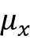

# 第四章：构建良好的训练数据集 - 数据预处理

数据的质量和包含的有用信息量是决定机器学习算法学习效果的关键因素。因此，在将数据提供给机器学习算法之前，确保我们对数据进行必要的检查和预处理是非常关键的。在本章中，我们将讨论关键的数据预处理技术，这些技术将帮助我们构建良好的机器学习模型。

本章中我们将讨论的主题包括：

+   从数据集中删除和填补缺失值

+   将分类数据准备好供机器学习算法使用

+   选择用于模型构建的相关特征

# 处理缺失数据

在真实应用中，由于各种原因，我们的训练样本可能缺少一个或多个值。数据收集过程中可能出现错误，某些测量可能不适用，或者在调查中可能简单地留空某些字段。我们通常在数据表中看到缺失值作为空格或占位符字符串，例如`NaN`（代表“不是一个数字”）或`NULL`（在关系数据库中常用于未知值的指示符）。不幸的是，大多数计算工具无法处理这些缺失值，或者如果我们简单地忽略它们，则会产生不可预测的结果。因此，在进一步分析之前，处理这些缺失值至关重要。

在本节中，我们将通过从数据集中删除条目或从其他训练样本和特征填补缺失值来解决缺失值的几种实用技术。

## 在表格数据中识别缺失值

在讨论处理缺失值的几种技术之前，让我们从一个**逗号分隔值**（**CSV**）文件创建一个简单的示例`DataFrame`，以更好地理解问题：

```py
>>> import pandas as pd
>>> from io import StringIO
>>> csv_data = \
... '''A,B,C,D
... 1.0,2.0,3.0,4.0
... 5.0,6.0,,8.0
... 10.0,11.0,12.0,'''
>>> # If you are using Python 2.7, you need
>>> # to convert the string to unicode:
>>> # csv_data = unicode(csv_data)
>>> df = pd.read_csv(StringIO(csv_data))
>>> df
        A        B        C        D
0     1.0      2.0      3.0      4.0
1     5.0      6.0      NaN      8.0
2    10.0     11.0     12.0      NaN 
```

使用前面的代码，通过`read_csv`函数将 CSV 格式的数据读入 pandas 的`DataFrame`，注意到两个缺失的单元格被替换为`NaN`。在上面的代码示例中，`StringIO`函数仅用于说明目的。它允许我们将分配给`csv_data`的字符串读入 pandas 的`DataFrame`，就像它是硬盘上常规 CSV 文件一样。

对于较大的`DataFrame`，手动查找缺失值可能会很繁琐；在这种情况下，我们可以使用`isnull`方法返回一个带有布尔值的`DataFrame`，指示单元格是否包含数值（`False`）或数据是否缺失（`True`）。然后，我们可以使用`sum`方法返回每列缺失值的数量如下：

```py
>>> df.isnull().sum()
A      0
B      0
C      1
D      1
dtype: int64 
```

这样，我们可以统计每列缺失值的数量；在接下来的小节中，我们将介绍不同的策略来处理这些缺失数据。

**使用 pandas 的 DataFrame 方便地处理数据**

尽管 scikit-learn 最初只用于处理 NumPy 数组，但有时使用 pandas 的 `DataFrame` 来预处理数据可能更方便。现在，大多数 scikit-learn 函数支持 `DataFrame` 对象作为输入，但由于 scikit-learn API 中 NumPy 数组处理更为成熟，建议在可能的情况下使用 NumPy 数组。请注意，在将其馈送到 scikit-learn 估算器之前，您可以通过 `values` 属性随时访问 `DataFrame` 的底层 NumPy 数组：

```py
>>> df.values
array([[  1.,   2.,   3.,   4.],
       [  5.,   6.,  nan,   8.],
       [ 10.,  11.,  12.,  nan]]) 
```

## 消除具有缺失值的训练样本或特征

处理缺失数据的最简单方法之一是完全删除数据集中对应的特征（列）或训练样本（行）；可以通过 `dropna` 方法轻松删除具有缺失值的行：

```py
>>> df.dropna(axis=0)
      A    B    C    D
0   1.0  2.0  3.0  4.0 
```

同样地，我们可以通过将 `axis` 参数设置为 `1` 来删除任何行中至少有一个 `NaN` 的列：

```py
>>> df.dropna(axis=1)
      A      B
0   1.0    2.0
1   5.0    6.0
2  10.0   11.0 
```

`dropna` 方法支持几个额外参数，这些参数可能非常方便：

```py
>>> # only drop rows where all columns are NaN
>>> # (returns the whole array here since we don't
>>> # have a row with all values NaN)
>>> df.dropna(how='all')
      A      B      C      D
0   1.0    2.0    3.0    4.0
1   5.0    6.0    NaN    8.0
2  10.0   11.0   12.0    NaN
>>> # drop rows that have fewer than 4 real values
>>> df.dropna(thresh=4)
      A      B      C      D
0   1.0    2.0    3.0    4.0
>>> # only drop rows where NaN appear in specific columns (here: 'C')
>>> df.dropna(subset=['C'])
      A      B      C      D
0   1.0    2.0    3.0    4.0
2  10.0   11.0   12.0    NaN 
```

尽管删除缺失数据似乎是一个方便的方法，但它也有一定的缺点；例如，我们可能会删除太多样本，从而使得可靠的分析变得不可能。或者，如果我们删除了太多特征列，那么我们将面临失去分类器需要用来区分类别的宝贵信息的风险。在下一节中，我们将看一下处理缺失值的最常用替代方法之一：插值技术。

## 填补缺失值

通常，删除训练样本或整个特征列根本不可行，因为我们可能会损失太多宝贵的数据。在这种情况下，我们可以使用不同的插值技术来估算数据集中其他训练样本的缺失值。其中最常见的插值技术之一是**均值插补**，我们只需用整个特征列的均值替换缺失值即可。通过使用 scikit-learn 中的 `SimpleImputer` 类，我们可以方便地实现这一点，如下所示的代码：

```py
>>> from sklearn.impute import SimpleImputer
>>> import numpy as np
>>> imr = SimpleImputer(missing_values=np.nan, strategy='mean')
>>> imr = imr.fit(df.values)
>>> imputed_data = imr.transform(df.values)
>>> imputed_data
array([[  1.,   2.,   3.,   4.],
       [  5.,   6.,  7.5,   8.],
       [ 10.,  11.,  12.,   6.]]) 
```

在这里，我们用对应的均值替换了每个 `NaN` 值，这些均值是单独计算得到的，针对每个特征列。`strategy` 参数的其他选项包括 `median` 或 `most_frequent`，后者用最常见的值替换缺失值。例如，这对于填充分类特征值非常有用，比如存储颜色名称编码的特征列，如红色、绿色和蓝色。我们将在本章后面遇到此类数据的示例。

另一种更方便的填补缺失值的方法是使用 pandas 的 `fillna` 方法，并提供一个填补方法作为参数。例如，使用 pandas，我们可以直接在 `DataFrame` 对象中实现相同的均值插补，如下命令所示：

```py
>>> df.fillna(df.mean()) 
```


图 4.1：用均值替换数据中的缺失值

**用于缺失数据的其他填补方法**

对于包括基于 k 最近邻方法的`KNNImputer`在内的其他填补技术，以通过最近邻来填补缺失特征，我们建议查阅 scikit-learn 填补文档 [`scikit-learn.org/stable/modules/impute.html`](https://scikit-learn.org/stable/modules/impute.html)。

## 理解 scikit-learn 估计器 API

在前一节中，我们使用了 scikit-learn 中的`SimpleImputer`类来填补数据集中的缺失值。`SimpleImputer`类是 scikit-learn 中所谓的**转换器**API 的一部分，用于实现与数据转换相关的 Python 类。请注意，scikit-learn 转换器 API 与用于自然语言处理的 transformer 架构不要混淆，我们将在*第十六章*，*使用注意力机制改进自然语言处理的 Transformers*中更详细地讨论后者。这些估计器的两个关键方法是`fit`和`transform`。`fit`方法用于从训练数据中学习参数，`transform`方法使用这些参数来转换数据。任何要转换的数据数组都需要与用于拟合模型的数据数组具有相同数量的特征。

*图 4.2*展示了一个在训练数据上拟合的 scikit-learn 转换器实例如何用于转换训练数据集以及新的测试数据集：


图 4.2：使用 scikit-learn API 进行数据转换

我们在*第三章*，*使用 Scikit-Learn 进行机器学习分类器导览*中使用的分类器属于 scikit-learn 中所谓的**估计器**，其 API 在概念上与 scikit-learn 转换器 API 非常相似。估计器具有一个`predict`方法，但也可以有一个`transform`方法，正如你将在本章后面看到的。正如你可能记得的那样，我们还使用`fit`方法来学习这些估计器进行分类时的模型参数。然而，在监督学习任务中，我们额外提供类标签来拟合模型，然后可以通过`predict`方法对新的未标记数据示例进行预测，如*图 4.3*所示：


图 4.3：使用 scikit-learn API 进行分类器等预测模型的使用

# 处理分类数据

到目前为止，我们只处理了数值数据。然而，现实世界的数据集通常包含一个或多个分类特征列。在本节中，我们将利用简单而有效的示例来看如何在数值计算库中处理这种类型的数据。

当我们谈论分类数据时，我们必须进一步区分**序数**和**名义**特征。序数特征可以理解为可以排序或有序的分类值。例如，T 恤尺码就是一个序数特征，因为我们可以定义一个顺序：*XL* > *L* > *M*。相反，名义特征则不涉及任何顺序；继续上面的例子，我们可以认为 T 恤颜色是一个名义特征，因为通常没有意义说，例如，红色比蓝色大。

## 使用 pandas 进行分类数据编码

在我们探索处理这种分类数据的不同技术之前，让我们创建一个新的`DataFrame`来说明问题：

```py
>>> import pandas as pd
>>> df = pd.DataFrame([
...            ['green', 'M', 10.1, 'class2'],
...            ['red', 'L', 13.5, 'class1'],
...            ['blue', 'XL', 15.3, 'class2']])
>>> df.columns = ['color', 'size', 'price', 'classlabel']
>>> df
    color  size  price  classlabel
0   green     M   10.1      class2
1     red     L   13.5      class1
2    blue    XL   15.3      class2 
```

正如我们在前面的输出中所看到的，新创建的`DataFrame`包含一个名义特征（`color`）、一个序数特征（`size`）和一个数值特征（`price`）列。类标签（假设我们为监督学习任务创建了一个数据集）存储在最后一列。我们在本书中讨论的分类学习算法不使用类标签中的序数信息。

## 映射序数特征

为了确保学习算法正确解释序数特征，我们需要将分类字符串值转换为整数。不幸的是，没有方便的函数可以自动推导我们的`size`特征标签的正确顺序，因此我们必须手动定义映射。在下面的简单示例中，假设我们知道特征之间的数值差异，例如，*XL* = *L* + 1 = *M* + 2：

```py
>>> size_mapping = {'XL': 3,
...                 'L': 2,
...                 'M': 1}
>>> df['size'] = df['size'].map(size_mapping)
>>> df
    color  size  price  classlabel
0   green     1   10.1      class2
1     red     2   13.5      class1
2    blue     3   15.3      class2 
```

如果我们希望在以后的阶段将整数值转换回原始字符串表示，我们可以简单地定义一个反向映射字典，`inv_size_mapping = {v: k for k, v in size_mapping.items()}`，然后可以通过 pandas 的`map`方法在转换后的特征列上使用它，类似于我们之前使用的`size_mapping`字典。我们可以这样使用它：

```py
>>> inv_size_mapping = {v: k for k, v in size_mapping.items()}
>>> df['size'].map(inv_size_mapping)
0   M
1   L
2   XL
Name: size, dtype: object 
```

## 类标签的编码

许多机器学习库要求类标签被编码为整数值。尽管 scikit-learn 中大多数分类器的内部会将类标签转换为整数，但通常最好将类标签提供为整数数组以避免技术性故障。为了编码类标签，我们可以使用类似于前面讨论的序数特征映射的方法。我们需要记住类标签**不是**序数，并且分配给特定字符串标签的整数数值无关紧要。因此，我们可以简单地枚举类标签，从`0`开始：

```py
>>> import numpy as np
>>> class_mapping = {label: idx for idx, label in
...                  enumerate(np.unique(df['classlabel']))}
>>> class_mapping
{'class1': 0, 'class2': 1} 
```

接下来，我们可以使用映射字典将类标签转换为整数：

```py
>>> df['classlabel'] = df['classlabel'].map(class_mapping)
>>> df
    color  size  price  classlabel
0   green     1   10.1           1
1     red     2   13.5           0
2    blue     3   15.3           1 
```

我们可以将映射字典中的键值对反转，以便将转换后的类标签映射回原始字符串表示如下：

```py
>>> inv_class_mapping = {v: k for k, v in class_mapping.items()}
>>> df['classlabel'] = df['classlabel'].map(inv_class_mapping)
>>> df
    color  size  price  classlabel
0   green     1   10.1      class2
1     red     2   13.5      class1
2    blue     3   15.3      class2 
```

或者，scikit-learn 中直接实现的便捷 `LabelEncoder` 类也可以达到这个目的：

```py
>>> from sklearn.preprocessing import LabelEncoder
>>> class_le = LabelEncoder()
>>> y = class_le.fit_transform(df['classlabel'].values)
>>> y
array([1, 0, 1]) 
```

注意，`fit_transform` 方法只是调用 `fit` 和 `transform` 的捷径，我们可以使用 `inverse_transform` 方法将整数类标签转换回它们原始的字符串表示：

```py
>>> class_le.inverse_transform(y)
array(['class2', 'class1', 'class2'], dtype=object) 
```

## 对名义特征执行独热编码

在前述 *映射序数特征* 部分，我们使用了一个简单的字典映射方法来将序数 `size` 特征转换为整数。由于 scikit-learn 的分类估计器将类标签视为不含任何顺序的分类数据（名义数据），我们使用了便捷的 `LabelEncoder` 来将字符串标签编码为整数。我们可以使用类似的方法来转换数据集的名义 `color` 列，如下所示：

```py
>>> X = df[['color', 'size', 'price']].values
>>> color_le = LabelEncoder()
>>> X[:, 0] = color_le.fit_transform(X[:, 0])
>>> X
array([[1, 1, 10.1],
       [2, 2, 13.5],
       [0, 3, 15.3]], dtype=object) 
```

执行上述代码后，NumPy 数组 `X` 的第一列现在包含新的 `color` 值，其编码如下：

+   `blue = 0`

+   `green = 1`

+   `red = 2`

如果我们在此时停止并将数组馈送给分类器，我们将犯处理分类数据时最常见的错误之一。你能发现问题吗？尽管颜色值没有特定的顺序，但常见的分类模型（如前几章介绍的模型）现在会假设 `green` 大于 `blue`，`red` 大于 `green`。虽然这种假设是不正确的，分类器仍然可能产生有用的结果。然而，这些结果将不会是最优的。

对于这个问题的一个常见解决方案是使用一种称为 **独热编码** 的技术。这种方法的理念是为名义特征列中的每个唯一值创建一个新的虚拟特征。在这里，我们将把 `color` 特征转换为三个新特征：`blue`、`green` 和 `red`。二进制值可以用来表示示例的特定 `color`；例如，一个 `blue` 示例可以被编码为 `blue=1`、`green=0`、`red=0`。要执行这种转换，我们可以使用 scikit-learn 的 `preprocessing` 模块中实现的 `OneHotEncoder`：

```py
>>> from sklearn.preprocessing import OneHotEncoder
>>> X = df[['color', 'size', 'price']].values
>>> color_ohe = OneHotEncoder()
>>> color_ohe.fit_transform(X[:, 0].reshape(-1, 1)).toarray()
    array([[0., 1., 0.],
           [0., 0., 1.],
           [1., 0., 0.]]) 
```

注意我们仅对单列 `(X[:, 0].reshape(-1, 1))` 应用了 `OneHotEncoder`，以避免修改数组中的其他两列。如果我们想要选择性地转换多特征数组中的列，我们可以使用 `ColumnTransformer`，它接受以下形式的 `(name, transformer, column(s))` 列表：

```py
>>> from sklearn.compose import ColumnTransformer
>>> X = df[['color', 'size', 'price']].values
>>> c_transf = ColumnTransformer([
...     ('onehot', OneHotEncoder(), [0]),
...     ('nothing', 'passthrough', [1, 2])
... ])
>>> c_transf.fit_transform(X).astype(float)
    array([[0.0, 1.0, 0.0, 1, 10.1],
           [0.0, 0.0, 1.0, 2, 13.5],
           [1.0, 0.0, 0.0, 3, 15.3]]) 
```

在上面的代码示例中，我们指定只想修改第一列，并通过 `'passthrough'` 参数保持其他两列不变。

通过 pandas 中实现的 `get_dummies` 方法更方便地创建这些虚拟特征的方法是应用于 `DataFrame`，`get_dummies` 方法将仅转换字符串列，而保持所有其他列不变：

```py
>>> pd.get_dummies(df[['price', 'color', 'size']])
    price  size  color_blue  color_green  color_red
0    10.1     1           0            1          0
1    13.5     2           0            0          1
2    15.3     3           1            0          0 
```

当我们使用独热编码数据集时，我们必须记住这会引入多重共线性，这对某些方法（例如需要矩阵求逆的方法）可能会有问题。如果特征高度相关，矩阵计算求逆将变得计算困难，这可能会导致数值不稳定的估计。为了减少变量之间的相关性，我们可以简单地从独热编码数组中删除一个特征列。注意，通过删除特征列，我们不会丢失任何重要信息；例如，如果我们删除列`color_blue`，仍然保留了特征信息，因为如果我们观察到`color_green=0`和`color_red=0`，则意味着观察必须是`blue`。

如果我们使用`get_dummies`函数，可以通过将`drop_first`参数设置为`True`来删除第一列，如以下代码示例所示：

```py
>>> pd.get_dummies(df[['price', 'color', 'size']],
...                drop_first=True)
    price  size  color_green  color_red
0    10.1     1            1          0
1    13.5     2            0          1
2    15.3     3            0          0 
```

为了通过`OneHotEncoder`删除冗余列，我们需要设置`drop='first'`并将`categories='auto'`设置如下：

```py
>>> color_ohe = OneHotEncoder(categories='auto', drop='first')
>>> c_transf = ColumnTransformer([
...            ('onehot', color_ohe, [0]),
...            ('nothing', 'passthrough', [1, 2])
... ])
>>> c_transf.fit_transform(X).astype(float)
array([[  1\. ,  0\. ,  1\. ,  10.1],
       [  0\. ,  1\. ,  2\. ,  13.5],
       [  0\. ,  0\. ,  3\. ,  15.3]]) 
```

**名义数据的附加编码方案**

虽然独热编码是编码无序分类变量的最常见方式，但也存在几种替代方法。在处理具有高基数（大量唯一类别标签）的分类特征时，某些技术可能会很有用。例如：

+   二进制编码，产生多个类似于独热编码的二进制特征，但需要较少的特征列，即*log2*而不是*K* – 1，其中*K*是唯一类别的数量。在二进制编码中，数字首先转换为二进制表示，然后每个二进制数位置将形成一个新的特征列。

+   计数或频率编码，用训练集中每个类别出现的次数或频率替换每个类别的标签。

这些方法以及额外的分类编码方案都可以通过与 scikit-learn 兼容的`category_encoders`库来实现：[`contrib.scikit-learn.org/category_encoders/`](https://contrib.scikit-learn.org/category_encoders/)。

虽然这些方法在模型性能方面并不能保证优于独热编码，但我们可以考虑选择分类编码方案作为改进模型性能的额外“超参数”。

### 可选：编码有序特征

如果我们不确定有序特征类别之间的数值差异，或者两个有序值之间的差异未定义，我们也可以使用阈值编码将其编码为 0/1 值。例如，我们可以将具有`M`、`L`和`XL`值的特征`size`拆分为两个新特征，`x > M`和`x > L`。让我们考虑原始`DataFrame`：

```py
>>> df = pd.DataFrame([['green', 'M', 10.1,
...                     'class2'],
...                    ['red', 'L', 13.5,
...                     'class1'],
...                    ['blue', 'XL', 15.3,
...                     'class2']])
>>> df.columns = ['color', 'size', 'price',
...               'classlabel']
>>> df 
```

我们可以使用 pandas 的`DataFrame`的`apply`方法，通过写入自定义 lambda 表达式来使用值阈值方法对这些变量进行编码：

```py
>>> df['x > M'] = df['size'].apply(
...     lambda x: 1 if x in {'L', 'XL'} else 0)
>>> df['x > L'] = df['size'].apply(
...     lambda x: 1 if x == 'XL' else 0)
>>> del df['size']
>>> df 
```

# 将数据集分成单独的训练集和测试集。

我们在*第一章*“使计算机能够从数据中学习”和*第三章*“使用 Scikit-Learn 进行机器学习分类器之旅”中简要介绍了将数据集划分为用于训练和测试的单独数据集的概念。请记住，在测试集中将预测与真实标签进行比较，可以理解为在我们将模型放入真实世界之前对其进行无偏差的性能评估。在本节中，我们将准备一个新的数据集，即**Wine**数据集。在我们预处理数据集之后，我们将探讨不同的特征选择技术以减少数据集的维度。

Wine 数据集是另一个开源数据集，可以从 UCI 机器学习库获取（[`archive.ics.uci.edu/ml/datasets/Wine`](https://archive.ics.uci.edu/ml/datasets/Wine)）；它包含了 178 个葡萄酒示例，其中 13 个特征描述了它们不同的化学特性。

**获取 Wine 数据集**

您可以在本书的代码包中找到 Wine 数据集的副本（以及本书中使用的所有其他数据集），如果您在离线工作或者 UCI 服务器上的数据集临时不可用时，您可以使用该数据集。例如，要从本地目录加载 Wine 数据集，可以将此行替换为

```py
df = pd.read_csv(
    'https://archive.ics.uci.edu/ml/'
    'machine-learning-databases/wine/wine.data',
    header=None
) 
```

与以下一个：

```py
df = pd.read_csv(
    'your/local/path/to/wine.data', header=None
) 
```

使用 pandas 库，我们将直接从 UCI 机器学习库中读取开源的 Wine 数据集：

```py
>>> df_wine = pd.read_csv('https://archive.ics.uci.edu/'
...                       'ml/machine-learning-databases/'
...                       'wine/wine.data', header=None)
>>> df_wine.columns = ['Class label', 'Alcohol',
...                    'Malic acid', 'Ash',
...                    'Alcalinity of ash', 'Magnesium',
...                    'Total phenols', 'Flavanoids',
...                    'Nonflavanoid phenols',
...                    'Proanthocyanins',
...                    'Color intensity', 'Hue',
...                    'OD280/OD315 of diluted wines',
...                    'Proline']
>>> print('Class labels', np.unique(df_wine['Class label']))
Class labels [1 2 3]
>>> df_wine.head() 
```

Wine 数据集中的 13 个不同特征描述了 178 个葡萄酒示例的化学特性，详见以下表：


图 4.4：Wine 数据集的样本

这些示例属于三个不同的类别之一，`1`，`2`和`3`，这些类别指的是在同一意大利地区种植的三种不同葡萄类型，但来自不同的葡萄酒品种，如数据集摘要所述（[`archive.ics.uci.edu/ml/machine-learning-databases/wine/wine.names`](https://archive.ics.uci.edu/ml/machine-learning-databases/wine/wine.names))。

将这个数据集随机划分为独立的测试和训练数据集的便捷方法是使用 scikit-learn 的`model_selection`子模块中的`train_test_split`函数：

```py
>>> from sklearn.model_selection import train_test_split
>>> X, y = df_wine.iloc[:, 1:].values, df_wine.iloc[:, 0].values
>>> X_train, X_test, y_train, y_test =\
...     train_test_split(X, y,
...                      test_size=0.3,
...                      random_state=0,
...                      stratify=y) 
```

首先，我们将特征列 1-13 的 NumPy 数组表示分配给变量`X`，并将第一列的类标签分配给变量`y`。然后，我们使用`train_test_split`函数将`X`和`y`随机分割成独立的训练和测试数据集。

通过设置`test_size=0.3`，我们将 30%的葡萄酒样本分配给`X_test`和`y_test`，剩余的 70%样本分别分配给`X_train`和`y_train`。将类标签数组`y`作为参数传递给`stratify`，确保训练和测试数据集具有与原始数据集相同的类比例。

-   **选择合适的比例将数据集划分为训练集和测试集**

如果我们将数据集划分为训练集和测试集，必须记住我们正在保留学习算法可能从中受益的宝贵信息。因此，我们不希望将太多信息分配给测试集。然而，测试集越小，对泛化误差的估计就越不准确。将数据集划分为训练集和测试集就是要在这种权衡中找到平衡。在实践中，最常用的划分比例是 60:40、70:30 或 80:20，这取决于初始数据集的大小。然而，对于大型数据集，90:10 或 99:1 的划分也是常见且合适的。例如，如果数据集包含超过 10 万个训练样本，则仅保留 1 万个样本进行测试可能足以得到泛化性能的良好估计。更多信息和插图可以在我的文章《机器学习中的模型评估、模型选择和算法选择》第一章找到，该文章可以在[`arxiv.org/pdf/1811.12808.pdf`](https://arxiv.org/pdf/1811.12808.pdf)免费获取。此外，我们将在*第六章* *学习模型评估和超参数调优的最佳实践*中重新讨论模型评估的主题并进行更详细的讨论。

此外，与其在模型训练和评估后丢弃分配的测试数据，重新在整个数据集上训练分类器是一种常见的做法，因为这可以提高模型的预测性能。虽然这种方法通常是推荐的，但如果数据集很小且测试数据集包含异常值，例如，它可能导致更差的泛化性能。此外，在整个数据集上重新拟合模型之后，我们将没有任何独立的数据来评估其性能。

# 将特征调整到相同的尺度

-   **特征缩放** 是我们预处理流程中一个关键的步骤，容易被忽视。**决策树** 和 **随机森林** 是为数不多的两种机器学习算法，我们不需要担心特征缩放。这些算法是尺度不变的。然而，大多数机器学习和优化算法如果特征处于相同的尺度上表现更好，正如我们在*第二章* *用于分类的简单机器学习算法的训练*中实现 **梯度下降优化** 算法时所看到的那样。

特征缩放的重要性可以通过一个简单的例子来说明。假设我们有两个特征，其中一个特征在 1 到 10 的范围内测量，而第二个特征在 1 到 100,000 的范围内测量。

当我们考虑 Adaline 中的平方误差函数（来自*第二章*）时，可以说该算法主要忙于根据第二特征中较大的错误来优化权重。另一个例子是使用欧氏距离的**k 最近邻**（**KNN**）算法：计算的示例间距离将由第二特征轴主导。

现在，有两种常见方法将不同的特征调整到相同的比例：**归一化**和**标准化**。这些术语在不同领域中通常使用得相当松散，其含义必须从上下文中推断出来。最常见的情况是，归一化是指将特征重新缩放到[0, 1]的范围，这是**最小-最大缩放**的一种特殊情况。要将我们的数据归一化，我们可以简单地对每个特征列应用最小-最大缩放，其中示例的新值，，可以计算如下：


这里，*x*^(^i^) 是一个特定的示例，*x*[min] 是特征列中的最小值，*x*[max] 是最大值。

最小-最大缩放过程在 scikit-learn 中实现，可以如下使用：

```py
>>> from sklearn.preprocessing import MinMaxScaler
>>> mms = MinMaxScaler()
>>> X_train_norm = mms.fit_transform(X_train)
>>> X_test_norm = mms.transform(X_test) 
```

虽然通过最小-最大缩放进行标准化是一种常用的技术，当我们需要在有界区间内的值时很有用，但对于许多机器学习算法，特别是像梯度下降这样的优化算法，标准化可能更为实用。原因是许多线性模型，例如*第三章*中的逻辑回归和 SVM，将权重初始化为 0 或接近 0 的小随机值。使用标准化，我们将特征列居中于均值 0 且标准差为 1，使得特征列具有与标准正态分布（零均值和单位方差）相同的参数，这样更容易学习权重。但是，我们应强调，标准化不会改变分布的形状，也不会将非正态分布的数据转换为正态分布的数据。除了缩放数据以使其具有零均值和单位方差外，标准化还保留有关异常值的有用信息，并使算法对其不敏感，而最小-最大缩放将数据缩放到一定范围的值。

标准化过程可以用以下方程表示：


这里， 是特定特征列的样本均值， 是相应的标准差。

以下表格说明了两种常用的特征缩放技术——标准化和归一化——在一个由数字 0 到 5 组成的简单示例数据集上的差异：

| **输入** | **标准化** | **最小-最大归一化** |
| --- | --- | --- |
| 0.0 | -1.46385 | 0.0 |
| 1.0 | -0.87831 | 0.2 |
| 2.0 | -0.29277 | 0.4 |
| 3.0 | 0.29277 | 0.6 |
| 4.0 | 0.87831 | 0.8 |
| 5.0 | 1.46385 | 1.0 |

表 4.1：标准化和最小-最大归一化的比较

您可以通过执行以下代码示例手动执行表中显示的标准化和归一化：

```py
>>> ex = np.array([0, 1, 2, 3, 4, 5])
>>> print('standardized:', (ex - ex.mean()) / ex.std())
standardized: [-1.46385011  -0.87831007  -0.29277002  0.29277002
0.87831007  1.46385011]
>>> print('normalized:', (ex - ex.min()) / (ex.max() - ex.min()))
normalized: [ 0\.  0.2  0.4  0.6  0.8  1\. ] 
```

与`MinMaxScaler`类似，scikit-learn 还实现了一个用于标准化的类：

```py
>>> from sklearn.preprocessing import StandardScaler
>>> stdsc = StandardScaler()
>>> X_train_std = stdsc.fit_transform(X_train)
>>> X_test_std = stdsc.transform(X_test) 
```

再次强调，我们只需在训练数据上一次性拟合`StandardScaler`类，然后使用这些参数来转换测试数据集或任何新的数据点。

关于特征缩放的其他更高级的方法可从 scikit-learn 中获取，例如`RobustScaler`。如果我们处理的数据集很小且包含许多异常值，`RobustScaler`尤为有用和推荐。同样，如果应用于该数据集的机器学习算法容易**过拟合**，`RobustScaler`是一个不错的选择。`RobustScaler`独立于每个特征列操作，去除中位数并根据数据集的第 1 和第 3 四分位数（即 25th 和 75th 分位数）来缩放数据集，使得更极端的值和异常值变得不那么显著。有兴趣的读者可以在官方 scikit-learn 文档中找到关于`RobustScaler`的更多信息，网址为[`scikit-learn.org/stable/modules/generated/sklearn.preprocessing.RobustScaler.html`](https://scikit-learn.org/stable/modules/generated/sklearn.preprocessing.RobustScaler.html)。

# 选择有意义的特征

如果我们注意到一个模型在训练数据集上的表现远远优于在测试数据集上的表现，这一观察结果是过拟合的一个强烈指标。正如我们在*第三章*中讨论的那样，使用 Scikit-Learn 进行机器学习分类器的巡回时，过拟合意味着模型过于密切地拟合了训练数据集中的特定观测值，但在新数据上泛化能力不强；我们称这种模型具有**高方差**。过拟合的原因是我们的模型对给定的训练数据过于复杂。减少泛化误差的常见解决方案如下：

+   收集更多的训练数据

+   引入正则化通过复杂性来惩罚

+   选择一个具有较少参数的简单模型

+   减少数据的维度

增加更多的训练数据通常是不适用的。在*第六章*，*学习模型评估和超参数调优的最佳实践*中，我们将学习一种有用的技术来检查是否增加更多的训练数据是有益的。在接下来的几节中，我们将探讨通过正则化和特征选择来减少过拟合的常见方法，从而通过需要较少参数来拟合数据的简化模型。然后，在*第五章*，*通过降维压缩数据*，我们将查看其他的特征提取技术。

## L1 和 L2 正则化作为抵抗模型复杂性的惩罚项

你还记得*第三章*讲到的**L2 正则化**是通过对大的个体权重进行惩罚来减少模型复杂度的一种方法。我们定义了权重向量**w**的平方 L2 范数如下：


另一种减少模型复杂性的方法是相关的**L1 正则化**：


在这里，我们简单地用权重的绝对值之和替换了权重的平方。与 L2 正则化相比，L1 正则化通常会产生稀疏的特征向量，大多数特征权重将为零。如果我们有一个高维数据集，有许多无关的特征，尤其是在训练样本比无关维度更多的情况下，稀疏性在实践中可能会很有用。从这个意义上讲，L1 正则化可以被理解为一种特征选择技术。

## L2 正则化的几何解释

正如前一节提到的，L2 正则化向损失函数添加一个惩罚项，使得相比使用非正则化损失函数训练的模型具有较少极端的权重值。

为了更好地理解 L1 正则化如何促进稀疏性，让我们退一步，从正则化的几何解释开始。我们来绘制两个权重系数*w*[1]和*w*[2]的凸损失函数等高线。

在这里，我们将考虑**均方误差**（**MSE**）损失函数，我们在*第二章*中用于 Adaline 的，它计算真实和预测类标签*y*和之间的平方距离，平均值为所有*N*个训练集示例。由于 MSE 是球形的，比逻辑回归的损失函数更容易绘制；然而，相同的概念适用。记住，我们的目标是找到最小化训练数据损失函数的权重系数组合，如*图 4.5*所示（椭圆中心的点）：


图 4.5：最小化均方误差损失函数

我们可以将正则化视为向损失函数添加惩罚项以鼓励较小的权重；换句话说，我们惩罚较大的权重。因此，通过增加正则化参数来增强正则化强度，，我们将权重收缩到零附近，并减少模型对训练数据的依赖。让我们在以下图中以 L2 惩罚项说明这个概念：


图 4.6：将 L2 正则化应用于损失函数

二次 L2 正则化项由阴影球表示。在这里，我们的权重系数不能超出正则化预算——权重系数的组合不能超出阴影区域。另一方面，我们仍然希望最小化损失函数。在惩罚约束下，我们最好的选择是选择 L2 球与未惩罚损失函数轮廓相交的点。正则化参数值越大，惩罚损失增长速度越快，导致 L2 球越窄。例如，如果我们将正则化参数增加至无穷大，权重系数将有效变为零，即 L2 球的中心。总结这个示例的主要信息，我们的目标是最小化未惩罚损失加上惩罚项的总和，这可以理解为添加偏差并偏好简化模型以减少在缺乏足够训练数据来拟合模型时的方差。

## L1 正则化下的稀疏解决方案

现在，让我们讨论 L1 正则化和稀疏性。L1 正则化背后的主要概念与我们在前一节中讨论的相似。然而，由于 L1 惩罚是绝对权重系数的总和（请记住 L2 项是二次的），我们可以将其表示为钻石形状的预算，如*图 4.7*所示：


图 4.7：将 L1 正则化应用于损失函数

在上述图中，我们可以看到损失函数的轮廓与 L1 钻石在*w*[1] = 0 处接触。由于 L1 正则化系统的轮廓尖锐，最优解——即损失函数的椭圆和 L1 钻石边界的交点——更可能位于轴上，这鼓励稀疏性。

**L1 正则化和稀疏性**

L1 正则化如何导致稀疏解的数学细节超出了本书的范围。如果您有兴趣，可以在*Trevor Hastie, Robert Tibshirani*和*Jerome Friedman, Springer Science+Business Media, 2009*的*第 3.4 节*中找到关于 L2 与 L1 正则化的优秀解释。

对于 scikit-learn 中支持 L1 正则化的正则化模型，我们只需将`penalty`参数设置为`'l1'`即可获得稀疏解：

```py
>>> from sklearn.linear_model import LogisticRegression
>>> LogisticRegression(penalty='l1',
...                    solver='liblinear',
...                    multi_class='ovr') 
```

请注意，由于'lbfgs'当前不支持 L1 正则化损失优化，我们还需要选择不同的优化算法（例如，`solver='liblinear'`）。应用于标准化的 Wine 数据，L1 正则化逻辑回归将产生以下稀疏解：

```py
>>> lr = LogisticRegression(penalty='l1',
...                         C=1.0,
...                         solver='liblinear',
...                         multi_class='ovr')
>>> # Note that C=1.0 is the default. You can increase
>>> # or decrease it to make the regularization effect
>>> # stronger or weaker, respectively.
>>> lr.fit(X_train_std, y_train)
>>> print('Training accuracy:', lr.score(X_train_std, y_train))
Training accuracy: 1.0
>>> print('Test accuracy:', lr.score(X_test_std, y_test))
Test accuracy: 1.0 
```

训练和测试的准确率（均为 100%）表明我们的模型在两个数据集上表现完美。当我们通过`lr.intercept_`属性访问截距项时，可以看到数组返回了三个值：

```py
>>> lr.intercept_
    array([-1.26317363, -1.21537306, -2.37111954]) 
```

由于我们通过**一对多**（**OvR**）方法在多类数据集上拟合了`LogisticRegression`对象，第一个截距属于拟合类别 1 与类别 2 和 3 的模型，第二个值是拟合类别 2 与类别 1 和 3 的模型的截距，第三个值是拟合类别 3 与类别 1 和 2 的模型的截距：

```py
>>> lr.coef_
array([[ 1.24647953,  0.18050894,  0.74540443, -1.16301108,
         0\.        ,0\.        ,  1.16243821,  0\.        ,
         0\.        ,  0\.        , 0\.        ,  0.55620267,
         2.50890638],
       [-1.53919461, -0.38562247, -0.99565934,  0.36390047,
        -0.05892612, 0\.        ,  0.66710883,  0\.        ,
         0\.        , -1.9318798 , 1.23775092,  0\.        ,
        -2.23280039],
       [ 0.13557571,  0.16848763,  0.35710712,  0\.        ,
         0\.        , 0\.        , -2.43804744,  0\.        ,
         0\.        ,  1.56388787, -0.81881015, -0.49217022,
         0\.        ]]) 
```

通过`lr.coef_`属性访问的权重数组包含三行权重系数，即每个类别的一个权重向量。每行包含 13 个权重，其中每个权重都与 13 维 Wine 数据集中的相应特征相乘，以计算净输入：


**访问 scikit-learn 估计器的偏置单元和权重参数**

在 scikit-learn 中，`intercept_`对应于偏置单元，`coef_`对应于值*w*[j]。

由于 L1 正则化的结果，正如前面提到的，它作为特征选择的一种方法，我们刚刚训练了一个在该数据集中对潜在的不相关特征具有鲁棒性的模型。严格来说，尽管如此，前面例子中的权重向量未必是稀疏的，因为它们包含的非零条目比零条目多。然而，我们可以通过进一步增加正则化强度（即选择较低的`C`参数值）来强制稀疏化（增加零条目）。

在本章关于正则化的最后一个例子中，我们将改变正则化强度并绘制正则化路径，即不同正则化强度下不同特征的权重系数：

```py
>>> import matplotlib.pyplot as plt
>>> fig = plt.figure()
>>> ax = plt.subplot(111)
>>> colors = ['blue', 'green', 'red', 'cyan',
...           'magenta', 'yellow', 'black',
...           'pink', 'lightgreen', 'lightblue',
...           'gray', 'indigo', 'orange']
>>> weights, params = [], []
>>> for c in np.arange(-4., 6.):
...     lr = LogisticRegression(penalty='l1', C=10.**c,
...                             solver='liblinear',
...                             multi_class='ovr', random_state=0)
...     lr.fit(X_train_std, y_train)
...     weights.append(lr.coef_[1])
...     params.append(10**c)
>>> weights = np.array(weights)
>>> for column, color in zip(range(weights.shape[1]), colors):
...     plt.plot(params, weights[:, column],
...              label=df_wine.columns[column + 1],
...              color=color)
>>> plt.axhline(0, color='black', linestyle='--', linewidth=3)
>>> plt.xlim([10**(-5), 10**5])
>>> plt.ylabel('Weight coefficient')
>>> plt.xlabel('C (inverse regularization strength)')
>>> plt.xscale('log')
>>> plt.legend(loc='upper left')
>>> ax.legend(loc='upper center',
...           bbox_to_anchor=(1.38, 1.03),
...           ncol=1, fancybox=True)
>>> plt.show() 
```

绘制的结果图为我们提供了关于 L1 正则化行为的进一步见解。正如我们所见，如果我们使用强正则化参数（*C* < 0.01），所有特征权重将变为零；其中*C*是正则化参数的倒数，：


图 4.8：正则化强度超参数 C 值的影响

## 顺序特征选择算法

减少模型复杂性和避免过拟合的另一种方法是通过特征选择进行**降维**，特别适用于未正则化的模型。主要有两类降维技术：**特征选择**和**特征提取**。通过特征选择，我们*选择*原始特征的一个子集，而在特征提取中，我们*从*特征集中*提取*信息以构建一个新的特征子空间。

在本节中，我们将介绍一类经典的特征选择算法。在下一章，即*第五章*，*通过降维来压缩数据*，我们将学习不同的特征提取技术，以将数据集压缩到一个更低维度的特征子空间上。

顺序特征选择算法是一类贪婪搜索算法，用于将初始*d*维特征空间减少到一个*k*维特征子空间，其中*k*<*d*。特征选择算法的动机是自动选择与问题最相关的特征子集，以提高计算效率，或通过移除无关特征或噪声来减少模型的泛化误差，这对于不支持正则化的算法可能非常有用。

经典的顺序特征选择算法是**顺序向后选择**（**SBS**），其旨在减少初始特征子空间的维数，同时最小化分类器性能下降，以提高计算效率。在某些情况下，如果模型存在过拟合问题，SBS 甚至可以改善模型的预测能力。

**贪婪搜索算法**

贪婪算法在组合搜索问题的每个阶段都会做出局部最优选择，通常会得到问题的次优解，与穷举搜索算法相比，后者会评估所有可能的组合并保证找到最优解。然而，在实践中，穷举搜索通常计算量过大，而贪婪算法可以提供更简单、计算更高效的解决方案。

SBS 算法的思想非常简单：顺序地从完整特征子集中移除特征，直到新的特征子空间包含所需数量的特征为止。为了确定每个阶段要移除哪个特征，我们需要定义要最小化的准则函数*J*。

由准则函数计算的准则可以简单地是分类器在移除特定特征之前和之后性能差异。然后，在每个阶段，我们可以简单地定义要移除的特征为最大化此准则的特征；或者更简单地说，在每个阶段，我们消除导致去除后性能损失最小的特征。基于前述对 SBS 的定义，我们可以用四个简单步骤概述算法：

1.  使用*k* = *d*初始化算法，其中*d*是完整特征空间**X**[d]的维数。

1.  确定最大化准则的特征**x**^–，其中**x**^– = argmax *J*(**X**[k] – **x**)，其中 。

1.  从特征集中移除特征**x**^–：**X**[k][–1] = **X**[k] – **x**^–；*k* = *k* – 1。

1.  如果*k*等于所需特征的数量，则终止；否则，转到*步骤 2*。

    **关于顺序特征算法的资源**

    在*大规模特征选择技术比较研究*中，你可以找到对几种顺序特征算法的详细评估，作者是*F. Ferri*、*P. Pudil*、*M. Hatef*和*J. Kittler*，页面 403-413，1994 年。

为了练习我们的编码技能和实现我们自己的算法的能力，让我们从头开始用 Python 实现它：

```py
from sklearn.base import clone
from itertools import combinations
import numpy as np
from sklearn.metrics import accuracy_score
from sklearn.model_selection import train_test_split
class SBS:
    def __init__(self, estimator, k_features,
                 scoring=accuracy_score,
                 test_size=0.25, random_state=1):
        self.scoring = scoring
        self.estimator = clone(estimator)
        self.k_features = k_features
        self.test_size = test_size
        self.random_state = random_state
    def fit(self, X, y):
        X_train, X_test, y_train, y_test = \
            train_test_split(X, y, test_size=self.test_size,
                             random_state=self.random_state)

        dim = X_train.shape[1]
        self.indices_ = tuple(range(dim))
        self.subsets_ = [self.indices_]
        score = self._calc_score(X_train, y_train,
                                 X_test, y_test, self.indices_)
        self.scores_ = [score]
        while dim > self.k_features:
            scores = []
            subsets = []

            for p in combinations(self.indices_, r=dim - 1):
                score = self._calc_score(X_train, y_train,
                                         X_test, y_test, p)
                scores.append(score)
                subsets.append(p)

            best = np.argmax(scores)
            self.indices_ = subsets[best]
            self.subsets_.append(self.indices_)
            dim -= 1

            self.scores_.append(scores[best])
        self.k_score_ = self.scores_[-1]

        return self

    def transform(self, X):
        return X[:, self.indices_]

    def _calc_score(self, X_train, y_train, X_test, y_test, indices):
        self.estimator.fit(X_train[:, indices], y_train)
        y_pred = self.estimator.predict(X_test[:, indices])
        score = self.scoring(y_test, y_pred)
        return score 
```

在前述实现中，我们定义了`k_features`参数，以指定我们希望返回的特征数。默认情况下，我们使用 scikit-learn 中的`accuracy_score`来评估模型（分类器的估计器）在特征子集上的性能。

在`fit`方法的`while`循环内，通过`itertools.combination`函数创建的特征子集将被评估和减少，直到特征子集具有所需的维数。在每次迭代中，基于内部创建的测试数据集`X_test`收集最佳子集的准确度分数到列表`self.scores_`中。我们稍后将使用这些分数来评估结果。最终特征子集的列索引被赋值给`self.indices_`，我们可以通过`transform`方法使用它们返回带有选定特征列的新数据数组。请注意，在`fit`方法内部，我们没有显式计算准则，而是简单地删除了未包含在性能最佳特征子集中的特征。

现在，让我们看看我们使用 scikit-learn 中的 KNN 分类器实现的 SBS 算法的实际效果：

```py
>>> import matplotlib.pyplot as plt
>>> from sklearn.neighbors import KNeighborsClassifier
>>> knn = KNeighborsClassifier(n_neighbors=5)
>>> sbs = SBS(knn, k_features=1)
>>> sbs.fit(X_train_std, y_train) 
```

尽管我们的 SBS 实现已经在`fit`函数内部将数据集分割成测试和训练数据集，我们仍将训练数据集`X_train`提供给算法。然后，SBS 的`fit`方法将为测试（验证）和训练创建新的训练子集，这也是为什么这个测试集也称为**验证数据集**。这种方法是为了防止我们的*原始*测试集成为训练数据的一部分。

记住，我们的 SBS 算法收集了每个阶段最佳特征子集的分数，所以让我们继续进行我们实现更令人兴奋的部分，并绘制在验证数据集上计算的 KNN 分类器的分类准确率。代码如下：

```py
>>> k_feat = [len(k) for k in sbs.subsets_]
>>> plt.plot(k_feat, sbs.scores_, marker='o')
>>> plt.ylim([0.7, 1.02])
>>> plt.ylabel('Accuracy')
>>> plt.xlabel('Number of features')
>>> plt.grid()
>>> plt.tight_layout()
>>> plt.show() 
```

正如我们在*图 4.9*中看到的，随着特征数量的减少，KNN 分类器在验证数据集上的准确率有所提高，这很可能是由于我们在第三章中讨论的 KNN 算法背景下维度诅咒的减少。此外，在下图中我们可以看到，对于*k* = {3, 7, 8, 9, 10, 11, 12}，分类器在验证数据集上实现了 100%的准确率：


图 4.9：特征数量对模型准确率的影响

出于我们自己的好奇心，让我们看看最小的特征子集（*k*=3），它在验证数据集上表现出色：

```py
>>> k3 = list(sbs.subsets_[10])
>>> print(df_wine.columns[1:][k3])
Index(['Alcohol', 'Malic acid', 'OD280/OD315 of diluted wines'], dtype='object') 
```

使用上述代码，我们从`sbs.subsets_`属性的第 11 个位置获得了三特征子集的列索引，并从 pandas Wine `DataFrame`中返回了相应的特征名称。

接下来，让我们评估 KNN 分类器在原始测试数据集上的性能：

```py
>>> knn.fit(X_train_std, y_train)
>>> print('Training accuracy:', knn.score(X_train_std, y_train))
Training accuracy: 0.967741935484
>>> print('Test accuracy:', knn.score(X_test_std, y_test))
Test accuracy: 0.962962962963 
```

在上述代码段中，我们使用完整的特征集合，在训练数据集上获得了约 97%的准确率，在测试数据集上获得了约 96%的准确率，这表明我们的模型已经很好地推广到了新数据。现在，让我们使用选定的三特征子集，看看 KNN 的表现如何：

```py
>>> knn.fit(X_train_std[:, k3], y_train)
>>> print('Training accuracy:',
...       knn.score(X_train_std[:, k3], y_train))
Training accuracy: 0.951612903226
>>> print('Test accuracy:',
...       knn.score(X_test_std[:, k3], y_test))
Test accuracy: 0.925925925926 
```

当在 Wine 数据集中使用少于原始特征四分之一时，对测试数据集的预测准确率略有下降。这可能表明这三个特征提供的信息并不比原始数据集中的差异信息少。然而，我们也必须记住 Wine 数据集是一个小数据集，并且非常容易受到随机性的影响——也就是说，我们如何将数据集分割为训练和测试子集，以及如何将训练数据集进一步分割为训练和验证子集。

虽然我们通过减少特征数量并没有提高 KNN 模型的性能，但我们缩小了数据集的大小，这在可能涉及昂贵数据收集步骤的真实应用中可能是有用的。此外，通过大幅减少特征数量，我们获得了更简单的模型，更易于解释。

**scikit-learn 中的特征选择算法**

您可以在 Python 包`mlxtend`的[`rasbt.github.io/mlxtend/user_guide/feature_selection/SequentialFeatureSelector/`](http://rasbt.github.io/mlxtend/user_guide/feature_selection/SequentialFeatureSelector/)找到与我们之前实现的简单 SBS 相关的几种不同顺序特征选择的实现。虽然我们的`mlxtend`实现带有许多功能，但我们与 scikit-learn 团队合作实现了一个简化的、用户友好的版本，这已经成为最近 v0.24 版本的一部分。使用和行为与我们在本章实现的`SBS`代码非常相似。如果您想了解更多，请参阅[`scikit-learn.org/stable/modules/generated/sklearn.feature_selection.SequentialFeatureSelector.html`](https://scikit-learn.org/stable/modules/generated/sklearn.feature_selection.SequentialFeatureSelector.html)的文档。

通过 scikit-learn 提供的特征选择算法有很多选择。这些包括基于特征权重的递归向后消除、基于重要性选择特征的基于树的方法以及单变量统计测试。本书不涵盖所有特征选择方法的详细讨论，但可以在[`scikit-learn.org/stable/modules/feature_selection.html`](http://scikit-learn.org/stable/modules/feature_selection.html)找到一个具有说明性示例的良好总结。

# 使用随机森林评估特征重要性

在前几节中，您学习了如何使用 L1 正则化通过逻辑回归将无关特征置零，以及如何使用特征选择的 SBS 算法并将其应用于 KNN 算法。从数据集中选择相关特征的另一种有用方法是使用**随机森林**，这是一种在*第三章*中介绍的集成技术。使用随机森林，我们可以将特征重要性量化为从森林中所有决策树计算的平均不纯度减少，而不需要假设我们的数据是否可线性分离。方便的是，scikit-learn 中的随机森林实现已经为我们收集了特征重要性值，因此我们可以在拟合`RandomForestClassifier`后通过`feature_importances_`属性访问它们。通过执行以下代码，我们现在将在 Wine 数据集上训练 500 棵树的森林，并根据它们各自的重要性测量排名 13 个特征——请记住，在*第三章*的讨论中，我们不需要在基于树的模型中使用标准化或归一化特征：

```py
>>> from sklearn.ensemble import RandomForestClassifier
>>> feat_labels = df_wine.columns[1:]
>>> forest = RandomForestClassifier(n_estimators=500,
...                                 random_state=1)
>>> forest.fit(X_train, y_train)
>>> importances = forest.feature_importances_
>>> indices = np.argsort(importances)[::-1]
>>> for f in range(X_train.shape[1]):
...     print("%2d) %-*s %f" % (f + 1, 30,
...                             feat_labels[indices[f]],
...                             importances[indices[f]]))
>>> plt.title('Feature importance')
>>> plt.bar(range(X_train.shape[1]),
...         importances[indices],
...         align='center')
>>> plt.xticks(range(X_train.shape[1]),
...            feat_labels[indices], rotation=90)
>>> plt.xlim([-1, X_train.shape[1]])
>>> plt.tight_layout()
>>> plt.show()
 1) Proline                         0.185453
 2) Flavanoids                      0.174751
 3) Color intensity                 0.143920
 4) OD280/OD315 of diluted wines    0.136162
 5) Alcohol                         0.118529
 6) Hue                             0.058739
 7) Total phenols                   0.050872
 8) Magnesium                       0.031357
 9) Malic acid                      0.025648
 10) Proanthocyanins                0.025570
 11) Alcalinity of ash              0.022366
 12) Nonflavanoid phenols           0.013354
 13) Ash                            0.013279 
```

执行代码后，我们创建了一个图表，根据它们的相对重要性对 Wine 数据集中的不同特征进行了排序；请注意，特征重要性值已经标准化，使它们总和为 1.0。


图 4.10：基于 Wine 数据集的基于随机森林的特征重要性

根据 500 棵决策树中平均不纯度减少，我们可以得出，葡萄酒的脯氨酸和黄酮类水平、颜色强度、OD280/OD315 波谱和酒精浓度是数据集中最具区分性的特征。有趣的是，绘图中排名前两位的特征也出现在我们在前一节实施的 SBS 算法的三特征子集选择中（酒精浓度和稀释葡萄酒的 OD280/OD315）。

然而，就可解释性而言，随机森林技术有一个值得注意的重要*坑*。如果两个或更多特征高度相关，一个特征可能排名很高，而另一个特征的信息可能未能完全捕获。另一方面，如果我们只关心模型的预测性能而不是特征重要性值的解释，那么我们就不需要担心这个问题。

结束对特征重要性值和随机森林的讨论，值得一提的是，scikit-learn 还实现了一个`SelectFromModel`对象，该对象在模型拟合后基于用户指定的阈值选择特征。如果我们希望将`RandomForestClassifier`作为特征选择器和 scikit-learn `Pipeline`对象中的中间步骤，这将非常有用，您将在*第六章*中学到有关模型评估和超参数调整的最佳实践。例如，我们可以将`threshold`设置为`0.1`，使用以下代码将数据集减少到最重要的五个特征：

```py
>>> from sklearn.feature_selection import SelectFromModel
>>> sfm = SelectFromModel(forest, threshold=0.1, prefit=True)
>>> X_selected = sfm.transform(X_train)
>>> print('Number of features that meet this threshold',
...       'criterion:', X_selected.shape[1])
Number of features that meet this threshold criterion: 5
>>> for f in range(X_selected.shape[1]):
...     print("%2d) %-*s %f" % (f + 1, 30,
...                             feat_labels[indices[f]],
...                             importances[indices[f]]))
 1) Proline                         0.185453
 2) Flavanoids                      0.174751
 3) Color intensity                 0.143920
 4) OD280/OD315 of diluted wines    0.136162
 5) Alcohol                         0.118529 
```

# 总结

我们通过查看确保正确处理缺失数据的有用技术开始了本章。在将数据馈送到机器学习算法之前，我们还必须确保正确编码分类变量，本章中我们看到如何将有序和名义特征值映射为整数表示。

此外，我们简要讨论了 L1 正则化，它可以通过减少模型的复杂性来帮助我们避免过拟合。作为移除不相关特征的替代方法，我们使用了顺序特征选择算法从数据集中选择有意义的特征。

在下一章中，您将了解到另一种有用的降维方法：特征提取。它允许我们将特征压缩到一个较低维度的子空间，而不是像特征选择那样完全删除特征。

# 加入我们书籍的 Discord 空间

加入书籍的 Discord 工作空间，与作者进行每月的*问我任何事*会话：

[`packt.link/MLwPyTorch`](https://packt.link/MLwPyTorch)


