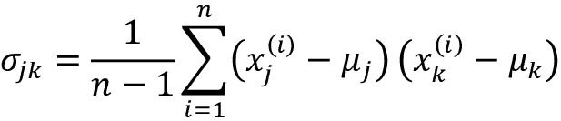
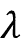
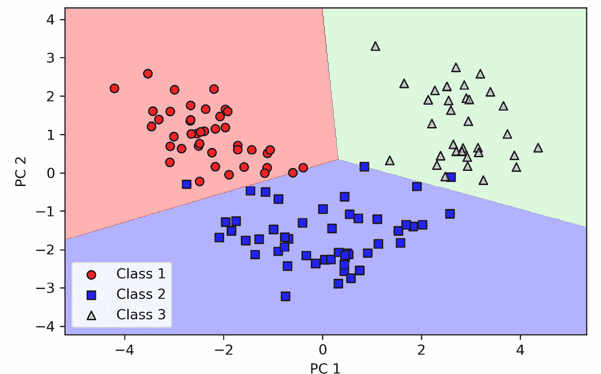
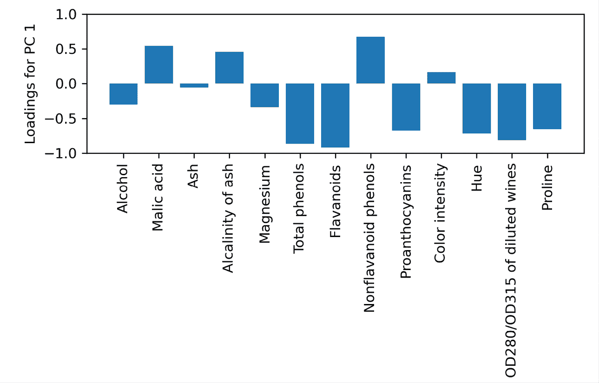

# 5

# 通过降维压缩数据

在*第四章*，*构建良好的训练数据集 – 数据预处理*中，您已经了解了使用不同特征选择技术来降低数据集维度的不同方法。作为降维的替代方法，**特征提取**允许您通过将数据转换到比原始维度更低的新特征子空间来总结数据集的信息内容。数据压缩是机器学习中的重要主题，它帮助我们存储和分析在技术发展的现代时代中产生和收集的增加量的数据。

在本章中，我们将涵盖以下主题：

+   主成分分析用于无监督数据压缩

+   线性判别分析作为一种监督降维技术，旨在最大化类别可分性。

+   关于非线性降维技术的简要概述和用于数据可视化的 t-分布随机邻居嵌入

# 通过主成分分析实现无监督降维

类似于特征选择，我们可以使用不同的特征提取技术来减少数据集中的特征数量。特征选择和特征提取的区别在于，特征选择算法如**顺序向后选择**保留原始特征，而特征提取则通过转换或投影数据到新的特征空间来实现降维。

在降维的背景下，特征提取可以被理解为一种数据压缩的方法，其目标是保留大部分相关信息。实际上，特征提取不仅用于改善存储空间或学习算法的计算效率，而且可以通过减少**维度诅咒**（特别是在使用非正则化模型时）来提高预测性能。

## 主成分分析中的主要步骤

在本节中，我们将讨论**主成分分析**（**PCA**），这是一种广泛应用于不同领域的无监督线性变换技术，最突出的用途是特征提取和降维。PCA 的其他流行应用包括探索性数据分析、股市交易中信号去噪以及生物信息学领域中基因组数据和基因表达水平的分析。

PCA 帮助我们基于特征之间的相关性来识别数据中的模式。简而言之，PCA 旨在找到高维数据中最大方差的方向，并将数据投影到一个具有与原始空间相等或更少维度的新子空间中。新子空间的正交轴（主成分）可以被解释为考虑到新特征轴互为正交的约束条件下的最大方差方向，如*图 5.1*所示：


图 5.1：使用 PCA 在数据集中找到最大方差的方向。

在*图 5.1*中，*x*[1]和*x*[2]是原始特征轴，**PC 1**和**PC 2**是主成分。

如果我们使用 PCA 进行降维，我们构造一个*d*×*k*维的变换矩阵**W**，它允许我们将训练示例的特征向量**x**映射到一个新的*k*维特征子空间，该子空间的维度少于原始的*d*维特征空间。例如，过程如下。假设我们有一个特征向量**x**：


然后由变换矩阵变换。

**xW** = **z**

得到输出向量：


将原始*d*维数据变换到这个新的*k*维子空间（通常*k* << *d*）的结果是，第一个主成分将具有可能的最大方差。所有随后的主成分将具有最大方差，考虑到这些成分与其他主成分是不相关的（正交的）。需要注意的是，PCA 方向对数据缩放非常敏感，如果希望给所有特征赋予相同的重要性，并且这些特征是在不同尺度上测量的，则在 PCA 之前需要标准化特征。

在更详细地查看用于降维的 PCA 算法之前，让我们用几个简单的步骤总结这个方法：

1.  标准化*d*维数据集。

1.  构建协方差矩阵。

1.  将协方差矩阵分解为其特征向量和特征值。

1.  将特征值按降序排序，以排名对应的特征向量。

1.  选择*k*个特征向量，这些特征向量对应于*k*个最大的特征值，其中*k*是新特征子空间的维度（）。

1.  从“顶部”的*k*个特征向量构造投影矩阵**W**。

1.  使用投影矩阵**W**将*d*维输入数据集**X**转换为新的*k*维特征子空间。

在接下来的部分中，我们将逐步使用 Python 执行 PCA 作为学习练习。然后，我们将看到如何使用 scikit-learn 更方便地执行 PCA。

**特征分解：将矩阵分解为特征向量和特征值**

特征分解，将一个方阵分解成所谓的**特征值**和**特征向量**，是本节描述的 PCA 过程的核心。

协方差矩阵是方阵的一种特殊情况：它是对称矩阵，这意味着矩阵等于其转置，*A* = *A*^T。

当我们将这样的对称矩阵分解时，特征值是实数（而不是复数），特征向量彼此正交（垂直）。此外，特征值和特征向量是成对出现的。如果我们将协方差矩阵分解为其特征向量和特征值，与最高特征值相关联的特征向量对应于数据集中方差的最大方向。在这里，这个“方向”是数据集特征列的线性变换。

尽管本书不涉及特征值和特征向量的详细讨论，但可以在维基百科上找到相对详尽的处理方法和指向其他资源的指针，网址为[`en.wikipedia.org/wiki/Eigenvalues_and_eigenvectors`](https://en.wikipedia.org/wiki/Eigenvalues_and_eigenvectors)。

## 逐步提取主成分

在本小节中，我们将解决 PCA 的前四个步骤：

1.  数据标准化

1.  构建协方差矩阵

1.  获得协方差矩阵的特征值和特征向量

1.  将特征值按降序排列以排名特征向量

首先，我们将加载在*第四章* *构建良好的训练数据集 - 数据预处理* 中使用过的葡萄酒数据集：

```py
>>> import pandas as pd
>>> df_wine = pd.read_csv(
...     'https://archive.ics.uci.edu/ml/'
...     'machine-learning-databases/wine/wine.data',
...     header=None
... ) 
```

**获取葡萄酒数据集**

您可以在本书的代码包中找到葡萄酒数据集的副本（以及本书中使用的所有其他数据集），如果您离线工作或 UCI 服务器在[`archive.ics.uci.edu/ml/machine-learning-databases/wine/wine.data`](https://archive.ics.uci.edu/ml/machine-learning-databases/wine/wine.data)暂时不可用时，您可以使用它。例如，要从本地目录加载葡萄酒数据集，可以替换以下行：

```py
df = pd.read_csv(
    'https://archive.ics.uci.edu/ml/'
    'machine-learning-databases/wine/wine.data',
    header=None
) 
```

使用以下方法：

```py
df = pd.read_csv(
    'your/local/path/to/wine.data',
    header=None
) 
```

接下来，我们将逐步处理葡萄酒数据，将其分为独立的训练和测试数据集—分别使用数据的 70%和 30%，并将其标准化为单位方差：

```py
>>> from sklearn.model_selection import train_test_split
>>> X, y = df_wine.iloc[:, 1:].values, df_wine.iloc[:, 0].values
>>> X_train, X_test, y_train, y_test = \
...     train_test_split(X, y, test_size=0.3,
...                      stratify=y,
...                      random_state=0)
>>> # standardize the features
>>> from sklearn.preprocessing import StandardScaler
>>> sc = StandardScaler()
>>> X_train_std = sc.fit_transform(X_train)
>>> X_test_std = sc.transform(X_test) 
```

完成了通过执行上述代码的强制预处理之后，让我们进入第二步：构建协方差矩阵。这是一个对称的*d*×*d*维协方差矩阵，其中*d*是数据集中的维数，它存储不同特征之间的成对协方差。例如，人口水平上两个特征*x*[j]和*x*[k]之间的协方差可以通过以下方程计算：



在这里，和分别是特征*j*和*k*的样本均值。请注意，如果我们标准化了数据集，样本均值将为零。两个特征之间的正协方差表明特征一起增加或减少，而负协方差表明特征以相反的方向变化。例如，三个特征的协方差矩阵可以写成如下形式（注意是希腊大写字母 sigma，与求和符号不要混淆）：


协方差矩阵的特征向量代表主成分（方差最大的方向），而相应的特征值则定义了它们的大小。在 Wine 数据集的情况下，我们将从 13×13 维度的协方差矩阵中获得 13 个特征向量和特征值。

现在，进入我们的第三步，让我们获取协方差矩阵的特征对。如果您上过线性代数课程，可能已经了解到特征向量**v**满足以下条件：


在这里，是一个标量：特征值。由于手动计算特征向量和特征值有些冗长且复杂，我们将使用 NumPy 的`linalg.eig`函数来获取 Wine 协方差矩阵的特征对：

```py
>>> import numpy as np
>>> cov_mat = np.cov(X_train_std.T)
>>> eigen_vals, eigen_vecs = np.linalg.eig(cov_mat)
>>> print('\nEigenvalues \n', eigen_vals)
Eigenvalues
[ 4.84274532  2.41602459  1.54845825  0.96120438  0.84166161
  0.6620634   0.51828472  0.34650377  0.3131368   0.10754642
  0.21357215  0.15362835  0.1808613 ] 
```

使用`numpy.cov`函数，我们计算了标准化训练数据集的协方差矩阵。使用`linalg.eig`函数，我们进行了特征分解，得到一个向量（`eigen_vals`），其中包含 13 个特征值，并且将相应的特征向量存储为 13×13 维矩阵的列（`eigen_vecs`）。

**NumPy 中的特征分解**

`numpy.linalg.eig`函数被设计用于操作对称和非对称方阵。但是，在某些情况下，您可能会发现它返回复数特征值。

相关函数`numpy.linalg.eigh`已实现对分解 Hermetian 矩阵的操作，这是一种在处理诸如协方差矩阵等对称矩阵时更稳定的数值方法；`numpy.linalg.eigh`总是返回实数特征值。

## 总和和解释的方差

由于我们希望通过将数据集压缩到新的特征子空间来降低数据集的维度，因此我们只选择包含大部分信息（方差）的特征向量（主成分）子集。特征值定义了特征向量的大小，因此我们必须按特征值的大小降序排序；我们对基于其对应特征值的值选择前*k*个最具信息的特征向量感兴趣。但在收集这些*k*个最具信息的特征向量之前，让我们绘制解释**方差比率**的**方差**。一个特征值的解释方差比率，，简单地是一个特征值，，与所有特征值的总和之比：


使用 NumPy 的`cumsum`函数，我们可以计算解释方差的累积和，然后通过 Matplotlib 的`step`函数绘制：

```py
>>> tot = sum(eigen_vals)
>>> var_exp = [(i / tot) for i in
...            sorted(eigen_vals, reverse=True)]
>>> cum_var_exp = np.cumsum(var_exp)
>>> import matplotlib.pyplot as plt
>>> plt.bar(range(1,14), var_exp, align='center',
...         label='Individual explained variance')
>>> plt.step(range(1,14), cum_var_exp, where='mid',
...          label='Cumulative explained variance')
>>> plt.ylabel('Explained variance ratio')
>>> plt.xlabel('Principal component index')
>>> plt.legend(loc='best')
>>> plt.tight_layout()
>>> plt.show() 
```

结果图表明，第一个主成分单独解释了约 40%的方差。

此外，我们可以看到前两个主成分组合在一起解释了数据集中近 60%的方差：


图 5.2：主成分所捕获的总方差的比例

尽管解释方差图表提醒我们，我们在*第四章*中通过随机森林计算的特征重要性值，我们应该提醒自己 PCA 是一种无监督方法，这意味着忽略了类标签的信息。而随机森林使用类成员信息来计算节点不纯度，方差则测量了沿特征轴的值的分布范围。

## 特征变换

现在我们已经成功地将协方差矩阵分解为特征对，让我们继续进行最后三个步骤，将葡萄酒数据集转换到新的主成分轴上。本节中我们将处理的剩余步骤如下：

1.  选择*k*个特征向量，这些特征向量对应*k*个最大的特征值，其中*k*是新特征子空间的维度 ()。

1.  从“顶部”*k*个特征向量构建投影矩阵**W**。

1.  使用投影矩阵**W**将*d*维输入数据集**X**转换为新的*k*维特征子空间。

或者，更简单地说，我们将按特征值降序对特征对进行排序，从所选特征向量构建投影矩阵，并使用投影矩阵将数据变换到低维子空间。

首先，我们按特征值降序对特征对进行排序：

```py
>>> # Make a list of (eigenvalue, eigenvector) tuples
>>> eigen_pairs = [(np.abs(eigen_vals[i]), eigen_vecs[:, i])
...                 for i in range(len(eigen_vals))]
>>> # Sort the (eigenvalue, eigenvector) tuples from high to low
>>> eigen_pairs.sort(key=lambda k: k[0], reverse=True) 
```

接下来，我们收集与两个最大特征值对应的两个特征向量，以捕获数据集中约 60%的方差。请注意，出于说明目的，选择了两个特征向量，因为我们将在后面的小节中通过二维散点图绘制数据。实际上，主成分的数量必须通过计算效率和分类器性能之间的权衡来确定：

```py
>>> w = np.hstack((eigen_pairs[0][1][:, np.newaxis],
...                eigen_pairs[1][1][:, np.newaxis]))
>>> print('Matrix W:\n', w)
Matrix W:
[[-0.13724218   0.50303478]
 [ 0.24724326   0.16487119]
 [-0.02545159   0.24456476]
 [ 0.20694508  -0.11352904]
 [-0.15436582   0.28974518]
 [-0.39376952   0.05080104]
 [-0.41735106  -0.02287338]
 [ 0.30572896   0.09048885]
 [-0.30668347   0.00835233]
 [ 0.07554066   0.54977581]
 [-0.32613263  -0.20716433]
 [-0.36861022  -0.24902536]
 [-0.29669651   0.38022942]] 
```

通过执行上述代码，我们创建了一个 13×2 维的投影矩阵**W**，由前两个特征向量构成。

**镜像投影**

取决于您使用的 NumPy 和 LAPACK 版本，您可能会获得矩阵**W**及其符号翻转的情况。请注意，这不是问题；如果**v**是矩阵的特征向量，则有：


在这里，**v**是特征向量，–**v**也是特征向量，我们可以如下展示。使用基本代数，我们可以将方程两边乘以标量：


由于矩阵乘法对标量乘法是结合的，我们可以将其重新排列为以下形式：


现在，我们可以看到是具有相同特征值的特征向量，适用于和。因此，**v**和–**v**都是特征向量。

利用投影矩阵，我们现在可以将一个例子**x**（表示为 13 维行向量）转换到 PCA 子空间（主成分一和二），得到**x**′，现在是一个由两个新特征组成的二维例子向量：

**x**′ = **xW**

```py
>>> X_train_std[0].dot(w)
array([ 2.38299011,  0.45458499]) 
```

类似地，我们可以通过计算矩阵点积，将整个 124×13 维的训练数据集转换为两个主成分：

**X**′ = **XW**

```py
>>> X_train_pca = X_train_std.dot(w) 
```

最后，让我们将转换后的 Wine 训练数据集可视化为一个 124×2 维的矩阵，在二维散点图中显示：

```py
>>> colors = ['r', 'b', 'g']
>>> markers = ['o', 's', '^']
>>> for l, c, m in zip(np.unique(y_train), colors, markers):
...     plt.scatter(X_train_pca[y_train==l, 0],
...                 X_train_pca[y_train==l, 1],
...                 c=c, label=f'Class {l}', marker=m)
>>> plt.xlabel('PC 1')
>>> plt.ylabel('PC 2')
>>> plt.legend(loc='lower left')
>>> plt.tight_layout()
>>> plt.show() 
```

正如我们在*图 5.3*中所看到的，数据沿第一主成分（*x*轴）的分布比第二主成分（*y*轴）更广泛，这与我们在前一小节创建的解释方差比例图一致。然而，我们可以看出线性分类器很可能能够很好地分离这些类别：


图 5.3：通过 PCA 将 Wine 数据集投影到二维特征空间

尽管我们在前面的散点图中对类标签信息进行了编码以说明问题，但我们必须记住，PCA 是一种不使用任何类标签信息的无监督技术。

## 在 scikit-learn 中的主成分分析

虽然在前一小节中详细的方法帮助我们理解 PCA 的内部工作，但现在我们将讨论如何使用 scikit-learn 中实现的 `PCA` 类。

`PCA` 类是 scikit-learn 的另一个转换器类之一，我们首先使用训练数据拟合模型，然后使用相同的模型参数转换训练数据和测试数据集。现在，让我们在 Wine 训练数据集上使用 scikit-learn 中的 `PCA` 类，通过逻辑回归对转换后的示例进行分类，并通过我们在 *第二章*，*分类简单机器学习算法的训练* 中定义的 `plot_decision_regions` 函数可视化决策区域：

```py
from matplotlib.colors import ListedColormap
def plot_decision_regions(X, y, classifier, test_idx=None, resolution=0.02):
    # setup marker generator and color map
    markers = ('o', 's', '^', 'v', '<')
    colors = ('red', 'blue', 'lightgreen', 'gray', 'cyan')
    cmap = ListedColormap(colors[:len(np.unique(y))])
    # plot the decision surface
    x1_min, x1_max = X[:, 0].min() - 1, X[:, 0].max() + 1
    x2_min, x2_max = X[:, 1].min() - 1, X[:, 1].max() + 1
    xx1, xx2 = np.meshgrid(np.arange(x1_min, x1_max, resolution),
                           np.arange(x2_min, x2_max, resolution))
    lab = classifier.predict(np.array([xx1.ravel(), xx2.ravel()]).T)
    lab = lab.reshape(xx1.shape)
    plt.contourf(xx1, xx2, lab, alpha=0.3, cmap=cmap)
    plt.xlim(xx1.min(), xx1.max())
    plt.ylim(xx2.min(), xx2.max())
    # plot class examples
    for idx, cl in enumerate(np.unique(y)):
        plt.scatter(x=X[y == cl, 0],
                    y=X[y == cl, 1],
                    alpha=0.8,
                    c=colors[idx],
                    marker=markers[idx],
                    label=f'Class {cl}',
                    edgecolor='black') 
```

为了您的方便，您可以将前述的 `plot_decision_regions` 代码放入当前工作目录中的单独代码文件中，例如 `plot_decision_regions_script.py`，并将其导入到当前的 Python 会话中：

```py
>>> from sklearn.linear_model import LogisticRegression
>>> from sklearn.decomposition import PCA
>>> # initializing the PCA transformer and
>>> # logistic regression estimator:
>>> pca = PCA(n_components=2)
>>> lr = LogisticRegression(multi_class='ovr',
...                         random_state=1,
...                         solver='lbfgs')
>>> # dimensionality reduction:
>>> X_train_pca = pca.fit_transform(X_train_std)
>>> X_test_pca = pca.transform(X_test_std)
>>> # fitting the logistic regression model on the reduced dataset:
>>> lr.fit(X_train_pca, y_train)
>>> plot_decision_regions(X_train_pca, y_train, classifier=lr)
>>> plt.xlabel('PC 1')
>>> plt.ylabel('PC 2')
>>> plt.legend(loc='lower left')
>>> plt.tight_layout()
>>> plt.show() 
```

通过执行此代码，我们现在应该可以看到将训练数据的决策区域减少为两个主成分轴：



图 5.4: 使用 scikit-learn 的 PCA 进行降维后的训练示例和逻辑回归决策区域

当我们将 scikit-learn 中的 PCA 投影与我们自己的 PCA 实现进行比较时，我们可能会看到生成的图是彼此的镜像。请注意，这不是这两个实现中的任何一个错误的原因；这种差异的原因是，依赖于特征求解器，特征向量可以具有负或正的符号。

并不重要，但如果我们希望，可以通过将数据乘以 -1 简单地将镜像图像还原；请注意，特征向量通常缩放为单位长度 1。为了完整起见，让我们绘制转换后测试数据集上的逻辑回归决策区域，以查看它是否能很好地分离类别：

```py
>>> plot_decision_regions(X_test_pca, y_test, classifier=lr)
>>> plt.xlabel('PC 1')
>>> plt.ylabel('PC 2')
>>> plt.legend(loc='lower left')
>>> plt.tight_layout()
>>> plt.show() 
```

在执行上述代码并为测试数据集绘制决策区域之后，我们可以看到逻辑回归在这个小的二维特征子空间上表现相当不错，仅在测试数据集中错误分类了一些示例：


图 5.5: 在基于 PCA 特征空间中的测试数据点与逻辑回归决策区域

如果我们对不同主成分的解释方差比感兴趣，可以简单地使用 `n_components` 参数设置为 `None` 初始化 `PCA` 类，这样所有主成分都会被保留，并且可以通过 `explained_variance_ratio_` 属性访问解释的方差比：

```py
>>> pca = PCA(n_components=None)
>>> X_train_pca = pca.fit_transform(X_train_std)
>>> pca.explained_variance_ratio_
array([ 0.36951469, 0.18434927, 0.11815159, 0.07334252,
        0.06422108, 0.05051724, 0.03954654, 0.02643918,
        0.02389319, 0.01629614, 0.01380021, 0.01172226,
        0.00820609]) 
```

请注意，当我们初始化 `PCA` 类时，设置 `n_components=None`，以便按排序顺序返回所有主成分，而不进行降维。

## 评估特征贡献

在本节中，我们将简要介绍如何评估原始特征对主成分的贡献。正如我们所学，通过 PCA，我们创建代表特征线性组合的主成分。有时，我们有兴趣知道每个原始特征对给定主成分的贡献有多少。这些贡献通常称为**负荷量**。

可以通过将特征向量按特征值的平方根进行缩放来计算因子负荷。然后，可以将结果值解释为原始特征与主成分之间的相关性。为了说明这一点，让我们绘制第一主成分的负荷。

首先，我们通过将特征向量乘以特征值的平方根来计算 13×13 维负荷矩阵：

```py
>>> loadings = eigen_vecs * np.sqrt(eigen_vals) 
```

接着，我们绘制第一主成分的负荷量 `loadings[:, 0]`，这是矩阵中的第一列：

```py
>>> fig, ax = plt.subplots()
>>> ax.bar(range(13), loadings[:, 0], align='center')
>>> ax.set_ylabel('Loadings for PC 1')
>>> ax.set_xticks(range(13))
>>> ax.set_xticklabels(df_wine.columns[1:], rotation=90)
>>> plt.ylim([-1, 1])
>>> plt.tight_layout()
>>> plt.show() 
```

在 *图 5.6* 中，我们可以看到，例如，**酒精**与第一主成分呈负相关（约为 -0.3），而**苹果酸**呈正相关（约为 0.54）。请注意，数值为 1 表示完全正相关，而数值为-1 对应完全负相关：


图 5.6：与第一主成分的特征相关性

在上述代码示例中，我们计算了我们自己的 PCA 实现的因子负荷。我们可以以类似的方式从适合的 scikit-learn PCA 对象中获取负荷，其中 `pca.components_` 表示特征向量，`pca.explained_variance_` 表示特征值：

```py
>>> sklearn_loadings = pca.components_.T * np.sqrt(pca.explained_variance_) 
```

为了将 scikit-learn PCA 的负荷与我们之前创建的负荷进行比较，让我们创建一个类似的条形图：

```py
>>> fig, ax = plt.subplots()
>>> ax.bar(range(13), sklearn_loadings[:, 0], align='center')
>>> ax.set_ylabel('Loadings for PC 1')
>>> ax.set_xticks(range(13))
>>> ax.set_xticklabels(df_wine.columns[1:], rotation=90)
>>> plt.ylim([-1, 1])
>>> plt.tight_layout()
>>> plt.show() 
```

正如我们所看到的，条形图看起来一样：



图 5.7：使用 scikit-learn 计算的特征与第一主成分的相关性

在探讨 PCA 作为无监督特征提取技术之后，下一节将介绍**线性判别分析**（**LDA**），这是一种线性变换技术，考虑了类标签信息。

# 通过线性判别分析进行监督数据压缩

LDA 可以作为一种特征提取技术，用于增加计算效率并减少非正则化模型中因维度诅咒而导致的过拟合程度。LDA 的一般概念与 PCA 非常相似，但是 PCA 试图找到数据集中方差最大的正交组件轴，而 LDA 的目标是找到优化类别可分性的特征子空间。在接下来的几节中，我们将更详细地讨论 LDA 与 PCA 之间的相似之处，并逐步介绍 LDA 方法。

## 主成分分析与线性判别分析

PCA 和 LDA 都是用于减少数据集维数的*线性变换技术*；前者是无监督算法，而后者是有监督的。因此，我们可能认为在分类任务中，LDA 是比 PCA 更优越的特征提取技术。然而，A.M. Martinez 报告称，在某些情况下，通过 PCA 预处理在图像识别任务中会导致更好的分类结果，例如，如果每个类别只包含少量示例（*PCA 与 LDA*，作者*A. M. Martinez*和*A. C. Kak*，*IEEE 模式分析与机器智能交易*，23（2）：228-233，2001 年）。

**费舍尔 LDA**

LDA 有时也被称为**费舍尔 LDA**。罗纳德·A·费舍尔最初在 1936 年为双类分类问题制定了*费舍尔线性判别*（*在分类问题中使用多次测量*，作者*R. A. Fisher*，*遗传学年刊*，7（2）：179-188，1936 年）。1948 年，C. Radhakrishna Rao 在假设等类别协方差和正态分布类别的情况下推广了费舍尔线性判别，现在我们称之为 LDA（*在生物分类问题中利用多次测量*，作者*C. R. Rao*，*英国皇家统计学会*系列 B（方法学），10（2）：159-203，1948 年）。

*图 5.8*总结了用于双类问题的 LDA 概念。来自类别 1 的示例显示为圆圈，来自类别 2 的示例显示为交叉点：


图 5.8：用于双类问题的 LDA 概念

线性判别分析所示的线性判别，如*x*轴（*LD 1*），能够很好地分离两个正态分布类别。尽管在*y*轴上显示的示例线性判别（*LD 2*）捕捉了数据集的大部分方差，但它作为一个好的线性判别失败了，因为它没有捕捉任何类别区分信息。

LDA 中的一个假设是数据服从正态分布。此外，我们假设类别具有相同的协方差矩阵，并且训练样本彼此统计独立。然而，即使这些假设中的一个或多个（略微）违反，LDA 在降维方面仍然可以表现得相当好（*模式分类第 2 版*，作者*R. O. Duda*，*P. E. Hart*和*D. G. Stork*，*纽约*，2001 年）。

## 线性判别分析的内部工作原理

在我们深入代码实现之前，让我们简要总结执行 LDA 所需的主要步骤：

1.  标准化*d*维数据集（*d*为特征数）。

1.  对于每个类别，计算*d*维均值向量。

1.  构建类间散布矩阵**S**[B]和类内散布矩阵**S**[W]。

1.  计算矩阵的特征向量和相应的特征值，。

1.  按降序排列特征值以排列相应的特征向量。

1.  选择与最大特征值*k*对应的*k*个特征向量来构造*d*×*k*维的转换矩阵 **W**；这些特征向量是矩阵的列。

1.  使用转换矩阵 **W** 将示例投影到新的特征子空间。

正如我们所见，LDA 在某种意义上与 PCA 相似，因为我们将矩阵分解为特征值和特征向量，这将形成新的低维特征空间。然而，正如前面提到的，LDA 考虑了类标签信息，这以*步骤 2*中计算的均值向量形式体现出来。在接下来的章节中，我们将更详细地讨论这七个步骤，并附有示例代码实现。

## 计算散布矩阵

由于我们在本章开头的 PCA 部分已经标准化了 Wine 数据集的特征，我们可以跳过第一步，直接计算均值向量，然后分别用于构造类内散布矩阵和类间散布矩阵。每个均值向量 **m**[i] 存储关于类*i*的示例的特征值均值，如 ：


这导致了三个均值向量：


这些均值向量可以通过以下代码计算，其中我们为三个标签分别计算一个均值向量：

```py
>>> np.set_printoptions(precision=4)
>>> mean_vecs = []
>>> for label in range(1,4):
...     mean_vecs.append(np.mean(
...                X_train_std[y_train==label], axis=0))
...     print(f'MV {label}: {mean_vecs[label - 1]}\n')
MV 1: [ 0.9066  -0.3497  0.3201  -0.7189  0.5056  0.8807  0.9589  -0.5516
0.5416  0.2338  0.5897  0.6563  1.2075]
MV 2: [-0.8749  -0.2848  -0.3735  0.3157  -0.3848  -0.0433  0.0635  -0.0946
0.0703  -0.8286  0.3144  0.3608  -0.7253]
MV 3: [ 0.1992  0.866  0.1682  0.4148  -0.0451  -1.0286  -1.2876  0.8287
-0.7795  0.9649  -1.209  -1.3622  -0.4013] 
```

使用均值向量，我们现在可以计算类内散布矩阵 **S**[W]：


这通过对每个单独类 *i* 的散布矩阵 **S**[i] 求和来计算：


```py
>>> d = 13 # number of features
>>> S_W = np.zeros((d, d))
>>> for label, mv in zip(range(1, 4), mean_vecs):
...     class_scatter = np.zeros((d, d))
...     for row in X_train_std[y_train == label]:
...         row, mv = row.reshape(d, 1), mv.reshape(d, 1)
...         class_scatter += (row - mv).dot((row - mv).T)
...     S_W += class_scatter
>>> print('Within-class scatter matrix: '
...       f'{S_W.shape[0]}x{S_W.shape[1]}')
Within-class scatter matrix: 13x13 
```

在计算散布矩阵时，我们所做的假设是训练数据集中的类标签是均匀分布的。然而，如果我们打印类标签的数量，我们会发现这一假设是不成立的：

```py
>>> print('Class label distribution:',
...       np.bincount(y_train)[1:])
Class label distribution: [41 50 33] 
```

因此，我们希望在将它们加总为散布矩阵 **S**[W] 之前，先对各个散布矩阵 **S**[i] 进行缩放。当我们将散布矩阵除以类示例数 *n*[i] 时，我们可以看到，计算散布矩阵实际上与计算协方差矩阵  是一样的——协方差矩阵是散布矩阵的归一化版本：


计算缩放的类内散布矩阵的代码如下：

```py
>>> d = 13 # number of features
>>> S_W = np.zeros((d, d))
>>> for label,mv in zip(range(1, 4), mean_vecs):
...     class_scatter = np.cov(X_train_std[y_train==label].T)
...     S_W += class_scatter
>>> print('Scaled within-class scatter matrix: '
...       f'{S_W.shape[0]}x{S_W.shape[1]}')
Scaled within-class scatter matrix: 13x13 
```

在计算缩放的类内散布矩阵（或协方差矩阵）之后，我们可以继续下一步，计算类间散布矩阵 **S**[B]：


这里，**m** 是总体均值，包括所有 **c** 类的示例：

```py
>>> mean_overall = np.mean(X_train_std, axis=0)
>>> mean_overall = mean_overall.reshape(d, 1)
>>> d = 13 # number of features
>>> S_B = np.zeros((d, d))
>>> for i, mean_vec in enumerate(mean_vecs):
...     n = X_train_std[y_train == i + 1, :].shape[0]
...     mean_vec = mean_vec.reshape(d, 1) # make column vector
...     S_B += n * (mean_vec - mean_overall).dot(
...     (mean_vec - mean_overall).T)
>>> print('Between-class scatter matrix: '
...       f'{S_B.shape[0]}x{S_B.shape[1]}')
Between-class scatter matrix: 13x13 
```

## 为新特征子空间选择线性判别式

LDA 的剩余步骤与 PCA 的步骤类似。但是，我们不是对协方差矩阵进行特征分解，而是解矩阵的广义特征值问题，如下所示：

```py
>>> eigen_vals, eigen_vecs =\
...     np.linalg.eig(np.linalg.inv(S_W).dot(S_B)) 
```

在计算完特征对之后，我们可以按降序对特征值进行排序：

```py
>>> eigen_pairs = [(np.abs(eigen_vals[i]), eigen_vecs[:,i])
...                for i in range(len(eigen_vals))]
>>> eigen_pairs = sorted(eigen_pairs,
...               key=lambda k: k[0], reverse=True)
>>> print('Eigenvalues in descending order:\n')
>>> for eigen_val in eigen_pairs:
...     print(eigen_val[0])
Eigenvalues in descending order:
349.617808906
172.76152219
3.78531345125e-14
2.11739844822e-14
1.51646188942e-14
1.51646188942e-14
1.35795671405e-14
1.35795671405e-14
7.58776037165e-15
5.90603998447e-15
5.90603998447e-15
2.25644197857e-15
0.0 
```

在 LDA 中，线性判别子的数量最多为 *c* – 1，其中 *c* 是类别标签的数量，因为类间散布矩阵 **S**[B] 是 *c* 个秩为一或更低的矩阵之和。事实上，我们只有两个非零特征值（特征值 3-13 并非完全为零，这是由于 NumPy 中的浮点运算）。

**共线性**

注意，在极少数情况下出现完美共线性（所有对齐的示例点位于一条直线上），协方差矩阵将具有秩为一，这将导致只有一个非零特征值的特征向量。

为了衡量线性判别子（特征向量）捕获了多少类别区分信息，让我们绘制按降序排列的线性判别子，类似于我们在 PCA 部分创建的解释方差图。为简单起见，我们将类别区分信息的内容称为 **可区分度**：

```py
>>> tot = sum(eigen_vals.real)
>>> discr = [(i / tot) for i in sorted(eigen_vals.real,
...                                    reverse=True)]
>>> cum_discr = np.cumsum(discr)
>>> plt.bar(range(1, 14), discr, align='center',
...         label='Individual discriminability')
>>> plt.step(range(1, 14), cum_discr, where='mid',
...          label='Cumulative discriminability')
>>> plt.ylabel('"Discriminability" ratio')
>>> plt.xlabel('Linear Discriminants')
>>> plt.ylim([-0.1, 1.1])
>>> plt.legend(loc='best')
>>> plt.tight_layout()
>>> plt.show() 
```

正如我们在 *图 5.9* 中所看到的，仅用前两个线性判别分量就可以捕获葡萄酒训练数据集中 100%的有用信息：


图 5.9：前两个判别分量捕获了 100%的有用信息

现在让我们堆叠两个最具判别性的特征向量列以创建转换矩阵 **W**：

```py
>>> w = np.hstack((eigen_pairs[0][1][:, np.newaxis].real,
...                eigen_pairs[1][1][:, np.newaxis].real))
>>> print('Matrix W:\n', w)
Matrix W:
 [[-0.1481  -0.4092]
  [ 0.0908  -0.1577]
  [-0.0168  -0.3537]
  [ 0.1484   0.3223]
  [-0.0163  -0.0817]
  [ 0.1913   0.0842]
  [-0.7338   0.2823]
  [-0.075   -0.0102]
  [ 0.0018   0.0907]
  [ 0.294   -0.2152]
  [-0.0328   0.2747]
  [-0.3547  -0.0124]
  [-0.3915  -0.5958]] 
```

## 将示例投影到新的特征空间

使用我们在前一小节中创建的转换矩阵 **W**，现在我们可以通过矩阵相乘来转换训练数据集：

**X**′ = **XW**

```py
>>> X_train_lda = X_train_std.dot(w)
>>> colors = ['r', 'b', 'g']
>>> markers = ['o', 's', '^']
>>> for l, c, m in zip(np.unique(y_train), colors, markers):
...     plt.scatter(X_train_lda[y_train==l, 0],
...                 X_train_lda[y_train==l, 1] * (-1),
...                 c=c, label= f'Class {l}', marker=m)
>>> plt.xlabel('LD 1')
>>> plt.ylabel('LD 2')
>>> plt.legend(loc='lower right')
>>> plt.tight_layout()
>>> plt.show() 
```

正如我们在 *图 5.10* 中所看到的，现在三个葡萄酒类别在新的特征子空间中完全线性可分：


图 5.10：将数据投影到前两个判别分量后，葡萄酒类别完全可分

## 使用 scikit-learn 进行 LDA

那逐步实现是理解 LDA 内部工作原理和理解 LDA 与 PCA 之间差异的良好练习。现在，让我们看一下 scikit-learn 中实现的 `LDA` 类：

```py
>>> # the following import statement is one line
>>> from sklearn.discriminant_analysis import LinearDiscriminantAnalysis as LDA
>>> lda = LDA(n_components=2)
>>> X_train_lda = lda.fit_transform(X_train_std, y_train) 
```

接下来，让我们看看在 LDA 转换之后，逻辑回归分类器如何处理低维训练数据集：

```py
>>> lr = LogisticRegression(multi_class='ovr', random_state=1,
...                         solver='lbfgs')
>>> lr = lr.fit(X_train_lda, y_train)
>>> plot_decision_regions(X_train_lda, y_train, classifier=lr)
>>> plt.xlabel('LD 1')
>>> plt.ylabel('LD 2')
>>> plt.legend(loc='lower left')
>>> plt.tight_layout()
>>> plt.show() 
```

如 *图 5.11* 所示，我们可以看到逻辑回归模型误分类了来自第二类的一个示例：


图 5.11：逻辑回归模型误分类了一个类别

通过降低正则化强度，我们可能可以移动决策边界，使得逻辑回归模型能够在训练数据集中正确分类所有示例。然而，更重要的是，让我们看看在测试数据集上的结果：

```py
>>> X_test_lda = lda.transform(X_test_std)
>>> plot_decision_regions(X_test_lda, y_test, classifier=lr)
>>> plt.xlabel('LD 1')
>>> plt.ylabel('LD 2')
>>> plt.legend(loc='lower left')
>>> plt.tight_layout()
>>> plt.show() 
```

如我们在*图 5.12*中所见，逻辑回归分类器能够在测试数据集中只使用一个二维特征子空间，而不是原始的 13 个葡萄酒特征，获得完美的准确度分数：


图 5.12：逻辑回归模型在测试数据上的完美表现

# 非线性降维和可视化

在前一节中，我们介绍了主成分分析（PCA）和线性判别分析（LDA）等线性变换技术进行特征提取。在本节中，我们将讨论为什么考虑非线性降维技术可能是值得的。

特别值得强调的一个非线性降维技术是**t 分布随机邻居嵌入**（**t-SNE**），因为它经常用于文献中以二维或三维形式可视化高维数据集。我们将看到如何应用 t-SNE 来在二维特征空间中绘制手写图像的图像。

## 为什么考虑非线性降维？

许多机器学习算法对输入数据的线性可分性有假设。您已经学到了感知器甚至需要完全线性可分的训练数据才能收敛。到目前为止，我们所涵盖的其他算法假设缺乏完全线性可分性是由于噪声引起的：Adaline、逻辑回归和（标准）支持向量机等。

然而，如果我们处理非线性问题，这在实际应用中可能经常遇到，那么线性变换技术如主成分分析（PCA）和线性判别分析（LDA）可能不是最佳选择：


图 5.13：线性与非线性问题的区别

scikit-learn 库实现了一些先进的非线性降维技术，超出了本书的范围。有兴趣的读者可以在[`scikit-learn.org/stable/modules/manifold.html`](http://scikit-learn.org/stable/modules/manifold.html)找到 scikit-learn 当前实现的良好概述，并配有说明性示例。

非线性降维技术的开发和应用通常也被称为流形学习，其中流形指的是嵌入在高维空间中的低维拓扑空间。流形学习算法必须捕捉数据的复杂结构，以便将其投影到一个保持数据点关系的低维空间中。

流形学习的一个经典示例是三维瑞士卷，如*图 5.14*所示：


图 5.14：将三维瑞士卷投影到较低的二维空间

尽管非线性降维和流形学习算法非常强大，但需要注意的是，这些技术因难以使用而闻名，如果超参数选择不理想，可能弊大于利。导致这种困难的原因在于我们通常处理的是无法轻易可视化且结构不明显的高维数据集（不像*图 5.14*中的瑞士卷示例）。此外，除非将数据集投影到二维或三维空间（这通常不足以捕捉更复杂的关系），否则很难甚至不可能评估结果的质量。因此，许多人仍依赖于更简单的技术，如 PCA 和 LDA 进行降维。

## 通过 t-分布随机近邻嵌入进行数据可视化

在介绍非线性降维及其一些挑战后，让我们看一个涉及 t-SNE 的实际示例，这在二维或三维中经常用于可视化复杂数据集。

简而言之，t-SNE 根据高维（原始）特征空间中数据点的成对距离建模数据点。然后，它找到新的低维空间中成对距离的概率分布，该分布接近原始空间中成对距离的概率分布。换句话说，t-SNE 学习将数据点嵌入到低维空间中，使得原始空间中的成对距离得以保持。您可以在 *Maaten 和 Hinton 的原始研究论文《Visualizing data using t-SNE》* 中找到有关此方法的更多详细信息，发表于 2018 年《机器学习研究期刊》（[`www.jmlr.org/papers/volume9/vandermaaten08a/vandermaaten08a.pdf`](https://www.jmlr.org/papers/volume9/vandermaaten08a/vandermaaten08a.pdf)）。然而，正如研究论文的标题所示，t-SNE 是一种用于可视化目的的技术，因为它需要整个数据集进行投影。由于它直接投影点（不像 PCA，它不涉及投影矩阵），我们无法将 t-SNE 应用于新的数据点。

下面的代码显示了如何快速演示 t-SNE 如何应用于一个 64 维数据集。首先，我们从 scikit-learn 加载 Digits 数据集，其中包含低分辨率手写数字（数字 0-9）的图像：

```py
>>> from sklearn.datasets import load_digits
>>> digits = load_digits() 
```

这些数字是 8×8 的灰度图像。下面的代码绘制了数据集中的前四幅图像，总共包含 1,797 幅图像：

```py
>>> fig, ax = plt.subplots(1, 4)
>>> for i in range(4):
>>>     ax[i].imshow(digits.images[i], cmap='Greys')
>>> plt.show() 
```

正如我们在*图 5.15*中看到的那样，图像的分辨率相对较低，为 8×8 像素（即每个图像 64 个像素）：


图 5.15：手写数字的低分辨率图像

请注意，`digits.data`属性使我们能够访问该数据集的表格版本，其中示例由行表示，列对应于像素：

```py
>>> digits.data.shape
(1797, 64) 
```

接下来，让我们将特征（像素）分配给一个新变量`X_digits`，并将标签分配给另一个新变量`y_digits`：

```py
>>> y_digits = digits.target
>>> X_digits = digits.data 
```

然后，我们从 scikit-learn 中导入 t-SNE 类，并拟合一个新的`tsne`对象。使用`fit_transform`，我们在一步中执行 t-SNE 拟合和数据转换：

```py
>>> from sklearn.manifold import TSNE
>>> tsne = TSNE(n_components=2, init='pca',
...             random_state=123)
>>> X_digits_tsne = tsne.fit_transform(X_digits) 
```

使用这段代码，我们将 64 维数据集投影到二维空间。我们指定了`init='pca'`，这在研究文章*《Initialization is critical for preserving global data structure in both t-SNE and UMAP》*中被推荐使用 PCA 进行 t-SNE 嵌入的初始化，该文章的作者是*Kobak*和*Linderman*，发表于*《Nature Biotechnology Volume 39》*，第 156-157 页，2021 年（[`www.nature.com/articles/s41587-020-00809-z`](https://www.nature.com/articles/s41587-020-00809-z)）。

请注意，t-SNE 还包括额外的超参数，如困惑度和学习率（通常称为**epsilon**），我们在示例中省略了这些（使用了 scikit-learn 的默认值）。实际应用中，我们建议您也探索这些参数。有关这些参数及其对结果影响的更多信息，请参阅文章*《How to Use t-SNE Effectively》*，作者是*Wattenberg*、*Viegas*和*Johnson*，发表于*《Distill》*，2016 年（[`distill.pub/2016/misread-tsne/`](https://distill.pub/2016/misread-tsne/)）。

最后，让我们使用以下代码可视化 2D t-SNE 嵌入：

```py
>>> import matplotlib.patheffects as PathEffects
>>> def plot_projection(x, colors):
...     f = plt.figure(figsize=(8, 8))
...     ax = plt.subplot(aspect='equal')
...     for i in range(10):
...         plt.scatter(x[colors == i, 0],
...                     x[colors == i, 1])
...     for i in range(10):
...         xtext, ytext = np.median(x[colors == i, :], axis=0)
...         txt = ax.text(xtext, ytext, str(i), fontsize=24)
...         txt.set_path_effects([
...             PathEffects.Stroke(linewidth=5, foreground="w"),
...             PathEffects.Normal()])
>>> plot_projection(X_digits_tsne, y_digits)
>>> plt.show() 
```

与 PCA 类似，t-SNE 是一种无监督方法，在前述代码中，我们仅出于可视化目的使用类标签`y_digits`（0-9）通过函数颜色参数。Matplotlib 的`PathEffects`用于视觉效果，使得每个相应数字数据点的类标签显示在中心（通过`np.median`）。生成的图如下所示：


图 5.16：展示了 t-SNE 如何将手写数字嵌入二维特征空间的可视化

正如我们所看到的，尽管不完美，t-SNE 能够很好地分离不同的数字（类别）。通过调整超参数，可能可以实现更好的分离。然而，由于难以辨认的手写，一定程度的类混合可能是不可避免的。例如，通过检查单个图像，我们可能会发现某些数字 3 的实例看起来确实像数字 9，等等。

**均匀流形逼近和投影**

另一种流行的可视化技术是**均匀流形逼近和投影**（**UMAP**）。虽然 UMAP 可以产生与 t-SNE 类似好的结果（例如，请参阅之前引用的 Kobak 和 Linderman 的论文），但通常速度更快，并且还可以用于投影新数据，这使其在机器学习背景下作为降维技术更具吸引力，类似于 PCA。对 UMAP 感兴趣的读者可以在原始论文中找到更多信息：*UMAP: Uniform manifold approximation and projection for dimension reduction*，作者是*McInnes, Healy*和*Melville*，2018 年（[`arxiv.org/abs/1802.03426`](https://arxiv.org/abs/1802.03426)）。UMAP 的 scikit-learn 兼容实现可以在[`umap-learn.readthedocs.io`](https://umap-learn.readthedocs.io)找到。

# 摘要

在本章中，您了解了两种用于特征提取的基本降维技术：PCA 和 LDA。使用 PCA，我们将数据投影到低维子空间中，以最大化沿正交特征轴的方差，同时忽略类标签。与 PCA 相反，LDA 是一种用于监督降维的技术，这意味着它考虑训练数据集中的类信息，试图在线性特征空间中最大化类的可分离性。最后，您还了解了 t-SNE，这是一种非线性特征提取技术，可用于在二维或三维中可视化数据。

配备了 PCA 和 LDA 作为基本数据预处理技术，您现在已经准备好学习如何在下一章高效地结合不同的预处理技术并评估不同模型的性能。

# 加入我们书籍的 Discord 空间

参加每月一次的作者问答活动，可在书籍的 Discord 工作区参与：

[`packt.link/MLwPyTorch`](https://packt.link/MLwPyTorch)


