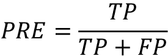

# 第六章：学习模型评估和超参数调整的最佳实践

在前几章中，我们学习了分类的基本机器学习算法，以及在将数据输入这些算法之前如何整理数据。现在，是时候学习通过微调算法和评估模型性能来构建优秀机器学习模型的最佳实践了。在本章中，我们将学习如何执行以下操作：

+   评估机器学习模型的性能

+   诊断机器学习算法的常见问题

+   微调机器学习模型

+   使用不同性能指标评估预测模型的性能

# 使用管道流程优化工作流程

当我们在前几章中应用不同的预处理技术，例如特征缩放的标准化在 *第四章*，“构建良好的训练数据集 - 数据预处理” 中，或数据压缩的主成分分析在 *第五章*，“通过降维压缩数据” 中，您学到我们必须重用在训练数据拟合期间获得的参数来缩放和压缩任何新数据，例如单独测试数据集中的示例。在本节中，您将学习到一个非常方便的工具，即`Pipeline`类在 scikit-learn 中。它允许我们拟合一个包含任意数量转换步骤的模型，并将其应用于对新数据进行预测。

## 加载乳腺癌威斯康星数据集

在本章中，我们将使用乳腺癌威斯康星数据集，该数据集包含 569 个恶性和良性肿瘤细胞的示例。数据集中的前两列存储示例的唯一 ID 编号和相应的诊断结果（`M` = 恶性，`B` = 良性）。列 3-32 包含从细胞核数字化图像计算出的 30 个实值特征，可用于构建模型以预测肿瘤是良性还是恶性。乳腺癌威斯康星数据集已存放在 UCI 机器学习库中，有关该数据集的更详细信息可在 [`archive.ics.uci.edu/ml/datasets/Breast+Cancer+Wisconsin+(Diagnostic)`](https://archive.ics.uci.edu/ml/datasets/Breast+Cancer+Wisconsin+(Diagnostic)) 找到。

**获取乳腺癌威斯康星数据集**

您可以在本书的代码包中找到数据集的副本（以及本书中使用的所有其他数据集），如果您离线工作或者 UCI 服务器在 [`archive.ics.uci.edu/ml/machine-learning-databases/breast-cancer-wisconsin/wdbc.data`](https://archive.ics.uci.edu/ml/machine-learning-databases/breast-cancer-wisconsin/wdbc.data) 暂时不可用时，您可以使用它。例如，要从本地目录加载数据集，您可以替换以下行：

```py
df = pd.read_csv(
    'https://archive.ics.uci.edu/ml/'
    'machine-learning-databases'
    '/breast-cancer-wisconsin/wdbc.data',
    header=None
) 
```

使用以下内容：

```py
df = pd.read_csv(
    'your/local/path/to/wdbc.data',
    header=None
) 
```

在本节中，我们将在三个简单步骤中读取数据集并将其分为训练集和测试集：

1.  我们将从 UCI 网站直接使用 pandas 读取数据集：

    ```py
    >>> import pandas as pd
    >>> df = pd.read_csv('https://archive.ics.uci.edu/ml/'
    ...                  'machine-learning-databases'
    ...                  '/breast-cancer-wisconsin/wdbc.data',
    ...                  header=None) 
    ```

1.  接下来，我们将把这 30 个特征分配给一个 NumPy 数组 `X`。使用 `LabelEncoder` 对象，我们将类标签从其原始字符串表示（`'M'` 和 `'B'`）转换为整数：

    ```py
    >>> from sklearn.preprocessing import LabelEncoder
    >>> X = df.loc[:, 2:].values
    >>> y = df.loc[:, 1].values
    >>> le = LabelEncoder()
    >>> y = le.fit_transform(y)
    >>> le.classes_
    array(['B', 'M'], dtype=object) 
    ```

1.  在将类标签（诊断）编码为数组 `y` 后，恶性肿瘤现在表示为类 `1`，良性肿瘤表示为类 `0`。我们可以通过在两个虚拟类标签上调用已拟合的 `LabelEncoder` 的 `transform` 方法来双重检查此映射：

    ```py
    >>> le.transform(['M', 'B'])
    array([1, 0]) 
    ```

1.  在下一小节构建我们的第一个模型管道之前，让我们将数据集分成一个单独的训练数据集（数据的 80%）和一个单独的测试数据集（数据的 20%）：

    ```py
    >>> from sklearn.model_selection import train_test_split
    >>> X_train, X_test, y_train, y_test = \
    ...     train_test_split(X, y,
    ...                      test_size=0.20,
    ...                      stratify=y,
    ...                      random_state=1) 
    ```

## 将转换器和估计器组合成管道

在前一章中，您学习到许多学习算法需要输入特征在相同的尺度上才能获得最佳性能。由于 Breast Cancer Wisconsin 数据集中的特征在不同的尺度上测量，因此在将它们提供给线性分类器（如 logistic 回归）之前，我们将标准化 Breast Cancer Wisconsin 数据集中的列。此外，假设我们希望通过 **主成分分析**（**PCA**），这是一种介绍在 *第五章* 中的用于降维的特征提取技术，将我们的数据从初始的 30 维压缩到一个较低的二维子空间。

不需要分别对训练集和测试集进行模型拟合和数据转换步骤，我们可以将 `StandardScaler`、`PCA` 和 `LogisticRegression` 对象串联在一个管道中：

```py
>>> from sklearn.preprocessing import StandardScaler
>>> from sklearn.decomposition import PCA
>>> from sklearn.linear_model import LogisticRegression
>>> from sklearn.pipeline import make_pipeline
>>> pipe_lr = make_pipeline(StandardScaler(),
...                         PCA(n_components=2),
...                         LogisticRegression())
>>> pipe_lr.fit(X_train, y_train)
>>> y_pred = pipe_lr.predict(X_test)
>>> test_acc = pipe_lr.score(X_test, y_test)
>>> print(f'Test accuracy: {test_acc:.3f}')
Test accuracy: 0.956 
```

`make_pipeline` 函数接受任意数量的 scikit-learn 转换器（支持 `fit` 和 `transform` 方法的对象）作为输入，后跟一个实现 `fit` 和 `predict` 方法的 scikit-learn 估计器。在我们前面的代码示例中，我们提供了两个 scikit-learn 转换器 `StandardScaler` 和 `PCA`，以及一个 `LogisticRegression` 估计器作为 `make_pipeline` 函数的输入，该函数从这些对象构造了一个 scikit-learn `Pipeline` 对象。

我们可以将 scikit-learn 的 `Pipeline` 看作是那些独立转换器和估计器的元估计器或包装器。如果我们调用 `Pipeline` 的 `fit` 方法，数据将通过一系列转换器，通过中间步骤上的 `fit` 和 `transform` 调用传递，直到到达估计器对象（管道中的最后一个元素）。然后，估计器将被拟合到转换后的训练数据上。

当我们在前面的代码示例中对`pipe_lr`管道执行`fit`方法时，`StandardScaler`首先对训练数据执行了`fit`和`transform`调用。其次，转换后的训练数据被传递给管道中的下一个对象`PCA`。类似于前面的步骤，`PCA`也对缩放后的输入数据执行了`fit`和`transform`操作，并将其传递给管道的最后一个元素，即评估器。

最后，经过`StandardScaler`和`PCA`转换后，`LogisticRegression`评估器被拟合到训练数据中。同样需要注意的是，在管道中的中间步骤数量没有限制；然而，如果我们想要将管道用于预测任务，最后一个管道元素必须是评估器。

与在管道上调用`fit`类似，如果管道的最后一步是评估器，管道也会实现`predict`方法。如果我们将数据集提供给`Pipeline`对象实例的`predict`调用，数据将通过中间步骤通过`transform`调用传递。在最后一步，评估器对象将返回对转换数据的预测。

scikit-learn 库的管道非常实用，是我们在本书的其余部分经常使用的包装工具。为了确保您对`Pipeline`对象的工作原理有深刻理解，请仔细观察*图 6.1*，该图总结了我们在前面段落中的讨论：


图 6.1：管道对象的内部工作原理

# 使用 k 折交叉验证评估模型性能

在本节中，您将了解常见的交叉验证技术**留出交叉验证**和**k 折交叉验证**，这些技术可以帮助我们获得模型泛化性能的可靠估计，即模型在未见数据上的表现如何。

## 留出法

估计机器学习模型泛化性能的经典和流行方法是留出法。使用留出法，我们将初始数据集分成单独的训练和测试数据集——前者用于模型训练，后者用于估计其泛化性能。然而，在典型的机器学习应用中，我们还对调整和比较不同的参数设置感兴趣，以进一步提高在未见数据上的预测性能。这个过程称为**模型选择**，该名称指的是我们想要选择*最佳*值的*调整参数*（也称为**超参数**）给定分类问题的情况。然而，如果在模型选择过程中反复使用同一测试数据集，它将成为我们的训练数据的一部分，因此模型更可能过拟合。尽管存在这个问题，许多人仍然使用测试数据集进行模型选择，这不是一个好的机器学习实践。

使用留出法进行模型选择的更好方法是将数据分成三部分：训练数据集、验证数据集和测试数据集。训练数据集用于拟合不同的模型，然后利用验证数据集上的性能进行模型选择。测试数据集的优点在于，在训练和模型选择步骤中，模型之前未见过该数据，因此我们可以获得对其推广到新数据能力的较少偏见的估计。*图 6.2*说明了留出交叉验证的概念，在这里我们使用验证数据集重复评估使用不同超参数值进行训练后模型的性能。一旦我们对超参数值的调整感到满意，我们就可以估计模型在测试数据集上的泛化性能：


图 6.2：如何使用训练、验证和测试数据集

留出法的一个缺点是性能估计可能对如何将训练数据集分割成训练和验证子集非常敏感；估计值会因数据的不同示例而变化。在下一小节中，我们将看一下更健壮的性能估计技术，即 k 折交叉验证，在这种方法中，我们对训练数据的 k 个子集重复使用留出法*k*次。

## k 折交叉验证

在 k 折交叉验证中，我们将训练数据集随机分成*k*个不重复的折叠。在这里，*k* – 1 折叠，即所谓的*训练折叠*，用于模型训练，而一个折叠，即所谓的*测试折叠*，用于性能评估。此过程重复*k*次，以便我们获得*k*个模型和性能估计。

**有替换和无替换抽样**

我们在*第三章*中查看了一个示例，以说明有放回和无放回的抽样。如果您还没有阅读该章节，或者需要复习，请参阅“组合多个决策树通过随机森林”章节中名为“有放回和无放回抽样”的信息框。

然后我们基于不同的、独立的测试折叠计算模型的平均表现，以获得对训练数据的子分区不太敏感的性能估计，与留出方法相比。通常情况下，我们使用 k 折交叉验证进行模型调整，即找到能产生满意泛化性能的最优超参数值，这些值是通过评估模型在测试折叠上的性能来估计的。

一旦我们找到令人满意的超参数值，我们可以在完整的训练数据集上重新训练模型，并使用独立的测试数据集获得最终的性能估计。在 k 折交叉验证之后将模型拟合到整个训练数据集的理由是，首先，我们通常对单个最终模型感兴趣（而不是*k*个单独的模型），其次，将更多的训练示例提供给学习算法通常会产生更精确和更健壮的模型。

由于 k 折交叉验证是一种无替换的重采样技术，这种方法的优势在于在每次迭代中，每个示例都将仅使用一次，并且训练和测试折叠是不重叠的。此外，所有测试折叠也是不重叠的；也就是说，测试折叠之间没有重叠。*图 6.3*总结了 k 折交叉验证背后的概念，其中*k* = 10\. 训练数据集被分为 10 个折叠，在 10 次迭代期间，有 9 个折叠用于训练，1 个折叠将用作模型评估的测试数据集。

另外，每个折叠的估计表现，*E*[i]（例如，分类准确度或误差），然后用于计算模型的估计平均表现，*E*：


图 6.3：k 折交叉验证的工作原理

总之，k 折交叉验证比使用验证集的留出方法更有效地利用数据集，因为在 k 折交叉验证中，所有数据点都用于评估。

在 k 折交叉验证中，一个良好的标准值*k*是 10，正如经验证据所示。例如，Ron Kohavi 在各种真实世界数据集上的实验表明，10 折交叉验证在偏差和方差之间提供了最佳的权衡（*关于准确度估计和模型选择的交叉验证和自举研究*由*Ron Kohavi*，*国际人工智能联合会议（IJCAI）*，14（12）：1137-43，1995 年，[`www.ijcai.org/Proceedings/95-2/Papers/016.pdf`](https://www.ijcai.org/Proceedings/95-2/Papers/016.pdf)）。

然而，如果我们使用的训练集比较小，增加折数可能是有用的。如果我们增加 *k* 的值，每次迭代中会使用更多的训练数据，这样平均每个模型估计的泛化性能会有较低的悲观偏差。但是，较大的 *k* 值也会增加交叉验证算法的运行时间，并导致估计的方差较高，因为训练折会更加相似。另一方面，如果我们处理大数据集，可以选择较小的 *k* 值，例如 *k* = 5，仍然可以准确估计模型的平均性能，同时减少在不同折上重新拟合和评估模型的计算成本。

**留一法交叉验证**

k 折交叉验证的一个特例是留一法交叉验证（LOOCV）方法。在 LOOCV 中，我们将折数设置为训练示例的数量（*k* = *n*），因此在每次迭代中只使用一个训练示例进行测试，这是处理非常小数据集的推荐方法。

对标准 k 折交叉验证方法的轻微改进是分层 k 折交叉验证，它可以在类别不平衡的情况下更好地估计偏差和方差，正如在本节中前面引用的 Ron Kohavi 的研究中所示。在分层交叉验证中，保留了每个折中类别标签的比例，以确保每个折都代表训练数据集中的类别比例，我们将通过使用 scikit-learn 中的 `StratifiedKFold` 迭代器来说明这一点：

```py
>>> import numpy as np
>>> from sklearn.model_selection import StratifiedKFold
>>> kfold = StratifiedKFold(n_splits=10).split(X_train, y_train)
>>> scores = []
>>> for k, (train, test) in enumerate(kfold):
...     pipe_lr.fit(X_train[train], y_train[train])
...     score = pipe_lr.score(X_train[test], y_train[test])
...     scores.append(score)
...     print(f'Fold: {k+1:02d}, '
...           f'Class distr.: {np.bincount(y_train[train])}, '
...           f'Acc.: {score:.3f}')
Fold: 01, Class distr.: [256 153], Acc.: 0.935
Fold: 02, Class distr.: [256 153], Acc.: 0.935
Fold: 03, Class distr.: [256 153], Acc.: 0.957
Fold: 04, Class distr.: [256 153], Acc.: 0.957
Fold: 05, Class distr.: [256 153], Acc.: 0.935
Fold: 06, Class distr.: [257 153], Acc.: 0.956
Fold: 07, Class distr.: [257 153], Acc.: 0.978
Fold: 08, Class distr.: [257 153], Acc.: 0.933
Fold: 09, Class distr.: [257 153], Acc.: 0.956
Fold: 10, Class distr.: [257 153], Acc.: 0.956
>>> mean_acc = np.mean(scores)
>>> std_acc = np.std(scores)
>>> print(f'\nCV accuracy: {mean_acc:.3f} +/- {std_acc:.3f}')
CV accuracy: 0.950 +/- 0.014 
```

首先，我们使用 `sklearn.model_selection` 模块中的 `StratifiedKFold` 迭代器初始化了 `y_train` 训练数据集中的类标签，并通过 `n_splits` 参数指定了折数。当我们使用 `kfold` 迭代器循环遍历 `k` 个折时，我们使用返回的 `train` 索引来拟合本章开头设置的 logistic 回归流水线。通过 `pipe_lr` 流水线，我们确保每次迭代中的示例都被适当地（例如，标准化）缩放。然后，我们使用 `test` 索引来计算模型的准确率分数，将其收集在 `scores` 列表中以计算估计的平均准确率和标准偏差。

尽管前面的代码示例有助于说明 k 折交叉验证的工作原理，scikit-learn 还实现了一种 k 折交叉验证评分器，可以更简洁地使用分层 k 折交叉验证来评估我们的模型：

```py
>>> from sklearn.model_selection import cross_val_score
>>> scores = cross_val_score(estimator=pipe_lr,
...                          X=X_train,
...                          y=y_train,
...                          cv=10,
...                          n_jobs=1)
>>> print(f'CV accuracy scores: {scores}')
CV accuracy scores: [ 0.93478261  0.93478261  0.95652174
                      0.95652174  0.93478261  0.95555556
                      0.97777778  0.93333333  0.95555556
                      0.95555556]
>>> print(f'CV accuracy: {np.mean(scores):.3f} '
...       f'+/- {np.std(scores):.3f}')
CV accuracy: 0.950 +/- 0.014 
```

`cross_val_score`方法的一个极其有用的特性是，我们可以将不同折叠的评估任务分布到我们机器上的多个**中央处理单元**（**CPU**）上。如果将`n_jobs`参数设为`1`，那么只会使用一个 CPU 来评估性能，就像我们之前的`StratifiedKFold`示例一样。然而，通过设置`n_jobs=2`，我们可以将 10 轮交叉验证任务分布到两个 CPU 上（如果机器上有的话），而通过设置`n_jobs=-1`，我们可以利用机器上所有可用的 CPU 并行计算。

**估算泛化性能**

请注意，本书不涵盖如何估计交叉验证中泛化性能的方差的详细讨论，但您可以参考关于模型评估和交叉验证的全面文章（*《机器学习中的模型评估、模型选择和算法选择》*，*S.* *Raschka*），我们在[`arxiv.org/abs/1811.12808`](https://arxiv.org/abs/1811.12808)分享了这篇文章。此文章还讨论了替代的交叉验证技术，例如.632 和.632+自助法交叉验证方法。

此外，您可以在 M. Markatou 等人的优秀文章中找到详细讨论（*《分析交叉验证估计泛化误差的方差分析》*，*M. Markatou*，*H. Tian*，*S. Biswas*和*G. M. Hripcsak*，*机器学习研究杂志*，6: 1127-1168，2005 年），该文章可在[`www.jmlr.org/papers/v6/markatou05a.html`](https://www.jmlr.org/papers/v6/markatou05a.html)找到。

# 使用学习曲线和验证曲线调试算法

在本节中，我们将介绍两个非常简单但功能强大的诊断工具，可以帮助我们改善学习算法的性能：**学习曲线**和**验证曲线**。在接下来的小节中，我们将讨论如何使用学习曲线来诊断学习算法是否存在过拟合（高方差）或拟合不足（高偏差）的问题。此外，我们还将看看验证曲线，它可以帮助我们解决学习算法的常见问题。

## 使用学习曲线诊断偏差和方差问题

如果一个模型对于给定的训练数据集过于复杂，例如，想象一下非常深的决策树，那么该模型倾向于过拟合训练数据，并且不能很好地泛化到未见过的数据。通常情况下，增加训练样本的数量可以帮助减少过拟合的程度。

然而，在实践中，收集更多数据往往非常昂贵，或者根本不可行。通过绘制模型训练和验证精度随训练数据集大小变化的曲线，我们可以轻松检测模型是否存在高方差或高偏差问题，以及收集更多数据是否有助于解决这一问题。

但在讨论如何在 scikit-learn 中绘制学习曲线之前，让我们通过以下示例来讨论这两个常见的模型问题：


图 6.4：常见的模型问题

左上图显示的图表显示了高偏差的模型。这个模型具有低训练和交叉验证准确性，表明它在训练数据上拟合不足。解决这个问题的常见方法包括增加模型参数的数量，例如通过收集或构建额外的特征，或通过减少正则化的程度，例如在**支持向量机**（**SVM**）或逻辑回归分类器中。

右上图显示的图表显示模型存在高方差问题，这通过训练和交叉验证准确性之间的巨大差距来指示。为了解决这个过拟合问题，我们可以收集更多的训练数据，减少模型的复杂性，或增加正则化参数，例如。

对于非正则化模型，还可以通过特征选择（*第四章*）或特征提取（*第五章*）减少特征数量，从而减少过拟合程度。虽然收集更多的训练数据通常会减少过拟合的机会，但在训练数据非常嘈杂或模型已经非常接近最优情况时，这并不总是有帮助的。

在下一小节中，我们将看到如何使用验证曲线来解决这些模型问题，但让我们先看看如何使用 scikit-learn 中的学习曲线函数来评估模型：

```py
>>> import matplotlib.pyplot as plt
>>> from sklearn.model_selection import learning_curve
>>> pipe_lr = make_pipeline(StandardScaler(),
...                         LogisticRegression(penalty='l2',
...                                            max_iter=10000))
>>> train_sizes, train_scores, test_scores =\
...                 learning_curve(estimator=pipe_lr,
...                                X=X_train,
...                                y=y_train,
...                                train_sizes=np.linspace(
...                                            0.1, 1.0, 10),
...                                cv=10,
...                                n_jobs=1)
>>> train_mean = np.mean(train_scores, axis=1)
>>> train_std = np.std(train_scores, axis=1)
>>> test_mean = np.mean(test_scores, axis=1)
>>> test_std = np.std(test_scores, axis=1)
>>> plt.plot(train_sizes, train_mean,
...          color='blue', marker='o',
...          markersize=5, label='Training accuracy')
>>> plt.fill_between(train_sizes,
...                  train_mean + train_std,
...                  train_mean - train_std,
...                  alpha=0.15, color='blue')
>>> plt.plot(train_sizes, test_mean,
...          color='green', linestyle='--',
...          marker='s', markersize=5,
...          label='Validation accuracy')
>>> plt.fill_between(train_sizes,
...                  test_mean + test_std,
...                  test_mean - test_std,
...                  alpha=0.15, color='green')
>>> plt.grid()
>>> plt.xlabel('Number of training examples')
>>> plt.ylabel('Accuracy')
>>> plt.legend(loc='lower right')
>>> plt.ylim([0.8, 1.03])
>>> plt.show() 
```

注意，在实例化`LogisticRegression`对象时，我们传递了`max_iter=10000`作为额外参数（默认使用 1,000 次迭代），以避免在较小的数据集大小或极端正则化参数值（在下一节中讨论）时出现收敛问题。执行上述代码成功后，我们将获得以下学习曲线图：


图 6.5：显示训练和验证数据集准确性的学习曲线

通过`learning_curve`函数中的`train_sizes`参数，我们可以控制用于生成学习曲线的训练示例的绝对或相对数量。在这里，我们设置`train_sizes=np.linspace(0.1, 1.0, 10)`，以使用 10 个均匀间隔的相对训练数据集大小。默认情况下，`learning_curve`函数使用分层 k 折交叉验证来计算分类器的交叉验证准确性，并通过`cv`参数设置*k* = 10 以进行 10 折分层交叉验证。

然后，我们简单地计算了返回的交叉验证训练和测试分数的平均精度，这些分数是针对不同大小的训练数据集绘制的，我们使用 Matplotlib 的`plot`函数进行了绘制。此外，我们使用`fill_between`函数将平均精度的标准偏差添加到图表中，以指示估计值的变化范围。

正如我们在前面的学习曲线图中所看到的，如果在训练过程中看到了超过 250 个示例，我们的模型在训练和验证数据集上表现相当不错。我们还可以看到，对于训练数据集少于 250 个示例的情况，训练精度会提高，并且验证精度与训练精度之间的差距会扩大——这是过拟合程度增加的指标。

## 解决过拟合和欠拟合问题的验证曲线

验证曲线是通过解决过拟合或欠拟合等问题来改善模型性能的有用工具。验证曲线与学习曲线相关，但不同于将训练和测试精度作为样本大小的函数进行绘制，我们改变模型参数的值，例如逻辑回归中的反正则化参数`C`。

让我们继续看看如何通过 scikit-learn 创建验证曲线：

```py
>>> from sklearn.model_selection import validation_curve
>>> param_range = [0.001, 0.01, 0.1, 1.0, 10.0, 100.0]
>>> train_scores, test_scores = validation_curve(
...                             estimator=pipe_lr,
...                             X=X_train,
...                             y=y_train,
...                             param_name='logisticregression__C',
...                             param_range=param_range,
...                             cv=10)
>>> train_mean = np.mean(train_scores, axis=1)
>>> train_std = np.std(train_scores, axis=1)
>>> test_mean = np.mean(test_scores, axis=1)
>>> test_std = np.std(test_scores, axis=1)
>>> plt.plot(param_range, train_mean,
...          color='blue', marker='o',
...          markersize=5, label='Training accuracy')
>>> plt.fill_between(param_range, train_mean + train_std,
...                  train_mean - train_std, alpha=0.15,
...                  color='blue')
>>> plt.plot(param_range, test_mean,
...          color='green', linestyle='--',
...          marker='s', markersize=5,
...          label='Validation accuracy')
>>> plt.fill_between(param_range,
...                  test_mean + test_std,
...                  test_mean - test_std,
...                  alpha=0.15, color='green')
>>> plt.grid()
>>> plt.xscale('log')
>>> plt.legend(loc='lower right')
>>> plt.xlabel('Parameter C')
>>> plt.ylabel('Accuracy')
>>> plt.ylim([0.8, 1.0])
>>> plt.show() 
```

使用上述代码，我们获得了参数`C`的验证曲线图：


图 6.6：SVM 超参数 C 的验证曲线图

与`learning_curve`函数类似，`validation_curve`函数默认使用分层 k 折交叉验证来估计分类器的性能。在`validation_curve`函数内部，我们指定了要评估的参数。在本例中，它是`C`，即`LogisticRegression`分类器的反正则化参数，我们写成`'logisticregression__C'`以访问 scikit-learn 流水线中的`LogisticRegression`对象，为我们通过`param_range`参数设置的指定值范围进行评估。与上一节中的学习曲线示例类似，我们绘制了平均训练和交叉验证精度以及相应的标准偏差。

尽管`C`值变化时的精度差异微妙，但我们可以看到，当增加正则化强度（`C`的小值）时，模型略微欠拟合数据。然而，对于较大的`C`值，即降低正则化强度，则模型倾向于轻微过拟合数据。在这种情况下，`C`值的甜点似乎在 0.01 到 0.1 之间。

# 通过网格搜索优化机器学习模型

在机器学习中，我们有两种类型的参数：一种是从训练数据中学习的参数，例如逻辑回归中的权重，另一种是学习算法单独优化的参数。后者是模型的调整参数（或超参数），例如逻辑回归中的正则化参数或决策树的最大深度参数。

在前面的部分中，我们使用验证曲线来通过调整其中一个超参数来改善模型的性能。在本节中，我们将介绍一种名为**网格搜索**的流行超参数优化技术，它可以通过找到超参数值的*最佳*组合进一步帮助改善模型的性能。

## 通过网格搜索调整超参数

网格搜索方法相当简单：它是一种蛮力穷举搜索范式，我们在不同超参数的值列表中指定一组值，计算机对每个组合评估模型性能，以获取从此集合中获得的最优组合值：

```py
>>> from sklearn.model_selection import GridSearchCV
>>> from sklearn.svm import SVC
>>> pipe_svc = make_pipeline(StandardScaler(),
...                          SVC(random_state=1))
>>> param_range = [0.0001, 0.001, 0.01, 0.1,
...                1.0, 10.0, 100.0, 1000.0]
>>> param_grid = [{'svc__C': param_range,
...                'svc__kernel': ['linear']},
...               {'svc__C': param_range,
...                'svc__gamma': param_range,
...                'svc__kernel': ['rbf']}]
>>> gs = GridSearchCV(estimator=pipe_svc,
...                   param_grid=param_grid,
...                   scoring='accuracy',
...                   cv=10,
...                   refit=True,
...                   n_jobs=-1)
>>> gs = gs.fit(X_train, y_train)
>>> print(gs.best_score_)
0.9846153846153847
>>> print(gs.best_params_)
{'svc__C': 100.0, 'svc__gamma': 0.001, 'svc__kernel': 'rbf'} 
```

使用上述代码，我们从 `sklearn.model_selection` 模块初始化了一个 `GridSearchCV` 对象来训练和调整 SVM 流水线。我们将 `GridSearchCV` 的 `param_grid` 参数设置为一组字典，以指定我们希望调整的参数。对于线性 SVM，我们只评估了逆正则化参数 `C`；对于**径向基函数**（**RBF**）核 SVM，我们调整了 `svc__C` 和 `svc__gamma` 参数。请注意，`svc__gamma` 参数特定于核 SVM。

`GridSearchCV` 使用 k 折交叉验证来比较使用不同超参数设置训练的模型。通过 `cv=10` 设置，它将进行十折交叉验证，并计算这十个折叠中的平均准确率（通过 `scoring='accuracy'`）来评估模型性能。我们设置 `n_jobs=-1`，以便 `GridSearchCV` 可以利用所有处理核心并行地加速网格搜索，但如果您的计算机对此设置有问题，您可以将此设置更改为 `n_jobs=None` 以进行单处理。

在使用训练数据执行网格搜索后，我们通过 `best_score_` 属性获取了表现最佳模型的分数，并查看了其参数，这些参数可以通过 `best_params_` 属性访问。在这种特定情况下，具有 `svc__C = 100.0` 的 RBF 核 SVM 模型产生了最佳的 k 折交叉验证准确率：98.5%。

最后，我们使用独立的测试数据集来估计选择的最佳模型的性能，该模型可通过 `GridSearchCV` 对象的 `best_estimator_` 属性获得：

```py
>>> clf = gs.best_estimator_
>>> clf.fit(X_train, y_train)
>>> print(f'Test accuracy: {clf.score(X_test, y_test):.3f}')
Test accuracy: 0.974 
```

请注意，在完成网格搜索后，手动在训练集上用最佳设置(`gs.best_estimator_`)拟合模型是不必要的。`GridSearchCV`类有一个`refit`参数，如果我们设置`refit=True`（默认），它将自动将`gs.best_estimator_`重新拟合到整个训练集上。

## 通过随机搜索更广泛地探索超参数配置

由于网格搜索是一种穷举搜索，如果最佳超参数配置包含在用户指定的参数网格中，它肯定能找到最优配置。然而，指定大型超参数网格在实践中使网格搜索非常昂贵。采样不同参数组合的替代方法是随机搜索。在随机搜索中，我们从分布（或离散集合）中随机抽取超参数配置。与网格搜索不同，随机搜索不会对超参数空间进行穷举搜索。尽管如此，它仍然能够以更加经济和时间有效的方式探索更广泛的超参数值设置范围。这个概念在图 6.7 中有所体现，图示了通过网格搜索和随机搜索对九个超参数设置进行搜索的固定网格：


图 6.7：比较网格搜索和随机搜索各自采样九种不同的超参数配置

主要观点是，虽然网格搜索只探索离散的、用户指定的选择，但如果搜索空间太少，可能会错过好的超参数配置。有兴趣的读者可以在以下文章中找到关于随机搜索的详细信息，以及经验研究：《*超参数优化的随机搜索*》由*J. Bergstra*、*Y. Bengio*、*机器学习研究杂志*，第 281-305 页，2012 年，[`www.jmlr.org/papers/volume13/bergstra12a/bergstra12a`](https://www.jmlr.org/papers/volume13/bergstra12a/bergstra12a)。

现在让我们看看如何利用随机搜索来调整 SVM。Scikit-learn 实现了一个`RandomizedSearchCV`类，类似于我们在前一小节中使用的`GridSearchCV`。主要区别在于我们可以在参数网格中指定分布，并指定要评估的超参数配置的总数。例如，让我们考虑在前一小节中网格搜索 SVM 时使用的几个超参数的范围：

```py
>>> param_range = [0.0001, 0.001, 0.01, 0.1,
...                1.0, 10.0, 100.0, 1000.0] 
```

注意，虽然`RandomizedSearchCV`可以接受类似的离散值列表作为参数网格的输入，这在考虑分类超参数时非常有用，但它的主要优势在于我们可以用分布来采样这些列表。因此，例如，我们可以用 SciPy 中的以下分布替换前面的列表：

```py
>>> param_range = scipy.stats.loguniform(0.0001, 1000.0) 
```

例如，使用对数均匀分布而不是常规均匀分布将确保在足够大数量的试验中，与[0.0001, 0.001]范围相比，将从[10.0, 100.0]范围中绘制相同数量的样本。要检查其行为，我们可以通过`rvs(10)`方法从该分布中绘制 10 个随机样本，如下所示：

```py
>>> np.random.seed(1)
>>> param_range.rvs(10)
array([8.30145146e-02, 1.10222804e+01, 1.00184520e-04, 1.30715777e-02,
       1.06485687e-03, 4.42965766e-04, 2.01289666e-03, 2.62376594e-02,
       5.98924832e-02, 5.91176467e-01]) 
```

**指定分布**

`RandomizedSearchCV`支持任意分布，只要我们可以通过调用`rvs()`方法从中抽样。可以在这里找到`scipy.stats`当前可用的所有分布列表：[`docs.scipy.org/doc/scipy/reference/stats.html#probability-distributions`](https://docs.scipy.org/doc/scipy/reference/stats.html#probability-distributions)。

现在让我们看看`RandomizedSearchCV`如何运作，并像在前一节中使用`GridSearchCV`调整 SVM 一样：

```py
>>> from sklearn.model_selection import RandomizedSearchCV
>>> pipe_svc = make_pipeline(StandardScaler(),
...                          SVC(random_state=1))
>>> param_grid = [{'svc__C': param_range,
...                'svc__kernel': ['linear']},
...               {'svc__C': param_range,
...                'svc__gamma': param_range,
...                'svc__kernel': ['rbf']}]
>>> rs = RandomizedSearchCV(estimator=pipe_svc,
...                         param_distributions=param_grid,
...                         scoring='accuracy',
...                         refit=True,
...                         n_iter=20,
...                         cv=10,
...                         random_state=1,
...                         n_jobs=-1)
>>> rs = rs.fit(X_train, y_train)
>>> print(rs.best_score_)
0.9670531400966184
>>> print(rs.best_params_)
{'svc__C': 0.05971247755848464, 'svc__kernel': 'linear'} 
```

根据此代码示例，我们可以看到其使用方式与`GridSearchCV`非常相似，不同之处在于我们可以使用分布来指定参数范围，并通过设置`n_iter=20`来指定迭代次数——20 次迭代。

## 更具资源效率的超参数搜索与连续减半

将随机搜索的思想进一步发展，scikit-learn 实现了一种称为`HalvingRandomSearchCV`的连续减半变体，使得寻找适合的超参数配置更加高效。连续减半是指，在一个大的候选配置集合中，逐步淘汰不太有希望的超参数配置，直到只剩下一个配置。我们可以通过以下步骤总结该过程：

1.  通过随机抽样绘制大量候选配置

1.  使用有限的资源训练模型，例如，训练数据的一个小子集（与使用整个训练集相对）

1.  基于预测性能底部 50%的丢弃

1.  回到*步骤 2*并增加可用资源量

直到只剩下一个超参数配置为止重复执行上述步骤。注意，还有一个用于网格搜索变体的连续减半实现称为`HalvingGridSearchCV`，在*步骤 1*中使用所有指定的超参数配置而不是随机样本。

在 scikit-learn 1.0 中，`HalvingRandomSearchCV`仍处于实验阶段，因此我们必须首先启用它：

```py
>>> from sklearn.experimental import enable_halving_search_cv 
```

（上述代码可能在未来版本中不起作用或不被支持。）

启用实验支持后，我们可以像下面展示的那样使用带有连续减半的随机搜索：

```py
>>> from sklearn.model_selection import HalvingRandomSearchCV
>>> hs = HalvingRandomSearchCV(pipe_svc,
...                            param_distributions=param_grid,
...                            n_candidates='exhaust',
...                            resource='n_samples',
...                            factor=1.5,
...                            random_state=1,
...                            n_jobs=-1) 
```

`resource='n_samples'`（默认）设置指定我们将训练集大小作为我们在各轮之间变化的资源。通过`factor`参数，我们可以确定每轮淘汰多少候选者。例如，设置`factor=2`会淘汰一半的候选者，而设置`factor=1.5`意味着只有 100%/1.5 ≈ 66% 的候选者进入下一轮。与在`RandomizedSearchCV`中选择固定迭代次数不同，我们设置`n_candidates='exhaust'`（默认），这将对超参数配置数量进行采样，以便在最后一轮使用最大数量的资源（在这里：训练样本）。

我们可以像`RandomizedSearchCV`那样进行搜索：

```py
>>> hs = hs.fit(X_train, y_train)
>>> print(hs.best_score_)
0.9617647058823529
>>> print(hs.best_params_)
{'svc__C': 4.934834261073341, 'svc__kernel': 'linear'}
>>> clf = hs.best_estimator_
>>> print(f'Test accuracy: {hs.score(X_test, y_test):.3f}')
Test accuracy: 0.982 
```

如果我们将前两个子段中`GridSearchCV`和`RandomizedSearchCV`的结果与`HalvingRandomSearchCV`中的模型进行比较，可以看到后者在测试集上表现略优（98.2% 的准确率，而不是 97.4%）。

**使用 hyperopt 进行超参数调优**

另一个流行的超参数优化库是 hyperopt ([`github.com/hyperopt/hyperopt`](https://github.com/hyperopt/hyperopt))，它实现了几种不同的超参数优化方法，包括随机搜索和**树结构贝叶斯优化器**（**TPE**）方法。TPE 是一种基于概率模型的贝叶斯优化方法，根据过去的超参数评估和相关的性能分数不断更新模型，而不是将这些评估视为独立事件。您可以在*超参数优化算法*中了解更多关于 TPE 的信息。*Bergstra J*, *Bardenet R, Bengio Y, Kegl B*. *NeurIPS 2011*. pp. 2546–2554，[`dl.acm.org/doi/10.5555/2986459.2986743`](https://dl.acm.org/doi/10.5555/2986459.2986743)。

虽然 hyperopt 提供了一个通用的超参数优化接口，但也有一个专门为 scikit-learn 设计的包叫做 hyperopt-sklearn，提供了额外的便利：[`github.com/hyperopt/hyperopt-sklearn`](https://github.com/hyperopt/hyperopt-sklearn)。

## 使用嵌套交叉验证进行算法选择

使用 k 折交叉验证结合网格搜索或随机搜索是通过变化超参数值来微调机器学习模型性能的有用方法，就像我们在前面的子节中看到的那样。如果我们想在不同的机器学习算法之间选择，那么另一个推荐的方法是**嵌套交叉验证**。在一项关于误差估计偏差的研究中，Sudhir Varma 和 Richard Simon 得出结论，当使用嵌套交叉验证时，相对于测试数据集，估计的真实误差几乎是无偏的（*Bias in Error Estimation When Using Cross-Validation for Model Selection* by *S. Varma* and *R. Simon*, *BMC Bioinformatics*, 7(1): 91, 2006, [`bmcbioinformatics.biomedcentral.com/articles/10.1186/1471-2105-7-91`](https://bmcbioinformatics.biomedcentral.com/articles/10.1186/1471-2105-7-91))。

在嵌套交叉验证中，我们有一个外部 k 折交叉验证循环将数据分成训练集和测试集，并且内部循环用于在训练集上使用 k 折交叉验证选择模型。在模型选择后，测试集用于评估模型性能。*图 6.8* 解释了只有五个外部和两个内部折叠的嵌套交叉验证概念，这对于大数据集在计算性能重要时可能会很有用；这种特定类型的嵌套交叉验证也被称为**5×2 交叉验证**：


图 6.8：嵌套交叉验证的概念

在 scikit-learn 中，我们可以通过以下方式执行嵌套交叉验证和网格搜索：

```py
>>> param_range = [0.0001, 0.001, 0.01, 0.1,
...                1.0, 10.0, 100.0, 1000.0]
>>> param_grid = [{'svc__C': param_range,
...                'svc__kernel': ['linear']},
...               {'svc__C': param_range,
...                'svc__gamma': param_range,
...                'svc__kernel': ['rbf']}]
>>> gs = GridSearchCV(estimator=pipe_svc,
...                   param_grid=param_grid,
...                   scoring='accuracy',
...                   cv=2)
>>> scores = cross_val_score(gs, X_train, y_train,
...                          scoring='accuracy', cv=5)
>>> print(f'CV accuracy: {np.mean(scores):.3f} '
...       f'+/- {np.std(scores):.3f}')
CV accuracy: 0.974 +/- 0.015 
```

返回的平均交叉验证准确度为我们提供了一个很好的估计，如果我们调整模型的超参数并在未见数据上使用它，我们可以预期什么。

例如，我们可以使用嵌套交叉验证方法比较 SVM 模型和简单的决策树分类器；为简单起见，我们只会调整其深度参数：

```py
>>> from sklearn.tree import DecisionTreeClassifier
>>> gs = GridSearchCV(
...     estimator=DecisionTreeClassifier(random_state=0),
...     param_grid=[{'max_depth': [1, 2, 3, 4, 5, 6, 7, None]}],
...     scoring='accuracy',
...     cv=2
... )
>>> scores = cross_val_score(gs, X_train, y_train,
...                          scoring='accuracy', cv=5)
>>> print(f'CV accuracy: {np.mean(scores):.3f} '
...       f'+/- {np.std(scores):.3f}')
CV accuracy: 0.934 +/- 0.016 
```

正如我们所见，SVM 模型的嵌套交叉验证性能（97.4%）明显优于决策树的性能（93.4%），因此，我们预计它可能是分类来自与此特定数据集相同总体的新数据的更好选择。

# 查看不同的性能评估指标

在先前的部分和章节中，我们使用预测准确度评估不同的机器学习模型，这是一种用于总体上量化模型性能的有用指标。然而，还有几个其他性能指标可以用来衡量模型的相关性，例如精确度、召回率、**F1 分数**和**马修斯相关系数**（**MCC**）。

## 阅读混淆矩阵

在深入讨论不同评分指标的细节之前，让我们先看看**混淆矩阵**，这是一个展示学习算法性能的矩阵。

混淆矩阵只是一个简单的方阵，报告了分类器对真正预测（TP）、真负预测（TN）、假正预测（FP）和假负预测（FN）的计数，如 *图 6.9* 所示：


图 6.9：混淆矩阵

尽管这些指标可以通过比较实际和预测的类别标签手动计算，但 scikit-learn 提供了一个方便的 `confusion_matrix` 函数供我们使用，如下所示：

```py
>>> from sklearn.metrics import confusion_matrix
>>> pipe_svc.fit(X_train, y_train)
>>> y_pred = pipe_svc.predict(X_test)
>>> confmat = confusion_matrix(y_true=y_test, y_pred=y_pred)
>>> print(confmat)
[[71  1]
[ 2 40]] 
```

执行代码后返回的数组为我们提供了关于分类器在测试数据集上所做的不同类型错误的信息。我们可以使用 Matplotlib 的 `matshow` 函数将这些信息映射到混淆矩阵图示中 *图 6.9*：

```py
>>> fig, ax = plt.subplots(figsize=(2.5, 2.5))
>>> ax.matshow(confmat, cmap=plt.cm.Blues, alpha=0.3)
>>> for i in range(confmat.shape[0]):
...     for j in range(confmat.shape[1]):
...         ax.text(x=j, y=i, s=confmat[i, j],
...                 va='center', ha='center')
>>> ax.xaxis.set_ticks_position('bottom')
>>> plt.xlabel('Predicted label')
>>> plt.ylabel('True label')
>>> plt.show() 
```

现在，以下带有附加标签的混淆矩阵图应该会使结果稍微容易解释一些：


图 6.10：我们数据的混淆矩阵

假设在这个例子中类别 `1`（恶性）是正类，我们的模型正确地分类了属于类别 `0` 的 71 个示例（TN），以及属于类别 `1` 的 40 个示例（TP）。然而，我们的模型还将两个类别 `1` 的示例错误地分类为类别 `0`（FN），并且它预测了一个示例是恶性尽管它是良性肿瘤（FP）。在下一小节中，我们将学习如何利用这些信息来计算各种误差指标。

## 优化分类模型的精确度和召回率

预测 **错误率** (**ERR**) 和 **准确率** (**ACC**) 都提供关于有多少示例被错误分类的一般信息。错误可以理解为所有错误预测的总和除以总预测数，而准确率分别计算为正确预测的总和除以总预测数：


预测准确率可以直接从误差中计算出来：


**真正率** (**TPR**) 和 **假正率** (**FPR**) 是性能指标，特别适用于不平衡类别问题：


在肿瘤诊断中，我们更关心恶性肿瘤的检测，以帮助患者进行适当的治疗。然而，减少将良性肿瘤错误分类为恶性肿瘤（FP）也同样重要，以免不必要地让患者担心。与 FPR 相反，TPR 提供了关于已正确识别的正（或相关）示例在总正例（P）池中的分数的有用信息。

性能指标 **精确度** (**PRE**) 和 **召回率** (**REC**) 与 TP 和 TN 率有关，实际上，REC 与 TPR 是同义词。


换句话说，召回率衡量了多少相关记录（阳性记录）被正确捕捉（真阳性）。精确率则衡量了预测为相关的记录中有多少确实是相关的（真阳性数与假阳性数之和）：



再次以恶性肿瘤检测为例，优化召回率有助于最小化未检测到恶性肿瘤的风险。然而，这会导致在健康患者身上预测出恶性肿瘤（假阳性数较高）。另一方面，如果我们优化精确率，则强调当我们预测患者患有恶性肿瘤时的正确性。然而，这将导致更频繁地错过恶性肿瘤（假阴性数较高）。

为了平衡优化精确率和召回率的利弊，使用它们的调和平均数，即所谓的 F1 分数：


**更多关于精确率和召回率的阅读**

如果您对如精确率和召回率等不同性能指标的更详细讨论感兴趣，请阅读 David M. W. Powers 的技术报告《评估：从精确率、召回率和 F-Factor 到 ROC、Informedness、Markedness 和相关性》，该报告可以在[`arxiv.org/abs/2010.16061`](https://arxiv.org/abs/2010.16061)免费获取。

最后，总结混淆矩阵的一种度量是 MCC，特别受到生物研究背景中的欢迎。MCC 的计算方法如下：


与 PRE、REC 和 F1 分数相比，MCC 的范围在-1 到 1 之间，并且考虑了混淆矩阵的所有元素，例如 F1 分数不涉及 TN。虽然 MCC 值比 F1 分数更难解释，但它被认为是一个更优越的度量标准，正如*D. Chicco*和*G. Jurman*在文章《二分类评估中 Matthews 相关系数（MCC）优于 F1 分数和准确度的优势》中描述的那样，《BMC Genomics》。pp. 281-305, 2012, [`bmcgenomics.biomedcentral.com/articles/10.1186/s12864-019-6413-7`](https://bmcgenomics.biomedcentral.com/articles/10.1186/s12864-019-6413-7)。

这些评分指标都已在 scikit-learn 中实现，并可以从`sklearn.metrics`模块中导入，如下片段所示：

```py
>>> from sklearn.metrics import precision_score
>>> from sklearn.metrics import recall_score, f1_score
>>> from sklearn.metrics import matthews_corrcoef
>>> pre_val = precision_score(y_true=y_test, y_pred=y_pred)
>>> print(f'Precision: {pre_val:.3f}')
Precision: 0.976
>>> rec_val = recall_score(y_true=y_test, y_pred=y_pred)
>>> print(f'Recall: {rec_val:.3f}')
Recall: 0.952
>>> f1_val = f1_score(y_true=y_test, y_pred=y_pred)
>>> print(f'F1: {f1_val:.3f}')
F1: 0.964
>>> mcc_val = matthews_corrcoef(y_true=y_test, y_pred=y_pred)
>>> print(f'MCC: {mcc_val:.3f}')
MCC: 0.943 
```

此外，我们可以通过 scoring 参数在`GridSearchCV`中使用不同的评分指标，而不是精度。有关 scoring 参数接受的不同值的完整列表，请访问[`scikit-learn.org/stable/modules/model_evaluation.html`](http://scikit-learn.org/stable/modules/model_evaluation.html)。

请记住，scikit-learn 中的正类是标记为类别`1`的类。如果我们想指定一个不同的*正类标签*，我们可以通过`make_scorer`函数构建自己的评分器，然后直接将其作为参数提供给`GridSearchCV`中的`scoring`参数（在本示例中使用`f1_score`作为度量标准）。

```py
>>> from sklearn.metrics import make_scorer
>>> c_gamma_range = [0.01, 0.1, 1.0, 10.0]
>>> param_grid = [{'svc__C': c_gamma_range,
...                'svc__kernel': ['linear']},
...               {'svc__C': c_gamma_range,
...                'svc__gamma': c_gamma_range,
...                'svc__kernel': ['rbf']}]
>>> scorer = make_scorer(f1_score, pos_label=0)
>>> gs = GridSearchCV(estimator=pipe_svc,
...                   param_grid=param_grid,
...                   scoring=scorer,
...                   cv=10)
>>> gs = gs.fit(X_train, y_train)
>>> print(gs.best_score_)
0.986202145696
>>> print(gs.best_params_)
{'svc__C': 10.0, 'svc__gamma': 0.01, 'svc__kernel': 'rbf'} 
```

## 绘制接收者操作特征图

**接收者操作特征**（**ROC**）图是选择基于分类模型性能的有用工具，与 FPR 和 TPR 相关。这些指标是通过改变分类器的决策阈值计算得出的。ROC 图的对角线可解释为*随机猜测*，而落在对角线以下的分类模型被认为比随机猜测还差。完美的分类器会落在图的左上角，TPR 为 1，FPR 为 0。根据 ROC 曲线，我们可以计算所谓的**ROC 曲线下面积**（**ROC AUC**），以描述分类模型的性能。

类似于 ROC 曲线，我们可以计算分类器不同概率阈值下的**精确度-召回率曲线**。在 scikit-learn 中，还实现了绘制这些精确度-召回率曲线的函数，并在[`scikit-learn.org/stable/modules/generated/sklearn.metrics.precision_recall_curve.html`](http://scikit-learn.org/stable/modules/generated/sklearn.metrics.precision_recall_curve.html)进行了文档化。

执行以下代码示例，我们将绘制一个 ROC 曲线，该曲线用于预测乳腺癌威斯康星数据集中的肿瘤是良性还是恶性，仅使用两个特征。尽管我们将使用先前定义的相同逻辑回归管道，但这次只使用两个特征。这样做是为了使分类任务对分类器更具挑战性，因为我们保留了其他特征中的有用信息，从而使结果的 ROC 曲线更加有趣。出于类似原因，我们还将`StratifiedKFold`验证器中的折数减少到三。代码如下：

```py
>>> from sklearn.metrics import roc_curve, auc
>>> from numpy import interp
>>> pipe_lr = make_pipeline(
...     StandardScaler(),
...     PCA(n_components=2),
...     LogisticRegression(penalty='l2', random_state=1,
...                        solver='lbfgs', C=100.0)
... )
>>> X_train2 = X_train[:, [4, 14]]
>>> cv = list(StratifiedKFold(n_splits=3).split(X_train, y_train))
>>> fig = plt.figure(figsize=(7, 5))
>>> mean_tpr = 0.0
>>> mean_fpr = np.linspace(0, 1, 100)
>>> all_tpr = []
>>> for i, (train, test) in enumerate(cv):
...     probas = pipe_lr.fit(
...         X_train2[train],
...         y_train[train]
...     ).predict_proba(X_train2[test])
...     fpr, tpr, thresholds = roc_curve(y_train[test],
...                                      probas[:, 1],
...                                      pos_label=1)
...     mean_tpr += interp(mean_fpr, fpr, tpr)
...     mean_tpr[0] = 0.0
...     roc_auc = auc(fpr, tpr)
...     plt.plot(fpr,
...              tpr,
...              label=f'ROC fold {i+1} (area = {roc_auc:.2f})')
>>> plt.plot([0, 1],
...          [0, 1],
...          linestyle='--',
...          color=(0.6, 0.6, 0.6),
...          label='Random guessing (area=0.5)')
>>> mean_tpr /= len(cv)
>>> mean_tpr[-1] = 1.0
>>> mean_auc = auc(mean_fpr, mean_tpr)
>>> plt.plot(mean_fpr, mean_tpr, 'k--',
...          label=f'Mean ROC (area = {mean_auc:.2f})', lw=2)
>>> plt.plot([0, 0, 1],
...          [0, 1, 1],
...          linestyle=':',
...          color='black',
...          label='Perfect performance (area=1.0)')
>>> plt.xlim([-0.05, 1.05])
>>> plt.ylim([-0.05, 1.05])
>>> plt.xlabel('False positive rate')
>>> plt.ylabel('True positive rate')
>>> plt.legend(loc='lower right')
>>> plt.show() 
```

在前面的代码示例中，我们使用了 scikit-learn 中的已知`StratifiedKFold`类，并分别使用`sklearn.metrics`模块中的`roc_curve`函数计算了`pipe_lr`管道中`LogisticRegression`分类器的 ROC 性能，然后通过 SciPy 中的`interp`函数对三个折叠的平均 ROC 曲线进行了插值，并通过`auc`函数计算了曲线下面积。得到的 ROC 曲线表明，不同折叠之间存在一定的变化度，而平均 ROC AUC（0.76）介于完美分数（1.0）和随机猜测（0.5）之间。


图 6.11：ROC 图

请注意，如果我们只对 ROC AUC 分数感兴趣，我们也可以直接从 `sklearn.metrics` 子模块中导入 `roc_auc_score` 函数，该函数可以类似于前面介绍的其他评分函数（例如 `precision_score`）进行使用。

报告分类器的性能作为 ROC AUC 可以进一步深入了解分类器对于不平衡样本的性能。然而，虽然准确度分数可以解释为 ROC 曲线上的单个截止点，A.P. Bradley 显示 ROC AUC 和准确度指标大部分情况下是一致的：*机器学习算法评估中的 ROC 曲线下面积的使用*，作者 A.P. Bradley，*Pattern Recognition*，30(7): 1145-1159，1997，[`reader.elsevier.com/reader/sd/pii/S0031320396001422`](https://reader.elsevier.com/reader/sd/pii/S0031320396001422)。

## 多类分类的评分指标

到目前为止，我们讨论的评分指标特定于二元分类系统。然而，scikit-learn 也通过一对所有（**OvA**）分类实现了宏平均和微平均方法，以将这些评分指标扩展到多类问题。微平均是从系统的各个 TP、TN、FP 和 FN 中计算出来的。例如，在 *k* 类系统中，精度得分的微平均可以计算如下：


宏平均简单地计算为不同系统的平均得分：


Micro-averaging 很有用，如果我们想平等地加权每个实例或预测，而宏平均则权衡所有类别，以评估分类器在最常见的类别标签方面的整体性能。

如果我们在 scikit-learn 中使用二元性能指标来评估多类分类模型，通常默认使用加权宏平均的规范化或加权变体。加权宏平均通过在计算平均值时将每个类别标签的得分按真实实例的数量加权来计算。如果我们处理类别不平衡，即每个标签具有不同数量的实例，加权宏平均非常有用。

虽然在 scikit-learn 中，加权宏平均是多类问题的默认设置，但我们可以通过 `average` 参数在从 `sklearn.metrics` 模块导入的不同评分函数中指定平均方法，例如 `precision_score` 或 `make_scorer` 函数：

```py
>>> pre_scorer = make_scorer(score_func=precision_score,
...                          pos_label=1,
...                          greater_is_better=True,
...                          average='micro') 
```

## 处理类别不平衡

我们在本章节中多次提到了类别不平衡问题，但实际上并未讨论如何在发生这种情况时适当地处理。在处理真实世界数据时，类别不平衡是一个非常常见的问题——数据集中某一类或多个类的示例数目过多。我们可以想象几个领域可能会出现这种情况，例如垃圾邮件过滤、欺诈检测或疾病筛查。

想象一下，在本章节中我们使用的威斯康星州乳腺癌数据集中，90% 的患者是健康的。在这种情况下，我们可以通过只预测多数类别（良性肿瘤）来在测试数据集上达到 90% 的准确率，而不需要有监督的机器学习算法的帮助。因此，在这样的数据集上训练模型，使其在测试集上达到约 90% 的准确率，意味着我们的模型并未从提供的特征中学到有用的信息。

在本节中，我们将简要介绍一些技术，可以帮助处理不平衡的数据集。但在讨论解决这个问题的不同方法之前，让我们从我们的数据集中创建一个不平衡的数据集，该数据集最初由 357 例良性肿瘤（类别 `0`）和 212 例恶性肿瘤（类别 `1`）组成：

```py
>>> X_imb = np.vstack((X[y == 0], X[y == 1][:40]))
>>> y_imb = np.hstack((y[y == 0], y[y == 1][:40])) 
0), we would achieve a prediction accuracy of approximately 90 percent:
```

```py
>>> y_pred = np.zeros(y_imb.shape[0])
>>> np.mean(y_pred == y_imb) * 100
89.92443324937027 
```

因此，在我们对这类数据集拟合分类器时，与其比较不同模型的准确率，更有意义的是专注于其他指标，如精确度、召回率、ROC 曲线——这些指标与我们应用场景的关注点密切相关。例如，我们的首要任务可能是识别大多数患有恶性癌症的患者，以建议进行额外的筛查，因此召回率应成为我们选择的度量标准。在垃圾邮件过滤中，如果系统不确定时不希望将邮件标记为垃圾邮件，则精确度可能是更合适的度量标准。

除了评估机器学习模型外，类别不平衡还会影响模型拟合过程中的学习算法。由于机器学习算法通常优化一个奖励或损失函数，该函数是在拟合过程中对训练样本求和计算得到的，因此决策规则很可能会偏向于多数类别。

换句话说，算法隐式学习一个模型，该模型根据数据集中最丰富的类别优化预测，以在训练期间最小化损失或最大化奖励。

在模型拟合过程中处理类别不平衡的一种方法是对少数类别的错误预测赋予更大的惩罚。通过 scikit-learn，调整这种惩罚只需将 `class_weight` 参数设置为 `class_weight='balanced'`，对于大多数分类器都已实现。

处理类别不平衡的其他流行策略包括上采样少数类、下采样多数类以及生成合成训练示例。不幸的是，并不存在适用于所有不同问题域的普遍最佳解决方案或技术。因此，在实践中，建议在给定问题上尝试不同的策略，评估结果，并选择最合适的技术。

`scikit-learn` 库实现了一个简单的 `resample` 函数，可以通过从数据集中有放回地抽取新样本来帮助上采样少数类。以下代码将从我们不平衡的 Breast Cancer Wisconsin 数据集中获取少数类（这里是类别 `1`），并重复地抽取新样本，直到它包含与类别 `0` 相同数量的示例：

```py
>>> from sklearn.utils import resample
>>> print('Number of class 1 examples before:',
...       X_imb[y_imb == 1].shape[0])
Number of class 1 examples before: 40
>>> X_upsampled, y_upsampled = resample(
...         X_imb[y_imb == 1],
...         y_imb[y_imb == 1],
...         replace=True,
...         n_samples=X_imb[y_imb == 0].shape[0],
...         random_state=123)
>>> print('Number of class 1 examples after:',
...       X_upsampled.shape[0])
Number of class 1 examples after: 357 
```

在重采样之后，我们可以将原始的类别 `0` 样本与上采样的类别 `1` 子集堆叠，以获得一个平衡的数据集，如下所示：

```py
>>> X_bal = np.vstack((X[y == 0], X_upsampled))
>>> y_bal = np.hstack((y[y == 0], y_upsampled)) 
```

因此，使用多数投票预测规则只能达到 50% 的准确率：

```py
>>> y_pred = np.zeros(y_bal.shape[0])
>>> np.mean(y_pred == y_bal) * 100
50 
```

类似地，我们可以通过从数据集中移除训练示例来对多数类进行下采样。要使用 `resample` 函数执行下采样，我们可以简单地在前面的代码示例中交换类别 `1` 标签和类别 `0`，反之亦然。

**生成新的训练数据以解决类别不平衡问题**

处理类别不平衡的另一种技术是生成合成训练示例，这超出了本书的范围。可能是最广泛使用的合成训练数据生成算法是**Synthetic Minority Over-sampling Technique**（**SMOTE**），您可以在*Nitesh Chawla*等人的原始研究文章*SMOTE: Synthetic Minority Over-sampling Technique*，*Journal of Artificial Intelligence Research*，16: 321-357，2002 年中了解更多信息，链接在[`www.jair.org/index.php/jair/article/view/10302`](https://www.jair.org/index.php/jair/article/view/10302)。同时强烈建议查看 imbalanced-learn，这是一个完全专注于不平衡数据集的 Python 库，包括 SMOTE 的实现。您可以在[`github.com/scikit-learn-contrib/imbalanced-learn`](https://github.com/scikit-learn-contrib/imbalanced-learn)了解更多关于 imbalanced-learn 的信息。

# 摘要

在本章开头，我们讨论了如何在便捷的模型管道中串联不同的转换技术和分类器，这帮助我们更有效地训练和评估机器学习模型。然后我们使用这些管道执行了 k 折交叉验证，这是模型选择和评估的基本技术之一。使用 k 折交叉验证，我们绘制了学习曲线和验证曲线，以诊断学习算法的常见问题，如过拟合和欠拟合。

我们进一步通过网格搜索、随机搜索和逐步缩减法对我们的模型进行了精细调整。然后，我们使用混淆矩阵和各种性能指标来评估和优化模型在特定问题任务中的性能。最后，我们讨论了处理不平衡数据的不同方法，这在许多现实世界的应用中是一个常见问题。现在，您应该已经掌握了构建成功的监督机器学习分类模型所需的基本技术。

在下一章中，我们将探讨集成方法：这些方法允许我们结合多个模型和分类算法，进一步提高机器学习系统的预测性能。

# 加入我们书籍的 Discord 空间

每月与作者进行*问答*活动的书籍 Discord 工作空间：

[`packt.link/MLwPyTorch`](https://packt.link/MLwPyTorch)


