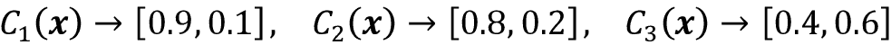
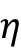

# 第七章：结合不同模型进行集成学习

在上一章中，我们专注于调整和评估不同分类模型的最佳实践。在本章中，我们将基于这些技术，探讨构建一组分类器的不同方法，这些方法通常比其单个成员具有更好的预测性能。我们将学习如何执行以下操作：

+   基于多数投票进行预测

+   使用装袋（bagging）通过重复随机组合训练数据集来减少过拟合。

+   应用提升（boosting）来从学习者的错误中构建强大的模型

# 使用集成学习

**集成方法**的目标是将不同的分类器组合成一个元分类器，其泛化性能比单独的每个分类器都更好。例如，假设我们从 10 位专家那里收集了预测结果，集成方法将允许我们通过策略性地结合这些预测结果，得出比每个单独专家预测更准确和更稳健的预测结果。正如您将在本章后面看到的，有几种不同的方法可以创建一组分类器的集成。本节将介绍集成如何工作的基本解释，以及为什么它们通常被认为能够产生良好的泛化性能。

在本章中，我们将专注于使用**多数投票**原则的最流行的集成方法。多数投票简单来说就是选择被多数分类器预测的类标签，即获得超过 50%投票的类标签。严格来说，“多数投票”这个术语仅适用于二元分类设置。然而，可以轻松将多数投票原则推广到多类别设置中，这被称为**多数票投票**（在英国，人们通过“绝对多数”和“相对多数”这两个术语来区分多数和多数投票）。

在这里，我们选择接收到最多票数的类标签（众数）。*图 7.1*说明了对于包含 10 个分类器的集成，多数投票和多数票投票的概念，其中每个唯一的符号（三角形、正方形和圆形）代表一个唯一的类标签：


图 7.1：不同的投票概念

使用训练数据集，我们首先训练*m*个不同的分类器(*C*[1], ..., *C*[m])。根据技术的不同，集成可以由不同的分类算法构建，例如决策树、支持向量机、逻辑回归分类器等。或者，我们也可以使用相同的基础分类算法，拟合训练数据集的不同子集。这种方法的一个显著例子是随机森林算法，它结合了不同的决策树分类器，我们在*第三章*《使用 Scikit-Learn 的机器学习分类器导览》中有所涵盖。*图 7.2*说明了使用多数投票的一般集成方法的概念：


图 7.2：一般集成方法

为了通过简单的多数投票来预测类标签，我们可以结合每个单独分类器*C*[j]的预测类标签，并选择获得最多票数的类标签，：


(在统计学中，众数是集合中最频繁出现的事件或结果。例如，mode{1, 2, 1, 1, 2, 4, 5, 4} = 1。)

例如，在一个二分类任务中，其中 class1 = -1，class2 = +1，我们可以将多数投票预测写成如下形式：


为了说明为什么集成方法可以比单独的分类器表现更好，让我们应用一些组合数学的概念。对于以下例子，我们假设所有*n*个基分类器对于二分类任务有相等的错误率，。此外，我们假设这些分类器是独立的，错误率不相关。在这些假设下，我们可以简单地将基分类器集成的错误概率表示为二项分布的概率质量函数：


在这里， 是二项式系数 *n choose k*。换句话说，我们计算集成预测错误的概率。现在，让我们看一个具体的例子，有 11 个基分类器(*n* = 11)，每个分类器的错误率为 0.25 ()：


**二项式系数**

二项式系数是指我们可以从大小为*n*的集合中选择*k*个无序元素的方式数；因此，它通常被称为“n choose k”。由于顺序在这里并不重要，二项式系数有时也被称为*组合数*或*组合数*，在其完整形式中，它的写法如下：


这里，符号(!)表示阶乘，例如，3! = 3×2×1 = 6。

正如您所看到的，集成的错误率（0.034）远低于每个单独分类器的错误率（0.25），如果所有假设都得到满足的话。请注意，在这个简化的示例中，一个由偶数个分类器进行的 50-50 分割被视为错误，然而这只有一半的时间是真实的。为了比较这样一个理想的集成分类器与一系列不同基本错误率上的基本分类器，让我们在 Python 中实现概率质量函数：

```py
>>> from scipy.special import comb
>>> import math
>>> def ensemble_error(n_classifier, error):
...     k_start = int(math.ceil(n_classifier / 2.))
...     probs = [comb(n_classifier, k) *
...              error**k *
...              (1-error)**(n_classifier - k)
...              for k in range(k_start, n_classifier + 1)]
...     return sum(probs)
>>> ensemble_error(n_classifier=11, error=0.25)
0.03432750701904297 
```

在我们实现了`ensemble_error`函数之后，我们可以计算一系列不同基础错误率的集成错误率，以可视化在一条线图中集成与基础错误之间的关系：

```py
>>> import numpy as np
>>> import matplotlib.pyplot as plt
>>> error_range = np.arange(0.0, 1.01, 0.01)
>>> ens_errors = [ensemble_error(n_classifier=11, error=error)
...               for error in error_range]
>>> plt.plot(error_range, ens_errors,
...          label='Ensemble error',
...          linewidth=2)
>>> plt.plot(error_range, error_range,
...          linestyle='--', label='Base error',
...          linewidth=2)
>>> plt.xlabel('Base error')
>>> plt.ylabel('Base/Ensemble error')
>>> plt.legend(loc='upper left')
>>> plt.grid(alpha=0.5)
>>> plt.show() 
```

如您在结果图中所见，集成的错误概率总是比单个基础分类器的错误要好，只要基础分类器表现优于随机猜测（）。

请注意，*y* 轴显示了基本错误（虚线）以及集成错误（实线）：


图 7.3：集成错误与基本错误的绘图

# 通过多数投票组合分类器

在前一节对集成学习的简短介绍之后，让我们开始一个热身练习，并在 Python 中实现一个简单的多数投票集成分类器。

**多数投票**

尽管我们将在本节讨论的多数投票算法也通过多数投票一般化到多类设置中，但为了简单起见，文献中通常使用“多数投票”这个术语。

## 实现一个简单的多数投票分类器

我们将在本节实现的算法允许我们结合具有置信度的不同分类算法。我们的目标是构建一个更强大的元分类器，以平衡特定数据集上个别分类器的弱点。更精确地说，我们可以将加权多数投票写成如下形式：


这里，*w*[j] 是与基分类器 *C*[j] 相关联的权重； 是集成预测的类标签；*A* 是唯一类标签的集合；（希腊字母 chi）是特征函数或指示函数，如果第 *j* 个分类器的预测类与 *i* 匹配，则返回 1（*C*j = *i*）。对于相等的权重，我们可以简化这个方程并写成如下形式：


为了更好地理解*加权*的概念，我们现在来看一个更具体的例子。假设我们有三个基分类器的集成，，我们想要预测给定示例**x**的类标签，。其中三个基分类器中的两个预测类标签为 0，而一个*C*[3]预测示例属于类 1。如果我们对每个基分类器的预测进行平等加权，多数投票预测该示例属于类 0：


现在，让我们给*C*[3]分配权重为 0.6，并且让*C*[1]和*C*[2]的权重系数为 0.2：


更简单地说，因为 3×0.2 = 0.6，我们可以说*C*[3]的预测比*C*[1]或*C*[2]的预测重三倍，可以写成如下形式：


要将加权多数投票的概念翻译成 Python 代码，我们可以使用 NumPy 方便的`argmax`和`bincount`函数，其中`bincount`函数统计每个类标签的出现次数。然后`argmax`函数返回最高计数的索引位置，对应于多数类标签（假设类标签从 0 开始）：

```py
>>> import numpy as np
>>> np.argmax(np.bincount([0, 0, 1],
...           weights=[0.2, 0.2, 0.6]))
1 
```

正如您在第三章关于逻辑回归的讨论中所记得的那样，scikit-learn 中的某些分类器也可以通过`predict_proba`方法返回预测类标签的概率。如果我们集成中的分类器被很好地校准，使用预测的类概率而不是类标签进行多数投票可能会很有用。从概率中预测类标签的修改版本可以写成如下形式：


这里，*p*[ij]是第*j*个分类器对类标签*i*的预测概率。

继续我们之前的例子，假设我们有一个二元分类问题，类标签为，并且有三个分类器的集成，。假设分类器*C*[j]为特定示例**x**返回以下类成员概率：



使用与之前相同的权重（0.2、0.2 和 0.6），我们可以计算各个类别概率如下：


要基于类别概率实现加权多数投票，我们可以再次利用 NumPy，使用`np.average`和`np.argmax`：

```py
>>> ex = np.array([[0.9, 0.1],
...                [0.8, 0.2],
...                [0.4, 0.6]])
>>> p = np.average(ex, axis=0, weights=[0.2, 0.2, 0.6])
>>> p
array([0.58, 0.42])
>>> np.argmax(p)
0 
```

把所有东西放在一起，现在让我们用 Python 实现`MajorityVoteClassifier`：

```py
from sklearn.base import BaseEstimator
from sklearn.base import ClassifierMixin
from sklearn.preprocessing import LabelEncoder
from sklearn.base import clone
from sklearn.pipeline import _name_estimators
import numpy as np
import operator
class MajorityVoteClassifier(BaseEstimator, ClassifierMixin):
    def __init__(self, classifiers, vote='classlabel', weights=None):

        self.classifiers = classifiers
        self.named_classifiers = {
            key: value for key,
            value in _name_estimators(classifiers)
        }
        self.vote = vote
        self.weights = weights

    def fit(self, X, y):
        if self.vote not in ('probability', 'classlabel'):
            raise ValueError(f"vote must be 'probability' "
                             f"or 'classlabel'"
                             f"; got (vote={self.vote})")
        if self.weights and
        len(self.weights) != len(self.classifiers):
            raise ValueError(f'Number of classifiers and'
                             f' weights must be equal'
                             f'; got {len(self.weights)} weights,'
                             f' {len(self.classifiers)} classifiers')
        # Use LabelEncoder to ensure class labels start
        # with 0, which is important for np.argmax
        # call in self.predict
        self.lablenc_ = LabelEncoder()
        self.lablenc_.fit(y)
        self.classes_ = self.lablenc_.classes_
        self.classifiers_ = []
        for clf in self.classifiers:
            fitted_clf = clone(clf).fit(X,
                               self.lablenc_.transform(y))
            self.classifiers_.append(fitted_clf)
        return self 
```

我们已经在代码中添加了很多注释来解释各个部分。然而，在我们实现剩余的方法之前，让我们先快速休息一下，并讨论一些乍看起来可能令人困惑的代码。我们使用了`BaseEstimator`和`ClassifierMixin`父类来免费获取一些基本功能，包括`get_params`和`set_params`方法用于设置和返回分类器的参数，以及`score`方法用于计算预测准确性。

接下来，我们将添加`predict`方法，根据类标签的多数投票预测类别标签，如果我们使用`vote='classlabel'`初始化一个新的`MajorityVoteClassifier`对象。或者，我们可以初始化集成分类器为`vote='probability'`，以基于类成员概率预测类标签。此外，我们还将添加`predict_proba`方法返回平均概率，这在计算**接收器操作特征曲线下面积**（**ROC AUC**）时非常有用：

```py
 def predict(self, X):
        if self.vote == 'probability':
            maj_vote = np.argmax(self.predict_proba(X), axis=1)
        else: # 'classlabel' vote

            # Collect results from clf.predict calls
            predictions = np.asarray([
                clf.predict(X) for clf in self.classifiers_
            ]).T

            maj_vote = np.apply_along_axis(
                lambda x: np.argmax(
                    np.bincount(x, weights=self.weights)
                ),
                axis=1, arr=predictions
            )
        maj_vote = self.lablenc_.inverse_transform(maj_vote)
        return maj_vote

    def predict_proba(self, X):
        probas = np.asarray([clf.predict_proba(X)
                             for clf in self.classifiers_])
        avg_proba = np.average(probas, axis=0,
                               weights=self.weights)
        return avg_proba

    def get_params(self, deep=True):
        if not deep:
            return super().get_params(deep=False)
        else:
            out = self.named_classifiers.copy()
            for name, step in self.named_classifiers.items():
                for key, value in step.get_params(
                        deep=True).items():
                    out[f'{name}__{key}'] = value
            return out 
```

此外，请注意，我们定义了自己修改版的`get_params`方法来使用`_name_estimators`函数访问集成中各个分类器的参数；这一开始可能看起来有点复杂，但当我们在后续章节中使用网格搜索进行超参数调整时，这将变得非常合理。

**scikit-learn 中的 VotingClassifier**

尽管`MajorityVoteClassifier`的实现非常适合演示目的，但我们基于本书第一版的实现在 scikit-learn 中实现了一个更复杂的多数投票分类器版本。这个集成分类器在 scikit-learn 版本 0.17 及更高版本中可用作`sklearn.ensemble.VotingClassifier`。您可以在[`scikit-learn.org/stable/modules/generated/sklearn.ensemble.VotingClassifier.html`](https://scikit-learn.org/stable/modules/generated/sklearn.ensemble.VotingClassifier.html)找到更多关于`VotingClassifier`的信息。

## 使用多数投票原则进行预测

现在是时候将我们在前一节中实现的`MajorityVoteClassifier`投入使用了。但首先，让我们准备一个可以测试它的数据集。由于我们已经熟悉如何从 CSV 文件加载数据集的技巧，我们将采取捷径，并从 scikit-learn 的`datasets`模块加载鸢尾花数据集。此外，我们将仅选择两个特征，即*萼片宽度*和*花瓣长度*，以便更具挑战性地进行分类任务进行说明。尽管我们的`MajorityVoteClassifier`适用于多类问题，但我们只会对来自`Iris-versicolor`和`Iris-virginica`类别的鸢尾花示例进行分类，之后我们将计算 ROC AUC。代码如下：

```py
>>> from sklearn import datasets
>>> from sklearn.model_selection import train_test_split
>>> from sklearn.preprocessing import StandardScaler
>>> from sklearn.preprocessing import LabelEncoder
>>> iris = datasets.load_iris()
>>> X, y = iris.data[50:, [1, 2]], iris.target[50:]
>>> le = LabelEncoder()
>>> y = le.fit_transform(y) 
```

**来自决策树的类成员概率**

请注意，scikit-learn 使用`predict_proba`方法（如果适用）来计算 ROC AUC 分数。在*第三章*中，我们看到了逻辑回归模型中如何计算类概率。在决策树中，概率是从训练时为每个节点创建的频率向量中计算出来的。该向量收集每个类标签在该节点处从类标签分布计算出的频率值。然后，对频率进行归一化，使它们总和为 1。同样，k 最近邻居算法中的 k 个最近邻居的类标签被聚合以返回 k 最近邻居算法中的归一化类标签频率。虽然决策树和 k 最近邻分类器返回的归一化概率看似与逻辑回归模型中获得的概率相似，但我们必须意识到它们实际上并不是从概率质量函数中导出的。

接下来，我们将把鸢尾花示例分为 50%的训练数据和 50%的测试数据：

```py
>>> X_train, X_test, y_train, y_test =\
...     train_test_split(X, y,
...                      test_size=0.5,
...                      random_state=1,
...                      stratify=y) 
```

使用训练数据集，我们现在将训练三种不同的分类器：

+   逻辑回归分类器

+   决策树分类器

+   k 最近邻分类器

然后，在将它们组合成集成分类器之前，我们将在训练数据集上通过 10 折交叉验证评估每个分类器的模型性能：

```py
>>> from sklearn.model_selection import cross_val_score
>>> from sklearn.linear_model import LogisticRegression
>>> from sklearn.tree import DecisionTreeClassifier
>>> from sklearn.neighbors import KNeighborsClassifier
>>> from sklearn.pipeline import Pipeline
>>> import numpy as np
>>> clf1 = LogisticRegression(penalty='l2',
...                           C=0.001,
...                           solver='lbfgs',
...                           random_state=1)
>>> clf2 = DecisionTreeClassifier(max_depth=1,
...                               criterion='entropy',
...                               random_state=0)
>>> clf3 = KNeighborsClassifier(n_neighbors=1,
...                             p=2,
...                             metric='minkowski')
>>> pipe1 = Pipeline([['sc', StandardScaler()],
...                   ['clf', clf1]])
>>> pipe3 = Pipeline([['sc', StandardScaler()],
...                   ['clf', clf3]])
>>> clf_labels = ['Logistic regression', 'Decision tree', 'KNN']
>>> print('10-fold cross validation:\n')
>>> for clf, label in zip([pipe1, clf2, pipe3], clf_labels):
...     scores = cross_val_score(estimator=clf,
...                              X=X_train,
...                              y=y_train,
...                              cv=10,
...                              scoring='roc_auc')
...     print(f'ROC AUC: {scores.mean():.2f} '
...           f'(+/- {scores.std():.2f}) [{label}]') 
```

我们收到的输出如下片段所示，显示了各个分类器的预测性能几乎相等：

```py
10-fold cross validation:
ROC AUC: 0.92 (+/- 0.15) [Logistic regression]
ROC AUC: 0.87 (+/- 0.18) [Decision tree]
ROC AUC: 0.85 (+/- 0.13) [KNN] 
```

您可能想知道为什么我们要将逻辑回归和 k 最近邻分类器作为管道的一部分进行训练。其背后的原因是，正如在*第三章*中讨论的那样，与决策树不同，逻辑回归和 k 最近邻算法（使用欧几里得距离度量）都不是尺度不变的。虽然鸢尾花的特征都是在相同的尺度（厘米）上测量的，但习惯上使用标准化特征是一个好习惯。

现在，让我们继续进行更激动人心的部分，并将单独的分类器组合起来，形成我们的`MajorityVoteClassifier`：

```py
>>> mv_clf = MajorityVoteClassifier(
...     classifiers=[pipe1, clf2, pipe3]
... )
>>> clf_labels += ['Majority voting']
>>> all_clf = [pipe1, clf2, pipe3, mv_clf]
>>> for clf, label in zip(all_clf, clf_labels):
...     scores = cross_val_score(estimator=clf,
...                              X=X_train,
...                              y=y_train,
...                              cv=10,
...                              scoring='roc_auc')
...     print(f'ROC AUC: {scores.mean():.2f} '
...           f'(+/- {scores.std():.2f}) [{label}]')
ROC AUC: 0.92 (+/- 0.15) [Logistic regression]
ROC AUC: 0.87 (+/- 0.18) [Decision tree]
ROC AUC: 0.85 (+/- 0.13) [KNN]
ROC AUC: 0.98 (+/- 0.05) [Majority voting] 
```

正如您所看到的，`MajorityVotingClassifier`在 10 折交叉验证评估中的表现优于单独的分类器。

## 评估和调优集成分类器

在本节中，我们将从测试数据集计算 ROC 曲线，以检查`MajorityVoteClassifier`在未见数据上的泛化能力。我们必须记住，测试数据集不能用于模型选择；它的目的仅仅是报告分类器系统泛化性能的无偏估计：

```py
>>> from sklearn.metrics import roc_curve
>>> from sklearn.metrics import auc
>>> colors = ['black', 'orange', 'blue', 'green']
>>> linestyles = [':', '--', '-.', '-']
>>> for clf, label, clr, ls \
...     in zip(all_clf, clf_labels, colors, linestyles):
...     # assuming the label of the positive class is 1
...     y_pred = clf.fit(X_train,
...                      y_train).predict_proba(X_test)[:, 1]
...     fpr, tpr, thresholds = roc_curve(y_true=y_test,
...                                      y_score=y_pred)
...     roc_auc = auc(x=fpr, y=tpr)
...     plt.plot(fpr, tpr,
...              color=clr,
...              linestyle=ls,
...              label=f'{label} (auc = {roc_auc:.2f})')
>>> plt.legend(loc='lower right')
>>> plt.plot([0, 1], [0, 1],
...          linestyle='--',
...          color='gray',
...          linewidth=2)
>>> plt.xlim([-0.1, 1.1])
>>> plt.ylim([-0.1, 1.1])
>>> plt.grid(alpha=0.5)
>>> plt.xlabel('False positive rate (FPR)')
>>> plt.ylabel('True positive rate (TPR)')
>>> plt.show() 
```

如您在结果 ROC 图中所见，集成分类器在测试数据集上的表现也很好（ROC AUC = 0.95）。然而，您可以看到逻辑回归分类器在相同数据集上表现同样良好，这可能是由于高方差（在这种情况下，我们拆分数据集的敏感性）造成的，因为数据集的大小较小：


图 7.4：不同分类器的 ROC 曲线

由于我们只选择了两个特征作为分类示例，看看集成分类器的决策区域实际上是什么样子会很有趣。

虽然在模型拟合前无需对训练特征进行标准化，因为我们的逻辑回归和 k 近邻流水线会自动处理，但出于可视化目的，我们将标准化训练数据集，以便决策树的决策区域在相同尺度上。代码如下：

```py
>>> sc = StandardScaler()
>>> X_train_std = sc.fit_transform(X_train)
>>> from itertools import product
>>> x_min = X_train_std[:, 0].min() - 1
>>> x_max = X_train_std[:, 0].max() + 1
>>> y_min = X_train_std[:, 1].min() - 1
>>>
>>> y_max = X_train_std[:, 1].max() + 1
>>> xx, yy = np.meshgrid(np.arange(x_min, x_max, 0.1),
...                      np.arange(y_min, y_max, 0.1))
>>> f, axarr = plt.subplots(nrows=2, ncols=2,
...                         sharex='col',
...                         sharey='row',
...                         figsize=(7, 5))
>>> for idx, clf, tt in zip(product([0, 1], [0, 1]),
...                         all_clf, clf_labels):
...     clf.fit(X_train_std, y_train)
...     Z = clf.predict(np.c_[xx.ravel(), yy.ravel()])
...     Z = Z.reshape(xx.shape)
...     axarr[idx[0], idx[1]].contourf(xx, yy, Z, alpha=0.3)
...     axarr[idx[0], idx[1]].scatter(X_train_std[y_train==0, 0],
...                                   X_train_std[y_train==0, 1],
...                                   c='blue',
...                                   marker='^',
...                                   s=50)
...     axarr[idx[0], idx[1]].scatter(X_train_std[y_train==1, 0],
...                                   X_train_std[y_train==1, 1],
...                                   c='green',
...                                   marker='o',
...                                   s=50)
...     axarr[idx[0], idx[1]].set_title(tt)
>>> plt.text(-3.5, -5.,
...          s='Sepal width [standardized]',	
...          ha='center', va='center', fontsize=12)
>>> plt.text(-12.5, 4.5,
...          s='Petal length [standardized]',
...          ha='center', va='center',
...          fontsize=12, rotation=90)
>>> plt.show() 
```

有趣的是，但也是预期的，集成分类器的决策区域似乎是从各个单个分类器的决策区域混合而来的。乍一看，多数投票的决策边界看起来很像决策树桩的决策边界，后者在*sepal width* ≥ 1 时与 *y* 轴正交。

然而，您还可以注意到混入了 k 近邻分类器的非线性：


图 7.5：不同分类器的决策边界

在为集成分类调整单个分类器的参数之前，让我们调用`get_params`方法，以基本了解如何访问`GridSearchCV`对象中的单个参数：

```py
>>> mv_clf.get_params()
{'decisiontreeclassifier':
 DecisionTreeClassifier(class_weight=None, criterion='entropy',
                        max_depth=1, max_features=None,
                        max_leaf_nodes=None, min_samples_leaf=1,
                        min_samples_split=2,
                        min_weight_fraction_leaf=0.0,
                        random_state=0, splitter='best'),
 'decisiontreeclassifier__class_weight': None,
 'decisiontreeclassifier__criterion': 'entropy',
 [...]
 'decisiontreeclassifier__random_state': 0,
 'decisiontreeclassifier__splitter': 'best',
 'pipeline-1':
 Pipeline(steps=[('sc', StandardScaler(copy=True, with_mean=True,
                                       with_std=True)),
                 ('clf', LogisticRegression(C=0.001,
                                            class_weight=None,
                                            dual=False,
                                            fit_intercept=True,
                                            intercept_scaling=1,
                                            max_iter=100,
                                            multi_class='ovr',
                                            penalty='l2',
                                            random_state=0,
                                            solver='liblinear',
                                            tol=0.0001,
                                            verbose=0))]),
 'pipeline-1__clf':
 LogisticRegression(C=0.001, class_weight=None, dual=False,
                    fit_intercept=True, intercept_scaling=1,
                    max_iter=100, multi_class='ovr',
                    penalty='l2', random_state=0,
                    solver='liblinear', tol=0.0001, verbose=0),
 'pipeline-1__clf__C': 0.001,
 'pipeline-1__clf__class_weight': None,
 'pipeline-1__clf__dual': False,
 [...]
 'pipeline-1__sc__with_std': True,
 'pipeline-2':
 Pipeline(steps=[('sc', StandardScaler(copy=True, with_mean=True,
                                       with_std=True)),
                 ('clf', KNeighborsClassifier(algorithm='auto',
                                              leaf_size=30,
                                              metric='minkowski',
                                              metric_params=None,
                                              n_neighbors=1,
                                              p=2,
                                              weights='uniform'))]),
 'pipeline-2__clf':
 KNeighborsClassifier(algorithm='auto', leaf_size=30,
                      metric='minkowski', metric_params=None,
                      n_neighbors=1, p=2, weights='uniform'),
 'pipeline-2__clf__algorithm': 'auto',
 [...]
 'pipeline-2__sc__with_std': True} 
```

基于`get_params`方法返回的值，我们现在知道如何访问单个分类器的属性。现在让我们通过网格搜索来调整逻辑回归分类器的逆正则化参数`C`和决策树的深度，以进行演示：

```py
>>> from sklearn.model_selection import GridSearchCV
>>> params = {'decisiontreeclassifier__max_depth': [1, 2],
...           'pipeline-1__clf__C': [0.001, 0.1, 100.0]}
>>> grid = GridSearchCV(estimator=mv_clf,
...                     param_grid=params,
...                     cv=10,
...                     scoring='roc_auc')
>>> grid.fit(X_train, y_train) 
```

网格搜索完成后，我们可以打印不同的超参数值组合和通过 10 折交叉验证计算的平均 ROC AUC 分数如下：

```py
>>> for r, _ in enumerate(grid.cv_results_['mean_test_score']):
...     mean_score = grid.cv_results_['mean_test_score'][r]
...     std_dev = grid.cv_results_['std_test_score'][r]
...     params = grid.cv_results_['params'][r]
...     print(f'{mean_score:.3f} +/- {std_dev:.2f} {params}')
0.983 +/- 0.05 {'decisiontreeclassifier__max_depth': 1,
                'pipeline-1__clf__C': 0.001}
0.983 +/- 0.05 {'decisiontreeclassifier__max_depth': 1,
                'pipeline-1__clf__C': 0.1}
0.967 +/- 0.10 {'decisiontreeclassifier__max_depth': 1,
                'pipeline-1__clf__C': 100.0}
0.983 +/- 0.05 {'decisiontreeclassifier__max_depth': 2,
                'pipeline-1__clf__C': 0.001}
0.983 +/- 0.05 {'decisiontreeclassifier__max_depth': 2,
                'pipeline-1__clf__C': 0.1}
0.967 +/- 0.10 {'decisiontreeclassifier__max_depth': 2,
                'pipeline-1__clf__C': 100.0}
>>> print(f'Best parameters: {grid.best_params_}')
Best parameters: {'decisiontreeclassifier__max_depth': 1,
                  'pipeline-1__clf__C': 0.001}
>>> print(f'ROC AUC : {grid.best_score_:.2f}')
ROC AUC: 0.98 
```

如您所见，当我们选择较低的正则化强度（`C=0.001`）时，我们获得了最佳的交叉验证结果，而树的深度似乎对性能没有影响，这表明决策树桩足以分离数据。为了提醒自己不要在模型评估中多次使用测试数据集是一种不良实践，在本节中我们不会估计调整后的超参数的泛化性能。我们将迅速转向集成学习的另一种方法：**装袋法**。

**使用堆叠构建集成**

我们在本节中实施的多数投票方法不应与堆叠混淆。堆叠算法可以理解为一个两级集成，第一级包括个别分类器，它们将其预测传递给第二级，在第二级中，另一个分类器（通常是逻辑回归）适合于一级分类器的预测以进行最终预测。有关堆叠的更多信息，请参阅以下资源：

+   堆叠算法更详细地由 David H. Wolpert 在《Stacked generalization》中描述，*Neural Networks*，5(2)：241–259，1992 年 ([`www.sciencedirect.com/science/article/pii/S0893608005800231`](https://www.sciencedirect.com/science/article/pii/S0893608005800231))。

+   对于感兴趣的读者，可以在 YouTube 上找到我们关于堆叠的视频教程，网址为[`www.youtube.com/watch?v=8T2emza6g80`](https://www.youtube.com/watch?v=8T2emza6g80)。

+   mlxtend 提供了一个与 scikit-learn 兼容的堆叠分类器版本：[`rasbt.github.io/mlxtend/user_guide/classifier/StackingCVClassifier/`](http://rasbt.github.io/mlxtend/user_guide/classifier/StackingCVClassifier/)

+   此外，scikit-learn 最近添加了一个`StackingClassifier`（从版本 0.22 开始提供），有关更多信息，请参阅文档[`scikit-learn.org/stable/modules/generated/sklearn.ensemble.StackingClassifier.html`](https://scikit-learn.org/stable/modules/generated/sklearn.ensemble.StackingClassifier.html)。

# Bagging – 从自举样本中构建分类器的集成

Bagging 是一种与我们在前一节中实现的`MajorityVoteClassifier`密切相关的集成学习技术。但是，与在集成中使用相同的训练数据集来拟合个别分类器不同，我们从初始训练数据集中抽取自举样本（有替换地随机抽样），这就是为什么 bagging 也被称为*bootstrap aggregating*的原因。

Bagging 的概念总结在*Figure 7.6*中：


Figure 7.6: Bagging 的概念

在接下来的小节中，我们将手动进行一个简单的 bagging 示例，并使用 scikit-learn 来分类葡萄酒示例。

## Bagging 简介

为了提供一个更具体的例子来说明一个 bagging 分类器的自举聚合是如何工作的，让我们考虑*Figure 7.7*中显示的例子。在这里，我们有七个不同的训练实例（标记为索引 1-7），在每一轮 bagging 中随机且有替换地抽样。然后每个自举样本用于拟合分类器*C*[j]，这通常是一个未修剪的决策树：


Figure 7.7: Bagging 的一个例子

正如您从 *图 7.7* 中所看到的，每个分类器从训练数据集中接收一个随机子集。我们将这些通过 bagging 获得的随机样本标记为 *Bagging round 1*、*Bagging round 2* 等等。每个子集包含一定比例的重复项，一些原始样本由于使用替换采样，可能根本不会出现在重新采样的数据集中。一旦个别分类器适合于自举样本，预测结果就会使用多数投票结合起来。

注意，bagging 还与我们在 *第三章* 中介绍的随机森林分类器相关。事实上，随机森林是 bagging 的一种特殊情况，我们在适合个别决策树时也使用随机特征子集。

**使用 bagging 的模型集成**

Bagging 最初由 Leo Breiman 在 1994 年的一份技术报告中提出；他还表明，bagging 可以提高不稳定模型的准确性并降低过拟合的程度。我们强烈建议您阅读 *L. Breiman* 的 *Bagging predictors* 中的研究，发表于 *Machine Learning*，24(2):123–140, 1996 年，这篇文章可以在网上免费获取，以了解有关 bagging 的更多细节。

## 应用 bagging 对 Wine 数据集中的示例进行分类

要看到 bagging 的实际效果，让我们使用在 *第四章* *构建良好的训练数据集 – 数据预处理* 中介绍的 Wine 数据集创建一个更复杂的分类问题。在这里，我们只考虑 Wine 类别 2 和 3，并选择两个特征 – `Alcohol` 和 `OD280/OD315 of diluted wines`：

```py
>>> import pandas as pd
>>> df_wine = pd.read_csv('https://archive.ics.uci.edu/ml/'
...                       'machine-learning-databases/'
...                       'wine/wine.data',
...                       header=None)
>>> df_wine.columns = ['Class label', 'Alcohol',
...                    'Malic acid', 'Ash',
...                    'Alcalinity of ash',
...                    'Magnesium', 'Total phenols',
...                    'Flavanoids', 'Nonflavanoid phenols',
...                    'Proanthocyanins',
...                    'Color intensity', 'Hue',
...                    'OD280/OD315 of diluted wines',
...                    'Proline']
>>> # drop 1 class
>>> df_wine = df_wine[df_wine['Class label'] != 1]
>>> y = df_wine['Class label'].values
>>> X = df_wine[['Alcohol',
...              'OD280/OD315 of diluted wines']].values 
```

接下来，我们将把类标签编码成二进制格式，并将数据集拆分为 80% 的训练集和 20% 的测试集：

```py
>>> from sklearn.preprocessing import LabelEncoder
>>> from sklearn.model_selection import train_test_split
>>> le = LabelEncoder()
>>> y = le.fit_transform(y)
>>> X_train, X_test, y_train, y_test =\
...            train_test_split(X, y,
...                             test_size=0.2,
...                             random_state=1,
...                             stratify=y) 
```

**获取 Wine 数据集**

您可以在本书的代码捆绑包中找到 Wine 数据集（以及本书中使用的所有其他数据集），如果您离线工作或 UCI 服务器在 [`archive.ics.uci.edu/ml/machine-learning-databases/wine/wine.data`](https://archive.ics.uci.edu/ml/machine-learning-databases/wine/wine.data) 暂时不可用时可以使用它。例如，要从本地目录加载 Wine 数据集，请使用以下代码：

```py
df = pd.read_csv('https://archive.ics.uci.edu/ml/'
                 'machine-learning-databases'
                 '/wine/wine.data',
                 header=None) 
```

并用以下内容替换它们：

```py
df = pd.read_csv('your/local/path/to/wine.data',
                 header=None) 
```

在 scikit-learn 中已经实现了 `BaggingClassifier` 算法，我们可以从 `ensemble` 子模块导入它。在这里，我们将使用一个未修剪的决策树作为基分类器，并创建一个由训练数据集的不同自举样本拟合的 500 个决策树的集成：

```py
>>> from sklearn.ensemble import BaggingClassifier
>>> tree = DecisionTreeClassifier(criterion='entropy',
...                               random_state=1,
...                               max_depth=None)
>>> bag = BaggingClassifier(base_estimator=tree,
...                         n_estimators=500,
...                         max_samples=1.0,
...                         max_features=1.0,
...                         bootstrap=True,
...                         bootstrap_features=False,
...                         n_jobs=1,
...                         random_state=1) 
```

接下来，我们将计算训练集和测试集上预测的准确率分数，以比较 bagging 分类器的性能与单个未修剪决策树的性能：

```py
>>> from sklearn.metrics import accuracy_score
>>> tree = tree.fit(X_train, y_train)
>>> y_train_pred = tree.predict(X_train)
>>> y_test_pred = tree.predict(X_test)
>>> tree_train = accuracy_score(y_train, y_train_pred)
>>> tree_test = accuracy_score(y_test, y_test_pred)
>>> print(f'Decision tree train/test accuracies '
...       f'{tree_train:.3f}/{tree_test:.3f}')
Decision tree train/test accuracies 1.000/0.833 
```

基于我们在此处打印的准确度值，未修剪的决策树正确预测了所有训练样本的类标签；然而，显著较低的测试准确度表明模型具有高方差（过拟合）：

```py
>>> bag = bag.fit(X_train, y_train)
>>> y_train_pred = bag.predict(X_train)
>>> y_test_pred = bag.predict(X_test)
>>> bag_train = accuracy_score(y_train, y_train_pred)
>>> bag_test = accuracy_score(y_test, y_test_pred)
>>> print(f'Bagging train/test accuracies '
...       f'{bag_train:.3f}/{bag_test:.3f}')
Bagging train/test accuracies 1.000/0.917 
```

尽管决策树和装袋分类器在训练数据集上的训练准确率相似（均为 100%），我们可以看到装袋分类器在测试数据集上有稍微更好的泛化性能。接下来，让我们比较决策树和装袋分类器之间的决策区域：

```py
>>> x_min = X_train[:, 0].min() - 1
>>> x_max = X_train[:, 0].max() + 1
>>> y_min = X_train[:, 1].min() - 1
>>> y_max = X_train[:, 1].max() + 1
>>> xx, yy = np.meshgrid(np.arange(x_min, x_max, 0.1),
...                      np.arange(y_min, y_max, 0.1))
>>> f, axarr = plt.subplots(nrows=1, ncols=2,
...                         sharex='col',
...                         sharey='row',
...                         figsize=(8, 3))
>>> for idx, clf, tt in zip([0, 1],
...                         [tree, bag],
...                         ['Decision tree', 'Bagging']):
...     clf.fit(X_train, y_train)
...
...     Z = clf.predict(np.c_[xx.ravel(), yy.ravel()])
...     Z = Z.reshape(xx.shape)
...     axarr[idx].contourf(xx, yy, Z, alpha=0.3)
...     axarr[idx].scatter(X_train[y_train==0, 0],
...                        X_train[y_train==0, 1],
...                        c='blue', marker='^')
...     axarr[idx].scatter(X_train[y_train==1, 0],
...                        X_train[y_train==1, 1],
...                        c='green', marker='o')
...     axarr[idx].set_title(tt)
>>> axarr[0].set_ylabel('Alcohol', fontsize=12)
>>> plt.tight_layout()
>>> plt.text(0, -0.2,
...          s='OD280/OD315 of diluted wines',
...          ha='center',
...          va='center',
...          fontsize=12,
...          transform=axarr[1].transAxes)
>>> plt.show() 
```

如我们在得出的绘图中所见，三节点深度决策树的分段线性决策边界在装袋法集成中看起来更加平滑：


图 7.8：决策树的分段线性决策边界与装袋法的对比

在本节中，我们只讨论了一个非常简单的装袋示例。在实践中，更复杂的分类任务和数据集的高维度很容易导致单个决策树过拟合，这正是装袋算法可以发挥其优势的地方。最后，我们必须注意，装袋算法可以是降低模型方差的有效方法。然而，装袋在减少模型偏差方面效果不佳，也就是说，模型过于简单无法很好地捕捉数据中的趋势。这就是为什么我们希望在偏差较低的分类器集成上执行装袋，例如未修剪的决策树。

# 通过自适应提升利用弱学习者

在关于集成方法的最后一节中，我们将讨论**提升**，特别关注其最常见的实现方式：**自适应提升**（**AdaBoost**）。

**AdaBoost 的认知**

AdaBoost 的原始理念由 Robert E. Schapire 在 1990 年的《*弱可学习性的力量*》，*机器学习*，5(2)：197-227 中提出，详细可见于 [`rob.schapire.net/papers/strengthofweak.pdf`](http://rob.schapire.net/papers/strengthofweak.pdf)。在 Robert Schapire 和 Yoav Freund 于 *第十三届国际会议论文集*（ICML 1996）中展示 AdaBoost 算法后，AdaBoost 成为随后几年中最广泛使用的集成方法之一（*Experiments with a New Boosting Algorithm* 由 *Y. Freund*、*R. E. Schapire* 等人，*ICML*，96 年卷，148-156，1996）。2003 年，Freund 和 Schapire 因其开创性工作获得 Gödel 奖，这是计算机科学领域中最杰出出版物的一项重要奖项。

在提升中，集成由非常简单的基本分类器组成，通常称为**弱学习者**，它们通常仅比随机猜测略有优势—一个典型的弱学习者示例是决策树桩。提升背后的关键概念是专注于难以分类的训练样本，也就是让弱学习者连续从误分类的训练样本中学习，以提高集成的性能。

以下各小节将介绍增强学习和 AdaBoost 概念背后的算法过程。最后，我们将使用 scikit-learn 进行一个实际的分类示例。

## 自适应 Boosting 的工作原理

与 Bagging 相反，Boosting 算法的初始形式使用从训练数据集中无放回抽取的随机训练例子子集；原始 Boosting 过程可以总结为以下四个关键步骤：

1.  从训练数据集*D*中无放回地抽取一个随机子集（样本），*d*[1]，以训练一个弱学习器，*C*[1]。

1.  从训练数据集中无放回地抽取第二个随机训练子集，*d*[2]，并添加之前错误分类的例子的 50%来训练一个弱学习器，*C*[2]。

1.  找到训练数据集*D*中*C*[1]和*C*[2]不同意的训练例子*d*[3]，以训练第三个弱学习器*C*[3]。

1.  通过多数投票组合弱学习器*C*[1]、*C*[2]和*C*[3]。

正如 Leo Breiman 在 1996 年所讨论的（*偏差、方差和 arcing 分类器*），Boosting 相对于 Bagging 模型可以导致偏差和方差的减少。然而，在实践中，Boosting 算法如 AdaBoost 也以其高方差而闻名，即倾向于过拟合训练数据（*通过 G. Raetsch、T. Onoda 和 K. R. Mueller 的*An improvement of AdaBoost to avoid overfitting*，*Proceedings of the International Conference on Neural Information Processing*，*CiteSeer*，1998）。

与此处描述的原始 Boosting 过程相反，AdaBoost 使用完整的训练数据集来训练弱学习器，在每次迭代中重新加权训练例子，以构建一个从前一组合中的弱学习器错误中学习的强分类器。

在我们深入讨论 AdaBoost 算法的具体细节之前，让我们看一下*Figure 7.9*，以更好地理解 AdaBoost 背后的基本概念：


图 7.9：AdaBoost 概念改进弱学习器

为了逐步浏览 AdaBoost 插图，我们将从子图 **1** 开始，该子图代表了一个用于二元分类的训练数据集，所有训练例子被分配相同的权重。基于这个训练数据集，我们训练一个决策树桩（显示为虚线），试图分类两类（三角形和圆圈）的例子，同时可能最小化损失函数（或者在决策树集成的特殊情况下是杂质评分）。

对于下一轮（子图 **2**），我们给之前错误分类的两个例子（圆圈）分配更大的权重。此外，我们降低正确分类例子的权重。接下来的决策树桩现在将更加关注那些具有最大权重的训练例子，即那些据称难以分类的训练例子。

在子图 **2** 中显示的弱学习器错误分类了三个来自圆圈类的不同例子，然后在子图 **3** 中分配了更大的权重。

假设我们的 AdaBoost 集成仅包括三轮增强，然后通过加权多数投票结合在不同的重新加权训练子集上训练的三个弱学习器，如子图 **4** 所示。

现在我们对 AdaBoost 的基本概念有了更好的理解，让我们使用伪代码更详细地了解算法。为了清晰起见，我们将用乘号（×）表示元素级乘法，用点号（⋅）表示两个向量的点积：

1.  将权重向量 **w** 设置为均匀权重，其中 .

1.  对于第 *j* 轮的 *m* 次增强，执行以下操作:

    1.  训练一个加权弱学习器: *C*[j] = train(**X**, **y**, **w**).

    1.  预测类别标签: .

    1.  计算加权错误率: .

    1.  计算系数: .

    1.  更新权重: .

    1.  将权重归一化为总和为 1: .

1.  计算最终预测: .

注意，在 *步骤 2c* 中，表达式  指的是一个由 1 和 0 组成的二进制向量，如果预测不正确则赋值为 1，否则赋值为 0。

尽管 AdaBoost 算法看起来非常直接，让我们通过一个具体的例子来详细介绍一下，该例子使用了包含 10 个训练样本的训练数据集，如 *图 7.10* 所示：


图 7.10: 通过 AdaBoost 算法运行 10 个训练样本

表的第一列显示了训练样本 1 到 10 的索引。第二列显示了个别样本的特征值，假设这是一个一维数据集。第三列显示了每个训练样本 *x*[i] 的真实类别标签 *y*[i]，其中 。第四列显示了初始权重；我们使用均匀初始化权重，并将它们归一化为总和为 1。对于这个 10 个样本的训练数据集，我们因此将每个权重 *w*[i] 赋值为 0.1，放在权重向量 **w** 中。预测的类别标签  显示在第五列，假设我们的分割标准为 。表的最后一列根据我们在伪代码中定义的更新规则显示了更新后的权重。

由于权重更新的计算起初可能看起来有些复杂，我们现在将一步步地跟随计算过程。我们将从计算加权错误率 （`epsilon`）开始，如 *步骤 2c* 中所述。

```py
>>> y = np.array([1, 1, 1, -1, -1, -1,  1,  1,  1, -1])
>>> yhat = np.array([1, 1, 1, -1, -1, -1, -1, -1, -1, -1])
>>> correct = (y == yhat)
>>> weights = np.full(10, 0.1)
>>> print(weights)
[0.1 0.1 0.1 0.1 0.1 0.1 0.1 0.1 0.1 0.1]
>>> epsilon = np.mean(~correct)
>>> print(epsilon)
0.3 
```

注意，`correct` 是一个布尔数组，其中包含 `True` 和 `False` 值，其中 `True` 表示预测是正确的。通过 `~correct`，我们反转数组，使 `np.mean(~correct)` 计算不正确预测的比例（`True` 计为值 1，`False` 计为值 0），即分类错误率。

接下来，我们将计算系数  ——显示在 *步骤 2d* 中 —— 这将稍后用于 *步骤 2e* 中更新权重，以及在多数投票预测 (*步骤 3*) 中的权重：

```py
>>> alpha_j = 0.5 * np.log((1-epsilon) / epsilon)
>>> print(alpha_j)
0.42364893019360184 
```

计算了系数 （`alpha_j`）之后，我们现在可以使用以下方程更新权重向量：


在这里， 是预测和真实类标签向量的逐元素乘积。因此，如果预测  是正确的， 将具有正号，以便我们减少第 *i* 个权重，因为  也是一个正数：

```py
>>> update_if_correct = 0.1 * np.exp(-alpha_j * 1 * 1)
>>> print(update_if_correct)
0.06546536707079771 
```

同样地，如果  预测的标签是错误的，我们将增加第 *i* 个权重，如下所示：

```py
>>> update_if_wrong_1 = 0.1 * np.exp(-alpha_j * 1 * -1)
>>> print(update_if_wrong_1)
0.1527525231651947 
```

或者，可以这样：

```py
>>> update_if_wrong_2 = 0.1 * np.exp(-alpha_j * 1 * -1)
>>> print(update_if_wrong_2) 
```

我们可以使用这些值来更新权重，如下所示：

```py
>>> weights = np.where(correct == 1,
...                    update_if_correct,
...                    update_if_wrong_1)
>>> print(weights)
array([0.06546537, 0.06546537, 0.06546537, 0.06546537, 0.06546537,
       0.06546537, 0.15275252, 0.15275252, 0.15275252, 0.06546537]) 
```

上面的代码将 `update_if_correct` 值分配给所有正确预测，并将 `update_if_wrong_1` 值分配给所有错误预测。为简单起见，我们省略了使用 `update_if_wrong_2`，因为它与 `update_if_wrong_1` 类似。

在更新了权重向量中的每个权重后，我们会归一化这些权重，使它们总和为 1 (*步骤 2f*)：


在代码中，我们可以这样实现：

```py
>>> normalized_weights = weights / np.sum(weights)
>>> print(normalized_weights)
[0.07142857 0.07142857 0.07142857 0.07142857 0.07142857 0.07142857
 0.16666667 0.16666667 0.16666667 0.07142857] 
```

因此，对于每个正确分类的示例，其对应的权重将从初始值 0.1 减少到下一轮增强的 0.0714。同样地，错误分类示例的权重将从 0.1 增加到 0.1667。

## 使用 scikit-learn 应用 AdaBoost

前一小节简要介绍了 AdaBoost。跳过更实际的部分，现在让我们通过 scikit-learn 训练 AdaBoost 集成分类器。我们将使用与前一节中训练装袋元分类器相同的 Wine 子集。

通过 `base_estimator` 属性，我们将在 500 个决策树桩上训练 `AdaBoostClassifier`：

```py
>>> from sklearn.ensemble import AdaBoostClassifier
>>> tree = DecisionTreeClassifier(criterion='entropy',
...                               random_state=1,
...                               max_depth=1)
>>> ada = AdaBoostClassifier(base_estimator=tree,
...                          n_estimators=500,
...                          learning_rate=0.1,
...                          random_state=1)
>>> tree = tree.fit(X_train, y_train)
>>> y_train_pred = tree.predict(X_train)
>>> y_test_pred = tree.predict(X_test)
>>> tree_train = accuracy_score(y_train, y_train_pred)
>>> tree_test = accuracy_score(y_test, y_test_pred)
>>> print(f'Decision tree train/test accuracies '
...       f'{tree_train:.3f}/{tree_test:.3f}')
Decision tree train/test accuracies 0.916/0.875 
```

如你所见，与前一节中看到的未修剪决策树相比，决策树桩似乎对训练数据欠拟合：

```py
>>> ada = ada.fit(X_train, y_train)
>>> y_train_pred = ada.predict(X_train)
>>> y_test_pred = ada.predict(X_test)
>>> ada_train = accuracy_score(y_train, y_train_pred)
>>> ada_test = accuracy_score(y_test, y_test_pred)
>>> print(f'AdaBoost train/test accuracies '
...       f'{ada_train:.3f}/{ada_test:.3f}')
AdaBoost train/test accuracies 1.000/0.917 
```

在这里，你可以看到 AdaBoost 模型完全预测了训练数据集的所有类标签，并且与决策树桩相比，测试数据集的表现稍有改善。然而，我们在尝试减少模型偏差时引入了额外的方差，导致训练和测试性能之间的差距增大。

尽管我们使用了另一个简单的示例来进行演示，但我们可以看到 AdaBoost 分类器的性能略有改善，比决策桩实现了非常相似的准确性分数，就像我们在前一节中训练的装袋分类器一样。然而，我们必须注意，基于重复使用测试数据集来选择模型被认为是不良实践。我们在*第六章* *，学习模型评估和超参数调整的最佳实践*中更详细地讨论了广义性能估计可能过于乐观的问题。

最后，让我们看看决策区域的具体情况：

```py
>>> x_min = X_train[:, 0].min() - 1
>>> x_max = X_train[:, 0].max() + 1
>>> y_min = X_train[:, 1].min() - 1
>>> y_max = X_train[:, 1].max() + 1
>>> xx, yy = np.meshgrid(np.arange(x_min, x_max, 0.1),
...                      np.arange(y_min, y_max, 0.1))
>>> f, axarr = plt.subplots(1, 2,
...                         sharex='col',
...                         sharey='row',
...                         figsize=(8, 3))
>>> for idx, clf, tt in zip([0, 1],
...                         [tree, ada],
...                         ['Decision tree', 'AdaBoost']):
...     clf.fit(X_train, y_train)
...     Z = clf.predict(np.c_[xx.ravel(), yy.ravel()])
...     Z = Z.reshape(xx.shape)
...     axarr[idx].contourf(xx, yy, Z, alpha=0.3)
...     axarr[idx].scatter(X_train[y_train==0, 0],
...                        X_train[y_train==0, 1],
...                        c='blue',
...                        marker='^')
...     axarr[idx].scatter(X_train[y_train==1, 0],
...                        X_train[y_train==1, 1],
...                        c='green',
...                        marker='o')
...     axarr[idx].set_title(tt)
...     axarr[0].set_ylabel('Alcohol', fontsize=12)
>>> plt.tight_layout()
>>> plt.text(0, -0.2,
...          s='OD280/OD315 of diluted wines',
...          ha='center',
...          va='center',
...          fontsize=12,
...          transform=axarr[1].transAxes)
>>> plt.show() 
```

通过观察决策区域，您可以看到 AdaBoost 模型的决策边界比决策桩的决策边界复杂得多。此外，请注意，AdaBoost 模型将特征空间分隔得与我们在前一节中训练的装袋分类器非常相似：


图 7.11：决策树与 AdaBoost 的决策边界

作为集成技术的总结，值得注意的是，与单个分类器相比，集成学习增加了计算复杂性。在实践中，我们需要仔细考虑是否愿意为预测性能的相对较小改进支付增加的计算成本。

这种权衡的一个常被引用的例子是著名的**1 百万美元 *Netflix Prize* **，它是使用集成技术赢得的。有关算法的详细信息已在*The BigChaos Solution to the Netflix Grand Prize*中由*A. Toescher*，*M. Jahrer*和*R. M. Bell*发表，*Netflix Prize documentation*，2009 年，可在[`www.stat.osu.edu/~dmsl/GrandPrize2009_BPC_BigChaos.pdf`](http://www.stat.osu.edu/~dmsl/GrandPrize2009_BPC_BigChaos.pdf)找到。获奖团队获得了 100 万美元的大奖金；然而，由于其复杂性，Netflix 从未实施过他们的模型，这使得它在现实世界中难以应用：

> “我们离线评估了一些新方法，但我们测量到的额外准确度增益似乎不足以证明将它们引入生产环境所需的工程投入是合理的。”
> 
> [`techblog.netflix.com/2012/04/netflix-recommendations-beyond-5-stars.html`](http://techblog.netflix.com/2012/04/netflix-recommendations-beyond-5-stars.html)

# 梯度提升 - 基于损失梯度训练集成

梯度提升是前一节介绍的增强概念的另一种变体，即连续训练弱学习器以创建强大的集成。梯度提升是一个极其重要的主题，因为它构成了流行的机器学习算法（如 XGBoost）的基础，这些算法以在 Kaggle 竞赛中获胜而闻名。

梯度提升算法一开始可能显得有点令人畏惧。因此，在接下来的小节中，我们将逐步覆盖它，从一个总体概述开始。然后，我们将看到梯度提升是如何用于分类，并通过一个例子详细介绍。最后，在介绍了梯度提升的基本概念后，我们将简要介绍一些流行的实现，比如 XGBoost，并探讨如何在实践中应用梯度提升。

## 比较 AdaBoost 和梯度提升

从根本上讲，梯度提升与 AdaBoost 非常相似，我们在本章之前已经讨论过 AdaBoost。AdaBoost 基于前一个决策树桩的错误训练决策树桩。特别是，在每一轮中使用错误来计算样本权重，以及在将各个树桩组合成集合时为每个决策树桩计算分类器权重。一旦达到最大迭代次数（决策树桩数），我们就停止训练。与 AdaBoost 类似，梯度提升以迭代方式使用预测错误拟合决策树。然而，梯度提升树通常比决策树桩更深，通常具有 3 到 6 的最大深度（或 8 到 64 个叶节点的最大数量）。此外，与 AdaBoost 不同的是，梯度提升不使用预测错误来分配样本权重；它们直接用于形成下一个树的目标变量的拟合。此外，与 AdaBoost 不同的是，梯度提升使用全局学习率，该学习率对每棵树都是相同的，而不是每棵树都有一个单独的加权项。

如您所见，AdaBoost 和梯度提升在某些关键方面有相似之处，但也有所不同。在接下来的小节中，我们将概述梯度提升算法的一般轮廓。

## 描绘梯度提升算法的一般轮廓

在本节中，我们将研究用于分类的梯度提升。为简单起见，我们将看一个二分类的例子。对于感兴趣的读者，可以在 2001 年 Friedman 撰写的原始梯度提升论文中找到使用多类别设置和逻辑损失的一般化方法，即*第 4.6 节，多类逻辑回归和分类*，《贪婪函数逼近：梯度提升机》，[`projecteuclid.org/journals/annals-of-statistics/volume-29/issue-5/Greedy-function-approximation-A-gradient-boostingmachine/10.1214/aos/1013203451.full`](https://projecteuclid.org/journals/annals-of-statistics/volume-29/issue-5/Greedy-function-approximation-A-gradient-boostingmachine/10.1214/aos/1013203451.full)。

**梯度提升用于回归**

注意，梯度提升背后的过程比 AdaBoost 稍微复杂一些。为了简洁起见，我们忽略了 Friedman 在论文中提供的一个更简单的回归示例，但鼓励感兴趣的读者也考虑观看我关于回归梯度提升的补充视频教程，该视频教程可在以下链接找到：[`www.youtube.com/watch?v=zblsrxc7XpM`](https://www.youtube.com/watch?v=zblsrxc7XpM)。

实质上，梯度提升构建了一系列树，每棵树都适应于前一棵树的误差 —— 标签和预测值之间的差异。每一轮，树的集合都会因为我们通过小的更新将每棵树朝正确方向推动而得到改进。这些更新基于损失梯度，这也是梯度提升得名的原因。

接下来的步骤将介绍梯度提升背后的一般算法。在说明主要步骤后，我们将更详细地讨论其部分，并在接下来的小节中通过一个实际例子进行实操演示。

1.  初始化一个模型以返回一个常数预测值。为此，我们使用决策树的根节点；也就是说，一个只有一个叶节点的决策树。我们将树返回的值表示为 ，并通过最小化我们稍后将定义的可微损失函数 *L* 来找到该值：

    

    这里，*n* 指的是数据集中的 *n* 个训练样本。

1.  对于每棵树 *m* = 1, ..., *M*，其中 *M* 是用户指定的总树数，我们按下面 2a 到 2d 步骤进行如下计算：

    1.  计算预测值  与类标签 *y*[i] 之间的差异。这个值有时被称为伪响应或伪残差。更正式地说，我们可以将这个伪残差写成损失函数对预测值的负梯度：

        

        注意，在上述符号中，*F*(*x*) 是前一棵树的预测值，*F*[m]–1。因此，在第一轮中，这指的是步骤 1 中来自树（单叶节点）的常数值。

    1.  将树适配到伪残差 *r*[im] 上。我们使用符号 *R*[jm] 来表示在第 *m* 次迭代中生成的树的 *j* = 1 ... *J*[m] 叶节点。

    1.  对于每个叶节点 *R*[jm]，我们计算以下输出值：

        

        在下一小节中，我们将深入探讨如何通过最小化损失函数计算 。此时，我们已经注意到叶节点 *R*[jm] 可能包含多个训练样本，因此需要求和。

    1.  通过将输出值  添加到前一棵树来更新模型：

        

        然而，我们不是将当前树的完整预测值  添加到上一棵树 ，而是通过学习率  缩放 ，该学习率通常是介于 0.01 和 1 之间的小值。换句话说，我们通过小步骤增量更新模型，这有助于避免过拟合。

现在，在查看梯度提升的一般结构后，我们将采用这些机制来研究用于分类的梯度提升。

## 解释分类梯度提升算法

在这一小节中，我们将详细介绍实施二元分类梯度提升算法的细节。在这种情况下，我们将使用我们在《第三章》，《使用 Scikit-Learn 的机器学习分类器之旅》中为逻辑回归介绍的逻辑损失函数。对于单个训练示例，我们可以指定逻辑损失如下：


在《第三章》中，我们还介绍了对数几率：


出于后续合理性考虑，我们将使用这些对数几率来重写逻辑函数，如下所示（此处省略中间步骤）：


现在，我们可以定义损失函数对这些对数几率的偏导数，。该损失函数对对数几率的导数是：


在指定这些数学定义后，让我们现在重新审视前一节中一般梯度提升的*步骤 1*至*2d*，并为此二元分类场景重新制定它们。

1.  创建一个最小化逻辑损失的根节点。结果表明，如果根节点返回对数几率，则损失将最小化，。

1.  对于每棵树 *m* = 1, ..., *M*，其中 *M* 是用户指定的总树数，我们按*步骤 2a*至*2d*进行以下计算：

    1.  我们使用在逻辑回归中使用的熟悉逻辑函数将对数几率转换为概率：

        

        然后，我们计算伪残差，即损失对对数几率的负偏导数，其实是类标签与预测概率之间的差：

        

    1.  将新树适应于伪残差。

    1.  对于每个叶子节点 *R*[jm]，计算一个值 ，该值最小化逻辑损失函数。这包括一个摘要步骤，用于处理包含多个训练示例的叶子节点：

        

        跳过中间数学细节，得到以下结果：

        

        请注意，此处的求和仅限于与叶子节点 *R*[jm] 对应的节点示例，而不是完整的训练集。

    1.  通过将学习率为  的 *step 2c* 中的 gamma 值添加到模型中进行更新：

    

**输出对数几率与概率的差异**

为什么树返回的是对数几率而不是概率？这是因为我们不能简单地将概率值相加并得出有意义的结果。（因此，严格来说，用于分类的梯度提升使用回归树。）

在本节中，我们采用了通用的梯度提升算法，并将其具体化为二元分类，例如，通过将通用损失函数替换为逻辑损失函数和预测值替换为对数几率。然而，许多个别步骤可能仍然显得非常抽象，在下一节中，我们将这些步骤应用到一个具体的示例中。

## 展示分类梯度提升

前两个小节介绍了用于二元分类的梯度提升算法的简化数学细节。为了更清楚地解释这些概念，让我们将其应用到一个小型玩具示例中，即以下三个示例的训练数据集，如 *Figure 7.12* 所示：


图 7.12：用于解释梯度提升的玩具数据集

让我们从 *step 1* 开始，构建根节点并计算对数几率，以及 *step 2a*，将对数几率转换为类成员概率并计算伪残差。请注意，根据我们在 *Chapter 3* 中学到的内容，几率可以计算为成功的数量除以失败的数量。在这里，我们将标签 1 视为成功，标签 0 视为失败，因此几率计算为：几率 = 2/1。执行 *1* 和 *2a* 步骤后，我们得到以下结果，如 *Figure 7.13* 所示：


图 7.13：应用步骤 1 和步骤 2a 第一轮的结果

接下来，在 *step 2b* 中，我们在伪残差 *r* 上拟合一个新的树。然后，在 *step 2c* 中，我们计算该树的输出值，，如 *Figure 7.14* 所示：


图 7.14：展示步骤 2b 和 2c，即将决策树拟合到残差上，并计算每个叶节点的输出值

（请注意，我们人为地限制了树只有两个叶节点，这有助于说明如果一个叶节点包含多个示例会发生什么。）

然后，在最后的 *step 2d* 中，我们更新前一模型和当前模型。假设学习率为 ，第一个训练示例的预测结果如 *Figure 7.15* 所示：


图 7.15：在第一个训练示例的背景下展示前一模型的更新

现在我们已经完成了第一轮的 *步骤 2a* 到 *2d*，*m* = 1，我们可以继续执行第二轮的 *步骤 2a* 到 *2d*，*m* = 2\. 在第二轮中，我们使用更新模型返回的 log(odds)，例如，，作为 *步骤 2A* 的输入。我们在第二轮获得的新值显示在 *图 7.16* 中：


图 7.16：第二轮中的值与第一轮旁边的值

我们已经可以看到，对于正类别，预测的概率更高，而对于负类别，预测的概率更低。因此，残差也在变小。请注意，*步骤 2a* 到 *2d* 的过程重复进行，直到我们拟合了 *M* 棵树或残差小于用户指定的阈值为止。然后，一旦梯度提升算法完成，我们可以使用它通过将最终模型的概率值 *F*M 阈值化为 0.5 来预测类标签，就像第三章中的逻辑回归一样。然而，与逻辑回归不同，梯度提升由多棵树组成，并产生非线性决策边界。在下一节中，我们将看看梯度提升是如何发挥作用的。

## 使用 XGBoost

在讲解了梯度提升背后的细枝末节之后，让我们最终看看如何使用梯度提升的代码实现。

在 scikit-learn 中，梯度提升被实现为 `sklearn.ensemble.GradientBoostingClassifier`（详见 [`scikit-learn.org/stable/modules/generated/sklearn.ensemble.GradientBoostingClassifier.html`](https://scikit-learn.org/stable/modules/generated/sklearn.ensemble.GradientBoostingClassifier.html) 获取更多详细信息）。值得注意的是，梯度提升是一个顺序过程，训练速度可能较慢。然而，在最近几年中，出现了更流行的梯度提升实现，即 XGBoost。

XGBoost 提出了几种技巧和近似方法，显著加快了训练过程。因此，XGBoost 的名称即为 extreme gradient boosting。此外，这些近似和技巧导致了非常好的预测性能。事实上，XGBoost 因为在许多 Kaggle 竞赛中取得了胜利而变得流行。

除了 XGBoost 外，还有其他流行的梯度提升实现，例如 LightGBM 和 CatBoost。受 LightGBM 的启发，scikit-learn 现在还实现了 `HistGradientBoostingClassifier`，比原始梯度提升分类器（`GradientBoostingClassifier`）性能更好。

您可以通过以下资源找到关于这些方法的更多细节：

+   `XGBoost`: [`xgboost.readthedocs.io/en/stable/`](https://xgboost.readthedocs.io/en/stable/)

+   `LightGBM`: [`lightgbm.readthedocs.io/en/latest/`](https://lightgbm.readthedocs.io/en/latest/)

+   `CatBoost`: [`catboost.ai`](https://catboost.ai)

+   `HistGradientBoostingClassifier`: [`scikit-learn.org/stable/modules/generated/sklearn.ensemble.HistGradientBoostingClassifier.html`](https://scikit-learn.org/stable/modules/generated/sklearn.ensemble.HistGradientBoostingClassifier.html)

然而，由于 XGBoost 仍然是最受欢迎的梯度提升实现之一，我们将看看如何在实践中使用它。首先，我们需要安装它，例如通过 `pip`：

```py
pip install xgboost 
```

**安装 XGBoost**

在本章中，我们使用了 XGBoost 版本 1.5.0，可以通过以下方式安装：

```py
pip install XGBoost==1.5.0 
```

更多有关安装细节的信息可以在 [`xgboost.readthedocs.io/en/stable/install.html`](https://xgboost.readthedocs.io/en/stable/install.html) 找到。

幸运的是，XGBoost 的 `XGBClassifier` 遵循了 scikit-learn 的 API。因此，使用它相对比较简单：

```py
>>> import xgboost as xgb
>>> model = xgb.XGBClassifier(n_estimators=1000, learning_rate=0.01,
...                           max_depth=4, random_state=1,
...                           use_label_encoder=False)
>>> gbm = model.fit(X_train, y_train)
>>> y_train_pred = gbm.predict(X_train)
>>> y_test_pred = gbm.predict(X_test)
>>> gbm_train = accuracy_score(y_train, y_train_pred)
>>> gbm_test = accuracy_score(y_test, y_test_pred)
>>> print(f'XGboost train/test accuracies '
...       f'{gbm_train:.3f}/{gbm_test:.3f}')
XGboost train/test accuracies 0.968/0.917 
```

在这里，我们使用了 1,000 棵树（回合）和学习率为 0.01 来拟合梯度提升分类器。通常建议学习率在 0.01 到 0.1 之间。但是，请记住，学习率用于缩放来自各个回合的预测。因此，直观地说，学习率越低，需要的估计器数量越多才能获得准确的预测。

接下来，我们有个体决策树的 `max_depth`，我们将其设置为 4。由于我们仍在增强弱学习器，因此在 2 到 6 之间选择一个值是合理的，但是根据数据集的不同，较大的值也可能表现良好。

最后，`use_label_encoder=False` 禁用了一条警告消息，告知用户 XGBoost 不再默认转换标签，并且期望用户以从标签 0 开始的整数格式提供标签。（这里没有什么可担心的，因为我们在本书中一直遵循这种格式。）

还有许多其他可用的设置，详细讨论超出了本书的范围。但是，有兴趣的读者可以在原始文档中找到更多细节，网址为 [`xgboost.readthedocs.io/en/latest/python/python_api.html#xgboost.XGBClassifier`](https://xgboost.readthedocs.io/en/latest/python/python_api.html#xgboost.XGBClassifier)。

# 总结

在本章中，我们研究了一些最流行和广泛使用的集成学习技术。集成方法结合了不同的分类模型，以消除它们各自的弱点，这通常会产生稳定且性能良好的模型，这对工业应用和机器学习竞赛非常有吸引力。

在本章的开头，我们用 Python 实现了`MajorityVoteClassifier`，它允许我们结合不同的分类算法。然后我们看了看 bagging，这是一种通过从训练数据集中随机抽取自举样本来减少模型方差的有用技术，并通过多数投票来结合各自训练的分类器。最后，我们学习了关于 AdaBoost 和梯度提升的 boosting 技术，这些算法基于训练弱学习器，并从错误中学习。

在前几章中，我们学到了关于不同学习算法、调优和评估技术的很多知识。在下一章中，我们将研究机器学习的一个特定应用，情感分析，这在互联网和社交媒体时代变得非常有趣。

# 加入我们书籍的 Discord 空间

加入书籍的 Discord 工作空间，与作者进行每月的*问我任何事*会话：

[`packt.link/MLwPyTorch`](https://packt.link/MLwPyTorch)


