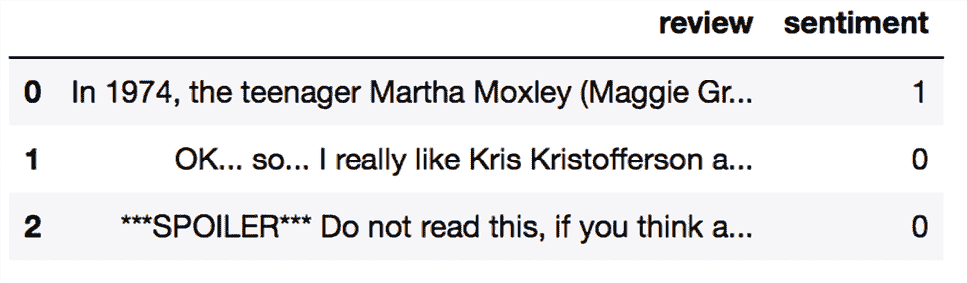
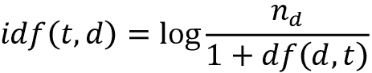
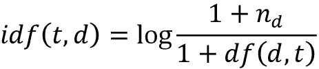
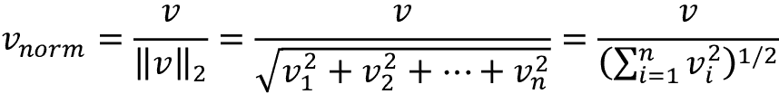
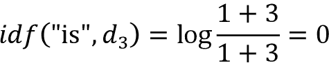
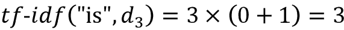
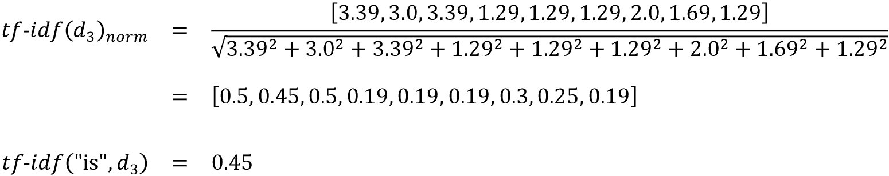

# 第八章：将机器学习应用于情感分析

在现代互联网和社交媒体时代，人们的意见、评论和推荐已成为政治科学和商业的宝贵资源。多亏了现代技术，我们现在能够最高效地收集和分析这些数据。在本章中，我们将深入探讨自然语言处理的一个子领域**情感分析**，并学习如何使用机器学习算法根据其情感（作者的态度）对文档进行分类。具体来说，我们将使用来自**互联网电影数据库**（**IMDb**）的 50,000 条电影评论数据集，并构建一个可以区分正面和负面评论的预测器。

本章涵盖的主题包括以下内容：

+   清理和准备文本数据

+   从文本文档中构建特征向量

+   训练一个机器学习模型来分类正面和负面电影评论

+   使用外存学习处理大文本数据集

+   从文档集合中推断主题以进行分类

# 准备 IMDb 电影评论数据进行文本处理

如前所述，情感分析，有时也称为**意见挖掘**，是自然语言处理的一个流行子学科；它涉及分析文档的情感。情感分析中的一个流行任务是根据作者对特定主题表达的观点或情绪对文档进行分类。

在本章中，我们将使用由 Andrew Maas 等人收集的 IMDb 电影评论大数据集（*学习情感分析的单词向量*，作者：*A. L. Maas*，*R. E. Daly*，*P. T. Pham*，*D. Huang*，*A. Y. Ng*和*C. Potts*，*第 49 届年度人类语言技术协会会议论文集：人类语言技术*，页码 142-150，俄勒冈州波特兰市，美国人类语言技术协会，2011 年 6 月）。电影评论数据集包含 50,000 条极性电影评论，标记为正面或负面；在此，正面意味着电影在 IMDb 上评分超过六星，负面意味着电影在 IMDb 上评分低于五星。在接下来的几节中，我们将下载数据集，预处理成适合机器学习工具使用的格式，并从这些电影评论的子集中提取有意义的信息，以构建一个可以预测某个评论者是否喜欢或不喜欢某部电影的机器学习模型。

## 获得电影评论数据集

可以从[`ai.stanford.edu/~amaas/data/sentiment/`](http://ai.stanford.edu/~amaas/data/sentiment/)下载电影评论数据集的压缩存档（84.1 MB），这是一个 gzip 压缩的 tarball 存档：

+   如果您使用 Linux 或 macOS，可以打开一个新的终端窗口，`cd` 到下载目录，并执行 `tar -zxf aclImdb_v1.tar.gz` 解压缩数据集。

+   如果您使用 Windows，可以下载一个免费的文件解压缩程序，比如 7-Zip ([`www.7-zip.org`](http://www.7-zip.org))，以从下载存档中提取文件。

+   或者，您可以直接在 Python 中解压缩 gzip 压缩的 tarball 存档，如下所示：

    ```py
    >>> import tarfile
    >>> with tarfile.open('aclImdb_v1.tar.gz', 'r:gz') as tar:
    ...     tar.extractall() 
    ```

## 将电影数据集预处理为更方便的格式

在成功提取数据集之后，我们现在将从解压缩的下载存档中组装单个文本文档到一个单独的 CSV 文件中。在以下代码部分中，我们将电影评论读入 pandas 的 `DataFrame` 对象中，这可能在标准台式计算机上需要长达 10 分钟。

为了可视化进度和预计完成时间，我们将使用**Python 进度指示器**（**PyPrind**，[`pypi.python.org/pypi/PyPrind/`](https://pypi.python.org/pypi/PyPrind/)）包，该包多年前为此类目的开发。PyPrind 可通过执行 `pip install pyprind` 命令安装：

```py
>>> import pyprind
>>> import pandas as pd
>>> import os
>>> import sys
>>> # change the 'basepath' to the directory of the
>>> # unzipped movie dataset
>>> basepath = 'aclImdb'
>>>
>>> labels = {'pos': 1, 'neg': 0}
>>> pbar = pyprind.ProgBar(50000, stream=sys.stdout)
>>> df = pd.DataFrame()
>>> for s in ('test', 'train'):
...     for l in ('pos', 'neg'):
...         path = os.path.join(basepath, s, l)
...         for file in sorted(os.listdir(path)):
...             with open(os.path.join(path, file),
...                       'r', encoding='utf-8') as infile:
...                 txt = infile.read()
...             df = df.append([[txt, labels[l]]],
...                            ignore_index=True)
...             pbar.update()
>>> df.columns = ['review', 'sentiment']
0%                          100%
[##############################] | ETA: 00:00:00
Total time elapsed: 00:00:25 
```

在上述代码中，我们首先使用 50,000 次迭代初始化了一个新的进度条对象 `pbar`，这是我们将要读取的文档数量。使用嵌套的 `for` 循环，我们迭代主 `aclImdb` 目录中的 `train` 和 `test` 子目录，并从 `pos` 和 `neg` 子目录中读取单独的文本文件，最终将其与整数类标签（1 = 正面，0 = 负面）一起追加到 `df` pandas 的 `DataFrame` 中。

由于组装数据集中的类标签已排序，我们现在将使用 `np.random` 子模块中的 `permutation` 函数来对 `DataFrame` 进行洗牌——这对于在后面的部分中将数据集拆分为训练集和测试集时将数据从本地驱动器直接流出非常有用。

为了方便起见，我们还将组装和打乱的电影评论数据集存储为 CSV 文件：

```py
>>> import numpy as np
>>> np.random.seed(0)
>>> df = df.reindex(np.random.permutation(df.index))
>>> df.to_csv('movie_data.csv', index=False, encoding='utf-8') 
```

由于我们将在本章后面使用这个数据集，让我们快速确认我们已成功以正确格式保存数据，方法是读取 CSV 并打印前三个示例的摘录：

```py
>>> df = pd.read_csv('movie_data.csv', encoding='utf-8')
>>> # the following column renaming is necessary on some computers:
>>> df = df.rename(columns={"0": "review", "1": "sentiment"})
>>> df.head(3) 
```

如果您在 Jupyter 笔记本中运行代码示例，现在应该看到数据集的前三个示例，如 *图 8.1* 所示：



图 8.1：电影评论数据集的前三行

作为健全性检查，在我们进入下一部分之前，请确保`DataFrame`包含所有 50,000 行：

```py
>>> df.shape
(50000, 2) 
```

# 介绍词袋模型

您可能还记得*第四章*，*构建良好的训练数据集 - 数据预处理*中，我们必须将分类数据（如文本或单词）转换为数值形式，然后才能传递给机器学习算法。在本节中，我们将介绍**词袋模型**，它允许我们将文本表示为数值特征向量。词袋模型背后的思想非常简单，可以总结如下：

1.  我们从整个文档集中创建一个唯一标记的词汇表，例如单词。

1.  我们从每个文档中构建一个特征向量，其中包含特定文档中每个单词出现的次数。

由于每个文档中的唯一单词仅代表词袋词汇表中所有单词的一小部分，特征向量将主要由零组成，这就是我们称之为**稀疏**的原因。如果这听起来太抽象，请不要担心；在接下来的小节中，我们将逐步介绍创建简单词袋模型的过程。

## 将单词转换为特征向量

要基于各个文档中的单词计数构建词袋模型，我们可以使用 scikit-learn 中实现的`CountVectorizer`类。如您将在以下代码部分中看到的那样，`CountVectorizer`接受一个文本数据数组，可以是文档或句子，并为我们构建词袋模型：

```py
>>> import numpy as np
>>> from sklearn.feature_extraction.text import CountVectorizer
>>> count = CountVectorizer()
>>> docs = np.array(['The sun is shining',
...                  'The weather is sweet',
...                  'The sun is shining, the weather is sweet,'
...                  'and one and one is two'])
>>> bag = count.fit_transform(docs) 
```

通过在`CountVectorizer`上调用`fit_transform`方法，我们构建了词袋模型的词汇表，并将以下三个句子转换为稀疏特征向量：

+   `'The sun is shining'`

+   `'The weather is sweet'`

+   `'The sun is shining, the weather is sweet, and one and one is two'`

现在，让我们打印词汇表的内容，以更好地理解其中的概念：

```py
>>> print(count.vocabulary_)
{'and': 0,
'two': 7,
'shining': 3,
'one': 2,
'sun': 4,
'weather': 8,
'the': 6,
'sweet': 5,
'is': 1} 
```

正如您从执行前述命令中看到的那样，词汇表存储在 Python 字典中，将唯一单词映射到整数索引。接下来，让我们打印刚刚创建的特征向量：

```py
>>> print(bag.toarray())
[[0 1 0 1 1 0 1 0 0]
 [0 1 0 0 0 1 1 0 1]
 [2 3 2 1 1 1 2 1 1]] 
```

这里特征向量中的每个索引位置对应于存储在`CountVectorizer`词汇表中的整数值，这些值也称为**原始词项频率**：*tf*(*t*, *d*) — 术语*t*在文档*d*中出现的次数。应注意，在词袋模型中，句子或文档中术语的顺序并不重要。特征向量中术语频率出现的顺序是从词汇索引派生的，通常按字母顺序分配。

**N-gram 模型**

我们刚刚创建的词袋模型中的项目序列也被称为 1-gram 或 unigram 模型，词汇表中的每个项目或标记代表一个单词。更一般地，在自然语言处理中，单词、字母或符号的连续序列也被称为*n-grams*。在 n-gram 模型中，数量 n 的选择取决于特定的应用程序；例如，Ioannis Kanaris 等人的研究显示，大小为 3 和 4 的 n-grams 在电子邮件的反垃圾邮件过滤中表现良好（*Words versus character n-grams for anti-spam filtering*作者是*Ioannis Kanaris*, *Konstantinos Kanaris*, *Ioannis Houvardas*, 和 *Efstathios Stamatatos*，*International Journal on Artificial Intelligence Tools*, *World Scientific Publishing Company*，16(06): 1047-1067，2007 年）。

总结一下 n-gram 表示法的概念，我们第一个文档“the sun is shining”的 1-gram 和 2-gram 表示法将如下构建：

+   1-gram: “the”, “sun”, “is”, “shining”

+   2-gram: “the sun”, “sun is”, “is shining”

在 scikit-learn 中，`CountVectorizer`类允许我们通过其`ngram_range`参数使用不同的 n-gram 模型。默认情况下使用 1-gram 表示，我们可以通过初始化新的`CountVectorizer`实例，并设置`ngram_range=(2,2)`切换到 2-gram 表示。

## 通过词项频率-逆文档频率评估词语相关性

当我们分析文本数据时，我们经常会遇到跨越两类文档中的多个文档出现的词语。这些频繁出现的词语通常不含有有用或歧视性信息。在本小节中，您将了解一个称为**词项频率-逆文档频率**（**tf-idf**）的有用技术，可用于降低特征向量中这些频繁出现的词语的权重。tf-idf 可以定义为术语频率和逆文档频率的乘积：

*tf-idf*(*t*, *d*) = *tf*(*t*, *d*) × *idf*(*t*, *d*)

在这里，*tf*(*t*, *d*)是我们在上一节介绍的词频，而*idf*(*t*, *d*)是逆文档频率，可以计算如下：



在这里，*n*[d]是文档的总数，而*df*(*d*, *t*)是包含术语*t*的文档*d*的数量。请注意，将常数 1 添加到分母是可选的，其目的是为未出现在任何训练示例中的术语分配一个非零值；*log*用于确保低文档频率不会被赋予太大的权重。

scikit-learn 库实现了另一个转换器，即`TfidfTransformer`类，它将来自`CountVectorizer`类的原始词项频率作为输入，并将其转换为 tf-idfs：

```py
>>> from sklearn.feature_extraction.text import TfidfTransformer
>>> tfidf = TfidfTransformer(use_idf=True,
...                          norm='l2',
...                          smooth_idf=True)
>>> np.set_printoptions(precision=2)
>>> print(tfidf.fit_transform(count.fit_transform(docs))
...       .toarray())
[[ 0\.    0.43  0\.    0.56  0.56  0\.    0.43  0\.    0\.  ]
 [ 0\.    0.43  0\.    0\.    0\.    0.56  0.43  0\.    0.56]
 [ 0.5   0.45  0.5   0.19  0.19  0.19  0.3   0.25  0.19]] 
```

正如你在前一小节中看到的，单词 `'is'` 在第三篇文档中具有最高的词频，是出现频率最高的单词。然而，在将相同的特征向量转换为 tf-idf 后，单词 `'is'` 现在与第三篇文档中的相对较小的 tf-idf（0.45）相关联，因为它还出现在第一篇和第二篇文档中，因此不太可能包含任何有用的区分信息。

然而，如果我们手动计算特征向量中各个术语的 tf-idf，我们会注意到 `TfidfTransformer` 计算 tf-idf 与我们之前定义的标准教科书方程式略有不同。在 scikit-learn 中实现的逆文档频率方程式如下计算：



类似地，scikit-learn 中计算的 tf-idf 稍微偏离了我们之前定义的默认方程式：

*tf-idf*(*t*, *d*) = *tf*(*t*, *d*) × (*idf*(*t*, *d*) + 1)

注意，先前 idf 方程中的“+1”是由于在前一个代码示例中设置了 `smooth_idf=True`，这对于将所有文档中出现的术语分配为零权重（即 *idf*(*t*, *d*) = log(1) = 0）非常有帮助。

尽管在计算 tf-idf 前，通常会先对原始词频进行归一化，但 `TfidfTransformer` 类直接对 tf-idf 进行归一化处理。默认情况下（`norm='l2'`），scikit-learn 的 `TfidfTransformer` 应用 L2 归一化，通过将未归一化的特征向量 *v* 除以其 L2 范数得到长度为 1 的向量：



为了确保我们理解 `TfidfTransformer` 的工作原理，让我们通过一个示例来计算第三篇文档中单词 `'is'` 的 tf-idf。单词 `'is'` 在第三篇文档中的词频为 3（*tf* = 3），而此单词的文档频率为 3，因为单词 `'is'` 出现在所有三篇文档中（*df* = 3）。因此，我们可以计算逆文档频率如下：



现在，为了计算 tf-idf，我们只需在逆文档频率上加 1 并乘以词频：



如果我们对第三篇文档中的所有术语重复此计算，我们将获得以下 tf-idf 向量：`[3.39, 3.0, 3.39, 1.29, 1.29, 1.29, 2.0, 1.69, 1.29]`。然而，请注意，此特征向量中的值与我们之前使用的 `TfidfTransformer` 获得的值不同。在此 tf-idf 计算中我们缺少的最后一步是 L2 归一化，可以如下应用：



如您所见，现在的结果与 scikit-learn 的 `TfidfTransformer` 返回的结果相匹配，既然您现在理解了如何计算 tf-idf，让我们继续下一节并将这些概念应用到电影评论数据集中。

## 文本数据清洗

在前面的小节中，我们学习了词袋模型、词频和 tf-idf。然而，在构建词袋模型之前的第一个重要步骤是通过去除所有不需要的字符来清理文本数据。

为了说明这一点的重要性，让我们显示重新排列的电影评论数据集中第一个文档的最后 50 个字符：

```py
>>> df.loc[0, 'review'][-50:]
'is seven.<br /><br />Title (Brazil): Not Available' 
```

正如您在这里看到的那样，文本包含 HTML 标记以及标点符号和其他非字母字符。虽然 HTML 标记不包含许多有用的语义，但标点符号可以在某些 NLP 上下文中表示有用的额外信息。然而，为了简单起见，我们现在将删除除表情符号（如 :)）之外的所有标点符号。

为了完成这项任务，我们将使用 Python 的 **正则表达式** (**regex**) 库，即 `re`，如下所示：

```py
>>> import re
>>> def preprocessor(text):
...     text = re.sub('<[^>]*>', '', text)
...     emoticons = re.findall('(?::|;|=)(?:-)?(?:\)|\(|D|P)',
...                            text)
...     text = (re.sub('[\W]+', ' ', text.lower()) +
...             ' '.join(emoticons).replace('-', ''))
...     return text 
```

通过前面代码部分的第一个正则表达式 `<[^>]*>`，我们尝试去除电影评论中的所有 HTML 标记。尽管许多程序员一般建议不要使用正则表达式来解析 HTML，但这个正则表达式应该足以 *清理* 这个特定的数据集。由于我们只关心去除 HTML 标记而不打算进一步使用 HTML 标记，使用正则表达式来完成工作应该是可接受的。但是，如果您更喜欢使用更复杂的工具来从文本中去除 HTML 标记，您可以查看 Python 的 HTML 解析器模块，该模块在 [`docs.python.org/3/library/html.parser.html`](https://docs.python.org/3/library/html.parser.html) 中有描述。在我们去除了 HTML 标记之后，我们使用稍微复杂一些的正则表达式来查找表情符号，然后将其临时存储为表情符号。接下来，我们通过正则表达式 `[\W]+` 去除了文本中的所有非单词字符，并将文本转换为小写字符。

**处理单词的大写**

在这个分析的上下文中，我们假设一个词的大小写——例如，它是否出现在句子的开头——不包含语义相关的信息。然而，请注意也有例外；例如，我们去除了专有名词的标注。但同样地，在这个分析的上下文中，我们做出的简化假设是字母大小写不包含对情感分析有相关性的信息。

最终，我们将临时存储的表情符号添加到处理后的文档字符串的末尾。此外，我们还为了一致性从表情符号（- 在 :-)) 中删除了 *鼻子* 字符。

**正则表达式**

尽管正则表达式提供了一种在字符串中搜索字符的高效和方便的方法，但它们也伴随着陡峭的学习曲线。不幸的是，深入讨论正则表达式超出了本书的范围。然而，你可以在 Google 开发者门户上找到一个很好的教程，网址为[`developers.google.com/edu/python/regular-expressions`](https://developers.google.com/edu/python/regular-expressions)，或者你可以查看 Python `re` 模块的官方文档，网址为[`docs.python.org/3.9/library/re.html`](https://docs.python.org/3.9/library/re.html)。

尽管在清理后的文档字符串的末尾添加表情符号字符可能看起来不是最优雅的方法，但我们必须注意，如果我们的词汇表只包含单词令牌，那么单词的顺序在我们的词袋模型中并不重要。但在我们更多地谈论如何将文档分割成单个术语、单词或令牌之前，让我们确认我们的`preprocessor`函数是否工作正常：

```py
>>> preprocessor(df.loc[0, 'review'][-50:])
'is seven title brazil not available'
>>> preprocessor("</a>This :) is :( a test :-)!")
'this is a test :) :( :)' 
```

最后，在接下来的几节中，由于我们将反复使用*清理过的*文本数据，现在让我们将我们的`preprocessor`函数应用到我们`DataFrame`中的所有电影评论上：

```py
>>> df['review'] = df['review'].apply(preprocessor) 
```

## 处理文档为标记

在成功准备好电影评论数据集之后，现在我们需要考虑如何将文本语料库拆分为单独的元素。一种将文档*标记化*为单独单词的方法是通过在它们的空白字符处分割已清理的文档：

```py
>>> def tokenizer(text):
...     return text.split()
>>> tokenizer('runners like running and thus they run')
['runners', 'like', 'running', 'and', 'thus', 'they', 'run'] 
```

在标记化的上下文中，另一种有用的技术是**词干化**，即将一个单词转换为其词根形式。它允许我们将相关的单词映射到相同的词干。最初的词干算法由 Martin F. Porter 在 1979 年开发，并因此被称为**Porter 词干算法**（*由 Martin F. Porter 撰写的*“后缀剥离算法”*，*“程序：电子图书馆和信息系统”*，14(3)：130–137，1980）。**自然语言工具包**（**NLTK**，[`www.nltk.org`](http://www.nltk.org)）为 Python 实现了 Porter 词干算法，我们将在以下代码部分中使用它。要安装 NLTK，你可以简单地执行`conda install nltk`或`pip install nltk`。

**NLTK 在线书籍**

尽管本章的重点不在 NLTK 上，我强烈建议你访问 NLTK 网站并阅读官方的 NLTK 书籍，该书可以免费获取，网址为[`www.nltk.org/book/`](http://www.nltk.org/book/)，如果你对 NLP 的高级应用感兴趣的话。

以下代码显示了如何使用 Porter 词干算法：

```py
>>> from nltk.stem.porter import PorterStemmer
>>> porter = PorterStemmer()
>>> def tokenizer_porter(text):
...     return [porter.stem(word) for word in text.split()]
>>> tokenizer_porter('runners like running and thus they run')
['runner', 'like', 'run', 'and', 'thu', 'they', 'run'] 
```

使用`nltk`包中的`PorterStemmer`，我们修改了我们的`tokenizer`函数，将单词减少到它们的词根形式，这可以通过简单的前面的例子来说明，其中单词`'running'`被*词干化*为它的词根形式`'run'`。

**词干算法**

Porter 词干算法可能是最古老和最简单的词干算法。其他流行的词干算法包括更新的 Snowball 词干器（Porter2 或英文词干器）和 Lancaster 词干器（Paice/Husk 词干器）。虽然 Snowball 和 Lancaster 词干器比原始的 Porter 词干器更快，但 Lancaster 词干器因更为激进而出名，这意味着它将产生更短和更晦涩的单词。这些备选的词干算法也可通过 NLTK 包提供（[`www.nltk.org/api/nltk.stem.html`](http://www.nltk.org/api/nltk.stem.html)）。

尽管词干化可以创建非真实单词，例如从`'thus'`变成`'thu'`，如前面的例子所示，一种称为*词形还原*的技术旨在获取单词的规范（语法正确）形式——所谓的*词形*。然而，词形还原在计算上更为复杂且昂贵，与词干化相比，在实践中观察到，词干化和词形还原对文本分类的性能影响不大（*词归一化对文本分类的影响*，由*米哈尔·托曼*、*罗曼·泰萨尔*和*卡雷尔·耶日克*撰写，*InSciT 会议论文集*，2006 年，354–358 页）。

在我们跳转到下一节，在那里我们将使用词袋模型训练机器学习模型之前，让我们简要讨论另一个有用的主题，称为**停用词去除**。停用词简单地指那些在各种文本中极为常见且可能不包含（或只包含很少）有用信息的单词，这些单词用于区分不同类别的文档可能没有（或只有很少）有用信息。停用词的例子包括*is*、*and*、*has*和*like*。如果我们处理原始或标准化的词频而不是 tf-idf 时，去除停用词可能是有用的。

要从电影评论中删除停用词，我们将使用 NLTK 库中提供的 127 个英语停用词集合，可以通过调用`nltk.download`函数获取：

```py
>>> import nltk
>>> nltk.download('stopwords') 
```

在下载停用词集合后，我们可以加载并应用英语停用词集合如下：

```py
>>> from nltk.corpus import stopwords
>>> stop = stopwords.words('english')
>>> [w for w in tokenizer_porter('a runner likes'
...  ' running and runs a lot')
...  if w not in stop]
['runner', 'like', 'run', 'run', 'lot'] 
```

# 训练一个用于文档分类的逻辑回归模型

在本节中，我们将训练一个逻辑回归模型来根据词袋模型将电影评论分类为*正面*和*负面*评论。首先，我们将清理后的文本文档的`DataFrame`分为 25,000 个文档用于训练和 25,000 个文档用于测试：

```py
>>> X_train = df.loc[:25000, 'review'].values
>>> y_train = df.loc[:25000, 'sentiment'].values
>>> X_test = df.loc[25000:, 'review'].values
>>> y_test = df.loc[25000:, 'sentiment'].values 
```

接下来，我们将使用一个`GridSearchCV`对象使用 5 折分层交叉验证来找到我们的逻辑回归模型的最佳参数集：

```py
>>> from sklearn.model_selection import GridSearchCV
>>> from sklearn.pipeline import Pipeline
>>> from sklearn.linear_model import LogisticRegression
>>> from sklearn.feature_extraction.text import TfidfVectorizer
>>> tfidf = TfidfVectorizer(strip_accents=None,
...                         lowercase=False,
...                         preprocessor=None)
>>> small_param_grid = [
...     {
...         'vect__ngram_range': [(1, 1)],
...         'vect__stop_words': [None],
...         'vect__tokenizer': [tokenizer, tokenizer_porter],
...         'clf__penalty': ['l2'],
...         'clf__C': [1.0, 10.0]
...     },
...     {
...         'vect__ngram_range': [(1, 1)],
...         'vect__stop_words': [stop, None],
...         'vect__tokenizer': [tokenizer],
...         'vect__use_idf':[False],
...         'vect__norm':[None],
...         'clf__penalty': ['l2'],
...         'clf__C': [1.0, 10.0]
...     },
... ]
>>> lr_tfidf = Pipeline([
...     ('vect', tfidf),
...     ('clf', LogisticRegression(solver='liblinear'))
... ])
>>> gs_lr_tfidf = GridSearchCV(lr_tfidf, small_param_grid,
...                            scoring='accuracy', cv=5,
...                            verbose=2, n_jobs=1)
>>> gs_lr_tfidf.fit(X_train, y_train) 
```

请注意，对于逻辑回归分类器，我们使用 LIBLINEAR 求解器，因为它在相对较大的数据集上可能比默认选择(`'lbfgs'`)表现更好。

**通过 n_jobs 参数进行多进程处理**

请注意，我们强烈建议将`n_jobs=-1`（而不是`n_jobs=1`，如前面的代码示例中所示）设置为利用计算机上所有可用的核心并加快网格搜索速度。然而，一些 Windows 用户报告了在带有`n_jobs=-1`设置时运行先前代码时与在 Windows 上的多进程处理中`tokenizer`和`tokenizer_porter`函数序列化相关的问题。另一个解决方法是用`[str.split]`替换这两个函数`[tokenizer, tokenizer_porter]`。但是，请注意，简单的`str.split`替换不支持词干处理。

当我们使用上述代码初始化`GridSearchCV`对象及其参数网格时，由于特征向量数量以及庞大的词汇量，我们限制了参数组合的数量，这使得网格搜索在计算上相当昂贵。使用标准台式计算机，我们的网格搜索可能需要 5-10 分钟才能完成。

在前一个代码示例中，我们用`TfidfVectorizer`替换了上一小节中的`CountVectorizer`和`TfidfTransformer`，`TfidfVectorizer`结合了`CountVectorizer`和`TfidfTransformer`的功能。我们的`param_grid`包含两个参数字典。在第一个字典中，我们使用了`TfidfVectorizer`的默认设置（`use_idf=True`，`smooth_idf=True`，`norm='l2'`）来计算 tf-idf；在第二个字典中，我们将这些参数设置为`use_idf=False`，`smooth_idf=False`，`norm=None`，以便基于原始词频训练模型。此外，对于逻辑回归分类器本身，我们通过惩罚参数进行了 L2 正则化训练模型，并通过定义逆正则化参数`C`的值范围比较不同的正则化强度。作为可选练习，您也可以通过将`'clf__penalty': ['l2']`更改为`'clf__penalty': ['l2', 'l1']`，将 L1 正则化添加到参数网格中。

网格搜索完成后，我们可以打印出最佳参数集：

```py
>>> print(f'Best parameter set: {gs_lr_tfidf.best_params_}')
Best parameter set: {'clf__C': 10.0, 'clf__penalty': 'l2', 'vect__ngram_range': (1, 1), 'vect__stop_words': None, 'vect__tokenizer': <function tokenizer at 0x169932dc0>} 
```

正如您在前面的输出中看到的，我们使用了常规的`tokenizer`而没有使用 Porter 词干处理，也没有使用停用词库，而是将 tf-idf 与使用 L2 正则化和正则化强度为`10.0`的逻辑回归分类器组合起来获得了最佳的网格搜索结果。

使用这个网格搜索中的最佳模型，让我们打印在训练数据集上的平均 5 折交叉验证准确率分数以及在测试数据集上的分类准确率：

```py
>>> print(f'CV Accuracy: {gs_lr_tfidf.best_score_:.3f}')
CV Accuracy: 0.897
>>> clf = gs_lr_tfidf.best_estimator_
>>> print(f'Test Accuracy: {clf.score(X_test, y_test):.3f}')
Test Accuracy: 0.899 
```

结果显示，我们的机器学习模型能够以 90%的准确率预测电影评论是正面还是负面。

**朴素贝叶斯分类器**

在文本分类中仍然非常流行的分类器是朴素贝叶斯分类器，它在电子邮件垃圾邮件过滤的应用中广受欢迎。朴素贝叶斯分类器易于实现、计算效率高，并且在相对较小的数据集上表现特别好，与其他算法相比。虽然我们在本书中没有讨论朴素贝叶斯分类器，但感兴趣的读者可以在 arXiv 找到一篇关于朴素贝叶斯文本分类的文章（*Naive Bayes and Text Classification I – Introduction and Theory* by *S. Raschka*, *Computing Research Repository* (*CoRR*), abs/1410.5329, 2014, [`arxiv.org/pdf/1410.5329v3.pdf`](http://arxiv.org/pdf/1410.5329v3.pdf)）。本文提到的不同版本朴素贝叶斯分类器在 scikit-learn 中有实现。你可以在这里找到一个概述页面，其中包含到相应代码类的链接：[`scikit-learn.org/stable/modules/naive_bayes.html`](https://scikit-learn.org/stable/modules/naive_bayes.html)。

# 处理更大的数据——在线算法和离线学习

如果你在前一节中执行了代码示例，可能会注意到在进行网格搜索时，为这个 5 万电影评论数据集构建特征向量可能会非常昂贵。在许多现实应用中，与超过计算机内存的更大数据集一起工作并不罕见。

由于并非每个人都能使用超级计算机设施，我们现在将应用一种称为**离线学习**的技术，它允许我们通过在数据集的较小批次上逐步拟合分类器来处理这样大的数据集。

**使用循环神经网络进行文本分类**

在 *第十五章*，*使用循环神经网络建模序列数据*，我们将重新访问这个数据集，并训练一个基于深度学习的分类器（循环神经网络），以对 IMDb 电影评论数据集中的评论进行分类。这个基于神经网络的分类器遵循相同的离线原则，使用随机梯度下降优化算法，但不需要构建词袋模型。

回顾 *第二章*，*训练简单的机器学习算法进行分类*，介绍了**随机梯度下降**的概念；它是一种优化算法，通过逐个示例更新模型的权重。在本节中，我们将利用 scikit-learn 中`SGDClassifier`的`partial_fit`函数，直接从本地驱动器流式传输文档，并使用小批量文档训练一个逻辑回归模型。

首先，我们将定义一个`tokenizer`函数，清理本章开头构建的`movie_data.csv`文件中的未加工文本数据，并将其分割成单词标记，同时去除停用词：

```py
>>> import numpy as np
>>> import re
>>> from nltk.corpus import stopwords
>>> stop = stopwords.words('english')
>>> def tokenizer(text):
...     text = re.sub('<[^>]*>', '', text)
...     emoticons = re.findall('(?::|;|=)(?:-)?(?:\)|\(|D|P)',
...                            text.lower())
...     text = re.sub('[\W]+', ' ', text.lower()) \
...                   + ' '.join(emoticons).replace('-', '')
...     tokenized = [w for w in text.split() if w not in stop]
...     return tokenized 
```

接下来，我们将定义一个生成器函数，`stream_docs`，逐个读取并返回文档：

```py
>>> def stream_docs(path):
...     with open(path, 'r', encoding='utf-8') as csv:
...         next(csv) # skip header
...         for line in csv:
...             text, label = line[:-3], int(line[-2])
...             yield text, label 
```

为了验证我们的 `stream_docs` 函数是否正常工作，让我们从 `movie_data.csv` 文件中读取第一个文档，这应该返回一个由评论文本和相应类标签组成的元组：

```py
>>> next(stream_docs(path='movie_data.csv'))
('"In 1974, the teenager Martha Moxley ... ',1) 
```

现在，我们将定义一个名为 `get_minibatch` 的函数，该函数将从 `stream_docs` 函数中获取文档流，并返回由 `size` 参数指定的特定数量的文档：

```py
>>> def get_minibatch(doc_stream, size):
...     docs, y = [], []
...     try:
...         for _ in range(size):
...             text, label = next(doc_stream)
...             docs.append(text)
...             y.append(label)
...     except StopIteration:
...         return None, None
...     return docs, y 
```

不幸的是，我们不能对离线学习使用 `CountVectorizer`，因为它要求将完整的词汇表保存在内存中。此外，`TfidfVectorizer` 需要在内存中保存训练数据集的所有特征向量以计算逆文档频率。然而，在 scikit-learn 中实现的另一个用于文本处理的有用的向量化器是 `HashingVectorizer`。`HashingVectorizer` 是数据独立的，并通过 Austin Appleby 的 32 位 `MurmurHash3` 函数使用哈希技巧（有关 MurmurHash 的更多信息，请参阅 [`en.wikipedia.org/wiki/MurmurHash`](https://en.wikipedia.org/wiki/MurmurHash)）：

```py
>>> from sklearn.feature_extraction.text import HashingVectorizer
>>> from sklearn.linear_model import SGDClassifier
>>> vect = HashingVectorizer(decode_error='ignore',
...                          n_features=2**21,
...                          preprocessor=None,
...                          tokenizer=tokenizer)
>>> clf = SGDClassifier(loss='log', random_state=1)
>>> doc_stream = stream_docs(path='movie_data.csv') 
```

使用上述代码，我们使用我们的 `tokenizer` 函数初始化了 `HashingVectorizer`，并将特征数设置为 `2**21`。此外，我们通过将 `SGDClassifier` 的 `loss` 参数设置为 `'log'` 重新初始化了逻辑回归分类器。请注意，通过选择大量特征数在 `HashingVectorizer` 中，我们减少了发生哈希碰撞的机会，但也增加了逻辑回归模型中的系数数量。

现在是真正有趣的部分——在设置好所有补充函数之后，我们可以使用以下代码开始离线学习：

```py
>>> import pyprind
>>> pbar = pyprind.ProgBar(45)
>>> classes = np.array([0, 1])
>>> for _ in range(45):
...     X_train, y_train = get_minibatch(doc_stream, size=1000)
...     if not X_train:
...         break
...     X_train = vect.transform(X_train)
...     clf.partial_fit(X_train, y_train, classes=classes)
...     pbar.update()
0%                          100%
[##############################] | ETA: 00:00:00
Total time elapsed: 00:00:21 
```

同样地，我们使用了 PyPrind 包来估算我们学习算法的进展。我们初始化了一个进度条对象，包含 45 次迭代，在接下来的 `for` 循环中，我们迭代了 45 个文档的小批次，每个小批次包含 1,000 份文档。完成增量学习过程后，我们将使用最后的 5,000 份文档来评估模型的性能：

```py
>>> X_test, y_test = get_minibatch(doc_stream, size=5000)
>>> X_test = vect.transform(X_test)
>>> print(f'Accuracy: {clf.score(X_test, y_test):.3f}')
Accuracy: 0.868 
```

**NoneType 错误**

请注意，如果遇到 `NoneType` 错误，可能是因为执行了两次 `X_test, y_test = get_minibatch(...)` 代码。通过前面的循环，我们有 45 次迭代，每次获取 1,000 份文档。因此，还剩下确切的 5,000 份文档用于测试，我们通过以下方式分配：

```py
>>> X_test, y_test = get_minibatch(doc_stream, size=5000) 
```

如果我们执行此代码两次，则生成器中将没有足够的文档，`X_test` 返回 `None`。因此，如果遇到 `NoneType` 错误，则必须重新开始前面的 `stream_docs(...)` 代码。

正如您所看到的，模型的准确率约为 87%，略低于我们在前一节使用网格搜索进行超参数调整时达到的准确率。然而，离线学习非常节省内存，完成时间不到一分钟。

最后，我们可以使用最后的 5,000 份文档来更新我们的模型：

```py
>>> clf = clf.partial_fit(X_test, y_test) 
```

**word2vec 模型**

一个现代化的替代词袋模型的选择是 word2vec，这是谷歌于 2013 年发布的一种算法（*在向量空间中高效估计单词表示*，由*T. Mikolov*，*K. Chen*，*G. Corrado*和*J. Dean*撰写，[`arxiv.org/abs/1301.3781`](https://arxiv.org/abs/1301.3781)）。

word2vec 算法是基于神经网络的无监督学习算法，旨在自动学习单词之间的关系。word2vec 背后的想法是将意思相似的单词放入相似的集群中，并通过巧妙的向量间距，模型可以使用简单的向量数学重现某些单词，例如*king* – *man* + *woman* = *queen*。

可以在[`code.google.com/p/word2vec/`](https://code.google.com/p/word2vec/)找到具有相关论文和替代实现的原始 C 实现。

# 使用潜在狄利克雷分配进行主题建模

**主题建模**描述了为未标记的文本文档分配主题的广泛任务。例如，在大量报纸文章的文本语料库中，典型的应用是对文档进行分类。在主题建模的应用中，我们的目标是为这些文章分配类别标签，例如体育、财经、世界新闻、政治和地方新闻。因此，在我们讨论的机器学习的广泛类别的背景下（*第一章*，*使计算机能够从数据中学习*），我们可以将主题建模视为一项聚类任务，无监督学习的一个子类别。

在本节中，我们将讨论一种称为**潜在狄利克雷分配**（**LDA**）的流行主题建模技术。然而，请注意，虽然潜在狄利克雷分配经常缩写为 LDA，但不要与*线性判别分析*混淆，后者是一种监督的降维技术，介绍在*第五章*，*通过降维压缩数据*中。

## 使用 LDA 分解文本文档

由于 LDA 背后的数学内容相当复杂，并且需要贝叶斯推断的知识，我们将从实践者的角度来讨论这个话题，并用通俗的术语解释 LDA。然而，有兴趣的读者可以在以下研究论文中进一步阅读关于 LDA 的信息：*潜在狄利克雷分配*，由*David M. Blei*，*Andrew Y. Ng*和*Michael I. Jordan*撰写，*机器学习研究杂志第 3 卷*，页码：993-1022，2003 年 1 月，[`www.jmlr.org/papers/volume3/blei03a/blei03a.pdf`](https://www.jmlr.org/papers/volume3/blei03a/blei03a.pdf)。

LDA 是一种生成概率模型，试图找到在不同文档中经常一起出现的单词组。这些经常出现的单词代表我们的主题，假设每个文档是不同单词的混合物。LDA 的输入是我们前面在本章讨论的词袋模型。

给定一个词袋矩阵作为输入，LDA 将其分解为两个新矩阵：

+   文档-主题矩阵

+   词-主题矩阵

LDA 以这样的方式分解词袋矩阵，即如果我们将这两个矩阵相乘，我们将能够以最低可能的误差重新生成输入，即词袋矩阵。实际上，我们对 LDA 在词袋矩阵中找到的主题感兴趣。唯一的缺点可能是我们必须事先定义主题的数量 - 主题的数量是 LDA 的超参数，必须手动指定。

## 使用 scikit-learn 的 LDA

在本小节中，我们将使用在 scikit-learn 中实现的`LatentDirichletAllocation`类来分解电影评论数据集，并将其分类到不同的主题中。在下面的示例中，我们将分析限制在 10 个不同的主题，但鼓励读者调整算法的超参数以进一步探索此数据集中可以找到的主题。

首先，我们将使用本章开头创建的电影评论数据集中的本地`movie_data.csv`文件将数据加载到 pandas 的`DataFrame`中：

```py
>>> import pandas as pd
>>> df = pd.read_csv('movie_data.csv', encoding='utf-8')
>>> # the following is necessary on some computers:
>>> df = df.rename(columns={"0": "review", "1": "sentiment"}) 
```

接下来，我们将使用已经熟悉的`CountVectorizer`创建词袋矩阵作为 LDA 的输入。

为了方便起见，我们将使用 scikit-learn 的内置英语停用词库，通过`stop_words='english'`：

```py
>>> from sklearn.feature_extraction.text import CountVectorizer
>>> count = CountVectorizer(stop_words='english',
...                         max_df=.1,
...                         max_features=5000)
>>> X = count.fit_transform(df['review'].values) 
```

请注意，我们将要考虑的单词的最大文档频率设置为 10%（`max_df=.1`），以排除在文档中出现太频繁的单词。移除频繁出现的单词的背后理由是这些单词可能是所有文档中常见的单词，因此不太可能与给定文档的特定主题类别相关联。此外，我们将要考虑的单词数量限制为最常出现的 5,000 个单词（`max_features=5000`），以限制此数据集的维度，以改善 LDA 执行的推断。但是，`max_df=.1`和`max_features=5000`都是任意选择的超参数值，鼓励读者在比较结果时进行调整。

以下代码示例演示了如何将`LatentDirichletAllocation`估计器拟合到词袋矩阵，并从文档中推断出 10 个不同的主题（请注意，模型拟合可能需要长达 5 分钟或更长时间，在笔记本电脑或标准台式计算机上）：

```py
>>> from sklearn.decomposition import LatentDirichletAllocation
>>> lda = LatentDirichletAllocation(n_components=10,
...                                 random_state=123,
...                                 learning_method='batch')
>>> X_topics = lda.fit_transform(X) 
```

通过设置`learning_method='batch'`，我们让`lda`估计器在一次迭代中基于所有可用的训练数据（词袋矩阵）进行估计，这比替代的`'online'`学习方法慢，但可以导致更精确的结果（设置`learning_method='online'`类似于在线或小批量学习，在*第二章*，“用于分类的简单机器学习算法的训练”以及本章前面我们讨论过）。

**期望最大化**

scikit-learn 库对 LDA 的实现使用**期望最大化**（**EM**）算法来迭代更新其参数估计。我们在本章中没有讨论 EM 算法，但如果你想了解更多，请查看维基百科上关于期望最大化算法的优秀概述（[`en.wikipedia.org/wiki/Expectation–maximization_algorithm`](https://en.wikipedia.org/wiki/Expectation–maximization_algorithm)）以及 Colorado Reed 的教程 *潜在狄利克雷分配：迈向更深层理解* 的详细教程，该教程可以在 [`obphio.us/pdfs/lda_tutorial.pdf`](http://obphio.us/pdfs/lda_tutorial.pdf) 免费获取。

在拟合 LDA 后，我们现在可以访问 `lda` 实例的 `components_` 属性，该属性存储了一个矩阵，按增加顺序包含了 10 个主题的单词重要性（此处为 `5000`）：

```py
>>> lda.components_.shape
(10, 5000) 
```

要分析结果，让我们打印出每个 10 个主题中最重要的五个单词。请注意，单词重要性值是按增加顺序排名的。因此，要打印出前五个单词，我们需要将主题数组按相反顺序排序：

```py
>>> n_top_words = 5
>>> feature_names = count.get_feature_names_out()
>>> for topic_idx, topic in enumerate(lda.components_):
...     print(f'Topic {(topic_idx + 1)}:')
...     print(' '.join([feature_names[i]
...                     for i in topic.argsort()\
...                     [:-n_top_words - 1:-1]]))
Topic 1:
worst minutes awful script stupid
Topic 2:
family mother father children girl
Topic 3:
american war dvd music tv
Topic 4:
human audience cinema art sense
Topic 5:
police guy car dead murder
Topic 6:
horror house sex girl woman
Topic 7:
role performance comedy actor performances
Topic 8:
series episode war episodes tv
Topic 9:
book version original read novel
Topic 10:
action fight guy guys cool 
```

根据每个主题的前五个最重要单词的阅读，您可以猜测 LDA 识别了以下主题：

1.  通常的糟糕电影（不真正是一个主题类别）

1.  家庭题材电影

1.  战争电影

1.  艺术电影

1.  犯罪电影

1.  恐怖电影

1.  喜剧电影评论

1.  与电视节目有关的电影

1.  基于书籍改编的电影

1.  动作电影

要确认基于评论的分类是否合理，请绘制恐怖电影类别（恐怖电影属于索引位置 `5` 的第 6 类别）中的三部电影：

```py
>>> horror = X_topics[:, 5].argsort()[::-1]
>>> for iter_idx, movie_idx in enumerate(horror[:3]):
...     print(f'\nHorror movie #{(iter_idx + 1)}:')
...     print(df['review'][movie_idx][:300], '...')
Horror movie #1:
House of Dracula works from the same basic premise as House of Frankenstein from the year before; namely that Universal's three most famous monsters; Dracula, Frankenstein's Monster and The Wolf Man are appearing in the movie together. Naturally, the film is rather messy therefore, but the fact that ...
Horror movie #2:
Okay, what the hell kind of TRASH have I been watching now? "The Witches' Mountain" has got to be one of the most incoherent and insane Spanish exploitation flicks ever and yet, at the same time, it's also strangely compelling. There's absolutely nothing that makes sense here and I even doubt there ...
Horror movie #3:
<br /><br />Horror movie time, Japanese style. Uzumaki/Spiral was a total freakfest from start to finish. A fun freakfest at that, but at times it was a tad too reliant on kitsch rather than the horror. The story is difficult to summarize succinctly: a carefree, normal teenage girl starts coming fac ... 
```

使用上述代码示例，我们打印了前三部恐怖电影的前 300 个字符。尽管我们不知道它们确切属于哪部电影，但听起来像是恐怖电影的评论（但是，有人可能会认为 `恐怖电影 #2` 也可以很好地适应主题类别 1：*通常的糟糕电影*）。

# 摘要

在本章中，你学习了如何使用机器学习算法根据其极性对文本文档进行分类，这是自然语言处理领域情感分析的基本任务。你不仅学会了如何使用词袋模型将文档编码为特征向量，还学会了如何使用 tf-idf 权重术语频率。

处理文本数据可能会因为创建的大型特征向量而在计算上非常昂贵；在最后一节中，我们讨论了如何利用离线或增量学习来训练机器学习算法，而无需将整个数据集加载到计算机内存中。

最后，你被介绍了使用 LDA 进行主题建模的概念，以无监督方式将电影评论分类到不同的类别中。

到目前为止，在本书中，我们已经涵盖了许多机器学习概念、最佳实践以及用于分类的监督模型。在下一章中，我们将研究另一类监督学习的子类别，*回归分析*，它让我们能够预测连续尺度上的结果变量，与我们目前所使用的分类模型的分类类别标签形成对比。

# 加入我们书籍的 Discord 空间

加入书籍的 Discord 工作空间，与作者进行每月的*问我任何事*会话：

[`packt.link/MLwPyTorch`](https://packt.link/MLwPyTorch)


