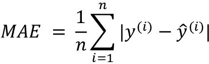
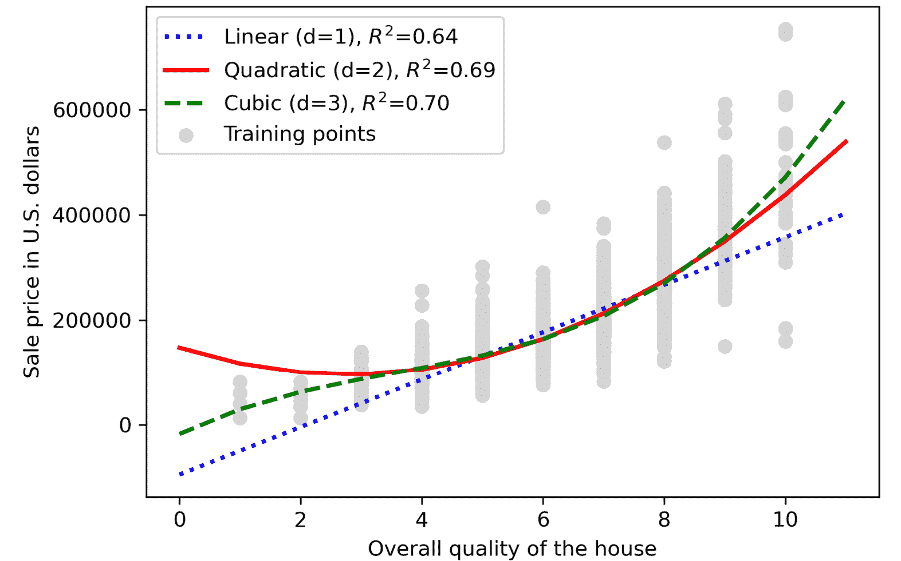

# 第九章：使用回归分析预测连续目标变量

在前几章中，您学到了关于**监督学习**背后的主要概念，并训练了许多不同的模型来执行分类任务，以预测组成员或分类变量。在本章中，我们将深入探讨另一类监督学习：**回归分析**。

回归模型用于预测连续尺度上的目标变量，这使它们在解决科学中的许多问题时非常有吸引力。它们在工业中也有应用，例如理解变量之间的关系、评估趋势或进行预测。一个例子是预测公司未来几个月的销售额。

在本章中，我们将讨论回归模型的主要概念，并涵盖以下主题：

+   探索和可视化数据集

+   查看实现线性回归模型的不同方法

+   训练对异常值鲁棒的回归模型

+   评估回归模型并诊断常见问题

+   将回归模型拟合到非线性数据

# 引入线性回归

线性回归的目标是建立一个或多个特征与连续目标变量之间的关系模型。与分类不同—监督学习的另一子类—回归分析旨在预测连续尺度上的输出，而不是分类类别标签。

在接下来的小节中，您将了解到最基本类型的线性回归，**简单线性回归**，并理解如何将其与更一般的多变量情况（具有多个特征的线性回归）联系起来。

## 简单线性回归

简单(**单变量**)线性回归的目标是建立单一特征(**解释变量**, *x*)和连续数值**目标**(**响应变量**, *y*)之间的关系模型。具有一个解释变量的线性模型方程定义如下：


在这里，参数（偏置单元）*b*表示*y*轴截距，*w*[1]是解释变量的权重系数。我们的目标是学习线性方程的权重，以描述解释变量和目标变量之间的关系，然后用于预测不属于训练数据集的新解释变量的响应。

基于我们之前定义的线性方程，线性回归可以理解为找到穿过训练示例的最佳拟合直线，如*图 9.1*所示：


图 9.1：一个简单的单特征线性回归示例

这条最佳拟合线也称为**回归线**，从回归线到训练样本的垂直线称为**偏移量**或**残差**—这是我们预测的误差。

## 多元线性回归

前一节介绍了简单线性回归，这是线性回归的一种特殊情况，仅涉及一个解释变量。当然，我们也可以推广线性回归模型以涵盖多个解释变量；这个过程称为**多元线性回归**：


*图 9.2*展示了具有两个特征的多元线性回归模型的二维拟合超平面的样子：


图 9.2：一个两特征线性回归模型

如你所见，通过三维散点图中的多元线性回归超平面的可视化已经很难解释。由于我们无法在散点图中良好地可视化具有两个以上特征的数据集（适用于多个特征的多元线性回归模型），本章的示例和可视化主要集中在单变量情况下的简单线性回归。然而，简单和多元线性回归基于相同的概念和评估技术；我们将在本章讨论的代码实现也适用于两种类型的回归模型。

# 探索艾姆斯房屋数据集

在我们实施第一个线性回归模型之前，我们将讨论一个新数据集，即艾姆斯房屋数据集，其中包含了 2006 年到 2010 年间爱荷华州艾姆斯市的个别住宅物业信息。该数据集由迪恩·迪科克于 2011 年收集，更多信息可通过以下链接获得：

+   描述数据集的报告：[`jse.amstat.org/v19n3/decock.pdf`](http://jse.amstat.org/v19n3/decock.pdf)

+   有关数据集特征的详细文档：[`jse.amstat.org/v19n3/decock/DataDocumentation.txt`](http://jse.amstat.org/v19n3/decock/DataDocumentation.txt)

+   数据集以制表符分隔的格式存储：[`jse.amstat.org/v19n3/decock/AmesHousing.txt`](http://jse.amstat.org/v19n3/decock/AmesHousing.txt)

对于每个新数据集，通过简单的可视化来探索数据总是有帮助的，这样我们可以更好地了解我们正在处理的内容，这也是我们将在以下子节中进行的操作。

## 将艾姆斯房屋数据集加载到 DataFrame 中

在这一部分，我们将使用 pandas 的`read_csv`函数加载艾姆斯房屋数据集，这是一种快速且多功能的工具，推荐用于处理存储在纯文本格式中的表格数据。

艾姆斯房屋数据集包含 2,930 个示例和 80 个特征。为简单起见，我们将只使用特征的子集，如下列表所示。但是，如果你感兴趣，可以查看本节开头提供的完整数据集描述链接，并鼓励在阅读本章后探索该数据集中的其他变量。

我们将要处理的特征，包括目标变量，如下所示：

+   `Overall Qual`: 房屋整体材料和装饰的评分，范围从 1（非常差）到 10（优秀）

+   `Overall Cond`: 房屋整体条件的评分，范围从 1（非常差）到 10（优秀）

+   `Gr Liv Area`: 地面以上的居住面积，以平方英尺为单位

+   `Central Air`: 中央空调（N=否，Y=是）

+   `Total Bsmt SF`: 地下室总面积，以平方英尺为单位

+   `SalePrice`: 销售价格（美元）

在本章的其余部分，我们将把销售价格 (`SalePrice`) 视为我们的目标变量 —— 我们希望使用五个或更多的解释变量来预测的变量。在进一步探索这个数据集之前，让我们将其加载到一个 pandas `DataFrame` 中：

```py
import pandas as pd
columns = ['Overall Qual', 'Overall Cond', 'Gr Liv Area',
           'Central Air', 'Total Bsmt SF', 'SalePrice']
df = pd.read_csv('http://jse.amstat.org/v19n3/decock/AmesHousing.txt', 
                 sep='\t',
                 usecols=columns)
df.head() 
```

为了确认数据集已成功加载，我们可以显示数据集的前五行，如 *Figure 9.3* 所示：


Figure 9.3: 房屋数据集的前五行

加载数据集后，让我们还检查一下 `DataFrame` 的维度，以确保其包含预期数量的行：

```py
>>> df.shape
(2930, 6) 
```

正如我们所看到的，`DataFrame` 包含了预期的 2,930 行。

我们还需要注意 `'Central Air'` 变量，它被编码为 `string` 类型，正如我们在 *Figure 9.3* 中看到的。正如我们在 *Chapter 4* 中学到的，在转换 `DataFrame` 列时，我们可以使用 `.map` 方法。以下代码将字符串 `'Y'` 转换为整数 1，字符串 `'N'` 转换为整数 0：

```py
>>> df['Central Air'] = df['Central Air'].map({'N': 0, 'Y': 1}) 
```

最后，让我们检查数据框中是否有任何缺失值的列：

```py
>>> df.isnull().sum()
Overall Qual     0
Overall Cond     0
Total Bsmt SF    1
Central Air      0
Gr Liv Area      0
SalePrice        0
dtype: int64 
```

正如我们所看到的，`Total Bsmt SF` 特征变量包含一个缺失值。由于我们有一个相对较大的数据集，处理这个缺失的特征值的最简单方法是从数据集中删除相应的示例（有关替代方法，请参见 *Chapter 4*）：

```py
>>> df = df.dropna(axis=0)
>>> df.isnull().sum()
Overall Qual     0
Overall Cond     0
Total Bsmt SF    0
Central Air      0
Gr Liv Area      0
SalePrice        0
dtype: int64 
```

## 可视化数据集的重要特征

**探索性数据分析** (**EDA**) 是在训练机器学习模型之前的一个重要且推荐的第一步。在本节的其余部分，我们将使用一些简单但有用的技术来自可视化 EDA 工具箱，这些技术有助于我们在视觉上检测异常值的存在、数据的分布以及特征之间的关系。

首先，我们将创建一个 **散点图矩阵**，它允许我们在一个地方可视化数据集中不同特征之间的两两相关性。为了绘制散点图矩阵，我们将使用 mlxtend 库中的 `scatterplotmatrix` 函数（[`rasbt.github.io/mlxtend/`](http://rasbt.github.io/mlxtend/)），这是一个包含各种方便函数的 Python 库，用于机器学习和数据科学应用。

你可以通过 `conda install mlxtend` 或 `pip install mlxtend` 安装 `mlxtend` 包。本章中，我们使用的是 mlxtend 版本 0.19.0。

安装完成后，您可以导入包并按如下方式创建散点图矩阵：

```py
>>> import matplotlib.pyplot as plt
>>> from mlxtend.plotting import scatterplotmatrix
>>> scatterplotmatrix(df.values, figsize=(12, 10), 
...                   names=df.columns, alpha=0.5)
>>> plt.tight_layout()
plt.show() 
```

正如您在*图 9.4*中所看到的，散点图矩阵为我们提供了数据关系的有用图形总结：


图 9.4：我们数据的散点图矩阵

使用这个散点图矩阵，我们现在可以快速查看数据的分布情况及其是否包含异常值。例如，我们可以看到（底部行的第五列）地面以上生活区的大小(`Gr Liv Area`)与销售价格(`SalePrice`)之间存在某种线性关系。

此外，在直方图中（散点图矩阵的右下子图），我们可以看到`SalePrice`变量似乎受到几个异常值的影响。

**线性回归的正态性假设**

请注意，与普遍观念相反，训练线性回归模型并不要求解释变量或目标变量服从正态分布。正态性假设仅适用于某些超出本书范围的统计和假设检验（有关更多信息，请参阅*道格拉斯 C. 蒙哥马利*、*伊丽莎白 A. 佩克*和*G. 杰弗里·文宁*的*《线性回归分析导论》*，*Wiley*，2012 年，第 318-319 页）。

## 查看相关矩阵以探索关系

在前一节中，我们通过直方图和散点图的形式可视化了艾姆斯房屋数据集变量的数据分布情况。接下来，我们将创建一个相关矩阵，以量化和总结变量之间的线性关系。相关矩阵与我们在*第五章* *通过主成分分析进行无监督降维*中讨论的协方差矩阵密切相关。我们可以将相关矩阵解释为从标准化特征计算的协方差矩阵的重新缩放版本。实际上，相关矩阵与从标准化特征计算的协方差矩阵相同。

相关矩阵是一个方阵，包含**皮尔逊积矩相关系数**（通常缩写为**皮尔逊 r**），用于衡量特征对之间的线性依赖关系。相关系数的取值范围是–1 到 1。如果*r* = 1，则两个特征具有完全正相关性；如果*r* = 0，则没有相关性；如果*r* = –1，则具有完全负相关性。如前所述，皮尔逊相关系数可以简单地计算为两个特征*x*和*y*的协方差（分子）除以它们标准差的乘积（分母）：


在这里， 表示相应特征的均值， 是特征 *x* 和 *y* 之间的协方差， 和  是特征的标准差。

**标准化特征的协方差与相关性**

我们可以证明一对标准化特征之间的协方差实际上等于它们的线性相关系数。为了展示这一点，让我们首先对特征 *x* 和 *y* 进行标准化，得到它们的 z 分数，分别记为 *x’* 和 *y’*：


请记住，我们计算两个特征之间（总体）协方差的方法如下：


由于标准化将特征变量居中于零均值，我们现在可以计算缩放特征之间的协方差如下：


通过代入法，我们得到以下结果：


最后，我们可以简化这个方程如下：


在以下代码示例中，我们将使用 NumPy 的 `corrcoef` 函数来计算我们先前在散点图矩阵中可视化的五个特征列的相关系数，并使用 mlxtend 的 `heatmap` 函数将相关矩阵数组绘制为热图：

```py
>>> import numpy as np
>>> from mlxtend.plotting import heatmap
>>> cm = np.corrcoef(df.values.T)
>>> hm = heatmap(cm, row_names=df.columns, column_names=df.columns)
>>> plt.tight_layout()
>>> plt.show() 
```

正如在 *图 9.5* 中所示，相关矩阵为我们提供了另一个有用的摘要图形，可以帮助我们根据它们各自的线性相关性选择特征：


图 9.5：所选变量的相关矩阵

要拟合线性回归模型，我们对那些与目标变量 `SalePrice` 具有高相关性的特征感兴趣。从前面的相关矩阵可以看出，`SalePrice` 与 `Gr Liv Area` 变量（`0.71`）显示出最大的相关性，这似乎是引入简单线性回归模型概念的一个不错的选择。

# 实现普通最小二乘线性回归模型

在本章开头，我们提到线性回归可以理解为通过我们的训练数据示例获取最佳拟合直线。然而，我们既未定义“最佳拟合”的术语，也未讨论拟合这种模型的不同技术。在接下来的小节中，我们将使用 **普通最小二乘法**（OLS）方法（有时也称为 **线性最小二乘法**）来估计最小化与训练示例的平方垂直距离（残差或误差）的线性回归线的参数。

## 使用梯度下降解决回归参数的回归

考虑我们在 *第二章* 中对 **自适应线性神经元** (**Adaline**) 的实现，*用于分类的简单机器学习算法训练*。您会记得，这种人工神经元使用线性激活函数。此外，我们定义了一个损失函数 *L*(**w**)，通过优化算法（如 **梯度下降** (**GD**) 和 **随机梯度下降** (**SGD**)）最小化该函数以学习权重。

在 Adaline 中，这个损失函数是 **均方误差** (**MSE**)，与我们用于 OLS 的损失函数相同：


在这里， 是预测值 （注意，术语  仅用于方便推导 GD 的更新规则）。本质上，OLS 回归可以理解为 Adaline 没有阈值函数，因此我们获得连续的目标值而不是类标签 `0` 和 `1`。为了演示这一点，让我们从 *第二章* 中取出 Adaline 的 GD 实现，并去掉阈值函数来实现我们的第一个线性回归模型：

```py
class LinearRegressionGD:
    def __init__(self, eta=0.01, n_iter=50, random_state=1):
        self.eta = eta
        self.n_iter = n_iter
        self.random_state = random_state
    def fit(self, X, y):
        rgen = np.random.RandomState(self.random_state)
        self.w_ = rgen.normal(loc=0.0, scale=0.01, size=X.shape[1])
        self.b_ = np.array([0.])
        self.losses_ = []
        for i in range(self.n_iter):
            output = self.net_input(X)
            errors = (y - output)
            self.w_ += self.eta * 2.0 * X.T.dot(errors) / X.shape[0]
            self.b_ += self.eta * 2.0 * errors.mean()
            loss = (errors**2).mean()
            self.losses_.append(loss)
        return self
    def net_input(self, X):
        return np.dot(X, self.w_) + self.b_
    def predict(self, X):
        return self.net_input(X) 
```

**使用梯度下降更新权重**

如果您需要关于权重如何更新的复习 —— 即沿梯度相反方向迈出一步，请参阅 *第二章* 中的 *自适应线性神经元和学习的收敛* 部分。

要看看我们的 `LinearRegressionGD` 回归器如何运行，让我们使用 Ames 房屋数据集中的 `Gr Living Area`（地面以上的居住面积，以平方英尺为单位）特征作为解释变量，并训练一个能够预测 `SalePrice` 的模型。此外，我们将标准化变量以获得更好的 GD 算法收敛性。代码如下：

```py
>>> X = df[['Gr Liv Area']].values
>>> y = df['SalePrice'].values
>>> from sklearn.preprocessing import StandardScaler
>>> sc_x = StandardScaler()
>>> sc_y = StandardScaler()
>>> X_std = sc_x.fit_transform(X)
>>> y_std = sc_y.fit_transform(y[:, np.newaxis]).flatten()
>>> lr = LinearRegressionGD(eta=0.1)
>>> lr.fit(X_std, y_std) 
```

注意关于 `y_std` 的解决方法，使用 `np.newaxis` 和 `flatten`。scikit-learn 中大多数数据预处理类都希望数据存储在二维数组中。在前面的代码示例中，`y[:, np.newaxis]` 中使用 `np.newaxis` 添加了一个新的数组维度。然后，在 `StandardScaler` 返回缩放后的变量后，我们使用 `flatten()` 方法将其转换回原始的一维数组表示，以便我们使用时更方便。

我们在 *第二章* 中讨论过，当我们使用优化算法（如 GD）时，绘制损失作为训练数据集上的 epoch 数（完整迭代次数）函数，以检查算法是否收敛到损失最小值（这里是 *全局* 损失最小值）是一个很好的做法：

```py
>>> plt.plot(range(1, lr.n_iter+1), lr.losses_)
>>> plt.ylabel('MSE')
>>> plt.xlabel('Epoch')
>>> plt.show() 
```

正如您在 *图 9.6* 中所见，GD 算法大约在第十个 epoch 后收敛：


图 9.6：损失函数与 epoch 数的关系

接下来，让我们可视化线性回归线对训练数据的拟合程度。为此，我们将定义一个简单的辅助函数，用于绘制训练样本的散点图并添加回归线：

```py
>>> def lin_regplot(X, y, model):
...     plt.scatter(X, y, c='steelblue', edgecolor='white', s=70)
...     plt.plot(X, model.predict(X), color='black', lw=2) 
```

现在，我们将使用 `lin_regplot` 函数绘制居住面积与销售价格：

```py
>>> lin_regplot(X_std, y_std, lr)
>>> plt.xlabel(' Living area above ground (standardized)')
>>> plt.ylabel('Sale price (standardized)')
>>> plt.show() 
```

正如您在*图 9.7*中所看到的，线性回归线反映了房屋价格倾向于随着居住面积的增加而增加的一般趋势：


图 9.7：销售价格与居住面积大小的线性回归图

尽管这种观察是有道理的，但数据还告诉我们，在许多情况下，居住面积大小并不能很好地解释房价。本章后面我们将讨论如何量化回归模型的性能。有趣的是，我们还可以观察到几个异常值，例如，对应于标准化后大于 6 的生活区的三个数据点。我们将在本章后面讨论如何处理异常值。

在某些应用中，报告预测结果变量在其原始比例上也可能很重要。要将预测的价格重新缩放到原始的美元价格尺度上，我们可以简单地应用 `StandardScaler` 的 `inverse_transform` 方法：

```py
>>> feature_std = sc_x.transform(np.array([[2500]]))
>>> target_std = lr.predict(feature_std)
>>> target_reverted = sc_y.inverse_transform(target_std.reshape(-1, 1))
>>> print(f'Sales price: ${target_reverted.flatten()[0]:.2f}')
Sales price: $292507.07 
```

在这个代码示例中，我们使用之前训练过的线性回归模型预测了一个地面以上居住面积为 2,500 平方英尺的房屋的价格。根据我们的模型，这样一栋房子价值 $292,507.07。

顺便提一句，值得一提的是，如果我们使用标准化的变量，我们在技术上不必更新截距参数（例如，偏置单元，*b*），因为在这些情况下 *y* 轴截距始终为 0。我们可以通过打印模型参数来快速确认这一点：

```py
>>> print(f'Slope: {lr.w_[0]:.3f}')
Slope: 0.707
>>> print(f'Intercept: {lr.b_[0]:.3f}')
Intercept: -0.000 
```

## 通过 scikit-learn 估计回归模型的系数

在前一节中，我们实现了一个用于回归分析的工作模型；然而，在实际应用中，我们可能对更高效的实现感兴趣。例如，许多 scikit-learn 中用于回归的估计器使用了 SciPy 中的最小二乘实现 (`scipy.linalg.lstsq`)，而 SciPy 又使用了基于**线性代数包**（**LAPACK**）的高度优化代码。scikit-learn 中的线性回归实现也可以（更好地）处理非标准化的变量，因为它不使用（S）GD-based 优化，所以我们可以跳过标准化步骤：

```py
>>> from sklearn.linear_model import LinearRegression
>>> slr = LinearRegression()
>>> slr.fit(X, y)
>>> y_pred = slr.predict(X)
>>> print(f'Slope: {slr.coef_[0]:.3f}')
Slope: 111.666
>>> print(f'Intercept: {slr.intercept_:.3f}')
Intercept: 13342.979 
```

正如您通过执行此代码所看到的，用未标准化的 `Gr Liv Area` 和 `SalePrice` 变量拟合的 scikit-learn 的 `LinearRegression` 模型产生了不同的模型系数，因为这些特征没有被标准化。然而，当我们将其与通过绘制 `SalePrice` 对 `Gr Liv Area` 进行的 GD 实现进行比较时，我们可以从质量上看到它与数据的拟合程度相似：

```py
>>> lin_regplot(X, y, slr)
>>> plt.xlabel('Living area above ground in square feet')
>>> plt.ylabel('Sale price in U.S. dollars')
>>> plt.tight_layout()
>>> plt.show() 
```

例如，我们可以看到整体结果与我们的 GD 实现看起来是相同的：


图 9.8：使用 scikit-learn 的线性回归绘制的线性回归图

**线性回归的解析解**

与使用机器学习库不同的替代方法是，还存在一种用于解决 OLS 的闭式解，涉及解决线性方程组的系统，这种方法可以在大多数统计学入门教材中找到：


我们可以在 Python 中实现如下：

```py
# adding a column vector of "ones"
>>> Xb = np.hstack((np.ones((X.shape[0], 1)), X))
>>> w = np.zeros(X.shape[1])
>>> z = np.linalg.inv(np.dot(Xb.T, Xb))
>>> w = np.dot(z, np.dot(Xb.T, y))
>>> print(f'Slope: {w[1]:.3f}')
Slope: 111.666
>>> print(f'Intercept: {w[0]:.3f}')
Intercept: 13342.979 
```

这种方法的优点在于保证以解析方式找到最优解。然而，如果我们处理的是非常大的数据集，通过在这个公式中求逆矩阵可能会导致计算量过大（有时也称为正规方程），或者包含训练示例的矩阵可能是奇异的（不可逆的），因此在某些情况下我们可能更喜欢使用迭代方法。

如果您对如何获取正规方程更多信息感兴趣，请查看斯蒂芬·波洛克博士在莱斯特大学的讲座《经典线性回归模型》中的章节，该讲座可以免费获取，网址为[`www.le.ac.uk/users/dsgp1/COURSES/MESOMET/ECMETXT/06mesmet.pdf`](http://www.le.ac.uk/users/dsgp1/COURSES/MESOMET/ECMETXT/06mesmet.pdf)。

此外，如果您想要比较通过 GD、SGD、闭式解、QR 分解和奇异值分解获得的线性回归解决方案，可以使用 mlxtend 中实现的`LinearRegression`类（[`rasbt.github.io/mlxtend/user_guide/regressor/LinearRegression/`](http://rasbt.github.io/mlxtend/user_guide/regressor/LinearRegression/)），该类允许用户在这些选项之间切换。另一个在 Python 中推荐的用于回归建模的优秀库是 statsmodels，它实现了更高级的线性回归模型，如在[`www.statsmodels.org/stable/examples/index.html#regression`](https://www.statsmodels.org/stable/examples/index.html#regression)中展示的。

# 使用 RANSAC 拟合鲁棒回归模型

线性回归模型可能会受到异常值的严重影响。在某些情况下，我们数据的一个非常小的子集可能会对估计的模型系数产生重大影响。许多统计检验可以用来检测异常值，但这些超出了本书的范围。然而，去除异常值始终需要我们作为数据科学家自己的判断以及我们的领域知识。

作为抛弃异常值的一种替代方案，我们将介绍一种使用**随机采样一致性**（**RANdom SAmple Consensus**，**RANSAC**）算法进行鲁棒回归的方法，该算法将回归模型拟合到数据的一个子集，即所谓的**内点**。

我们可以总结迭代的 RANSAC 算法如下：

1.  选择一定数量的例子作为内点并拟合模型。

1.  将所有其他数据点与拟合模型进行测试，并将那些落在用户给定容差范围内的点添加到内点。

1.  使用所有内点重新拟合模型。

1.  估算与内点拟合模型之间的误差。

1.  如果性能达到某个用户定义的阈值或达到固定迭代次数，则终止算法；否则返回到 *步骤 1*。

现在让我们使用 scikit-learn 的 `RANSACRegressor` 类中实现的线性模型与 RANSAC 算法结合使用：

```py
>>> from sklearn.linear_model import RANSACRegressor
>>> ransac = RANSACRegressor(
...     LinearRegression(), 
...     max_trials=100, # default value
...     min_samples=0.95, 
...     residual_threshold=None, # default value 
...     random_state=123)
>>> ransac.fit(X, y) 
```

我们将 `RANSACRegressor` 的最大迭代次数设置为 100，并且使用 `min_samples=0.95`，将随机选择的训练样本的最小数量设置为数据集的至少 95%。

默认情况下（通过 `residual_threshold=None`），scikit-learn 使用 **MAD** 估计来选择内点阈值，其中 MAD 表示目标值 `y` 的 **中位数绝对偏差**。然而，选择适当的内点阈值的适用性问题特定，这是 RANSAC 的一个缺点。

近年来已开发了许多不同的方法来自动选择良好的内点阈值。您可以在 *R. Toldo* 和 *A. Fusiello* 的 *Springer*, 2009 年的 *Image Analysis and Processing–ICIAP 2009* （页面：123-131）中找到详细讨论。

一旦我们拟合了 RANSAC 模型，让我们从拟合的 RANSAC 线性回归模型中获取内点和外点，并将它们与线性拟合一起绘制：

```py
>>> inlier_mask = ransac.inlier_mask_
>>> outlier_mask = np.logical_not(inlier_mask)
>>> line_X = np.arange(3, 10, 1)
>>> line_y_ransac = ransac.predict(line_X[:, np.newaxis])
>>> plt.scatter(X[inlier_mask], y[inlier_mask],
...             c='steelblue', edgecolor='white',
...             marker='o', label='Inliers')
>>> plt.scatter(X[outlier_mask], y[outlier_mask],
...             c='limegreen', edgecolor='white',
...             marker='s', label='Outliers')
>>> plt.plot(line_X, line_y_ransac, color='black', lw=2)
>>> plt.xlabel('Living area above ground in square feet')
>>> plt.ylabel('Sale price in U.S. dollars')
>>> plt.legend(loc='upper left')
>>> plt.tight_layout()
>>> plt.show() 
```

正如您在 *图 9.9* 中所看到的那样，线性回归模型是在检测到的内点集上拟合的，这些内点显示为圆圈：


图 9.9：通过 RANSAC 线性回归模型识别的内点和外点

当我们执行以下代码打印模型的斜率和截距时，线性回归线将与我们在之前未使用 RANSAC 时得到的拟合略有不同：

```py
>>> print(f'Slope: {ransac.estimator_.coef_[0]:.3f}')
Slope: 106.348
>>> print(f'Intercept: {ransac.estimator_.intercept_:.3f}')
Intercept: 20190.093 
```

请记住，我们将 `residual_threshold` 参数设置为 `None`，因此 RANSAC 使用 MAD 来计算标记内点和外点的阈值。对于此数据集，MAD 可以计算如下：

```py
>>> def mean_absolute_deviation(data):
...     return np.mean(np.abs(data - np.mean(data)))
>>> mean_absolute_deviation(y)
58269.561754979375 
```

因此，如果我们希望将较少的数据点识别为离群值，我们可以选择一个比前面的 MAD 更大的 `residual_threshold` 值。例如，*图 9.10* 展示了具有 65,000 的残差阈值的 RANSAC 线性回归模型的内点和外点：


图 9.10：由具有较大残差阈值的 RANSAC 线性回归模型确定的内点和外点

使用 RANSAC，我们减少了数据集中离群值的潜在影响，但我们不知道这种方法是否会对未见数据的预测性能产生积极影响。因此，在接下来的章节中，我们将探讨不同的方法来评估回归模型，这是构建预测建模系统的关键部分。

# 评估线性回归模型的性能

在前面的章节中，你学会了如何在训练数据上拟合回归模型。然而，你在之前的章节中发现，将模型在训练过程中未见过的数据上进行测试是至关重要的，以获得其泛化性能的更加无偏估计。

正如你可能记得的那样，来自第六章《学习模型评估和超参数调整的最佳实践》的内容，我们希望将数据集分成单独的训练和测试数据集，其中我们将使用前者来拟合模型，并使用后者来评估其在未见数据上的性能，以估计泛化性能。现在，我们不再使用简单的回归模型，而是使用数据集中的所有五个特征并训练多元回归模型：

```py
>>> from sklearn.model_selection import train_test_split
>>> target = 'SalePrice'
>>> features = df.columns[df.columns != target]
>>> X = df[features].values
>>> y = df[target].values
>>> X_train, X_test, y_train, y_test = train_test_split(
...     X, y, test_size=0.3, random_state=123) 
>>> slr = LinearRegression()
>>> slr.fit(X_train, y_train)
>>> y_train_pred = slr.predict(X_train)
>>> y_test_pred = slr.predict(X_test) 
```

由于我们的模型使用多个解释变量，我们无法在二维图中可视化线性回归线（或者更精确地说是超平面），但我们可以绘制残差（实际值与预测值之间的差异或垂直距离）与预测值的图，来诊断我们的回归模型。**残差图**是诊断回归模型常用的图形工具，它们有助于检测非线性和异常值，并检查错误是否随机分布。

使用以下代码，我们将绘制一个残差图，其中我们简单地从预测响应中减去真实目标变量：

```py
>>> x_max = np.max(
...     [np.max(y_train_pred), np.max(y_test_pred)])
>>> x_min = np.min(
...     [np.min(y_train_pred), np.min(y_test_pred)])
>>> fig, (ax1, ax2) = plt.subplots(
...     1, 2, figsize=(7, 3), sharey=True)
>>> ax1.scatter(
...     y_test_pred, y_test_pred - y_test,
...     c='limegreen', marker='s',
...     edgecolor='white',
...     label='Test data')
>>> ax2.scatter(
...     y_train_pred, y_train_pred - y_train,
...     c='steelblue', marker='o', edgecolor='white',
...     label='Training data')
>>> ax1.set_ylabel('Residuals')
>>> for ax in (ax1, ax2):
...     ax.set_xlabel('Predicted values')
...     ax.legend(loc='upper left')
...     ax.hlines(y=0, xmin=x_min-100, xmax=x_max+100,\
...         color='black', lw=2)
>>> plt.tight_layout()
>>> plt.show() 
```

执行代码后，我们应该能看到测试和训练数据集的残差图，其中有一条通过*x*轴原点的线，如*图 9.11*所示：


图 9.11：我们数据的残差图

在完美预测的情况下，残差将恰好为零，在现实和实际应用中，我们可能永远不会遇到这种情况。然而，对于一个良好的回归模型，我们期望错误是随机分布的，残差在中心线周围随机分散。如果在残差图中看到模式，这意味着我们的模型无法捕获某些解释信息，这些信息已泄漏到残差中，正如我们之前的残差图中可能看到的那样。此外，我们还可以使用残差图检测异常值，这些异常值由偏离中心线较大的点表示。

另一个衡量模型性能的有用量化指标是我们之前讨论过的**均方误差**（**MSE**），它是我们用来最小化以拟合线性回归模型的损失函数。以下是不带缩放因子的 MSE 版本，通常用于简化梯度下降中的损失导数：


类似于分类环境中的预测准确性，我们可以使用 MSE 进行交叉验证和模型选择，如第六章讨论的那样。

类似于分类准确率，MSE 也根据样本大小*n*进行归一化。这使得我们可以跨不同的样本大小进行比较（例如，在学习曲线的背景下）。

现在让我们计算我们的训练和测试预测的 MSE：

```py
>>> from sklearn.metrics import mean_squared_error
>>> mse_train = mean_squared_error(y_train, y_train_pred)
>>> mse_test = mean_squared_error(y_test, y_test_pred)
>>> print(f'MSE train: {mse_train:.2f}')
MSE train: 1497216245.85
>>> print(f'MSE test: {mse_test:.2f}')
MSE test: 1516565821.00 
```

我们可以看到训练数据集上的 MSE 大于测试集上的 MSE，这表明在这种情况下我们的模型稍微过拟合了训练数据。注意，以原始单位标度（这里是美元而不是美元平方）显示误差可能更直观，因此我们可能选择计算 MSE 的平方根，称为*均方根误差*，或者**平均绝对误差**（**MAE**），稍微强调错误预测的重要性较小：



我们可以类似于 MSE 计算 MAE：

```py
>>> from sklearn.metrics import mean_absolute_error
>>> mae_train = mean_absolute_error(y_train, y_train_pred)
>>> mae_test = mean_absolute_error(y_test, y_test_pred)
>>> print(f'MAE train: {mae_train:.2f}')
MAE train: 25983.03
>>> print(f'MAE test: {mae_test:.2f}')
MAE test: 24921.29 
```

基于测试集的平均绝对误差（MAE），我们可以说该模型的误差大约为$25,000。

当我们使用 MAE 或 MSE 来比较模型时，需要注意它们与例如分类准确率相比没有上限。换句话说，MAE 和 MSE 的解释取决于数据集和特征缩放。例如，如果销售价格以 1000 的倍数（带有 K 后缀）表示，同一个模型将产生比处理未缩放特征的模型更低的 MAE。为了进一步说明这一点，


因此，有时候更有用的是报告**决定系数**（*R*²），它可以理解为 MSE 的标准化版本，以更好地解释模型的性能。换句话说，*R*²是模型捕捉的响应方差的比例。*R*²的值定义为：


这里，SSE 是平方误差的总和，类似于 MSE，但不包括样本大小*n*的归一化：


而 SST 则是总平方和：


换句话说，SST 只是响应的方差。

现在，让我们简要展示*R*²实际上只是 MSE 的重新缩放版本：


对于训练数据集，*R*²被限制在 0 到 1 之间，但对于测试数据集可能为负。负的*R*²意味着回归模型比表示样本均值的水平线拟合数据更差。（在实践中，这经常发生在极端过拟合的情况下，或者如果我们忘记以与训练集相同的方式缩放测试集。）如果*R*² = 1，则模型完全拟合数据，相应的*MSE* = 0。

在训练数据上评估，我们模型的*R*²为 0.77，这并不理想，但考虑到我们只使用了少量特征，也不算太糟糕。然而，测试数据集上的*R*²略小，为 0.75，这表明模型只稍微过拟合了：

```py
>>> from sklearn.metrics import r2_score
>>> train_r2 = r2_score(y_train, y_train_pred)>>> test_r2 = r2_score(y_test, y_test_pred)
>>> print(f'R² train: {train_r2:.3f}, {test_r2:.3f}')
R² train: 0.77, test: 0.75 
```

# 使用正则化方法进行回归

正如我们在*第三章*，*使用 Scikit-Learn 进行机器学习分类器的一次旅行*中讨论的那样，正则化是通过添加额外信息来解决过拟合问题的一种方法，从而缩小模型参数值以对复杂性施加惩罚。正则化线性回归的最流行方法是所谓的**Ridge 回归**，**最小绝对收缩和选择算子**（**LASSO**），以及**弹性网络**。

Ridge 回归是一种 L2 惩罚模型，我们只需将权重的平方和添加到 MSE 损失函数中：


在这里，L2 项被定义如下：


通过增加超参数  的值，我们增加正则化强度，从而缩小模型的权重。请注意，正如*第三章*中提到的，偏置单元 *b* 没有经过正则化。

一种可以导致稀疏模型的替代方法是 LASSO。根据正则化强度，某些权重可以变为零，这也使得 LASSO 作为一种监督特征选择技术非常有用：


在这里，LASSO 的 L1 惩罚被定义为模型权重的绝对值的总和，如下所示：


然而，LASSO 的一个限制是，如果 *m* > *n*，它最多选择 *n* 个特征，其中 *n* 是训练示例的数量。在某些特征选择的应用中，这可能是不希望的。然而，在实践中，LASSO 的这种性质通常是优点，因为它避免了饱和模型。模型的饱和发生在训练示例数等于特征数时，这是一种过度参数化的形式。因此，饱和模型可以完美拟合训练数据，但仅仅是一种插值形式，因此不太可能很好地推广。

Ridge 回归和 LASSO 之间的折衷方案是弹性网络，它具有 L1 惩罚以生成稀疏性，并且具有 L2 惩罚，因此可以用于选择超过 *n* 个特征，如果 *m* > *n*：


所有这些正则化回归模型都可以通过 scikit-learn 获得，并且它们的使用与常规回归模型类似，只是我们必须通过参数  指定正则化强度，例如通过 k 折交叉验证进行优化。

可以通过以下方式初始化 Ridge 回归模型：

```py
>>> from sklearn.linear_model import Ridge
>>> ridge = Ridge(alpha=1.0) 
```

注意，正则化强度由参数 `alpha` 调节，这类似于参数 。同样，我们可以从`linear_model`子模块初始化一个 LASSO 回归器：

```py
>>> from sklearn.linear_model import Lasso
>>> lasso = Lasso(alpha=1.0) 
```

最后，`ElasticNet`实现允许我们改变 L1 到 L2 的比例：

```py
>>> from sklearn.linear_model import ElasticNet
>>> elanet = ElasticNet(alpha=1.0, l1_ratio=0.5) 
```

例如，如果将 `l1_ratio` 设置为 1.0，则 `ElasticNet` 回归器将等同于 LASSO 回归。有关线性回归不同实现的详细信息，请参阅 [`scikit-learn.org/stable/modules/linear_model.html`](http://scikit-learn.org/stable/modules/linear_model.html) 的文档。

# 将线性回归模型转变为曲线 - 多项式回归

在前几节中，我们假设解释变量和响应变量之间存在线性关系。解决线性假设违反的一种方法是通过添加多项式项使用多项式回归模型：


这里，*d* 表示多项式的次数。虽然我们可以使用多项式回归模型来建模非线性关系，但由于线性回归系数 **w** 的存在，它仍被视为多重线性回归模型。在接下来的小节中，我们将看到如何方便地向现有数据集添加这样的多项式项并拟合多项式回归模型。

## 使用 scikit-learn 添加多项式项

现在我们将学习如何使用 scikit-learn 中的 `PolynomialFeatures` 转换器类将二次项（*d* = 2）添加到一个解释变量的简单回归问题中。然后，我们将通过以下步骤比较多项式和线性拟合：

1.  添加二次多项式项：

    ```py
    >>> from sklearn.preprocessing import PolynomialFeatures
    >>> X = np.array([ 258.0, 270.0, 294.0, 320.0, 342.0,
    ...                368.0, 396.0, 446.0, 480.0, 586.0])\
    ...              [:, np.newaxis]
    >>> y = np.array([ 236.4, 234.4, 252.8, 298.6, 314.2,
    ...                342.2, 360.8, 368.0, 391.2, 390.8])
    >>> lr = LinearRegression()
    >>> pr = LinearRegression()
    >>> quadratic = PolynomialFeatures(degree=2)
    >>> X_quad = quadratic.fit_transform(X) 
    ```

1.  为了比较，我们首先进行简单线性回归模型的拟合：

    ```py
    >>> lr.fit(X, y)
    >>> X_fit = np.arange(250, 600, 10)[:, np.newaxis]
    >>> y_lin_fit = lr.predict(X_fit) 
    ```

1.  对转换后的多项式回归特征进行多元回归模型拟合：

    ```py
    >>> pr.fit(X_quad, y)
    >>> y_quad_fit = pr.predict(quadratic.fit_transform(X_fit)) 
    ```

1.  绘制结果：

    ```py
    >>> plt.scatter(X, y, label='Training points')
    >>> plt.plot(X_fit, y_lin_fit,
    ...          label='Linear fit', linestyle='--')
    >>> plt.plot(X_fit, y_quad_fit,
    ...          label='Quadratic fit')
    >>> plt.xlabel('Explanatory variable')
    >>> plt.ylabel('Predicted or known target values')
    >>> plt.legend(loc='upper left')
    >>> plt.tight_layout()
    >>> plt.show() 
    ```

在生成的图中，您可以看到多项式拟合比线性拟合更好地捕捉了响应和解释变量之间的关系：


图 9.12：线性和二次模型的比较

接下来，我们将计算 MSE 和 *R*² 评估指标：

```py
>>> y_lin_pred = lr.predict(X)
>>> y_quad_pred = pr.predict(X_quad)
>>> mse_lin = mean_squared_error(y, y_lin_pred)
>>> mse_quad = mean_squared_error(y, y_quad_pred)
>>> print(f'Training MSE linear: {mse_lin:.3f}'
          f', quadratic: {mse_quad:.3f}')
Training MSE linear: 569.780, quadratic: 61.330
>>> r2_lin = r2_score(y, y_lin_pred)
>>> r2_quad = r2_score(y, y_quad_pred)
>>> print(f'Training R² linear: {r2_lin:.3f}'
          f', quadratic: {r2_quad:.3f}')
Training R² linear: 0.832, quadratic: 0.982 
```

在执行代码后，您可以看到 MSE 从 570（线性拟合）降至 61（二次拟合）；此外，确定系数反映了二次模型的更紧密拟合（*R*² = 0.982），相对于特定的玩具问题中的线性拟合（*R*² = 0.832）。

## 在 Ames Housing 数据集中建模非线性关系

在前一小节中，您学习了如何构建多项式特征来拟合玩具问题中的非线性关系；现在让我们看一个更具体的例子，并将这些概念应用到 Ames Housing 数据集中的数据上。通过执行以下代码，我们将建模销售价格与地面以上居住面积之间的关系，使用二次（二次）和三次（三次）多项式，并将其与线性拟合进行比较。

我们首先移除三个具有大于 4,000 平方英尺的生活面积的离群值，这些离群值可以在之前的图表中看到，比如 *图 9.8*，以确保这些离群值不会影响我们的回归拟合：

```py
>>> X = df[['Gr Liv Area']].values
>>> y = df['SalePrice'].values
>>> X = X[(df['Gr Liv Area'] < 4000)]
>>> y = y[(df['Gr Liv Area'] < 4000)] 
```

接下来，我们拟合回归模型：

```py
>>> regr = LinearRegression()
>>> # create quadratic and cubic features
>>> quadratic = PolynomialFeatures(degree=2)
>>> cubic = PolynomialFeatures(degree=3)
>>> X_quad = quadratic.fit_transform(X)
>>> X_cubic = cubic.fit_transform(X)
>>> # fit to features
>>> X_fit = np.arange(X.min()-1, X.max()+2, 1)[:, np.newaxis]
>>> regr = regr.fit(X, y)
>>> y_lin_fit = regr.predict(X_fit)
>>> linear_r2 = r2_score(y, regr.predict(X))
>>> regr = regr.fit(X_quad, y)
>>> y_quad_fit = regr.predict(quadratic.fit_transform(X_fit))
>>> quadratic_r2 = r2_score(y, regr.predict(X_quad))
>>> regr = regr.fit(X_cubic, y)
>>> y_cubic_fit = regr.predict(cubic.fit_transform(X_fit))
>>> cubic_r2 = r2_score(y, regr.predict(X_cubic))
>>> # plot results
>>> plt.scatter(X, y, label='Training points', color='lightgray')
>>> plt.plot(X_fit, y_lin_fit, 
...          label=f'Linear (d=1), $R²$={linear_r2:.2f}',
...          color='blue', 
...          lw=2, 
...          linestyle=':')
>>> plt.plot(X_fit, y_quad_fit, 
...          label=f'Quadratic (d=2), $R²$={quadratic_r2:.2f}',
...          color='red', 
...          lw=2,
...          linestyle='-')
>>> plt.plot(X_fit, y_cubic_fit, 
...          label=f'Cubic (d=3), $R²$={cubic_r2:.2f}',
...          color='green', 
...          lw=2,
...          linestyle='--')
>>> plt.xlabel('Living area above ground in square feet')
>>> plt.ylabel('Sale price in U.S. dollars')
>>> plt.legend(loc='upper left')
>>> plt.show() 
```

结果图显示在*图 9.13*中：


图 9.13：不同曲线拟合与销售价格和生活区域数据比较

正如我们所见，使用二次或三次特征实际上没有影响。这是因为两个变量之间的关系似乎是线性的。因此，让我们看看另一个特征，即`Overall Qual`。`Overall Qual`变量评估房屋材料和装饰的整体质量，评分从 1 到 10，其中 10 为最佳：

```py
>>> X = df[['Overall Qual']].values
>>> y = df['SalePrice'].values 
```

在指定了`X`和`y`变量之后，我们可以重复使用之前的代码，并获得*图 9.14*中的图表：



图 9.14：销售价格和房屋质量数据的线性、二次和三次拟合比较

如您所见，二次和三次拟合比线性拟合更能捕捉房屋销售价格与整体房屋质量之间的关系。但是，您应该注意，添加越来越多的多项式特征会增加模型的复杂性，从而增加过拟合的风险。因此，在实践中，始终建议在单独的测试数据集上评估模型的性能，以估计泛化性能。

# 处理非线性关系使用随机森林

在本节中，我们将研究与本章前述回归模型在概念上不同的**随机森林**回归。随机森林是多个**决策树**的集成，可以理解为分段线性函数的总和，与我们之前讨论的全局线性和多项式回归模型形成对比。换句话说，通过决策树算法，我们将输入空间分割成更小的区域，使其更易管理。

## 决策树回归

决策树算法的优点是，它可以处理任意特征，并且不需要对特征进行任何转换，如果我们处理的是非线性数据，因为决策树是一次分析一个特征，而不是考虑加权组合。（同样地，对决策树而言，归一化或标准化特征是不必要的。）如*第三章*中提到的，*使用 Scikit-Learn 进行机器学习分类器的简介*，我们通过迭代地分割节点来生长决策树，直到叶子节点纯净或满足停止条件。当我们用决策树进行分类时，我们定义熵作为不纯度的度量，以确定哪个特征分割最大化**信息增益**（**IG**），对于二元分割，可以定义如下：


这里，*x*[i]是进行分裂的特征，*N*[p]是父节点中的训练样本数，*I*是不纯度函数，*D*[p]是父节点中训练样本的子集，*D*[left]和*D*[right]是分裂后左右子节点中的训练样本子集。记住我们的目标是找到最大化信息增益的特征分裂；换句话说，我们希望找到能够最大程度降低子节点中不纯度的特征分裂。在第三章中，我们讨论了基尼不纯度和熵作为不纯度的度量标准，它们对于分类非常有用。然而，为了将决策树用于回归，我们需要一个适合连续变量的不纯度度量，因此我们将节点*t*的不纯度度量定义为均方误差（MSE）：


这里，*N*[t]是节点*t*上的训练样本数量，*D*[t]是节点*t*上的训练子集，是真实的目标值，而是预测的目标值（样本均值）：


在决策树回归的背景下，均方误差（MSE）通常称为**节点内方差**，这也是为什么分裂准则更为人熟知为**方差减少**。

要了解决策树回归的拟合线是什么样子，让我们使用 scikit-learn 中实现的`DecisionTreeRegressor`来建模`SalePrice`与`Gr Living Area`变量之间的关系。请注意，`SalePrice`和`Gr Living Area`不一定代表非线性关系，但这种特征组合仍然很好地展示了回归树的一般特性：

```py
>>> from sklearn.tree import DecisionTreeRegressor
>>> X = df[['Gr Liv Area']].values
>>> y = df['SalePrice'].values
>>> tree = DecisionTreeRegressor(max_depth=3)
>>> tree.fit(X, y)
>>> sort_idx = X.flatten().argsort()
>>> lin_regplot(X[sort_idx], y[sort_idx], tree)
>>> plt.xlabel('Living area above ground in square feet')
>>> plt.ylabel('Sale price in U.S. dollars')>>> plt.show() 
```

从生成的图中可以看出，决策树捕捉了数据的一般趋势。我们可以想象，回归树也可以相对较好地捕捉非线性数据的趋势。然而，这种模型的局限性在于它不能捕捉所需预测的连续性和可微性。此外，我们需要注意选择树深度的适当值，以避免数据过拟合或欠拟合；在这里，深度为三似乎是一个不错的选择。


图 9.15：决策树回归图

鼓励你尝试更深的决策树。请注意，`Gr Living Area`与`SalePrice`之间的关系相当线性，因此也鼓励你将决策树应用于`Overall Qual`变量。

在接下来的部分，我们将探讨更稳健的回归树拟合方法：随机森林。

## 随机森林回归

正如你在 *第三章* 中学到的，随机森林算法是一种集成技术，结合了多个决策树。随机森林通常比单个决策树具有更好的泛化性能，这归功于随机性，它有助于减少模型的方差。随机森林的其他优点是，在数据集中不太敏感于异常值，并且不需要太多的参数调整。在随机森林中，我们通常需要尝试不同的参数是集成中的树的数量。回归的基本随机森林算法几乎与我们在 *第三章* 中讨论的分类随机森林算法相同。唯一的区别是我们使用 MSE 准则来生长单个决策树，并且预测的目标变量是跨所有决策树的平均预测。

现在，让我们使用艾姆斯房屋数据集中的所有特征，在 70% 的示例上拟合一个随机森林回归模型，并在剩余的 30% 上评估其性能，就像我们在 *评估线性回归模型性能* 部分中所做的那样。代码如下：

```py
>>> target = 'SalePrice'
>>> features = df.columns[df.columns != target]
>>> X = df[features].values
>>> y = df[target].values
>>> X_train, X_test, y_train, y_test = train_test_split(
...     X, y, test_size=0.3, random_state=123)
>>> from sklearn.ensemble import RandomForestRegressor
>>> forest = RandomForestRegressor(
...     n_estimators=1000, 
...     criterion='squared_error', 
...     random_state=1, 
...     n_jobs=-1)
>>> forest.fit(X_train, y_train)
>>> y_train_pred = forest.predict(X_train)
>>> y_test_pred = forest.predict(X_test)
>>> mae_train = mean_absolute_error(y_train, y_train_pred)
>>> mae_test = mean_absolute_error(y_test, y_test_pred)
>>> print(f'MAE train: {mae_train:.2f}')
MAE train: 8305.18
>>> print(f'MAE test: {mae_test:.2f}')
MAE test: 20821.77
>>> r2_train = r2_score(y_train, y_train_pred)
>>> r2_test =r2_score(y_test, y_test_pred)
>>> print(f'R² train: {r2_train:.2f}')
R² train: 0.98
>>> print(f'R² test: {r2_test:.2f}')
R² test: 0.85 
```

不幸的是，你可以看到随机森林倾向于过度拟合训练数据。然而，它仍能相对良好地解释目标与解释变量之间的关系（在测试数据集上的 ）。作为比较，在前一节 *评估线性回归模型性能* 中拟合到相同数据集的线性模型过度拟合较少，但在测试集上表现较差（）。

最后，让我们也来看看预测的残差：

```py
>>> x_max = np.max([np.max(y_train_pred), np.max(y_test_pred)])
>>> x_min = np.min([np.min(y_train_pred), np.min(y_test_pred)])
>>> fig, (ax1, ax2) = plt.subplots(1, 2, figsize=(7, 3), sharey=True)
>>> ax1.scatter(y_test_pred, y_test_pred - y_test,
...             c='limegreen', marker='s', edgecolor='white',
...             label='Test data')
>>> ax2.scatter(y_train_pred, y_train_pred - y_train,
...             c='steelblue', marker='o', edgecolor='white',
...             label='Training data')
>>> ax1.set_ylabel('Residuals')
>>> for ax in (ax1, ax2):
...     ax.set_xlabel('Predicted values')
...     ax.legend(loc='upper left')
...     ax.hlines(y=0, xmin=x_min-100, xmax=x_max+100,
...               color='black', lw=2)
>>> plt.tight_layout()
>>> plt.show() 
```

正如 *R*² 系数已经总结的那样，你可以看到模型对训练数据的拟合比测试数据更好，这由 *y* 轴方向的异常值表示。此外，残差的分布似乎并不完全围绕零中心点随机，这表明模型无法捕捉所有的探索信息。然而，残差图表明相对于本章早期绘制的线性模型的残差图有了很大的改进。


图 9.16：随机森林回归的残差

理想情况下，我们的模型误差应该是随机或不可预测的。换句话说，预测误差不应与解释变量中包含的任何信息相关；相反，它应反映真实世界分布或模式的随机性。如果我们在预测误差中发现模式，例如通过检查残差图，这意味着残差图包含预测信息。这种常见的原因可能是解释信息渗入到这些残差中。

遗憾的是，在残差图中处理非随机性并没有通用的方法，需要进行试验。根据我们可用的数据，我们可以通过变量转换、调整学习算法的超参数、选择更简单或更复杂的模型、去除异常值或包含额外变量来改进模型。

# 总结

在本章的开头，您学习了简单线性回归分析，用于建模单个解释变量与连续响应变量之间的关系。然后，我们讨论了一种有用的解释性数据分析技术，用于查看数据中的模式和异常值，这是预测建模任务中的重要第一步。

我们通过实现基于梯度的优化方法来构建了我们的第一个模型，使用了线性回归。然后，您看到了如何利用 scikit-learn 的线性模型进行回归，并实现了一种用于处理异常值的稳健回归技术（RANSAC）。为了评估回归模型的预测性能，我们计算了平均平方误差和相关的*R*²指标。此外，我们还讨论了诊断回归模型问题的有用图形方法：残差图。

在我们探讨了如何应用正则化到回归模型以减少模型复杂性和避免过拟合之后，我们还涵盖了几种建模非线性关系的方法，包括多项式特征转换和随机森林回归器。

在前几章中，我们详细讨论了监督学习、分类和回归分析。在下一章中，我们将学习另一个有趣的机器学习子领域，无监督学习，以及如何使用聚类分析在缺乏目标变量的情况下发现数据中的隐藏结构。

# 加入我们书籍的 Discord 空间

加入本书的 Discord 工作空间，每月进行一次与作者的*问我任何事*会话：

[`packt.link/MLwPyTorch`](https://packt.link/MLwPyTorch)


