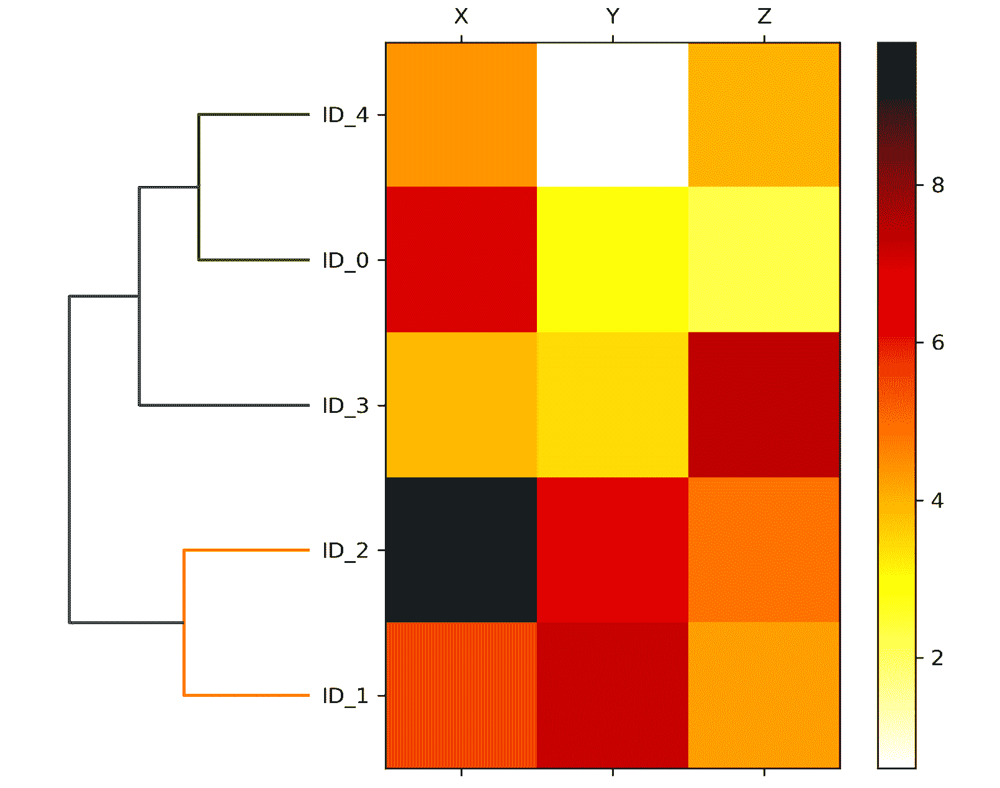

# 第十章：使用未标记数据进行工作——聚类分析

在前几章中，我们使用监督学习技术构建机器学习模型，使用的数据是已知答案的数据——在我们的训练数据中，类标签已经是可用的。在本章中，我们将转向探索聚类分析，这是一类**无监督学习**技术，允许我们在数据中发现隐藏的结构，我们并不预先知道正确答案。**聚类**的目标是在数据中找到自然的分组，使得同一聚类中的项彼此之间的相似性比与不同聚类中的项更高。

鉴于其探索性质，聚类是一个令人兴奋的话题，在本章中，您将学习以下概念，这些概念可以帮助我们将数据组织成有意义的结构：

+   使用流行的**k-means**算法找到相似性中心

+   采用自下而上的方法构建层次聚类树

+   使用基于密度的聚类方法识别对象的任意形状

# 使用 k-means 将对象按相似性分组

在本节中，我们将学习其中一种最流行的聚类算法之一，即 k-means，它在学术界以及工业界广泛使用。聚类（或聚类分析）是一种技术，允许我们找到彼此相关性更高的相似对象组。聚类的业务应用示例包括按不同主题对文档、音乐和电影进行分组，或者基于共同购买行为找到具有相似兴趣的客户作为推荐引擎的基础。

## 使用 scikit-learn 进行 k-means 聚类

正如您将在接下来看到的，k-means 算法非常易于实现，但与其他聚类算法相比，在计算效率上也非常高，这也许解释了它的流行性。k-means 算法属于**原型聚类**的范畴。

我们稍后将讨论另外两种聚类方法，**层次聚类**和**基于密度的聚类**，在本章的后面部分。

原型聚类意味着每个聚类由一个原型表示，通常是具有连续特征的相似点的**质心**（*平均值*），或者在分类特征情况下的**中心点**（最*具代表性*或者最小化到属于特定聚类的所有其他点之间距离的点）。虽然 k-means 在识别球形聚类方面非常出色，但这种聚类算法的缺点之一是我们必须预先指定聚类数*k*。不恰当的*k*选择可能导致聚类性能不佳。本章后面，我们将讨论**肘部**方法和**轮廓图**，这些是评估聚类质量的有用技术，帮助我们确定最优聚类数*k*。

虽然 k 均值聚类可以应用于高维数据，但出于可视化目的，我们将通过一个简单的二维数据集来演示以下示例：

```py
>>> from sklearn.datasets import make_blobs
>>> X, y = make_blobs(n_samples=150,
...                   n_features=2,
...                   centers=3,
...                   cluster_std=0.5,
...                   shuffle=True,
...                   random_state=0)
>>> import matplotlib.pyplot as plt
>>> plt.scatter(X[:, 0],
...             X[:, 1],
...             c='white',
...             marker='o',
...             edgecolor='black',
...             s=50)
>>> plt.xlabel('Feature 1')
>>> plt.ylabel('Feature 2')
>>> plt.grid()
>>> plt.tight_layout()
>>> plt.show() 
```

我们刚刚创建的数据集包含了 150 个随机生成的点，大致分成了三个密度较高的区域，这通过二维散点图进行了可视化：


图 10.1：我们未标记数据集的散点图

在聚类的实际应用中，我们没有任何关于这些示例的地面真实类别信息（作为实证证据而非推断提供的信息）；如果我们有类标签，这个任务就属于监督学习的范畴。因此，我们的目标是根据它们的特征相似性对这些示例进行分组，这可以通过使用 k 均值算法来实现，如下所总结的四个步骤：

1.  从示例中随机选择*k*个质心作为初始聚类中心

1.  将每个示例分配到最近的质心，

1.  将质心移动到分配给它的示例的中心

1.  重复*步骤 2*和*3*直到簇分配不再改变或达到用户定义的容差或最大迭代次数

现在，下一个问题是，*我们如何衡量对象之间的相似性*？我们可以将相似性定义为距离的相反数，对于具有连续特征的聚类示例，常用的距离是**欧氏距离的平方**，即在*m*维空间中两点**x**和**y**之间的距离：


注意，在前述方程中，指数*j*指的是示例输入的第*j*维（特征列），**x**和**y**。在本节的其余部分，我们将使用上标*i*和*j*来分别指代示例（数据记录）和簇索引的索引。

基于这个欧氏距离度量，我们可以将 k 均值算法描述为一个简单的优化问题，这是一种迭代方法，用于最小化**簇内平方误差和**（**SSE**），有时也称为**簇惯性**：


这里，是簇*j*的代表点（质心）。*w*^(^i^(, )^j^) = 1 如果示例**x**^(^i^)在簇*j*中，否则为 0。


现在您已经了解了简单的 k 均值算法的工作原理，让我们使用 scikit-learn 的`cluster`模块中的`KMeans`类将其应用于我们的示例数据集：

```py
>>> from sklearn.cluster import KMeans
>>> km = KMeans(n_clusters=3,
...             init='random',
...             n_init=10,
...             max_iter=300,
...             tol=1e-04,
...             random_state=0)
>>> y_km = km.fit_predict(X) 
```

使用前述代码，我们将所需聚类数设置为`3`；需要事先指定聚类数是 k-means 的限制之一。我们设置`n_init=10`，以独立运行 k-means 聚类算法 10 次，每次选择不同的随机质心，选择最终模型为 SSE 最低的一个。通过`max_iter`参数，我们指定每次单独运行的最大迭代次数（这里是`300`）。请注意，如果 scikit-learn 中的 k-means 实现在达到最大迭代次数之前已经收敛，它将会提前停止。然而，有可能 k-means 在特定运行中无法收敛，这可能是一个问题（计算上昂贵），特别是当我们为`max_iter`选择相对较大的值时。解决收敛问题的一种方法是选择更大的`tol`值，这是一个控制在群内 SSE 变化方面宣布收敛的参数。在前述代码中，我们选择了`1e-04`（=0.0001）的容差。

k-means 的一个问题是一个或多个聚类可能为空。请注意，这个问题在 k-medoids 或模糊 C 均值算法中并不存在，我们稍后将在本节讨论这个算法。然而，在 scikit-learn 中的当前 k-means 实现中已经解决了这个问题。如果一个聚类为空，算法将会寻找离空聚类质心最远的样本，然后将质心重新分配为这个最远的点。

**特征缩放**

当我们将 k-means 应用于现实世界的数据时，使用欧氏距离度量，我们希望确保特征在相同的尺度上测量，并在必要时应用 z-score 标准化或最小-最大缩放。

预测了聚类标签`y_km`之后，并讨论了 k-means 算法的一些挑战，现在让我们来可视化 k-means 在数据集中识别出的聚类以及聚类中心。这些信息存储在已拟合的`KMeans`对象的`cluster_centers_`属性下：

```py
>>> plt.scatter(X[y_km == 0, 0],
...             X[y_km == 0, 1],
...             s=50, c='lightgreen',
...             marker='s', edgecolor='black',
...             label='Cluster 1')
>>> plt.scatter(X[y_km == 1, 0],
...             X[y_km == 1, 1],
...             s=50, c='orange',
...             marker='o', edgecolor='black',
...             label='Cluster 2')
>>> plt.scatter(X[y_km == 2, 0],
...             X[y_km == 2, 1],
...             s=50, c='lightblue',
...             marker='v', edgecolor='black',
...             label='Cluster 3')
>>> plt.scatter(km.cluster_centers_[:, 0],
...             km.cluster_centers_[:, 1],
...             s=250, marker='*',
...             c='red', edgecolor='black',
...             label='Centroids')
>>> plt.xlabel('Feature 1')
>>> plt.ylabel('Feature 2')
>>> plt.legend(scatterpoints=1)
>>> plt.grid()
>>> plt.tight_layout()
>>> plt.show() 
```

在*图 10.2*中，你可以看到 k-means 将三个质心放置在每个球体的中心位置，这看起来是对数据集合理的分组：


图 10.2：k-means 聚类及其质心

尽管 k-means 在这个玩具数据集上表现良好，但我们仍然存在一个缺点，即需要事先指定簇的数量*k*。在现实应用中，特别是当我们处理无法可视化的高维数据集时，要选择的簇数并不总是那么明显。k-means 的其他特性包括簇不重叠，不具有层次结构，同时我们还假设每个簇中至少有一项。在本章后面，我们将遇到不同类型的聚类算法，包括分层和基于密度的聚类。这两种算法都不要求我们预先指定簇的数量或假设数据集中存在球形结构。

在下一小节中，我们将介绍经典 k-means 算法的一种流行变体称为**k-means++**。虽然它没有解决前一段讨论的 k-means 的假设和缺点，但通过更智能地选择初始聚类中心，它可以极大地改善聚类结果。

## 使用 k-means++更智能地放置初始簇质心

到目前为止，我们已经讨论了经典的 k-means 算法，该算法使用随机种子来放置初始质心，如果选择的初始质心不好，有时可能导致簇的不良聚类或收敛缓慢。解决这个问题的一种方法是在数据集上多次运行 k-means 算法，并选择在 SSE 方面表现最佳的模型。

另一种策略是通过 k-means++算法将初始质心放置在彼此远离的位置，这比经典的 k-means 方法（*k-means++：仔细种子的优势*由*D. Arthur*和*S. Vassilvitskii*在*第十八届年度 ACM-SIAM 离散算法研讨会论文集*中提出，页面 1027-1035\. *工业和应用数学学会*，2007 年）可以得到更好和更一致的结果。

k-means++中的初始化可以总结如下：

1.  初始化一个空集合，**M**，用于存储正在选择的*k*个质心。

1.  随机选择第一个质心，，从输入示例中，并将其分配给**M**。

1.  对于不在**M**中的每个示例，**x**^(^i^)，找到到**M**中任何质心的最小平方距离，*d*(**x**^(^i^), **M**)²。

1.  要随机选择下一个质心，，使用等于的加权概率分布。例如，我们将所有点收集到一个数组中，并选择加权随机抽样，使得距离平方较大的点更有可能被选择为质心。

1.  重复*步骤* *3*和*4*，直到选择*k*个质心。

1.  继续使用经典的 k-means 算法。

要在 scikit-learn 的`KMeans`对象中使用 k-means++，我们只需将`init`参数设置为`'k-means++'`。实际上，`'k-means++'`是`init`参数的默认参数，强烈推荐在实践中使用。之前的示例中没有使用它的唯一原因是为了不一次引入太多概念。本节的其余部分将使用 k-means++，但鼓励您更多地尝试这两种不同的方法（通过`init='random'`进行经典的 k-means 或通过`init='k-means++'`进行 k-means++）来放置初始簇质心。

## 硬聚类与软聚类

**硬聚类**描述了一个算法族，其中数据集中的每个示例被分配到一个且仅一个簇中，就像我们之前在本章讨论过的 k-means 和 k-means++ 算法一样。相反，**软聚类**（有时也称为**模糊聚类**）的算法将一个示例分配给一个或多个簇。软聚类的一个流行示例是**模糊 C 均值**（**FCM**）算法（也称为**软 k-means**或**模糊 k-means**）。最初的想法可以追溯到 20 世纪 70 年代，当时 Joseph C. Dunn 首次提出了模糊聚类的早期版本，以改进 k-means（*A Fuzzy Relative of the ISODATA Process and Its Use in Detecting Compact Well-Separated Clusters*, 1973）。几乎 10 年后，James C. Bezdek 发表了他关于改进模糊聚类算法的工作，现在被称为 FCM 算法（*Pattern Recognition with Fuzzy Objective Function Algorithms*, *Springer Science+Business Media*, 2013）。

FCM 过程与 k-means 非常相似。但是，我们用每个点属于每个簇的概率替换了硬聚类分配。在 k-means 中，我们可以用稀疏的二进制值向量表示示例*x*的簇成员资格。


在这里，索引位置为 1 的值表示簇质心，，示例被分配到（假设*k* = 3，）。相比之下，在 FCM 中，成员向量可以表示如下：


在这里，每个值都落在范围[0, 1]内，表示相应簇质心的成员概率。给定示例的成员总和等于 1。与 k-means 算法类似，我们可以用四个关键步骤总结 FCM 算法：

1.  指定*k*个质心，并为每个点随机分配簇成员资格。

1.  计算簇质心，

1.  更新每个点的簇成员资格

1.  重复*步骤 2* 和 *3*，直到成员系数不再改变或达到用户定义的容差或最大迭代次数。

FCM 的目标函数——我们将其缩写为*J*[m]——看起来与我们在 k-means 中最小化的簇内平方和误差（SSE）非常相似：


但是，请注意，成员指示器* w ^（^i^（，^j^）*不像 k 均值中的二进制值（），而是一个表示聚类成员资格概率的实数值（）。您可能还注意到，我们为* w ^（^i^（，^j^）*添加了一个额外的指数；指数*m*，大于或等于 1（通常*m*=2），被称为**模糊系数**（或简称**模糊化器**），它控制*模糊度*的程度。

*m*值越大，聚类成员资格* w ^（^i^（，^j^）*的值越小，这导致聚类变得更加模糊。聚类成员资格概率本身的计算方法如下：


例如，在前面的 k 均值示例中，如果我们选择了三个聚类中心，我们可以计算属于聚类的成员资格如下：


聚类中心本身是通过加权平均所有示例来计算的，加权系数是每个示例属于该聚类的程度（）：


光看计算聚类成员资格的方程，我们可以说 FCM 中的每次迭代比 k 均值中的迭代更昂贵。另一方面，FCM 通常需要更少的迭代才能达到收敛。然而，实际上发现，k 均值和 FCM 产生非常相似的聚类输出，正如一项研究（*《比较分析 k 均值和模糊 c 均值算法》*，由*S. Ghosh*和*S. K. Dubey*，*IJACSA*，4: 35–38，2013 年）所描述的那样。不幸的是，目前 scikit-learn 中未实现 FCM 算法，但有兴趣的读者可以尝试来自 scikit-fuzzy 软件包的 FCM 实现，该软件包可在[`github.com/scikit-fuzzy/scikit-fuzzy`](https://github.com/scikit-fuzzy/scikit-fuzzy)获取。

## 使用肘方法找到最优聚类数

无监督学习的主要挑战之一是我们不知道确切的答案。在我们的数据集中，我们没有地面真实类标签，这些标签允许我们应用在*第六章* *学习模型评估和超参数调整的最佳实践* 中使用的技术来评估监督模型的性能。因此，为了量化聚类的质量，我们需要使用内在度量标准，例如在集群内的 SSE（畸变）来比较不同 k 均值聚类模型的性能。

方便地，当我们使用 scikit-learn 时，我们不需要显式计算在集群内的 SSE，因为在拟合了`KMeans`模型后，它已经通过`inertia_`属性访问：

```py
>>> print(f'Distortion: {km.inertia_:.2f}')
Distortion: 72.48 
```

基于聚类内 SSE，我们可以使用一个名为 **肘部法** 的图形工具来估计给定任务的最佳聚类数 *k*。我们可以说，如果 *k* 增加，失真将减少。这是因为示例将更接近它们被分配到的质心。肘部法的思想是识别失真开始最快增加的 *k* 值，如果我们为不同的 *k* 值绘制失真图，这将变得更清晰：

```py
>>> distortions = []
>>> for i in range(1, 11):
...     km = KMeans(n_clusters=i,
...                 init='k-means++',
...                 n_init=10,
...                 max_iter=300,
...                 random_state=0)
...     km.fit(X)
...     distortions.append(km.inertia_)
>>> plt.plot(range(1,11), distortions, marker='o')
>>> plt.xlabel('Number of clusters')
>>> plt.ylabel('Distortion')
>>> plt.tight_layout()
>>> plt.show() 
```

正如您在 *图 10.3* 中所看到的，*肘部* 位于 *k* = 3，这是支持 *k* = 3 对于此数据集确实是一个好选择的证据：


图 10.3：使用肘部法找到最佳聚类数

## 通过轮廓图量化聚类质量

另一个评估聚类质量的内在度量是 **轮廓分析**，它也可以应用于我们稍后将讨论的除 k-means 外的其他聚类算法。轮廓分析可用作绘制集群示例紧密程度的度量的图形工具。要计算数据集中单个示例的 **轮廓系数**，我们可以应用以下三个步骤：

1.  计算 **聚类内聚性** *a*^(^i^) ，作为示例 **x**^(^i^) 和同一聚类中所有其他点之间的平均距离。

1.  计算 **聚类分离度** *b*^(^i^) ，作为示例 **x**^(^i^) 和最近聚类中所有示例之间的平均距离。

1.  计算轮廓系数 *s*^(^i^) ，如下所示，作为聚类内聚性和分离性之间差异的差值，除以两者中的较大者：

    

轮廓系数的范围为 -1 到 1。根据前述方程，我们可以看到如果聚类分离和内聚相等（*b*^(^i^) = *a*^(^i^)），则轮廓系数为 0。此外，如果 *b*^(^i^) >> *a*^(^i^)，我们接近理想的轮廓系数 1，因为 *b*^(^i^) 量化了示例与其他聚类的不相似性，而 *a*^(^i^) 告诉我们它与同一聚类中其他示例的相似性。

`silhouette_samples` 是 scikit-learn 的 `metric` 模块提供的轮廓系数，可选地，为了方便起见，可以导入 `silhouette_scores` 函数。`silhouette_scores` 函数计算所有示例的平均轮廓系数，这相当于 `numpy.mean(silhouette_samples(...))`。通过执行以下代码，我们现在将创建一个 k-means 聚类的轮廓系数图，其中 *k* = 3：

```py
>>> km = KMeans(n_clusters=3,
...             init='k-means++',
...             n_init=10,
...             max_iter=300,
...             tol=1e-04,
...             random_state=0)
>>> y_km = km.fit_predict(X)
>>> import numpy as np
>>> from matplotlib import cm
>>> from sklearn.metrics import silhouette_samples
>>> cluster_labels = np.unique(y_km)
>>> n_clusters = cluster_labels.shape[0]
>>> silhouette_vals = silhouette_samples(
...     X, y_km, metric='euclidean'
... )
>>> y_ax_lower, y_ax_upper = 0, 0
>>> yticks = []
>>> for i, c in enumerate(cluster_labels):
...     c_silhouette_vals = silhouette_vals[y_km == c]
...     c_silhouette_vals.sort()
...     y_ax_upper += len(c_silhouette_vals)
...     color = cm.jet(float(i) / n_clusters)
...     plt.barh(range(y_ax_lower, y_ax_upper),
...              c_silhouette_vals,
...              height=1.0,
...              edgecolor='none',
...              color=color)
...     yticks.append((y_ax_lower + y_ax_upper) / 2.)
...     y_ax_lower += len(c_silhouette_vals)
>>> silhouette_avg = np.mean(silhouette_vals)
>>> plt.axvline(silhouette_avg,
...             color="red",
...             linestyle="--")
>>> plt.yticks(yticks, cluster_labels + 1)
>>> plt.ylabel('Cluster')
>>> plt.xlabel('Silhouette coefficient')
>>> plt.tight_layout()
>>> plt.show() 
```

通过对轮廓图的视觉检查，我们可以快速审查不同聚类的大小，并识别包含 *异常值* 的聚类：


图 10.4：一个良好聚类的轮廓图示例

然而，如前面的轮廓图所示，轮廓系数与平均轮廓分数并不接近，并且在本例中，这是*好*聚类的指标。此外，为了总结我们聚类的好坏，我们将平均轮廓系数添加到图中（虚线）。

要查看相对*糟糕*聚类的轮廓图是什么样子，请用仅两个质心种子化 k 均值算法：

```py
>>> km = KMeans(n_clusters=2,
...             init='k-means++',
...             n_init=10,
...             max_iter=300,
...             tol=1e-04,
...             random_state=0)
>>> y_km = km.fit_predict(X)
>>> plt.scatter(X[y_km == 0, 0],
...             X[y_km == 0, 1],
...             s=50, c='lightgreen',
...             edgecolor='black',
...             marker='s',
...             label='Cluster 1')
>>> plt.scatter(X[y_km == 1, 0],
...             X[y_km == 1, 1],
...             s=50,
...             c='orange',
...             edgecolor='black',
...             marker='o',
...             label='Cluster 2')
>>> plt.scatter(km.cluster_centers_[:, 0],
...             km.cluster_centers_[:, 1],
...             s=250,
...             marker='*',
...             c='red',
...             label='Centroids')
>>> plt.xlabel('Feature 1')
>>> plt.ylabel('Feature 2')
>>> plt.legend()
>>> plt.grid()
>>> plt.tight_layout()
>>> plt.show() 
```

如您在*图 10.5*中所见，三个球形数据组之间有一个质心。

尽管聚类看起来并非完全糟糕，但仍然次优：


图 10.5: 一个聚类次优示例

请记住，在真实世界的问题中，我们通常没有奢侈地在二维散点图中可视化数据集，因为我们通常使用更高维度的数据。因此，接下来，我们将创建轮廓图来评估结果：

```py
>>> cluster_labels = np.unique(y_km)
>>> n_clusters = cluster_labels.shape[0]
>>> silhouette_vals = silhouette_samples(
...     X, y_km, metric='euclidean'
... )
>>> y_ax_lower, y_ax_upper = 0, 0
>>> yticks = []
>>> for i, c in enumerate(cluster_labels):
...     c_silhouette_vals = silhouette_vals[y_km == c]
...     c_silhouette_vals.sort()
...     y_ax_upper += len(c_silhouette_vals)
...     color = cm.jet(float(i) / n_clusters)
...     plt.barh(range(y_ax_lower, y_ax_upper),
...              c_silhouette_vals,
...              height=1.0,
...              edgecolor='none',
...              color=color)
...     yticks.append((y_ax_lower + y_ax_upper) / 2.)
...     y_ax_lower += len(c_silhouette_vals)
>>> silhouette_avg = np.mean(silhouette_vals)
>>> plt.axvline(silhouette_avg, color="red", linestyle="--")
>>> plt.yticks(yticks, cluster_labels + 1)
>>> plt.ylabel('Cluster')
>>> plt.xlabel('Silhouette coefficient')
>>> plt.tight_layout()
>>> plt.show() 
```

如您在*图 10.6*中所见，轮廓现在具有明显不同的长度和宽度，这表明相对*糟糕*或至少*次优*的聚类：


图 10.6: 一个聚类次优示例的轮廓图

现在，我们已经对聚类的工作原理有了很好的理解，接下来的部分将介绍层次聚类作为 k 均值的替代方法。

# 将群集组织成层次树

在本节中，我们将看一种基于原型的聚类的替代方法：**层次聚类**。层次聚类算法的一个优点是它允许我们绘制**树状图**（二叉层次聚类的可视化），这可以通过创建有意义的分类体系来帮助解释结果。这种层次方法的另一个优点是我们不需要预先指定群集的数量。

层次聚类的两种主要方法是**聚合**和**分裂**层次聚类。在分裂层次聚类中，我们从包含完整数据集的一个群集开始，并迭代地将群集分成较小的群集，直到每个群集只包含一个示例。在本节中，我们将重点关注聚合聚类，它采用相反的方法。我们从每个示例作为单独的群集开始，并合并最接近的群集对，直到只剩下一个群集。

## 以自底向上的方式对群集进行分组

凝聚式层次聚类的两种标准算法是**单链接**和**完全链接**。使用单链接时，我们计算每对聚类中最相似成员之间的距离，并合并两个距离最小的聚类。完全链接方法类似于单链接，但我们比较每对聚类中最不相似成员，以执行合并。这在 *图 10.7* 中显示：


图 10.7：完全链接方法

**替代链接类型**

用于凝聚式层次聚类的其他常用算法包括平均链接和 Ward 链接。在平均链接中，我们基于两个聚类中所有组成员的最小平均距离合并聚类对。在 Ward 链接中，合并导致总内部簇平方和增加最小的两个聚类。

在本节中，我们将专注于使用完全链接方法进行凝聚式聚类。层次完全链接聚类是一个迭代过程，可以总结为以下步骤：

1.  计算所有示例的成对距离矩阵。

1.  将每个数据点表示为单例聚类。

1.  根据最不相似（最远）成员之间的距离合并两个最接近的聚类。

1.  更新聚类链接矩阵。

1.  重复 *步骤 2-4* 直到只剩下一个单一的聚类。

接下来，我们将讨论如何计算距离矩阵（*步骤 1*）。但首先，让我们生成一个随机数据样本来使用。行代表不同的观察（ID 0-4），列是这些示例的不同特征（`X`、`Y`、`Z`）：

```py
>>> import pandas as pd
>>> import numpy as np
>>> np.random.seed(123)
>>> variables = ['X', 'Y', 'Z']
>>> labels = ['ID_0', 'ID_1', 'ID_2', 'ID_3', 'ID_4']
>>> X = np.random.random_sample([5, 3])*10
>>> df = pd.DataFrame(X, columns=variables, index=labels)
>>> df 
```

在执行上述代码后，我们现在应该看到包含随机生成示例的以下 `DataFrame`：


图 10.8：一个随机生成的数据样本

## 在距离矩阵上执行层次聚类

要计算作为层次聚类算法输入的距离矩阵，我们将使用 SciPy 的 `spatial.distance` 子模块中的 `pdist` 函数：

```py
>>> from scipy.spatial.distance import pdist, squareform
>>> row_dist = pd.DataFrame(squareform(
...                         pdist(df, metric='euclidean')),
...                         columns=labels, index=labels)
>>> row_dist 
```

使用上述代码，我们根据特征 `X`、`Y` 和 `Z` 计算了数据集中每对输入示例之间的欧氏距离。

我们提供了由 `pdist` 返回的压缩距离矩阵作为 `squareform` 函数的输入，以创建成对距离的对称矩阵，如下所示：


图 10.9：我们数据的计算成对距离

接下来，我们将使用 SciPy 的 `cluster.hierarchy` 子模块中的 `linkage` 函数将完全链接聚合应用于我们的聚类，该函数返回所谓的**链接矩阵**。

在调用 `linkage` 函数之前，让我们仔细查看函数文档：

```py
>>> from scipy.cluster.hierarchy import linkage
>>> help(linkage)
[...]
Parameters:
  y : ndarray
    A condensed or redundant distance matrix. A condensed
    distance matrix is a flat array containing the upper
    triangular of the distance matrix. This is the form
    that pdist returns. Alternatively, a collection of m
    observation vectors in n dimensions may be passed as
    an m by n array.

  method : str, optional
    The linkage algorithm to use. See the Linkage Methods
    section below for full descriptions.

  metric : str, optional
    The distance metric to use. See the distance.pdist
    function for a list of valid distance metrics.

  Returns:
  Z : ndarray
    The hierarchical clustering encoded as a linkage matrix.
[...] 
```

根据函数描述，我们理解可以使用来自`pdist`函数的简化距离矩阵（上三角形式）作为输入属性。或者，我们也可以提供初始数据数组，并在`linkage`函数中使用`'euclidean'`度量作为函数参数。然而，我们不应该使用之前定义的`squareform`距离矩阵，因为它会产生与预期不同的距离值。总结来说，这里列出了三种可能的情景：

+   **错误的方法**：如下所示使用`squareform`距离矩阵的代码片段会导致错误的结果：

    ```py
    >>> row_clusters = linkage(row_dist,
    ...                        method='complete',
    ...                        metric='euclidean') 
    ```

+   **正确的方法**：如下所示使用简化的距离矩阵的代码示例可以产生正确的联接矩阵：

    ```py
    >>> row_clusters = linkage(pdist(df, metric='euclidean'),
    ...                        method='complete') 
    ```

+   **正确的方法**：如下所示使用完整的输入示例矩阵（即所谓的设计矩阵）的代码片段也会导致与前述方法类似的正确联接矩阵：

    ```py
    >>> row_clusters = linkage(df.values,
    ...                        method='complete',
    ...                        metric='euclidean') 
    ```

为了更仔细地查看聚类结果，我们可以将这些结果转换为 pandas `DataFrame`（最好在 Jupyter 笔记本中查看）如下所示：

```py
>>> pd.DataFrame(row_clusters,
...              columns=['row label 1',
...                       'row label 2',
...                       'distance',
...                       'no. of items in clust.'],
...              index=[f'cluster {(i + 1)}' for i in
...                     range(row_clusters.shape[0])]) 
```

如*图 10.10*所示，联接矩阵由多行组成，每行代表一个合并。第一列和第二列表示每个簇中最不相似的成员，第三列报告这些成员之间的距离。

最后一列返回每个簇中成员的计数：


图 10.10：联接矩阵

现在我们已经计算出联接矩阵，我们可以以树状图的形式可视化结果：

```py
>>> from scipy.cluster.hierarchy import dendrogram
>>> # make dendrogram black (part 1/2)
>>> # from scipy.cluster.hierarchy import set_link_color_palette
>>> # set_link_color_palette(['black'])
>>> row_dendr = dendrogram(
...     row_clusters,
...     labels=labels,
...     # make dendrogram black (part 2/2)
...     # color_threshold=np.inf
... )
>>> plt.tight_layout()
>>> plt.ylabel('Euclidean distance')
>>> plt.show() 
```

如果您正在执行上述代码或阅读本书的电子书版本，您会注意到生成的树状图中的分支显示为不同颜色。颜色方案源自 Matplotlib 的颜色列表，这些颜色按照树状图中的距离阈值循环。例如，要将树状图显示为黑色，您可以取消注释前述代码中插入的相应部分：


图 10.11：我们数据的树状图

这样的树状图总结了在聚合层次聚类期间形成的不同簇；例如，您可以看到基于欧几里德距离度量，示例`ID_0`和`ID_4`，接着是`ID_1`和`ID_2`是最相似的。

## 附加树状图到热图

在实际应用中，层次聚类的树状图通常与热图结合使用，这使我们能够用颜色代码表示包含训练示例的数据数组或矩阵中的个别值。在本节中，我们将讨论如何将树状图附加到热图中并相应地对热图的行进行排序。

然而，将树状图附加到热图可能有些棘手，所以让我们一步步进行此过程：

1.  我们创建一个新的 `figure` 对象，并通过 `add_axes` 属性定义树状图的*x*轴位置、*y*轴位置、宽度和高度。此外，我们将树状图逆时针旋转 90 度。代码如下：

    ```py
    >>> fig = plt.figure(figsize=(8, 8), facecolor='white')
    >>> axd = fig.add_axes([0.09, 0.1, 0.2, 0.6])
    >>> row_dendr = dendrogram(row_clusters,
    ...                        orientation='left')
    >>> # note: for matplotlib < v1.5.1, please use
    >>> # orientation='right' 
    ```

1.  接下来，我们根据从 `dendrogram` 对象（实质上是一个 Python 字典）通过 `leaves` 键访问的聚类标签重新排序我们初始 `DataFrame` 中的数据。代码如下：

    ```py
    >>> df_rowclust = df.iloc[row_dendr['leaves'][::-1]] 
    ```

1.  现在，我们从重新排序的 `DataFrame` 构建热图，并将其放置在树状图旁边：

    ```py
    >>> axm = fig.add_axes([0.23, 0.1, 0.6, 0.6])
    >>> cax = axm.matshow(df_rowclust,
    ...                   interpolation='nearest',
    ...                   cmap='hot_r') 
    ```

1.  最后，我们通过移除轴刻度和隐藏轴脊梁来修改树状图的美学。此外，我们添加了一个色条，并将特征和数据记录名称分配给*x*和*y*轴刻度标签：

    ```py
    >>> axd.set_xticks([])
    >>> axd.set_yticks([])
    >>> for i in axd.spines.values():
    ...     i.set_visible(False)
    >>> fig.colorbar(cax)
    >>> axm.set_xticklabels([''] + list(df_rowclust.columns))
    >>> axm.set_yticklabels([''] + list(df_rowclust.index))
    >>> plt.show() 
    ```

在执行前述步骤之后，热图应显示在附加的树状图上。



图 10.12：我们数据的热图和树状图

如您所见，热图中行的顺序反映了树状图中示例的聚类情况。除了简单的树状图外，热图中每个示例和特征的色彩编码值为我们提供了数据集的一个良好总结。

## 通过 scikit-learn 应用凝聚层次聚类

在前面的小节中，您看到了如何使用 SciPy 执行凝聚层次聚类。然而，scikit-learn 中也有一个 `AgglomerativeClustering` 实现，允许我们选择要返回的聚类数目。如果我们想要修剪层次聚类树，这将非常有用。

将 `n_cluster` 参数设置为 `3` 后，我们将使用与之前相同的完全连接方法和欧几里得距离度量将输入示例聚类成三组：

```py
>>> from sklearn.cluster import AgglomerativeClustering
>>> ac = AgglomerativeClustering(n_clusters=3,
...                              affinity='euclidean',
...                              linkage='complete')
>>> labels = ac.fit_predict(X)
>>> print(f'Cluster labels: {labels}')
Cluster labels: [1 0 0 2 1] 
```

查看预测的聚类标签，我们可以看到第一个和第五个示例（`ID_0` 和 `ID_4`）被分配到一个簇（标签 `1`），示例 `ID_1` 和 `ID_2` 被分配到第二个簇（标签 `0`）。示例 `ID_3` 被放入其自己的簇（标签 `2`）。总体而言，这些结果与我们在树状图中观察到的结果一致。但是，需要注意的是，`ID_3` 与 `ID_4` 和 `ID_0` 更相似，而不是与 `ID_1` 和 `ID_2`，如前面的树状图所示；这一点在 scikit-learn 的聚类结果中并不明显。现在让我们在以下代码片段中使用 `n_cluster=2` 重新运行 `AgglomerativeClustering`：

```py
>>> ac = AgglomerativeClustering(n_clusters=2,
...                              affinity='euclidean',
...                              linkage='complete')
>>> labels = ac.fit_predict(X)
>>> print(f'Cluster labels: {labels}')
Cluster labels: [0 1 1 0 0] 
```

如您所见，在这个*修剪*的聚类层次结构中，标签 `ID_3` 被分配到与 `ID_0` 和 `ID_4` 相同的簇中，正如预期的那样。

# 通过 DBSCAN 定位高密度区域

尽管我们无法在本章节中涵盖大量不同的聚类算法，但至少让我们再包括一种聚类方法：**基于密度的空间聚类应用与噪声**（**DBSCAN**），它不像 k-means 那样假设球形簇，也不将数据集分割成需要手动切断点的层次结构。DBSCAN 根据点的密集区域分配聚类标签。在 DBSCAN 中，密度的概念被定义为指定半径内的点数，如图所示：。

根据 DBSCAN 算法，根据以下标准为每个示例（数据点）分配特殊标签：

+   如果在指定半径内有至少指定数量（MinPts）的相邻点，则称该点为**核心点**，如图所示：

+   **边界点**是指在半径内具有少于 MinPts 相邻点，但位于核心点的半径内的点。

+   所有既不是核心点也不是边界点的其他点被视为**噪声点**。

将点标记为核心点、边界点或噪声点之后，DBSCAN 算法可以总结为两个简单步骤：

1.  形成每个核心点或连接的核心点组的单独簇。（如果它们的距离不超过。）

1.  将每个边界点分配到其对应核心点的簇中。

在跳入实施之前，为了更好地理解 DBSCAN 的结果可能如何，让我们总结一下关于核心点、边界点和噪声点的内容，参见*图 10.13*：


图 10.13：DBSCAN 的核心点、噪声点和边界点

使用 DBSCAN 的主要优势之一是，它不假设聚类像 k-means 中的球形那样。此外，DBSCAN 与 k-means 和层次聚类不同之处在于，它不一定将每个点分配到一个簇中，但能够移除噪声点。

为了更具说明性的例子，让我们创建一个新的半月形结构数据集，以比较 k-means 聚类、层次聚类和 DBSCAN：

```py
>>> from sklearn.datasets import make_moons
>>> X, y = make_moons(n_samples=200,
...                   noise=0.05,
...                   random_state=0)
>>> plt.scatter(X[:, 0], X[:, 1])
>>> plt.xlabel('Feature 1')
>>> plt.ylabel('Feature 2')
>>> plt.tight_layout()
>>> plt.show() 
```

如图所示的结果绘图中，可以看到两个明显的半月形簇，每个簇包含 100 个示例（数据点）：


图 10.14：一个双特征半月形数据集

我们将首先使用 k-means 算法和完全链接聚类来查看这些先前讨论的聚类算法是否能够成功识别半月形状作为单独的簇。代码如下：

```py
>>> f, (ax1, ax2) = plt.subplots(1, 2, figsize=(8, 3))
>>> km = KMeans(n_clusters=2,
...             random_state=0)
>>> y_km = km.fit_predict(X)
>>> ax1.scatter(X[y_km == 0, 0],
...             X[y_km == 0, 1],
...             c='lightblue',
...             edgecolor='black',
...             marker='o',
...             s=40,
...             label='cluster 1')
>>> ax1.scatter(X[y_km == 1, 0],
...             X[y_km == 1, 1],
...             c='red',
...             edgecolor='black',
...             marker='s',
...             s=40,
...             label='cluster 2')
>>> ax1.set_title('K-means clustering')
>>> ax1.set_xlabel('Feature 1')
>>> ax1.set_ylabel('Feature 2')
>>> ac = AgglomerativeClustering(n_clusters=2,
...                              affinity='euclidean',
...                              linkage='complete')
>>> y_ac = ac.fit_predict(X)
>>> ax2.scatter(X[y_ac == 0, 0],
...             X[y_ac == 0, 1],
...             c='lightblue',
...             edgecolor='black',
...             marker='o',
...             s=40,
...             label='Cluster 1')
>>> ax2.scatter(X[y_ac == 1, 0],
...             X[y_ac == 1, 1],
...             c='red',
...             edgecolor='black',
...             marker='s',
...             s=40,
...             label='Cluster 2')
>>> ax2.set_title('Agglomerative clustering')
>>> ax2.set_xlabel('Feature 1')
>>> ax2.set_ylabel('Feature 2')
>>> plt.legend()
>>> plt.tight_layout()
>>> plt.show() 
```

根据可视化的聚类结果，我们可以看到 k-means 算法无法分离两个簇，而且层次聚类算法在面对这些复杂形状时也面临挑战：


图 10.15：半月形数据集上的 k-means 和聚合聚类

最后，让我们尝试在这个数据集上应用 DBSCAN 算法，看看它是否能够通过密度方法找到两个半月形簇：

```py
>>> from sklearn.cluster import DBSCAN
>>> db = DBSCAN(eps=0.2,
...             min_samples=5,
...             metric='euclidean')
>>> y_db = db.fit_predict(X)
>>> plt.scatter(X[y_db == 0, 0],
...             X[y_db == 0, 1],
...             c='lightblue',
...             edgecolor='black',
...             marker='o',
...             s=40,
...             label='Cluster 1')
>>> plt.scatter(X[y_db == 1, 0],
...             X[y_db == 1, 1],
...             c='red',
...             edgecolor='black',
...             marker='s',
...             s=40,
...             label='Cluster 2')
>>> plt.xlabel('Feature 1')
>>> plt.ylabel('Feature 2')
>>> plt.legend()
>>> plt.tight_layout()
>>> plt.show() 
```

DBSCAN 算法可以成功检测半月形状，这突显了 DBSCAN 的一个优势——可以对任意形状的数据进行聚类：


图 10.16：半月形数据集上的 DBSCAN 聚类

然而，我们也应该注意一些 DBSCAN 的缺点。随着数据集中特征数量的增加——假设训练示例数量固定——**维度灾难**的负面影响增加。如果我们使用欧氏距离度量尤其是问题。然而，维度灾难问题并不局限于 DBSCAN：它也影响其他使用欧氏距离度量的聚类算法，例如 k-means 和层次聚类算法。此外，DBSCAN 中有两个超参数（MinPts 和！[](img/B17582_07_004.png)）需要优化以产生良好的聚类结果。如果数据集中的密度差异相对较大，找到 MinPts 和！[](img/B17582_07_004.png)的良好组合可能会成为一个问题。

**基于图的聚类**

到目前为止，我们已经看到了三种最基本的聚类算法类别：基于原型的 k-means 聚类，聚合层次聚类和基于密度的 DBSCAN 聚类。然而，在本章中我们还没有涉及的是第四类更高级的聚类算法：基于图的聚类。可能是基于图的聚类家族中最显著的成员是光谱聚类算法。

尽管光谱聚类有许多不同的实现，它们的共同之处在于利用相似性或距离矩阵的特征向量来推导聚类关系。由于光谱聚类超出了本书的范围，您可以阅读乌尔里克·冯·吕克斯堡（Ulrike von Luxburg）的优秀教程以了解更多关于这个主题的内容（*光谱聚类教程*，*统计与计算*，17（4）：395-416，2007）。它可以在 arXiv 上免费获取：[`arxiv.org/pdf/0711.0189v1.pdf`](http://arxiv.org/pdf/0711.0189v1.pdf)。

注意，在实践中，不同聚类算法在给定数据集上表现最佳并不总是显而易见，特别是如果数据以多个维度呈现，这会使得可视化变得困难或不可能。此外，强调成功的聚类不仅取决于算法及其超参数；选择合适的距离度量标准以及使用能够帮助指导实验设置的领域知识可能更为重要。

在维度诅咒的背景下，因此在执行聚类之前常见的做法是应用降维技术。这些面向无监督数据集的降维技术包括主成分分析和 t-SNE，我们在*第五章*《通过降维压缩数据》中涵盖了这些技术。此外，将数据集压缩到二维子空间特别常见，这样可以使用二维散点图可视化聚类和分配的标签，这对于评估结果特别有帮助。

# 总结

在这一章中，您学习了三种不同的聚类算法，这些算法可以帮助我们发现数据中隐藏的结构或信息。我们从基于原型的方法开始，即 k-means 算法，该算法根据指定数量的聚类中心将示例聚类成球形。由于聚类是一种无监督方法，我们没有地面真实标签来评估模型的性能。因此，我们使用了内在性能度量标准，例如肘部法则或轮廓分析，试图量化聚类的质量。

然后，我们看了一种不同的聚类方法：凝聚层次聚类。层次聚类不需要预先指定聚类数，其结果可以在树形图表示中可视化，这有助于解释结果。我们在本章中介绍的最后一个聚类算法是 DBSCAN，这是一种根据局部密度分组点的算法，能够处理异常值并识别非球形形状。

在这次涉足无监督学习领域之后，现在是介绍一些最激动人心的监督学习机器学习算法的时候了：多层人工神经网络。随着它们最近的复苏，神经网络再次成为机器学习研究中最热门的话题。由于最近开发的深度学习算法，神经网络被认为是许多复杂任务的最先进技术，如图像分类、自然语言处理和语音识别。在*第十一章*，*从头开始实现多层人工神经网络*中，我们将构建自己的多层神经网络。在*第十二章*，*使用 PyTorch 并行化神经网络训练*中，我们将使用 PyTorch 库，该库专门用于利用图形处理单元高效训练多层神经网络模型。

# 加入我们书籍的 Discord 空间

加入本书的 Discord 工作空间，参与每月的*问答*活动与作者交流：

[`packt.link/MLwPyTorch`](https://packt.link/MLwPyTorch)


