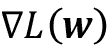
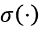
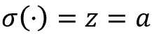
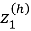

# 第十一章：从头开始实现多层人工神经网络

你可能已经知道，深度学习在媒体上受到了很多关注，毫无疑问，它是机器学习领域最热门的话题。深度学习可以理解为机器学习的一个子领域，其关注点是如何高效地训练具有多层的人工**神经网络**（**NNs**）。在本章中，你将学习人工神经网络的基本概念，以便在接下来的章节中，我们将介绍专门用于图像和文本分析的基于 Python 的高级深度学习库和**深度神经网络**（**DNN**）架构。

本章将涵盖的主题如下：

+   对多层神经网络（Multilayer NNs）的概念性理解

+   从头开始实现神经网络训练的基本反向传播算法

+   为图像分类训练基本的多层神经网络

# 用人工神经网络对复杂函数建模

在本书的开头，我们从人工神经元开始了机器学习算法的旅程，这在《第二章》，《训练简单的分类机器学习算法》中有所介绍。人工神经元代表了我们将在本章讨论的多层人工神经网络的构建模块。

人工神经网络的基本概念建立在关于人脑如何解决复杂问题任务的假设和模型之上。尽管人工神经网络近年来越来越受欢迎，但早期对神经网络的研究可以追溯到 1940 年代，当时 Warren McCulloch 和 Walter Pitts 首次描述了神经元的工作方式，《神经活动中所含的思想的逻辑演算》，作者为 W. S. McCulloch 和 W. Pitts，发表于《数理生物物理学公报》（*The Bulletin of Mathematical Biophysics*），5（4）：115–133，1943 年。

然而，在第一个**麦卡洛克-皮茨神经元**模型——罗森布拉特在 1950 年代提出的感知器——实现后的几十年间，许多研究人员和机器学习从业者逐渐失去了对神经网络的兴趣，因为没有人能有效地训练具有多层的神经网络。直到 1986 年，D.E. Rumelhart、G.E. Hinton 和 R.J. Williams 参与了反向传播算法的（重新）发现和推广，有效地训练神经网络，这一算法将在本章后面更详细地讨论《通过反向传播错误学习表示》，作者为 D.E. Rumelhart、G.E. Hinton 和 R.J. Williams，发表于《自然》（*Nature*），323（6088）：533–536，1986 年。对**人工智能**（**AI**）、机器学习和神经网络历史感兴趣的读者也建议阅读所谓的*AI 寒冬*的维基百科文章，这些是研究社区失去对神经网络研究兴趣的时期（[`en.wikipedia.org/wiki/AI_winter`](https://en.wikipedia.org/wiki/AI_winter)）。

然而，如今神经网络（NNs）比以往任何时候都更受欢迎，这要归功于上一个十年取得的许多突破，这导致了我们现在所称的深度学习算法和架构——由许多层组成的 NNs。NNs 不仅在学术研究中是热门话题，而且在大型技术公司（如 Facebook、Microsoft、Amazon、Uber、Google 等）中也是如此，这些公司在人工神经网络和深度学习研究上投入了大量资源。

到目前为止，由深度学习算法驱动的复杂神经网络被认为是解决诸如图像和语音识别等复杂问题的最先进解决方案。一些最近的应用包括：

+   预测 COVID-19 资源需求的 X 射线序列（[`arxiv.org/abs/2101.04909`](https://arxiv.org/abs/2101.04909)）

+   建模病毒突变（[`science.sciencemag.org/content/371/6526/284`](https://science.sciencemag.org/content/371/6526/284)）

+   利用社交媒体平台的数据来管理极端天气事件（[`onlinelibrary.wiley.com/doi/abs/10.1111/1468-5973.12311`](https://onlinelibrary.wiley.com/doi/abs/10.1111/1468-5973.12311)）

+   改进对盲人或视觉障碍人士的照片描述（[`tech.fb.com/how-facebook-is-using-ai-to-improve-photo-descriptions-for-people-who-are-blind-or-visually-impaired/`](https://tech.fb.com/how-facebook-is-using-ai-to-improve-photo-descriptions-for-people-who-are-blind-or-visually-impaired/)）

## 单层神经网络概述

本章讨论的是多层神经网络，它们的工作原理以及如何训练它们来解决复杂问题。然而，在深入研究特定的多层神经网络架构之前，让我们简要重申我们在 *第二章* 中介绍的单层神经网络概念，即 **ADAptive LInear NEuron**（Adaline）算法，如 *图 11.1* 所示：


图 11.1：Adaline 算法

在 *第二章* 中，我们实现了 Adaline 算法来进行二元分类，并使用梯度下降优化算法来学习模型的权重系数。在每个 epoch（训练数据集的一次遍历）中，我们使用以下更新规则更新权重向量 **w** 和偏置单元 *b*：


其中  和  分别代表偏置单元和权重向量 **w** 中的每个权重 *w*[j]。

换句话说，我们基于整个训练数据集计算梯度，并通过在损失梯度的反方向上迈出一步来更新模型的权重 。（为简单起见，我们将专注于权重并在以下段落中省略偏置单元；然而，正如你从 *第二章* 中记得的那样，相同的概念也适用。）为了找到模型的最优权重，我们优化了一个我们定义为**均方误差**（**MSE**）损失函数 *L*(**w**) 的目标函数。此外，我们将梯度乘以一个因子，**学习率** ，我们需要仔细选择以在学习速度与超过损失函数全局最小值的风险之间取得平衡。

在梯度下降优化中，我们在每个迭代后同时更新所有权重，并且我们定义了权重向量中每个权重 *w*[j] 的偏导数，**w**，如下所示：


在这里，*y*^(^i^) 是特定样本 *x*^(^i^) 的目标类标签，*a*^(^i^) 是神经元的激活，对于 Adaline 的特殊情况，它是一个线性函数。

此外，我们如下定义了激活函数 ：



这里，净输入 *z* 是连接输入层与输出层的权重的线性组合：


当我们使用激活函数  来计算梯度更新时，我们实现了一个阈值函数，将连续值输出压缩为用于预测的二进制类标签：


**单层命名约定**

注意，尽管 Adaline 由两层组成，即一个输入层和一个输出层，但由于其输入层和输出层之间的单一连接，它被称为单层网络。

另外，我们了解了一种加速模型学习的特定*技巧*，即所谓的**随机梯度下降**（**SGD**）优化。 SGD 从单个训练样本（在线学习）或一小部分训练示例（小批量学习）中近似损失。 在本章后面，当我们实现和训练**多层感知机**（**MLP**）时，我们将使用这个概念。 除了由于梯度下降比梯度下降更频繁地更新权重导致更快的学习之外，其嘈杂的本质在训练具有非线性激活函数的多层神经网络时也被认为是有益的。 这里，添加的噪声可以帮助逃离局部损失最小值，但我们将在本章后面更详细地讨论这个主题。

## 引入多层神经网络架构

在本节中，您将学习如何将多个单神经元连接到多层前馈神经网络；这种特殊类型的*全连接*网络也称为**MLP**。

*图 11.2*说明了由两层组成的 MLP 的概念：


图 11.2: 一个两层 MLP

除了数据输入之外，*图 11.2*中描述的 MLP 具有一个隐藏层和一个输出层。隐藏层中的单元与输入特征完全连接，输出层与隐藏层完全连接。如果这样的网络有多个隐藏层，我们也称其为**深度神经网络**。（请注意，在某些情况下，输入也被视为一层。然而，在这种情况下，将 Adaline 模型，即单层神经网络，视为两层神经网络可能会令人困惑。）

**添加额外的隐藏层**

我们可以在 MLP 中添加任意数量的隐藏层，以创建更深的网络结构。实际上，我们可以将 NN 中的层数和单位数视为额外的超参数，我们希望使用交叉验证技术为给定的问题任务进行优化，这些内容我们在*第六章*中讨论了*学习模型评估和超参数调整的最佳实践*。

然而，随着网络添加更多层，用于更新网络参数的损失梯度（稍后我们将通过反向传播计算）将变得越来越小。这种梯度消失问题使得模型学习更具挑战性。因此，已经开发了特殊算法来帮助训练这种 DNN 结构；这就是**深度学习**，我们将在接下来的章节中更详细地讨论。

如*图 11.2*所示，我们将第*l*层中的第*i*个激活单元表示为 。为了使数学和代码实现更直观，我们将不使用数字索引来引用层，而是使用*in*上标表示输入特征，*h*上标表示隐藏层，*out*上标表示输出层。例如， 表示第*i*个输入特征值， 表示隐藏层中的第*i*个单元， 表示输出层中的第*i*个单元。请注意，*图 11.2*中的**b**代表偏置单元。事实上，**b**^(^h^)和**b**^(^(out)^)是具有与其对应层中节点数相等的元素数量的向量。例如，**b**^(^h^)存储*d*个偏置单元，其中*d*是隐藏层中的节点数。如果这听起来令人困惑，不用担心。稍后查看代码实现，我们初始化权重矩阵和偏置单元向量将有助于澄清这些概念。

每个 *l* 层中的节点通过权重系数与 *l* + 1 层中的所有节点相连。例如，层 *l* 中第 *k* 个单元到层 *l* + 1 中第 *j* 个单元的连接将被写为 。回顾 *图 11.2*，我们将连接输入到隐藏层的权重矩阵称为 **W**^(^h^)，并将连接隐藏层到输出层的矩阵称为 **W**^(^(out)^)。

虽然输出层的一个单元足以完成二元分类任务，但在前述图中我们看到了更一般的神经网络形式，它允许我们通过**一对所有**（**OvA**）技术的泛化来进行多类别分类。为了更好地理解其工作原理，请记住我们在第四章 *构建良好的训练数据集 – 数据预处理* 中介绍的分类变量的**独热编码**表示。

例如，我们可以将经典的鸢尾花数据集中的三类标签（0=*山鸢尾*，1=*变色鸢尾*，2=*维吉尼亚鸢尾*）进行如下编码：


这种独热向量表示使我们能够处理训练数据集中任意数量的独特类标签的分类任务。

如果你对神经网络表示还不熟悉，索引符号（下标和上标）可能一开始看起来有点令人困惑。但是，在后面的章节中，当我们对神经网络表示进行向量化时，这些看似过于复杂的内容将会变得更加合理。正如之前介绍的那样，我们通过一个 *d*×*m* 维度的矩阵 **W**^(^h^) 来总结连接输入和隐藏层的权重，其中 *d* 是隐藏单元的数量，*m* 是输入单元的数量。

## 通过前向传播激活神经网络

在本节中，我们将描述**前向传播**的过程，以计算 MLP 模型的输出。为了理解它如何融入到学习 MLP 模型的背景中，让我们简要总结 MLP 学习过程的三个简单步骤：

1.  从输入层开始，我们通过网络将训练数据的模式进行前向传播，生成一个输出。

1.  根据网络的输出，我们使用稍后将描述的损失函数计算我们希望最小化的损失。

1.  我们通过反向传播损失，找到其对网络中每个权重和偏置单元的导数，并更新模型。

最后，在我们对多个时期重复执行这三个步骤并学习 MLP 的权重和偏置参数之后，我们使用前向传播来计算网络输出，并应用阈值函数以获得在独热表示中的预测类标签，这是我们在前一节中描述过的。

现在，让我们逐步进行前向传播的各个步骤，从训练数据模式中生成输出。由于隐藏层中的每个单元都与输入层中的所有单元连接，我们首先计算隐藏层激活单元  如下所示：


在这里， 是净输入， 是激活函数，必须是可微的，以便使用基于梯度的方法学习连接神经元的权重。为了能够解决复杂问题，如图像分类，我们在 MLP 模型中需要非线性激活函数，例如我们在第三章“使用 Scikit-Learn 的机器学习分类器之旅”中记得的 sigmoid（logistic）激活函数：


正如您可能记得的那样，Sigmoid 函数是一条*S*形曲线，将净输入 *z* 映射到 0 到 1 的 logistic 分布范围内，在 *Figure 11.3* 中显示 *y* 轴在 *z* = 0 处切割：


图 11.3：Sigmoid 激活函数

MLP 是前馈人工神经网络的典型例子。术语 **feedforward** 指的是每一层作为下一层的输入，没有循环，与递归神经网络形成对比——这是我们将在本章稍后讨论的架构，并在第十五章“使用递归神经网络建模顺序数据”中进行更详细的讨论。术语 *multilayer perceptron* 可能听起来有点混淆，因为这种网络架构中的人工神经元通常是 sigmoid 单元，而不是感知器。我们可以将 MLP 中的神经元视为 logistic 回归单元，返回在 0 到 1 的连续范围内的值。

为了代码的效率和可读性，我们将使用基本线性代数的概念，通过 NumPy 将激活写成更紧凑的形式，而不是编写多个嵌套和计算昂贵的 Python `for` 循环。


这里，**z**^(^h^) 是我们的 1×*m* 维特征向量。**W**^(^h^) 是一个 *d*×*m* 维权重矩阵，其中 *d* 是隐藏层中的单元数；因此，转置矩阵 **W**^(^h^)^T 是 *m*×*d* 维的。偏置向量 **b**^(^h^) 包含 *d* 个偏置单元（每个隐藏节点一个偏置单元）。

在矩阵-向量乘法之后，我们得到 1×*d* 维的净输入向量 **z**^(^h^)，用于计算激活 **a**^(^h^)（其中 ）。

此外，我们可以将这一计算推广到训练数据集中的所有 *n* 个示例：

**Z**^(^h^) = **X**^(^(in)^)**W**^(^h^)^T + **b**^(^h^)

在这里，**X**^(^(in)^)现在是一个*n*×*m*矩阵，矩阵乘法将得到一个*n*×*d*维度的净输入矩阵**Z**^(^h^)。最后，我们对净输入矩阵中的每个值应用激活函数 ，以获得下一层（这里是输出层）的*n*×*d*激活矩阵：


同样地，我们可以为多个示例的输出层激活以向量化形式编写：

**Z**^(^(out)^) = **A**^(^h^)**W**^(^(out)^)^T + **b**^(^(out)^)

在这里，我们将*t*×*d*矩阵**W**^(^(out)^)的转置（*t*是输出单元的数量）乘以*n*×*d*维度矩阵**A**^(^h^)，并加上*t*维度偏置向量**b**^(^(out)^)，以获得*n*×*t*维度矩阵**Z**^(^(out)^)（该矩阵中的列表示每个样本的输出）。

最后，我们应用 sigmoid 激活函数来获得网络的连续值输出：


类似于**Z**^(^(out)^)，**A**^(^(out)^)是一个*n*×*t*维度的矩阵。

# 分类手写数字

在前一节中，我们涵盖了关于 NN 的大量理论，如果您对此主题还不熟悉，可能会有点压倒性。在我们继续讨论 MLP 模型学习权重算法——反向传播之前，让我们从理论中稍作休息，看看 NN 的实际应用。

**反向传播的额外资源**

NN 理论可能非常复杂；因此，我们希望为读者提供更详细或不同视角覆盖本章讨论主题的其他资源：

+   *第六章*，*深度前馈网络*，*深度学习*，由*I. Goodfellow*、*Y. Bengio*和*A. Courville*著，MIT Press，2016 年（手稿可在[`www.deeplearningbook.org`](http://www.deeplearningbook.org)免费获取）。

+   *Pattern Recognition and Machine Learning*，由*C. M. Bishop*著，Springer New York 出版，2006 年。

+   Sebastian Raschka 深度学习课程的讲座视频幻灯片：

    [`sebastianraschka.com/blog/2021/dl-course.html#l08-multinomial-logistic-regression--softmax-regression`](https://sebastianraschka.com/blog/2021/dl-course.html#l08-multinomial-logistic-regression--softmax-regression)

    [`sebastianraschka.com/blog/2021/dl-course.html#l09-multilayer-perceptrons-and-backpropration`](https://sebastianraschka.com/blog/2021/dl-course.html#l09-multilayer-perceptrons-and-backpropration)

在本节中，我们将实现并训练我们的第一个多层 NN 来分类来自流行的**混合国家标准技术研究所**（**MNIST**）数据集的手写数字，该数据集由 Yann LeCun 和其他人构建，并作为机器学习算法的流行基准数据集（*基于梯度的学习应用于文档识别*，由*Y. LeCun*、*L. Bottou*、*Y. Bengio*和*P. Haffner*著，*IEEE 会议论文集*，86(11): 2278-2324，1998 年）。

## 获取和准备 MNIST 数据集

MNIST 数据集公开可用于 [`yann.lecun.com/exdb/mnist/`](http://yann.lecun.com/exdb/mnist/)，包括以下四个部分：

1.  **训练数据集图片**：`train-images-idx3-ubyte.gz`（9.9 MB，解压后 47 MB，共 60,000 个示例）

1.  **训练数据集标签**：`train-labels-idx1-ubyte.gz`（29 KB，解压后 60 KB，共 60,000 个标签）

1.  **测试数据集图片**：`t10k-images-idx3-ubyte.gz`（1.6 MB，解压后 7.8 MB，共 10,000 个示例）

1.  **测试数据集标签**：`t10k-labels-idx1-ubyte.gz`（5 KB，解压后 10 KB，共 10,000 个标签）

MNIST 数据集由美国**国家标准与技术研究院**（**NIST**）的两个数据集构成。训练数据集包括来自 250 个不同人的手写数字，其中 50% 是高中学生，另外 50% 是人口普查局的员工。请注意，测试数据集包含了不同人群的手写数字，遵循相同的拆分。

我们不需要自己下载上述数据集文件并将它们预处理为 NumPy 数组，而是可以使用 scikit-learn 的新`fetch_openml`函数更方便地加载 MNIST 数据集：

```py
>>> from sklearn.datasets import fetch_openml
>>> X, y = fetch_openml('mnist_784', version=1,
...                     return_X_y=True)
>>> X = X.values
>>> y = y.astype(int).values 
```

在 scikit-learn 中，`fetch_openml` 函数从 OpenML ([`www.openml.org/d/554`](https://www.openml.org/d/554)) 下载 MNIST 数据集作为 pandas 的 `DataFrame` 和 Series 对象，因此我们使用 `.values` 属性来获取底层的 NumPy 数组。（如果你使用的是 scikit-learn 版本低于 1.0，`fetch_openml` 直接下载 NumPy 数组，因此可以省略使用 `.values` 属性。）`X` 数组的 *n*×*m* 维度由 70,000 张图片组成，每张图片有 784 个像素，`y` 数组存储了对应的 70,000 个类别标签，我们可以通过检查数组的维度来确认：

```py
>>> print(X.shape)
(70000, 784)
>>> print(y.shape)
(70000,) 
```

MNIST 数据集中的图像由 28×28 像素组成，每个像素由灰度强度值表示。在这里，`fetch_openml` 已经将 28×28 像素展开为一维行向量，这些向量表示我们 `X` 数组中的行（每行或每张图像有 784 个像素）。`fetch_openml` 函数返回的第二个数组 `y` 包含手写数字的相应目标变量，即类别标签（整数 0-9）。

接下来，让我们通过以下代码行将 MNIST 中的像素值归一化到范围 -1 到 1（原始范围为 0 到 255）：

```py
>>> X = ((X / 255.) - .5) * 2 
```

这样做的原因是在这些条件下，基于梯度的优化更加稳定，正如 *第二章* 中所讨论的。请注意，我们是基于像素的缩放，这与我们在前几章中采取的特征缩放方法不同。

我们之前从训练数据集中推导出了缩放参数，并将其用于缩放训练数据集和测试数据集中的每一列。然而，当处理图像像素时，通常将它们居中在零点并重新缩放到 [-1, 1] 范围内，这也是常见且通常能很好地工作。

要了解 MNIST 中这些图像的样子，让我们通过 Matplotlib 的`imshow`函数将我们特征矩阵中的 784 像素向量重塑为原始的 28×28 图像，并进行可视化：

```py
>>> import matplotlib.pyplot as plt
>>> fig, ax = plt.subplots(nrows=2, ncols=5,
...                        sharex=True, sharey=True)
>>> ax = ax.flatten()
>>> for i in range(10):
...     img = X[y == i][0].reshape(28, 28)
...     ax[i].imshow(img, cmap='Greys')
>>> ax[0].set_xticks([])
>>> ax[0].set_yticks([])
>>> plt.tight_layout()
>>> plt.show() 
```

现在我们应该看到一个由 2×5 个子图组成的图，显示每个唯一数字的代表性图像：


图 11.4：显示每个类别中随机选择的一个手写数字的图

此外，让我们也绘制同一数字的多个示例，以查看每个数字的手写风格有多不同：

```py
>>> fig, ax = plt.subplots(nrows=5,
...                        ncols=5,
...                        sharex=True,
...                        sharey=True)
>>> ax = ax.flatten()
>>> for i in range(25):
...     img = X[y == 7][i].reshape(28, 28)
...     ax[i].imshow(img, cmap='Greys')
>>> ax[0].set_xticks([])
>>> ax[0].set_yticks([])
>>> plt.tight_layout()
>>> plt.show() 
```

执行完代码后，我们现在应该看到数字 7 的前 25 个变体：


图 11.5：手写数字 7 的不同变体

最后，让我们将数据集分为训练、验证和测试子集。以下代码将分割数据集，使得 55,000 张图像用于训练，5,000 张图像用于验证，以及 10,000 张图像用于测试：

```py
>>> from sklearn.model_selection import train_test_split
>>> X_temp, X_test, y_temp, y_test = train_test_split(
...     X, y, test_size=10000, random_state=123, stratify=y
... )
>>> X_train, X_valid, y_train, y_valid = train_test_split(
...     X_temp, y_temp, test_size=5000,
...     random_state=123, stratify=y_temp
... ) 
```

## 实现多层感知器

在本小节中，我们现在将从头开始实现一个 MLP 来对 MNIST 数据集中的图像进行分类。为了保持简单，我们将只实现一个只有一个隐藏层的 MLP。由于这种方法一开始可能看起来有点复杂，建议你从 Packt Publishing 的网站或 GitHub ([`github.com/rasbt/machine-learning-book`](https://github.com/rasbt/machine-learning-book))下载本章的示例代码，以便查看带有注释和语法高亮的 MLP 实现，以提高可读性。

如果你没有从附带的 Jupyter Notebook 文件运行代码，或者无法访问互联网，可以将本章中的`NeuralNetMLP`代码复制到你当前工作目录下的 Python 脚本文件中（例如`neuralnet.py`），然后通过以下命令将其导入到当前的 Python 会话中：

```py
from neuralnet import NeuralNetMLP 
```

代码将包含一些我们尚未讨论的部分，例如反向传播算法。如果代码中的某些部分目前对你来说并不完全理解，不必担心；我们稍后会对某些部分进行跟进。然而，在这个阶段检查代码可以使后续的理论更容易理解。

因此，让我们来看下面的多层感知器的实现，从计算逻辑 sigmoid 激活和将整数类标签数组转换为独热编码标签的两个辅助函数开始：

```py
import numpy as np
def sigmoid(z):
    return 1\. / (1\. + np.exp(-z))
def int_to_onehot(y, num_labels):
    ary = np.zeros((y.shape[0], num_labels))
    for i, val in enumerate(y):
        ary[i, val] = 1
    return ary 
```

下面，我们实现了我们的多层感知器的主类，我们称之为`NeuralNetMLP`。有三个类方法，`. __init__()`, `.forward()`, 和 `.backward()`，我们将逐一讨论，从`__init__`构造函数开始：

```py
class NeuralNetMLP:
    def __init__(self, num_features, num_hidden,
                 num_classes, random_seed=123):
        super().__init__()

        self.num_classes = num_classes

        # hidden
        rng = np.random.RandomState(random_seed)

        self.weight_h = rng.normal(
            loc=0.0, scale=0.1, size=(num_hidden, num_features))
        self.bias_h = np.zeros(num_hidden)

        # output
        self.weight_out = rng.normal(
            loc=0.0, scale=0.1, size=(num_classes, num_hidden))
        self.bias_out = np.zeros(num_classes) 
```

`__init__` 构造函数实例化了隐藏层和输出层的权重矩阵和偏置向量。接下来，让我们看看这些如何在 `forward` 方法中用于进行预测：

```py
 def forward(self, x):
        # Hidden layer

        # input dim: [n_hidden, n_features]
        #        dot [n_features, n_examples] .T
        # output dim: [n_examples, n_hidden]
        z_h = np.dot(x, self.weight_h.T) + self.bias_h
        a_h = sigmoid(z_h)
        # Output layer
        # input dim: [n_classes, n_hidden]
        #        dot [n_hidden, n_examples] .T
        # output dim: [n_examples, n_classes]
        z_out = np.dot(a_h, self.weight_out.T) + self.bias_out
        a_out = sigmoid(z_out)
        return a_h, a_out 
```

`forward` 方法接收一个或多个训练样本，并返回预测结果。实际上，它同时返回隐藏层和输出层的激活值，`a_h` 和 `a_out`。而 `a_out` 表示类成员概率，我们可以将其转换为类标签，这是我们关心的内容，同时我们还需要隐藏层的激活值 `a_h` 来优化模型参数，即隐藏层和输出层的权重和偏置单元。

最后，让我们谈谈 `backward` 方法，它更新神经网络的权重和偏置参数：

```py
 def backward(self, x, a_h, a_out, y):

        #########################
        ### Output layer weights
        #########################

        # one-hot encoding
        y_onehot = int_to_onehot(y, self.num_classes)
        # Part 1: dLoss/dOutWeights
        ## = dLoss/dOutAct * dOutAct/dOutNet * dOutNet/dOutWeight
        ## where DeltaOut = dLoss/dOutAct * dOutAct/dOutNet
        ## for convenient re-use

        # input/output dim: [n_examples, n_classes]
        d_loss__d_a_out = 2.*(a_out - y_onehot) / y.shape[0]
        # input/output dim: [n_examples, n_classes]
        d_a_out__d_z_out = a_out * (1\. - a_out) # sigmoid derivative
        # output dim: [n_examples, n_classes]
        delta_out = d_loss__d_a_out * d_a_out__d_z_out
        # gradient for output weights

        # [n_examples, n_hidden]
        d_z_out__dw_out = a_h

        # input dim: [n_classes, n_examples]
        #           dot [n_examples, n_hidden]
        # output dim: [n_classes, n_hidden]
        d_loss__dw_out = np.dot(delta_out.T, d_z_out__dw_out)
        d_loss__db_out = np.sum(delta_out, axis=0)

        #################################
        # Part 2: dLoss/dHiddenWeights
        ## = DeltaOut * dOutNet/dHiddenAct * dHiddenAct/dHiddenNet
        #    * dHiddenNet/dWeight

        # [n_classes, n_hidden]
        d_z_out__a_h = self.weight_out

        # output dim: [n_examples, n_hidden]
        d_loss__a_h = np.dot(delta_out, d_z_out__a_h)

        # [n_examples, n_hidden]
        d_a_h__d_z_h = a_h * (1\. - a_h) # sigmoid derivative

        # [n_examples, n_features]
        d_z_h__d_w_h = x

        # output dim: [n_hidden, n_features]
        d_loss__d_w_h = np.dot((d_loss__a_h * d_a_h__d_z_h).T,
                                d_z_h__d_w_h)
        d_loss__d_b_h = np.sum((d_loss__a_h * d_a_h__d_z_h), axis=0)
        return (d_loss__dw_out, d_loss__db_out,
                d_loss__d_w_h, d_loss__d_b_h) 
```

`backward` 方法实现了所谓的*反向传播*算法，计算损失相对于权重和偏置参数的梯度。与 Adaline 类似，这些梯度然后用于通过梯度下降更新这些参数。请注意，多层神经网络比它们的单层兄弟更复杂，我们将在后面的部分讨论代码后讨论如何计算梯度的数学概念。现在，只需将 `backward` 方法视为计算梯度以用于梯度下降更新的一种方法。为简单起见，此推导基于的损失函数与 Adaline 中使用的相同的 MSE 损失函数相同。在后续章节中，我们将看到替代损失函数，例如多类别交叉熵损失，它是二元逻辑回归损失向多个类别的泛化。

查看 `NeuralNetMLP` 类的此代码实现，您可能已经注意到，这种面向对象的实现与围绕 `.fit()` 和 `.predict()` 方法为中心的熟悉 scikit-learn API 有所不同。相反，`NeuralNetMLP` 类的主要方法是 `.forward()` 和 `.backward()` 方法。其背后的一个原因是，这样做可以使复杂的神经网络在信息流通过网络方面更容易理解一些。

另一个原因是，这种实现与诸如 PyTorch 等更高级深度学习库的运行方式相对类似，我们将在接下来的章节中介绍并使用这些库来实现更复杂的神经网络。

在我们实现了 `NeuralNetMLP` 类之后，我们使用以下代码来实例化一个新的 `NeuralNetMLP` 对象：

```py
>>> model = NeuralNetMLP(num_features=28*28,
...                      num_hidden=50,
...                      num_classes=10) 
```

`model`接受将 MNIST 图像重塑为 784 维向量（格式为`X_train`、`X_valid`或`X_test`，我们之前定义过）的输入，用于 10 个整数类（数字 0-9）。隐藏层由 50 个节点组成。另外，如您可以从先前定义的`.forward()`方法中看到的那样，我们在第一个隐藏层和输出层之后使用了 sigmoid 激活函数，以保持简单。在后面的章节中，我们将学习关于隐藏层和输出层的替代激活函数。

*图 11.6* 总结了我们上面实例化的神经网络架构：


图 11.6：用于标记手写数字的 NN 架构

在下一小节中，我们将实现训练函数，通过反向传播在小批量数据上训练网络。

## 编写神经网络训练循环

现在我们已经在前一小节中实现了`NeuralNetMLP`类并初始化了一个模型，下一步是训练模型。我们将分步骤完成此过程。首先，我们将为数据加载定义一些辅助函数。其次，我们将这些函数嵌入到遍历多个时期的训练循环中。

我们要定义的第一个函数是小批量生成器，它接受我们的数据集并将其分成用于随机梯度下降训练的所需大小的小批量。代码如下：

```py
>>> import numpy as np
>>> num_epochs = 50
>>> minibatch_size = 100
>>> def minibatch_generator(X, y, minibatch_size):
...     indices = np.arange(X.shape[0])
...     np.random.shuffle(indices)
...     for start_idx in range(0, indices.shape[0] - minibatch_size
...                            + 1, minibatch_size):
...         batch_idx = indices[start_idx:start_idx + minibatch_size]
...         yield X[batch_idx], y[batch_idx] 
```

在我们继续下一个函数之前，让我们确认小批量生成器按预期工作，并生成所需大小的小批量。以下代码将尝试遍历数据集，然后我们将打印小批量的维度。请注意，在以下代码示例中，我们将删除`break`语句。代码如下：

```py
>>> # iterate over training epochs
>>> for i in range(num_epochs):
...     # iterate over minibatches
...     minibatch_gen = minibatch_generator(
...         X_train, y_train, minibatch_size)
...     for X_train_mini, y_train_mini in minibatch_gen:
...         break
...     break
>>> print(X_train_mini.shape)
(100, 784)
>>> print(y_train_mini.shape)
(100,) 
```

正如我们所看到的，网络按预期返回大小为 100 的小批量。

接下来，我们必须定义损失函数和性能度量，以便监控训练过程并评估模型。可以实现 MSE 损失和准确率函数如下：

```py
>>> def mse_loss(targets, probas, num_labels=10):
...     onehot_targets = int_to_onehot(
...         targets, num_labels=num_labels
...     )
...     return np.mean((onehot_targets - probas)**2)
>>> def accuracy(targets, predicted_labels):
...     return np.mean(predicted_labels == targets) 
```

让我们测试前述函数并计算我们在上一节中实例化的模型的初始验证集 MSE 和准确率：

```py
>>> _, probas = model.forward(X_valid)
>>> mse = mse_loss(y_valid, probas)
>>> print(f'Initial validation MSE: {mse:.1f}')
Initial validation MSE: 0.3
>>> predicted_labels = np.argmax(probas, axis=1)
>>> acc = accuracy(y_valid, predicted_labels)
>>> print(f'Initial validation accuracy: {acc*100:.1f}%')
Initial validation accuracy: 9.4% 
```

在此代码示例中，请注意`model.forward()`返回隐藏层和输出层的激活。请记住，我们有 10 个输出节点（每个对应一个唯一的类标签）。因此，在计算 MSE 时，我们首先在`mse_loss()`函数中将类标签转换为独热编码的类标签。在实践中，首先对平方差矩阵的行或列求平均值没有区别，因此我们只需调用`np.mean()`而不指定任何轴，这样它将返回一个标量。

由于我们使用了逻辑 sigmoid 函数，输出层的激活值处于 [0, 1] 范围内。对于每个输入，输出层产生的是在 [0, 1] 范围内的 10 个值，因此我们使用了 `np.argmax()` 函数来选择最大值的索引位置，这个索引位置即预测的类别标签。然后，我们将真实标签与预测的类别标签进行比较，通过我们定义的 `accuracy()` 函数来计算准确率。从前面的输出可以看出，准确率并不是很高。然而，考虑到我们有一个包含 10 个类别的平衡数据集，一个未经训练的模型产生随机预测的情况下，大约 10% 的预测准确率是可以预期的。

使用前面的代码，例如，如果我们将 `y_train` 提供为目标的输入，并将模型输入 `X_train` 进行预测，我们可以计算整个训练集的性能。然而，在实践中，由于计算机内存通常限制了模型一次正向传递可以接收多少数据（由于大矩阵乘法），因此我们根据我们之前的小批量生成器定义了我们的 MSE 和准确率计算。以下函数将逐个小批量地迭代整个数据集来更加高效地使用内存计算 MSE 和准确率：

```py
>>> def compute_mse_and_acc(nnet, X, y, num_labels=10,
...                         minibatch_size=100):
...     mse, correct_pred, num_examples = 0., 0, 0
...     minibatch_gen = minibatch_generator(X, y, minibatch_size)
...     for i, (features, targets) in enumerate(minibatch_gen):
...         _, probas = nnet.forward(features)
...         predicted_labels = np.argmax(probas, axis=1)
...         onehot_targets = int_to_onehot(
...             targets, num_labels=num_labels
...         )
...         loss = np.mean((onehot_targets - probas)**2)
...         correct_pred += (predicted_labels == targets).sum()
...         num_examples += targets.shape[0]
...         mse += loss
...     mse = mse/i
...     acc = correct_pred/num_examples
...     return mse, acc 
```

在我们实现训练循环之前，让我们测试这个函数，并计算前面部分中实例化的模型的初始训练集均方误差（MSE）和准确率，并确保其按预期工作：

```py
>>> mse, acc = compute_mse_and_acc(model, X_valid, y_valid)
>>> print(f'Initial valid MSE: {mse:.1f}')
Initial valid MSE: 0.3
>>> print(f'Initial valid accuracy: {acc*100:.1f}%')
Initial valid accuracy: 9.4% 
```

从结果中可以看出，我们的生成器方法产生了与先前定义的 MSE 和准确率函数相同的结果，除了 MSE 中的小舍入误差（0.27 对比 0.28），对我们的目的来说可以忽略不计。

现在让我们来到主要部分，实现训练我们的模型的代码：

```py
>>> def train(model, X_train, y_train, X_valid, y_valid, num_epochs,
...           learning_rate=0.1):
...     epoch_loss = []
...     epoch_train_acc = []
...     epoch_valid_acc = []
...
...     for e in range(num_epochs):
...         # iterate over minibatches
...         minibatch_gen = minibatch_generator(
...             X_train, y_train, minibatch_size)
...         for X_train_mini, y_train_mini in minibatch_gen:
...             #### Compute outputs ####
...             a_h, a_out = model.forward(X_train_mini)
...             #### Compute gradients ####
...             d_loss__d_w_out, d_loss__d_b_out, \
...             d_loss__d_w_h, d_loss__d_b_h = \
...                 model.backward(X_train_mini, a_h, a_out,
...                                y_train_mini)
...
...             #### Update weights ####
...             model.weight_h -= learning_rate * d_loss__d_w_h
...             model.bias_h -= learning_rate * d_loss__d_b_h
...             model.weight_out -= learning_rate * d_loss__d_w_out
...             model.bias_out -= learning_rate * d_loss__d_b_out
...         
...         #### Epoch Logging ####
...         train_mse, train_acc = compute_mse_and_acc(
...             model, X_train, y_train
...         )
...         valid_mse, valid_acc = compute_mse_and_acc(
...             model, X_valid, y_valid
...         )
...         train_acc, valid_acc = train_acc*100, valid_acc*100
...         epoch_train_acc.append(train_acc)
...         epoch_valid_acc.append(valid_acc)
...         epoch_loss.append(train_mse)
...         print(f'Epoch: {e+1:03d}/{num_epochs:03d} '
...               f'| Train MSE: {train_mse:.2f} '
...               f'| Train Acc: {train_acc:.2f}% '
...               f'| Valid Acc: {valid_acc:.2f}%')
...
...     return epoch_loss, epoch_train_acc, epoch_valid_acc 
```

从高层次上来看，`train()` 函数迭代多个 epoch，在每个 epoch 中，它使用之前定义的 `minibatch_generator()` 函数以小批量进行随机梯度下降训练整个训练集。在小批量生成器的 `for` 循环内部，我们通过模型的 `.forward()` 方法获取模型的输出 `a_h` 和 `a_out`。然后，我们通过模型的 `.backward()` 方法计算损失梯度——这个理论将在后面的部分中解释。利用损失梯度，我们通过学习率乘以负梯度来更新权重。这与我们之前为 Adaline 讨论的概念相同。例如，要更新隐藏层的模型权重，我们定义了以下行：

```py
model.weight_h -= learning_rate * d_loss__d_w_h 
```

对于单个权重 *w*[j]，这对应于以下基于偏导数的更新：


最后，前面代码的最后部分计算了训练集和测试集上的损失和预测准确率，以跟踪训练进展。

现在让我们执行此函数，训练我们的模型 50 个时期，可能需要几分钟才能完成：

```py
>>> np.random.seed(123) # for the training set shuffling
>>> epoch_loss, epoch_train_acc, epoch_valid_acc = train(
...     model, X_train, y_train, X_valid, y_valid,
...     num_epochs=50, learning_rate=0.1) 
```

在训练过程中，我们应该看到以下输出：

```py
Epoch: 001/050 | Train MSE: 0.05 | Train Acc: 76.17% | Valid Acc: 76.02%
Epoch: 002/050 | Train MSE: 0.03 | Train Acc: 85.46% | Valid Acc: 84.94%
Epoch: 003/050 | Train MSE: 0.02 | Train Acc: 87.89% | Valid Acc: 87.64%
Epoch: 004/050 | Train MSE: 0.02 | Train Acc: 89.36% | Valid Acc: 89.38%
Epoch: 005/050 | Train MSE: 0.02 | Train Acc: 90.21% | Valid Acc: 90.16%
...
Epoch: 048/050 | Train MSE: 0.01 | Train Acc: 95.57% | Valid Acc: 94.58%
Epoch: 049/050 | Train MSE: 0.01 | Train Acc: 95.55% | Valid Acc: 94.54%
Epoch: 050/050 | Train MSE: 0.01 | Train Acc: 95.59% | Valid Acc: 94.74% 
```

打印所有这些输出的原因是，在神经网络训练中，比较训练和验证精度真的很有用。这有助于我们判断网络模型在给定架构和超参数情况下的表现是否良好。例如，如果我们观察到低训练和验证精度，则训练数据集可能存在问题，或者超参数设置不理想。

总的来说，训练（深度）神经网络相对于我们到目前为止讨论的其他模型来说成本相对较高。因此，在某些情况下，我们希望及早停止，并使用不同的超参数设置重新开始。另一方面，如果我们发现它越来越倾向于过拟合训练数据（通过训练和验证数据集性能之间逐渐增加的差距可察觉），我们也可能希望提前停止训练。

在下一小节中，我们将更详细地讨论我们的神经网络模型的性能。

## 评估神经网络性能

在我们在下一节更详细讨论神经网络的反向传播（NNs）训练过程之前，让我们先看看我们在前一小节中训练的模型的性能。

在`train()`中，我们收集了每个时期的训练损失以及训练和验证精度，以便可以使用 Matplotlib 可视化结果。让我们先看一下训练 MSE 损失：

```py
>>> plt.plot(range(len(epoch_loss)), epoch_loss)
>>> plt.ylabel('Mean squared error')
>>> plt.xlabel('Epoch')
>>> plt.show() 
```

前述代码绘制了 50 个时期内的损失，如*图 11.7*所示：


图 11.7：MSE 与训练时期数量的图表

如我们所见，在前 10 个时期内损失大幅减少，并在后 10 个时期内缓慢收敛。然而，在第 40 到第 50 个时期之间的小斜率表明，随着额外的时期训练，损失还将进一步减少。

接下来，让我们来看看训练和验证精度：

```py
>>> plt.plot(range(len(epoch_train_acc)), epoch_train_acc,
...          label='Training')
>>> plt.plot(range(len(epoch_valid_acc)), epoch_valid_acc,
...          label='Validation')
>>> plt.ylabel('Accuracy')
>>> plt.xlabel('Epochs')
>>> plt.legend(loc='lower right')
>>> plt.show() 
```

前述代码示例绘制了这些准确率值在 50 个训练时期内的情况，如*图 11.8*所示：


图 11.8：训练时期分类准确率

绘图显示，随着训练的进行，训练和验证精度之间的差距逐渐增大。在大约第 25 个时期，训练和验证精度几乎相等，然后网络开始略微过拟合训练数据。

**减少过拟合**

减少过拟合效果的一种方法是通过 L2 正则化增加正则化强度，我们在 *第三章*，*使用 Scikit-Learn 进行机器学习分类器的简介* 中介绍过。在 NN 中应对过拟合的另一种有用技术是 dropout，在 *第十四章*，*使用深度卷积神经网络对图像进行分类* 中将进行介绍。

最后，让我们通过计算在测试数据集上的预测准确率来评估模型的泛化性能：

```py
>>> test_mse, test_acc = compute_mse_and_acc(model, X_test, y_test)
>>> print(f'Test accuracy: {test_acc*100:.2f}%')
Test accuracy: 94.51% 
```

我们可以看到测试准确率非常接近验证集准确率，对应于最后一个 epoch（94.74%），我们在上一个小节的训练中报告过。此外，相应的训练准确率仅略高于 95.59%，再次确认我们的模型仅轻微过拟合训练数据。

要进一步微调模型，我们可以改变隐藏单元的数量、学习率，或者使用多年来开发的其他各种技巧，但这超出了本书的范围。在 *第十四章*，*使用深度卷积神经网络对图像进行分类*，您将了解到一种不同的 NN 架构，以其在图像数据集上的良好性能而闻名。

此外，本章还将介绍其他增强性能的技巧，如自适应学习率、更复杂的基于 SGD 的优化算法、批归一化和 dropout。

其他常见的技巧超出了以下章节的范围：

+   添加跳跃连接，这是残差神经网络的主要贡献（*深度残差学习用于图像识别*，作者 *K. He*, *X. Zhang*, *S. Ren* 和 *J. Sun*，*IEEE 计算机视觉与模式识别会议论文集*，2016 年，第 770-778 页）

+   使用学习率调度程序，在训练过程中改变学习率（*用于训练神经网络的循环学习率*，作者 *L.N. Smith*，*2017 IEEE 冬季计算机视觉应用会议*，2017 年，第 464-472 页）

+   将损失函数附加到网络中较早的层中，就像在流行的 Inception v3 架构中所做的那样（*重新思考 Inception 架构用于计算机视觉*，作者 *C. Szegedy*, *V. Vanhoucke*, *S. Ioffe*, *J. Shlens* 和 *Z. Wojna*，*IEEE 计算机视觉与模式识别会议论文集*，2016 年，第 2818-2826 页）

最后，让我们看一些我们的多层感知器在测试集中提取和绘制的前 25 个错误分类样本的图片：

```py
>>> X_test_subset = X_test[:1000, :]
>>> y_test_subset = y_test[:1000]
>>> _, probas = model.forward(X_test_subset)
>>> test_pred = np.argmax(probas, axis=1)
>>> misclassified_images = \
...      X_test_subset[y_test_subset != test_pred][:25]
>>> misclassified_labels = test_pred[y_test_subset != test_pred][:25]
>>> correct_labels = y_test_subset[y_test_subset != test_pred][:25]
>>> fig, ax = plt.subplots(nrows=5, ncols=5,
...                        sharex=True, sharey=True,
...                        figsize=(8, 8))
>>> ax = ax.flatten()
>>> for i in range(25):
...     img = misclassified_images[i].reshape(28, 28)
...     ax[i].imshow(img, cmap='Greys', interpolation='nearest')
...     ax[i].set_title(f'{i+1}) '
...                     f'True: {correct_labels[i]}\n'
...                     f' Predicted: {misclassified_labels[i]}')
>>> ax[0].set_xticks([])
>>> ax[0].set_yticks([])
>>> plt.tight_layout()
>>> plt.show() 
```

现在我们应该看到一个 5×5 的子图矩阵，其中副标题中的第一个数字表示图表索引，第二个数字代表真实类标签（`True`），第三个数字表示预测类标签（`Predicted`）：


图 11.9：模型无法正确分类的手写数字

正如我们在*图 11.9*中所看到的，网络在包含水平线的 7 时会感到挑战，例如第 19 和第 20 个例子。回顾本章早期的一个图中，我们绘制了数字 7 的不同训练示例，我们可以假设，带有水平线的手写数字 7 在我们的数据集中很少出现，并且经常被错误分类。

# 训练人工神经网络

现在我们已经看到了一个神经网络的运行，并通过查看代码获得了对其工作方式的基本理解，让我们深入挖掘一些概念，如损失计算和我们实现的反向传播算法，以学习模型参数。

## 计算损失函数

如前所述，我们使用了 MSE 损失（如 Adaline 中的损失）来训练多层 NN，因为这样做可以更容易地推导出梯度。在后续章节中，我们将讨论其他损失函数，如多类别交叉熵损失（二元逻辑回归损失的一般化），这是训练 NN 分类器更常见的选择。

在前面的部分，我们实现了一个用于多类分类的 MLP，它返回一个*t*元素的输出向量，我们需要将其与一个*t*×1 维的目标向量（使用独热编码表示）进行比较。如果我们使用这个 MLP 来预测一个输入图像的类标签为 2，则第三层的激活和目标可能如下所示：


因此，我们的 MSE 损失不仅必须在网络中的*t*个激活单元上求和或平均，还必须在数据集或小批量中的*n*个示例上进行平均：


在这里，再次提到，上标[*i*]是我们训练数据集中特定示例的索引。

请记住，我们的目标是最小化损失函数*L*(**W**)，因此我们需要计算网络中每一层的参数**W**相对于每个权重的偏导数：


在接下来的部分中，我们将讨论反向传播算法，它允许我们计算这些偏导数以最小化损失函数。

请注意，**W**由多个矩阵组成。在一个具有一个隐藏层的 MLP 中，我们有连接输入到隐藏层的权重矩阵**W**^(^h^)，以及连接隐藏层到输出层的权重矩阵**W**^(^(out)^)。三维张量**W**的可视化如*图 11.10*所示：


图 11.10：三维张量的可视化

在这个简化的图中，似乎**W**^(^h^)和**W**^(^(out)^)的行数和列数相同，但通常情况下并非如此，除非我们初始化一个具有相同隐藏单元数、输出单元数和输入特征的 MLP。

如果这听起来让人困惑，那么请继续关注下一节内容，在那里我们将更详细地讨论在反向传播算法的背景下 **W**^(^h^) 和 **W**^(^(out)^) 的维度问题。此外，你被鼓励再次阅读 `NeuralNetMLP` 的代码，其中有关不同矩阵和向量转换维度的注释。

## 发展你对反向传播的理解

虽然反向传播是 30 多年前被引入神经网络社区的（*由 D.E. Rumelhart、G.E. Hinton 和 R.J. Williams 所著，《自然》323: 6088, 页码 533–536, 1986），但它仍然是训练人工神经网络非常高效的最广泛使用的算法之一。如果你对反向传播的历史有兴趣，Juergen Schmidhuber 写了一篇很好的调查文章，《谁发明了反向传播？》，你可以在这里找到：[`people.idsia.ch/~juergen/who-invented-backpropagation.html`](http://people.idsia.ch/~juergen/who-invented-backpropagation.html)。

在我们深入更多数学细节之前，本节将提供一个简短而清晰的总结，并展示这一迷人算法的整体图景。本质上，我们可以将反向传播视为一种非常高效的方法，用于计算多层神经网络中复杂非凸损失函数的偏导数。在这里，我们的目标是利用这些导数来学习参数化这样的多层人工神经网络的权重系数。在神经网络参数化中的挑战是，我们通常处理的是高维特征空间中的大量模型参数。与单层神经网络如 Adaline 或 logistic 回归的损失函数不同，这些神经网络损失函数的误差表面对参数不是凸的或光滑的。在这种高维损失表面上有许多隆起（局部最小值），我们必须克服这些隆起，以找到损失函数的全局最小值。

你可能还记得在你的初级微积分课程中提到过链式法则的概念。链式法则是计算复杂的嵌套函数（例如 *f*(*g*(*x*))) 导数的一种方法，如下所示：


同样地，我们可以对任意长的函数组合使用链式法则。例如，假设我们有五个不同的函数 *f*(*x*), *g*(*x*), *h*(*x*), *u*(*x*), 和 *v*(*x*)，并且 *F* 是函数的组合：*F*(*x*) = *f*(*g*(*h*(*u*(*v*(*x*)))))。应用链式法则，我们可以计算这个函数的导数如下：


在计算代数的背景下，开发了一套称为**自动微分**的技术来非常高效地解决此类问题。如果您有兴趣了解机器学习应用中的自动微分更多信息，请阅读 A.G. Baydin 和 B.A. Pearlmutter 的文章，*Automatic Differentiation of Algorithms for Machine Learning*，arXiv 预印本 arXiv:1404.7456，2014 年，可以在 arXiv 上免费获取，网址为[`arxiv.org/pdf/1404.7456.pdf`](http://arxiv.org/pdf/1404.7456.pdf)。

自动微分有两种模式，前向模式和反向模式；反向传播只是反向模式自动微分的一个特例。关键点在于，在前向模式中应用链式法则可能非常昂贵，因为我们需要为每一层（雅可比矩阵）乘以一个大矩阵，最终将其乘以一个向量以获得输出。

反向模式的诀窍在于，我们从右到左遍历链式法则。我们将一个矩阵乘以一个向量，得到另一个乘以下一个矩阵的向量，依此类推。矩阵向量乘法在计算上比矩阵矩阵乘法便宜得多，这就是为什么反向传播是 NN 训练中最流行的算法之一。

**基础微积分复习**

要完全理解反向传播，我们需要借鉴微分学的某些概念，这超出了本书的范围。但是，您可以参考一些最基本概念的复习章节，这在这种情况下可能会对您有所帮助。它讨论了函数导数、偏导数、梯度和雅可比矩阵。这本文在[`sebastianraschka.com/pdf/books/dlb/appendix_d_calculus.pdf`](https://sebastianraschka.com/pdf/books/dlb/appendix_d_calculus.pdf)上免费获取。如果您对微积分不熟悉或需要简要复习，请在阅读下一节之前考虑阅读此文作为额外支持资源。

## 通过反向传播训练神经网络

在这一部分中，我们将通过反向传播的数学来理解如何高效学习神经网络中的权重。根据您对数学表示的熟悉程度，以下方程可能一开始看起来相对复杂。

在前面的章节中，我们看到了如何计算损失，即最后一层的激活与目标类别标签之间的差异。现在，我们将看看反向传播算法如何从数学角度上更新我们的 MLP 模型中的权重，我们在`NeuralNetMLP()`类的`.backward()`方法中实现了这一点。正如我们在本章开头所提到的，我们首先需要应用前向传播来获取输出层的激活，我们将其表述如下：


简而言之，我们只需将输入特征通过网络中的连接进行前向传播，如*图 11.11*中显示的箭头所示，用于具有两个输入特征、三个隐藏节点和两个输出节点的网络：


图 11.11：前向传播 NN 的输入特征

在反向传播中，我们从右到左传播误差。我们可以将这看作是链式法则应用于计算前向传递以计算损失相对于模型权重（和偏置单元）的梯度。为简单起见，我们将用于更新输出层权重矩阵中第一个权重的偏导数的此过程进行说明。我们反向传播的计算路径通过下面的粗体箭头突出显示：


图 11.12：反向传播 NN 的误差

如果我们明确包含净输入*z*，则在上一个图中显示的偏导数计算扩展如下：


要计算这个偏导数，用于更新，我们可以计算三个单独的偏导数项并将结果相乘。为简单起见，我们将省略在小批量中对各个示例的平均，因此从以下方程中删除的平均项。

让我们从开始，这是 MSE 损失的偏导数（如果我们省略小批量维度，则简化为平方误差）相对于第一个输出节点的预测输出分数：


下一个项是我们在输出层中使用的 logistic sigmoid 激活函数的导数：


最后，我们计算净输入相对于权重的导数：


将所有这些放在一起，我们得到以下内容：


然后，我们使用此值通过学习率为的熟悉随机梯度下降更新权重：


在我们的`NeuralNetMLP()`代码实现中，我们以向量化形式在`.backward()`方法中实现了的计算：

```py
 # Part 1: dLoss/dOutWeights
        ## = dLoss/dOutAct * dOutAct/dOutNet * dOutNet/dOutWeight
        ## where DeltaOut = dLoss/dOutAct * dOutAct/dOutNet for convenient re-use

        # input/output dim: [n_examples, n_classes]
        d_loss__d_a_out = 2.*(a_out - y_onehot) / y.shape[0]
        # input/output dim: [n_examples, n_classes]
        d_a_out__d_z_out = a_out * (1\. - a_out) # sigmoid derivative
        # output dim: [n_examples, n_classes]
        delta_out = d_loss__d_a_out * d_a_out__d_z_out # "delta (rule)
                                                       # placeholder"
        # gradient for output weights

        # [n_examples, n_hidden]
        d_z_out__dw_out = a_h

        # input dim: [n_classes, n_examples] dot [n_examples, n_hidden]
        # output dim: [n_classes, n_hidden]
        d_loss__dw_out = np.dot(delta_out.T, d_z_out__dw_out)
        d_loss__db_out = np.sum(delta_out, axis=0) 
 the following “delta” placeholder variable:
```


这是因为在计算隐藏层权重的偏导数（或梯度）时涉及到项；因此，我们可以重复使用。

谈到隐藏层权重，*图 11.13*说明了如何计算与隐藏层第一个权重相关的损失的偏导数：


图 11.13：计算与第一个隐藏层权重相关的损失的偏导数

值得强调的是，由于权重  连接到两个输出节点，我们必须使用*多变量*链式法则来求和用粗箭头突出显示的两条路径。像以前一样，我们可以扩展它以包括净输入 *z*，然后解决各个术语：


请注意，如果我们重复使用先前计算的 ，则可以将此方程简化如下：


由于之前已经单独解决了前述术语，因此相对容易解决，因为没有涉及新的导数。例如，是 S 形激活函数的导数，即，等等。我们将留给您作为可选练习来解决各个部分。

# 关于神经网络中的收敛问题

也许你会想知道，为什么我们没有使用常规梯度下降，而是使用小批量学习来训练我们的手写数字分类 NN。你可能还记得我们使用的在线学习 SGD 的讨论。在在线学习中，我们每次基于单个训练示例(*k* = 1)计算梯度以执行权重更新。虽然这是一种随机方法，但通常比常规梯度下降快得多地收敛到非常准确的解决方案。小批量学习是 SGD 的一种特殊形式，在这种形式中，我们基于*n*个训练示例中的子集*k*计算梯度，其中 1 < *k* < *n*。小批量学习比在线学习的优势在于，我们可以利用矢量化实现来提高计算效率。然而，我们可以比常规梯度下降更新权重得更快。直觉上，你可以将小批量学习视为预测总统选举中选民投票率的一种方式，通过询问人口的代表性子集，而不是询问整个人口（这等同于进行实际选举）。

多层神经网络比诸如 Adaline、逻辑回归或支持向量机等简单算法难训练得多。在多层神经网络中，我们通常需要优化成百上千甚至数十亿个权重。不幸的是，输出函数的曲面粗糙，优化算法很容易陷入局部最小值，如*图 11.14*所示：


图 11.14：优化算法可能陷入局部最小值

请注意，由于我们的神经网络具有多个维度，这种表示极为简化，使得人眼无法可视化实际的损失曲面。在这里，我们只展示了单个权重在*x*轴上的损失曲面。然而，主要信息是我们不希望我们的算法陷入局部最小值。通过增加学习率，我们可以更容易地逃离这种局部最小值。另一方面，如果学习率过大，也会增加超越全局最优解的风险。由于我们随机初始化权重，因此我们从根本上开始解决优化问题的解通常是完全错误的。

# 关于神经网络实现的最后几句话

您可能会想知道为什么我们要通过所有这些理论来实现一个简单的多层人工网络，而不是使用开源的 Python 机器学习库。实际上，在接下来的章节中，我们将介绍更复杂的神经网络模型，我们将使用开源的 PyTorch 库进行训练（[`pytorch.org`](https://pytorch.org)）。

虽然本章中的从零开始实现起初看起来有些乏味，但对理解反向传播和神经网络训练背后的基础知识是一个很好的练习。对算法的基本理解对适当和成功地应用机器学习技术至关重要。

现在您已经了解了前馈神经网络的工作原理，我们准备使用 PyTorch 探索更复杂的深度神经网络，这使得我们可以更高效地构建神经网络，正如我们将在*第十二章*，*使用 PyTorch 并行化神经网络训练*中看到的。

PyTorch 最初发布于 2016 年 9 月，已经在机器学习研究人员中广受欢迎，他们使用它构建深度神经网络，因为它能够优化在多维数组上计算的数学表达式，利用**图形处理单元**（**GPU**）。

最后，我们应该注意，scikit-learn 还包括一个基本的 MLP 实现，`MLPClassifier`，您可以在[`scikit-learn.org/stable/modules/generated/sklearn.neural_network.MLPClassifier.html`](https://scikit-learn.org/stable/modules/generated/sklearn.neural_network.MLPClassifier.html)找到。虽然这种实现非常方便用于训练基本的 MLP，但我们强烈推荐使用专门的深度学习库，如 PyTorch，来实现和训练多层神经网络。

# 摘要

在本章中，你已经学习了多层人工神经网络背后的基本概念，这是当前机器学习研究中最热门的话题。在*第二章*中，*训练简单的机器学习算法进行分类*，我们从简单的单层神经网络结构开始我们的旅程，现在我们已经将多个神经元连接到一个强大的神经网络架构中，以解决如手写数字识别等复杂问题。我们揭开了流行的反向传播算法的神秘面纱，这是许多深度学习模型的基石之一。在本章学习了反向传播算法之后，我们已经准备好探索更复杂的深度神经网络架构。在接下来的章节中，我们将涵盖更高级的深度学习概念以及 PyTorch，这是一个开源库，可以更有效地实现和训练多层神经网络。

# 加入我们书籍的 Discord 空间

加入本书作者的 Discord 工作区，每月进行*问我任何事*会话：

[`packt.link/MLwPyTorch`](https://packt.link/MLwPyTorch)


