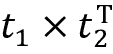
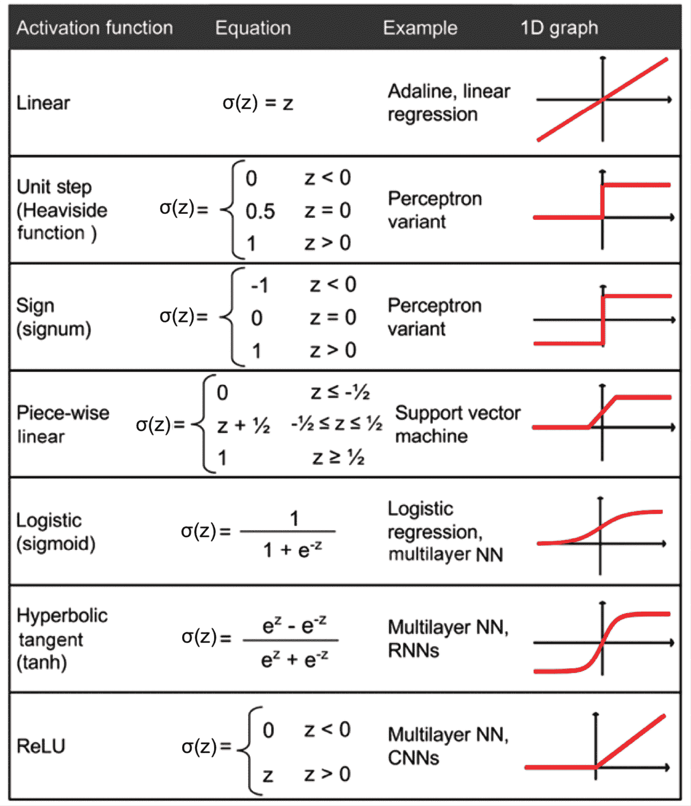

# 12

# 使用 PyTorch 并行化神经网络训练

在本章中，我们将从机器学习和深度学习的数学基础转向 PyTorch。PyTorch 是目前最流行的深度学习库之一，它让我们比以前的任何 NumPy 实现更高效地实现**神经网络**（**NNs**）。在本章中，我们将开始使用 PyTorch，看看它如何显著提升训练性能。

本章将开始我们进入机器学习和深度学习的下一阶段的旅程，我们将探讨以下主题：

+   PyTorch 如何提升训练性能

+   使用 PyTorch 的 `Dataset` 和 `DataLoader` 构建输入管道，实现高效的模型训练

+   使用 PyTorch 编写优化的机器学习代码

+   使用 `torch.nn` 模块方便地实现常见的深度学习架构

+   选择人工神经网络的激活函数

# PyTorch 和训练性能

PyTorch 可以显著加速我们的机器学习任务。要理解它是如何做到这一点的，请让我们首先讨论我们在执行昂贵计算时通常遇到的一些性能挑战。然后，我们将从高层次来看 PyTorch 是什么，以及本章中我们的学习方法会是什么样的。

## 性能挑战

当然，计算机处理器的性能在近年来一直在不断提升。这使得我们能够训练更强大和复杂的学习系统，这意味着我们可以提高机器学习模型的预测性能。即使是现在最便宜的桌面计算机硬件也配备有具有多个核心的处理单元。

在前几章中，我们看到 scikit-learn 中的许多函数允许我们将计算分布到多个处理单元上。然而，默认情况下，由于**全局解释器锁**（**GIL**），Python 只能在一个核心上执行。因此，尽管我们确实利用 Python 的多进程库将计算分布到多个核心上，但我们仍然必须考虑，即使是最先进的桌面硬件也很少配备超过 8 或 16 个这样的核心。

你会回忆起*第十一章*，*从头开始实现多层人工神经网络*，我们实现了一个非常简单的**多层感知器**（**MLP**），只有一个包含 100 个单元的隐藏层。我们必须优化大约 80,000 个权重参数（[784*100 + 100] + [100 * 10] + 10 = 79,510）来进行一个非常简单的图像分类任务。MNIST 数据集中的图像相当小（28×28），如果我们想要添加额外的隐藏层或者处理像素密度更高的图像，我们可以想象参数数量的激增。这样的任务很快就会对单个处理单元变得不可行。因此问题变成了，我们如何更有效地解决这些问题？

这个问题的显而易见的解决方案是使用**图形处理单元**（**GPUs**），它们是真正的工作马。你可以把显卡想象成你的机器内部的一个小型计算机集群。另一个优势是，与最先进的**中央处理单元**（**CPUs**）相比，现代 GPU 性价比非常高，如下面的概述所示：


图 12.1：现代 CPU 和 GPU 的比较

*图 12.1*中信息的来源是以下网站（访问日期：2021 年 7 月）:

+   [`ark.intel.com/content/www/us/en/ark/products/215570/intel-core-i9-11900kb-processor-24m-cache-up-to-4-90-ghz.html`](https://ark.intel.com/content/www/us/en/ark/products/215570/intel-core-i9-11900kb-processor-24m-cache-up-to-4-90-ghz.html)

+   [`www.nvidia.com/en-us/geforce/graphics-cards/30-series/rtx-3080-3080ti/`](https://www.nvidia.com/en-us/geforce/graphics-cards/30-series/rtx-3080-3080ti/)

以现代 CPU 的价格的 2.2 倍，我们可以获得一个 GPU，它拥有 640 倍的核心数，并且每秒可以进行大约 46 倍的浮点计算。那么，是什么阻碍了我们利用 GPU 来进行机器学习任务？挑战在于编写目标为 GPU 的代码并不像在解释器中执行 Python 代码那么简单。有一些特殊的包，比如 CUDA 和 OpenCL，可以让我们针对 GPU 进行编程。然而，用 CUDA 或 OpenCL 编写代码可能不是实现和运行机器学习算法的最方便的方式。好消息是，这正是 PyTorch 开发的目的！

## 什么是 PyTorch？

PyTorch 是一个可扩展且多平台的编程接口，用于实现和运行机器学习算法，包括深度学习的便捷包装器。PyTorch 主要由来自**Facebook AI Research**（**FAIR**）实验室的研究人员和工程师开发。其开发还涉及来自社区的许多贡献。PyTorch 最初发布于 2016 年 9 月，以修改的 BSD 许可证免费开源。许多来自学术界和工业界的机器学习研究人员和从业者已经采用 PyTorch 来开发深度学习解决方案，例如 Tesla Autopilot、Uber 的 Pyro 和 Hugging Face 的 Transformers（[`pytorch.org/ecosystem/`](https://pytorch.org/ecosystem/)）。

为了提高训练机器学习模型的性能，PyTorch 允许在 CPU、GPU 和 XLA 设备（如 TPU）上执行。然而，当使用 GPU 和 XLA 设备时，PyTorch 具有最优的性能能力。PyTorch 官方支持 CUDA 启用和 ROCm GPU。PyTorch 的开发基于 Torch 库（[www.torch.ch](http://torch.ch/)）。顾名思义，Python 接口是 PyTorch 的主要开发重点。

PyTorch 围绕着一个计算图构建，由一组节点组成。每个节点表示一个可能有零个或多个输入或输出的操作。PyTorch 提供了一种即时评估操作、执行计算并立即返回具体值的命令式编程环境。因此，PyTorch 中的计算图是隐式定义的，而不是事先构建并在执行之后执行。

从数学上讲，张量可以理解为标量、向量、矩阵等的一般化。更具体地说，标量可以定义为秩为 0 的张量，向量可以定义为秩为 1 的张量，矩阵可以定义为秩为 2 的张量，而在第三维堆叠的矩阵可以定义为秩为 3 的张量。PyTorch 中的张量类似于 NumPy 的数组，但张量经过了优化以进行自动微分并能在 GPU 上运行。

要更清晰地理解张量的概念，请参考*图 12.2*，该图展示了第一行中秩为 0 和 1 的张量，以及第二行中秩为 2 和 3 的张量：


图 12.2：PyTorch 中不同类型的张量

现在我们知道了 PyTorch 是什么，让我们看看如何使用它。

## 我们将如何学习 PyTorch

首先，我们将介绍 PyTorch 的编程模型，特别是如何创建和操作张量。然后，我们将看看如何加载数据并利用`torch.utils.data`模块，这将允许我们高效地迭代数据集。此外，我们将讨论`torch.utils.data.Dataset`子模块中现有的即用即得数据集，并学习如何使用它们。

在学习了这些基础知识后，PyTorch 神经网络模块 `torch.nn` 将被介绍。然后，我们将继续构建机器学习模型，学习如何组合和训练这些模型，并了解如何将训练好的模型保存在磁盘上以供未来评估使用。

# PyTorch 的首次使用步骤

在本节中，我们将初步了解使用低级别的 PyTorch API。在安装 PyTorch 后，我们将介绍如何在 PyTorch 中创建张量以及不同的操作方法，例如更改它们的形状、数据类型等。

## 安装 PyTorch

要安装 PyTorch，建议参阅官方网站 [`pytorch.org`](https://pytorch.org) 上的最新说明。以下是适用于大多数系统的基本步骤概述。

根据系统设置的不同，通常您只需使用 Python 的 `pip` 安装程序，并通过终端执行以下命令从 PyPI 安装 PyTorch：

```py
pip install torch torchvision 
```

这将安装最新的 *稳定* 版本，在撰写时是 1.9.0。要安装 1.9.0 版本，该版本确保与以下代码示例兼容，您可以按照以下方式修改前述命令：

```py
pip install torch==1.9.0 torchvision==0.10.0 
```

如果您希望使用 GPU（推荐），则需要一台兼容 CUDA 和 cuDNN 的 NVIDIA 显卡。如果您的计算机符合这些要求，您可以按照以下步骤安装支持 GPU 的 PyTorch：

```py
pip install torch==1.9.0+cu111 torchvision==0.10.0+cu111 -f https://download.pytorch.org/whl/torch_stable.html 
```

适用于 CUDA 11.1 或：

```py
pip install torch==1.9.0 torchvision==0.10.0\  -f https://download.pytorch.org/whl/torch_stable.html 
```

目前为止适用于 CUDA 10.2。

由于 macOS 二进制版本不支持 CUDA，您可以从源代码安装：[`pytorch.org/get-started/locally/#mac-from-source`](https://pytorch.org/get-started/locally/#mac-from-source)。

关于安装和设置过程的更多信息，请参阅官方建议，网址为[`pytorch.org/get-started/locally/`](https://pytorch.org/get-started/locally/)。

请注意，PyTorch 处于活跃开发阶段，因此每隔几个月就会发布带有重大更改的新版本。您可以通过终端验证您的 PyTorch 版本，方法如下：

```py
python -c 'import torch; print(torch.__version__)' 
```

**解决 PyTorch 安装问题**

如果您在安装过程中遇到问题，请阅读有关特定系统和平台的推荐信息，网址为[`pytorch.org/get-started/locally/`](https://pytorch.org/get-started/locally/)。请注意，本章中的所有代码都可以在您的 CPU 上运行；使用 GPU 完全是可选的，但如果您想充分享受 PyTorch 的好处，则建议使用 GPU。例如，使用 CPU 训练某些神经网络模型可能需要一周时间，而在现代 GPU 上，同样的模型可能只需几小时。如果您有显卡，请参考安装页面适当设置。此外，您可能会发现这篇设置指南有用，其中解释了如何在 Ubuntu 上安装 NVIDIA 显卡驱动程序、CUDA 和 cuDNN（虽然不是运行 PyTorch 在 GPU 上所需的必备条件，但推荐要求）：[`sebastianraschka.com/pdf/books/dlb/appendix_h_cloud-computing.pdf`](https://sebastianraschka.com/pdf/books/dlb/appendix_h_cloud-computing.pdf)。此外，正如您将在*第十七章*中看到的，*生成对抗网络用于合成新数据*，您还可以免费使用 Google Colab 通过 GPU 训练您的模型。

## 在 PyTorch 中创建张量

现在，让我们考虑几种不同的方式来创建张量，然后看看它们的一些属性以及如何操作它们。首先，我们可以使用`torch.tensor`或`torch.from_numpy`函数从列表或 NumPy 数组创建张量，如下所示：

```py
>>> import torch
>>> import numpy as np
>>> np.set_printoptions(precision=3)
>>> a = [1, 2, 3]
>>> b = np.array([4, 5, 6], dtype=np.int32)
>>> t_a = torch.tensor(a)
>>> t_b = torch.from_numpy(b)
>>> print(t_a)
>>> print(t_b)
tensor([1, 2, 3])
tensor([4, 5, 6], dtype=torch.int32) 
```

这导致了张量`t_a`和`t_b`，它们的属性为，`shape=(3,)` 和 `dtype=int32`，这些属性是从它们的源头继承而来。与 NumPy 数组类似，我们也可以看到这些属性：

```py
>>> t_ones = torch.ones(2, 3)
>>> t_ones.shape
torch.Size([2, 3])
>>> print(t_ones)
tensor([[1., 1., 1.],
        [1., 1., 1.]]) 
```

最后，可以如下方式创建随机值张量：

```py
>>> rand_tensor = torch.rand(2,3)
>>> print(rand_tensor)
tensor([[0.1409, 0.2848, 0.8914],
        [0.9223, 0.2924, 0.7889]]) 
```

## 操作张量的数据类型和形状

学习如何操作张量以使它们适合模型或操作的输入是必要的。在本节中，您将通过几个 PyTorch 函数学习如何通过类型转换、重塑、转置和挤压（去除维度）来操作张量的数据类型和形状。

`torch.to()`函数可用于将张量的数据类型更改为所需类型：

```py
>>> t_a_new = t_a.to(torch.int64)
>>> print(t_a_new.dtype)
torch.int64 
```

请查看[`pytorch.org/docs/stable/tensor_attributes.html`](https://pytorch.org/docs/stable/tensor_attributes.html)获取所有其他数据类型的信息。

正如您将在接下来的章节中看到的，某些操作要求输入张量具有特定数量的维度（即秩），并与一定数量的元素（形状）相关联。因此，我们可能需要改变张量的形状，添加一个新维度或挤压一个不必要的维度。PyTorch 提供了一些有用的函数（或操作）来实现这一点，如`torch.transpose()`、`torch.reshape()`和`torch.squeeze()`。让我们看一些例子：

+   转置张量：

    ```py
    >>> t = torch.rand(3, 5)
    >>> t_tr = torch.transpose(t, 0, 1)
    >>> print(t.shape, ' --> ', t_tr.shape)
    torch.Size([3, 5])  -->  torch.Size([5, 3]) 
    ```

+   重塑张量（例如，从 1D 向量到 2D 数组）:

    ```py
    >>> t = torch.zeros(30)
    >>> t_reshape = t.reshape(5, 6)
    >>> print(t_reshape.shape)
    torch.Size([5, 6]) 
    ```

+   移除不必要的维度（即大小为 1 的维度）：

    ```py
    >>> t = torch.zeros(1, 2, 1, 4, 1)
    >>> t_sqz = torch.squeeze(t, 2)
    >>> print(t.shape, ' --> ', t_sqz.shape)
    torch.Size([1, 2, 1, 4, 1])  -->  torch.Size([1, 2, 4, 1]) 
    ```

## 对张量应用数学操作

应用数学运算，特别是线性代数运算，是构建大多数机器学习模型所必需的。在这个子节中，我们将介绍一些广泛使用的线性代数操作，例如逐元素乘积、矩阵乘法和计算张量的范数。

首先，让我们实例化两个随机张量，一个具有在[–1, 1)范围内均匀分布的值，另一个具有标准正态分布：

```py
>>> torch.manual_seed(1)
>>> t1 = 2 * torch.rand(5, 2) - 1
>>> t2 = torch.normal(mean=0, std=1, size=(5, 2)) 
```

注意，`torch.rand`返回一个填充有从[0, 1)范围内均匀分布的随机数的张量。

注意，`t1`和`t2`具有相同的形状。现在，要计算`t1`和`t2`的逐元素乘积，可以使用以下方法：

```py
>>> t3 = torch.multiply(t1, t2)
>>> print(t3)
tensor([[ 0.4426, -0.3114], 
        [ 0.0660, -0.5970], 
        [ 1.1249,  0.0150], 
        [ 0.1569,  0.7107], 
        [-0.0451, -0.0352]]) 
```

要沿着某个轴（或轴）计算均值、总和和标准偏差，可以使用`torch.mean()`、`torch.sum()`和`torch.std()`。例如，可以如下计算`t1`中每列的均值：

```py
>>> t4 = torch.mean(t1, axis=0)
>>> print(t4)
tensor([-0.1373,  0.2028]) 
```

使用`torch.matmul()`函数可以计算`t1`和`t2`的矩阵乘积（即，，其中上标 T 表示转置）：

```py
>>> t5 = torch.matmul(t1, torch.transpose(t2, 0, 1))
>>> print(t5)
tensor([[ 0.1312,  0.3860, -0.6267, -1.0096, -0.2943],
        [ 0.1647, -0.5310,  0.2434,  0.8035,  0.1980],
        [-0.3855, -0.4422,  1.1399,  1.5558,  0.4781],
        [ 0.1822, -0.5771,  0.2585,  0.8676,  0.2132],
        [ 0.0330,  0.1084, -0.1692, -0.2771, -0.0804]]) 
```

另一方面，通过对`t1`进行转置来计算，结果是一个大小为 2×2 的数组：

```py
>>> t6 = torch.matmul(torch.transpose(t1, 0, 1), t2)
>>> print(t6)
tensor([[ 1.7453,  0.3392],
        [-1.6038, -0.2180]]) 
```

最后，`torch.linalg.norm()`函数对于计算张量的*L*^p 范数非常有用。例如，我们可以如下计算`t1`的*L*²范数：

```py
>>> norm_t1 = torch.linalg.norm(t1, ord=2, dim=1)
>>> print(norm_t1)
tensor([0.6785, 0.5078, 1.1162, 0.5488, 0.1853]) 
L2 norm of t1 correctly, you can compare the results with the following NumPy function: np.sqrt(np.sum(np.square(t1.numpy()), axis=1)).
```

## 分割、堆叠和连接张量

在这个子节中，我们将介绍 PyTorch 操作，用于将一个张量分割成多个张量，或者反过来，将多个张量堆叠和连接成一个单独的张量。

假设我们有一个单一的张量，并且我们想将它分成两个或更多的张量。为此，PyTorch 提供了一个便捷的`torch.chunk()`函数，它将输入张量分割成等大小的张量列表。我们可以使用`chunks`参数作为整数来确定所需的分割数，以`dim`参数指定沿所需维度分割张量。在这种情况下，沿指定维度的输入张量的总大小必须是所需分割数的倍数。另外，我们可以使用`torch.split()`函数在列表中提供所需的大小。让我们看看这两个选项的示例：

+   提供分割数量：

    ```py
    >>> torch.manual_seed(1)
    >>> t = torch.rand(6)
    >>> print(t)
    tensor([0.7576, 0.2793, 0.4031, 0.7347, 0.0293, 0.7999])
    >>> t_splits = torch.chunk(t, 3)
    >>> [item.numpy() for item in t_splits]
    [array([0.758, 0.279], dtype=float32),
     array([0.403, 0.735], dtype=float32),
     array([0.029, 0.8  ], dtype=float32)] 
    ```

    在这个例子中，一个大小为 6 的张量被分割成了一个包含三个大小为 2 的张量的列表。如果张量大小不能被`chunks`值整除，则最后一个块将更小。

+   提供不同分割的大小：

    或者，可以直接指定输出张量的大小，而不是定义分割的数量。在这里，我们将一个大小为`5`的张量分割为大小为`3`和`2`的张量：

    ```py
    >>> torch.manual_seed(1)
    >>> t = torch.rand(5)
    >>> print(t)
    tensor([0.7576, 0.2793, 0.4031, 0.7347, 0.0293])
    >>> t_splits = torch.split(t, split_size_or_sections=[3, 2])
    >>> [item.numpy() for item in t_splits]
    [array([0.758, 0.279, 0.403], dtype=float32),
     array([0.735, 0.029], dtype=float32)] 
    ```

有时，我们需要处理多个张量，并需要将它们连接或堆叠以创建一个单一的张量。在这种情况下，PyTorch 的函数如`torch.stack()`和`torch.cat()`非常方便。例如，让我们创建一个包含大小为`3`的 1D 张量`A`，其元素全为 1，并且一个包含大小为`2`的 1D 张量`B`，其元素全为 0，然后将它们连接成一个大小为`5`的 1D 张量`C`：

```py
>>> A = torch.ones(3)
>>> B = torch.zeros(2)
>>> C = torch.cat([A, B], axis=0)
>>> print(C)
tensor([1., 1., 1., 0., 0.]) 
```

如果我们创建了大小为`3`的 1D 张量`A`和`B`，那么我们可以将它们堆叠在一起形成一个 2D 张量`S`：

```py
>>> A = torch.ones(3)
>>> B = torch.zeros(3)
>>> S = torch.stack([A, B], axis=1)
>>> print(S)
tensor([[1., 0.],
        [1., 0.],
        [1., 0.]]) 
```

PyTorch API 具有许多操作，您可以用它们来构建模型、处理数据等。然而，覆盖每个函数超出了本书的范围，我们将专注于最基本的那些。有关所有操作和函数的完整列表，请参阅 PyTorch 文档页面：[`pytorch.org/docs/stable/index.html`](https://pytorch.org/docs/stable/index.html)。

# 在 PyTorch 中构建输入流水线

当我们训练深度神经网络模型时，通常使用迭代优化算法（例如随机梯度下降）逐步训练模型，正如我们在前几章中所看到的。

正如本章开头所提到的，`torch.nn`是用于构建神经网络模型的模块。在训练数据集相当小并且可以作为张量直接加载到内存中的情况下，我们可以直接使用这个张量进行训练。然而，在典型的使用情况下，当数据集过大以至于无法完全装入计算机内存时，我们将需要以批次的方式从主存储设备（例如硬盘或固态硬盘）加载数据。此外，我们可能需要构建一个数据处理流水线，对数据应用某些转换和预处理步骤，如均值中心化、缩放或添加噪声，以增强训练过程并防止过拟合。

每次手动应用预处理函数可能会相当繁琐。幸运的是，PyTorch 提供了一个特殊的类来构建高效和方便的预处理流水线。在本节中，我们将看到构建 PyTorch `Dataset` 和 `DataLoader` 的不同方法的概述，并实现数据加载、洗牌和分批处理。

## 从现有张量创建 PyTorch DataLoader

如果数据已经以张量对象、Python 列表或 NumPy 数组的形式存在，我们可以很容易地使用`torch.utils.data.DataLoader()`类创建数据集加载器。它返回一个`DataLoader`类的对象，我们可以用它来迭代输入数据集中的各个元素。作为一个简单的例子，考虑下面的代码，它从值为 0 到 5 的列表创建一个数据集：

```py
>>> from torch.utils.data import DataLoader
>>> t = torch.arange(6, dtype=torch.float32)
>>> data_loader = DataLoader(t) 
```

我们可以轻松地逐个遍历数据集的条目，如下所示：

```py
>>> for item in data_loader:
...     print(item)
tensor([0.])
tensor([1.])
tensor([2.])
tensor([3.])
tensor([4.])
tensor([5.]) 
```

如果我们希望从该数据集创建批次，批次大小为`3`，我们可以使用`batch_size`参数如下进行操作：

```py
>>> data_loader = DataLoader(t, batch_size=3, drop_last=False)
>>> for i, batch in enumerate(data_loader, 1):
...    print(f'batch {i}:', batch)
batch 1: tensor([0., 1., 2.])
batch 2: tensor([3., 4., 5.]) 
```

这将从该数据集创建两个批次，其中前三个元素进入批次 #1，其余元素进入批次 #2。可选的`drop_last`参数在张量中的元素数不能被所需批次大小整除时非常有用。我们可以通过将`drop_last`设置为`True`来丢弃最后一个不完整的批次。`drop_last`的默认值为`False`。

我们可以直接迭代数据集，但正如您刚看到的，`DataLoader`提供了对数据集的自动和可定制的批处理。

## 将两个张量合并为联合数据集

通常情况下，我们可能有两个（或更多）张量的数据。例如，我们可以有一个特征张量和一个标签张量。在这种情况下，我们需要构建一个结合这些张量的数据集，这将允许我们以元组形式检索这些张量的元素。

假设我们有两个张量，`t_x`和`t_y`。张量`t_x`保存我们的特征值，每个大小为`3`，而`t_y`存储类标签。对于这个例子，我们首先创建这两个张量如下：

```py
>>> torch.manual_seed(1)
>>> t_x = torch.rand([4, 3], dtype=torch.float32)
>>> t_y = torch.arange(4) 
```

现在，我们希望从这两个张量创建一个联合数据集。我们首先需要创建一个`Dataset`类，如下所示：

```py
>>> from torch.utils.data import Dataset
>>> class JointDataset(Dataset):
...     def __init__(self, x, y):
...         self.x = x
...         self.y = y
...        
...     def __len__(self):
...         return len(self.x)
...
...     def __getitem__(self, idx):
...         return self.x[idx], self.y[idx] 
```

自定义的`Dataset`类必须包含以下方法，以便稍后由数据加载器使用：

+   `__init__()`: 这是初始逻辑发生的地方，例如读取现有数组、加载文件、过滤数据等。

+   `__getitem__()`: 这将返回给定索引的对应样本。

然后，我们使用自定义的`Dataset`类从`t_x`和`t_y`创建一个联合数据集，如下所示：

```py
>>> joint_dataset = JointDataset(t_x, t_y) 
```

最后，我们可以如下打印联合数据集的每个示例：

```py
>>> for example in joint_dataset:
...     print('  x: ', example[0], '  y: ', example[1])
  x:  tensor([0.7576, 0.2793, 0.4031])   y:  tensor(0)
  x:  tensor([0.7347, 0.0293, 0.7999])   y:  tensor(1)
  x:  tensor([0.3971, 0.7544, 0.5695])   y:  tensor(2)
  x:  tensor([0.4388, 0.6387, 0.5247])   y:  tensor(3) 
```

如果第二个数据集是张量形式的带标签数据集，我们也可以简单地利用`torch.utils.data.TensorDataset`类。因此，我们可以如下创建一个联合数据集，而不是使用我们自定义的`Dataset`类`JointDataset`：

```py
>>> joint_dataset = JointDataset(t_x, t_y) 
```

注意，一个常见的错误来源可能是原始特征（*x*）和标签（*y*）之间的逐元素对应关系可能会丢失（例如，如果两个数据集分别被洗牌）。然而，一旦它们合并成一个数据集，就可以安全地应用这些操作。

如果我们从磁盘上的图像文件名列表创建了数据集，我们可以定义一个函数来从这些文件名加载图像。您将在本章后面看到将多个转换应用于数据集的示例。

## 洗牌、批处理和重复

正如*第二章*中提到的，*用于分类的简单机器学习算法的训练*，在使用随机梯度下降优化训练 NN 模型时，重要的是以随机打乱的批次方式提供训练数据。您已经看到如何使用数据加载器对象的`batch_size`参数指定批次大小。现在，除了创建批次之外，您还将看到如何对数据集进行洗牌和重新迭代。我们将继续使用之前的联合数据集。

首先，让我们从`joint_dataset`数据集创建一个打乱顺序的数据加载器：

```py
>>> torch.manual_seed(1) 
>>> data_loader = DataLoader(dataset=joint_dataset, batch_size=2, shuffle=True) 
```

在这里，每个批次包含两个数据记录（*x*）和相应的标签（*y*）。现在我们逐条通过数据加载器迭代数据入口如下：

```py
>>> for i, batch in enumerate(data_loader, 1):
...     print(f'batch {i}:', 'x:', batch[0],
              '\n         y:', batch[1])
batch 1: x: tensor([[0.4388, 0.6387, 0.5247],
        [0.3971, 0.7544, 0.5695]]) 
         y: tensor([3, 2])
batch 2: x: tensor([[0.7576, 0.2793, 0.4031],
        [0.7347, 0.0293, 0.7999]]) 
         y: tensor([0, 1]) 
```

行被随机打乱，但不会丢失`x`和`y`条目之间的一一对应关系。

此外，在训练模型多个 epochs 时，我们需要按所需的 epochs 数量对数据集进行洗牌和迭代。因此，让我们对批处理数据集进行两次迭代：

```py
>>> for epoch in range(2): 
>>>     print(f'epoch {epoch+1}')
>>>     for i, batch in enumerate(data_loader, 1):
...         print(f'batch {i}:', 'x:', batch[0], 
                  '\n         y:', batch[1])
epoch 1
batch 1: x: tensor([[0.7347, 0.0293, 0.7999],
        [0.3971, 0.7544, 0.5695]]) 
         y: tensor([1, 2])
batch 2: x: tensor([[0.4388, 0.6387, 0.5247],
        [0.7576, 0.2793, 0.4031]]) 
         y: tensor([3, 0])
epoch 2
batch 1: x: tensor([[0.3971, 0.7544, 0.5695],
        [0.7576, 0.2793, 0.4031]]) 
         y: tensor([2, 0])
batch 2: x: tensor([[0.7347, 0.0293, 0.7999],
        [0.4388, 0.6387, 0.5247]]) 
         y: tensor([1, 3]) 
```

这导致了两组不同的批次。在第一个 epoch 中，第一批次包含一对值`[y=1, y=2]`，第二批次包含一对值`[y=3, y=0]`。在第二个 epoch 中，两个批次分别包含一对值`[y=2, y=0]`和`[y=1, y=3]`。对于每次迭代，批次内的元素也被打乱了。

## 从本地存储磁盘上的文件创建数据集

在本节中，我们将从存储在磁盘上的图像文件构建数据集。本章的在线内容与一个图像文件夹相关联。下载文件夹后，您应该能够看到六张猫和狗的 JPEG 格式图像。

这个小数据集将展示如何从存储的文件中构建数据集。为此，我们将使用两个额外的模块：`PIL`中的`Image`来读取图像文件内容和`torchvision`中的`transforms`来解码原始内容并调整图像大小。

`PIL.Image`和`torchvision.transforms`模块提供了许多额外和有用的函数，这超出了本书的范围。建议您浏览官方文档以了解更多有关这些函数的信息：

[`pillow.readthedocs.io/en/stable/reference/Image.html`](https://pillow.readthedocs.io/en/stable/reference/Image.html)提供了关于`PIL.Image`的参考文档

[`pytorch.org/vision/stable/transforms.html`](https://pytorch.org/vision/stable/transforms.html)提供了关于`torchvision.transforms`的参考文档

在我们开始之前，让我们看一下这些文件的内容。我们将使用`pathlib`库生成一个图像文件列表：

```py
>>> import pathlib
>>> imgdir_path = pathlib.Path('cat_dog_images')
>>> file_list = sorted([str(path) for path in
... imgdir_path.glob('*.jpg')])
>>> print(file_list)
['cat_dog_images/dog-03.jpg', 'cat_dog_images/cat-01.jpg', 'cat_dog_images/cat-02.jpg', 'cat_dog_images/cat-03.jpg', 'cat_dog_images/dog-01.jpg', 'cat_dog_images/dog-02.jpg'] 
```

接下来，我们将使用 Matplotlib 可视化这些图像示例：

```py
>>> import matplotlib.pyplot as plt
>>> import os
>>> from PIL import Image
>>> fig = plt.figure(figsize=(10, 5))
>>> for i, file in enumerate(file_list):
...     img = Image.open(file)
...     print('Image shape:', np.array(img).shape)
...     ax = fig.add_subplot(2, 3, i+1)
...     ax.set_xticks([]); ax.set_yticks([])
...     ax.imshow(img)
...     ax.set_title(os.path.basename(file), size=15)
>>> plt.tight_layout()
>>> plt.show()
Image shape: (900, 1200, 3)
Image shape: (900, 1200, 3)
Image shape: (900, 1200, 3)
Image shape: (900, 742, 3)
Image shape: (800, 1200, 3)
Image shape: (800, 1200, 3) 
```

*图 12.3*显示了示例图像：


图 12.3：猫和狗的图像

仅通过这个可视化和打印的图像形状，我们就能看到这些图像具有不同的长宽比。如果打印这些图像的长宽比（或数据数组形状），您会看到一些图像高 900 像素，宽 1200 像素（900×1200），一些是 800×1200，还有一个是 900×742。稍后，我们将把这些图像预处理到一个统一的尺寸。另一个需要考虑的问题是这些图像的标签是作为它们的文件名提供的。因此，我们从文件名列表中提取这些标签，将标签`1`分配给狗，标签`0`分配给猫：

```py
>>> labels = [1 if 'dog' in 
...              os.path.basename(file) else 0
...                      for file in file_list]
>>> print(labels)
[0, 0, 0, 1, 1, 1] 
```

现在，我们有两个列表：一个是文件名列表（或每个图像的路径），另一个是它们的标签列表。在前一节中，您学习了如何从两个数组创建一个联合数据集。在这里，我们将执行以下操作：

```py
>>> class ImageDataset(Dataset):
...     def __init__(self, file_list, labels):
...         self.file_list = file_list
...         self.labels = labels
... 
...     def __getitem__(self, index):
...         file = self.file_list[index]
...         label = self.labels[index]
...         return file, label
...
...     def __len__(self):
...         return len(self.labels)
>>> image_dataset = ImageDataset(file_list, labels)
>>> for file, label in image_dataset:
...     print(file, label)
cat_dog_images/cat-01.jpg 0
cat_dog_images/cat-02.jpg 0
cat_dog_images/cat-03.jpg 0
cat_dog_images/dog-01.jpg 1
cat_dog_images/dog-02.jpg 1
cat_dog_images/dog-03.jpg 1 
```

联合数据集具有文件名和标签。

接下来，我们需要对这个数据集应用转换：从文件路径加载图像内容，解码原始内容，并将其调整为所需尺寸，例如 80×120。如前所述，我们使用`torchvision.transforms`模块将图像调整大小并将加载的像素转换为张量，操作如下：

```py
>>> import torchvision.transforms as transforms 
>>> img_height, img_width = 80, 120
>>> transform = transforms.Compose([
...     transforms.ToTensor(),
...     transforms.Resize((img_height, img_width)),
... ]) 
```

现在，我们使用刚定义的`transform`更新`ImageDataset`类：

```py
>>> class ImageDataset(Dataset):
...     def __init__(self, file_list, labels, transform=None):
...         self.file_list = file_list
...         self.labels = labels
...         self.transform = transform
...
...     def __getitem__(self, index):
...         img = Image.open(self.file_list[index])
...         if self.transform is not None:
...             img = self.transform(img)
...         label = self.labels[index]
...         return img, label
...
...     def __len__(self):
...         return len(self.labels)
>>> 
>>> image_dataset = ImageDataset(file_list, labels, transform) 
```

最后，我们使用 Matplotlib 可视化这些转换后的图像示例：

```py
>>> fig = plt.figure(figsize=(10, 6))
>>> for i, example in enumerate(image_dataset):
...     ax = fig.add_subplot(2, 3, i+1)
...     ax.set_xticks([]); ax.set_yticks([])
...     ax.imshow(example[0].numpy().transpose((1, 2, 0)))
...     ax.set_title(f'{example[1]}', size=15)
...
>>> plt.tight_layout()
>>> plt.show() 
```

这导致检索到的示例图像以及它们的标签的以下可视化：


图 12.4：图像带有标签

`ImageDataset`类中的`__getitem__`方法将所有四个步骤封装到一个函数中，包括加载原始内容（图像和标签），将图像解码为张量并调整图像大小。然后，该函数返回一个数据集，我们可以通过数据加载器迭代，并应用前面章节中学到的其他操作，如随机排列和分批处理。

## 从`torchvision.datasets`库获取可用数据集

`torchvision.datasets`库提供了一组精美的免费图像数据集，用于训练或评估深度学习模型。类似地，`torchtext.datasets`库提供了用于自然语言的数据集。在这里，我们以`torchvision.datasets`为例。

`torchvision`数据集（[`pytorch.org/vision/stable/datasets.html`](https://pytorch.org/vision/stable/datasets.html)）的格式很好，并带有信息性的描述，包括特征和标签的格式及其类型和维度，以及数据集的原始来源的链接。另一个优点是这些数据集都是`torch.utils.data.Dataset`的子类，因此我们在前面章节中涵盖的所有功能都可以直接使用。那么，让我们看看如何在实际中使用这些数据集。

首先，如果您之前没有与 PyTorch 一起安装`torchvision`，则需要从命令行使用`pip`安装`torchvision`库：

```py
pip install torchvision 
```

您可以查看[`pytorch.org/vision/stable/datasets.html`](https://pytorch.org/vision/stable/datasets.html)上的可用数据集列表。

在接下来的段落中，我们将介绍获取两个不同数据集的方法：CelebA (`celeb_a`)和 MNIST 数字数据集。

让我们首先使用 CelebA 数据集 ([`mmlab.ie.cuhk.edu.hk/projects/CelebA.html`](http://mmlab.ie.cuhk.edu.hk/projects/CelebA.html))，使用`torchvision.datasets.CelebA` ([`pytorch.org/vision/stable/datasets.html#celeba`](https://pytorch.org/vision/stable/datasets.html#celeba))。`torchvision.datasets.CelebA`的描述提供了一些有用的信息，帮助我们理解这个数据集的结构：

+   数据库有三个子集，分别是`'train'`、`'valid'`和`'test'`。我们可以通过`split`参数选择特定的子集或加载它们全部。

+   图像以`PIL.Image`格式存储。我们可以使用自定义的`transform`函数获得变换后的版本，例如`transforms.ToTensor`和`transforms.Resize`。

+   我们可以使用不同类型的目标，包括`'attributes'`、`'identity'`和`'landmarks'`。`'attributes'`是图像中人物的 40 个面部属性，例如面部表情、化妆、头发属性等；`'identity'`是图像的人物 ID；而`'landmarks'`指的是提取的面部点字典，如眼睛、鼻子等位置。

接下来，我们将调用`torchvision.datasets.CelebA`类来下载数据，将其存储在指定文件夹中，并将其加载到`torch.utils.data.Dataset`对象中：

```py
>>> import torchvision 
>>> image_path = './' 
>>> celeba_dataset = torchvision.datasets.CelebA(
...     image_path, split='train', target_type='attr', download=True
... )
1443490838/? [01:28<00:00, 6730259.81it/s]
26721026/? [00:03<00:00, 8225581.57it/s]
3424458/? [00:00<00:00, 14141274.46it/s]
6082035/? [00:00<00:00, 21695906.49it/s]
12156055/? [00:00<00:00, 12002767.35it/s]
2836386/? [00:00<00:00, 3858079.93it/s] 
```

您可能会遇到`BadZipFile: File is not a zip file`错误，或者`RuntimeError: The daily quota of the file img_align_celeba.zip is exceeded and it can't be downloaded. This is a limitation of Google Drive and can only be overcome by trying again later`；这意味着 Google Drive 的每日下载配额已超过 CelebA 文件的大小限制。为了解决这个问题，您可以从源地址手动下载文件：[`mmlab.ie.cuhk.edu.hk/projects/CelebA.html`](http://mmlab.ie.cuhk.edu.hk/projects/CelebA.html)。在下载的`celeba/`文件夹中，您可以解压`img_align_celeba.zip`文件。`image_path`是下载文件夹`celeba/`的根目录。如果您已经下载过文件一次，您可以简单地将`download=False`设置为`True`。如需更多信息和指导，请查看附带的代码笔记本：[`github.com/rasbt/machine-learning-book/blob/main/ch12/ch12_part1.ipynb`](https://github.com/rasbt/machine-learning-book/blob/main/ch12/ch12_part1.ipynb)。

现在我们已经实例化了数据集，让我们检查对象是否是`torch.utils.data.Dataset`类：

```py
>>> assert isinstance(celeba_dataset, torch.utils.data.Dataset) 
```

如前所述，数据集已经分为训练集、测试集和验证集，我们只加载训练集。我们只使用`'attributes'`目标。为了查看数据示例的外观，我们可以执行以下代码：

```py
>>> example = next(iter(celeba_dataset))
>>> print(example)
(<PIL.JpegImagePlugin.JpegImageFile image mode=RGB size=178x218 at 0x120C6C668>, tensor([0, 1, 1, 0, 0, 0, 0, 0, 0, 0, 0, 1, 0, 0, 0, 0, 0, 0, 1, 1, 0, 1, 0, 0, 1, 0, 0, 1, 0, 0, 0, 1, 1, 0, 1, 0, 1, 0, 0, 1])) 
```

请注意，此数据集中的样本以 `(PIL.Image, attributes)` 的元组形式出现。如果我们希望在训练过程中将此数据集传递给监督深度学习模型，我们必须将其重新格式化为 `(features tensor, label)` 的元组形式。例如，我们将使用属性中的 `'Smiling'` 类别作为标签，这是第 31 个元素。

最后，让我们从中获取前 18 个示例，以其 `'Smiling'` 标签可视化它们：

```py
>>> from itertools import islice
>>> fig = plt.figure(figsize=(12, 8))
>>> for i, (image, attributes) in islice(enumerate(celeba_dataset), 18):
...     ax = fig.add_subplot(3, 6, i+1)
...     ax.set_xticks([]); ax.set_yticks([])
...     ax.imshow(image)
...     ax.set_title(f'{attributes[31]}', size=15)
>>> plt.show() 
```

从 `celeba_dataset` 中检索到的示例及其标签显示在 *Figure 12.5* 中：


Figure 12.5: 模型预测微笑名人

这就是我们需要做的一切，以获取并使用 CelebA 图像数据集。

接下来，我们将继续使用 `torchvision.datasets.MNIST` ([`pytorch.org/vision/stable/datasets.html#mnist`](https://pytorch.org/vision/stable/datasets.html#mnist)) 中的第二个数据集。让我们看看如何使用它来获取 MNIST 手写数字数据集：

+   数据库有两个分区，分别是 `'train'` 和 `'test'`。我们需要选择特定的子集进行加载。

+   图像以 `PIL.Image` 格式存储。我们可以使用自定义的 `transform` 函数获取其转换版本，例如 `transforms.ToTensor` 和 `transforms.Resize`。

+   目标有 10 个类别，从 `0` 到 `9`。

现在，我们可以下载 `'train'` 分区，将元素转换为元组，并可视化 10 个示例：

```py
>>> mnist_dataset = torchvision.datasets.MNIST(image_path, 'train', download=True)
>>> assert isinstance(mnist_dataset, torch.utils.data.Dataset)
>>> example = next(iter(mnist_dataset))
>>> print(example)
(<PIL.Image.Image image mode=L size=28x28 at 0x126895B00>, 5)
>>> fig = plt.figure(figsize=(15, 6))
>>> for i, (image, label) in  islice(enumerate(mnist_dataset), 10):
...     ax = fig.add_subplot(2, 5, i+1)
...     ax.set_xticks([]); ax.set_yticks([])
...     ax.imshow(image, cmap='gray_r')
...     ax.set_title(f'{label}', size=15)
>>> plt.show() 
```

从这个数据集中检索到的示例手写数字如下所示：


Figure 12.6: 正确识别手写数字

这完成了我们关于构建和操作数据集以及从`torchvision.datasets`库获取数据集的覆盖。接下来，我们将看到如何在 PyTorch 中构建 NN 模型。

# 在 PyTorch 中构建 NN 模型

在本章中，到目前为止，您已经了解了 PyTorch 的基本实用组件，用于操作张量并将数据组织成可以在训练期间迭代的格式。在本节中，我们将最终在 PyTorch 中实现我们的第一个预测模型。由于 PyTorch 比 scikit-learn 等机器学习库更加灵活但也更加复杂，我们将从一个简单的线性回归模型开始。

## PyTorch 神经网络模块（torch.nn）

`torch.nn` 是一个设计优雅的模块，旨在帮助创建和训练神经网络。它允许在几行代码中轻松进行原型设计和构建复杂模型。

要充分利用该模块的功能，并为您的问题定制它，您需要理解它在做什么。为了发展这种理解，我们将首先在一个玩具数据集上训练一个基本的线性回归模型，而不使用任何来自 `torch.nn` 模块的特性；我们只会使用基本的 PyTorch 张量操作。

然后，我们将逐步添加来自`torch.nn`和`torch.optim`的特性。正如您将在接下来的小节中看到的，这些模块使得构建 NN 模型变得极其简单。我们还将利用 PyTorch 中支持的数据集流水线功能，例如`Dataset`和`DataLoader`，这些您在前一节已经了解过。在本书中，我们将使用`torch.nn`模块来构建 NN 模型。

在 PyTorch 中构建 NN 的最常用方法是通过`nn.Module`，它允许将层堆叠起来形成网络。这使我们能够更好地控制前向传播。我们将看到使用`nn.Module`类构建 NN 模型的示例。

最后，正如您将在接下来的小节中看到的，训练好的模型可以保存并重新加载以供将来使用。

## 构建线性回归模型

在这个小节中，我们将构建一个简单的模型来解决线性回归问题。首先，让我们在 NumPy 中创建一个玩具数据集并可视化它：

```py
>>> X_train = np.arange(10, dtype='float32').reshape((10, 1))
>>> y_train = np.array([1.0, 1.3, 3.1, 2.0, 5.0, 
...                     6.3, 6.6,7.4, 8.0,
...                     9.0], dtype='float32')
>>> plt.plot(X_train, y_train, 'o', markersize=10)
>>> plt.xlabel('x')
>>> plt.ylabel('y')
>>> plt.show() 
```

因此，训练样本将如下显示在散点图中：


图 12.7：训练样本的散点图

接下来，我们将标准化特征（平均中心化和除以标准差），并为训练集创建一个 PyTorch 的`Dataset`及其相应的`DataLoader`：

```py
>>> from torch.utils.data import TensorDataset
>>> X_train_norm = (X_train - np.mean(X_train)) / np.std(X_train)
>>> X_train_norm = torch.from_numpy(X_train_norm)
>>> y_train = torch.from_numpy(y_train)
>>> train_ds = TensorDataset(X_train_norm, y_train)
>>> batch_size = 1
>>> train_dl = DataLoader(train_ds, batch_size, shuffle=True) 
```

在这里，我们为`DataLoader`设置了批大小为`1`。

现在，我们可以定义我们的线性回归模型为 *z* = *wx* + *b*。在这里，我们将使用`torch.nn`模块。它提供了预定义的层用于构建复杂的 NN 模型，但首先，您将学习如何从头开始定义一个模型。在本章的后面，您将看到如何使用这些预定义层。

对于这个回归问题，我们将从头开始定义一个线性回归模型。我们将定义我们模型的参数，`weight`和`bias`，它们分别对应于权重和偏置参数。最后，我们将定义`model()`函数来确定这个模型如何使用输入数据生成其输出：

```py
>>> torch.manual_seed(1)
>>> weight = torch.randn(1)
>>> weight.requires_grad_()
>>> bias = torch.zeros(1, requires_grad=True)
>>> def model(xb):
...     return xb @ weight + bias 
```

定义模型之后，我们可以定义损失函数，以便找到最优模型权重。在这里，我们将选择**均方误差**（**MSE**）作为我们的损失函数：

```py
>>> def loss_fn(input, target):
...     return (input-target).pow(2).mean() 
```

此外，为了学习模型的权重参数，我们将使用随机梯度下降。在这个小节中，我们将通过自己实现随机梯度下降过程来训练，但在下一个小节中，我们将使用优化包`torch.optim`中的`SGD`方法来做同样的事情。

要实现随机梯度下降算法，我们需要计算梯度。与手动计算梯度不同，我们将使用 PyTorch 的`torch.autograd.backward`函数。我们将涵盖`torch.autograd`及其不同的类和函数，用于实现自动微分在*第十三章*，*深入探讨 - PyTorch 的机制*。

现在，我们可以设置学习率并训练模型进行 200 个 epochs。训练模型的代码如下，针对数据集的批处理版本：

```py
>>> learning_rate = 0.001
>>> num_epochs = 200
>>> log_epochs = 10
>>> for epoch in range(num_epochs):
...     for x_batch, y_batch in train_dl:
...         pred = model(x_batch)
...         loss = loss_fn(pred, y_batch)
...         loss.backward()
...     with torch.no_grad():
...         weight -= weight.grad * learning_rate
...         bias -= bias.grad * learning_rate
...         weight.grad.zero_() 
...         bias.grad.zero_()   
...     if epoch % log_epochs==0:
...         print(f'Epoch {epoch}  Loss {loss.item():.4f}')
Epoch 0  Loss 5.1701
Epoch 10  Loss 30.3370
Epoch 20  Loss 26.9436
Epoch 30  Loss 0.9315
Epoch 40  Loss 3.5942
Epoch 50  Loss 5.8960
Epoch 60  Loss 3.7567
Epoch 70  Loss 1.5877
Epoch 80  Loss 0.6213
Epoch 90  Loss 1.5596
Epoch 100  Loss 0.2583
Epoch 110  Loss 0.6957
Epoch 120  Loss 0.2659
Epoch 130  Loss 0.1615
Epoch 140  Loss 0.6025
Epoch 150  Loss 0.0639
Epoch 160  Loss 0.1177
Epoch 170  Loss 0.3501
Epoch 180  Loss 0.3281
Epoch 190  Loss 0.0970 
```

让我们查看训练好的模型并绘制它。对于测试数据，我们将创建一个在 0 到 9 之间均匀分布的值的 NumPy 数组。由于我们训练模型时使用了标准化特征，我们还将在测试数据上应用相同的标准化：

```py
>>> print('Final Parameters:', weight.item(), bias.item())
Final Parameters:  2.669806480407715 4.879569053649902
>>> X_test = np.linspace(0, 9, num=100, dtype='float32').reshape(-1, 1)
>>> X_test_norm = (X_test - np.mean(X_train)) / np.std(X_train)
>>> X_test_norm = torch.from_numpy(X_test_norm)
>>> y_pred = model(X_test_norm).detach().numpy()
>>> fig = plt.figure(figsize=(13, 5))
>>> ax = fig.add_subplot(1, 2, 1)
>>> plt.plot(X_train_norm, y_train, 'o', markersize=10)
>>> plt.plot(X_test_norm, y_pred, '--', lw=3)
>>> plt.legend(['Training examples', 'Linear reg.'], fontsize=15)
>>> ax.set_xlabel('x', size=15)
>>> ax.set_ylabel('y', size=15)
>>> ax.tick_params(axis='both', which='major', labelsize=15)
>>> plt.show() 
```

*图 12.8*显示了训练示例的散点图和训练的线性回归模型：


图 12.8：线性回归模型很好地拟合了数据

## 通过`torch.nn`和`torch.optim`模块进行模型训练

在前面的例子中，我们看到如何通过编写自定义损失函数`loss_fn()`来训练模型，并应用随机梯度下降优化。然而，编写损失函数和梯度更新可能是在不同项目中重复的任务。`torch.nn`模块提供了一组损失函数，而`torch.optim`支持大多数常用的优化算法，可以根据计算出的梯度来更新参数。为了看看它们是如何工作的，让我们创建一个新的均方误差（MSE）损失函数和一个随机梯度下降优化器：

```py
>>> import torch.nn as nn
>>> loss_fn = nn.MSELoss(reduction='mean')
>>> input_size = 1
>>> output_size = 1
>>> model = nn.Linear(input_size, output_size)
>>> optimizer = torch.optim.SGD(model.parameters(), lr=learning_rate) 
```

请注意，这里我们使用`torch.nn.Linear`类来代替手动定义线性层。

现在，我们可以简单地调用`optimizer`的`step()`方法来训练模型。我们可以传递一个批处理的数据集（例如前面例子中创建的`train_dl`）：

```py
>>> for epoch in range(num_epochs):
...     for x_batch, y_batch in train_dl:
...         # 1\. Generate predictions
...         pred = model(x_batch)[:, 0]
...         # 2\. Calculate loss
...         loss = loss_fn(pred, y_batch)
...         # 3\. Compute gradients
...         loss.backward()
...         # 4\. Update parameters using gradients
...         optimizer.step()
...         # 5\. Reset the gradients to zero
...         optimizer.zero_grad()    
...     if epoch % log_epochs==0:
...         print(f'Epoch {epoch}  Loss {loss.item():.4f}') 
```

模型训练完成后，可视化结果并确保它们与以前方法的结果相似。要获取权重和偏置参数，我们可以执行以下操作：

```py
>>> print('Final Parameters:', model.weight.item(), model.bias.item())
Final Parameters: 2.646660089492798 4.883835315704346 
```

## 构建一个用于分类鸢尾花数据集中花朵的多层感知机

在前面的例子中，您看到了如何从头开始构建模型。我们使用随机梯度下降优化来训练这个模型。虽然我们从最简单的可能示例开始我们的旅程，但是你可以看到，即使对于这样一个简单的案例来说，从头定义模型也既不吸引人，也不是良好的实践。相反，PyTorch 通过`torch.nn`提供了已定义的层，可以直接用作 NN 模型的构建块。在本节中，您将学习如何使用这些层来解决使用鸢尾花数据集（识别三种鸢尾花的物种）的分类任务，并使用`torch.nn`模块构建一个两层感知机。首先，让我们从`sklearn.datasets`获取数据：

```py
>>> from sklearn.datasets import load_iris
>>> from sklearn.model_selection import train_test_split 
>>> iris = load_iris()
>>> X = iris['data']
>>> y = iris['target']
>>> X_train, X_test, y_train, y_test = train_test_split(
...    X, y, test_size=1./3, random_state=1) 
```

在这里，我们随机选择了 100 个样本（2/3）用于训练，以及 50 个样本（1/3）用于测试。

接下来，我们对特征进行标准化（均值中心化并除以标准差），并为训练集创建一个 PyTorch `Dataset`及其相应的`DataLoader`：

```py
>>> X_train_norm = (X_train - np.mean(X_train)) / np.std(X_train)
>>> X_train_norm = torch.from_numpy(X_train_norm).float()
>>> y_train = torch.from_numpy(y_train) 
>>> train_ds = TensorDataset(X_train_norm, y_train)
>>> torch.manual_seed(1)
>>> batch_size = 2
>>> train_dl = DataLoader(train_ds, batch_size, shuffle=True) 
```

在这里，我们将`DataLoader`的批处理大小设置为`2`。

现在，我们准备使用`torch.nn`模块来高效地构建模型。特别地，使用`nn.Module`类，我们可以堆叠几层并建立一个神经网络。您可以在[`pytorch.org/docs/stable/nn.html`](https://pytorch.org/docs/stable/nn.html)查看所有已经可用的层列表。对于这个问题，我们将使用`Linear`层，也被称为全连接层或密集层，可以最好地表示为*f*(*w* × *x* + *b*)，其中*x*代表包含输入特征的张量，*w*和*b*是权重矩阵和偏置向量，*f*是激活函数。

神经网络中的每一层都从前一层接收其输入，因此其维度（秩和形状）是固定的。通常，我们只需要在设计神经网络架构时关注输出的维度。在这里，我们希望定义一个具有两个隐藏层的模型。第一层接收四个特征的输入，并将它们投影到 16 个神经元。第二层接收前一层的输出（其大小为*16*），并将其投影到三个输出神经元，因为我们有三个类标签。可以通过以下方式实现：

```py
>>> class Model(nn.Module):
...     def __init__(self, input_size, hidden_size, output_size):
...         super().__init__()
...         self.layer1 = nn.Linear(input_size, hidden_size)
...         self.layer2 = nn.Linear(hidden_size, output_size)
...     def forward(self, x):
...         x = self.layer1(x)
...         x = nn.Sigmoid()(x)
...         x = self.layer2(x)
...         x = nn.Softmax(dim=1)(x)
...         return x
>>> input_size = X_train_norm.shape[1]
>>> hidden_size = 16
>>> output_size = 3 
>>> model = Model(input_size, hidden_size, output_size) 
```

这里，我们在第一层使用了 sigmoid 激活函数，在最后（输出）层使用了 softmax 激活函数。由于我们这里有三个类标签，softmax 激活函数在最后一层用于支持多类分类（这也是为什么输出层有三个神经元）。我们将在本章后面讨论不同的激活函数及其应用。

接下来，我们将损失函数指定为交叉熵损失，并将优化器指定为 Adam：

Adam 优化器是一种强大的基于梯度的优化方法，我们将在第十四章《使用深度卷积神经网络对图像进行分类》中详细讨论。

```py
>>> learning_rate = 0.001
>>> loss_fn = nn.CrossEntropyLoss()
>>> optimizer = torch.optim.Adam(model.parameters(), lr=learning_rate) 
```

现在，我们可以训练模型了。我们将指定 epoch 数为`100`。训练花卉分类模型的代码如下：

```py
>>> num_epochs = 100
>>> loss_hist = [0] * num_epochs
>>> accuracy_hist = [0] * num_epochs
>>> for epoch in range(num_epochs):
...     for x_batch, y_batch in train_dl:
...         pred = model(x_batch)
...         loss = loss_fn(pred, y_batch)
...         loss.backward()
...         optimizer.step()
...         optimizer.zero_grad()
...         loss_hist[epoch] += loss.item()*y_batch.size(0)
...         is_correct = (torch.argmax(pred, dim=1) == y_batch).float()
...         accuracy_hist[epoch] += is_correct.mean()
...      loss_hist[epoch] /= len(train_dl.dataset)
...      accuracy_hist[epoch] /= len(train_dl.dataset) 
```

`loss_hist`和`accuracy_hist`列表保存了每个 epoch 后的训练损失和训练精度。我们可以使用这些来可视化学习曲线，如下所示：

```py
>>> fig = plt.figure(figsize=(12, 5))
>>> ax = fig.add_subplot(1, 2, 1)
>>> ax.plot(loss_hist, lw=3)
>>> ax.set_title('Training loss', size=15)
>>> ax.set_xlabel('Epoch', size=15)
>>> ax.tick_params(axis='both', which='major', labelsize=15)
>>> ax = fig.add_subplot(1, 2, 2)
>>> ax.plot(accuracy_hist, lw=3)
>>> ax.set_title('Training accuracy', size=15)
>>> ax.set_xlabel('Epoch', size=15)
>>> ax.tick_params(axis='both', which='major', labelsize=15)
>>> plt.show() 
```

学习曲线（训练损失和训练精度）如下：


图 12.9：训练损失和准确率曲线

## 在测试数据集上评估训练好的模型。

现在，我们可以评估训练好的模型在测试数据集上的分类准确率了：

```py
>>> X_test_norm = (X_test - np.mean(X_train)) / np.std(X_train)
>>> X_test_norm = torch.from_numpy(X_test_norm).float()
>>> y_test = torch.from_numpy(y_test) 
>>> pred_test = model(X_test_norm)
>>> correct = (torch.argmax(pred_test, dim=1) == y_test).float()
>>> accuracy = correct.mean()
>>> print(f'Test Acc.: {accuracy:.4f}')
Test Acc.: 0.9800 
```

由于我们使用标准化特征训练了模型，我们也将相同的标准化应用于测试数据。分类准确率为 0.98（即 98%）。

## 保存和重新加载训练好的模型

训练好的模型可以保存在磁盘上供将来使用。可以通过以下方式实现：

```py
>>> path = 'iris_classifier.pt'
>>> torch.save(model, path) 
```

调用`save(model)`会保存模型架构和所有学到的参数。按照一般惯例，我们可以使用`'pt'`或`'pth'`文件扩展名保存模型。

现在，让我们重新加载保存的模型。由于我们已经保存了模型的结构和权重，我们可以只用一行代码轻松重建和重新加载参数：

```py
>>> model_new = torch.load(path) 
```

尝试通过调用`model_new.eval()`来验证模型结构：

```py
>>> model_new.eval()
Model(
  (layer1): Linear(in_features=4, out_features=16, bias=True)
  (layer2): Linear(in_features=16, out_features=3, bias=True)
) 
```

最后，让我们在测试数据集上评估这个重新加载的新模型，以验证结果与之前是否相同：

```py
>>> pred_test = model_new(X_test_norm)
>>> correct = (torch.argmax(pred_test, dim=1) == y_test).float()
>>> accuracy = correct.mean() 
>>> print(f'Test Acc.: {accuracy:.4f}')
Test Acc.: 0.9800 
```

如果你只想保存已学习的参数，可以像下面这样使用`save(model.state_dict())`：

```py
>>> path = 'iris_classifier_state.pt'
>>> torch.save(model.state_dict(), path) 
```

要重新加载保存的参数，我们首先需要像之前一样构建模型，然后将加载的参数提供给模型：

```py
>>> model_new = Model(input_size, hidden_size, output_size)
>>> model_new.load_state_dict(torch.load(path)) 
```

# 选择多层神经网络的激活函数

简单起见，到目前为止我们只讨论了在多层前馈神经网络中使用的 S 型激活函数；我们在 MLP 实现的隐藏层和输出层都使用了它(*第十一章*)。

请注意，在本书中，逻辑函数，，因其简洁性常被称为*sigmoid*函数，在机器学习文献中很常见。在接下来的小节中，您将学习更多关于实现多层神经网络时有用的替代非线性函数的内容。

从技术上讲，我们可以在多层神经网络中使用任何可微函数作为激活函数。我们甚至可以使用线性激活函数，例如在 Adaline(*第二章*，*用于分类的简单机器学习算法*)中。然而，在实践中，对于隐藏层和输出层都使用线性激活函数并不是很有用，因为我们想要在典型的人工神经网络中引入非线性，以便能够解决复杂问题。多个线性函数的总和毕竟会产生一个线性函数。

我们在*第十一章*中使用的逻辑（S 型）激活函数可能最接近大脑中神经元的概念——我们可以将其视为神经元是否触发的概率。然而，如果输入非常负，则逻辑（S 型）激活函数的输出会接近于零。如果逻辑函数返回接近于零的输出，在训练过程中神经网络将学习速度非常慢，并且更容易陷入损失地形的局部最小值中。这就是为什么人们通常更喜欢在隐藏层中使用双曲正切作为激活函数的原因。

在讨论双曲正切函数的外观之前，让我们简要回顾一下逻辑函数的一些基础知识，并查看一个使其在多标签分类问题中更有用的泛化。

## 逻辑函数回顾

正如在本节的介绍中提到的，逻辑函数实际上是 S 形函数的一种特殊情况。您可以从*第三章*《使用 Scikit-Learn 进行机器学习分类器之旅》中的逻辑回归部分回忆起，我们可以使用逻辑函数来建模样本 *x* 属于正类（类 `1`）的概率。

给定的净输入，*z*，如下方程所示：


逻辑（sigmoid）函数将计算如下：


注意 *w*[0] 是偏置单元（*y*-轴截距，这意味着 *x*[0] = 1）。为了提供一个更具体的示例，让我们来看一个二维数据点 *x* 的模型，以及分配给 *w* 向量的以下权重系数：

```py
>>> import numpy as np
>>> X = np.array([1, 1.4, 2.5]) ## first value must be 1
>>> w = np.array([0.4, 0.3, 0.5])
>>> def net_input(X, w):
...     return np.dot(X, w)
>>> def logistic(z):
...     return 1.0 / (1.0 + np.exp(-z))
>>> def logistic_activation(X, w):
...     z = net_input(X, w)
...     return logistic(z)
>>> print(f'P(y=1|x) = {logistic_activation(X, w):.3f}')
P(y=1|x) = 0.888 
```

如果我们计算净输入（*z*）并使用它来激活具有特定特征值和权重系数的逻辑神经元，则得到一个值为 `0.888`，我们可以将其解释为这个特定样本 *x* 属于正类的概率为 88.8%。

在 *第十一章* 中，我们使用一热编码技术来表示多类别的真实标签，并设计了包含多个逻辑激活单元的输出层。然而，正如以下代码示例所示，由多个逻辑激活单元组成的输出层并不产生有意义的可解释概率值：

```py
>>> # W : array with shape = (n_output_units, n_hidden_units+1)
>>> #     note that the first column are the bias units
>>> W = np.array([[1.1, 1.2, 0.8, 0.4],
...               [0.2, 0.4, 1.0, 0.2],
...               [0.6, 1.5, 1.2, 0.7]])
>>> # A : data array with shape = (n_hidden_units + 1, n_samples)
>>> #     note that the first column of this array must be 1
>>> A = np.array([[1, 0.1, 0.4, 0.6]])
>>> Z = np.dot(W, A[0])
>>> y_probas = logistic(Z)
>>> print('Net Input: \n', Z)
Net Input:
[1.78  0.76  1.65]
>>> print('Output Units:\n', y_probas)
Output Units:
[ 0.85569687  0.68135373  0.83889105] 
```

正如您在输出中所看到的，得到的值不能被解释为三类问题的概率。其原因在于它们不会加总到 1。然而，如果我们仅使用模型来预测类别标签而不是类别成员概率，这实际上并不是一个大问题。从之前获得的输出单元预测类别标签的一种方法是使用最大值：

```py
>>> y_class = np.argmax(Z, axis=0)
>>> print('Predicted class label:', y_class) 
Predicted class label: 0 
```

在某些情境中，计算多类预测的有意义的类别概率可能会有所帮助。在下一节中，我们将看看逻辑函数的一般化，即 `softmax` 函数，它可以帮助我们完成这项任务。

## 通过 softmax 函数估计多类分类中的类别概率

在上一节中，您看到我们如何使用 `argmax` 函数获得类标签。在*构建用于在鸢尾花数据集中分类花卉的多层感知机*部分中，我们确定在 MLP 模型的最后一层使用 `activation='softmax'`。`softmax` 函数是 `argmax` 函数的一种软形式；它不仅提供单一类别索引，还提供每个类别的概率。因此，它允许我们在多类别设置（多项逻辑回归）中计算有意义的类别概率。

在`softmax`中，特定样本的概率，具有净输入*z*属于第*i*类，可以通过分母中的归一化项来计算，即指数加权线性函数的总和：


要看`softmax`如何发挥作用，让我们在 Python 中编码它：

```py
>>> def softmax(z):
...     return np.exp(z) / np.sum(np.exp(z))
>>> y_probas = softmax(Z)
>>> print('Probabilities:\n', y_probas)
Probabilities:
[ 0.44668973  0.16107406  0.39223621]
>>> np.sum(y_probas)
1.0 
```

如您所见，预测的类别概率现在总和为 1，符合我们的预期。值得注意的是，预测的类别标签与我们对逻辑输出应用`argmax`函数时相同。

可能有助于将`softmax`函数的结果视为在多类别设置中获取有意义的类成员预测的*归一化*输出。因此，当我们在 PyTorch 中构建多类别分类模型时，我们可以使用`torch.softmax()`函数来估计每个类别成员的概率，以查看我们如何在下面的代码中使用`torch.softmax()`激活函数，我们将`Z`转换为一个张量，并额外保留一个维度用于批处理大小：

```py
>>> torch.softmax(torch.from_numpy(Z), dim=0)
tensor([0.4467, 0.1611, 0.3922], dtype=torch.float64) 
```

## 使用双曲正切扩展输出光谱

在人工神经网络的隐藏层中经常使用的另一个 Sigmoid 函数是**双曲正切**（通常称为**tanh**），可以解释为逻辑函数的重新缩放版本：


双曲正切函数相比逻辑函数的优势在于其具有更广的输出光谱，范围在开区间（–1, 1），这可以提高反向传播算法的收敛性（*《神经网络模式识别》*，*C. M. Bishop*，*牛津大学出版社*，页码：500-501，*1995*）。

相比之下，逻辑函数返回一个在开区间（0, 1）内的输出信号。为了简单比较逻辑函数和双曲正切函数，让我们绘制这两个 Sigmoid 函数：

```py
>>> import matplotlib.pyplot as plt
>>> def tanh(z):
...     e_p = np.exp(z)
...     e_m = np.exp(-z)
...     return (e_p - e_m) / (e_p + e_m)
>>> z = np.arange(-5, 5, 0.005)
>>> log_act = logistic(z)
>>> tanh_act = tanh(z)
>>> plt.ylim([-1.5, 1.5])
>>> plt.xlabel('net input $z$')
>>> plt.ylabel('activation $\phi(z)$')
>>> plt.axhline(1, color='black', linestyle=':')
>>> plt.axhline(0.5, color='black', linestyle=':')
>>> plt.axhline(0, color='black', linestyle=':')
>>> plt.axhline(-0.5, color='black', linestyle=':')
>>> plt.axhline(-1, color='black', linestyle=':')
>>> plt.plot(z, tanh_act,
...          linewidth=3, linestyle='--',
...          label='tanh')
>>> plt.plot(z, log_act,
...          linewidth=3,
...          label='logistic')
>>> plt.legend(loc='lower right')
>>> plt.tight_layout()
>>> plt.show() 
```

如您所见，两个 Sigmoid 曲线的形状看起来非常相似；然而，`tanh`函数的输出空间是`logistic`函数的两倍：


图 12.10：双曲正切和逻辑函数的比较

请注意，我们之前详细实现了逻辑和双曲正切函数，仅用于说明目的。实际上，我们可以使用 NumPy 的`tanh`函数。

或者，在构建一个 NN 模型时，我们可以在 PyTorch 中使用`torch.tanh(x)`来实现相同的结果：

```py
>>> np.tanh(z)
array([-0.9999092 , -0.99990829, -0.99990737, ...,  0.99990644,
        0.99990737,  0.99990829])
>>> torch.tanh(torch.from_numpy(z))
tensor([-0.9999, -0.9999, -0.9999,  ...,  0.9999,  0.9999,  0.9999],
       dtype=torch.float64) 
```

此外，逻辑函数在 SciPy 的`special`模块中可用：

```py
>>> from scipy.special import expit
>>> expit(z)
array([0.00669285, 0.00672617, 0.00675966, ..., 0.99320669, 0.99324034,
       0.99327383]) 
```

类似地，我们可以在 PyTorch 中使用`torch.sigmoid()`函数执行相同的计算，如下所示：

```py
>>> torch.sigmoid(torch.from_numpy(z))
tensor([0.0067, 0.0067, 0.0068,  ..., 0.9932, 0.9932, 0.9933],
       dtype=torch.float64) 
```

请注意，使用`torch.sigmoid(x)`产生的结果等同于`torch.nn.Sigmoid()(x)`，我们之前使用过。`torch.nn.Sigmoid`是一个类，您可以通过传递参数来构建一个对象以控制其行为。相比之下，`torch.sigmoid`是一个函数。

## 激活函数 ReLU（Rectified linear unit activation）

**修正线性单元**（**ReLU**）是另一种经常在深度神经网络中使用的激活函数。在深入研究 ReLU 之前，我们应该退后一步，了解 tanh 和逻辑激活函数的梯度消失问题。

要理解这个问题，让我们假设我们最初有净输入 *z*[1] = 20，这变成 *z*[2] = 25\. 计算双曲正切激活函数时，我们得到  和 ，显示输出没有变化（由于双曲正切函数的渐近行为和数值误差）。

这意味着激活函数对净输入的导数随着 *z* 变大而减小。因此，在训练阶段学习权重变得非常缓慢，因为梯度项可能非常接近零。ReLU 激活解决了这个问题。数学上，ReLU 定义如下：


ReLU 仍然是一个非线性函数，非常适合用于学习具有复杂功能的神经网络。除此之外，对 ReLU 的导数，关于其输入，对于正输入值始终为 1。因此，它解决了梯度消失的问题，使其非常适合深度神经网络。在 PyTorch 中，我们可以如下应用 ReLU 激活 `torch.relu()`：

```py
>>> torch.relu(torch.from_numpy(z))
tensor([0.0000, 0.0000, 0.0000,  ..., 4.9850, 4.9900, 4.9950],
       dtype=torch.float64) 
```

在下一章中，我们将作为多层卷积神经网络的激活函数使用 ReLU 激活函数。

现在我们对人工神经网络中常用的不同激活函数有了更多了解，让我们总结一下本书中迄今为止遇到的不同激活函数：



图 12.11：本书涵盖的激活函数

您可以在 [`pytorch.org/docs/stable/nn.functional.html#non-linear-activation-functions`](https://pytorch.org/docs/stable/nn.functional.html#non-linear-activation-functions) 找到`torch.nn` 模块中所有可用的激活函数列表。

# 概要

在本章中，您学习了如何使用 PyTorch，一个用于数值计算的开源库，专注于深度学习。虽然 PyTorch 使用起来比 NumPy 更不方便，因为它增加了支持 GPU 的复杂性，但它允许我们定义和高效训练大型、多层次的神经网络。

此外，您学习了如何使用 `torch.nn` 模块来构建复杂的机器学习和神经网络模型，并高效地运行它们。我们通过基本的 PyTorch 张量功能从零开始定义了一个模型来探索模型构建。当我们必须在矩阵-向量乘法的水平上编程并定义每个操作的每个细节时，实现模型可能会很乏味。然而，优点在于这允许我们作为开发者结合这些基本操作并构建更复杂的模型。然后，我们探索了`torch.nn`，这使得构建神经网络模型比从头开始实现它们要容易得多。

最后，您了解了不同的激活函数，并理解了它们的行为和应用。特别是在本章中，我们涵盖了 tanh、softmax 和 ReLU。

在下一章中，我们将继续我们的旅程，并深入研究 PyTorch，我们将与 PyTorch 计算图和自动微分包一起工作。沿途您将学习许多新概念，如梯度计算。

# 加入我们书籍的 Discord 空间

加入本书的 Discord 工作区，每月举行一次*问答环节*，与作者亲密互动：

[`packt.link/MLwPyTorch`](https://packt.link/MLwPyTorch)


