# 第十三章：深入探讨 – PyTorch 的机制

在*第十二章*中，*使用 PyTorch 并行化神经网络训练*，我们讨论了如何定义和操作张量，并使用`torch.utils.data`模块构建输入管道。我们进一步构建并训练了一个多层感知器，使用 PyTorch 神经网络模块（`torch.nn`）对鸢尾花数据集进行分类。

现在我们已经有了一些关于 PyTorch 神经网络训练和机器学习的实践经验，是时候深入探索 PyTorch 库，并探索其丰富的功能集，这将使我们能够在即将到来的章节中实现更高级的深度学习模型。

在本章中，我们将使用 PyTorch API 的不同方面来实现神经网络。特别是，我们将再次使用`torch.nn`模块，它提供了多层抽象，使得实现标准架构非常方便。它还允许我们实现自定义神经网络层，这在需要更多定制的研究项目中非常有用。稍后在本章中，我们将实现这样一个自定义层。

为了说明使用`torch.nn`模块构建模型的不同方法，我们还将考虑经典的**异或**（**XOR**）问题。首先，我们将使用`Sequential`类构建多层感知器。然后，我们将考虑其他方法，例如使用`nn.Module`子类化来定义自定义层。最后，我们将处理两个涵盖从原始输入到预测的机器学习步骤的真实项目。

我们将涵盖的主题如下：

+   理解并操作 PyTorch 计算图

+   使用 PyTorch 张量对象进行操作

+   解决经典的 XOR 问题并理解模型容量

+   使用 PyTorch 的`Sequential`类和`nn.Module`类构建复杂的神经网络模型

+   使用自动微分和`torch.autograd`计算梯度

# PyTorch 的关键特性

在前一章中，我们看到 PyTorch 为我们提供了一个可扩展的、跨平台的编程接口，用于实现和运行机器学习算法。在 2016 年的初始发布以及 2018 年的 1.0 版本发布之后，PyTorch 已经发展成为两个最受欢迎的深度学习框架之一。它使用动态计算图，相比静态计算图具有更大的灵活性优势。动态计算图易于调试：PyTorch 允许在图声明和图评估步骤之间交错执行代码。您可以逐行执行代码，同时完全访问所有变量。这是一个非常重要的功能，使得开发和训练神经网络非常方便。

虽然 PyTorch 是一个开源库，可以免费使用，但其开发是由 Facebook 提供资金和支持的。这涉及到一个大型的软件工程团队，他们不断扩展和改进这个库。由于 PyTorch 是一个开源库，它也得到了来自 Facebook 以外其他开发者的强大支持，他们积极贡献并提供用户反馈。这使得 PyTorch 库对学术研究人员和开发者都更加有用。由于这些因素的影响，PyTorch 拥有广泛的文档和教程，帮助新用户上手。

PyTorch 的另一个关键特性，也在前一章节中提到过的，是其能够与单个或多个**图形处理单元**（**GPU**）一起工作。这使得用户能够在大型数据集和大规模系统上高效训练深度学习模型。

最后但同样重要的是，PyTorch 支持移动部署，这也使它成为生产环境中非常合适的工具。

在下一节中，我们将看到在 PyTorch 中张量和函数如何通过计算图相互连接。

# PyTorch 的计算图

PyTorch 根据**有向无环图**（**DAG**）执行其计算。在本节中，我们将看到如何为简单的算术计算定义这些图。然后，我们将看到动态图的范例，以及如何在 PyTorch 中动态创建图。

## 理解计算图

PyTorch 的核心是构建计算图，它依赖于这个计算图来推导从输入到输出的张量之间的关系。假设我们有秩为 0（标量）的张量 *a*、*b* 和 *c*，我们想要评估 *z* = 2 × (*a* – *b*) + *c*。

此评估可以表示为一个计算图，如*图 13.1*所示：

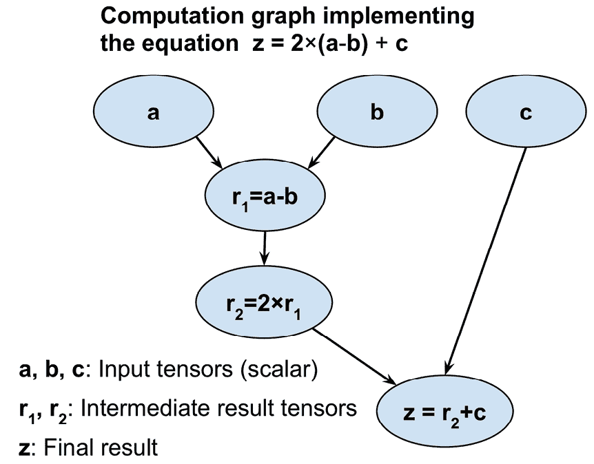

图 13.1：计算图的工作原理

正如您所见，计算图只是一个节点网络。每个节点类似于一个操作，它对其输入张量或张量应用函数，并根据需要返回零个或多个张量作为输出。PyTorch 构建这个计算图并使用它来相应地计算梯度。在下一小节中，我们将看到如何使用 PyTorch 为这种计算创建图的一些示例。

## 在 PyTorch 中创建图

让我们看一个简单的例子，说明如何在 PyTorch 中创建一个用于评估 *z* = 2 × (*a* – *b*) + *c* 的图，如前图所示。变量 *a*、*b* 和 *c* 是标量（单个数字），我们将它们定义为 PyTorch 张量。为了创建图，我们可以简单地定义一个常规的 Python 函数，其输入参数为 `a`、`b` 和 `c`，例如：

```py
>>> import torch
>>> def compute_z(a, b, c):
...     r1 = torch.sub(a, b)
...     r2 = torch.mul(r1, 2)
...     z = torch.add(r2, c)
...     return z 
```

现在，为了执行计算，我们可以简单地将此函数与张量对象作为函数参数调用。请注意，PyTorch 函数如`add`、`sub`（或`subtract`）、`mul`（或`multiply`）也允许我们以 PyTorch 张量对象的形式提供更高秩的输入。在以下代码示例中，我们提供了标量输入（秩 0），以及秩 1 和秩 2 的输入，作为列表：

```py
>>> print('Scalar Inputs:', compute_z(torch.tensor(1),
...       torch.tensor(2), torch.tensor(3)))
Scalar Inputs: tensor(1)
>>> print('Rank 1 Inputs:', compute_z(torch.tensor([1]),
...       torch.tensor([2]), torch.tensor([3])))
Rank 1 Inputs: tensor([1])
>>> print('Rank 2 Inputs:', compute_z(torch.tensor([[1]]),
...       torch.tensor([[2]]), torch.tensor([[3]])))
Rank 2 Inputs: tensor([[1]]) 
```

在这一节中，你看到了在 PyTorch 中创建计算图是多么简单。接下来，我们将看看可以用来存储和更新模型参数的 PyTorch 张量。

# PyTorch 张量对象用于存储和更新模型参数

我们在*第十二章*《使用 PyTorch 并行化神经网络训练》中介绍了张量对象。在 PyTorch 中，需要计算梯度的特殊张量对象允许我们在训练期间存储和更新模型的参数。这样的张量可以通过在用户指定的初始值上简单地将`requires_grad`赋值为`True`来创建。请注意，截至目前（2021 年中），只有浮点和复杂`dtype`的张量可以需要梯度。在以下代码中，我们将生成`float32`类型的张量对象：

```py
>>> a = torch.tensor(3.14, requires_grad=True)
>>> print(a)
tensor(3.1400, requires_grad=True)
>>> b = torch.tensor([1.0, 2.0, 3.0], requires_grad=True)
>>> print(b)
tensor([1., 2., 3.], requires_grad=True) 
```

注意，默认情况下`requires_grad`被设置为`False`。可以通过运行`requires_grad_()`有效地将其设置为`True`。

`method_()`是 PyTorch 中的一个原地方法，用于执行操作而不复制输入。

让我们看一下以下例子：

```py
>>> w = torch.tensor([1.0, 2.0, 3.0])
>>> print(w.requires_grad)
False
>>> w.requires_grad_()
>>> print(w.requires_grad)
True 
```

你会记得，对于 NN 模型，使用随机权重初始化模型参数是必要的，以打破反向传播过程中的对称性——否则，一个多层 NN 将不会比单层 NN（如逻辑回归）更有用。在创建 PyTorch 张量时，我们也可以使用随机初始化方案。PyTorch 可以基于各种概率分布生成随机数（参见[`pytorch.org/docs/stable/torch.html#random-sampling`](https://pytorch.org/docs/stable/torch.html#random-sampling)）。在以下例子中，我们将看一些标准的初始化方法，这些方法也可以在`torch.nn.init`模块中找到（参见[`pytorch.org/docs/stable/nn.init.html`](https://pytorch.org/docs/stable/nn.init.html)）。

因此，让我们看看如何使用 Glorot 初始化创建一个张量，这是一种经典的随机初始化方案，由 Xavier Glorot 和 Yoshua Bengio 提出。为此，我们首先创建一个空张量和一个名为`init`的操作符，作为`GlorotNormal`类的对象。然后，通过调用`xavier_normal_()`方法按照 Glorot 初始化填充这个张量的值。在下面的例子中，我们初始化一个形状为 2×3 的张量：

```py
>>> import torch.nn as nn
>>> torch.manual_seed(1)
>>> w = torch.empty(2, 3)
>>> nn.init.xavier_normal_(w)
>>> print(w)
tensor([[ 0.4183,  0.1688,  0.0390],
        [ 0.3930, -0.2858, -0.1051]]) 
```

**Xavier（或 Glorot）初始化**

在深度学习的早期开发中观察到，随机均匀或随机正态的权重初始化通常会导致训练过程中模型表现不佳。

2010 年，Glorot 和 Bengio 调查了初始化的效果，并提出了一种新颖、更健壮的初始化方案，以促进深层网络的训练。Xavier 初始化背后的主要思想是大致平衡不同层次梯度的方差。否则，一些层可能在训练过程中受到过多关注，而其他层则滞后。

根据 Glorot 和 Bengio 的研究论文，如果我们想要在均匀分布中初始化权重，我们应该选择此均匀分布的区间如下：

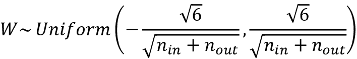

在这里，*n*[in] 是与权重相乘的输入神经元的数量，*n*[out] 是输入到下一层的输出神经元的数量。对于从高斯（正态）分布初始化权重，我们建议您选择这个高斯分布的标准差为：

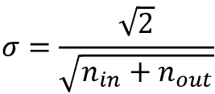

PyTorch 支持在权重的均匀分布和正态分布中进行**Xavier 初始化**。

有关 Glorot 和 Bengio 初始化方案的更多信息，包括其背景和数学动机，我们建议查阅原始论文（*理解深层前馈神经网络的难度*，*Xavier Glorot* 和 *Yoshua Bengio*，2010），可以在 [`proceedings.mlr.press/v9/glorot10a/glorot10a.pdf`](http://proceedings.mlr.press/v9/glorot10a/glorot10a.pdf) 免费获取。

现在，为了将其放入更实际的用例背景中，让我们看看如何在基础 `nn.Module` 类内定义两个 `Tensor` 对象：

```py
>>> class MyModule(nn.Module):
...     def __init__(self):
...         super().__init__()
...         self.w1 = torch.empty(2, 3, requires_grad=True)
...         nn.init.xavier_normal_(self.w1)
...         self.w2 = torch.empty(1, 2, requires_grad=True)
...         nn.init.xavier_normal_(self.w2) 
```

然后可以将这两个张量用作权重，其梯度将通过自动微分计算。

# 通过自动微分计算梯度

正如您已经知道的那样，优化神经网络需要计算损失相对于神经网络权重的梯度。这对于优化算法如**随机梯度下降**（**SGD**）是必需的。此外，梯度还有其他应用，比如诊断网络以找出为什么神经网络模型对测试示例做出特定预测。因此，在本节中，我们将涵盖如何计算计算的梯度对其输入变量的梯度。

## 计算损失相对于可训练变量的梯度

PyTorch 支持*自动微分*，可以将其视为计算嵌套函数梯度的链式规则的实现。请注意，出于简化的目的，我们将使用术语*梯度*来指代偏导数和梯度。

**偏导数和梯度**

部分导数 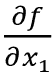 可以理解为多变量函数（具有多个输入 *f*(*x*[1], *x*[2], ...）相对于其输入之一（此处为 *x*[1]）的变化率。函数的梯度，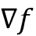，是由所有输入的偏导数 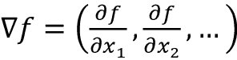 组成的向量。

当我们定义一系列操作以产生某些输出甚至是中间张量时，PyTorch 提供了一个计算梯度的上下文，用于计算这些计算张量相对于其在计算图中依赖节点的梯度。要计算这些梯度，我们可以从`torch.autograd`模块调用`backward`方法。它计算给定张量相对于图中叶节点（终端节点）的梯度之和。

让我们来看一个简单的例子，我们将计算 *z* = *wx* + *b* 并定义损失为目标 *y* 和预测 *z* 之间的平方损失，*Loss* = (*y* - *z*)²。在更一般的情况下，我们可能有多个预测和目标，我们将损失定义为平方误差的总和，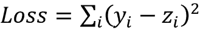。为了在 PyTorch 中实现这个计算，我们将定义模型参数 *w* 和 *b* 为变量（具有`requires_gradient`属性设置为`True`的张量），输入 *x* 和 *y* 为默认张量。我们将计算损失张量并用它来计算模型参数 *w* 和 *b* 的梯度，如下所示：

```py
>>> w = torch.tensor(1.0, requires_grad=True)
>>> b = torch.tensor(0.5, requires_grad=True)
>>> x = torch.tensor([1.4])
>>> y = torch.tensor([2.1])
>>> z = torch.add(torch.mul(w, x), b)
>>> loss = (y-z).pow(2).sum()
>>> loss.backward()
>>> print('dL/dw : ', w.grad)
>>> print('dL/db : ', b.grad)
dL/dw :  tensor(-0.5600)
dL/db :  tensor(-0.4000) 
```

计算值*z*是 NN 中的前向传递。我们在`loss`张量上使用`backward`方法来计算 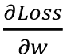 和 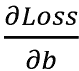。由于这是一个非常简单的例子，我们可以通过符号方式获得 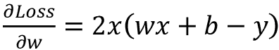 来验证计算得到的梯度与我们在先前的代码示例中得到的结果是否匹配：

```py
>>> # verifying the computed gradient
>>> print(2 * x * ((w * x + b) - y))
tensor([-0.5600], grad_fn=<MulBackward0>) 
```

我们留下对*b*的验证作为读者的练习。

## 理解自动微分

自动微分表示一组用于计算任意算术操作梯度的计算技术。在这个过程中，通过重复应用链式法则来积累计算（表示为一系列操作）的梯度。为了更好地理解自动微分背后的概念，让我们考虑一系列嵌套计算，*y* = *f*(*g*(*h*(*x*)))，其中 *x* 是输入，*y* 是输出。这可以分解为一系列步骤：

+   *u*[0] = *x*

+   *u*[1] = *h*(*x*)

+   *u*[2] = *g*(*u*[1])

+   *u*[3] = *f*(*u*[2]) = *y*

导数 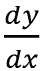 可以通过两种不同的方式计算：前向累积，从  开始，以及反向累积，从 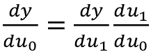 开始。请注意，PyTorch 使用后者，即反向累积，这对于实现反向传播更有效率。

## 对抗样本

计算损失相对于输入示例的梯度用于生成*对抗样本*（或*对抗攻击*）。在计算机视觉中，对抗样本是通过向输入示例添加一些微小且难以察觉的噪声（或扰动）生成的示例，导致深度神经网络误分类它们。涵盖对抗样本超出了本书的范围，但如果您感兴趣，可以在 [`arxiv.org/pdf/1312.6199.pdf`](https://arxiv.org/pdf/1312.6199.pdf) 找到*Christian Szegedy et al.*的原始论文*神经网络的有趣属性*。

# 通过 torch.nn 模块简化常见架构的实现

您已经看到了构建前馈 NN 模型（例如，多层感知器）和使用 `nn.Module` 类定义层序列的一些示例。在我们深入研究 `nn.Module` 之前，让我们简要了解另一种通过 `nn.Sequential` 配置这些层的方法。

## 基于 `nn.Sequential` 实现模型

使用 `nn.Sequential` ([`pytorch.org/docs/master/generated/torch.nn.Sequential.html#sequential`](https://pytorch.org/docs/master/generated/torch.nn.Sequential.html#sequential))，模型内部存储的层以级联方式连接。在下面的示例中，我们将构建一个具有两个全连接层的模型：

```py
>>> model = nn.Sequential(
...     nn.Linear(4, 16),
...     nn.ReLU(),
...     nn.Linear(16, 32),
...     nn.ReLU()
... )
>>> model
Sequential(
  (0): Linear(in_features=4, out_features=16, bias=True)
  (1): ReLU()
  (2): Linear(in_features=16, out_features=32, bias=True)
  (3): ReLU()
) 
```

我们指定了层并在将这些层传递给 `nn.Sequential` 类后实例化了 `model`。第一个全连接层的输出作为第一个 ReLU 层的输入。第一个 ReLU 层的输出成为第二个全连接层的输入。最后，第二个全连接层的输出作为第二个 ReLU 层的输入。

我们可以通过应用不同的激活函数、初始化器或正则化方法来进一步配置这些层的参数。大多数这些类别的所有可用选项的详细和完整列表可以在官方文档中找到：

+   选择激活函数：[`pytorch.org/docs/stable/nn.html#non-linear-activations-weighted-sum-nonlinearity`](https://pytorch.org/docs/stable/nn.html#non-linear-activations-weighted-sum-nonlinearity)

+   通过 `nn.init` 初始化层参数：[`pytorch.org/docs/stable/nn.init.html`](https://pytorch.org/docs/stable/nn.init.html)

+   通过在 `torch.optim` 中某些优化器的 `weight_decay` 参数应用 L2 正则化到层参数（以防止过拟合）：[`pytorch.org/docs/stable/optim.html`](https://pytorch.org/docs/stable/optim.html)

+   通过将 L1 正则化应用于层参数（以防止过拟合），通过将 L1 惩罚项添加到损失张量中实现下一步

在以下代码示例中，我们将通过指定权重的初始值分布来配置第一个全连接层。然后，我们将通过计算权重矩阵的 L1 惩罚项来配置第二个全连接层：

```py
>>> nn.init.xavier_uniform_(model[0].weight)
>>> l1_weight = 0.01
>>> l1_penalty = l1_weight * model[2].weight.abs().sum() 
```

在这里，我们使用 Xavier 初始化来初始化第一个线性层的权重。然后，我们计算了第二个线性层权重的 L1 范数。

此外，我们还可以指定训练的优化器类型和损失函数。再次，您可以在官方文档中找到所有可用选项的全面列表。

+   通过`torch.optim`优化器：[`pytorch.org/docs/stable/optim.html#algorithms`](https://pytorch.org/docs/stable/optim.html#algorithms)

+   损失函数：[`pytorch.org/docs/stable/nn.html#loss-functions`](https://pytorch.org/docs/stable/nn.html#loss-functions)

## 选择损失函数

关于优化算法的选择，SGD 和 Adam 是最常用的方法。损失函数的选择取决于任务；例如，对于回归问题，您可能会使用均方误差损失。

交叉熵损失函数系列提供了分类任务的可能选择，在*第十四章*，*使用深度卷积神经网络分类图像*中广泛讨论。

此外，您可以结合适用于问题的适当指标，利用您从先前章节学到的技术（如*第六章*中用于模型评估和超参数调优的技术）。例如，精度和召回率、准确率、**曲线下面积**（**AUC**）、假阴性和假阳性分数是评估分类模型的适当指标。

在本例中，我们将使用 SGD 优化器和交叉熵损失进行二元分类：

```py
>>> loss_fn = nn.BCELoss()
>>> optimizer = torch.optim.SGD(model.parameters(), lr=0.001) 
```

接下来，我们将看一个更实际的例子：解决经典的 XOR 分类问题。首先，我们将使用`nn.Sequential()`类来构建模型。在此过程中，您还将了解模型处理非线性决策边界的能力。然后，我们将讨论通过`nn.Module`构建模型，这将为我们提供更多灵活性和对网络层的控制。

## 解决 XOR 分类问题

XOR 分类问题是分析模型捕捉两类之间非线性决策边界能力的经典问题。我们生成了一个包含 200 个训练样本的玩具数据集，具有两个特征（*x*[0]，*x*[1]），这些特征从均匀分布-1, 1)中抽取。然后，根据以下规则为训练样本*i*分配了地面真实标签：

![

我们将使用一半的数据（100 个训练样本）进行训练，剩余一半用于验证。生成数据并将其拆分为训练和验证数据集的代码如下：

```py
>>> import matplotlib.pyplot as plt
>>> import numpy as np
>>> torch.manual_seed(1)
>>> np.random.seed(1)
>>> x = np.random.uniform(low=-1, high=1, size=(200, 2))
>>> y = np.ones(len(x))
>>> y[x[:, 0] * x[:, 1]<0] = 0
>>> n_train = 100
>>> x_train = torch.tensor(x[:n_train, :], dtype=torch.float32)
>>> y_train = torch.tensor(y[:n_train], dtype=torch.float32)
>>> x_valid = torch.tensor(x[n_train:, :], dtype=torch.float32)
>>> y_valid = torch.tensor(y[n_train:], dtype=torch.float32)
>>> fig = plt.figure(figsize=(6, 6))
>>> plt.plot(x[y==0, 0], x[y==0, 1], 'o', alpha=0.75, markersize=10)
>>> plt.plot(x[y==1, 0], x[y==1, 1], '<', alpha=0.75, markersize=10)
>>> plt.xlabel(r'$x_1$', size=15)
>>> plt.ylabel(r'$x_2$', size=15)
>>> plt.show() 
```

该代码生成了训练和验证样本的散点图，根据它们的类别标签使用不同的标记：

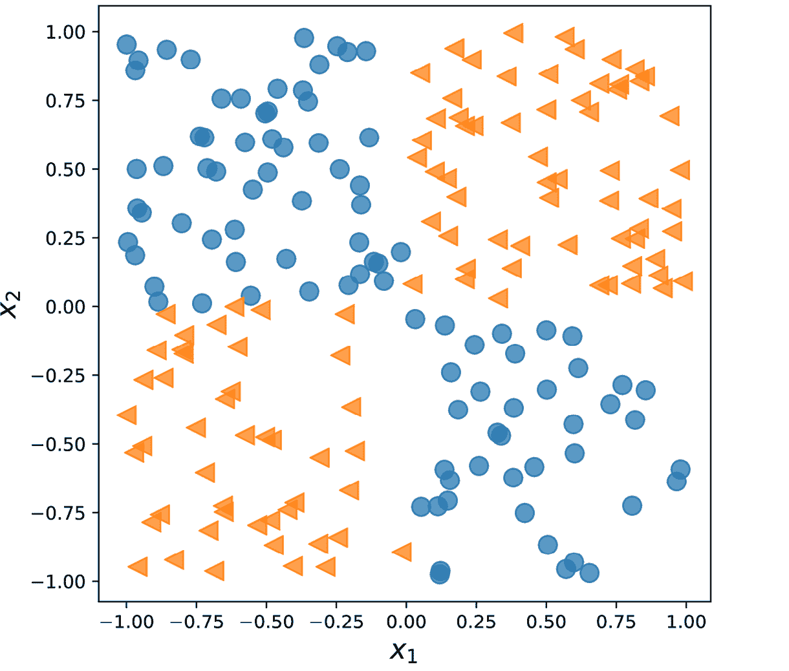

图 13.2：训练和验证样本的散点图

在前面的小节中，我们介绍了在 PyTorch 中实现分类器所需的基本工具。现在我们需要决定为这个任务和数据集选择什么样的架构。作为一个经验法则，我们拥有的层次越多，每层的神经元越多，模型的容量就越大。在这里，模型容量可以被看作是模型能够逼近复杂函数的能力的一个度量。虽然更多参数意味着网络可以拟合更复杂的函数，但更大的模型通常更难训练（且容易过拟合）。实际操作中，从一个简单模型开始作为基准总是一个好主意，例如单层神经网络如逻辑回归：

```py
>>> model = nn.Sequential(
...     nn.Linear(2, 1),
...     nn.Sigmoid()
... )
>>> model
Sequential(
  (0): Linear(in_features=2, out_features=1, bias=True)
  (1): Sigmoid()
) 
```

定义模型后，我们将初始化用于二元分类的交叉熵损失函数和 SGD 优化器：

```py
>>> loss_fn = nn.BCELoss()
>>> optimizer = torch.optim.SGD(model.parameters(), lr=0.001) 
```

接下来，我们将创建一个数据加载器，使用批大小为 2 来处理训练数据：

```py
>>> from torch.utils.data import DataLoader, TensorDataset
>>> train_ds = TensorDataset(x_train, y_train)
>>> batch_size = 2
>>> torch.manual_seed(1)
>>> train_dl = DataLoader(train_ds, batch_size, shuffle=True) 
```

现在我们将训练模型 200 个 epoch，并记录训练过程的历史：

```py
>>> torch.manual_seed(1)
>>> num_epochs = 200
>>> def train(model, num_epochs, train_dl, x_valid, y_valid):
...     loss_hist_train = [0] * num_epochs
...     accuracy_hist_train = [0] * num_epochs
...     loss_hist_valid = [0] * num_epochs
...     accuracy_hist_valid = [0] * num_epochs
...     for epoch in range(num_epochs):
...         for x_batch, y_batch in train_dl:
...             pred = model(x_batch)[:, 0]
...             loss = loss_fn(pred, y_batch)
...             loss.backward()
...             optimizer.step()
...             optimizer.zero_grad()
...             loss_hist_train[epoch] += loss.item()
...             is_correct = ((pred>=0.5).float() == y_batch).float()
...             accuracy_hist_train[epoch] += is_correct.mean()
...         loss_hist_train[epoch] /= n_train
...         accuracy_hist_train[epoch] /= n_train/batch_size
...         pred = model(x_valid)[:, 0]
...         loss = loss_fn(pred, y_valid)
...         loss_hist_valid[epoch] = loss.item()
...         is_correct = ((pred>=0.5).float() == y_valid).float()
...         accuracy_hist_valid[epoch] += is_correct.mean()
...     return loss_hist_train, loss_hist_valid, \
...            accuracy_hist_train, accuracy_hist_valid
>>> history = train(model, num_epochs, train_dl, x_valid, y_valid) 
```

注意，训练 epoch 的历史包括训练损失和验证损失，以及训练准确率和验证准确率，这对于训练后的可视化检查非常有用。在下面的代码中，我们将绘制学习曲线，包括训练和验证损失，以及它们的准确率。

以下代码将绘制训练性能：

```py
>>> fig = plt.figure(figsize=(16, 4))
>>> ax = fig.add_subplot(1, 2, 1)
>>> plt.plot(history[0], lw=4)
>>> plt.plot(history[1], lw=4)
>>> plt.legend(['Train loss', 'Validation loss'], fontsize=15)
>>> ax.set_xlabel('Epochs', size=15)
>>> ax = fig.add_subplot(1, 2, 2)
>>> plt.plot(history[2], lw=4)
>>> plt.plot(history[3], lw=4)
>>> plt.legend(['Train acc.', 'Validation acc.'], fontsize=15)
>>> ax.set_xlabel('Epochs', size=15) 
```

这导致了下图，分别显示了损失和准确率的两个单独面板：

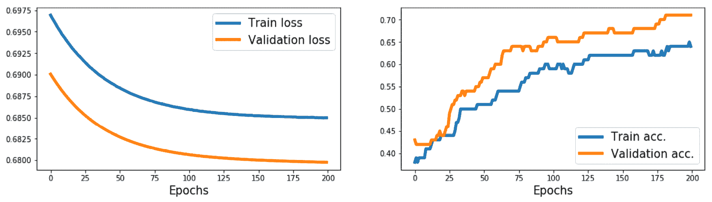

图 13.3：损失和准确率结果

正如您所见，一个没有隐藏层的简单模型只能得出线性决策边界，无法解决 XOR 问题。因此，我们可以观察到，训练集和验证集的损失项都非常高，分类准确率非常低。

为了得到非线性决策边界，我们可以添加一个或多个通过非线性激活函数连接的隐藏层。普遍逼近定理表明，具有单个隐藏层和相对较大隐藏单元数的前馈神经网络可以相对良好地逼近任意连续函数。因此，更有效地解决 XOR 问题的一种方法是添加一个隐藏层，并比较不同数量的隐藏单元，直到在验证数据集上观察到满意的结果。增加更多的隐藏单元相当于增加层的宽度。

或者，我们也可以添加更多隐藏层，这会使模型变得更深。将网络变得更深而不是更宽的优势在于，需要的参数更少，即使实现相似的模型容量。

然而，与宽模型相比，深模型的一个缺点是，深模型容易出现梯度消失和梯度爆炸，这使得它们更难训练。

作为练习，请尝试添加一层、两层、三层和四层，每层都有四个隐藏单元。在下面的例子中，我们将查看具有两个隐藏层的前馈神经网络的结果：

```py
>>> model = nn.Sequential(
...     nn.Linear(2, 4),
...     nn.ReLU(),
...     nn.Linear(4, 4),
...     nn.ReLU(),
...     nn.Linear(4, 1),
...     nn.Sigmoid()
... )
>>> loss_fn = nn.BCELoss()
>>> optimizer = torch.optim.SGD(model.parameters(), lr=0.015)
>>> model
Sequential(
  (0): Linear(in_features=2, out_features=4, bias=True)
  (1): ReLU()
  (2): Linear(in_features=4, out_features=4, bias=True)
  (3): ReLU()
  (4): Linear(in_features=4, out_features=1, bias=True)
  (5): Sigmoid()
)
>>> history = train(model, num_epochs, train_dl, x_valid, y_valid) 
```

我们可以重复之前的代码进行可视化，产生以下结果：

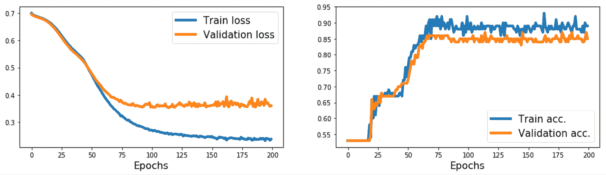

图 13.4：添加两个隐藏层后的损失和准确率结果

现在，我们可以看到该模型能够为这些数据推导出非线性决策边界，并且该模型在训练数据集上达到 100%的准确率。验证数据集的准确率为 95%，这表明模型略微过拟合。

## 使用 nn.Module 使模型构建更加灵活

在前面的例子中，我们使用了 PyTorch 的`Sequential`类来创建一个具有多层的全连接神经网络。这是一种非常常见和方便的建模方式。然而，不幸的是，它不允许我们创建具有多个输入、输出或中间分支的复杂模型。这就是`nn.Module`派上用场的地方。

构建复杂模型的另一种方法是通过子类化`nn.Module`来实现。在这种方法中，我们创建一个派生自`nn.Module`的新类，并将`__init__()`方法定义为构造函数。`forward()`方法用于指定前向传播。在构造函数`__init__()`中，我们将层定义为类的属性，以便可以通过`self`引用属性访问这些层。然后，在`forward()`方法中，我们指定这些层在神经网络的前向传播中如何使用。定义实现前述模型的新类的代码如下：

```py
>>> class MyModule(nn.Module):
...     def __init__(self):
...         super().__init__()
...         l1 = nn.Linear(2, 4)
...         a1 = nn.ReLU()
...         l2 = nn.Linear(4, 4)
...         a2 = nn.ReLU()
...         l3 = nn.Linear(4, 1)
...         a3 = nn.Sigmoid()
...         l = [l1, a1, l2, a2, l3, a3]
...         self.module_list = nn.ModuleList(l)
...
...     def forward(self, x):
...         for f in self.module_list:
...             x = f(x)
...         return x 
```

注意，我们将所有层放在`nn.ModuleList`对象中，这只是由`nn.Module`项组成的`list`对象。这样做可以使代码更易读，更易于理解。

一旦我们定义了这个新类的实例，我们就可以像之前一样对其进行训练：

```py
>>> model = MyModule()
>>> model
MyModule(
  (module_list): ModuleList(
    (0): Linear(in_features=2, out_features=4, bias=True)
    (1): ReLU()
    (2): Linear(in_features=4, out_features=4, bias=True)
    (3): ReLU()
    (4): Linear(in_features=4, out_features=1, bias=True)
    (5): Sigmoid()
  )
)
>>> loss_fn = nn.BCELoss()
>>> optimizer = torch.optim.SGD(model.parameters(), lr=0.015)
>>> history = train(model, num_epochs, train_dl, x_valid, y_valid) 
```

接下来，除了训练历史记录外，我们将使用 mlxtend 库来可视化验证数据和决策边界。

可以通过以下方式通过`conda`或`pip`安装 mlxtend：

```py
conda install mlxtend -c conda-forge
pip install mlxtend 
```

要计算我们模型的决策边界，我们需要在`MyModule`类中添加一个`predict()`方法：

```py
>>>     def predict(self, x):
...         x = torch.tensor(x, dtype=torch.float32)
...         pred = self.forward(x)[:, 0]
...         return (pred>=0.5).float() 
```

它将为样本返回预测类（0 或 1）。

以下代码将绘制训练性能以及决策区域偏差：

```py
>>> from mlxtend.plotting import plot_decision_regions
>>> fig = plt.figure(figsize=(16, 4))
>>> ax = fig.add_subplot(1, 3, 1)
>>> plt.plot(history[0], lw=4)
>>> plt.plot(history[1], lw=4)
>>> plt.legend(['Train loss', 'Validation loss'], fontsize=15)
>>> ax.set_xlabel('Epochs', size=15)
>>> ax = fig.add_subplot(1, 3, 2)
>>> plt.plot(history[2], lw=4)
>>> plt.plot(history[3], lw=4)
>>> plt.legend(['Train acc.', 'Validation acc.'], fontsize=15)
>>> ax.set_xlabel('Epochs', size=15)
>>> ax = fig.add_subplot(1, 3, 3)
>>> plot_decision_regions(X=x_valid.numpy(),
...                       y=y_valid.numpy().astype(np.integer),
...                       clf=model)
>>> ax.set_xlabel(r'$x_1$', size=15)
>>> ax.xaxis.set_label_coords(1, -0.025)
>>> ax.set_ylabel(r'$x_2$', size=15)
>>> ax.yaxis.set_label_coords(-0.025, 1)
>>> plt.show() 
```

这导致*图 13.5*，其中包括损失、准确率的三个独立面板以及验证示例的散点图，以及决策边界：

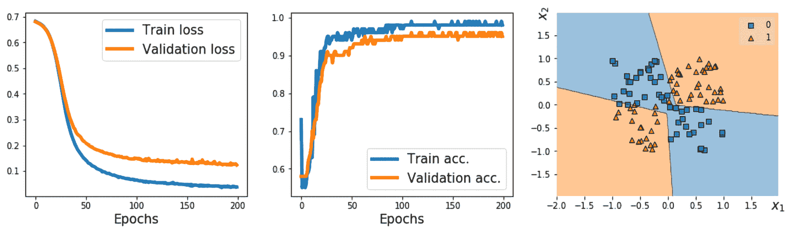

图 13.5：包括散点图在内的结果

## 在 PyTorch 中编写自定义层

在我们想定义一个 PyTorch 尚未支持的新层的情况下，我们可以定义一个新类，该类派生自`nn.Module`类。当设计新层或自定义现有层时，这尤其有用。

为了说明实现自定义层的概念，让我们考虑一个简单的例子。假设我们想定义一个新的线性层，计算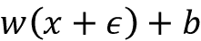，其中表示作为噪声变量的随机变量。为了实现这个计算，我们定义一个新的类作为`nn.Module`的子类。对于这个新类，我们必须定义构造函数`__init__()`方法和`forward()`方法。在构造函数中，我们为自定义层定义变量和其他所需的张量。如果构造函数提供了`input_size`，我们可以在构造函数中创建变量并初始化它们。或者，我们可以延迟变量初始化（例如，如果我们事先不知道确切的输入形状），并将其委托给另一个方法进行延迟变量创建。

为了看一个具体的例子，我们将定义一个名为`NoisyLinear`的新层，实现了在前述段落中提到的计算：

```py
>>> class NoisyLinear(nn.Module):
...     def __init__(self, input_size, output_size,
...                  noise_stddev=0.1):
...         super().__init__()
...         w = torch.Tensor(input_size, output_size)
...         self.w = nn.Parameter(w)  # nn.Parameter is a Tensor
...                                   # that's a module parameter.
...         nn.init.xavier_uniform_(self.w)
...         b = torch.Tensor(output_size).fill_(0)
...         self.b = nn.Parameter(b)
...         self.noise_stddev = noise_stddev
...
...     def forward(self, x, training=False):
...         if training:
...             noise = torch.normal(0.0, self.noise_stddev, x.shape)
...             x_new = torch.add(x, noise)
...         else:
...             x_new = x
...         return torch.add(torch.mm(x_new, self.w), self.b) 
, was to be generated and added to the input during training only and not used for inference or evaluation.
```

在我们进一步使用我们自定义的`NoisyLinear`层将其应用于模型之前，让我们在一个简单示例的背景下测试它。

1.  在下面的代码中，我们将定义此层的新实例，并在输入张量上执行它。然后，我们将在相同的输入张量上三次调用该层：

    ```py
    >>> torch.manual_seed(1)
    >>> noisy_layer = NoisyLinear(4, 2)
    >>> x = torch.zeros((1, 4))
    >>> print(noisy_layer(x, training=True))
    tensor([[ 0.1154, -0.0598]], grad_fn=<AddBackward0>)
    >>> print(noisy_layer(x, training=True))
    tensor([[ 0.0432, -0.0375]], grad_fn=<AddBackward0>)
    >>> print(noisy_layer(x, training=False))
    tensor([[0., 0.]], grad_fn=<AddBackward0>) 
    ```

    请注意，前两次调用的输出不同，因为`NoisyLinear`层向输入张量添加了随机噪声。第三次调用输出[0, 0]，因为我们通过指定`training=False`未添加噪声。

1.  现在，让我们创建一个类似于以前用于解决 XOR 分类任务的新模型。与之前一样，我们将使用`nn.Module`类构建模型，但这次我们将把我们的`NoisyLinear`层作为多层感知机的第一个隐藏层。代码如下：

    ```py
    >>> class MyNoisyModule(nn.Module):
    ...     def __init__(self):
    ...         super().__init__()
    ...         self.l1 = NoisyLinear(2, 4, 0.07)
    ...         self.a1 = nn.ReLU()
    ...         self.l2 = nn.Linear(4, 4)
    ...         self.a2 = nn.ReLU()
    ...         self.l3 = nn.Linear(4, 1)
    ...         self.a3 = nn.Sigmoid()
    ...
    ...     def forward(self, x, training=False):
    ...         x = self.l1(x, training)
    ...         x = self.a1(x)
    ...         x = self.l2(x)
    ...         x = self.a2(x)
    ...         x = self.l3(x)
    ...         x = self.a3(x)
    ...         return x
    ...
    ...     def predict(self, x):
    ...         x = torch.tensor(x, dtype=torch.float32)
    ...         pred = self.forward(x)[:, 0]
    ...         return (pred>=0.5).float()
    ...
    >>> torch.manual_seed(1)
    >>> model = MyNoisyModule()
    >>> model
    MyNoisyModule(
      (l1): NoisyLinear()
      (a1): ReLU()
      (l2): Linear(in_features=4, out_features=4, bias=True)
      (a2): ReLU()
      (l3): Linear(in_features=4, out_features=1, bias=True)
      (a3): Sigmoid()
    ) 
    ```

1.  类似地，我们将像以前一样训练模型。此时，为了在训练批次上计算预测值，我们使用`pred = model(x_batch, True)[:, 0]`而不是`pred = model(x_batch)[:, 0]`：

    ```py
    >>> loss_fn = nn.BCELoss()
    >>> optimizer = torch.optim.SGD(model.parameters(), lr=0.015)
    >>> torch.manual_seed(1)
    >>> loss_hist_train = [0] * num_epochs
    >>> accuracy_hist_train = [0] * num_epochs
    >>> loss_hist_valid = [0] * num_epochs
    >>> accuracy_hist_valid = [0] * num_epochs
    >>> for epoch in range(num_epochs):
    ...     for x_batch, y_batch in train_dl:
    ...         pred = model(x_batch, True)[:, 0]
    ...         loss = loss_fn(pred, y_batch)
    ...         loss.backward()
    ...         optimizer.step()
    ...         optimizer.zero_grad()
    ...         loss_hist_train[epoch] += loss.item()
    ...         is_correct = (
    ...             (pred>=0.5).float() == y_batch
    ...         ).float()
    ...         accuracy_hist_train[epoch] += is_correct.mean()
    ...     loss_hist_train[epoch] /= 100/batch_size
    ...     accuracy_hist_train[epoch] /= 100/batch_size
    ...     pred = model(x_valid)[:, 0]
    ...     loss = loss_fn(pred, y_valid)
    ...     loss_hist_valid[epoch] = loss.item()
    ...     is_correct = ((pred>=0.5).float() == y_valid).float()
    ...     accuracy_hist_valid[epoch] += is_correct.mean() 
    ```

1.  训练模型后，我们可以绘制损失、准确率和决策边界：

    ```py
    >>> fig = plt.figure(figsize=(16, 4))
    >>> ax = fig.add_subplot(1, 3, 1)
    >>> plt.plot(loss_hist_train, lw=4)
    >>> plt.plot(loss_hist_valid, lw=4)
    >>> plt.legend(['Train loss', 'Validation loss'], fontsize=15)
    >>> ax.set_xlabel('Epochs', size=15)
    >>> ax = fig.add_subplot(1, 3, 2)
    >>> plt.plot(accuracy_hist_train, lw=4)
    >>> plt.plot(accuracy_hist_valid, lw=4)
    >>> plt.legend(['Train acc.', 'Validation acc.'], fontsize=15)
    >>> ax.set_xlabel('Epochs', size=15)
    >>> ax = fig.add_subplot(1, 3, 3)
    >>> plot_decision_regions(
    ...     X=x_valid.numpy(),
    ...     y=y_valid.numpy().astype(np.integer),
    ...     clf=model
    ... )
    >>> ax.set_xlabel(r'$x_1$', size=15)
    >>> ax.xaxis.set_label_coords(1, -0.025)
    >>> ax.set_ylabel(r'$x_2$', size=15)
    >>> ax.yaxis.set_label_coords(-0.025, 1)
    >>> plt.show() 
    ```

1.  结果图如下：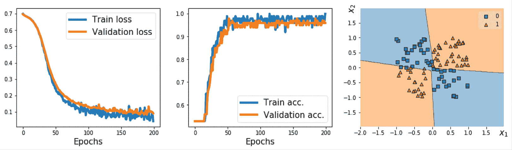

    图 13.6：使用 NoisyLinear 作为第一个隐藏层的结果

在这里，我们的目标是学习如何定义一个新的自定义层，这个层是从`nn.Module`子类化而来，并且如同使用任何其他标准`torch.nn`层一样使用它。虽然在这个特定的例子中，`NoisyLinear`并没有帮助提高性能，请记住我们的主要目标是学习如何从头开始编写一个定制层。一般来说，编写一个新的自定义层在其他应用中可能会很有用，例如，如果您开发了一个依赖于现有层之外的新层的新算法。

# 项目一 – 预测汽车的燃油效率

到目前为止，在本章中，我们主要集中在`torch.nn`模块上。我们使用`nn.Sequential`来简化模型的构建。然后，我们使用`nn.Module`使模型构建更加灵活，并实现了前馈神经网络，其中我们添加了定制层。在本节中，我们将致力于一个真实世界的项目，即预测汽车的每加仑英里数（MPG）燃油效率。我们将涵盖机器学习任务的基本步骤，如数据预处理、特征工程、训练、预测（推理）和评估。

## 处理特征列

在机器学习和深度学习应用中，我们可能会遇到各种不同类型的特征：连续、无序分类（名义）和有序分类（序数）。您会回忆起，在*第四章*，*构建良好的训练数据集 – 数据预处理*中，我们涵盖了不同类型的特征，并学习了如何处理每种类型。请注意，虽然数值数据可以是连续的或离散的，但在使用 PyTorch 进行机器学习的上下文中，“数值”数据特指浮点类型的连续数据。

有时，特征集合由不同类型的特征混合组成。例如，考虑一个具有七种不同特征的情景，如*图 13.7*所示：

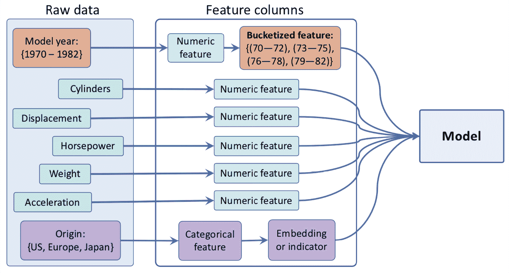

图 13.7：汽车 MPG 数据结构

图中显示的特征（车型年份、汽缸数、排量、马力、重量、加速度和起源）来自汽车 MPG 数据集，这是一个常见的用于预测汽车燃油效率的机器学习基准数据集。完整数据集及其描述可从 UCI 的机器学习存储库获取：[`archive.ics.uci.edu/ml/datasets/auto+mpg`](https://archive.ics.uci.edu/ml/datasets/auto+mpg)。

我们将从汽车 MPG 数据集中处理五个特征（汽缸数、排量、马力、重量和加速度），将它们视为“数值”（这里是连续）特征。车型年份可以被视为有序分类（序数）特征。最后，制造地可以被视为无序分类（名义）特征，具有三个可能的离散值，1、2 和 3，分别对应于美国、欧洲和日本。

让我们首先加载数据并应用必要的预处理步骤，包括删除不完整的行，将数据集分为训练和测试数据集，以及标准化连续特征：

```py
>>> import pandas as pd
>>> url = 'http://archive.ics.uci.edu/ml/' \
...       'machine-learning-databases/auto-mpg/auto-mpg.data'
>>> column_names = ['MPG', 'Cylinders', 'Displacement', 'Horsepower',
...                 'Weight', 'Acceleration', 'Model Year', 'Origin']
>>> df = pd.read_csv(url, names=column_names,
...                  na_values = "?", comment='\t',
...                  sep=" ", skipinitialspace=True)
>>>
>>> ## drop the NA rows
>>> df = df.dropna()
>>> df = df.reset_index(drop=True)
>>>
>>> ## train/test splits:
>>> import sklearn
>>> import sklearn.model_selection
>>> df_train, df_test = sklearn.model_selection.train_test_split(
...     df, train_size=0.8, random_state=1
... )
>>> train_stats = df_train.describe().transpose()
>>>
>>> numeric_column_names = [
...     'Cylinders', 'Displacement',
...     'Horsepower', 'Weight',
...     'Acceleration'
... ]
>>> df_train_norm, df_test_norm = df_train.copy(), df_test.copy()
>>> for col_name in numeric_column_names:
...     mean = train_stats.loc[col_name, 'mean']
...     std  = train_stats.loc[col_name, 'std']
...     df_train_norm.loc[:, col_name] = \
...         (df_train_norm.loc[:, col_name] - mean)/std
...     df_test_norm.loc[:, col_name] = \
...         (df_test_norm.loc[:, col_name] - mean)/std
>>> df_train_norm.tail() 
```

这导致了以下结果：

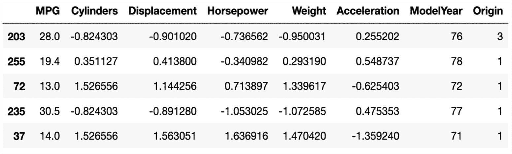

图 13.8：经过预处理的 Auto MG 数据

```py
float. These columns will constitute the continuous features.
```

接下来，让我们将相当精细的模型年份（`ModelYear`）信息分组到桶中，以简化我们稍后将要训练的模型的学习任务。具体来说，我们将每辆车分配到四个*年份*桶中，如下所示：

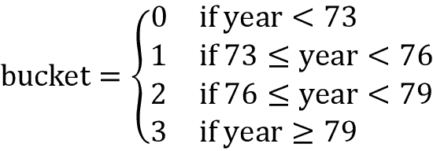

注意，所选的间隔是任意选择的，用于说明“分桶”的概念。为了将车辆分组到这些桶中，我们首先定义三个截断值：[73, 76, 79]，用于模型年份特征。这些截断值用于指定半开区间，例如，(-∞, 73)，[73, 76)，[76, 79)，和[76, ∞)。然后，原始数值特征将传递给`torch.bucketize`函数（[`pytorch.org/docs/stable/generated/torch.bucketize.html`](https://pytorch.org/docs/stable/generated/torch.bucketize.html)）来生成桶的索引。代码如下：

```py
>>> boundaries = torch.tensor([73, 76, 79])
>>> v = torch.tensor(df_train_norm['Model Year'].values)
>>> df_train_norm['Model Year Bucketed'] = torch.bucketize(
...     v, boundaries, right=True
... )
>>> v = torch.tensor(df_test_norm['Model Year'].values)
>>> df_test_norm['Model Year Bucketed'] = torch.bucketize(
...     v, boundaries, right=True
... )
>>> numeric_column_names.append('Model Year Bucketed') 
```

我们将此分桶特征列添加到 Python 列表`numeric_column_names`中。

接下来，我们将继续定义一个无序分类特征`Origin`的列表。在 PyTorch 中，处理分类特征有两种方法：使用通过`nn.Embedding`（[`pytorch.org/docs/stable/generated/torch.nn.Embedding.html`](https://pytorch.org/docs/stable/generated/torch.nn.Embedding.html)）实现的嵌入层，或者使用独热编码向量（也称为*指示器*）。在编码方法中，例如，索引 0 将被编码为[1, 0, 0]，索引 1 将被编码为[0, 1, 0]，依此类推。另一方面，嵌入层将每个索引映射到一组随机数的向量，类型为`float`，可以进行训练。（您可以将嵌入层视为与可训练权重矩阵相乘的一种更有效的独热编码实现。）

当类别数量较多时，使用比类别数量少的嵌入层维度可以提高性能。

在下面的代码片段中，我们将使用独热编码方法处理分类特征，以便将其转换为密集格式：

```py
>>> from torch.nn.functional import one_hot
>>> total_origin = len(set(df_train_norm['Origin']))
>>> origin_encoded = one_hot(torch.from_numpy(
...     df_train_norm['Origin'].values) % total_origin)
>>> x_train_numeric = torch.tensor(
...     df_train_norm[numeric_column_names].values)
>>> x_train = torch.cat([x_train_numeric, origin_encoded], 1).float()
>>> origin_encoded = one_hot(torch.from_numpy(
...     df_test_norm['Origin'].values) % total_origin)
>>> x_test_numeric = torch.tensor(
...     df_test_norm[numeric_column_names].values)
>>> x_test = torch.cat([x_test_numeric, origin_encoded], 1).float() 
```

将分类特征编码为三维密集特征后，我们将其与前一步骤中处理的数值特征串联起来。最后，我们将从地面实际 MPG 值创建标签张量如下：

```py
>>> y_train = torch.tensor(df_train_norm['MPG'].values).float()
>>> y_test = torch.tensor(df_test_norm['MPG'].values).float() 
```

在本节中，我们介绍了 PyTorch 中预处理和创建特征的最常见方法。

## 训练 DNN 回归模型

现在，在构建必需的特征和标签之后，我们将创建一个数据加载器，用于训练数据的批量大小为 8：

```py
>>> train_ds = TensorDataset(x_train, y_train)
>>> batch_size = 8
>>> torch.manual_seed(1)
>>> train_dl = DataLoader(train_ds, batch_size, shuffle=True) 
```

接下来，我们将建立一个具有两个全连接层的模型，其中一个具有 8 个隐藏单元，另一个具有 4 个：

```py
>>> hidden_units = [8, 4]
>>> input_size = x_train.shape[1]
>>> all_layers = []
>>> for hidden_unit in hidden_units:
...     layer = nn.Linear(input_size, hidden_unit)
...     all_layers.append(layer)
...     all_layers.append(nn.ReLU())
...     input_size = hidden_unit
>>> all_layers.append(nn.Linear(hidden_units[-1], 1))
>>> model = nn.Sequential(*all_layers)
>>> model
Sequential(
  (0): Linear(in_features=9, out_features=8, bias=True)
  (1): ReLU()
  (2): Linear(in_features=8, out_features=4, bias=True)
  (3): ReLU()
  (4): Linear(in_features=4, out_features=1, bias=True)
) 
```

在定义模型后，我们将为回归定义 MSE 损失函数，并使用随机梯度下降进行优化：

```py
>>> loss_fn = nn.MSELoss()
>>> optimizer = torch.optim.SGD(model.parameters(), lr=0.001) 
```

现在我们将训练模型 200 个 epoch，并在每 20 个 epoch 显示训练损失：

```py
>>> torch.manual_seed(1)
>>> num_epochs = 200
>>> log_epochs = 20
>>> for epoch in range(num_epochs):
...     loss_hist_train = 0
...     for x_batch, y_batch in train_dl:
...         pred = model(x_batch)[:, 0]
...         loss = loss_fn(pred, y_batch)
...         loss.backward()
...         optimizer.step()
...         optimizer.zero_grad()
...         loss_hist_train += loss.item()
...     if epoch % log_epochs==0:
...         print(f'Epoch {epoch}  Loss '
...               f'{loss_hist_train/len(train_dl):.4f}')
Epoch 0  Loss 536.1047
Epoch 20  Loss 8.4361
Epoch 40  Loss 7.8695
Epoch 60  Loss 7.1891
Epoch 80  Loss 6.7062
Epoch 100  Loss 6.7599
Epoch 120  Loss 6.3124
Epoch 140  Loss 6.6864
Epoch 160  Loss 6.7648
Epoch 180  Loss 6.2156 
```

经过 200 个 epoch 后，训练损失约为 5。现在我们可以在测试数据集上评估训练模型的回归性能。为了预测新数据点上的目标值，我们可以将它们的特征提供给模型：

```py
>>> with torch.no_grad():
...     pred = model(x_test.float())[:, 0]
...     loss = loss_fn(pred, y_test)
...     print(f'Test MSE: {loss.item():.4f}')
...     print(f'Test MAE: {nn.L1Loss()(pred, y_test).item():.4f}')
Test MSE: 9.6130
Test MAE: 2.1211 
```

测试集上的 MSE 为 9.6，**平均绝对误差**（**MAE**）为 2.1。完成此回归项目后，我们将在下一部分进行分类项目。

# 项目二 – 对 MNIST 手写数字进行分类

对于这个分类项目，我们将对 MNIST 手写数字进行分类。在前一部分中，我们详细介绍了 PyTorch 中机器学习的四个基本步骤，我们将在本节中重复这些步骤。

您会记得，在*第十二章*中，您学习了如何从`torchvision`模块中加载可用的数据集的方法。首先，我们将使用`torchvision`模块加载 MNIST 数据集。

1.  设置步骤包括加载数据集并指定超参数（训练集和测试集的大小，以及小批量的大小）：

    ```py
    >>> import torchvision
    >>> from torchvision import transforms
    >>> image_path = './'
    >>> transform = transforms.Compose([
    ...     transforms.ToTensor()
    ... ])
    >>> mnist_train_dataset = torchvision.datasets.MNIST(
    ...     root=image_path, train=True,
    ...     transform=transform, download=False
    ... )
    >>> mnist_test_dataset = torchvision.datasets.MNIST(
    ...     root=image_path, train=False,
    ...     transform=transform, download=False
    ... )
    >>> batch_size = 64
    >>> torch.manual_seed(1)
    >>> train_dl = DataLoader(mnist_train_dataset,
    ...                       batch_size, shuffle=True) 
    ```

    在这里，我们构建了一个每批 64 个样本的数据加载器。接下来，我们将预处理加载的数据集。

1.  我们预处理输入特征和标签。在这个项目中，特征是我们从**第 1 步**读取的图像的像素。我们使用`torchvision.transforms.Compose`定义了一个自定义转换。在这种简单情况下，我们的转换仅包括一个方法`ToTensor()`。`ToTensor()`方法将像素特征转换为浮点型张量，并将像素从[0, 255]范围归一化到[0, 1]范围。在*第十四章*，*使用深度卷积神经网络对图像进行分类*中，当我们处理更复杂的图像数据集时，我们将看到一些额外的数据转换方法。标签是从 0 到 9 的整数，表示十个数字。因此，我们不需要进行任何缩放或进一步的转换。请注意，我们可以使用`data`属性访问原始像素，并不要忘记将它们缩放到[0, 1]范围内。

    在数据预处理完成后，我们将在下一步构建模型。

1.  构建神经网络模型：

    ```py
    >>> hidden_units = [32, 16]
    >>> image_size = mnist_train_dataset[0][0].shape
    >>> input_size = image_size[0] * image_size[1] * image_size[2]
    >>> all_layers = [nn.Flatten()]
    >>> for hidden_unit in hidden_units:
    ...     layer = nn.Linear(input_size, hidden_unit)
    ...     all_layers.append(layer)
    ...     all_layers.append(nn.ReLU())
    ...     input_size = hidden_unit
    >>> all_layers.append(nn.Linear(hidden_units[-1], 10))
    >>> model = nn.Sequential(*all_layers)
    >>> model
    Sequential(
      (0): Flatten(start_dim=1, end_dim=-1)
      (1): Linear(in_features=784, out_features=32, bias=True)
      (2): ReLU()
      (3): Linear(in_features=32, out_features=16, bias=True)
      (4): ReLU()
      (5): Linear(in_features=16, out_features=10, bias=True)
    ) 
    ```

    请注意，模型以一个展平层开始，将输入图像展平为一维张量。这是因为输入图像的形状是[1, 28, 28]。模型有两个隐藏层，分别为 32 和 16 个单元。最后是一个由十个单元组成的输出层，通过 softmax 函数激活，代表十个类别。在下一步中，我们将在训练集上训练模型，并在测试集上评估模型。

1.  使用模型进行训练、评估和预测：

    ```py
    >>> loss_fn = nn.CrossEntropyLoss()
    >>> optimizer = torch.optim.Adam(model.parameters(), lr=0.001)
    >>> torch.manual_seed(1)
    >>> num_epochs = 20
    >>> for epoch in range(num_epochs):
    ...     accuracy_hist_train = 0
    ...     for x_batch, y_batch in train_dl:
    ...         pred = model(x_batch)
    ...         loss = loss_fn(pred, y_batch)
    ...         loss.backward()
    ...         optimizer.step()
    ...         optimizer.zero_grad()
    ...         is_correct = (
    ...             torch.argmax(pred, dim=1) == y_batch
    ...         ).float()
    ...         accuracy_hist_train += is_correct.sum()
    ...     accuracy_hist_train /= len(train_dl.dataset)
    ...     print(f'Epoch {epoch}  Accuracy '
    ...           f'{accuracy_hist_train:.4f}')
    Epoch 0  Accuracy 0.8531
    ...
    Epoch 9  Accuracy 0.9691
    ...
    Epoch 19  Accuracy 0.9813 
    ```

    我们使用了交叉熵损失函数进行多类别分类，使用 Adam 优化器进行梯度下降。我们将在*第十四章*讨论 Adam 优化器。我们对模型进行了 20 个 epochs 的训练，并且在每个 epoch 显示了训练准确率。训练后的模型在训练集上达到了 96.3%的准确率，并且我们将在测试集上进行评估：

    ```py
    >>> pred = model(mnist_test_dataset.data / 255.)
    >>> is_correct = (
    ...     torch.argmax(pred, dim=1) ==
    ...     mnist_test_dataset.targets
    ... ).float()
    >>> print(f'Test accuracy: {is_correct.mean():.4f}')
    Test accuracy: 0.9645 
    ```

测试准确率为 95.6%。您已经学会了如何使用 PyTorch 解决分类问题。

# 更高级别的 PyTorch API：简介 PyTorch-Lightning

近年来，PyTorch 社区开发了几个不同的库和 API，这些库和 API 都是基于 PyTorch 构建的。值得注意的例子包括 fastai ([`docs.fast.ai/`](https://docs.fast.ai/))、Catalyst ([`github.com/catalyst-team/catalyst`](https://github.com/catalyst-team/catalyst))、PyTorch Lightning ([`www.pytorchlightning.ai`](https://www.pytorchlightning.ai))、([`lightning-flash.readthedocs.io/en/latest/quickstart.html`](https://lightning-flash.readthedocs.io/en/latest/quickstart.html))以及 PyTorch-Ignite ([`github.com/pytorch/ignite`](https://github.com/pytorch/ignite))。

在本节中，我们将探讨 PyTorch Lightning（简称 Lightning），这是一个广泛使用的 PyTorch 库，通过消除大量样板代码，使训练深度神经网络变得更加简单。然而，尽管 Lightning 专注于简单性和灵活性，它也允许我们使用许多高级功能，例如多 GPU 支持和快速低精度训练，您可以在官方文档中了解更多信息：[`pytorch-lightning.rtfd.io/en/latest/`](https://pytorch-lightning.rtfd.io/en/latest/)。

还有一个关于 PyTorch-Ignite 的额外介绍在[`github.com/rasbt/machine-learning-book/blob/main/ch13/ch13_part4_ignite.ipynb`](https://github.com/rasbt/machine-learning-book/blob/main/ch13/ch13_part4_ignite.ipynb)。

在之前的一个章节中，*项目二 - 分类 MNIST 手写数字*，我们实现了一个多层感知器，用于在 MNIST 数据集中分类手写数字。在接下来的小节中，我们将使用 Lightning 重新实现这个分类器。

**安装 PyTorch Lightning**

您可以根据喜好通过 pip 或 conda 安装 Lightning。例如，通过 pip 安装 Lightning 的命令如下：

```py
pip install pytorch-lightning 
```

以下是通过 conda 安装 Lightning 的命令：

```py
conda install pytorch-lightning -c conda-forge 
```

下一小节的代码基于 PyTorch Lightning 1.5 版本，您可以通过在命令中将`pytorch-lightning`替换为`pytorch-lightning==1.5`来安装它。

## 设置 PyTorch Lightning 模型

我们首先实现模型，在接下来的子节中将对其进行训练。在 Lightning 中定义模型相对简单，因为它基于常规的 Python 和 PyTorch 代码。要实现 Lightning 模型，只需使用 `LightningModule` 替代常规的 PyTorch 模块即可。为了利用 PyTorch 的便利函数，如训练器 API 和自动日志记录，我们只需定义几个特定命名的方法，我们将在接下来的代码中看到：

```py
import pytorch_lightning as pl
import torch 
import torch.nn as nn 
from torchmetrics import Accuracy
class MultiLayerPerceptron(pl.LightningModule):
    def __init__(self, image_shape=(1, 28, 28), hidden_units=(32, 16)):
        super().__init__()

        # new PL attributes:
        self.train_acc = Accuracy()
        self.valid_acc = Accuracy()
        self.test_acc = Accuracy()

        # Model similar to previous section:
        input_size = image_shape[0] * image_shape[1] * image_shape[2]
        all_layers = [nn.Flatten()]
        for hidden_unit in hidden_units: 
            layer = nn.Linear(input_size, hidden_unit) 
            all_layers.append(layer) 
            all_layers.append(nn.ReLU()) 
            input_size = hidden_unit 

        all_layers.append(nn.Linear(hidden_units[-1], 10))  
        self.model = nn.Sequential(*all_layers)
    def forward(self, x):
        x = self.model(x)
        return x

    def training_step(self, batch, batch_idx):
        x, y = batch
        logits = self(x)
        loss = nn.functional.cross_entropy(self(x), y)
        preds = torch.argmax(logits, dim=1)
        self.train_acc.update(preds, y)
        self.log("train_loss", loss, prog_bar=True)
        return loss

    def training_epoch_end(self, outs):
        self.log("train_acc", self.train_acc.compute())

    def validation_step(self, batch, batch_idx):
        x, y = batch
        logits = self(x)
        loss = nn.functional.cross_entropy(self(x), y)
        preds = torch.argmax(logits, dim=1)
        self.valid_acc.update(preds, y)
        self.log("valid_loss", loss, prog_bar=True)
        self.log("valid_acc", self.valid_acc.compute(), prog_bar=True)
        return loss

    def test_step(self, batch, batch_idx):
        x, y = batch
        logits = self(x)
        loss = nn.functional.cross_entropy(self(x), y)
        preds = torch.argmax(logits, dim=1)
        self.test_acc.update(preds, y)
        self.log("test_loss", loss, prog_bar=True)
        self.log("test_acc", self.test_acc.compute(), prog_bar=True)
        return loss

    def configure_optimizers(self):
        optimizer = torch.optim.Adam(self.parameters(), lr=0.001)
        return optimizer 
```

现在让我们逐一讨论不同的方法。正如你所见，`__init__` 构造函数包含了我们在之前子节中使用的相同模型代码。新的内容是我们添加了诸如 `self.train_acc = Accuracy()` 等准确性属性。这些属性将允许我们在训练过程中跟踪准确性。`Accuracy` 是从 `torchmetrics` 模块导入的，它应该会随着 Lightning 的自动安装而被安装。如果无法导入 `torchmetrics`，你可以尝试通过 `pip install torchmetrics` 进行安装。更多信息可以在 [`torchmetrics.readthedocs.io/en/latest/pages/quickstart.html`](https://torchmetrics.readthedocs.io/en/latest/pages/quickstart.html) 找到。

`forward` 方法实现了一个简单的前向传递，当我们在输入数据上调用模型时，返回 logit（我们网络中 softmax 层之前的最后一个全连接层的输出）。通过调用 `self(x)` 的 `forward` 方法计算的 logit 用于训练、验证和测试步骤，我们将在接下来描述这些步骤。

`training_step`、`training_epoch_end`、`validation_step`、`test_step` 和 `configure_optimizers` 方法是 Lightning 特别识别的方法。例如，`training_step` 定义了训练期间的单次前向传递，我们在此期间跟踪准确性和损失，以便稍后进行分析。请注意，我们通过 `self.train_acc.update(preds, y)` 计算准确性，但尚未记录。`training_step` 方法在训练过程中每个单独的批次上执行，而 `training_epoch_end` 方法在每个训练周期结束时执行，我们通过累积的准确性值计算训练集准确性。

`validation_step` 和 `test_step` 方法类似于 `training_step` 方法，定义了验证和测试评估过程的计算方式。与 `training_step` 类似，每个 `validation_step` 和 `test_step` 都接收一个批次数据，这就是为什么我们通过 `torchmetric` 的相应精度属性来记录准确性。但是，请注意，`validation_step` 仅在特定间隔调用，例如每次训练周期后。这就是为什么我们在验证步骤内记录验证准确性，而在训练准确性方面，我们会在每次训练周期后记录，否则，稍后检查的准确性图表将显得太过嘈杂。

最后，通过 `configure_optimizers` 方法，我们指定用于训练的优化器。接下来的两个小节将讨论如何设置数据集以及如何训练模型。

## 为 Lightning 设置数据加载器

有三种主要方法可以为 Lightning 准备数据集。我们可以：

+   将数据集作为模型的一部分

+   像往常一样设置数据加载器并将它们提供给 Lightning Trainer 的 `fit` 方法——Trainer 将在下一小节中介绍

+   创建一个 `LightningDataModule`

在这里，我们将使用 `LightningDataModule`，这是最有组织的方法。`LightningDataModule` 包含五个主要方法，正如我们在接下来会看到的：

```py
from torch.utils.data import DataLoader
from torch.utils.data import random_split
from torchvision.datasets import MNIST
from torchvision import transforms
class MnistDataModule(pl.LightningDataModule):
    def __init__(self, data_path='./'):
        super().__init__()
        self.data_path = data_path
        self.transform = transforms.Compose([transforms.ToTensor()])

    def prepare_data(self):
        MNIST(root=self.data_path, download=True) 
    def setup(self, stage=None):
        # stage is either 'fit', 'validate', 'test', or 'predict'
        # here note relevant
        mnist_all = MNIST( 
            root=self.data_path,
            train=True,
            transform=self.transform,  
            download=False
        ) 
        self.train, self.val = random_split(
            mnist_all, [55000, 5000], generator=torch.Generator().manual_seed(1)
        )
        self.test = MNIST( 
            root=self.data_path,
            train=False,
            transform=self.transform,  
            download=False
        ) 
    def train_dataloader(self):
        return DataLoader(self.train, batch_size=64, num_workers=4)
    def val_dataloader(self):
        return DataLoader(self.val, batch_size=64, num_workers=4)
    def test_dataloader(self):
        return DataLoader(self.test, batch_size=64, num_workers=4) 
```

在 `prepare_data` 方法中，我们定义了通用步骤，如下载数据集。在 `setup` 方法中，我们定义了用于训练、验证和测试的数据集。请注意，MNIST 没有专门的验证集拆分，这就是为什么我们使用 `random_split` 函数将包含 60,000 个示例的训练集分为 55,000 个示例用于训练和 5,000 个示例用于验证。

数据加载器的方法是不言自明的，并定义了如何加载各自的数据集。现在，我们可以初始化数据模块并在接下来的小节中用它来进行训练、验证和测试：

```py
torch.manual_seed(1) 
mnist_dm = MnistDataModule() 
```

## 使用 PyTorch Lightning Trainer 类来训练模型

现在，我们可以从设置模型以及 Lightning 数据模块中具体命名的方法中受益。Lightning 实现了一个 `Trainer` 类，通过为我们处理所有中间步骤（如调用 `zero_grad()`、`backward()` 和 `optimizer.step()`）使得训练模型非常方便。此外，作为一个额外的好处，它让我们可以轻松地指定一个或多个 GPU（如果可用）来使用：

```py
mnistclassifier = MultiLayerPerceptron()
if torch.cuda.is_available(): # if you have GPUs
    trainer = pl.Trainer(max_epochs=10, gpus=1)
else:
    trainer = pl.Trainer(max_epochs=10)
trainer.fit(model=mnistclassifier, datamodule=mnist_dm) 
```

通过上述代码，我们为我们的多层感知器训练了 10 个 epochs。在训练过程中，我们可以看到一个便利的进度条，用于跟踪 epoch 和核心指标，如训练损失和验证损失：

```py
Epoch 9: 100% 939/939 [00:07<00:00, 130.42it/s, loss=0.1, v_num=0, train_loss=0.260, valid_loss=0.166, valid_acc=0.949] 
```

在训练结束后，我们还可以更详细地检查我们记录的指标，正如我们将在下一小节中看到的那样。

## 使用 TensorBoard 评估模型

在前一节中，我们体验了 `Trainer` 类的便利性。Lightning 的另一个好处是其日志记录功能。回想一下，我们之前在 Lightning 模型中指定了几个 `self.log` 步骤。在训练期间，我们可以可视化它们在 TensorBoard 中的展示。 （注意，Lightning 还支持其他日志记录器；更多信息请参阅官方文档：[`pytorch-lightning.readthedocs.io/en/latest/common/loggers.html`](https://pytorch-lightning.readthedocs.io/en/latest/common/loggers.html)。）

**安装 TensorBoard**

可以通过 pip 或 conda 安装 TensorBoard，具体取决于您的偏好。例如，通过 pip 安装 TensorBoard 的命令如下：

```py
pip install tensorboard 
```

以下是通过 conda 安装 Lightning 的命令：

```py
conda install tensorboard -c conda-forge 
```

下一小节的代码基于 TensorBoard 版本 2.4，您可以通过在这些命令中替换 `tensorboard` 为 `tensorboard==2.4` 来安装它。

默认情况下，Lightning 将训练结果保存在名为 `lightning_logs` 的子文件夹中。要可视化训练运行结果，您可以在命令行终端中执行以下代码，它将在您的浏览器中打开 TensorBoard：

```py
tensorboard --logdir lightning_logs/ 
```

或者，如果您在 Jupyter 笔记本中运行代码，您可以将以下代码添加到 Jupyter 笔记本单元格中，以直接显示笔记本中的 TensorBoard 仪表板：

```py
%load_ext tensorboard
%tensorboard --logdir lightning_logs/ 
```

*图 13.9* 展示了 TensorBoard 仪表板上记录的训练和验证准确率。请注意左下角显示的 `version_0` 切换。如果多次运行训练代码，Lightning 会将它们作为单独的子文件夹进行跟踪：`version_0`、`version_1`、`version_2` 等等：

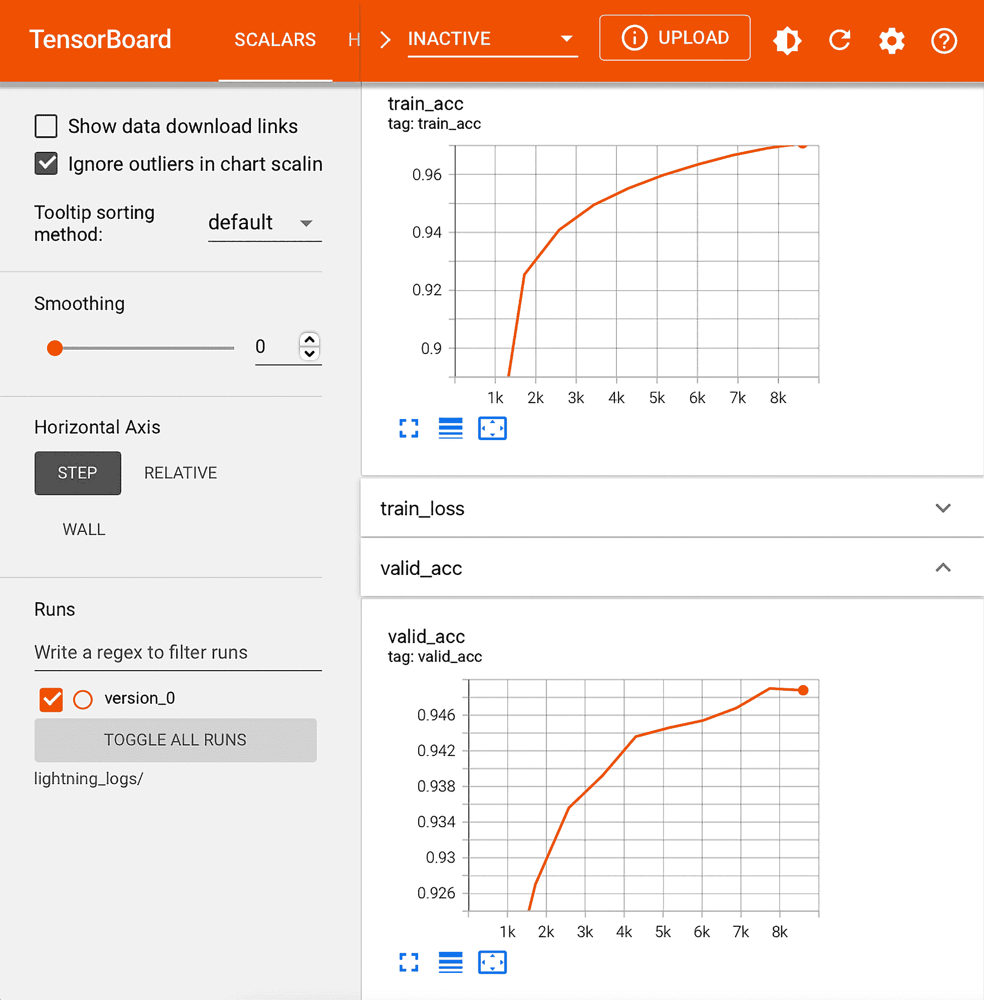

图 13.9: TensorBoard 仪表板

通过观察 *图 13.9* 中的训练和验证准确率，我们可以假设再训练几个周期可以提高性能。

Lightning 允许我们加载已训练的模型，并方便地再训练多个周期。如前所述，Lightning 通过子文件夹追踪各个训练运行。在 *图 13.10* 中，我们看到了 `version_0` 子文件夹的内容，其中包括日志文件和重新加载模型的模型检查点：

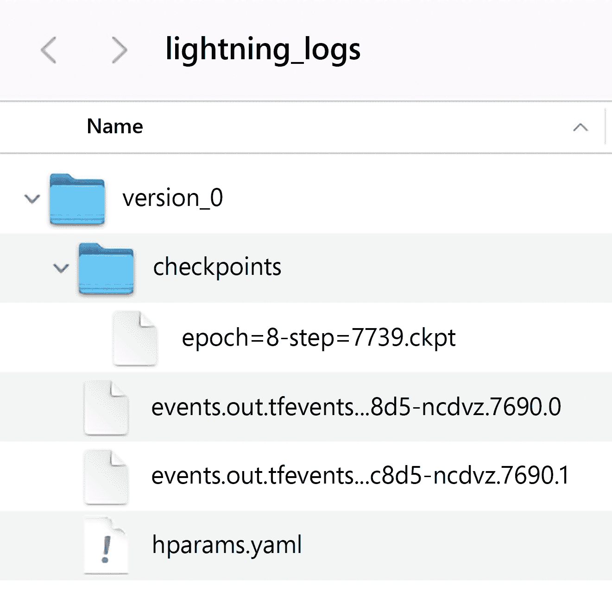

图 13.10: PyTorch Lightning 日志文件

例如，我们可以使用以下代码从此文件夹加载最新的模型检查点，并通过 `fit` 方法训练模型：

```py
if torch.cuda.is_available(): # if you have GPUs
    trainer = pl.Trainer(max_epochs=15, resume_from_checkpoint='./lightning_logs/version_0/checkpoints/epoch=8-step=7739.ckpt', gpus=1)
else:
    trainer = pl.Trainer(max_epochs=15, resume_from_checkpoint='./lightning_logs/version_0/checkpoints/epoch=8-step=7739.ckpt')
trainer.fit(model=mnistclassifier, datamodule=mnist_dm) 
```

在这里，我们将 `max_epochs` 设置为 `15`，这使得模型总共训练了 5 个额外的周期（之前训练了 10 个周期）。

现在，让我们看一下 *图 13.11* 中的 TensorBoard 仪表板，看看再训练几个周期是否值得：

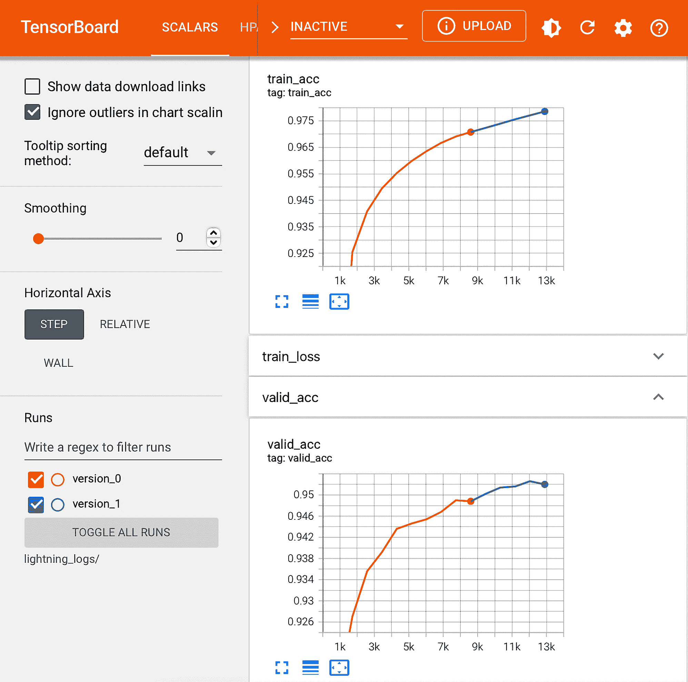

图 13.11: 训练了五个额外周期后的 TensorBoard 仪表板

正如我们在 *图 13.11* 中所看到的，TensorBoard 允许我们展示额外训练周期（`version_1`）的结果与之前的（`version_0`）对比，这非常方便。确实，我们可以看到再训练五个周期提高了验证准确率。在这一点上，我们可以决定是否继续训练更多周期，这留给您作为练习。

一旦完成训练，我们可以使用以下代码在测试集上评估模型：

```py
trainer.test(model=mnistclassifier, datamodule=mnist_dm) 
```

在总共训练 15 个周期后，得到的测试集性能约为 95%：

```py
[{'test_loss': 0.14912301301956177, 'test_acc': 0.9499600529670715}] 
```

请注意，PyTorch Lightning 还会自动保存模型。如果您想稍后重用模型，您可以通过以下代码方便地加载它：

```py
model = MultiLayerPerceptron.load_from_checkpoint("path/to/checkpoint.ckpt") 
```

**了解更多关于 PyTorch Lightning 的信息**

欲了解更多有关 Lightning 的信息，请访问官方网站，其中包含教程和示例，网址为 [`pytorch-lightning.readthedocs.io`](https://pytorch-lightning.readthedocs.io)。

Lightning 在 Slack 上也有一个活跃的社区，欢迎新用户和贡献者加入。要了解更多信息，请访问官方 Lightning 网站 [`www.pytorchlightning.ai`](https://www.pytorchlightning.ai)。

# 概要

在本章中，我们涵盖了 PyTorch 最重要和最有用的特性。我们首先讨论了 PyTorch 的动态计算图，这使得实现计算非常方便。我们还介绍了定义 PyTorch 张量对象作为模型参数的语义。

在我们考虑了计算任意函数的偏导数和梯度的概念后，我们更详细地讨论了 `torch.nn` 模块。它为我们提供了一个用户友好的接口，用于构建更复杂的深度神经网络模型。最后，我们通过使用迄今为止讨论的内容解决了回归和分类问题，从而结束了本章。

现在我们已经涵盖了 PyTorch 的核心机制，下一章将介绍深度学习中 **卷积神经网络** (**CNN**) 架构的概念。CNN 是强大的模型，在计算机视觉领域表现出色。

# 加入我们书籍的 Discord 空间

加入本书的 Discord 工作区，与作者进行每月的 *问答* 会话：

[`packt.link/MLwPyTorch`](https://packt.link/MLwPyTorch)


