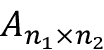
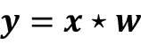
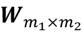
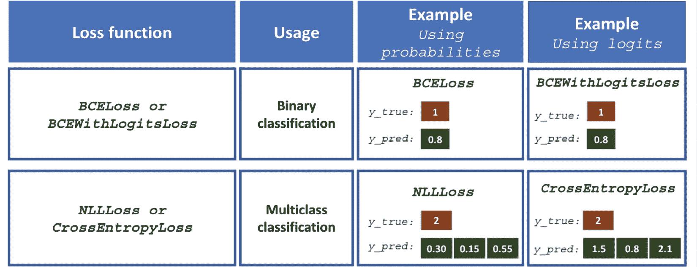

# 第十四章：使用深度卷积神经网络进行图像分类

在上一章中，我们深入研究了 PyTorch 神经网络和自动微分模块的不同方面，您熟悉了张量和装饰函数，并学习了如何使用`torch.nn`。在本章中，您将学习有关用于图像分类的**卷积神经网络**（**CNNs**）。我们将从底层开始讨论 CNN 的基本构建模块。接下来，我们将深入探讨 CNN 架构，并探讨如何在 PyTorch 中实现 CNN。本章将涵盖以下主题：

+   一维和二维卷积操作

+   CNN 架构的构建模块

+   在 PyTorch 中实现深度 CNN

+   数据增强技术以提高泛化性能

+   实现用于识别笑容的面部 CNN 分类器

# CNN 的构建模块

CNN 是一个模型家族，最初受人类大脑视觉皮层在识别物体时的工作启发。CNN 的发展可以追溯到 1990 年代，当时 Yann LeCun 及其同事提出了一种新颖的神经网络架构，用于从图像中识别手写数字（*Y. LeCun*和同事在 1989 年发表在*神经信息处理系统（NeurIPS）*会议上的文章 *Handwritten Digit Recognition with a Back-Propagation Network*）。

**人类视觉皮层**

我们对大脑视觉皮层如何运作的最初发现是由 David H. Hubel 和 Torsten Wiesel 在 1959 年完成的，当时他们在麻醉猫的主视觉皮层插入了微电极。他们观察到，神经元在向猫前方不同模式的光投影后会产生不同的反应。这最终导致了对视觉皮层不同层次的发现。尽管主要层主要检测边缘和直线，但高阶层更专注于提取复杂的形状和图案。

由于 CNN 在图像分类任务中表现出色，这种特定类型的前馈神经网络引起了广泛关注，并在计算机视觉的机器学习领域取得了巨大进展。几年后的 2019 年，Yann LeCun 与其他两位研究者 Yoshua Bengio 和 Geoffrey Hinton 因其在**人工智能**（**AI**）领域的贡献而共同获得了图灵奖（计算机科学中最负盛名的奖项）。

在接下来的几节中，我们将讨论 CNN 的更广泛概念以及为什么卷积架构通常被描述为“特征提取层”。然后，我们将深入探讨在 CNN 中常用的卷积操作类型的理论定义，并通过计算一维和二维卷积的示例来详细讨论。

## 理解 CNN 和特征层级

成功提取**显著**（**相关**）**特征**对于任何机器学习算法的性能至关重要，传统的机器学习模型依赖于可能来自领域专家或基于计算特征提取技术的输入特征。

某些类型的 NN，如 CNNs，可以自动从原始数据中学习对特定任务最有用的特征。因此，将 CNN 层视为特征提取器是很常见的：早期层（紧接着输入层的那些层）从原始数据中提取**低级特征**，后续层（通常是**全连接层**，如**多层感知器（MLP）**）利用这些特征来预测连续目标值或类别标签。

某些类型的多层 NNs，特别是深度 CNNs，通过逐层组合低级特征以形成高级特征的方式构建所谓的**特征层次结构**。例如，如果我们处理图像，则从较早的层中提取低级特征（如边缘和斑点），然后将它们组合形成高级特征。这些高级特征可以形成更复杂的形状，例如建筑物、猫或狗等对象的一般轮廓。

正如您在*图 14.1*中看到的那样，CNN 从输入图像计算**特征图**，其中每个元素来自输入图像中的一个局部像素块：


图 14.1：从图像创建特征图（由 Alexander Dummer 在 Unsplash 上拍摄的照片）

这个局部像素块被称为**局部感受野**。CNN 在与图像相关的任务上通常表现非常出色，这在很大程度上归功于两个重要的思想：

+   **稀疏连接性**：特征图中的单个元素仅连接到一个小的像素块。（这与 MLP 连接到整个输入图像非常不同。你可能会发现回顾并比较我们如何在*第十一章*中从头实现全连接网络的方式很有用。）

+   **参数共享**：相同的权重用于输入图像的不同补丁。

由于这两个思想的直接结果，用卷积层替换传统的全连接 MLP 会大大减少网络中的权重（参数），我们将看到在捕获*显著*特征方面的改进。在图像数据的背景下，假设附近的像素通常比远离的像素更相关是有意义的。

典型地，CNN 由若干**卷积**和子采样层组成，最后跟随一个或多个完全连接层。全连接层本质上就是一个 MLP，其中每个输入单元*i*与每个输出单元*j*通过权重*w*[ij]连接（我们在*第十一章*中更详细地介绍过）。

请注意，常称为 **池化层** 的子采样层没有任何可学习的参数；例如，池化层中没有权重或偏置单元。然而，卷积层和全连接层都有在训练期间优化的权重和偏置。

在接下来的章节中，我们将更详细地研究卷积层和池化层，并了解它们的工作原理。为了理解卷积操作的工作原理，让我们从一维卷积开始，这在处理某些类型的序列数据（如文本）时有时会用到。在讨论一维卷积之后，我们将探讨通常应用于二维图像的二维卷积。

## 执行离散卷积

**离散卷积**（或简称为 **卷积**）是 CNN 中的一个基本操作。因此，理解这个操作如何工作非常重要。在本节中，我们将涵盖数学定义并讨论一些计算一维张量（向量）和二维张量（矩阵）卷积的**朴素**算法。

请注意，本节中的公式和描述仅用于理解 CNN 中的卷积操作。实际上，像 PyTorch 这样的软件包中已经存在更高效的卷积操作实现，你将在本章后面看到。

**数学符号**

在本章中，我们将使用下标表示多维数组（张量）的大小；例如， 是一个大小为 *n*[1]×*n*[2] 的二维数组。我们使用方括号 [ ] 表示多维数组的索引。例如，*A*[*i*, *j*] 指的是矩阵 *A* 中索引为 *i*, *j* 的元素。此外，请注意我们使用特殊符号  表示两个向量或矩阵之间的卷积运算，这与 Python 中的乘法运算符 `*` 不要混淆。

### 一维离散卷积

让我们从一些基本定义和符号开始。两个向量 **x** 和 **w** 的离散卷积表示为 ，其中向量 **x** 是我们的输入（有时称为 **信号**），**w** 被称为 **滤波器** 或 **核**。离散卷积的数学定义如下：


正如前面提到的，方括号 [ ] 用于表示向量元素的索引。索引 *i* 遍历输出向量 **y** 的每个元素。在前述公式中有两件需要澄清的奇怪之处：负无穷到正无穷的指数和 **x** 的负索引。

看起来从–∞到+∞的索引和，主要因为在机器学习应用中，我们总是处理有限的特征向量。例如，如果**x**具有 10 个特征，索引为 0、1、2、...、8、9，那么索引–∞: –1 和 10: +∞对于**x**来说是超出范围的。因此，为了正确计算上述公式中的求和，假设**x**和**w**填充了零。这将导致输出向量**y**也具有无限大小，并且也有很多零。由于在实际情况下这并不有用，因此**x**仅填充有限数量的零。

这个过程称为**零填充**或简称**填充**。这里，每一侧填充的零的数量由*p*表示。图 14.2 展示了一维向量**x**的一个填充示例：


图 14.2：填充的示例

假设原始输入**x**和滤波器**w**分别具有*n*和*m*个元素，其中。因此，填充向量*x*^p 的大小为*n* + 2*p*。用于计算离散卷积的实际公式将变为：


现在我们已经解决了无限索引问题，第二个问题是用*i* + *m* – *k*索引**x**。这里需要注意的重要一点是，在这个求和中**x**和**w**的索引方向不同。用一个索引反向的方法计算总和等同于在填充后翻转其中一个向量**x**或**w**后，同时用正向的方法计算总和。然后，我们可以简单地计算它们的点积。假设我们翻转（旋转）滤波器**w**，得到旋转后的滤波器**w**^r。那么，点积*x*[i: *i* + *m*].**w**^r 得到一个元素*y*[i]，其中**x**[i: *i* + *m*]是大小为*m*的**x**的一个片段。这个操作像滑动窗口方法一样重复，以获取所有的输出元素。

以下图示给出了一个例子，其中**x** = [3 2 1 7 1 2 5 4]和，以便计算前三个输出元素：


图 14.3：计算离散卷积的步骤

在上述例子中，您可以看到填充大小为零（*p* =  0）。注意，旋转后的滤波器**w**^r 每次**移动**两个单元。这种移动是卷积的另一个超参数，**步长**，*s*。在这个例子中，步长是二，*s* = 2。注意，步长必须是一个小于输入向量大小的正数。我们将在下一节详细讨论填充和步长。

**交叉相关**

输入向量和滤波器之间的交叉相关（或简称相关）用  表示，与卷积非常相似，唯一的区别在于：在交叉相关中，乘法是在相同方向上进行的。因此，在每个维度上不需要旋转滤波器矩阵 *w*。数学上，交叉相关定义如下：


对于交叉相关，填充和步长的规则也可以应用。请注意，大多数深度学习框架（包括 PyTorch）实现的是交叉相关，但在深度学习领域中通常称之为卷积，这是一种常见的约定。

### 填充输入以控制输出特征图的大小

到目前为止，我们只在卷积中使用了零填充来计算有限大小的输出向量。从技术上讲，填充可以应用于任何 。根据 *p* 的选择，边界单元格的处理方式可能与位于 **x** 中间的单元格有所不同。

现在，考虑一个例子，其中 *n* = 5，*m* = 3\. 那么，当 *p* = 0 时，*x*[0] 仅用于计算一个输出元素（例如 *y*[0]），而 *x*[1] 用于计算两个输出元素（例如 *y*[0] 和 *y*[1]）。因此，你可以看到，对 **x** 元素的这种不同处理可以在较多的计算中人为地突出中间元素 *x*[2]。如果我们选择 *p* = 2，我们可以避免这个问题，这样 **x** 的每个元素将参与计算 **y** 的三个元素。

此外，输出 **y** 的大小也取决于我们使用的填充策略。

在实际应用中，有三种常用的填充模式：*full*、*same* 和 *valid*。

在 full 模式下，填充参数 *p* 被设置为 *p* = *m* – 1\. 全填充会增加输出的维度，因此在 CNN 架构中很少使用。

通常使用 same padding 模式来确保输出向量与输入向量 **x** 的大小相同。在这种情况下，填充参数 *p* 根据滤波器大小计算，同时要求输入大小和输出大小相同。

最后，在 valid 模式下进行卷积计算时，表示 *p* = 0（无填充）。

*图 14.4* 展示了一个简单的 5×5 像素输入与 3×3 的核大小和步长为 1 的三种不同填充模式：


图 14.4：三种填充模式

CNN 中最常用的填充模式是 same padding。它与其他填充模式相比的优势之一是保持了向量的大小，或者在计算机视觉中处理图像相关任务时保持了输入图像的高度和宽度，这使得设计网络架构更加方便。

有效填充与全填充以及相同填充相比的一个巨大缺点是，在具有许多层的神经网络中，张量的体积会大幅减少，这可能对网络的性能有害。在实践中，应该保留卷积层的空间尺寸，并通过池化层或步长为 2 的卷积层减少空间尺寸，正如*追求简单性：全卷积网络* ICLR（研讨会轨道），由*约斯特·托比亚斯·施普林根伯格*，*亚历克西·多索维茨基*和其他人，2015 年所述 ([`arxiv.org/abs/1412.6806`](https://arxiv.org/abs/1412.6806))。

至于全填充，其尺寸会导致输出大于输入尺寸。全填充通常用于信号处理应用中，重要的是最小化边界效应。然而，在深度学习环境中，边界效应通常不是问题，因此我们很少在实践中看到使用全填充。

### 确定卷积输出的尺寸

卷积输出的大小由我们沿着输入向量移动滤波器**w**的总次数决定。假设输入向量的大小为*n*，滤波器的大小为*m*，并且填充为*p*，步长为*s*，则从结果的输出大小将如下确定：


这里， 表示*地板*运算。

**地板运算**

地板运算返回小于或等于输入的最大整数，例如：


考虑以下两种情况：

+   计算输入向量大小为 10，卷积核大小为 5，填充为 2，步长为 1 时的输出大小：

    

    （请注意，在这种情况下，输出尺寸与输入相同；因此，我们可以得出这是相同填充模式。）

+   当我们有大小为 3 且步长为 2 的卷积核时，同一输入向量的输出大小会如何变化？

    

如果你对学习卷积输出的尺寸更感兴趣，我们推荐阅读*深度学习卷积算术指南*，作者是*文森特·杜穆林*和*弗朗切斯科·维辛*，可以在 [`arxiv.org/abs/1603.07285`](https://arxiv.org/abs/1603.07285) 自由获取。

最后，为了学习如何在一维中计算卷积，我们展示了一个简单的实现在以下代码块中，并且结果与`numpy.convolve`函数进行了比较。代码如下：

```py
>>> import numpy as np
>>> def conv1d(x, w, p=0, s=1):
...     w_rot = np.array(w[::-1])
...     x_padded = np.array(x)
...     if p > 0:
...         zero_pad = np.zeros(shape=p)
...         x_padded = np.concatenate([
...             zero_pad, x_padded, zero_pad
...         ])
...     res = []
...     for i in range(0, int((len(x_padded) - len(w_rot))) + 1, s):
...         res.append(np.sum(x_padded[i:i+w_rot.shape[0]] * w_rot))
...     return np.array(res)
>>> ## Testing:
>>> x = [1, 3, 2, 4, 5, 6, 1, 3]
>>> w = [1, 0, 3, 1, 2]
>>> print('Conv1d Implementation:',
...       conv1d(x, w, p=2, s=1))
Conv1d Implementation: [ 5\. 14\. 16\. 26\. 24\. 34\. 19\. 22.]
>>> print('NumPy Results:',
...       np.convolve(x, w, mode='same'))
NumPy Results: [ 5 14 16 26 24 34 19 22] 
```

到目前为止，我们主要关注向量的卷积（1D 卷积）。我们从 1D 情况开始，以便更容易理解概念。在接下来的部分，我们将更详细地讨论 2D 卷积，这是用于图像相关任务的 CNN 的构建模块。

### 进行 2D 离散卷积

你在前几节学到的概念很容易扩展到 2D。当我们处理 2D 输入，比如一个矩阵，，和滤波器矩阵，，其中和，那么矩阵就是**X**和**W**之间的 2D 卷积的结果。数学上定义如下：


注意，如果省略其中一个维度，剩余的公式与我们之前用于计算 1D 卷积的公式完全相同。事实上，所有先前提到的技术，如零填充、旋转滤波器矩阵和使用步长，也适用于 2D 卷积，只要它们分别扩展到两个维度。*图 14.5*展示了使用 3×3 大小的核对大小为 8×8 的输入矩阵进行的 2D 卷积。输入矩阵通过*p* = 1 进行了零填充。因此，2D 卷积的输出大小为 8×8：


图 14.5：2D 卷积的输出

下面的例子演示了如何计算输入矩阵**X**[3×3]和核矩阵**W**[3×3]之间的 2D 卷积，使用填充*p* = (1, 1)和步长*s* = (2, 2)。根据指定的填充，每侧都添加了一层零，得到填充后的矩阵，如下所示：


图 14.6：计算输入和核矩阵之间的 2D 卷积

使用上述滤波器，旋转后的滤波器将是：


请注意，此旋转与转置矩阵不同。在 NumPy 中获取旋转滤波器，我们可以写成`W_rot=W[::-1,::-1]`。接下来，我们可以将旋转的滤波器矩阵沿着填充的输入矩阵**X**^(padded)移动，如滑动窗口一样，并计算元素乘积的和，这在*图 14.7*中由运算符表示：


图 14.7：计算元素乘积的和

结果将是 2×2 矩阵**Y**。

让我们根据描述的*朴素*算法也实现 2D 卷积。`scipy.signal`包提供了通过`scipy.signal.convolve2d`函数计算 2D 卷积的方法：

```py
>>> import numpy as np
>>> import scipy.signal
>>> def conv2d(X, W, p=(0, 0), s=(1, 1)):
...     W_rot = np.array(W)[::-1,::-1]
...     X_orig = np.array(X)
...     n1 = X_orig.shape[0] + 2*p[0]
...     n2 = X_orig.shape[1] + 2*p[1]
...     X_padded = np.zeros(shape=(n1, n2))
...     X_padded[p[0]:p[0]+X_orig.shape[0],
...              p[1]:p[1]+X_orig.shape[1]] = X_orig
...
...     res = []
...     for i in range(0,
...             int((X_padded.shape[0] - \
...             W_rot.shape[0])/s[0])+1, s[0]):
...         res.append([])
...         for j in range(0,
...                 int((X_padded.shape[1] - \
...                 W_rot.shape[1])/s[1])+1, s[1]):
...             X_sub = X_padded[i:i+W_rot.shape[0],
...                              j:j+W_rot.shape[1]]
...             res[-1].append(np.sum(X_sub * W_rot))
...     return(np.array(res))
>>> X = [[1, 3, 2, 4], [5, 6, 1, 3], [1, 2, 0, 2], [3, 4, 3, 2]]
>>> W = [[1, 0, 3], [1, 2, 1], [0, 1, 1]]
>>> print('Conv2d Implementation:\n',
...       conv2d(X, W, p=(1, 1), s=(1, 1)))
Conv2d Implementation:
[[ 11\.  25\.  32\.  13.]
 [ 19\.  25\.  24\.  13.]
 [ 13\.  28\.  25\.  17.]
 [ 11\.  17\.  14\.   9.]]
>>> print('SciPy Results:\n',
...       scipy.signal.convolve2d(X, W, mode='same'))
SciPy Results:
[[11 25 32 13]
 [19 25 24 13]
 [13 28 25 17]
 [11 17 14  9]] 
```

**高效计算卷积的算法**

我们提供了一个朴素的实现来计算 2D 卷积，以便理解这些概念。然而，这种实现在内存需求和计算复杂度方面非常低效。因此，在现实世界的神经网络应用中不应该使用它。

一个方面是，在大多数工具（如 PyTorch）中，滤波器矩阵实际上并没有旋转。此外，近年来已开发出更高效的算法，使用傅里叶变换来计算卷积。还要注意，在神经网络的背景下，卷积核的大小通常远小于输入图像的大小。

例如，现代 CNN 通常使用 1×1、3×3 或 5×5 的核大小，为此已设计出更高效的算法，可以更有效地执行卷积操作，如 Winograd 的最小过滤算法。这些算法超出了本书的范围，但如果您有兴趣了解更多，可以阅读 Andrew Lavin 和 Scott Gray 在 2015 年撰写的手稿*Fast Algorithms for Convolutional Neural Networks*，可在[`arxiv.org/abs/1509.09308`](https://arxiv.org/abs/1509.09308)免费获取。

在下一节中，我们将讨论 CNN 中经常使用的另一重要操作，即下采样或池化。

## 下采样层

在 CNN 中，**最大池化**和**平均池化**（又称**均值池化**）通常以两种形式进行下采样操作。池化层通常用表示。此处的下标决定了邻域的大小（每个维度中相邻像素的数量），在这个邻域内进行最大或均值操作。我们将这样的邻域称为**池化尺寸**。

操作在*图 14.8*中描述。在此，最大池化从像素邻域中取最大值，而平均池化计算它们的平均值：


图 14.8：最大池化和平均池化的示例

池化的优点是双重的：

+   池化（最大池化）引入了局部不变性。这意味着局部邻域的小变化不会改变最大池化的结果。因此，它有助于生成对输入数据中噪声更加稳健的特征。请参考下面的示例，显示两个不同输入矩阵**X**[1]和**X**[2]的最大池化结果相同：

    

+   池化减小了特征的大小，提高了计算效率。此外，减少特征的数量也可能降低过拟合的程度。

**重叠与非重叠池化**

传统上，池化被假定为非重叠的。池化通常在非重叠的邻域上执行，可以通过设置步幅参数等于池化大小来完成。例如，非重叠池化层，，需要一个步幅参数*s* = (*n*[1], *n*[2])。另一方面，如果步幅小于池化大小，则会发生重叠池化。描述重叠池化在卷积网络中使用的一个例子可见于*A. Krizhevsky*、*I. Sutskever*和*G. Hinton*于 2012 年的*ImageNet Classification with Deep Convolutional Neural Networks*，该文稿可以免费获取，网址为[`papers.nips.cc/paper/4824-imagenet-classification-with-deep-convolutional-neural-networks`](https://papers.nips.cc/paper/4824-imagenet-classification-with-deep-convolutional-neural-networks)。

尽管池化仍然是许多 CNN 架构的重要部分，但也已经开发出了几种不使用池化层的 CNN 架构。研究人员使用步幅为 2 的卷积层代替使用池化层来减少特征尺寸。

从某种意义上说，你可以将带有步幅 2 的卷积层视为带有可学习权重的池化层。如果你对使用和不使用池化层开发的不同 CNN 架构进行经验比较感兴趣，我们建议阅读*Jost Tobias Springenberg*、*Alexey Dosovitskiy*、*Thomas Brox*和*Martin Riedmiller*撰写的研究文章*Striving for Simplicity: The All Convolutional Net*。该文章可以免费获取，网址为[`arxiv.org/abs/1412.6806`](https://arxiv.org/abs/1412.6806)。

# 将所有内容放在一起 - 实现一个 CNN

到目前为止，你已经学习了 CNN 的基本构建块。本章节中介绍的概念实际上并不比传统的多层神经网络更难。我们可以说，在传统 NN 中最重要的操作是矩阵乘法。例如，我们使用矩阵乘法来计算预激活（或净输入），如**z** = **Wx** + *b*。这里，**x**是一个列向量（矩阵），表示像素，而**W**是连接像素输入到每个隐藏单元的权重矩阵。

在 CNN 中，这个操作被卷积操作所取代，如，其中**X**是一个表示像素的矩阵，排列为*高度*×*宽度*。在这两种情况下，预激活被传递到激活函数以获取隐藏单元的激活，，其中是激活函数。此外，你会记得子采样是 CNN 的另一个构建块，可能以池化的形式出现，正如在前一节中所描述的。

## 使用多个输入或颜色通道

卷积层的输入可以包含一个或多个 2D 数组或矩阵，维度为*N*[1]×*N*[2]（例如，像素的图像高度和宽度）。这些*N*[1]×*N*[2]矩阵称为*通道*。传统的卷积层实现期望输入为秩-3 张量表示，例如，三维数组，，其中*C*[in]是输入通道数。例如，让我们考虑图像作为 CNN 的第一层的输入。如果图像是彩色并使用 RGB 色彩模式，则*C*[in]=3（对应于 RGB 中的红色、绿色和蓝色通道）。然而，如果图像是灰度的，则*C*[in]=1，因为只有一个灰度像素强度通道。

**读取图像文件**

当我们处理图像时，可以使用`uint8`（无符号 8 位整数）数据类型将图像读入 NumPy 数组中，以减少内存使用，与 16 位、32 位或 64 位整数类型相比。

无符号 8 位整数的取值范围为[0, 255]，足以存储 RGB 图像中的像素信息，其值也在同一范围内。

在*第十二章*中，*使用 PyTorch 并行化神经网络训练*，你看到 PyTorch 提供了一个模块，用于通过`torchvision`加载/存储和操作图像。让我们回顾一下如何读取图像（本示例中的 RGB 图像位于本章提供的代码包文件夹中）：

```py
>>> import torch
>>> from torchvision.io import read_image
>>> img = read_image('example-image.png')
>>> print('Image shape:', img.shape)
Image shape: torch.Size([3, 252, 221])
>>> print('Number of channels:', img.shape[0])
Number of channels: 3
>>> print('Image data type:', img.dtype)
Image data type: torch.uint8
>>> print(img[:, 100:102, 100:102])
tensor([[[179, 182],
         [180, 182]],
        [[134, 136],
         [135, 137]],
        [[110, 112],
         [111, 113]]], dtype=torch.uint8) 
```

请注意，使用`torchvision`时，输入和输出的图像张量格式为`Tensor[通道数, 图像高度, 图像宽度]`。

现在您熟悉输入数据的结构，接下来的问题是，我们如何在我们讨论的卷积操作中结合多个输入通道？答案非常简单：我们分别为每个通道执行卷积操作，然后使用矩阵求和将结果相加。与每个通道相关联的卷积(*c*)有其自己的核矩阵，例如*W*[:, :, *c*]。

总的预激活结果由以下公式计算：


最终结果**A**是一个特征映射。通常，CNN 的卷积层具有多个特征映射。如果使用多个特征映射，则核张量变为四维：*宽度*×*高度*×*C*[in]×*C*[out]。因此，现在让我们在前述公式中包含输出特征映射的数量，并进行更新，如下所示：


结束我们对在 NN 上下文中计算卷积的讨论，让我们看一下图 14.9 中的例子，展示了一个卷积层，后跟一个池化层。在这个例子中，有三个输入通道。卷积核张量是四维的。每个卷积核矩阵表示为*m*[1]×*m*[2]，共有三个，每个输入通道一个。此外，有五个这样的卷积核，对应五个输出特征图。最后，有一个池化层用于对特征图进行子采样：


图 14.9：实现 CNN

**在前面的例子中有多少个可训练参数？**

为了说明卷积、参数共享和稀疏连接的优点，让我们通过一个例子来详细说明。网络中的卷积层是一个四维张量。因此，与卷积核相关联的参数数量为*m*[1]×*m*[2]×3×5。此外，每个卷积层输出特征图都有一个偏置向量。因此，偏置向量的尺寸是 5。池化层没有任何（可训练的）参数；因此，我们可以写成如下形式：

*m*[1] × *m*[2] × 3 × 5 + 5

如果输入张量的尺寸为*n*[1]×*n*[2]×3，假设使用同填充模式进行卷积，那么输出特征图的尺寸将是*n*[1] × *n*[2] × 5。

请注意，如果我们使用全连接层而不是卷积层，这个数字会大得多。在全连接层的情况下，达到相同输出单元数量的权重矩阵参数数量如下：

(*n*[1] × *n*[2] × 3) × (*n*[1] × *n*[2] × 5) = (*n*[1] × *n*[2])² × 3 × 5

此外，偏置向量的尺寸是*n*[1] × *n*[2] × 5（每个输出单元一个偏置元素）。鉴于*m*[1] < *n*[1]和*m*[2] < *n*[2]，我们可以看到可训练参数数量的差异是显著的。

最后，正如之前提到的，卷积操作通常是通过将具有多个颜色通道的输入图像视为一堆矩阵来执行的；也就是说，我们分别对每个矩阵执行卷积，然后将结果相加，正如前面的图所示。但是，如果您处理的是 3D 数据集，例如，可以将卷积扩展到 3D 体积，如 Daniel Maturana 和 Sebastian Scherer 在 2015 年的论文《VoxNet:用于实时物体识别的 3D 卷积神经网络》中所示，可访问[`www.ri.cmu.edu/pub_files/2015/9/voxnet_maturana_scherer_iros15.pdf`](https://www.ri.cmu.edu/pub_files/2015/9/voxnet_maturana_scherer_iros15.pdf)。

在接下来的部分中，我们将讨论如何正则化一个神经网络。

## 使用 L2 正则化和 dropout 对 NN 进行正则化

选择网络的大小，无论是传统（全连接）NN 还是 CNN，一直都是一个具有挑战性的问题。例如，需要调整权重矩阵的大小和层数，以达到合理的性能。

您会从 *第十三章*，*深入了解 - PyTorch 的机制* 中记得，一个没有隐藏层的简单网络只能捕捉线性决策边界，这对处理异或（或 XOR）或类似问题是不够的。网络的 *容量* 是指它可以学习逼近的函数复杂性级别。小网络或具有相对少参数的网络具有低容量，因此可能会 *欠拟合*，导致性能不佳，因为它们无法学习复杂数据集的底层结构。但是，非常大的网络可能会导致 *过拟合*，即网络会记住训练数据，并在训练数据集上表现极好，但在留置测试数据集上表现不佳。当我们处理现实中的机器学习问题时，我们不知道网络应该有多大 *先验*。

解决这个问题的一种方法是构建一个具有相对较大容量的网络（在实践中，我们希望选择一个略大于必要的容量），以在训练数据集上表现良好。然后，为了防止过拟合，我们可以应用一个或多个正则化方案，以在新数据（如留置测试数据集）上实现良好的泛化性能。

在 *第三章* 和 *第四章* 中，我们介绍了 L1 和 L2 正则化。这两种技术都可以通过在训练过程中对损失函数增加惩罚来缩小权重参数，从而防止或减少过拟合的影响。虽然 L1 和 L2 正则化都可以用于神经网络，L2 是其中更常见的选择，但对于神经网络的正则化还有其他方法，如我们在本节讨论的 dropout。但在讨论 dropout 之前，在卷积或全连接网络中使用 L2 正则化（回想一下，全连接层是通过 `torch.nn.Linear` 在 PyTorch 中实现的），你可以简单地将特定层的 L2 惩罚添加到损失函数中，如下所示：

```py
>>> import torch.nn as nn
>>> loss_func = nn.BCELoss()
>>> loss = loss_func(torch.tensor([0.9]), torch.tensor([1.0]))
>>> l2_lambda = 0.001
>>> conv_layer = nn.Conv2d(in_channels=3,
...                        out_channels=5,
...                        kernel_size=5)
>>> l2_penalty = l2_lambda * sum(
...     [(p**2).sum() for p in conv_layer.parameters()]
... )
>>> loss_with_penalty = loss + l2_penalty
>>> linear_layer = nn.Linear(10, 16)
>>> l2_penalty = l2_lambda * sum(
...     [(p**2).sum() for p in linear_layer.parameters()]
... )
>>> loss_with_penalty = loss + l2_penalty 
```

**权重衰减与 L2 正则化**

通过在 PyTorch 优化器中将 `weight_decay` 参数设置为正值，可以替代使用 L2 正则化的另一种方法，例如：

```py
optimizer = torch.optim.SGD(
    model.parameters(),
    weight_decay=l2_lambda,
    ...
) 
```

虽然 L2 正则化和 `weight_decay` 不严格相同，但可以证明它们在使用 **随机梯度下降**（**SGD**）优化器时是等效的。感兴趣的读者可以在 *Ilya Loshchilov* 和 *Frank Hutter*，2019 年的文章 *Decoupled Weight Decay Regularization* 中找到更多信息，该文章可以免费在 [`arxiv.org/abs/1711.05101`](https://arxiv.org/abs/1711.05101) 上获取。

近年来，**dropout** 已经成为一种流行的技术，用于正则化（深度）神经网络以避免过拟合，从而提高泛化性能（*Dropout: A Simple Way to Prevent Neural Networks from Overfitting*，作者为 *N. Srivastava*、*G. Hinton*、*A. Krizhevsky*、*I. Sutskever* 和 *R. Salakhutdinov*，*Journal of Machine Learning Research 15.1*，页面 1929-1958，2014 年，[`www.jmlr.org/papers/volume15/srivastava14a/srivastava14a.pdf`](http://www.jmlr.org/papers/volume15/srivastava14a/srivastava14a.pdf)）。dropout 通常应用于更高层的隐藏单元，并按以下方式工作：在 NN 的训练阶段，每次迭代时随机丢弃一部分隐藏单元，丢弃概率为 *p*[drop]（或保留概率 *p*[keep] = 1 - *p*[drop]）。此丢弃概率由用户确定，常见选择为 *p* = 0.5，如前述的 *Nitish Srivastava* 等人在 2014 年的文章中讨论的那样。当丢弃一定比例的输入神经元时，与剩余神经元相关联的权重会重新缩放，以考虑缺失的（丢弃的）神经元。

这种随机 dropout 的效果是，网络被迫学习数据的冗余表示。因此，网络不能依赖于任何一组隐藏单元的激活，因为它们在训练过程中可能随时关闭，并被迫从数据中学习更一般和更稳健的模式。

这种随机 dropout 可以有效地防止过拟合。*图 14.10* 显示了在训练阶段应用 dropout 的示例，其中丢失概率为 *p* = 0.5，因此在每次训练的前向传递中，一半的神经元将随机失活。然而，在预测阶段，所有神经元将有助于计算下一层的预激活：


图 14.10：在训练阶段应用 dropout

正如所示，一个重要的记住的要点是，单位在训练过程中可能会随机丢失，而在评估（推断）阶段，所有隐藏单元必须处于活跃状态（例如，*p*[drop] = 0 或 *p*[keep] = 1）。为了确保训练和预测期间的总激活在同一尺度上，必须适当缩放活跃神经元的激活（例如，如果丢失概率设置为 *p* = 0.5，则通过减半激活来进行缩放）。

然而，由于在进行预测时始终缩放激活比较麻烦，因此 PyTorch 和其他工具在训练期间缩放激活（例如，如果丢失概率设置为 *p* = 0.5，则通过加倍激活）。这种方法通常被称为 *逆 dropout*。

虽然关系并不立即明显，dropout 可以被解释为一组模型的共识（平均）。正如在*第七章*，*集成学习中的不同模型组合*中讨论的那样，在集成学习中，我们独立训练几个模型。在预测期间，我们然后使用所有训练模型的共识。我们已经知道，模型集成比单个模型表现更好。然而，在深度学习中，训练多个模型、收集和平均多个模型的输出都是计算昂贵的。在这里，dropout 提供了一种解决方案，以一种有效的方式同时训练多个模型，并在测试或预测时计算它们的平均预测。

正如之前提到的，模型集成与 dropout 之间的关系并不立即明显。但是请考虑，在 dropout 中，由于在每次前向传递期间随机将权重设置为零，我们对每个小批量都有一个不同的模型。

然后，通过迭代小批量，我们本质上对*M* = 2^h 个模型进行采样，其中*h*是隐藏单元的数量。

与常规集成不同，dropout 的限制和方面在于我们在这些“不同模型”上共享权重，这可以看作是一种正则化形式。然后，在“推断”期间（例如，在测试数据集中预测标签），我们可以对训练过程中采样的所有这些不同模型进行平均。尽管如此，这是非常昂贵的。

然后，对模型进行平均化，即计算模型*i*返回的类成员概率的几何平均，可以如下计算：


现在，dropout 背后的技巧在于，这个模型集合（这里是*M*个模型）的几何平均可以通过在训练过程中采样的最后一个（或最终）模型的预测，乘以一个因子 1/(1 – *p*)来近似计算，这比显式计算使用上述方程求解几何平均要便宜得多。（事实上，如果我们考虑线性模型，这个近似等同于真正的几何平均。）

## 用于分类的损失函数

在*第十二章*，*使用 PyTorch 并行化神经网络训练*中，我们看到了不同的激活函数，如 ReLU、sigmoid 和 tanh。这些激活函数中的一些，如 ReLU，主要用于神经网络的中间（隐藏）层，以为我们的模型添加非线性。但其他的，如 sigmoid（用于二元）和 softmax（用于多类别），则添加在最后（输出）层，将结果作为模型的类成员概率输出。如果在输出层没有包含 sigmoid 或 softmax 激活函数，则模型将计算 logits 而不是类成员概率。

在这里关注分类问题，根据问题的类型（二元分类还是多类分类）和输出的类型（logits 还是概率），我们应选择适当的损失函数来训练我们的模型。**二元交叉熵**是二元分类（具有单个输出单元）的损失函数，**分类交叉熵**是多类分类的损失函数。在`torch.nn`模块中，分类交叉熵损失接受整数形式的真实标签（例如，*y*=2，对于三个类别 0、1 和 2）。

*图 14.11*描述了在`torch.nn`中可用的两个损失函数，用于处理二元分类和整数标签的多类分类。这两个损失函数中的每一个还可以选择以 logits 或类成员概率的形式接收预测值：



图 14.11: PyTorch 中两个损失函数的示例

请注意，由于数值稳定性原因，通常通过提供 logits 而不是类成员概率来计算交叉熵损失更为可取。对于二元分类，我们可以将 logits 作为输入提供给损失函数`nn.BCEWithLogitsLoss()`，或者基于 logits 计算概率并将其馈送给损失函数`nn.BCELoss()`。对于多类分类，我们可以将 logits 作为输入提供给损失函数`nn.CrossEntropyLoss()`，或者基于 logits 计算对数概率并将其馈送给负对数似然损失函数`nn.NLLLoss()`。

下面的代码将向您展示如何使用这些损失函数来处理两种不同的格式，其中损失函数的输入可以是 logits 或类成员概率：

```py
>>> ####### Binary Cross-entropy
>>> logits = torch.tensor([0.8])
>>> probas = torch.sigmoid(logits)
>>> target = torch.tensor([1.0])
>>> bce_loss_fn = nn.BCELoss()
>>> bce_logits_loss_fn = nn.BCEWithLogitsLoss()
>>> print(f'BCE (w Probas): {bce_loss_fn(probas, target):.4f}')
BCE (w Probas): 0.3711
>>> print(f'BCE (w Logits): '
...       f'{bce_logits_loss_fn(logits, target):.4f}')
BCE (w Logits): 0.3711
>>> ####### Categorical Cross-entropy
>>> logits = torch.tensor([[1.5, 0.8, 2.1]])
>>> probas = torch.softmax(logits, dim=1)
>>> target = torch.tensor([2])
>>> cce_loss_fn = nn.NLLLoss()
>>> cce_logits_loss_fn = nn.CrossEntropyLoss()
>>> print(f'CCE (w Probas): '
...       f'{cce_logits_loss_fn(logits, target):.4f}')
CCE (w Probas): 0.5996
>>> print(f'CCE (w Logits): '
...       f'{cce_loss_fn(torch.log(probas), target):.4f}')
CCE (w Logits): 0.5996 
```

请注意，有时您可能会遇到使用分类交叉熵损失进行二元分类的实现。通常情况下，当我们有一个二元分类任务时，模型为每个示例返回单个输出值。我们将这个单一模型输出解释为正类（例如类 1）的概率 *P*(class = 1|**x**)。在二元分类问题中，我们隐含地有 *P*(class = 0|**x**)= 1 – *P*(class = 1|**x**)，因此我们不需要第二个输出单元来获取负类的概率。然而，有时实践者选择为每个训练示例返回两个输出，并将其解释为每个类的概率：*P*(class = 0|**x**)与*P*(class = 1|**x**)。在这种情况下，建议使用 softmax 函数（而不是逻辑 sigmoid）来归一化输出（使它们总和为 1），并且分类交叉熵是适当的损失函数。

# 使用 PyTorch 实现深度 CNN

正如您可能还记得的*第十三章*中，我们使用`torch.nn`模块解决了手写数字识别问题。您可能还记得，我们使用具有两个线性隐藏层的 NN 达到了约 95.6%的准确率。

现在，让我们实现一个 CNN，看看它是否能够比之前的模型在分类手写数字方面实现更好的预测性能。请注意，在*第十三章*中看到的全连接层在此问题上表现良好。然而，在某些应用中，比如从手写数字中读取银行账号号码，即使是微小的错误也可能非常昂贵。因此，尽可能减少这种错误至关重要。

## 多层 CNN 架构

我们将要实现的网络架构如*图 14.12*所示。输入为 28×28 的灰度图像。考虑到通道数（对于灰度图像为 1）和输入图像的批量，输入张量的维度将是*batchsize*×28×28×1。

输入数据通过两个卷积层，卷积核大小为 5×5。第一个卷积层有 32 个输出特征图，第二个卷积层有 64 个输出特征图。每个卷积层后面跟着一个池化层，采用最大池化操作，*P*[2×2]。然后一个全连接层将输出传递给第二个全连接层，它作为最终的*softmax*输出层。我们将要实现的网络架构如*图 14.12*所示：


图 14.12：一个深度 CNN

每层张量的尺寸如下：

+   输入：[*batchsize*×28×28×1]

+   卷积 _1：[*batchsize*×28×28×32]

+   池化 _1：[*batchsize*×14×14×32]

+   卷积 _2：[*batchsize*×14×14×64]

+   池化 _2：[*batchsize*×7×7×64]

+   FC_1：[*batchsize*×1024]

+   FC_2 和 softmax 层：[*batchsize*×10]

对于卷积核，我们使用`stride=1`以保持输入维度在生成的特征图中的尺寸不变。对于池化层，我们使用`kernel_size=2`来对图像进行子采样并缩小输出特征图的尺寸。我们将使用 PyTorch NN 模块来实现这个网络。

## 加载和预处理数据

首先，我们将使用`torchvision`模块加载 MNIST 数据集，并构建训练集和测试集，就像在*第十三章*中一样：

```py
>>> import torchvision
>>> from torchvision import transforms
>>> image_path = './'
>>> transform = transforms.Compose([
...     transforms.ToTensor()
... ])
>>> mnist_dataset = torchvision.datasets.MNIST(
...     root=image_path, train=True,
...     transform=transform, download=True
... )
>>> from torch.utils.data import Subset
>>> mnist_valid_dataset = Subset(mnist_dataset,
...                              torch.arange(10000))
>>> mnist_train_dataset = Subset(mnist_dataset,
...                              torch.arange(
...                                  10000, len(mnist_dataset)
...                              ))
>>> mnist_test_dataset = torchvision.datasets.MNIST(
...     root=image_path, train=False,
...     transform=transform, download=False
... ) 
```

MNIST 数据集附带了一个预先指定的训练和测试数据集分割方案，但我们还想从训练分区创建一个验证集分割。因此，我们使用了前 10,000 个训练示例用于验证。注意，图像并未按类标签排序，因此我们不必担心这些验证集图像是否来自相同的类别。

接下来，我们将使用 64 个图像的批量构建数据加载器，分别用于训练集和验证集：

```py
>>> from torch.utils.data import DataLoader
>>> batch_size = 64
>>> torch.manual_seed(1)
>>> train_dl = DataLoader(mnist_train_dataset,
...                       batch_size,
...                       shuffle=True)
>>> valid_dl = DataLoader(mnist_valid_dataset,
...                       batch_size,
...                       shuffle=False) 
```

我们读取的特征值范围是[0, 1]。此外，我们已经将图像转换为张量。标签是 0 到 9 的整数，表示十个数字。因此，我们不需要进行任何缩放或进一步的转换。

现在，在准备好数据集后，我们可以开始实现刚刚描述的 CNN 了。

## 使用`torch.nn`模块实现 CNN

在 PyTorch 中实现 CNN 时，我们使用`torch.nn`的`Sequential`类来堆叠不同的层，如卷积层、池化层、dropout 以及全连接层。`torch.nn`模块为每个类提供了具体的实现：`nn.Conv2d`用于二维卷积层；`nn.MaxPool2d`和`nn.AvgPool2d`用于子采样（最大池化和平均池化）；`nn.Dropout`用于使用 dropout 进行正则化。我们将详细介绍每个类。

### 配置 PyTorch 中的 CNN 层

使用`Conv2d`类构建层需要指定输出通道数（等同于输出特征图的数量或输出滤波器的数量）和内核大小。

此外，还有一些可选参数，我们可以用来配置卷积层。最常用的是步长（在*x*和*y*维度上都默认为 1）和填充参数，它控制了两个维度上的隐式填充量。更多配置参数详见官方文档：[`pytorch.org/docs/stable/generated/torch.nn.Conv2d.html`](https://pytorch.org/docs/stable/generated/torch.nn.Conv2d.html)。

值得一提的是，通常当我们读取一幅图像时，默认的通道维度是张量数组的第一维度（或考虑批处理维度时的第二维度）。这称为 NCHW 格式，其中*N*代表批处理中的图像数量，*C*代表通道数，*H*和*W*分别代表高度和宽度。

请注意，默认情况下，`Conv2D`类假定输入数据采用 NCHW 格式。（其他工具如 TensorFlow 采用 NHWC 格式。）然而，如果你遇到一些数据，其通道放置在最后一个维度，你需要交换数据的轴，将通道移到第一维度（或考虑批处理维度时的第二维度）。构建完层之后，可以通过提供四维张量进行调用，其中第一维度保留给示例的批处理，第二维度对应通道，其余两个维度是空间维度。

如我们要构建的 CNN 模型的结构所示，每个卷积层后面都跟着一个池化层进行子采样（减小特征映射的大小）。`MaxPool2d` 和 `AvgPool2d` 类分别构建最大池化层和平均池化层。`kernel_size` 参数确定将用于计算最大或均值操作的窗口（或邻域）的大小。此外，如前所述，`stride` 参数可用于配置池化层。

最后，`Dropout` 类将构建用于正则化的 dropout 层，其中参数 `p` 表示 *p* [dropout] 的丢弃概率，该概率用于在训练期间确定是否丢弃输入单元，正如我们之前讨论的那样。在调用该层时，可以通过 `model.train()` 和 `model.eval()` 控制其行为，以指定该调用是在训练期间还是推断期间进行的。在使用 dropout 时，交替使用这两种模式至关重要，以确保其行为正确；例如，在训练期间仅随机丢弃节点，而在评估或推断期间则不会。

### 在 PyTorch 中构建 CNN

现在您已经了解了这些类，我们可以构建之前图示的 CNN 模型。在以下代码中，我们将使用 `Sequential` 类并添加卷积和池化层：

```py
>>> model = nn.Sequential()
>>> model.add_module(
...     'conv1',
...     nn.Conv2d(
...         in_channels=1, out_channels=32,
...         kernel_size=5, padding=2
...     )
... )
>>> model.add_module('relu1', nn.ReLU())
>>> model.add_module('pool1', nn.MaxPool2d(kernel_size=2))
>>> model.add_module(
...     'conv2',
...     nn.Conv2d(
...         in_channels=32, out_channels=64,
...         kernel_size=5, padding=2
...     )
... )
>>> model.add_module('relu2', nn.ReLU())
>>> model.add_module('pool2', nn.MaxPool2d(kernel_size=2)) 
```

到目前为止，我们已向模型添加了两个卷积层。对于每个卷积层，我们使用了大小为 5×5 的核和 `padding=2`。正如前面讨论的，使用相同的填充模式保留了特征映射的空间尺寸（垂直和水平维度），使得输入和输出具有相同的高度和宽度（通道数量可能仅在使用的滤波器数量方面有所不同）。如前所述，输出特征映射的空间尺寸由以下计算得出：


其中 *n* 是输入特征映射的空间维度，*p*、*m* 和 *s* 分别表示填充、核大小和步长。我们设置 *p* = 2 以实现 *o* = *i*。

池化大小为 2×2，步长为 2 的最大池化层将空间尺寸减半。（请注意，如果在 `MaxPool2D` 中未指定 `stride` 参数，默认情况下设置为与池化核大小相同。）

虽然我们可以手动计算此阶段的特征映射大小，但 PyTorch 提供了一个方便的方法来为我们计算：

```py
>>> x = torch.ones((4, 1, 28, 28))
>>> model(x).shape
torch.Size([4, 64, 7, 7]) 
```

通过将输入形状作为元组 `(4, 1, 28, 28)` 提供（在本示例中指定），我们计算输出形状为 `(4, 64, 7, 7)`，表示具有 64 个通道和空间尺寸为 7×7 的特征映射。第一个维度对应于批处理维度，我们任意地使用了 4。

我们接下来要添加的下一层是一个完全连接的层，用于在我们的卷积和池化层之上实现分类器。这一层的输入必须具有秩为 2 的形状，即形状 [*batchsize* × *input_units*]。因此，我们需要展平先前层的输出，以满足完全连接层的需求：

```py
>>> model.add_module('flatten', nn.Flatten())
>>> x = torch.ones((4, 1, 28, 28))
>>> model(x).shape
torch.Size([4, 3136]) 
```

正如输出形状所示，完全连接层的输入维度已经正确设置。接下来，我们将在中间添加两个完全连接层和一个 dropout 层：

```py
>>> model.add_module('fc1', nn.Linear(3136, 1024))
>>> model.add_module('relu3', nn.ReLU())
>>> model.add_module('dropout', nn.Dropout(p=0.5))
>>> model.add_module('fc2', nn.Linear(1024, 10)) 
```

最后一个全连接层名为 `'fc2'`，为 MNIST 数据集中的 10 个类标签具有 10 个输出单元。在实践中，我们通常使用 softmax 激活函数来获得每个输入示例的类成员概率，假设类别是互斥的，因此每个示例的概率总和为 1。然而，softmax 函数已经在 PyTorch 的 `CrossEntropyLoss` 实现内部使用，因此我们不必在上述输出层之后显式添加它。以下代码将为模型创建损失函数和优化器：

```py
>>> loss_fn = nn.CrossEntropyLoss()
>>> optimizer = torch.optim.Adam(model.parameters(), lr=0.001) 
```

**Adam 优化器**

在这个实现中，我们使用了用于训练 CNN 模型的 `torch.optim.Adam` 类。Adam 优化器是一种强大的基于梯度的优化方法，适用于非凸优化和机器学习问题。两种受到 Adam 启发的流行优化方法是 `RMSProp` 和 `AdaGrad`。

Adam 的关键优势在于从梯度矩时的运行平均值中派生更新步长的选择。请随意阅读更多关于 Adam 优化器的内容，可参考 *Diederik P. Kingma* 和 *Jimmy Lei Ba* 在 2014 年的论文 *Adam: A Method for Stochastic Optimization*。该文章可以在 [`arxiv.org/abs/1412.6980`](https://arxiv.org/abs/1412.6980) 自由获取。

现在我们可以通过定义以下函数来训练模型：

```py
>>> def train(model, num_epochs, train_dl, valid_dl):
...     loss_hist_train = [0] * num_epochs
...     accuracy_hist_train = [0] * num_epochs
...     loss_hist_valid = [0] * num_epochs
...     accuracy_hist_valid = [0] * num_epochs
...     for epoch in range(num_epochs):
...         model.train()
...         for x_batch, y_batch in train_dl:
...             pred = model(x_batch)
...             loss = loss_fn(pred, y_batch)
...             loss.backward()
...             optimizer.step()
...             optimizer.zero_grad()
...             loss_hist_train[epoch] += loss.item()*y_batch.size(0)
...             is_correct = (
...                 torch.argmax(pred, dim=1) == y_batch
...             ).float()
...             accuracy_hist_train[epoch] += is_correct.sum()
...         loss_hist_train[epoch] /= len(train_dl.dataset)
...         accuracy_hist_train[epoch] /= len(train_dl.dataset)
...
...         model.eval()
...         with torch.no_grad():
...             for x_batch, y_batch in valid_dl:
...                 pred = model(x_batch)
...                 loss = loss_fn(pred, y_batch)
...                 loss_hist_valid[epoch] += \
...                     loss.item()*y_batch.size(0)
...                 is_correct = (
...                     torch.argmax(pred, dim=1) == y_batch
...                 ).float()
...                 accuracy_hist_valid[epoch] += is_correct.sum()
...         loss_hist_valid[epoch] /= len(valid_dl.dataset)
...         accuracy_hist_valid[epoch] /= len(valid_dl.dataset)
...
...         print(f'Epoch {epoch+1} accuracy: '
...               f'{accuracy_hist_train[epoch]:.4f} val_accuracy: '
...               f'{accuracy_hist_valid[epoch]:.4f}')
...     return loss_hist_train, loss_hist_valid, \
...            accuracy_hist_train, accuracy_hist_valid 
```

注意，使用指定的训练设置 `model.train()` 和评估 `model.eval()` 将自动设置 dropout 层的模式并适当调整隐藏单元的比例，因此我们无需担心这些问题。接下来，我们将训练这个 CNN 模型，并使用我们为监控学习进度创建的验证数据集：

```py
>>> torch.manual_seed(1)
>>> num_epochs = 20
>>> hist = train(model, num_epochs, train_dl, valid_dl)
Epoch 1 accuracy: 0.9503 val_accuracy: 0.9802
...
Epoch 9 accuracy: 0.9968 val_accuracy: 0.9892
...
Epoch 20 accuracy: 0.9979 val_accuracy: 0.9907 
```

当完成了 20 个周期的训练后，我们可以可视化学习曲线：

```py
>>> import matplotlib.pyplot as plt
>>> x_arr = np.arange(len(hist[0])) + 1
>>> fig = plt.figure(figsize=(12, 4))
>>> ax = fig.add_subplot(1, 2, 1)
>>> ax.plot(x_arr, hist[0], '-o', label='Train loss')
>>> ax.plot(x_arr, hist[1], '--<', label='Validation loss')
>>> ax.legend(fontsize=15)
>>> ax = fig.add_subplot(1, 2, 2)
>>> ax.plot(x_arr, hist[2], '-o', label='Train acc.')
>>> ax.plot(x_arr, hist[3], '--<',
...         label='Validation acc.')
>>> ax.legend(fontsize=15)
>>> ax.set_xlabel('Epoch', size=15)
>>> ax.set_ylabel('Accuracy', size=15)
>>> plt.show() 
```


图 14.13：训练和验证数据的损失和准确率图表

现在，我们在测试数据集上评估训练好的模型：

```py
>>> pred = model(mnist_test_dataset.data.unsqueeze(1) / 255.)
>>> is_correct = (
...     torch.argmax(pred, dim=1) == mnist_test_dataset.targets
... ).float()
>>> print(f'Test accuracy: {is_correct.mean():.4f}')
Test accuracy: 0.9914 
```

CNN 模型达到了 99.07% 的准确率。请记住，在 *第十三章* 中，我们仅使用全连接（而不是卷积）层时，准确率约为 95%。

最后，我们可以通过使用`torch.argmax`函数将类成员概率形式的预测结果转换为预测标签。我们将对一批 12 个示例执行此操作，并可视化输入和预测标签：

```py
>>> fig = plt.figure(figsize=(12, 4))
>>> for i in range(12):
...     ax = fig.add_subplot(2, 6, i+1)
...     ax.set_xticks([]); ax.set_yticks([])
...     img = mnist_test_dataset[i][0][0, :, :]
...     pred = model(img.unsqueeze(0).unsqueeze(1))
...     y_pred = torch.argmax(pred)
...     ax.imshow(img, cmap='gray_r')
...     ax.text(0.9, 0.1, y_pred.item(),
...             size=15, color='blue',
...             horizontalalignment='center',
...             verticalalignment='center',
...             transform=ax.transAxes)
>>> plt.show() 
```

*图 14.14*显示了手写输入及其预测标签：


图 14.14：手写数字的预测标签

在这组绘图示例中，所有预测标签都是正确的。

我们留给读者作为练习的任务是展示一些被错误分类的数字，就像我们在*第十一章*，*从头开始实现多层人工神经网络*中所做的那样。

# 使用 CNN 从面部图像进行微笑分类

在本节中，我们将使用 CelebA 数据集实现一个 CNN，用于从面部图像进行微笑分类。正如您在*第十二章*中看到的那样，CelebA 数据集包含 202,599 张名人面部的图像。此外，每个图像还有 40 个二进制面部属性，包括名人是否微笑以及他们的年龄（年轻或老年）。

基于你目前所学的内容，本节的目标是构建并训练一个 CNN 模型，用于从这些面部图像中预测微笑属性。在这里，为了简化起见，我们将仅使用训练数据的一小部分（16,000 个训练示例）来加快训练过程。然而，为了提高泛化性能并减少在这样一个小数据集上的过拟合，我们将使用一种称为**数据增强**的技术。

## 加载 CelebA 数据集

首先，让我们加载数据，类似于我们在前一节中为 MNIST 数据集所做的方式。CelebA 数据集分为三个部分：训练数据集、验证数据集和测试数据集。接下来，我们将计算每个分区中的示例数量：

```py
>>> image_path = './'
>>> celeba_train_dataset = torchvision.datasets.CelebA(
...     image_path, split='train',
...     target_type='attr', download=True
... )
>>> celeba_valid_dataset = torchvision.datasets.CelebA(
...     image_path, split='valid',
...     target_type='attr', download=True
... )
>>> celeba_test_dataset = torchvision.datasets.CelebA(
...     image_path, split='test',
...     target_type='attr', download=True
... )
>>>
>>> print('Train set:', len(celeba_train_dataset))
Train set:  162770
>>> print('Validation set:', len(celeba_valid_dataset))
Validation: 19867
>>> print('Test set:', len(celeba_test_dataset))
Test set:   19962 
```

**下载 CelebA 数据集的替代方法**

CelebA 数据集相对较大（约 1.5 GB），而 `torchvision` 的下载链接声名狼藉。如果您在执行前述代码时遇到问题，可以手动从官方 CelebA 网站下载文件（[`mmlab.ie.cuhk.edu.hk/projects/CelebA.html`](https://mmlab.ie.cuhk.edu.hk/projects/CelebA.html)），或使用我们的下载链接：[`drive.google.com/file/d/1m8-EBPgi5MRubrm6iQjafK2QMHDBMSfJ/view?usp=sharing`](https://drive.google.com/file/d/1m8-EBPgi5MRubrm6iQjafK2QMHDBMSfJ/view?usp=sharing)。如果您使用我们的下载链接，它将下载一个 `celeba.zip` 文件，您需要在运行代码的当前目录中解压此文件夹。此外，在下载并解压 `celeba` 文件夹后，您需要使用设置 `download=False` 而不是 `download=True` 重新运行上面的代码。如果您在使用此方法时遇到问题，请不要犹豫，打开一个新问题或在 [`github.com/rasbt/machine-learning-book`](https://github.com/rasbt/machine-learning-book) 上开始讨论，以便我们为您提供额外的信息。

接下来，我们将讨论数据增强作为提高深度神经网络性能的一种技术。

## 图像转换和数据增强

数据增强总结了一系列技术，用于处理训练数据有限的情况。例如，某些数据增强技术允许我们修改或甚至人为合成更多数据，从而通过减少过拟合来提升机器或深度学习模型的性能。虽然数据增强不仅适用于图像数据，但有一组独特适用于图像数据的转换技术，例如裁剪图像的部分、翻转、以及调整对比度、亮度和饱和度。让我们看看一些这些转换，这些转换可以通过 `torchvision.transforms` 模块获得。在下面的代码块中，我们将首先从 `celeba_train_dataset` 数据集获取五个示例，并应用五种不同类型的转换：1）将图像裁剪到边界框，2）水平翻转图像，3）调整对比度，4）调整亮度，以及 5）中心裁剪图像并将结果图像调整回其原始大小（218, 178）。在下面的代码中，我们将可视化这些转换的结果，将每个结果显示在单独的列中进行比较：

```py
>>> fig = plt.figure(figsize=(16, 8.5))
>>> ## Column 1: cropping to a bounding-box
>>> ax = fig.add_subplot(2, 5, 1)
>>> img, attr = celeba_train_dataset[0]
>>> ax.set_title('Crop to a \nbounding-box', size=15)
>>> ax.imshow(img)
>>> ax = fig.add_subplot(2, 5, 6)
>>> img_cropped = transforms.functional.crop(img, 50, 20, 128, 128)
>>> ax.imshow(img_cropped)
>>> 
>>> ## Column 2: flipping (horizontally)
>>> ax = fig.add_subplot(2, 5, 2)
>>> img, attr = celeba_train_dataset[1]
>>> ax.set_title('Flip (horizontal)', size=15)
>>> ax.imshow(img)
>>> ax = fig.add_subplot(2, 5, 7)
>>> img_flipped = transforms.functional.hflip(img)
>>> ax.imshow(img_flipped)
>>> 
>>> ## Column 3: adjust contrast
>>> ax = fig.add_subplot(2, 5, 3)
>>> img, attr = celeba_train_dataset[2]
>>> ax.set_title('Adjust constrast', size=15)
>>> ax.imshow(img)
>>> ax = fig.add_subplot(2, 5, 8)
>>> img_adj_contrast = transforms.functional.adjust_contrast(
...     img, contrast_factor=2
... )
>>> ax.imshow(img_adj_contrast)
>>> 
>>> ## Column 4: adjust brightness
>>> ax = fig.add_subplot(2, 5, 4)
>>> img, attr = celeba_train_dataset[3]
>>> ax.set_title('Adjust brightness', size=15)
>>> ax.imshow(img)
>>> ax = fig.add_subplot(2, 5, 9)
>>> img_adj_brightness = transforms.functional.adjust_brightness(
...     img, brightness_factor=1.3
... )
>>> ax.imshow(img_adj_brightness)
>>> 
>>> ## Column 5: cropping from image center
>>> ax = fig.add_subplot(2, 5, 5)
>>> img, attr = celeba_train_dataset[4]
>>> ax.set_title('Center crop\nand resize', size=15)
>>> ax.imshow(img)
>>> ax = fig.add_subplot(2, 5, 10)
>>> img_center_crop = transforms.functional.center_crop(
...     img, [0.7*218, 0.7*178]
... )
>>> img_resized = transforms.functional.resize(
...     img_center_crop, size=(218, 178)
... )
>>> ax.imshow(img_resized)
>>> plt.show() 
```

*图 14.15* 展示了结果：


图 14.15：不同的图像转换

在*图 14.15*中，第一行显示了原始图像，第二行显示了它们的变换版本。请注意，对于第一个变换（最左侧列），边界框由四个数字指定：边界框的左上角坐标（这里 *x*=20，*y*=50）以及框的宽度和高度（宽度=128，高度=128）。还请注意，PyTorch（以及其他软件包如 `imageio`）加载的图像的原点（位于位置 (0, 0) 处的坐标）是图像的左上角。

前面代码块中的变换是确定性的。然而，建议在模型训练期间对所有这些变换进行随机化。例如，可以从图像中随机裁剪一个随机边界框（其中上左角的坐标被随机选择），可以以概率 0.5 随机沿水平或垂直轴翻转图像，或者可以随机更改图像的对比度，其中 `contrast_factor` 是从值范围内随机选择的，但服从均匀分布。此外，我们还可以创建这些变换的流水线。

例如，我们可以首先随机裁剪图像，然后随机翻转它，最后将其调整为所需大小。代码如下（由于涉及随机元素，我们设置了随机种子以确保可重现性）：

```py
>>> torch.manual_seed(1)
>>> fig = plt.figure(figsize=(14, 12))
>>> for i, (img, attr) in enumerate(celeba_train_dataset):
...     ax = fig.add_subplot(3, 4, i*4+1)
...     ax.imshow(img)
...     if i == 0:
...         ax.set_title('Orig.', size=15)
...
...     ax = fig.add_subplot(3, 4, i*4+2)
...     img_transform = transforms.Compose([
...         transforms.RandomCrop([178, 178])
...     ])
...     img_cropped = img_transform(img)
...     ax.imshow(img_cropped)
...     if i == 0:
...         ax.set_title('Step 1: Random crop', size=15)
...
...     ax = fig.add_subplot(3, 4, i*4+3)
...     img_transform = transforms.Compose([
...         transforms.RandomHorizontalFlip()
...     ])
...     img_flip = img_transform(img_cropped)
...     ax.imshow(img_flip)
...     if i == 0:
...         ax.set_title('Step 2: Random flip', size=15)
...
...     ax = fig.add_subplot(3, 4, i*4+4)
...     img_resized = transforms.functional.resize(
...         img_flip, size=(128, 128)
...     )
...     ax.imshow(img_resized)
...     if i == 0:
...         ax.set_title('Step 3: Resize', size=15)
...     if i == 2:
...         break
>>> plt.show() 
```

*图 14.16* 展示了三个示例图像的随机变换：


图 14.16: 随机图像变换

请注意，每次迭代这三个示例时，由于随机变换，我们会得到略有不同的图像。

为方便起见，我们可以定义变换函数以在数据集加载期间使用此流程进行数据增强。在下面的代码中，我们将定义函数`get_smile`，它将从 `'attributes'` 列表中提取笑脸标签：

```py
>>> get_smile = lambda attr: attr[18] 
```

我们将定义`transform_train`函数，它将生成变换后的图像（我们将首先随机裁剪图像，然后随机翻转它，最后将其调整为所需大小 64×64）：

```py
>>> transform_train = transforms.Compose([
...     transforms.RandomCrop([178, 178]),
...     transforms.RandomHorizontalFlip(),
...     transforms.Resize([64, 64]),
...     transforms.ToTensor(),
... ]) 
```

我们仅对训练样本应用数据增强，而不应用于验证或测试图像。验证或测试集的代码如下（我们首先简单地裁剪图像，然后将其调整为所需大小 64×64）：

```py
>>> transform = transforms.Compose([
...     transforms.CenterCrop([178, 178]),
...     transforms.Resize([64, 64]),
...     transforms.ToTensor(),
... ]) 
```

现在，为了看到数据增强的效果，让我们将`transform_train`函数应用于我们的训练数据集，并迭代数据集五次：

```py
>>> from torch.utils.data import DataLoader
>>> celeba_train_dataset = torchvision.datasets.CelebA(
...     image_path, split='train',
...     target_type='attr', download=False,
...     transform=transform_train, target_transform=get_smile
... )
>>> torch.manual_seed(1)
>>> data_loader = DataLoader(celeba_train_dataset, batch_size=2)
>>> fig = plt.figure(figsize=(15, 6))
>>> num_epochs = 5
>>> for j in range(num_epochs):
...     img_batch, label_batch = next(iter(data_loader))
...     img = img_batch[0]
...     ax = fig.add_subplot(2, 5, j + 1)
...     ax.set_xticks([])
...     ax.set_yticks([])
...     ax.set_title(f'Epoch {j}:', size=15)
...     ax.imshow(img.permute(1, 2, 0))
...
...     img = img_batch[1]
...     ax = fig.add_subplot(2, 5, j + 6)
...     ax.set_xticks([])
...     ax.set_yticks([])
...     ax.imshow(img.permute(1, 2, 0))
>>> plt.show() 
```

*图 14.17* 展示了两个示例图像的五种数据增强结果：


图 14.17: 五种图像变换的结果

接下来，我们将对验证和测试数据集应用`transform`函数：

```py
>>> celeba_valid_dataset = torchvision.datasets.CelebA(
...     image_path, split='valid',
...     target_type='attr', download=False,
...     transform=transform, target_transform=get_smile
... )
>>> celeba_test_dataset = torchvision.datasets.CelebA(
...     image_path, split='test',
...     target_type='attr', download=False,
...     transform=transform, target_transform=get_smile
... ) 
```

此外，我们将不再使用所有可用的训练和验证数据，而是从中选择 16000 个训练示例和 1000 个验证示例，因为我们的目标是有意地使用小数据集来训练我们的模型：

```py
>>> from torch.utils.data import Subset
>>> celeba_train_dataset = Subset(celeba_train_dataset,
...                               torch.arange(16000))
>>> celeba_valid_dataset = Subset(celeba_valid_dataset,
...                               torch.arange(1000))
>>> print('Train set:', len(celeba_train_dataset))
Train set: 16000
>>> print('Validation set:', len(celeba_valid_dataset))
Validation set: 1000 
```

现在，我们可以为三个数据集创建数据加载器：

```py
>>> batch_size = 32
>>> torch.manual_seed(1)
>>> train_dl = DataLoader(celeba_train_dataset,
...                       batch_size, shuffle=True)
>>> valid_dl = DataLoader(celeba_valid_dataset,
...                       batch_size, shuffle=False)
>>> test_dl = DataLoader(celeba_test_dataset,
...                      batch_size, shuffle=False) 
```

现在数据加载器已经准备好，我们将在下一节中开发一个 CNN 模型，并进行训练和评估。

## 训练 CNN 笑容分类器

到目前为止，使用`torch.nn`模块构建模型并训练应该是很简单的。我们的 CNN 的设计如下：CNN 模型接收大小为 3×64×64 的输入图像（图像具有三个色彩通道）。

输入数据通过四个卷积层进行处理，使用 3×3 的核大小和 1 的填充以生成 32、64、128 和 256 个特征图，用于进行相同填充。前三个卷积层后面跟着最大池化，*P*[2×2]。还包括两个 dropout 层用于正则化：

```py
>>> model = nn.Sequential()
>>> model.add_module(
...     'conv1',
...     nn.Conv2d(
...         in_channels=3, out_channels=32,
...         kernel_size=3, padding=1
...     )
... )
>>> model.add_module('relu1', nn.ReLU())
>>> model.add_module('pool1', nn.MaxPool2d(kernel_size=2))
>>> model.add_module('dropout1', nn.Dropout(p=0.5))
>>> 
>>> model.add_module(
...     'conv2',
...     nn.Conv2d(
...         in_channels=32, out_channels=64,
...         kernel_size=3, padding=1
...     )
... )
>>> model.add_module('relu2', nn.ReLU())
>>> model.add_module('pool2', nn.MaxPool2d(kernel_size=2))
>>> model.add_module('dropout2', nn.Dropout(p=0.5))
>>> 
>>> model.add_module(
...     'conv3',
...     nn.Conv2d(
...         in_channels=64, out_channels=128,
...         kernel_size=3, padding=1
...     )
... )
>>> model.add_module('relu3', nn.ReLU())
>>> model.add_module('pool3', nn.MaxPool2d(kernel_size=2))
>>> 
>>> model.add_module(
...     'conv4',
...     nn.Conv2d(
...         in_channels=128, out_channels=256,
...         kernel_size=3, padding=1
...     )
... )
>>> model.add_module('relu4', nn.ReLU()) 
```

让我们看看在使用一个玩具批次输入（任意四张图像）后，应用这些层后输出特征图的形状：

```py
>>> x = torch.ones((4, 3, 64, 64))
>>> model(x).shape
torch.Size([4, 256, 8, 8]) 
```

有 256 个大小为 8×8 的特征图（或通道）。现在，我们可以添加一个全连接层以得到具有单个单元的输出层。如果我们将特征图进行 reshape（展平），这个全连接层的输入单元数将为 8 × 8 × 256 = 16,384。或者，让我们考虑一个新层，称为*全局* *平均池化*，它分别计算每个特征图的平均值，从而将隐藏单元减少到 256。然后我们可以添加一个全连接层。虽然我们没有明确讨论全局平均池化，但它在概念上与其他池化层非常相似。实际上，全局平均池化可以被视为当池化大小等于输入特征图大小时平均池化的特殊情况。

要理解这一点，考虑*图 14.18*，显示了一个输入特征图的示例，形状为*batchsize*×8×64×64。通道编号为*k* =0, 1,  ..., 7。全局平均池化操作计算每个通道的平均值，因此输出将具有形状[*batchsize*×8]。在这之后，我们将挤压全局平均池化层的输出。

如果不压缩输出，形状将会是[*batchsize*×8×1×1]，因为全局平均池化将 64×64 的空间维度减少到 1×1：


图 14.18: 输入特征图

因此，在我们的情况下，该层之前的特征图形状为[*batchsize*×256×8×8]，我们预计输出将会有 256 个单元，也就是输出的形状将为[*batchsize*×256]。让我们添加这一层并重新计算输出形状，以验证这一点是否正确：

```py
>>> model.add_module('pool4', nn.AvgPool2d(kernel_size=8))
>>> model.add_module('flatten', nn.Flatten())
>>> x = torch.ones((4, 3, 64, 64))
>>> model(x).shape
torch.Size([4, 256]) 
```

最后，我们可以添加一个全连接层以获得单个输出单元。在这种情况下，我们可以指定激活函数为`'sigmoid'`：

```py
>>> model.add_module('fc', nn.Linear(256, 1))
>>> model.add_module('sigmoid', nn.Sigmoid())
>>> x = torch.ones((4, 3, 64, 64))
>>> model(x).shape
torch.Size([4, 1])
>>> model
Sequential(
  (conv1): Conv2d(3, 32, kernel_size=(3, 3), stride=(1, 1), padding=(1, 1))
  (relu1): ReLU()
  (pool1): MaxPool2d(kernel_size=2, stride=2, padding=0, dilation=1, ceil_mode=False)
  (dropout1): Dropout(p=0.5, inplace=False)
  (conv2): Conv2d(32, 64, kernel_size=(3, 3), stride=(1, 1), padding=(1, 1))
  (relu2): ReLU()
  (pool2): MaxPool2d(kernel_size=2, stride=2, padding=0, dilation=1, ceil_mode=False)
  (dropout2): Dropout(p=0.5, inplace=False)
  (conv3): Conv2d(64, 128, kernel_size=(3, 3), stride=(1, 1), padding=(1, 1))
  (relu3): ReLU()
  (pool3): MaxPool2d(kernel_size=2, stride=2, padding=0, dilation=1, ceil_mode=False)
  (conv4): Conv2d(128, 256, kernel_size=(3, 3), stride=(1, 1), padding=(1, 1))
  (relu4): ReLU()
  (pool4): AvgPool2d(kernel_size=8, stride=8, padding=0)
  (flatten): Flatten(start_dim=1, end_dim=-1)
  (fc): Linear(in_features=256, out_features=1, bias=True)
  (sigmoid): Sigmoid()
) 
```

下一步是创建损失函数和优化器（再次使用 Adam 优化器）。对于具有单个概率输出的二元分类，我们使用`BCELoss`作为损失函数：

```py
>>> loss_fn = nn.BCELoss()
>>> optimizer = torch.optim.Adam(model.parameters(), lr=0.001) 
```

现在我们可以通过定义以下函数来训练模型：

```py
>>> def train(model, num_epochs, train_dl, valid_dl):
...     loss_hist_train = [0] * num_epochs
...     accuracy_hist_train = [0] * num_epochs
...     loss_hist_valid = [0] * num_epochs
...     accuracy_hist_valid = [0] * num_epochs
...     for epoch in range(num_epochs):
...         model.train()
...         for x_batch, y_batch in train_dl:
...             pred = model(x_batch)[:, 0]
...             loss = loss_fn(pred, y_batch.float())
...             loss.backward()
...             optimizer.step()
...             optimizer.zero_grad()
...             loss_hist_train[epoch] += loss.item()*y_batch.size(0)
...             is_correct = ((pred>=0.5).float() == y_batch).float()
...             accuracy_hist_train[epoch] += is_correct.sum()
...         loss_hist_train[epoch] /= len(train_dl.dataset)
...         accuracy_hist_train[epoch] /= len(train_dl.dataset)
...
...         model.eval()
...         with torch.no_grad():
...             for x_batch, y_batch in valid_dl:
...                 pred = model(x_batch)[:, 0]
...                 loss = loss_fn(pred, y_batch.float())
...                 loss_hist_valid[epoch] += \
...                     loss.item() * y_batch.size(0)
...                 is_correct = \
...                     ((pred>=0.5).float() == y_batch).float()
...                 accuracy_hist_valid[epoch] += is_correct.sum()
...         loss_hist_valid[epoch] /= len(valid_dl.dataset)
...         accuracy_hist_valid[epoch] /= len(valid_dl.dataset)
...
...         print(f'Epoch {epoch+1} accuracy: '
...               f'{accuracy_hist_train[epoch]:.4f} val_accuracy: '
...               f'{accuracy_hist_valid[epoch]:.4f}')
...     return loss_hist_train, loss_hist_valid, \
...            accuracy_hist_train, accuracy_hist_valid 
```

接下来，我们将对这个 CNN 模型进行 30 个 epochs 的训练，并使用我们创建的验证数据集来监控学习进度：

```py
>>> torch.manual_seed(1)
>>> num_epochs = 30
>>> hist = train(model, num_epochs, train_dl, valid_dl)
Epoch 1 accuracy: 0.6286 val_accuracy: 0.6540
...
Epoch 15 accuracy: 0.8544 val_accuracy: 0.8700
...
Epoch 30 accuracy: 0.8739 val_accuracy: 0.8710 
```

现在让我们可视化学习曲线，并比较每个 epoch 后的训练和验证损失和准确率：

```py
>>> x_arr = np.arange(len(hist[0])) + 1
>>> fig = plt.figure(figsize=(12, 4))
>>> ax = fig.add_subplot(1, 2, 1)
>>> ax.plot(x_arr, hist[0], '-o', label='Train loss')
>>> ax.plot(x_arr, hist[1], '--<', label='Validation loss')
>>> ax.legend(fontsize=15)
>>> ax = fig.add_subplot(1, 2, 2)
>>> ax.plot(x_arr, hist[2], '-o', label='Train acc.')
>>> ax.plot(x_arr, hist[3], '--<',
...         label='Validation acc.')
>>> ax.legend(fontsize=15)
>>> ax.set_xlabel('Epoch', size=15)
>>> ax.set_ylabel('Accuracy', size=15)
>>> plt.show() 
```


图 14.19：训练和验证结果的比较

一旦我们对学习曲线满意，我们可以在保留测试数据集上评估模型：

```py
>>> accuracy_test = 0
>>> model.eval()
>>> with torch.no_grad():
...     for x_batch, y_batch in test_dl:
...         pred = model(x_batch)[:, 0]
...         is_correct = ((pred>=0.5).float() == y_batch).float()
...         accuracy_test += is_correct.sum()
>>> accuracy_test /= len(test_dl.dataset)
>>> print(f'Test accuracy: {accuracy_test:.4f}')
Test accuracy: 0.8446 
```

最后，我们已经知道如何在一些测试示例上获得预测结果。在接下来的代码中，我们将从预处理的测试数据集（`test_dl`）的最后一个批次中取出 10 个示例的小子集。然后，我们将计算每个示例属于类别 1 的概率（基于 CelebA 中提供的标签为*smile*），并将示例与它们的真实标签和预测概率可视化：

```py
>>> pred = model(x_batch)[:, 0] * 100
>>> fig = plt.figure(figsize=(15, 7))
>>> for j in range(10, 20):
...     ax = fig.add_subplot(2, 5, j-10+1)
...     ax.set_xticks([]); ax.set_yticks([])
...     ax.imshow(x_batch[j].permute(1, 2, 0))
...     if y_batch[j] == 1:
...         label='Smile'
...     else:
...         label = 'Not Smile'
...     ax.text(
...         0.5, -0.15,
...         f'GT: {label:s}\nPr(Smile)={pred[j]:.0f}%',
...         size=16,
...         horizontalalignment='center',
...         verticalalignment='center',
...         transform=ax.transAxes
...     )
>>> plt.show() 
```

在*图 14.20*中，你可以看到 10 个示例图像，以及它们的真实标签以及它们属于类别 1（笑脸）的概率：


图 14.20：图像标签及其属于类别 1 的概率

在每张图像下方提供了类别 1（即*smile*，根据 CelebA）的概率。如你所见，我们训练的模型在这组 10 个测试示例上完全准确。

作为一个可选练习，鼓励你尝试使用整个训练数据集，而不是我们创建的小子集。此外，你可以改变或修改 CNN 的架构。例如，你可以改变不同卷积层中的 dropout 概率和滤波器数量。此外，你可以用全连接层替换全局平均池化。如果你在本章使用我们训练的 CNN 架构和整个训练数据集，应该能够达到 90%以上的准确率。

# 概要

在本章中，我们学习了 CNN 及其主要组件。我们从卷积操作开始，看了 1D 和 2D 的实现。然后，我们涵盖了另一种常见 CNN 架构中的层类型：子采样或所谓的池化层。我们主要关注了两种最常见的池化形式：最大池化和平均池化。

接下来，将所有这些个别概念结合起来，我们使用`torch.nn`模块实现了深度 CNN。我们实现的第一个网络适用于已经熟悉的 MNIST 手写数字识别问题。

接着，我们在一个更复杂的数据集上实现了第二个卷积神经网络（CNN），其中包含面部图像，并训练了 CNN 进行微笑分类。在此过程中，您还了解了数据增强以及我们可以使用`torchvision.transforms`模块对面部图像应用的不同转换。

在接下来的章节中，我们将转向**循环神经网络**（**RNNs**）。RNNs 用于学习序列数据的结构，并且它们具有一些迷人的应用，包括语言翻译和图像字幕。

# 加入我们书籍的 Discord 空间

加入本书的 Discord 工作空间，与作者进行每月的*问答*会话：

[`packt.link/MLwPyTorch`](https://packt.link/MLwPyTorch)


