# 第十五章：使用循环神经网络对序列数据进行建模

在前一章中，我们专注于**卷积神经网络**（**CNNs**）。我们涵盖了 CNN 架构的基本构建模块以及如何在 PyTorch 中实现深度 CNN。最后，您学习了如何使用 CNN 进行图像分类。在本章中，我们将探索**循环神经网络**（**RNNs**）并看到它们在建模序列数据中的应用。

我们将涵盖以下主题：

+   引入序列数据

+   用于建模序列的 RNN

+   长短期记忆（Long short-term memory）

+   截断的时间反向传播

+   在 PyTorch 中实现多层 RNN 进行序列建模

+   项目一：对 IMDb 电影评论数据集进行 RNN 情感分析

+   项目二：使用 LSTM 单元进行 RNN 字符级语言建模，使用朱尔斯·凡尔纳的《神秘岛》文本数据

+   使用梯度裁剪以避免梯度爆炸

# 引入序列数据

让我们开始讨论 RNN，看看序列数据的性质，通常称为序列数据或**序列**。我们将探讨使序列数据与其他类型数据不同的独特属性。然后，我们将看如何表示序列数据并探索基于模型的输入和输出的各种序列数据模型类别。这将帮助我们在本章中探索 RNN 与序列之间的关系。

## 建模序列数据 - 顺序至关重要

与其他类型数据相比，使序列独特的是序列中的元素按一定顺序出现，并且彼此不独立。典型的监督学习机器学习算法假设输入数据为**独立同分布**（**IID**）数据，这意味着训练样本是*相互独立*且具有相同的基础分布。在这方面，基于相互独立的假设，训练样本被输入模型的顺序是无关紧要的。例如，如果我们有一个由*n*个训练样本组成的样本，**x**^((1)), **x**^((2)), ..., **x**^(^n^)，那么使用数据训练我们的机器学习算法的顺序就不重要。在我们之前处理的鸢尾花数据集中就是一个例子。在鸢尾花数据集中，每朵花的测量是独立进行的，一朵花的测量不会影响另一朵花的测量。

然而，当我们处理序列时，这种假设就不成立了——根据定义，顺序是重要的。例如，预测特定股票的市场价值就是这种情况的一个例子。假设我们有一个包含 *n* 个训练示例的样本，其中每个训练示例代表某一天某只股票的市场价值。如果我们的任务是预测接下来三天的股市价值，考虑以日期排序的先前股价以推断趋势会比随机顺序处理这些训练示例更合理。

## 顺序数据与时间序列数据的区别

时间序列数据是一种特殊的顺序数据类型，其中每个示例与时间维度相关联。在时间序列数据中，样本是在连续的时间戳上获取的，因此时间维度决定了数据点之间的顺序。例如，股票价格和语音记录就是时间序列数据的例子。

另一方面，并非所有的顺序数据都具有时间维度。例如，在文本数据或 DNA 序列中，示例是有序的，但文本或 DNA 并不符合时间序列数据的定义。正如你将在本章中看到的那样，我们将专注于自然语言处理 (NLP) 和文本建模的示例，这些不属于时间序列数据。然而，请注意，RNNs 也可以用于时间序列数据，这超出了本书的范围。

## 表示序列

我们已经确认在顺序数据中，数据点的顺序是重要的，因此我们接下来需要找到一种方法来利用这些顺序信息在机器学习模型中进行应用。在本章中，我们将把序列表示为 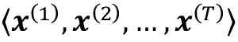。上标索引表示实例的顺序，序列的长度为 *T*。作为序列的一个合理示例，考虑时间序列数据，其中每个示例点 *x*^(^t^) 都属于特定的时间 *t*。*图 15.1* 展示了时间序列数据的一个示例，其中输入特征 (**x**'s) 和目标标签 (**y**'s) 都按照它们的时间轴自然地遵循顺序；因此，**x**'s 和 **y**'s 都是序列。

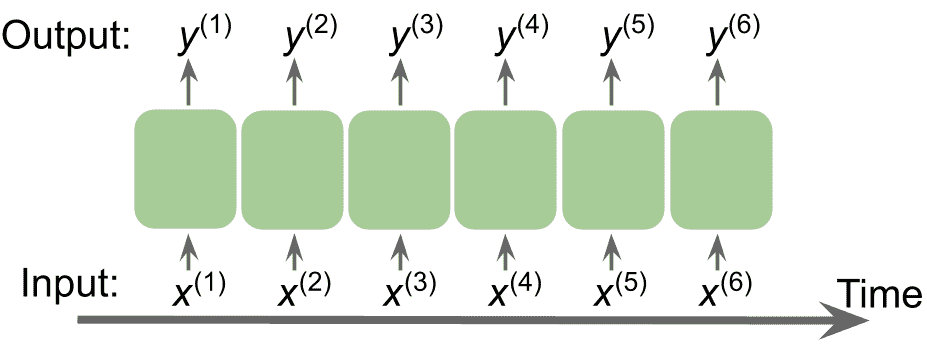

图 15.1：时间序列数据示例

正如我们之前提到的，迄今为止我们涵盖的标准神经网络模型，如多层感知机 (**MLPs**) 和用于图像数据的 CNNs，假定训练示例是相互独立的，因此不包括顺序信息。我们可以说这类模型没有对先前观察到的训练示例有所“记忆”。例如，样本通过前向传播和反向传播步骤，权重独立于处理训练示例的顺序而更新。

相比之下，RNNs 是专为建模序列设计的，能够记忆过去的信息并根据新事件进行处理，这在处理序列数据时是一个明显的优势。

## 序列建模的不同类别

序列建模有许多迷人的应用，例如语言翻译（例如，将文本从英语翻译成德语）、图像字幕和文本生成。然而，为了选择合适的架构和方法，我们必须理解并能够区分这些不同的序列建模任务。*图 15.2*基于 Andrey Karpathy 在 2015 年撰写的优秀文章*循环神经网络的非理性有效性*（[`karpathy.github.io/2015/05/21/rnn-effectiveness/`](http://karpathy.github.io/2015/05/21/rnn-effectiveness/)），总结了依赖于输入和输出数据关系类别的最常见序列建模任务。

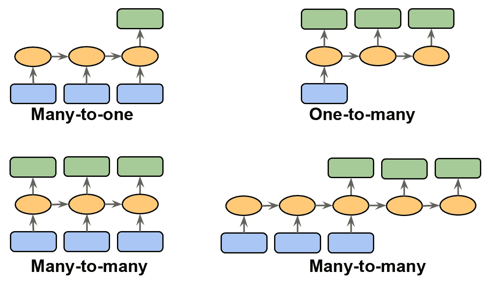

图 15.2：最常见的序列任务

让我们详细讨论输入和输出数据之间不同的关系类别，这些类别在之前的图中已经描述过。如果输入和输出数据都不表示序列，那么我们处理的是标准数据，可以简单地使用多层感知器（或本书中先前介绍过的其他分类模型）来对这些数据进行建模。然而，如果输入或输出是序列之一，建模任务很可能属于以下某一类别：

+   **多对一**：输入数据是一个序列，但输出是一个固定大小的向量或标量，而不是序列。例如，在情感分析中，输入是基于文本的（例如电影评论），而输出是一个类别标签（例如表示评论者是否喜欢电影）。

+   **一对多**：输入数据是标准格式而不是序列，但输出是一个序列。这一类别的一个例子是图像字幕，输入是图像，输出是总结该图像内容的英文短语。

+   **多对多**：输入和输出数组都是序列。这一类别可以进一步根据输入和输出是否同步进行划分。同步多对多建模任务的一个例子是视频分类，其中标记每个视频帧。延迟多对多建模任务的例子是语言翻译，例如，机器必须先读取并处理整个英语句子，然后才能生成其德语翻译。

现在，在总结了序列建模的三大类别之后，我们可以继续讨论 RNN 的结构。

# 用于序列建模的 RNN

在这一节中，在我们开始在 PyTorch 中实现 RNN 之前，我们将讨论 RNN 的主要概念。我们将首先查看典型 RNN 的结构，其中包括一个递归组件来建模序列数据。然后，我们将检查典型 RNN 中如何计算神经元的激活。这将为我们讨论训练 RNN 时面临的常见挑战创造一个背景，然后我们将讨论这些挑战的解决方案，例如 LSTM 和门控循环单元（**GRUs**）。

## 理解 RNN 中的数据流动

让我们从 RNN 的架构开始。*图 15.3*并排显示了标准前馈 NN 和 RNN 的数据流动，以便进行比较：

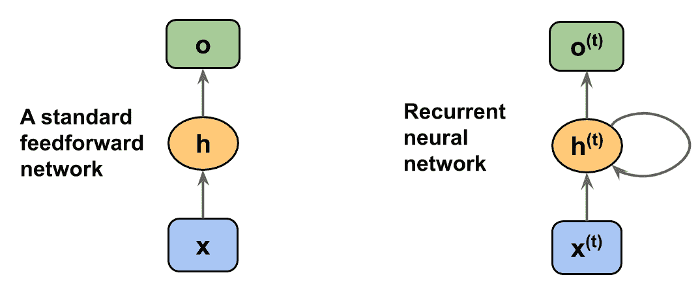

图 15.3：标准前馈 NN 和 RNN 的数据流动

这两个网络都只有一个隐藏层。在这个表示中，单位没有显示出来，但我们假设输入层（**x**），隐藏层（**h**）和输出层（**o**）都是包含许多单元的向量。

**确定 RNN 的输出类型**

这种通用的 RNN 架构可以对应两种序列建模类别，其中输入是一个序列。通常，递归层可以返回一个序列作为输出，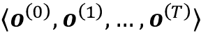，或者仅返回最后一个输出（在*t* = *T*时，即**o**^(^T^)）。因此，它可能是多对多，或者如果例如我们仅使用最后一个元素**o**^(^T^)作为最终输出，那么它可能是多对一。

我们将在后面看到，当我们详细研究具有返回序列输出的递归层行为时，这是如何在 PyTorch 的`torch.nn`模块中处理的。

在标准前馈网络中，信息从输入层流向隐藏层，然后从隐藏层流向输出层。另一方面，在 RNN 中，隐藏层接收来自当前时间步的输入层和上一时间步隐藏层的输入。

隐藏层中相邻时间步的信息流使得网络能够记住过去的事件。这种信息流通常显示为一个循环，也称为图表中的**递归边缘**，这也是这种通用 RNN 架构得名的方式。

类似于多层感知器，RNN 可以由多个隐藏层组成。请注意，将只有一个隐藏层的 RNN 称为*单层 RNN*是一种常见约定，不应与没有隐藏层的单层 NN（如 Adaline 或逻辑回归）混淆。*图 15.4*展示了具有一个隐藏层（顶部）和具有两个隐藏层（底部）的 RNN：

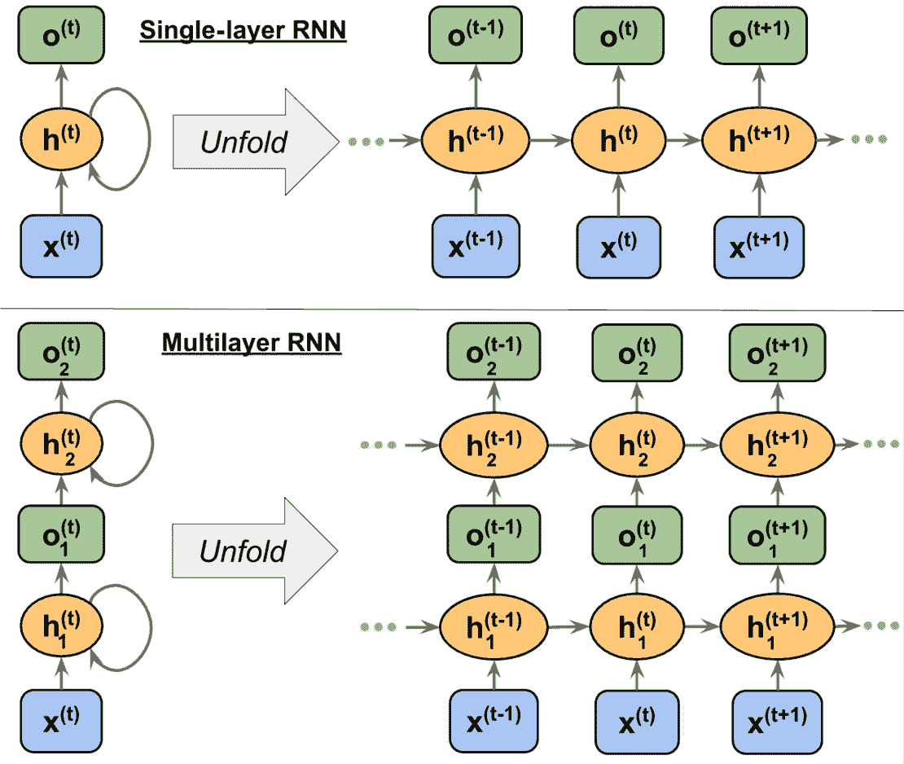

图 15.4：具有一个和两个隐藏层的 RNN 示例

为了检验 RNN 的架构和信息流动，可以展开具有递归边缘的紧凑表示，您可以在*图 15.4*中看到。

正如我们所知，标准 NN 中的每个隐藏单元只接收一个输入——来自输入层的净激活。相比之下，RNN 中的每个隐藏单元接收两个*不同的*输入集——来自输入层的净激活以及前一个时间步*t* – 1 的相同隐藏层的激活。

在第一个时间步*t* = 0 时，隐藏单元被初始化为零或小的随机值。然后，在时间步*t* > 0 时，隐藏单元接收来自当前时间点数据点**x**^(^t^)以及上一个时间步中的隐藏单元值**h**^(^t^(–1))的输入。

类似地，在多层 RNN 的情况下，信息流可以总结如下：

+   *layer* = 1：在这里，隐藏层表示为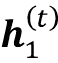，它从数据点**x**^(^t^)以及同一层中但前一个时间步的隐藏值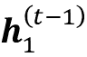接收输入。

+   *layer* = 2：第二隐藏层，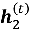，从当前时间步下方图层的输出接收输入（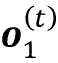），以及其自身在前一个时间步的隐藏值，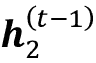。

由于在这种情况下，每个递归层必须接收一个序列作为输入，除了最后一个递归层必须*返回一个序列作为输出*（也就是说，我们稍后必须设置`return_sequences=True`）。最后一个递归层的行为取决于问题的类型。

## 在 RNN 中计算激活值

现在您已经理解了 RNN 中的结构和信息流动的一般流程，让我们更加具体地计算隐藏层的实际激活以及输出层。为简单起见，我们将只考虑单个隐藏层；然而，相同的概念也适用于多层 RNN。

在刚刚查看的 RNN 表示中，每条有向边（连接框之间的连接）都与一个权重矩阵相关联。这些权重不依赖于时间*t*，因此它们在时间轴上是共享的。单层 RNN 中的不同权重矩阵如下：

+   **W**[xh]：输入**x**^(^t^)与隐藏层**h**之间的权重矩阵

+   **W**[hh]：与递归边关联的权重矩阵

+   **W**[ho]：隐藏层与输出层之间的权重矩阵

这些权重矩阵如图 15.5 所示：

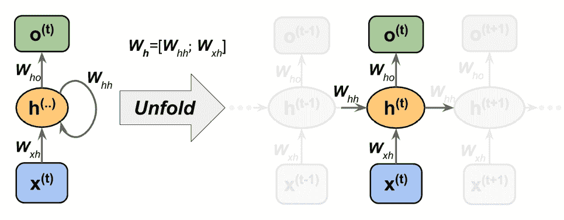

图 15.5：应用权重到单层 RNN

在某些实现中，您可能会注意到权重矩阵**W**[xh]和**W**[hh]被连接成一个组合矩阵**W**[h] = [**W**[xh]; **W**[hh]]。在本节后面，我们将也会使用这种表示法。

计算激活与标准的多层感知器和其他类型的前馈神经网络非常相似。对于隐藏层，净输入 **z**[h]（预激活）通过线性组合计算；即，我们计算权重矩阵与相应向量的乘积的总和，并添加偏置单元：

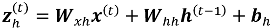

然后，在时间步 *t* 处计算隐藏单元的激活如下：

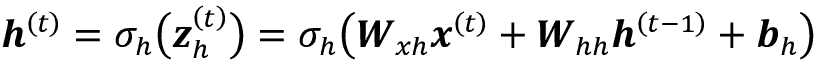

在这里，**b**[h] 是隐藏单元的偏置向量，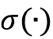 是隐藏层的激活函数。

如果要使用连接的权重矩阵，**W**[h] = [**W**[xh]; **W**[hh]]，则计算隐藏单元的公式将发生变化，如下所示：

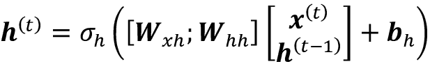

一旦计算了当前时间步的隐藏单元的激活，那么输出单元的激活将按以下方式计算：

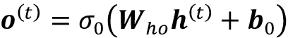

为了进一步澄清，*Figure 15.6* 显示了使用这两种形式计算这些激活的过程：

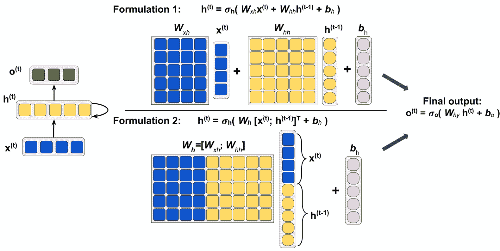

图 15.6：计算激活

**使用时间反向传播（BPTT）训练 RNNs**

RNNs 的学习算法首次在 1990 年引入：*通过时间的反向传播：它的作用及实现方法*（*Paul Werbos*，*IEEE 会议录*，78(10)：1550-1560，1990）。

梯度的推导可能有些复杂，但基本思想是总体损失 *L* 是时间 *t* = 1 到 *t* = *T* 所有损失函数的总和：

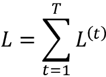

由于时间 *t* 处的损失依赖于所有之前时间步骤 1 : *t* 的隐藏单元，梯度将按以下方式计算：

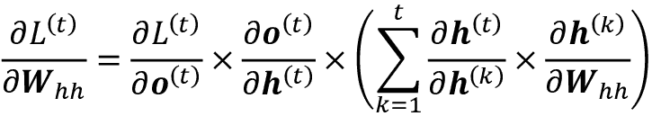

在这里，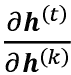 是相邻时间步长的乘积计算：

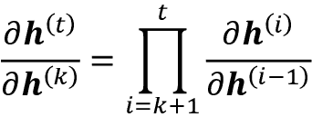

## 隐藏层的递归与输出的递归

到目前为止，您已经看到具有隐藏层递归属性的递归网络。然而，请注意，还存在另一种模型，其中递归连接来自输出层。在这种情况下，从上一个时间步的输出层的净激活 **o**^t^(–1) 可以通过两种方式之一相加：

+   到当前时间步的隐藏层，**h**^t（如在 *Figure 15.7* 中显示的输出到隐藏递归）

+   到当前时间步的输出层，**o**^t（如在 *Figure 15.7* 中显示的输出到输出递归）

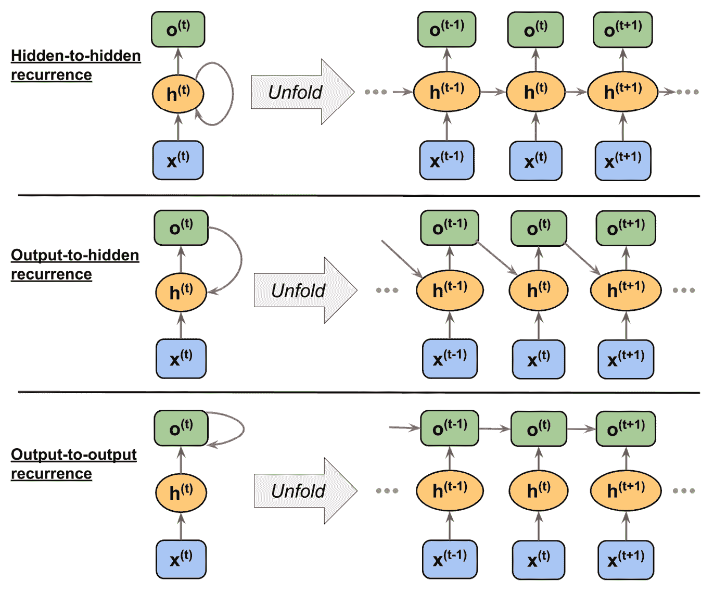

图 15.7：不同的递归连接模型

如*图 15.7*所示，这些架构之间的差异在递归连接中可以清楚地看到。根据我们的符号约定，与递归连接相关的权重将由隐藏到隐藏的递归表示为 **W**[hh]，由输出到隐藏的递归表示为 **W**[oh]，由输出到输出的递归表示为 **W**[oo]。在一些文献中，递归连接相关的权重也被表示为 **W**[rec]。

为了看看这在实践中是如何工作的，让我们手动计算其中一种递归类型的前向传播。使用`torch.nn`模块，可以通过`RNN`定义一个递归层，它类似于隐藏到隐藏的递归。在以下代码中，我们将从`RNN`创建一个递归层，并对长度为 3 的输入序列执行前向传播以计算输出。我们还将手动计算前向传播并将结果与`RNN`的结果进行比较。

首先，让我们创建层，并为我们的手动计算分配权重和偏置：

```py
>>> import torch
>>> import torch.nn as nn
>>> torch.manual_seed(1)
>>> rnn_layer = nn.RNN(input_size=5, hidden_size=2,
...                    num_layers=1, batch_first=True)
>>> w_xh = rnn_layer.weight_ih_l0
>>> w_hh = rnn_layer.weight_hh_l0
>>> b_xh = rnn_layer.bias_ih_l0
>>> b_hh = rnn_layer.bias_hh_l0
>>> print('W_xh shape:', w_xh.shape)
>>> print('W_hh shape:', w_hh.shape)
>>> print('b_xh shape:', b_xh.shape)
>>> print('b_hh shape:', b_hh.shape)
W_xh shape: torch.Size([2, 5])
W_hh shape: torch.Size([2, 2])
b_xh shape: torch.Size([2])
b_hh shape: torch.Size([2]) 
```

这一层的输入形状为`(batch_size, sequence_length, 5)`，其中第一维是批处理维度（因为我们设置了`batch_first=True`），第二维对应于序列，最后一维对应于特征。请注意，我们将输出一个序列，对于长度为 3 的输入序列，将产生输出序列 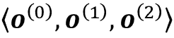。此外，`RNN`默认使用一层，您可以设置`num_layers`来堆叠多个 RNN 层以形成堆叠的 RNN。

现在，我们将在`rnn_layer`上调用前向传播，并手动计算每个时间步长的输出并进行比较：

```py
>>> x_seq = torch.tensor([[1.0]*5, [2.0]*5, [3.0]*5]).float()
>>> ## output of the simple RNN:
>>> output, hn = rnn_layer(torch.reshape(x_seq, (1, 3, 5)))
>>> ## manually computing the output:
>>> out_man = []
>>> for t in range(3):
...     xt = torch.reshape(x_seq[t], (1, 5))
...     print(f'Time step {t} =>')
...     print('   Input           :', xt.numpy())
...     
...     ht = torch.matmul(xt, torch.transpose(w_xh, 0, 1)) + b_hh
...     print('   Hidden          :', ht.detach().numpy()
...     
...     if t > 0:
...         prev_h = out_man[t-1]
...     else:
...         prev_h = torch.zeros((ht.shape))
...     ot = ht + torch.matmul(prev_h, torch.transpose(w_hh, 0, 1)) \
...             + b_hh
...     ot = torch.tanh(ot)
...     out_man.append(ot)
...     print('   Output (manual) :', ot.detach().numpy())
...     print('   RNN output      :', output[:, t].detach().numpy())
...     print()
Time step 0 =>
   Input           : [[1\. 1\. 1\. 1\. 1.]]
   Hidden          : [[-0.4701929  0.5863904]]
   Output (manual) : [[-0.3519801   0.52525216]]
   RNN output      : [[-0.3519801   0.52525216]]
Time step 1 =>
   Input           : [[2\. 2\. 2\. 2\. 2.]]
   Hidden          : [[-0.88883156  1.2364397 ]]
   Output (manual) : [[-0.68424344  0.76074266]]
   RNN output      : [[-0.68424344  0.76074266]]
Time step 2 =>
   Input           : [[3\. 3\. 3\. 3\. 3.]]
   Hidden          : [[-1.3074701  1.886489 ]]
   Output (manual) : [[-0.8649416   0.90466356]]
   RNN output      : [[-0.8649416   0.90466356]] 
```

在我们的手动前向计算中，我们使用了双曲正切（tanh）激活函数，因为它也用于`RNN`（默认激活函数）。正如您从打印的结果中看到的那样，手动前向计算的输出在每个时间步长上与`RNN`层的输出完全匹配。希望这个实际任务能让您对递归网络的奥秘有所启发。

## 学习长程交互的挑战

BPTT（之前简要提到过）引入了一些新的挑战。由于梯度计算中的乘法因子，称为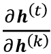，导致了所谓的**消失**和**爆炸**梯度问题的产生。

这些问题通过*图 15.8*中的例子进行了解释，显示了一个仅具有一个隐藏单元的简单 RNN：

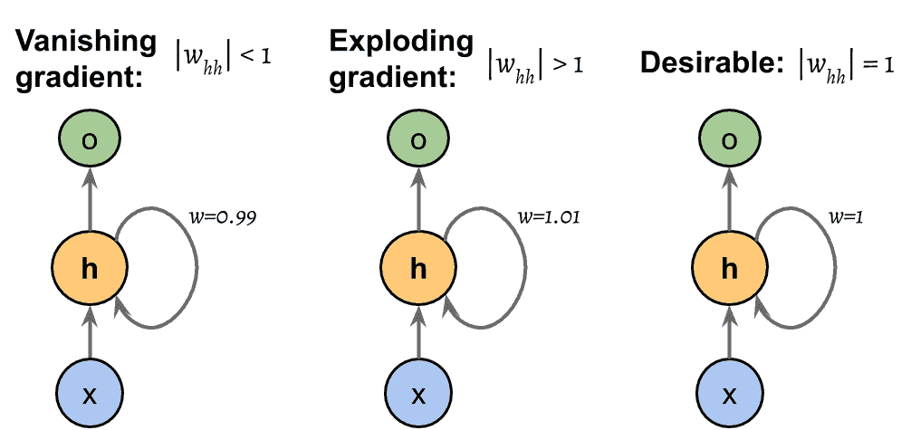

图 15.8：计算损失函数梯度中的问题

基本上，有*t* – *k*个乘法；因此，将权重*w*乘以它自己*t* – *k*次得到因子*w*^t^–^k。因此，如果|*w*| < 1，当*t* – *k*很大时，这个因子变得非常小。另一方面，如果递归边的权重是|*w*| > 1，则当*t* – *k*很大时*w*^t^–^k 变得非常大。请注意，大*t* – *k*指的是长程依赖性。我们可以看到，避免梯度消失或爆炸的一个朴素解决方案是确保|*w*| = 1。如果您有兴趣并且希望更详细地研究这一点，请阅读*R. Pascanu*，*T. Mikolov*和*Y. Bengio*在 2012 年发表的论文*《On the difficulty of training recurrent neural networks》*（[`arxiv.org/pdf/1211.5063.pdf`](https://arxiv.org/pdf/1211.5063.pdf)）。

在实践中，至少有三种解决方案：

+   梯度裁剪

+   **截断时间反向传播**（**TBPTT**）

+   LSTM

使用梯度裁剪，我们为梯度指定了一个截断或阈值，并将超过此值的梯度赋予此截断值。相比之下，TBPTT 仅限制了每次前向传递后信号能够反向传播的时间步数。例如，即使序列有 100 个元素或步骤，我们也只能反向传播最近的 20 个时间步。

尽管梯度裁剪和 TBPTT 都可以解决梯度爆炸问题，但截断限制了梯度能够有效流动和适当更新权重的步数。另一方面，1997 年由 Sepp Hochreiter 和 Jürgen Schmidhuber 设计的 LSTM 通过使用记忆细胞在建模长程依赖性时更为成功地解决了梯度消失和爆炸问题。让我们更详细地讨论 LSTM。

## 长短期记忆细胞

正如之前所述，LSTM 最初是为了解决梯度消失问题而引入的（*长短期记忆*，由*S. Hochreiter*和*J. Schmidhuber*，*Neural Computation*，9(8)：1735-1780，1997 年提出）。LSTM 的构建模块是一个**记忆细胞**，它本质上表示或替代标准 RNN 的隐藏层。

在每个记忆细胞中，都有一个具有理想权重*w* = 1 的递归边，正如我们讨论过的，用来解决梯度消失和爆炸问题。与这个递归边相关联的值被统称为**细胞状态**。现代 LSTM 细胞的展开结构如图*15.9*所示：

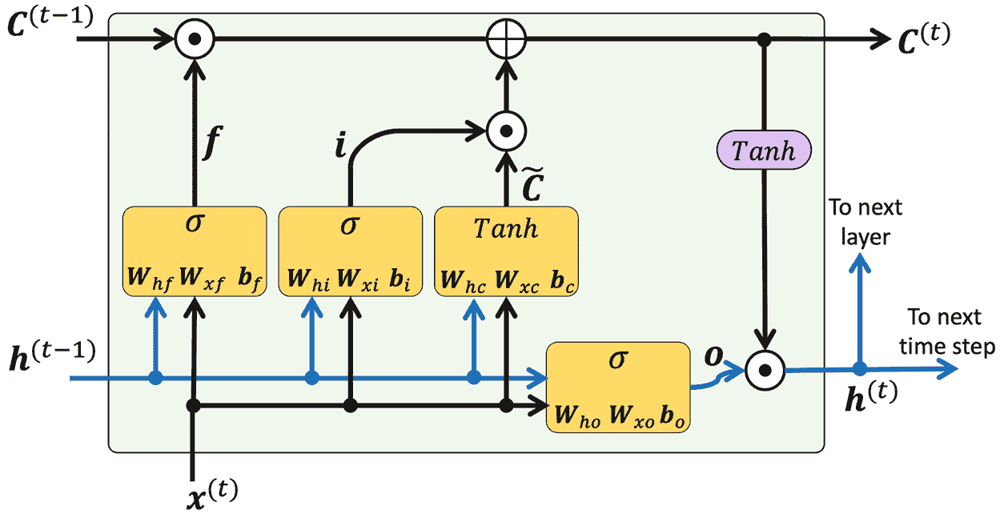

图 15.9：LSTM 细胞的结构

请注意，从上一个时间步骤的细胞状态 **C**^(^t^(–1)) 修改为获取当前时间步骤的细胞状态 **C**^(^t^)，而不直接乘以任何权重因子。这个记忆单元中的信息流由几个计算单元（通常称为*门*）控制，这些将在这里描述。在图中， 指代**逐元素乘积**， 表示**逐元素求和**。此外，**x**^(^t^) 指时间 *t* 的输入数据，**h**^(^t^(–1)) 表示时间 *t* – 1 的隐藏单元。有四个框指示激活函数，可以是 sigmoid 函数（）或 tanh，以及一组权重；这些框通过在它们的输入（**h**^(^t^(–1)) 和 **x**^(^t^)）上执行矩阵-向量乘法来应用线性组合。这些具有 sigmoid 激活函数的计算单元，其输出单元通过  传递，称为门。

在 LSTM 单元中，有三种不同类型的门，称为遗忘门、输入门和输出门：

**遗忘门**（**f**[t]）允许记忆单元在不无限增长的情况下重置细胞状态。实际上，遗忘门决定了哪些信息允许通过，哪些信息被抑制。现在，**f**[t] 计算如下：

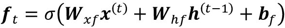

注意，遗忘门并不是最初的 LSTM 单元的一部分；几年后才添加，以改进原始模型（《忘记学习：连续预测与 LSTM》作者 *F. Gers*、*J. Schmidhuber* 和 *F. Cummins*，*神经计算 12*，2451-2471，2000 年）。

**输入门**（**i**[t]）和**候选值**（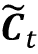）负责更新细胞状态。它们的计算如下：

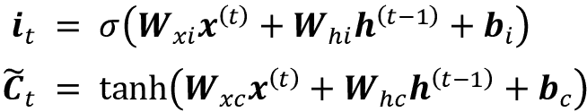

时间 *t* 的细胞状态计算如下：

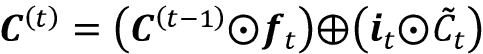

**输出门**（**o**[t]）决定如何更新隐藏单元的值：

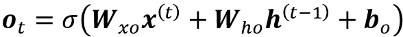

给定这一点，当前时间步骤的隐藏单元计算如下：

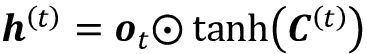

LSTM 单元的结构及其底层计算可能看起来非常复杂且难以实现。然而，好消息是 PyTorch 已经用优化的包装函数实现了一切，这使我们可以轻松高效地定义我们的 LSTM 单元。我们将在本章后面将 RNN 和 LSTM 应用于实际数据集。

**其他高级 RNN 模型**

LSTM 提供了一种基本方法来建模序列中的长期依赖性。然而，值得注意的是，文献中描述了许多 LSTM 的变体（*Rafal Jozefowicz*，*Wojciech Zaremba*和*Ilya Sutskever*的 *An Empirical Exploration of Recurrent Network Architectures*，*ICML 会议论文*，2015 年，第 2342-2350 页）。还值得注意的是，2014 年提出了更近期的方法，**门控循环单元**（**GRU**）。GRU 比 LSTM 具有更简单的架构，因此在计算上更高效，而在某些任务（如多声部音乐建模）中，它们的性能与 LSTM 相当。如果您有兴趣了解这些现代 RNN 架构的更多信息，请参考 *Junyoung Chung* 等人的论文，*Empirical Evaluation of Gated Recurrent Neural Networks on Sequence Modeling*，2014 年（[`arxiv.org/pdf/1412.3555v1.pdf`](https://arxiv.org/pdf/1412.3555v1.pdf)）。

# 在 PyTorch 中实现序列建模的 RNN

现在我们已经讨论了 RNN 背后的基本理论，我们准备进入本章更加实际的部分：在 PyTorch 中实现 RNN。在本章的其余部分，我们将将 RNN 应用于两个常见的问题任务：

1.  情感分析

1.  语言建模

我们将在接下来的页面一起步入的这两个项目，既有趣又复杂。因此，我们将代码实现分成几个步骤，并详细讨论代码，而不是一次性提供所有代码。如果您想要有一个全局视图，并在深入讨论之前先看到所有代码，请首先查看代码实现。

## 第一个项目——预测 IMDb 电影评论的情感

您可能还记得在 *第八章* *将机器学习应用于情感分析* 中，情感分析关注于分析句子或文本文档的表达意见。在本节和接下来的子节中，我们将使用多层 RNN 实现情感分析，采用多对一架构。

在接下来的部分，我们将实现一个用于语言建模的多对多 RNN 应用。虽然所选择的示例故意简单，以介绍 RNN 的主要概念，但语言建模有广泛的有趣应用，例如构建聊天机器人——让计算机直接与人类进行对话和交互。

### 准备电影评论数据

在 *第八章* 中，我们对评论数据集进行了预处理和清洗。现在我们将做同样的事情。首先，我们将导入必要的模块，并从 `torchtext` 中读取数据（我们将通过 `pip install torchtext` 进行安装；截至 2021 年末，版本为 0.10.0）如下：

```py
>>> from torchtext.datasets import IMDB
>>> train_dataset = IMDB(split='train')
>>> test_dataset = IMDB(split='test') 
```

每个集合包含 25,000 个样本。每个数据集样本由两个元素组成，情感标签表示我们想要预测的目标标签（`neg` 表示负面情感，`pos` 表示正面情感），以及电影评论文本（输入特征）。这些电影评论的文本部分是单词序列，RNN 模型将每个序列分类为正面（`1`）或负面（`0`）评论。

在将数据输入到 RNN 模型之前，我们需要执行几个预处理步骤：

1.  将训练数据集分割为单独的训练和验证分区。

1.  识别训练数据集中的唯一单词

1.  将每个唯一单词映射到唯一整数，并将评论文本编码为编码整数（每个唯一单词的索引）。

1.  将数据集分割为小批量作为模型的输入。

让我们继续进行第一步：从我们之前读取的 `train_dataset` 创建训练和验证分区：

```py
>>> ## Step 1: create the datasets
>>> from torch.utils.data.dataset import random_split
>>> torch.manual_seed(1)
>>> train_dataset, valid_dataset = random_split(
...     list(train_dataset), [20000, 5000]) 
```

原始训练数据集包含 25,000 个示例。随机选择 20,000 个示例用于训练，5,000 个用于验证。

为了准备数据以输入到 NN，我们需要将其编码为数字值，如 *步骤 2* 和 *3* 中提到的那样。为此，我们首先将找到训练数据集中的唯一单词（标记）。虽然查找唯一标记是一个可以使用 Python 数据集完成的过程，但使用 Python 标准库中的 `collections` 包中的 `Counter` 类可能更有效。

在下面的代码中，我们将实例化一个新的 `Counter` 对象（`token_counts`），它将收集唯一单词的频率。请注意，在这种特定的应用程序中（与词袋模型相反），我们只关注唯一单词集合，而不需要单词计数，这些计数是作为副产品创建的。为了将文本分割成单词（或标记），我们将重用在 *第八章* 中开发的 `tokenizer` 函数，该函数还会移除 HTML 标记以及标点符号和其他非字母字符：

收集唯一标记的代码如下：

```py
>>> ## Step 2: find unique tokens (words)
>>> import re
>>> from collections import Counter, OrderedDict
>>> 
>>> def tokenizer(text):
...     text = re.sub('<[^>]*>', '', text)
...     emoticons = re.findall(
...         '(?::|;|=)(?:-)?(?:\)|\(|D|P)', text.lower()
...     )
...     text = re.sub('[\W]+', ' ', text.lower()) +\
...         ' '.join(emoticons).replace('-', '')
...     tokenized = text.split()
...     return tokenized
>>> 
>>> token_counts = Counter()
>>> for label, line in train_dataset:
...     tokens = tokenizer(line)
...     token_counts.update(tokens)
>>> print('Vocab-size:', len(token_counts))
Vocab-size: 69023 
```

如果您想了解更多关于 `Counter` 的信息，请参阅其文档：[`docs.python.org/3/library/collections.html#collections.Counter`](https://docs.python.org/3/library/collections.html#collections.Counter)。

接下来，我们将把每个唯一单词映射到一个唯一整数。这可以通过手动使用 Python 字典完成，其中键是唯一标记（单词），与每个键关联的值是唯一整数。然而，`torchtext` 包已经提供了一个名为 `Vocab` 的类，我们可以使用它来创建这样一个映射并对整个数据集进行编码。首先，我们将通过传递将标记映射到其相应出现频率的有序字典（有序字典是排序后的 `token_counts`）来创建一个 `vocab` 对象。其次，我们将在词汇表中添加两个特殊标记 – 填充和未知标记：

```py
>>> ## Step 3: encoding each unique token into integers
>>> from torchtext.vocab import vocab
>>> sorted_by_freq_tuples = sorted(
...     token_counts.items(), key=lambda x: x[1], reverse=True
... )
>>> ordered_dict = OrderedDict(sorted_by_freq_tuples)
>>> vocab = vocab(ordered_dict)
>>> vocab.insert_token("<pad>", 0)
>>> vocab.insert_token("<unk>", 1)
>>> vocab.set_default_index(1) 
```

为了演示如何使用 `vocab` 对象，我们将把一个示例输入文本转换为整数值列表：

```py
>>> print([vocab[token] for token in ['this', 'is',
...     'an', 'example']])
[11, 7, 35, 457] 
```

请注意，验证或测试数据中可能有些标记不在训练数据中，因此未包含在映射中。如果我们有 *q* 个标记（即传递给 `Vocab` 的 `token_counts` 的大小，在本例中为 69,023），那么所有以前未见过的标记，因此未包含在 `token_counts` 中，将被分配整数 1（未知标记的占位符）。换句话说，索引 1 保留给未知词。另一个保留值是整数 0，用作调整序列长度的占位符，即所谓的 *填充标记*。稍后，在 PyTorch 中构建 RNN 模型时，我们将详细考虑这个占位符 0。

我们可以定义 `text_pipeline` 函数来相应地转换数据集中的每个文本，以及 `label_pipeline` 函数来将每个标签转换为 1 或 0：

```py
>>> ## Step 3-A: define the functions for transformation
>>> text_pipeline =\
...      lambda x: [vocab[token] for token in tokenizer(x)]
>>> label_pipeline = lambda x: 1\. if x == 'pos' else 0. 
```

我们将使用 `DataLoader` 生成样本批次，并将先前声明的数据处理流水线传递给 `collate_fn` 参数。我们将文本编码和标签转换函数封装到 `collate_batch` 函数中：

```py
>>> ## Step 3-B: wrap the encode and transformation function
... def collate_batch(batch):
...     label_list, text_list, lengths = [], [], []
...     for _label, _text in batch:
...         label_list.append(label_pipeline(_label))
...         processed_text = torch.tensor(text_pipeline(_text),
...                                       dtype=torch.int64)
...         text_list.append(processed_text)
...         lengths.append(processed_text.size(0))
...     label_list = torch.tensor(label_list)
...     lengths = torch.tensor(lengths)
...     padded_text_list = nn.utils.rnn.pad_sequence(
...         text_list, batch_first=True)
...     return padded_text_list, label_list, lengths
>>> 
>>> ## Take a small batch
>>> from torch.utils.data import DataLoader
>>> dataloader = DataLoader(train_dataset, batch_size=4,
...                         shuffle=False, collate_fn=collate_batch) 
```

到目前为止，我们已经将单词序列转换为整数序列，并将 `pos` 或 `neg` 的标签转换为 1 或 0。然而，我们需要解决一个问题——当前序列的长度不同（如在执行以下代码对四个示例进行操作后所示）。尽管通常 RNN 可以处理不同长度的序列，但我们仍然需要确保一个小批量中的所有序列具有相同的长度，以便在张量中有效地存储它们。

PyTorch 提供了一个高效的方法，`pad_sequence()`，它会自动使用占位值（0）填充要合并到批次中的连续元素，以便批次中的所有序列具有相同的形状。在前面的代码中，我们已经从训练数据集中创建了一个小批量大小的数据加载器，并应用了 `collate_batch` 函数，该函数本身包含了 `pad_sequence()` 调用。

然而，为了说明填充的工作原理，我们将取第一个批次并打印单个元素在合并这些元素成小批次之前的大小，以及生成的小批次的维度：

```py
>>> text_batch, label_batch, length_batch = next(iter(dataloader))
>>> print(text_batch)
tensor([[   35,  1742,     7,   449,   723,     6,   302,     4,
...
0,     0,     0,     0,     0,     0,     0,     0]],
>>> print(label_batch)
tensor([1., 1., 1., 0.])
>>> print(length_batch)
tensor([165,  86, 218, 145])
>>> print(text_batch.shape)
torch.Size([4, 218]) 
```

正如您从打印的张量形状中可以观察到的那样，第一个批次的列数为 218，这是将前四个示例合并为单个批次并使用这些示例的最大大小得到的结果。这意味着该批次中的其他三个示例（它们的长度分别为 165、86 和 145）将根据需要进行填充，以匹配此大小。

最后，让我们将所有三个数据集分成批量大小为 32 的数据加载器：

```py
>>> batch_size = 32
>>> train_dl = DataLoader(train_dataset, batch_size=batch_size,
...                       shuffle=True, collate_fn=collate_batch)
>>> valid_dl = DataLoader(valid_dataset, batch_size=batch_size,
...                       shuffle=False, collate_fn=collate_batch)
>>> test_dl = DataLoader(test_dataset, batch_size=batch_size,
...                      shuffle=False, collate_fn=collate_batch) 
```

现在，数据已经处于适合 RNN 模型的格式中，我们将在接下来的小节中实现它。但是，在下一小节中，我们首先讨论特征**嵌入**，这是一个可选但强烈推荐的预处理步骤，用于减少词向量的维度。

### 用于句子编码的嵌入层

在前一步骤的数据准备过程中，我们生成了相同长度的序列。这些序列的元素是整数，对应于唯一单词的*索引*。这些单词索引可以以多种方式转换为输入特征。一个天真的方法是应用独热编码，将索引转换为由零和一组成的向量。然后，每个单词将被映射到一个向量，其大小为整个数据集中唯一单词的数量。考虑到唯一单词的数量（词汇表的大小）可能在 10⁴ 至 10⁵的数量级，这也将是我们输入特征的数量，模型在这些特征上训练可能会受到**维度诅咒**的影响。此外，这些特征非常稀疏，因为除了一个之外，所有都是零。

更加优雅的方法是将每个单词映射到一个固定大小、具有实值元素（不一定是整数）的向量中。与独热编码向量相比，我们可以使用有限大小的向量来表示无限数量的实数。 （理论上，我们可以从给定区间（例如[-1, 1]）中提取无限的实数。）

这就是嵌入的概念，它是一种特征学习技术，我们可以利用它来自动学习表示数据集中单词的显著特征。鉴于唯一单词的数量，*n*[words]，我们可以选择嵌入向量的大小（即嵌入维度），远小于唯一单词的数量（*embedding_dim* << *n*[words]），以表示整个词汇表作为输入特征。

嵌入与独热编码相比的优势如下：

+   通过减少特征空间的维度来减少维度诅咒的影响

+   由于 NN 中的嵌入层可以被优化（或学习），所以可以提取显著特征

以下示意图表示了嵌入如何工作，通过将标记索引映射到可训练的嵌入矩阵：

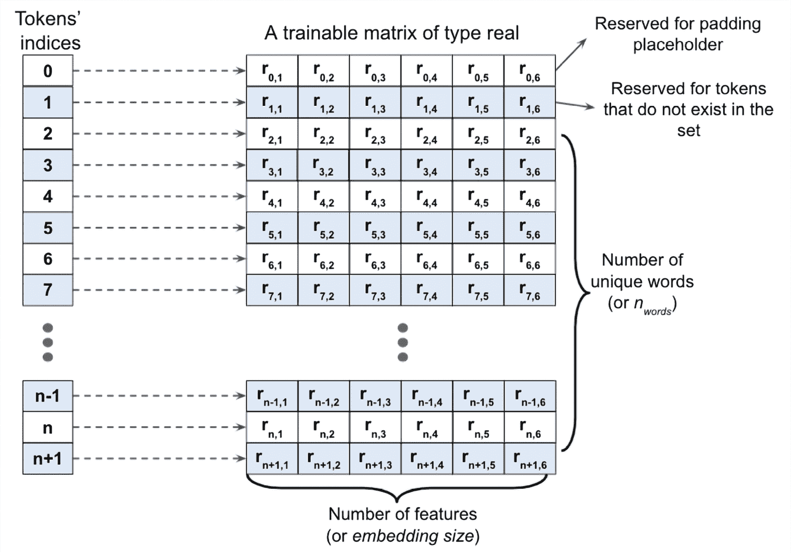

图 15.10: 嵌入式工作原理的分解

给定大小为*n* + 2 的一组标记（*n*为标记集的大小，加上索引 0 保留为填充占位符，1 为不在标记集中的词），将创建一个大小为（*n* + 2）× *embedding_dim*的嵌入矩阵，其中矩阵的每一行表示与一个标记相关联的数值特征。因此，当整数索引*i*作为嵌入的输入时，它将查找矩阵中索引*i*对应的行，并返回数值特征。嵌入矩阵充当我们 NN 模型的输入层。在实践中，可以简单地使用`nn.Embedding`来创建一个嵌入层。让我们看一个例子，我们将创建一个嵌入层，并将其应用于一个包含两个样本的批处理，如下所示：

```py
>>> embedding = nn.Embedding(
...     num_embeddings=10,
...     embedding_dim=3,
...     padding_idx=0)
>>> # a batch of 2 samples of 4 indices each
>>> text_encoded_input = torch.LongTensor([[1,2,4,5],[4,3,2,0]])
>>> print(embedding(text_encoded_input))
tensor([[[-0.7027,  0.3684, -0.5512],
         [-0.4147,  1.7891, -1.0674],
         [ 1.1400,  0.1595, -1.0167],
         [ 0.0573, -1.7568,  1.9067]],
        [[ 1.1400,  0.1595, -1.0167],
         [-0.8165, -0.0946, -0.1881],
         [-0.4147,  1.7891, -1.0674],
         [ 0.0000,  0.0000,  0.0000]]], grad_fn=<EmbeddingBackward>) 
```

此模型的输入（嵌入层）必须具有二维的 rank，维度为*batchsize* × *input_length*，其中*input_length*是序列的长度（这里为 4）。例如，小批量中的一个输入序列可以是<1, 5, 9, 2>，其中每个元素是唯一单词的索引。输出将具有维度*batchsize* × *input_length* × *embedding_dim*，其中*embedding_dim*是嵌入特征的大小（这里设置为 3）。提供给嵌入层的另一个参数`num_embeddings`对应于模型将接收的唯一整数值（例如，*n* + 2，在这里设置为 10）。因此，在这种情况下，嵌入矩阵的大小为 10×6。

`padding_idx`指示填充的标记索引（这里为 0），如果指定，将在训练期间不会对其进行梯度更新。在我们的例子中，第二个样本的原始序列长度为 3，我们用 1 个额外的元素 0 进行了填充。填充元素的嵌入输出为[0, 0, 0]。

### 构建一个 RNN 模型

现在我们可以构建一个 RNN 模型。使用`nn.Module`类，我们可以将嵌入层、RNN 的递归层和完全连接的非递归层组合在一起。对于递归层，我们可以使用以下任意一种实现：

+   `RNN`：常规的 RNN 层，即全连接递归层

+   `LSTM`：长短期记忆 RNN，用于捕捉长期依赖性

+   `GRU`：具有门控递归单元的递归层，作为 LSTM 的替代方案，由*K. Cho*等人在*Learning Phrase Representations Using RNN Encoder–Decoder for Statistical Machine Translation*中提出（2014 年）([`arxiv.org/abs/1406.1078v3`](https://arxiv.org/abs/1406.1078v3))

要查看如何使用这些递归层之一构建多层 RNN 模型，请看下面的例子，我们将创建一个包含两个`RNN`递归层的 RNN 模型。最后，我们将添加一个非递归完全连接层作为输出层，该层将返回单个输出值作为预测：

```py
>>> class RNN(nn.Module):
...     def __init__(self, input_size, hidden_size):
...         super().__init__()
...         self.rnn = nn.RNN(input_size, hidden_size, num_layers=2,
...                           batch_first=True)
...         # self.rnn = nn.GRU(input_size, hidden_size, num_layers,
...         #                   batch_first=True)
...         # self.rnn = nn.LSTM(input_size, hidden_size, num_layers,
...         #                    batch_first=True)
...         self.fc = nn.Linear(hidden_size, 1)
...
...     def forward(self, x):
...         _, hidden = self.rnn(x)
...         out = hidden[-1, :, :] # we use the final hidden state
...                                # from the last hidden layer as
...                                # the input to the fully connected
...                                # layer
...         out = self.fc(out)
...         return out
>>>
>>> model = RNN(64, 32)
>>> print(model)
>>> model(torch.randn(5, 3, 64))
RNN(
  (rnn): RNN(64, 32, num_layers=2, batch_first=True)
  (fc): Linear(in_features=32, out_features=1, bias=True)
)
tensor([[ 0.0010],
        [ 0.2478],
        [ 0.0573],
        [ 0.1637],
        [-0.0073]], grad_fn=<AddmmBackward>) 
```

正如您所看到的，使用这些循环层构建 RNN 模型非常简单。在下一个小节中，我们将回到情感分析任务，并建立一个 RNN 模型来解决这个问题。

### 为情感分析任务构建 RNN 模型

因为我们有非常长的序列，所以我们将使用 LSTM 层来考虑长期效应。我们将创建一个用于情感分析的 RNN 模型，从产生特征大小为 20 的词嵌入的嵌入层开始（`embed_dim=20`）。然后，将添加类型为 LSTM 的递归层。最后，我们将添加一个全连接层作为隐藏层，另一个全连接层作为输出层，通过逻辑 sigmoid 激活返回单个类成员概率值作为预测：

```py
>>> class RNN(nn.Module):
...     def __init__(self, vocab_size, embed_dim, rnn_hidden_size,
...                  fc_hidden_size):
...         super().__init__()
...         self.embedding = nn.Embedding(vocab_size,
...                                       embed_dim,
...                                       padding_idx=0)
...         self.rnn = nn.LSTM(embed_dim, rnn_hidden_size,
...                            batch_first=True)
...         self.fc1 = nn.Linear(rnn_hidden_size, fc_hidden_size)
...         self.relu = nn.ReLU()
...         self.fc2 = nn.Linear(fc_hidden_size, 1)
...         self.sigmoid = nn.Sigmoid()
...
...     def forward(self, text, lengths):
...         out = self.embedding(text)
...         out = nn.utils.rnn.pack_padded_sequence(
...             out, lengths.cpu().numpy(), enforce_sorted=False, batch_first=True
...         )
...         out, (hidden, cell) = self.rnn(out)
...         out = hidden[-1, :, :]
...         out = self.fc1(out)
...         out = self.relu(out)
...         out = self.fc2(out)
...         out = self.sigmoid(out)
...         return out
>>> 
>>> vocab_size = len(vocab)
>>> embed_dim = 20
>>> rnn_hidden_size = 64
>>> fc_hidden_size = 64
>>> torch.manual_seed(1)
>>> model = RNN(vocab_size, embed_dim,
                rnn_hidden_size, fc_hidden_size)
>>> model
RNN(
  (embedding): Embedding(69025, 20, padding_idx=0)
  (rnn): LSTM(20, 64, batch_first=True)
  (fc1): Linear(in_features=64, out_features=64, bias=True)
  (relu): ReLU()
  (fc2): Linear(in_features=64, out_features=1, bias=True)
  (sigmoid): Sigmoid()
) 
```

现在我们将开发 `train` 函数，在给定数据集上训练模型一个 epoch，并返回分类准确率和损失值：

```py
>>> def train(dataloader):
...     model.train()
...     total_acc, total_loss = 0, 0
...     for text_batch, label_batch, lengths in dataloader:
...         optimizer.zero_grad()
...         pred = model(text_batch, lengths)[:, 0]
...         loss = loss_fn(pred, label_batch)
...         loss.backward()
...         optimizer.step()
...         total_acc += (
...             (pred >= 0.5).float() == label_batch
...         ).float().sum().item()
...         total_loss += loss.item()*label_batch.size(0)
...     return total_acc/len(dataloader.dataset), \
...            total_loss/len(dataloader.dataset) 
```

同样地，我们将开发 `evaluate` 函数来衡量模型在给定数据集上的表现：

```py
>>> def evaluate(dataloader):
...     model.eval()
...     total_acc, total_loss = 0, 0
...     with torch.no_grad():
...         for text_batch, label_batch, lengths in dataloader:
...             pred = model(text_batch, lengths)[:, 0]
...             loss = loss_fn(pred, label_batch)
...             total_acc += (
...                 (pred>=0.5).float() == label_batch
...             ).float().sum().item()
...             total_loss += loss.item()*label_batch.size(0)
...     return total_acc/len(dataloader.dataset), \
...            total_loss/len(dataloader.dataset) 
```

下一步是创建损失函数和优化器（Adam 优化器）。对于具有单个类成员概率输出的二元分类，我们使用二元交叉熵损失 (`BCELoss`) 作为损失函数：

```py
>>> loss_fn = nn.BCELoss()
>>> optimizer = torch.optim.Adam(model.parameters(), lr=0.001) 
```

现在我们将对模型进行 10 个 epochs 的训练，并显示训练和验证的表现：

```py
>>> num_epochs = 10
>>> torch.manual_seed(1)
>>> for epoch in range(num_epochs):
...     acc_train, loss_train = train(train_dl)
...     acc_valid, loss_valid = evaluate(valid_dl)
...     print(f'Epoch {epoch} accuracy: {acc_train:.4f}'
...           f' val_accuracy: {acc_valid:.4f}')
Epoch 0 accuracy: 0.5843 val_accuracy: 0.6240
Epoch 1 accuracy: 0.6364 val_accuracy: 0.6870
Epoch 2 accuracy: 0.8020 val_accuracy: 0.8194
Epoch 3 accuracy: 0.8730 val_accuracy: 0.8454
Epoch 4 accuracy: 0.9092 val_accuracy: 0.8598
Epoch 5 accuracy: 0.9347 val_accuracy: 0.8630
Epoch 6 accuracy: 0.9507 val_accuracy: 0.8636
Epoch 7 accuracy: 0.9655 val_accuracy: 0.8654
Epoch 8 accuracy: 0.9765 val_accuracy: 0.8528
Epoch 9 accuracy: 0.9839 val_accuracy: 0.8596 
```

在对测试数据进行 10 个 epochs 的训练后，我们将对其进行评估：

```py
>>> acc_test, _ = evaluate(test_dl)
>>> print(f'test_accuracy: {acc_test:.4f}')
test_accuracy: 0.8512 
```

它显示了 85% 的准确率。（请注意，与 IMDb 数据集上使用的最先进方法相比，这个结果并不是最好的。目标只是展示 PyTorch 中 RNN 的工作原理。）

#### 关于双向 RNN 的更多信息

此外，我们将设置 `LSTM` 的 `bidirectional` 配置为 `True`，这将使递归层通过输入序列的正向和反向两个方向进行传递：

```py
>>> class RNN(nn.Module):
...     def __init__(self, vocab_size, embed_dim,
...                  rnn_hidden_size, fc_hidden_size):
...         super().__init__()
...         self.embedding = nn.Embedding(
...             vocab_size, embed_dim, padding_idx=0
...         )
...         self.rnn = nn.LSTM(embed_dim, rnn_hidden_size,
...                            batch_first=True, bidirectional=True)
...         self.fc1 = nn.Linear(rnn_hidden_size*2, fc_hidden_size)
...         self.relu = nn.ReLU()
...         self.fc2 = nn.Linear(fc_hidden_size, 1)
...         self.sigmoid = nn.Sigmoid()
...
...     def forward(self, text, lengths):
...         out = self.embedding(text)
...         out = nn.utils.rnn.pack_padded_sequence(
...             out, lengths.cpu().numpy(), enforce_sorted=False, batch_first=True
...         )
...         _, (hidden, cell) = self.rnn(out)
...         out = torch.cat((hidden[-2, :, :],
...                          hidden[-1, :, :]), dim=1)
...         out = self.fc1(out)
...         out = self.relu(out)
...         out = self.fc2(out)
...         out = self.sigmoid(out)
...         return out
>>> 
>>> torch.manual_seed(1)
>>> model = RNN(vocab_size, embed_dim,
...             rnn_hidden_size, fc_hidden_size)
>>> model
RNN(
  (embedding): Embedding(69025, 20, padding_idx=0)
  (rnn): LSTM(20, 64, batch_first=True, bidirectional=True)
  (fc1): Linear(in_features=128, out_features=64, bias=True)
  (relu): ReLU()
  (fc2): Linear(in_features=64, out_features=1, bias=True)
  (sigmoid): Sigmoid()
) 
```

双向 RNN 层使每个输入序列经过两次传递：正向传递和反向传递（请注意，这与反向传播的正向和反向传递的上下文不同）。这些正向和反向传递的隐藏状态通常被连接成一个单一的隐藏状态。其他合并模式包括求和、乘积（将两次传递的结果相乘）和平均值（取两者的平均值）。

我们还可以尝试其他类型的递归层，比如常规的`RNN`。然而，事实证明，使用常规递归层构建的模型无法达到良好的预测性能（即使在训练数据上）。例如，如果您尝试将前面代码中的双向 LSTM 层替换为单向的`nn.RNN`层（而不是`nn.LSTM`），并且在完整长度的序列上训练模型，您可能会观察到损失在训练过程中甚至不会减少。原因是数据集中的序列太长，因此具有`RNN`层的模型无法学习长期依赖关系，并可能遭遇梯度消失或梯度爆炸问题。

## 项目二 – 在 PyTorch 中进行字符级语言建模

语言建模是一种迷人的应用，它使机器能够执行与人类语言相关的任务，例如生成英文句子。在这个领域的一个有趣研究是*Ilya Sutskever*、*James Martens*和*Geoffrey E. Hinton*的文章*Generating Text with Recurrent Neural Networks*，发表于 2011 年的第 28 届国际机器学习会议（ICML-11）([`pdfs.semanticscholar.org/93c2/0e38c85b69fc2d2eb314b3c1217913f7db11.pdf`](https://pdfs.semanticscholar.org/93c2/0e38c85b69fc2d2eb314b3c1217913f7db11.pdf))。

在我们即将构建的模型中，输入是一个文本文档，我们的目标是开发一个能够生成与输入文档风格类似的新文本的模型。这样的输入示例包括书籍或特定编程语言的计算机程序。

在字符级语言建模中，输入被分解为一个字符序列，逐个字符输入到我们的网络中。网络将每个新字符与先前看到的字符的记忆一起处理，以预测下一个字符。

*图 15.11*显示了字符级语言建模的一个示例（注意 EOS 代表“序列结束”）：

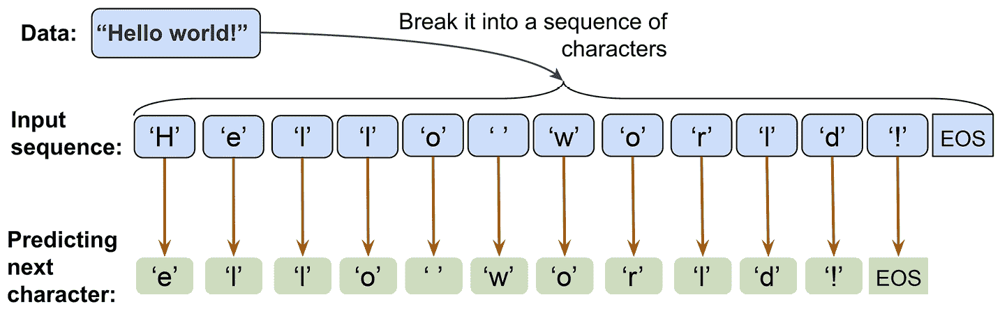

图 15.11：字符级语言建模

我们可以将这个实现分解成三个单独的步骤：准备数据，构建 RNN 模型，以及进行下一个字符预测和抽样，以生成新的文本。

### 数据集预处理

在本节中，我们将为字符级语言建模准备数据。

要获取输入数据，请访问古腾堡计划网站 [`www.gutenberg.org/`](https://www.gutenberg.org/)，该网站提供数千本免费电子书。例如，您可以从 [`www.gutenberg.org/files/1268/1268-0.txt`](https://www.gutenberg.org/files/1268/1268-0.txt) 下载儒勒·凡尔纳（于 1874 年出版）的书籍《神秘岛》的纯文本格式版本。

请注意，此链接将直接带您到下载页面。如果您使用的是 macOS 或 Linux 操作系统，您可以使用终端中的以下命令下载文件：

```py
curl -O https://www.gutenberg.org/files/1268/1268-0.txt 
```

如果将来此资源不可用，本章节代码目录中也包含了此文本的副本，位于书籍代码库的[`github.com/rasbt/machine-learning-book`](https://github.com/rasbt/machine-learning-book)。

一旦我们下载了数据集，我们可以将其作为纯文本读入 Python 会话。使用以下代码，我们将直接从下载的文件中读取文本，并删除开头和结尾的部分（这些部分包含 Gutenberg 项目的某些描述）。然后，我们将创建一个 Python 变量`char_set`，表示在这个文本中观察到的*唯一*字符集：

```py
>>> import numpy as np
>>> ## Reading and processing text
>>> with open('1268-0.txt', 'r', encoding="utf8") as fp:
...     text=fp.read()
>>> start_indx = text.find('THE MYSTERIOUS ISLAND')
>>> end_indx = text.find('End of the Project Gutenberg')
>>> text = text[start_indx:end_indx]
>>> char_set = set(text)
>>> print('Total Length:', len(text))
Total Length: 1112350
>>> print('Unique Characters:', len(char_set))
Unique Characters: 80 
```

在下载和预处理文本之后，我们总共有 1,112,350 个字符的序列，其中包含 80 个唯一字符。然而，大多数神经网络库和 RNN 实现无法处理字符串格式的输入数据，因此我们必须将文本转换为数值格式。为此，我们将创建一个简单的 Python 字典，将每个字符映射到一个整数`char2int`。我们还需要一个反向映射，将我们模型的结果转换回文本。虽然可以使用一个将整数键与字符值关联的字典来执行反向映射，但是使用 NumPy 数组并索引该数组以将索引映射到这些唯一字符更为高效。*图 15.12*展示了将字符转换为整数以及对单词`"Hello"`和`"world"`进行反向映射的示例：

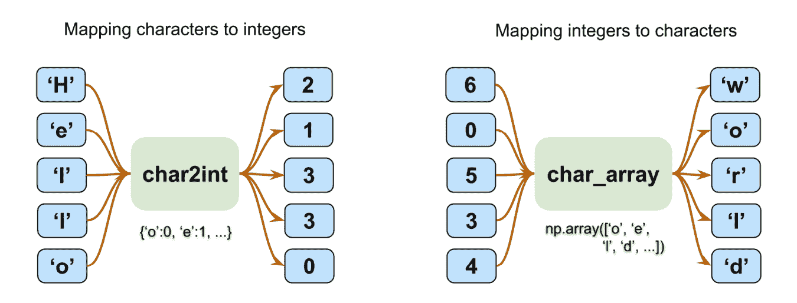

图 15.12: 字符和整数映射

构建将字符映射到整数的字典，并通过索引 NumPy 数组进行反向映射，如前面的图所示，如下所示：

```py
>>> chars_sorted = sorted(char_set)
>>> char2int = {ch:i for i,ch in enumerate(chars_sorted)}
>>> char_array = np.array(chars_sorted)
>>> text_encoded = np.array(
...     [char2int[ch] for ch in text],
...     dtype=np.int32
... )
>>> print('Text encoded shape:', text_encoded.shape)
Text encoded shape: (1112350,)
>>> print(text[:15], '== Encoding ==>', text_encoded[:15])
>>> print(text_encoded[15:21], '== Reverse ==>',
...       ''.join(char_array[text_encoded[15:21]]))
THE MYSTERIOUS == Encoding ==> [44 32 29  1 37 48 43 44 29 42 33 39 45 43  1]
[33 43 36 25 38 28] == Reverse ==> ISLAND 
```

`text_encoded` NumPy 数组包含文本中所有字符的编码值。现在，我们将打印出这个数组中前五个字符的映射：

```py
>>> for ex in text_encoded[:5]:
...     print('{} -> {}'.format(ex, char_array[ex]))
44 -> T
32 -> H
29 -> E
1 ->  
37 -> M 
```

现在，让我们退后一步，看看我们试图做的大局。对于文本生成任务，我们可以将问题描述为一个分类任务。

假设我们有一组不完整的文本字符序列，如*图 15.13*所示：

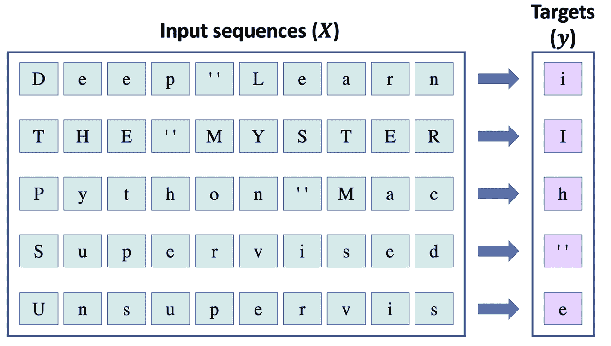

图 15.13: 预测文本序列的下一个字符

在*图 15.13*中，我们可以将左侧框中显示的序列视为输入。为了生成新的文本，我们的目标是设计一个模型，该模型可以预测给定输入序列的下一个字符，其中输入序列代表不完整的文本。例如，看到“Deep Learn”后，模型应该预测下一个字符是“i”。鉴于我们有 80 个唯一字符，这个问题成为了一个多类别分类任务。

从长度为 1 的序列开始（即一个单一字母），我们可以根据这种多类别分类方法迭代地生成新的文本，如*图 15.14*所示：

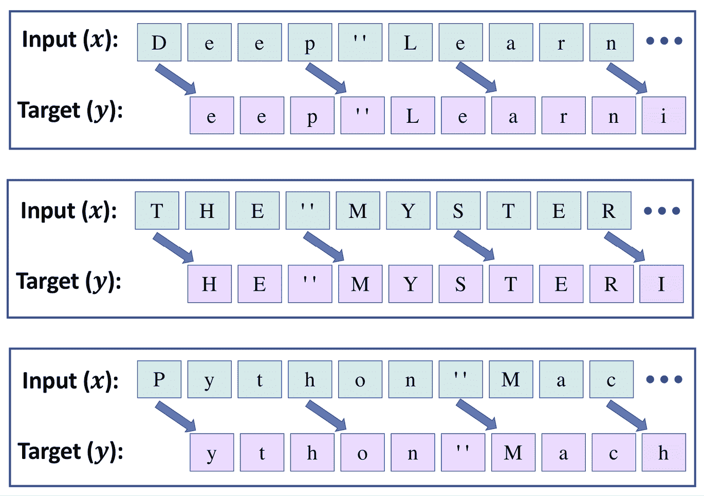

图 15.14: 基于这种多类别分类方法生成下一个文本

要在 PyTorch 中实现文本生成任务，让我们首先将序列长度剪切为 40。这意味着输入张量 **x** 由 40 个标记组成。在实践中，序列长度影响生成文本的质量。较长的序列可能会导致更有意义的句子。然而，对于较短的序列，模型可能会更专注于正确捕捉单个单词，而忽略大部分上下文。虽然较长的序列通常会产生更有意义的句子，但正如前面提到的，对于长序列，RNN 模型可能难以捕捉长距离的依赖关系。因此，在实践中找到适当的序列长度是一个需要经验评估的超参数优化问题。在这里，我们选择 40，因为它提供了一个良好的折衷。

正如您在前面的图中所看到的，输入 **x** 和目标 **y** 相差一个字符。因此，我们将文本分割成大小为 41 的块：前 40 个字符将形成输入序列 **x**，最后的 40 个元素将形成目标序列 **y**。

我们已经将整个编码文本按其原始顺序存储在 `text_encoded` 中。我们将首先创建由每个包含 41 个字符的文本块组成的文本块。如果最后一个块少于 41 个字符，我们将删除它。因此，被命名为 `text_chunks` 的新文本块数据集将始终包含大小为 41 的序列。这些 41 个字符的块将用于构建序列 **x**（即输入）和序列 **y**（即目标），它们都将包含 40 个元素。例如，序列 **x** 将由索引 [0, 1, ..., 39] 的元素组成。此外，由于序列 **y** 将相对于 **x** 向后移动一个位置，其对应的索引将是 [1, 2, ..., 40]。然后，我们将通过应用自定义的 `Dataset` 类将结果转换为 `Dataset` 对象：

```py
>>> import torch
>>> from torch.utils.data import Dataset
>>> seq_length = 40
>>> chunk_size = seq_length + 1
>>> text_chunks = [text_encoded[i:i+chunk_size]
...                for i in range(len(text_encoded)-chunk_size)]
>>> from torch.utils.data import Dataset
>>> class TextDataset(Dataset):
...     def __init__(self, text_chunks):
...         self.text_chunks = text_chunks
...
...     def __len__(self):
...         return len(self.text_chunks)
...
...     def __getitem__(self, idx):
...         text_chunk = self.text_chunks[idx]
...         return text_chunk[:-1].long(), text_chunk[1:].long()
>>>
>>> seq_dataset = TextDataset(torch.tensor(text_chunks)) 
```

让我们来看看从转换后的数据集中提取的一些示例序列：

```py
>>> for i, (seq, target) in enumerate(seq_dataset):
...     print(' Input (x): ',
...           repr(''.join(char_array[seq])))
...     print('Target (y): ',
...           repr(''.join(char_array[target])))
...     print()
...     if i == 1:
...         break
 Input (x): 'THE MYSTERIOUS ISLAND ***\n\n\n\n\nProduced b'
Target (y): 'HE MYSTERIOUS ISLAND ***\n\n\n\n\nProduced by'
 Input (x): 'HE MYSTERIOUS ISLAND ***\n\n\n\n\nProduced by'
Target (y): 'E MYSTERIOUS ISLAND ***\n\n\n\n\nProduced by ' 
```

最后，准备数据集的最后一步是将该数据集转换为小批次：

```py
>>> from torch.utils.data import DataLoader
>>> batch_size = 64
>>> torch.manual_seed(1)
>>> seq_dl = DataLoader(seq_dataset, batch_size=batch_size,
...                     shuffle=True, drop_last=True) 
```

### 构建字符级 RNN 模型

现在数据集准备好了，构建模型将相对简单：

```py
>>> import torch.nn as nn
>>> class RNN(nn.Module):
...     def __init__(self, vocab_size, embed_dim, rnn_hidden_size):
...         super().__init__()
...         self.embedding = nn.Embedding(vocab_size, embed_dim)
...         self.rnn_hidden_size = rnn_hidden_size
...         self.rnn = nn.LSTM(embed_dim, rnn_hidden_size,
...                            batch_first=True)
...         self.fc = nn.Linear(rnn_hidden_size, vocab_size)
...
...     def forward(self, x, hidden, cell):
...         out = self.embedding(x).unsqueeze(1)
...         out, (hidden, cell) = self.rnn(out, (hidden, cell))
...         out = self.fc(out).reshape(out.size(0), -1)
...         return out, hidden, cell
...
...     def init_hidden(self, batch_size):
...         hidden = torch.zeros(1, batch_size, self.rnn_hidden_size)
...         cell = torch.zeros(1, batch_size, self.rnn_hidden_size)
...         return hidden, cell 
```

请注意，我们需要将模型的输出设定为 logits，以便我们可以从模型预测中进行采样，以生成新的文本。我们稍后会涉及到这个采样部分。

然后，我们可以指定模型参数并创建一个 RNN 模型：

```py
>>> vocab_size = len(char_array)
>>> embed_dim = 256
>>> rnn_hidden_size = 512
>>> torch.manual_seed(1)
>>> model = RNN(vocab_size, embed_dim, rnn_hidden_size)
>>> model
RNN(
  (embedding): Embedding(80, 256)
  (rnn): LSTM(256, 512, batch_first=True)
  (fc): Linear(in_features=512, out_features=80, bias=True)
  (softmax): LogSoftmax(dim=1)
) 
```

接下来的步骤是创建损失函数和优化器（Adam 优化器）。对于单个 logits 输出的多类别分类（我们有 `vocab_size=80` 类），我们使用 `CrossEntropyLoss` 作为损失函数：

```py
>>> loss_fn = nn.CrossEntropyLoss()
>>> optimizer = torch.optim.Adam(model.parameters(), lr=0.001) 
```

现在我们将对模型进行 10,000 个周期的训练。在每个周期中，我们将从数据加载器 `seq_dl` 中随机选择一个批次进行训练。我们还将每 500 个周期显示一次训练损失：

```py
>>> num_epochs = 10000
>>> torch.manual_seed(1)
>>> for epoch in range(num_epochs):
...     hidden, cell = model.init_hidden(batch_size)
...     seq_batch, target_batch = next(iter(seq_dl))
...     optimizer.zero_grad()
...     loss = 0
...     for c in range(seq_length):
...         pred, hidden, cell = model(seq_batch[:, c], hidden, cell)
...         loss += loss_fn(pred, target_batch[:, c])
...     loss.backward()
...     optimizer.step()
...     loss = loss.item()/seq_length
...     if epoch % 500 == 0:
...         print(f'Epoch {epoch} loss: {loss:.4f}')
Epoch 0 loss: 1.9689
Epoch 500 loss: 1.4064
Epoch 1000 loss: 1.3155
Epoch 1500 loss: 1.2414
Epoch 2000 loss: 1.1697
Epoch 2500 loss: 1.1840
Epoch 3000 loss: 1.1469
Epoch 3500 loss: 1.1633
Epoch 4000 loss: 1.1788
Epoch 4500 loss: 1.0828
Epoch 5000 loss: 1.1164
Epoch 5500 loss: 1.0821
Epoch 6000 loss: 1.0764
Epoch 6500 loss: 1.0561
Epoch 7000 loss: 1.0631
Epoch 7500 loss: 0.9904
Epoch 8000 loss: 1.0053
Epoch 8500 loss: 1.0290
Epoch 9000 loss: 1.0133
Epoch 9500 loss: 1.0047 
```

接下来，我们可以评估模型以生成新文本，从给定的短字符串开始。 在下一节中，我们将定义一个函数来评估训练好的模型。

### 评估阶段 – 生成新的文本段落

我们在前一节训练的 RNN 模型为每个独特字符返回大小为 80 的对数。 这些对数可以通过 softmax 函数轻松转换为概率，即特定字符将被遇到作为下一个字符的概率。 为了预测序列中的下一个字符，我们可以简单地选择具有最大对数值的元素，这相当于选择具有最高概率的字符。 但是，我们不希望总是选择具有最高可能性的字符，而是希望（随机）*从输出中抽样*；否则，模型将始终生成相同的文本。 PyTorch 已经提供了一个类，`torch.distributions.categorical.Categorical`，我们可以使用它从分类分布中绘制随机样本。 看看这是如何工作的，让我们从三个类别 [0, 1, 2] 中生成一些随机样本，使用输入对数 [1, 1, 1]：

```py
>>> from torch.distributions.categorical import Categorical
>>> torch.manual_seed(1)
>>> logits = torch.tensor([[1.0, 1.0, 1.0]])
>>> print('Probabilities:',
...       nn.functional.softmax(logits, dim=1).numpy()[0])
Probabilities: [0.33333334 0.33333334 0.33333334]
>>> m = Categorical(logits=logits)
>>> samples = m.sample((10,))
>>> print(samples.numpy())
[[0]
 [0]
 [0]
 [0]
 [1]
 [0]
 [1]
 [2]
 [1]
 [1]] 
```

正如您所见，给定的对数，各类别具有相同的概率（即，等概率类别）。 因此，如果我们使用大样本量（*num_samples* → ∞），我们期望每个类别的出现次数达到样本大小的 ≈ 1/3。 如果我们将对数更改为 [1, 1, 3]，那么我们预期会观察到更多类别 2 的出现次数（当从该分布中抽取大量示例时）：

```py
>>> torch.manual_seed(1)
>>> logits = torch.tensor([[1.0, 1.0, 3.0]])
>>> print('Probabilities:', nn.functional.softmax(logits, dim=1).numpy()[0])
Probabilities: [0.10650698 0.10650698 0.78698605]
>>> m = Categorical(logits=logits)
>>> samples = m.sample((10,))
>>> print(samples.numpy())
[[0]
 [2]
 [2]
 [1]
 [2]
 [1]
 [2]
 [2]
 [2]
 [2]] 
```

使用 `Categorical`，我们可以基于模型计算的对数生成示例。

我们将定义一个函数，`sample()`，接收一个短起始字符串，`starting_str`，并生成一个新字符串，`generated_str`，最初设置为输入字符串。 `starting_str` 被编码为一系列整数，`encoded_input`。 `encoded_input` 逐个字符传递给 RNN 模型以更新隐藏状态。 `encoded_input` 的最后一个字符传递给模型以生成新字符。注意，RNN 模型的输出表示下一个字符的对数（这里是一个大小为 80 的向量，即可能字符的总数）。

在这里，我们仅使用 `logits` 输出（即，**o**^(^T^)），传递给 `Categorical` 类以生成一个新样本。 这个新样本被转换为一个字符，然后附加到生成的字符串 `generated_text` 的末尾，使其长度增加 1。 然后，此过程重复，直到生成字符串的长度达到所需值。 将生成序列作为生成新元素的输入消耗的过程称为**自回归**。

`sample()` 函数的代码如下所示：

```py
>>> def sample(model, starting_str,
...            len_generated_text=500,
...            scale_factor=1.0):
...     encoded_input = torch.tensor(
...         [char2int[s] for s in starting_str]
...     )
...     encoded_input = torch.reshape(
...         encoded_input, (1, -1)
...     )
...     generated_str = starting_str
...
...     model.eval()
...     hidden, cell = model.init_hidden(1)
...     for c in range(len(starting_str)-1):
...         _, hidden, cell = model(
...             encoded_input[:, c].view(1), hidden, cell
...         )
...    
...     last_char = encoded_input[:, -1]
...     for i in range(len_generated_text):
...         logits, hidden, cell = model(
...             last_char.view(1), hidden, cell
...         )
...         logits = torch.squeeze(logits, 0)
...         scaled_logits = logits * scale_factor
...         m = Categorical(logits=scaled_logits)
...         last_char = m.sample()
...         generated_str += str(char_array[last_char])
...
...     return generated_str 
```

现在让我们生成一些新文本：

```py
>>> torch.manual_seed(1)
>>> print(sample(model, starting_str='The island'))
The island had been made
and ovylore with think, captain?" asked Neb; "we do."
It was found, they full to time to remove. About this neur prowers, perhaps ended? It is might be
rather rose?"
"Forward!" exclaimed Pencroft, "they were it? It seems to me?"
"The dog Top--"
"What can have been struggling sventy."
Pencroft calling, themselves in time to try them what proves that the sailor and Neb bounded this tenarvan's feelings, and then
still hid head a grand furiously watched to the dorner nor his only 
```

正如您所见，模型生成的大多数词汇是正确的，有时甚至部分句子是有意义的。您可以进一步调整训练参数，例如训练的输入序列长度和模型架构。

此外，为了控制生成样本的可预测性（即根据训练文本学习模式生成文本与增加更多随机性之间的权衡），RNN 模型计算的 logits 可以在传递给`Categorical`进行抽样之前进行缩放。缩放因子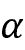可以类比于物理学中的温度。较高的温度导致更多的熵或随机性，而较低的温度则导致更可预测的行为。通过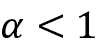缩放 logits，softmax 函数计算出的概率变得更加均匀，如下面的代码所示：

```py
>>> logits = torch.tensor([[1.0, 1.0, 3.0]])
>>> print('Probabilities before scaling:        ',
...       nn.functional.softmax(logits, dim=1).numpy()[0])
>>> print('Probabilities after scaling with 0.5:',
...       nn.functional.softmax(0.5*logits, dim=1).numpy()[0])
>>> print('Probabilities after scaling with 0.1:',
...       nn.functional.softmax(0.1*logits, dim=1).numpy()[0])
Probabilities before scaling:         [0.10650698 0.10650698 0.78698604]
Probabilities after scaling with 0.5: [0.21194156 0.21194156 0.57611688]
Probabilities after scaling with 0.1: [0.31042377 0.31042377 0.37915245] 
```

正如您所见，通过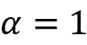缩放 logits，生成的概率几乎是均匀的[0.31, 0.31, 0.38]。现在，我们可以将生成的文本与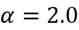和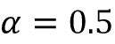进行比较，如下所示：

+   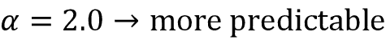：

    ```py
    >>> torch.manual_seed(1)
    >>> print(sample(model, starting_str='The island',
    ...              scale_factor=2.0))
    The island is one of the colony?" asked the sailor, "there is not to be able to come to the shores of the Pacific."
    "Yes," replied the engineer, "and if it is not the position of the forest, and the marshy way have been said, the dog was not first on the shore, and
    found themselves to the corral.
    The settlers had the sailor was still from the surface of the sea, they were not received for the sea. The shore was to be able to inspect the windows of Granite House.
    The sailor turned the sailor was the hor 
    ```

+   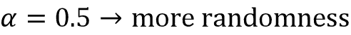：

    ```py
    >>> torch.manual_seed(1)
    >>> print(sample(model, starting_str='The island',
    ...              scale_factor=0.5))
    The island
    deep incomele.
    Manyl's', House, won's calcon-sglenderlessly," everful ineriorouins., pyra" into
    truth. Sometinivabes, iskumar gave-zen."
    Bleshed but what cotch quadrap which little cedass
    fell oprely
    by-andonem. Peditivall--"i dove Gurgeon. What resolt-eartnated to him
    ran trail.
    Withinhe)tiny turns returned, after owner plan bushelsion lairs; they were
    know? Whalerin branch I
    pites, Dougg!-iteun," returnwe aid masses atong thoughts! Dak,
    Hem-arches yone, Veay wantzer? Woblding,
    Herbert, omep 
    ```

结果显示，使用（增加温度）来缩放 logits 会生成更随机的文本。生成的文本的新颖性与其正确性之间存在权衡。

在本节中，我们进行了字符级文本生成的工作，这是一个序列到序列（seq2seq）建模任务。虽然这个例子本身可能不是非常有用，但很容易想到这些模型的几个实用应用，例如，类似的 RNN 模型可以训练成为一个聊天机器人，以帮助用户解决简单的查询问题。

# 概要

在本章中，您首先了解了使序列不同于其他类型数据（如结构化数据或图像）的特性。然后，我们介绍了用于序列建模的 RNN 的基础知识。您了解了基本 RNN 模型的工作原理，并讨论了其在捕获序列数据中的长期依赖性方面的局限性。接下来，我们介绍了 LSTM 单元，它包括一个门控机制，用于减少基本 RNN 模型中常见的爆炸梯度和消失梯度问题的影响。

在讨论了 RNN 的主要概念之后，我们使用 PyTorch 实现了几个具有不同循环层的 RNN 模型。特别是，我们实现了用于情感分析的 RNN 模型，以及用于生成文本的 RNN 模型。

在下一章中，我们将看到如何通过引入注意力机制来增强 RNN，帮助其模拟翻译任务中的长距离依赖关系。然后，我们将介绍一种称为*transformer*的新深度学习架构，该架构最近在自然语言处理领域推动了技术前沿。

# 加入我们书籍的 Discord 空间

加入该书的 Discord 工作区，与作者进行每月的*问我任何事*会话：

[`packt.link/MLwPyTorch`](https://packt.link/MLwPyTorch)


