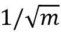

# 第十六章：变压器 - 使用注意机制改进自然语言处理

在上一章中，我们了解了关于**循环神经网络**（**RNNs**）及其在**自然语言处理**（**NLP**）中的应用，通过一个情感分析项目。然而，最近出现了一种新的架构，已被证明在几个 NLP 任务中优于基于 RNN 的**序列到序列**（**seq2seq**）模型。这就是所谓的**变压器**架构。

变压器已经彻底改变了自然语言处理，并在许多引人注目的应用中处于前沿，从自动语言翻译（[`ai.googleblog.com/2020/06/recent-advances-in-google-translate.html`](https://ai.googleblog.com/2020/06/recent-advances-in-google-translate.html)）到对蛋白质序列的基本属性建模（[`www.pnas.org/content/118/15/e2016239118.short`](https://www.pnas.org/content/118/15/e2016239118.short)）以及创建帮助人们编写代码的 AI（[`github.blog/2021-06-29-introducing-github-copilot-ai-pair-programmer`](https://github.blog/2021-06-29-introducing-github-copilot-ai-pair-programmer)）。

在本章中，您将了解*注意力*和*自注意力*的基本机制，并看到它们如何在原始变压器架构中使用。然后，掌握了变压器的工作原理后，我们将探索从这种架构中出现的一些最有影响力的 NLP 模型，并学习如何在 PyTorch 中使用大规模语言模型，即所谓的 BERT 模型。

我们将涵盖以下主题：

+   使用注意机制改进 RNN

+   引入独立的自注意力机制

+   理解原始变压器架构

+   比较基于变压器的大规模语言模型

+   为情感分类微调 BERT

# 将注意机制添加到 RNN 中

在本节中，我们讨论开发**注意机制**背后的动机，这有助于预测模型更专注于输入序列的某些部分，以及它最初是如何在 RNN 的背景下使用的。请注意，本节提供了一个历史视角，解释了为什么开发注意机制。如果个别数学细节显得复杂，可以放心跳过，因为这些对于接下来的章节并不需要，而后者将重点介绍变压器中的自注意力机制解释。

## 注意帮助 RNN 访问信息

要理解注意机制的发展，请考虑传统的 RNN 模型，例如用于语言翻译等**seq2seq 任务**，它在生成翻译之前会解析整个输入序列（例如一个或多个句子），如*图 16.1*所示：


图 16.1：用于 seq2seq 建模任务的传统 RNN 编码器-解码器架构

为什么 RNN 在生成第一个输出之前要解析整个输入句子？这是因为逐字翻译句子很可能导致语法错误，如图 16.2 所示：


图 16.2：逐字翻译句子可能导致语法错误

然而，正如图 16.2 所示，这种 seq2seq 方法的一个局限性在于 RNN 试图通过一个单一的隐藏单元记住整个输入序列再进行翻译。将所有信息压缩到一个隐藏单元中可能会导致信息丢失，特别是对于长序列。因此，类似于人类翻译句子的方式，每个时间步骤都可以访问整个输入序列可能是有益的。

与普通的循环神经网络相比，注意力机制允许循环神经网络在每个时间步访问所有输入元素。然而，每个时间步访问所有输入序列元素可能会很复杂。因此，为了帮助循环神经网络集中精力处理输入序列中最相关的元素，注意力机制为每个输入元素分配不同的注意力权重。这些注意力权重指定了在特定时间步骤上给定输入序列元素的重要性或相关性。例如，重新审视*图 16.2*，单词“mir, helfen, zu”可能比“kannst, du, Satz”对生成输出词“help”更相关。

下一小节介绍了一种带有注意力机制的 RNN 架构，以帮助处理用于语言翻译的长序列。

## 用于 RNN 的原始注意力机制

在本小节中，我们将总结最初用于语言翻译的注意力机制的机制，并首次出现在以下论文中：*Neural Machine Translation by Jointly Learning to Align and Translate*，作者为*Bahdanau, D., Cho, K., and Bengio, Y.,* 2014，[`arxiv.org/abs/1409.0473`](https://arxiv.org/abs/1409.0473)。

给定一个输入序列 ，注意力机制为每个元素 （或者更具体地说，它的隐藏表示）分配一个权重，并帮助模型确定它应该专注于输入的哪一部分。例如，假设我们的输入是一个句子，具有较大权重的单词对我们理解整个句子更有贡献。图 16.3 中带有注意力机制的 RNN（模仿前述论文）说明了生成第二个输出词的整体概念：


图 16.3：带有注意力机制的 RNN

图中描述的基于注意力的架构由两个 RNN 模型组成，我们将在下一小节中解释。

## 使用双向 RNN 处理输入

*图 16.3* 中基于注意力的 RNN 中的第一个 RNN（RNN #1）是一个双向 RNN，生成上下文向量 。可以将上下文向量视为输入向量  的增强版本。换句话说，输入向量  还通过注意力机制从所有其他输入元素获取信息。如 *图 16.3* 所示，RNN #2 然后使用由 RNN #1 准备的这个上下文向量生成输出。在本小节的其余部分，我们将讨论 RNN #1 的工作原理，并在下一小节重新审视 RNN #2。

双向 RNN #1 处理输入序列 *x* 的正向（）和反向（）两个方向。以反向顺序解析序列与反转原始输入序列效果相同，可以将其理解为逆序阅读句子。这样做的原理是为了捕捉额外的信息，因为当前的输入可能依赖于句子中之前或之后的序列元素，或者两者都有。

因此，通过两次读取输入序列（即正向和反向），我们为每个输入序列元素得到两个隐藏状态。例如，对于第二个输入序列元素 ，我们从正向传递得到隐藏状态 ，从反向传递得到隐藏状态 。然后，这两个隐藏状态被拼接成隐藏状态 。例如，如果  和  都是 128 维向量，则拼接后的隐藏状态  将包含 256 个元素。我们可以将这个拼接的隐藏状态视为源词的“注释”，因为它包含了双向阅读中第 *j* 个词的信息。

在接下来的小节中，我们将看到如何进一步处理和使用第二个 RNN 生成输出的这些拼接隐藏状态。

## 从上下文向量生成输出

在 *图 16.3* 中，我们可以将 RNN #2 视为生成输出的主要 RNN。除了隐藏状态外，它还接收所谓的上下文向量作为输入。上下文向量  是拼接隐藏状态  的加权版本，这些隐藏状态是我们在前一小节从 RNN #1 获取的。我们可以计算第 *i* 个输入的上下文向量为加权求和：


在这里， 表示对输入序列  的注意力权重，用于第 *i* 个输入序列元素的上下文。注意，每个第 *i* 个输入序列元素都有一组唯一的注意力权重。我们将在下一小节讨论注意力权重  的计算方法。

在本小节的其余部分，让我们讨论通过前述图中的第二个 RNN（RNN #2）如何使用上下文向量。就像普通的 RNN 一样，RNN #2 也使用隐藏状态。考虑到前述的“注释”和最终输出之间的隐藏层，让我们将时间  处的隐藏状态表示为 。现在，RNN #2 在每个时间步 *i* 接收上述的上下文向量  作为输入。

在*图 16.3*中，我们看到隐藏状态  取决于前一个隐藏状态 、前一个目标词  和上下文向量 ，这些用于生成目标词  在时间 *i* 处的预测输出。请注意，序列向量  指的是代表输入序列  的正确翻译的序列向量，在训练期间可用。在训练期间，真实标签（单词）  被馈送到下一个状态 ；由于这个真实标签信息在预测（推断）时不可用，我们改为馈送预测输出 ，如前图所示。

总结我们刚刚讨论的内容，基于注意力的 RNN 由两个 RNN 组成。RNN #1 从输入序列元素准备上下文向量，而 RNN #2 将上下文向量作为输入接收。上下文向量通过对输入进行加权求和来计算，其中权重是注意力权重 。下一小节讨论如何计算这些注意力权重。

## 计算注意力权重

最后，让我们访问我们谜题中的最后一块遗失的部分——注意力权重。因为这些权重成对连接输入（注释）和输出（上下文），每个注意力权重  都有两个下标：*j* 指的是输入的索引位置，*i* 对应输出的索引位置。注意力权重  是对齐分数  的归一化版本，其中对齐分数评估了位置 *j* 周围的输入与位置 *i* 处的输出匹配的程度。更具体地说，注意力权重通过以下方式计算归一化的对齐分数：


请注意，这个方程式类似于我们在*第十二章*的*PyTorch 中的神经网络训练并行化*中讨论过的 softmax 函数，在*通过 softmax 函数估计多类分类中的类概率*小节。因此，注意力权重 ... 总和为 1。

现在，总结一下，我们可以将基于注意力的 RNN 模型结构化为三个部分。第一部分计算输入的双向注释。第二部分包括循环块，与原始 RNN 非常相似，只是使用上下文向量代替原始输入。最后一部分涉及注意力权重和上下文向量的计算，描述每对输入和输出元素之间的关系。

变压器架构也利用注意力机制，但与基于注意力的 RNN 不同，它仅依赖于自注意力机制，并且不包括 RNN 中发现的循环过程。换句话说，变压器模型一次处理整个输入序列，而不是逐个元素地读取和处理序列。在接下来的小节中，我们将介绍自注意力机制的基本形式，然后在下一小节中更详细地讨论变压器架构。

# 引入自注意力机制

在前一小节中，我们看到注意力机制可以帮助 RNN 在处理长序列时记住上下文。正如我们将在下一小节中看到的那样，我们可以有一个完全基于注意力而非循环部分的架构。这种基于注意力的架构被称为**变压器**，我们将在后面更详细地讨论它。

实际上，变压器一开始看起来可能有点复杂。因此，在我们在下一小节讨论变压器之前，让我们先深入探讨变压器中使用的**自注意力**机制。实际上，正如我们将看到的，这种自注意力机制只是我们在前一小节讨论的注意力机制的另一种形式。我们可以将前面讨论的注意力机制视为连接两个不同模块的操作，即 RNN 的编码器和解码器。正如我们将看到的，自注意力仅关注输入，并且仅捕捉输入元素之间的依赖关系，而不连接两个模块。

在第一小节中，我们将介绍一种没有任何学习参数的基本自注意力形式，这非常类似于输入的预处理步骤。然后在第二小节中，我们将介绍变压器架构中使用的常见自注意力版本，涉及可学习参数。

## 从基本的自注意力开始

为了介绍自注意力，让我们假设我们有一个长度为*T*的输入序列，，以及一个输出序列，。为避免混淆，我们将使用作为整个变压器模型的最终输出，作为自注意力层的输出，因为它是模型中的中间步骤。

这些序列中的每个第 *i* 个元素， 和 ，都是大小为 *d* 的向量（即 ），表示位置 *i* 处输入的特征信息，类似于循环神经网络。然后，对于 seq2seq 任务，自注意力的目标是建模当前输入元素与序列中所有其他输入元素之间的依赖关系。为了实现这一目标，自注意机制由三个阶段组成。首先，我们根据当前元素与序列中所有其他元素之间的相似性导出重要性权重。其次，我们对权重进行归一化，通常涉及使用已熟悉的 softmax 函数。第三，我们使用这些权重与相应的序列元素结合计算注意力值。

更正式地说，自注意力的输出，，是所有输入序列 *T* 的加权和，（其中 ）。例如，对于第 *i* 个输入元素，相应的输出值计算如下：


因此，我们可以将  视为上下文感知的嵌入向量，在输入向量  中涉及所有其他输入序列元素，这些元素根据它们各自的注意力权重  计算。更具体地说，这种相似性是通过下文中解释的两个步骤来计算的。

首先，我们计算当前输入元素  与输入序列中另一个元素  的点积：


在我们归一化  值以获得注意力权重  之前，让我们通过代码示例说明如何计算  值。在这里，假设我们有一个输入句子“can you help me to translate this sentence”，该句子已经通过字典映射到整数表示，如 *第十五章，使用循环神经网络建模顺序数据* 中所述：

```py
>>> import torch
>>> sentence = torch.tensor(
>>>     [0, # can
>>>      7, # you     
>>>      1, # help
>>>      2, # me
>>>      5, # to
>>>      6, # translate
>>>      4, # this
>>>      3] # sentence
>>> )
>>> sentence
tensor([0, 7, 1, 2, 5, 6, 4, 3]) 
```

假设我们已经通过嵌入层将这句话编码成实数向量表示。在这里，我们的嵌入大小是 16，并假设词典大小是 10。以下代码将产生我们八个单词的词嵌入：

```py
>>> torch.manual_seed(123)
>>> embed = torch.nn.Embedding(10, 16)
>>> embedded_sentence = embed(sentence).detach()
>>> embedded_sentence.shape
torch.Size([8, 16]) 
```

现在，我们可以计算  作为第 *i* 和第 *j* 个词嵌入之间的点积。我们可以对所有  值进行如下计算：

```py
>>> omega = torch.empty(8, 8)
>>> for i, x_i in enumerate(embedded_sentence):
>>>     for j, x_j in enumerate(embedded_sentence):
>>>         omega[i, j] = torch.dot(x_i, x_j) 
```

尽管上述代码易于阅读和理解，`for`循环可能非常低效，因此让我们改用矩阵乘法来计算：

```py
>>> omega_mat = embedded_sentence.matmul(embedded_sentence.T) 
```

我们可以使用`torch.allclose`函数检查该矩阵乘法是否产生预期结果。如果两个张量包含相同的值，`torch.allclose`将返回`True`，如我们可以看到的那样：

```py
>>> torch.allclose(omega_mat, omega)
True 
```

我们已经学习了如何计算基于相似性的第*i*个输入及其序列中所有输入的权重（从到），“原始”权重（从到）。我们可以通过常见的 softmax 函数对值进行标准化来获取注意力权重，如下所示：


注意分母涉及对所有输入元素的求和（）。因此，应用此 softmax 函数后，权重在标准化后将总和为 1，即，


我们可以使用 PyTorch 的 softmax 函数计算注意力权重如下：

```py
>>> import torch.nn.functional as F
>>> attention_weights = F.softmax(omega, dim=1)
>>> attention_weights.shape
torch.Size([8, 8]) 
```

注意`attention_weights`是一个矩阵，其中每个元素表示一个注意力权重，。例如，如果我们正在处理第*i*个输入单词，则此矩阵的第*i*行包含句子中所有单词的对应注意力权重。这些注意力权重指示每个单词与第*i*个单词的相关性。因此，此注意力矩阵中的列应该总和为 1，我们可以通过以下代码确认：

```py
>>> attention_weights.sum(dim=1)
tensor([1.0000, 1.0000, 1.0000, 1.0000, 1.0000, 1.0000, 1.0000, 1.0000]) 
```

现在我们已经看到了如何计算注意力权重，让我们回顾和总结自注意操作的三个主要步骤：

1.  对于给定的输入元素，，以及集合{1, ..., *T*}中的每个第*j*个元素，计算点积，

1.  通过使用 softmax 函数对点积进行标准化来获取注意力权重，

1.  计算输出，，作为整个输入序列的加权和：

这些步骤在图 16.4 中进一步说明：


图 16.4：用于说明目的的基本自注意过程

最后，让我们看一个用于计算上下文向量的代码示例，作为输入的注意力加权和（图 16.4 中的步骤 3）。特别是，让我们假设我们正在计算第二个输入单词的上下文向量，即：

```py
>>> x_2 = embedded_sentence[1, :]
>>> context_vec_2 = torch.zeros(x_2.shape)
>>> for j in range(8):
...     x_j = embedded_sentence[j, :]
...     context_vec_2 += attention_weights[1, j] * x_j 
>>> context_vec_2
tensor([-9.3975e-01, -4.6856e-01,  1.0311e+00, -2.8192e-01,  4.9373e-01, -1.2896e-02, -2.7327e-01, -7.6358e-01,  1.3958e+00, -9.9543e-01,
-7.1288e-04,  1.2449e+00, -7.8077e-02,  1.2765e+00, -1.4589e+00,
-2.1601e+00]) 
```

同样，我们可以通过矩阵乘法更高效地实现这一点。使用以下代码，我们正在计算所有八个输入单词的上下文向量：

```py
>>> context_vectors = torch.matmul(
...     attention_weights, embedded_sentence) 
```

与存储在`embedded_sentence`中的输入单词嵌入类似，`context_vectors`矩阵具有维度。此矩阵中的第二行包含第二个输入单词的上下文向量，并且我们可以再次使用`torch.allclose()`检查其实现：

```py
>>> torch.allclose(context_vec_2, context_vectors[1])
True 
```

正如我们所见，第二个上下文向量的手动 `for` 循环和矩阵计算产生了相同的结果。

本节实现了自注意力的基本形式，而在下一节中，我们将修改这一实现，使用可在神经网络训练期间优化的可学习参数矩阵。

## 参数化自注意力机制：缩放点积注意力

现在您已经了解了自注意力背后的基本概念，本小节总结了更先进的自注意力机制，称为**缩放点积注意力**，这在变压器架构中被使用。请注意，在前一小节中，在计算输出时我们没有涉及任何可学习的参数。换句话说，使用先前介绍的基本自注意力机制时，变压器模型在如何在给定序列的模型优化过程中更新或更改注意力值方面是相当受限的。为了使自注意力机制更加灵活且有利于模型优化，我们将引入三个额外的权重矩阵，在模型训练过程中可以作为模型参数拟合。我们将这三个权重矩阵表示为 ，，和 。它们用于将输入投影到查询、键和值序列元素，如下所示：

+   **查询序列**： 用于 

+   **键序列**： 用于 

+   **值序列**： 用于 

*图 16.5* 展示了这些单独组件如何用于计算与第二输入元素对应的上下文感知嵌入向量：


图 16.5：计算第二序列元素的上下文感知嵌入向量

**查询、键和值术语**

在原始变压器论文中使用的查询、键和值术语灵感来自信息检索系统和数据库。例如，如果我们输入一个查询，它将与键值匹配，其中某些值将被检索出来。

在这里， 和  都是大小为  的向量。因此，投影矩阵  和  的形状为 ，而  的形状为 。（注意， 是每个单词向量的维度，。）为简单起见，我们可以设计这些向量具有相同的形状，例如使用 。为了通过代码提供额外的直觉，我们可以初始化这些投影矩阵如下：

```py
>>> torch.manual_seed(123)
>>> d = embedded_sentence.shape[1]
>>> U_query = torch.rand(d, d)
>>> U_key = torch.rand(d, d)
>>> U_value = torch.rand(d, d) 
```

使用查询投影矩阵，我们可以计算查询序列。对于此示例，将第二个输入元素，，作为我们的查询，如*图 16.5*所示：

```py
>>> x_2 = embedded_sentence[1]
>>> query_2 = U_query.matmul(x_2) 
```

以类似的方式，我们可以计算关键序列和值序列，和：

```py
>>> key_2 = U_key.matmul(x_2)
>>> value_2 = U_value.matmul(x_2) 
```

然而，正如我们从*图 16.5*中看到的那样，我们还需要计算所有其他输入元素的关键序列和值序列，计算方法如下：

```py
>>> keys = U_key.matmul(embedded_sentence.T).T
>>> values = U_value.matmul(embedded_sentence.T).T 
```

在关键矩阵中，第 *i* 行对应于第 *i* 个输入元素的关键序列，值矩阵也是如此。我们可以再次使用 `torch.allclose()` 来确认这一点，它应该返回 `True`：

```py
>>> keys = U_key.matmul(embedded_sentence.T).T
>>> torch.allclose(key_2, keys[1])
>>> values = U_value.matmul(embedded_sentence.T).T
>>> torch.allclose(value_2, values[1]) 
```

在前一节中，我们计算了未归一化权重，，作为给定输入序列元素，，和第 *j* 个序列元素，，之间的成对点积。现在，在这个参数化的自注意力版本中，我们将  计算为查询和关键之间的点积：


例如，以下代码计算了未归一化的注意力权重，，即我们的查询与第三个输入序列元素之间的点积：

```py
>>> omega_23 = query_2.dot(keys[2])
>>> omega_23
tensor(14.3667) 
```

由于我们稍后将需要这些，我们可以将此计算扩展到所有关键序列：

```py
>>> omega_2 = query_2.matmul(keys.T)
>>> omega_2
tensor([-25.1623,   9.3602,  14.3667,  32.1482,  53.8976,  46.6626,  -1.2131, -32.9391]) 
```

自注意力的下一步是从未归一化的注意力权重，，转换为归一化的注意力权重，，使用 softmax 函数。然后我们可以进一步使用  来缩放 ，然后通过 softmax 函数进行归一化，如下所示：


请注意，通过缩放  乘以 ，其中通常 ，确保权重向量的欧几里得长度大致处于相同的范围内。

以下代码用于实现此归一化，以计算关于第二个输入元素作为查询的整个输入序列的注意力权重：

```py
>>> attention_weights_2 = F.softmax(omega_2 / d**0.5, dim=0)
>>> attention_weights_2
tensor([2.2317e-09, 1.2499e-05, 4.3696e-05, 3.7242e-03, 8.5596e-01, 1.4025e-01, 8.8896e-07, 3.1936e-10]) 
```

最后，输出是值序列的加权平均值：，可以按以下方式实现：

```py
>>> context_vector_2 = attention_weights_2.matmul(values)
>>> context_vector_2
tensor([-1.2226, -3.4387, -4.3928, -5.2125, -1.1249, -3.3041, 
-1.4316, -3.2765, -2.5114, -2.6105, -1.5793, -2.8433, -2.4142, 
-0.3998, -1.9917, -3.3499]) 
```

在本节中，我们介绍了一个带有可训练参数的自注意力机制，它让我们能够通过涉及所有输入元素的加权注意力分数来计算上下文感知嵌入向量。在接下来的一节中，我们将学习变压器架构，这是围绕本节介绍的自注意力机制的神经网络架构。

# 注意力是我们所需的一切：介绍原始变压器架构

有趣的是，最初的 Transformer 架构基于一个注意力机制，这个机制最初是在 RNN 中使用的。最初使用注意力机制的目的是在处理长句子时提高 RNN 的文本生成能力。然而，仅仅几年后，在为 RNN 尝试注意力机制后，研究人员发现，在删除循环层后，基于注意力的语言模型甚至更强大。这导致了 Transformer 架构的发展，这也是本章和后续部分的主题。

Transformer 架构最初是由 A. Vaswani 及其同事在 NeurIPS 2017 论文“Attention Is All You Need”中提出的（[`arxiv.org/abs/1706.03762`](https://arxiv.org/abs/1706.03762)）。由于自注意力机制，Transformer 模型能够捕捉输入序列中元素之间的长距离依赖关系，例如在 NLP 上下文中，这有助于模型更好地“理解”输入句子的含义。

尽管这种 Transformer 架构最初是为语言翻译设计的，但可以推广到其他任务，如英语成分解析、文本生成和文本分类。稍后，我们将讨论从这种原始 Transformer 架构衍生出的流行语言模型，如 BERT 和 GPT。我们从原始 Transformer 论文中修改的*图 16.6*，展示了我们将在本节讨论的主要架构和组件：


图 16.6：原始的 Transformer 架构

在接下来的小节中，我们逐步详细介绍这个原始 Transformer 模型，将其分解为两个主要模块：编码器和解码器。编码器接收原始顺序输入并使用多头自注意力模块编码嵌入。解码器接收处理后的输入，并使用*掩码*形式的自注意力输出结果序列（例如翻译后的句子）。

## 通过多头注意力编码上下文嵌入

**编码器**块的总体目标是接收顺序输入 ，并将其映射到连续表示 ，然后传递给解码器。

编码器是六个相同层的堆叠。这里的六不是一个魔法数字，而只是原始 Transformer 论文中的超参数选择。您可以根据模型性能调整层数。在这些相同层的每一层中，有两个子层：一个计算多头自注意力，我们将在下面讨论；另一个是全连接层，您在前几章已经遇到过。

让我们首先讨论**多头自注意力**，这是对前文中介绍的缩放点积注意力的简单修改。在缩放点积注意力中，我们使用三个矩阵（对应查询、值和键）来转换输入序列。在多头注意力的背景下，我们可以将这组三个矩阵看作一个注意力*头*。正如其名称所示，在多头注意力中，我们现在有多个这样的头（一组查询、值和键矩阵），类似于卷积神经网络可以具有多个卷积核。

为了更详细地解释具有  个头的多头自注意力的概念，让我们分解为以下步骤。

首先，我们读取顺序输入 。假设每个元素被一个长度为 *d* 的向量嵌入。在这里，输入可以嵌入成一个  矩阵。然后，我们创建  组查询、键和值学习参数矩阵：

+   

+   

+   ...

+   

因为我们使用这些权重矩阵来投影每个元素  以便在矩阵乘法中进行必要的维度匹配，因此  和  的形状都是 ，而  的形状是 。因此，生成的查询和键序列的长度均为 ，生成的值序列的长度为 。实际应用中，人们通常简化选择 。

要在代码中说明多头自注意力堆栈，首先考虑我们如何在前一小节中创建单一查询投影矩阵，*参数化自注意力机制：缩放点积注意力*：

```py
>>> torch.manual_seed(123)
>>> d = embedded_sentence.shape[1]
>>> one_U_query = torch.rand(d, d) 
```

现在假设我们有八个类似于原始变压器的注意力头，即 ：

```py
>>> h = 8
>>> multihead_U_query = torch.rand(h, d, d)
>>> multihead_U_key = torch.rand(h, d, d)
>>> multihead_U_value = torch.rand(h, d, d) 
```

正如代码中所示，可以通过简单地增加一个额外的维度来添加多个注意力头。

**将数据分配到多个注意力头**

实际上，转换器实现中并不是为每个注意力头单独使用一个矩阵，而是使用一个矩阵来处理所有注意力头。然后，这些注意力头在矩阵中被组织成逻辑上的独立区域，可以通过布尔掩码访问。这样可以更有效地实现多头注意力，因为多个矩阵乘法可以合并为单个矩阵乘法。然而，在本节中为简化起见，我们省略了这个实现细节。

初始化投影矩阵后，我们可以计算投影序列，类似于缩放点积注意力中的方式。现在，我们不是计算一组查询、键和值序列，而是需要计算 *h* 组。更正式地说，例如，涉及到第 *i* 个数据点在第 *j* 个头部的查询投影的计算可以写成如下形式：


然后，我们为所有头部  重复这个计算。

在代码中，这看起来像是对第二个输入词作为查询的情况：

```py
>>> multihead_query_2 = multihead_U_query.matmul(x_2)
>>> multihead_query_2.shape
torch.Size([8, 16]) 
```

`multihead_query_2` 矩阵有八行，每行对应第 *j* 个注意力头。

类似地，我们可以计算每个头部的键和值序列：

```py
>>> multihead_key_2 = multihead_U_key.matmul(x_2)
>>> multihead_value_2 = multihead_U_value.matmul(x_2)
>>> multihead_key_2[2]
tensor([-1.9619, -0.7701, -0.7280, -1.6840, -1.0801, -1.6778,  0.6763,  0.6547,
         1.4445, -2.7016, -1.1364, -1.1204, -2.4430, -0.5982, -0.8292, -1.4401]) 
```

代码输出显示了第三个注意力头中第二个输入元素的键向量。

但是，请记住，我们需要为所有输入序列元素重复键和值的计算，而不仅仅是 `x_2` —— 我们需要这样做来后续计算自注意力。一个简单且生动的方法是将输入序列嵌入扩展到大小为 8 作为第一维度，即注意力头的数量。我们使用 `.repeat()` 方法来实现这一点：

```py
>>> stacked_inputs = embedded_sentence.T.repeat(8, 1, 1)
>>> stacked_inputs.shape
torch.Size([8, 16, 8]) 
```

然后，我们可以通过 `torch.bmm()` 进行批次矩阵乘法，使用注意力头来计算所有键：

```py
>>> multihead_keys = torch.bmm(multihead_U_key, stacked_inputs)
>>> multihead_keys.shape
torch.Size([8, 16, 8]) 
```

在这段代码中，我们现在有一个张量，其第一维度指向八个注意力头。第二和第三维度分别指向嵌入大小和单词数量。让我们交换第二和第三维度，以便键具有更直观的表示方式，即与原始输入序列 `embedded_sentence` 相同的维度：

```py
>>> multihead_keys = multihead_keys.permute(0, 2, 1)
>>> multihead_keys.shape
torch.Size([8, 8, 16]) 
```

重新排列后，我们可以按如下方式访问第二个注意力头中的第二个键值：

```py
>>> multihead_keys[2, 1] 
tensor([-1.9619, -0.7701, -0.7280, -1.6840, -1.0801, -1.6778,  0.6763,  0.6547,
         1.4445, -2.7016, -1.1364, -1.1204, -2.4430, -0.5982, -0.8292, -1.4401]) 
```

我们可以看到，这与我们之前通过 `multihead_key_2[2]` 得到的键值是相同的，这表明我们复杂的矩阵操作和计算是正确的。因此，让我们重复一下值序列的计算：

```py
>>> multihead_values = torch.matmul(
        multihead_U_value, stacked_inputs)
>>> multihead_values = multihead_values.permute(0, 2, 1) 
```

我们按照单头注意力计算的步骤来计算上下文向量，如 *自注意机制的参数化：缩放点积注意力* 部分所述。出于简洁起见，我们将跳过中间步骤，并假设我们已经计算了第二个输入元素的上下文向量作为查询和八个不同注意力头，我们将其表示为 `multihead_z_2`，通过随机数据：

```py
>>> multihead_z_2 = torch.rand(8, 16) 
```

注意，第一维度索引了八个注意力头，上下文向量类似于输入句子，是 16 维向量。如果这看起来很复杂，请将 `multihead_z_2` 视为 *图 16.5* 中显示的  的八个副本；也就是说，我们为每个注意力头有一个 。

然后，我们将这些向量连接成一个长度为  的长向量，并使用线性投影（通过全连接层）将其映射回长度为  的向量。这个过程在 *图 16.7* 中有所说明：


图 16.7：将缩放点积注意力向量连接成一个向量并通过线性投影传递

在代码中，我们可以按以下方式实现连接和压缩：

```py
>>> linear = torch.nn.Linear(8*16, 16)
>>> context_vector_2 = linear(multihead_z_2.flatten())
>>> context_vector_2.shape
torch.Size([16]) 
```

总结一下，多头自注意力是并行多次重复缩放点积注意力计算，并将结果合并。它在实践中表现非常好，因为多头帮助模型从输入的不同部分捕获信息，这与卷积网络中多个核产生多个通道以捕获不同特征信息的方式非常相似。最后，虽然多头注意力听起来计算量昂贵，但请注意计算可以全部并行进行，因为多头之间没有依赖关系。

## 学习语言模型：解码器和掩码多头注意力

与编码器类似，**解码器**也包含几个重复的层。除了我们在前述编码器部分介绍的两个子层（多头自注意力层和全连接层）之外，每个重复层还包含一个掩码多头注意力子层。

掩码注意力是原始注意力机制的一种变体，其中掩码注意力只通过“掩码”屏蔽掉一定数量的词来将有限的输入序列传递给模型。例如，在使用标记数据集构建语言翻译模型时，在训练过程中的序列位置 *i*，我们只传递来自位置 1 到 *i*-1 的正确输出词。所有其他词（例如，当前位置之后的词）对于模型是隐藏的，以防止模型“作弊”。这也与文本生成的性质一致：虽然在训练过程中我们知道真实的翻译词，但在实际应用中我们对地面真相一无所知。因此，我们只能将模型已经生成的解决方案传递给它，在位置 *i*。

*图 16.8* 说明了解码器块中层的排列方式：


图 16.8：解码器部分中的层排列

首先，将先前的输出词（输出嵌入）传递到掩码多头注意力层。然后，第二层同时接收来自编码器块的编码输入和掩码多头注意力层的输出，传递到多头注意力层。最后，我们将多头注意力的输出传递到一个全连接层，生成整体模型输出：与输出词对应的概率向量。

注意，我们可以使用 argmax 函数从这些单词概率中获取预测单词，这与我们在*第十五章* *使用递归神经网络建模序列数据*中采用的整体方法类似。

将解码器与编码器块进行比较，主要区别在于模型可以关注的序列元素范围。在编码器中，对于每个给定的单词，都会计算整个句子中所有单词的注意力，这可以被视为一种双向输入解析形式。解码器还接收来自编码器的双向解析输入。然而，在输出序列方面，解码器仅考虑那些在当前输入位置之前的元素，这可以被解释为一种单向输入解析形式。

## 实现细节：位置编码和层归一化

在本小节中，我们将讨论一些转换器的实现细节，这些细节我们迄今为止只是粗略地提及，但是值得一提。

首先，让我们考虑原始转换器架构中的**位置编码**，这些编码是来自*图 16.6*的一部分。位置编码有助于捕获输入序列顺序信息，对于转换器而言至关重要，因为缩放的点积注意力层和全连接层都是置换不变的。这意味着，没有位置编码，单词的顺序会被忽略，并且对基于注意力的编码没有任何影响。然而，我们知道单词顺序对于理解一个句子是至关重要的。例如，考虑以下两个句子：

1.  玛丽给约翰一朵花

1.  约翰给玛丽一朵花

两个句子中出现的单词完全相同；然而，它们的含义却大不相同。

转换器通过在编码器和解码器块的开头向输入嵌入添加一个小值向量，使同一单词在不同位置具有略微不同的编码。特别地，原始的转换器架构使用所谓的正弦编码：


这里  是单词的位置，*k* 表示编码向量的长度，我们选择 *k* 与输入单词嵌入的维度相同，以便将位置编码和单词嵌入相加。使用正弦函数可以防止位置编码过大。例如，如果我们使用绝对位置 1,2,3... *n* 作为位置编码，它们会主导单词编码并使单词嵌入值变得可以忽略。

一般来说，有两种类型的位置编码，一种是*绝对*的（如前面的公式所示），另一种是*相对*的。前者记录单词的绝对位置，并对句子中的单词移动敏感。也就是说，绝对位置编码是每个给定位置的固定向量。另一方面，相对编码仅保持单词的相对位置，对句子移动是不变的。

接下来，让我们看看**层归一化**机制，这是由 J. Ba、J.R. Kiros 和 G.E. Hinton 在 2016 年同名论文 *Layer Normalization*（URL：[`arxiv.org/abs/1607.06450`](https://arxiv.org/abs/1607.06450)）中首次引入的。虽然批归一化在计算机视觉环境中很受欢迎，我们将在 *第十七章*《生成对抗网络用于合成新数据》中更详细地讨论它，但在自然语言处理（NLP）环境中，句子长度可能会变化，因此层归一化是首选。*图 16.9* 显示了层归一化和批归一化的主要区别：


图 16.9：批归一化与层归一化的比较

虽然传统上层归一化是在每个特征的所有元素之间执行的，但在 transformers 中使用的层归一化扩展了这一概念，并为每个训练样本独立地计算所有特征值的归一化统计。

由于层归一化对每个训练样本计算均值和标准差，它放宽了小批量大小的限制或依赖关系。与批归一化相比，层归一化能够从具有小批量大小和不同长度数据中学习。但需要注意的是，原始的 Transformer 架构并没有变长输入（需要时会对句子进行填充），并且与 RNN 不同，模型中没有循环。那么，我们如何能够在这种情况下证明层归一化优于批归一化的使用呢？Transformers 通常在非常大的文本语料库上进行训练，这需要并行计算；这对于批归一化来说可能是具有挑战性的，因为训练样本之间存在依赖关系。层归一化没有这种依赖关系，因此对于 transformers 来说是一个更自然的选择。

# 利用未标记数据构建大规模语言模型

在这一部分中，我们将讨论从原始变压器中产生的流行大规模变压器模型。这些变压器之间的一个共同主题是它们都是在非常大的未标记数据集上进行预训练，然后针对各自的目标任务进行微调的。首先，我们将介绍基于变压器的模型的常见训练过程，并解释它如何与原始变压器不同。然后，我们将重点介绍流行的大规模语言模型，包括**生成式预训练变压器**（**GPT**）、**来自变压器的双向编码器表示**（**BERT**）和**双向自回归变压器**（**BART**）。

## 预训练和微调变压器模型

在一个早期的章节中，*注意力就是我们需要的：介绍原始变压器架构*，我们讨论了如何利用原始变压器架构进行语言翻译。语言翻译是一个监督任务，需要一个带标签的数据集，这可能非常昂贵。缺乏大型的标记数据集是深度学习中一个长期存在的问题，特别是对于像变压器这样更加依赖数据的模型。然而，考虑到每天会产生大量的文本（书籍、网站和社交媒体帖子），一个有趣的问题是我们如何利用这些未标记的数据来改进模型训练。

我们是否可以利用变压器中的无标签数据的答案是*yes*，而技巧就是一个称为**自监督学习**的过程：我们可以从纯文本本身生成“标签”来进行监督学习。例如，给定一个大型的未标记文本语料库，我们训练模型执行**下一个词预测**，这使得模型能够学习单词的概率分布，并可以形成强大的语言模型的基础。

自监督学习传统上也被称为**无监督预训练**，对于现代基于变压器的模型的成功至关重要。无监督预训练中的“无监督”据说是指我们使用未标记的数据；然而，由于我们使用数据的结构生成标签（例如前面提到的下一个词预测任务），因此它仍然是一个监督学习过程。

进一步详细说明无监督预训练和下一个词预测的工作原理，如果我们有一个包含*n*个单词的句子，预训练过程可以分解为以下三个步骤：

1.  在*步骤 1*时，输入地面真实的单词 1，...，*i*-1。

1.  要求模型预测位置*i*处的单词，并将其与地面真实单词*i*进行比较。

1.  更新模型和时间步长，*i* := *i* + 1。回到步骤 1 并重复，直到所有单词都被处理完。

我们应该注意，在下一次迭代中，我们总是向模型提供正确的单词而不是上一轮模型生成的内容。

预训练的主要思想是利用普通文本，然后转移并微调模型，以执行某些具有（较小）标记数据集的特定任务。现在，有许多不同类型的预训练技术。例如，先前提到的下一个词预测任务可以被视为单向预训练方法。稍后，我们将介绍在不同语言模型中使用的其他预训练技术，以实现各种功能。

一个基于 Transformer 模型的完整训练过程包括两部分：（1）在大规模未标记数据集上进行预训练，以及（2）使用标记数据集对模型进行训练（即微调），以适应特定的下游任务。在第一步中，预训练模型并不针对特定任务设计，而是被训练为一个“通用”语言模型。随后，在第二步中，通过常规监督学习在标记数据集上，它可以泛化到任何定制任务中。

利用从预训练模型中获得的表示，主要有两种策略将模型转移并应用于特定任务：（1）基于特征的方法和（2）微调方法。（在这里，我们可以将这些表示视为模型最后层的隐藏层激活。）

特征驱动方法使用预训练表示作为标记数据集的附加特征。这要求我们学习如何从预训练模型中提取句子特征。一个早期以特征提取方法闻名的模型是 2018 年由 Peters 和同事在论文《深度上下文化的词表示》（URL：[`arxiv.org/abs/1802.05365`](https://arxiv.org/abs/1802.05365)）中提出的**ELMo**（从语言模型中嵌入）。ELMo 是一个预训练的双向语言模型，在预训练过程中以一定比例屏蔽单词。特别地，它在预训练期间随机屏蔽输入单词的 15%，建模任务是填补这些空白，即预测丢失（屏蔽）的单词。这与我们之前介绍的单向方法不同，后者在时间步*i*隐藏所有未来单词。双向屏蔽使模型能够从两端学习，因此可以捕获更全面的句子信息。预训练的 ELMo 模型能够生成高质量的句子表示，后续可作为特定任务的输入特征。换句话说，我们可以将特征驱动方法视为一种类似于主成分分析的基于模型的特征提取技术，我们在《第五章》，《通过降维压缩数据》中进行了讨论。

另一种微调方法是通过反向传播以常规监督方式更新预训练模型参数。与基于特征的方法不同，我们通常还会向预训练模型添加另一个完全连接的层，以完成诸如分类等特定任务，然后根据在标记训练集上的预测性能更新整个模型。遵循此方法的一个流行模型是 BERT，一个大规模的变压器模型，预先训练为双向语言模型。我们将在接下来的小节中更详细地讨论 BERT。此外，在本章的最后一节中，我们将看到一个代码示例，展示如何使用我们在*第八章*，*应用机器学习进行情感分析*，和*第十五章*，*使用递归神经网络建模序列数据*中使用的电影评论数据集，对预训练的 BERT 模型进行情感分类的微调。

在我们进入下一节并开始讨论基于 Transformer 的流行语言模型之前，以下图表总结了 Transformer 模型训练的两个阶段，并说明了基于特征和微调方法之间的区别：

­­­­

图 16.10：采用预训练变压器进行下游任务的两种主要方式

## 利用 GPT 进行无标签数据的操作

**生成预训练变压器**（**GPT**）是由 OpenAI 开发的一系列流行的大规模语言模型，用于生成文本。最近的模型 GPT-3，于 2020 年 5 月发布（*语言模型是少样本学习者*），正在产生令人惊讶的结果。GPT-3 生成的文本质量很难与人类生成的文本区分开。在本节中，我们将讨论 GPT 模型在高层次上的工作原理及其多年来的发展。

正如*表 16.1*中所列，GPT 模型系列中的一个明显演变是参数数量的增加：

| **模型** | **发布年份** | **参数数量** | **标题** | **论文链接** |
| --- | --- | --- | --- | --- |
| GPT-1 | 2018 | 1.1 亿 | 通过生成预训练来提升语言理解能力 | [链接](https://www.cs.ubc.ca/~amuham01/LING530/papers/radford2018improving.pdf) |
| GPT-2 | 2019 | 15 亿 | 语言模型是无监督的多任务学习者 | [链接](https://www.semanticscholar.org/paper/Language-Models-are-Unsupervised-Multitask-Learners-Radford-Wu/9405cc0d6169988371b2755e573cc28650d14dfe) |
| GPT-3 | 2020 | 1750 亿 | 语言模型是少样本学习者 | [链接](https://arxiv.org/pdf/2005.14165.pdf) |

表 16.1：GPT 模型概览

但是，让我们先不要过于超前，首先更仔细地看看 2018 年发布的 GPT-1 模型的情况，它的训练过程可以分解为两个阶段：

1.  在大量未标记的纯文本上进行预训练

1.  监督微调

正如*图 16.11*（改编自 GPT-1 论文）所示，我们可以将 GPT-1 视为一个由(1)解码器（没有编码器块）和(2)稍后添加的额外层组成的变压器，用于进行监督微调以完成特定任务：


图 16.11：GPT-1 变压器

在图中，请注意，如果我们的任务是*文本预测*（预测下一个词），那么模型在预训练步骤后就已经准备好了。否则，例如，如果我们的任务与分类或回归相关，则需要进行监督微调。

在预训练期间，GPT-1 利用变压器解码器结构，在给定的词位置，模型仅依赖于前面的词来预测下一个词。GPT-1 利用单向自注意机制，与 BERT 中的双向自注意机制相对，因为 GPT-1 专注于文本生成而不是分类。在文本生成期间，它以自然的从左到右的方向逐个生成单词。这里有一个值得强调的另一个方面：在训练过程中，对于每个位置，我们始终向模型提供来自前一位置的正确单词。但在推理过程中，我们只是向模型提供它已经生成的任何单词，以便生成新的文本。

在获得预训练模型（前一图中标记为*Transformer*的块）之后，我们将其插入到输入预处理块和线性层之间，其中线性层充当输出层（类似于本书前面讨论过的其他深度神经网络模型）。对于分类任务，微调就像首先对输入进行标记化，然后将其输入到预训练模型和新添加的线性层中，接着是 softmax 激活函数。然而，对于诸如问答之类的更复杂任务，输入以某种不一定匹配预训练模型的格式组织，这需要为每个任务定制的额外处理步骤。鼓励对特定修改感兴趣的读者阅读 GPT-1 论文以获取更多细节（链接在上表中提供）。

GPT-1 在**零次任务**上的表现也令人惊讶，这证明了它作为一个通用语言模型的能力，可以通过最少的任务特定微调定制不同类型的任务。零次学习通常描述的是机器学习中的一个特殊情况，在测试和推理过程中，模型需要对未在训练中观察到的类别的样本进行分类。在 GPT 的上下文中，零次设置指的是未见任务。

GPT 的适应能力激发了研究人员摒弃特定任务的输入和模型设置，从而推动了 GPT-2 的发展。与其前身不同，GPT-2 在输入或微调阶段不再需要任何额外的修改。模型不再需要重新排列序列以匹配所需格式，而是可以区分不同类型的输入，并在少量提示（所谓的“上下文”）下执行相应的下游任务。这是通过在输出概率上进行建模，条件是输入和任务类型，，而不仅仅是条件于输入。例如，如果上下文包括 `translate to French, English text, French text`，则期望模型能识别翻译任务。

这听起来比 GPT 更“人工智能”，实际上除了模型大小外，这是最显著的改进之一。正如其相应论文的标题所示（*语言模型是无监督多任务学习者*），无监督语言模型可能是零次学习的关键，而 GPT-2 充分利用了零次任务转移来构建这种多任务学习器。

与 GPT-2 相比，GPT-3 在某种意义上不太“雄心勃勃”，它将注意力从零次转移到一次和**少次学习**，通过上下文学习。虽然不提供特定任务的训练示例似乎过于严格，但少次学习不仅更现实，而且更像人类：人类通常需要看几个例子才能学会一个新任务。正如其名称所示，少次学习意味着模型看到*少量*任务示例，而一次学习则限于一个示例。

*图 16.12* 展示了零次、一次、少次和微调过程之间的区别：


图 16.12：零次、一次和少次学习的比较

GPT-3 的模型架构基本与 GPT-2 相同，只是参数规模增加了 100 倍，并使用了稀疏 transformer。在我们之前讨论过的原始（密集）注意力机制中，每个元素都关注输入中的所有其他元素，这会随着  的复杂性增加。**稀疏注意力**通过仅关注大小有限的元素子集来提高效率，通常与  成比例。有兴趣的读者可以通过访问稀疏 transformer 论文了解更多有关特定子集选择的信息：*Generating Long Sequences with Sparse Transformers by Rewon Child 等人，2019*（URL：[`arxiv.org/abs/1904.10509`](https://arxiv.org/abs/1904.10509)）。

## 使用 GPT-2 生成新的文本

在我们继续下一个 transformer 架构之前，让我们看看如何使用最新的 GPT 模型生成新的文本。请注意，GPT-3 目前仍然相对较新，并且目前仅通过 OpenAI API 的 beta 版本提供服务，网址为 [`openai.com/blog/openai-api/`](https://openai.com/blog/openai-api/)。但是，Hugging Face 提供了 GPT-2 的实现（一家知名的自然语言处理和机器学习公司；[`huggingface.co`](http://huggingface.co)），我们将使用它。

我们将通过 `transformers` 访问 GPT-2，这是由 Hugging Face 创建的非常全面的 Python 库，提供各种基于 transformer 的模型进行预训练和微调。用户还可以在论坛上讨论和分享他们定制的模型。如果您有兴趣，请随时访问社区并参与其中：[`discuss.huggingface.co`](https://discuss.huggingface.co)。

**安装 transformers 版本 4.9.1**

由于这个软件包正在迅速发展，您可能无法在以下子章节中复制结果。作为参考，本教程使用的是 2021 年 6 月发布的 4.9.1 版本。要安装本书中使用的版本，您可以在终端中执行以下命令从 PyPI 安装它：

```py
pip install transformers==4.9.1 
```

我们还建议查阅官方安装页面上的最新说明：

[`huggingface.co/transformers/installation.html`](https://huggingface.co/transformers/installation.html)

一旦我们安装了 `transformers` 库，我们可以运行以下代码来导入一个预训练的 GPT 模型，该模型可以生成新的文本：

```py
>>> from transformers import pipeline, set_seed
>>> generator = pipeline('text-generation', model='gpt2') 
```

然后，我们可以用一个文本片段提示模型，并要求它基于该输入片段生成新的文本：

```py
>>> set_seed(123)
>>> generator("Hey readers, today is",
...           max_length=20,
...           num_return_sequences=3)
[{'generated_text': "Hey readers, today is not the last time we'll be seeing one of our favorite indie rock bands"},
 {'generated_text': 'Hey readers, today is Christmas. This is not Christmas, because Christmas is so long and I hope'},
 {'generated_text': "Hey readers, today is CTA Day!\n\nWe're proud to be hosting a special event"}] 
```

从输出中可以看出，基于我们的文本片段，模型生成了三个合理的句子。如果您想探索更多示例，请随意更改随机种子和最大序列长度。

此外，正如在*图 16.10*中所示，我们可以使用 transformer 模型为训练其他模型生成特征。以下代码说明了如何使用 GPT-2 根据输入文本生成特征：

```py
>>> from transformers import GPT2Tokenizer
>>> tokenizer = GPT2Tokenizer.from_pretrained('gpt2')
>>> text = "Let us encode this sentence"
>>> encoded_input = tokenizer(text, return_tensors='pt')
>>> encoded_input
{'input_ids': tensor([[ 5756,   514, 37773,   428,  6827]]), 'attention_mask': tensor([[1, 1, 1, 1, 1]])} 
```

这段代码将输入句子文本编码成了 GPT-2 模型的标记化格式。正如我们所见，它将字符串映射到整数表示，并将注意力掩码设置为全 1，这意味着在将编码输入传递给模型时将处理所有单词，如下所示：

```py
>>> from transformers import GPT2Model
>>> model = GPT2Model.from_pretrained('gpt2')
>>> output = model(**encoded_input) 
```

变量`output`存储了最后的隐藏状态，即我们基于 GPT-2 的输入句子特征编码：

```py
>>> output['last_hidden_state'].shape
torch.Size([1, 5, 768]) 
```

为了抑制冗长的输出，我们仅展示了张量的形状。其第一维是批处理大小（我们只有一个输入文本），其后是句子长度和特征编码的大小。在这里，每个五个单词被编码为一个 768 维向量。

现在，我们可以将这种特征编码应用于给定的数据集，并基于基于 GPT-2 的特征表示训练一个下游分类器，而不是使用如第八章“应用机器学习进行情感分析”中讨论的词袋模型。

此外，另一种使用大型预训练语言模型的方法是微调，正如我们之前讨论过的。在本章稍后我们将看到一个微调的例子。

如果您对使用 GPT-2 的详细信息感兴趣，我们建议查阅以下文档页面：

+   [`huggingface.co/gpt2`](https://huggingface.co/gpt2)

+   [`huggingface.co/docs/transformers/model_doc/gpt2`](https://huggingface.co/docs/transformers/model_doc/gpt2)

## 使用 BERT 进行双向预训练

**BERT**，全名为**双向编码器表示转换器**，由 Google 研究团队于 2018 年创建（*BERT: Pre-training of Deep Bidirectional Transformers for Language Understanding* by *J. Devlin, M. Chang, K. Lee,* and *K. Toutanova*, [`arxiv.org/abs/1810.04805`](https://arxiv.org/abs/1810.04805)）。值得参考的是，虽然我们不能直接将 GPT 和 BERT 进行比较，因为它们是不同的架构，但 BERT 有 3.45 亿个参数（这使它比 GPT-1 略大一些，其大小仅为 GPT-2 的五分之一）。

正如其名，BERT 具有基于 transformer 编码器的模型结构，利用了双向训练过程。（更准确地说，我们可以认为 BERT 使用“非定向”训练，因为它一次性读取所有输入元素。）在此设置下，某个单词的编码取决于其前后的单词。回想一下，在 GPT 中，输入元素按自然的从左到右顺序读取，这有助于形成强大的生成语言模型。双向训练禁用了 BERT 逐词生成句子的能力，但提供了更高质量的输入编码，用于其他任务，如分类，因为该模型现在可以双向处理信息。

回想一下，在 Transformer 的编码器中，令牌编码是位置编码和令牌嵌入的总和。在 BERT 编码器中，还有一个额外的段嵌入，指示此令牌属于哪个段。这意味着每个令牌表示包含三个部分，正如*图 16.13*所示：


图 16.13：为 BERT 编码器准备输入

为什么我们需要 BERT 中的额外段信息？这段信息的需求源于 BERT 的特殊预训练任务，称为*下一句预测*。在此预训练任务中，每个训练示例包括两个句子，因此需要特殊的段符号来表示它是属于第一个还是第二个句子。

现在，让我们更详细地看一下 BERT 的预训练任务。与所有其他基于 Transformer 的语言模型类似，BERT 有两个训练阶段：预训练和微调。预训练包括两个无监督任务：*掩码语言建模*和*下一句预测*。

在**掩码语言模型**（**MLM**）中，标记被随机替换为所谓的*掩码标记* `[MASK]`，模型需要预测这些隐藏的单词。与 GPT 中的下一个单词预测相比，BERT 中的 MLM 更类似于“填空”，因为模型可以关注句子中的所有标记（除了掩码标记）。然而，简单地屏蔽单词可能导致预训练和微调之间的不一致，因为`[MASK]`标记不会出现在常规文本中。为了减轻这一问题，对于选定的要屏蔽的单词，还有进一步的修改。例如，在 BERT 中，15%的单词被标记为屏蔽。这 15%的随机选择单词接下来会进一步处理为：

1.  10%的时间保持单词不变

1.  10%的时间将原始词令牌替换为随机单词

1.  80%的时间将原始词令牌替换为掩码令牌 `[MASK]`

除了在引入`[MASK]`令牌到训练过程中避免上述预训练和微调之间的不一致性之外，这些修改还有其他好处。首先，未更改的单词包括保持原始令牌信息的可能性；否则，模型只能从上下文中学习，而不是从掩码的单词中学习。其次，10%的随机单词防止模型变得懒惰，例如，仅仅返回所给的内容而没有学到任何东西。掩码、随机化和保持单词不变的概率由消融研究选择（参见 GPT-2 论文）；例如，作者测试了不同的设置，并发现这种组合效果最好。

*图 16.14* 描述了一个示例，在这个示例中，单词*fox*被屏蔽，并且有一定概率保持不变，或者被替换为`[MASK]`或*coffee*。然后，模型需要预测屏蔽（突出显示）的单词是什么，如*图 16.14*所示：


图 16.14：MLM 示例

下一个句子预测是对 BERT 的双向编码进行自然修改，考虑到下一个词预测任务的关系。实际上，许多重要的自然语言处理任务，如问答，依赖于文档中两个句子之间的关系。由于输入长度限制，通常单句预测训练很难捕捉这种关系。

在下一个句子预测任务中，模型会得到两个句子 A 和 B，格式如下：

[CLS] A [SEP] B [SEP]

[CLS] 是分类标记，用作解码器输出中预测标签的占位符，同时也是表示句子开头的标记。另一方面，[SEP] 标记附加在每个句子的末尾。然后，模型需要分类是否 B 是 A 的下一个句子（“IsNext”）。为了向模型提供平衡的数据集，50%的样本标记为“IsNext”，而剩余的样本标记为“NotNext”。

BERT 同时在这两个任务上进行预训练，即屏蔽句子和下一个句子预测。在这里，BERT 的训练目标是最小化这两个任务的组合损失函数。

从预训练模型开始，需要针对微调阶段中不同的下游任务进行特定的修改。每个输入示例都需要匹配特定的格式；例如，如果包含多个句子，则应以[CLS]标记开头并使用[SEP]标记分隔。

大致而言，BERT 可以在四类任务上进行微调：(a) 句对分类；(b) 单句分类；(c) 问答；(d) 单句标注。

其中，(a) 和 (b) 是序列级分类任务，只需在输出表示的[CLS]标记上添加额外的 softmax 层。而 (c) 和 (d) 则是标记级分类任务。这意味着模型将所有相关标记的输出表示传递给 softmax 层，以预测每个单独标记的类别标签。

**问答**

任务（c），即问答，似乎与其他流行的分类任务（如情感分类或语音标记）相比少有讨论。在问答中，每个输入示例可以分为两部分，问题和帮助回答问题的段落。模型需要指出段落中的起始和结束标记，形成一个合适的答案。这意味着模型需要为段落中的每个单词生成一个标记，指示该单词是起始标记、结束标记还是其他。值得一提的是，输出可能包含在起始标记之前出现的结束标记，这在生成答案时可能会导致冲突。这种输出将被识别为对问题的“无答案”。

如*图 16.15*所示，模型的微调设置具有非常简单的结构：输入编码器连接到预训练的 BERT，添加一个 softmax 层用于分类。一旦模型结构设置完成，所有参数将随学习过程进行调整。


图 16.15：使用 BERT 微调不同的语言任务

## **双赢之选：BART**

**双向自回归变换器**，简称**BART**，由 Facebook AI Research 的研究人员在 2019 年开发：*BART：用于自然语言生成、翻译和理解的去噪序列到序列预训练*，*Lewis*等人，[`arxiv.org/abs/1910.13461`](https://arxiv.org/abs/1910.13461)。回顾前文，我们提到 GPT 利用变换器的解码器结构，而 BERT 利用变换器的编码器结构。这两个模型因此能够很好地执行不同的任务：GPT 的特长是生成文本，而 BERT 在分类任务上表现更好。BART 可以看作是 GPT 和 BERT 的泛化。正如本节标题所示，BART 能够同时完成生成和分类文本的任务。它能够处理这两个任务的原因在于该模型配备了双向编码器和从左到右的自回归解码器。

您可能想知道这与原始变压器的区别在哪里。模型大小有一些变化，以及一些较小的更改，如激活函数的选择。然而，其中一个更有趣的变化是，BART 使用不同的模型输入。原始变压器模型是为语言翻译设计的，因此有两个输入：要翻译的文本（编码器的源序列）和翻译（解码器的目标序列）。此外，解码器还接收编码的源序列，如前文所述在*图 16.6*中。然而，在 BART 中，输入格式被泛化，只使用源序列作为输入。BART 可以执行更广泛的任务，包括语言翻译，在这种情况下仍然需要目标序列来计算损失并微调模型，但不需要直接将其馈送到解码器中。

现在让我们更详细地看一下 BART 的模型结构。如前所述，BART 由一个双向编码器和一个自回归解码器组成。在接收到一个纯文本的训练示例后，输入将首先被“污染”，然后由编码器编码。这些输入编码将随后传递给解码器，连同生成的标记一起。编码器输出与原始文本之间的交叉熵损失将被计算，然后通过学习过程进行优化。想象一个转换器，我们在解码器中有两种不同语言的文本作为输入：要翻译的初始文本（源文本）和目标语言中生成的文本。BART 可以被理解为用损坏的文本替换前者，用输入文本本身替换后者。


图 16.16：BART 的模型结构

更详细地解释一下损坏步骤，回想一下，BERT 和 GPT 是通过重构掩码单词进行预训练的：BERT 是“填补空白”，而 GPT 是“预测下一个单词”。这些预训练任务也可以被视为重构损坏的句子，因为掩盖单词是损坏句子的一种方式。BART 提供以下可以应用于清洁文本的损坏方法：

+   标记掩盖

+   标记删除

+   文本填充

+   句子排列

+   文档旋转

以上列出的一种或多种技术可以应用于同一句子；在最坏的情况下，所有信息都被污染和破坏，文本变得毫无用处。因此，编码器的效用有限，只有解码器模块正常工作时，模型才会更像是单向语言。

BART 可以在广泛的下游任务中进行微调，包括（a）序列分类，（b）标记分类，（c）序列生成和（d）机器翻译。与 BERT 一样，需要对输入进行微小的更改以执行不同的任务。

在序列分类任务中，需要附加一个额外的令牌到输入中，作为生成的标签令牌，这类似于 BERT 中的 [CLS] 令牌。此外，不会破坏输入，而是将未损坏的输入同时馈送到编码器和解码器，以便模型能够充分利用输入。

对于令牌分类，额外的令牌变得不必要，模型可以直接使用每个令牌的生成表示进行分类。

BART 中的序列生成与 GPT 有所不同，这是因为存在编码器。通过 BART 进行序列生成任务不是从头开始生成文本，而更类似于摘要，模型被给定一组上下文并要求生成摘要或对特定问题的抽象回答。为此，整个输入序列被馈送到编码器，而解码器则自回归地生成输出。

最后，考虑到 BART 与原始变压器之间的相似性，自然而然地可以进行机器翻译。但是，与训练原始变压器的完全相同过程不同，研究人员考虑了将整个 BART 模型作为预训练解码器并将新的一组随机初始化参数作为新的附加编码器添加来完成翻译模型。然后，微调阶段可以分为两步：

1.  首先，冻结除编码器外的所有参数。

1.  然后，更新模型中的所有参数

BART 在几个基准数据集上进行了评估，用于各种任务，并与其他著名的语言模型（如 BERT）相比，取得了非常有竞争力的结果。特别是在生成任务中，包括抽象问答、对话回复和摘要任务中，BART 实现了最先进的结果。

# 在 PyTorch 中微调 BERT 模型

现在，我们已经介绍并讨论了所有必要的概念以及原始变压器和流行的基于变压器的模型背后的理论，现在是时候看看更实际的部分了！在本节中，您将学习如何在 PyTorch 中对 BERT 模型进行**情感分类**的微调。

请注意，虽然有许多其他选择的基于变压器的模型，但 BERT 在模型流行度和具有可管理模型大小之间提供了良好的平衡，因此可以在单个 GPU 上进行微调。还请注意，从头开始预训练 BERT 是痛苦且相当不必要的，考虑到 Hugging Face 提供的 `transformers` Python 包中包含了一堆准备好进行微调的预训练模型。

在接下来的几节中，您将看到如何准备和标记化 IMDb 电影评论数据集，并对精炼的 BERT 模型进行微调以执行情感分类。尽管有许多其他有趣的语言模型应用，我们故意选择情感分类作为一个简单但经典的例子。此外，通过使用熟悉的 IMDb 电影评论数据集，我们可以通过将其与逻辑回归模型在*第八章* *应用机器学习进行情感分析*中和 RNN 在*第十五章* *使用递归神经网络建模顺序数据*中进行比较，来获取 BERT 模型的预测性能。

## 加载 IMDb 电影评论数据集

在这个小节中，我们将首先加载所需的包和数据集，并将其分为训练集、验证集和测试集。

在本教程中与 BERT 相关的部分，我们将主要使用 Hugging Face 创建的开源`transformers`库（[`huggingface.co/transformers/`](https://huggingface.co/transformers/)），该库已在前一节中安装好，*使用 GPT-2 生成新文本*。

本章中我们使用的**DistilBERT**模型是一个轻量级的 transformer 模型，是通过蒸馏预训练的 BERT 基础模型而来。原始的不区分大小写的 BERT 基础模型包含超过 1.1 亿个参数，而 DistilBERT 的参数少了 40%。此外，DistilBERT 运行速度快了 60%，同时还保留了 GLUE 语言理解基准测试中 BERT 性能的 95%。

以下代码导入了本章中将要使用的所有包，以准备数据并微调 DistilBERT 模型：

```py
>>> import gzip
>>> import shutil
>>> import time
>>> import pandas as pd
>>> import requests
>>> import torch
>>> import torch.nn.functional as F
>>> import torchtext
>>> import transformers
>>> from transformers import DistilBertTokenizerFast
>>> from transformers import DistilBertForSequenceClassification 
```

接下来，我们指定一些通用设置，包括网络训练的时代数、设备规范和随机种子。为了复现结果，请确保设置一个特定的随机种子，例如`123`：

```py
>>> torch.backends.cudnn.deterministic = True
>>> RANDOM_SEED = 123
>>> torch.manual_seed(RANDOM_SEED)
>>> DEVICE = torch.device('cuda' if torch.cuda.is_available() else 'cpu')
>>> NUM_EPOCHS = 3 
```

我们将处理 IMDb 电影评论数据集，您已经在*第八章*和*第十五章*中见过它。以下代码获取了压缩数据集并解压缩它：

```py
>>> url = ("https://github.com/rasbt/"
...        "machine-learning-book/raw/"
...        "main/ch08/movie_data.csv.gz")
>>> filename = url.split("/")[-1]
>>> with open(filename, "wb") as f:
...     r = requests.get(url)
...     f.write(r.content)
>>> with gzip.open('movie_data.csv.gz', 'rb') as f_in:
...     with open('movie_data.csv', 'wb') as f_out:
...         shutil.copyfileobj(f_in, f_out) 
```

如果您仍然在硬盘上拥有*第八章*中的`movie_data.csv`文件，可以跳过此下载和解压缩过程。

然后，我们将数据加载到一个 pandas 的`DataFrame`中，并确保一切正常：

```py
>>> df = pd.read_csv('movie_data.csv')
>>> df.head(3) 
```


图 16.17：IMDb 电影评论数据集的前三行

下一步是将数据集分割为单独的训练、验证和测试集。在这里，我们使用 70％的评论作为训练集，10％作为验证集，剩余的 20％作为测试集：

```py
>>> train_texts = df.iloc[:35000]['review'].values
>>> train_labels = df.iloc[:35000]['sentiment'].values
>>> valid_texts = df.iloc[35000:40000]['review'].values
>>> valid_labels = df.iloc[35000:40000]['sentiment'].values
>>> test_texts = df.iloc[40000:]['review'].values
>>> test_labels = df.iloc[40000:]['sentiment'].values 
```

## 对数据集进行标记化处理

到目前为止，我们已经获取了训练集、验证集和测试集的文本和标签。现在，我们将使用继承自预训练模型类的分词器实现，将文本标记化为单独的单词标记：

```py
>>> tokenizer = DistilBertTokenizerFast.from_pretrained(
...     'distilbert-base-uncased'
... )
>>> train_encodings = tokenizer(list(train_texts), truncation=True, padding=True)
>>> valid_encodings = tokenizer(list(valid_texts), truncation=True, padding=True)
>>> test_encodings = tokenizer(list(test_texts), truncation=True, padding=True) 
```

**选择不同的分词器**

如果您有兴趣应用不同类型的分词器，请随时探索`tokenizers`包（[`huggingface.co/docs/tokenizers/python/latest/`](https://huggingface.co/docs/tokenizers/python/latest/)），该包也由 Hugging Face 构建和维护。然而，继承的分词器保持了预训练模型与数据集之间的一致性，这样可以节省我们找到与模型对应的特定分词器的额外工作。换句话说，如果您想要微调一个预训练模型，使用继承的分词器是推荐的方法。

最后，让我们将所有内容打包到一个名为`IMDbDataset`的类中，并创建相应的数据加载器。这样一个自定义的数据集类允许我们为我们自定义的电影评论数据集中的所有相关特征和函数进行定制：

```py
>>> class IMDbDataset(torch.utils.data.Dataset):
...     def __init__(self, encodings, labels):
...         self.encodings = encodings
...         self.labels = labels
>>>     def __getitem__(self, idx):
...         item = {key: torch.tensor(val[idx]) 
...                 for key, val in self.encodings.items()}
...         item['labels'] = torch.tensor(self.labels[idx])
...         return item
>>>     def __len__(self):
...         return len(self.labels)
>>> train_dataset = IMDbDataset(train_encodings, train_labels)
>>> valid_dataset = IMDbDataset(valid_encodings, valid_labels)
>>> test_dataset = IMDbDataset(test_encodings, test_labels)
>>> train_loader = torch.utils.data.DataLoader(
...     train_dataset, batch_size=16, shuffle=True) 
>>> valid_loader = torch.utils.data.DataLoader(
...     valid_dataset, batch_size=16, shuffle=False) 
>>> test_loader = torch.utils.data.DataLoader(
...     test_dataset, batch_size=16, shuffle=False) 
```

尽管整体数据加载器设置应该与前几章类似，但一个值得注意的细节是 `__getitem__` 方法中的 `item` 变量。我们之前生成的编码存储了关于标记化文本的大量信息。通过我们用于将字典分配给 `item` 变量的字典推导式，我们只提取了最相关的信息。例如，生成的字典条目包括 `input_ids`（词汇表中对应于标记的唯一整数）、`labels`（类标签）和 `attention_mask`。这里，`attention_mask` 是一个具有二进制值（0 和 1）的张量，指示模型应该关注哪些标记。特别地，0 对应于用于填充序列以达到相等长度的标记，并且被模型忽略；1 对应于实际文本标记。

## 加载和微调预训练的 BERT 模型

在处理数据准备后，在本小节中，您将看到如何加载预训练的 DistilBERT 模型并使用我们刚刚创建的数据集进行微调。加载预训练模型的代码如下所示：

```py
>>> model = DistilBertForSequenceClassification.from_pretrained(
...     'distilbert-base-uncased')
>>> model.to(DEVICE)
>>> model.train()
>>> optim = torch.optim.Adam(model.parameters(), lr=5e-5) 
```

`DistilBertForSequenceClassification` 指定了我们希望在其上微调模型的下游任务，即在本例中进行的序列分类。正如前面提到的，`'distilbert-base-uncased'` 是一个轻量级的 BERT 小写基础模型，大小适中且性能良好。注意，“uncased”表示该模型不区分大小写字母。

**使用其他预训练的 transformers**

*transformers* 包还提供了许多其他预训练模型和各种下游任务供微调使用。请访问 [`huggingface.co/transformers/`](https://huggingface.co/transformers/) 查看详情。

现在是训练模型的时候了。我们可以将其分为两部分。首先，我们需要定义一个准确率函数来评估模型性能。请注意，这个准确率函数计算传统的分类准确率。为什么这么啰嗦？在这里，我们按批次加载数据集以解决在使用大型深度学习模型时可能遇到的 RAM 或 GPU 内存（VRAM）限制：

```py
>>> def compute_accuracy(model, data_loader, device):
...         with torch.no_grad():
...             correct_pred, num_examples = 0, 0
...             for batch_idx, batch in enumerate(data_loader):
...                 ### Prepare data
...                 input_ids = batch['input_ids'].to(device)
...                 attention_mask = \
...                     batch['attention_mask'].to(device)
...                 labels = batch['labels'].to(device)

...                 outputs = model(input_ids,
...                    attention_mask=attention_mask)
...                 logits = outputs['logits']
...                 predicted_labels = torch.argmax(logits, 1)
...                 num_examples += labels.size(0)
...                 correct_pred += \
...                     (predicted_labels == labels).sum()
...         return correct_pred.float()/num_examples * 100 
```

在`compute_accuracy`函数中，我们加载一个给定的批次，然后从输出中获取预测标签。在这个过程中，我们通过`num_examples`变量跟踪总样本数。类似地，我们通过`correct_pred`变量跟踪正确预测的数量。最后，在完整数据集上迭代完成后，我们计算准确率作为正确预测标签的比例。

通过`compute_accuracy`函数，您已经可以大致了解如何使用 transformer 模型获取类标签。也就是说，我们将`input_ids`和`attention_mask`信息（在这里表示一个标记是实际文本标记还是用于填充序列以达到相等长度的标记）馈送到模型中。然后，`model`调用返回一个特定于 transformer 库的`SequenceClassifierOutput`对象的输出。然后，我们通过`argmax`函数将这个对象中的 logits 转换为类标签，就像我们在前几章中所做的那样。

最后，让我们进入主要部分：训练（或者说，微调）循环。正如您将注意到的那样，从*transformers*库微调模型与从头开始在纯 PyTorch 中训练模型非常相似：

```py
>>> start_time = time.time()
>>> for epoch in range(NUM_EPOCHS):

...     model.train()

...     for batch_idx, batch in enumerate(train_loader):

...         ### Prepare data
...         input_ids = batch['input_ids'].to(DEVICE)
...         attention_mask = batch['attention_mask'].to(DEVICE)
...         labels = batch['labels'].to(DEVICE)
...         ### Forward pass
...         outputs = model(input_ids, 
...                         attention_mask=attention_mask,
...                         labels=labels)
...         loss, logits = outputs['loss'], outputs['logits']

...         ### Backward pass
...         optim.zero_grad()
...         loss.backward()
...         optim.step()

...         ### Logging
...         if not batch_idx % 250:
...             print(f'Epoch: {epoch+1:04d}/{NUM_EPOCHS:04d}' 
...                     f' | Batch' 
...                     f'{batch_idx:04d}/'
...                     f'{len(train_loader):04d} | '
...                     f'Loss: {loss:.4f}')

...     model.eval()
...     with torch.set_grad_enabled(False):
...         print(f'Training accuracy: '
...              f'{compute_accuracy(model, train_loader, DEVICE):.2f}%'
...              f'\nValid accuracy: '
...              f'{compute_accuracy(model, valid_loader, DEVICE):.2f}%')

...     print(f'Time elapsed: {(time.time() - start_time)/60:.2f} min')

... print(f'Total Training Time: {(time.time() - start_time)/60:.2f} min')
... print(f'Test accuracy: {compute_accuracy(model, test_loader, DEVICE):.2f}%') 
```

上述代码生成的输出如下（请注意，代码并非完全确定性，因此您得到的结果可能略有不同）：

```py
Epoch: 0001/0003 | Batch 0000/2188 | Loss: 0.6771
Epoch: 0001/0003 | Batch 0250/2188 | Loss: 0.3006
Epoch: 0001/0003 | Batch 0500/2188 | Loss: 0.3678
Epoch: 0001/0003 | Batch 0750/2188 | Loss: 0.1487
Epoch: 0001/0003 | Batch 1000/2188 | Loss: 0.6674
Epoch: 0001/0003 | Batch 1250/2188 | Loss: 0.3264
Epoch: 0001/0003 | Batch 1500/2188 | Loss: 0.4358
Epoch: 0001/0003 | Batch 1750/2188 | Loss: 0.2579
Epoch: 0001/0003 | Batch 2000/2188 | Loss: 0.2474
Training accuracy: 96.32%
Valid accuracy: 92.34%
Time elapsed: 20.67 min
Epoch: 0002/0003 | Batch 0000/2188 | Loss: 0.0850
Epoch: 0002/0003 | Batch 0250/2188 | Loss: 0.3433
Epoch: 0002/0003 | Batch 0500/2188 | Loss: 0.0793
Epoch: 0002/0003 | Batch 0750/2188 | Loss: 0.0061
Epoch: 0002/0003 | Batch 1000/2188 | Loss: 0.1536
Epoch: 0002/0003 | Batch 1250/2188 | Loss: 0.0816
Epoch: 0002/0003 | Batch 1500/2188 | Loss: 0.0786
Epoch: 0002/0003 | Batch 1750/2188 | Loss: 0.1395
Epoch: 0002/0003 | Batch 2000/2188 | Loss: 0.0344
Training accuracy: 98.35%
Valid accuracy: 92.46%
Time elapsed: 41.41 min
Epoch: 0003/0003 | Batch 0000/2188 | Loss: 0.0403
Epoch: 0003/0003 | Batch 0250/2188 | Loss: 0.0036
Epoch: 0003/0003 | Batch 0500/2188 | Loss: 0.0156
Epoch: 0003/0003 | Batch 0750/2188 | Loss: 0.0114
Epoch: 0003/0003 | Batch 1000/2188 | Loss: 0.1227
Epoch: 0003/0003 | Batch 1250/2188 | Loss: 0.0125
Epoch: 0003/0003 | Batch 1500/2188 | Loss: 0.0074
Epoch: 0003/0003 | Batch 1750/2188 | Loss: 0.0202
Epoch: 0003/0003 | Batch 2000/2188 | Loss: 0.0746
Training accuracy: 99.08%
Valid accuracy: 91.84%
Time elapsed: 62.15 min
Total Training Time: 62.15 min
Test accuracy: 92.50% 
```

在此代码中，我们遍历多个 epochs。在每个 epoch 中，我们执行以下步骤：

1.  将输入加载到我们正在工作的设备上（GPU 或 CPU）。

1.  计算模型输出和损失。

1.  通过反向传播损失来调整权重参数。

1.  对训练集和验证集上的模型性能进行评估。

请注意，不同设备上的训练时间可能会有所不同。在三个 epochs 后，测试数据集的准确率达到约 93％，与 RNN 在*第十五章*中达到的 85％的测试准确率相比，这是一个显著的改进。

## 使用 Trainer API 更方便地微调 transformer 模型。

在前面的小节中，我们手动在 PyTorch 中实现了训练循环，以说明微调 transformer 模型与从头开始训练 RNN 或 CNN 模型实际上并没有太大不同。但是，请注意，`transformers`库包含一些额外的便利功能，例如我们将在本小节中介绍的 Trainer API。

Hugging Face 提供的 Trainer API 针对具有广泛的训练选项和各种内置功能的 Transformer 模型进行了优化。使用 Trainer API 时，我们可以跳过自己编写训练循环的工作，训练或微调 Transformer 模型就像调用函数（或方法）一样简单。让我们看看实际操作中是如何工作的。

在加载预训练模型之后：

```py
>>> model = DistilBertForSequenceClassification.from_pretrained(
...     'distilbert-base-uncased')
>>> model.to(DEVICE)
>>> model.train(); 
```

可以用以下代码替换上一节的训练循环：

```py
>>> optim = torch.optim.Adam(model.parameters(), lr=5e-5)
>>> from transformers import Trainer, TrainingArguments
>>> training_args = TrainingArguments(
...     output_dir='./results', 
...     num_train_epochs=3,     
...     per_device_train_batch_size=16, 
...     per_device_eval_batch_size=16,   
...     logging_dir='./logs',
...     logging_steps=10,
... )
>>> trainer = Trainer(
...    model=model,
...    args=training_args,
...    train_dataset=train_dataset,
...    optimizers=(optim, None) # optim and learning rate scheduler
... ) 
```

在前述代码片段中，我们首先定义了相对简单的训练参数设置，这些设置涉及输入和输出位置、epoch 数量和批处理大小。我们尽量保持设置尽可能简单；然而，还有许多其他可用的设置，建议查阅`TrainingArguments`文档页面以获取更多详细信息：[`huggingface.co/transformers/main_classes/trainer.html#trainingarguments`](https://huggingface.co/transformers/main_classes/trainer.html#trainingarguments)。

然后，我们将这些`TrainingArguments`设置传递给`Trainer`类，以实例化一个新的`trainer`对象。在用设置初始化了`trainer`之后，需要调用`trainer.train()`方法来训练模型（稍后我们将进一步使用此方法）。使用 Trainer API 就像前面的代码示例中展示的那样简单，不需要进一步的样板代码。

但是，您可能已经注意到这些代码片段中没有涉及测试数据集，并且在本小节中我们还未指定任何评估指标。这是因为 Trainer API 仅显示训练损失，并且默认情况下不提供模型在训练过程中的评估。有两种方法可以显示最终模型的性能，我们将在接下来进行说明。

评估最终模型的第一种方法是为另一个`Trainer`实例定义一个评估函数作为`compute_metrics`参数。`compute_metrics`函数操作模型测试预测的 logits（这是模型的默认输出）和测试标签。为了实例化此函数，建议通过`pip install datasets`安装 Hugging Face 的`datasets`库，并按以下方式使用：

```py
>>> from datasets import load_metric
>>> import numpy as np
>>> metric = load_metric("accuracy")
>>> def compute_metrics(eval_pred):
...       logits, labels = eval_pred
...       # note: logits are a numpy array, not a pytorch tensor
...       predictions = np.argmax(logits, axis=-1)
...       return metric.compute(
...           predictions=predictions, references=labels) 
```

更新后的`Trainer`实例化（现在包括`compute_metrics`）如下所示：

```py
>>> trainer=Trainer(
...     model=model,        
...     args=training_args,
...     train_dataset=train_dataset,
...     eval_dataset=test_dataset,
...     compute_metrics=compute_metrics,
...     optimizers=(optim, None) # optim and learning rate scheduler
... ) 
```

现在，让我们再次训练模型（请注意，代码不是完全确定性的，这就是为什么可能会得到稍微不同结果的原因）：

```py
>>> start_time = time.time()
>>> trainer.train()
***** Running training *****
  Num examples = 35000
  Num Epochs = 3
  Instantaneous batch size per device = 16
  Total train batch size (w. parallel, distributed & accumulation) = 16
  Gradient Accumulation steps = 1
  Total optimization steps = 6564
Step  Training Loss
10    0.705800
20    0.684100
30    0.681500
40    0.591600
50    0.328600
60    0.478300
...
>>> print(f'Total Training Time: ' 
...       f'{(time.time() - start_time)/60:.2f} min')
Total Training Time: 45.36 min 
```

训练完成后（具体时间取决于您的 GPU，可能需要长达一小时），我们可以调用`trainer.evaluate()`来获取模型在测试集上的性能：

```py
>>> print(trainer.evaluate())
***** Running Evaluation *****
Num examples = 10000
Batch size = 16
100%|█████████████████████████████████████████| 625/625 [10:59<00:00,  1.06s/it]
{'eval_loss': 0.30534815788269043,
 'eval_accuracy': 0.9327,
 'eval_runtime': 87.1161,
 'eval_samples_per_second': 114.789,
 'eval_steps_per_second': 7.174,
 'epoch': 3.0} 
```

正如我们所见，评估准确率约为 94%，与我们之前使用的 PyTorch 训练循环相似。（请注意，我们已跳过训练步骤，因为在之前的`trainer.train()`调用后，`model`已经经过微调。）我们的手动训练方法与使用`Trainer`类有一些小差异，因为`Trainer`类使用了一些不同和一些额外的设置。

我们可以采用第二种方法来计算最终的测试集准确率，即重新使用我们在前一节中定义的`compute_accuracy`函数。我们可以通过运行以下代码直接评估经过微调的模型在测试数据集上的性能：

```py
>>> model.eval()
>>> model.to(DEVICE)
>>> print(f'Test accuracy: {compute_accuracy(model, test_loader, DEVICE):.2f}%')
Test accuracy: 93.27% 
```

实际上，如果您想在训练过程中定期检查模型的性能，可以通过以下方式定义训练参数，要求训练器在每个 epoch 后打印模型评估：

```py
>>> from transformers import TrainingArguments
>>> training_args = TrainingArguments("test_trainer", 
...     evaluation_strategy="epoch", ...) 
```

然而，如果您计划更改或优化超参数，并重复几次微调过程，我们建议使用验证集来实现此目的，以保持测试集的独立性。我们可以通过使用`valid_dataset`实例化`Trainer`来实现这一点：

```py
>>> trainer=Trainer(
...     model=model,        
...     args=training_args,
...     train_dataset=train_dataset,
...     eval_dataset=valid_dataset,
...     compute_metrics=compute_metrics,
... ) 
```

在本节中，我们看到了如何为分类任务微调 BERT 模型。这与使用其他深度学习架构（如通常从头开始训练的 RNN）有所不同。然而，除非我们正在进行研究并试图开发新的 transformer 架构（这是一项非常昂贵的工作），否则预训练 transformer 模型并不是必要的。由于 transformer 模型是在通用的未标记数据集资源上训练的，自己进行预训练可能并不是一个很好的时间和资源利用方式；微调才是正确的方法。

# 总结

在本章中，我们介绍了自然语言处理的一种全新模型架构，即 transformer 架构。transformer 架构建立在一种称为自注意力的概念之上，并逐步介绍了这一概念。首先，我们研究了带有注意力机制的 RNN，以提高其对长句子的翻译能力。然后，我们温柔地引入了自注意力的概念，并解释了它在 transformer 中如何在多头注意力模块中使用。

自从 2017 年首次发布 transformer 架构以来，已经涌现出许多不同的衍生变体并不断演化。在本章中，我们重点介绍了一些最受欢迎的变体：GPT 模型系列、BERT 和 BART。GPT 是一个单向模型，特别擅长生成新的文本。BERT 采用双向方法，更适合其他类型的任务，例如分类。最后，BART 结合了 BERT 的双向编码器和 GPT 的单向解码器。有兴趣的读者可以通过以下两篇调研文章了解更多基于 transformer 的架构：

1.  *自然语言处理的预训练模型：一项调查*，由*Qiu*和同事们，2020 年。可在 [`arxiv.org/abs/2003.08271`](https://arxiv.org/abs/2003.08271) 获取。

1.  *AMMUS：自然语言处理中基于 Transformer 预训练模型的调查*，由*Kayan*和同事们，2021 年。可在 [`arxiv.org/abs/2108.05542`](https://arxiv.org/abs/2108.05542) 获取。

Transformer 模型通常比 RNNs 更需要数据，并且需要大量数据进行预训练。预训练利用大量未标记数据构建一个通用语言模型，然后通过在较小的有标签的数据集上微调它，使其专门用于特定任务。

为了看到这在实践中是如何运作的，我们从 Hugging Face 的 `transformers` 库中下载了一个预训练的 BERT 模型，并对其在 IMDb 电影评论数据集上进行了情感分类微调。

在接下来的章节中，我们将讨论生成对抗网络。正如其名称所示，生成对抗网络是可以用于生成新数据的模型，类似于我们在本章讨论的 GPT 模型。然而，我们现在将自然语言建模的主题抛在身后，将在计算机视觉的背景下研究生成对抗网络并生成新图像——这正是这些网络最初设计用于的任务。

# 加入我们书籍的 Discord 空间

加入这本书的 Discord 工作区，与作者进行每月一次的*问答*会话：

[`packt.link/MLwPyTorch`](https://packt.link/MLwPyTorch)


