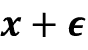
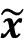
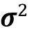
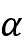
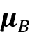
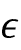
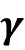
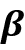
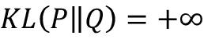

# 第十七章：生成对抗网络用于合成新数据

在上一章中，我们专注于用于建模序列的**循环神经网络**。在本章中，我们将探讨**生成对抗网络**（**GANs**）及其在合成新数据样本中的应用。GAN 被认为是深度学习中最重要的突破之一，允许计算机生成新数据（如新图像）。

本章将涵盖以下主题：

+   引入生成模型用于合成新数据

+   自编码器、变分自编码器及其与生成对抗网络（GANs）的关系

+   理解 GAN 的构建模块

+   实现一个简单的 GAN 模型来生成手写数字

+   理解转置卷积和批归一化

+   改进 GAN：深度卷积 GAN 和使用 Wasserstein 距离的 GAN

# 介绍生成对抗网络

让我们首先看看 GAN 模型的基础。GAN 的总体目标是合成具有与其训练数据集相同分布的新数据。因此，GAN 在其原始形式中被认为是机器学习任务中无监督学习类别的一部分，因为不需要标记数据。然而，值得注意的是，对原始 GAN 的扩展可以同时属于半监督和监督领域。

生成对抗网络（GAN）的一般概念最早由**伊恩·古德费洛**及其同事于 2014 年提出，作为利用深度**神经网络**（**NNs**）合成新图像的方法（*生成对抗网络*，见*I. Goodfellow*, *J. Pouget-Abadie*, *M. Mirza*, *B. Xu*, *D. Warde-Farley*, *S. Ozair*, *A. Courville*, and *Y. Bengio*，《神经信息处理系统进展》，第 2672-2680 页，2014 年）。尽管该论文中最初的 GAN 架构基于全连接层，类似于多层感知器结构，并训练生成低分辨率的类似 MNIST 手写数字，但它更像是一个概念验证，旨在展示这种新方法的可行性。

然而，自其引入以来，原始作者及许多其他研究人员已提出了许多改进以及不同领域工程和科学中的各种应用。例如，在计算机视觉中，GAN 被用于图像到图像的转换（学习如何将输入图像映射到输出图像）、图像超分辨率（从低分辨率版本生成高分辨率图像）、图像修补（学习如何重构图像中丢失的部分）等多种应用。例如，最近 GAN 研究的进展导致了能够生成新的高分辨率人脸图像的模型。此类高分辨率图像的例子可以在[`www.thispersondoesnotexist.com/`](https://www.thispersondoesnotexist.com/)找到，展示了由 GAN 生成的合成人脸图像。

## 从自编码器开始

在讨论 GAN 的工作原理之前，我们首先从自编码器开始，它可以压缩和解压训练数据。虽然标准自编码器不能生成新数据，但理解它们的功能将有助于你在下一节中理解 GAN。

自编码器由两个串联的网络组成：一个**编码器**网络和一个**解码器**网络。编码器网络接收与示例**x**相关的*d*维输入特征向量（即 ），并将其编码成*p*维向量**z**（即 ）。换句话说，编码器的作用是学习如何建模函数**z** = **f**(**x**)。编码后的向量**z**也称为**潜在向量**或潜在特征表示。通常，潜在向量的维度小于输入示例的维度；换句话说，*p* < *d*。因此，我们可以说编码器充当数据压缩函数。然后，解码器从低维潜在向量**z**中解压出 ，我们可以将解码器视为一个函数，。*图 17.1*展示了一个简单的自编码器架构，其中编码器和解码器部分只包含一个完全连接的层：


图 17.1：自编码器的架构

**自编码器与降维的联系**

在 *第五章*，*通过降维压缩数据*，你学习了一些降维技术，比如**主成分分析**（**PCA**）和**线性判别分析**（**LDA**）。自编码器也可以作为一种降维技术。事实上，当两个子网络（编码器和解码器）中没有非线性时，自编码器方法与 PCA *几乎完全相同*。

在这种情况下，如果我们假设单层编码器的权重（无隐藏层和非线性激活函数）用矩阵*U*表示，则编码器模型为**z** = **U**^T**x**。类似地，单层线性解码器模型为 。将这两个组件放在一起，我们有 。这正是 PCA 所做的事情，唯一的区别在于 PCA 有一个额外的正交规范约束：**UU**^T = **I**[n][×][n]。

虽然*图 17.1*描绘了一个没有隐藏层的自编码器，在编码器和解码器中，我们当然可以添加多个带有非线性的隐藏层（如多层神经网络），以构建一个能够学习更有效数据压缩和重构函数的深度自编码器。此外，注意到本节提到的自编码器使用全连接层。然而，在处理图像时，我们可以用卷积层替换全连接层，正如你在*第十四章*，*使用深度卷积神经网络分类图像*中学到的那样。

**基于潜在空间大小的其他类型的自编码器**

正如之前提到的，自编码器的潜在空间的维度通常比输入的维度低（*p* < *d*），这使得自编码器适用于降维。因此，潜在向量也经常被称为“瓶颈”，并且这种特定的自编码器配置也称为**欠完备**。然而，还有一种不同类别的自编码器，称为**过完备**，在这种情况下，潜在向量*z*的维度实际上大于输入示例的维度（*p* > *d*）。

在训练过程中，当训练一个过完备的自编码器时，存在一个平凡的解决方案，即编码器和解码器可以简单地学习复制（记忆）输入特征到它们的输出层。显然，这种解决方案并不是很有用。然而，通过对训练过程进行一些修改，过完备的自编码器可以用于*噪声减少*。

在这种情况下，训练过程中，随机噪声被添加到输入示例中，网络学习从嘈杂的信号中重构出干净的例子*x*。然后，在评估时，我们提供自然嘈杂的新例子（即已经存在噪声，因此不需要额外的人工噪声）以便从这些例子中去除现有的噪声。这种特殊的自编码器架构和训练方法被称为*去噪自编码器*。

如果你感兴趣，你可以通过*Pascal Vincent*和他的同事在 2010 年发表的研究文章[*Stacked denoising autoencoders: Learning useful representations in a deep network with a local denoising criterion*](http://www.jmlr.org/papers/v11/vincent10a.html)了解更多。

## 生成模型用于合成新数据

自编码器是确定性模型，这意味着在自编码器训练后，给定一个输入**x**，它将能够从其在较低维空间中的压缩版本重新构建输入。因此，它不能在超出重构其输入之外生成新的数据。

另一方面，一个生成模型可以从一个随机向量**z**（对应于潜在表示）生成一个新的例子，。生成模型的示意图如下所示。随机向量**z**来自具有完全已知特性的分布，因此我们可以轻松地从这样的分布中进行抽样。例如，**z**的每个元素可以来自于范围为[–1, 1]的均匀分布（我们写成），或者来自于标准正态分布（这种情况下我们写成）：


图 17.2：一个生成模型

当我们将注意力从自动编码器转向生成模型时，您可能已经注意到自动编码器的解码器部分与生成模型有些相似。特别是它们都接收潜在向量 **z** 作为输入，并返回与 **x** 相同空间的输出。（对于自动编码器， 是输入 **x** 的重构，对于生成模型， 是一个合成的样本。）

然而，两者之间的主要区别在于我们不知道自动编码器中 **z** 的分布，而在生成模型中，**z** 的分布是完全可描述的。虽然可以将自动编码器泛化为生成模型。一种方法是 **变分自动编码器**（**VAE**）。

在接收输入示例 **x** 的 VAE 中，编码器网络被修改，以计算潜在向量分布的两个时刻：均值  和方差 。在训练 VAE 期间，网络被强制使这些时刻与标准正态分布（即零均值和单位方差）的时刻匹配。然后，在训练 VAE 模型后，编码器被丢弃，我们可以使用解码器网络通过从“学习到的”高斯分布中提供的随机 **z** 向量来生成新的示例，。

除了 VAE，还有其他类型的生成模型，例如 *自回归模型* 和 *正规化流模型*。然而，在本章中，我们将只关注 GAN 模型，它们是深度学习中最新和最流行的生成模型类型之一。

**什么是生成模型？**

请注意，生成模型通常被定义为模拟数据输入分布 *p*(*x*) 或输入数据及相关目标的联合分布 *p*(*x*, *y*) 的算法。按照定义，这些模型也能够从某些特征 **x**[i] 中进行采样，条件是另一特征 **x**[j]，这被称为 **条件推理**。然而，在深度学习的语境中，术语 **生成模型** 通常用来指代能够生成看起来真实的数据的模型。这意味着我们可以从输入分布 *p*(*x*) 中采样，但不一定能进行条件推理。

## 使用 GANs 生成新样本

要简单理解 GANs 的作用，我们首先假设有一个网络，接收来自已知分布的随机向量 **z**，并生成输出图像 **x**。我们将这个网络称为 **生成器**（*G*），并使用符号  表示生成的输出。假设我们的目标是生成一些图像，例如人脸图像、建筑物图像、动物图像，甚至是手写数字如 MNIST。

正如以往一样，我们将使用随机权重初始化这个网络。因此，在调整这些权重之前，第一批输出图像看起来像是白噪声。现在，想象一下有一个能够评估图像质量的函数（我们称之为*评估函数*）。

如果存在这样的函数，我们可以利用该函数的反馈告诉生成器网络如何调整其权重以提高生成图像的质量。通过这种方式，我们可以根据评估函数的反馈训练生成器，使其学习改进其输出以生成看起来真实的图像。

正如上一段所描述的评估函数，如果存在这样一个通用函数来评估图像的质量，那么生成图像的任务将变得非常简单。问题是，是否存在这样一个可以评估图像质量的通用函数，如果存在，它是如何定义的。显然，作为人类，当我们观察网络的输出时，可以轻松评估输出图像的质量；尽管我们目前（还）无法将我们的大脑结果反向传播到网络中。现在，如果我们的大脑能够评估合成图像的质量，那么我们是否可以设计一个神经网络模型来做同样的事情？事实上，这正是 GAN 的一般想法。

如*图 17.3*所示，GAN 模型包括一个名为**鉴别器**（*D*）的附加神经网络，它是一个分类器，学习如何检测由生成器合成的图像，，与真实图像**x**的区别：


图 17.3：鉴别器区分真实图像和生成器创建的图像

在 GAN 模型中，生成器和鉴别器两个网络一起训练。一开始，初始化模型权重后，生成器创建的图像看起来不太真实。同样，鉴别器在区分真实图像和生成器合成图像方面表现不佳。但随着时间的推移（即训练过程中），这两个网络通过相互作用逐渐提升。事实上，这两个网络在进行对抗训练，生成器学习改进其输出以欺骗鉴别器。与此同时，鉴别器变得更加擅长检测合成图像。

## 理解 GAN 模型中生成器和鉴别器网络的损失函数

GAN 的目标函数，如*I. Goodfellow*及其同事在原始论文*生成对抗网络*（[`papers.nips.cc/paper/5423-generative-adversarial-nets.pdf`](https://papers.nips.cc/paper/5423-generative-adversarial-nets.pdf)）中描述的那样：


在这里，被称为**值函数**，可以被解释为一种回报：我们希望在鉴别器(*D*)方面最大化其值，同时在生成器(*G*)方面最小化其值，即。*D*(**x**)是指示输入示例**x**是真实还是生成的概率（即生成的）。表达式指的是对于来自数据分布（真实例子的分布）的示例期望值；是指对于输入向量**z**的分布的期望值。

GAN 模型的一个训练步骤需要两个优化步骤：（1）最大化鉴别器的回报，（2）最小化生成器的回报。训练 GAN 的一个实际方法是在这两个优化步骤之间交替进行：（1）固定一个网络的参数并优化另一个网络的权重，（2）固定第二个网络并优化第一个网络。这个过程应该在每个训练迭代中重复。假设生成器网络被固定，并且我们想要优化鉴别器。值函数中的两项都有助于优化鉴别器，其中第一项对应于真实例子的损失，第二项是虚假例子的损失。因此，当*G*固定时，我们的目标是*最大化*，这意味着使鉴别器更好地区分真实和生成的图像。

优化鉴别器使用真实和虚假样本的损失项后，我们固定鉴别器并优化生成器。在这种情况下，只有中的第二项对生成器的梯度起作用。因此，当*D*固定时，我们的目标是*最小化*，可以写成。正如 Goodfellow 及其同事在原始 GAN 论文中提到的那样，这个函数在早期训练阶段会出现梯度消失的问题。造成这一现象的原因是在学习过程早期，输出*G*(**z**)看起来与真实例子完全不同，因此*D*(*G*(**z**))会非常接近零并且有很高的置信度。这种现象被称为**饱和**。为了解决这个问题，我们可以通过重写将最小化目标重新表述为来重新制定。

这种替换意味着在训练生成器时，我们可以交换真实和虚假示例的标签，并执行常规的函数最小化。换句话说，尽管生成器合成的示例是虚假的，因此标记为 0，我们可以通过将这些示例分配标签 1 来反转标签，并*最小化*使用这些新标签的二元交叉熵损失，而不是最大化 。

现在我们已经介绍了训练 GAN 模型的一般优化过程，让我们探讨在训练 GAN 时可以使用的各种数据标签。鉴于判别器是二元分类器（虚假和真实图像的类标签分别为 0 和 1），我们可以使用二元交叉熵损失函数。因此，我们可以确定判别器损失的地面真实标签如下：


那么，训练生成器的标签如何呢？由于我们希望生成器合成逼真的图像，当鉴别器不将其输出分类为真实图像时，我们希望惩罚生成器。这意味着在计算生成器的损失函数时，我们将假设生成器输出的地面真实标签为 1。

将所有这些内容整合在一起，下图展示了简单 GAN 模型中的各个步骤：


图 17.4：构建 GAN 模型的步骤

在接下来的部分，我们将从零开始实现 GAN 以生成新的手写数字。

# 从零开始实现 GAN

在本节中，我们将介绍如何实现和训练 GAN 模型以生成新的图像，如 MNIST 数字。由于在普通**中央处理单元**（**CPU**）上进行训练可能需要很长时间，因此在下一小节中，我们将介绍如何设置 Google Colab 环境，以便我们可以在**图形处理单元**（**GPU**）上运行计算。

## 在 Google Colab 上训练 GAN 模型

本章中的某些代码示例可能需要超出传统笔记本电脑或工作站的常规计算资源。如果您已经有一个安装了 CUDA 和 cuDNN 库的 NVIDIA GPU 计算机，可以使用它来加快计算速度。

然而，由于许多人无法获得高性能计算资源，我们将使用 Google Colaboratory 环境（通常称为 Google Colab），这是一个免费的云计算服务（在大多数国家都可以使用）。

Google Colab 提供在云上运行的 Jupyter Notebook 实例；可以将笔记本保存在 Google Drive 或 GitHub 上。虽然该平台提供各种不同的计算资源，如 CPU、GPU，甚至**张量处理单元**（**TPU**），但需要强调的是，执行时间目前限制为 12 小时。因此，任何运行超过 12 小时的笔记本将被中断。

本章的代码块最长需要两到三个小时的计算时间，所以这不会成为问题。不过，如果你决定在 Google Colab 上运行其他超过 12 小时的项目，请务必使用检查点和保存中间检查点。

**Jupyter Notebook**

Jupyter Notebook 是一个用于交互式运行代码、插入文档和图形的图形用户界面（GUI）。由于其多功能性和易用性，它已成为数据科学中最流行的工具之一。

欲了解更多关于 Jupyter Notebook 的一般信息，请查阅官方文档，网址为[`jupyter-notebook.readthedocs.io/en/stable/`](https://jupyter-notebook.readthedocs.io/en/stable/)。本书中所有代码也以 Jupyter Notebook 形式提供，第一章的代码目录中还附有简短介绍。

最后，我们强烈推荐*Adam Rule*等人的文章《在 Jupyter Notebooks 中编写和共享计算分析的十个简单规则》，该文章对在科学研究项目中有效使用 Jupyter Notebook 提供了有价值的建议，可在[`journals.plos.org/ploscompbiol/article?id=10.1371/journal.pcbi.1007007`](https://journals.plos.org/ploscompbiol/article?id=10.1371/journal.pcbi.1007007)免费获取。

访问 Google Colab 非常简单。您可以访问[`colab.research.google.com`](https://colab.research.google.com)，该链接会自动跳转到一个提示窗口，您可以在其中看到现有的 Jupyter 笔记本。在这个提示窗口中，点击如*图 17.5*所示的**Google Drive**选项卡，这是您将笔记本保存到 Google Drive 的地方。

接下来，要创建一个新的笔记本，请点击提示窗口底部的**New notebook**链接：


图 17.5：在 Google Colab 中创建一个新的 Python 笔记本

这将为您创建并打开一个新的笔记本。您在此笔记本中编写的所有代码示例都将自动保存，稍后您可以从名为**Colab Notebooks**的目录中访问笔记本。

在下一步中，我们希望利用 GPU 来运行此笔记本中的代码示例。为此，请在此笔记本菜单栏的**Runtime**选项中，点击**Change runtime type**，然后选择**GPU**，如*图 17.6*所示：


图 17.6：在 Google Colab 中利用 GPU

在最后一步中，我们只需安装本章所需的 Python 包。Colab Notebooks 环境已经预装了某些包，如 NumPy、SciPy 和最新稳定版本的 PyTorch。撰写本文时，Google Colab 的最新稳定版本是 PyTorch 1.9。

现在，我们可以通过以下代码来测试安装并验证 GPU 是否可用：

```py
>>> import torch
>>> print(torch.__version__)
1.9.0+cu111
>>> print("GPU Available:", torch.cuda.is_available())
GPU Available: True
>>> if torch.cuda.is_available():
...     device = torch.device("cuda:0")
... else:
...     device = "cpu"
>>> print(device)
cuda:0 
```

此外，如果你想要将模型保存到个人谷歌驱动器，或者转移或上传其他文件，你需要挂载谷歌驱动器。要做到这一点，在笔记本的新单元格中执行以下操作：

```py
>>> from google.colab import drive
>>> drive.mount('/content/drive/') 
```

这将提供一个链接来对 Colab 笔记本访问你的谷歌驱动器进行身份验证。按照身份验证的说明操作后，它会提供一个身份验证代码，你需要复制并粘贴到刚刚执行的单元格下方的指定输入字段中。然后，你的谷歌驱动器将被挂载，并可在`/content/drive/My Drive`路径下访问。或者，你可以通过 GUI 界面挂载，如*图 17.7*所示：


图 17.7：挂载你的谷歌驱动器

## 实现生成器和判别器网络

我们将从一个包含生成器和判别器的两个全连接网络的第一个 GAN 模型实现开始，如*图 17.8*所示：


图 17.8：一个包含生成器和判别器的 GAN 模型，两者都是全连接网络

*图 17.8* 描述了基于全连接层的原始 GAN，我们将其称为*香草 GAN*。

在这个模型中，对于每个隐藏层，我们将应用泄漏线性整流单元（Leaky ReLU）激活函数。使用 ReLU 会导致梯度稀疏化，这在我们希望对输入值的全范围有梯度时可能不太合适。在判别器网络中，每个隐藏层之后还跟有一个 dropout 层。此外，生成器的输出层使用双曲正切（tanh）激活函数。（推荐在生成器网络中使用 tanh 激活函数，因为它有助于学习。）

判别器的输出层没有激活函数（即线性激活），以获取 logits。作为替代，我们可以使用 sigmoid 激活函数以获取概率作为输出。

**泄漏修正线性单元（ReLU）激活函数**

在*第十二章*，《使用 PyTorch 并行化神经网络训练》，我们介绍了可以在 NN 模型中使用的不同非线性激活函数。如果你还记得，ReLU 激活函数被定义为，它抑制负（激活前）输入；也就是说，负输入被设置为零。因此，在反向传播过程中使用 ReLU 激活函数可能导致稀疏梯度。稀疏梯度并不总是有害的，甚至可以使分类模型受益。然而，在某些应用中，如 GANs，获得全范围输入值的梯度可能对模型有利。我们可以通过对 ReLU 函数进行轻微修改来实现这一点，使其对负输入输出小值。这种修改版本的 ReLU 函数也被称为**泄露的 ReLU**。简而言之，泄露的 ReLU 激活函数允许负输入的梯度非零，并因此使网络整体更具表现力。

泄露的 ReLU 激活函数定义如下：


图 17.9：泄露的 ReLU 激活函数

在这里，决定了负（激活前）输入的斜率。

我们将为每个网络定义两个辅助函数，从 PyTorch 的`nn.Sequential`类中实例化模型，并按描述添加层。代码如下：

```py
>>> import torch.nn as nn
>>> import numpy as np
>>> import matplotlib.pyplot as plt
>>> ## define a function for the generator:
>>> def make_generator_network(
...         input_size=20,
...         num_hidden_layers=1,
...         num_hidden_units=100,
...         num_output_units=784):
...     model = nn.Sequential()
...     for i in range(num_hidden_layers):
...         model.add_module(f'fc_g{i}',
...                          nn.Linear(input_size, num_hidden_units))
...         model.add_module(f'relu_g{i}', nn.LeakyReLU())
...         input_size = num_hidden_units
...     model.add_module(f'fc_g{num_hidden_layers}',
...                      nn.Linear(input_size, num_output_units))
...     model.add_module('tanh_g', nn.Tanh())
...     return model
>>> 
>>> ## define a function for the discriminator:
>>> def make_discriminator_network(
...         input_size,
...         num_hidden_layers=1,
...         num_hidden_units=100,
...         num_output_units=1):
...     model = nn.Sequential()
...     for i in range(num_hidden_layers):
...         model.add_module(
...             f'fc_d{i}',
...             nn.Linear(input_size, num_hidden_units, bias=False)
...         )
...         model.add_module(f'relu_d{i}', nn.LeakyReLU())
...         model.add_module('dropout', nn.Dropout(p=0.5))
...         input_size = num_hidden_units
...     model.add_module(f'fc_d{num_hidden_layers}',
...                      nn.Linear(input_size, num_output_units))
...     model.add_module('sigmoid', nn.Sigmoid())
...     return model 
```

接下来，我们将指定模型的训练设置。正如您从前几章中记得的那样，MNIST 数据集中的图像大小为 28×28 像素。（因为 MNIST 只包含灰度图像，所以只有一个颜色通道。）我们还将指定输入向量**z**的大小为 20。由于我们只是为了演示目的而实现了一个非常简单的 GAN 模型，并使用全连接层，我们只会使用每个网络中的一个单隐藏层，每层有 100 个单元。在下面的代码中，我们将指定和初始化这两个网络，并打印它们的摘要信息：

```py
>>> image_size = (28, 28)
>>> z_size = 20
>>> gen_hidden_layers = 1
>>> gen_hidden_size = 100
>>> disc_hidden_layers = 1
>>> disc_hidden_size = 100
>>> torch.manual_seed(1)
>>> gen_model = make_generator_network(
...     input_size=z_size,
...     num_hidden_layers=gen_hidden_layers,
...     num_hidden_units=gen_hidden_size,
...     num_output_units=np.prod(image_size)
... )
>>> print(gen_model)
Sequential(
  (fc_g0): Linear(in_features=20, out_features=100, bias=False)
  (relu_g0): LeakyReLU(negative_slope=0.01)
  (fc_g1): Linear(in_features=100, out_features=784, bias=True)
  (tanh_g): Tanh()
)
>>> disc_model = make_discriminator_network(
...     input_size=np.prod(image_size),
...     num_hidden_layers=disc_hidden_layers,
...     num_hidden_units=disc_hidden_size
... )
>>> print(disc_model)
Sequential(
  (fc_d0): Linear(in_features=784, out_features=100, bias=False)
  (relu_d0): LeakyReLU(negative_slope=0.01)
  (dropout): Dropout(p=0.5, inplace=False)
  (fc_d1): Linear(in_features=100, out_features=1, bias=True)
  (sigmoid): Sigmoid()
) 
```

## 定义训练数据集

在下一步中，我们将从 PyTorch 加载 MNIST 数据集并应用必要的预处理步骤。由于生成器的输出层使用 tanh 激活函数，合成图像的像素值将在（-1，1）范围内。然而，MNIST 图像的输入像素在[0，255]范围内（数据类型为`PIL.Image.Image`）。因此，在预处理步骤中，我们将使用`torchvision.transforms.ToTensor`函数将输入图像张量转换为张量。因此，除了更改数据类型外，调用此函数还将改变输入像素强度的范围为[0，1]。然后，我们可以通过将它们移动-0.5 并缩放 0.5 的因子来将它们移动到[-1，1]范围内，从而改善基于梯度下降的学习：

```py
>>> import torchvision
>>> from torchvision import transforms
>>> image_path = './'
>>> transform = transforms.Compose([
...     transforms.ToTensor(),
...     transforms.Normalize(mean=(0.5), std=(0.5)),
... ])
>>> mnist_dataset = torchvision.datasets.MNIST(
...     root=image_path, train=True,
...     transform=transform, download=False
... )
>>> example, label = next(iter(mnist_dataset))
>>> print(f'Min: {example.min()} Max: {example.max()}')
>>> print(example.shape)
Min: -1.0 Max: 1.0
torch.Size([1, 28, 28]) 
```

此外，我们还将根据所需的随机分布（在此代码示例中为均匀分布或正态分布，这是最常见的选择之一）创建一个随机向量**z**：

```py
>>> def create_noise(batch_size, z_size, mode_z):
...     if mode_z == 'uniform':
...         input_z = torch.rand(batch_size, z_size)*2 - 1
...     elif mode_z == 'normal':
...         input_z = torch.randn(batch_size, z_size)
...     return input_z 
```

让我们检查我们创建的数据集对象。在接下来的代码中，我们将取一个示例批次并打印这些输入向量和图像的数组形状。此外，为了理解我们的 GAN 模型的整体数据流，我们将在下面的代码中为我们的生成器和判别器进行前向传递。

首先，我们将批量输入向量**z**传递给生成器并获取其输出`g_output`。这将是一批假例子，将被馈送到判别器模型以获取假例子批次`d_proba_fake`的概率。此外，我们从数据集对象获取的处理后的图像将被馈送到判别器模型，这将导致真实例子批次`d_proba_real`的概率。代码如下：

```py
>>> from torch.utils.data import DataLoader
>>> batch_size = 32
>>> dataloader = DataLoader(mnist_dataset, batch_size, shuffle=False)
>>> input_real, label = next(iter(dataloader))
>>> input_real = input_real.view(batch_size, -1)
>>> torch.manual_seed(1)
>>> mode_z = 'uniform'  # 'uniform' vs. 'normal'
>>> input_z = create_noise(batch_size, z_size, mode_z)
>>> print('input-z -- shape:', input_z.shape)
>>> print('input-real -- shape:', input_real.shape)
input-z -- shape: torch.Size([32, 20])
input-real -- shape: torch.Size([32, 784])
>>> g_output = gen_model(input_z)
>>> print('Output of G -- shape:', g_output.shape)
Output of G -- shape: torch.Size([32, 784])
>>> d_proba_real = disc_model(input_real)
>>> d_proba_fake = disc_model(g_output)
>>> print('Disc. (real) -- shape:', d_proba_real.shape)
>>> print('Disc. (fake) -- shape:', d_proba_fake.shape)
Disc. (real) -- shape: torch.Size([32, 1])
Disc. (fake) -- shape: torch.Size([32, 1]) 
```

两个概率`d_proba_fake`和`d_proba_real`将用于计算训练模型的损失函数。

## 训练 GAN 模型

作为下一步，我们将创建一个`nn.BCELoss`的实例作为我们的损失函数，并使用它来计算与我们刚刚处理的批次相关的生成器和判别器的二元交叉熵损失。为此，我们还需要每个输出的地面实况标签。对于生成器，我们将创建一个与包含生成图像预测概率的向量`d_proba_fake`形状相同的 1 向量。对于判别器损失，我们有两个项：涉及`d_proba_fake`的检测假例的损失和基于`d_proba_real`的检测真实例的损失。

对于假术语的地面实况标签将是一个 0 向量，我们可以通过`torch.zeros()`（或`torch.zeros_like()`）函数生成。类似地，我们可以通过`torch.ones()`（或`torch.ones_like()`）函数生成真实图像的地面实况值，该函数创建一个 1 向量：

```py
>>> loss_fn = nn.BCELoss()
>>> ## Loss for the Generator
>>> g_labels_real = torch.ones_like(d_proba_fake)
>>> g_loss = loss_fn(d_proba_fake, g_labels_real)
>>> print(f'Generator Loss: {g_loss:.4f}')
Generator Loss: 0.6863
>>> ## Loss for the Discriminator
>>> d_labels_real = torch.ones_like(d_proba_real)
>>> d_labels_fake = torch.zeros_like(d_proba_fake)
>>> d_loss_real = loss_fn(d_proba_real, d_labels_real)
>>> d_loss_fake = loss_fn(d_proba_fake, d_labels_fake)
>>> print(f'Discriminator Losses: Real {d_loss_real:.4f} Fake {d_loss_fake:.4f}')
Discriminator Losses: Real 0.6226 Fake 0.7007 
```

前面的代码示例展示了逐步计算不同损失项的过程，以便理解训练 GAN 模型背后的整体概念。接下来的代码将设置 GAN 模型并实现训练循环，在其中我们将在`for`循环中包括这些计算。

我们将从为真实数据集设置数据加载器开始，包括生成器和判别器模型，以及两个模型各自的单独 Adam 优化器：

```py
>>> batch_size = 64
>>> torch.manual_seed(1)
>>> np.random.seed(1)
>>> mnist_dl = DataLoader(mnist_dataset, batch_size=batch_size,
...                       shuffle=True, drop_last=True)
>>> gen_model = make_generator_network(
...     input_size=z_size,
...     num_hidden_layers=gen_hidden_layers,
...     num_hidden_units=gen_hidden_size,
...     num_output_units=np.prod(image_size)
... ).to(device)
>>> disc_model = make_discriminator_network(
...     input_size=np.prod(image_size),
...     num_hidden_layers=disc_hidden_layers,
...     num_hidden_units=disc_hidden_size
... ).to(device)
>>> loss_fn = nn.BCELoss()
>>> g_optimizer = torch.optim.Adam(gen_model.parameters())
>>> d_optimizer = torch.optim.Adam(disc_model.parameters()) 
```

另外，我们将计算损失相对于模型权重的梯度，并使用两个单独的 Adam 优化器优化生成器和判别器的参数。我们将编写两个实用函数来训练判别器和生成器，如下所示：

```py
>>> ## Train the discriminator
>>> def d_train(x):
...     disc_model.zero_grad()
...     # Train discriminator with a real batch
...     batch_size = x.size(0)
...     x = x.view(batch_size, -1).to(device)
...     d_labels_real = torch.ones(batch_size, 1, device=device)
...     d_proba_real = disc_model(x)
...     d_loss_real = loss_fn(d_proba_real, d_labels_real)
...     # Train discriminator on a fake batch
...     input_z = create_noise(batch_size, z_size, mode_z).to(device)
...     g_output = gen_model(input_z)
...     d_proba_fake = disc_model(g_output)
...     d_labels_fake = torch.zeros(batch_size, 1, device=device)
...     d_loss_fake = loss_fn(d_proba_fake, d_labels_fake)
...     # gradient backprop & optimize ONLY D's parameters
...     d_loss = d_loss_real + d_loss_fake
...     d_loss.backward()
...     d_optimizer.step()
...     return d_loss.data.item(), d_proba_real.detach(), \
...            d_proba_fake.detach()
>>>
>>> ## Train the generator
>>> def g_train(x):
...     gen_model.zero_grad()
...     batch_size = x.size(0)
...     input_z = create_noise(batch_size, z_size, mode_z).to(device)
...     g_labels_real = torch.ones(batch_size, 1, device=device)
... 
...     g_output = gen_model(input_z)
...     d_proba_fake = disc_model(g_output)
...     g_loss = loss_fn(d_proba_fake, g_labels_real)
...     # gradient backprop & optimize ONLY G's parameters
...     g_loss.backward()
...     g_optimizer.step()
...     return g_loss.data.item() 
```

接下来，我们将在 100 个 epochs 中交替训练生成器和判别器。每个 epoch，我们将记录生成器的损失、判别器的损失以及真实数据和假数据的损失。此外，在每个 epoch 后，我们将使用当前生成器模型调用 `create_samples()` 函数从固定噪声输入生成一些示例。我们将合成的图像存储在一个 Python 列表中。代码如下：

```py
>>> fixed_z = create_noise(batch_size, z_size, mode_z).to(device)
>>> def create_samples(g_model, input_z):
...     g_output = g_model(input_z)
...     images = torch.reshape(g_output, (batch_size, *image_size))
...     return (images+1)/2.0
>>> 
>>> epoch_samples = []
>>> all_d_losses = []
>>> all_g_losses = []
>>> all_d_real = []
>>> all_d_fake = []
>>> num_epochs = 100
>>> 
>>> for epoch in range(1, num_epochs+1):
...     d_losses, g_losses = [], []
...     d_vals_real, d_vals_fake = [], []
...     for i, (x, _) in enumerate(mnist_dl):
...         d_loss, d_proba_real, d_proba_fake = d_train(x)
...         d_losses.append(d_loss)
...         g_losses.append(g_train(x))
...         d_vals_real.append(d_proba_real.mean().cpu())
...         d_vals_fake.append(d_proba_fake.mean().cpu())
...         
...     all_d_losses.append(torch.tensor(d_losses).mean())
...     all_g_losses.append(torch.tensor(g_losses).mean())
...     all_d_real.append(torch.tensor(d_vals_real).mean())
...     all_d_fake.append(torch.tensor(d_vals_fake).mean())
...     print(f'Epoch {epoch:03d} | Avg Losses >>'
...           f' G/D {all_g_losses[-1]:.4f}/{all_d_losses[-1]:.4f}'
...           f' [D-Real: {all_d_real[-1]:.4f}'
...           f' D-Fake: {all_d_fake[-1]:.4f}]')
...     epoch_samples.append(
...         create_samples(gen_model, fixed_z).detach().cpu().numpy()
...     )

Epoch 001 | Avg Losses >> G/D 0.9546/0.8957 [D-Real: 0.8074 D-Fake: 0.4687]
Epoch 002 | Avg Losses >> G/D 0.9571/1.0841 [D-Real: 0.6346 D-Fake: 0.4155]
Epoch ...
Epoch 100 | Avg Losses >> G/D 0.8622/1.2878 [D-Real: 0.5488 D-Fake: 0.4518] 
```

在 Google Colab 上使用 GPU，我们在前面的代码块中实现的训练过程应该在一个小时内完成。（如果你有最新和强大的 CPU 和 GPU，甚至可能更快。）模型训练完成后，通常有助于绘制判别器和生成器的损失，分析两个子网络的行为并评估它们是否收敛。

还有助于绘制由判别器在每次迭代中计算的真实和假例子批次的平均概率。我们期望这些概率在 0.5 左右，这意味着判别器不能自信地区分真实和假的图像：

```py
>>> import itertools
>>> fig = plt.figure(figsize=(16, 6))
>>> ## Plotting the losses
>>> ax = fig.add_subplot(1, 2, 1)
>>> plt.plot(all_g_losses, label='Generator loss')
>>> half_d_losses = [all_d_loss/2 for all_d_loss in all_d_losses]
>>> plt.plot(half_d_losses, label='Discriminator loss')
>>> plt.legend(fontsize=20)
>>> ax.set_xlabel('Iteration', size=15)
>>> ax.set_ylabel('Loss', size=15)
>>> 
>>> ## Plotting the outputs of the discriminator
>>> ax = fig.add_subplot(1, 2, 2)
>>> plt.plot(all_d_real, label=r'Real: $D(\mathbf{x})$')
>>> plt.plot(all_d_fake, label=r'Fake: $D(G(\mathbf{z}))$')
>>> plt.legend(fontsize=20)
>>> ax.set_xlabel('Iteration', size=15)
>>> ax.set_ylabel('Discriminator output', size=15)
>>> plt.show() 
```

*图 17.10* 显示了结果：


图 17.10：判别器的性能

正如您在前面的判别器输出中所见，训练早期，判别器能够快速学习准确区分真实和假例子；也就是说，假例子的概率接近 0，真实例子的概率接近 1。这是因为假例子与真实例子完全不同，因此很容易区分真伪。随着训练的进展，生成器将变得更擅长合成逼真图像，这将导致真实和假例子的概率都接近 0.5。

此外，我们还可以看到生成器输出，即合成图像在训练过程中的变化。在接下来的代码中，我们将可视化生成器为一些 epochs 选择生成的一些图像。

```py
>>> selected_epochs = [1, 2, 4, 10, 50, 100]
>>> fig = plt.figure(figsize=(10, 14))
>>> for i,e in enumerate(selected_epochs):
...     for j in range(5):
...         ax = fig.add_subplot(6, 5, i*5+j+1)
...         ax.set_xticks([])
...         ax.set_yticks([])
...         if j == 0:
...             ax.text(
...                 -0.06, 0.5, f'Epoch {e}',
...                 rotation=90, size=18, color='red',
...                 horizontalalignment='right',
...                 verticalalignment='center',
...                 transform=ax.transAxes
...             )
...         
...         image = epoch_samples[e-1][j]
...         ax.imshow(image, cmap='gray_r')
...     
>>> plt.show() 
```

*图 17.11* 展示了生成的图像：


图 17.11：生成器生成的图像

正如您从 *图 17.11* 中可以看到的那样，随着训练的进行，生成器网络生成的图像变得越来越逼真。然而，即使经过 100 个 epochs，生成的图像仍然与 MNIST 数据集中的手写数字非常不同。

在本节中，我们设计了一个非常简单的 GAN 模型，生成器和判别器仅有一个完全连接的隐藏层。在 MNIST 数据集上训练 GAN 模型后，我们能够获得有希望的，尽管还不完全满意的新手写数字结果。

正如我们在《第十四章》“使用深度卷积神经网络对图像进行分类”中学到的，具有卷积层的 NN 体系结构在图像分类时比全连接层具有几个优势。在类似的情况下，将卷积层添加到我们的 GAN 模型中以处理图像数据可能会改善结果。在下一节中，我们将实现一个**深度卷积 GAN** (**DCGAN**)，它将使用卷积层来构建生成器和鉴别器网络。

# 使用卷积和 Wasserstein GAN 来改善合成图像的质量

在这一节中，我们将实现一个 DCGAN，这将使我们能够提高我们在前面 GAN 示例中看到的性能。此外，我们还将简要讨论一种额外的关键技术，**Wasserstein GAN** (**WGAN**)。

在本节中，我们将涵盖以下技术：

+   转置卷积

+   批量归一化（BatchNorm）

+   WGAN

DCGAN 是由*A. Radford*、*L. Metz*和*S. Chintala*在他们的文章《无监督表示学习与深度卷积生成对抗网络》中提出的，该文章可以在[`arxiv.org/pdf/1511.06434.pdf`](https://arxiv.org/pdf/1511.06434.pdf)免费获取。在这篇文章中，研究人员建议为生成器和鉴别器网络都使用卷积层。从一个随机向量**z**开始，DCGAN 首先使用全连接层将**z**投影到一个新的向量中，使其大小适当，以便可以将其重新塑造为空间卷积表示（*h*×*w*×*c*），这个表示比输出图像大小要小。然后，一系列卷积层（称为转置卷积）被用来将特征图上采样到所需的输出图像大小。

## 转置卷积

在《第十四章》中，你学习了在一维和二维空间中的卷积操作。特别是，我们看到了如何通过选择填充和步幅来改变输出特征图。虽然卷积操作通常用于对特征空间进行下采样（例如，通过将步幅设置为 2，或在卷积层后添加池化层），而*转置卷积*操作通常用于对特征空间进行上采样。

要理解转置卷积操作，让我们进行一个简单的思想实验。假设我们有一个大小为*n*×*n*的输入特征图。然后，我们对这个*n*×*n*的输入应用一个带有特定填充和步幅参数的 2D 卷积操作，得到一个大小为*m*×*m*的输出特征图。现在的问题是，我们如何可以应用另一个卷积操作来从这个*m*×*m*的输出特征图中获得一个具有初始维度*n*×*n*的特征图，同时保持输入和输出之间的连接模式？请注意，只恢复了*n*×*n*输入矩阵的形状，而不是实际的矩阵值。

如 *图 17.12* 所示，这就是转置卷积的工作原理：


图 17.12：转置卷积

**转置卷积与反卷积**

转置卷积也称为**分数步幅卷积**。在深度学习文献中，另一个常用的术语来指代转置卷积的是**反卷积**。但是需要注意的是，反卷积最初被定义为对特征映射 **x** 进行逆卷积操作 *f*，其权重参数为 **w**，生成特征映射 **x′**，*f*w = **x′**。然后可以定义一个反卷积函数 *f*^(–1)，如 。但需要注意的是，转置卷积仅仅专注于恢复特征空间的维度，而不是实际的数值。

使用转置卷积对特征映射进行上采样是通过在输入特征映射的元素之间插入 0 来实现的。*图 17.13* 展示了将转置卷积应用于一个大小为 4×4 的输入的示例，步幅为 2×2，卷积核大小为 2×2。中间的 9×9 矩阵显示了在输入特征映射中插入这样的 0 后的结果。然后，使用 2×2 卷积核和步幅为 1 进行普通卷积将产生一个大小为 8×8 的输出。我们可以通过在输出上执行步幅为 2 的常规卷积来验证反向方向，这将产生一个大小为 4×4 的输出特征映射，与原始输入大小相同：


图 17.13：将转置卷积应用于一个 4×4 的输入

*图 17.13* 概述了转置卷积的工作原理。输入大小、卷积核大小、步幅和填充方式的不同情况会影响输出结果。如果你想了解更多关于这些不同情况的内容，请参考 *A Guide to Convolution Arithmetic for Deep Learning*，由 *Vincent Dumoulin* 和 *Francesco Visin* 撰写，2018 年 ([`arxiv.org/pdf/1603.07285.pdf`](https://arxiv.org/pdf/1603.07285.pdf).)

## 批归一化

**BatchNorm** 是由 Sergey Ioffe 和 Christian Szegedy 在文章 *Batch Normalization: Accelerating Deep Network Training by Reducing Internal Covariate Shift* 中于 2015 年提出的，您可以通过 arXiv 访问该文章 [`arxiv.org/pdf/1502.03167.pdf`](https://arxiv.org/pdf/1502.03167.pdf)。BatchNorm 的主要思想之一是对层输入进行归一化，并在训练期间防止其分布的变化，从而加快和改善收敛速度。

BatchNorm 基于其计算出的统计信息来转换一个特征的小批量。假设我们有一个经过卷积层得到的四维张量 **Z** 的网络预激活特征映射，其形状为 [*m*×*c*×*h*×*w*]，其中 *m* 是批量大小（即批量大小），*h*×*w* 是特征映射的空间维度，*c* 是通道数。BatchNorm 可以总结为三个步骤：

1.  计算每个小批次的网络输入的均值和标准差：

    

    其中  和  都具有大小 *c*。

1.  对批次中所有示例的网络输入进行标准化：

    

    其中  是为了数值稳定性而设定的一个小数（即避免除以零）。

1.  使用两个可学习参数向量  和 （大小为 *c*，即通道数）来缩放和偏移标准化的网络输入：

    

*图 17.14* 描述了这个过程：


图 17.14：批次归一化的过程

在 BatchNorm 的第一步中，计算小批次的均值  和标准差 。这两者都是大小为 *c* 的向量（其中 *c* 是通道数）。然后，这些统计数据在 *第 2 步* 中用于通过 z-score 标准化（标准化）来缩放每个小批次中的示例，得到标准化的网络输入 。因此，这些网络输入是以均值为中心并具有*单位方差*的，这通常是基于梯度下降的优化中的一个有用特性。另一方面，总是归一化网络输入，使它们在不同的小批次之间具有相同的属性，这些属性可能是多样的，可能会严重影响神经网络的表示能力。这可以通过考虑特征 ，在进行 sigmoid 激活后到达 ，对接近 0 的值具有线性区域来理解。因此，在第 3 步中，可学习的参数  和 ，这些参数是大小为 *c* 的向量（通道数），允许 BatchNorm 控制标准化特征的偏移和扩展。

训练期间计算运行平均值  和运行方差 ，这些值与调整后的参数  和  一起用于规范化评估时的测试示例。

**为什么 BatchNorm 能帮助优化？**

最初，BatchNorm 的开发目的是减少所谓的**内部协变量漂移**，即由于训练期间更新的网络参数而导致的层激活分布的变化。

举个简单例子来解释，考虑一个固定的批次在第 1 个 epoch 通过网络。我们记录该批次每层的激活。在遍历整个训练数据集并更新模型参数后，我们开始第二个 epoch，之前固定的批次再次通过网络。然后，我们比较第一和第二个 epoch 的层激活。由于网络参数已更改，我们观察到激活也已更改。这种现象称为**内部协方差转移**，据信会减缓神经网络的训练速度。

然而，2018 年，S. Santurkar, D. Tsipras, A. Ilyas 和 A. Madry 进一步研究了 BatchNorm 如此有效的原因。在他们的研究中，研究人员观察到 BatchNorm 对内部协方差转移的影响微小。基于他们实验的结果，他们假设 BatchNorm 的有效性取决于损失函数表面的平滑度，这使得非凸优化更加健壮。

如果你对了解这些结果更感兴趣，请阅读原始论文*How Does Batch Normalization Help Optimization?*，可以在[`papers.nips.cc/paper/7515-how-does-batch-normalization-help-optimization.pdf`](http://papers.nips.cc/paper/7515-how-does-batch-normalization-help-optimization.pdf)免费获取。

PyTorch API 提供了一个类`nn.BatchNorm2d()`（对于 1D 输入是`nn.BatchNorm1d()`），我们在定义模型时可以将其用作层；它会执行我们描述的所有 BatchNorm 步骤。请注意，更新可学习参数和的行为取决于模型是否处于训练模式。这些参数仅在训练期间学习，然后在评估期间用于归一化。

## 实现生成器和鉴别器

到目前为止，我们已经介绍了 DCGAN 模型的主要组成部分，接下来我们将实现它。生成器和鉴别器网络的架构总结如下两个图示。

生成器接受大小为 100 的向量**z**作为输入。然后，使用`nn.ConvTranspose2d()`进行一系列转置卷积，直到生成的特征图的空间尺寸达到 28×28。每个转置卷积层在 BatchNorm 和 leaky ReLU 激活函数之后，最后一个仅使用一个输出滤波器以生成灰度图像。每个转置卷积层之后都跟随 BatchNorm 和 leaky ReLU 激活函数，最后一个转置卷积层使用 tanh 激活函数（不使用 BatchNorm）。

生成器的架构（每层后的特征图）如*图 17.15*所示：


图 17.15：生成器网络

鉴别器接收大小为 1×28×28 的图像，这些图像通过四个卷积层。前三个卷积层通过增加特征图的通道数同时减少空间维度。每个卷积层后面还跟有 BatchNorm 和泄漏 ReLU 激活函数。最后一个卷积层使用大小为 7×7 的核和单个滤波器，将输出的空间维度减少到 1×1×1。最后，卷积输出通过 sigmoid 函数并压缩为一维：


图 17.16：鉴别器网络

**卷积 GAN 的架构设计考虑**

请注意，特征图的数量在生成器和鉴别器之间遵循不同的趋势。在生成器中，我们从大量的特征图开始，并随着向最后一层的进展而减少它们。另一方面，在鉴别器中，我们从少量的通道开始，并向最后一层增加它们。这是设计 CNN 时特征图数量和特征图空间尺寸按相反顺序的重要点。当特征图的空间尺寸增加时，特征图的数量减少，反之亦然。

此外，请注意，通常不建议在跟随 BatchNorm 层的层中使用偏置单元。在这种情况下，使用偏置单元将是多余的，因为 BatchNorm 已经有一个偏移参数，。您可以通过在`nn.ConvTranspose2d`或`nn.Conv2d`中设置`bias=False`来省略给定层的偏置单元。

用于创建生成器和鉴别器网络类的辅助函数代码如下：

```py
>>> def make_generator_network(input_size, n_filters):
...     model = nn.Sequential(
...         nn.ConvTranspose2d(input_size, n_filters*4, 4,
...                            1, 0, bias=False),
...         nn.BatchNorm2d(n_filters*4),
...         nn.LeakyReLU(0.2),
...         nn.ConvTranspose2d(n_filters*4, n_filters*2,
...                            3, 2, 1, bias=False),
...         nn.BatchNorm2d(n_filters*2),
...         nn.LeakyReLU(0.2),
...         nn.ConvTranspose2d(n_filters*2, n_filters,
...                            4, 2, 1, bias=False),
...         nn.BatchNorm2d(n_filters),
...         nn.LeakyReLU(0.2),
...         nn.ConvTranspose2d(n_filters, 1, 4, 2, 1,
...                            bias=False),
...         nn.Tanh()
...     )
...     return model
>>> 
>>> class Discriminator(nn.Module):
...     def __init__(self, n_filters):
...         super().__init__()
...         self.network = nn.Sequential(
...             nn.Conv2d(1, n_filters, 4, 2, 1, bias=False),
...             nn.LeakyReLU(0.2),
...             nn.Conv2d(n_filters, n_filters*2,
...                       4, 2, 1, bias=False),
...             nn.BatchNorm2d(n_filters * 2),
...             nn.LeakyReLU(0.2),
...             nn.Conv2d(n_filters*2, n_filters*4,
...                       3, 2, 1, bias=False),
...             nn.BatchNorm2d(n_filters*4),
...             nn.LeakyReLU(0.2),
...             nn.Conv2d(n_filters*4, 1, 4, 1, 0, bias=False),
...             nn.Sigmoid()
...         )
... 
...     def forward(self, input):
...         output = self.network(input)
...         return output.view(-1, 1).squeeze(0) 
```

借助辅助函数和类，您可以使用我们在实现简单全连接 GAN 时初始化的相同 MNIST 数据集对象构建 DCGAN 模型并训练它。我们可以使用辅助函数创建生成器网络并打印其架构如下：

```py
>>> z_size = 100
>>> image_size = (28, 28)
>>> n_filters = 32
>>> gen_model = make_generator_network(z_size, n_filters).to(device)
>>> print(gen_model)
Sequential(
  (0): ConvTranspose2d(100, 128, kernel_size=(4, 4), stride=(1, 1), bias=False)
  (1): BatchNorm2d(128, eps=1e-05, momentum=0.1, affine=True, track_running_stats=True)
  (2): LeakyReLU(negative_slope=0.2)
  (3): ConvTranspose2d(128, 64, kernel_size=(3, 3), stride=(2, 2), padding=(1, 1), bias=False)
  (4): BatchNorm2d(64, eps=1e-05, momentum=0.1, affine=True, track_running_stats=True)
  (5): LeakyReLU(negative_slope=0.2)
  (6): ConvTranspose2d(64, 32, kernel_size=(4, 4), stride=(2, 2), padding=(1, 1), bias=False)
  (7): BatchNorm2d(32, eps=1e-05, momentum=0.1, affine=True, track_running_stats=True)
  (8): LeakyReLU(negative_slope=0.2)
  (9): ConvTranspose2d(32, 1, kernel_size=(4, 4), stride=(2, 2), padding=(1, 1), bias=False)
  (10): Tanh()
) 
```

类似地，我们可以生成鉴别器网络并查看其架构：

```py
>>> disc_model = Discriminator(n_filters).to(device)
>>> print(disc_model)
Discriminator(
  (network): Sequential(
    (0): Conv2d(1, 32, kernel_size=(4, 4), stride=(2, 2), padding=(1, 1), bias=False)
    (1): LeakyReLU(negative_slope=0.2)
    (2): Conv2d(32, 64, kernel_size=(4, 4), stride=(2, 2), padding=(1, 1), bias=False)
    (3): BatchNorm2d(64, eps=1e-05, momentum=0.1, affine=True, track_running_stats=True)
    (4): LeakyReLU(negative_slope=0.2)
    (5): Conv2d(64, 128, kernel_size=(3, 3), stride=(2, 2), padding=(1, 1), bias=False)
    (6): BatchNorm2d(128, eps=1e-05, momentum=0.1, affine=True, track_running_stats=True)
    (7): LeakyReLU(negative_slope=0.2)
    (8): Conv2d(128, 1, kernel_size=(4, 4), stride=(1, 1), bias=False)
    (9): Sigmoid()
  )
) 
```

另外，我们可以像在*训练 GAN 模型*小节中一样使用相同的损失函数和优化器：

```py
>>> loss_fn = nn.BCELoss()
>>> g_optimizer = torch.optim.Adam(gen_model.parameters(), 0.0003)
>>> d_optimizer = torch.optim.Adam(disc_model.parameters(), 0.0002) 
```

我们将对训练过程进行几处小修改。用于生成随机输入的`create_noise()`函数必须更改为输出四维张量而不是向量：

```py
>>> def create_noise(batch_size, z_size, mode_z):
...     if mode_z == 'uniform':
...         input_z = torch.rand(batch_size, z_size, 1, 1)*2 - 1
...     elif mode_z == 'normal':
...         input_z = torch.randn(batch_size, z_size, 1, 1)
...     return input_z 
```

用于训练鉴别器的`d_train()`函数不需要重新调整输入图像：

```py
>>> def d_train(x):
...     disc_model.zero_grad()
...     # Train discriminator with a real batch
...     batch_size = x.size(0)
...     x = x.to(device)
...     d_labels_real = torch.ones(batch_size, 1, device=device)
...     d_proba_real = disc_model(x)
...     d_loss_real = loss_fn(d_proba_real, d_labels_real)
...     # Train discriminator on a fake batch
...     input_z = create_noise(batch_size, z_size, mode_z).to(device)
...     g_output = gen_model(input_z)
...     d_proba_fake = disc_model(g_output)
...     d_labels_fake = torch.zeros(batch_size, 1, device=device)
...     d_loss_fake = loss_fn(d_proba_fake, d_labels_fake)
...     # gradient backprop & optimize ONLY D's parameters
...     d_loss = d_loss_real + d_loss_fake
...     d_loss.backward()
...     d_optimizer.step()
...     return d_loss.data.item(), d_proba_real.detach(), \
...            d_proba_fake.detach() 
```

接下来，我们将在 100 个时期内交替训练生成器和鉴别器。每个时期结束后，我们将使用当前生成器模型调用`create_samples()`函数从固定噪声输入生成一些示例。代码如下：

```py
>>> fixed_z = create_noise(batch_size, z_size, mode_z).to(device)
>>> epoch_samples = []
>>> torch.manual_seed(1)
>>> for epoch in range(1, num_epochs+1):
...     gen_model.train()
...     for i, (x, _) in enumerate(mnist_dl):
...         d_loss, d_proba_real, d_proba_fake = d_train(x)
...         d_losses.append(d_loss)
...         g_losses.append(g_train(x))
...     print(f'Epoch {epoch:03d} | Avg Losses >>'
...           f' G/D {torch.FloatTensor(g_losses).mean():.4f}'
...           f'/{torch.FloatTensor(d_losses).mean():.4f}')
...     gen_model.eval()
...     epoch_samples.append(
...         create_samples(
...             gen_model, fixed_z
...         ).detach().cpu().numpy()
...     )
Epoch 001 | Avg Losses >> G/D 4.7016/0.1035
Epoch 002 | Avg Losses >> G/D 5.9341/0.0438
...
Epoch 099 | Avg Losses >> G/D 4.3753/0.1360
Epoch 100 | Avg Losses >> G/D 4.4914/0.1120 
```

最后，让我们在一些时期可视化保存的示例，以查看模型的学习情况及合成示例的质量如何随学习过程变化：

```py
>>> selected_epochs = [1, 2, 4, 10, 50, 100]
>>> fig = plt.figure(figsize=(10, 14))
>>> for i,e in enumerate(selected_epochs):
...     for j in range(5):
...         ax = fig.add_subplot(6, 5, i*5+j+1)
...         ax.set_xticks([])
...         ax.set_yticks([])
...         if j == 0:
...             ax.text(-0.06, 0.5,  f'Epoch {e}',
...                     rotation=90, size=18, color='red',
...                     horizontalalignment='right',
...                     verticalalignment='center',
...                     transform=ax.transAxes)
...         
...         image = epoch_samples[e-1][j]
...         ax.imshow(image, cmap='gray_r')
>>> plt.show() 
```

*图 17.17*显示了结果：


图 17.17：DCGAN 生成的图像

我们使用与普通 GAN 部分相同的代码来可视化结果。比较新的示例表明，DCGAN 能够生成质量更高的图像。

你可能想知道我们如何评估 GAN 生成器的结果。最简单的方法是视觉评估，它涉及在目标域和项目目标的背景下评估合成图像的质量。此外，已经提出了几种更复杂的评估方法，这些方法不太主观，并且不受领域知识的限制。有关详细调查，请参阅*GAN 评估指标的优缺点：新发展*（[`arxiv.org/abs/2103.09396`](https://arxiv.org/abs/2103.09396)）。该论文总结了生成器评估为定性和定量措施。

有一个理论论点认为，训练生成器应该致力于最小化真实数据观察到的分布与合成示例观察到的分布之间的差异。因此，当使用交叉熵作为损失函数时，我们当前的架构性能不会非常好。

在下一小节中，我们将介绍 WGAN，它使用基于所谓的 Wasserstein-1（或地球运动者）距离的修改损失函数，用于改进训练性能。

## 两个分布之间的差异度量

我们首先会看到不同的度量方法来计算两个分布之间的差异。然后，我们将看到这些方法中哪些已经嵌入到原始 GAN 模型中。最后，通过在 GAN 中切换这种度量，我们将实现 WGAN 的实现。

正如本章开头提到的，生成模型的目标是学习如何合成具有与训练数据集分布相同分布的新样本。让*P*(*x*)和*Q*(*x*)代表随机变量*x*的分布，如下图所示。

首先，让我们看一些测量两个分布**P**和**Q**之间差异的方法，如*图 17.18*所示：


图 17.18：测量分布*P*和*Q*之间差异的方法

在**总变差**（TV）度量中使用的上确界函数*sup*(*S*)，指的是大于*S*中所有元素的最小值。换句话说，*sup*(*S*)是*S*的最小上界。相反，用于 EM 距离中的下确界函数*inf*(*S*)，指的是小于*S*中所有元素的最大值（最大下界）。

让我们通过简单的话语来了解这些度量试图实现什么：

+   第一个是总变差（TV）距离，它测量每个点处两个分布之间的最大差异。

+   EM 距离可以解释为将一个分布转换为另一个分布所需的最小工作量。在 EM 距离中，infimum 函数取自，这是所有边缘为*P*或*Q*的联合分布的集合。然后，是一个转移计划，指示我们如何将地球从位置*u*转移到*v*，在进行这些转移后维持有效的分布约束条件。计算 EM 距离本身就是一个优化问题，即找到最优的转移计划。

+   **Kullback-Leibler**（**KL**）和**Jensen-Shannon**（**JS**）散度测量来自信息论领域。请注意，KL 散度不是对称的，即，，相比之下，JS 散度是对称的。

*图 17.18*中提供的不相似度方程对应于连续分布，但可以扩展到离散情况。一个计算两个简单离散分布的不同不相似度测量的示例如*图 17.19*所示：


*图 17.19*：计算不同不相似度测量的示例

请注意，在 EM 距离的情况下，对于这个简单的例子，我们可以看到在*x*=2 处，*Q*(*x*)具有超过的额外值，而在其他两个*x*的值则低于 1/3。因此，在这个简单的例子中，将额外值从*x*=2 转移到*x*=1 和*x*=3 会产生最小的工作量，如*图 17.19*所示。然而，在更复杂的情况下，这可能是不可行的。

**KL 散度与交叉熵之间的关系**

KL 散度，，测量分布*P*相对于参考分布*Q*的相对熵。KL 散度的表述可以扩展为：


此外，对于离散分布，KL 散度可以写成：


可以类似地扩展为：


基于扩展的表述（无论是离散还是连续），KL 散度被视为*P*和*Q*之间的交叉熵（上述方程的第一项）减去*P*的（自）熵（第二项），即，。

现在，回到我们对 GAN 的讨论，让我们看看这些不同的距离度量与 GAN 的损失函数之间的关系。可以在数学上证明，在原始 GAN 中的损失函数确实*最小化了真实和虚假示例分布之间的 JS 散度*。但是，正如马丁·阿尔乔夫斯基及其同事在一篇文章中讨论的那样（《Wasserstein 生成对抗网络》，[`proceedings.mlr.press/v70/arjovsky17a/arjovsky17a.pdf`](http://proceedings.mlr.press/v70/arjovsky17a/arjovsky17a.pdf)），JS 散度在训练 GAN 模型时存在问题，因此为了改善训练，研究人员提出使用 EM 距离作为衡量真实和虚假示例分布不相似性的度量。

**使用 EM 距离的优势是什么？**

要回答这个问题，我们可以考虑马丁·阿尔乔夫斯基及其同事在之前提到的文章中给出的一个例子。简单来说，假设我们有两个分布，*P*和*Q*，它们是两条平行线。一条线固定在*x* = 0 处，另一条线可以沿着*x*轴移动，但最初位于，其中。

可以证明 KL、TV 和 JS 差异度量分别为、和。这些差异度量都不是参数的函数，因此不能相对于进行微分，以使分布*P*和*Q*相似。另一方面，EM 距离是，其相对于的梯度存在并可以将*Q*推向*P*。

现在，让我们专注于如何使用 EM 距离来训练 GAN 模型。假设*P*[r]是真实示例的分布，*P*[g]表示虚假（生成的）示例的分布。*P*[r]和*P*[g]在 EM 距离方程中替代*P*和*Q*。正如之前提到的，计算 EM 距离本身就是一个优化问题；因此，这在 GAN 训练循环的每次迭代中重复计算变得计算上难以处理。幸运的是，EM 距离的计算可以通过称为**Kantorovich-Rubinstein 对偶**的定理简化，如下所示：


这里，最高值取自所有*1-Lipschitz*连续函数，表示为。

**Lipschitz continuity**

基于 1-Lipschitz 连续性，函数*f*必须满足以下性质：


此外，一个实函数，*f*:*R*→*R*，满足以下性质


被称为**K-Lipschitz 连续**。

## 在 GAN 实践中使用 EM 距离

现在的问题是，我们如何找到一个 1-Lipschitz 连续函数来计算 GAN 中真实（*P*[r]）和虚假（*P*[g]）输出分布之间的 Wasserstein 距离？虽然 WGAN 方法背后的理论概念乍看起来很复杂，但对于这个问题的答案比看起来要简单得多。回想一下我们将深度神经网络视为通用函数逼近器的观点。这意味着我们可以简单地训练一个神经网络模型来近似 Wasserstein 距离函数。正如你在前一节中看到的那样，简单的 GAN 使用的鉴别器是一个分类器。对于 WGAN，鉴别器可以改变行为作为一个*评论家*，返回一个标量分数而不是概率值。我们可以将这个分数解释为输入图像的真实性（就像艺术评论家在画廊中为艺术品评分一样）。

要使用 Wasserstein 距离训练 GAN，定义鉴别器*D*和生成器*G*的损失如下。评论家（即鉴别器网络）返回其对于一批真实图像示例和合成示例的输出。我们使用*D*(**x**)和*D*(*G*(**z**))来表示。

然后，可以定义以下损失项：

+   鉴别器损失的实部：

    

+   鉴别器损失的虚假部分：

    

+   生成器的损失：

    

这将是关于 WGAN 的所有内容，除非我们需要确保评论家函数的 1-Lipschitz 性质在训练过程中得到保持。为此，WGAN 论文建议将权重夹在一个小范围内，例如[–0.01, 0.01]。

## 梯度惩罚

在 Arjovsky 和同事的论文中，建议对鉴别器（或评论家）的 1-Lipschitz 性质进行权重修剪。然而，在另一篇名为*Ishaan Gulrajani*及同事的 2017 年的文章*Improved Training of Wasserstein GANs*中，可以免费获取[`arxiv.org/pdf/1704.00028.pdf`](https://arxiv.org/pdf/1704.00028.pdf)，Ishaan Gulrajani 及同事指出，修剪权重可能导致梯度爆炸和消失。此外，权重修剪也可能导致能力未被充分利用，这意味着评论家网络仅限于学习一些简单的函数，而不是更复杂的函数。因此，Ishaan Gulrajani 及同事提出了**梯度惩罚**（**GP**）作为替代解决方案。其结果是带有梯度惩罚的**WGAN**（**WGAN-GP**）。

在每次迭代中添加的 GP 的过程可以总结如下步骤：

1.  对于给定批次中每对真实和虚假示例 ，选择从均匀分布中随机采样的随机数 ，即 。

1.  计算真实和虚假例子之间的插值：，得到一批插值例子。

1.  计算所有插值例子的鉴别器（评论者）输出，。

1.  计算评论者关于每个插值例子的输出的梯度，即。

1.  计算 GP 如下：

    

那么鉴别器的总损失如下：


在这里，是一个可调参数。

## 实施 WGAN-GP 来训练 DCGAN 模型

我们已经定义了创建 DCGAN 生成器和鉴别器网络的辅助函数和类（`make_generator_network()`和`Discriminator()`）。建议在 WGAN 中使用层归一化而不是批归一化。层归一化在特征维度上归一化输入，而不是在批次维度上。

```py
>>> def make_generator_network_wgan(input_size, n_filters):
...     model = nn.Sequential(
...         nn.ConvTranspose2d(input_size, n_filters*4, 4,
...                            1, 0, bias=False),
...         nn.InstanceNorm2d(n_filters*4),
...         nn.LeakyReLU(0.2),
... 
...         nn.ConvTranspose2d(n_filters*4, n_filters*2,
...                            3, 2, 1, bias=False),
...         nn.InstanceNorm2d(n_filters*2),
...         nn.LeakyReLU(0.2),
... 
...         nn.ConvTranspose2d(n_filters*2, n_filters, 4,
...                            2, 1, bias=False),
...         nn.InstanceNorm2d(n_filters),
...         nn.LeakyReLU(0.2),
... 
...         nn.ConvTranspose2d(n_filters, 1, 4, 2, 1, bias=False),
...         nn.Tanh()
...     )
...     return model
>>> 
>>> class DiscriminatorWGAN(nn.Module):
...     def __init__(self, n_filters):
...         super().__init__()
...         self.network = nn.Sequential(
...             nn.Conv2d(1, n_filters, 4, 2, 1, bias=False),
...             nn.LeakyReLU(0.2),
... 
...             nn.Conv2d(n_filters, n_filters*2, 4, 2, 1,
...                       bias=False),
...             nn.InstanceNorm2d(n_filters * 2),
...             nn.LeakyReLU(0.2),
... 
...             nn.Conv2d(n_filters*2, n_filters*4, 3, 2, 1,
...                       bias=False),
...             nn.InstanceNorm2d(n_filters*4),
...             nn.LeakyReLU(0.2),
... 
...             nn.Conv2d(n_filters*4, 1, 4, 1, 0, bias=False),
...             nn.Sigmoid()
...     )
... 
...     def forward(self, input):
...         output = self.network(input)
...         return output.view(-1, 1).squeeze(0) 
```

现在我们可以按以下方式初始化网络及其优化器：

```py
>>> gen_model = make_generator_network_wgan(
...     z_size, n_filters
... ).to(device)
>>> disc_model = DiscriminatorWGAN(n_filters).to(device)
>>> g_optimizer = torch.optim.Adam(gen_model.parameters(), 0.0002)
>>> d_optimizer = torch.optim.Adam(disc_model.parameters(), 0.0002) 
```

接下来，我们将定义计算 GP 组件的函数如下：

```py
>>> from torch.autograd import grad as torch_grad
>>> def gradient_penalty(real_data, generated_data):
...     batch_size = real_data.size(0)
... 
...     # Calculate interpolation
...     alpha = torch.rand(real_data.shape[0], 1, 1, 1,
...                        requires_grad=True, device=device)
...     interpolated = alpha * real_data + \
...                    (1 - alpha) * generated_data
... 
...     # Calculate probability of interpolated examples
...     proba_interpolated = disc_model(interpolated)
... 
...     # Calculate gradients of probabilities
...     gradients = torch_grad(
...         outputs=proba_interpolated, inputs=interpolated,
...         grad_outputs=torch.ones(proba_interpolated.size(),
...                                 device=device),
...         create_graph=True, retain_graph=True
...     )[0]
... 
...     gradients = gradients.view(batch_size, -1)
...     gradients_norm = gradients.norm(2, dim=1)
...     return lambda_gp * ((gradients_norm - 1)**2).mean() 
```

WGAN 版本的鉴别器和生成器训练函数如下：

```py
>>> def d_train_wgan(x):
...     disc_model.zero_grad()
... 
...     batch_size = x.size(0)
...     x = x.to(device)
... 
...     # Calculate probabilities on real and generated data
...     d_real = disc_model(x)
...     input_z = create_noise(batch_size, z_size, mode_z).to(device)
...     g_output = gen_model(input_z)
...     d_generated = disc_model(g_output)
...     d_loss = d_generated.mean() - d_real.mean() + \
...              gradient_penalty(x.data, g_output.data)
...     d_loss.backward()
...     d_optimizer.step()
...     return d_loss.data.item()
>>> 
>>> def g_train_wgan(x):
...     gen_model.zero_grad()
...     
...     batch_size = x.size(0)
...     input_z = create_noise(batch_size, z_size, mode_z).to(device)
...     g_output = gen_model(input_z)
...     
...     d_generated = disc_model(g_output)
...     g_loss = -d_generated.mean()
... 
...     # gradient backprop & optimize ONLY G's parameters
...     g_loss.backward()
...     g_optimizer.step()
...     return g_loss.data.item() 
```

然后我们将模型训练 100 个 epochs，并记录固定噪声输入的生成器输出：

```py
>>> epoch_samples_wgan = []
>>> lambda_gp = 10.0
>>> num_epochs = 100
>>> torch.manual_seed(1)
>>> critic_iterations = 5
>>> for epoch in range(1, num_epochs+1):
...     gen_model.train()
...     d_losses, g_losses = [], []
...     for i, (x, _) in enumerate(mnist_dl):
...         for _ in range(critic_iterations):
...             d_loss = d_train_wgan(x)
...         d_losses.append(d_loss)
...         g_losses.append(g_train_wgan(x))
...     
...     print(f'Epoch {epoch:03d} | D Loss >>'
...           f' {torch.FloatTensor(d_losses).mean():.4f}')
...     gen_model.eval()
...     epoch_samples_wgan.append(
...         create_samples(
...             gen_model, fixed_z
...         ).detach().cpu().numpy()
...     ) 
```

最后，让我们在一些 epochs 时可视化保存的例子，看看 WGAN 模型如何学习以及合成例子的质量在学习过程中如何变化。下图显示了结果，显示出比 DCGAN 模型生成的图像质量稍好：


图 17.20：使用 WGAN 生成的图像

## 模式崩溃

由于 GAN 模型的对抗性质，训练它们非常困难。训练 GAN 失败的一个常见原因是生成器陷入了一个小的子空间并学会生成类似的样本。这被称为**模式崩溃**，并且在*图 17.21*中有一个例子。

这个图中的合成例子并非精选。这表明生成器未能学习整个数据分布，而是采取了一种懒惰的方法，集中在一个子空间上：


图 17.21：模式崩溃的示例

除了我们之前看到的梯度消失和梯度爆炸问题外，还有一些其他因素也会使得训练 GAN 模型变得困难（事实上，这是一门艺术）。以下是一些来自 GAN 艺术家的建议技巧。

一种方法称为 **小批量区分**，它基于一个事实：只有真实或虚假示例组成的批次被分别馈送给鉴别器。在小批量区分中，我们让鉴别器跨这些批次比较示例，以确定一个批次是真实还是虚假。如果模型遭遇模式崩溃，只有真实示例组成的批次的多样性很可能比虚假批次的多样性更高。

另一种常用于稳定 GAN 训练的技术是 *特征匹配*。在特征匹配中，我们通过向生成器的目标函数添加一个额外项，该项通过鉴别器的中间表示（特征图）来最小化原始图像与合成图像之间的差异。我们鼓励您阅读 *王廷春* 及其同事撰写的原始文章 *High Resolution Image Synthesis and Semantic Manipulation with Conditional GANs*，可在 [`arxiv.org/pdf/1711.11585.pdf`](https://arxiv.org/pdf/1711.11585.pdf) 免费获取。

在训练过程中，GAN 模型可能会陷入多个模式中，并在它们之间跳跃。为了避免这种行为，您可以存储一些旧样本，并将它们馈送给鉴别器，以防止生成器重新访问先前的模式。这种技术被称为 *经验回放*。此外，您还可以使用不同的随机种子训练多个 GAN 模型，使它们的组合覆盖数据分布的更大部分，而不是任何单个模型能够覆盖的部分。

# 其他 GAN 应用

在本章中，我们主要关注使用 GAN 生成示例，并探讨了一些技巧和方法来提高合成输出的质量。GAN 的应用正在迅速扩展，包括计算机视觉、机器学习甚至其他科学和工程领域。您可以在 [`github.com/hindupuravinash/the-gan-zoo`](https://github.com/hindupuravinash/the-gan-zoo) 找到一个不错的 GAN 模型和应用领域的列表。

值得一提的是，我们以无监督的方式讨论了 GAN；也就是说，在本章涵盖的模型中没有使用类标签信息。然而，GAN 方法可以推广到半监督和监督任务。例如，*Mehdi Mirza* 和 *Simon Osindero* 在论文《Conditional Generative Adversarial Nets》（2014）中提出的**条件 GAN**（**cGAN**）使用类标签信息，并学习在给定标签条件下合成新图像，即，[`arxiv.org/pdf/1411.1784.pdf`](https://arxiv.org/pdf/1411.1784.pdf)—应用于 MNIST。这使我们能够有选择地生成 0-9 范围内的不同数字。此外，条件 GAN 还允许进行图像到图像的转换，即学习如何将给定域中的图像转换到另一个域中。在这个背景下，一个有趣的工作是 Pix2Pix 算法，由 *Philip Isola* 和同事在 2018 年的论文《Image-to-Image Translation with Conditional Adversarial Networks》中发布（[`arxiv.org/pdf/1611.07004.pdf`](https://arxiv.org/pdf/1611.07004.pdf)）。值得一提的是，在 Pix2Pix 算法中，鉴别器为图像中多个补丁提供真/假预测，而不是整个图像的单一预测。

CycleGAN 是另一个建立在 cGAN 之上的有趣的 GAN 模型，也用于图像到图像的转换。然而，请注意，在 CycleGAN 中，来自两个域的训练示例是不配对的，这意味着输入和输出之间没有一对一的对应关系。例如，使用 CycleGAN，我们可以将夏天拍摄的图片改变为冬天的景色。在 *Jun-Yan Zhu* 和同事于 2020 年的论文《Unpaired Image-to-Image Translation Using Cycle-Consistent Adversarial Networks》中展示了一个令人印象深刻的例子，展示了将马转换为斑马的过程（[`arxiv.org/pdf/1703.10593.pdf`](https://arxiv.org/pdf/1703.10593.pdf)）。

# 总结

在本章中，您首先学习了深度学习中生成模型及其总体目标：合成新数据。然后，我们讨论了 GAN 模型如何使用生成器网络和鉴别器网络，在对抗训练设置中相互竞争以改进彼此。接下来，我们实现了一个简单的 GAN 模型，仅使用全连接层作为生成器和鉴别器。

我们还讨论了如何改进 GAN 模型。首先，您看到了 DCGAN，它使用深度卷积网络作为生成器和鉴别器。在此过程中，您还学习了两个新概念：转置卷积（用于上采样特征映射的空间维度）和 BatchNorm（用于在训练过程中改善收敛性）。

然后，我们看了一个 WGAN，它使用 EM 距离来衡量真实样本和假样本分布之间的距离。最后，我们讨论了带 GP 的 WGAN，以维持 1-Lipschitz 属性，而不是修剪权重。

在接下来的章节中，我们将探讨图神经网络。之前，我们专注于表格和图像数据集。相比之下，图神经网络是为图结构数据设计的，这使我们能够处理社会科学、工程学和生物学中普遍存在的数据集。图结构数据的流行示例包括社交网络图和由共价键连接的原子组成的分子。

# 加入我们书籍的 Discord 空间

加入书籍的 Discord 工作区，每月进行*Ask me Anything*与作者的会话：

[`packt.link/MLwPyTorch`](https://packt.link/MLwPyTorch)


