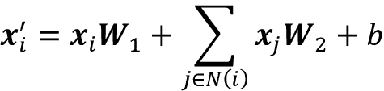
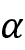
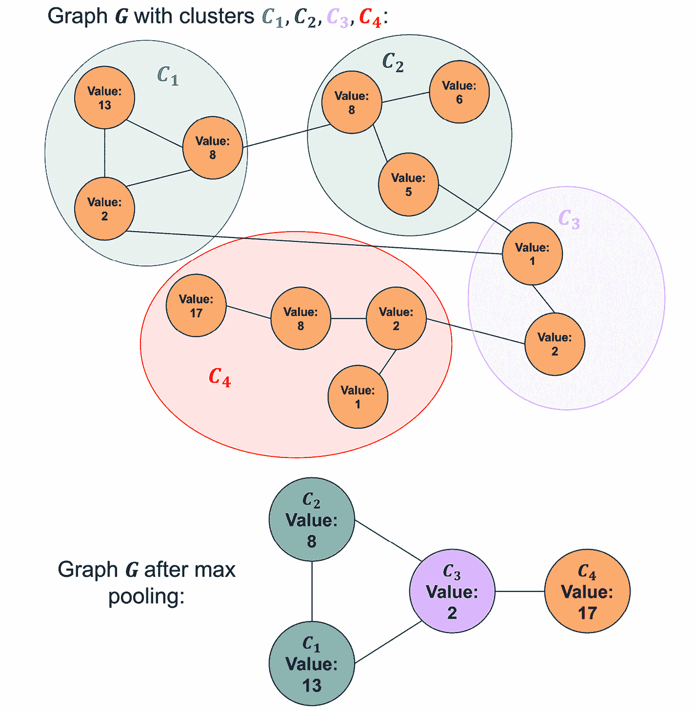
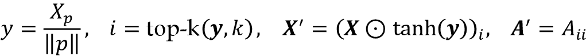
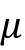

# 18

# 用于捕获图结构数据中依赖关系的图神经网络

在本章中，我们将介绍一类深度学习模型，它们操作的是图数据，即**图神经网络**（**GNNs**）。近年来，GNNs 已经迅速发展。根据 2021 年的*AI 现状报告*（[`www.stateof.ai/2021-report-launch.html`](https://www.stateof.ai/2021-report-launch.html)），GNNs 已经从一种小众领域发展成为 AI 研究中最热门的领域之一。

GNNs 已被应用于多个领域，包括以下几个方面：

+   文本分类 ([`arxiv.org/abs/1710.10903`](https://arxiv.org/abs/1710.10903))

+   推荐系统 ([`arxiv.org/abs/1704.06803`](https://arxiv.org/abs/1704.06803))

+   交通预测 ([`arxiv.org/abs/1707.01926`](https://arxiv.org/abs/1707.01926))

+   药物发现 ([`arxiv.org/abs/1806.02473`](https://arxiv.org/abs/1806.02473))

虽然我们无法涵盖这个快速发展空间中的每一个新想法，但我们将提供一个理解 GNNs 如何运作及如何实施它们的基础。此外，我们还将介绍**PyTorch Geometric**库，该库提供了管理图数据用于深度学习的资源，以及许多不同种类的图层实现，供您在深度学习模型中使用。

本章将涵盖的主题如下：

+   图数据介绍及其如何在深度神经网络中表示和使用

+   图卷积的解释，这是常见图神经网络（**GNNs**）的主要构建模块

+   一个教程展示如何使用 PyTorch Geometric 实现用于分子属性预测的 GNNs

+   GNN 领域尖端方法概述

# 图数据介绍

广义来说，图表达了我们描述和捕捉数据关系的某种方式。图是一种非线性和抽象的数据结构。由于图是抽象对象，因此需要定义具体表示形式，以便对图进行操作。此外，图可以定义具有某些属性，这可能需要不同的表示形式。*图 18.1*总结了常见类型的图表，我们将在接下来的小节中详细讨论它们：


图 18.1：常见类型的图表

## 无向图

**无向图**由通过边连接的**节点**（在图论中通常称为**顶点**）组成，其中节点的顺序及其连接的顺序并不重要。*图 18.2*示意了两个典型的无向图示例，一个是朋友关系图，另一个是由化学键连接的原子组成的化学分子图（我们将在后续章节中详细讨论此类分子图）：


图 18.2：两个无向图示例

可以表示为无向图的其他常见数据示例包括图像、蛋白质相互作用网络和点云。

从数学上讲，无向图*G*是一个二元组（*V*，*E*），其中*V*是图的节点集合，*E*是构成节点对的边的集合。然后，可以将图编码为|*V*|×|*V*|的**邻接矩阵** **A**。矩阵**A**中的每个元素*x*[ij]要么是 1，要么是 0，其中 1 表示节点*i*和*j*之间有边（反之，0 表示没有边）。由于图是无向的，**A**的另一个特性是*x*[ij] = *x*[ji]。

## 有向图

**有向图**与前一节讨论的无向图相比，通过*有向*边连接节点。在数学上，它们的定义方式与无向图相同，除了边集*E*是有序对的集合。因此，矩阵**A**的元素*x*[ij]不一定等于*x*[ji]。

有向图的一个示例是引用网络，其中节点是出版物，从一个节点到另一个节点的边是指一篇给定论文引用的其他论文的节点。


图 18.3：一个有向图的示例

## 标记图

我们感兴趣的许多图形都与每个节点和边相关的附加信息有关。例如，如果考虑前面显示的咖啡因分子，分子可以被表示为图形，其中每个节点都是化学元素（例如，O、C、N 或 H 原子），每条边都是连接其两个节点的键的类型（例如，单键或双键）。这些节点和边的特征需要以某种方式进行编码。给定图形*G*，由节点集和边集元组（*V*，*E*）定义，我们定义一个|*V*|×*f*[V]节点特征矩阵**X**，其中*f*[V]是每个节点标签向量的长度。对于边标签，我们定义一个|*E*|×*f*[E]边特征矩阵**X**[E]，其中*f*[E]是每个边标签向量的长度。

分子是可以表示为**标记图**的数据的一个很好的例子，在本章中我们将一直使用分子数据。因此，我们将利用这个机会在下一节详细讨论它们的表示。

## 将分子表示为图形

作为化学概述，分子可以被看作由化学键结合在一起的原子组。有不同的原子对应于不同的化学元素，例如常见的元素包括碳（C）、氧（O）、氮（N）和氢（H）。此外，有不同类型的化学键形成原子之间的连接，例如单键或双键。

我们可以将分子表示为具有节点标签矩阵的无向图，其中每行是相关节点原子类型的 one-hot 编码。此外，还有一条边标签矩阵，其中每行是相关边键类型的 one-hot 编码。为了简化这种表示，有时会隐含氢原子，因为它们的位置可以通过基本化学规则推断出来。考虑之前看到的咖啡因分子，一个具有隐含氢原子图形表示的示例如 *图 18.4* 所示：


图 18.4：咖啡因分子的图形表示

# 理解图卷积

前一节展示了如何表示图数据。下一个逻辑步骤是讨论我们可以有效利用这些表示的工具。

在接下来的小节中，我们将介绍图卷积，它是构建 GNNs 的关键组成部分。在本节中，我们将看到为什么要在图上使用卷积，并讨论我们希望这些卷积具有哪些属性。然后，我们将通过一个实现示例介绍图卷积。

## 使用图卷积的动机

为了帮助解释图卷积，让我们简要回顾卷积神经网络（CNNs）中如何使用卷积，我们在 *第十四章* *使用深度卷积神经网络分类图像* 中讨论过。在图像的上下文中，我们可以将卷积视为将卷积滤波器在图像上滑动的过程，其中每一步都在滤波器和接受域（它当前所在的图像部分）之间计算加权和。

如在 CNN 章节中讨论的那样，滤波器可以看作是特定特征的检测器。这种特征检测方法对图像非常适用，原因有几点，例如我们可以对图像数据施加以下先验：

1.  **平移不变性**：我们可以在图像中任意位置识别特征（例如平移后）。猫可以被识别为猫，无论它位于图像的左上角、右下角还是其他部位。

1.  **局部性**：附近的像素是密切相关的。

1.  **层次结构**：图像的较大部分通常可以分解为相关较小部分的组合。猫有头和腿；头部有眼睛和鼻子；眼睛有瞳孔和虹膜。

对于对这些先验和 GNNs 所假设的先验有更正式描述感兴趣的读者，可以参考 2019 年文章 *理解图神经网络在学习图拓扑中的表示能力*，作者是 *N. Dehmamy*、*A.-L. Barabasi* 和 *R. Yu* ([`arxiv.org/abs/1907.05008`](https://arxiv.org/abs/1907.05008))。

另一个卷积适合处理图像的原因是可训练参数的数量不依赖于输入的维度。例如，你可以在 256×256 或 9×9 的图像上训练一系列 3×3 的卷积滤波器。（然而，如果同一图像以不同分辨率呈现，则感受野和因此提取的特征将不同。对于更高分辨率的图像，我们可能希望选择更大的核或添加额外的层以有效提取有用的特征。）

像图像一样，图也有自然的先验，可以证明卷积方法的合理性。图像数据和图数据都共享局部性先验。但是，我们如何定义局部性是不同的。在图像中，局部性是在二维空间中定义的，而在图中，它是结构上的局部性。直觉上，这意味着距离一个边的节点更有可能相关，而距离五个边的节点不太可能相关。例如，在引文图中，直接引用的出版物，即距离一个边的出版物，更有可能与相似主题的出版物相关，而与多度分离的出版物则不太相关。

图数据的一个严格先验是**置换不变性**，这意味着节点的排序不会影响输出。这在*图 18.5*中有所说明，改变图的节点排序不会改变图的结构：


图 18.5：表示同一图的不同邻接矩阵

由于同一图可以用多个邻接矩阵表示，正如*图 18.5*所示，因此任何图卷积都需要是置换不变的。

对于图来说，卷积方法也是理想的，因为它可以使用固定的参数集处理不同大小的图。这个性质对于图而言可能比图像更为重要。例如，有许多具有固定分辨率的图像数据集，可以使用全连接方法（例如使用多层感知机），正如我们在*第十一章*，*从头开始实现多层人工神经网络*中所见。相反，大多数图数据集包含不同大小的图。

虽然图像卷积运算符是标准化的，但是图卷积有许多不同种类，并且新图卷积的开发是一个非常活跃的研究领域。我们的重点是提供一般的思路，以便读者可以理解他们希望利用的图神经网络。为此，接下来的小节将展示如何在 PyTorch 中实现基本的图卷积。然后，在下一节中，我们将从头开始在 PyTorch 中构建一个简单的 GNN。

## 实现基本的图卷积

在本小节中，我们将介绍一个基本的图卷积函数，并看看当它应用于一个图时会发生什么。考虑以下图及其表示：


图 18.6: 图的表示

*图 18.6* 描述了一个无向图，节点标签由 *n*×*n* 邻接矩阵 **A** 和 *n*×*f*[in] 节点特征矩阵 **X** 指定，其中唯一的特征是每个节点的颜色的 one-hot 表示—绿色（G）、蓝色（B）或橙色（O）。

图形处理和可视化中最多功能的库之一是 NetworkX，我们将使用它来说明如何从标签矩阵 **X** 和节点矩阵 **A** 构建图形。

**安装 NetworkX**

NetworkX 是一个方便的 Python 库，用于处理和可视化图形。可以通过 `pip` 安装：

```py
pip install networkx 
```

我们使用版本 2.6.2 来创建本章中的图形可视化。更多信息，请访问官方网站 [`networkx.org`](https://networkx.org)。

使用 NetworkX，我们可以按如下方式构造图形：

```py
>>> import numpy as np
>>> import networkx as nx
>>> G = nx.Graph()
... # Hex codes for colors if we draw graph
>>> blue, orange, green = "#1f77b4", "#ff7f0e", "#2ca02c"
>>> G.add_nodes_from([
...     (1, {"color": blue}),
...     (2, {"color": orange}),
...     (3, {"color": blue}),
...     (4, {"color": green})
... ])
>>> G.add_edges_from([(1,2), (2,3), (1,3), (3,4)])
>>> A = np.asarray(nx.adjacency_matrix(G).todense())
>>> print(A)
[[0 1 1 0]
[1 0 1 0]
[1 1 0 1]
[0 0 1 0]]
>>> def build_graph_color_label_representation(G, mapping_dict):
...     one_hot_idxs = np.array([mapping_dict[v] for v in
...         nx.get_node_attributes(G, 'color').values()])
>>>     one_hot_encoding = np.zeros(
...         (one_hot_idxs.size, len(mapping_dict)))
>>>     one_hot_encoding[
...         np.arange(one_hot_idxs.size), one_hot_idxs] = 1
>>>     return one_hot_encoding
>>> X = build_graph_color_label_representation(
...     G, {green: 0, blue: 1, orange: 2})
>>> print(X)
[[0., 1., 0.],
[0., 0., 1.],
[0., 1., 0.],
[1., 0., 0.]] 
```

要绘制前述代码构造的图形，我们可以使用以下代码：

```py
>>> color_map = nx.get_node_attributes(G, 'color').values()
>>> nx.draw(G,with_labels=True, node_color=color_map) 
```

在上述代码示例中，我们首先从 NetworkX 初始化了一个新的 `Graph` 对象。然后，我们添加了节点 1 到 4，并指定了用于可视化的颜色规范。在添加节点后，我们指定了它们的连接（边）。使用 NetworkX 的 `adjacency_matrix` 构造函数，我们创建了邻接矩阵 **A**，并且我们的自定义 `build_graph_color_label_representation` 函数从我们之前添加到 `Graph` 对象的信息创建了节点标签矩阵 **X**。

通过图卷积，我们可以将 **X** 的每一行解释为存储在相应节点上的信息的嵌入。图卷积根据其邻居节点和自身的嵌入更新每个节点的嵌入。对于我们的示例实现，图卷积将采用以下形式：



在这里， 是节点 *i* 的更新嵌入；**W**[1] 和 **W**[2] 是 *f*[in]×*f*[out] 的可学习滤波器权重矩阵；*b* 是长度为 *f*[out] 的可学习偏置向量。

两个权重矩阵 **W**[1] 和 **W**[2] 可以被视为滤波器组，其中每一列都是一个单独的滤波器。请注意，当图数据上的局部性先验成立时，这种滤波器设计是最有效的。如果一个节点的值与另一个节点的值高度相关，而这两个节点之间存在许多边，单个卷积将无法捕捉到这种关系。堆叠卷积将捕捉更远的关系，如图 18.7 所示（为简化起见，我们将偏置设为零）：


图 18.7: 从图中捕获关系

图 18.7 中展示的图卷积的设计符合我们对图数据的先验假设，但如何以矩阵形式实现邻居节点之间的求和可能不是很明确。这就是我们利用邻接矩阵 **A** 的地方。这个卷积的矩阵形式是 **XW**[1] + **AXW**[2]。在 NumPy 中，初始化这一层并在前一个图上进行前向传播可以写成如下形式：

```py
>>> f_in, f_out = X.shape[1], 6
>>> W_1 = np.random.rand(f_in, f_out)
>>> W_2 = np.random.rand(f_in, f_out)
>>> h = np.dot(X, W_1)+ np.dot(np.dot(A,X), W_2) 
```

计算图卷积的前向传播就是这么简单。

最终，我们希望图卷积层通过利用由 **A** 提供的结构信息（连接性）来更新编码在 **X** 中的节点信息的表示。有许多潜在的方法可以做到这一点，这在已开发的许多类型的图卷积中体现出来。

要讨论不同的图卷积，通常最好是它们具有一个统一的框架。幸运的是，*Justin Gilmer*和他的同事在 2017 年的《*神经信息传递用于量子化学*》中提出了这样一个框架，[`arxiv.org/abs/1704.01212`](https://arxiv.org/abs/1704.01212)。

在这个**消息传递**框架中，图中的每个节点都有一个关联的隐藏状态 ，其中 *i* 是节点在时间步 *t* 的索引。初始值  定义为 **X**[i]，即与节点 *i* 相关的 **X** 的行。

每个图卷积可以分为消息传递阶段和节点更新阶段。设 *N*(*i*) 为节点 *i* 的邻居。对于无向图，*N*(*i*) 是与节点 *i* 共享边的节点集合。对于有向图，*N*(*i*) 是具有以节点 *i* 为端点的边的节点集合。消息传递阶段可以表述如下：


在这里，*M*[t] 是一个消息函数。在我们的示例层中，我们将此消息函数定义为 。使用更新函数 *U*[t] 的节点更新阶段为 。在我们的示例层中，此更新为 。

*图 18.8* 展示了消息传递的思想并总结了我们实现的卷积：


图 18.8：在图上实现的卷积和消息形式

在下一节中，我们将把这个图卷积层整合到一个在 PyTorch 中实现的 GNN 模型中。

# 在 PyTorch 中从零开始实现 GNN

上一节重点介绍了理解和实现图卷积操作。在本节中，我们将通过一个基本的图神经网络实现来演示如何从头开始应用这些方法到图形中。如果这种方法看起来复杂，不用担心；GNN 是相对复杂的模型。因此，我们将在后面的章节中介绍 PyTorch Geometric，它提供了工具来简化图神经网络的实现和数据管理。

## 定义 NodeNetwork 模型

我们将从头开始展示一个 PyTorch 实现的 GNN 的部分。我们将采取自顶向下的方法，从主神经网络模型开始，我们称之为`NodeNetwork`，然后填充具体细节：

```py
import networkx as nx
import torch
from torch.nn.parameter import Parameter
import numpy as np
import math
import torch.nn.functional as F
class NodeNetwork(torch.nn.Module):
    def __init__(self, input_features):
        super().__init__()
        self.conv_1 = BasicGraphConvolutionLayer (
            input_features, 32)
        self.conv_2 = BasicGraphConvolutionLayer(32, 32)
        self.fc_1 = torch.nn.Linear(32, 16)
        self.out_layer = torch.nn.Linear(16, 2)
    def forward(self, X, A, batch_mat):
        x = F.relu(self.conv_1(X, A))
        x = F.relu(self.conv_2(x, A))
        output = global_sum_pool(x, batch_mat)
        output = self.fc_1(output)
        output = self.out_layer(output)
        return F.softmax(output, dim=1) 
```

我们刚刚定义的`NodeNetwork`模型可以总结如下：

1.  执行两个图卷积（`self.conv_1`和`self.conv_2`）

1.  通过`global_sum_pool`汇总所有节点嵌入，稍后我们将定义

1.  通过两个全连接层（`self.fc_1`和`self.out_layer`）运行池化嵌入

1.  通过 softmax 输出类成员概率

网络结构以及每个层所做的可视化总结在*Figure 18.9*中：


图 18.9: 每个神经网络层的可视化

各个方面，如图卷积层和全局池化，将在接下来的小节中讨论。

## 编码 NodeNetwork 的图卷积层

现在，让我们定义图卷积操作（`BasicGraphConvolutionLayer`），这在之前的`NodeNetwork`类中使用过*:*

```py
class BasicGraphConvolutionLayer(torch.nn.Module):
    def __init__(self, in_channels, out_channels):
        super().__init__()
        self.in_channels = in_channels
        self.out_channels = out_channels
        self.W2 = Parameter(torch.rand(
            (in_channels, out_channels), dtype=torch.float32))
        self.W1 = Parameter(torch.rand(
            (in_channels, out_channels), dtype=torch.float32))

        self.bias = Parameter(torch.zeros(
                out_channels, dtype=torch.float32))
    def forward(self, X, A):
        potential_msgs = torch.mm(X, self.W2)
        propagated_msgs = torch.mm(A, potential_msgs)
        root_update = torch.mm(X, self.W1)
        output = propagated_msgs + root_update + self.bias
        return output 
```

与全连接层和图像卷积层一样，我们添加偏置项，以便调整层输出的线性组合的截距（在应用非线性如 ReLU 之前）。`forward()`方法实现了前向传播的矩阵形式，我们在前一小节中讨论过，同时加入了一个偏置项。

要尝试`BasicGraphConvolutionLayer`，让我们将其应用到我们之前在*实现基本图卷积*节中定义的图和邻接矩阵上：

```py
>>> print('X.shape:', X.shape)X.shape: (4, 3)
>>> print('A.shape:', A.shape)
A.shape: (4, 4)
>>> basiclayer = BasicGraphConvolutionLayer(3, 8)
>>> out = basiclayer(
...     X=torch.tensor(X, dtype=torch.float32),
...     A=torch.tensor(A, dtype=torch.float32)
... )
>>> print('Output shape:', out.shape)
Output shape: torch.Size([4, 8]) 
```

基于上述代码示例，我们可以看到我们的`BasicGraphConvolutionLayer`将由三个特征组成的四节点图转换为具有八个特征的表示形式。

## 添加全局池化层以处理不同大小的图

接下来，我们定义了在`NodeNetwork`类中使用的`global_sum_pool()`函数，其中`global_sum_pool()`实现了一个全局池化层。全局池化层将图的所有节点嵌入聚合为一个固定大小的输出。如图*图 18.9*所示，`global_sum_pool()`对图的所有节点嵌入求和。我们注意到，这种全局池化与 CNN 中使用的全局平均池化相对类似，后者在数据通过全连接层之前使用，正如我们在*第十四章*中看到的，*用深度卷积神经网络对图像进行分类*。

对所有节点嵌入求和会导致信息丢失，因此更好的做法是重新整形数据，但由于图可以具有不同的大小，这是不可行的。全局池化可以使用任何排列不变的函数，例如`sum`、`max`和`mean`。这里是`global_sum_pool()`的实现：

```py
def global_sum_pool(X, batch_mat):
    if batch_mat is None or batch_mat.dim() == 1:
        return torch.sum(X, dim=0).unsqueeze(0)
    else:
        return torch.mm(batch_mat, X) 
```

如果数据没有批处理或批处理大小为一，此函数只是对当前节点嵌入求和。否则，嵌入将与`batch_mat`相乘，其结构基于图数据的批处理方式。

当数据集中的所有数据具有相同的维度时，批处理数据就像通过堆叠数据添加一个维度一样简单。（附注：在 PyTorch 中默认的批处理函数中调用的函数实际上称为`stack`。）由于图的大小各不相同，除非使用填充，否则这种方法在处理图数据时是不可行的。然而，在图的大小差异显著时，填充可能效率低下。通常，处理不同大小的图的更好方法是将每个批次视为单个图，其中每个批次中的图是与其余图断开连接的子图。这在*图 18.10*中有所说明：


图 18.10: 处理不同大小的图的方法

为了更正式地描述*图 18.10*，假设我们有大小为*n*[1]，...，*n*[k]的图*G*[1]，...，*G*[k]，每个节点有*f*个特征。此外，我们还有相应的邻接矩阵**A**[1]，...，**A**[k]和特征矩阵**X**[1]，...，**X**[k]。设*N*为节点的总数，，*s*[1] = 0，且对于，*s*[i] = *s*[i-1] + *n*[i-1]。如图所示，我们定义了一个具有*N*×*N*邻接矩阵**A**[B]和*N*×*f*特征矩阵**X**[B]的图*G*[B]。使用 Python 索引表示，**A**[B][*s*[i]:*s*[i]+*n*[i], *s*[i]:*s*[i]+*n*[i]] = **A**[i]，并且**A**[B]的其他元素在这些索引集之外都是 0。此外，**X**[B][*s*[i]:*s*[i]+*n*[i], :] = **X**[i]。

根据设计，断开连接的节点永远不会在图卷积的同一接收场中。因此，当通过图卷积反向传播*G*[B]的梯度时，批次中每个图附加的梯度将是独立的。这意味着，如果我们将一组图卷积视为函数*f*，如果*h*[B] = *f*(*X*[B], *A*[B])和*h*[i] = *f*(*X*[i], *A*[i])，那么*h*[B][*s*[i]:*s*[i] + *n*, :] = *h*[i]。如果总和全局池从*h*[B]中提取*h*[i]的各自向量的总和，并通过完全连接的层传递该向量堆栈，则在整个反向传播过程中将保持批次中每个项目的梯度独立。

这就是`global_sum_pool()`中`batch_mat`的目的——作为一个图选择掩码，用于保持批次中的图分开。我们可以使用以下代码为大小为*n*[1], ..., *n*[k]的图生成此掩码：

```py
def get_batch_tensor(graph_sizes):
    starts = [sum(graph_sizes[:idx])
              for idx in range(len(graph_sizes))]
    stops = [starts[idx] + graph_sizes[idx]
             for idx in range(len(graph_sizes))]
    tot_len = sum(graph_sizes)
    batch_size = len(graph_sizes)
    batch_mat = torch.zeros([batch_size, tot_len]).float()
    for idx, starts_and_stops in enumerate(zip(starts, stops)):
        start = starts_and_stops[0]
        stop = starts_and_stops[1]
        batch_mat[idx,start:stop] = 1
    return batch_mat 
```

因此，给定批次大小*b*，`batch_mat`是一个*b*×*N*矩阵，其中 batch_mat[*i*–1, *s*[i]:*s*[i] + *n*[i]] = 1 对于，并且在这些索引集之外的元素为 0。以下是构建某些*G*[B]表示和相应的批次矩阵的整理函数：

```py
# batch is a list of dictionaries each containing
# the representation and label of a graph
def collate_graphs(batch):
    adj_mats = [graph['A'] for graph in batch]
    sizes = [A.size(0) for A in adj_mats]
    tot_size = sum(sizes)
    # create batch matrix
    batch_mat = get_batch_tensor(sizes)
    # combine feature matrices
    feat_mats = torch.cat([graph['X'] for graph in batch], dim=0)
    # combine labels
    labels = torch.cat([graph['y'] for graph in batch], dim=0)
    # combine adjacency matrices
    batch_adj = torch.zeros([tot_size, tot_size], dtype=torch.float32)
    accum = 0
    for adj in adj_mats:
        g_size = adj.shape[0]
        batch_adj[accum:accum+g_size,accum:accum+g_size] = adj
        accum = accum + g_size
    repr_and_label = {'A': batch_adj,
            'X': feat_mats, 'y': labels,
            'batch': batch_mat}
    return repr_and_label 
```

## 准备 DataLoader

在本节中，我们将看到前面各小节中的代码如何结合在一起。首先，我们将生成一些图并将它们放入 PyTorch `Dataset`中。然后，我们将在我们的 GNN 中使用`collate`函数在`DataLoader`中使用它。

但在我们定义图之前，让我们实现一个函数来构建一个字典表示，稍后我们将使用它：

```py
def get_graph_dict(G, mapping_dict):
    # Function builds dictionary representation of graph G
    A = torch.from_numpy(
        np.asarray(nx.adjacency_matrix(G).todense())).float()
    # build_graph_color_label_representation()
    # was introduced with the first example graph
    X = torch.from_numpy(
      build_graph_color_label_representation(
               G, mapping_dict)).float()
    # kludge since there is not specific task for this example
    y = torch.tensor([[1,0]]).float()
    return {'A': A, 'X': X, 'y': y, 'batch': None} 
```

这个函数接受一个 NetworkX 图，并返回一个包含其邻接矩阵`A`，节点特征矩阵`X`和一个二进制标签`y`的字典。由于我们实际上不会在真实任务中训练这个模型，所以我们只是任意设置标签。然后，`nx.adjacency_matrix()`接受一个 NetworkX 图并返回一个稀疏表示，我们使用`todense()`将其转换为稠密的`np.array`形式。

现在我们将构造图，并使用`get_graph_dict`函数将 NetworkX 图转换为我们的网络可以处理的格式：

```py
>>> # building 4 graphs to treat as a dataset
>>> blue, orange, green = "#1f77b4", "#ff7f0e","#2ca02c"
>>> mapping_dict= {green:0, blue:1, orange:2}
>>> G1 = nx.Graph()
>>> G1.add_nodes_from([
...     (1,{"color": blue}),
...     (2,{"color": orange}),
...     (3,{"color": blue}),
...     (4,{"color": green})
... ])
>>> G1.add_edges_from([(1, 2), (2, 3), (1, 3), (3, 4)])
>>> G2 = nx.Graph()
>>> G2.add_nodes_from([
...     (1,{"color": green}),
...     (2,{"color": green}),
...     (3,{"color": orange}),
...     (4,{"color": orange}),
...     (5,{"color": blue})
... ])
>>> G2.add_edges_from([(2, 3),(3, 4),(3, 1),(5, 1)])
>>> G3 = nx.Graph()
>>> G3.add_nodes_from([
...     (1,{"color": orange}),
...     (2,{"color": orange}),
...     (3,{"color": green}),
...     (4,{"color": green}),
...     (5,{"color": blue}),
...     (6,{"color":orange})
... ])
>>> G3.add_edges_from([(2,3), (3,4), (3,1), (5,1), (2,5), (6,1)])
>>> G4 = nx.Graph()
>>> G4.add_nodes_from([
...     (1,{"color": blue}),
...     (2,{"color": blue}),
...     (3,{"color": green})
... ])
>>> G4.add_edges_from([(1, 2), (2, 3)])
>>> graph_list = [get_graph_dict(graph, mapping_dict) for graph in
...     [G1, G2, G3, G4]] 
```

此代码生成的图在*Figure 18.11*中可视化：


图 18.11：生成的四个图

这段代码块构造了四个 NetworkX 图并将它们存储在一个列表中。在这里，`nx.Graph()`的构造函数初始化了一个空图，而`add_nodes_from()`从一个元组列表中将节点添加到空图中。每个元组中的第一个项目是节点的名称，第二个项目是该节点属性的字典。

图的`add_edges_from()`方法接受一个元组列表，其中每个元组定义其元素（节点）之间的边。现在，我们可以为这些图构建一个 PyTorch `Dataset`：

```py
from torch.utils.data import Dataset
class ExampleDataset(Dataset):
    # Simple PyTorch dataset that will use our list of graphs
    def __init__(self, graph_list):
        self.graphs = graph_list
    def __len__(self):
        return len(self.graphs)
    def __getitem__(self,idx):
        mol_rep = self.graphs[idx]
        return mol_rep 
```

尽管使用自定义`Dataset`可能看起来是不必要的工作，但它允许我们展示如何在`DataLoader`中使用`collate_graphs()`：

```py
>>> from torch.utils.data import DataLoader
>>> dset = ExampleDataset(graph_list)
>>> # Note how we use our custom collate function
>>> loader = DataLoader(
...     dset, batch_size=2, shuffle=False,
...     collate_fn=collate_graphs) 
```

## 使用 NodeNetwork 进行预测

在我们定义了所有必要的函数并设置了 `DataLoader` 后，我们现在初始化一个新的 `NodeNetwork` 并将其应用于我们的图数据：

```py
>>> node_features = 3
>>> net = NodeNetwork(node_features)
>>> batch_results = []
>>> for b in loader:
...     batch_results.append(
...         net(b['X'], b['A'], b['batch']).detach()) 
```

注意，为简洁起见，我们没有包括训练循环；然而，可以通过计算预测和真实类标签之间的损失，通过 `.backward()` 反向传播损失，并通过基于梯度下降的优化器更新模型权重来以常规方式训练 GNN 模型。我们将此留作读者的可选练习。在下一节中，我们将展示如何使用 PyTorch Geometric 实现 GNN，该库实现了更复杂的 GNN 代码。

要继续我们之前的代码，现在让我们直接向模型提供一个单一的输入图，而不使用 `DataLoader`：

```py
>>> G1_rep = dset[1]
>>> G1_single = net(
...     G1_rep['X'], G1_rep['A'], G1_rep['batch']).detach() 
```

现在，我们可以比较将 GNN 应用于单个图 (`G1_single`) 和从 `DataLoader` 中获取的第一个图（也就是第一个图 `G1`，因为我们设置了 `shuffle=False`），以确保批处理加载器工作正常。通过使用 `torch.isclose()`（以考虑四舍五入误差），我们可以看到结果是等价的，这是我们希望看到的：

```py
>>> G1_batch = batch_results[0][1]
>>> torch.all(torch.isclose(G1_single, G1_batch))
tensor(True) 
```

恭喜！现在您了解如何构建、设置和运行基本的 GNN。但是，从本介绍中，您可能意识到管理和操作图数据可能有些繁琐。而且，我们甚至没有构建使用边标签的图卷积，这将进一步复杂化事务。幸运的是，PyTorch Geometric 提供了许多 GNN 层的实现，使这一切变得更加简单。在下一小节中，我们将通过在分子数据上实现和训练更复杂的 GNN 的端到端示例来介绍这个库。

# 使用 PyTorch Geometric 库实现 GNN

在本节中，我们将使用 PyTorch Geometric 库实现 GNN，该库简化了训练 GNN 的过程。我们将 GNN 应用于 QM9 数据集，该数据集由小分子组成，以预测各向同性极化率，这是分子在电场中电荷畸变倾向的一种度量。

**安装 PyTorch Geometric**

可以通过 conda 或 pip 安装 PyTorch Geometric。我们建议您访问官方文档网站 [`pytorch-geometric.readthedocs.io/en/latest/notes/installation.html`](https://pytorch-geometric.readthedocs.io/en/latest/notes/installation.html) 选择适合您操作系统的安装命令。在本章中，我们使用 pip 安装了版本 2.0.2 以及其 `torch-scatter` 和 `torch-sparse` 依赖：

```py
pip install torch-scatter==2.0.9
pip install torch-sparse==0.6.12
pip install torch-geometric==2.0.2 
```

让我们从加载小分子数据集开始，并看看 PyTorch Geometric 如何存储数据：

```py
>>> # For all examples in this section we use the following imports.
>>> # Note that we are using torch_geometric's DataLoader.
>>> import torch
>>> from torch_geometric.datasets import QM9
>>> from torch_geometric.loader import DataLoader
>>> from torch_geometric.nn import NNConv, global_add_pool
>>> import torch.nn.functional as F
>>> import torch.nn as nn
>>> import numpy as np
>>> # let's load the QM9 small molecule dataset
>>> dset = QM9('.')
>>> len(dset)
130831
>>> # Here's how torch geometric wraps data
>>> data = dset[0]
>>> data
Data(edge_attr=[8, 4], edge_index=[2, 8], idx=[1], name="gdb_1", pos=[5, 3], x=[5, 11], y=[1, 19], z=[5])
>>> # can access attributes directly
>>> data.z
tensor([6, 1, 1, 1, 1])
>>> # the atomic number of each atom can add attributes
>>> data.new_attribute = torch.tensor([1, 2, 3])
>>> data
Data(edge_attr=[8, 4], edge_index=[2, 8], idx=[1], name="gdb_1", new_attribute=[3], pos=[5, 3], x=[5, 11], y=[1, 19], z=[5])
>>> # can move all attributes between devices
>>> device = torch.device(
...     "cuda:0" if torch.cuda.is_available() else "cpu"
... )
>>> data.to(device)
>>> data.new_attribute.is_cuda
True 
```

`Data`对象是图数据的方便、灵活的包装器。请注意，许多 PyTorch Geometric 对象要求数据对象中包含某些关键字才能正确处理它们。具体来说，`x`应包含节点特征，`edge_attr`应包含边特征，`edge_index`应包括边列表，而`y`应包含标签。QM9 数据还包含一些值得注意的附加属性：`pos`，分子中每个原子在 3D 网格中的位置，以及`z`，分子中每个原子的原子序数。QM9 中的标签是分子的一些物理属性，如偶极矩、自由能、焓或各向同性极化率。我们将实现一个 GNN，并在 QM9 上训练它来预测各向同性极化率。

**QM9 数据集**

QM9 数据集包含 133,885 个小有机分子，标有几何、能量、电子和热力学性质。 QM9 是开发预测化学结构-性质关系和混合量子力学/机器学习方法的常见基准数据集。有关数据集的更多信息，请访问[`quantum-machine.org/datasets/`](http://quantum-machine.org/datasets/)。

分子的键类型很重要；即通过某种键类型连接的哪些原子，例如单键或双键，都很重要。因此，我们将使用能够利用边特征的图卷积，例如`torch_geometric.nn.NNConv`层。 （如果您对实现细节感兴趣，可以在[`pytorch-geometric.readthedocs.io/en/latest/_modules/torch_geometric/nn/conv/nn_conv.html#NNConv`](https://pytorch-geometric.readthedocs.io/en/latest/_modules/torch_geometric/nn/conv/nn_conv.html#NNConv)找到其源代码。）

在`NNConv`层中，这种卷积采用以下形式：


在这里，*h*是由一组权重参数化的神经网络，而**W**是节点标签的权重矩阵。这种图卷积与我们之前从头实现的非常相似：


唯一的实际区别在于等效的**W**[2]，即神经网络*h*，是基于边标签参数化的，这允许权重因不同的边标签而变化。通过以下代码，我们实现了一个使用两个这样的图卷积层（`NNConv`）的 GNN：

```py
class ExampleNet(torch.nn.Module):
    def __init__(self, num_node_features, num_edge_features):
        super().__init__()
        conv1_net = nn.Sequential(
            nn.Linear(num_edge_features, 32),
            nn.ReLU(),
            nn.Linear(32, num_node_features*32))
        conv2_net = nn.Sequential(
            nn.Linear(num_edge_features, 32),
            nn.ReLU(),
            nn.Linear(32, 32*16))
        self.conv1 = NNConv(num_node_features, 32, conv1_net)
        self.conv2 = NNConv(32,16, conv2_net)
        self.fc_1 = nn.Linear(16, 32)
        self.out = nn.Linear(32, 1)
    def forward(self, data):
        batch, x, edge_index, edge_attr = (
            data.batch, data.x, data.edge_index, data.edge_attr)
        # First graph conv layer
        x = F.relu(self.conv1(x, edge_index, edge_attr))
        # Second graph conv layer
        x = F.relu(self.conv2(x, edge_index, edge_attr))
        x = global_add_pool(x,batch)
        x = F.relu(self.fc_1(x))
        output = self.out(x)
        return output 
```

我们将训练这个 GNN 来预测分子的各向同性极化率，这是衡量分子电荷分布相对于外部电场扭曲倾向的相对指标。我们将把 QM9 数据集分为训练、验证和测试集，并使用 PyTorch Geometric `DataLoader`。请注意，这些不需要特殊的整理函数，但需要一个具有适当命名属性的`Data`对象。

接下来，让我们分割数据集：

```py
>>> from torch.utils.data import random_split
>>> train_set, valid_set, test_set = random_split(
...     dset,[110000, 10831, 10000])
>>> trainloader = DataLoader(train_set, batch_size=32, shuffle=True)
>>> validloader = DataLoader(valid_set, batch_size=32, shuffle=True)
>>> testloader = DataLoader(test_set, batch_size=32, shuffle=True) 
```

下面的代码将在 GPU 上初始化并训练网络（如果可用）：

```py
>>> # initialize a network
>>> qm9_node_feats, qm9_edge_feats = 11, 4
>>> net = ExampleNet(qm9_node_feats, qm9_edge_feats)
>>> # initialize an optimizer with some reasonable parameters
>>> optimizer = torch.optim.Adam(
...     net.parameters(), lr=0.01)
>>> epochs = 4
>>> target_idx = 1 # index position of the polarizability label
>>> device = torch.device("cuda:0" if
...                       torch.cuda.is_available() else "cpu")
>>> net.to(device) 
```

训练循环如下面的代码所示，遵循我们在前几个 PyTorch 章节中遇到的熟悉模式，因此我们可以跳过详细的解释。然而，值得强调的一个细节是，这里我们计算的是均方误差（MSE）损失，而不是交叉熵，因为极化率是一个连续的目标，而不是一个类标签。

```py
>>> for total_epochs in range(epochs):
...     epoch_loss = 0
...     total_graphs = 0
...     net.train()
...     for batch in trainloader:
...         batch.to(device)
...         optimizer.zero_grad()
...         output = net(batch)
...         loss = F.mse_loss(
...             output,batch.y[:, target_idx].unsqueeze(1))
...         loss.backward()
...         epoch_loss += loss.item()
...         total_graphs += batch.num_graphs
...         optimizer.step()
...     train_avg_loss = epoch_loss / total_graphs
...     val_loss = 0
...     total_graphs = 0
...     net.eval()
...     for batch in validloader:
...         batch.to(device)
...         output = net(batch)
...         loss = F.mse_loss(
...             output,batch.y[:, target_idx].unsqueeze(1))
...         val_loss += loss.item()
...         total_graphs += batch.num_graphs
...     val_avg_loss = val_loss / total_graphs
...     print(f"Epochs: {total_epochs} | "
...           f"epoch avg. loss: {train_avg_loss:.2f} | "
...           f"validation avg. loss: {val_avg_loss:.2f}")
Epochs: 0 | epoch avg. loss: 0.30 | validation avg. loss: 0.10
Epochs: 1 | epoch avg. loss: 0.12 | validation avg. loss: 0.07
Epochs: 2 | epoch avg. loss: 0.10 | validation avg. loss: 0.05
Epochs: 3 | epoch avg. loss: 0.09 | validation avg. loss: 0.07 
```

在前四个训练时期，训练和验证损失都在减少。数据集很大，在 CPU 上训练可能需要一点时间，因此我们在四个时期后停止训练。但是，如果进一步训练模型，损失将继续改善。您可以继续训练模型以查看如何改进性能。

下面的代码预测了测试数据上的值并收集了真实标签：

```py
>>> net.eval()
>>> predictions = []
>>> real = []
>>> for batch in testloader:
...     output = net(batch.to(device))
...     predictions.append(output.detach().cpu().numpy())
...     real.append(
...             batch.y[:,target_idx] .detach().cpu().numpy())
>>> real = np.concatenate(real)
>>> predictions = np.concatenate(predictions) 
```

现在我们可以用测试数据的子集制作散点图。由于测试数据集相对较大（10,000 个分子），结果可能有些混乱，为简单起见，我们仅绘制前 500 个预测和目标：

```py
>>> import matplotlib.pyplot as plt
>>> plt.scatter(real[:500], predictions[:500])
>>> plt.xlabel('Isotropic polarizability')
>>> plt.ylabel('Predicted isotropic polarizability') 
```

结果的图示如下：


图 18.12：预测的各向同性极化率与实际各向同性极化率的图示

根据图，考虑到点相对靠近对角线，我们简单的 GNN 似乎在预测各向同性极化值时表现不错，即使没有超参数调整。

**TorchDrug – 基于 PyTorch 的药物发现库**

PyTorch Geometric 是一个全面的通用图形库，用于处理图形，包括分子，正如您在本节中看到的。如果您对更深入的分子工作和药物发现感兴趣，我们还建议考虑最近开发的 TorchDrug 库，该库提供了许多方便的工具来处理分子。您可以在这里了解更多关于 TorchDrug 的信息：[`torchdrug.ai/`](https://torchdrug.ai/)。

# 其他 GNN 层和最新发展

本节将介绍一些您可以在 GNN 中使用的额外层次，此外还将提供该领域最新发展的高层次概述。虽然我们将为这些层背后的直觉和实现提供背景，这些概念在数学上可能有些复杂，但不要气馁。这些是可选的主题，不必掌握所有这些实现的细微之处。理解层背后的一般思想将足以使用我们引用的 PyTorch Geometric 实现进行实验。

接下来的小节将介绍谱图卷积层、图池化层和图归一化层。最后，最终的小节将对一些更高级的图神经网络进行总览。

## 谱图卷积

到目前为止，我们使用的图卷积都是空间性质的。这意味着它们根据与图相关的拓扑空间聚合信息，这只是说空间卷积在节点的局部邻域上操作的一种花哨方式。因此，如果利用空间卷积的 GNN 需要捕捉图数据中复杂的全局模式，那么网络就需要堆叠多个空间卷积。在这些全局模式很重要但需要限制网络深度的情况下，谱图卷积是一种可以考虑的替代卷积类型。

谱图卷积的操作方式与空间图卷积不同。谱图卷积通过利用图的频谱—其特征值集合—通过计算称为*图拉普拉斯*的图的归一化版本的特征分解来操作。最后一句可能看起来很复杂，所以让我们逐步分解并讨论它。

对于无向图，图的拉普拉斯矩阵定义为 **L** = **D** - **A**，其中 **A** 是图的邻接矩阵，**D** 是度矩阵。度矩阵是一个对角矩阵，其中对角线上的元素在与邻接矩阵的第 *i* 行相关的节点的进出边数。

**L** 是一个实对称矩阵，已经证明实对称矩阵可以分解为 ，其中 **Q** 是正交矩阵，其列是 **L** 的特征向量， 是对角矩阵，其元素是 **L** 的特征值。你可以把 **Q** 看作提供了图结构的底层表示。与使用由 **A** 定义的图的局部邻域的空间卷积不同，谱卷积利用来自 **Q** 的替代结构表示来更新节点嵌入。

下面的谱卷积示例利用了 *对称归一化图拉普拉斯* 的特征分解，对于一个图，它定义如下：


这里，**I** 是单位矩阵。这是因为图拉普拉斯归一化可以帮助稳定基于梯度的训练过程，类似于特征标准化。

鉴于  是 **L**[sym] 的特征分解，图卷积定义如下：


这里，**W** 是一个可训练的权重矩阵。括号里的内容实质上是通过一个编码图结构关系的矩阵来乘以 **X** 和 **W**。这里的  运算符表示内部项的逐元素乘法，而外部的 **Q** 将结果映射回原始基础。这种卷积有一些不良特性，因为计算图的特征分解具有 *O*(*n*³) 的计算复杂度。这意味着它速度较慢，并且如其结构所示，**W** 取决于图的大小。因此，谱卷积只能应用于相同大小的图。此外，该卷积的感受野是整个图，当前的配方不能进行调整。然而，已经开发出各种技术和卷积来解决这些问题。

例如，Bruna 和同事 ([`arxiv.org/abs/1312.6203`](https://arxiv.org/abs/1312.6203)) 引入了一种平滑方法，通过一组函数的逼近来解决 **W** 的大小依赖性，每个函数都乘以它们自己的标量参数，。也就是说，给定函数集 *f*[1], ..., *f*[n]，。这组函数的维度可以变化。然而，由于  保持标量，卷积参数空间可以独立于图的大小。

值得一提的其他谱卷积包括 Chebyshev 图卷积 ([`arxiv.org/abs/1606.09375`](https://arxiv.org/abs/1606.09375))，它可以在更低的时间复杂度下近似原始谱卷积，并且可以具有不同大小的感受野。Kipf 和 Welling ([`arxiv.org/abs/1609.02907`](https://arxiv.org/abs/1609.02907)) 引入了一个与 Chebyshev 卷积类似的卷积，但减少了参数负担。这两种的实现都可以在 PyTorch Geometric 中找到，分别是 `torch_geometric.nn.ChebConv` 和 `torch_geometric.nn.GCNConv`，如果你想尝试谱卷积，这是个合理的起点。

## 池化

我们将简要讨论一些为图形开发的池化层的例子。虽然池化层提供的下采样在 CNN 架构中是有益的，但在 GNN 中下采样的好处并不是很明显。

图像数据的池化层滥用了空间局部性，而图形则没有。如果提供图中节点的聚类，我们可以定义图池化层如何对节点进行池化。然而，如何定义最佳聚类仍不明确，并且不同的聚类方法可能适合不同的情境。即使确定了聚类，如果节点被降采样，剩余节点如何连接仍不清楚。尽管这些问题仍然是开放性的研究问题，我们将介绍几种图池化层，并指出它们解决上述问题的方法。

与 CNN 类似，可以应用于 GNN 的均值和最大池化层。如图 18.13 所示，给定节点的聚类后，每个聚类成为新图中的一个节点：



图 18.13：将最大池化应用于图形

每个聚类的嵌入等于该聚类中节点嵌入的均值或最大值。为了解决连接性问题，将为该聚类分配包含该聚类中所有边索引的联合。例如，如果将节点 *i*, *j*, *k* 分配给聚类 *c*[1]，那么与 *i*, *j* 或 *k* 共享边的任何节点或包含该节点的聚类，将与 *c*[1] 共享边。

更复杂的池化层 *DiffPool* ([`arxiv.org/abs/1806.08804`](https://arxiv.org/abs/1806.08804)) 试图同时解决聚类和降采样问题。该层学习一个软聚类分配矩阵 ，将 *n* 个节点嵌入分配到 *c* 个聚类中。（关于软聚类与硬聚类的区别，请参阅《第十章》，《使用未标记数据 - 聚类分析》中的章节《硬聚类与软聚类》。）通过这种方式，**X** 更新为 **X**′ = **S**^T**X**，**A** 更新为 **A**′ = **S**^T**A**^T**S**。值得注意的是，**A**′ 不再包含离散值，可以视为一种边权重矩阵。随着时间的推移，*DiffPool* 收敛到几乎硬聚类分配，具有可解释的结构。

另一种池化方法，top-*k* 池化，不是聚合图中的节点，而是删除它们，从而避免了聚类和连接性问题。虽然看似会损失删除节点中的信息，但在网络的背景下，只要在池化之前进行卷积，网络就能学会避免这种情况。被删除的节点是根据可学习向量 *p* 的投影分数来选择的。计算(**X**′, **A**′) 的实际公式如在《向稀疏分层图分类器迈进》([`arxiv.org/abs/1811.01287`](https://arxiv.org/abs/1811.01287)) 中所述：



在这里，top-*k* 选择**y** 的前 *k* 个值的索引，使用索引向量 *i* 来删除**X** 和 **A** 的行。PyTorch Geometric 实现了 top-*k* 池化为 `torch_geometric.nn.TopKPooling`。此外，最大池化和平均池化分别实现为 `torch_geometric.nn.max_pool_x` 和 `torch_geometric.nn.avg_pool_x`。

## 标准化

标准化技术被广泛应用于许多类型的神经网络中，以帮助稳定和/或加速训练过程。许多方法，如批标准化（在*第十七章* *生成对抗网络用于合成新数据*中讨论），可以适用于具有适当记账的 GNNs。在本节中，我们将简要描述一些专为图数据设计的标准化层。

作为标准化的快速回顾，我们认为给定一组特征值 *x*[1], ..., *x*[n]，我们使用  来更新这些值，其中  是均值， 是标准差。通常，大多数神经网络标准化方法采用通用形式 ，其中  和  是可学习参数，而标准化方法之间的差异在于应用标准化的特征集。

*GraphNorm: 加速图神经网络训练的原则方法*，由*Tianle Cai*及其同事在 2020 年提出（[`arxiv.org/abs/2009.03294`](https://arxiv.org/abs/2009.03294)），展示了在图卷积中聚合后的均值统计可能包含有意义的信息，因此完全丢弃它可能不是一个理想的选择。为了解决这个问题，他们引入了*GraphNorm*。

借用原始手稿的符号，设*h* 为节点嵌入矩阵。设*h*[i][, ][j] 为节点*v*[i] 的第 *j* 个特征值，其中 *i* = 1, ..., *n*，*j* = 1, ..., *d*。*GraphNorm* 的形式如下：


在这里， 和 。关键新增部分是可学习参数 ，它可以控制要丢弃的均值统计量  的程度。

另一种图标准化技术是*MsgNorm*，由*Guohao Li*及其同事在 2020 年的手稿*DeeperGCN: All You Need to Train Deeper GCNs*中描述（[`arxiv.org/abs/2006.07739`](https://arxiv.org/abs/2006.07739)）。*MsgNorm* 对应于前面章节中提到的图卷积的消息传递形式。使用消息传递网络命名法（在*实施基本图卷积*子节的末尾定义），在图卷积对*M*[t] 求和并产生*m*[i] 但在使用*U*[t] 更新节点嵌入之前，*MsgNorm* 通过以下公式对*m*[i] 进行标准化：


在这里，*s*是一个可学习的缩放因子，这种方法的直觉是对图卷积中聚合消息的特征进行标准化。虽然没有理论支持这种标准化方法，但在实践中效果显著。

我们讨论过的标准化层都通过 PyTorch Geometric 实现并可用，如`BatchNorm`、`GroupNorm`和`MessageNorm`。更多信息，请访问 PyTorch Geometric 文档：[`pytorch-geometric.readthedocs.io/en/latest/modules/nn.html#normalization-layers`](https://pytorch-geometric.readthedocs.io/en/latest/modules/nn.html#normalization-layers)。

与可能需要额外聚类设置的图池化层不同，图归一化层可以更容易地插入现有的 GNN 模型中。在模型开发和优化过程中测试各种标准化方法是一种合理且推荐的方法。

## 高级图神经网络文献的指引

着眼于图的深度学习领域正在迅速发展，有许多方法我们在这个入门章节无法详尽介绍。因此，在结束本章之前，我们希望为有兴趣的读者提供一些显著文献的指引，以便深入研究这一主题。

正如你可能还记得的在*第十六章*，*变压器——通过注意力机制改进自然语言处理*中，注意力机制可以通过提供额外的上下文来改进模型的能力。在这方面，已开发出多种用于 GNN 的注意力方法。例如，*Petar Veličković*及其同事于 2017 年提出的*图注意力网络*（[`arxiv.org/abs/1710.10903`](https://arxiv.org/abs/1710.10903)）以及*Dan Busbridge*及其同事于 2019 年提出的*关系图注意力网络*（[`arxiv.org/abs/1904.05811`](https://arxiv.org/abs/1904.05811)）。

近年来，这些注意力机制还被 2020 年*Seongjun Yun*及其同事提出的图变换器和 2020 年*Ziniu Hu*及其同事提出的异构图变换器所利用（[`arxiv.org/abs/1911.06455`](https://arxiv.org/abs/1911.06455)和[`arxiv.org/abs/2003.01332`](https://arxiv.org/abs/2003.01332))。

除了上述的图转换器之外，还开发了其他专门用于图形的深度生成模型。例如，图变分自动编码器，如*Kipf*和*Welling*在 2016 年提出的《变分图自动编码器》([`arxiv.org/abs/1611.07308`](https://arxiv.org/abs/1611.07308))，以及 2018 年*刘琦*等人提出的《分子设计的约束图变分自动编码器》([`arxiv.org/abs/1805.09076`](https://arxiv.org/abs/1805.09076))，以及*Simonovsky*和*Komodakis*在 2018 年提出的《GraphVAE: 使用变分自动编码器生成小型图形》([`arxiv.org/abs/1802.03480`](https://arxiv.org/abs/1802.03480))。另一个显著的应用于分子生成的图变分自动编码器是*Wengong Jin*和同事在 2019 年提出的《分子图生成的联结树变分自动编码器》([`arxiv.org/abs/1802.04364`](https://arxiv.org/abs/1802.04364))。

一些 GAN 已被设计用于生成图数据，尽管截至本文撰写时，GAN 在图领域的表现远不如在图像领域那般令人信服。例如，*Hongwei Wang*和同事在 2017 年提出的《GraphGAN: 使用生成对抗网络进行图表示学习》([`arxiv.org/abs/1711.08267`](https://arxiv.org/abs/1711.08267))，以及*Cao*和*Kipf*在 2018 年提出的《MolGAN: 用于小分子图的隐式生成模型》([`arxiv.org/abs/1805.11973`](https://arxiv.org/abs/1805.11973))。

GNNs 也已纳入深度强化学习模型中——你将在下一章节详细学习强化学习。例如，*Jiaxuan You*和同事在 2018 年提出的《用于目标导向分子图生成的图卷积策略网络》([`arxiv.org/abs/1806.02473`](https://arxiv.org/abs/1806.02473))，以及*Zhenpeng Zhou*和同事在 2018 年提出的《通过深度强化学习优化分子》([`arxiv.org/abs/1810.08678`](https://arxiv.org/abs/1810.08678))，利用了应用于分子生成任务的 GNN。

最后，虽然技术上不属于图数据，但有时将 3D 点云表示为图数据，使用距离截断来创建边。图网络在这一领域的应用包括*Weijing Shi*和同事在 2020 年提出的《Point-GNN: 用于 LiDAR 点云中 3D 物体检测的图神经网络》([`arxiv.org/abs/2003.01251`](https://arxiv.org/abs/2003.01251))，该网络可以在 LiDAR 点云中检测 3D 物体。此外，*Can Chen*和同事在 2019 年设计的《GAPNet: 基于图注意力的点神经网络，用于利用点云的局部特征》([`arxiv.org/abs/1905.08705`](https://arxiv.org/abs/1905.08705))，旨在解决其他深度架构难以处理的点云局部特征检测问题。

# 总结

随着我们可以访问的数据量不断增加，我们需要理解数据内部的相互关系的需求也会增加。虽然我们会以多种方式来实现这一点，但图表作为这些关系的精炼表示，可用的图表数据量只会增加。

在本章中，我们通过从零开始实现图卷积层和 GNN 来逐步解释图神经网络。我们看到，由于图数据的性质，实现 GNN 实际上是非常复杂的。因此，为了将 GNN 应用于实际示例，例如预测分子极化，我们学习了如何利用 PyTorch Geometric 库，该库提供了我们需要的许多构建模块的实现。最后，我们回顾了一些深入研究 GNN 领域的重要文献。

希望本章介绍了如何利用深度学习来学习图形。这一领域的方法目前是研究的热点领域，我们提到的许多方法都是最近几年发表的。通过这本书作为起点，也许你可以在这个领域取得下一个进展。

在下一章中，我们将探讨强化学习，这是与本书迄今为止涵盖的机器学习完全不同的一类。

# 加入我们书籍的 Discord 空间

加入书籍的 Discord 工作空间，参加每月的*问我任何事*与作者的会话：

[`packt.link/MLwPyTorch`](https://packt.link/MLwPyTorch)


