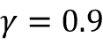
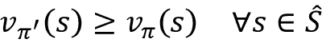
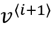

# 第十九章：决策复杂环境中的强化学习

在前几章中，我们专注于监督学习和无监督学习。我们还学习了如何利用人工神经网络和深度学习来解决这些类型机器学习所遇到的问题。回想一下，监督学习专注于从给定输入特征向量预测类别标签或连续值。无监督学习专注于从数据中提取模式，使其在数据压缩（*第五章*，*通过降维压缩数据*）、聚类（*第十章*，*使用无标签数据进行聚类分析*）或近似训练集分布以生成新数据（*第十七章*，*生成对抗网络用于合成新数据*）等方面非常有用。

在本章中，我们将注意力转向另一类机器学习，**强化学习**（**RL**），与以往的类别不同，它侧重于学习*一系列动作*以优化整体奖励，例如，在国际象棋游戏中取得胜利。总之，本章将涵盖以下主题：

+   学习 RL 的基础知识，熟悉代理与环境的交互，理解奖励过程如何工作，以帮助在复杂环境中做出决策

+   引入 RL 问题的不同类别，基于模型和无模型学习任务，蒙特卡洛和时序差分学习算法

+   在表格格式中实现 Q 学习算法

+   理解用于解决 RL 问题的函数逼近，通过实现*深度* Q 学习算法结合 RL 与深度学习

RL 是一个复杂而广阔的研究领域，本章侧重于基础知识。由于本章作为介绍，为了集中注意力于重要的方法和算法，我们将主要使用能够说明主要概念的基础示例。然而，在本章末尾，我们将介绍一个更具挑战性的例子，并利用深度学习架构来实现一种称为深度 Q 学习的特定 RL 方法。

# 介绍——从经验中学习

在本节中，我们将首先介绍 RL 作为机器学习的一个分支的概念，并看到它与其他机器学习任务相比的主要区别。之后，我们将覆盖 RL 系统的基本组成部分。然后，我们将基于马尔可夫决策过程看 RL 的数学公式化。

## 理解强化学习

到目前为止，本书主要集中在*监督*和*无监督*学习上。回顾一下，在*监督*学习中，我们依赖于由监督员或人类专家提供的标记训练样本，目标是训练一个能够很好地推广到未见过的未标记测试样本的模型。这意味着监督学习模型应该学会为给定的输入示例分配与监督人类专家相同的标签或值。另一方面，在*无监督*学习中，目标是学习或捕获数据集的潜在结构，例如在聚类和降维方法中；或者学习如何生成具有类似潜在分布的新的合成训练样本。强化学习与监督和无监督学习显著不同，因此强化学习通常被视为“机器学习的第三类别”。

区分强化学习与监督学习、无监督学习等其他机器学习子任务的关键元素是，强化学习围绕*通过交互学习*的概念。这意味着在强化学习中，模型通过与环境的交互学习来最大化一个*奖励函数*。

在最大化奖励函数与监督学习中最小化损失函数的概念相关联时，用于学习一系列动作的*正确*标签在强化学习中并不事先已知或定义——相反，它们需要通过与环境的交互学习以达到某种期望的结果——比如在游戏中取得胜利。通过强化学习，模型（也称为**代理**）与其环境交互，从而生成一系列称为**回合（episode）**的交互序列。通过这些交互，代理收集由环境确定的一系列奖励。这些奖励可以是正面的也可以是负面的，并且有时候直到回合结束后才会向代理披露。

例如，想象我们想教计算机玩国际象棋并赢得人类玩家。计算机所做的每一步棋的标签（奖励）直到游戏结束都是未知的，因为在游戏过程中，我们不知道特定的一步棋是否会导致赢得或失去该游戏。直到游戏结束时才确定反馈。如果计算机赢得了比赛，那么反馈很可能是正面奖励，因为代理已经实现了整体期望的结果；反之，如果计算机输了比赛，那么很可能会给出负面奖励。

此外，考虑下象棋的例子，输入是当前的配置，例如棋盘上个别棋子的排列方式。考虑到可能的输入（系统状态的状态）的数量巨大，不可能标记每个配置或状态为正面或负面。因此，为了定义学习过程，我们在每局比赛结束时提供奖励（或惩罚），当我们知道是否达到了期望的结果——无论是赢得比赛还是没有。

这是强化学习的精髓。在强化学习中，我们不能或不会教导一个代理、计算机或机器人*如何*做事情；我们只能明确*我们希望*代理实现的目标是什么。然后，基于特定试验的结果，我们可以根据代理的成功或失败来确定奖励。这使得强化学习在复杂环境中作出决策特别具有吸引力，特别是当问题解决任务需要一系列步骤时，这些步骤是未知的，或者难以解释，或者难以定义。

除了在游戏和机器人技术中的应用之外，强化学习的例子也可以在自然界中找到。例如，训练一只狗就涉及到强化学习——当它执行某些理想的动作时，我们给它奖励（零食）。或者考虑一个训练有素的医疗狗，它被训练来警告它的伴侣即将发作癫痫。在这种情况下，我们不知道狗能够检测癫痫发作的确切机制，即使我们对这一机制有精确的了解，我们也无法定义一系列步骤来学习癫痫检测。然而，如果它成功检测到癫痫，我们可以给它一块零食来*强化*这种行为！

尽管强化学习为学习实现某个目标的任意系列动作提供了一个强大的框架，请记住强化学习仍然是一个相对年轻且活跃的研究领域，有许多未解决的挑战。使训练强化学习模型特别具有挑战性的一个方面是，后续模型输入取决于先前采取的行动。这可能导致各种问题，并通常导致不稳定的学习行为。此外，强化学习中的这种序列依赖性产生了所谓的*延迟效应*，这意味着在时间步骤*t*上采取的行动可能导致未来几个步骤后出现奖励。

## 定义强化学习系统的代理-环境接口

在所有强化学习的例子中，我们可以找到两个不同的实体：一个代理和一个环境。正式地说，**代理**被定义为一个学习如何做出决策并通过采取行动与其周围环境交互的实体。作为采取行动的后果，代理接收来自环境的观察和奖励信号。**环境**是指代理之外的任何东西。环境与代理进行通信，并确定代理行动的奖励信号以及其观察结果。

**奖励信号**是代理从与环境交互中接收到的反馈，通常以标量形式提供，可以是正或负。奖励的目的是告诉代理其表现如何。代理接收奖励的频率取决于给定的任务或问题。例如，在国际象棋游戏中，奖励将在整个游戏后根据所有移动的结果确定：胜利或失败。另一方面，我们可以定义一个迷宫，使得奖励在每个时间步骤后确定。在这样的迷宫中，代理尝试最大化其终身内的累积奖励——其中终身描述了一个事件的持续时间。

*图 19.1*说明了代理与环境之间的交互和通信：


图 19.1：代理与其环境之间的互动

代理的状态，如*图 19.1*所示，是其所有变量的集合（1）。例如，在机器人无人机的情况下，这些变量可能包括无人机的当前位置（经度、纬度和高度）、无人机剩余的电池寿命、每个风扇的速度等。在每个时间步骤，代理通过一组可用的动作**A**[t]（2）与环境进行交互。基于代理在状态**S**[t]时采取的动作**A**[t]，代理将收到奖励信号**R**[t][+1]（3），并且其状态将变为**S**[t][+1]（4）。

在学习过程中，代理必须尝试不同的动作（**探索**），以便逐步学习哪些动作更值得偏好和更频繁执行（**利用**），以最大化总累积奖励。为了理解这个概念，让我们考虑一个非常简单的例子：一个以软件工程为重点的新计算机科学研究生正在考虑是开始在一家公司工作（利用）还是继续攻读硕士或博士学位，学习更多关于数据科学和机器学习的知识（探索）。一般来说，利用将导致选择具有更大短期奖励的动作，而探索则可能在长期内实现更大的总奖励。探索和利用之间的权衡已被广泛研究，然而，在这种决策过程中没有普遍适用的答案。

# 强化学习的理论基础

在我们深入一些实际示例并开始训练强化学习模型之前（我们将在本章稍后进行），让我们先理解一些强化学习的理论基础。接下来的部分将首先讨论马尔可夫决策过程的数学表达式、阶段性与持续性任务、一些关键的强化学习术语，以及使用**贝尔曼方程**进行动态规划。让我们从马尔可夫决策过程开始。

## 马尔可夫决策过程

一般来说，RL 处理的问题类型通常被形式化为 Markov 决策过程（MDPs）。解决 MDP 问题的标准方法是使用动态规划，但是 RL 相比动态规划具有一些关键优势。

**动态规划**

动态规划指的是一组计算机算法和编程方法，由 Richard Bellman 在 1950 年代开发。从某种意义上说，动态规划是关于递归问题解决——通过将相对复杂的问题分解为更小的子问题来解决。

递归与动态规划的关键区别在于，动态规划存储子问题的结果（通常作为字典或其他形式的查找表），这样如果将来再次遇到这些子问题，可以在常数时间内访问结果，而不是重新计算它们。

一些著名的计算机科学问题的例子，这些问题通过动态规划解决，包括序列比对和计算从点 A 到点 B 的最短路径。

然而，当状态的大小（即可能配置的数量）相对较大时，动态规划并不是一种可行的方法。在这种情况下，RL 被认为是解决 MDPs 更高效和实际的替代方法。

### Markov 决策过程的数学表述

需要学习互动和顺序决策过程的问题类型，其中时间步*t*的决策会影响后续情况，数学上形式化为 MDPs。

在 RL 中的代理/环境交互中，如果我们将代理的起始状态表示为*S*[0]，代理与环境的交互会导致以下序列：

{*S*[0], *A*[0], *R*[1]}，{*S*[1], *A*[1], *R*[2]}，{*S*[2], *A*[2], *R*[3]}，...

注意，大括号仅作为视觉辅助。这里，*S*[t]和*A*[t]代表时间步*t*处的状态和采取的动作。*R*[t][+1]表示执行动作*A*[t]后从环境获得的奖励。注意，*S*[t]、*R*[t][+1]和*A*[t]是依赖时间的随机变量，它们的取值来自预定义的有限集合，分别用、和表示。在 MDP 中，这些时间依赖的随机变量*S*[t]和*R*[t][+1]的概率分布仅依赖于它们在前一时间步*t* – 1 的值。*S*[t][+1] = *s*′和*R*[t][+1] = *r*的概率分布可以写成关于前一状态（*S*[t]）和采取的动作（*A*[t]）的条件概率如下：


这种概率分布完全定义了环境的**动态**（或环境模型），因为基于这种分布，可以计算环境的所有转移概率。因此，环境动态是对不同 RL 方法进行分类的一个核心标准。那些需要环境模型或试图学习环境模型（即环境动态）的 RL 方法被称为**基于模型**的方法，与**无模型**方法相对。

**基于模型和无模型 RL**

当已知概率  时，可以使用动态规划来解决学习任务。但是在许多现实世界问题中，由于环境动态未知，我们需要通过与环境交互来获取大量样本以补偿这种不确定性。

处理此问题的两种主要方法是**蒙特卡洛**（**MC**）和**时间差分**（**TD**）方法。以下图表展示了这两种方法的主要类别和各自的分支：


图 19.2：基于环境动态使用的不同模型

在本章中，我们将从理论到实际算法覆盖这些不同方法及其分支。

如果给定状态下特定的行动总是或从不被执行，那么可以认为环境动态是确定性的，即，。否则，在更一般的情况下，环境将表现出随机性。

要理解这种随机行为，让我们考虑在当前状态 *S*[t] = *s* 和执行的动作 *A*[t] = *a* 条件下观察未来状态 *S*[t][+1] = *s*′ 的概率。这可以表示为：


通过对所有可能的奖励进行求和，可以计算其作为边际概率的值：


这种概率称为**状态转移概率**。基于状态转移概率，如果环境动态是确定性的，那么当智能体在状态 *S*[t] = *s* 采取行动 *A*[t] = *a* 时，到达下一个状态 *S*[t][+1] = *s*′ 将是 100%确定的，即，。

### 马尔可夫过程的可视化

马尔可夫过程可以表示为一个有向循环图，其中图中的节点表示环境的不同状态。图的边（即节点之间的连接）表示状态之间的转移概率。

例如，考虑一个学生在三种不同情况之间做出决定：（A）在家里复习考试，（B）在家里玩视频游戏，或者（C）在图书馆学习。此外，还有一个终止状态（T），即睡觉。每小时做出决定，并且做出决定后，学生将在选择的情况下度过那个特定小时。然后，假设当留在家里（状态 A）时，有 50%的可能性学生会切换到玩视频游戏。另一方面，当学生处于状态 B（玩视频游戏）时，有较高的概率（80%）会在接下来的小时继续玩视频游戏。

学生行为的动态被展示为图 19.3 中的马尔可夫过程，包括一个循环图和一个转移表：


图 19.3：学生的马尔可夫过程

图中边缘上的值表示学生行为的转移概率，并且它们的值也显示在右侧的表格中。在考虑表中的行时，请注意每个状态（节点）出来的转移概率总是等于 1。

## 情节性任务与持续任务

当代理与环境互动时，观察或状态的序列形成一个轨迹。有两种类型的轨迹。如果一个代理的轨迹可以分成子部分，每个部分从时间*t* = 0 开始，并在终止状态*S*[T]（在时间*t* = *T*）结束，那么这个任务被称为*情节性任务*。

另一方面，如果轨迹是无限连续的，没有终止状态，那么这个任务被称为*持续任务*。

与国际象棋学习代理相关的任务是一个情节性任务，而保持房屋整洁的清洁机器人通常执行持续任务。在本章中，我们仅考虑情节性任务。

在情节任务中，一个**情节**是一个从起始状态*S*[0]到终止状态*S*[T]的序列或轨迹：

*S*[0]、*A*[0]、*R*[1]、*S*[1]、*A*[1]、*R*[2]、...、*S*[t]、*A*[t]、*R*[t][+1]、...、*S*[t][–1]、*A*[t][–1]、*R*[t]、*S*[t]

对于图 19.3 中展示的马尔可夫过程，描述了学生复习考试的任务，我们可能会遇到以下三个示例：


## RL 术语：返回值、策略和价值函数

接下来，让我们定义本章余下部分所需的一些额外的 RL 专有术语。

### 返回值

所谓的时间*t*时的*返回值*是从整个情节中获得的累积奖励。回想一下，*R*[t][+1] = *r* 是在时间*t*执行动作*A*[t]后获得的*即时奖励*；随后的奖励是*R*[t][+2]、*R*[t][+3]等等。

然后可以根据即时奖励以及随后的奖励计算时间*t*时的返回值，如下所示：


在这里，是范围为[0, 1]的*折现因子*。参数表示在当前时刻（时间*t*）未来回报的“价值”。请注意，通过设置，我们将意味着我们不关心未来回报。在这种情况下，回报将等于即时奖励，忽略*t* + 1 之后的后续回报，并且代理将显得短视。另一方面，如果，回报将是所有后续回报的未加权和。

此外，请注意，可以通过使用*递归*将回报的方程简化如下：


这意味着时间*t*的回报等于即时奖励*r*加上时间*t* + 1 的折现未来回报。这是一个非常重要的属性，有助于计算回报。

**折现因子背后的直觉**

要理解折现因子，请考虑*图 19.4*，显示了今天赚取 100 美元与一年后赚取 100 美元的价值对比。在某些经济情况下，如通货膨胀，现在赚取这 100 美元可能比将来赚取它更有价值：


图 19.4：基于 100 美元的价值随时间变化的折现因子示例

因此，我们可以说，如果这张钞票现在值 100 美元，那么带有折现因子的一年后将值 90 美元。

让我们计算我们先前学生示例中不同时间步骤的回报。假设且唯一的奖励基于考试结果（通过考试+1，未通过-1）。中间时间步骤的奖励为 0。

：

+   

    

+   

+   

+   ...

+   

+   

：

+   

+   

+   ...

+   

+   

我们把第三个情节的回报计算留给读者作为练习。

### 策略

一个通常由表示的*策略*是一个确定下一步动作的函数，可以是确定性或随机性（即，采取下一步动作的概率）。随机策略则在给定状态下有动作的概率分布：


在学习过程中，随着代理获得更多经验，策略可能会发生变化。例如，代理可以从随机策略开始，其中所有动作的概率都是均匀的；同时，代理希望学习优化其策略以达到最优策略。*最优策略*  是能够获得最高回报的策略。

### 值函数

*值函数*，也称为*状态值函数*，衡量每个状态的*优劣*，换句话说，处于特定状态的好坏程度。请注意，优良性的标准基于回报。

现在，基于回报 *G*[t]，我们定义状态 *s* 的值函数为在遵循策略  后的期望回报（所有可能的情节的平均回报）：


在实际实现中，我们通常使用查找表来估算值函数，这样就不必多次重新计算它。（这是动态规划的一个方面。）例如，在实践中，当我们使用这种表格方法估算值函数时，我们将所有状态值存储在一个名为 *V*(*s*) 的表中。在 Python 实现中，这可以是一个列表或 NumPy 数组，其索引引用不同的状态；或者，它可以是一个 Python 字典，其中字典键将状态映射到相应的值。

此外，我们还可以为每个状态-动作对定义一个值，称为*动作值函数*，用  表示。动作值函数指的是当代理处于状态 *S*[t] = *s* 并采取动作 *A*[t] = *a* 时的预期回报 *G*[t]。

将状态值函数的定义扩展到状态-动作对，我们得到以下内容：


这类似于将最优策略称为 ,  和 ，它们也表示最优状态值函数和动作值函数。

估算值函数是强化学习方法的一个重要组成部分。我们将在本章后面介绍计算和估算状态值函数和动作值函数的不同方法。

**奖励、回报和值函数之间的区别**

*奖励*是代理根据环境当前状态执行动作而获得的后果。换句话说，奖励是代理在执行动作以从一个状态过渡到下一个状态时收到的信号。但请记住，并非每个动作都会产生正面或负面的奖励——回想一下我们的象棋示例，在那里只有赢得比赛才会获得正面奖励，所有中间动作的奖励都为零。

一个状态本身具有一定的价值，我们将其分配给它，以衡量这个状态是好是坏—这就是*价值函数*发挥作用的地方。通常，具有“高”或“好”价值的状态是那些有高期望*回报*并且可能在特定策略下产生高奖励的状态。

例如，让我们再次考虑下象棋电脑。如果电脑赢得了比赛，最终才会得到正面奖励。如果电脑输掉比赛，则不会有（正面）奖励。现在，想象一下，电脑执行了一个特定的象棋移动，捕获了对手的皇后，而对电脑没有任何负面影响。由于电脑只有在赢得比赛时才会得到奖励，所以它不会因为捕获对手的皇后而立即获得奖励。然而，新状态（捕获皇后后的棋盘状态）可能具有很高的价值，这可能会产生奖励（如果之后赢得了比赛）。直觉上，我们可以说与捕获对手皇后相关联的高价值与捕获皇后通常导致赢得比赛—因此高期望回报或价值相关。然而，请注意，捕获对手的皇后并不总是导致赢得比赛；因此，代理可能会收到正面奖励，但不能保证。

简而言之，回报是整个情节中奖励的加权和，在我们的象棋示例中，这将等于折现的最终奖励（因为只有一个奖励）。价值函数是所有可能情节的期望，基本上计算某个移动平均来看，做出某个特定移动是多么“有价值”。

在我们直接进入一些强化学习算法之前，让我们简要回顾一下贝尔曼方程的推导，这可以用来实现策略评估。

## 使用贝尔曼方程的动态规划

贝尔曼方程是许多强化学习算法的核心要素之一。贝尔曼方程简化了价值函数的计算，不需要对多个时间步长进行求和，而是使用类似于计算回报的递归。

基于总回报的递归方程，，我们可以将价值函数重写如下：


注意，由于它是时间 *t* 的常量和已知数量，所以立即奖励 *r* 被从期望中除去。

同样地，对于动作值函数，我们可以写成：


我们可以利用环境动态来计算期望，通过对下一个状态 *s*′ 的所有可能性和相应的奖励 *r* 的概率进行求和：


现在，我们可以看到回报的期望，，本质上是状态值函数 。因此，我们可以将  写成关于  的函数：


这就是所谓的**贝尔曼方程**，它将一个状态*s*的价值函数与其后续状态*s*'的价值函数相关联。这极大地简化了价值函数的计算，因为它消除了沿时间轴的迭代循环。

# 强化学习算法

在本节中，我们将涵盖一系列学习算法。我们将从动态规划开始，它假设转移动态或环境动态即是已知的。然而，在大多数 RL 问题中，这并非如此。为了解决未知的环境动态，开发出了通过与环境交互学习的 RL 技术。这些技术包括**蒙特卡洛**（**MC**）、**时序差分**（**TD**）学习，以及越来越流行的 Q 学习和深度 Q 学习方法。

*图 19.5*描述了 RL 算法的进展过程，从动态规划到 Q 学习：


图 19.5：不同类型的 RL 算法

在本章的后续部分，我们将逐步介绍每个强化学习算法。我们将从动态规划开始，然后转向 MC，最后到 TD 及其分支，包括基于策略的**SARSA**（**状态-动作-奖励-状态-动作**）和离策略的 Q 学习。同时，我们还将进入深度 Q 学习，构建一些实用模型。

## 动态规划

在本节中，我们将专注于解决以下假设下的 RL 问题：

+   我们对环境动态有全面的了解；也就是说，所有转移概率——都是已知的。

+   代理的状态具有马尔可夫性质，这意味着下一个动作和奖励仅依赖于当前状态及我们在此时刻或当前时间步骤所做的动作选择。

强化学习问题的数学表述使用**马尔可夫决策过程**（**MDP**）在本章前面已经介绍过。如果您需要复习，请参阅名为*马尔可夫决策过程的数学表述*的部分，该部分介绍了在策略下，价值函数的正式定义，以及使用环境动态导出的贝尔曼方程。

我们应该强调，动态规划并不是解决 RL 问题的实用方法。使用动态规划的问题在于它假设对环境动态有全面了解，而这通常对大多数实际应用来说是不合理或不可行的。然而，从教育的角度来看，动态规划有助于以简单的方式介绍 RL，并激发使用更先进和复杂的 RL 算法。

通过下面小节描述的任务，有两个主要目标：

1.  获得真实的状态值函数；这项任务也被称为预测任务，并且是通过*策略评估*完成的。

1.  找到最优值函数，，这是通过*广义策略迭代*完成的。

### 策略评估 – 用动态规划预测值函数

基于贝尔曼方程，当环境动态已知时，我们可以用动态规划计算任意策略的值函数。为了计算这个值函数，我们可以采用迭代解法，其中我们从开始，它对于每个状态都初始化为零值。然后，在每次迭代*i* + 1 中，我们根据贝尔曼方程更新每个状态的值，这反过来又基于前一次迭代*i*中状态的值，如下所示：


可以证明，随着迭代次数无限增加，收敛到真实的状态值函数。

此外，注意到这里我们不需要与环境交互。这是因为我们已经准确地了解了环境动态。因此，我们可以利用这些信息并轻松估计值函数。

计算值函数后，一个显而易见的问题是，如果我们的策略仍然是随机策略，那么该值函数如何对我们有用。答案是，我们实际上可以利用这个计算得到的来改进我们的策略，接下来我们将看到。

### 通过估计值函数改进策略

现在我们通过遵循现有的策略计算了值函数，我们想要使用来改进现有的策略。这意味着我们想要找到一个新的策略，对于每个状态*s*，遵循，将产生比使用当前策略更高或至少相等的值。用数学术语来说，我们可以表达这个改进策略的目标为：



首先，回想一下，策略决定了在状态*s*时选择每个动作*a*的概率。现在，为了找到一个，它在每个状态上都具有更好或至少相等的值，我们首先计算基于值函数的每个状态*s*和动作*a*的动作值函数。我们遍历所有状态，并且对于每个状态*s*，我们比较如果选择动作*a*会发生的下一个状态*s*′的值。

在通过  评估所有状态-动作对并得到最高状态值之后，我们可以将相应动作与当前政策选择的动作进行比较。如果当前政策建议的动作（即 ）与动作值函数建议的动作（即 ）不同，则可以通过重新分配动作的概率来更新政策，以匹配提供最高动作值的动作，即 。这被称为*政策改进*算法。

### 政策迭代

使用前文描述的政策改进算法可以证明，政策改进将严格产生更好的政策，除非当前政策已经是最优的（这意味着对每个 ，都有 ）。因此，如果我们迭代执行政策评估然后执行政策改进，我们将保证找到最优政策。

注意，这种技术被称为**广义策略迭代**（**GPI**），在许多强化学习方法中很常见。我们将在本章的后续部分中使用 GPI 进行 MC 和 TD 学习方法。

### 值迭代

通过重复政策评估（计算  和 ）和政策改进（找到  以使 ），我们可以得到最优政策。然而，如果将政策评估和政策改进两个任务合并为一步会更加高效。以下方程根据最大化下一个状态值及其即时奖励的加权和更新了第 *i* + 1 次迭代的值函数（表示为 ）：


在这种情况下，通过选择所有可能动作中的最佳动作来最大化  的更新值，而在政策评估中，更新值是通过所有动作的加权和来计算的。

**状态值和动作值函数的表格估计符号**

在大多数强化学习文献和教科书中，小写字母  和  被用来指代真实的状态值函数和动作值函数，作为数学函数。

与此同时，对于实际实现，这些值函数被定义为查找表。这些值函数的表格估计表示为  和 。在本章节中我们也将使用这种符号。

## 蒙特卡洛强化学习

如前所述，在前一节中，动态规划依赖于一个简化的假设，即环境的动态完全已知。离开动态规划方法，我们现在假设我们对环境动态一无所知。

也就是说，我们不知道环境的状态转移概率，而是希望代理通过与环境的*交互*来学习。使用 MC 方法，学习过程基于所谓的*模拟体验*。

对于基于 MC 的 RL，我们定义一个遵循概率策略的代理类，根据这个策略，我们的代理在每一步采取一个动作。这导致一个模拟的情节。

早些时候，我们定义了状态值函数，该函数表明状态的值表示从该状态预期的回报。在动态规划中，这种计算依赖于对环境动态的知识，即图所示。

然而，从现在开始，我们将开发不需要环境动态的算法。基于蒙特卡罗（MC）的方法通过生成模拟的情节来解决这个问题，在这些模拟的情节中，一个代理与环境互动。通过这些模拟的情节，我们可以计算每个访问过的状态的平均回报。

### 使用 MC 进行状态值函数估计

在生成一组情节之后，对于每个状态 *s*，都考虑通过状态 *s* 的所有情节以计算状态 *s* 的值。假设用查找表来获取对应值函数的值，如图所示。用于估计值函数的 MC 更新基于从第一次访问状态 *s* 开始的该情节中获得的总回报。这种算法称为*首次访问蒙特卡罗*值预测。

### 使用 MC 方法估计动作值函数

当环境动态已知时，我们可以通过向前看一步来轻松推断出状态值函数的动作值函数，以找到给定状态的最大值的动作，正如*动态规划*部分所示。然而，如果环境动态未知，这是不可行的。

要解决这个问题，我们可以扩展算法以估计首次访问 MC 状态值预测。例如，我们可以使用动作值函数计算每个状态-动作对的*估计*回报。为了获得这种估计的回报，我们考虑对每个状态-动作对 (*s*, *a*) 的访问，这指的是访问状态 *s* 并采取动作 *a*。

然而，由于某些动作可能永远不会被选择，导致探索不足。有几种方法可以解决这个问题。最简单的方法称为*探索性起始*，假设每个状态-动作对在情节开始时都有非零的概率。

处理探索不足问题的另一种方法称为 -贪婪策略，将在下一节关于策略改进中讨论。

### 使用 MC 控制找到最优策略

*MC 控制* 指的是改进策略的优化过程。与上一节的策略迭代方法（*动态规划*）类似，我们可以反复进行策略评估和策略改进，直到达到最优策略。因此，从随机策略开始，，交替进行策略评估和策略改进的过程可以如下所示：


### 策略改进 – 从动作值函数计算贪婪策略

给定动作值函数 *q*(*s*, *a*)，我们可以按以下方式生成贪婪（确定性）策略：


为了避免探索不足问题，并考虑之前讨论过的未访问状态-动作对，我们可以让非最优动作有一定几率 () 被选择。这被称为 -贪婪策略，根据这个策略，状态 *s* 下所有非最优动作的选择概率最小为 （而非 0），最优动作的选择概率为 （而非 1）。

## 时间差分学习

到目前为止，我们已经了解了两种基本的强化学习技术—动态规划和基于蒙特卡洛的学习。回想一下，动态规划依赖于对环境动态的完整和准确的知识。另一方面，基于蒙特卡洛的方法通过模拟体验学习。在本节中，我们现在将介绍第三种强化学习方法称为 *TD 学习*，它可以被视为基于蒙特卡洛的强化学习方法的改进或扩展。

类似于 MC 技术，TD 学习也是基于经验学习的，因此不需要了解环境动态和转移概率。TD 和 MC 技术的主要区别在于，在 MC 中，我们必须等到回合结束才能计算总回报。

然而，在 TD 学习中，我们可以利用一些学到的属性在到达该回合结束之前更新估计值。这被称为 *自举*（在强化学习的背景下，自举这一术语与我们在 *第七章* *集成学习* 中使用的自举估计方法不同）。

类似于动态规划方法和基于蒙特卡洛的学习，我们将考虑两个任务：估计值函数（也称为值预测）和改进策略（也称为控制任务）。

### TD 预测

让我们首先重新审视 MC 的值预测。在每个回合结束时，我们能够估计每个时间步*t*的回报*G*[t]。因此，我们可以更新我们对访问过状态的估计如下：


在这里，*G*[t]用作更新估计值*V*(*S*[t])的*目标回报*，(*G*[t] – *V*(*S*[t]))是添加到我们当前对值*V*(*S*[t])的估计的*修正*项。值是表示学习率的超参数，在学习期间保持不变。

注意，在 MC 中，修正项使用*实际*回报*G*[t]，直到该回合结束时才知道。为了澄清这一点，我们可以将实际回报*G*[t]重新命名为*G*[t][:][T]，其中下标*t*:*T*表示这是在时间步*t*获得的回报，考虑了从时间步*t*到最后时间步*T*发生的所有事件。

在 TD 学习中，我们用新的目标回报*G*[t][:][t][+1]替换实际回报*G*[t][:][T]，这显著简化了值函数*V*(*S*[t])的更新。基于 TD 学习的更新公式如下：


在这里，目标回报使用观察到的奖励*R*[t][+1]和下一个立即步骤的估计值。注意 MC 和 TD 之间的区别。在 MC 中，*G*[t][:][T]直到回合结束才可用，所以我们应该执行尽可能多的步骤才能到达那里。相反，在 TD 中，我们只需要前进一步即可获得目标回报。这也被称为 TD(0)。

此外，TD(0)算法可以推广为所谓的*n 步 TD*算法，它包含更多未来步骤——准确地说，是*n*个未来步骤的加权和。如果我们定义*n* = 1，则 n 步 TD 过程与前一段中描述的 TD(0)相同。然而，如果，则 n 步 TD 算法将与 MC 算法相同。n 步 TD 的更新规则如下：


而*G*[t][:][t][+][n]的定义如下：


**MC 与 TD：哪种方法收敛更快？**

尽管对这个问题的精确答案仍然不清楚，但实际上，实验证明 TD 可以比 MC 更快地收敛。如果你感兴趣，可以在《强化学习导论》一书中找到关于 MC 和 TD 收敛性的更多细节，作者是*理查德·S·萨顿*和*安德鲁·G·巴托*。

现在我们已经介绍了使用 TD 算法进行预测任务，我们可以继续进行控制任务。我们将涵盖两种 TD 控制算法：一种是*在策略*控制，另一种是*离策略*控制。在两种情况下，我们使用了 GPI，这在动态规划和 MC 算法中都有使用过。在在策略 TD 控制中，根据代理正在遵循的策略更新值函数；而在离策略算法中，值函数是根据当前策略之外的动作进行更新的。

### 在策略 TD 控制（SARSA）

为简单起见，我们仅考虑一步 TD 算法，或者 TD(0)。然而，在策略 TD 控制算法可以轻松推广到*n*-步 TD。我们将从扩展预测公式开始，以描述状态值函数，进而描述动作值函数。为此，我们使用一个查找表，即一个二维表格，*Q*(*S*[t], *A*[t])，它表示每个状态-动作对的动作值函数。在这种情况下，我们将会有以下情况：


这个算法通常称为 SARSA，指的是用于更新公式的五元组（*S*[t], *A*[t], *R*[t][+1], *S*[t][+1], *A*[t][+1]）。

正如我们在描述动态规划和 MC 算法的前几节中看到的那样，我们可以使用 GPI 框架，从随机策略开始，重复估计当前策略的动作值函数，然后使用基于当前动作值函数的-贪婪策略来优化策略。

### 离策略 TD 控制（Q 学习）

我们看到，当使用前述的在策略 TD 控制算法时，如何估计动作值函数是基于模拟回合中使用的策略的。在更新动作值函数后，通过采取值更高的动作进行策略改进的一个独立步骤也会被执行。

另一种（更好的）方法是将这两个步骤结合起来。换句话说，想象一下，代理正在遵循策略，生成一个包含当前转移五元组（*S*[t], *A*[t], *R*[t][+1], *S*[t][+1], *A*[t][+1]）的回合。与其使用代理实际选择的*A*[t][+1]的动作值来更新动作值函数，我们可以找到最佳动作，即使该动作并未由当前策略选择的代理实际执行。（这就是为什么这被认为是一个离策略算法。）

为此，我们可以修改更新规则，以考虑在下一个即时状态中通过不同动作变化的最大 Q 值。更新 Q 值的修改方程如下：


我们鼓励您比较这里的更新规则与 SARSA 算法的更新规则。正如您所见，我们在下一个状态*S*[t][+1]中找到最佳动作，并将其用于修正项，以更新我们对*Q*(*S*[t], *A*[t])的估计。

为了让这些材料更具体，下一节我们将看看如何实现 Q-learning 算法来解决*网格世界问题*。

# 实现我们的第一个 RL 算法

在本节中，我们将介绍实现 Q-learning 算法来解决*网格世界问题*（网格世界是一个二维的、基于单元格的环境，代理在其中以四个方向移动以尽可能多地收集奖励）。为此，我们使用 OpenAI Gym 工具包。

## 引入 OpenAI Gym 工具包

OpenAI Gym 是一个专门用于促进 RL 模型开发的工具包。OpenAI Gym 预装了几个预定义的环境。一些基本示例是 CartPole 和 MountainCar，如它们的名称所示，任务是平衡杆和将车开上山。还有许多用于训练机器人从桌子上获取、推动和抓取物品或训练机器手操作方块、球或笔的高级机器人学环境。此外，OpenAI Gym 提供了一个便利的统一框架来开发新的环境。更多信息可以在其官方网站上找到：[`gym.openai.com/`](https://gym.openai.com/)。

要在接下来的章节中使用 OpenAI Gym 的代码示例，您需要安装`gym`库（在撰写本文时使用的是版本 0.20.0），可以通过`pip`轻松完成：

```py
pip install gym==0.20 
```

如果您需要安装方面的额外帮助，请参考官方安装指南：[`gym.openai.com/docs/#installation`](https://gym.openai.com/docs/#installation)。

### 使用现有的 OpenAI Gym 环境

为了练习 Gym 环境，让我们从`CartPole-v1`中创建一个环境，这个环境已经存在于 OpenAI Gym 中。在这个示例环境中，有一个杆连接到一个可以水平移动的小车，如*图 19.6*所示：


图 19.6：Gym 中的 CartPole 示例

杆的运动受物理定律控制，RL 代理的目标是学会如何移动小车以稳定杆，并防止其向任一方向倾斜。

现在，让我们在 RL 的背景下看一些 CartPole 环境的属性，例如其状态（或观察）空间、动作空间以及如何执行动作：

```py
>>> import gym
>>> env = gym.make('CartPole-v1')
>>> env.observation_space
Box(-3.4028234663852886e+38, 3.4028234663852886e+38, (4,), float32)
>>> env.action_space
Discrete(2) 
```

在上述代码中，我们为 CartPole 问题创建了一个环境。该环境的观察空间是`Box(4,)`（具有从`-inf`到`inf`的浮点值），表示四维空间对应四个实数：小车的位置、小车的速度、杆的角度和杆顶的速度。动作空间是离散空间，`Discrete(2)`，有两种选择：将小车向左推或向右推。

我们之前通过调用 `gym.make('CartPole-v1')` 创建的环境对象 `env` 具有一个 `reset()` 方法，我们可以在每个回合之前使用它来重新初始化环境。调用 `reset()` 方法基本上会设置杆的起始状态（*S*[0]）：

```py
>>> env.reset()
array([-0.03908273, -0.00837535,  0.03277162, -0.0207195 ]) 
```

调用 `env.reset()` 方法返回的数组中的值意味着小车的初始位置为-0.039，速度为-0.008，杆的角度为 0.033 弧度，其顶端的角速度为-0.021。调用 `reset()` 方法时，这些值会被初始化为均匀分布在[-0.05，0.05]范围内的随机值。

重置环境后，我们可以通过选择一个动作并将其传递给 `step()` 方法来与环境交互：

```py
>>> env.step(action=0)
(array([-0.03925023, -0.20395158,  0.03235723,  0.28212046]), 1.0, False, {})
>>> env.step(action=1)
(array([-0.04332927, -0.00930575,  0.03799964, -0.00018409]), 1.0, False, {}) 
```

通过之前的两个命令，`env.step(action=0)` 和 `env.step(action=1)`，我们分别将小车向左推（`action=0`）和向右推（`action=1`）。根据选择的动作，小车及其杆可以按照物理规律移动。每次调用 `env.step()`，它都会返回一个包含四个元素的元组：

+   一个新状态（或观察值）的数组

+   一个奖励（类型为`float`的标量值）

+   一个终止标志（`True` 或 `False`）

+   一个包含辅助信息的 Python 字典

`env` 对象还具有一个 `render()` 方法，我们可以在每一步（或一系列步骤）之后执行它，以可视化环境及其随时间的运动。

当杆的角度相对于虚拟垂直轴大于 12 度（从任一侧）或者小车的位置离中心位置超过 2.4 个单位时，该回合终止。在此示例中定义的奖励是通过最大化小车和杆在有效区域内稳定的时间来最大化总奖励（即回报）。

### 一个网格世界示例

在将 CartPole 环境作为使用 OpenAI Gym 工具包的热身练习介绍后，我们将切换到一个不同的环境。我们将使用一个网格世界示例，这是一个具有*m*行和*n*列的简单环境。考虑到*m* = 5 和*n* = 6，我们可以总结这个环境如图 19.7 所示：


图 19.7：一个网格世界环境的示例

在这个环境中，有 30 个不同的可能状态。其中四个状态是终止状态：在状态 16 有一个金子和三个陷阱在状态 10、15 和 22\. 着陆在这四个终止状态中的任何一个将结束本集，但在金子状态和陷阱状态之间有所不同。着陆在金子状态会产生正面奖励，+1，而将代理移动到其中一个陷阱状态会产生负面奖励，–1\. 所有其他状态的奖励为 0\. 代理始终从状态 0 开始。因此，每次我们重置环境时，代理将返回状态 0\. 行动空间包括四个方向：向上、向下、向左和向右。

当代理位于网格的外边界时，选择可能导致离开网格的动作不会改变状态。

接下来，我们将看到如何使用 OpenAI Gym 包在 Python 中实现此环境。

### 在 OpenAI Gym 中实现网格世界环境

对于通过 OpenAI Gym 进行网格世界环境实验，强烈建议使用脚本编辑器或 IDE，而不是交互式执行代码。

首先，我们创建一个名为 `gridworld_env.py` 的新 Python 脚本，然后导入必要的包和我们为构建环境可视化定义的两个辅助函数。

为了可视化环境，OpenAI Gym 库使用 pyglet 库并为我们提供了包装类和函数。我们将使用这些包装类来可视化网格世界环境。有关这些包装类的更多详细信息，请参阅：[`github.com/openai/gym/blob/58ed658d9b15fd410c50d1fdb25a7cad9acb7fa4/gym/envs/classic_control/rendering.py`](https://github.com/openai/gym/blob/58ed658d9b15fd410c50d1fdb25a7cad9acb7fa4/gym/envs/classic_control/rendering.py).

以下代码示例使用了这些包装类：

```py
## Script: gridworld_env.py
import numpy as np
from gym.envs.toy_text import discrete
from collections import defaultdict
import time
import pickle
import os
from gym.envs.classic_control import rendering
CELL_SIZE = 100
MARGIN = 10
def get_coords(row, col, loc='center'):
    xc = (col+1.5) * CELL_SIZE
    yc = (row+1.5) * CELL_SIZE
    if loc == 'center':
        return xc, yc
    elif loc == 'interior_corners':
        half_size = CELL_SIZE//2 - MARGIN
        xl, xr = xc - half_size, xc + half_size
        yt, yb = xc - half_size, xc + half_size
        return [(xl, yt), (xr, yt), (xr, yb), (xl, yb)]
    elif loc == 'interior_triangle':
        x1, y1 = xc, yc + CELL_SIZE//3
        x2, y2 = xc + CELL_SIZE//3, yc - CELL_SIZE//3
        x3, y3 = xc - CELL_SIZE//3, yc - CELL_SIZE//3
        return [(x1, y1), (x2, y2), (x3, y3)]
def draw_object(coords_list):
    if len(coords_list) == 1: # -> circle
        obj = rendering.make_circle(int(0.45*CELL_SIZE))
        obj_transform = rendering.Transform()
        obj.add_attr(obj_transform)
        obj_transform.set_translation(*coords_list[0])
        obj.set_color(0.2, 0.2, 0.2) # -> black
    elif len(coords_list) == 3: # -> triangle
        obj = rendering.FilledPolygon(coords_list)
        obj.set_color(0.9, 0.6, 0.2) # -> yellow
    elif len(coords_list) > 3: # -> polygon
        obj = rendering.FilledPolygon(coords_list)
        obj.set_color(0.4, 0.4, 0.8) # -> blue
    return obj 
```

**使用 Gym 0.22 或更新版本**

注意，`gym` 目前正在进行一些内部重构。在版本 0.22 及更新版本中，您可能需要更新之前的代码示例（来自 `gridworld_env.py`），并替换以下行

```py
from gym.envs.classic_control import rendering 
```

使用以下代码：

```py
from gym.utils import pyglet_rendering 
```

更多细节请参阅代码仓库：[`github.com/rasbt/machine-learning-book/tree/main/ch19`](https://github.com/rasbt/machine-learning-book/tree/main/ch19)

第一个辅助函数，`get_coords()`，返回几何形状的坐标，我们将用它们来注释网格世界环境，例如用来显示金子的三角形或用来显示陷阱的圆圈。坐标列表被传递给 `draw_object()`，根据输入坐标列表的长度决定绘制圆形、三角形或多边形。

现在，我们可以定义网格世界环境。在同一个文件（`gridworld_env.py`）中，我们定义了一个名为`GridWorldEnv`的类，该类继承自 OpenAI Gym 的`DiscreteEnv`类。该类最重要的函数是构造方法`__init__()`，在这里我们定义了动作空间，指定了每个动作的作用，并确定了终止状态（金色以及陷阱）如下：

```py
class GridWorldEnv(discrete.DiscreteEnv):
    def __init__(self, num_rows=4, num_cols=6, delay=0.05):
        self.num_rows = num_rows
        self.num_cols = num_cols
        self.delay = delay
        move_up = lambda row, col: (max(row-1, 0), col)
        move_down = lambda row, col: (min(row+1, num_rows-1), col)
        move_left = lambda row, col: (row, max(col-1, 0))
        move_right = lambda row, col: (
            row, min(col+1, num_cols-1))
        self.action_defs={0: move_up, 1: move_right,
                          2: move_down, 3: move_left}
        ## Number of states/actions
        nS = num_cols*num_rows
        nA = len(self.action_defs)
        self.grid2state_dict={(s//num_cols, s%num_cols):s
                              for s in range(nS)}
        self.state2grid_dict={s:(s//num_cols, s%num_cols)
                              for s in range(nS)}
        ## Gold state
        gold_cell = (num_rows//2, num_cols-2)

        ## Trap states
        trap_cells = [((gold_cell[0]+1), gold_cell[1]),
                       (gold_cell[0], gold_cell[1]-1),
                       ((gold_cell[0]-1), gold_cell[1])]
        gold_state = self.grid2state_dict[gold_cell]
        trap_states = [self.grid2state_dict[(r, c)]
                       for (r, c) in trap_cells]
        self.terminal_states = [gold_state] + trap_states
        print(self.terminal_states)
        ## Build the transition probability
        P = defaultdict(dict)
        for s in range(nS):
            row, col = self.state2grid_dict[s]
            P[s] = defaultdict(list)
            for a in range(nA):
                action = self.action_defs[a]
                next_s = self.grid2state_dict[action(row, col)]

                ## Terminal state
                if self.is_terminal(next_s):
                    r = (1.0 if next_s == self.terminal_states[0]
                         else -1.0)
                else:
                    r = 0.0
                if self.is_terminal(s):
                    done = True
                    next_s = s
                else:
                    done = False
                P[s][a] = [(1.0, next_s, r, done)]
        ## Initial state distribution
        isd = np.zeros(nS)
        isd[0] = 1.0
        super().__init__(nS, nA, P, isd)
        self.viewer = None
        self._build_display(gold_cell, trap_cells)
    def is_terminal(self, state):
        return state in self.terminal_states
    def _build_display(self, gold_cell, trap_cells):
        screen_width = (self.num_cols+2) * CELL_SIZE
        screen_height = (self.num_rows+2) * CELL_SIZE
        self.viewer = rendering.Viewer(screen_width,
                                       screen_height)
        all_objects = []
        ## List of border points' coordinates
        bp_list = [
            (CELL_SIZE-MARGIN, CELL_SIZE-MARGIN),
            (screen_width-CELL_SIZE+MARGIN, CELL_SIZE-MARGIN),
            (screen_width-CELL_SIZE+MARGIN,
             screen_height-CELL_SIZE+MARGIN),
            (CELL_SIZE-MARGIN, screen_height-CELL_SIZE+MARGIN)
        ]
        border = rendering.PolyLine(bp_list, True)
        border.set_linewidth(5)
        all_objects.append(border)
        ## Vertical lines
        for col in range(self.num_cols+1):
            x1, y1 = (col+1)*CELL_SIZE, CELL_SIZE
            x2, y2 = (col+1)*CELL_SIZE,\
                     (self.num_rows+1)*CELL_SIZE
            line = rendering.PolyLine([(x1, y1), (x2, y2)], False)
            all_objects.append(line)

        ## Horizontal lines
        for row in range(self.num_rows+1):
            x1, y1 = CELL_SIZE, (row+1)*CELL_SIZE
            x2, y2 = (self.num_cols+1)*CELL_SIZE,\
                     (row+1)*CELL_SIZE
            line=rendering.PolyLine([(x1, y1), (x2, y2)], False)
            all_objects.append(line)

        ## Traps: --> circles
        for cell in trap_cells:
            trap_coords = get_coords(*cell, loc='center')
            all_objects.append(draw_object([trap_coords]))

        ## Gold: --> triangle
        gold_coords = get_coords(*gold_cell,
                                 loc='interior_triangle')
        all_objects.append(draw_object(gold_coords))
        ## Agent --> square or robot
        if (os.path.exists('robot-coordinates.pkl') and
                CELL_SIZE==100):
            agent_coords = pickle.load(
                open('robot-coordinates.pkl', 'rb'))
            starting_coords = get_coords(0, 0, loc='center')
            agent_coords += np.array(starting_coords)
        else:
            agent_coords = get_coords(
                0, 0, loc='interior_corners')
        agent = draw_object(agent_coords)
        self.agent_trans = rendering.Transform()
        agent.add_attr(self.agent_trans)
        all_objects.append(agent)
        for obj in all_objects:
            self.viewer.add_geom(obj)
    def render(self, mode='human', done=False):
        if done:
            sleep_time = 1
        else:
            sleep_time = self.delay
        x_coord = self.s % self.num_cols
        y_coord = self.s // self.num_cols
        x_coord = (x_coord+0) * CELL_SIZE
        y_coord = (y_coord+0) * CELL_SIZE
        self.agent_trans.set_translation(x_coord, y_coord)
        rend = self.viewer.render(
             return_rgb_array=(mode=='rgb_array'))
        time.sleep(sleep_time)
        return rend
    def close(self):
        if self.viewer:
            self.viewer.close()
            self.viewer = None 
```

此代码实现了网格世界环境，我们可以从中创建环境的实例。然后，我们可以像在 CartPole 示例中那样与其进行交互。实现的`GridWorldEnv`类继承了诸如`reset()`用于重置状态和`step()`用于执行动作等方法。实现的细节如下：

+   我们使用 lambda 函数定义了四种不同的动作：`move_up()`，`move_down()`，`move_left()`和`move_right()`。

+   NumPy 数组`isd`保存了起始状态的概率，因此当调用`reset()`方法（来自父类）时，将根据这个分布随机选择一个起始状态。由于我们始终从状态 0 开始（网格世界的左下角），我们将状态 0 的概率设置为 1.0，将其他 29 个状态的概率设置为 0.0。

+   在 Python 字典`P`中定义的过渡概率确定了在选择动作时从一个状态移动到另一个状态的概率。这使我们可以拥有一个概率性环境，其中采取动作可能基于环境的随机性具有不同的结果。为简单起见，我们只使用单一结果，即沿着选择的动作方向改变状态。最后，这些过渡概率将被`env.step()`函数用于确定下一个状态。

+   此外，`_build_display()`函数将设置环境的初始可视化，而`render()`函数将显示代理的移动。

注意，在学习过程中，我们不知道过渡概率，并且目标是通过与环境的交互进行学习。因此，在类定义之外，我们无法访问`P`。

现在，我们可以通过创建一个新的环境并在每个状态采取随机动作来可视化一个随机回合来测试这个实现。将以下代码包含在同一 Python 脚本（`gridworld_env.py`）的末尾，然后执行脚本：

```py
if __name__ == '__main__':
    env = GridWorldEnv(5, 6)
    for i in range(1):
        s = env.reset()
        env.render(mode='human', done=False)
        while True:
            action = np.random.choice(env.nA)
            res = env.step(action)
            print('Action  ', env.s, action, ' -> ', res)
            env.render(mode='human', done=res[2])
            if res[2]:
                break
    env.close() 
```

执行脚本后，您应该能看到网格世界环境的可视化，如*图 19.8*所示：


图 19.8：我们网格世界环境的可视化

## 使用 Q 学习解决网格世界问题

在专注于强化学习算法的理论和开发过程，并通过 OpenAI Gym 工具包设置环境之后，我们现在将实现当前最流行的强化学习算法，Q-learning。为此，我们将使用已在脚本`gridworld_env.py`中实现的网格世界示例。

现在，我们创建一个新的脚本并命名为`agent.py`。在这个`agent.py`脚本中，我们定义了一个与环境交互的代理如下：

```py
## Script: agent.py
from collections import defaultdict
import numpy as np
class Agent:
    def __init__(
            self, env,
            learning_rate=0.01,
            discount_factor=0.9,
            epsilon_greedy=0.9,
            epsilon_min=0.1,
            epsilon_decay=0.95):
        self.env = env
        self.lr = learning_rate
        self.gamma = discount_factor
        self.epsilon = epsilon_greedy
        self.epsilon_min = epsilon_min
        self.epsilon_decay = epsilon_decay
        ## Define the q_table
        self.q_table = defaultdict(lambda: np.zeros(self.env.nA))
    def choose_action(self, state):
        if np.random.uniform() < self.epsilon:
            action = np.random.choice(self.env.nA)
        else:
            q_vals = self.q_table[state]
            perm_actions = np.random.permutation(self.env.nA)
            q_vals = [q_vals[a] for a in perm_actions]
            perm_q_argmax = np.argmax(q_vals)
            action = perm_actions[perm_q_argmax]
        return action
    def _learn(self, transition):
        s, a, r, next_s, done = transition
        q_val = self.q_table[s][a]
        if done:
            q_target = r
        else:
            q_target = r + self.gamma*np.max(self.q_table[next_s])
        ## Update the q_table
        self.q_table[s][a] += self.lr * (q_target - q_val)
        ## Adjust the epsilon
        self._adjust_epsilon()
    def _adjust_epsilon(self):
        if self.epsilon > self.epsilon_min:
            self.epsilon *= self.epsilon_decay 
```

`__init__()`构造函数设置了各种超参数，如学习率、折扣因子（）、以及-贪婪策略的参数。最初，我们从较高的值开始，但`_adjust_epsilon()`方法会将其减少直至达到最小值。`choose_action()`方法根据-贪婪策略选择动作如下。通过选择随机均匀数确定动作是否应该随机选择，否则基于动作值函数选择。`_learn()`方法实现了 Q-learning 算法的更新规则。它为每个转换接收一个元组，其中包括当前状态(*s*)、选择的动作(*a*)、观察到的奖励(*r*)、下一个状态(*s*′)，以及一个标志，用于确定是否已到达一集的结束。如果标记为一集的结束，则目标值等于观察到的奖励(*r*)；否则目标值为。

最后，作为我们的下一步，我们创建一个新的脚本，名为`qlearning.py`，将所有内容整合在一起，并使用 Q-learning 算法训练代理。

在以下代码中，我们定义了一个函数`run_qlearning()`，实现了 Q-learning 算法，通过调用代理的`_choose_action()`方法模拟一个回合，并执行环境。然后，将转换元组传递给代理的`_learn()`方法以更新动作值函数。此外，为了监控学习过程，我们还存储了每个回合的最终奖励（可能为-1 或+1），以及回合的长度（代理从开始到结束所采取的步数）。

奖励列表和步数将使用`plot_learning_history()`函数绘制：

```py
## Script: qlearning.py
from gridworld_env import GridWorldEnv
from agent import Agent
from collections import namedtuple
import matplotlib.pyplot as plt
import numpy as np
np.random.seed(1)
Transition = namedtuple(
    'Transition', ('state', 'action', 'reward',
                   'next_state', 'done'))
def run_qlearning(agent, env, num_episodes=50):
    history = []
    for episode in range(num_episodes):
        state = env.reset()
        env.render(mode='human')
        final_reward, n_moves = 0.0, 0
        while True:
            action = agent.choose_action(state)
            next_s, reward, done, _ = env.step(action)
            agent._learn(Transition(state, action, reward,
                                    next_s, done))
            env.render(mode='human', done=done)
            state = next_s
            n_moves += 1
            if done:
                break
            final_reward = reward
        history.append((n_moves, final_reward))
        print(f'Episode {episode}: Reward {final_reward:.2} '
              f'#Moves {n_moves}')
    return history
def plot_learning_history(history):
    fig = plt.figure(1, figsize=(14, 10))
    ax = fig.add_subplot(2, 1, 1)
    episodes = np.arange(len(history))
    moves = np.array([h[0] for h in history])
    plt.plot(episodes, moves, lw=4,
             marker='o', markersize=10)
    ax.tick_params(axis='both', which='major', labelsize=15)
    plt.xlabel('Episodes', size=20)
    plt.ylabel('# moves', size=20)
    ax = fig.add_subplot(2, 1, 2)
    rewards = np.array([h[1] for h in history])
    plt.step(episodes, rewards, lw=4)
    ax.tick_params(axis='both', which='major', labelsize=15)
    plt.xlabel('Episodes', size=20)
    plt.ylabel('Final rewards', size=20)
    plt.savefig('q-learning-history.png', dpi=300)
    plt.show()
if __name__ == '__main__':
    env = GridWorldEnv(num_rows=5, num_cols=6)
    agent = Agent(env)
    history = run_qlearning(agent, env)
    env.close()
    plot_learning_history(history) 
```

执行此脚本将运行 50 个回合的 Q-learning 程序。代理的行为将被可视化，您可以看到在学习过程的开始阶段，代理大部分时间都会陷入陷阱状态。但随着时间的推移，它从失败中学习，最终找到黄金状态（例如，在第 7 个回合第一次）。*图 19.9*显示了代理的步数和奖励：


图 19.9：代理的步数和奖励

在前一个图中显示的绘制学习历史表明，代理在 30 个 episode 后学会了一条通往金状态的短路径。因此，30 个 episode 后的 episode 长度基本相同，由于贪婪策略的微小偏差。

# 一瞥深度 Q-learning

在前面的代码中，我们看到了一个用于网格世界示例的流行 Q-learning 算法的实现。这个示例由大小为 30 的离散状态空间组成，在 Python 字典中存储 Q 值足以满足要求。

但是，需要注意的是，有时状态数量可能非常大，可能几乎无限大。此外，我们可能会处理连续状态空间，而不是处理离散状态。此外，在训练过程中可能会有一些状态根本没有被访问到，这在后续将代理泛化到这些未见状态时可能会有问题。

为了解决这些问题，我们不再像*V*(*S*[t])或*Q*(*S*[t], *A*[t])中那样以表格格式表示值函数，而是采用*函数逼近*方法。在这里，我们定义一个参数化函数*v*w，它可以学习逼近真实的值函数，即，其中*x*[s]是一组输入特征（或“特征化”状态）。

当近似函数*q*w 是一个**深度神经网络**（**DNN**）时，生成的模型被称为**深度 Q 网络**（**DQN**）。对于训练 DQN 模型，权重根据 Q-learning 算法进行更新。DQN 模型的示例如*图 19.10*所示，其中状态被表示为传递给第一层的特征：


图 19.10: 一个 DQN 的示例

现在，让我们看看如何使用*深度 Q-learning*算法训练 DQN。总体上，主要方法与表格 Q-learning 方法非常相似。主要区别在于，我们现在有一个多层次神经网络来计算动作值。

## 根据 Q-learning 算法训练 DQN 模型

在本节中，我们描述了使用 Q-learning 算法训练 DQN 模型的过程。深度 Q-learning 方法要求我们对之前实现的标准 Q-learning 方法进行一些修改。

其中一个修改是在代理的`choose_action()`方法中，这个方法在前一节 Q-learning 的代码中只是访问存储在字典中的动作值。现在，这个函数应该更改为执行 NN 模型的前向传播以计算动作值。

深度 Q-learning 算法所需的其他修改在以下两个子节中进行了描述。

### 重放内存

使用先前的 Q 学习表格方法，我们可以更新特定状态-动作对的值而不影响其他值。然而，现在我们用 NN 模型来近似*q*(*s*, *a*），更新状态-动作对的权重可能会影响其他状态的输出。当使用随机梯度下降训练 NN 进行监督任务（例如分类任务）时，我们使用多个 epochs 多次迭代训练数据直到收敛。

这在 Q 学习中是不可行的，因为在训练过程中，剧集会发生变化，结果是一些在训练早期访问的状态在后期变得不太可能再被访问。

此外，另一个问题是，在训练 NN 时，我们假设训练样本是**IID**（独立同分布的）。然而，从代理的一个剧集中取样得到的样本并不是 IID，因为它们形成一个过渡序列。

为了解决这些问题，当代理与环境交互并生成一个过渡五元组*q*w`方法来移除列表的第一个元素）。然后，从内存缓冲区中随机选择一小批示例，用于计算损失和更新网络参数。*图 19.11*说明了这个过程：


图 19.11：重放记忆过程

**实现重放记忆**

可以使用 Python 列表实现重放记忆，每次向列表添加新元素时，需要检查列表的大小，并在需要时调用`pop(0)`。

或者，我们可以使用 Python `collections`库中的`deque`数据结构，这样我们可以指定一个可选参数`max_len`。通过指定`max_len`参数，我们将拥有一个有界的 deque。因此，当对象满时，追加新元素会自动移除其中的一个元素。

注意，这比使用 Python 列表更高效，因为使用`pop(0)`来移除列表的第一个元素的复杂度是 O(n)，而 deque 的运行时复杂度是 O(1)。您可以从官方文档中了解更多关于 deque 实现的信息，网址是[`docs.python.org/3.9/library/collections.html#collections.deque`](https://docs.python.org/3.9/library/collections.html#collections.deque)。

### 确定用于计算损失的目标值

与表格 Q-learning 方法的另一个必要变化是如何调整用于训练 DQN 模型参数的更新规则。回想一下，存储在示例批次中的转移五元组 *T* 包含 。

如 *图 19.12* 所示，我们执行 DQN 模型的两次前向传递。第一次前向传递使用当前状态 (*x*[s]) 的特征。然后，第二次前向传递使用下一个状态的特征 ()。因此，我们将得到估计的动作值， 和 ，分别来自第一次和第二次前向传递。（这里， 表示所有动作的 Q 值向量在  中。）从转移五元组中，我们知道代理选择了动作 *a*。

因此，根据 Q-learning 算法，我们需要更新对应于状态-动作对（*x*[s], *a*）的动作值，使用标量目标值 。而不是形成一个标量目标值，我们将创建一个目标动作值向量，保留其他动作的动作值，，如 *图 19.12* 所示：


图 19.12: 使用 DQN 确定目标值

我们将其视为一个回归问题，使用以下三个量：

+   目前预测的值为，

+   描述的目标值向量

+   标准的**均方误差**（**MSE**）损失函数

因此，对于除了 *a* 之外的每个动作，损失都为零。最后，计算得到的损失将反向传播到更新网络参数。

## 实施深度 Q-learning 算法

最后，我们将使用所有这些技术来实现一个深度 Q-learning 算法。这次，我们使用我们之前介绍的 OpenAI Gym 环境中的 CartPole 环境。回想一下，CartPole 环境具有大小为 4 的连续状态空间。在下面的代码中，我们定义一个名为 `DQNAgent` 的类，该类构建模型并指定各种超参数。

与基于表格 Q-learning 的先前代理相比，此类有两个额外的方法。`remember()` 方法将一个新的转移五元组追加到内存缓冲区中，而 `replay()` 方法将创建一个示例转移的小批量，并将其传递给 `_learn()` 方法来更新网络的权重参数：

```py
import gym
import numpy as np
import torch
import torch.nn as nn
import random
import matplotlib.pyplot as plt
from collections import namedtuple
from collections import deque
np.random.seed(1)
torch.manual_seed(1)
Transition = namedtuple(
            'Transition', ('state', 'action', 'reward',
                           'next_state', 'done'))
class DQNAgent:
    def __init__(
            self, env, discount_factor=0.95,
            epsilon_greedy=1.0, epsilon_min=0.01,
            epsilon_decay=0.995, learning_rate=1e-3,
            max_memory_size=2000):
        self.env = env
        self.state_size = env.observation_space.shape[0]
        self.action_size = env.action_space.n
        self.memory = deque(maxlen=max_memory_size)
        self.gamma = discount_factor
        self.epsilon = epsilon_greedy
        self.epsilon_min = epsilon_min
        self.epsilon_decay = epsilon_decay
        self.lr = learning_rate
        self._build_nn_model()
    def _build_nn_model(self):
        self.model = nn.Sequential(nn.Linear(self.state_size, 256),
                          nn.ReLU(),
                          nn.Linear(256, 128),
                          nn.ReLU(),
                          nn.Linear(128, 64),
                          nn.ReLU(),
                          nn.Linear(64, self.action_size))
        self.loss_fn = nn.MSELoss()
        self.optimizer = torch.optim.Adam(
                                self.model.parameters(), self.lr)
    def remember(self, transition):
        self.memory.append(transition)
    def choose_action(self, state):
        if np.random.rand() <= self.epsilon:
            return np.random.choice(self.action_size)
        with torch.no_grad():
            q_values = self.model(torch.tensor(state,
                              dtype=torch.float32))[0]
        return torch.argmax(q_values).item()  # returns action
    def _learn(self, batch_samples):
        batch_states, batch_targets = [], []
        for transition in batch_samples:
            s, a, r, next_s, done = transition
            with torch.no_grad():
                if done:
                    target = r
                else:
                    pred = self.model(torch.tensor(next_s,
                                  dtype=torch.float32))[0]
                    target = r + self.gamma * pred.max()
            target_all = self.model(torch.tensor(s,
                                    dtype=torch.float32))[0]
            target_all[a] = target
            batch_states.append(s.flatten())
            batch_targets.append(target_all)
            self._adjust_epsilon()
            self.optimizer.zero_grad()
            pred = self.model(torch.tensor(batch_states,
                              dtype=torch.float32))
            loss = self.loss_fn(pred, torch.stack(batch_targets))
            loss.backward()
            self.optimizer.step()
        return loss.item()
    def _adjust_epsilon(self):
        if self.epsilon > self.epsilon_min:
            self.epsilon *= self.epsilon_decay
    def replay(self, batch_size):
        samples = random.sample(self.memory, batch_size)
        return self._learn(samples) 
```

最后，使用以下代码，我们训练模型进行 200 个周期，并在最后使用 `plot_learning_history()` 函数可视化学习历史：

```py
def plot_learning_history(history):
    fig = plt.figure(1, figsize=(14, 5))
    ax = fig.add_subplot(1, 1, 1)
    episodes = np.arange(len(history))+1
    plt.plot(episodes, history, lw=4,
             marker='o', markersize=10)
    ax.tick_params(axis='both', which='major', labelsize=15)
    plt.xlabel('Episodes', size=20)
    plt.ylabel('Total rewards', size=20)
    plt.show()
## General settings
EPISODES = 200
batch_size = 32
init_replay_memory_size = 500
if __name__ == '__main__':
    env = gym.make('CartPole-v1')
    agent = DQNAgent(env)
    state = env.reset()
    state = np.reshape(state, [1, agent.state_size])
    ## Filling up the replay-memory
    for i in range(init_replay_memory_size):
        action = agent.choose_action(state)
        next_state, reward, done, _ = env.step(action)
        next_state = np.reshape(next_state, [1, agent.state_size])
        agent.remember(Transition(state, action, reward,
                                  next_state, done))
        if done:
            state = env.reset()
            state = np.reshape(state, [1, agent.state_size])
        else:
            state = next_state
    total_rewards, losses = [], []
    for e in range(EPISODES):
        state = env.reset()
        if e % 10 == 0:
            env.render()
        state = np.reshape(state, [1, agent.state_size])
        for i in range(500):
            action = agent.choose_action(state)
            next_state, reward, done, _ = env.step(action)
            next_state = np.reshape(next_state,
                                    [1, agent.state_size])
            agent.remember(Transition(state, action, reward,
                                      next_state, done))
            state = next_state
            if e % 10 == 0:
                env.render()
            if done:
                total_rewards.append(i)
                print(f'Episode: {e}/{EPISODES}, Total reward: {i}')
                break
            loss = agent.replay(batch_size)
            losses.append(loss)
    plot_learning_history(total_rewards) 
```

在对代理进行了 200 个周期的训练后，我们看到代理确实学会了随时间增加总奖励，如 *图 19.13* 所示：


图 19.13: 代理的奖励随时间增加

注意，在一个 episode 中获得的总奖励等于代理能够平衡杆子的时间量。本图中显示的学习历史表明，在大约 30 个 episode 之后，代理学会如何平衡杆子并保持超过 200 个时间步长。

# 章节和书籍总结

在本章中，我们涵盖了 RL 的基本概念，从最基础的开始，并探讨了 RL 如何支持复杂环境中的决策制定。

我们学习了关于代理-环境交互和**马尔可夫决策过程**（**MDPs**）的知识，并考虑了三种主要的 RL 问题解决方法：动态规划、MC 学习和 TD 学习。我们讨论了动态规划算法假设环境动态的全部知识是可用的，这种假设通常不适用于大多数真实世界的问题。

接着，我们看到了基于 MC 和 TD 的算法是通过允许代理与环境交互并生成模拟经验来学习的。在讨论了基础理论之后，我们将 Q-learning 算法实现为 TD 算法的一种离策略子类，用于解决网格世界示例。最后，我们介绍了函数逼近的概念，特别是深度 Q-learning，可以用于具有大型或连续状态空间的问题。

希望您喜欢本书的最后一章《Python 机器学习》和我们对机器学习和深度学习的精彩探索。在这本书的旅程中，我们涵盖了该领域提供的基本主题，现在您应该已经掌握了将这些技术应用于解决实际问题的能力。

我们从《第一章》，《让计算机从数据中学习能力》开始我们的旅程，简要概述了不同类型的学习任务：监督学习、强化学习和无监督学习。

然后，我们讨论了几种不同的学习算法，您可以在分类中使用，从简单的单层 NNs 开始，见《第二章》，《分类的简单机器学习算法训练》。

我们在《第三章》，《使用 Scikit-Learn 进行机器学习分类器之旅》中继续讨论了高级分类算法，并在《第四章》，《构建良好的训练数据集 - 数据预处理》和《第五章》，《通过降维压缩数据》中学习了机器学习流程的最重要方面。

请记住，即使是最先进的算法也受其从训练数据中获取的信息的限制。因此，在《第六章》，《学习模型评估和超参数调优的最佳实践》中，我们学习了构建和评估预测模型的最佳实践，这是机器学习应用中的另一个重要方面。

如果单一的学习算法未能达到我们期望的性能，有时创建一组专家来进行预测可能会有所帮助。我们在*第七章*，*组合不同模型进行集成学习*中进行了探索。

接着，在*第八章*，*应用机器学习进行情感分析*，我们应用机器学习分析了现代社交媒体平台上最流行和有趣的数据形式之一——文本文档。

大部分时间我们关注的是分类算法，这可能是机器学习最流行的应用之一。然而，我们的旅程并未止步于此！在*第九章*，*使用回归分析预测连续目标变量*，我们探索了几种回归分析算法来预测连续目标变量。

机器学习的另一个令人兴奋的子领域是聚类分析，可以帮助我们发现数据中的隐藏结构，即使我们的训练数据没有正确答案可供学习。我们在*第十章*，*处理未标记数据——聚类分析*中探讨了这一点。

我们随后将注意力转向了整个机器学习领域中最激动人心的算法之一——人工神经网络。我们首先在*第十一章*，*从头开始实现多层感知器*，使用 NumPy 从头开始实现了多层人工神经网络。

在*第十二章*，*使用 PyTorch 并行化神经网络训练*，我们发现了 PyTorch 在深度学习中的明显优势，使用 PyTorch 简化了构建神经网络模型的过程，操作了 PyTorch 的`Dataset`对象，并学习了如何对数据集应用预处理步骤。

我们在*第十三章*，*深入理解 PyTorch 的机制*中，更深入地探讨了 PyTorch 的机制，包括张量对象、计算梯度以及神经网络模块`torch.nn`。

在*第十四章*，*使用深度卷积神经网络对图像进行分类*，我们深入研究了卷积神经网络，这在当前计算机视觉领域中被广泛应用，因其在图像分类任务中表现出色。

在*第十五章*，*使用循环神经网络对序列数据建模*，我们学习了使用 RNN 对序列进行建模。

在*第十六章*，*使用注意力机制改进自然语言处理——Transformer*，我们引入了注意力机制来解决 RNN 的一个弱点，即在处理长序列时记住先前的输入元素。随后我们探索了各种 Transformer 架构，这些深度学习架构以自注意机制为核心，是创建大规模语言模型的最新技术。

在 *第十七章*，*生成对抗网络用于合成新数据* 中，我们看到了如何使用 GAN 生成新图像，同时也学习了关于自编码器、批归一化、转置卷积和 Wasserstein GAN 的知识。

前几章围绕表格数据集以及文本和图像数据展开。在 *第十八章*，*用于捕获图结构数据中的依赖关系的图神经网络* 中，我们专注于图结构数据的深度学习，这是社交网络和分子（化学化合物）常用的数据表示。此外，我们还学习了所谓的图神经网络，这是与此类数据兼容的深度神经网络。

最后，在本章中，我们涵盖了一类单独的机器学习任务，并看到了如何开发通过奖励过程与其环境进行交互学习的算法。

虽然深入研究深度学习远远超出了本书的范围，但我们希望已经引起了您对追踪这一领域最新进展的兴趣。

如果您考虑从事机器学习的职业，或者只是想跟上这一领域的最新进展，我们建议您关注最近在该领域发表的文献。以下是一些我们认为特别有用的资源：

+   专注于学习机器学习的 Subreddit 和社区：[`www.reddit.com/r/learnmachinelearning/`](https://www.reddit.com/r/learnmachinelearning/)

+   arXiv 预印本服务器上最新上传的机器学习手稿的每日更新列表：[`arxiv.org/list/cs.LG/recent`](https://arxiv.org/list/cs.LG/recent)

+   建立在 arXiv 之上的论文推荐引擎：[`www.arxiv-sanity.com`](http://www.arxiv-sanity.com)

最后，您可以在以下网站了解我们，即作者，正在做些什么：

+   Sebastian Raschka: [`sebastianraschka.com`](https://sebastianraschka.com)

+   Hayden Liu: [`www.mlexample.com/`](https://www.mlexample.com/)

+   Vahid Mirjalili: [`vahidmirjalili.com`](http://vahidmirjalili.com)

如果您对本书有任何问题，或者需要一些关于机器学习的一般提示，随时欢迎联系我们。

# 加入我们书籍的 Discord 空间

加入书籍的 Discord 工作空间，与作者进行每月的 *问答* 会话：

[`packt.link/MLwPyTorch`](https://packt.link/MLwPyTorch)


